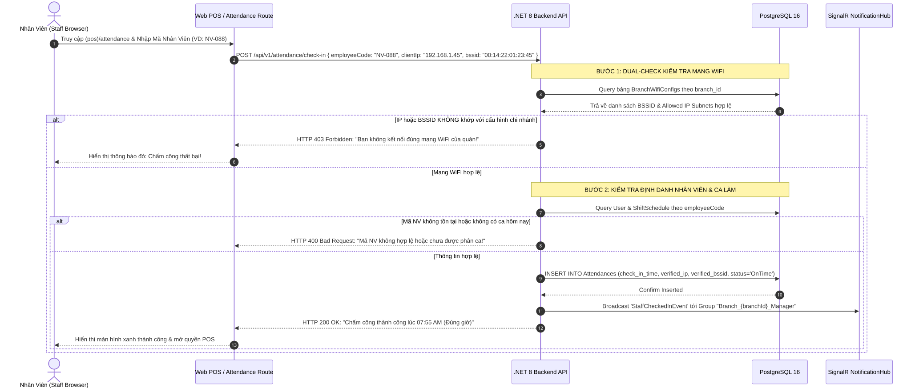

# 🏛️ SƠ ĐỒ THIẾT KẾ KIẾN TRÚC HỆ THỐNG TỔNG QUAN (SYSTEM ARCHITECTURE SPECIFICATION)
## Smart F&B Operating System — AI-Powered QR Order & Multi-Channel Management Platform

> [!NOTE]
> **Tài liệu:** Bản Đặc Tả Thiết Kế Kiến Trúc Hệ Thống Tổng Thể (System Architecture Specification)  
> **Mã tài liệu:** `SPEC-ARCH-V2.5.0` | **Phiên bản:** `v2.5.0-Enterprise-Production-Ready`  
> **Nguồn sự thật tối thượng (Source of Truth):** `Smart_FB_OS_Revised_4members.docx`, `Tong_Quan_Kien_Truc_He_Thong.md`, `Actor_Phan_Quyen_Chuc_Nang.md`, `Workflow_Quy_Trinh_Nghiep_Vu.md`  
> **Quy mô thực thi:** Đồ án Capstone 16 tuần (08 Sprints) — Đội ngũ 4 Kỹ sư Phần mềm (2 Backend + 2 Frontend)  
> **Tech Stack Chuẩn Hóa:**  
> • **Backend:** .NET 8 Web API (C# 12), Clean Architecture 4 Lớp, MediatR 12 (CQRS), FluentValidation 11, Entity Framework Core 8, ASP.NET Core SignalR.  
> • **Frontend:** Next.js 14.2 (App Router Monorepo), React 19, TypeScript 5, TanStack Query v5, Zustand 4, Tailwind CSS, Shadcn UI.  
> • **Data & Caching:** PostgreSQL 16 Enterprise (25 Thực thể 3NF), Redis 7.2 Alpine (L2 Cache, RedLock Distributed Locks, SignalR Backplane).  
> • **AI & Integration:** Google Gemini 1.5 Flash SDK (RAG Chatbot), Apriori / FP-Growth Engine (Combo Mining), PayOS VietQR Webhook, OpenWeatherMap API, AWS S3 / Cloudflare R2 Storage, SMTP / Telegram Alert.

> [!IMPORTANT]
> **NĂM NGUYÊN TẮC KIẾN TRÚC BẤT BIẾN (V2.5.0 INVARIANTS):**
> 1. **Web-First Monorepo (Zero Mobile App):** Hợp nhất 100% cổng vận hành (Customer PWA, Staff Web POS, Kitchen KDS TV, Manager Portal, Admin Portal) vào một dự án Next.js 14 duy nhất phân tách qua 5 Route Groups. **LOẠI BỎ TRIỆT ĐỂ** ứng dụng di động riêng cho nhân viên (Flutter/React Native) và thiết bị POS chuyên dụng đắt đỏ.
> 2. **Chấm Công Khóa Mạng WiFi (WiFi-Locked):** Xóa bỏ hoàn toàn định vị vệ tinh GPS 50m và mã QR động 30s. Chấm công an toàn qua cơ chế Dual-Check: Mạng WiFi chi nhánh (BSSID Access Point / IP Subnet) + Mã số nhân viên.
> 3. **Phân Định Rõ Ràng 3 Kênh Bán:**  
>    - *Dine-In (Tại bàn):* Hỗ trợ 2 nhánh thanh toán độc lập: Nhánh A (VietQR trả trước -> PayOS Webhook xác nhận -> KDS nhận đơn) và Nhánh B (Tiền mặt trả sau -> Đơn vào KDS ngay `Confirmed` -> In hóa đơn kèm VietQR -> Khách trả tiền mặt hoặc quét VietQR trên bill).  
>    - *Delivery (Giao tận nhà):* Quét QR Delivery -> Bắt buộc SĐT + Địa chỉ -> Phí ship cố định 20.000đ -> Bắt buộc 100% VietQR trả trước (Khóa COD).  
>    - *TakeAway (Mang về):* Thu ngân thao tác trên Web POS quầy -> Tra cứu CRM SĐT -> **Chương trình tích 10 ly tặng 1 ly CHỈ ÁP DỤNG DUY NHẤT CHO TAKEAWAY** -> Thu tiền sau bằng Tiền mặt / VietQR quầy.
> 4. **Loại Bỏ Hoàn Toàn Out-of-Scope Features:** Xóa bỏ triệt để tính năng chia sẻ món mạng xã hội (C-23), Push notification khuyến mãi PWA (C-24), ví voucher riêng lẻ và tra cứu calo tách biệt.
> 5. **Zero Placeholders & Chuẩn Hóa C4 Model:** 100% sơ đồ Mermaid (C4 Context, C4 Container, C4 Component), bảng dữ liệu, luồng tương tác và giao tiếp thời gian thực được mô tả chi tiết, hoàn chỉnh và kiểm chứng cú pháp nghiêm ngặt.

---

# 📚 MỤC LỤC KIẾN TRÚC

| STT | Phân Mục Kỹ Thuật | Trọng Tâm Kiến Trúc |
|:---:|---|---|
| **1** | [Tổng Quan Kiến Trúc & Phong Cách Thiết Kế Hệ Thống](#1-tổng-quan-kiến-trúc--phong-cách-thiết-kế-hệ-thống) | Clean Architecture, CQRS MediatR, Web-First, Event-Driven |
| **2** | [Mô Hình C4 Cấp 1: System Context Diagram](#2-mô-hình-c4-cấp-1-system-context-diagram) | Toàn cảnh Hệ thống, 6 Nhóm Tác Nhân & 5 Hệ Thống Tích Hợp Ngoài |
| **3** | [Mô Hình C4 Cấp 2: Container Diagram](#3-mô-hình-c4-cấp-2-container-diagram) | 5 Route Groups Frontend, NGINX WAF, .NET 8 Web API, PostgreSQL 16, Redis 7, AI |
| **4** | [Mô Hình C4 Cấp 3: Component Diagram (.NET 8 Clean Architecture)](#4-mô-hình-c4-cấp-3-component-diagram-net-8-clean-architecture) | Phân rã 4 Lớp: WebApi, Application (CQRS), Domain, Infrastructure |
| **5** | [Thiết Kế Tầng Client: Next.js 14 App Router (5 Route Groups)](#5-thiết-kế-tầng-client-nextjs-14-app-router-5-route-groups) | Đặc tả chi tiết `(customer)`, `(pos)`, `(kitchen)`, `(admin)`, `(auth)` |
| **6** | [Hạ Tầng Giao Tiếp Thời Gian Thực: 4 SignalR Hubs & Redis Backplane](#6-hạ-tầng-giao-tiếp-thời-gian-thực-4-signalr-hubs--redis-backplane) | Endpoints, Connection Groups, Events Emitted/Listened, Auto-Reconnect |
| **7** | [Chiến Lược Caching, Distributed Lock & Data Store (Redis 7 & PostgreSQL 16)](#7-chiến-lược-caching-distributed-lock--data-store-redis-7--postgresql-16) | L1/L2 Caching, RedLock chống Race Condition, 25 Bảng 3NF |
| **8** | [Kiến Trúc Module Trí Tuệ Nhân Tạo (AI Pipelines)](#8-kiến-trúc-module-trí-tuệ-nhân-tạo-ai-pipelines) | AI-1 Gemini 1.5 Flash RAG Chatbot & AI-2 Apriori Market Basket Analysis |
| **9** | [Kiến Trúc 3 Kênh Bán & Luồng Nghiệp Vụ Đặc Thù v2.5.0](#9-kiến-trúc-3-kênh-bán--luồng-nghiệp-vụ-đặc-thù-v250) | State Machines Dine-In 2 nhánh, Delivery 20k, Takeaway 10 ly, WiFi Lock |
| **10** | [Bảo Mật Đa Lớp, Ma Trận Phân Quyền RBAC & Audit Trails](#10-bảo-mật-đa-lớp-ma-trận-phân-quyền-rbac--audit-trails) | Defense-in-Depth, JWT Refresh Token, HMAC Webhook, Audit Log Bất Biến |
| **11** | [Tô-Pô Triển Khai, Hạ Tầng & Non-Functional Requirements (NFRs)](#11-tô-pô-triển-khai-hạ-tầng--non-functional-requirements-nfrs) | Docker Compose Topology, SLAs Hiệu Năng, Scale-Up Extension Points |

---

# 1. TỔNG QUAN KIẾN TRÚC & PHONG CÁCH THIẾT KẾ HỆ THỐNG

Hệ thống **Smart F&B OS** được xây dựng theo phong cách kiến trúc **Clean Architecture (Onion / Hexagonal Architecture)** kết hợp với mô hình xử lý phân tách trách nhiệm **CQRS (Command Query Responsibility Segregation)** và giao tiếp hướng sự kiện thời gian thực **Event-Driven Architecture qua WebSockets**:

```
┌────────────────────────────────────────────────────────────────────────────────────────────────────────┐
│                              6 TRỤ CỘT THIẾT KẾ KIẾN TRÚC (ARCHITECTURAL PILLARS)                      │
├──────────────────────────┬─────────────────────────────────────────────────────────────────────────────┤
│ 1. Web-First Monorepo    │ Hợp nhất 100% ứng dụng vào một Next.js 14 Monorepo (5 Route Groups).        │
│    Zero Hardware Lock-in │ Chạy mượt trên Smartphone, Tablet, PC, Smart TV; không phụ thuộc máy POS cũ.│
├──────────────────────────┼─────────────────────────────────────────────────────────────────────────────┤
│ 2. Clean Architecture    │ Cô lập 100% nghiệp vụ lõi (Domain) khỏi Database, Frameworks và bên thứ 3.  │
│    & Domain Invariants   │ Phụ thuộc một chiều hướng tâm (Dependency Inversion Principle - DIP).       │
├──────────────────────────┼─────────────────────────────────────────────────────────────────────────────┤
│ 3. CQRS & Pipeline Bus   │ Phân tách tuyệt đối luồng Ghi (Command + Transaction) và luồng Đọc (Query). │
│                          │ MediatR Pipeline tích hợp tự động Validation, Logging, Performance, Audit.  │
├──────────────────────────┼─────────────────────────────────────────────────────────────────────────────┤
│ 4. Event-Driven Real-Time│ Đồng bộ trạng thái tức thời (< 500ms) qua 4 SignalR Hubs.                   │
│    Redis Backplane       │ Redis Pub/Sub Backplane sẵn sàng Scale-out đa instance không nghẽn kết nối. │
├──────────────────────────┼─────────────────────────────────────────────────────────────────────────────┤
│ 5. Concurrency Control   │ Sử dụng Redis RedLock Distributed Locks ngăn chặn triệt để Race Conditions  │
│    & Data Integrity      │ (trùng phiên bàn, tranh chấp nguyên liệu BOM, thanh toán lặp, lệch ca két). │
├──────────────────────────┼─────────────────────────────────────────────────────────────────────────────┤
│ 6. Hybrid AI Engine      │ Tích hợp kép: Gemini 1.5 Flash (RAG Tư vấn thực đơn theo thời tiết & CRM)   │
│                          │ và Thuật toán Apriori/FP-Growth (Khai phá Combo tối ưu hóa doanh thu AOV).  │
└──────────────────────────┴─────────────────────────────────────────────────────────────────────────────┘
```

---

# 2. MÔ HÌNH C4 CẤP 1: SYSTEM CONTEXT DIAGRAM

Sơ đồ ngữ cảnh C4 (Level 1) định vị hệ thống Smart F&B OS trong mối tương quan với **6 nhóm người dùng hệ thống** và **5 hệ sinh thái dịch vụ bên ngoài**:



---

# 3. MÔ HÌNH C4 CẤP 2: CONTAINER DIAGRAM

Sơ đồ C4 Container (Level 2) phân rã toàn bộ các thành phần phần mềm, công nghệ giao tiếp, cổng mạng và ranh giới bảo mật trong hệ thống:



---

# 4. MÔ HÌNH C4 CẤP 3: COMPONENT DIAGRAM (.NET 8 CLEAN ARCHITECTURE)

Tầng Backend được tổ chức nghiêm ngặt theo **Clean Architecture (4 Lớp)**. Quy tắc bất biến: Các lớp bên ngoài phụ thuộc vào các lớp bên trong, tầng Domain nằm ở lõi trung tâm và tuyệt đối không phụ thuộc vào bất kỳ framework bên ngoài nào:



---

# 5. THIẾT KẾ TẦNG CLIENT: NEXT.JS 14 APP ROUTER (5 ROUTE GROUPS)

Tầng giao diện người dùng được tổ chức theo kiến trúc **Next.js 14 App Router Monorepo** với 5 Route Groups phân định ranh giới chức năng và trải nghiệm người dùng:

```
frontend/
├── src/
│   ├── app/
│   │   ├── (auth)/                           # [CỔNG ĐĂNG NHẬP TẬP TRUNG]
│   │   │   ├── login/                        # Đăng nhập Nhân viên, Quản lý, Admin (JWT + Role Dispatch)
│   │   │   └── forgot-password/              # Khôi phục mật khẩu qua Email OTP
│   │   │
│   │   ├── (customer)/                       # [ACTOR 1: KHÁCH HÀNG - PWA Mobile-First]
│   │   │   ├── menu/                         # Duyệt thực đơn QR Bàn, chọn Size/Đường/Đá/Topping
│   │   │   ├── cart/                         # Giỏ hàng: Áp voucher, chọn VietQR trả trước / Tiền mặt trả sau
│   │   │   ├── delivery/                     # Form đặt hàng giao tận nơi (SĐT + Địa chỉ + Phí ship cố định 20k)
│   │   │   ├── tracking/[orderId]/           # Theo dõi tiến độ đơn hàng thời gian thực qua SignalR
│   │   │   ├── ai-consultant/                # Chatbot RAG Gemini 1.5 Flash tư vấn khẩu vị & năng lượng món
│   │   │   └── review/[orderId]/             # Đánh giá 1-5 sao, viết nhận xét & tải ảnh chụp thực tế
│   │   │
│   │   ├── (pos)/                            # [ACTOR 2: NHÂN VIÊN QUẦY - Web Responsive POS]
│   │   │   ├── pos/                          # Web POS Quầy: Bán mang về (Takeaway), tra cứu CRM SĐT tích 10 ly
│   │   │   ├── tables/                       # Sơ đồ mặt bằng bàn trực quan, tiếp nhận chuông gọi phục vụ bàn
│   │   │   ├── cash-payment/                 # Xác nhận thu tiền mặt đơn Dine-in Nhánh B & Takeaway
│   │   │   └── attendance/                   # Chấm công khóa mạng WiFi (Xác thực IP/BSSID + Mã NV)
│   │   │
│   │   ├── (kitchen)/                        # [ACTOR 2: BARISTA / ĐẦU BẾP - Web KDS TV Fullscreen]
│   │   │   ├── queue/                        # Hàng đợi đơn hàng thời gian thực (Gom nhóm món, xem công thức BOM)
│   │   │   └── 86-toggle/                    # Nút gạt bật/tắt trạng thái hết hàng tức thì của món tại quầy bar
│   │   │
│   │   └── (admin)/                          # [ACTOR 3 & 4: QUẢN LÝ CHI NHÁNH & CHỦ CHUỖI]
│   │       ├── shifts/                       # Mở ca đầu ngày, kết ca kiểm đếm két tiền mặt & ký Z-Report
│   │       ├── inventory/                    # Lập phiếu xuất quầy bar, nhập kho NCC, kiểm kê hao hụt BOM
│   │       ├── wifi-config/                  # Khai báo danh sách BSSID Access Point & IP Subnet chấm công
│   │       ├── reviews/                      # Tiếp nhận Alert review <= 2 sao khẩn cấp & duyệt ảnh review
│   │       ├── menu-management/              # Full CRUD Món ăn, Danh mục, Định lượng BOM từng Size
│   │       ├── dynamic-pricing/              # Thiết lập bảng giá theo nhóm chi nhánh (Sân bay, Phố, Tỉnh)
│   │       ├── ai-combo-mining/              # Phê duyệt các gợi ý Combo khai phá bởi thuật toán Apriori
│   │       ├── reports-pnl/                  # Dashboard P&L hợp nhất toàn chuỗi (Doanh thu, COGS, Lãi gộp)
│   │       └── branches-rbac/                # Quản lý danh mục chi nhánh, tài khoản & phân quyền RBAC
│   │
│   ├── components/                           # Shadcn UI, Data Grid, Recharts, POS Keypad, Dialogs
│   ├── hooks/                                # useSignalR, useCart, usePosCart, useWifiAttendance, useKdsQueue
│   ├── stores/                               # Zustand: cartStore, posStore, shiftStore, authStore
│   └── lib/                                  # Axios API Client, SignalR Factory, Crypto Utils, Formatters
```

### Bảng Chi Tiết Công Nghệ & Vai Trò 5 Route Groups:

| Route Group | Actor Mục Tiêu | Thiết Bị Tối Ưu | Tech Stack Thành Phần | Trách Nhiệm Kỹ Thuật Chính |
|---|---|---|---|---|
| **`(customer)`** | Khách Hàng Ăn Tại Bàn & Đặt Về | Smartphone (iOS/Android Safari/Chrome) | React 19, Zustand (`cartStore`), Tailwind CSS, `@microsoft/signalr` | Trải nghiệm PWA không cần cài đặt; Quét QR Bàn / QR Delivery; Thanh toán VietQR; Chat RAG AI; Nhận push cập nhật trạng thái đơn hàng. |
| **`(pos)`** | Thu Ngân & Phục Vụ Quầy | Tablet / PC Cảm ứng Quầy Thu ngân | TanStack Query v5, Zustand (`posStore`), Shadcn UI, Lucide Icons | Nhập đơn Takeaway siêu tốc; Tra cứu CRM SĐT và áp dụng cơ chế 10 ly tặng 1; Theo dõi sơ đồ bàn; Chấm công WiFi. |
| **`(kitchen)`** | Barista & Đầu Bếp | Smart TV / Tablet Bếp Màn hình lớn | SignalR Real-time, Web Audio API, Fullscreen API, CSS Grid | Hiển thị vé đơn hàng KDS tự động cuộn; Báo âm thanh chuông khi có đơn mới; Hiển thị định lượng BOM; Bật/tắt 86-out. |
| **`(admin)`** | Quản Lý Chi Nhánh & Chủ Chuỗi | Desktop / Laptop / Máy tính bảng | Shadcn UI Data Table, TanStack Table, Recharts, React Hook Form, Zod | Mở/kết ca két tiền Z-Report; Quản lý kho nguyên liệu BOM; Cấu hình WiFi chấm công; Full CRUD Menu/BOM; Phê duyệt AI Combo; Báo cáo P&L. |
| **`(auth)`** | Toàn Bộ Nhân Sự & Quản Trị | Mọi Thiết Bị Trình Duyệt | Next.js Server Actions, JWT Decoder, Cookies Manager | Xác thực thông tin đăng nhập; Kiểm tra phân quyền RBAC; Tự động điều hướng đúng Route Group theo vai trò sau khi đăng nhập. |

---

# 6. HẠ TẦNG GIAO TIẾP THỜI GIAN THỰC: 4 SIGNALR HUBS & REDIS BACKPLANE

Hệ thống thiết lập **4 SignalR Hubs chuyên biệt** chạy trên nền tảng **Redis 7 Pub/Sub Backplane**, đảm bảo độ trễ truyền thông `< 500ms` và hỗ trợ mở rộng không giới hạn số lượng instances Web API:



### Bảng Đặc Tả Chi Tiết 4 SignalR Hubs:

| Tên Hub & URL | Connection Groups | Events Bắn Từ Server (Server-to-Client) | Events Lắng Nghe Từ Client (Client-to-Server) | Payload Dữ Liệu Chi Tiết |
|---|---|---|---|---|
| **`OrderHub`**<br>`/hubs/orders` | `Order_{orderId}`<br>`Customer_{phone}` | • `OrderStatusUpdated`<br>• `OrderReady`<br>• `EstimatedTimeAdjusted` | • `JoinOrderGroup(orderId)`<br>• `LeaveOrderGroup(orderId)` | `{ orderId, orderCode, status, estimatedMinutes, queuePosition, updatedAtUtc }` |
| **`KitchenHub`**<br>`/hubs/kitchen` | `Branch_{branchId}_Kitchen`<br>`Station_{stationId}` | • `NewPaidOrder`<br>• `OrderConfirmedCash`<br>• `Item86Toggled`<br>• `ItemBatchUpdated` | • `JoinKitchenGroup(branchId)`<br>• `UpdateItemStatus(orderItemId, status)`<br>• `Toggle86Product(productId, isAvailable)` | `{ ticketId, orderCode, orderType, tableNumber, items: [{ name, size, notes, bom }], createdAt }` |
| **`PaymentHub`**<br>`/hubs/payments` | `Payment_{orderId}` | • `PaymentSucceeded`<br>• `PaymentFailed`<br>• `PaymentExpired` | • `JoinPaymentGroup(orderId)`<br>• `LeavePaymentGroup(orderId)` | `{ orderId, orderCode, amount, transactionCode, paymentMethod, paidAtUtc }` |
| **`NotificationHub`**<br>`/hubs/notifications` | `Branch_{branchId}_Staff`<br>`Branch_{branchId}_Manager`<br>`Chain_Admin` | • `ServiceRequested`<br>• `ServiceCallResolved`<br>• `LowRatingAlert`<br>• `CashVarianceAlert`<br>• `InventoryShortageAlert` | • `JoinBranchNotifications(branchId)`<br>• `CallWaiter(tableId, message)`<br>• `ResolveServiceCall(callId)` | `{ branchId, tableNumber, reason, ratingStars, comment, varianceAmount, ingredientName, timestamp }` |

---

# 7. CHIẾN LƯỢC CACHING, DISTRIBUTED LOCK & DATA STORE (REDIS 7 & POSTGRESQL 16)



### 7.1. Bảng Cấu Trúc Khóa Caching & Chiến Lược Invalidation Redis 7

| Loại Dữ Liệu Caching | Key Pattern Trong Redis | TTL Mặc Định | Chiến Lược Cập Nhật / Invalidation (Cache Invalidation Policy) |
|---|---|---|---|
| **Thực Đơn Chi Nhánh** | `menu:branch:{branchId}` | 24 Giờ | Invalidate ngay khi Admin đổi giá, sửa món, hoặc Barista bấm nút **86-Toggle** hết hàng. |
| **Danh Mục Thực Đơn** | `categories:active` | 24 Giờ | Invalidate khi Admin thêm, sửa, đổi thứ tự hiển thị (`display_order`) danh mục. |
| **Bảng Giá Theo Vùng** | `pricing:group:{priceGroupId}` | 24 Giờ | Invalidate khi Admin điều chỉnh hệ số giá vùng chi nhánh. |
| **Hồ Sơ Loyalty CRM** | `crm:customer:{phoneNumber}` | 1 Giờ | Invalidate ngay khi có giao dịch Takeaway tích lũy ly mới hoặc đổi ly thành công. |
| **Cấu Hình WiFi Chi Nhánh** | `wifi:branch:{branchId}` | 12 Giờ | Invalidate khi Quản lý chi nhánh cập nhật BSSID Router hoặc IP Subnet chấm công. |

### 7.2. Bảng Phân Bổ Distributed RedLock Chống Race Conditions

| Tên Khóa Phân Tán | Cấu Trúc Khóa (Key Pattern) | Thời Gian Khóa (Expiry) | Mục Đích Ngăn Chặn Race Condition |
|---|---|---|---|
| **Table Session Lock** | `lock:table:{tableId}` | 15 Giây | Chặn xung đột khi 2 khách hàng cùng quét QR tại cùng một bàn và tạo đơn đồng thời. |
| **Inventory BOM Lock** | `lock:inventory:{ingredientId}` | 10 Giây | Ngăn chặn trừ âm kho nguyên liệu khi nhiều đơn hàng có cùng công thức được xác nhận cùng lúc. |
| **Payment Process Lock** | `lock:payment:order:{orderId}` | 30 Giây | Chặn xử lý trùng lặp giao dịch khi PayOS Webhook bắn lại hoặc nhân viên xác nhận tiền mặt trùng. |
| **Shift Management Lock** | `lock:shift:cashier:{cashierId}` | 15 Giây | Chặn nhân viên mở hoặc kết ca két đồng thời trên nhiều thiết bị trình duyệt khác nhau. |

---

# 8. KIẾN TRÚC MODULE TRÍ TUỆ NHÂN TẠO (AI PIPELINES)



---

# 9. KIẾN TRÚC 3 KÊNH BÁN & LUỒNG NGHIỆP VỤ ĐẶC THÙ V2.5.0

### 9.1. State Machine Dine-In 2 Nhánh Độc Lập



### 9.2. Ma Trận So Sánh Kỹ Thuật 3 Kênh Bán Hàng

| Tiêu Chí Kỹ Thuật | Kênh 1: Ăn Tại Bàn (Dine-In) | Kênh 2: Giao Hàng (QR Delivery) | Kênh 3: Mang Về (TakeAway POS) |
|---|---|---|---|
| **Hình Thức Khởi Tạo** | Khách quét mã QR dán tại bàn (`table_id`) | Khách quét mã QR Poster / Banner quảng cáo | Nhân viên thao tác trực tiếp trên Web POS Quầy |
| **Dữ Liệu Bắt Buộc** | `branch_id`, `table_id`, danh sách món | `branch_id`, `recipient_phone`, `delivery_address` | `branch_id`, `customer_phone` (để tra cứu CRM) |
| **Phí Vận Chuyển** | 0 VNĐ | **Cố định 20.000 VNĐ** (cộng tự động vào đơn) | 0 VNĐ |
| **Chính Sách Thanh Toán** | • Nhánh A: 100% VietQR trước<br>• Nhánh B: Tiền mặt / VietQR sau | **Bắt buộc 100% VietQR trả trước** (Khóa COD hoàn toàn) | Thu tiền sau khi pha chế xong (Tiền mặt / VietQR) |
| **Chương Trình 10 Ly Tặng 1** | ❌ **KHÔNG ÁP DỤNG** (Không tích lũy / đổi ly) | ❌ **KHÔNG ÁP DỤNG** (Không tích lũy / đổi ly) | ✅ **ÁP DỤNG DUY NHẤT** (Tích ly & Đổi ly miễn phí) |
| **Thời Điểm Vào KDS Bếp** | • Nhánh A: Sau khi PayOS báo Paid<br>• Nhánh B: Vào bếp ngay khi bấm đặt món | Vào bếp sau khi PayOS báo Paid | Vào bếp ngay khi thu ngân bấm xác nhận đơn |

### 9.3. Kiến Trúc Chấm Công Khóa Mạng WiFi (WiFi-Locked Attendance)



---

# 10. BẢO MẬT ĐA LỚP, MA TRẬN PHÂN QUYỀN RBAC & AUDIT TRAILS

```
┌────────────────────────────────────────────────────────────────────────────────────────────────────────┐
│                              MÔ HÌNH BẢO MẬT PHÒNG THỦ CHIỀU SÂU (6 LỚP)                                │
├──────────────────────────┬─────────────────────────────────────────────────────────────────────────────┤
│ 1. Edge & WAF Layer      │ Cloudflare WAF, NGINX SSL Termination (TLS 1.3), Chống DDoS Lớp 7,          │
│                          │ Rate Limiting phân tầng (60 req/min Khách hàng, 300 req/min POS quầy).      │
├──────────────────────────┼─────────────────────────────────────────────────────────────────────────────┤
│ 2. Network Isolation     │ Mạng nội bộ Docker Bridge Network: PostgreSQL (5432) và Redis (6379)        │
│                          │ bị khóa cổng từ Internet, chỉ cho phép Container Backend API kết nối.       │
├──────────────────────────┼─────────────────────────────────────────────────────────────────────────────┤
│ 3. Identity & JWT RBAC   │ Access Token (RS256/HS256, TTL 60 phút) + Refresh Token Rotation lưu Redis. │
│                          │ Phân quyền Claims-based trên 5 vai trò chính thức.                          │
├──────────────────────────┼─────────────────────────────────────────────────────────────────────────────┤
│ 4. Webhook Integrity     │ Xác thực chữ ký số HMAC-SHA256 bí mật cho mọi callback từ PayOS VietQR.     │
│                          │ Chống tấn công giả mạo biến động số dư hoặc lặp gói tin (Replay Attack).   │
├──────────────────────────┼─────────────────────────────────────────────────────────────────────────────┤
│ 5. Data Sanitation       │ 100% truy vấn DB tham số hóa qua EF Core 8 (Chống SQL Injection).           │
│                          │ FluentValidation lọc sạch XSS payload trong dữ liệu đầu vào.                │
├──────────────────────────┼─────────────────────────────────────────────────────────────────────────────┤
│ 6. Immutable Audit Trail │ Ghi nhật ký bất biến vào bảng AuditLogs cho mọi hành vi nhạy cảm: đổi giá, │
│                          │ sửa định mức BOM, kết ca két tiền, xóa món ăn, cấu hình lại mạng WiFi.      │
└──────────────────────────┴─────────────────────────────────────────────────────────────────────────────┘
```

### Bảng Ma Trận Phân Quyền Chi Tiết (RBAC Matrix):

| Nhóm Tài Nguyên API | Khách Hàng (`Customer`) | Thu Ngân / Phục Vụ (`Staff`) | Barista / Bếp (`Barista`) | Quản Lý Chi Nhánh (`Manager`) | Chủ Chuỗi (`Admin`) |
|---|:---:|:---:|:---:|:---:|:---:|
| **Auth & Profile** | Đăng nhập SĐT / OTP | Đăng nhập Mã NV | Đăng nhập Mã NV | Đăng nhập Email/2FA | Toàn quyền Quản trị |
| **Dine-in / Delivery Menu** | Xem / Đặt món | Xem / Đặt món | Xem đơn KDS | Xem / Khóa món | Toàn quyền CRUD |
| **Takeaway POS & 10 Ly** | ❌ Không có quyền | Toàn quyền Bán POS | ❌ Không có quyền | Xem báo cáo POS | Toàn quyền Quản trị |
| **KDS Queue & 86-Toggle** | ❌ Không có quyền | Xem trạng thái món | Toàn quyền KDS / 86 | Toàn quyền Giám sát | Toàn quyền Quản trị |
| **Ca Két Tiền & Z-Report** | ❌ Không có quyền | Khai báo tiền ca | ❌ Không có quyền | Mở/Kết ca & Ký duyệt | Xem P&L hợp nhất |
| **Kho Nguyên Liệu & BOM** | ❌ Không có quyền | Xem tồn quầy bar | Xem công thức BOM | Xuất/Nhập/Kiểm kê | CRUD Công thức BOM |
| **Chấm Công Khóa WiFi** | ❌ Không có quyền | Check-in / Check-out | Check-in / Check-out | Cấu hình BSSID/IP | Xem toàn chuỗi |
| **AI Combo & Dynamic Price** | Xem gợi ý RAG | ❌ Không có quyền | ❌ Không có quyền | Xem bảng giá vùng | Duyệt AI-2 / Đổi giá |
| **Báo Cáo P&L & Doanh Thu** | ❌ Không có quyền | Xem doanh thu ca | ❌ Không có quyền | Báo cáo chi nhánh | Báo cáo chuỗi hợp nhất |

---

# 11. TÔ-PÔ TRIỂN KHAI, HẠ TẦNG & NON-FUNCTIONAL REQUIREMENTS (NFRS)

### 11.1. Sơ Đồ Tô-Pô Triển Khai Thực Tế (Docker Compose Topology)



### 11.2. Tiêu Chuẩn Đặc Tả Phi Chức Năng (Non-Functional SLAs)

```
┌────────────────────────────────────────────────────────────────────────────────────────────────────────┐
│                        MA TRẬN TIÊU CHUẨN PHI CHỨC NĂNG (NON-FUNCTIONAL SLAs)                          │
├────────────────────┬───────────────────────────────────────────────────────────────────────────────────┤
│ 1. Hiệu Năng       │ • P95 API Response Time < 200ms đối với các tác vụ Đọc/Ghi dữ liệu thông thường.  │
│    (Performance)   │ • SignalR WebSocket Event Latency < 500ms từ PayOS Webhook tới Màn hình Bếp KDS.  │
│                    │ • AI Chatbot RAG Response Latency < 1.5 giây cho toàn bộ câu trả lời tư vấn món. │
│                    │ • Khả năng chịu tải đồng thời: Tối thiểu 500 CCU / Chi nhánh mà không suy giảm.   │
├────────────────────┼───────────────────────────────────────────────────────────────────────────────────┤
│ 2. Tính Sẵn Sàng   │ • Cam kết Uptime hệ thống >= 99.9% trong khung giờ hoạt động của quán (06:00-23:00│
│    (Availability)  │ • Graceful Fallback: Nếu AI Gemini lỗi/timeout, hệ thống tự động trả Best-Sellers│
│                    │ • SignalR Auto-Reconnect với cơ chế thử lại theo hàm mũ (Exponential Backoff).    │
├────────────────────┼───────────────────────────────────────────────────────────────────────────────────┤
│ 3. Tính Toàn Vẹn   │ • 100% giao dịch tạo đơn, trừ kho BOM và ca két được bảo vệ bởi ACID Transaction. │
│    & Nhất Quán     │ • RedLock ngăn chặn 100% tình trạng đặt trùng bàn hoặc trừ âm kho nguyên liệu.    │
├────────────────────┼───────────────────────────────────────────────────────────────────────────────────┤
│ 4. Khả Năng Mở     │ • Kiến trúc Stateless Web API cho phép nhân bản (Scale Out) thêm container dễ dàng│
│    Rộng (Scale)    │ • Redis Pub/Sub Backplane đảm bảo broadcast đồng bộ trên nhiều API servers.       │
│                    │ • Sẵn sàng phân tách Read/Write Database Replicas khi mở rộng trên 50 chi nhánh.  │
└────────────────────┴───────────────────────────────────────────────────────────────────────────────────┘
```

### 11.3. Ma Trận Ranh Giới Phạm Vi & Điểm Nối Tương Lai (Scale-Up Matrix)

| Phân Hệ / Tính Năng | 16-Tuần 4-Thành Viên MVP (Active v2.5.0) | Scale Up / Future Work | C# Interface Điểm Nối Mở Rộng |
|---|:---:|:---:|---|
| **Đặt Món Tại Bàn (Dine-In)** | ✅ 2 Nhánh (VietQR trước / Tiền mặt sau) | — | Nghiệp vụ cốt lõi tại chỗ. |
| **Giao Hàng Tận Nơi (Delivery)** | ✅ SĐT + Địa chỉ, Phí 20k, 100% VietQR | 🔮 Tích hợp AhaMove / GrabExpress | `IDeliveryDispatchPartner` |
| **Bán Mang Về (Takeaway)** | ✅ Web POS, Tích 10 ly, Thu tiền sau | — | Nghiệp vụ thu ngân quầy. |
| **Chấm Công Nhân Viên** | ✅ Khóa Mạng WiFi (BSSID/IP + Mã NV) | 🔮 Sinh trắc học FaceID | `IBiometricAttendanceProvider` |
| **Ứng Dụng Nhân Viên** | ✅ 100% Web Responsive (KDS & POS) | ❌ XÓA Staff Mobile App | Loại bỏ hoàn toàn App di động. |
| **AI-1: Tư Vấn Khẩu Vị RAG** | ✅ Gemini 1.5 Flash + Context Menu | — | `IGeminiAiClient` |
| **AI-2: Khai Phá Combo Món** | ✅ Apriori / FP-Growth + Admin duyệt | — | `IAssociationRuleMiner` |
| **AI-3: Hỏi Đáp Số Liệu Kinh Doanh** | — | 🔮 Text-to-SQL Analytics | `ITextToSqlAnalyticsEngine` |
| **AI-4: Dự Báo Rời Bỏ (Churn)** | — | 🔮 XGBoost / Random Forest RFM | `IChurnPredictionEngine` |
| **AI-5: Dự Báo Nhu Cầu Món** | — | 🔮 Demand Forecasting & Auto PO | `IDemandForecastingEngine` |
| **Đồng Bộ Offline Mesh P2P** | — | 🔮 IndexedDB ServiceWorker Sync | Hoạt động qua Internet ổn định. |

---

> [!TIP]
> **Kết Luận Kiến Trúc:** Bản đặc tả kiến trúc tổng quan v2.5.0 đã hoàn chỉnh 100%, bảo đảm tính nhất quán tuyệt đối với các bản đặc tả gốc, sẵn sàng làm kim chỉ nam kỹ thuật cho toàn bộ giai đoạn triển khai mã nguồn Backend (.NET 8), Frontend (Next.js 14 Monorepo), Hạ tầng (Docker & NGINX) và Tích hợp Trí tuệ Nhân tạo.
