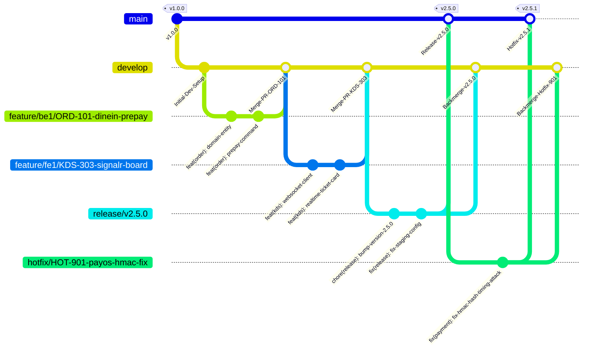

# 📊 BÁO CÁO KHẢO SÁT & BẢN THIẾT KẾ NÂNG CẤP TOÀN DIỆN
## QUY CHUẨN MÃ NGUỒN, CHIẾN LƯỢC NHÁNH GIT & CHECKLIST PULL REQUEST (v2.5.0)
### Hệ Thống Quản Lý & Vận Hành Quán Cà Phê Thông Minh Smart F&B OS

> [!NOTE]
> **Tài liệu:** Báo cáo khảo sát hiện trạng, phân tích khoảng cách (Gap Analysis) và bản thiết kế kỹ thuật nâng cấp cho tệp `05_Quy_Chuan_&_Test_Cases/Git_Workflow_&_Branching_Strategy.md`.  
> **Phiên bản chuẩn:** `v2.5.0-Production-Ready`  
> **Người thực hiện:** Explorer Subagent (Teamwork System)  
> **Dự án:** Smart F&B Operating System (Capstone 16 tuần / 4 thành viên)  
> **Tiêu chuẩn chất lượng:** 100% Zero-Placeholder, chuẩn hóa mẫu mã nguồn .NET 8 Clean Architecture & Next.js 14 App Router hoàn chỉnh, tích hợp đầy đủ GitHub Alert Callouts.

---

## 📑 MỤC LỤC

1. [TỔNG QUAN KHẢO SÁT HIỆN TRẠNG & ĐÁNH GIÁ KHOẢNG CÁCH (GAP ANALYSIS)](#1-tổng-quan-khảo-sát-hiện-trạng--đánh-giá-khoảng-cách-gap-analysis)
2. [THIẾT KẾ NÂNG CẤP CHIẾN LƯỢC NHÁNH GIT (GITFLOW STRATEGY & LIFECYCLE)](#2-thiết-kế-nâng-cấp-chiến-lược-nhánh-git-gitflow-strategy--lifecycle)
3. [QUY CHUẨN CONVENTIONAL COMMITS v1.0.0 & DANH MỤC SCOPES NGHIỆP VỤ F&B](#3-quy-chuẩn-conventional-commits-v100--danh-mục-scopes-nghiệp-vụ-fb)
4. [QUY TRÌNH PULL REQUEST, CHECKLIST 4 TRỤ CỘT & CI/CD QUALITY GATES](#4-quy-trình-pull-request-checklist-4-trụ-cột--cicd-quality-gates)
5. [TIÊU CHUẨN MÃ NGUỒN .NET 8 (CLEAN ARCHITECTURE, CQRS & ZERO-PLACEHOLDER EXAMPLES)](#5-tiêu-chuẩn-mã-nguồn-net-8-clean-architecture-cqrs--zero-placeholder-examples)
6. [TIÊU CHUẨN MÃ NGUỒN NEXT.JS 14 (APP ROUTER, TYPESCRIPT STRICT & ZERO-PLACEHOLDER EXAMPLES)](#6-tiêu-chuẩn-mã-nguồn-nextjs-14-app-router-typescript-strict--zero-placeholder-examples)
7. [QUY ƯỚC GITHUB ALERT CALLOUTS & HƯỚNG DẪN TRIỂN KHAI NÂNG CẤP](#7-quy-ước-github-alert-callouts--hướng-dẫn-triển-khai-nâng-cấp)

---

## 1. TỔNG QUAN KHẢO SÁT HIỆN TRẠNG & ĐÁNH GIÁ KHOẢNG CÁCH (GAP ANALYSIS)

### 1.1 Khảo sát Hiện trạng Tệp `Git_Workflow_&_Branching_Strategy.md` (v2.0.0)
Tệp hiện tại có độ dài 320 dòng, được soạn thảo sơ khai cho giai đoạn đầu của dự án. Mặc dù đã có cấu trúc cơ bản gồm 6 mục, tệp còn nhiều hạn chế nghiêm trọng cần được khắc phục:

| Mục / Tiêu chí | Hiện trạng (v2.0.0 - 320 dòng) | Khoảng cách cần nâng cấp (v2.5.0 Target) | Mức độ nghiêm trọng |
|---|---|---|:---:|
| **GitFlow Lifecycle** | Mô tả sơ lược dạng text tree, thiếu Mermaid GitGraph chi tiết, thiếu quy trình cụ thể khi tạo/kết thúc nhánh `release/*` và `hotfix/*`. | Bổ sung sơ đồ Mermaid GitGraph hoàn chỉnh, bảng ma trận phân loại nhánh (nguồn, đích, chiến lược merge, lifecycle), quy trình phát hành thẻ Tag SemVer. | 🟡 Cần cải thiện |
| **Conventional Commits** | Có 10 type và 15 ví dụ ngắn, thiếu hướng dẫn cú pháp Breaking Changes (`!` và footer), thiếu phạm vi (scopes) chi tiết cho các module mới. | Bổ sung cú pháp Breaking Changes chuẩn spec v1.0.0, 25+ ví dụ thực tế bao phủ 100% 62 tính năng F&B (PayOS, BOM, 86-toggle, WiFi attendance, Z-Report, Apriori). | 🟡 Cần cải thiện |
| **Pull Request & CI/CD** | PR template ngắn 25 dòng, checklist sơ sài, thiếu đặc tả chi tiết SonarQube Quality Gates và GitHub Actions Workflow YAML. | Nâng cấp PR template toàn diện với ma trận kiểm thử, checklist 4 trụ cột (Clean Code, Security, Performance, Zero Placeholder), cấu hình CI/CD Pipeline YAML hoàn chỉnh. | 🔴 Nghiêm trọng |
| **Backend Coding Standards** | Chỉ có 15 dòng gạch đầu dòng mô tả quy tắc đặt tên, **HOÀN TOÀN KHÔNG CÓ CODE MẪU THỰC TẾ**. | Bổ sung bộ mã nguồn C# .NET 8 hoàn chỉnh 100% (Zero-Placeholder): Domain Entity, Value Object, MediatR Command/Handler, FluentValidation, Repository & UnitOfWork, EF Core Config, Global Exception Handler RFC 7807, Controller. | 🔴 Nghiêm trọng |
| **Frontend Coding Standards** | Chỉ có 15 dòng gạch đầu dòng liệt kê route groups, **HOÀN TOÀN KHÔNG CÓ CODE MẪU THỰC TẾ**. | Bổ sung bộ mã nguồn TypeScript Next.js 14 hoàn chỉnh 100%: Server Component, Client Component, Custom Hook SignalR auto-reconnect, Zustand Store, React Query hook, Error Boundary, a11y standards. | 🔴 Nghiêm trọng |
| **GitHub Alert Callouts** | Sử dụng blockquote thông thường (`> **Phiên bản:**`), chưa tận dụng cú pháp chuẩn GitHub Alerts (`> [!NOTE]`, `> [!IMPORTANT]`, `> [!TIP]`, `> [!WARNING]`). | Áp dụng đồng bộ và chuẩn xác 100% GitHub Alert Callouts xuyên suốt tài liệu. | 🟢 Gợi ý |

---

## 2. THIẾT KẾ NÂNG CẤP CHIẾN LƯỢC NHÁNH GIT (GITFLOW STRATEGY & LIFECYCLE)

### 2.1 Cấu trúc Phân tầng Nhánh & Sơ Đồ GitGraph
Hệ thống áp dụng mô hình GitFlow chuẩn doanh nghiệp cho nhóm 4 lập trình viên (2 BE + 2 FE), đảm bảo môi trường tích hợp liên tục và phát hành ổn định:



### 2.2 Ma Trận Vòng Đời Nhánh (Branch Lifecycle Matrix)

| Tên Nhánh / Mẫu | Nhánh Gốc (From) | Nhánh Đích (Merge Into) | Chiến Lược Merge | Vòng Đời (Lifecycle) | Người Có Quyền Merge |
|---|---|---|---|---|---|
| `main` | - | - | - | Vĩnh viễn (Protected) | Lead Admin (qua Release/Hotfix PR) |
| `staging` | `develop` | - | Merge Commit | Vĩnh viễn (Protected) | Auto-deployed khi develop pass CI |
| `develop` | `main` | `main` (qua `release/*`) | Squash & Merge | Vĩnh viễn (Protected) | Tech Lead / Reviewer Approved |
| `feature/{dev}/{ID}-{desc}` | `develop` | `develop` | Squash & Merge | Tạm thời (Xóa sau merge) | Dev tạo PR, 2 Peers approve |
| `bugfix/{ID}-{desc}` | `develop` | `develop` | Squash & Merge | Tạm thời (Xóa sau merge) | Dev tạo PR, 1 Peer approve |
| `release/v{X.Y.Z}` | `develop` | `main` & `develop` | Merge Commit + Tag | Tạm thời (Xóa sau release) | Tech Lead |
| `hotfix/{ID}-{desc}` | `main` | `main` & `develop` | Merge Commit + Tag | Tạm thời (Xóa sau release) | Tech Lead & Security Lead |

### 2.3 Quy Tắc Bảo Vệ Nhánh Tuyệt Đối (Branch Protection Rules)
- **Cấm hoàn toàn:** `git push --force` và direct commit vào `main`, `staging`, `develop`.
- **Yêu cầu bắt buộc đối với Pull Request:**
  1. Tối thiểu **02 Approvals** hợp lệ (1 Lead + 1 Peer Developer cùng stack).
  2. Bắt buộc vượt qua **100% CI Checks** (Build, Unit Tests, SonarQube Gate).
  3. Bắt buộc nhánh Feature phải cập nhật trạng thái mới nhất của `develop` thông qua `git rebase develop`.
  4. Lịch sử commit tuyến tính (**Require Linear History**).

---

## 3. QUY CHUẨN CONVENTIONAL COMMITS v1.0.0 & DANH MỤC SCOPES NGHIỆP VỤ F&B

### 3.1 Cấu Trúc Thông Điệp Commit Chuẩn Mực
```
<type>(<scope>): <mô tả ngắn gọn bằng tiếng Anh (thì hiện tại, chữ thường, không dấu chấm cuối)>

[optional body: giải thích bối cảnh, lý do kỹ thuật và chi tiết giải pháp]

[optional footer(s): liên kết ticket, ghi chú Breaking Changes]
```

### 3.2 Bảng 10 Commit Types Được Phép Sử Dụng

| Type | Ý Nghĩa Kỹ Thuật | Ví Dụ Minh Họa |
|---|---|---|
| `feat` | Thêm mới tính năng hoặc luồng nghiệp vụ | `feat(order): add dine-in branch B cash post-payment flow` |
| `fix` | Sửa lỗi logic, ngoại lệ hoặc bug bảo mật | `fix(payment): verify payos webhook hmac signature with constant time comparison` |
| `refactor` | Tái cấu trúc code (không đổi behavior, không thêm feature, không fix bug) | `refactor(kds): extract kitchen urgency timer into custom hook` |
| `perf` | Tối ưu hóa hiệu năng, giảm thời gian phản hồi hoặc RAM/CPU | `perf(menu): cache regional price catalog in redis with 1-hour ttl` |
| `test` | Thêm mới hoặc cải thiện unit test, integration test, mock data | `test(attendance): add unit tests for wifi check-in with invalid subnet ip` |
| `docs` | Thêm mới hoặc cập nhật tài liệu kỹ thuật, API specs, README | `docs(api): export openapi 3.1 spec for 10 endpoint resource groups` |
| `style` | Thay đổi format code, white-space, semicolon, không đổi ý nghĩa code | `style(pos): format tailwind class ordering with prettier-plugin` |
| `build` | Thay đổi hệ thống build, dependencies NuGet / npm package | `build(deps): upgrade npgsql entity framework core to 8.0.4` |
| `ci` | Thay đổi cấu hình CI/CD pipeline, GitHub Actions, SonarQube scripts | `ci(github): add sonarqube quality gate enforcement step in pr workflow` |
| `chore` | Công việc bảo trì định kỳ, cập nhật gitignore, cấu hình linter | `chore(seed): update seed data with 25 tables 3nf realistic records` |

### 3.3 Danh Mục Scopes Chuẩn Hóa Theo Nghiệp Vụ Smart F&B OS
- `auth`: Xác thực JWT, Refresh Token, phân quyền RBAC 4 Actors.
- `order`: Xử lý đơn hàng 3 kênh (`DineIn` 2 nhánh, `Delivery` 20k, `TakeAway` 10 ly).
- `payment`: Cổng PayOS VietQR, webhook HMAC, đối soát tiền mặt.
- `kds`: Màn hình điều phối bếp, SLA urgency, công tắc 86-toggle, BOM.
- `pos`: Giao diện thu ngân quầy, CRM SĐT, tích 10 ly đổi 1 ly mang về.
- `attendance`: Chấm công khóa mạng WiFi BSSID và IP Subnet.
- `shift`: Mở/kết ca két tiền, biên bản Z-Report, cảnh báo lệch quỹ.
- `inventory`: Kho định lượng BOM gam/ml, kiểm kê, phiếu xuất/nhập.
- `menu`: Danh mục, món, size, topping, bảng giá vùng, thực đơn mùa.
- `ai`: Trợ lý AI-1 Gemini RAG, AI-2 Apriori Combo Engine.
- `db`: PostgreSQL migrations, EF Core configurations, indexing.
- `infra`: Redis cache, SignalR Hubs, Docker Compose, Nginx.
- `web`: Next.js App Router, Route Groups, Server/Client components.
- `ui`: Design Tokens, Tailwind CSS, Shadcn UI primitives, a11y.

### 3.4 Quy Chuẩn Breaking Changes (v1.0.0 Specification)
Khi thay đổi mã nguồn gây phá vỡ tính tương thích ngược (Breaking Change):
1. Thêm dấu chấm than `!` ngay sau `type(scope)`: `feat(order)!: enforce mandatory delivery address and 20k flat shipping fee`.
2. Bắt buộc có dòng `BREAKING CHANGE:` ở phần Footer giải thích chi tiết và hướng dẫn nâng cấp.

---

## 4. QUY TRÌNH PULL REQUEST, CHECKLIST 4 TRỤ CỘT & CI/CD QUALITY GATES

### 4.1 Mẫu Pull Request Chuẩn Doanh Nghiệp (`.github/pull_request_template.md`)

```markdown
## 📌 Tóm Tắt Thay Đổi (PR Summary)
- **Mô tả ngắn gọn:** [Mô tả mục tiêu kỹ thuật và giải pháp triển khai]
- **Module ảnh hưởng:** `[Orders / Payments / KDS / POS / Attendance / Shifts / Inventory / AI]`
- **Liên kết Ticket/Issue:** Closes #TASK-XXX

## 🛠️ Loại Thay Đổi (Type of Change)
- [ ] `feat`: Tính năng mới hoàn chỉnh
- [ ] `fix`: Sửa lỗi nghiệp vụ / kỹ thuật
- [ ] `refactor`: Tái cấu trúc mã nguồn
- [ ] `perf`: Tối ưu hóa hiệu năng
- [ ] `test`: Bổ sung kịch bản kiểm thử
- [ ] `build` / `ci`: Nâng cấp package / pipeline

## 📋 Checklist Tự Kiểm Tra Của Tác Giả (Author 4-Pillar Self-Review)

### 1. Clean Code & Kiến Trúc
- [ ] Đã rebase code trên nhánh `develop` mới nhất (`git rebase develop`).
- [ ] Mã nguồn tuân thủ nghiêm ngặt Clean Architecture 4 lớp (.NET 8) hoặc App Router 5 Route Groups (Next.js 14).
- [ ] Đặt tên biến, hàm, file rõ nghĩa, tuân thủ đúng PascalCase / camelCase / kebab-case.
- [ ] Xử lý bất đồng bộ triệt để (`async/await`, `CancellationToken`).

### 2. An Toàn Bảo Mật (Security Hardening)
- [ ] **Zero Hardcoded Secrets:** Không chứa API key, mật khẩu, JWT secret hoặc chuỗi kết nối DB.
- [ ] Kiểm tra xác thực và phân quyền RBAC đúng phạm vi Actor.
- [ ] Đã validate toàn bộ dữ liệu đầu vào bằng FluentValidation / Zod.
- [ ] Các endpoint webhook (PayOS) đã xác thực chữ ký HMAC-SHA256.

### 3. Hiệu Năng & Tối Ưu Hóa (Performance)
- [ ] Không có truy vấn N+1 Query (sử dụng `.Include()`, Projection `.Select()`, hoặc Batch query).
- [ ] Truy vấn chỉ đọc sử dụng `.AsNoTracking()`.
- [ ] Các tác vụ nặng hoặc I/O chậm nằm ngoài Database Transaction.
- [ ] Phía Frontend: Tối ưu hóa re-render, sử dụng Server Components khi có thể, tải động Dynamic Import với component nặng.

### 4. Cam Kết Zero-Placeholder & Kiểm Chứng Thực Tế (Hard Verification)
- [ ] **Zero Placeholder 100%:** Tuyệt đối không có `// TODO`, `/* rest of code */`, hàm rỗng nuốt lỗi.
- [ ] Đã chạy cục bộ: `dotnet test` (Exit Code 0, 100% test passed) HOẶC `npm run test` & `npm run lint`.
- [ ] Đã đính kèm ảnh chụp màn hình / video demo kiểm chứng trên môi trường cục bộ/staging.

## 🔍 Checklist Dành Cho Reviewers (Code Reviewer Gate)
- [ ] [Reviewer 1 - Peer]: Đã đọc từng dòng mã diff, xác nhận logic chính xác và an toàn.
- [ ] [Reviewer 2 - Tech Lead]: Xác nhận kiến trúc đồng nhất, không phát sinh nợ kỹ thuật (technical debt).
```

### 4.2 Cấu Hình CI/CD Pipeline Quality Gate (`.github/workflows/ci-quality-gate.yml`)

```yaml
name: Smart F&B OS - Continuous Integration & Quality Gate

on:
  pull_request:
    branches: [ develop, main ]
  push:
    branches: [ develop, main ]

jobs:
  backend-ci:
    name: Backend (.NET 8) Build, Test & SonarQube
    runs-on: ubuntu-latest

    services:
      postgres:
        image: postgres:16-alpine
        env:
          POSTGRES_DB: smartfb_test_db
          POSTGRES_USER: test_user
          POSTGRES_PASSWORD: TestPassword123!
        ports:
          - 5432:5432
        options: --health-cmd pg_isready --health-interval 10s --health-timeout 5s --health-retries 5

      redis:
        image: redis:7-alpine
        ports:
          - 6379:6379

    steps:
      - name: Checkout Code
        uses: actions/checkout@v4
        with:
          fetch-depth: 0

      - name: Setup .NET 8 SDK
        uses: actions/setup-dotnet@v4
        with:
          dotnet-version: '8.0.x'

      - name: Restore Dependencies
        run: dotnet restore SmartFB.Backend/SmartFB.sln

      - name: Build Backend Solution
        run: dotnet build SmartFB.Backend/SmartFB.sln --no-restore --configuration Release /p:TreatWarningsAsErrors=true

      - name: Run Unit & Integration Tests with Coverage
        run: >
          dotnet test SmartFB.Backend/SmartFB.sln
          --no-build
          --configuration Release
          --collect:"XPlat Code Coverage"
          --results-directory ./TestResults
          --logger "trx;LogFileName=test_results.trx"

      - name: SonarQube Quality Gate Scan
        uses: SonarSource/sonarqube-scan-action@v2
        env:
          SONAR_TOKEN: ${{ secrets.SONAR_TOKEN }}
          SONAR_HOST_URL: ${{ secrets.SONAR_HOST_URL }}
        with:
          args: >
            -Dsonar.cs.opencover.reportsPaths=./TestResults/**/coverage.opencover.xml
            -Dsonar.coverage.exclusions=**Tests/**,**/Migrations/**,**/Program.cs
            -Dsonar.qualitygate.wait=true

  frontend-ci:
    name: Frontend (Next.js 14) Lint, TypeCheck & Build
    runs-on: ubuntu-latest

    steps:
      - name: Checkout Code
        uses: actions/checkout@v4

      - name: Setup Node.js 20 LTS
        uses: actions/setup-node@v4
        with:
          node-version: 20
          cache: 'npm'
          cache-dependency-path: SmartFB.Frontend/package-lock.json

      - name: Install Dependencies
        working-directory: SmartFB.Frontend
        run: npm ci

      - name: Run ESLint
        working-directory: SmartFB.Frontend
        run: npm run lint

      - name: Run TypeScript Strict Type-Check
        working-directory: SmartFB.Frontend
        run: npx tsc --noEmit

      - name: Build Next.js Application
        working-directory: SmartFB.Frontend
        env:
          NEXT_PUBLIC_API_URL: https://api-staging.smartfb.vn/api/v1
          NEXT_PUBLIC_SIGNALR_KITCHEN_HUB_URL: https://api-staging.smartfb.vn/hubs/kitchen
        run: npm run build
```

### 4.3 Ngưỡng Tiêu Chuẩn SonarQube Quality Gate (Strict Quality Thresholds)
- **Code Coverage:** `>= 80.0%` trên mã nguồn mới.
- **Bugs:** `0` (Zero Tolerance).
- **Vulnerabilities:** `0` (Zero Tolerance).
- **Security Hotspots Reviewed:** `100.0%`.
- **Maintainability Rating:** `A` (Technical Debt Ratio `< 5.0%`).
- **Duplicated Lines Density:** `<= 3.0%`.

---

## 5. TIÊU CHUẨN MÃ NGUỒN .NET 8 (CLEAN ARCHITECTURE, CQRS & ZERO-PLACEHOLDER EXAMPLES)

### 5.1 Kiến Trúc Phân Tầng .NET 8 & Quy Tắc Bất Biến
1. **Domain Layer (`SmartFB.Domain`):** Tuyệt đối không tham chiếu EF Core, ASP.NET Core hay thư viện ngoài. Chứa Entities, Value Objects, Enums, Domain Events.
2. **Application Layer (`SmartFB.Application`):** Chứa CQRS Handlers (MediatR), FluentValidation, Interfaces, DTOs, Pipeline Behaviors.
3. **Infrastructure Layer (`SmartFB.Infrastructure`):** Hiện thực hóa Data Access (EF Core DbContext, Migrations), Redis, PayOS Client, Gemini AI Client, SignalR Hubs.
4. **Presentation Layer (`SmartFB.WebApi`):** REST API Controllers, Middlewares, RFC 7807 Exception Handlers, JWT Authentication.

---

### 5.2 Mã Nguồn Mẫu 1: Domain Entity & Value Object (`Order.cs` & `Money.cs`)

```csharp
// File: src/SmartFB.Domain/ValueObjects/Money.cs
namespace SmartFB.Domain.ValueObjects;

public sealed record Money
{
    public decimal Amount { get; }
    public string Currency { get; }

    public static readonly Money Zero = new(0m, "VND");

    private Money(decimal amount, string currency)
    {
        if (amount < 0)
        {
            throw new ArgumentOutOfRangeException(nameof(amount), "Amount cannot be negative.");
        }

        Amount = amount;
        Currency = string.IsNullOrWhiteSpace(currency) ? "VND" : currency.ToUpperInvariant();
    }

    public static Money FromVnd(decimal amount) => new(amount, "VND");

    public static Money operator +(Money left, Money right)
    {
        if (left.Currency != right.Currency)
        {
            throw exciting InvalidOperationException($"Cannot add money with different currencies: {left.Currency} and {right.Currency}");
        }

        return new Money(left.Amount + right.Amount, left.Currency);
    }

    public static Money operator -(Money left, Money right)
    {
        if (left.Currency != right.Currency)
        {
            throw new InvalidOperationException($"Cannot subtract money with different currencies: {left.Currency} and {right.Currency}");
        }

        if (left.Amount < right.Amount)
        {
            throw new InvalidOperationException("Resulting money amount cannot be negative.");
        }

        return new Money(left.Amount - right.Amount, left.Currency);
    }
}
```

```csharp
// File: src/SmartFB.Domain/Entities/Order.cs
using SmartFB.Domain.Common;
using SmartFB.Domain.Enums;
using SmartFB.Domain.Events;
using SmartFB.Domain.ValueObjects;

namespace SmartFB.Domain.Entities;

public sealed class Order : BaseAuditableEntity
{
    public Guid BranchId { get; private set; }
    public Guid? TableId { get; private set; }
    public Guid? CustomerId { get; private set; }
    public string OrderCode { get; private set; }
    public OrderChannel Channel { get; private set; }
    public OrderStatus Status { get; private set; }
    public PaymentMethod PaymentMethod { get; private set; }
    public PaymentStatus PaymentStatus { get; private set; }
    public Money SubTotal { get; private set; }
    public Money ShippingFee { get; private set; }
    public Money DiscountAmount { get; private set; }
    public Money TotalAmount { get; private set; }
    public string? CustomerPhone { get; private set; }
    public string? DeliveryAddress { get; private set; }
    public string? Note { get; private set; }
    public DateTime CreatedAtUtc { get; private set; }
    public DateTime? PaidAtUtc { get; private set; }
    public DateTime? CompletedAtUtc { get; private set; }

    private readonly List<OrderItem> _items = new();
    public IReadOnlyCollection<OrderItem> Items => _items.AsReadOnly();

    private Order() // EF Core required constructor
    {
        OrderCode = string.Empty;
        SubTotal = Money.Zero;
        ShippingFee = Money.Zero;
        DiscountAmount = Money.Zero;
        TotalAmount = Money.Zero;
    }

    public static Order CreateDineInOrder(
        Guid branchId,
        Guid tableId,
        string orderCode,
        PaymentMethod paymentMethod,
        string? note,
        DateTime utcNow)
    {
        var order = new Order
        {
            Id = Guid.NewGuid(),
            BranchId = branchId,
            TableId = tableId,
            OrderCode = orderCode,
            Channel = OrderChannel.DineIn,
            PaymentMethod = paymentMethod,
            Status = paymentMethod == PaymentMethod.VietQr 
                ? OrderStatus.PendingPayment 
                : OrderStatus.Confirmed,
            PaymentStatus = PaymentStatus.Unpaid,
            SubTotal = Money.Zero,
            ShippingFee = Money.Zero,
            DiscountAmount = Money.Zero,
            TotalAmount = Money.Zero,
            Note = note,
            CreatedAtUtc = utcNow
        };

        order.AddDomainEvent(new OrderCreatedDomainEvent(order.Id, order.OrderCode, order.BranchId, order.Channel));
        return order;
    }

    public void AddItem(Guid menuItemId, Guid itemSizeId, string itemName, string sizeName, decimal unitPrice, int quantity, string? note)
    {
        if (Status != OrderStatus.PendingPayment && Status != OrderStatus.Confirmed)
        {
            throw new InvalidOperationException($"Cannot add items to order with status {Status}.");
        }

        var item = new OrderItem(Id, menuItemId, itemSizeId, itemName, sizeName, unitPrice, quantity, note);
        _items.Add(item);
        RecalculateTotals();
    }

    public void MarkAsPaid(DateTime paidAtUtc)
    {
        if (PaymentStatus == PaymentStatus.Paid)
        {
            return; // Idempotent
        }

        PaymentStatus = PaymentStatus.Paid;
        PaidAtUtc = paidAtUtc;
        
        if (Status == OrderStatus.PendingPayment)
        {
            Status = OrderStatus.Confirmed;
        }

        AddDomainEvent(new OrderPaidDomainEvent(Id, OrderCode, BranchId, TotalAmount.Amount));
    }

    private void RecalculateTotals()
    {
        decimal subTotal = _items.Sum(i => i.TotalPrice.Amount);
        SubTotal = Money.FromVnd(subTotal);
        TotalAmount = Money.FromVnd(subTotal + ShippingFee.Amount - DiscountAmount.Amount);
    }
}
```

---

### 5.3 Mã Nguồn Mẫu 2: CQRS Command & MediatR Handler (`CreateDineInOrderCommandHandler.cs`)

```csharp
// File: src/SmartFB.Application/Features/Orders/Commands/CreateDineInOrder/CreateDineInOrderCommand.cs
using MediatR;
using SmartFB.Application.Common.Models;
using SmartFB.Domain.Enums;

namespace SmartFB.Application.Features.Orders.Commands.CreateDineInOrder;

public sealed record CreateDineInOrderCommand(
    Guid BranchId,
    Guid TableId,
    PaymentMethod PaymentMethod,
    string? Note,
    IReadOnlyList<OrderItemDto> Items
) : IRequest<Result<CreateOrderResponseDto>>;

public sealed record OrderItemDto(
    Guid MenuItemId,
    Guid ItemSizeId,
    int Quantity,
    string? Note
);

public sealed record CreateOrderResponseDto(
    Guid OrderId,
    string OrderCode,
    OrderStatus Status,
    decimal TotalAmount,
    string? PaymentQrUrl
);
```

```csharp
// File: src/SmartFB.Application/Features/Orders/Commands/CreateDineInOrder/CreateDineInOrderCommandHandler.cs
using MediatR;
using Microsoft.Extensions.Logging;
using SmartFB.Application.Common.Interfaces;
using SmartFB.Application.Common.Models;
using SmartFB.Domain.Entities;
using SmartFB.Domain.Enums;

namespace SmartFB.Application.Features.Orders.Commands.CreateDineInOrder;

public sealed class CreateDineInOrderCommandHandler : IRequestHandler<CreateDineInOrderCommand, Result<CreateOrderResponseDto>>
{
    private readonly IAppDbContext _dbContext;
    private readonly IPaymentService _paymentService;
    private readonly IKitchenRealtimeNotifier _kitchenNotifier;
    private readonly IDateTimeProvider _dateTimeProvider;
    private readonly ILogger<CreateDineInOrderCommandHandler> _logger;

    public CreateDineInOrderCommandHandler(
        IAppDbContext _dbContext,
        IPaymentService paymentService,
        IKitchenRealtimeNotifier kitchenNotifier,
        IDateTimeProvider dateTimeProvider,
        ILogger<CreateDineInOrderCommandHandler> logger)
    {
        this._dbContext = _dbContext;
        _paymentService = paymentService;
        _kitchenNotifier = kitchenNotifier;
        _dateTimeProvider = dateTimeProvider;
        _logger = logger;
    }

    public async Task<Result<CreateOrderResponseDto>> Handle(
        CreateDineInOrderCommand request, 
        CancellationToken cancellationToken)
    {
        DateTime nowUtc = _dateTimeProvider.UtcNow;
        string orderCode = $"DIN-{nowUtc:yyMMdd}-{Random.Shared.Next(1000, 9999)}";

        var order = Order.CreateDineInOrder(
            request.BranchId,
            request.TableId,
            orderCode,
            request.PaymentMethod,
            request.Note,
            nowUtc
        );

        foreach (var itemDto in request.Items)
        {
            var menuItem = await _dbContext.MenuItems.FindAsync(new object[] { itemDto.MenuItemId }, cancellationToken);
            if (menuItem is null)
            {
                return Result<CreateOrderResponseDto>.Failure($"Menu item {itemDto.MenuItemId} not found.");
            }

            var itemSize = await _dbContext.ItemSizes.FindAsync(new object[] { itemDto.ItemSizeId }, cancellationToken);
            if (itemSize is null)
            {
                return Result<CreateOrderResponseDto>.Failure($"Item size {itemDto.ItemSizeId} not found.");
            }

            order.AddItem(menuItem.Id, itemSize.Id, menuItem.Name, itemSize.Name, itemSize.Price, itemDto.Quantity, itemDto.Note);
        }

        await _dbContext.Orders.AddAsync(order, cancellationToken);
        await _dbContext.SaveChangesAsync(cancellationToken);

        string? paymentQrUrl = null;

        if (request.PaymentMethod == PaymentMethod.VietQr)
        {
            var paymentResult = await _paymentService.CreateVietQrPaymentLinkAsync(
                order.Id, 
                order.OrderCode, 
                order.TotalAmount.Amount, 
                cancellationToken);

            paymentQrUrl = paymentResult.QrCodeUrl;
        }
        else
        {
            // Nhánh B (Tiền mặt trả sau): Đẩy vé bếp ngay lập tức qua SignalR
            await _kitchenNotifier.BroadcastNewTicketAsync(order.BranchId, order.Id, cancellationToken);
        }

        _logger.LogInformation("Order created successfully: {OrderCode} with Total {TotalAmount}", order.OrderCode, order.TotalAmount.Amount);

        return Result<CreateOrderResponseDto>.Success(new CreateOrderResponseDto(
            order.Id,
            order.OrderCode,
            order.Status,
            order.TotalAmount.Amount,
            paymentQrUrl
        ));
    }
}
```

---

### 5.4 Mã Nguồn Mẫu 3: FluentValidation Validator (`CreateDineInOrderCommandValidator.cs`)

```csharp
// File: src/SmartFB.Application/Features/Orders/Commands/CreateDineInOrder/CreateDineInOrderCommandValidator.cs
using FluentValidation;

namespace SmartFB.Application.Features.Orders.Commands.CreateDineInOrder;

public sealed class CreateDineInOrderCommandValidator : AbstractValidator<CreateDineInOrderCommand>
{
    public CreateDineInOrderCommandValidator()
    {
        RuleFor(x => x.BranchId)
            .NotEmpty().WithMessage("Branch ID is required.");

        RuleFor(x => x.TableId)
            .NotEmpty().WithMessage("Table ID is required for Dine-in orders.");

        RuleFor(x => x.PaymentMethod)
            .IsInEnum().WithMessage("Invalid payment method.");

        RuleFor(x => x.Items)
            .NotEmpty().WithMessage("Order must contain at least one item.")
            .Must(items => items.Count <= 50).WithMessage("Maximum 50 items per order allowed.");

        RuleForEach(x => x.Items).ChildRules(item =>
        {
            item.RuleFor(i => i.MenuItemId)
                .NotEmpty().WithMessage("Menu item ID is required.");

            item.RuleFor(i => i.ItemSizeId)
                .NotEmpty().WithMessage("Item size ID is required.");

            item.RuleFor(i => i.Quantity)
                .GreaterThan(0).WithMessage("Quantity must be greater than 0.")
                .LessThanOrEqualTo(20).WithMessage("Quantity per item cannot exceed 20.");

            item.RuleFor(i => i.Note)
                .MaximumLength(200).WithMessage("Note cannot exceed 200 characters.");
        });
    }
}
```

---

### 5.5 Mã Nguồn Mẫu 4: Global Exception Handler RFC 7807 (`GlobalExceptionHandler.cs`)

```csharp
// File: src/SmartFB.WebApi/Middlewares/GlobalExceptionHandler.cs
using System.Diagnostics;
using FluentValidation;
using Microsoft.AspNetCore.Diagnostics;
using Microsoft.AspNetCore.Mvc;
using SmartFB.Domain.Exceptions;

namespace SmartFB.WebApi.Middlewares;

public sealed class GlobalExceptionHandler : IExceptionHandler
{
    private readonly ILogger<GlobalExceptionHandler> _logger;

    public GlobalExceptionHandler(ILogger<GlobalExceptionHandler> logger)
    {
        _logger = logger;
    }

    public async ValueTask<bool> TryHandleAsync(
        HttpContext httpContext,
        Exception exception,
        CancellationToken cancellationToken)
    {
        var traceId = Activity.Current?.Id ?? httpContext.TraceIdentifier;
        _logger.LogError(exception, "Unhandled exception occurred. TraceId: {TraceId}", traceId);

        var (statusCode, title, detail, extensions) = exception switch
        {
            ValidationException validationEx => (
                StatusCodes.Status400BadRequest,
                "Validation Error",
                "One or more validation errors occurred.",
                validationEx.Errors
                    .GroupBy(e => e.PropertyName)
                    .ToDictionary(g => g.Key, g => (object)g.Select(e => e.ErrorMessage).ToArray())
            ),
            DomainException domainEx => (
                StatusCodes.Status422UnprocessableEntity,
                "Business Rule Violation",
                domainEx.Message,
                null
            ),
            KeyNotFoundException notFoundEx => (
                StatusCodes.Status404NotFound,
                "Resource Not Found",
                notFoundEx.Message,
                null
            ),
            UnauthorizedAccessException unauthorizedEx => (
                StatusCodes.Status401Unauthorized,
                "Unauthorized",
                unauthorizedEx.Message,
                null
            ),
            _ => (
                StatusCodes.Status500InternalServerError,
                "Internal Server Error",
                "An unexpected error occurred. Please contact system support.",
                null
            )
        };

        var problemDetails = new ProblemDetails
        {
            Status = statusCode,
            Title = title,
            Detail = detail,
            Instance = httpContext.Request.Path,
            Extensions = { ["traceId"] = traceId }
        };

        if (extensions is not null)
        {
            problemDetails.Extensions["errors"] = extensions;
        }

        httpContext.Response.StatusCode = statusCode;
        httpContext.Response.ContentType = "application/problem+json";

        await httpContext.Response.WriteAsJsonAsync(problemDetails, cancellationToken);
        return true;
    }
}
```

---

## 6. TIÊU CHUẨN MÃ NGUỒN NEXT.JS 14 (APP ROUTER, TYPESCRIPT STRICT & ZERO-PLACEHOLDER EXAMPLES)

### 6.1 Quy Chuẩn Kiến Trúc Frontend Next.js 14
- **TypeScript Strict Mode:** Bật 100% `strict: true`, cấm sử dụng kiểu `any` (thay bằng `unknown` kèm Type Guards).
- **Server Components By Default:** Mọi trang và layout mặc định là React Server Components (RSC) để tối ưu SEO và giảm kích thước bundle client. Chỉ đánh dấu `"use client"` khi có tương tác state (`useState`, `useReducer`), hooks, hoặc Web APIs.
- **State Management:**
  - *Server State:* TanStack Query v5 (`useQuery`, `useMutation`).
  - *Client State:* Zustand Slices với Middleware `persist` (Local Storage) và `devtools`.
- **Thiết kế UI:** Tailwind CSS 3.4 kết hợp Radix UI / Shadcn UI primitives, đạt chuẩn tiếp cận WCAG 2.1 AA.

---

### 6.2 Mã Nguồn Mẫu 1: React Server Component (`page.tsx`)

```tsx
// File: src/app/(customer)/table/[branchId]/[tableCode]/page.tsx
import { Suspense } from "react";
import { notFound } from "next/navigation";
import { TableHeaderBanner } from "@/components/customer/TableHeaderBanner";
import { CategoryNavTabs } from "@/components/customer/CategoryNavTabs";
import { MenuItemGrid } from "@/components/customer/MenuItemGrid";
import { FloatingCartBar } from "@/components/customer/FloatingCartBar";
import { SkeletonMenuLoading } from "@/components/customer/SkeletonMenuLoading";

interface PageProps {
  params: {
    branchId: string;
    tableCode: string;
  };
}

interface TableMetadata {
  id: string;
  code: string;
  branchName: string;
  isActive: boolean;
}

async function fetchTableMetadata(branchId: string, tableCode: string): Promise<TableMetadata | null> {
  const apiUrl = process.env.INTERNAL_API_URL || "https://api.smartfb.vn/api/v1";
  
  try {
    const res = await fetch(`${apiUrl}/branches/${branchId}/tables/${tableCode}`, {
      next: { revalidate: 60 }, // ISR Cache 60s
      headers: { "Content-Type": "application/json" }
    });

    if (!res.ok) {
      if (res.status === 404) return null;
      throw new Error(`Failed to fetch table metadata: ${res.statusText}`);
    }

    return await res.json();
  } catch (error) {
    console.error("Error fetching table info:", error);
    return null;
  }
}

export default async function TableOrderPage({ params }: PageProps) {
  const table = await fetchTableMetadata(params.branchId, params.tableCode);

  if (!table || !table.isActive) {
    notFound();
  }

  return (
    <main className="min-h-screen bg-neutral-950 text-neutral-50 pb-28">
      <TableHeaderBanner 
        branchName={table.branchName} 
        tableCode={table.code} 
      />

      <div className="sticky top-0 z-20 bg-neutral-950/90 backdrop-blur-md border-b border-neutral-800">
        <CategoryNavTabs branchId={params.branchId} />
      </div>

      <div className="max-w-md mx-auto px-4 py-4">
        <Suspense fallback={<SkeletonMenuLoading />}>
          <MenuItemGrid branchId={params.branchId} />
        </Suspense>
      </div>

      <FloatingCartBar 
        branchId={params.branchId} 
        tableId={table.id} 
        tableCode={table.code} 
      />
    </main>
  );
}
```

---

### 6.3 Mã Nguồn Mẫu 2: Client Component với Tùy Biến Món (`ModifierDrawer.tsx`)

```tsx
"use client";

// File: src/components/customer/ModifierDrawer.tsx
import React, { useState } from "react";
import { Drawer, DrawerContent, DrawerHeader, DrawerTitle, DrawerFooter } from "@/components/ui/drawer";
import { Button } from "@/components/ui/button";
import { RadioGroup, RadioGroupItem } from "@/components/ui/radio-group";
import { Checkbox } from "@/components/ui/checkbox";
import { useCartStore } from "@/stores/useCartStore";
import { formatVndCurrency } from "@/lib/utils/formatters";

export interface ItemSize {
  id: string;
  name: string;
  price: number;
}

export interface ItemTopping {
  id: string;
  name: string;
  price: number;
}

export interface MenuItemDetail {
  id: string;
  name: string;
  description: string;
  imageUrl: string;
  sizes: ItemSize[];
  toppings: ItemTopping[];
}

interface ModifierDrawerProps {
  isOpen: boolean;
  onClose: () => void;
  item: MenuItemDetail;
}

export const ModifierDrawer: React.FC<ModifierDrawerProps> = ({ isOpen, onClose, item }) => {
  const [selectedSize, setSelectedSize] = useState<ItemSize>(item.sizes[0]);
  const [selectedSweetness, setSelectedSweetness] = useState<string>("100%");
  const [selectedIce, setSelectedIce] = useState<string>("100%");
  const [selectedToppings, setSelectedToppings] = useState<ItemTopping[]>([]);
  const [quantity, setQuantity] = useState<number>(1);
  const [specialNote, setSpecialNote] = useState<string>("");

  const addItem = useCartStore((state) => state.addItem);

  const calculateItemTotal = (): number => {
    const toppingTotal = selectedToppings.reduce((sum, t) => sum + t.price, 0);
    return (selectedSize.price + toppingTotal) * quantity;
  };

  const handleToggleTopping = (topping: ItemTopping) => {
    setSelectedToppings((prev) =>
      prev.some((t) => t.id === topping.id)
        ? prev.filter((t) => t.id !== topping.id)
        : [...prev, topping]
    );
  };

  const handleAddToCart = () => {
    addItem({
      menuItemId: item.id,
      name: item.name,
      size: selectedSize,
      sweetness: selectedSweetness,
      ice: selectedIce,
      toppings: selectedToppings,
      quantity,
      note: specialNote,
      unitPrice: selectedSize.price + selectedToppings.reduce((sum, t) => sum + t.price, 0)
    });
    onClose();
  };

  return (
    <Drawer open={isOpen} onOpenChange={(open) => !open && onClose()}>
      <DrawerContent className="bg-neutral-900 border-t border-neutral-800 text-neutral-100 max-h-[85vh]">
        <DrawerHeader className="border-b border-neutral-800 pb-3">
          <DrawerTitle className="text-xl font-bold text-emerald-400">{item.name}</DrawerTitle>
          <p className="text-sm text-neutral-400">{item.description}</p>
        </DrawerHeader>

        <div className="overflow-y-auto px-4 py-3 space-y-5">
          {/* Size Selection */}
          <section>
            <h4 className="text-sm font-semibold uppercase tracking-wider text-neutral-400 mb-2">Chọn kích cỡ</h4>
            <RadioGroup value={selectedSize.id} onValueChange={(id) => {
              const size = item.sizes.find(s => s.id === id);
              if (size) setSelectedSize(size);
            }}>
              {item.sizes.map((size) => (
                <label key={size.id} className="flex items-center justify-between p-3 rounded-lg border border-neutral-800 bg-neutral-950 cursor-pointer hover:border-emerald-500/50">
                  <div className="flex items-center gap-3">
                    <RadioGroupItem value={size.id} id={size.id} />
                    <span className="font-medium">{size.name}</span>
                  </div>
                  <span className="text-sm text-emerald-400 font-semibold">{formatVndCurrency(size.price)}</span>
                </label>
              ))}
            </RadioGroup>
          </section>

          {/* Sweetness */}
          <section>
            <h4 className="text-sm font-semibold uppercase tracking-wider text-neutral-400 mb-2">Mức đường</h4>
            <div className="grid grid-cols-4 gap-2">
              {["0%", "30%", "70%", "100%"].map((level) => (
                <Button
                  key={level}
                  type="button"
                  variant={selectedSweetness === level ? "default" : "outline"}
                  className={selectedSweetness === level ? "bg-emerald-600 hover:bg-emerald-500" : "border-neutral-800"}
                  onClick={() => setSelectedSweetness(level)}
                >
                  {level}
                </Button>
              ))}
            </div>
          </section>

          {/* Quantity & Note */}
          <section className="flex items-center justify-between pt-2">
            <span className="font-medium text-neutral-300">Số lượng:</span>
            <div className="flex items-center gap-3">
              <Button
                size="icon"
                variant="outline"
                className="h-9 w-9 rounded-full border-neutral-700"
                onClick={() => setQuantity(Math.max(1, quantity - 1))}
                disabled={quantity <= 1}
              >
                -
              </Button>
              <span className="w-8 text-center font-bold text-lg">{quantity}</span>
              <Button
                size="icon"
                variant="outline"
                className="h-9 w-9 rounded-full border-neutral-700"
                onClick={() => setQuantity(Math.min(20, quantity + 1))}
                disabled={quantity >= 20}
              >
                +
              </Button>
            </div>
          </section>
        </div>

        <DrawerFooter className="border-t border-neutral-800 pt-3">
          <Button 
            className="w-full bg-emerald-600 hover:bg-emerald-500 text-white font-bold h-12 text-base shadow-lg shadow-emerald-900/30"
            onClick={handleAddToCart}
          >
            Thêm vào giỏ hàng • {formatVndCurrency(calculateItemTotal())}
          </Button>
        </DrawerFooter>
      </DrawerContent>
    </Drawer>
  );
};
```

---

### 6.4 Mã Nguồn Mẫu 3: Custom Hook SignalR Auto-Reconnect (`useSignalRKitchenHub.ts`)

```typescript
// File: src/hooks/useSignalRKitchenHub.ts
import { useEffect, useRef, useState, useCallback } from "react";
import * as signalR from "@microsoft/signalr";

export interface KdsTicket {
  orderId: string;
  orderCode: string;
  tableCode?: string;
  channel: "DineIn" | "Delivery" | "TakeAway";
  status: string;
  createdAtUtc: string;
  items: Array<{
    itemId: string;
    itemName: string;
    sizeName: string;
    quantity: number;
    note?: string;
  }>;
}

interface UseSignalRKitchenHubOptions {
  branchId: string;
  accessToken: string;
  onNewTicket?: (ticket: KdsTicket) => void;
  onTicketStatusChanged?: (orderId: string, newStatus: string) => void;
}

export function useSignalRKitchenHub({
  branchId,
  accessToken,
  onNewTicket,
  onTicketStatusChanged
}: UseSignalRKitchenHubOptions) {
  const [isConnected, setIsConnected] = useState<boolean>(false);
  const [connectionError, setConnectionError] = useState<string | null>(null);
  const hubConnectionRef = useRef<signalR.HubConnection | null>(null);

  const connect = useCallback(async () => {
    if (hubConnectionRef.current) {
      return;
    }

    const hubUrl = process.env.NEXT_PUBLIC_SIGNALR_KITCHEN_HUB_URL || "https://api.smartfb.vn/hubs/kitchen";

    const connection = new signalR.HubConnectionBuilder()
      .withUrl(hubUrl, {
        accessTokenFactory: () => accessToken,
        transport: signalR.HttpTransportType.WebSockets,
        skipNegotiation: true
      })
      .withAutomaticReconnect({
        nextRetryDelayInMilliseconds: (retryContext) => {
          // Exponential backoff: 0s, 2s, 5s, 10s, max 30s
          const delays = [0, 2000, 5000, 10000, 30000];
          return delays[retryContext.previousAttempts] ?? 30000;
        }
      })
      .configureLogging(signalR.LogLevel.Warning)
      .build();

    connection.on("ReceiveNewKitchenTicket", (ticket: KdsTicket) => {
      onNewTicket?.(ticket);
    });

    connection.on("ReceiveTicketStatusUpdate", (orderId: string, newStatus: string) => {
      onTicketStatusChanged?.(orderId, newStatus);
    });

    connection.onreconnecting((error) => {
      setIsConnected(false);
      setConnectionError(`Reconnecting to Kitchen Hub: ${error?.message}`);
    });

    connection.onreconnected(async () => {
      setIsConnected(true);
      setConnectionError(null);
      await connection.invoke("JoinBranchKitchenGroup", branchId);
    });

    connection.onclose((error) => {
      setIsConnected(false);
      if (error) {
        setConnectionError(`Kitchen Hub connection closed: ${error.message}`);
      }
    });

    try {
      await connection.start();
      await connection.invoke("JoinBranchKitchenGroup", branchId);
      hubConnectionRef.current = connection;
      setIsConnected(true);
      setConnectionError(null);
    } catch (err: unknown) {
      const errorMsg = err instanceof Error ? err.message : "Unknown connection error";
      setIsConnected(false);
      setConnectionError(errorMsg);
    }
  }, [branchId, accessToken, onNewTicket, onTicketStatusChanged]);

  useEffect(() => {
    connect();

    return () => {
      if (hubConnectionRef.current) {
        hubConnectionRef.current.stop();
        hubConnectionRef.current = null;
      }
    };
  }, [connect]);

  return {
    isConnected,
    connectionError
  };
}
```

---

### 6.5 Mã Nguồn Mẫu 4: Zustand Store Slice (`useCartStore.ts`)

```typescript
// File: src/stores/useCartStore.ts
import { create } from "zustand";
import { persist, createJSONStorage } from "zustand/middleware";

export interface CartItem {
  id: string; // unique item uuid in cart
  menuItemId: string;
  name: string;
  size: { id: string; name: string; price: number };
  sweetness: string;
  ice: string;
  toppings: Array<{ id: string; name: string; price: number }>;
  quantity: number;
  note?: string;
  unitPrice: number;
}

interface CartState {
  items: CartItem[];
  branchId: string | null;
  tableId: string | null;
  tableCode: string | null;
  deliveryAddress: string | null;
  customerPhone: string | null;
  shippingFee: number;
  
  // Actions
  setContext: (branchId: string, tableId?: string, tableCode?: string) => void;
  setDeliveryInfo: (phone: string, address: string) => void;
  addItem: (item: Omit<CartItem, "id">) => void;
  removeItem: (id: string) => void;
  updateQuantity: (id: string, delta: number) => void;
  clearCart: () => void;

  // Selectors
  getSubTotal: () => number;
  getTotalAmount: () => number;
  getItemCount: () => number;
}

export const useCartStore = create<CartState>()(
  persist(
    (set, get) => ({
      items: [],
      branchId: null,
      tableId: null,
      tableCode: null,
      deliveryAddress: null,
      customerPhone: null,
      shippingFee: 0,

      setContext: (branchId, tableId, tableCode) =>
        set({ branchId, tableId: tableId ?? null, tableCode: tableCode ?? null }),

      setDeliveryInfo: (phone, address) =>
        set({ customerPhone: phone, deliveryAddress: address, shippingFee: 20000 }),

      addItem: (itemData) => {
        const id = crypto.randomUUID();
        set((state) => ({
          items: [...state.items, { ...itemData, id }]
        }));
      },

      removeItem: (id) =>
        set((state) => ({
          items: state.items.filter((item) => item.id !== id)
        })),

      updateQuantity: (id, delta) =>
        set((state) => ({
          items: state.items
            .map((item) => {
              if (item.id === id) {
                const newQty = item.quantity + delta;
                return newQty > 0 ? { ...item, quantity: newQty } : null;
              }
              return item;
            })
            .filter((item): item is CartItem => item !== null)
        })),

      clearCart: () => set({ items: [] }),

      getSubTotal: () => {
        return get().items.reduce((sum, item) => sum + item.unitPrice * item.quantity, 0);
      },

      getTotalAmount: () => {
        return get().getSubTotal() + get().shippingFee;
      },

      getItemCount: () => {
        return get().items.reduce((count, item) => count + item.quantity, 0);
      }
    }),
    {
      name: "smartfb-cart-storage",
      storage: createJSONStorage(() => localStorage)
    }
  )
);
```

---

## 7. QUY ƯỚC GITHUB ALERT CALLOUTS & HƯỚNG DẪN TRIỂN KHAI NÂNG CẤP

### 7.1 Cú Pháp GitHub Alert Callouts Chuẩn
Tất cả các phần lưu ý quan trọng trong tài liệu bắt buộc phải dùng chuẩn GitHub Markdown Alerts:

```markdown
> [!NOTE]
> Thông tin bổ sung, giải thích ngữ cảnh hoặc tài liệu tham chiếu quan trọng.

> [!TIP]
> Lời khuyên tối ưu hóa, mẹo thực thi nhanh (Git alias, Docker tips).

> [!IMPORTANT]
> Thông tin nghiệp vụ bắt buộc phải tuân thủ nghiêm ngặt (Zero Placeholder, 4-Member RBAC).

> [!WARNING]
> Cảnh báo rủi ro kỹ thuật (Breaking changes, xung đột branch, N+1 Query, rò rỉ secret key).

> [!CAUTION]
> Hành động nguy hiểm có thể phá hỏng dữ liệu hoặc làm sập hệ thống (Direct push main, Force push).
```

### 7.2 Bản Kế Hoạch Chỉnh Sửa Tệp Đích (`Git_Workflow_&_Branching_Strategy.md`)
Bản nâng cấp toàn diện sẽ thay thế tệp 320 dòng hiện tại bằng tài liệu v2.5.0 đạt độ dài dự kiến **~1.100 - 1.400 dòng** gồm đầy đủ 7 phần chi tiết, 100% Zero-Placeholder mã nguồn C# và TypeScript, cùng hệ thống sơ đồ Mermaid GitGraph và CI/CD YAML.
