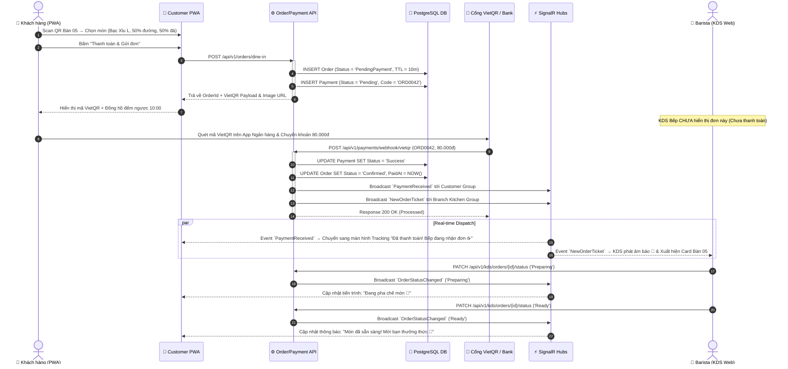
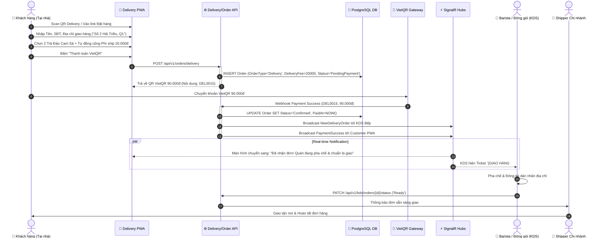
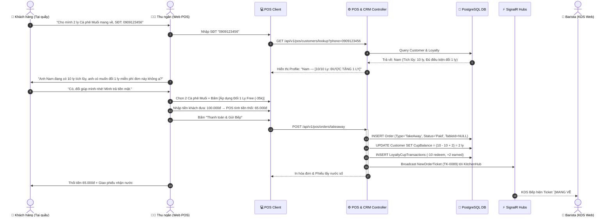
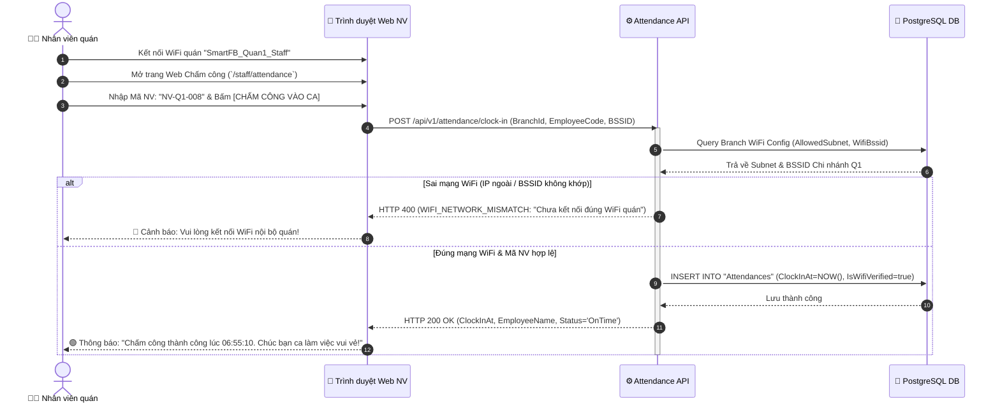

# 📘 ĐẶC TẢ HỢP ĐỒNG KỸ THUẬT & LUỒNG NGHIỆP VỤ CỐT LÕI (TECHNICAL CONTRACTS)
## SMART F&B OPERATING SYSTEM — 5 CORE BUSINESS FLOWS OVERHAUL

> **Phiên bản:** v2.0.0 (Production Grade & Architecture Baseline)  
> **Nguồn sự thật (Source of Truth):** `ORIGINAL_REQUEST.md` & `Smart_FB_OS_Revised_4members.docx` (`temp_revised_content.txt`)  
> **Tech Stack:** Backend .NET 8 Clean Architecture | Frontend Next.js 14 App Router (PWA / Web POS / Web KDS) | PostgreSQL 16 | Redis 7 | SignalR WebSocket  
> **Mục đích tài liệu:** Đóng băng hợp đồng kỹ thuật (API Contracts, Database DDL/ERD, SignalR Events, UI Wireframes, Sequence Diagrams) cho 5 thay đổi nghiệp vụ cốt lõi, làm chuẩn tham chiếu bắt buộc cho toàn bộ tài liệu và mã nguồn.

---

## 📑 MỤC LỤC

1. [TỔNG QUAN 5 THAY ĐỔI NGHIỆP VỤ CỐT LÕI](#1-tổng-quan-5-thay-đổi-nghiệp-vụ-cốt-lõi)
2. [CHANGE 1: DINE-IN PRE-PAYMENT & KDS REAL-TIME FLOW](#2-change-1-dine-in-pre-payment--kds-real-time-flow)
   - 2.1 Ma trận Vòng đời Trạng thái Đơn hàng (Order Lifecycle State Machine)
   - 2.2 Đặc tả Hợp đồng Database (PostgreSQL 16 DDL & Entities)
   - 2.3 Đặc tả Hợp đồng REST API (OpenAPI 3.1 Specification)
   - 2.4 Đặc tả Hợp đồng Real-time SignalR Hubs (`OrderHub`, `PaymentHub`, `KitchenHub`)
   - 2.5 Sơ đồ Tuần tự Chi tiết (Mermaid Sequence Diagram)
   - 2.6 Thiết kế Khung giao diện (UI Wireframe & State UX)
3. [CHANGE 2: QR DELIVERY (HOME DELIVERY WITH FLAT SHIPPING FEE)](#3-change-2-qr-delivery-home-delivery-with-flat-shipping-fee)
   - 3.1 Quy tắc Nghiệp vụ & Ranh giới Scale-Up
   - 3.2 Đặc tả Hợp đồng Database (Delivery Schema Extensions)
   - 3.3 Đặc tả Hợp đồng REST API
   - 3.4 Sơ đồ Tuần tự Chi tiết (Mermaid Sequence Diagram)
   - 3.5 Thiết kế Khung giao diện (Customer Delivery PWA Wireframe)
4. [CHANGE 3: TAKEAWAY STAFF UI & SIMPLIFIED LOYALTY (10 CUPS = 1 FREE)](#4-change-3-takeaway-staff-ui--simplified-loyalty-10-cups--1-free)
   - 4.1 Quy tắc Nghiệp vụ & Cơ chế Loyalty Đơn giản hóa
   - 4.2 Đặc tả Hợp đồng Database (Takeaway & Loyalty Schema)
   - 4.3 Đặc tả Hợp đồng REST API (Staff POS Endpoints)
   - 4.4 Sơ đồ Tuần tự Chi tiết (Mermaid Sequence Diagram)
   - 4.5 Thiết kế Khung giao diện (Counter POS Staff Web Wireframe)
5. [CHANGE 4: WIFI-LOCKED ATTENDANCE (NETWORK & EMPLOYEE VERIFICATION)](#5-change-4-wifi-locked-attendance-network--employee-verification)
   - 5.1 Quy tắc Nghiệp vụ & Loại bỏ GPS / QR Động 30s
   - 5.2 Đặc tả Hợp đồng Database (Branch WiFi Config & Attendance Schema)
   - 5.3 Thuật toán & Logic Xác thực Mạng Chấm công
   - 5.4 Đặc tả Hợp đồng REST API
   - 5.5 Sơ đồ Tuần tự Chi tiết (Mermaid Sequence Diagram)
   - 5.6 Thiết kế Khung giao diện (WiFi Attendance Web Portal Wireframe)
6. [CHANGE 5: ELIMINATION OF STAFF MOBILE APP & SYSTEM CONSOLIDATION](#6-change-5-elimination-of-staff-mobile-app--system-consolidation)
   - 6.1 Tái cấu trúc Hệ thống 3 Web Portals Responsive
   - 6.2 Ma trận Hợp nhất Vai trò (Actor & RBAC Consolidation)
   - 6.3 Danh mục Loại bỏ Triệt để (Clean-up Inventory)
7. [MA TRẬN TÁC ĐỘNG CHÉO & KẾ HOẠCH BÀN GIAO (IMPACT MATRIX)](#7-ma-trận-tác-động-chéo--kế-hoạch-bàn-giao-impact-matrix)

---

## 1. TỔNG QUAN 5 THAY ĐỔI NGHIỆP VỤ CỐT LÕI

| # | Hạng mục | Quy trình CŨ (BỊ BỎ / SỬA) | Quy trình MỚI (CHUẨN HOÁ BẮT BUỘC) | Tác động Kỹ thuật |
|---|---|---|---|---|
| **1** | **Dine-in (Tại bàn)** | Đặt món → Bếp nhận đơn & pha chế → Khách dùng xong yêu cầu bill → Thu tiền sau. | Quét QR bàn → Chọn món → **Thanh toán VietQR trước** → Xác nhận thanh toán thành công → **Bếp mới nhận đơn trên KDS**. | Thêm trạng thái `PendingPayment`, `Paid`; SignalR `NewOrder` chỉ phát sau khi Webhook VietQR xác nhận; Bỏ luồng `RequestBill` tại bàn. |
| **2** | **QR Delivery (Giao tận nơi)** | Không có luồng Delivery độc lập; chung luồng mang về mơ hồ. | Quét QR Delivery (Poster/Fanpage/Web) → Nhập SĐT + **Địa chỉ giao hàng** → Phí ship **cố định 20.000 VNĐ** → **Thanh toán VietQR 100% trước** (Không COD). | Thêm `OrderType.Delivery`, trường `DeliveryAddress`, `DeliveryFee = 20000`, `RecipientPhone`; Giao diện tracking tiến trình giao hàng. |
| **3** | **Takeaway (Mang đi)** | Khách quét mã QR Takeaway riêng dán ở quầy. | **Bỏ QR Takeaway** → Nhân viên thao tác trên **Web POS Quầy** → Tra cứu SĐT CRM → Hiển thị Loyalty (**10 ly = 1 ly miễn phí**) → Khách thanh toán tại quầy (Tiền mặt hoặc VietQR). | Bỏ bảng/loại QR Takeaway; Thêm POS Counter UI; Đơn giản hóa Loyalty tích ly (`CupCount % 10`); Hỗ trợ thanh toán tiền mặt có tính tiền thừa. |
| **4** | **Chấm công nhân viên** | Định vị GPS Geofence (<50m) + Quét mã QR động xoay 30 giây trên POS. | **Bỏ GPS & QR động** → Nhân viên kết nối **WiFi quán** → Hệ thống xác thực **BSSID/MAC/Subnet WiFi** + Mã NV/Tài khoản → Ghi nhận giờ vào/ra ca. | Xóa trường `Latitude`, `Longitude`, `RotatingQrCodeToken`; Thêm `WifiSsid`, `WifiBssid`, `AllowedIpSubnet` vào `Branches`; API Check-in kiểm tra IP/BSSID. |
| **5** | **Staff Mobile App** | Xây dựng ứng dụng di động riêng (Flutter/React Native) cho nhân viên phục vụ. | **Xóa hoàn toàn Staff Mobile App** → Tích hợp toàn bộ thao tác vào **Web KDS**, **Web POS Quầy** và **Manager Web Portal** (Next.js Responsive). | Xóa Mobile Container, App Store pipelines, APNs/FCM mobile push; Gộp actor Waiter vào Barista/Staff; Hợp nhất frontend monorepo. |

---

## 2. CHANGE 1: DINE-IN PRE-PAYMENT & KDS REAL-TIME FLOW

### 2.1 Ma trận Vòng đời Trạng thái Đơn hàng (Order Lifecycle State Machine)

```
┌─────────────────┐       VietQR Payment Success       ┌────────┐       Auto / Manager Acknowledge       ┌───────────┐
│ PendingPayment  │ ─────────────────────────────────► │  Paid  │ ─────────────────────────────────────► │ Confirmed │
└────────┬────────┘   (Webhook / Polling Callback)     └────────┘         (Broadcast to Kitchen KDS)     └─────┬─────┘
         │                                                                                                     │
         │ Timeout (10 mins) /                                                                                 │ Barista Click
         │ User Cancelled                                                                                      │ "Bắt đầu pha chế"
         ▼                                                                                                     ▼
┌─────────────────┐                                                                                      ┌───────────┐
│    Cancelled    │                                                                                      │ Preparing │
└─────────────────┘                                                                                      └─────┬─────┘
                                                                                                               │
                                                                                                               │ Barista Click
                                                                                                               │ "Hoàn thành pha chế"
                                                                                                               ▼
┌─────────────────┐                         Customer Received / Table Cleaned                            ┌───────────┐
│    Completed    │ ◄─────────────────────────────────────────────────────────────────────────────────── │   Ready   │
└─────────────────┘                                                                                      └───────────┘
```

#### Bảng định nghĩa trạng thái `OrderStatus` Enum:
```csharp
public enum OrderStatus
{
    PendingPayment = 0, // Đã tạo đơn, đang chờ thanh toán VietQR (Chưa gửi bếp)
    Paid = 1,           // Đã thanh toán VietQR thành công qua Webhook/Polling
    Confirmed = 2,      // Đã xác nhận đơn và đẩy xuống KDS Bếp
    Preparing = 3,      // Barista đang pha chế món tại quầy
    Ready = 4,          // Đã hoàn thành pha chế, sẵn sàng phục vụ
    Completed = 5,      // Đã phục vụ khách / Bàn hoàn tất phiên
    Cancelled = 6       // Đơn bị hủy (quá hạn thanh toán hoặc lỗi)
}
```

---

### 2.2 Đặc tả Hợp đồng Database (PostgreSQL 16 DDL & Entities)

```sql
-- Migration: AddPrePaymentAndOrderTypeStructure
-- Database: PostgreSQL 16

-- 1. Enum Types
CREATE TYPE order_type_enum AS ENUM ('DineIn', 'TakeAway', 'Delivery');
CREATE TYPE order_status_enum AS ENUM ('PendingPayment', 'Paid', 'Confirmed', 'Preparing', 'Ready', 'Completed', 'Cancelled');
CREATE TYPE payment_method_enum AS ENUM ('VietQR', 'Cash');
CREATE TYPE payment_status_enum AS ENUM ('Pending', 'Success', 'Failed', 'Refunded');

-- 2. Orders Table DDL
CREATE TABLE "Orders" (
    "Id" UUID PRIMARY KEY DEFAULT gen_random_uuid(),
    "OrderNumber" VARCHAR(20) NOT NULL UNIQUE,
    "BranchId" UUID NOT NULL,
    "TableId" UUID NULL, -- NULL đối với Delivery và Takeaway
    "CustomerId" UUID NULL,
    "OrderType" order_type_enum NOT NULL DEFAULT 'DineIn',
    "Status" order_status_enum NOT NULL DEFAULT 'PendingPayment',
    "Subtotal" DECIMAL(12,0) NOT NULL CHECK ("Subtotal" >= 0),
    "DiscountAmount" DECIMAL(12,0) NOT NULL DEFAULT 0 CHECK ("DiscountAmount" >= 0),
    "DeliveryFee" DECIMAL(12,0) NOT NULL DEFAULT 0 CHECK ("DeliveryFee" >= 0),
    "TotalAmount" DECIMAL(12,0) NOT NULL CHECK ("TotalAmount" >= 0),
    "VoucherId" UUID NULL,
    "CustomerNote" TEXT NULL,
    "DeliveryAddress" VARCHAR(500) NULL,
    "RecipientPhone" VARCHAR(20) NULL,
    "RecipientName" VARCHAR(100) NULL,
    "ExpiresAt" TIMESTAMP WITH TIME ZONE NOT NULL, -- Thời hạn thanh toán (TTL 10 phút)
    "PaidAt" TIMESTAMP WITH TIME ZONE NULL,
    "ConfirmedAt" TIMESTAMP WITH TIME ZONE NULL,
    "CompletedAt" TIMESTAMP WITH TIME ZONE NULL,
    "CreatedAt" TIMESTAMP WITH TIME ZONE NOT NULL DEFAULT CURRENT_TIMESTAMP,
    "UpdatedAt" TIMESTAMP WITH TIME ZONE NOT NULL DEFAULT CURRENT_TIMESTAMP,
    CONSTRAINT fk_orders_branch FOREIGN KEY ("BranchId") REFERENCES "Branches"("Id") ON DELETE RESTRICT,
    CONSTRAINT fk_orders_table FOREIGN KEY ("TableId") REFERENCES "Tables"("Id") ON DELETE RESTRICT,
    CONSTRAINT fk_orders_customer FOREIGN KEY ("CustomerId") REFERENCES "Customers"("Id") ON DELETE RESTRICT
);

-- 3. Payments Table DDL
CREATE TABLE "Payments" (
    "Id" UUID PRIMARY KEY DEFAULT gen_random_uuid(),
    "OrderId" UUID NOT NULL UNIQUE,
    "PaymentMethod" payment_method_enum NOT NULL DEFAULT 'VietQR',
    "Amount" DECIMAL(12,0) NOT NULL CHECK ("Amount" >= 0),
    "Status" payment_status_enum NOT NULL DEFAULT 'Pending',
    "TransactionReference" VARCHAR(100) NULL, -- Mã giao dịch ngân hàng / Bank Trace No
    "TransferContent" VARCHAR(50) NOT NULL UNIQUE, -- Cú pháp chuyển khoản e.g., ORD10293
    "VietQrUrl" TEXT NULL,
    "RawWebhookPayload" JSONB NULL,
    "ConfirmedBy" UUID NULL, -- User ID nhân viên xác nhận nếu là Cash
    "ConfirmedAt" TIMESTAMP WITH TIME ZONE NULL,
    "CreatedAt" TIMESTAMP WITH TIME ZONE NOT NULL DEFAULT CURRENT_TIMESTAMP,
    CONSTRAINT fk_payments_order FOREIGN KEY ("OrderId") REFERENCES "Orders"("Id") ON DELETE RESTRICT
);

-- Indexes for high-frequency queries
CREATE INDEX idx_orders_branch_status ON "Orders" ("BranchId", "Status");
CREATE INDEX idx_orders_pending_expires ON "Orders" ("Status", "ExpiresAt") WHERE "Status" = 'PendingPayment';
CREATE INDEX idx_payments_transfer_content ON "Payments" ("TransferContent");
```

---

### 2.3 Đặc tả Hợp đồng REST API (OpenAPI 3.1 Specification)

#### API 1.1: Tạo đơn hàng Dine-in (Customer PWA)
- **Endpoint:** `POST /api/v1/orders/dine-in`
- **Quyền:** Public Guest (`guestToken` từ QR Bàn)
- **Request Body (JSON Schema):**
```json
{
  "$schema": "https://json-schema.org/draft/2020-12/schema",
  "type": "object",
  "properties": {
    "tableId": { "type": "string", "format": "uuid", "example": "b8a92842-1f44-48f8-8a4b-871239ab0123" },
    "customerPhone": { "type": "string", "pattern": "^0[0-9]{9}$", "example": "0912345678" },
    "customerNote": { "type": "string", "maxLength": 255, "example": "Mang ly không đường trước" },
    "voucherCode": { "type": "string", "nullable": true, "example": "SUMMER20" },
    "items": {
      "type": "array",
      "minItems": 1,
      "items": {
        "type": "object",
        "properties": {
          "productId": { "type": "string", "format": "uuid", "example": "c1192842-1f44-48f8-8a4b-871239ab0456" },
          "variantId": { "type": "string", "format": "uuid", "example": "d2292842-1f44-48f8-8a4b-871239ab0789" },
          "quantity": { "type": "integer", "minimum": 1, "example": 2 },
          "sugarLevel": { "type": "integer", "enum": [0, 30, 50, 70, 100], "example": 50 },
          "iceLevel": { "type": "string", "enum": ["0%", "30%", "50%", "100%", "NoIce", "Hot"], "example": "50%" },
          "toppingIds": {
            "type": "array",
            "items": { "type": "string", "format": "uuid" },
            "example": ["e3392842-1f44-48f8-8a4b-871239ab0111"]
          },
          "itemNote": { "type": "string", "example": "Ít ngọt" }
        },
        "required": ["productId", "variantId", "quantity", "sugarLevel", "iceLevel"]
      }
    }
  },
  "required": ["tableId", "items"]
}
```

- **Response 201 Created:**
```json
{
  "success": true,
  "data": {
    "orderId": "f4492842-1f44-48f8-8a4b-871239ab0999",
    "orderNumber": "ORD-20260822-0042",
    "status": "PendingPayment",
    "subtotal": 90000,
    "discountAmount": 10000,
    "totalAmount": 80000,
    "expiresAt": "2026-08-22T14:25:29Z",
    "payment": {
      "paymentId": "a1192842-1f44-48f8-8a4b-871239ab0777",
      "paymentMethod": "VietQR",
      "bankId": "970436",
      "bankName": "Vietcombank",
      "accountNo": "0001882199201",
      "accountName": "CONG TY SMART FB VIET NAM",
      "transferContent": "ORD0042",
      "amount": 80000,
      "qrDataUrl": "https://img.vietqr.io/image/970436-0001882199201-compact2.png?amount=80000&addInfo=ORD0042"
    }
  },
  "message": "Đơn hàng đã được khởi tạo. Vui lòng thanh toán VietQR trong vòng 10 phút để chuyển đơn sang bếp."
}
```

#### API 1.2: Webhook Nhận Kết Quả Thanh Toán VietQR
- **Endpoint:** `POST /api/v1/payments/webhook/vietqr`
- **Xác thực:** Header `X-Webhook-Signature` (HMAC-SHA256 Secret)
- **Request Body (JSON):**
```json
{
  "gatewayTransactionId": "VCB-FT-9918239102",
  "accountNumber": "0001882199201",
  "amount": 80000,
  "transferContent": "ORD0042",
  "transactionDate": "2026-08-22T14:18:10Z"
}
```
- **Response 200 OK:**
```json
{
  "success": true,
  "orderId": "f4492842-1f44-48f8-8a4b-871239ab0999",
  "orderNumber": "ORD-20260822-0042",
  "newStatus": "Confirmed",
  "kdsNotified": true,
  "message": "Xác nhận thanh toán thành công và đã chuyển đơn xuống KDS bếp."
}
```

---

### 2.4 Đặc tả Hợp đồng Real-time SignalR Hubs

#### 1. `PaymentHub` (`wss://api.smartfb.vn/hubs/payment`)
- **Nhóm kết nối:** `Order_{orderId}`
- **Event `PaymentReceived` (Server → Customer PWA):**
```json
{
  "orderId": "f4492842-1f44-48f8-8a4b-871239ab0999",
  "orderNumber": "ORD-20260822-0042",
  "amountPaid": 80000,
  "paidAt": "2026-08-22T14:18:10Z",
  "status": "Paid"
}
```

#### 2. `KitchenHub` (`wss://api.smartfb.vn/hubs/kitchen`)
- **Nhóm kết nối:** `Branch_{branchId}_Kitchen`
- **Event `NewOrderTicket` (Server → KDS Web Screen):**
```json
{
  "orderId": "f4492842-1f44-48f8-8a4b-871239ab0999",
  "orderNumber": "ORD-0042",
  "orderType": "DineIn",
  "tableName": "Bàn 05",
  "zone": "Tầng 1",
  "paidAt": "2026-08-22T14:18:10Z",
  "items": [
    {
      "orderItemId": "e5592842-1f44-48f8-8a4b-871239ab0222",
      "productName": "Bạc Xỉu 3 Tầng",
      "variantName": "Size L",
      "quantity": 2,
      "sugarLevel": 50,
      "iceLevel": "50%",
      "toppings": ["Trân châu hoàng kim"],
      "recipeInstruction": "2 shot espresso, 40ml sữa đặc, 100ml sữa tươi không đường, 1 vá trân châu",
      "itemNote": "Ít ngọt"
    }
  ]
}
```

#### 3. Client Calls (KDS Web Screen → Server):
- `UpdateOrderStatus(Guid orderId, OrderStatus newStatus)` (`Preparing` | `Ready` | `Completed`)
- `Broadcast Event OrderStatusChanged` (Server → Customer PWA & Cashier POS).

---

### 2.5 Sơ đồ Tuần tự Chi tiết (Mermaid Sequence Diagram)



---

### 2.6 Thiết kế Khung giao diện (UI Wireframe & State UX)

#### Màn hình PWA 1.1: Màn hình Thanh toán VietQR Chờ Bếp
```
┌────────────────────────────────────────────────────────┐
│  SMART F&B — BÀN 05 (TẦNG 1)               [ 09:42 ]   │
├────────────────────────────────────────────────────────┤
│  💳 XÁC NHẬN THANH TOÁN VIETQR                         │
│  Mã đơn hàng: #ORD-0042                                │
│                                                        │
│  ┌──────────────────────────────────────────────────┐  │
│  │                    [ QR CODE ]                   │  │
│  │             (Quét bằng App Ngân Hàng)            │  │
│  │                                                  │  │
│  │  Số tiền: 80.000 VNĐ                             │  │
│  │  Nội dung CK: ORD0042                            │  │
│  │  Ngân hàng: Vietcombank - 0001882199201          │  │
│  └──────────────────────────────────────────────────┘  │
│                                                        │
│  ⏳ Đơn hàng sẽ tự động gửi xuống Bếp ngay khi hệ       │
│     thống nhận được tiền (Thời gian còn lại: 08:35)     │
│                                                        │
│  [  HỦY ĐƠN HÀNG  ]         [  ĐÃ CHUYỂN KHOẢN  ]      │
└────────────────────────────────────────────────────────┘
```

#### Màn hình KDS 1.2: Card Đơn Hàng Tại Bếp (Chỉ hiện sau khi Paid)
```
┌────────────────────────────────────────────────────────┐
│  #ORD-0042 — BÀN 05 [TẠI QUÁN]            ⏱️ 02:15      │
│  Trạng thái: ĐÃ THANH TOÁN (VIETQR)                    │
├────────────────────────────────────────────────────────┤
│  [2x] Bạc Xỉu 3 Tầng — Size L                          │
│       • Đường: 50% | Đá: 50%                           │
│       • Topping: Trân châu hoàng kim                   │
│       • Note: Ít ngọt                                  │
│       • Recipe: 2 shot espresso + 40ml đặc + 100ml tươi│
├────────────────────────────────────────────────────────┤
│  [ BẮT ĐẦU PHA CHẾ ]              [ HOÀN THÀNH MÓN ✔ ] │
└────────────────────────────────────────────────────────┘
```

---

## 3. CHANGE 2: QR DELIVERY (HOME DELIVERY WITH FLAT SHIPPING FEE)

### 3.1 Quy tắc Nghiệp vụ & Ranh giới Scale-Up

1. **Điểm truy cập (Entry Point):** Khách hàng quét mã QR Delivery dán trên tờ rơi, standee, fanpage hoặc truy cập link web delivery của quán.
2. **Thông tin bắt buộc:**
   - Số điện thoại người nhận (`RecipientPhone`).
   - Tên người nhận (`RecipientName`).
   - Địa chỉ giao hàng chi tiết (`DeliveryAddress`).
   - Ghi chú giao hàng (`DeliveryNote` - ví dụ: "Giao trước 11h, gọi trước khi đến").
3. **Chính sách phí vận chuyển:** Phí ship cố định **20.000 VNĐ** tự động cộng vào tổng tiền của mọi đơn giao tận nơi.
4. **Hình thức thanh toán:** **100% VietQR trả trước**. Không hỗ trợ thanh toán tiền mặt khi nhận hàng (No COD) để triệt tiêu rủi ro bùng đơn.
5. **Ranh giới Scale-Up / Future Work:**
   - *Trong phạm vi Capstone (MVP):* Quản lý đơn giao hàng, thông báo KDS đóng gói, nhân viên chi nhánh/shipper nội bộ nhận đơn giao thủ công.
   - *Scale-Up / Future Work:* Tích hợp API đối tác vận chuyển thứ 3 (AhaMove, GrabExpress), tính phí ship động theo km bản đồ Google Maps/Mapbox, live-tracking GPS tài xế thời gian thực.

---

### 3.2 Đặc tả Hợp đồng Database (Delivery Schema Extensions)

Bảng `Orders` bổ sung ràng buộc kiểm tra toàn vẹn dữ liệu cho đơn Delivery:

```sql
-- Constraint: Đơn Delivery bắt buộc có địa chỉ và SĐT người nhận, phí ship tối thiểu 20.000đ
ALTER TABLE "Orders" ADD CONSTRAINT chk_delivery_order_fields CHECK (
    ("OrderType" = 'Delivery' AND "DeliveryAddress" IS NOT NULL AND "RecipientPhone" IS NOT NULL AND "DeliveryFee" = 20000 AND "TableId" IS NULL)
    OR
    ("OrderType" IN ('DineIn', 'TakeAway'))
);
```

---

### 3.3 Đặc tả Hợp đồng REST API

#### API 2.1: Tạo đơn hàng Delivery (Customer PWA)
- **Endpoint:** `POST /api/v1/orders/delivery`
- **Quyền:** Public Guest
- **Request Body (JSON Schema):**
```json
{
  "$schema": "https://json-schema.org/draft/2020-12/schema",
  "type": "object",
  "properties": {
    "branchId": { "type": "string", "format": "uuid", "example": "a1192842-1f44-48f8-8a4b-871239ab0001" },
    "recipientName": { "type": "string", "minLength": 2, "maxLength": 100, "example": "Chị Mai Hương" },
    "recipientPhone": { "type": "string", "pattern": "^0[0-9]{9}$", "example": "0987654321" },
    "deliveryAddress": { "type": "string", "minLength": 10, "maxLength": 500, "example": "Tòa nhà Bitexco, Số 2 Hải Triều, P. Bến Nghé, Quận 1, TP.HCM" },
    "deliveryNote": { "type": "string", "example": "Giao sảnh lễ tân tầng 1" },
    "voucherCode": { "type": "string", "nullable": true, "example": "FREESHIP20" },
    "items": {
      "type": "array",
      "minItems": 1,
      "items": {
        "type": "object",
        "properties": {
          "productId": { "type": "string", "format": "uuid" },
          "variantId": { "type": "string", "format": "uuid" },
          "quantity": { "type": "integer", "minimum": 1, "example": 2 },
          "sugarLevel": { "type": "integer", "example": 70 },
          "iceLevel": { "type": "string", "example": "100%" }
        },
        "required": ["productId", "variantId", "quantity"]
      }
    }
  },
  "required": ["branchId", "recipientName", "recipientPhone", "deliveryAddress", "items"]
}
```

- **Response 201 Created:**
```json
{
  "success": true,
  "data": {
    "orderId": "f9992842-1f44-48f8-8a4b-871239ab0888",
    "orderNumber": "DEL-20260822-0015",
    "orderType": "Delivery",
    "status": "PendingPayment",
    "itemsSubtotal": 70000,
    "deliveryFee": 20000,
    "discountAmount": 0,
    "totalAmount": 90000,
    "recipientName": "Chị Mai Hương",
    "recipientPhone": "0987654321",
    "deliveryAddress": "Tòa nhà Bitexco, Số 2 Hải Triều, P. Bến Nghé, Quận 1, TP.HCM",
    "payment": {
      "paymentId": "p8892842-1f44-48f8-8a4b-871239ab0333",
      "amount": 90000,
      "transferContent": "DEL0015",
      "qrDataUrl": "https://img.vietqr.io/image/970436-0001882199201-compact2.png?amount=90000&addInfo=DEL0015"
    }
  },
  "message": "Đơn giao hàng đã tạo thành công. Vui lòng thanh toán VietQR 90.000 VNĐ để xác nhận đơn hàng."
}
```

---

### 3.4 Sơ đồ Tuần tự Chi tiết (Mermaid Sequence Diagram)



---

### 3.5 Thiết kế Khung giao diện (Customer Delivery PWA Wireframe)

```
┌────────────────────────────────────────────────────────┐
│  SMART F&B — ĐẶT GIAO TẬN NƠI              [ 10:15 ]   │
├────────────────────────────────────────────────────────┤
│  📍 THÔNG TIN GIAO HÀNG                                │
│  Họ và tên: [ Chị Mai Hương                          ] │
│  Số điện thoại: [ 0987654321                         ] │
│  Địa chỉ: [ Tòa nhà Bitexco, 2 Hải Triều, Q1, TP.HCM ] │
│  Ghi chú: [ Giao sảnh lễ tân tầng 1                  ] │
├────────────────────────────────────────────────────────┤
│  🛒 GIỎ HÀNG (2 MÓN)                                   │
│  • 2x Trà Đào Cam Sả (Size L, 70% đường)     70.000 đ │
│  ────────────────────────────────────────────────────  │
│  Tiền món:                                    70.000 đ │
│  Phí giao hàng (Cố định):                     20.000 đ │
│  Mã giảm giá:                                     0 đ  │
│  ────────────────────────────────────────────────────  │
│  TỔNG THANH TOÁN:                             90.000 đ │
├────────────────────────────────────────────────────────┤
│  💳 HÌNH THỨC THANH TOÁN: [ VIETQR CHUYỂN KHOẢN (100%) ]│
│  (Quán không áp dụng hình thức thu tiền mặt COD)       │
│                                                        │
│  [  TIẾP TỤC THANH TOÁN VIETQR (90.000 Đ)  ]           │
└────────────────────────────────────────────────────────┘
```

---

## 4. CHANGE 3: TAKEAWAY STAFF UI & SIMPLIFIED LOYALTY (10 CUPS = 1 FREE)

### 4.1 Quy tắc Nghiệp vụ & Cơ chế Loyalty Đơn giản hóa

1. **Loại bỏ QR Takeaway:** Bỏ toàn bộ mã QR dán tại quầy dành cho khách tự quét mang đi. Mọi đơn mang về do nhân viên thu ngân/phục vụ nhập trực tiếp trên giao diện **Web POS Quầy**.
2. **Luồng tra cứu CRM bằng Số điện thoại:**
   - Thu ngân hỏi SĐT khách hàng → Gõ vào ô tìm kiếm trên POS.
   - *Khách hàng Mới:* POS hiển thị form tạo nhanh (Nhập Tên khách) → Khởi tạo CRM với 0 ly tích lũy.
   - *Khách hàng Cũ:* POS hiển thị Tên, Hạng thành viên, Lịch sử gọi món và tiến trình tích ly hiện tại (ví dụ: `7/10 ly`).
3. **Cơ chế Loyalty Mới (10 Ly = 1 Ly Miễn Phí):**
   - Cứ mỗi 1 ly đồ uống trong đơn hàng hoàn tất = Tích lũy 1 điểm ly (`Earn 1 Cup`).
   - Khi `CupBalance >= 10`: Hệ thống kích hoạt nút `[ĐỔI 1 LY MIỄN PHÍ]` trên POS (Giảm trừ tối đa 35.000 VNĐ hoặc giá 1 ly tiêu chuẩn).
   - Sau khi đổi thưởng: Trừ 10 ly trong quỹ tích lũy (`CupBalance = CupBalance - 10`).
4. **Thanh toán tại quầy linh hoạt (Post-payment):**
   - Hỗ trợ 2 phương thức: **Tiền mặt** (nhập số tiền khách đưa → hệ thống tự tính tiền thừa) **HOẶC** **VietQR** (hiển thị mã QR trên màn hình phụ hoặc màn hình POS cho khách quét).

---

### 4.2 Đặc tả Hợp đồng Database (Takeaway & Loyalty Schema)

```sql
-- Migration: AddTakeawayAndCupLoyalty
-- Database: PostgreSQL 16

-- 1. Bổ sung trường tích ly vào bảng Customers
ALTER TABLE "Customers" 
    ADD COLUMN "CupBalance" INT NOT NULL DEFAULT 0 CHECK ("CupBalance" >= 0),
    ADD COLUMN "TotalCupsEarned" INT NOT NULL DEFAULT 0,
    ADD COLUMN "TotalFreeCupsRedeemed" INT NOT NULL DEFAULT 0;

-- 2. Bảng nhật ký giao dịch Loyalty Tích Ly
CREATE TABLE "LoyaltyCupTransactions" (
    "Id" UUID PRIMARY KEY DEFAULT gen_random_uuid(),
    "CustomerId" UUID NOT NULL,
    "OrderId" UUID NOT NULL,
    "TransactionType" VARCHAR(20) NOT NULL, -- 'EarnCups', 'RedeemFreeCup', 'ManualAdjust'
    "CupsCount" INT NOT NULL, -- +2 hoặc -10
    "BalanceAfter" INT NOT NULL,
    "Description" TEXT NULL,
    "CreatedAt" TIMESTAMP WITH TIME ZONE NOT NULL DEFAULT CURRENT_TIMESTAMP,
    CONSTRAINT fk_loyalty_customer FOREIGN KEY ("CustomerId") REFERENCES "Customers"("Id") ON DELETE RESTRICT,
    CONSTRAINT fk_loyalty_order FOREIGN KEY ("OrderId") REFERENCES "Orders"("Id") ON DELETE RESTRICT
);

CREATE INDEX idx_loyalty_customer_date ON "LoyaltyCupTransactions" ("CustomerId", "CreatedAt" DESC);
```

---

### 4.3 Đặc tả Hợp đồng REST API (Staff POS Endpoints)

#### API 3.1: Tra cứu & Tạo nhanh CRM Khách hàng tại Quầy
- **Endpoint:** `GET /api/v1/pos/customers/lookup`
- **Quyền:** Authenticated Staff (`Cashier`, `StoreManager`)
- **Query Params:** `phone=0909123456`
- **Response 200 OK (Khách cũ):**
```json
{
  "success": true,
  "data": {
    "isExisting": true,
    "customerId": "c7792842-1f44-48f8-8a4b-871239ab0444",
    "phone": "0909123456",
    "fullName": "Nguyễn Hoàng Nam",
    "cupBalance": 8,
    "cupsNeededForNextReward": 2,
    "canRedeemFreeCup": false,
    "favoriteProducts": [
      { "productId": "p11", "productName": "Cà Phê Muối", "orderCount": 12 }
    ]
  }
}
```

- **Response 200 OK (Khách mới chưa có trong hệ thống):**
```json
{
  "success": true,
  "data": {
    "isExisting": false,
    "phone": "0909123456",
    "message": "Khách hàng mới. Nhập họ tên để tạo hồ sơ CRM và bắt đầu tích ly."
  }
}
```

#### API 3.2: Tạo đơn hàng Takeaway tại Quầy POS
- **Endpoint:** `POST /api/v1/pos/orders/takeaway`
- **Quyền:** Authenticated Staff
- **Request Body (JSON Schema):**
```json
{
  "$schema": "https://json-schema.org/draft/2020-12/schema",
  "type": "object",
  "properties": {
    "branchId": { "type": "string", "format": "uuid" },
    "customerPhone": { "type": "string", "pattern": "^0[0-9]{9}$", "example": "0909123456" },
    "customerName": { "type": "string", "example": "Nguyễn Hoàng Nam" },
    "redeemFreeCup": { "type": "boolean", "default": false, "example": true },
    "paymentMethod": { "type": "string", "enum": ["Cash", "VietQR"], "example": "Cash" },
    "cashGiven": { "type": "number", "example": 100000 },
    "items": {
      "type": "array",
      "items": {
        "type": "object",
        "properties": {
          "productId": { "type": "string", "format": "uuid" },
          "variantId": { "type": "string", "format": "uuid" },
          "quantity": { "type": "integer", "minimum": 1, "example": 2 }
        },
        "required": ["productId", "variantId", "quantity"]
      }
    }
  },
  "required": ["branchId", "paymentMethod", "items"]
}
```

- **Response 201 Created:**
```json
{
  "success": true,
  "data": {
    "orderId": "t3392842-1f44-48f8-8a4b-871239ab0123",
    "orderNumber": "TK-20260822-0089",
    "orderType": "TakeAway",
    "status": "Paid",
    "subtotal": 70000,
    "freeCupDiscount": 35000,
    "totalAmount": 35000,
    "cashGiven": 100000,
    "changeReturned": 65000,
    "newCupBalance": 0,
    "cupsEarnedThisOrder": 2,
    "kdsTicketDispatched": true
  },
  "message": "Tạo đơn mang đi và thanh toán thành công. Đã in phiếu và chuyển đơn xuống KDS."
}
```

---

### 4.4 Sơ đồ Tuần tự Chi tiết (Mermaid Sequence Diagram)



---

### 4.5 Thiết kế Khung giao diện (Counter POS Staff Web Wireframe)

```
┌────────────────────────────────────────────────────────────────────────────────────────┐
│ SMART F&B POS — QUẦY THU NGÂN CHI NHÁNH QUẬN 1                           [ 10:45:12 ] │
├─────────────────────────────────────────────┬──────────────────────────────────────────┤
│  🔍 TÌM KHÁCH: [ 0909123456              ]  │  GIỎ HÀNG: ĐƠN MANG VỀ (TAKEAWAY)        │
│  👤 Khách hàng: NGUYỄN HOÀNG NAM            │  ──────────────────────────────────────  │
│  🏆 Tích lũy: [██████████] 10/10 LY        │  1. Cà phê Muối (Size M)       35.000 đ  │
│  🎁 [  BẤM ĐỔI 1 LY MIỄN PHÍ (-35.000đ)  ]  │  2. Cà phê Muối (Size M)       35.000 đ  │
├─────────────────────────────────────────────┤  ──────────────────────────────────────  │
│  DANH MỤC: [ CÀ PHÊ ] [ TRÀ ] [ BÁNH ]      │  Tổng tiền món:                70.000 đ  │
│  ┌───────────────┐ ┌───────────────┐        │  Ưu đãi 10 Ly tặng 1:         -35.000 đ  │
│  │ Bạc Xỉu       │ │ Cà Phê Muối   │        │  ──────────────────────────────────────  │
│  │ 35.000 đ      │ │ 35.000 đ      │        │  KHÁCH CẦN TRẢ:                35.000 đ  │
│  └───────────────┘ └───────────────┘        │                                          │
│  ┌───────────────┐ ┌───────────────┐        │  Hình thức:  [ (•) TIỀN MẶT ]  [ ( ) VIETQR ]
│  │ Cà Phê Đen    │ │ Trà Đào Sả    │        │  Tiền khách đưa: [ 100.000            ]  │
│  │ 25.000 đ      │ │ 45.000 đ      │        │  Tiền thừa thối khách:         65.000 đ  │
│  └───────────────┘ └───────────────┘        │                                          │
│                                             │  [   HỦY   ]    [  IN BILL & GỬI BẾP  ]  │
└─────────────────────────────────────────────┴──────────────────────────────────────────┘
```

---

## 5. CHANGE 4: WIFI-LOCKED ATTENDANCE (NETWORK & EMPLOYEE VERIFICATION)

### 5.1 Quy tắc Nghiệp vụ & Loại bỏ GPS / QR Động 30s

1. **Lý do loại bỏ GPS & Dynamic QR 30s:**
   - GPS trong nhà quán cà phê thường bị trôi sai số > 50m, gây lỗi từ chối chấm công oan cho nhân viên; ngoài ra dễ bị giả lập tọa độ bằng ứng dụng Fake GPS.
   - Mã QR xoay 30 giây yêu cầu quán phải đầu tư màn hình phụ hoặc chiếm dụng màn hình POS thu ngân, gây phiền toái khi quét.
2. **Quy tắc Nghiệp vụ Chấm công Khóa WiFi Mới:**
   - Nhân viên phải kết nối thiết bị của mình vào mạng **WiFi nội bộ của Chi nhánh**.
   - Mở Web Portal phân hệ Chấm công (`/staff/attendance`).
   - Nhập Mã số nhân viên (hoặc hệ thống tự nhận diện từ tài khoản đăng nhập).
   - Bấm **"Chấm công vào ca"** hoặc **"Chấm công ra ca"**.
3. **Logic Kiểm tra 2 Lớp (Double Verification Logic):**
   - **Lớp 1 (Network Verification):** Backend đối chiếu thông tin mạng kết nối (Địa chỉ IP Public của quán / Gateway Subnet / BSSID Access Point) với cấu hình `WifiBssid` & `AllowedIpSubnet` đã đăng ký của Chi nhánh.
   - **Lớp 2 (Identity & Shift Verification):** Kiểm tra Mã nhân viên có hợp lệ, đang kích hoạt và được phân công vào ca làm việc tại chi nhánh đó hay không.
   - *Kết quả:* Nếu CẢ HAI đều đúng → Ghi nhận chấm công thành công. Nếu sai WiFi → Báo lỗi từ chối ngay lập tức.

---

### 5.2 Đặc tả Hợp đồng Database (Branch WiFi Config & Attendance Schema)

```sql
-- Migration: OverhaulAttendanceToWifiLocked
-- Database: PostgreSQL 16

-- 1. Thêm cấu hình WiFi vào bảng Branches
ALTER TABLE "Branches"
    ADD COLUMN "WifiSsid" VARCHAR(100) NOT NULL DEFAULT 'SmartFB_Staff',
    ADD COLUMN "WifiBssid" VARCHAR(100) NULL, -- MAC Address Router/AP e.g. "00:1A:2B:3C:4D:5E"
    ADD COLUMN "AllowedIpSubnet" VARCHAR(100) NOT NULL DEFAULT '192.168.1.0/24';

-- 2. Xóa các trường GPS cũ và cập nhật bảng Attendances
ALTER TABLE "Attendances" 
    DROP COLUMN IF EXISTS "Latitude",
    DROP COLUMN IF EXISTS "Longitude",
    DROP COLUMN IF EXISTS "GpsAccuracy",
    DROP COLUMN IF EXISTS "RotatingQrToken";

ALTER TABLE "Attendances"
    ADD COLUMN "VerificationMethod" VARCHAR(30) NOT NULL DEFAULT 'WIFI_LOCKED',
    ADD COLUMN "ClientIp" VARCHAR(50) NOT NULL,
    ADD COLUMN "ClientBssid" VARCHAR(100) NULL,
    ADD COLUMN "ClientSsid" VARCHAR(100) NULL,
    ADD COLUMN "IsWifiVerified" BOOLEAN NOT NULL DEFAULT true,
    ADD COLUMN "EmployeeCode" VARCHAR(20) NOT NULL;

CREATE INDEX idx_attendance_user_date ON "Attendances" ("UserId", "ClockInAt" DESC);
CREATE INDEX idx_attendance_branch_date ON "Attendances" ("BranchId", "ClockInAt" DESC);
```

---

### 5.3 Thuật toán & Logic Xác thực Mạng Chấm công

```csharp
// Backend Verification Logic (C# .NET 8 Service Implementation Pattern)
public async Task<AttendanceResultDto> VerifyAndClockInAsync(ClockInRequestDto request, string clientIpHeader)
{
    var branch = await _dbContext.Branches.FindAsync(request.BranchId);
    if (branch == null) throw new NotFoundException("Chi nhánh không tồn tại.");

    // 1. Kiểm tra dải IP / Subnet hoặc BSSID
    bool isNetworkValid = IPAddressValidator.IsInSubnet(clientIpHeader, branch.AllowedIpSubnet) 
                          || (request.ClientBssid != null && string.Equals(request.ClientBssid, branch.WifiBssid, StringComparison.OrdinalIgnoreCase));

    if (!isNetworkValid)
    {
        throw new BusinessRuleViolationException(
            "WIFI_NETWORK_MISMATCH", 
            $"Thiết bị chưa kết nối vào mạng WiFi hợp lệ của chi nhánh '{branch.Name}'. Vui lòng kết nối WiFi nội bộ quán để chấm công."
        );
    }

    // 2. Kiểm tra Mã số nhân viên & Quyền phân ca
    var employee = await _dbContext.Users
        .Include(u => u.BranchUsers)
        .FirstOrDefaultAsync(u => u.EmployeeCode == request.EmployeeCode && u.IsActive);

    if (employee == null || !employee.BranchUsers.Any(bu => bu.BranchId == request.BranchId))
    {
        throw new BusinessRuleViolationException("INVALID_EMPLOYEE_ASSIGNMENT", "Mã nhân viên không hợp lệ hoặc chưa được phân công tại chi nhánh này.");
    }

    // 3. Ghi nhận chấm công
    var attendance = new Attendance
    {
        Id = Guid.NewGuid(),
        UserId = employee.Id,
        BranchId = request.BranchId,
        EmployeeCode = request.EmployeeCode,
        ClockInAt = DateTime.UtcNow,
        ClientIp = clientIpHeader,
        ClientBssid = request.ClientBssid,
        ClientSsid = request.ClientSsid,
        IsWifiVerified = true,
        VerificationMethod = "WIFI_LOCKED"
    };

    _dbContext.Attendances.Add(attendance);
    await _dbContext.SaveChangesAsync();

    return new AttendanceResultDto { Success = true, ClockInTime = attendance.ClockInAt, EmployeeName = employee.FullName };
}
```

---

### 5.4 Đặc tả Hợp đồng REST API

#### API 4.1: Chấm công Vào ca bằng WiFi (Staff Web)
- **Endpoint:** `POST /api/v1/attendance/clock-in`
- **Quyền:** Authenticated Staff / Employee Token
- **Request Body (JSON Schema):**
```json
{
  "$schema": "https://json-schema.org/draft/2020-12/schema",
  "type": "object",
  "properties": {
    "branchId": { "type": "string", "format": "uuid", "example": "a1192842-1f44-48f8-8a4b-871239ab0001" },
    "employeeCode": { "type": "string", "minLength": 4, "maxLength": 20, "example": "NV-Q1-008" },
    "clientSsid": { "type": "string", "example": "SmartFB_Quan1_Staff" },
    "clientBssid": { "type": "string", "example": "00:1A:2B:3C:4D:5E" }
  },
  "required": ["branchId", "employeeCode"]
}
```

- **Response 200 OK:**
```json
{
  "success": true,
  "data": {
    "attendanceId": "att-9918239-1029",
    "employeeCode": "NV-Q1-008",
    "employeeName": "Trần Văn Nam",
    "branchName": "Chi nhánh Quận 1",
    "clockInAt": "2026-08-22T06:55:10Z",
    "networkVerified": true,
    "status": "OnTime",
    "message": "Chấm công vào ca thành công qua mạng WiFi chi nhánh."
  }
}
```

- **Response 400 Bad Request (Lỗi sai WiFi):**
```json
{
  "type": "https://api.smartfb.vn/errors/wifi-network-mismatch",
  "title": "Mạng WiFi không hợp lệ",
  "status": 400,
  "detail": "Thiết bị của bạn đang kết nối mạng ngoài. Vui lòng kết nối WiFi 'SmartFB_Quan1_Staff' tại quán để chấm công.",
  "instance": "/api/v1/attendance/clock-in"
}
```

---

### 5.5 Sơ đồ Tuần tự Chi tiết (Mermaid Sequence Diagram)



---

### 5.6 Thiết kế Khung giao diện (WiFi Attendance Web Portal Wireframe)

```
┌────────────────────────────────────────────────────────┐
│  SMART F&B — CỔNG CHẤM CÔNG NHÂN VIÊN      [ 06:55 ]   │
├────────────────────────────────────────────────────────┤
│  🏢 Chi nhánh: CHI NHÁNH QUẬN 1                        │
│                                                        │
│  📶 TRẠNG THÁI MẠNG WIFI:                              │
│  ┌──────────────────────────────────────────────────┐  │
│  │  🟢 ĐÃ KẾT NỐI: SmartFB_Quan1_Staff              │  │
│  │  IP: 192.168.1.45 (HỢP LỆ)                       │  │
│  └──────────────────────────────────────────────────┘  │
│                                                        │
│  Mã số nhân viên: [ NV-Q1-008                        ] │
│                                                        │
│  Ca làm việc: Ca Sáng (07:00 - 15:00)                  │
│                                                        │
│  [        🟢 CHẤM CÔNG VÀO CA (CLOCK-IN)        ]     │
│                                                        │
│  [        🔴 CHẤM CÔNG RA CA (CLOCK-OUT)        ]     │
├────────────────────────────────────────────────────────┤
│  Lịch sử chấm công hôm nay:                            │
│  • Chưa có dữ liệu vào ca                              │
└────────────────────────────────────────────────────────┘
```

---

## 6. CHANGE 5: ELIMINATION OF STAFF MOBILE APP & SYSTEM CONSOLIDATION

### 6.1 Tái cấu trúc Hệ thống 3 Web Portals Responsive

Toàn bộ các tác vụ của nhân viên phục vụ, nhân viên pha chế, thu ngân và quản lý cửa hàng được hợp nhất vào **3 Ứng dụng Web Responsive (Next.js 14 App Router)**, loại bỏ hoàn toàn mã nguồn di động Native/Flutter:

```
                                  SMART F&B OS PLATFORM
                                 (Next.js 14 App Router)
                                            │
        ┌───────────────────────────────────┼───────────────────────────────────┐
        │                                   │                                   │
 ┌──────▼──────┐                     ┌──────▼──────┐                     ┌──────▼──────┐
 │  WEB KDS    │                     │   WEB POS   │                     │ WEB PORTAL  │
 │  (Kitchen)  │                     │  (Counter)  │                     │ (Admin/Mgr) │
 └──────┬──────┘                     └──────┬──────┘                     └──────┬──────┘
        │                                   │                                   │
 • Bếp & Barista                     • Thu ngân & Phục vụ                • Quản lý & Chủ chuỗi
 • Nhận đơn real-time                • Tạo đơn Takeaway                  • Quản lý ca & két
 • BUMP hoàn thành món               • Sơ đồ bàn & Gọi phục vụ           • Cấu hình WiFi chấm công
 • Báo hết món (86-Toggle)           • CRM tra cứu & Đổi 10 ly           • Quản lý Menu & Kho
 • Responsive TV/Tablet              • In bill & Thu tiền mặt            • Báo cáo P&L & Doanh thu
```

---

### 6.2 Ma trận Hợp nhất Vai trò (Actor & RBAC Consolidation)

| # | Actor Mới (Chuẩn hóa) | Thiết bị & Màn hình truy cập | Trách nhiệm & Nghiệp vụ đảm nhiệm |
|---|---|---|---|
| 1 | 👤 **Khách hàng (Customer)** | Smartphone Browser (PWA) | Quét QR bàn đặt món, quét QR Delivery đặt giao tận nơi, thanh toán VietQR trước, theo dõi tiến trình. |
| 2 | 🧋 **Nhân viên Vận hành (Staff / Barista / Cashier)** | Tablet / Smart TV / Desktop Web (`/kds`, `/pos`, `/staff`) | Vận hành KDS pha chế món, nhận cảnh báo gọi phục vụ, bán hàng tại quầy Takeaway, tra cứu CRM, chấm công WiFi. |
| 3 | 🏪 **Quản lý Chi nhánh (Branch Manager)** | Laptop / Tablet Web (`/manager`) | Mở/kết ca két tiền, đối soát chênh lệch, cấu hình WiFi chấm công chi nhánh, kiểm kê kho, xử lý feedback xấu. |
| 4 | 👑 **Chủ chuỗi / Quản trị viên (Admin)** | Desktop / Laptop Web (`/admin`) | Quản lý danh mục tập trung, giá chi nhánh, duyệt gợi ý Combo AI (AI-2), phân quyền RBAC, xem báo cáo lãi lỗ P&L. |

---

### 6.3 Danh mục Loại bỏ Triệt để (Clean-up Inventory)

| Hạng mục cần loại bỏ | Vị trí cũ trong tài liệu / mã nguồn | Phương án thay thế chuẩn |
|---|---|---|
| **Flutter / React Native Mobile App** | `01_Tai_Lieu_Dac_Ta_Goc/Actor_Smart_FB_OS.md`, `04_Thiet_Ke_Kien_Truc_Diagrams/04_SO_DO_DEPLOY_INFRASTRUCTURE_DIAGRAM.md` | Thay bằng Next.js 14 Responsive Web App (`/kds`, `/pos`). |
| **Mobile App Store Deployment** | App Store (iOS), Google Play Console, CI/CD Fastlane | Thay bằng Docker Container Deploy lên Cloud Run / VPS thông qua Web NGINX. |
| **APNs / Firebase Cloud Messaging (FCM)** | Push Notification di động cho phục vụ | Thay bằng SignalR WebSocket kết nối trực tiếp trên trình duyệt Web. |
| **Route Group Mobile** | `/api/v1/mobile-staff/*` | Hợp nhất vào `/api/v1/kds/*`, `/api/v1/pos/*`, `/api/v1/attendance/*`. |

---

## 7. MA TRẬN TÁC ĐỘNG CHÉO & KẾ HOẠCH BÀN GIAO (IMPACT MATRIX)

```
┌──────────────────────────────────────────────────────────────────────────────────────────────────────────────────┐
│                                     MA TRẬN TÁC ĐỘNG CỦA 5 CORE BUSINESS CHANGES                                  │
├──────────────────┬─────────────────┬─────────────────┬──────────────────┬─────────────────┬──────────────────────┤
│ Tài liệu Đích    │ Change 1        │ Change 2        │ Change 3         │ Change 4        │ Change 5             │
│                  │ Dine-in Pre-pay │ QR Delivery     │ Takeaway POS     │ WiFi Attendance │ Remove Staff App     │
├──────────────────┼─────────────────┼─────────────────┼──────────────────┼─────────────────┼──────────────────────┤
│ 01_Tai_Lieu_Dac_ │ Cập nhật WF-01, │ Bổ sung WF-16   │ Cập nhật WF-03,  │ Cập nhật WF-07  │ Cập nhật Actor,      │
│ Ta_Goc/          │ bỏ luồng bill   │ Delivery flow   │ bỏ QR Takeaway   │ bỏ GPS/QR 30s   │ gộp vai trò NV       │
├──────────────────┼─────────────────┼─────────────────┼──────────────────┼─────────────────┼──────────────────────┤
│ 03_Quy_Trinh_    │ Thêm trạng thái │ Thêm schema     │ Thêm bảng        │ Sửa bảng        │ Bỏ wireframe mobile, │
│ Trien_Khai/      │ `PendingPayment`│ `DeliveryFee`   │ `LoyaltyCup`     │ `Branches.Wifi` │ chuẩn hóa 3 Web      │
├──────────────────┼─────────────────┼─────────────────┼──────────────────┼─────────────────┼──────────────────────┤
│ 04_Thiet_Ke_     │ Sửa Sequence    │ Vẽ Sequence     │ Vẽ Sequence      │ Sửa Sequence    │ Bỏ Mobile container  │
│ Kien_Truc/       │ & ERD Diagram   │ mới Delivery    │ mới Takeaway POS │ mới WiFi Chấm   │ trên Deployment      │
├──────────────────┼─────────────────┼─────────────────┼──────────────────┼─────────────────┼──────────────────────┤
│ 05_Quy_Chuan_    │ Thêm UAT Test   │ Thêm UAT Test   │ Thêm UAT Test    │ Thêm UAT Test   │ Cập nhật Test        │
│ & Test_Cases/    │ Pre-pay VietQR  │ Delivery 20k    │ 10 ly = 1 ly     │ Check-in WiFi   │ Matrix Web Apps      │
└──────────────────┴─────────────────┴─────────────────┴──────────────────┴─────────────────┴──────────────────────┘
```

---

## 8. PHẠM VI SCALE-UP / FUTURE WORK (RANH GIỚI BẮT BUỘC)

Nhằm đảm bảo dự án khả thi 100% trong 16 tuần cho nhóm 4 thành viên (2 BE + 2 FE), các tính năng sau được đóng khung là **Scale-Up / Future Work** (Không triển khai trong MVP, không làm phân tán tài liệu):

1. **AI Modules ngoài lề:**
   - AI-3: Natural Language Business Analytics Querying (Truy vấn phân tích dữ liệu tự nhiên).
   - AI-4: Churn Prediction (Dự báo nguy cơ rời bỏ của khách bằng XGBoost).
   - AI-5: Menu Intelligence & Dynamic Demand Pricing.
   *(Chỉ tập trung 2 AI Core: AI-1 Chatbot gợi ý món RAG & AI-2 Khai phá Combo Apriori/FP-Growth)*.
2. **Third-Party Delivery API Dispatch:** Tự động điều phối tài xế AhaMove/GrabExpress qua Webhook và live-tracking tài xế trên bản đồ.
3. **Biometric Face/Fingerprint Attendance:** Chấm công nhận diện khuôn mặt AI hoặc máy vân tay phần cứng.
4. **Offline P2P Mesh Sync:** Đồng bộ ngang hàng P2P khi mất hoàn toàn Internet toàn chi nhánh.
