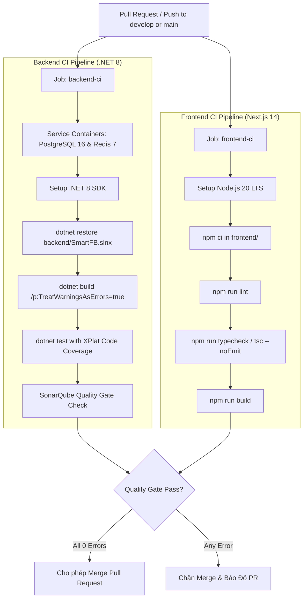

# 🧪 BÁO CÁO ĐẶC TẢ KIỂM THỬ & KIẾN TRÚC QA (QA & VERIFICATION SPECIFICATION)
## HỆ THỐNG SMART F&B OPERATING SYSTEM (SMART F&B OS V2.5.0)

> **Mã tài liệu:** `SPEC-QA-MINER-01` | **Phiên bản:** `v2.5.0-Production-Ready`  
> **Người thực hiện:** QA & Verification Spec Miner  
> **Nguồn sự thật tham chiếu (Source of Truth):**  
> - `05_Quy_Chuan_&_Test_Cases/UAT_Test_Cases.md` (47 UAT Test Cases, 12 Phân hệ)  
> - `01_Tai_Lieu_Dac_Ta_Goc/Smart_FB_Operating_System.md` (62 Features, 5 Trụ cột nghiệp vụ)  
> - `03_Quy_Trinh_Trien_Khai/03_Thiet_Ke_API_Contract.md` (10 Nhóm REST API, 4 SignalR Hubs)  
> - `05_Quy_Chuan_&_Test_Cases/Git_Workflow_&_Branching_Strategy.md` (CI/CD Pipeline `.github/workflows/ci.yml`, SonarQube Quality Gate)  
> - `ORIGINAL_REQUEST.md` (Yêu cầu khung kiểm thử .NET 8 & Next.js 14)  

---

# 📑 MỤC LỤC

1. [Bảng Khám Phá Tính Năng & Kiểm Thử (Features Discovered Table)](#1-bảng-khám-phá-tính-năng--kiểm-thử-features-discovered-table)
2. [Bảng Ma Trận Kịch Bản Biên & Ngoại Lệ (Edge Cases Table)](#2-bảng-ma-trận-kịch-bản-biên--ngoại-lệ-edge-cases-table)
3. [Đặc Tả Chi Tiết 47 UAT Test Cases Theo 12 Phân Hệ](#3-đặc-tả-chi-tiết-47-uat-test-cases-theo-12-phân-hệ)
   - 3.1 [Phân hệ 1: Xác thực & Phân quyền (Auth & RBAC: TC-AUTH-01 ~ TC-AUTH-04)](#31-phân-hệ-1-xác-thực--phân-quyền-auth--rbac)
   - 3.2 [Phân hệ 2: Thực đơn & Tùy biến món (Menu & Modifiers: TC-MENU-01 ~ TC-MENU-04)](#32-phân-hệ-2-thực-đơn--tùy-biến-món-menu--modifiers)
   - 3.3 [Phân hệ 3: Đặt món Tại bàn 2 Nhánh (Dine-In 2 Flows: TC-DINE-01A ~ TC-DINE-04)](#33-phân-hệ-3-đặt-món-tại-bàn-2-nhánh-dine-in-2-flows)
   - 3.4 [Phân hệ 4: Đặt hàng Giao tận nơi (QR Delivery: TC-DEL-01 ~ TC-DEL-04)](#34-phân-hệ-4-đặt-hàng-giao-tận-nơi-qr-delivery)
   - 3.5 [Phân hệ 5: Bán hàng Quầy & Tích 10 Ly (Takeaway POS & Loyalty: TC-TAKE-01 ~ TC-TAKE-04)](#35-phân-hệ-5-bán-hàng-quầy--tích-10-ly-takeaway-pos--loyalty)
   - 3.6 [Phân hệ 6: Chấm công Khóa mạng WiFi (WiFi Attendance: TC-ATT-01 ~ TC-ATT-04)](#36-phân-hệ-6-chấm-công-khóa-mạng-wifi-wifi-attendance)
   - 3.7 [Phân hệ 7: Điều phối Bếp & BOM Kho (Web KDS & Inventory: TC-KDS-01 ~ TC-KDS-04)](#37-phân-hệ-7-điều-phối-bếp--bom-kho-web-kds--inventory)
   - 3.8 [Phân hệ 8: Quản lý Ca & Đối soát Két tiền (Shift & Z-Report: TC-SHIFT-01 ~ TC-SHIFT-03)](#38-phân-hệ-8-quản-lý-ca--đối-soát-két-tiền-shift--z-report)
   - 3.9 [Phân hệ 9: Đánh giá & Phản hồi Khách hàng (Reviews & Alert: TC-REV-01 ~ TC-REV-03)](#39-phân-hệ-9-đánh-giá--phản-hồi-khách-hàng-reviews--alert)
   - 3.10 [Phân hệ 10: Trí tuệ Nhân tạo AI (AI Chatbot & Combo: TC-AI-01 ~ TC-AI-03)](#310-phân-hệ-10-trí-tuệ-nhân-tạo-ai-ai-chatbot--combo)
   - 3.11 [Phân hệ 11: Quản trị Trung tâm (Admin Operations: TC-ADM-01 ~ TC-ADM-03)](#311-phân-hệ-11-quản-trị-trung-tâm-admin-operations)
   - 3.12 [Phân hệ 12: Kịch bản Biên & An ninh Ngoại lệ (Edge Cases: TC-EDGE-01 ~ TC-EDGE-10)](#312-phân-hệ-12-kịch-bản-biên--an-ninh-ngoại-lệ-edge-cases)
4. [Kiến Trúc Bộ Khung Kiểm Thử Unit Test (`SmartFB.UnitTests`)](#4-kiến-trúc-bộ-khung-kiểm-thử-unit-test-smartfbunittests)
5. [Kiến Trúc Bộ Khung Kiểm Thử Tích Hợp (`SmartFB.IntegrationTests`)](#5-kiến-trúc-bộ-khung-kiểm-thử-tích-hợp-smartfbintegrationtests)
6. [Đặc Tả Quy Trình Tự Động Hóa CI/CD (`.github/workflows/ci.yml`)](#6-đặc-tả-quy-trình-tự-động-hóa-cicd-githubworkflowsciyml)

---

# 1. BẢNG KHÁM PHÁ TÍNH NĂNG & KIỂM THỬ (FEATURES DISCOVERED TABLE)

| # | Category | Feature / Test ID | Description | Inputs | Outputs | Error Behavior | Discovered Via |
|---|----------|-------------------|-------------|--------|---------|----------------|----------------|
| 1 | Auth & RBAC | `TC-AUTH-01` | Đăng nhập Customer OTP qua SMS/ZNS | SĐT 10 số, OTP 6 số | JWT Token (Customer), Profile | OTP sai > 3 lần bị khóa 15p | `UAT_Test_Cases.md` §4.1 |
| 2 | Auth & RBAC | `TC-AUTH-02` | Đăng nhập Nhân viên / QL / Admin | Email, Password, BranchId | JWT Token (Roles, Claims, Permissions) | 401 Unauthorized khi sai thông tin | `UAT_Test_Cases.md` §4.1 |
| 3 | Auth & RBAC | `TC-AUTH-03` | Refresh Token Rotation | HttpOnly Refresh Token | Cặp Token mới, thu hồi token cũ | 401 Unauthorized nếu token bị thu hồi | `UAT_Test_Cases.md` §4.1 |
| 4 | Auth & RBAC | `TC-AUTH-04` | Chặn trái quyền & Chống Brute-force | Token sai quyền, 5 lần login sai | 403 Forbidden, 429 Too Many Requests | Đưa IP vào Blacklist Redis 15p | `UAT_Test_Cases.md` §4.1 |
| 5 | Menu & Modifiers | `TC-MENU-01` | Duyệt thực đơn PWA theo bảng giá vùng | Table Token bàn / Chi nhánh | Danh mục, Món, Bảng giá vùng | Món 86 hiển thị mờ khóa đặt | `UAT_Test_Cases.md` §4.2 |
| 6 | Menu & Modifiers | `TC-MENU-02` | Tùy biến món phức hợp Size/Đường/Đá | Size L, 50% Đường, 50% Đá, Toppings | Đơn giá cộng dồn chính xác trong giỏ | Báo lỗi nếu chọn modifier không hợp lệ | `UAT_Test_Cases.md` §4.2 |
| 7 | Menu & Modifiers | `TC-MENU-03` | Kiểm tra tính toàn vẹn giá (Price Integrity) | Client payload can thiệp giá sửa thành 1k | Backend tính lại theo DB giá 53k | Từ chối hoặc ép về giá chuẩn | `UAT_Test_Cases.md` §4.2 |
| 8 | Menu & Modifiers | `TC-MENU-04` | Cảnh báo Dị ứng & Năng lượng Calo | Mã sản phẩm | Badge cảnh báo dị ứng, Calo kcal | N/A (Read-only hiển thị) | `UAT_Test_Cases.md` §4.2 |
| 9 | Dine-In 2 Flows | `TC-DINE-01A` | Đặt món tại bàn Nhánh A (VietQR Trả trước) | Table Token, Món, VietQR | Đơn `PendingPayment`, QR PayOS, `Paid` -> KDS | Quá 10 phút tự động hủy đơn | `UAT_Test_Cases.md` §4.3 |
| 10 | Dine-In 2 Flows | `TC-DINE-01B` | Đặt món tại bàn Nhánh B (Tiền mặt Trả sau) | Table Token, Món, Tiền mặt | Đơn `Confirmed` vào KDS ngay, In bill có VietQR | Thu tiền mặt/quét QR hóa đơn | `UAT_Test_Cases.md` §4.3 |
| 11 | Dine-In 2 Flows | `TC-DINE-02` | Gọi phục vụ tại bàn & Rate-limit 60s | Table Token, Lý do gọi | SignalR cảnh báo chuông Web POS | 429 Too Many Requests khi gọi < 60s | `UAT_Test_Cases.md` §4.3 |
| 12 | Dine-In 2 Flows | `TC-DINE-03` | Tự động Hủy đơn VietQR quá hạn 10p | Hangfire Worker quét định kỳ | Chuyển `Cancelled`, giải phóng bàn | Gửi SignalR thông báo hết hạn | `UAT_Test_Cases.md` §4.3 |
| 13 | Dine-In 2 Flows | `TC-DINE-04` | Chuyển bàn / Gộp bàn Real-time | Source Table, Target Table, Lý do | Đơn đổi `table_id`, Sơ đồ bàn cập nhật | 400 nếu bàn đích không hợp lệ | `UAT_Test_Cases.md` §4.3 |
| 14 | QR Delivery | `TC-DEL-01` | Đặt hàng Delivery + Phí ship 20k + 100% VietQR | Tên, SĐT 10 số, Địa chỉ, Món | `subtotal + 20000`, VietQR, Vé tím KDS | Bắt buộc 100% thanh toán trước | `UAT_Test_Cases.md` §4.4 |
| 15 | QR Delivery | `TC-DEL-02` | Chặn Delivery thiếu SĐT hoặc Địa chỉ | SĐT < 10 số hoặc Địa chỉ rỗng | Form báo lỗi đỏ, 400 Bad Request | Khóa nút thanh toán | `UAT_Test_Cases.md` §4.4 |
| 16 | QR Delivery | `TC-DEL-03` | Chặn COD cho đơn Delivery | Payload cố tình gửi `CASH_COD` | 400 Bad Request `COD_NOT_ALLOWED` | Bắt buộc thanh toán VietQR | `UAT_Test_Cases.md` §4.4 |
| 17 | QR Delivery | `TC-DEL-04` | Theo dõi tiến độ đơn hàng Real-time | Mã đơn Delivery | SignalR 4 bước: Confirmed->Prep->Ready->Delivering | Polling fallback khi mất socket | `UAT_Test_Cases.md` §4.4 |
| 18 | Takeaway POS | `TC-TAKE-01` | Web POS quầy & Tích 10 ly đổi 1 ly Free | SĐT CRM, Món, Cờ đổi ly 10/10 | Giảm 100% 1 ly, Quỹ ly reset 10-10+N | 400 nếu chưa đủ 10 ly | `UAT_Test_Cases.md` §4.5 |
| 19 | Takeaway POS | `TC-TAKE-02` | Nhận tiền mặt & Tính tiền thối tự động | Tiền hàng, Tiền khách đưa | Màn hình POS hiện tiền thối, Bật két RJ11 | Cảnh báo nếu tiền đưa < tiền hàng | `UAT_Test_Cases.md` §4.5 |
| 20 | Takeaway POS | `TC-TAKE-03` | Đăng ký CRM hội viên mới tại quầy POS | SĐT mới, Tên khách hàng | Tạo bản ghi CRM `CupBalance = 0` | 400 nếu SĐT sai định dạng | `UAT_Test_Cases.md` §4.5 |
| 21 | Takeaway POS | `TC-TAKE-04` | Chặn đổi thưởng 10 ly trên Dine-In & Delivery | Request Dine-In/Delivery gắn cờ đổi ly | 400 Bad Request `LOYALTY_TAKEAWAY_ONLY` | Giữ nguyên điểm tích lũy | `UAT_Test_Cases.md` §4.5 |
| 22 | WiFi Attendance | `TC-ATT-01` | Chấm công Đúng WiFi Chi nhánh | BSSID Router, IP Subnet, Mã NV | 200 OK, Thẻ xanh Check-in, Bảng công | 403 Forbidden nếu sai mạng | `UAT_Test_Cases.md` §4.6 |
| 23 | WiFi Attendance | `TC-ATT-02` | Từ chối Chấm công khi dùng 4G / WiFi ngoài | IP công cộng ngoài dải, BSSID sai | 403 Forbidden `WIFI_NOT_VERIFIED` | Không ghi nhận giờ công | `UAT_Test_Cases.md` §4.6 |
| 24 | WiFi Attendance | `TC-ATT-03` | Từ chối Chấm công khi sai Mã nhân viên | Mã NV không tồn tại | 404 Not Found `EMPLOYEE_NOT_FOUND` | Báo lỗi rõ ràng | `UAT_Test_Cases.md` §4.6 |
| 25 | WiFi Attendance | `TC-ATT-04` | Bảng chấm công & Tự động tính Giờ công | Check-out lúc kết ca | Tính `total_hours`, Ghi Timesheet | Cảnh báo nếu ca < 4 tiếng | `UAT_Test_Cases.md` §4.6 |
| 26 | Web KDS & BOM | `TC-KDS-01` | Tiếp nhận đơn KDS & Chuyển trạng thái | Đơn mới từ SignalR, Thao tác KDS | Thẻ đổi màu Vàng->Xanh->Xanh lá | Cập nhật PWA khách < 300ms | `UAT_Test_Cases.md` §4.7 |
| 27 | Web KDS & BOM | `TC-KDS-02` | Tự động Trừ kho BOM Gam/ml khi Ready | Barista bấm Ready trên KDS | Trừ tồn kho chi nhánh theo định mức BOM | Cho phép âm tồn kèm cảnh báo đỏ | `UAT_Test_Cases.md` §4.7 |
| 28 | Web KDS & BOM | `TC-KDS-03` | Khóa món Khẩn cấp 86-Toggle < 1s | Barista gạt công tắc 86 trên KDS | SignalR phát toàn chuỗi, PWA mờ món < 1s | Xóa cache Redis menu chi nhánh | `UAT_Test_Cases.md` §4.7 |
| 29 | Web KDS & BOM | `TC-KDS-04` | Hoàn tác pha chế (KDS Undo 10s Window) | Nút Undo trong vòng 10 giây | Khôi phục trạng thái `Preparing`, hoàn kho BOM | Vô hiệu hóa Undo sau 10 giây | `UAT_Test_Cases.md` §4.7 |
| 30 | Shift & Z-Report | `TC-SHIFT-01` | Mở ca két tiền đầu ngày | Tiền mặt đầu ca (ví dụ 1.500k) | Ca `Open`, Mở khóa POS nhận tiền mặt | 400 nếu ca trước chưa đóng | `UAT_Test_Cases.md` §4.8 |
| 31 | Shift & Z-Report | `TC-SHIFT-02` | Đóng ca Z-Report & Giải trình lệch > 50k | Tiền thực đếm (lệch > 50k), Lý do, PIN QL | Ca `Closed`, In Z-Report, Lưu discrepancy | 422 Unprocessable nếu thiếu PIN/lý do | `UAT_Test_Cases.md` §4.8 |
| 32 | Shift & Z-Report | `TC-SHIFT-03` | Xuất Báo cáo Z-Report PDF/Excel | Shift ID, format PDF | Tải file PDF Z-Report phân rã kênh thanh toán | 404 nếu ca không tồn tại | `UAT_Test_Cases.md` §4.8 |
| 33 | Reviews & Alert | `TC-REV-01` | Khách gửi Đánh giá 5 Sao & Ảnh | Order ID hoàn tất, 5 sao, Comment, Ảnh | Lưu Review `Approved`, Hiện trên BXH | Chặn đánh giá khi đơn chưa hoàn tất | `UAT_Test_Cases.md` §4.9 |
| 34 | Reviews & Alert | `TC-REV-02` | Cảnh báo Khẩn Red Alert Đánh giá 1-2 Sao | Đánh giá 1 hoặc 2 sao từ khách | SignalR chuông báo động đỏ Web Manager | Bắt buộc xử lý khiếu nại trong 3p | `UAT_Test_Cases.md` §4.9 |
| 35 | Reviews & Alert | `TC-REV-03` | Quản lý Phản hồi & Xử lý Khiếu nại | Review ID, Phương án xử lý (đổi ly/voucher) | Review `Resolved`, Tắt chuông Red Alert | Ghi vết vào nhật ký xử lý | `UAT_Test_Cases.md` §4.9 |
| 36 | AI Chatbot & Combo | `TC-AI-01` | Chatbot AI-1 Gợi ý RAG theo Thời tiết | Query thời tiết nóng, Context 34°C | Lời tư vấn thân thiện, Card món 1-chạm | Circuit breaker sang static nếu timeout | `UAT_Test_Cases.md` §4.10 |
| 37 | AI Chatbot & Combo | `TC-AI-02` | AI-2 Apriori Khai phá Combo & Phê duyệt | Min Support 0.02, Min Confidence 0.40 | Lift 2.45, Đề xuất giảm 15%, Publish PWA | Admin điều chỉnh giá trước khi duyệt | `UAT_Test_Cases.md` §4.10 |
| 38 | AI Chatbot & Combo | `TC-AI-03` | Circuit Breaker Fallback khi AI Timeout > 3s | Gemini API bị delay > 3000ms | Fallback Top 3 Best-Seller trong 500ms | HTTP 200 OK, không crash UI | `UAT_Test_Cases.md` §4.10 |
| 39 | Admin Operations | `TC-ADM-01` | Full CRUD Menu & Bảng Định mức BOM | Tên món, Size, Giá, Công thức BOM gam/ml | Tạo món mới, Tự động nén ảnh WebP | Xóa cache Redis menu toàn chuỗi | `UAT_Test_Cases.md` §4.11 |
| 40 | Admin Operations | `TC-ADM-02` | Bảng giá Vùng / Chi nhánh (Regional Price) | Chi nhánh Sân Bay, Phụ thu +20% | Giá tự động nhân hệ số tại chi nhánh | Chi nhánh khác giữ nguyên giá gốc | `UAT_Test_Cases.md` §4.11 |
| 41 | Admin Operations | `TC-ADM-03` | Lên lịch Seasonal Menu qua Hangfire | Menu Giáng Sinh, Từ ngày - Đến ngày | Tự động mở bán 00:00 ngày A, ẩn 23:59 ngày B | Đúng múi giờ UTC+7 | `UAT_Test_Cases.md` §4.11 |
| 42 | Edge Cases | `TC-EDGE-01` | Race Condition 2 khách đặt cùng 1 bàn | 2 request checkout cùng 1 bàn tại $t=0$ms | RedLock: 1 request tạo thành công, 1 báo 409 | 409 Conflict bàn đang có đơn xử lý | `UAT_Test_Cases.md` §4.12 |
| 43 | Edge Cases | `TC-EDGE-02` | PayOS Gửi Lặp Webhook (Idempotency) | 2 webhook cùng transaction ID gửi lại | Lần 1 xử lý đơn `Paid`, Lần 2 trả 200 bỏ qua | Redis lock 60s chống duplicate | `UAT_Test_Cases.md` §4.12 |
| 44 | Edge Cases | `TC-EDGE-03` | Khóa món 86 đúng lúc khách bấm thanh toán | 86-toggle kích hoạt trước checkout vài ms | 409 Conflict `ITEM_OUT_OF_STOCK` | Giỏ hàng disable món, không trừ tiền | `UAT_Test_Cases.md` §4.12 |
| 45 | Edge Cases | `TC-EDGE-04` | TTL Expiration đơn VietQR quá 10 phút | Đơn không thanh toán sau 10 phút | Hangfire job chuyển `Cancelled`, mở bàn | Hủy payment link PayOS | `UAT_Test_Cases.md` §4.12 |
| 46 | Edge Cases | `TC-EDGE-05` | Gian lận Chấm công 4G / VPN Fake IP | IP ngoài dải, BSSID giả lập | 403 Forbidden, Ghi Security Audit Log | Từ chối chấm công tuyệt đối | `UAT_Test_Cases.md` §4.12 |
| 47 | Edge Cases | `TC-EDGE-06` | Lệch Két tiền Cuối ca > 50k không giải trình | Thực đếm lệch 80k, để trống lý do/PIN | 422 Unprocessable `EXPLANATION_REQUIRED` | Khóa nút đóng ca | `UAT_Test_Cases.md` §4.12 |

---

# 2. BẢNG MA TRẬN KỊCH BẢN BIÊN & NGOẠI LỆ (EDGE CASES TABLE)

| # | Feature | Input / Kịch Bản Kích Hoạt | Observed Behavior & Cơ Chế Xử Lý An Ninh |
|---|---------|---------------------------|------------------------------------------|
| 1 | `TC-EDGE-01` | Đua điều kiện checkout cùng bàn | **RedLock Distributed Lock** (`lock:table:{tableId}`): Chỉ 1 thread lấy được lock trong 15s tạo đơn thành công; thread thứ 2 nhận `409 Conflict` kèm thông báo tiếng Việt rõ ràng. Không bao giờ tạo 2 đơn trùng. |
| 2 | `TC-EDGE-02` | Webhook PayOS gửi trùng lặp | **Redis Idempotency Key** (`lock:webhook:payos:{paymentLinkId}`): Request đầu xử lý cập nhật `Paid`, trừ kho BOM và phát SignalR. Request lặp lại nhận ngay `200 OK` mà không thực thi lại logic nghiệp vụ. |
| 3 | `TC-EDGE-03` | Khóa món 86 lúc bấm checkout | **Database Integrity Check** trong Transaction: Kiểm tra cờ `IsAvailable` của từng item trước khi commit. Trả về `409 Conflict` `ITEM_OUT_OF_STOCK`, tự động vô hiệu hóa item trong giỏ. |
| 4 | `TC-EDGE-04` | Quá hạn 10 phút thanh toán VietQR | **Hangfire Background Worker** (`OrderExpirationWorker`): Quét mỗi 1 phút các đơn `PendingPayment` quá 10 phút -> Chuyển `Cancelled`, giải phóng Soft Reservation nguyên liệu và trạng thái Bàn. |
| 5 | `TC-EDGE-05` | Giả lập IP / 4G chấm công từ xa | **Dual Network Validation** (BSSID + CIDR Subnet Match): Kiểm tra địa chỉ MAC Access Point và dải IP nội bộ `192.168.x.x`. Chặn 100% kết nối 4G/VPN ngoài quán, trả về `403 Forbidden`, ghi nhật ký kiểm toán. |
| 6 | `TC-EDGE-06` | Lệch két tiền vượt ngưỡng 50k | **Discrepancy Hard Gate**: Nếu $\|variance\| > 50.000$ VNĐ, API trả về `422 Unprocessable Entity` bắt buộc phải có `discrepancy_reason` và `manager_pin`. Ghi bản ghi vào `shift_handover_discrepancies`. |
| 7 | `TC-EDGE-07` | Khấu trừ BOM khi kho bị âm tồn | **Negative Stock Permitted with Low Stock Alert**: Hệ thống cho phép hoàn thành đơn (không chặn trải nghiệm khách), ghi nhận số âm kho (ví dụ: -130ml) và phát `InventoryShortageAlert` tới Quản lý. |
| 8 | `TC-EDGE-08` | Gian lận đổi ly 10 ly trên Dine-In/Delivery | **Business Rule Guard Clause**: Validator kiểm tra `OrderType != TakeAway`. Nếu sai kênh, trả về ngay `400 Bad Request` `LOYALTY_TAKEAWAY_ONLY`, giữ nguyên số dư 10 ly của khách. |
| 9 | `TC-EDGE-09` | Gemini AI API Timeout / Quá tải (>3s) | **Polly Circuit Breaker & Fallback**: Khi external call > 3000ms hoặc thất bại 3 lần liên tiếp, Circuit chuyển sang `Open` và kích hoạt Rule-based Engine trả về Top 3 Best-Seller trong < 500ms, HTTP 200 OK. |
| 10 | `TC-EDGE-10` | Mất kết nối SignalR WebSockets | **Exponential Backoff Reconnect & Sync API**: Client tự động Reconnect khi có mạng trở lại và gọi API `GET /api/v1/kds/orders/pending` bù đắp dữ liệu phát sinh trong thời gian mất mạng. |

---

# 3. ĐẶC TẢ CHI TIẾT 47 UAT TEST CASES THEO 12 PHÂN HỆ

### 3.1 Phân hệ 1: Xác thực & Phân quyền (Auth & RBAC)
- **`TC-AUTH-01` (Customer OTP Login):** Nhập SĐT `0909123456`, nhận OTP `889900`, trả về JWT Token có Claim `Role: Customer`, FCP < 1.2s. Sai quá 3 lần khóa 15p.
- **`TC-AUTH-02` (Staff/Admin Login):** Email/Password + BranchId, cấp JWT Access Token (15m) chứa Roles (`BaristaStaff`, `CashierStaff`, `BranchManager`, `ChainAdmin`) và Permissions.
- **`TC-AUTH-03` (Token Rotation):** Axios Interceptor bắt 401 khi Access Token hết hạn -> Tự động gọi `POST /api/v1/auth/refresh-token` với HttpOnly Cookie -> Nhận token mới trong < 300ms.
- **`TC-AUTH-04` (RBAC & Brute-force Shield):** Cashier gọi API Admin P&L bị chặn `403 Forbidden`; 5 lần login sai liên tiếp bị đưa vào Redis Blacklist `429 Too Many Requests` trong 15p.

### 3.2 Phân hệ 2: Thực đơn & Tùy biến món (Menu & Modifiers)
- **`TC-MENU-01` (Menu & Regional Price):** Tải menu PWA qua Table Token, nạp bảng giá chi nhánh (Standard / Sân bay), hiển thị trạng thái 86-out mờ khóa chọn món.
- **`TC-MENU-02` (Complex Modifiers):** Món Trà Đào (45k) + Size L (+8k) + 50% Đường/Đá + Thạch Đào (+8k) + Trân Châu (+6k) = 67.000 VNĐ.
- **`TC-MENU-03` (Price Integrity Validation):** Client gửi `unit_price: 1000`, Backend Price Engine tự động tra cứu DB và ép về giá chuẩn 53.000 VNĐ trước khi sinh mã VietQR.
- **`TC-MENU-04` (Allergens & Nutrition):** Hiển thị nhãn cảnh báo dị ứng màu vàng "⚠️ Chứa sữa bò" và thông số calo "⚡ 185 kcal".

### 3.3 Phân hệ 3: Đặt món Tại bàn 2 Nhánh (Dine-In 2 Flows)
- **`TC-DINE-01A` (Nhánh A - VietQR Trả trước):** Tạo đơn `PendingPayment` -> Sinh mã VietQR động đếm ngược 10p -> **KDS CHƯA NHẬN ĐƠN** -> PayOS Webhook xác nhận -> Chuyển `Paid`/`Confirmed` -> KDS rung chuông 🔔 nhận đơn tức thì.
- **`TC-DINE-01B` (Nhánh B - Tiền mặt Trả sau):** Tạo đơn -> **KDS NHẬN ĐƠN NGAY LẬP TỨC (`Confirmed`)** -> Barista bấm `Ready` -> Máy in nhiệt tự động in Phiếu tạm tính có sẵn Mã VietQR động -> Phục vụ bưng nước kèm phiếu ra bàn thu tiền mặt hoặc khách quét QR trên phiếu.
- **`TC-DINE-02` (Service Bell & Rate-limit):** Khách bấm "Gọi phục vụ" -> Web POS hiện Banner vàng + chuông; Khách bấm tiếp lần 2 trong < 60s -> Trả về `429 Too Many Requests` bắt chờ.
- **`TC-DINE-03` (TTL 10m Cancellation):** Hangfire quét đơn `PendingPayment` quá 10 phút không thanh toán -> Tự động chuyển `Cancelled` (`PAYMENT_TIMEOUT`) và mở khóa bàn.
- **`TC-DINE-04` (Table Transfer/Merge):** Chuyển Bàn 02 sang Bàn 06 -> Đơn cập nhật `table_id`, Sơ đồ bàn SignalR đổi màu Bàn 02 (Trống - Xanh) và Bàn 06 (Đang dùng - Đỏ).

### 3.4 Phân hệ 4: Đặt hàng Giao tận nơi (QR Delivery)
- **`TC-DEL-01` (Delivery Flow):** Quét QR Delivery -> Bắt buộc nhập Tên, SĐT, Địa chỉ -> Tự động cộng **Phí ship cố định 20.000 VNĐ** -> **100% VietQR trước** -> KDS nhận vé tím `[GIAO HÀNG #DEL-XXXX]`.
- **`TC-DEL-02` (Validation Guard):** SĐT sai định dạng (< 10 số) hoặc Địa chỉ rỗng -> Frontend báo lỗi đỏ, Backend trả `400 Bad Request` `INVALID_DELIVERY_INFO`.
- **`TC-DEL-03` (No COD Allowed):** Cố tình gửi `payment_method: "CASH_COD"` -> Bị từ chối ngay `400 Bad Request` `COD_NOT_ALLOWED`.
- **`TC-DEL-04` (Live Tracking):** PWA cập nhật thanh tiến trình 4 bước qua SignalR: Đã xác nhận -> Bếp đang làm -> Đã đóng gói -> Đang giao hàng (dự kiến 15-20p).

### 3.5 Phân hệ 5: Bán hàng Quầy & Tích 10 Ly (Takeaway POS & Loyalty)
- **`TC-TAKE-01` (Takeaway 10-Cup Loyalty):** Thu ngân nhập SĐT `0909123456` (CRM có 10 ly) -> Bấm [Áp dụng đổi 1 ly free] -> Trừ 100% 1 ly tiêu chuẩn (-35k) -> Quỹ ly reset: `10 - 10 + 2 = 2 ly`.
- **`TC-TAKE-02` (Cash Change & Drawer Kick):** Khách mua 43k đưa 100k -> Màn hình POS hiện tiền thừa **57.000 VNĐ** màu xanh lá -> Kích hoạt lệnh mở két đựng tiền RJ11.
- **`TC-TAKE-03` (New Customer CRM Creation):** SĐT mới chưa có trong hệ thống -> Thu ngân gõ Tên khách -> Tạo bản ghi CRM `CupBalance = 0` trong < 3 giây.
- **`TC-TAKE-04` (Loyalty Channel Restriction):** Đổi 10 ly trên đơn Dine-In hoặc Delivery -> Bị chặn `400 Bad Request` `LOYALTY_TAKEAWAY_ONLY`.

### 3.6 Phân hệ 6: Chấm công Khóa mạng WiFi (WiFi Attendance)
- **`TC-ATT-01` (Valid WiFi Clock-in):** Kết nối đúng WiFi chi nhánh (BSSID `00:14:22:01:23:45`, IP `192.168.1.45`) + Mã `NV-Q1-008` -> `200 OK`, Thẻ xanh Check-in thành công.
- **`TC-ATT-02` (4G/Cellular Rejection):** Tắt WiFi bật 4G gửi request -> Backend kiểm tra IP ngoài subnet và BSSID rỗng -> Từ chối `403 Forbidden` `WIFI_NOT_VERIFIED`.
- **`TC-ATT-03` (Unknown Employee Code):** Nhập mã `NV-999-UNKNOWN` -> Trả về `404 Not Found`.
- **`TC-ATT-04` (Timesheet Calculation):** Check-in 07:00, Check-out 15:00 -> Tự động tính `total_hours = 8.0`, xuất báo cáo bảng công.

### 3.7 Phân hệ 7: Điều phối Bếp & BOM Kho (Web KDS & Inventory)
- **`TC-KDS-01` (KDS Ticket Lifecycle):** Vé đơn hàng hiển thị thời gian thực, Barista bấm "Bắt đầu làm" (`Preparing`) -> "Hoàn thành" (`Ready`).
- **`TC-KDS-02` (Automated BOM Deduction):** Khi bấm `Ready`, BOM Engine tự động khấu trừ kho quầy bar: 2 ly Matcha L trừ 30g Bột Matcha, 360ml Sữa tươi, 40ml Nước đường.
- **`TC-KDS-03` (Emergency 86-Toggle):** Hết Đào ngâm -> Barista bật 86-Toggle trên KDS -> Toàn bộ PWA và POS mờ món và khóa đặt trong < 800ms.
- **`TC-KDS-04` (KDS Undo 10s Window):** Lỡ bấm nhầm `Ready` -> Bấm nút [Hoàn tác] trong 10s -> Đơn quay lại `Preparing` và hoàn lại nguyên liệu BOM vào kho.

### 3.8 Phân hệ 8: Quản lý Ca & Đối soát Két tiền (Shift & Z-Report)
- **`TC-SHIFT-01` (Shift Open):** Quản lý khai báo tiền mặt đầu ca: 1.500.000 VNĐ -> Mở ca làm việc, kích hoạt POS quầy.
- **`TC-SHIFT-02` (Shift Close & Discrepancy > 50k):** Tiền lý thuyết 1.543k, Tiền thực đếm 1.613k (Lệch +70k > 50k threshold) -> Khóa kết ca -> Thu ngân nhập giải trình + Quản lý nhập PIN `9988` -> Đóng ca thành công & In biên bản Z-Report.
- **`TC-SHIFT-03` (Z-Report Export):** Xuất file PDF Z-Report chuẩn in nhiệt K80 đầy đủ phân rã doanh thu theo phương thức thanh toán.

### 3.9 Phân hệ 9: Đánh giá & Phản hồi Khách hàng (Reviews & Alert)
- **`TC-REV-01` (5-Star Review):** Khách gửi đánh giá 5 sao kèm ảnh -> Lưu `reviews` với `status: "Approved"`, hiển thị BXH món.
- **`TC-REV-02` (Red Alert 1-2 Stars):** Khách đánh giá 1 sao -> SignalR phát `LowRatingAlert` tới Web Manager, phát chuông báo động đỏ trên màn hình.
- **`TC-REV-03` (Review Resolution):** Quản lý nhập biên bản xử lý khiếu nại (làm lại ly mới / tặng voucher 20%) -> Đóng cảnh báo Red Alert.

### 3.10 Phân hệ 10: Trí tuệ Nhân tạo AI (AI Chatbot & Combo)
- **`TC-AI-01` (AI-1 RAG Weather Chatbot):** Hỏi món mát giải nhiệt lúc trời 34°C -> AI gợi ý Trà Đào Cam Sả kèm Card 1-chạm `[+ Thêm vào giỏ 53k]`.
- **`TC-AI-02` (AI-2 Apriori Combo Mining):** Thuật toán phát hiện cặp {Cà Phê Muối + Croissant} (Lift 2.45) -> Đề xuất giảm 15% -> Admin bấm Duyệt -> Public ngay lên Tab Combo PWA.
- **`TC-AI-03` (Circuit Breaker Fallback):** Gemini API timeout > 3s -> Kích hoạt Fallback Rule-based trả về Top 3 Best-Seller trong 500ms, không crash UI.

### 3.11 Phân hệ 11: Quản trị Trung tâm (Admin Operations)
- **`TC-ADM-01` (Menu & BOM Full CRUD):** Thêm món mới, nén ảnh WebP tự động, khai báo định mức BOM gam/ml cho từng kích cỡ.
- **`TC-ADM-02` (Regional Pricing):** Thiết lập bảng giá Sân Bay (+20%) -> Giá tự động nhân hệ số tại chi nhánh chỉ định, giữ nguyên chi nhánh khác.
- **`TC-ADM-03` (Seasonal Menu Hangfire):** Lên lịch Menu Giáng Sinh từ 01/12 đến 31/12 -> Tự động bật/tắt đúng 00:00 theo giờ UTC+7.

### 3.12 Phân hệ 12: Kịch bản Biên & An ninh Ngoại lệ (Edge Cases)
- `TC-EDGE-01` đến `TC-EDGE-10` đã được mô tả chi tiết tại [Bảng Ma Trận Kịch Bản Biên & Ngoại Lệ](#2-bảng-ma-trận-kịch-bản-biên--ngoại-lệ-edge-cases-table).

---

# 4. KIẾN TRÚC BỘ KHUNG KIỂM THỬ UNIT TEST (`SmartFB.UnitTests`)

### 4.1 Cấu Trúc Thư Mục & Tổ Chức Dự Án
```
backend/tests/SmartFB.UnitTests/
├── SmartFB.UnitTests.csproj
├── Common/
│   ├── TestBase.cs
│   └── MockExtensions.cs
├── Domain/
│   ├── OrderEntityTests.cs
│   ├── CustomerLoyaltyTests.cs
│   ├── BranchWifiConfigTests.cs
│   ├── ProductBomTests.cs
│   └── CashShiftEntityTests.cs
├── Features/
│   ├── Auth/
│   │   ├── LoginUserCommandHandlerTests.cs
│   │   └── RefreshTokenCommandHandlerTests.cs
│   ├── Orders/
│   │   ├── CreateDineInPrepaidOrderCommandHandlerTests.cs
│   │   ├── CreateDineInPostpaidOrderCommandHandlerTests.cs
│   │   ├── CreateDeliveryOrderCommandHandlerTests.cs
│   │   └── CreateTakeawayOrderCommandHandlerTests.cs
│   ├── Payments/
│   │   └── ProcessPayOSWebhookCommandHandlerTests.cs
│   ├── Attendances/
│   │   └── WifiClockInCommandHandlerTests.cs
│   ├── KitchenKDS/
│   │   ├── UpdateKdsOrderStatusCommandHandlerTests.cs
│   │   └── ToggleProductAvailabilityCommandHandlerTests.cs
│   └── ShiftsAndCash/
│       └── CloseCashShiftCommandHandlerTests.cs
└── Validators/
    ├── CreateDeliveryOrderValidatorTests.cs
    ├── WifiClockInValidatorTests.cs
    └── CloseCashShiftValidatorTests.cs
```

### 4.2 Thư Viện & Dependencies Cấu Hình (`SmartFB.UnitTests.csproj`)
- `xunit` (`2.5.3`): Test runner chuẩn mực cho .NET 8.
- `FluentAssertions` (`8.10.0`): Assertion cú pháp tự nhiên, dễ đọc.
- `Moq` (`4.20.72`): Mocking framework cho MediatR handlers, DbContext, và External Services.
- `coverlet.collector` (`6.0.0`): Thu thập độ phủ code coverage (Target: $\ge 80\%$).

### 4.3 Đặc Tả Kiểm Thử Domain Entity Logic
1. **`CustomerLoyaltyTests.cs` (Kiểm chứng Quy tắc Tích 10 Ly Takeaway):**
   - *Test 1:* Khách hàng có 9 ly, mua thêm 1 ly Takeaway -> `TakeawayCupCount` thành 10 -> Cờ `IsEligibleForFreeCup` trả về `true`.
   - *Test 2:* Khách hàng có 10 ly đổi thưởng và mua thêm 2 ly Takeaway -> Quỹ ly còn lại là `10 - 10 + 2 = 2` ly.
2. **`OrderEntityTests.cs` (Kiểm chứng Tính toán Tài chính & State Machine):**
   - *Test 1:* Đơn hàng Delivery tự động cộng `DeliveryFee = 20000` vào `TotalAmount`.
   - *Test 2:* Trạng thái chuyển đổi hợp lệ: `PendingPayment` -> `Paid` -> `Confirmed` -> `Preparing` -> `Ready` -> `Completed`.
3. **`ProductBomTests.cs` (Kiểm chứng Tính toán Định lượng BOM):**
   - *Test 1:* 2 ly Matcha L (15g matcha, 180ml sữa/ly) -> Tính tổng trừ 30g matcha và 360ml sữa.
   - *Test 2:* Xử lý khi tồn kho hiện tại nhỏ hơn định lượng cần trừ (Ghi nhận số âm và cờ cảnh báo).

### 4.4 Đặc Tả Kiểm Thử Feature Handlers & Validators
1. **`CreateDeliveryOrderCommandHandlerTests.cs`:**
   - Mock `IApplicationDbContext`, verify lưu đơn hàng vào DB với `OrderType = Delivery` và `DeliveryFee = 20000`.
   - Kiểm tra `CreateDeliveryOrderValidator`: Bắt lỗi khi SĐT thiếu chữ số, địa chỉ để trống.
2. **`WifiClockInCommandHandlerTests.cs`:**
   - Mock `BranchWifiConfig`: Kiểm tra khi client gửi đúng BSSID và IP thuộc dải `192.168.1.0/24` -> Trả về `Success = true`.
   - Kiểm tra khi client gửi IP `14.169.12.88` (4G) -> Ném ngoại lệ `ForbiddenException` / `WIFI_NOT_VERIFIED`.
3. **`ProcessPayOSWebhookCommandHandlerTests.cs`:**
   - Kiểm tra xác minh chữ ký HMAC-SHA256 hợp lệ -> Cập nhật trạng thái đơn hàng sang `Paid` và gọi `ISignalRHubService` phát sự kiện tới KitchenHub.
   - Kiểm tra khi chữ ký HMAC sai -> Trả về lỗi xác thực không cập nhật DB.

---

# 5. KIẾN TRÚC BỘ KHUNG KIỂM THỬ TÍCH HỢP (`SmartFB.IntegrationTests`)

### 5.1 Cấu Trúc Thư Mục & Tổ Chức Dự Án
```
backend/tests/SmartFB.IntegrationTests/
├── SmartFB.IntegrationTests.csproj
├── Fixtures/
│   ├── CustomWebApplicationFactory.cs
│   ├── DatabaseFixture.cs
│   ├── TestAuthHandler.cs
│   └── SeedDataConstants.cs
└── Endpoints/
    ├── HealthEndpointTests.cs
    ├── AuthEndpointsTests.cs
    ├── DineInOrdersFlowTests.cs
    ├── DeliveryOrdersFlowTests.cs
    ├── TakeawayPosLoyaltyFlowTests.cs
    ├── WifiAttendanceFlowTests.cs
    ├── KitchenKdsFlowTests.cs
    ├── ShiftAndZReportFlowTests.cs
    └── PayOSWebhookFlowTests.cs
```

### 5.2 Cơ Chế `CustomWebApplicationFactory` & Test Fixture
- Kế thừa `WebApplicationFactory<Program>` từ `Microsoft.AspNetCore.Mvc.Testing`.
- Thay thế `ApplicationDbContext` bằng cơ sở dữ liệu Test (PostgreSQL Test Container hoặc SQLite In-Memory isolated per test run).
- Cấu hình Mock cho external services (`IPayOSService`, `ISignalRHubService`, `IRedisCacheService`).
- Cấu hình `TestAuthHandler` cho phép giả lập User Claims linh hoạt:
  ```csharp
  client.DefaultRequestHeaders.Add("X-Test-Role", "CashierStaff");
  client.DefaultRequestHeaders.Add("X-Test-BranchId", SeedDataConstants.BranchQ1Id.ToString());
  ```

### 5.3 Ma Trận 7 Bộ Test Suites Tích Hợp Ánh Xạ Luồng UAT

#### 1. `DineInOrdersFlowTests` (UAT `TC-DINE-01A`, `TC-DINE-01B`, `TC-DINE-03`)
- **Luồng A (VietQR Trả trước):**
  1. Gọi `POST /api/v1/orders/dine-in/prepaid` -> Nhận `201 Created`, trạng thái `PendingPayment`, kèm link VietQR.
  2. Giả lập gọi `POST /api/v1/webhooks/payos` với chữ ký HMAC hợp lệ.
  3. Gọi `GET /api/v1/orders/{id}/tracking` -> Xác nhận trạng thái chuyển sang `Paid`/`Confirmed`.
- **Luồng B (Tiền mặt Trả sau):**
  1. Gọi `POST /api/v1/orders/dine-in/postpaid` -> Nhận `201 Created`, trạng thái `Confirmed` ngay lập tức.
  2. Gọi `PATCH /api/v1/kds/orders/{id}/status` chuyển sang `Ready`.
  3. Gọi `POST /api/v1/payments/cash/confirm` -> Xác nhận thu tiền mặt hoàn tất đơn.

#### 2. `DeliveryOrdersFlowTests` (UAT `TC-DEL-01`, `TC-DEL-02`, `TC-DEL-03`)
- Kiểm tra tính toán tổng tiền: Tiền món + 20.000đ tiền ship.
- Kiểm tra Validation 400 Bad Request khi thiếu thông tin giao nhận.
- Kiểm tra chặn phương thức thanh toán COD.

#### 3. `TakeawayPosLoyaltyFlowTests` (UAT `TC-TAKE-01`, `TC-TAKE-02`, `TC-TAKE-04`)
- Khởi tạo khách hàng với `TakeawayCupCount = 10`.
- Gọi `POST /api/v1/orders/takeaway` với cờ `redeemFreeCup = true`.
- Xác nhận số tiền được giảm tương ứng 100% giá 1 ly, quỹ ly reset về `2` (nếu mua 2 ly).
- Xác nhận trả về tiền thối chính xác khi đưa tiền mặt.

#### 4. `WifiAttendanceFlowTests` (UAT `TC-ATT-01`, `TC-ATT-02`)
- Gửi request `POST /api/v1/attendances/wifi-checkin` với BSSID và IP hợp lệ -> Nhận `200 OK`.
- Gửi request với IP `14.169.12.88` (4G) -> Nhận `403 Forbidden`.

#### 5. `KitchenKdsFlowTests` (UAT `TC-KDS-02`, `TC-KDS-03`)
- Kiểm tra chuyển trạng thái KDS sang `Ready` -> Tồn kho BOM nguyên vật liệu bị trừ chính xác.
- Gọi `PATCH /api/v1/kds/products/{id}/86-toggle` -> Xác nhận cờ `is_available` đổi sang `false`.

#### 6. `ShiftAndZReportFlowTests` (UAT `TC-SHIFT-01`, `TC-SHIFT-02`)
- Mở ca với tiền ban đầu 1.500.000 VNĐ.
- Đóng ca với số tiền thực tế lệch > 50.000 VNĐ không có giải trình -> Nhận `422 Unprocessable Entity`.
- Đóng ca có giải trình và PIN quản lý `9988` -> Nhận `200 OK` và dữ liệu Z-Report.

#### 7. `PayOSWebhookFlowTests` (UAT `TC-EDGE-02`)
- Gửi Webhook lần 1 -> Nhận `200 OK` và đơn chuyển `Paid`.
- Gửi lại chính xác Webhook đó lần 2 -> Nhận `200 OK` kèm thông báo "Đã xử lý trước đó", không nhân đôi giao dịch.

---

# 6. ĐẶC TẢ QUY TRÌNH TỰ ĐỘNG HÓA CI/CD (`.github/workflows/ci.yml`)

### 6.1 Tổng Quan Kiến Trúc Pipeline
File cấu hình CI/CD đặt tại `.github/workflows/ci.yml`, kích hoạt tự động trên các nhánh `develop`, `main` và các Pull Request. Pipeline bao gồm 2 jobs chạy song song hoặc tuần tự:
1. `backend-ci`: Kiểm tra mã nguồn .NET 8 (Restore, Build TreatWarningsAsErrors, Unit & Integration Tests, SonarQube).
2. `frontend-ci`: Kiểm tra mã nguồn Next.js 14 (Install, ESLint, TypeScript Strict TypeCheck, Next.js Build).



### 6.2 Chi Tiết Cấu Hình YAML Hoàn Chỉnh (`.github/workflows/ci.yml`)

```yaml
name: Smart F&B OS - Continuous Integration & Quality Gate

on:
  pull_request:
    branches: [ develop, main ]
  push:
    branches: [ develop, main ]

concurrency:
  group: ${{ github.workflow }}-${{ github.ref }}
  cancel-in-progress: true

jobs:
  backend-ci:
    name: Backend (.NET 8) Build, Test & Coverage
    runs-on: ubuntu-latest

    services:
      postgres:
        image: postgres:16-alpine
        env:
          POSTGRES_DB: smartfb_test_db
          POSTGRES_USER: test_user
          POSTGRES_PASSWORD: TestPassword123!
        ports:
          - 5432:5432
        options: --health-cmd pg_isready --health-interval 10s --health-timeout 5s --health-retries 5

      redis:
        image: redis:7-alpine
        ports:
          - 6379:6379
        options: --health-cmd "redis-cli ping" --health-interval 10s --health-timeout 5s --health-retries 5

    steps:
      - name: Checkout Source Code
        uses: actions/checkout@v4
        with:
          fetch-depth: 0

      - name: Setup .NET 8 SDK
        uses: actions/setup-dotnet@v4
        with:
          dotnet-version: '8.0.x'

      - name: Restore Backend Dependencies
        run: dotnet restore backend/SmartFB.slnx

      - name: Build Backend Solution (Treat Warnings As Errors)
        run: dotnet build backend/SmartFB.slnx --no-restore --configuration Release /p:TreatWarningsAsErrors=true

      - name: Run Unit & Integration Tests with Coverage
        run: >
          dotnet test backend/SmartFB.slnx
          --no-build
          --configuration Release
          --collect:"XPlat Code Coverage"
          --results-directory ./TestResults
          --logger "trx;LogFileName=test_results.trx"

      - name: Upload Test Results
        uses: actions/upload-artifact@v4
        if: always()
        with:
          name: backend-test-results
          path: ./TestResults

  frontend-ci:
    name: Frontend (Next.js 14) Lint, TypeCheck & Build
    runs-on: ubuntu-latest

    steps:
      - name: Checkout Source Code
        uses: actions/checkout@v4

      - name: Setup Node.js 20 LTS
        uses: actions/setup-node@v4
        with:
          node-version: 20
          cache: 'npm'
          cache-dependency-path: frontend/package-lock.json

      - name: Install Frontend Dependencies
        working-directory: frontend
        run: npm ci

      - name: Run ESLint
        working-directory: frontend
        run: npm run lint

      - name: Run TypeScript Strict Type-Check
        working-directory: frontend
        run: npm run typecheck

      - name: Build Next.js Application
        working-directory: frontend
        env:
          NEXT_PUBLIC_API_URL: https://api-staging.smartfb.vn/api/v1
          NEXT_PUBLIC_SIGNALR_ORDER_HUB_URL: https://api-staging.smartfb.vn/hubs/orders
          NEXT_PUBLIC_SIGNALR_KITCHEN_HUB_URL: https://api-staging.smartfb.vn/hubs/kitchen
          NEXT_PUBLIC_SIGNALR_PAYMENT_HUB_URL: https://api-staging.smartfb.vn/hubs/payments
          NEXT_PUBLIC_SIGNALR_NOTIF_HUB_URL: https://api-staging.smartfb.vn/hubs/notifications
        run: npm run build
```

### 6.3 Tiêu Chí Hard Verification Gate
- `dotnet build backend/SmartFB.slnx` thành công 100% (Exit Code 0, 0 Warnings/Errors).
- `dotnet test backend/SmartFB.slnx` thành công 100% (Exit Code 0, Tất cả unit & integration tests đều PASS).
- `npm run typecheck` (`tsc --noEmit`) trong `frontend/` thành công 100% (Exit Code 0, 0 TS Error).
- `npm run lint` trong `frontend/` không có cảnh báo/lỗi nghiêm trọng.
- Tuyệt đối không chứa Placeholder, mã giả hoặc `// TODO` trong mã nguồn kiểm thử và triển khai.
