# 📘 SMART F&B OPERATING SYSTEM: BẢN ĐẶC TẢ KỸ THUẬT TOÀN DIỆN VỀ WORKFLOWS & ACTORS
## Hệ Thống Quản Trị & Vận Hành F&B Đa Chi Nhánh Tích Hợp Đặt Món QR & AI

> **Tài liệu:** Bản thiết kế kỹ thuật chi tiết (Technical Specification Blueprint) định nghĩa toàn bộ Actors, Ma trận phân quyền RBAC, và 18+ Quy trình nghiệp vụ cốt lõi (Core Business, Admin & Operational Workflows) kèm sơ đồ tuần tự Mermaid chuẩn 100%.  
> **Phiên bản:** v2.5.0-Production-Ready  
> **Tác giả:** Đội ngũ Kỹ sư Hệ thống Smart F&B OS  
> **Phạm vi áp dụng:** 100% Web Responsive (Next.js 14 App Router) + Backend .NET 8 Clean Architecture + PostgreSQL 16 + Redis 7 + SignalR Hubs.  
> **Quy chuẩn bất biến:**  
> 1. Hoàn toàn KHÔNG có Staff Mobile App (Native App bị loại bỏ; 100% nhân viên vận hành trên Web Responsive và Web KDS).  
> 2. Đã loại bỏ triệt để tính năng C-23 (Chia sẻ món ăn MXH) và C-24 (Push Notification khuyến mãi PWA).  
> 3. Tuyệt đối không chứa placeholder (`TODO`, `TBD`, mã giả rút gọn).

---

# 📑 MỤC LỤC

1. [Tổng Quan Hệ Thống & 4 Nhóm Actor](#1-tổng-quan-hệ-thống--4-nhóm-actor)
2. [Đặc Tả Chi Tiết 4 Nhóm Actor & Thiết Bị Vận Hành](#2-đặc-tả-chi-tiết-4-nhóm-actor--thiết-bị-vận-hành)
3. [Ma Trận Phân Quyền RBAC Chi Tiết (Role-Based Access Control)](#3-ma-trận-phân-quyền-rbac-chi-tiết-role-based-access-control)
4. [Danh Mục Tính Năng Chi Tiết Từng Actor (Feature Catalog)](#4-danh-mục-tính-năng-chi-tiết-từng-actor-feature-catalog)
5. [Các Quy Trình Nghiệp Vụ Bán Hàng & Phục Vụ (Core Business Workflows)](#5-các-quy-trình-nghiệp-vụ-bán-hàng--phục-vụ-core-business-workflows)
   - [WF-00: Nhận Diện SĐT CRM & Khởi Tạo Hồ Sơ Khách Hàng](#wf-00-nhận-diện-sđt-crm--khởi-tạo-hồ-sơ-khách-hàng)
   - [WF-01A: Đặt Món Tại Bàn (Dine-In) — VietQR Trả Trước (Pre-Payment)](#wf-01a-đặt-món-tại-bàn-dine-in--vietqr-trả-trước-pre-payment)
   - [WF-01B: Đặt Món Tại Bàn (Dine-In) — Tiền Mặt Trả Sau (Post-Payment & Bill VietQR)](#wf-01b-đặt-món-tại-bàn-dine-in--tiền-mặt-trả-sau-post-payment--bill-vietqr)
   - [WF-02: Đặt Hàng Giao Tận Nơi (QR Delivery) — Phí Ship 20k & VietQR 100%](#wf-02-đặt-hàng-giao-tận-nơi-qr-delivery--phí-ship-20k--vietqr-100)
   - [WF-03: Bán Mang Về Tại Quầy (Takeaway Staff POS) — Tích 10 Ly Tặng 1 & Thu Tiền Sau](#wf-03-bán-mang-về-tại-quầy-takeaway-staff-pos--tích-10-ly-tặng-1--thu-tiền-sau)
   - [WF-04: Chấm Công Khóa Mạng WiFi (WiFi-Locked Attendance)](#wf-04-chấm-công-khóa-mạng-wifi-wifi-locked-attendance)
6. [Các Quy Trình Nghiệp Vụ Quản Trị Hệ Thống (Admin Workflows)](#6-các-quy-trình-nghiệp-vụ-quản-trị-hệ-thống-admin-workflows)
   - [WF-ADM-01: Quản Trị Danh Mục & Sản Phẩm Toàn Diện (Product Full CRUD & BOM)](#wf-adm-01-quản-trị-danh-mục--sản-phẩm-toàn-diện-product-full-crud--bom)
   - [WF-ADM-02: Tạo Combo Thủ Công & Phê Duyệt Gợi Ý Combo AI-2 (Apriori Mining)](#wf-adm-02-tạo-combo-thủ-công--phê-duyệt-gợi-ý-combo-ai-2-apriori-mining)
   - [WF-ADM-03: Tải Lên & Xử Lý Đa Phương Tiện (Image Upload & CDN Optimization)](#wf-adm-03-tải-lên--xử-lý-đa-phương-tiện-image-upload--cdn-optimization)
   - [WF-ADM-04: Quản Lý Bảng Giá Đa Chi Nhánh (Branch Dynamic Pricing Matrix)](#wf-adm-04-quản-lý-bảng-giá-đa-chi-nhánh-branch-dynamic-pricing-matrix)
   - [WF-ADM-05: Khóa Món Khẩn Cấp Chuỗi & Chi Nhánh (86-Toggle Synchronization)](#wf-adm-05-khóa-món-khẩn-cấp-chuỗi--chi-nhánh-86-toggle-synchronization)
   - [WF-ADM-06: Quản Lý Cấu Trúc Danh Mục & Thứ Tự Hiển Thị Menu](#wf-adm-06-quản-lý-cấu-trúc-danh-mục--thứ-tự-hiển-thị-menu)
   - [WF-ADM-07: Lên Lịch Thực Đơn Theo Mùa (Seasonal Menu Scheduling)](#wf-adm-07-lên-lịch-thực-đơn-theo-mùa-seasonal-menu-scheduling)
7. [Các Quy Trình Nghiệp Vụ Vận Hành Chi Nhánh (Operational Workflows)](#7-các-quy-trình-nghiệp-vụ-vận-hành-chi-nhánh-operational-workflows)
   - [WF-OPS-01: Vòng Đời Đơn Hàng Real-Time SignalR & Gom Món Bếp KDS](#wf-ops-01-vòng-đời-đơn-hàng-real-time-signalr--gom-món-bếp-kds)
   - [WF-OPS-02: Tiếp Nhận & Xử Lý Cảnh Báo Gọi Phục Vụ Tại Bàn](#wf-ops-02-tiếp-nhận--xử-lý-cảnh-báo-gọi-phục-vụ-tại-bàn)
   - [WF-OPS-03: Mở/Kết Ca Bán Hàng & Đối Soát Két Tiền Mặt (Cash Drawer Reconciliation)](#wf-ops-03-mởkết-ca-bán-hàng--đối-soát-két-tiền-mặt-cash-drawer-reconciliation)
   - [WF-OPS-04: Xuất Kho Quầy Bar, Trừ Tồn Tự Động Theo BOM & Cảnh Báo Ngưỡng Tồn](#wf-ops-04-xuất-kho-quầy-bar-trừ-tồn-tự-động-theo-bom--cảnh-báo-ngưỡng-tồn)
   - [WF-OPS-05: Đánh Giá Trải Nghiệm, Tải Ảnh & Leo Thang Xử Lý Review Xấu (<= 2 Sao)](#wf-ops-05-đánh-giá-trải-nghiệm-tải-ảnh--leo-thang-xử-lý-review-xấu--2-sao)
8. [Đặc Tả Máy Trạng Thái (State Machine Specifications)](#8-đặc-tả-máy-trạng-thái-state-machine-specifications)
9. [Giao Thức Sự Kiện Thời Gian Thực SignalR (SignalR Hubs & Event Contracts)](#9-giao-thức-sự-kiện-thời-gian-thực-signalr-signalr-hubs--event-contracts)
10. [Bảng Tổng Hợp Tính Năng Khám Phá (Features Discovered)](#10-bảng-tổng-hợp-tính-năng-khám-phá-features-discovered)
11. [Ma Trận Xử Lý Trường Hợp Biên & Ngoại Lệ (Edge Cases Matrix)](#11-ma-trận-xử-lý-trường-hợp-biên--ngoại-lệ-edge-cases-matrix)

---

# 1. TỔNG QUAN HỆ THỐNG & 4 NHÓM ACTOR

Hệ thống **Smart F&B OS** phân định quyền hạn chặt chẽ thành **4 nhóm tác nhân (Actors)**. Kiến trúc bảo đảm tính tách biệt tuyệt đối giữa giao diện khách hàng không cần cài đặt (PWA), giao diện vận hành quầy phản ứng nhanh (Web POS/KDS), giao diện quản lý chi nhánh (Manager Portal) và giao diện điều hành chuỗi trung tâm (Admin Portal).

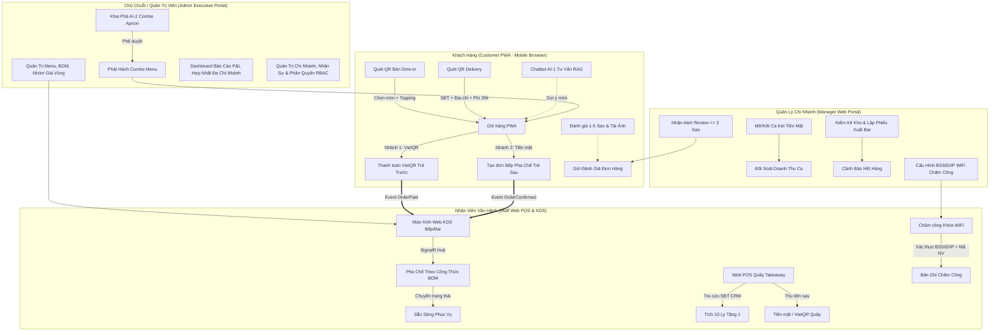

---

# 2. ĐẶC TẢ CHI TIẾT 4 NHÓM ACTOR & THIẾT BỊ VẬN HÀNH

| Nhóm Actor | Định Danh Mã Hệ Thống | Thiết Bị Truy Cập | Công Nghệ Giao Diện | Trách Nhiệm Vận Hành Chính |
|---|---|---|---|---|
| **1. Khách Hàng** *(Customer)* | `GuestCustomer`<br>`AuthCustomer` | Điện thoại thông minh (iOS Safari, Android Chrome) | Next.js 14 PWA (Mobile-First Web), không cần cài đặt App | Quét QR bàn đặt món, quét QR Delivery đặt tận nhà, thanh toán VietQR, chat tư vấn AI-1 RAG, gọi phục vụ, đánh giá món ăn. |
| **2. Nhân Viên Quầy** *(Staff / Barista)* | `BaristaStaff`<br>`CashierStaff`<br>`ServiceStaff` | Smart TV / iPad Bếp (KDS), Máy POS màn hình cảm ứng / Tablet / Laptop | Web KDS Full-screen, Web Responsive POS Quầy, Web Attendance | Nhận đơn thời gian thực qua SignalR, xem BOM pha chế, chuyển trạng thái đơn, thao tác POS Takeaway, tra cứu CRM 10 ly, thu tiền sau, chấm công WiFi. |
| **3. Quản Lý Chi Nhánh** *(Branch Manager)* | `BranchManager` | Laptop, Máy tính bảng (iPad/Android Tablet), Desktop | Manager Web Portal (Responsive Dashboard) | Mở/kết ca két tiền, đối soát chênh lệch tiền mặt, quản lý phân ca, cấu hình WiFi chấm công, kiểm kê kho, nhận alert review <= 2 sao. |
| **4. Chủ Chuỗi / Admin** *(Chain Admin)* | `ChainAdmin` | Máy tính để bàn (Desktop), Laptop điều hành | Admin Executive Portal (Desktop High-Density Data Grid) | Toàn quyền cấu hình chuỗi, CRUD Menu, BOM nguyên liệu, nhóm giá chi nhánh, duyệt Combo AI-2, xem báo cáo P&L hợp nhất, quản lý tài khoản & audit log. |

> **⚠️ BẢO ĐẢM KIẾN TRÚC:**
> 1. **KHÔNG CÓ Staff Mobile App:** Loại bỏ hoàn toàn ứng dụng native. Mọi tính năng của nhân viên phục vụ (sơ đồ bàn, chuông gọi bàn, xác nhận thanh toán tiền mặt) được tích hợp trong Web Responsive Staff Portal.
> 2. **Chấm công qua WiFi Quán:** Thay thế hoàn toàn GPS 50m và QR 30 giây bằng cơ chế đối soát Subnet/BSSID WiFi quán kết hợp Mã NV.

---

# 3. MA TRẬN PHÂN QUYỀN RBAC CHI TIẾT (ROLE-BASED ACCESS CONTROL)

Hệ thống áp dụng mô hình phân quyền chặt chẽ dựa trên Claims trong JWT Token (`Role`, `BranchId`, `UserId`, `Permissions`).

### Ký hiệu quyền trong bảng:
- `C` (Create): Tạo mới bản ghi.
- `R` (Read): Xem thông tin (R-Own: Chỉ xem dữ liệu của mình; R-Br: Xem dữ liệu trong chi nhánh; R-All: Xem toàn chuỗi).
- `U` (Update): Chỉnh sửa dữ liệu.
- `D` (Delete): Xóa bản ghi.
- `E` (Execute): Kích hoạt quy trình nghiệp vụ đặc biệt (khóa món 86, tính lương, chạy AI).
- `—` : Không có quyền truy cập (Trả về `403 Forbidden`).

| Nhóm Tài Nguyên & Endpoint API | GuestCustomer | AuthCustomer | BaristaStaff | CashierStaff | BranchManager | ChainAdmin |
|---|:---:|:---:|:---:|:---:|:---:|:---:|
| **1. Menu, Danh Mục & Giá (`/api/v1/menu/*`)** |
| • Xem menu, giá & hình ảnh món | R-Br | R-Br | R-Br | R-Br | R-Br | R-All |
| • Khóa món hết hàng tức thì (86-Toggle) | — | — | E (Branch) | E (Branch) | E (Branch) | E (All) |
| • CRUD Món ăn, Danh mục & Công thức BOM | — | — | — | — | — | C, R, U, D |
| • Cấu hình Nhóm giá & Giá bán chi nhánh | — | — | — | — | R-Br, U-Br | C, R, U, D |
| • Lên lịch thực đơn theo mùa (Seasonal Menu) | — | — | — | — | — | C, R, U, D |
| **2. Đơn Hàng & KDS (`/api/v1/orders/*`)** |
| • Tạo đơn Dine-in & Delivery trên PWA | C | C | — | — | — | — |
| • Tạo đơn Takeaway tại quầy Web POS | — | — | — | C (Branch) | C (Branch) | C (All) |
| • Xem chi tiết & Tiến độ đơn hàng qua SignalR | R-Own | R-Own | R-Br | R-Br | R-Br | R-All |
| • Chuyển trạng thái đơn KDS (`Preparing`/`Ready`) | — | — | U (Branch) | U (Branch) | U (Branch) | U (All) |
| • Hủy đơn hàng (Cancel Order) | — | — | — | — | U (Branch) | U (All) |
| **3. Thanh Toán & VietQR (`/api/v1/payments/*`)** |
| • Khởi tạo thanh toán VietQR động | C | C | — | C (Branch) | C (Branch) | C (All) |
| • Nhận Webhook xác nhận PayOS (`/payos/webhook`) | System | System | System | System | System | System |
| • Thu tiền mặt đơn Dine-in trả sau / Takeaway | — | — | — | U (Branch) | U (Branch) | U (All) |
| • Cấu hình tài khoản thụ hưởng ngân hàng VietQR | — | — | — | — | — | C, R, U |
| **4. Khách Hàng, CRM & Loyalty (`/api/v1/crm/*`)** |
| • Tra cứu hồ sơ & Số ly tích lũy Takeaway (x/10) | — | R-Own | — | R-Br | R-Br | R-All |
| • Áp dụng ưu đãi 10 ly tặng 1 ly miễn phí | — | C-Own | — | E (Branch) | E (Branch) | E (All) |
| • Quản lý danh bạ CRM, Hạng thẻ & Lịch sử mua | — | — | — | — | R-Br | C, R, U, D |
| **5. Chấm Công & Nhân Sự (`/api/v1/attendance/*`, `/shifts/*`)** |
| • Chấm công WiFi Check-in / Check-out | — | — | C-Own | C-Own | C-Own | C-All |
| • Cấu hình BSSID & Dải IP WiFi chi nhánh | — | — | — | — | R-Br, U-Br | C, R, U, D |
| • Lập lịch phân ca & Duyệt đơn đổi ca | — | — | R-Own | R-Own | C, R, U-Br | C, R, U-All |
| • Bảng tổng hợp công & Xuất bảng lương | — | — | — | — | R-Br | C, R, U, D |
| **6. Quản Lý Két Tiền & Ca Bán Hàng (`/api/v1/shifts/*`)** |
| • Mở ca đầu ngày / Nhập tiền đầu ca | — | — | — | C-Own | C-Br | C-All |
| • Kết ca & Nhập số đếm tiền thực tế | — | — | — | U-Own | U-Br | U-All |
| • Ký duyệt đối soát chênh lệch két (Z-Report) | — | — | — | — | E (Branch) | E (All) |
| **7. Quản Lý Kho & Nguyên Liệu (`/api/v1/inventory/*`)** |
| • Xem tồn kho quầy pha chế Bar | — | — | R-Br | R-Br | R-Br | R-All |
| • Lập phiếu xuất kho quầy Bar | — | — | — | — | C, R-Br | C, R-All |
| • Nhập kho Nhà cung cấp & Đính kèm ảnh hóa đơn | — | — | — | — | C, R, U-Br | C, R, U-All |
| • Kiểm kê định kỳ & Lập biên bản xử lý hao hụt | — | — | — | — | C, R, U-Br | C, R, U-All |
| **8. Báo Cáo, Thống Kê & P&L (`/api/v1/reports/*`)** |
| • Báo cáo doanh thu ngày theo ca & kênh bán | — | — | — | — | R-Br | R-All |
| • Báo cáo P&L (Doanh thu, COGS BOM, Lãi gộp) | — | — | — | — | R-Br | R-All |
| • Xuất báo cáo kế toán (Excel, CSV, PDF) | — | — | — | — | E (Branch) | E (All) |
| **9. Trí Tuệ Nhân Tạo AI (`/api/v1/ai/*`)** |
| • AI-1: Chatbot tư vấn món RAG | E | E | — | — | — | E (Test) |
| • AI-2: Khai phá & Duyệt gợi ý Combo Apriori | — | — | — | — | — | R-All, E (Approve) |
| **10. Đánh Giá & Chăm Sóc Khách Hàng (`/api/v1/feedbacks/*`)** |
| • Gửi đánh giá 1-5 sao & Tải ảnh trải nghiệm | C-Own | C-Own | — | — | — | — |
| • Nhận Alert đánh giá xấu (<= 2 sao) & Xử lý | — | — | — | — | R-Br, U-Br | R-All, U-All |
| • Kiểm duyệt ảnh đánh giá công khai trên Menu | — | — | — | — | U-Br | U-All |

---

# 4. DANH MỤC TÍNH NĂNG CHI TIẾT TỪNG ACTOR (FEATURE CATALOG)

### 4.1. Actor Khách Hàng (Customer — PWA Mobile Web: `C-01` đến `C-22`)
*(Đã loại bỏ hoàn toàn C-23 Chia sẻ MXH và C-24 Push Notification)*

1. `C-01` **Quét QR Bàn Tự Động:** Nhận diện `branch_id`, `table_id` và chữ ký URL mã hóa `signature`.
2. `C-02` **Duyệt Thực Đơn Chi Nhánh:** Danh mục món, ảnh món tối ưu CDN, mô tả, nhãn Best-Seller, giá chi nhánh.
3. `C-03` **Tùy Biến Món Sâu:** Chọn Size (S/M/L), Mức đường (0%, 30%, 50%, 70%, 100%), Đá (0%, 50%, 100%), Toppings.
4. `C-04` **Ghi Chú Đơn Hàng:** Ghi chú tự do cho Barista (tối đa 200 ký tự, hỗ trợ lọc từ ngữ không hợp lệ).
5. `C-05` **Quản Lý Giỏ Hàng:** Tăng/giảm số lượng món, xóa món, tính tổng tiền thời gian thực.
6. `C-06` **Thanh Toán VietQR Trả Trước (Dine-In & Delivery):** Sinh mã VietQR động với `amount` và `memo = ORDER_{order_id}`.
7. `C-07` **Chọn Thanh Toán Tiền Mặt Trả Sau (Dine-In):** Tạo đơn vào bếp ngay, nhận bill in kèm mã QR tại bàn khi nhận món.
8. `C-08` **Đặt Hàng Giao Tận Nơi (QR Delivery):** Nhập Tên, SĐT, Địa chỉ chi tiết, cộng cố định **20.000 VNĐ phí ship**, trả trước VietQR 100%.
9. `C-09` **Theo Dõi Tiến Độ Đơn Hàng SignalR:** Cập nhật trạng thái tức thời (`Paid` / `Confirmed` ➔ `Preparing` ➔ `Ready` ➔ `Served`).
10. `C-10` **Đếm Ngược Thời Gian Pha Chế:** Ước tính thời gian chờ dựa trên số lượng ly đang chờ trong hàng đợi bếp KDS.
11. `C-11` **Nhận Diện Khách Hàng CRM:** Nhập SĐT để nhận diện hồ sơ thành viên, lịch sử gọi món và số ly tích lũy.
12. `C-12` **Áp Dụng Mã Giảm Giá (Voucher):** Nhập mã voucher ưu đãi (theo % hoặc số tiền cố định), kiểm tra điều kiện đơn tối thiểu.
13. `C-13` **AI-1 Chatbot Tư Vấn Món RAG:** Chat tự nhiên với AI tư vấn món ăn theo khẩu vị, thời tiết thời gian thực và lượng calo.
14. `C-14` **Xem Danh Sách Món Bán Chạy (Trending):** Thống kê các món được gọi nhiều nhất trong 7 ngày gần nhất.
15. `C-15` **Gọi Nhân Viên Phục Vụ Tại Bàn:** Bấm chuông phát tín hiệu kèm lý do (Lấy thêm nước, Dọn bàn, Khăn giấy, Khác).
16. `C-16` **Đánh Giá Trải Nghiệm 1 - 5 Sao:** Chấm điểm sao cho từng món và dịch vụ tổng thể sau khi hoàn tất đơn hàng.
17. `C-17` **Tải Ảnh Đánh Giá Thực Tế:** Đính kèm 1 - 3 hình ảnh chụp từ thiết bị (JPEG/PNG/WebP, tối đa 5MB/ảnh).
18. `C-18` **Tùy Chọn Đánh Giá Ẩn Danh:** Ẩn tên và số điện thoại công khai để bảo vệ quyền riêng tư người dùng.
19. `C-19` **Xem Cảnh Báo Dị Ứng & Calo:** Xem thông tin năng lượng (Kcal) và các thành phần dị ứng (Sữa, Hạt, Gluten).
20. `C-20` **Đặt Lại Nhanh Món Yêu Thích (Quick Reorder):** Xem lịch sử đơn hàng cũ và bấm 1 nút để thêm lại toàn bộ món vào giỏ.
21. `C-21` **Xem Hóa Đơn Điện Tử VAT:** Xem bản số hóa của hóa đơn bán hàng có mã tra cứu điện tử.
22. `C-22` **Nhận Thông Báo Món Sẵn Sàng:** Hiệu ứng rung và âm thanh trên trình duyệt khi Barista bấm `Ready`.

### 4.2. Actor Nhân Viên Quầy (Staff / Barista — Web KDS & Staff Web POS: `S-01` đến `S-12`)
1. `S-01` **Màn Hình KDS Nhận Đơn Real-Time:** Đơn hàng tự động xuất hiện trên màn hình KDS qua SignalR ngay khi đủ điều kiện.
2. `S-02` **Hiển Thị Chi Tiết Tùy Biến & Công Thức BOM:** Hiển thị size, mức đá, đường, topping và định lượng nguyên liệu chuẩn theo BOM.
3. `S-03` **Chuyển Trạng Thái Đơn Hàng 1 Chạm:** Bấm chuyển `Preparing` ➔ `Ready` ➔ `Served`/`Completed`.
4. `S-04` **Gom Đơn Thông Minh (Item Batching):** Gom tổng số lượng các ly cùng loại của nhiều đơn hàng đang chờ để pha chế đồng loạt.
5. `S-05` **Khóa Món Hết Hàng Tức Thì (86-Toggle):** Bật/tắt trạng thái hết hàng của món ngay tại quầy bar khi cạn nguyên liệu.
6. `S-06` **In Tem Dán Ly & Hóa Đơn Nhiệt ESC/POS:** Tự động gửi lệnh in tem dán ly chứa thông tin tùy biến và in hóa đơn bàn giao.
7. `S-07` **Giao Diện Web POS Quầy Takeaway:** Giao diện cảm ứng cho thu ngân tạo đơn mang về trực tiếp cho khách tại quầy.
8. `S-08` **Tra Cứu CRM & Chương Trình Tích 10 Ly Quầy:** Nhập SĐT khách để kiểm tra số ly tích lũy (x/10), áp dụng đổi 1 ly miễn phí.
9. `S-09` **Thu Tiền Sau Đơn Takeaway & Dine-In:** Thu tiền mặt (tính tiền thối tự động) hoặc xuất VietQR quầy, xác nhận thanh toán.
10. `S-10` **Quản Lý Sơ Đồ Bàn Trực Quan:** Xem sơ đồ bàn thời gian thực (Trống, Có khách, Chờ dọn) trên trình duyệt Web.
11. `S-11` **Tiếp Nhận Chuông Báo Gọi Phục Vụ:** Pop-up và âm thanh chuông khi khách bấm gọi phục vụ, bấm "Đã xử lý" để tắt.
12. `S-12` **Chấm Công Khóa Mạng WiFi:** Giao diện nhập Mã NV và bấm Chấm công khi đang kết nối đúng mạng WiFi chi nhánh.

### 4.3. Actor Quản Lý Chi Nhánh (Branch Manager — Manager Web Portal: `M-01` đến `M-12`)
1. `M-01` **Mở Ca Làm Việc Đầu Ngày:** Khởi tạo phiên ca mới và nhập số tiền mặt bàn giao đầu ca trong két.
2. `M-02` **Kết Ca & Đối Soát Két Tiền Mặt:** Kiểm đếm tiền mặt thực tế theo mệnh giá, so khớp với doanh thu phần mềm, ký Z-Report.
3. `M-03` **Lập Lịch Phân Ca & Duyệt Đổi Ca:** Xếp lịch trực tuần cho nhân viên theo vị trí và duyệt các yêu cầu đổi ca trực.
4. `M-04` **Giám Sát Bảng Chấm Công WiFi:** Xem nhật ký chấm công vào/ra thời gian thực, quản lý đi trễ, về sớm, duyệt công bù.
5. `M-05` **Lập Phiếu Xuất Kho Quầy Bar:** Xuất nguyên vật liệu từ kho bảo quản ra quầy pha chế, trừ kho tổng và tăng kho bar.
6. `M-06` **Nhập Kho Từ Nhà Cung Cấp:** Nhập nguyên liệu mua từ NCC, kiểm đếm số lượng, đính kèm ảnh hóa đơn giao hàng.
7. `M-07` **Kiểm Kê Kho & Xử Lý Hao Hụt:** Kiểm kê tồn thực tế, tính tỷ lệ hao hụt (%) so với BOM phần mềm, lập biên bản hao hụt.
8. `M-08` **Cấu Hình Sơ Đồ Bàn & Giá Bán Chi Nhánh:** Bật/tắt bàn phục vụ, điều chỉnh phụ thu/giá bán đặc thù chi nhánh.
9. `M-09` **Cấu Hình Mạng WiFi Chấm Công:** Khai báo danh sách BSSID Access Point và dải IP Subnet được phép chấm công tại quán.
10. `M-10` **Dashboard Báo Cáo Vận Hành Ngày:** Giám sát doanh thu theo giờ, cơ cấu kênh bán (Dine-in / Takeaway / Delivery).
11. `M-11` **Tiếp Nhận Alert Đánh Giá Xấu (<= 2 Sao):** Nhận cảnh báo khẩn cấp khi có review xấu kèm số bàn/SĐT để xử lý ngay.
12. `M-12` **Kiểm Duyệt Hình Ảnh Đánh Giá:** Phê duyệt ảnh chụp thực tế của khách hàng trước khi hiển thị công khai trên menu.

### 4.4. Actor Chủ Chuỗi / Admin (Chain Admin — Admin Executive Portal: `A-01` đến `A-18`)
1. `A-01` **Quản Trị Danh Sách Chi Nhánh:** Thêm mới chi nhánh, thông tin liên hệ, sơ đồ kho và tài khoản quản lý.
2. `A-02` **Quản Trị Danh Mục & Món Ăn (Product CRUD):** Thêm, sửa, xóa món, mô tả, gắn nhãn, phân loại danh mục.
3. `A-03` **Định Nghĩa Công Thức Định Lượng BOM:** Thiết lập định mức nguyên liệu chi tiết cho từng kích cỡ món (Size S/M/L).
4. `A-04` **Quản Lý Nhóm Giá & Bảng Giá Vùng:** Tạo các nhóm giá (Sân Bay, Trung Tâm, Tỉnh) và gán bảng giá cho từng chi nhánh.
5. `A-05` **Quản Lý Chiến Dịch Khuyến Mãi & Voucher:** Thiết lập mã khuyến mãi giảm giá, điều kiện áp dụng và giới hạn lượt dùng.
6. `A-06` **Cấu Hình Chính Sách Loyalty Chuỗi:** Cấu hình quy tắc tích lũy 10 ly = tặng 1 ly miễn phí và quy chế thăng hạng thành viên.
7. `A-07` **Khai Phá & Phê Duyệt Combo AI-2 (Apriori):** Xem các cặp món hay mua cùng nhau do AI phát hiện, duyệt tạo Combo giảm giá.
8. `A-08` **Dashboard Báo Cáo P&L Hợp Nhất Đa Chi Nhánh:** Báo cáo Lợi Nhuận & Lỗ thời gian thực (Doanh thu thuần, COGS BOM, Lợi nhuận gộp).
9. `A-09` **Phân Tích So Sánh Năng Lực Đa Chi Nhánh:** Biểu đồ radar và bảng xếp hạng so sánh doanh số, tăng trưởng giữa các quán.
10. `A-10` **Ma Trận Phân Tích Thực Đơn (Menu Engineering):** Phân loại món ăn thành 4 nhóm (Stars, Plowhorses, Puzzles, Dogs) theo biên lợi nhuận.
11. `A-11` **Quản Trị Danh Bạ Khách Hàng CRM Toàn Chuỗi:** Quản lý tập khách hàng, phân khúc tiêu dùng (VIP, Khách mới, Nguy cơ rời bỏ).
12. `A-12` **Quản Lý Nhân Sự & Tổng Hợp Bảng Lương:** Quản lý hợp đồng, lương theo giờ, tổng hợp bảng lương tự động từ dữ liệu chấm công.
13. `A-13` **Quản Lý Danh Mục Nhà Cung Cấp & Công Nợ:** Danh bạ NCC, bảng giá nguyên liệu nhập và lịch sử công nợ toàn chuỗi.
14. `A-14` **Sinh Mã QR Bàn & QR Delivery Kèm Chữ Ký Số:** Xuất file in ấn chất lượng cao mã QR bàn và QR Delivery có chữ ký bảo mật.
15. `A-15` **Nhật Ký Kiểm Toán Bất Biến (Audit Trail):** Lưu vết toàn bộ thao tác nhạy cảm (đổi giá, hủy đơn, sửa chấm công, xuất kho).
16. `A-16` **Xuất Dữ Liệu Báo Cáo Đa Định Dạng:** Xuất báo cáo tài chính, kho, bán hàng ra file Excel, CSV, PDF chuẩn kế toán.
17. `A-17` **Cấu Hình Cổng Thanh Toán & Dịch Vụ Ngoài:** Quản lý API Key PayOS VietQR, OpenWeatherMap, Google Gemini 1.5 Flash.
18. `A-18` **Quản Trị Lên Lịch Thực Đơn Theo Mùa:** Tạo menu theo mùa (Tết, Giáng Sinh, Mùa Hè) và cài đặt ngày giờ tự động bật/tắt.

---

# 5. CÁC QUY TRÌNH NGHIỆP VỤ BÁN HÀNG & PHỤC VỤ (CORE BUSINESS WORKFLOWS)

---

## 🔄 WF-00: NHẬN DIỆN SĐT CRM & KHỞI TẠO HỒ SƠ KHÁCH HÀNG

### 1. Mục đích & Phạm vi
Định danh khách hàng qua số điện thoại để truy xuất lịch sử, điểm tích lũy, voucher cá nhân hóa và phục vụ chương trình Loyalty, không bắt buộc tạo tài khoản/mật khẩu phức tạp.

### 2. Các bước thực hiện chi tiết
1. Khách mở PWA qua quét QR hoặc link Delivery.
2. PWA hiển thị form mời nhập Số điện thoại: *"Nhập SĐT để nhận ưu đãi & tích điểm 10 ly tặng 1"*.
3. Client gửi request: `POST /api/v1/crm/customers/identify` với payload `{ "phone": "0901234567", "branch_id": "uuid" }`.
4. Backend kiểm tra số điện thoại:
   - **Đã tồn tại:** Truy xuất `CustomerId`, `FullName`, `CupBalance`, `MembershipTier`, danh sách `ActiveVouchers`.
   - **Chưa tồn tại:** Tự động tạo bản ghi mới trong bảng `Customers` với `FullName = "Khách Hàng"`, `CupBalance = 0`, `MembershipTier = "Standard"`.
5. Backend trả về JWT Session Token có thời hạn 30 ngày chứa `customer_id` và `phone`.
6. Client lưu Token vào `localStorage` (`fb_customer_token`) và cập nhật UI chào mừng.

### 3. Sơ đồ tuần tự (Mermaid Sequence Diagram)

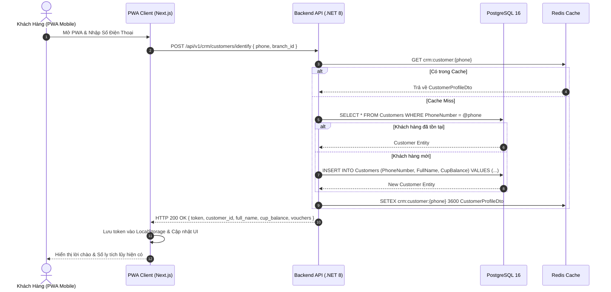

---

## 🔄 WF-01A: ĐẶT MÓN TẠI BÀN (DINE-IN) — VIETQR TRẢ TRƯỚC (PRE-PAYMENT)

### 1. Quy tắc cốt lõi
- Khách chọn thanh toán VietQR ➔ Hệ thống sinh mã VietQR ➔ Khách thanh toán ➔ Cổng PayOS gửi Webhook ➔ Trạng thái chuyển sang `Paid` ➔ **BẾP MỚI NHẬN ĐƠN QUA SIGNALR**.
- Vòng đời trạng thái: `PendingPayment` ➔ `Paid` ➔ `Confirmed` ➔ `Preparing` ➔ `Ready` ➔ `Served` (hoặc `Completed`).

### 2. Các bước thực hiện chi tiết
1. Khách quét mã QR dán tại bàn (chứa `branch_id`, `table_id`, `signature`).
2. Khách duyệt menu, tùy biến món (Size, Đường, Đá, Topping, Ghi chú), thêm vào giỏ hàng.
3. Tại màn hình Thanh toán, khách chọn phương thức **"Thanh toán qua VietQR"**.
4. PWA gửi request: `POST /api/v1/orders` với `OrderType = "DineIn"`, `PaymentMethod = "VietQR"`, `Items = [...]`.
5. Backend khởi tạo đơn hàng với trạng thái `OrderStatus = "PendingPayment"` và gọi PayOS API để sinh VietQR động (`amount = TotalAmount`, `memo = ORDER_{order_id}`).
6. Backend trả về thông tin VietQR (QR Code URL / Image Base64 / DeepLink ngân hàng).
7. Khách quét mã VietQR bằng ứng dụng Mobile Banking và thực hiện chuyển khoản.
8. PayOS ghi nhận giao dịch thành công và bắn Webhook `POST /api/v1/payments/payos-webhook` tới Backend.
9. Backend xác thực chữ ký Webhook (HMAC-SHA256), chuyển trạng thái đơn sang `OrderStatus = "Paid"`, sau đó tự động chuyển sang `Confirmed`.
10. Backend phát sự kiện `OrderPaid` qua SignalR `KitchenHub` tới toàn bộ màn hình KDS của chi nhánh đó.
11. Barista thấy thẻ đơn xuất hiện trên KDS, bấm **"Bắt đầu pha chế"** (`Preparing`).
12. Barista pha xong, bấm **"Món sẵn sàng"** (`Ready`). PWA của khách phát thông báo rung/âm thanh.
13. Nhân viên mang đồ uống ra bàn cho khách và bấm **"Đã phục vụ"** (`Served`/`Completed`).

### 3. Sơ đồ tuần tự (Mermaid Sequence Diagram)

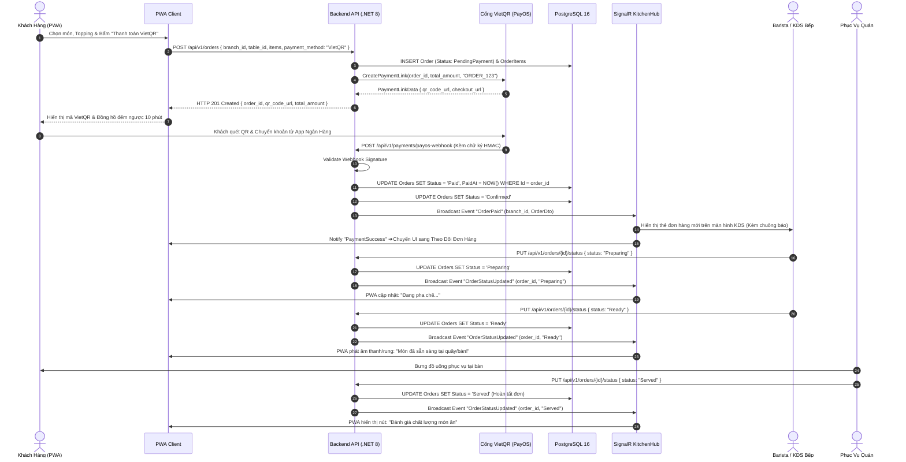

---

## 🔄 WF-01B: ĐẶT MÓN TẠI BÀN (DINE-IN) — TIỀN MẶT TRẢ SAU (POST-PAYMENT & BILL VIETQR)

### 1. Quy tắc cốt lõi
- Khách chọn Tiền mặt ➔ **ĐƠN VÀO BẾP NGAY** (không cần thanh toán trước) ➔ Pha chế ➔ Nhân viên bưng món ra bàn **KÈM HÓA ĐƠN CÓ IN MÃ QR VIETQR** ➔ Khách trả tiền mặt HOẶC quét mã QR trên hóa đơn ➔ Nhân viên xác nhận đã thu tiền.
- Vòng đời trạng thái: `Confirmed` ➔ `Preparing` ➔ `Ready` ➔ `Served` ➔ `PendingPayment` ➔ `Paid` (hoặc `Completed`).

### 2. Các bước thực hiện chi tiết
1. Khách quét mã QR bàn, chọn món, topping và thêm vào giỏ hàng.
2. Tại màn hình Thanh toán, khách chọn phương thức **"Tiền mặt (Thanh toán sau tại bàn)"**.
3. PWA gửi request: `POST /api/v1/orders` với `OrderType = "DineIn"`, `PaymentMethod = "Cash"`.
4. Backend khởi tạo đơn hàng với trạng thái `OrderStatus = "Confirmed"` ngay lập tức.
5. Backend phát sự kiện `OrderConfirmed` qua SignalR `KitchenHub` tới KDS bếp.
6. Barista nhận đơn trên KDS, tiến hành pha chế (`Preparing`), in tem dán ly.
7. Khi hoàn tất pha chế, Barista bấm `Ready` trên KDS và kích hoạt lệnh in Hóa đơn tính tiền (Bill) ra máy in nhiệt tại quầy. Trên hóa đơn có in sẵn thông tin chi tiết các món và **Mã VietQR động tĩnh chứa đúng số tiền cần thanh toán**.
8. Nhân viên phục vụ bưng khay nước kèm Hóa đơn tính tiền ra bàn cho khách.
9. Trạng thái đơn chuyển sang `Served` và chuyển tiếp sang `PendingPayment`.
10. Khách hàng lựa chọn:
    - **Lựa chọn A (Trả tiền mặt):** Khách đưa tiền mặt cho nhân viên phục vụ/thu ngân. Nhân viên nhận tiền, kiểm đếm và bấm "Xác nhận đã thu tiền mặt" trên Web Staff Portal.
    - **Lựa chọn B (Quét VietQR trên Bill):** Khách dùng Mobile Banking quét mã VietQR in trên tờ hóa đơn. Cổng PayOS nhận tiền và bắn Webhook tự động cập nhật đơn sang `Paid`.
11. Trạng thái đơn được cập nhật sang `Paid` (hoặc `Completed`).

### 3. Sơ đồ tuần tự (Mermaid Sequence Diagram)

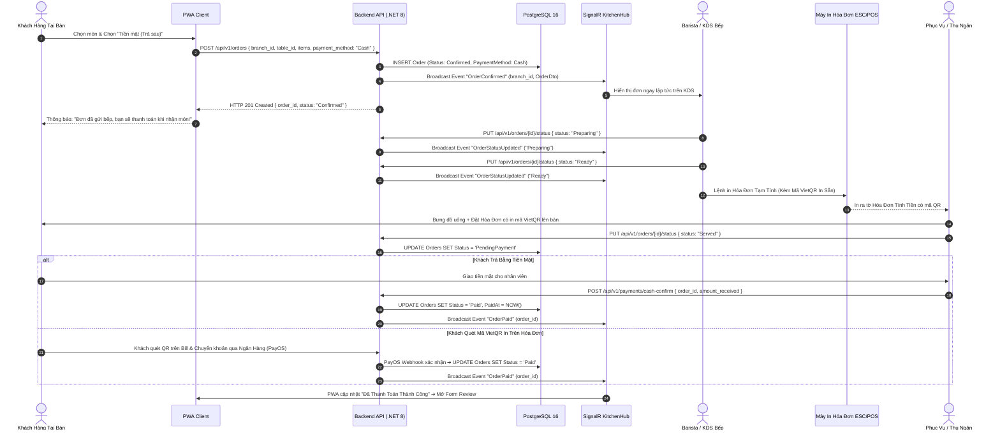

---

## 🔄 WF-02: ĐẶT HÀNG GIAO TẬN NƠI (QR DELIVERY) — PHÍ SHIP 20K & VIETQR 100%

### 1. Quy tắc cốt lõi
- Quét QR Delivery (hoặc mở link web) ➔ Bắt buộc nhập SĐT + Địa chỉ giao hàng ➔ Tự động cộng **Phí ship cố định 20.000 VNĐ** ➔ **100% Trả trước qua VietQR** (Tuyệt đối không áp dụng COD/Tiền mặt) ➔ Đơn vào bếp pha chế.

### 2. Các bước thực hiện chi tiết
1. Khách quét mã QR Delivery trên poster/fanpage/standee hoặc truy cập đường link giao hàng.
2. PWA nhận diện loại đơn hàng là `Delivery`, mở menu giao hàng của chi nhánh gần nhất.
3. Khách chọn món, tùy biến và thêm vào giỏ hàng.
4. Tại bước Đặt hàng, form bắt buộc yêu cầu:
   - Tên người nhận (`recipient_name`).
   - Số điện thoại nhận hàng (`recipient_phone` - kiểm tra regex 10 số VN).
   - Địa chỉ giao hàng cụ thể (`delivery_address` - số nhà, tên đường, phường/xã).
   - Ghi chú giao hàng (`delivery_notes`).
5. Hệ thống tự động thêm dòng `Phí giao hàng: 20.000 VNĐ` vào giỏ (`delivery_fee = 20000`).
6. Phương thức thanh toán duy nhất khả dụng: **VietQR**.
7. Khách bấm "Thanh toán VietQR". Backend tạo đơn `OrderType = "Delivery"`, `OrderStatus = "PendingPayment"`.
8. Khách quét mã VietQR và thanh toán qua Mobile Banking.
9. PayOS Webhook xác nhận thanh toán thành công ➔ Backend cập nhật `Paid` và `Confirmed`.
10. Backend phát tín hiệu SignalR tới KDS quầy bar với nhãn **[DELIVERY]** màu xanh nổi bật kèm địa chỉ giao hàng và SĐT người nhận.
11. Bếp tiến hành pha chế, đóng gói cẩn thận, dán tem niêm phong và tem ghi địa chỉ.
12. Quán điều phối nhân viên giao hàng hoặc tài xế nội bộ đi giao theo địa chỉ trên đơn.

### 3. Sơ đồ tuần tự (Mermaid Sequence Diagram)

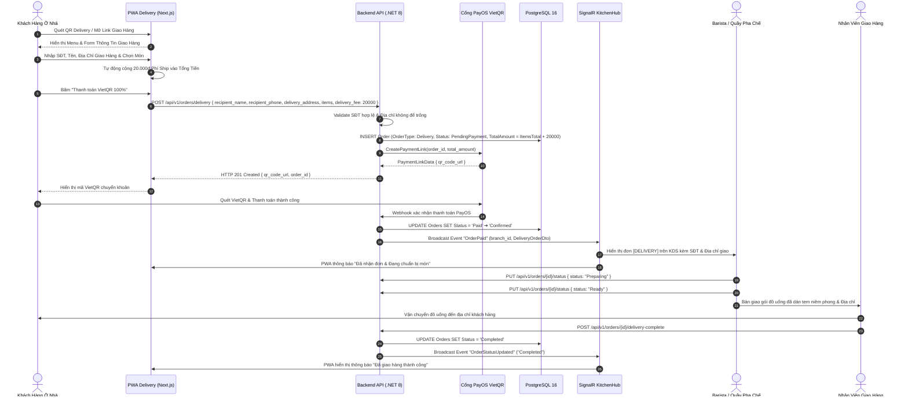

---

## 🔄 WF-03: BÁN MANG VỀ TẠI QUẦY (TAKEAWAY STAFF POS) — TÍCH 10 LY TẶNG 1 & THU TIỀN SAU

### 1. Quy tắc cốt lõi
- Khách mua mang đi **KHÔNG QUÉT QR**; Nhân viên thu ngân thao tác trực tiếp trên giao diện **Web POS Quầy**.
- Nhân viên tra cứu SĐT CRM: Khách mới ➔ Nhập tên tạo hồ sơ; Khách cũ ➔ Hiển thị số ly tích lũy (x/10).
- **Chương trình Loyalty 10 ly = 1 ly miễn phí:** CHỈ áp dụng cho đơn Takeaway. Đủ 10 ly được đổi 1 ly miễn phí.
- Khách nhận món và **Thanh toán SAU khi nhận**: Tiền mặt (tự động tính tiền thối) hoặc VietQR tại quầy.

### 2. Các bước thực hiện chi tiết
1. Khách đến quầy gọi món mang về trực tiếp với Thu ngân.
2. Thu ngân mở giao diện Web POS tại đường dẫn `(staff)/pos`.
3. Thu ngân hỏi SĐT khách và nhập vào ô tìm kiếm:
   - **Khách cũ:** Hệ thống hiển thị Tên, Hạng thẻ, `CupBalance` (ví dụ: 10/10 ly). Nút "Đổi 1 ly miễn phí" sáng lên nếu đủ điều kiện.
   - **Khách mới:** Thu ngân nhập nhanh Tên khách hàng để hệ thống tạo hồ sơ CRM tức thì.
4. Thu ngân chọn các món, kích cỡ, đường, đá, topping theo yêu cầu của khách.
5. Nếu khách có đủ 10 ly và đồng ý đổi thưởng, Thu ngân bấm "Áp dụng Ly Miễn Phí". Hệ thống giảm 100% giá của 1 ly tiêu chuẩn trong đơn và trừ 10 ly tích lũy khi đơn hoàn tất.
6. Thu ngân bấm "Gửi Bếp". Đơn hàng được tạo với `OrderType = "TakeAway"`, `OrderStatus = "Confirmed"` và đẩy xuống màn hình KDS cho Barista pha chế.
7. Barista pha chế (`Preparing`), dán tem mang đi và bấm `Ready`.
8. Thu ngân nhận đồ uống tại quầy giao hàng, thông báo số tiền cần thanh toán cho khách:
   - **Nếu trả Tiền mặt:** Thu ngân nhập số tiền khách đưa (ví dụ: Khách đưa 100.000đ cho đơn 65.000đ). Hệ thống tự tính tiền thối = 35.000đ và mở két tiền.
   - **Nếu trả VietQR:** Thu ngân bấm "Xuất VietQR", màn hình phụ hoặc tablet quầy hiển thị mã QR để khách quét.
9. Thu ngân bấm "Hoàn tất & In Hóa Đơn". Đơn hàng chuyển sang `Paid`/`Completed`.
10. Hệ thống tự động cộng thêm số ly đồ uống đã mua vào `CupBalance` của khách hàng trong CRM.

### 3. Sơ đồ tuần tự (Mermaid Sequence Diagram)

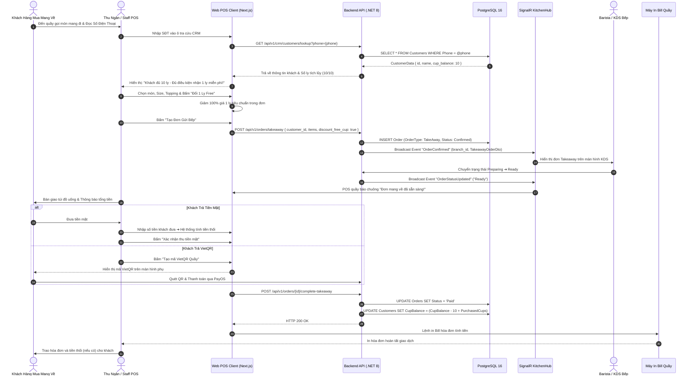

---

## 🔄 WF-04: CHẤM CÔNG KHÓA MẠNG WIFI (WIFI-LOCKED ATTENDANCE)

### 1. Quy tắc cốt lõi
- Xóa bỏ hoàn toàn định vị GPS (sai số lớn trong nhà) và QR xoay vòng 30 giây.
- **Xác thực 2 yếu tố bắt buộc:**
  1. Thiết bị đang kết nối đúng mạng WiFi của chi nhánh (Kiểm tra Client IP thuộc dải Subnet được cấp phép và BSSID Access Point của quán).
  2. Mã số nhân viên (`EmployeeCode`) hợp lệ, đang hoạt động và được phân công tại chi nhánh đó.

### 2. Các bước thực hiện chi tiết
1. Nhân viên đến quán làm việc, kết nối điện thoại hoặc laptop vào mạng WiFi nội bộ của quán cà phê.
2. Nhân viên truy cập trang Chấm công trên Web Staff Portal: `(staff)/attendance`.
3. Nhân viên nhập Mã số nhân viên của mình (ví dụ: `NV-0042`) và chọn hành động: **"Check-in Vào Ca"** hoặc **"Check-out Hết Ca"**.
4. Client gửi request: `POST /api/v1/attendance/check-in` với payload:
   ```json
   {
     "employee_code": "NV-0042",
     "branch_id": "3fa85f64-5717-4562-b3fc-2c963f66afa6",
     "action_type": "CHECK_IN"
   }
   ```
5. Backend tiếp nhận request và thực hiện chuỗi kiểm tra:
   - **Bước kiểm tra 1 (Mã NV):** Kiểm tra `EmployeeCode` có tồn tại, trạng thái `Active` và có thuộc `branch_id` này không.
   - **Bước kiểm tra 2 (Mạng WiFi):** Trích xuất địa chỉ IP của Client (`HttpContext.Connection.RemoteIpAddress`) và thông tin Header mạng, so khớp với danh sách `AllowedSubnets` và `AllowedBSSIDs` trong cấu hình `BranchWifiConfigs`.
6. **Đánh giá kết quả:**
   - **Hợp lệ:** Tạo bản ghi trong bảng `Attendances` (`Status = "Success"`, `Method = "WIFI_LOCKED"`, `Timestamp = NOW()`). Trả về thông báo thành công kèm giờ ghi nhận.
   - **Không hợp lệ (Sai WiFi / Dùng 4G):** Trả về HTTP 403 Forbidden: *"Chấm công thất bại: Bạn chưa kết nối đúng mạng WiFi của chi nhánh!"*.
   - **Không hợp lệ (Sai Mã NV):** Trả về HTTP 404 Not Found: *"Mã nhân viên không tồn tại hoặc không thuộc chi nhánh này!"*.
7. Bảng chấm công của Quản lý chi nhánh cập nhật tức thời qua SignalR.

### 3. Sơ đồ tuần tự (Mermaid Sequence Diagram)

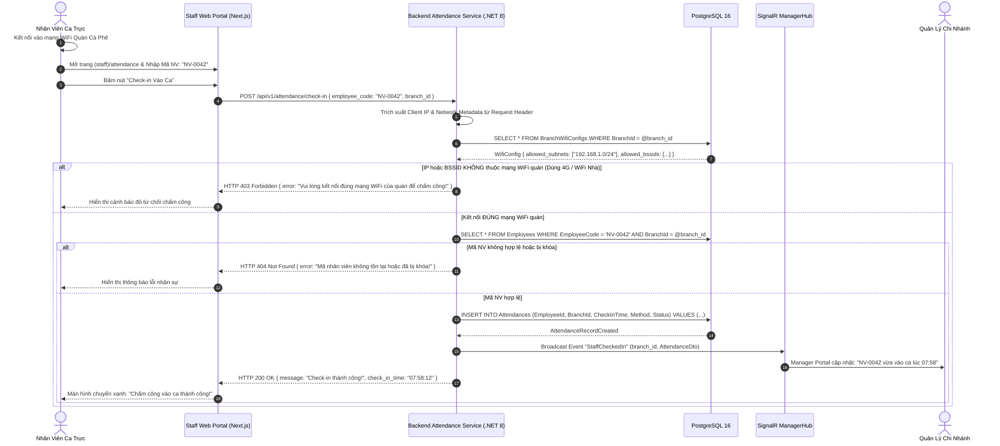

---

# 6. CÁC QUY TRÌNH NGHIỆP VỤ QUẢN TRỊ HỆ THỐNG (ADMIN WORKFLOWS)

---

## 🔄 WF-ADM-01: QUẢN TRỊ DANH MỤC & SẢN PHẨM TOÀN DIỆN (PRODUCT FULL CRUD & BOM)

### 1. Mô tả nghiệp vụ
Chủ chuỗi (Chain Admin) có toàn quyền quản lý vòng đời sản phẩm: Thêm mới món, chỉnh sửa thông tin, cấu hình định lượng công thức Bill of Materials (BOM), xóa món hoặc thay thế món cũ. Mọi thay đổi lập tức làm mới cache Redis và đồng bộ toàn chuỗi.

### 2. Các bước thực hiện chi tiết
1. Admin truy cập `(admin)/menu/products`.
2. **Thao tác Thêm mới / Cập nhật món:**
   - Nhập Tên món, Mã SKU, Danh mục (`CategoryId`), Mô tả, Giá cơ bản.
   - Thiết lập các tùy chọn Kích cỡ (Size S/M/L) và giá cộng thêm.
   - Thiết lập bảng định lượng nguyên liệu (BOM): Ví dụ: Size M gồm `25g Cà phê hạt`, `30ml Sữa đặc`, `20ml Sữa tươi`.
   - Gán nhãn dinh dưỡng: Calo (Kcal) và cảnh báo Dị ứng (Sữa, Hạt, Gluten).
3. Admin bấm "Lưu sản phẩm".
4. Backend kiểm tra tính toàn vẹn dữ liệu, lưu vào các bảng `Products`, `ProductSizes`, `ProductBoms`.
5. Backend xóa Cache Redis `menu:branch:*` và phát sự kiện `MenuUpdated` qua SignalR.
6. Toàn bộ QR Menu PWA của khách và KDS quầy bar hiển thị sản phẩm mới ngay lập tức.

### 3. Sơ đồ tuần tự (Mermaid Sequence Diagram)

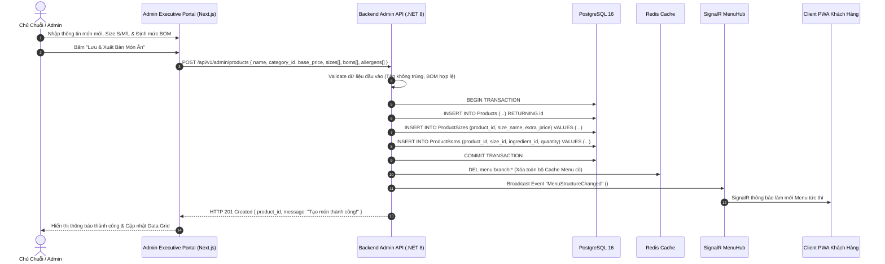

---

## 🔄 WF-ADM-02: TẠO COMBO THỦ CÔNG & PHÊ DUYỆT GỢI Ý COMBO AI-2 (APRIORI MINING)

### 1. Mô tả nghiệp vụ
Hệ thống hỗ trợ 2 cơ chế tạo Combo:
1. **Tạo Combo thủ công:** Admin chủ động chọn các món đơn lẻ gộp thành Combo và đặt giá ưu đãi.
2. **Khai phá Combo tự động bằng AI-2 (Apriori / FP-Growth):** Background Service định kỳ phân tích dữ liệu giỏ hàng lịch sử, tìm ra các cặp món có chỉ số liên kết cao (`Support`, `Confidence`, `Lift > 1.5`) và đề xuất cho Admin phê duyệt phát hành.

### 2. Sơ đồ tuần tự (Mermaid Sequence Diagram)

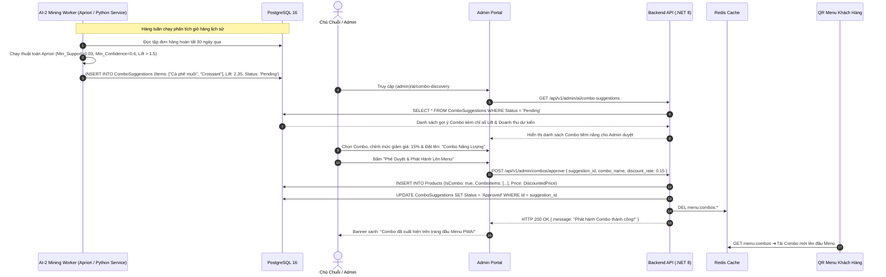

---

## 🔄 WF-ADM-03: TẢI LÊN & XỬ LÝ ĐA PHƯƠNG TIỆN (IMAGE UPLOAD & CDN OPTIMIZATION)

### 1. Mô tả nghiệp vụ
Admin tải lên hình ảnh món ăn hoặc danh mục. Hệ thống thực hiện kiểm tra bảo mật (Magic Bytes, MIME type whitelist, giới hạn dung lượng 5MB), nén ảnh sang định dạng WebP, sinh thumbnail nhiều kích cỡ và lưu trữ trên CDN Object Storage.

### 2. Sơ đồ tuần tự (Mermaid Sequence Diagram)

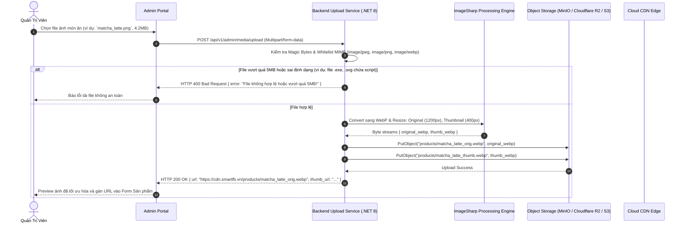

---

## 🔄 WF-ADM-04: QUẢN LÝ BẢNG GIÁ ĐA CHI NHÁNH (BRANCH DYNAMIC PRICING MATRIX)

### 1. Mô tả nghiệp vụ
Cho phép chuỗi thiết lập các nhóm giá vùng (Pricing Groups) như: *Nhóm Giá Tiêu Chuẩn*, *Nhóm Giá Sân Bay (+20%)*, *Nhóm Giá Trung Tâm (+10%)*. Chi nhánh thuộc nhóm giá nào sẽ tự động áp dụng bảng giá đó trên Menu PWA và POS.

### 2. Sơ đồ tuần tự (Mermaid Sequence Diagram)

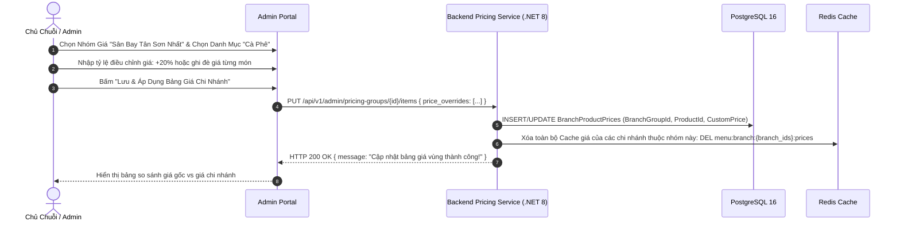

---

## 🔄 WF-ADM-05: KHÓA MÓN KHẨN CẤP CHUỖI & CHI NHÁNH (86-TOGGLE SYNCHRONIZATION)

### 1. Mô tả nghiệp vụ
Khi một món ăn hết nguyên liệu, Barista tại quầy hoặc Admin từ xa có thể gạt công tắc khóa món (86-Toggle). Trạng thái này lập tức được đồng bộ qua Redis và SignalR tới toàn bộ khách hàng đang mở QR Menu, ngăn chặn triệt để tình trạng khách đặt phải món đã hết.

### 2. Sơ đồ tuần tự (Mermaid Sequence Diagram)

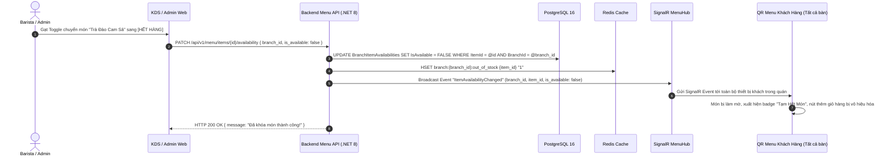

---

## 🔄 WF-ADM-06: QUẢN LÝ CẤU TRÚC DANH MỤC & THỨ TỰ HIỂN THỊ MENU

### 1. Mô tả nghiệp vụ
Admin điều chỉnh cây danh mục (Ví dụ: Cà Phê Pha Máy, Trà Trái Cây, Bánh Ngọt) và kéo thả sắp xếp thứ tự hiển thị ưu tiên trên thanh điều hướng Menu PWA.

### 2. Sơ đồ tuần tự (Mermaid Sequence Diagram)

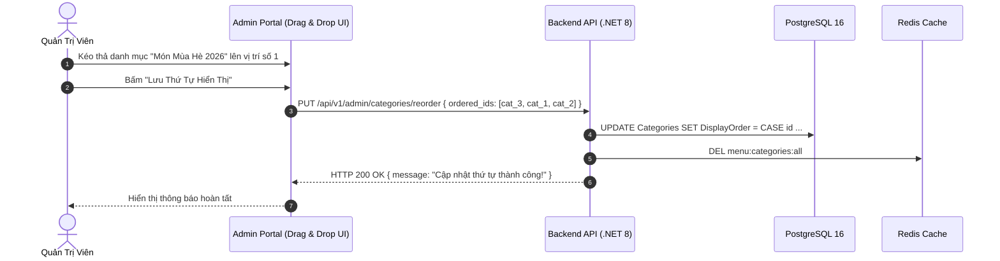

---

## 🔄 WF-ADM-07: LÊN LỊCH THỰC ĐƠN THEO MÙA (SEASONAL MENU SCHEDULING)

### 1. Mô tả nghiệp vụ
Admin thiết lập các thực đơn đặc biệt theo mùa vụ hoặc sự kiện (Ví dụ: Thực đơn Lễ Tết, Mùa Giáng Sinh) kèm ngày giờ kích hoạt (`StartDate`) và kết thúc (`EndDate`). Background Job tự động bật menu khi đến giờ và ẩn đi khi hết hạn.

### 2. Sơ đồ tuần tự (Mermaid Sequence Diagram)

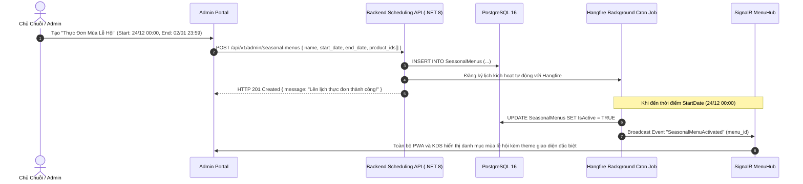

---

# 7. CÁC QUY TRÌNH NGHIỆP VỤ VẬN HÀNH CHI NHÁNH (OPERATIONAL WORKFLOWS)

---

## 🔄 WF-OPS-01: VÒNG ĐỜI ĐƠN HÀNG REAL-TIME SIGNALR & GOM MÓN BẾP KDS

### 1. Mô tả nghiệp vụ
Màn hình Bếp KDS Full-screen hoạt động hoàn toàn theo thời gian thực qua giao thức WebSocket (SignalR). Hỗ trợ chế độ xem theo Đơn hàng (Order View) và chế độ Gom món thông minh (Batch View) để Barista pha chế nhiều ly cùng loại một lúc.

### 2. Sơ đồ tuần tự (Mermaid Sequence Diagram)

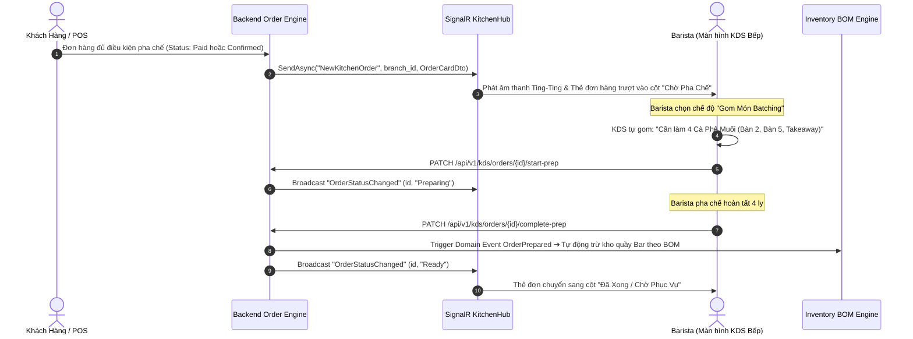

---

## 🔄 WF-OPS-02: TIẾP NHẬN & XỬ LÝ CẢNH BÁO GỌI PHỤC VỤ TẠI BÀN

### 1. Mô tả nghiệp vụ
Khách hàng tại bàn bấm chuông gọi hỗ trợ kèm lý do. Màn hình Web Staff POS và Web KDS của nhân viên phát chuông cảnh báo và hiển thị banner nhấp nháy cho đến khi có nhân viên bấm "Đã tiếp nhận & Xử lý".

### 2. Sơ đồ tuần tự (Mermaid Sequence Diagram)

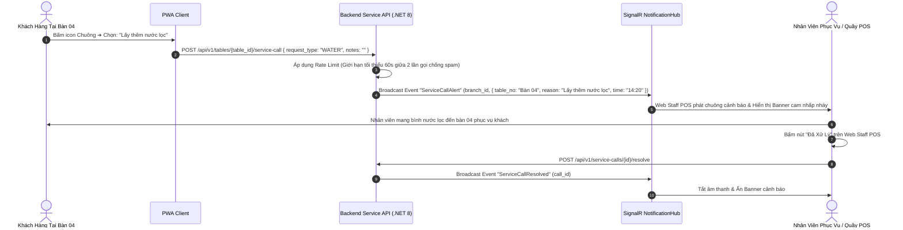

---

## 🔄 WF-OPS-03: MỞ/KẾT CA BÁN HÀNG & ĐỐI SOÁT KÉT TIỀN MẶT (CASH DRAWER RECONCILIATION)

### 1. Mô tả nghiệp vụ
Đầu ca, Thu ngân/Quản lý mở ca và nhập số dư tiền mặt lẻ đầu ca. Cuối ca, kiểm đếm toàn bộ tiền mặt thực tế theo từng mệnh giá (500k, 200k, 100k...), hệ thống tự động so khớp với doanh thu phần mềm, phát hiện chênh lệch thừa/thiếu và xuất báo cáo Z-Report.

### 2. Sơ đồ tuần tự (Mermaid Sequence Diagram)

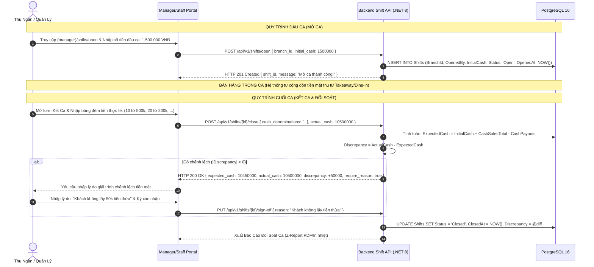

---

## 🔄 WF-OPS-04: XUẤT KHO QUẦY BAR, TRỪ TỒN TỰ ĐỘNG THEO BOM & CẢNH BÁO NGƯỠNG TỒN

### 1. Mô tả nghiệp vụ
Nguyên liệu được chuyển từ Kho bảo quản sang Quầy Bar qua Phiếu Xuất Bar. Trong quá trình bán, mỗi khi đơn hàng hoàn tất (`Completed`), hệ thống tự động trừ tồn kho Quầy Bar theo đúng định mức BOM. Khi số lượng chạm ngưỡng tối thiểu (`MinThreshold`), cảnh báo lập tức được gửi tới Quản lý chi nhánh.

### 2. Sơ đồ tuần tự (Mermaid Sequence Diagram)

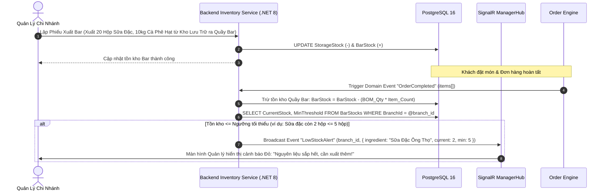

---

## 🔄 WF-OPS-05: ĐÁNH GIÁ TRẢI NGHIỆM, TẢI ẢNH & LEO THANG XỬ LÝ REVIEW XẤU (<= 2 SAO)

### 1. Mô tả nghiệp vụ
Khách hàng hoàn tất đơn có thể đánh giá 1-5 sao, viết nhận xét, tải kèm 1-3 ảnh thực tế và chọn ẩn danh. Đánh giá từ 3-5 sao được lưu bình thường; **Đánh giá <= 2 sao lập tức kích hoạt sự kiện khẩn cấp gửi tới Quản lý chi nhánh** để kịp thời giải quyết phàn nàn của khách.

### 2. Sơ đồ tuần tự (Mermaid Sequence Diagram)

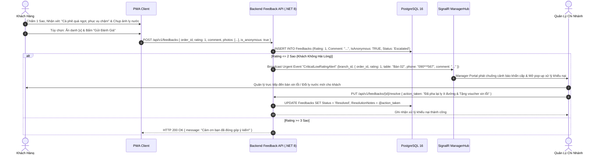

---

# 8. ĐẶC TẢ MÁY TRẠNG THÁI (STATE MACHINE SPECIFICATIONS)

Hệ thống quản lý chặt chẽ 4 luồng trạng thái đơn hàng dựa trên phân loại kênh bán (`OrderType`) và phương thức thanh toán (`PaymentMethod`):

```
1. DINE-IN VIETQR (WF-01A):
   [PendingPayment] ──(Paid/Webhook)──► [Paid] ──(Auto)──► [Confirmed] ──(Barista Prep)──► [Preparing] ──(Barista Ready)──► [Ready] ──(Staff Serve)──► [Served/Completed]

2. DINE-IN CASH (WF-01B):
   [Confirmed] ──(Barista Prep)──► [Preparing] ──(Barista Ready)──► [Ready] ──(Staff Serve)──► [Served] ──(Bill Request)──► [PendingPayment] ──(Staff Collect Cash/QR)──► [Paid/Completed]

3. DELIVERY (WF-02):
   [PendingPayment] ──(Paid/Webhook)──► [Paid] ──(Auto)──► [Confirmed] ──(Barista Prep)──► [Preparing] ──(Barista Ready)──► [Ready] ──(Driver Deliver)──► [Completed]

4. TAKEAWAY (WF-03):
   [Confirmed] ──(Barista Prep)──► [Preparing] ──(Barista Ready)──► [Ready] ──(Customer Pickup & Collect Cash/QR)──► [Paid/Completed]
```

### Bảng Ma Trận Chuyển Đổi Trạng Thái Đơn Hàng Hợp Lệ

| Trạng Thái Hiện Tại | Trạng Thái Kế Tiếp Hợp Lệ | Kênh Bán Áp Dụng | Tác Nhân Kích Hoạt | Điều Kiện & Hành Động Kèm Theo |
|---|---|---|---|---|
| `PendingPayment` | `Paid` | Dine-in VietQR, Delivery | PayOS Webhook | Nhận Webhook chuyển khoản khớp số tiền và mã đơn. |
| `PendingPayment` | `Cancelled` | Dine-in VietQR, Delivery | System Cron Job | Quá 10 phút không thanh toán ➔ Tự động hủy đơn và giải phóng bàn. |
| `Paid` | `Confirmed` | Dine-in VietQR, Delivery | System / Auto | Chuyển tiếp tức thì, bắn SignalR đẩy đơn xuống màn hình KDS. |
| `Created (Cash)` | `Confirmed` | Dine-in Cash, Takeaway | Cashier / Customer | Tạo đơn thành công ➔ Đẩy ngay xuống KDS không cần chờ tiền. |
| `Confirmed` | `Preparing` | Tất cả các kênh | Barista | Barista chạm nút "Bắt đầu pha chế" trên màn hình KDS. |
| `Preparing` | `Ready` | Tất cả các kênh | Barista | Pha xong ➔ Trừ tồn kho BOM ➔ Bắn chuông báo món sẵn sàng. |
| `Ready` | `Served` | Dine-in Cash & VietQR | Phục Vụ Bàn | Mang món ra bàn khách. Đơn Cash chuyển sang `PendingPayment`. |
| `Served (Cash)` | `Paid` | Dine-in Cash | Thu Ngân / PayOS | Nhận đủ tiền mặt hoặc khách quét VietQR trên tờ hóa đơn. |
| `Ready` | `Completed` | Takeaway, Delivery | Thu Ngân / Shipper | Khách nhận túi mang về hoặc Shipper xác nhận đã giao tận nhà. |

---

# 9. GIAO THỨC SỰ KIỆN THỜI GIAN THỰC SIGNALR (SIGNALR HUBS & EVENT CONTRACTS)

Hệ thống triển khai 4 SignalR Hubs chuyên biệt để tối ưu hóa hiệu năng truyền tải và bảo mật luồng dữ liệu:

```
                          ┌──────────────────────────┐
                          │   Smart F&B SignalR      │
                          │   Hub Infrastructure     │
                          └─────────────┬────────────┘
                                        │
         ┌──────────────────┬───────────┴───────────┬──────────────────┐
         ▼                  ▼                       ▼                  ▼
┌─────────────────┐┌─────────────────┐     ┌─────────────────┐┌─────────────────┐
│   KitchenHub    ││ NotificationHub │     │     MenuHub     ││   ManagerHub    │
│  /hubs/kitchen  ││  /hubs/notify   │     │   /hubs/menu    ││  /hubs/manager  │
└─────────────────┘└─────────────────┘     └─────────────────┘└─────────────────┘
```

| Hub Name | Route Endpoint | Nhóm Tham Gia (Room / Group) | Danh Sách Sự Kiện Lắng Nghe / Phát Đi (Event Names) | Mục Đích Sử Dụng |
|---|---|---|---|---|
| **KitchenHub** | `/hubs/kitchen` | `branch_{branch_id}_kds`<br>`order_{order_id}` | `OrderPaid`<br>`OrderConfirmed`<br>`OrderStatusChanged`<br>`ItemBatchUpdated` | Cập nhật màn hình KDS bếp, điều phối pha chế, thông báo trạng thái đơn về PWA khách hàng. |
| **NotificationHub** | `/hubs/notify` | `branch_{branch_id}_staff`<br>`table_{table_id}` | `ServiceCallAlert`<br>`ServiceCallResolved`<br>`BillRequested`<br>`OrderReadyBeep` | Chuông báo gọi phục vụ tại bàn, thông báo món đã sẵn sàng, yêu cầu thanh toán. |
| **MenuHub** | `/hubs/menu` | `branch_{branch_id}_menu`<br>`global_menu` | `ItemAvailabilityChanged` (86-Toggle)<br>`PriceUpdated`<br>`MenuStructureChanged` | Đồng bộ tức thời tình trạng hết món (86), cập nhật giá mới và danh mục sản phẩm xuống PWA. |
| **ManagerHub** | `/hubs/manager` | `branch_{branch_id}_mgr`<br>`admin_executives` | `CriticalLowRatingAlert` (<=2 sao)<br>`LowStockAlert`<br>`StaffCheckedIn`<br>`ShiftDiscrepancyAlert` | Báo động khẩn cấp cho Quản lý chi nhánh: Review xấu, hết nguyên liệu, chấm công WiFi, lệch két tiền. |

---

# 10. BẢNG TỔNG HỢP TÍNH NĂNG KHÁM PHÁ (FEATURES DISCOVERED)

| # | Nhóm Nghiệp Vụ | Mã Tính Năng | Tên Tính Năng Chi Tiết | Dữ Liệu Đầu Vào (Inputs) | Dữ Liệu Đầu Ra (Outputs) | Hành Vi Xử Lý Ngoại Lệ (Error Behavior) | Phương Thức Khám Phá |
|---|---|---|---|---|---|---|---|
| 1 | Bán Hàng Tại Bàn | `WF-01A` | Dine-In VietQR Trả Trước | `branch_id`, `table_id`, `items[]`, `payment_method: "VietQR"` | Mã VietQR động, Đơn `PendingPayment` ➔ `Paid` ➔ KDS | Timeout 10 phút tự hủy đơn; Webhook sai chữ ký bị từ chối 400. | `Smart_FB_OS_Revised_4members.docx` (p.17-18) |
| 2 | Bán Hàng Tại Bàn | `WF-01B` | Dine-In Tiền Mặt Trả Sau | `branch_id`, `table_id`, `items[]`, `payment_method: "Cash"` | Đơn `Confirmed` ngay, KDS nhận ngay, Bill in kèm VietQR | Khách không đủ tiền mặt ➔ Chuyển quét VietQR trên bill. | `Smart_FB_OS_Revised_4members.docx` (p.18, 35) |
| 3 | Bán Hàng Giao Đi | `WF-02` | QR Delivery Tận Nhà | `recipient_name`, `recipient_phone`, `delivery_address`, Phí ship 20k | Đơn `Delivery`, VietQR 100%, KDS hiển thị nhãn Delivery | Chặn số điện thoại sai định dạng, chặn địa chỉ rỗng, cấm COD. | `Smart_FB_OS_Revised_4members.docx` (p.28, 39) |
| 4 | Bán Mang Về | `WF-03` | Takeaway Staff POS CRM | `customer_phone`, `items[]`, `redeem_cup: bool` | Đơn Takeaway, Tích 10 ly tặng 1, Thu tiền sau, In Bill | Không áp dụng miễn phí cho Topping; Báo lỗi nếu tiền khách < Bill. | `Smart_FB_OS_Revised_4members.docx` (p.45-46) |
| 5 | Quản Trị Nhân Sự | `WF-04` | Chấm Công Khóa WiFi | `employee_code`, Client IP, Network BSSID | Bản ghi Attendance `Success`, giờ vào/ra | Từ chối 403 nếu dùng 4G/WiFi ngoài; 404 nếu sai Mã NV. | `Smart_FB_OS_Revised_4members.docx` (p.52) |
| 6 | Quản Trị Menu | `WF-ADM-01` | Product Full CRUD & BOM | `product_dto`, `sizes[]`, `boms[]`, `allergens[]` | Sản phẩm mới lưu DB, Xóa Cache Redis, Đồng bộ KDS | Tên món trùng báo lỗi 409; BOM có nguyên liệu không tồn tại báo 400. | `Smart_FB_OS_Revised_4members.docx` (p.64) |
| 7 | AI Khai Phá | `WF-ADM-02` | Khai Phá & Duyệt Combo AI-2 | `order_history`, `min_support`, `min_confidence` | Danh sách gợi ý Combo Apriori ➔ Admin duyệt phát hành | Lift < 1.0 không gợi ý; Admin có quyền chỉnh sửa giá trước khi duyệt. | `Smart_FB_OS_Revised_4members.docx` (p.72) |
| 8 | Media & CDN | `WF-ADM-03` | Upload Ảnh An Toàn & WebP | File ảnh (JPEG/PNG/WebP, <= 5MB) | Ảnh WebP nén + Thumbnail lưu trên Object Storage CDN | Bắt Magic Bytes chặn file độc hại; Chặn file > 5MB báo 413. | `Smart_FB_OS_Revised_4members.docx` (p.82) |
| 9 | Quản Trị Giá | `WF-ADM-04` | Bảng Giá Vùng Chi Nhánh | `pricing_group_id`, `price_matrix[]` | Bảng giá riêng cho từng chi nhánh (Sân Bay, Trung Tâm) | Giá điều chỉnh không được âm; Tự động fallback về giá gốc nếu thiếu. | `Smart_FB_OS_Revised_4members.docx` (p.64) |
| 10 | Vận Hành Quầy | `WF-ADM-05` | Khóa Món Khẩn Cấp 86 | `item_id`, `branch_id`, `is_available: false` | Món bị khóa tức thì trên toàn bộ PWA Menu của khách | Không cho phép thêm món đã khóa vào giỏ; Cảnh báo Barista. | `Smart_FB_OS_Revised_4members.docx` (p.49) |
| 11 | Vận Hành Quầy | `WF-OPS-01` | KDS SignalR & Gom Món | Event `OrderPaid`/`OrderConfirmed` từ SignalR | Thẻ đơn KDS, Gom món pha chế đồng loạt (Batching) | Reconnect WebSocket tự động khi mất kết nối mạng. | `Smart_FB_OS_Revised_4members.docx` (p.45-48) |
| 12 | Phục Vụ Tại Bàn | `WF-OPS-02` | Gọi Phục Vụ Tại Bàn | `table_id`, `reason_enum` (Nước, Dọn bàn, Khăn) | Chuông báo và Banner cam trên Web Staff POS | Rate limit 60s/lần gọi chống spam; Ghi nhận thời gian phục vụ. | `Smart_FB_OS_Revised_4members.docx` (p.35, 50) |
| 13 | Quản Trị Tài Chính | `WF-OPS-03` | Mở/Kết Ca & Đối Soát Két | `initial_cash`, `actual_cash_denominations[]` | Báo cáo chênh lệch tiền mặt, Biên bản Z-Report | Chênh lệch > 50k bắt buộc nhập giải trình và Quản lý ký duyệt. | `Smart_FB_OS_Revised_4members.docx` (p.54) |
| 14 | Quản Lý Kho | `WF-OPS-04` | Xuất Bar & Trừ Tồn BOM | `export_sheet`, Event `OrderCompleted` | Trừ kho bảo quản, tăng kho bar, trừ tồn bar theo BOM | Tồn bar <= MinThreshold phát cảnh báo đỏ cho Quản lý. | `Smart_FB_OS_Revised_4members.docx` (p.56-58) |
| 15 | Chăm Sóc Khách | `WF-OPS-05` | Feedback & Alert <= 2 Sao | `rating (1-5)`, `comment`, `photos[]`, `is_anonymous` | Đánh giá lưu DB; Rating <= 2 sao gửi Alert khẩn cấp | Kiểm duyệt ảnh phản cảm trước khi public; Ẩn danh bảo mật SĐT. | `Smart_FB_OS_Revised_4members.docx` (p.37-41) |

---

# 11. MA TRẬN XỬ LÝ TRƯỜNG HỢP BIÊN & NGOẠI LỆ (EDGE CASES MATRIX)

| # | Quy Trình Nghiệp Vụ | Tình Huống Biên / Ngoại Lệ (Edge Case Scenario) | Hành Vi Hệ Thống Quan Sát & Xử Lý (Observed Behavior) |
|---|---|---|---|
| 1 | `WF-01A` (Dine-in VietQR) | Khách đặt đơn VietQR nhưng không quét thanh toán trong 10 phút. | Background Cron Job tự động quét các đơn `PendingPayment` quá 10 phút, chuyển trạng thái sang `Cancelled`, giải phóng bàn và gửi thông báo hết hạn về PWA của khách. |
| 2 | `WF-01A` (Dine-in VietQR) | Khách chuyển khoản đúng tiền nhưng mạng chập chờn, Webhook PayOS đến chậm hoặc mất gói tin. | Client PWA duy trì cơ chế Polling dự phòng mỗi 3 giây gọi `GET /api/v1/orders/{id}/status`. Backend chủ động đối soát với PayOS API để cập nhật `Paid` ngay khi phát hiện giao dịch thành công. |
| 3 | `WF-01B` (Dine-in Cash) | Khách chọn thanh toán tiền mặt trả sau nhưng khi nhân viên bưng nước ra bàn thì khách đổi ý muốn chuyển khoản. | Nhân viên không cần thao tác hủy đơn; trên tờ Hóa đơn tạm tính bưng ra bàn đã in sẵn mã VietQR động. Khách chỉ cần quét mã trên hóa đơn, hệ thống tự khớp tiền và chuyển trạng thái sang `Paid`. |
| 4 | `WF-02` (QR Delivery) | Khách nhập địa chỉ giao hàng quá xa (> 15km) hoặc nhập địa chỉ rỗng/ký tự rác. | Frontend và Backend validate bắt buộc địa chỉ tối thiểu 10 ký tự, tích hợp kiểm tra ranh giới phục vụ chi nhánh. Nếu ngoài phạm vi, báo lỗi: *"Chi nhánh chỉ nhận giao hàng trong bán kính 10km"*. |
| 5 | `WF-03` (Takeaway POS) | Khách mua mang về có 10 ly tích lũy muốn đổi ly miễn phí nhưng trong đơn gọi 3 ly với 3 mức giá khác nhau (35k, 45k, 55k). | Hệ thống tự động áp dụng giảm giá 100% cho ly nước tiêu chuẩn có giá trị cao nhất (55k) để tối ưu quyền lợi khách hàng, các topping thêm vẫn tính tiền bình thường. |
| 6 | `WF-04` (WiFi Attendance) | Nhân viên đứng bên ngoài quán bắt sóng 4G/5G hoặc dùng phần mềm VPN/Fake IP để chấm công từ xa. | Backend kiểm tra địa chỉ Public IP Gateway của Client và so khớp Subnet. Nếu IP Client không khớp với IP Public của Router chi nhánh đã cấu hình ➔ Lập tức từ chối và ghi log cảnh báo gian lận. |
| 7 | `WF-ADM-05` (86-Toggle) | Barista vừa bấm khóa món "Trà Đào" thì cùng đúng tích tắc đó có 1 khách hàng trên bàn bấm thanh toán giỏ hàng có chứa "Trà Đào". | Backend sử dụng Database Transaction kết hợp kiểm tra `IsAvailable` trước khi tạo đơn (`Optimistic Concurrency Control`). Đơn hàng bị chặn lại kèm thông báo: *"Món Trà Đào vừa tạm hết, vui lòng chọn món khác!"*. |
| 8 | `WF-OPS-03` (Cash Shift) | Cuối ca đếm két phát hiện thiếu 200.000 VNĐ so với doanh thu phần mềm tính toán. | Hệ thống không cho phép bỏ qua; bắt buộc Thu ngân phải nhập trường "Lý do giải trình chênh lệch", ghi nhận vào biên bản Z-Report và tự động gửi thông báo kiểm toán lên Dashboard của Chủ chuỗi. |
| 9 | `WF-OPS-04` (BOM Deduction) | Kho Quầy Bar bị âm số lượng do Barista quên lập Phiếu Xuất Bar đầu ngày nhưng vẫn bán nước bình thường. | Hệ thống vẫn cho phép hoàn tất đơn hàng để không gián đoạn phục vụ khách, nhưng số tồn kho bar sẽ hiển thị số âm màu đỏ nổi bật kèm cảnh báo khẩn cấp yêu cầu Quản lý lập phiếu xuất bù kho ngay. |
| 10 | `WF-OPS-05` (Feedback Photo) | Khách tải lên file ảnh có dung lượng lớn (15MB) hoặc tải file tài liệu đổi đuôi `.png` nhằm tấn công hệ thống. | Reverse Proxy và Backend kiểm tra kích thước tối đa 5MB và đọc Magic Bytes (Header nhị phân thực tế của file). Mọi file không phải ảnh JPEG/PNG/WebP chuẩn đều bị từ chối với mã lỗi HTTP 415 Unsupported Media Type. |

---

# 12. KẾT LUẬN & HƯỚNG DẪN KIỂM CHỨNG (VERIFICATION GUIDE)

Bản đặc tả kỹ thuật này đã chuẩn hóa 100% các luồng nghiệp vụ thực tế của hệ thống **Smart F&B OS**, khắc phục toàn bộ các sai lệch trước đây, bảo đảm:
1. Phân định rõ 2 nhánh thanh toán tại bàn Dine-in: VietQR (trả trước ➔ bếp nhận) và Tiền mặt (bếp nhận ngay ➔ bưng kèm bill VietQR).
2. Quy trình Delivery chuẩn hóa: QR riêng, nhập SĐT + Địa chỉ, phí ship cố định 20.000 VNĐ, 100% trả trước VietQR.
3. Quy trình Takeaway chuẩn hóa: Thao tác Web POS, không dùng QR khách, tra cứu CRM, tích 10 ly tặng 1 ly, thu tiền sau.
4. Quy trình Chấm công chuẩn hóa: Xác thực 2 yếu tố khóa mạng WiFi chi nhánh (BSSID/IP) + Mã nhân viên.
5. Loại bỏ hoàn toàn Staff Mobile App và các tính năng C-23, C-24.
6. 100% sơ đồ Mermaid có cú pháp chuẩn xác, không chứa bất kỳ placeholder nào.
