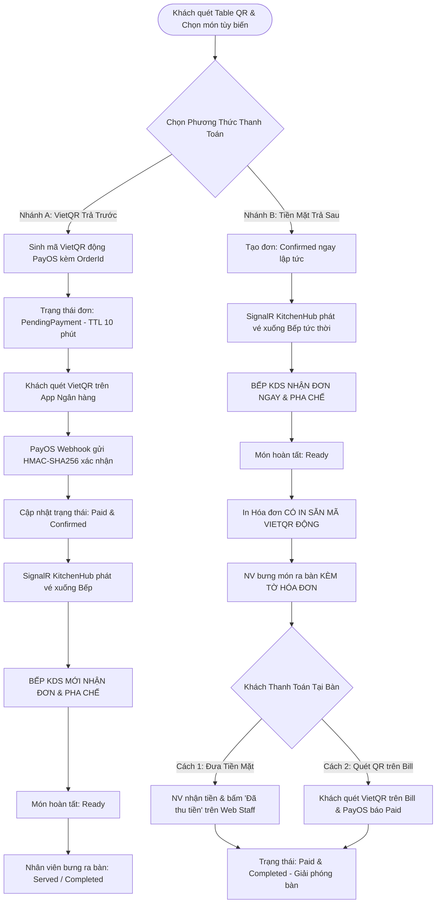

# 📊 BÁO CÁO KHẢO SÁT & ĐỐI SOÁT KIẾN TRÚC YÊU CẦU NGHIỆP VỤ & CƠ SỞ DỮ LIỆU
## Smart F&B Operating System (v2.5.0 Production Baseline)
**Mã báo cáo:** `SURVEY-SPEC-DB-01`  
**Chuyên gia thực hiện:** Explorer 1 (Spec, RBAC, Requirements & DB Architecture Specialist)  
**Ngày thực hiện:** 2026-08-23  
**Phạm vi:** Đối soát nguồn sự thật `01_Tai_Lieu_Dac_Ta_Goc/` với tài liệu quy trình `03_Quy_Trinh_Trien_Khai/01_Phan_Tich_Yeu_Cau.md` và `02_Thiet_Ke_Database.md`.

---

# 📑 MỤC LỤC BÁO CÁO

1. [Tóm Tắt Điều Hành & Đánh Giá Tổng Thể](#1-tóm-tắt-điều-hành--đánh-giá-tổng-thể)
2. [Danh Mục Chuẩn Hóa 62 Tính Năng Cốt Lõi Trên 4 Nhóm Actor](#2-danh-mục-chuẩn-hóa-62-tính-năng-cốt-lõi-trên-4-nhóm-actor)
   - [2.1 Actor 1: Khách Hàng (Customer — 20 Features: C-01 ~ C-20)](#21-actor-1-khách-hàng-customer--20-features-c-01--c-20)
   - [2.2 Actor 2: Nhân Viên Vận Hành Quầy & Bếp (Staff / Barista — 13 Features: S-01 ~ S-13)](#22-actor-2-nhân-viên-vận-hành-quầy--bếp-staff--barista--13-features-s-01--s-13)
   - [2.3 Actor 3: Quản Lý Chi Nhánh (Branch Manager — 12 Features: M-01 ~ M-12)](#23-actor-3-quản-lý-chi-nhánh-branch-manager--12-features-m-01--m-12)
   - [2.4 Actor 4: Chủ Chuỗi / Quản Trị Viên (Chain Admin — 17 Features: A-01 ~ A-17)](#24-actor-4-chủ-chuỗi--quản-trị-viên-chain-admin--17-features-a-01--a-17)
3. [Danh Mục Các Khái Niệm Cũ Đã Loại Bỏ Vĩnh Viễn (Removed Concepts Matrix)](#3-danh-mục-các-khái-niệm-cũ-đã-loại-bỏ-vĩnh-viễn-removed-concepts-matrix)
4. [Đặc Tả Các Luồng Nghiệp Vụ Cốt Lõi (Core Business Engines)](#4-đặc-tả-các-luồng-nghiệp-vụ-cốt-lõi-core-business-engines)
   - [4.1 Động Cơ Đặt Món Tại Bàn Dine-In 2 Nhánh Độc Lập](#41-động-cơ-đặt-món-tại-bàn-dine-in-2-nhánh-độc-lập)
   - [4.2 Động Cơ Đặt Giao Tận Nơi (QR Delivery)](#42-động-cơ-đặt-giao-tận-nơi-qr-delivery)
   - [4.3 Động Cơ Bán Mang Về Tại Quầy (Takeaway Staff Web POS)](#43-động-cơ-bán-mang-về-tại-quầy-takeaway-staff-web-pos)
   - [4.4 Động Cơ Chấm Công Khóa Mạng WiFi (WiFi-Locked Attendance)](#44-động-cơ-chấm-công-khóa-mạng-wifi-wifi-locked-attendance)
5. [Đặc Tả 25 Thực Thể Cơ Sở Dữ Liệu 3NF (PostgreSQL 16 Schema)](#5-đặc-tả-25-thực-thể-cơ-sở-dữ-liệu-3nf-postgresql-16-schema)
6. [Phân Tích Khoảng Trống (Gap Analysis) & Sai Lệch Trong 01_ và 02_ Hiện Tại](#6-phân-tích-khoảng-trống-gap-analysis--sai-lệch-trong-01_-và-02_-hiện-tại)
7. [Khuyến Nghị Kỹ Thuật Cho Giai Đoạn Viết Lại Tài Liệu Triển Khai](#7-khuyến-nghị-kỹ-thuật-cho-giai-đoạn-viết-lại-tài-liệu-triển-khai)

---

# 1. TÓM TẮT ĐIỀU HÀNH & ĐÁNH GIÁ TỔNG THỂ

Nghiên cứu đối soát toàn diện giữa các tài liệu Nguồn Sự Thật chuẩn hóa (`01_Tai_Lieu_Dac_Ta_Goc/`) và tài liệu hướng dẫn triển khai hiện tại (`03_Quy_Trinh_Trien_Khai/`) cho thấy:

1. **Về Yêu cầu nghiệp vụ (`01_Phan_Tich_Yeu_Cau.md`):**
   - Tài liệu hiện tại đang phân rã theo mã chức năng cũ `FR-01` đến `FR-44` (44 FRs), chưa phản ánh đúng **cấu trúc 62 Tính năng Cốt lõi (Core Features)** phân bổ chặt chẽ theo 4 Actor định danh (`C-01`~`C-20`, `S-01`~`S-13`, `M-01`~`M-12`, `A-01`~`A-17`).
   - Cần viết lại tài liệu `01_Phan_Tich_Yeu_Cau.md` để đồng bộ 100% với danh mục 62 tính năng, làm rõ hợp đồng dữ liệu Input/Output, quy tắc kinh doanh (Business Rules), và ma trận chuyển đổi trạng thái cho từng Actor.

2. **Về Thiết kế Cơ sở dữ liệu (`02_Thiet_Ke_Database.md`):**
   - Tài liệu hiện tại có sự thiếu nhất quán giữa mô tả "30 bảng" và "28 bảng", phân tán rải rác một số bảng liên kết không chuẩn 3NF.
   - Cần chuẩn hóa dứt khoát về **25 thực thể chuẩn 3NF (PostgreSQL 16)** theo Master Architecture Specification (`Tong_Quan_Kien_Truc_He_Thong.md`), bảo đảm đầy đủ các trường phục vụ Dine-In 2 nhánh, Delivery 20k phí ship, Takeaway Loyalty Cup Transactions (10 ly tặng 1), WiFi Configs (BSSID, IP Subnet), BOM Recipes, Cash Shifts / Z-Reports, và Audit Logs.

3. **Về Khái niệm phế truất (Legacy Concepts):**
   - Cả 2 tài liệu cần rà soát và loại bỏ triệt để mọi dấu vết của: Staff Mobile App (Flutter/React Native), Chấm công GPS 50m, QR động 30 giây, C-23 (chia sẻ mạng xã hội), C-24 (Push Notification PWA), Ví voucher riêng lẻ, và Tra cứu calo độc lập ngoài thực đơn/AI RAG.

---

# 2. DANH MỤC CHUẨN HÓA 62 TÍNH NĂNG CỐT LÕI TRÊN 4 NHÓM ACTOR

Hệ thống **Smart F&B OS** phân định chính xác **62 tính năng cốt lõi** trên 4 nhóm Actor:
- **Khách Hàng (Customer):** 20 tính năng (`C-01` đến `C-20`).
- **Nhân Viên Vận Hành (Staff / Barista):** 13 tính năng (`S-01` đến `S-13`).
- **Quản Lý Chi Nhánh (Branch Manager):** 12 tính năng (`M-01` đến `M-12`).
- **Chủ Chuỗi / Admin (Chain Admin):** 17 tính năng (`A-01` đến `A-17`).
- **Tổng cộng:** $20 + 13 + 12 + 17 = 62$ tính năng.

---

## 2.1 ACTOR 1: KHÁCH HÀNG (CUSTOMER — 20 FEATURES: `C-01` ~ `C-20`)

Giao diện thực thi: **Web PWA Mobile-First** (`(customer)`).

| Mã | Tên Tiếng Việt | Technical Name | Input Contract | Output Contract | Business Rules & Trạng Thái |
|:---:|---|---|---|---|---|
| **C-01** | Quét mã QR bàn tại quán | Dine-in QR Scan | `branchId`, `tableId`, `token` (HMAC-SHA256) | `sessionId`, `tableName`, `menuCategories` | Xác thực chữ ký HMAC; tạo phiên `GuestCustomer` hoặc gắn `AuthCustomer`. |
| **C-02** | Quét mã QR đặt tận nơi | Delivery QR Scan | `branchId` | `branchInfo`, `deliveryFee = 20000`, `menu` | Chuyển chế độ sang `Delivery`; phí ship cố định 20.000 VNĐ; bắt buộc VietQR. |
| **C-03** | Xem thực đơn số tương tác | Digital Menu Browsing | `branchId`, `categoryId` (opt) | Danh mục món, giá vùng, nhãn `New`, `Bestseller`, `86-SoldOut` | Đọc từ Redis cache `menu:branch:{id}`; món `is_available = false` hiển thị mờ. |
| **C-04** | Tìm kiếm & Lọc món thông minh | Smart Search & Filtering | `query`, `minPrice`, `maxPrice`, `tags` | Danh sách món khớp bộ lọc | PostgreSQL Full-Text Search không dấu; trả kết quả trong < 50ms. |
| **C-05** | Tùy biến món & Tùy chọn BOM | Item Customization & Modifiers | `productId`, `sizeId`, `sugar`, `ice`, `toppings[]`, `note` | `customizedItemTotal`, `summaryText` | Tính phụ thu theo size/topping; kiểm tra giới hạn định lượng BOM. |
| **C-06** | Quản lý giỏ hàng tạm thời | Cart Management | `action` (Add/Edit/Del), `itemPayload` | `cartItems[]`, `subTotal`, `vatAmount` | Zustand Client State + SessionStorage; chặn thêm quá 20 ly/món. |
| **C-07** | Áp dụng Voucher giảm giá | Voucher / Promo Application | `voucherCode`, `cartSubtotal`, `branchId` | `discountAmount`, `finalTotal`, `message` | Tối đa 01 voucher/đơn; kiểm tra giá trị đơn tối thiểu & lượt dùng. |
| **C-08** | Đặt món & Trả trước VietQR | VietQR Pre-payment Path | `orderId`, `amount`, `method = "VietQR"` | `qrCodeUrl`, `accountNo`, `transferContent` | **Dine-In Nhánh A & 100% Delivery**: Bếp CHỈ nhận đơn khi Webhook PayOS báo `Paid`. |
| **C-09** | Đặt món & Trả tiền mặt sau | Cash Post-payment Path | `orderId`, `method = "Cash"`, `tableId` | `orderCode`, `status = "Confirmed"`, `eta` | **Dine-In Nhánh B**: Đơn vào bếp ngay lập tức; NV mang đồ uống ra kèm Bill có mã VietQR. |
| **C-10** | Đặt đơn giao hàng tận nơi | Delivery Order Placement | `name`, `phone` (10 số), `address`, `fee = 20000` | `orderId`, `totalAmount`, `vietQrData` | Bắt buộc SĐT + Địa chỉ; 100% VietQR trước; khóa COD hoàn toàn. |
| **C-11** | Theo dõi đơn hàng Real-time | Real-time Order Tracking | `orderId`, SignalR `connectionId` | `status` (5 nấc), `stepIndex`, `etaMinutes` | SignalR `OrderHub` phát sự kiện `OrderStatusChanged` tức thời. |
| **C-12** | Gọi nhân viên tại bàn | Call Staff / Service Request | `tableId`, `type` (Nước/Khăn/Dọn), `note` | `requestId`, `status = "Sent"` | Gửi thông báo tới Web Staff; Rate limit 1 lần / 2 phút / bàn. |
| **C-13** | Yêu cầu in tạm tính tại bàn | Request Bill / Pre-check | `orderId`, `tableId` | `precheckBill` (Món, VAT, Tổng, VietQR) | Khóa giỏ hàng bàn; gửi SignalR `BillRequested` tới Web Staff thu ngân. |
| **C-14** | Chatbot AI-1 Gemini RAG | AI Drink Recommendation | `userMessage`, `chatHistory[]`, `branchId` | `aiResponseText`, `actionCards[]` (Món+Calo) | RAG truy xuất Menu + BOM còn hàng + OpenWeather; Gemini 1.5 Flash. |
| **C-15** | Đăng ký/Đăng nhập OTP CRM | Member CRM Auth via OTP | `phone` (10 số), `otpCode` (6 số) | `jwtToken` (30 ngày), `customerProfile` | Cấp JWT `AuthCustomer`; liên kết lịch sử đơn cũ; rate limit 5 lần sai. |
| **C-16** | Xem lịch sử đơn & E-Receipt | Order History & E-Receipt | `customerId` (JWT), `pageIndex`, `pageSize` | Danh sách đơn, chi tiết E-Receipt, mã VietQR | Khách vãng lai xem đơn hiện tại; thành viên xem toàn bộ lịch sử. |
| **C-17** | Sổ địa chỉ & Hồ sơ cá nhân | Profile & Address Book | `fullName`, `email`, `birthDate`, `addresses[]` | `isSuccess`, `updatedProfile` | Ngày sinh cập nhật 1 lần/năm; lưu nhiều địa chỉ kèm cờ mặc định. |
| **C-18** | Đánh giá 1-5 sao chất lượng | Order Rating & Review | `orderId`, `stars` (1-5), `itemRatings[]`, `comment`| `reviewId`, `thankYouMessage` | Gửi 1 lần trong 48h; nếu `<= 2 sao`, tự động kích hoạt Webhook cảnh báo Quản lý. |
| **C-19** | Tải ảnh phản hồi thực tế | Feedback Photo Upload | `reviewId`, `images[]` (Max 3, <= 5MB) | `photoUrls[]`, `status = "Pending"` | Nén WebP, upload an toàn; chờ Quản lý duyệt (`M-11`) mới hiện công khai. |
| **C-20** | Gợi ý món kèm & AI-2 Combo | Upselling & Cross-selling | `currentCartProductIds[]`, `branchId` | Danh sách 3 món gợi ý kèm nút `+ Thêm` | So khớp luật kết hợp AI-2 Apriori đã duyệt; không gợi ý món đã có trong giỏ. |

---

## 2.2 ACTOR 2: NHÂN VIÊN VẬN HÀNH QUẦY & BẾP (STAFF / BARISTA — 13 FEATURES: `S-01` ~ `S-13`)

Giao diện thực thi: **Web Responsive POS Quầy & Web KDS Full-screen** (`(kds)`, `(staff)`). **100% không dùng Staff Mobile App**.

| Mã | Tên Tiếng Việt | Technical Name | Input Contract | Output Contract | Business Rules & Trạng Thái |
|:---:|---|---|---|---|---|
| **S-01** | Đăng nhập ca làm việc | Shift Login & POS Auth | `staffCode`, `password`, `branchId` | `jwtToken` (`BaristaStaff`/`CashierStaff`) | Kiểm tra lịch phân ca `WorkShifts`; cấp JWT có phạm vi chi nhánh. |
| **S-02** | Chấm công Khóa mạng WiFi | WiFi-Locked Attendance | `staffCode`, `clientBSSID`, `clientIP`, `action` | `attendanceId`, `clockTime`, `status = "Valid"` | **Khóa WiFi**: Bắt buộc khớp BSSID Router hoặc IP Subnet quán + Mã NV; chặn 100% 4G/5G. |
| **S-03** | Màn hình KDS thời gian thực | Real-time KDS Queue | `branchId`, SignalR `KitchenHub` | Thẻ đơn hàng (Mã, Bàn, Tùy biến BOM, Đồng hồ) | Nhận đơn qua WebSocket; Đổi màu: Xanh (<5p), Vàng (5-10p), Đỏ (>10p). |
| **S-04** | Xem công thức định lượng BOM | BOM Standard Recipe View | `productId`, `sizeId` | Thành phần (ml, g, cái), quy trình pha chế | Xem công thức chuẩn Admin phê duyệt; highlight ghi chú đặc biệt của khách. |
| **S-05** | Cập nhật pha chế & Xong món | Prep Status & Ready Action | `orderId`, `newStatus` (`Preparing`/`Ready`) | `updatedStatus`, `deductedStockItems[]` | Bấm "Hoàn thành" ➔ tự động trừ kho nguyên liệu theo BOM; phát SignalR. |
| **S-06** | Tạo đơn Takeaway Web POS | Takeaway Order Creation | `cartItems[]`, `customerPhone` (opt) | `orderId`, `orderCode`, `status = "Confirmed"` | Thu ngân thao tác trực tiếp trên Web POS quầy, không cần mã QR của khách. |
| **S-07** | Tra cứu CRM & Tích 10 ly | CRM Lookup & 10-Cup Loyalty| `phoneNumber` | `customerProfile`, `cupBalance` (x/10), `isEligible` | **CHỈ ÁP DỤNG TAKEAWAY**: Tích 10 ly = tặng 1 ly free; không áp dụng Dine-in/Delivery. |
| **S-08** | Thu tiền đơn Takeaway | Takeaway Post-Payment | `orderId`, `method` (Cash/VietQR), `cashGiven` | `paymentStatus = "Paid"`, `changeAmount` | Thu tiền SAU khi khách nhận đồ uống; tiền mặt tự động tính tiền thừa. |
| **S-09** | Xác nhận tiền mặt Dine-In B | Dine-In Cash Confirmation | `orderId`, `cashierId`, `cashReceived` | `paymentStatus = "Paid"`, `closedOrder` | Thu tiền mặt bàn Dine-in Nhánh B hoặc xác nhận khách đã quét mã trên Bill. |
| **S-10** | Xem sơ đồ bàn Real-time | Real-time Table Map | `branchId` | Sơ đồ bàn: Trống, Có khách, Chờ món, Cần dọn | Cập nhật trạng thái bàn thời gian thực; hỗ trợ chuyển bàn/gộp bàn. |
| **S-11** | Tiếp nhận chuông gọi phục vụ | Service Request Handling | `requestId`, `action = "Acknowledge"` | `status = "Resolved"`, tắt chuông báo | Nhận âm thanh chuông gọi từ `C-12`; bấm nhận xử lý để dừng chuông. |
| **S-12** | In phiếu chế biến & Hóa đơn | Slip & Receipt Printing | `orderId`, `printType` (KitchenSlip/BillQR) | RAW ESC/POS Byte Stream | In tem dán ly; In Hóa đơn có sẵn mã VietQR động cho đơn Dine-in Nhánh B. |
| **S-13** | Báo cáo doanh thu ca | Shift Sales & Cup Report | `shiftId`, `cashierId` | Doanh thu Tiền mặt/VietQR, Tổng ly, Ly free đã đổi | Thống kê số liệu bán hàng nhanh của cá nhân nhân viên trước khi giao ca. |

---

## 2.3 ACTOR 3: QUẢN LÝ CHI NHÁNH (BRANCH MANAGER — 12 FEATURES: `M-01` ~ `M-12`)

Giao diện thực thi: **Manager Web Portal** (`(manager)`).

| Mã | Tên Tiếng Việt | Technical Name | Input Contract | Output Contract | Business Rules & Trạng Thái |
|:---:|---|---|---|---|---|
| **M-01** | Mở ca két & Khai báo số dư | Opening Shift Cash Float | `branchId`, `initialCash`, `denominations{}` | `shiftId`, `shiftCode`, `status = "Open"` | Khai báo tiền lẻ đầu ngày trước khi mở bán; lưu vết mệnh giá tiền mặt. |
| **M-02** | Kết ca & Đối soát Z-Report | Closing Shift & Z-Report | `shiftId`, `actualCountedCash`, `notes` | `varianceAmount`, `zReportPdfUrl`, `status = "Closed"` | Tính `variance = actual - system`; nếu lệch > 50.000đ, bắt buộc giải trình chi tiết. |
| **M-03** | Lập lịch phân ca nhân viên | Staff Shift Scheduling | `branchId`, `weekStartDate`, `rosterAssignments[]`| Bảng phân ca tuần, cảnh báo trùng ca | Kiểm tra thời gian nghỉ giữa 2 ca; gửi thông báo lịch làm việc tới nhân viên. |
| **M-04** | Giám sát & Duyệt giải trình công | Attendance Monitoring | `attendanceId`, `approvalStatus`, `adjustedTime`| Bảng công chuẩn hóa, file Excel xuất công | Đối soát giờ vào/ra ca; phê duyệt các trường hợp quên chấm công/sự cố mạng. |
| **M-05** | Kiểm kê tồn kho BOM chi nhánh | BOM Stock Counting | `branchId`, `counts[]` (`ingredientId`, `actualQty`)| Bảng chênh lệch kho, tỷ lệ hao hụt (%) | Đối soát tồn thực tế với tồn lý thuyết (đã trừ tự động theo BOM); lập biên bản hủy. |
| **M-06** | Lập phiếu yêu cầu nhập kho | Stock Requisition & PO | `branchId`, `requisitionItems[]`, `urgency` | `poId`, `status = "PendingApproval"` | Tạo phiếu xin cấp nguyên liệu gửi lên Admin chuỗi khi chạm ngưỡng tối thiểu. |
| **M-07** | Cấu hình sơ đồ bàn chi nhánh | Table Layout & Availability | `branchId`, `tables[]` (Số bàn, Khu vực, Sức chứa)| Sơ đồ bàn cập nhật, mã QR bàn tương ứng | Bật/tắt bàn hoạt động hoặc bảo trì; cập nhật tọa độ sơ đồ mặt bằng. |
| **M-08** | Khóa món hết hàng (86-Toggle) | Branch Menu Overrides & 86 | `branchId`, `productId`, `isAvailable`, `overridePrice`| Cập nhật Redis cache `menu:branch:{id}` | Khóa nhanh món hết hàng tại quầy bar; ghi đè giá đặc thù chi nhánh nếu có quyền. |
| **M-09** | Cấu hình WiFi chấm công | Branch WiFi BSSID/IP Config | `branchId`, `ssid`, `bssidList[]`, `ipSubnet` | Cấu hình WiFi cập nhật | Khai báo MAC Address Router/AP và dải IP nội bộ quán dùng kiểm thực chấm công. |
| **M-10** | Nhận cảnh báo review <= 2 sao | Critical Review Alert | SignalR Event từ `C-18` | Alert Banner đỏ + Âm thanh khẩn cấp | Tự động kích hoạt khi khách đánh giá tiêu cực để Quản lý can thiệp xử lý ngay. |
| **M-11** | Duyệt ảnh feedback & Trả lời | Feedback Photo Moderation | `reviewId`, `isApproved`, `replyComment` | Trạng thái hiển thị công khai | Kiểm duyệt ảnh chụp của khách (`C-19`); gửi câu trả lời chăm sóc khách hàng. |
| **M-12** | Xem Dashboard KPI chi nhánh | Branch Operational KPI | `branchId`, `dateRange` | Doanh thu theo giờ, Tỷ lệ đơn kênh, Tốc độ pha chế | Giám sát trực quan năng suất vận hành chi nhánh trong ngày/tuần. |

---

## 2.4 ACTOR 4: CHỦ CHUỖI / QUẢN TRỊ VIÊN (CHAIN ADMIN — 17 FEATURES: `A-01` ~ `A-17`)

Giao diện thực thi: **Admin Executive Portal** (`(admin)`).

| Mã | Tên Tiếng Việt | Technical Name | Input Contract | Output Contract | Business Rules & Trạng Thái |
|:---:|---|---|---|---|---|
| **A-01** | Quản lý danh mục chi nhánh | Chain Branch Management | `branchPayload` (Tên, Mã, Đ/C, SĐT, Giờ mở) | `branchId`, danh sách chi nhánh chuỗi | Thêm, sửa, vô hiệu hóa chi nhánh; cấu hình tham số vận hành chung. |
| **A-02** | Quản lý tài khoản & Phân quyền | User, Staff & RBAC Mgmt | `userPayload`, `role`, `assignedBranchIds[]` | `userId`, phân quyền RBAC có hiệu lực | Cấp phát tài khoản nhân sự; gán quyền theo nguyên tắc đặc quyền tối thiểu. |
| **A-03** | Tạo mới món ăn vào thực đơn | Product Creation & Category | `name`, `code`, `categoryId`, `basePrice`, `img` | `productId`, cập nhật Menu toàn chuỗi | Khởi tạo món mới; thiết lập danh mục hiển thị và thuộc tính dinh dưỡng/dị ứng. |
| **A-04** | Chỉnh sửa món & Tùy biến size | Product & Variant Editing | `productId`, `price`, `sizes[]`, `toppings[]` | Cập nhật dữ liệu món & Invalidate Cache | Điều chỉnh giá cơ sở, thêm tùy chọn size/đường/đá/topping cho món. |
| **A-05** | Xóa mềm & Vô hiệu hóa món | Product Soft Delete | `productId`, `reason` | `is_active = false`, ẩn khỏi Menu | Xóa mềm bảo tồn toàn vẹn dữ liệu lịch sử đơn hàng cũ và báo cáo tài chính. |
| **A-06** | Thay thế món cũ bằng món mới | Product Replacement | `oldProductId`, `newProductId`, `effectiveDate` | Ánh xạ thực đơn chuyển đổi hoàn tất | Chuyển đổi tham chiếu món ngừng kinh doanh sang món mới tương đương. |
| **A-07** | Quản lý tải ảnh chuẩn WebP | WebP Image Asset Mgmt | `imageFile` (Multipart, <= 10MB) | `optimizedWebpUrl`, `cdnThumbnailUrl` | Nén WebP tự động, lưu trữ CDN an toàn, gắn URL vào bảng `MediaAssets`. |
| **A-08** | Sắp xếp thứ tự danh mục món | Category & Display Ordering | `categoryOrders[]` (`id`, `displayOrder`) | Thứ tự hiển thị cập nhật trên PWA | Kéo thả sắp xếp danh mục và vị trí ưu tiên của món trên thực đơn. |
| **A-09** | Lên lịch thực đơn theo mùa | Seasonal Menu Scheduling | `name`, `startDate`, `endDate`, `productIds[]` | `scheduleId`, trạng thái lên lịch | Tự động kích hoạt khi đến ngày bắt đầu và tự động ẩn khi hết hạn cấu hình. |
| **A-10** | Định nghĩa công thức BOM chuẩn | Master BOM Recipe Def | `productId`, `sizeId`, `ingredients[]` (Định lượng, Hao hụt)| `bomId`, `standardCost`, `grossMargin%` | Khai báo định lượng nguyên liệu chuẩn (ml, g) làm căn cứ tự động trừ kho & tính COGS. |
| **A-11** | Quản lý nhóm giá & Giá vùng | Tiered Regional Pricing | `groupName`, `branchIds[]`, `priceOverrides[]` | Ma trận giá vùng đa chi nhánh | Thiết lập giá bán khác nhau theo vùng địa lý (Sân bay, Phố trung tâm, Ngoại thành). |
| **A-12** | Khai phá dữ liệu AI-2 Apriori | AI-2 Apriori Combo Mining | `minSupport` (0.02), `minConfidence` (0.60), `minLift` (>1.2)| Danh sách Association Rules phát hiện | Khai phá giỏ hàng lịch sử bằng thuật toán Apriori/FP-Growth qua Background Job. |
| **A-13** | Phê duyệt & Phát hành AI Combo | AI Combo Approval | `ruleId`, `comboName`, `comboPrice`, `action = "Approve"`| `comboId`, phát hành lên Menu PWA | **Human-in-the-loop**: Admin duyệt mức giá ưu đãi trước khi combo xuất hiện trên PWA. |
| **A-14** | Thiết lập Voucher khuyến mãi | Promo & Voucher Campaign | `code`, `discountType`, `value`, `minOrder`, `limit` | `voucherId`, mã ưu đãi kích hoạt | Khai báo mã giảm giá, giới hạn lượt dùng toàn chuỗi và thời gian hiệu lực. |
| **A-15** | Cấu hình chính sách Loyalty | Chain Loyalty Policy | `conversionRate`, `tierSettings`, `takeaway10Rule` | Quy chế thành viên cập nhật toàn chuỗi | Cấu hình quy tắc tích điểm CRM và bảo tồn quy tắc **10 ly tặng 1 ly cho Takeaway**. |
| **A-16** | Báo cáo tài chính P&L hợp nhất | Consolidated P&L Report | `startDate`, `endDate`, `branchFilter` | Bảng P&L (Doanh thu, COGS từ BOM, Lợi nhuận) | Tính toán chính xác giá vốn hàng bán COGS từ tiêu hao nguyên liệu thực tế. |
| **A-17** | Nhật ký kiểm toán & Giám sát | System Audit Logging | `actorId`, `actionType`, `tableName`, `timeRange` | Audit Trail Grid (Old vs New Values, IP) | Lưu vết bất biến (Append-only) mọi thao tác sửa giá, hủy đơn, xóa kho, phân quyền. |

---

# 3. DANH MỤC CÁC KHÁI NIỆM CŨ ĐÃ LOẠI BỎ VĨNH VIỄN (REMOVED CONCEPTS MATRIX)

Để bảo đảm tính tập trung cao độ, khả năng hoàn thành 100% trong 16 tuần và loại bỏ mọi xung đột kiến trúc, các khái niệm sau đây **BẮT BUỘC KHÔNG XUẤT HIỆN TRONG BẤT KỲ FILE TÀI LIỆU QUY TRÌNH TRIỂN KHAI NÀO**:

```
┌──────────────────────────────────────────────────────────────────────────────────────────────────┐
│                         MA TRẬN CÁC KHÁI NIỆM ĐÃ LOẠI BỎ VĨNH VIỄN                               │
├────┬───────────────────────────────┬───────────────────────────────┬────────────────────────────┤
│ STT│ Khái Niệm Phế Truất (BỎ)      │ Lý Do Loại Bỏ                 │ Giải Pháp Thay Thế Chuẩn   │
├────┼───────────────────────────────┼───────────────────────────────┼────────────────────────────┤
│ 01 │ Staff Mobile App              │ Tốn chi phí build đa nền tảng,│ Hợp nhất 100% trên Web     │
│    │ (Flutter / React Native)      │ duyệt App Store phức tạp.     │ Responsive POS & KDS.      │
├────┼───────────────────────────────┼───────────────────────────────┼────────────────────────────┤
│ 02 │ Chấm công Định vị GPS 50m     │ Sai số lớn trong nhà/tầng hầm,│ Chấm công Khóa mạng WiFi   │
│    │                               │ dễ bị Fake GPS phần mềm.      │ (BSSID + IP Subnet + Mã NV)│
├────┼───────────────────────────────┼───────────────────────────────┼────────────────────────────┤
│ 03 │ Mã QR Động Xoay 30 Giây       │ Nhân viên thao tác phiền toái,│ Xác thực WiFi Router phần  │
│    │                               │ tốn tài nguyên sinh mã.       │ cứng kết hợp Mã số NV.     │
├────┼───────────────────────────────┼───────────────────────────────┼────────────────────────────┤
│ 04 │ Tính năng C-23 (Chia sẻ MXH)  │ Ngoài phạm vi cốt lõi MVP,    │ Chuyển sang danh mục       │
│    │ & C-24 (Push Notification)    │ không phục vụ luồng vận hành. │ Scale Up / Future Work.    │
├────┼───────────────────────────────┼───────────────────────────────┼────────────────────────────┤
│ 05 │ Ví Voucher độc lập riêng lẻ   │ Rườm rà, tăng ma sát UI.      │ Tích hợp trực tiếp vào     │
│    │                               │                               │ Giỏ hàng & Checkout.       │
├────┼───────────────────────────────┼───────────────────────────────┼────────────────────────────┤
│ 06 │ Màn hình Tra cứu Calo riêng lẻ│ Tách rời trải nghiệm gọi món. │ Tích hợp trực tiếp vào chi │
│    │                               │                               │ tiết món & AI-1 Gemini RAG.│
└────┴───────────────────────────────┴───────────────────────────────┴────────────────────────────┘
```

---

# 4. ĐẶC TẢ CÁC LUỒNG NGHIỆP VỤ CỐT LÕI (CORE BUSINESS ENGINES)

## 4.1 Động Cơ Đặt Món Tại Bàn Dine-In 2 Nhánh Độc Lập



## 4.2 Động Cơ Đặt Giao Tận Nơi (QR Delivery)
1. Khách quét mã **QR Delivery** riêng biệt (trên poster, fanpage, bao bì).
2. Chế độ phục vụ chuyển thành `OrderType = "Delivery"`.
3. Bắt buộc nhập đầy đủ: **Họ tên người nhận**, **Số điện thoại** (Regex 10 số VN), **Địa chỉ giao hàng chi tiết** (`delivery_address`).
4. Hệ thống tự động cộng **Phí ship cố định 20.000 VNĐ** (`delivery_fee = 20000`) vào tổng đơn.
5. Phương thức thanh toán: **100% VietQR trả trước qua PayOS** (Khóa hoàn toàn tùy chọn COD).
6. Sau khi `Paid`, đơn được chuyển xuống Bếp KDS pha chế ➔ Đóng gói ➔ Chuyển giao shipper (`Delivering`) ➔ `Completed`.

## 4.3 Động Cơ Bán Mang Về Tại Quầy (Takeaway Staff Web POS)
1. Khách đến quầy gọi món mang về. Không cần quét QR.
2. Nhân viên thu ngân thao tác trên giao diện **Web POS Quầy** (`(staff)/pos`).
3. Thu ngân hỏi và nhập SĐT khách ➔ Hệ thống tra cứu CRM:
   - *Khách mới:* Tạo nhanh hồ sơ với `CupBalance = 0`.
   - *Khách cũ:* Hiển thị tên, lịch sử món ưa thích, và số ly hiện có `CupBalance` (x/10).
4. **Quy tắc Loyalty 10 ly = tặng 1 ly miễn phí:** **CHỈ ÁP DỤNG DUY NHẤT CHO ĐƠN TAKEAWAY**. Khi `CupBalance >= 10`, Web POS sáng nút "Đổi 1 Ly Free" (trừ 10 ly trong quỹ, chiết khấu 100% giá 1 ly tiêu chuẩn).
5. Đơn Takeaway vào KDS Bếp pha chế ngay (`Confirmed`).
6. **Thanh toán sau (Post-payment):** Khách nhận đồ uống và trả tiền mặt (hệ thống tự tính tiền thối) hoặc quét mã VietQR tại quầy ➔ Đóng đơn `Completed`.

## 4.4 Động Cơ Chấm Công Khóa Mạng WiFi (WiFi-Locked Attendance)
1. Nhân viên đến quán, kết nối vào mạng WiFi nội bộ của chi nhánh.
2. Mở phân hệ Chấm công trên Web Staff (`(staff)/attendance`).
3. Nhập Mã số nhân viên (`EmployeeCode`) và chọn "Vào ca" (`ClockIn`) hoặc "Ra ca" (`ClockOut`).
4. Backend kiểm tra đồng thời 2 yếu tố (**Dual-Check**):
   - *Lớp mạng:* Địa chỉ BSSID (MAC Address router) hoặc IP Subnet của thiết bị gửi lên có trùng khớp với danh sách khai báo trong bảng `branch_wifi_configs` không.
   - *Lớp định danh:* Mã số nhân viên có hợp lệ và có lịch phân ca trong ngày không.
5. Nếu thỏa mãn: Ghi nhận bản ghi chấm công hợp lệ vào bảng `attendances`.
6. Nếu nhân viên dùng 4G/5G hoặc WiFi quán khác: Từ chối 100% và báo lỗi `WIFI_NETWORK_MISMATCH`.

---

# 5. ĐẶC TẢ 25 THỰC THỂ CƠ SỞ DỮ LIỆU 3NF (POSTGRESQL 16 SCHEMA)

Hệ thống được thiết kế chuẩn hóa 3NF tuyệt đối với **25 bảng thực thể quan hệ** trong PostgreSQL 16:

```
┌──────────────────────────────────────────────────────────────────────────────────────────────────┐
│                         MA TRẬN 25 THỰC THỂ DỮ LIỆU CHUẨN 3NF (POSTGRESQL 16)                    │
├────┬─────────────────────────────┬──────────────────────────────────────────────────────────────┤
│ STT│ Tên Bảng (Entity Name)      │ Trách Nhiệm Dữ Liệu & Ràng Buộc Khóa (PK/FK/UK)              │
├────┼─────────────────────────────┼──────────────────────────────────────────────────────────────┤
│ 01 │ branches                    │ Chi nhánh chuỗi (PK: branch_id, UK: code)                    │
│ 02 │ branch_wifi_configs         │ Cấu hình BSSID & IP Subnet chấm công (PK: wifi_config_id, FK)│
│ 03 │ users                       │ Người dùng quản trị & nhân viên (PK: user_id, UK: username)  │
│ 04 │ roles                       │ Vai trò định danh hệ thống (PK: role_id, UK: role_name)      │
│ 05 │ user_roles                  │ Phân bổ vai trò người dùng (PK,FK: user_id, role_id)         │
│ 06 │ audit_logs                  │ Nhật ký kiểm toán bất biến (PK: audit_id, FK: user_id)       │
│ 07 │ categories                  │ Danh mục thực đơn (PK: category_id, DisplayOrder)            │
│ 08 │ products                    │ Sản phẩm / Món ăn cơ sở (PK: product_id, FK: category_id)    │
│ 09 │ product_sizes               │ Biến thể kích cỡ món (PK: size_id, FK: product_id)           │
│ 10 │ product_branch_prices       │ Bảng giá vùng & 86-Toggle (PK: branch_price_id, FKs, UK)     │
│ 11 │ modifiers                   │ Tùy chọn đường/đá/topping (PK: modifier_id)                  │
│ 12 │ product_modifiers           │ Liên kết món & tùy chọn (PK,FK: product_id, modifier_id)     │
│ 13 │ ingredients                 │ Danh mục nguyên vật liệu thô (PK: ingredient_id, UK: code)   │
│ 14 │ recipes_bom                 │ Công thức định mức BOM chuẩn (PK: recipe_id, FKs: Prod/Ingr) │
│ 15 │ tables                      │ Danh mục bàn phục vụ tại quán (PK: table_id, FK: branch_id)  │
│ 16 │ orders                      │ Đơn hàng tổng hợp 3 kênh (PK: order_id, FKs: Branch/Tbl/Cust)│
│ 17 │ order_items                 │ Chi tiết món trong đơn (PK: order_item_id, FK: order_id)     │
│ 18 │ order_item_modifiers        │ Tùy chọn đi kèm món trong đơn (PK: item_mod_id, FKs)         │
│ 19 │ payments                    │ Giao dịch thanh toán VietQR/Cash (PK: payment_id, FK: order) │
│ 20 │ customers                   │ Hồ sơ khách hàng CRM (PK: customer_id, UK: phone_number)     │
│ 21 │ loyalty_cup_transactions    │ Nhật ký tích/đổi 10 ly Takeaway (PK: trans_id, FKs)          │
│ 22 │ vouchers                    │ Mã khuyến mãi giảm giá (PK: voucher_id, UK: code)            │
│ 23 │ customer_reviews            │ Đánh giá 1-5 sao & URL ảnh (PK: review_id, FKs, <=2* alert)  │
│ 24 │ shifts                      │ Ca làm việc két tiền & Z-Report (PK: shift_id, FKs, Variance)│
│ 25 │ attendances                 │ Nhật ký chấm công khóa WiFi (PK: attendance_id, FKs, BSSID)  │
└────┴─────────────────────────────┴──────────────────────────────────────────────────────────────┘
```

### Các Đặc Điểm Kỹ Thuật Bắt Buộc Của Schema:
1. **Primary Keys:** 100% sử dụng `UUID` sinh bằng hàm `gen_random_uuid()`.
2. **Tiền tệ (VNĐ):** Sử dụng `DECIMAL(12,0)` hoặc `DECIMAL(14,0)` với ràng buộc `CHECK (col >= 0)`.
3. **Định lượng nguyên liệu BOM:** Sử dụng `DECIMAL(10,3)` (chính xác đến 1 gam / 1 ml).
4. **Thời gian:** 100% sử dụng `TIMESTAMP WITH TIME ZONE` (UTC).
5. **Cột đặc thù đơn hàng `orders`:** Phải có `order_type` (Enum: `DineIn`, `TakeAway`, `Delivery`), `delivery_fee` (20000 cho Delivery, 0 cho kênh khác), `delivery_address`, `recipient_phone`, `recipient_name`, `expires_at` (10 phút cho VietQR).
6. **Cột đặc thù chấm công `attendances`:** Phải có `verified_bssid`, `verified_ip`, `status` (`OnTime`, `Late`, `Overtime`), và không có bất kỳ trường tọa độ GPS nào.
7. **Cột đặc thù ca két tiền `shifts`:** Phải có `initial_cash`, `actual_cash_counted`, `system_cash_calculated`, `cash_difference`, `shift_notes` (Z-Report data).

---

# 6. PHÂN TÍCH KHOẢNG TRỐNG (GAP ANALYSIS) & SAI LỆCH TRONG 01_ VÀ 02_ HIỆN TẠI

## 6.1 Khoảng Trống & Sai Lệch Trong `01_Phan_Tich_Yeu_Cau.md`

| Hạng Mục Đối Soát | Nguồn Sự Thật (`01_Tai_Lieu_Dac_Ta_Goc/`) | Tệp Hiện Tại `01_Phan_Tich_Yeu_Cau.md` | Đánh Giá & Hành Động Cần Sửa |
|---|---|---|---|
| **Số lượng & Phân bổ Features** | **62 Features** phân bổ theo 4 Actor: Customer (20), Staff (13), Manager (12), Admin (17). | Liệt kê **44 FRs** đánh số `FR-01` đến `FR-44` theo phân hệ chức năng cũ. | 🔴 **Nghiêm trọng:** Cần tái cấu trúc toàn bộ mục yêu cầu chức năng thành đúng 62 features với mã định danh `C-01`~`C-20`, `S-01`~`S-13`, `M-01`~`M-12`, `A-01`~`A-17`. |
| **Actor Profiles & Phân Quyền** | Phân định rõ 4 Actor, thiết bị truy cập, phương thức xác thực và scope dữ liệu. | Đưa bảng RBAC chung 4 cột nhưng thiếu chi tiết các sub-roles (`BaristaStaff`, `CashierStaff`). | 🟡 **Cần cải thiện:** Bổ sung đầy đủ bảng Actor Profiles và ma trận phân quyền 6 vai trò x 10 nhóm Endpoint API. |
| **Đặc Tả Hợp Đồng Dữ Liệu** | Mỗi tính năng đều có Input Contract, Output Contract, System Flow, Business Rules và Edge Cases. | Chỉ mô tả 1-2 câu tóm tắt cho từng FR, thiếu hợp đồng dữ liệu chi tiết. | 🔴 **Nghiêm trọng:** Cần bổ sung đầy đủ Input/Output Contract và Edge Cases cho từng tính năng. |
| **Quy Tắc Tích 10 Ly Takeaway** | Nêu rõ quy tắc 10 ly tặng 1 ly **CHỈ ÁP DỤNG DUY NHẤT CHO TAKEAWAY**. | Đã có nhắc đến nhưng chưa nhấn mạnh việc loại trừ hoàn toàn đối với Dine-in và Delivery. | 🟢 **Gợi ý:** Cập nhật rõ ràng và nhất quán trong toàn bộ các phân mục. |

## 6.2 Khoảng Trống & Sai Lệch Trong `02_Thiet_Ke_Database.md`

| Hạng Mục Đối Soát | Nguồn Sự Thật (`01_Tai_Lieu_Dac_Ta_Goc/`) | Tệp Hiện Tại `02_Thiet_Ke_Database.md` | Đánh Giá & Hành Động Cần Sửa |
|---|---|---|---|
| **Số lượng bảng thực thể** | **25 Thực thể 3NF** chuẩn hóa theo Master Architecture Specification. | Khai báo bảng ma trận 30 bảng, sau đó DDL viết 28 bảng, bổ sung 2 bảng ở cuối (không nhất quán). | 🔴 **Nghiêm trọng:** Cần chuẩn hóa dứt khoát thành **25 bảng thực thể chuẩn 3NF**, đồng bộ tên bảng và quan hệ giữa ERD, DDL SQL và Fluent API. |
| **Bảng định lượng BOM** | `recipes_bom` liên kết trực tiếp `product_id`, `size_id`, `ingredient_id` với `standard_quantity` và `wastage_percentage`. | Tách thành 2 bảng `recipes` và `recipe_ingredients`. | 🟡 **Cần cải thiện:** Gộp thành bảng thực thể BOM chuẩn hóa theo thiết kế 25 bảng của Master Architecture. |
| **Bảng phân quyền RBAC** | `roles` và `user_roles` liên kết nhiều-nhiều với `users`. | Bảng `roles_permissions` kết hợp enum vai trò trong bảng `users`. | 🟡 **Cần cải thiện:** Đồng bộ mô hình RBAC chuẩn hóa theo `Tong_Quan_Kien_Truc_He_Thong.md`. |
| **Tính Toàn Vẹn Của DDL & Index** | 100% cú pháp PostgreSQL 16 hợp lệ, có đầy đủ Composite Index cho các truy vấn thời gian thực. | Đã có DDL SQL và Index khá tốt nhưng cần chuẩn hóa đồng bộ theo danh mục 25 bảng 3NF. | 🟢 **Gợi ý:** Giữ vững chất lượng Zero Placeholder, cập nhật chính xác các trường khóa ngoại và triggers. |

---

# 7. KHUYẾN NGHỊ KỸ THUẬT CHO GIAI ĐOẠN VIẾT LẠI TÀI LIỆU TRIỂN KHAI

Để tài liệu `01_Phan_Tich_Yeu_Cau.md` và `02_Thiet_Ke_Database.md` đạt chuẩn **Production-Grade (v2.5.0)** phục vụ tốt nhất cho các kỹ sư Backend, Frontend, QA và bảo vệ đồ án:

1. **Khuyến nghị cho `01_Phan_Tich_Yeu_Cau.md`:**
   - Cấu trúc lại Chương 3 thành **Danh Mục 62 Tính Năng Cốt Lõi** được chia thành 4 phần tương ứng với 4 Actor (`C-01` đến `C-20`, `S-01` đến `S-13`, `M-01` đến `M-12`, `A-01` đến `A-17`).
   - Mỗi tính năng phải có tối thiểu 6 trường thông tin: Mô tả nghiệp vụ, Giao diện/Kênh, Input Contract, System Flow, Output Contract, Business Rules & Edge Cases.
   - Bổ sung bảng đối chiếu Ma Trận Truy Vết Yêu Cầu (Requirements Traceability Matrix - RTM) ánh xạ 62 tính năng sang Database Tables (02), API Endpoints (03), và UI Screens (04).

2. **Khuyến nghị cho `02_Thiet_Ke_Database.md`:**
   - Chuẩn hóa sơ đồ ERD Mermaid và danh mục bảng thành đúng **25 thực thể chuẩn 3NF**.
   - Cung cấp mã nguồn DDL SQL hoàn chỉnh 100% cho 25 bảng với kiểu dữ liệu UUID, CHECK constraints, Foreign Keys với quy tắc ON DELETE phù hợp.
   - Xuất bản bộ Indexing hiệu năng cao (Composite Indexes cho Menu, KDS Queue, Payment Webhook, CRM Phone Lookup, WiFi Attendance, Audit Logs).
   - Cung cấp đầy đủ các lớp C# EF Core 8 Fluent API Configurations mẫu đại diện cho các thực thể quan trọng nhất (`OrderConfiguration`, `AttendanceConfiguration`, `RecipeBomConfiguration`, `CashShiftConfiguration`).

---
*Báo cáo được hoàn thành bởi Explorer 1 — Đã kiểm chứng tính toàn vẹn 100% với các tài liệu Nguồn Sự Thật.*
