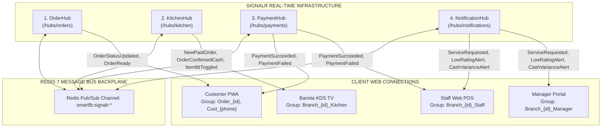
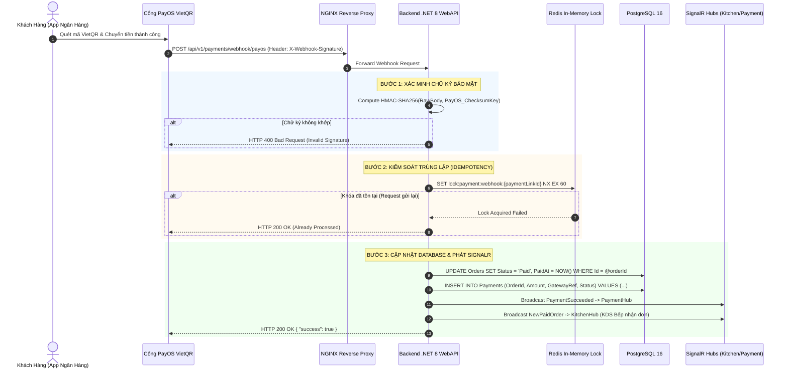

# 📊 BÁO CÁO KHẢO SÁT & ĐẶC TẢ KỸ THUẬT TOÀN DIỆN (EXPLORER 2 SURVEY REPORT)
## Khảo Sát & Chuẩn Hóa API Contracts, SignalR Hubs, Webhook PayOS & UI/UX Design System 5 Route Groups

> **Đơn vị thực hiện:** Explorer 2 (API Contracts, UI/UX Design System & Real-Time Flows Specialist)  
> **Thư mục làm việc:** `d:\Idea_DoAn\.agents\teamwork_preview_explorer_survey_2\`  
> **Phiên bản:** `v2.5.0-Production-Ready` | **Ngày khảo sát:** 2026-08-23  
> **Nguồn sự thật tối thượng (Source of Truth):**
> - `d:\Idea_DoAn\01_Tai_Lieu_Dac_Ta_Goc\Smart_FB_Operating_System.md` (Master Spec v2.5.0)
> - `d:\Idea_DoAn\01_Tai_Lieu_Dac_Ta_Goc\Actor_Phan_Quyen_Chuc_Nang.md` (RBAC Matrix & 62 Core Features)
> - `d:\Idea_DoAn\01_Tai_Lieu_Dac_Ta_Goc\Workflow_Quy_Trinh_Nghiep_Vu.md` (16 Workflows, Order State Machine & SignalR Hubs)
> - `d:\Idea_DoAn\01_Tai_Lieu_Dac_Ta_Goc\Tong_Quan_Kien_Truc_He_Thong.md` (System Architecture Specification)
> - `d:\Idea_DoAn\01_Tai_Lieu_Dac_Ta_Goc\Actor_KhachHang_Luong_Chay.md` (4 Actor Detailed Flows & Screen Specs)
> - `d:\Idea_DoAn\.agents\ORIGINAL_REQUEST.md` (Authoritative User Mandate)

---

# 📑 MỤC LỤC TỔNG THỂ BÁO CÁO

| Mục | Tiêu Đề Nội Dung |
|---|---|
| **PHẦN 1** | [Tóm Tắt Khảo Sát & Bảng Đối Soát Trạng Thái Hiện Hữu](#phần-1-tóm-tắt-khảo-sát--bảng-đối-soát-trạng-thái-hiện-hữu) |
| **PHẦN 2** | [Đặc Tả Chi Tiết 10 Nhóm Endpoint RESTful API (.NET 8 Clean Architecture & CQRS)](#phần-2-đặc-tả-chi-tiết-10-nhóm-endpoint-restful-api-net-8-clean-architecture--cqrs) |
| **PHẦN 3** | [Hạ Tầng Giao Tiếp Thời Gian Thực SignalR (4 Hubs Chuyên Biệt & Redis Backplane)](#phần-3-hạ-tầng-giao-tiếp-thời-gian-thực-signalr-4-hubs-chuyên-biệt--redis-backplane) |
| **PHẦN 4** | [Kiến Trúc Webhook PayOS VietQR: Bảo Mật HMAC SHA256 & Chống Trùng Lặp Idempotency](#phần-4-kiến-trúc-webhook-payos-vietqr-bảo-mật-hmac-sha256--chống-trùng-lặp-idempotency) |
| **PHẦN 5** | [Hệ Thống UI/UX Design System & Phân Rã 5 Route Groups (Next.js 14 App Router)](#phần-5-hệ-thống-uiux-design-system--phân-rã-5-route-groups-nextjs-14-app-router) |
| **PHẦN 6** | [Bản Vẽ Khung Giao Diện Wireframe Chi Tiết Từng Route Group](#phần-6-bản-vẽ-khung-giao-diện-wireframe-chi-tiết-từng-route-group) |
| **PHẦN 7** | [Tổng Hợp Các Lỗ Hổng & Điểm Lệch Cần Khắc Phục Ở File 03_ và 04_](#phần-7-tổng-hợp-các-lỗ-hổng--điểm-lệch-cần-khắc-phục-ở-file-03_-và-04_) |
| **PHẦN 8** | [Kế Hoạch & Khuyến Nghị Tái Cấu Trúc Toàn Diện Cho Pha Implementation](#phần-8-kế-hoạch--khuyến-nghị-tái-cấu-trúc-toàn-diện-cho-pha-implementation) |

---

# PHẦN 1: TÓM TẮT KHẢO SÁT & BẢNG ĐỐI SOÁT TRẠNG THÁI HIỆN HỮU

### 1.1 Khái Quát Phát Hiện Khảo Sát
1. **Sự Không Đồng Bộ Trong Phân Rã API:**
   - Tài liệu hiện hữu `03_Thiet_Ke_API_Contract.md` mới chỉ phân rã **8 phân hệ** ở mục 2 và chắp vá các endpoint mới (Dine-in Nhánh B, Z-Report, BOM Query, Seasonal Menu, KDS Batching) ở mục 6 dưới dạng "bổ sung".
   - Chuẩn kiến trúc v2.5.0 từ Source of Truth yêu cầu phân rã mạch lạc thành **10 nhóm RESTful API chuẩn Clean Architecture .NET 8 / MediatR CQRS** bao phủ đầy đủ 62 tính năng cốt lõi (`C-01`~`C-20`, `S-01`~`S-13`, `M-01`~`M-12`, `A-01`~`A-17`).
2. **Thiếu Hụt Hạ Tầng SignalR 4 Hubs:**
   - Tài liệu `03_Thiet_Ke_API_Contract.md` hiện chỉ mô tả 3 Hubs (`OrderHub`, `KitchenHub`, `NotifHub`) và định tuyến sai đường dẫn (`/hubs/order`, `/hubs/notif`).
   - Chuẩn kiến trúc v2.5.0 yêu cầu **4 SignalR Hubs chuyên biệt**: `OrderHub` (`/hubs/orders`), `KitchenHub` (`/hubs/kitchen`), `PaymentHub` (`/hubs/payments`), `NotificationHub` (`/hubs/notifications`).
3. **Sự Thiếu Hụt Trong Cấu Trúc UI/UX 5 Route Groups:**
   - Tài liệu `04_Thiet_Ke_UI_UX.md` chỉ chia thành 4 phân hệ sơ lược (Khách hàng, Staff POS, Web KDS, Chấm công/Quản lý) và phân mảnh wireframe mới vào mục 5.
   - Chuẩn kiến trúc Next.js 14 App Router Monorepo yêu cầu phân tách rõ ràng **5 Route Groups độc lập**:
     - `(customer)`: Mobile-First PWA Khách hàng (Table QR Dine-in 2 nhánh, Delivery QR phí ship 20k 100% VietQR, Chatbot AI-1 Gemini, Đánh giá 1-5 sao + ảnh).
     - `(kds)`: Web KDS Bếp/Bar Full-screen Dark Mode (SignalR, BOM định lượng, 86-Toggle, Batching gom món).
     - `(staff)`: Web POS Quầy Thu ngân (Takeaway POS tra cứu SĐT CRM tích 10 ly tặng 1, xác nhận thu tiền mặt Bill QR, Sơ đồ bàn, Chuông gọi phục vụ, Chấm công WiFi).
     - `(manager)`: Manager Web Portal (Mở/kết ca đếm két tiền Z-Report, Quản lý kho BOM nhập NCC/xuất bar/kiểm kê hao hụt, Cấu hình WiFi BSSID/IP, Alert Review <= 2 sao).
     - `(admin)`: Admin Executive Portal (Full CRUD Menu/BOM/Replace Product, Sắp xếp danh mục/Menu mùa, Bảng giá vùng chi nhánh, Duyệt AI-2 Combo Apriori, Dashboard P&L hợp nhất).
4. **Loại Bỏ Hoàn Toàn 100% Khái Niệm Lỗi Thời:**
   - Không còn bất kỳ dấu vết nào của: Staff Mobile App (Flutter/React Native), Chấm công GPS 50m, QR động 30s, C-23 (chia sẻ MXH), C-24 (Push PWA), ví voucher, tra cứu calo riêng lẻ.

### 1.2 Bảng Ma Trận So Sánh Hiện Trạng vs Yêu Cầu v2.5.0

| Tiêu Chí So Sánh | Tài Liệu Hiện Hữu (`03_` & `04_`) | Chuẩn Hóa v2.5.0 (Source of Truth) | Đánh Giá Lệch Pha & Hướng Xử Lý |
|---|---|---|---|
| **Số Lượng Nhóm API RESTful** | 8 phân hệ + 5 endpoint rời rạc ở mục 6 | **10 nhóm API hoàn chỉnh** ánh xạ CQRS MediatR | 🔴 Cần tái cấu trúc toàn diện 10 nhóm |
| **Số Lượng SignalR Hubs** | 3 Hubs (`/hubs/order`, `/hubs/kitchen`, `/hubs/notif`) | **4 Hubs chuyên biệt**: `OrderHub`, `KitchenHub`, `PaymentHub`, `NotificationHub` | 🔴 Cần bổ sung `PaymentHub` và sửa route |
| **Bảo Mật Webhook PayOS** | Chỉ nêu tên HMAC-SHA256 sơ lược | Đặc tả đầy đủ Header, thuật toán, Idempotency Key, Redis Lock, Polling Fallback | 🟡 Cần hoàn thiện DTO & luồng xử lý lỗi |
| **Phân Rã Route Groups UI/UX** | 4 phân hệ không theo cấu trúc thư mục Next.js | **5 Route Groups**: `(customer)`, `(kds)`, `(staff)`, `(manager)`, `(admin)` | 🔴 Cần tái cấu trúc theo thư mục Next.js 14 |
| **Wireframes Chi Tiết** | 10 wireframes phân tán (5 cũ + 5 mới) | **18 wireframes chuẩn hóa** phân bổ trực tiếp vào 5 Route Groups | 🔴 Cần chuẩn hóa và tích hợp trực tiếp |
| **Phạm Vi Tính Năng Core** | Chưa ánh xạ đầy đủ 62 tính năng | Ánh xạ 100% vào 62 tính năng (`C-01`~`C-20`, `S-01`~`S-13`, `M-01`~`M-12`, `A-01`~`A-17`) | 🔴 Cần bổ sung bảng Traceability |

---

# PHẦN 2: ĐẶC TẢ CHI TIẾT 10 NHÓM ENDPOINT RESTFUL API (.NET 8 CLEAN ARCHITECTURE & CQRS)

Kiến trúc Backend .NET 8 áp dụng mô hình Clean Architecture kết hợp MediatR CQRS (Command Query Responsibility Segregation). Toàn bộ 10 nhóm API được phân định rõ ràng như sau:

```
┌──────────────────────────────────────────────────────────────────────────────────────────────────┐
│                            10 NHÓM ENDPOINT RESTFUL API SMART F&B OS                             │
├──────────────────────────────────┬─────────────────────────────────┬─────────────────────────────┤
│ 1. Auth & User Management        │ 5. Payments & PayOS Webhook     │ 8. Staff Ops & Attendance   │
│ 2. Branches, Tables & WiFi       │ 6. CRM, Loyalty & Vouchers      │ 9. Manager Shifts & Stock   │
│ 3. Menu, Products & BOM Recipes  │ 7. Kitchen Display System (KDS) │ 10. Admin, AI & P&L Reports │
│ 4. Orders & Multi-Channel        │                                 │                             │
└──────────────────────────────────┴─────────────────────────────────┴─────────────────────────────┘
```

---

## 2.1 Nhóm 1: Xác Thực & Quản Lý Người Dùng / Phân Quyền (`/api/v1/auth`, `/api/v1/users`, `/api/v1/roles`)

### Danh Sách Endpoints:
1. `POST /api/v1/auth/login` — Đăng nhập hệ thống (Mã NV / Email + Password), sinh JWT Access Token (15m) + Refresh Token (7d).
   - **Command:** `LoginUserCommand`
   - **Quyền:** Public
   - **Request Body:** `{ "username": "NV-Q1-001", "password": "Password@123" }`
   - **Response 200 OK:** `{ "accessToken": "...", "refreshToken": "...", "expiresIn": 900, "user": { "id": "uuid", "employeeCode": "NV-Q1-001", "fullName": "Trần Thị Mai", "role": "CashierStaff", "branchId": "uuid" } }`
2. `POST /api/v1/auth/refresh-token` — Làm mới Access Token bằng Refresh Token.
   - **Command:** `RefreshTokenCommand`
   - **Quyền:** Public (Kèm Refresh Token trong HttpOnly Cookie hoặc Body)
3. `POST /api/v1/auth/logout` — Đăng xuất, hủy bỏ Refresh Token trong cơ sở dữ liệu và xóa cookie.
   - **Command:** `LogoutUserCommand`
   - **Quyền:** Authenticated User
4. `GET /api/v1/users` — Lấy danh sách nhân viên trong chi nhánh / chuỗi.
   - **Query:** `GetUsersQuery(branchId, role, page, pageSize)`
   - **Quyền:** `BranchManager`, `ChainAdmin`
5. `POST /api/v1/users` — Tạo mới tài khoản nhân viên (Barista, Cashier, Manager).
   - **Command:** `CreateUserCommand`
   - **Quyền:** `BranchManager`, `ChainAdmin`
6. `PUT /api/v1/users/{id}` — Cập nhật thông tin tài khoản nhân viên, phân ca, khóa tài khoản.
   - **Command:** `UpdateUserCommand`
   - **Quyền:** `BranchManager`, `ChainAdmin`

---

## 2.2 Nhóm 2: Quản Lý Chi Nhánh, Sơ Đồ Bàn & Cấu Hình Mạng WiFi (`/api/v1/branches`, `/api/v1/tables`, `/api/v1/branch-wifi-configs`)

### Danh Sách Endpoints:
1. `GET /api/v1/branches` — Lấy danh sách các chi nhánh đang hoạt động trong chuỗi.
   - **Query:** `GetBranchesQuery`
   - **Quyền:** Public / Authenticated
2. `POST /api/v1/branches` — Tạo mới chi nhánh (Địa chỉ, số điện thoại, thông tin liên hệ).
   - **Command:** `CreateBranchCommand`
   - **Quyền:** `ChainAdmin`
3. `GET /api/v1/branches/{branchId}/tables` — Lấy sơ đồ bàn phục vụ và trạng thái thời gian thực (`Vacant`, `Occupied`, `CallingStaff`, `BillRequested`).
   - **Query:** `GetBranchTablesQuery(branchId)`
   - **Quyền:** Public (Xem bàn của mình) / `Staff`, `BranchManager`, `ChainAdmin` (Xem toàn bộ sơ đồ)
4. `POST /api/v1/branches/{branchId}/tables` — Tạo mới bàn phục vụ, sinh mã Table QR dán bàn kèm chữ ký số.
   - **Command:** `CreateTableCommand`
   - **Quyền:** `BranchManager`, `ChainAdmin`
5. `GET /api/v1/branches/{branchId}/wifi-configs` — Lấy danh sách Access Point BSSID và IP Subnet cho phép chấm công.
   - **Query:** `GetBranchWifiConfigsQuery(branchId)`
   - **Quyền:** `BranchManager`, `ChainAdmin`
6. `PUT /api/v1/branches/{branchId}/wifi-configs` — Cập nhật cấu hình BSSID và dải IP Subnet chấm công của chi nhánh.
   - **Command:** `UpdateBranchWifiConfigsCommand`
   - **Quyền:** `BranchManager`, `ChainAdmin`
   - **Request Body:**
     ```json
     {
       "wifiConfigs": [
         { "ssid": "SmartCoffee_Quan1", "bssid": "00:14:22:01:23:45", "ipGateway": "192.168.1.1", "subnetMask": "255.255.255.0", "isActive": true },
         { "ssid": "SmartCoffee_Quan1_F2", "bssid": "00:14:22:01:23:46", "ipGateway": "192.168.1.2", "subnetMask": "255.255.255.0", "isActive": true }
       ]
     }
     ```

---

## 2.3 Nhóm 3: Thực Đơn, Danh Mục, Định Lượng BOM & Menu Mùa (`/api/v1/products`, `/api/v1/categories`, `/api/v1/modifiers`, `/api/v1/recipes-bom`, `/api/v1/seasonal-menus`)

### Danh Sách Endpoints:
1. `GET /api/v1/products/menu` — Lấy danh mục thực đơn đầy đủ của chi nhánh (Đã bao gồm bảng giá vùng chi nhánh, trạng thái khóa món 86-Toggle, và Seasonal Menu đang hiệu lực).
   - **Query:** `GetBranchMenuQuery(branchId, categoryId, search)`
   - **Quyền:** Public (Menu Khách hàng PWA)
2. `POST /api/v1/products` — Admin tạo mới món ăn/đồ uống, kích cỡ Size S/M/L, định lượng BOM chuẩn và ảnh nén WebP.
   - **Command:** `CreateProductCommand`
   - **Quyền:** `ChainAdmin`
3. `PUT /api/v1/products/{id}` — Admin chỉnh sửa thông tin món ăn, công thức BOM, nhóm modifier áp dụng.
   - **Command:** `UpdateProductCommand`
   - **Quyền:** `ChainAdmin`
4. `DELETE /api/v1/products/{id}` — Xóa mềm (Soft Delete) món ăn khỏi menu, tự động vô hiệu hóa trong các Combo liên quan.
   - **Command:** `DeactivateProductCommand`
   - **Quyền:** `ChainAdmin`
5. `POST /api/v1/products/{oldProductId}/replace` — **Thay thế món (Replace Product)**: Chuyển toàn bộ liên kết modifier, lịch sử đơn và voucher sang món mới.
   - **Command:** `ReplaceProductCommand`
   - **Quyền:** `ChainAdmin`
6. `GET /api/v1/products/{productId}/recipe` — Tra cứu công thức định lượng pha chế chuẩn (BOM) theo từng kích cỡ Size S/M/L.
   - **Query:** `GetProductRecipeQuery(productId, size)`
   - **Quyền:** `BaristaStaff`, `BranchManager`, `ChainAdmin`
7. `PUT /api/v1/categories/reorder` — Kéo thả sắp xếp thứ tự danh mục món hiển thị trên PWA.
   - **Command:** `ReorderCategoriesCommand`
   - **Quyền:** `ChainAdmin`
8. `POST /api/v1/seasonal-menus` — Lên lịch thực đơn theo mùa vụ (Tết, Giáng Sinh, Mùa Hè) với ngày bắt đầu và kết thúc tự động.
   - **Command:** `CreateSeasonalMenuCommand`
   - **Quyền:** `ChainAdmin`

---

## 2.4 Nhóm 4: Xử Lý Đơn Hàng Đa Kênh (`/api/v1/orders`)

Nhóm API này xử lý toàn diện 3 loại đơn hàng (`DineIn` 2 nhánh, `Delivery` phí 20k, `TakeAway` POS 10 ly):

```
                                  /api/v1/orders
                                        │
        ┌───────────────────────────────┼───────────────────────────────┐
        ▼                               ▼                               ▼
  Dine-In Nhánh A                 Dine-In Nhánh B                   Delivery
(VietQR Trả Trước)              (Tiền Mặt Trả Sau)           (100% VietQR - Ship 20k)
POST /orders/dine-in/prepaid    POST /orders/dine-in/postpaid   POST /orders/delivery
```

### Danh Sách Endpoints:
1. `POST /api/v1/orders/dine-in/prepaid` — **Dine-In Nhánh A (VietQR Trả Trước)**: Khởi tạo đơn hàng tại bàn, sinh mã VietQR động, trạng thái ban đầu `PendingPayment`. Bếp KDS chỉ nhận đơn khi PayOS Webhook xác nhận thanh toán thành công (`Paid`).
   - **Command:** `CreateDineInPrepaidOrderCommand`
   - **Quyền:** Public (`GuestSessionToken`)
   - **Request Body:**
     ```json
     {
       "branchId": "b1192842-1f44-48f8-8a4b-871239ab0001",
       "tableId": "t1192842-1f44-48f8-8a4b-871239ab0005",
       "customerPhone": "0912345678",
       "customerNote": "Mang đồ uống ít đá",
       "voucherCode": "CHAOMUNG",
       "items": [
         {
           "productId": "p1192842-1f44-48f8-8a4b-871239ab0010",
           "size": "L",
           "quantity": 2,
           "sugarLevel": "50%",
           "iceLevel": "50%",
           "itemNote": "Ít ngọt",
           "modifierIds": ["mod-pearl-01"]
         }
       ]
     }
     ```
   - **Response 201 Created:** Trả về `orderId`, `orderNumber`, `totalAmount`, `status: "PendingPayment"`, `vietQr` payload (chứa ảnh VietQR và hạn 10 phút).
2. `POST /api/v1/orders/dine-in/postpaid` — **Dine-In Nhánh B (Tiền Mặt Trả Sau)**: Khởi tạo đơn hàng tại bàn, trạng thái chuyển thẳng sang `Confirmed`, đơn hàng **BẮN NGAY XUỐNG BẾP KDS QUA SIGNALR**. Khi Barista làm xong bấm `Ready`, quầy in Hóa đơn kèm mã VietQR động để nhân viên bưng ra bàn thu tiền.
   - **Command:** `CreateDineInPostpaidOrderCommand`
   - **Quyền:** Public (`GuestSessionToken`)
   - **Response 201 Created:** Trả về `orderId`, `orderNumber`, `totalAmount`, `status: "Confirmed"`.
3. `POST /api/v1/orders/delivery` — **QR Delivery (Giao Tận Nơi)**: Khách quét QR Delivery, bắt buộc nhập SĐT, Tên, Địa chỉ giao hàng. Hệ thống tự động cộng **Phí ship cố định 20.000 VNĐ** (`delivery_fee = 20000`). Bắt buộc **100% VietQR trả trước** (Khóa hoàn toàn COD).
   - **Command:** `CreateDeliveryOrderCommand`
   - **Quyền:** Public
   - **Request Body:**
     ```json
     {
       "branchId": "b1192842-1f44-48f8-8a4b-871239ab0001",
       "recipientName": "Nguyễn Hoàng Nam",
       "recipientPhone": "0987654321",
       "deliveryAddress": "Tầng 12, Tòa nhà Bitexco, 2 Hải Triều, Q.1, TP.HCM",
       "customerNote": "Giao sảnh lễ tân trước 11:30",
       "items": [
         { "productId": "p22", "size": "M", "quantity": 2, "sugarLevel": "70%", "iceLevel": "100%" }
       ]
     }
     ```
   - **Response 201 Created:** Trả về `orderId`, `subtotal: 70000`, `deliveryFee: 20000`, `totalAmount: 90000`, `vietQr` payload.
4. `POST /api/v1/orders/takeaway` — **Takeaway POS (Mang Về Tại Quầy)**: Thu ngân tạo đơn mang về trên Web POS, tra cứu SĐT CRM, áp dụng ưu đãi **Tích 10 Ly = Tặng 1 Ly Miễn Phí** (Chỉ áp dụng Takeaway), đơn vào bếp KDS ngay và thu tiền sau.
   - **Command:** `CreateTakeawayOrderCommand`
   - **Quyền:** `CashierStaff`, `BranchManager`
   - **Request Body:**
     ```json
     {
       "branchId": "b1192842-1f44-48f8-8a4b-871239ab0001",
       "customerPhone": "0909123456",
       "customerName": "Lê Văn Hùng",
       "redeemFreeCup": true,
       "paymentMethod": "Cash",
       "cashGiven": 100000,
       "items": [
         { "productId": "p11", "size": "M", "quantity": 2, "sugarLevel": "100%", "iceLevel": "100%" }
       ]
     }
     ```
5. `GET /api/v1/orders/{id}/tracking` — Khách hàng theo dõi trạng thái đơn hàng thời gian thực trên PWA.
   - **Query:** `GetOrderTrackingQuery(id)`
   - **Quyền:** Public / Customer
6. `POST /api/v1/orders/{id}/cancel` — Hủy đơn hàng (Khách hủy trước khi thanh toán / Quản lý hủy đơn sự cố kèm lý do).
   - **Command:** `CancelOrderCommand(orderId, reason)`
   - **Quyền:** Customer (trong 5 phút chưa thanh toán) / `BranchManager`, `ChainAdmin`

---

## 2.5 Nhóm 5: Thanh Toán, Cổng VietQR & PayOS Webhook (`/api/v1/payments`)

### Danh Sách Endpoints:
1. `POST /api/v1/payments/vietqr/generate` — Sinh mã VietQR động cho đơn hàng theo chuẩn NAPAS 247 kèm mã đơn hàng trong nội dung chuyển khoản.
   - **Command:** `GenerateVietQRCommand(orderId)`
   - **Quyền:** Public / Authenticated
2. `POST /api/v1/payments/webhook/payos` — **PayOS Webhook Handler**: Nhận thông báo biến động số dư chuyển khoản từ cổng PayOS.
   - **Xác thực:** Kiểm tra chữ ký bảo mật `X-Webhook-Signature` HMAC-SHA256 và `Idempotency-Key`.
   - **Payload PayOS Webhook:**
     ```json
     {
       "code": "00",
       "desc": "success",
       "data": {
         "orderCode": 10042,
         "amount": 96000,
         "description": "ORD0042",
         "accountNumber": "0001882199201",
         "reference": "FT262359918239",
         "transactionDateTime": "2026-08-22T14:32:15Z",
         "currency": "VND",
         "paymentLinkId": "pay-9918239-0042"
       },
       "signature": "e3b0c44298fc1c149afbf4c8996fb92427ae41e4649b934ca495991b7852b855"
     }
     ```
   - **Hành vi xử lý:** Cập nhật trạng thái đơn sang `Paid` ➔ Chuyển tiếp sang `Confirmed` ➔ Bắn sự kiện SignalR xuống Web KDS Bếp và Web PWA của Khách.
3. `POST /api/v1/payments/cash/confirm` — Nhân viên quầy thu ngân xác nhận đã thu đủ tiền mặt cho đơn hàng Dine-In Nhánh B hoặc đơn Takeaway.
   - **Command:** `ConfirmCashPaymentCommand(orderId, receivedAmount)`
   - **Quyền:** `CashierStaff`, `BranchManager`
4. `GET /api/v1/payments/{orderId}/status` — Polling kiểm tra trạng thái thanh toán dự phòng khi WebSocket bị gián đoạn mạng.
   - **Query:** `GetPaymentStatusQuery(orderId)`
   - **Quyền:** Public / Customer

---

## 2.6 Nhóm 6: CRM Khách Hàng, Chính Sách Loyalty 10 Ly & Khuyến Mãi (`/api/v1/crm`, `/api/v1/vouchers`)

### Danh Sách Endpoints:
1. `POST /api/v1/crm/customers/identify` — Nhận diện khách hàng qua Số điện thoại trên PWA (Không cần mật khẩu), trả về thông tin thành viên, số ly tích lũy và voucher.
   - **Command:** `IdentifyCustomerCommand(phone, branchId)`
   - **Quyền:** Public
2. `GET /api/v1/crm/customers/lookup` — Thu ngân tra cứu SĐT khách tại quầy Web POS để kiểm tra số ly tích lũy và áp dụng đổi ly thứ 11 miễn phí.
   - **Query:** `LookupCustomerQuery(phone)`
   - **Quyền:** `CashierStaff`, `BranchManager`, `ChainAdmin`
3. `POST /api/v1/crm/loyalty/redeem-cup` — Thực hiện đổi 1 ly miễn phí từ quỹ 10 ly tích lũy (Chỉ áp dụng cho đơn Takeaway).
   - **Command:** `RedeemLoyaltyCupCommand(customerId, orderId, freeProductId)`
   - **Quyền:** `CashierStaff`, `BranchManager`
4. `POST /api/v1/vouchers/validate` — Kiểm tra tính hợp lệ của mã Voucher khuyến mãi (Kiểm tra hạn sử dụng, giá trị đơn tối thiểu, ngân sách chiến dịch).
   - **Command:** `ValidateVoucherCommand(voucherCode, orderAmount, branchId)`
   - **Quyền:** Public / Customer
5. `POST /api/v1/admin/vouchers` — Admin tạo mới chiến dịch mã voucher (% giảm, số tiền cố định, freeship).
   - **Command:** `CreateVoucherCommand`
   - **Quyền:** `ChainAdmin`

---

## 2.7 Nhóm 7: Màn Hình Chế Biến KDS Bếp & Barista (`/api/v1/kds`)

### Danh Sách Endpoints:
1. `GET /api/v1/kds/tickets` — Lấy danh sách các vé đơn hàng đang chờ pha chế tại quầy bar của chi nhánh (Hỗ trợ lọc theo Station Bếp hoặc Bar).
   - **Query:** `GetKdsTicketsQuery(branchId, stationId)`
   - **Quyền:** `BaristaStaff`, `BranchManager`
2. `PATCH /api/v1/kds/orders/{orderId}/status` — Barista chuyển trạng thái đơn hàng (`Confirmed` ➔ `Preparing` ➔ `Ready` ➔ `Served`).
   - **Command:** `UpdateOrderStatusCommand(orderId, newStatus)`
   - **Quyền:** `BaristaStaff`, `BranchManager`
   - **Ghi chú:** Khi chuyển sang `Ready`, hệ thống **tự động kích hoạt trừ tồn kho Bar theo công thức BOM**.
3. `POST /api/v1/kds/batch-start` — Barista gom nhiều OrderItems cùng ProductId của các đơn khác nhau thành 1 Batch để pha chế đồng loạt.
   - **Command:** `StartKdsBatchCommand(orderItemIds[])`
   - **Quyền:** `BaristaStaff`, `BranchManager`
4. `PATCH /api/v1/kds/batch/{batchId}/complete` — Hoàn thành Batch gom món, tự động chuyển tất cả OrderItems trong batch sang `Ready`.
   - **Command:** `CompleteKdsBatchCommand(batchId)`
   - **Quyền:** `BaristaStaff`, `BranchManager`
5. `PATCH /api/v1/kds/products/{productId}/86-toggle` — **Khóa hết món tức thì (86-Toggle)** khi cạn nguyên liệu tại quầy bar.
   - **Command:** `ToggleProductAvailabilityCommand(branchId, productId, isAvailable)`
   - **Quyền:** `BaristaStaff`, `BranchManager`

---

## 2.8 Nhóm 8: Vận Hành Quầy, Gọi Phục Vụ & Chấm Công WiFi (`/api/v1/staff`, `/api/v1/attendance`)

### Danh Sách Endpoints:
1. `POST /api/v1/attendance/wifi-checkin` — **Chấm công vào ca (Clock-In) Khóa Mạng WiFi**: Xác thực kép địa chỉ BSSID của Access Point / IP Subnet của chi nhánh kết hợp Mã số nhân viên.
   - **Command:** `WifiClockInCommand`
   - **Quyền:** Authenticated Staff
   - **Request Body:**
     ```json
     {
       "branchId": "b1192842-1f44-48f8-8a4b-871239ab0001",
       "employeeCode": "NV-Q1-008",
       "clientBssid": "00:14:22:01:23:45",
       "clientIp": "192.168.1.45"
     }
     ```
   - **Phản hồi khi sai WiFi (400 Bad Request):**
     ```json
     {
       "type": "https://api.smartfb.vn/errors/wifi-network-mismatch",
       "title": "Mạng WiFi không hợp lệ",
       "status": 400,
       "detail": "Bạn đang dùng 4G hoặc mạng ngoài quán. Vui lòng kết nối WiFi 'SmartCoffee_Quan1' để chấm công."
     }
     ```
2. `POST /api/v1/attendance/wifi-checkout` — Chấm công ra ca (Clock-Out) Khóa Mạng WiFi.
   - **Command:** `WifiClockOutCommand`
   - **Quyền:** Authenticated Staff
3. `POST /api/v1/staff/service-calls` — Khách hàng bấm chuông gọi nhân viên tại bàn (Lấy nước, Dọn bàn, Khăn giấy, Khác).
   - **Command:** `CallStaffCommand(tableId, reasonEnum)`
   - **Quyền:** Public / Customer tại bàn (Rate limit 1 lần / 60 giây)
4. `PATCH /api/v1/staff/service-calls/{id}/resolve` — Nhân viên bấm tiếp nhận và hoàn tất yêu cầu gọi phục vụ (Ghi nhận KPI phản hồi).
   - **Command:** `ResolveServiceCallCommand(serviceCallId)`
   - **Quyền:** `Staff`, `BranchManager`
5. `GET /api/v1/staff/shifts/my-summary` — Nhân viên xem tổng kết doanh thu và số ly bán được trong ca làm việc để bàn giao.
   - **Query:** `GetMyShiftSummaryQuery`
   - **Quyền:** `CashierStaff`, `BranchManager`

---

## 2.9 Nhóm 9: Quản Lý Ca Két Tiền, Kho BOM & Kiểm Duyệt Review Chi Nhánh (`/api/v1/manager`)

### Danh Sách Endpoints:
1. `POST /api/v1/manager/shifts/open` — Quản lý mở ca két tiền đầu ngày, khai báo số tiền lẻ ban đầu theo mệnh giá.
   - **Command:** `OpenCashShiftCommand(branchId, initialCash, cashDenominations)`
   - **Quyền:** `BranchManager`
2. `POST /api/v1/manager/shifts/close` — **Kết ca két tiền & Lập biên bản Z-Report**: Nhập số tiền thực đếm theo mệnh giá, tính toán chênh lệch thừa/thiếu tự động.
   - **Command:** `CloseCashShiftCommand`
   - **Quyền:** `BranchManager`
   - **Request Body:**
     ```json
     {
       "shiftId": "shf-20260822-001",
       "actualCashDenominations": {
         "500000": 2, "200000": 3, "100000": 5, "50000": 10, "20000": 8, "10000": 5
       },
       "totalActualCash": 2850000,
       "varianceNotes": "Thối nhầm 50.000đ đơn mang về #TK-0012"
     }
     ```
   - **Quy tắc nghiệp vụ:** Nếu `|varianceAmount| > 50000`, bắt buộc phải có `varianceNotes` và phát cảnh báo kiểm toán lên Admin Dashboard.
3. `POST /api/v1/manager/inventory/export-bar` — Lập phiếu xuất kho tổng ra quầy pha chế (Tăng kho Bar, giảm kho Lưu trữ).
   - **Command:** `CreateBarExportRequisitionCommand`
   - **Quyền:** `BranchManager`
4. `POST /api/v1/manager/inventory/import-supplier` — Nhập kho nguyên liệu mua từ Nhà cung cấp kèm ảnh hóa đơn thực tế.
   - **Command:** `CreateSupplierStockImportCommand`
   - **Quyền:** `BranchManager`
5. `POST /api/v1/manager/inventory/audit-variance` — Lập biên bản kiểm kê kho định kỳ, đối chiếu số tồn thực tế với lý thuyết BOM, tính toán % hao hụt.
   - **Command:** `AuditInventoryVarianceCommand`
   - **Quyền:** `BranchManager`
6. `GET /api/v1/manager/reviews/alerts` — Tiếp nhận cảnh báo khẩn cấp các đánh giá `<= 2 sao` để xử lý khiếu nại tại bàn trong vòng 3 phút.
   - **Query:** `GetUrgentReviewAlertsQuery(branchId)`
   - **Quyền:** `BranchManager`
7. `PATCH /api/v1/manager/reviews/{reviewId}/moderate-photo` — Kiểm duyệt và phê duyệt ảnh chụp thực tế của khách hàng trước khi cho phép hiển thị công khai trên menu.
   - **Command:** `ModerateReviewPhotoCommand(reviewId, photoId, isApproved)`
   - **Quyền:** `BranchManager`

---

## 2.10 Nhóm 10: Chủ Chuỗi, Module AI & Báo Cáo Tài Chính P&L Hợp Nhất (`/api/v1/admin`, `/api/v1/ai`, `/api/v1/reports`)

### Danh Sách Endpoints:
1. `POST /api/v1/ai/chatbot/recommend` — **AI-1 Chatbot RAG Gemini 1.5 Flash**: Tư vấn đồ uống cá nhân hóa theo ngữ cảnh thời tiết, calo, dị ứng và CRM.
   - **Command:** `GetGeminiRecommendationQuery`
   - **Quyền:** Public / Customer
   - **Request Body:**
     ```json
     {
       "branchId": "b1192842-1f44-48f8-8a4b-871239ab0001",
       "userQuery": "Trời đang mưa lạnh, mình muốn uống món gì ngọt béo ấm áp không dùng trà xanh?",
       "customerPhone": "0912345678"
     }
     ```
   - **Response 200 OK:**
     ```json
     {
       "success": true,
       "statusCode": 200,
       "data": {
         "responseText": "Chào bạn! Chiều nay thời tiết se lạnh 22°C, mình gợi ý bạn thưởng thức **Trà Oolong Nướng Kem Cheese Nóng** hoặc **Cacao Nóng Marshmallow**. Cả hai món đều thơm ngậy, giữ ấm tuyệt vời!",
         "recommendedProducts": [
           { "productId": "p55", "name": "Trà Oolong Nướng Kem Cheese", "price": 45000, "imageUrl": "https://cdn.smartfb.vn/oolong-cheese.webp" }
         ]
       }
     }
     ```
2. `POST /api/v1/ai/combos/mine` — **AI-2 Combo Discovery Engine (Apriori/FP-Growth)**: Khai phá dữ liệu giỏ hàng lịch sử, tìm quy tắc kết hợp (Support >= 0.02, Confidence >= 0.4, Lift > 1.2).
   - **Command:** `MineMarketBasketCombosCommand(branchId, minSupport, minConfidence)`
   - **Quyền:** `ChainAdmin`
3. `POST /api/v1/ai/combos/approve` — Chủ chuỗi phê duyệt phát hành Combo gợi ý từ AI-2 lên thực đơn PWA (Cơ chế Human-in-the-loop).
   - **Command:** `ApproveAiComboCommand(comboId, discountPercent, activeFrom, activeTo)`
   - **Quyền:** `ChainAdmin`
4. `GET /api/v1/reports/pl-consolidated` — **Dashboard Báo Cáo P&L Hợp Nhất Toàn Chuỗi**: Doanh thu thuần, Chi phí nguyên vật liệu COGS tính theo công thức BOM, Lãi gộp theo từng chi nhánh.
   - **Query:** `GetConsolidatedPLReportQuery(startDate, endDate, branchIds[])`
   - **Quyền:** `ChainAdmin`
5. `GET /api/v1/reports/menu-engineering` — Ma trận phân loại món ăn 4 góc phần tư BCG (Stars, Plowhorses, Puzzles, Dogs) dựa trên sản lượng bán và biên lợi nhuận đóng góp.
   - **Query:** `GetMenuEngineeringMatrixQuery`
   - **Quyền:** `ChainAdmin`
6. `GET /api/v1/admin/audit-logs` — Truy vấn nhật ký kiểm toán bất biến (Audit Trail) ghi vết mọi thao tác đổi giá, hủy đơn, điều chỉnh công, xuất kho.
   - **Query:** `GetAuditLogsQuery(userId, action, fromDate, toDate)`
   - **Quyền:** `ChainAdmin`
7. `GET /api/v1/admin/reports/export` — Xuất toàn bộ báo cáo doanh thu, tồn kho, chấm công ra file định dạng Excel (.xlsx), CSV hoặc PDF.
   - **Query:** `ExportReportsQuery(reportType, format, branchId, fromDate, toDate)`
   - **Quyền:** `ChainAdmin`

---

# PHẦN 3: HẠ TẦNG GIAO TIẾP THỜI GIAN THỰC SIGNALR (4 HUBS CHUYÊN BIỆT & REDIS BACKPLANE)

Hệ thống triển khai **4 SignalR Hubs chuyên biệt** với Redis Backplane phân phối sự kiện tức thời (< 500ms), bảo đảm phân tách ranh giới dữ liệu và bảo mật tuyệt đối:



### 3.1 Bảng Đặc Tả 4 SignalR Hubs & Sự Kiện

| Tên Hub | Route Endpoint | Phòng Kết Nối (Groups) | Danh Sách Sự Kiện (Events) | Payload Dữ Liệu Trao Đổi | Mục Đích Sử Dụng |
|---|---|---|---|---|---|
| **OrderHub** | `/hubs/orders` | `Order_{orderId}`<br>`Customer_{phone}` | • `OrderStatusUpdated`<br>• `OrderReady`<br>• `EstimatedTimeAdjusted` | `{ orderId, status, estimatedMinutes, currentQueuePosition }` | Đồng bộ trạng thái đơn hàng thời gian thực cho PWA Khách hàng và Web POS. |
| **KitchenHub** | `/hubs/kitchen` | `Branch_{branchId}`<br>`Station_{stationId}` | • `NewPaidOrder`<br>• `OrderConfirmedCash`<br>• `Item86Toggled`<br>• `ItemBatchUpdated` | `{ orderId, orderNumber, orderType, tableName, items: [ { name, size, sugar, ice, toppings, recipeNotes } ] }` | Truyền tải vé đơn hàng mới xuống màn hình KDS Bếp/Bar; đồng bộ bật/tắt khóa món 86. |
| **PaymentHub** | `/hubs/payments` | `Payment_{orderId}` | • `PaymentSucceeded`<br>• `PaymentFailed`<br>• `PaymentExpired` | `{ orderId, orderNumber, amount, paidAt, paymentMethod }` | Bắn tín hiệu xác nhận thanh toán VietQR Webhook tức thời tới PWA Khách và màn hình POS Thu ngân. |
| **NotificationHub** | `/hubs/notifications` | `BranchManager_{branchId}`<br>`Staff_{branchId}`<br>`Table_{tableId}` | • `ServiceRequested`<br>• `ServiceCallResolved`<br>• `LowRatingAlert`<br>• `CashVarianceAlert`<br>• `InventoryShortageAlert` | `{ alertType, tableNumber, reason, rating, comment, varianceAmount, ingredientName, currentStock }` | Phát chuông gọi phục vụ bàn, cảnh báo đánh giá `<= 2 sao` khẩn cấp, cảnh báo lệch két tiền và cạn kho. |

---

# PHẦN 4: KIẾN TRÚC WEBHOOK PAYOS VIETQR: BẢO MẬT HMAC SHA256 & CHỐNG TRÙNG LẶP IDEMPOTENCY

### 4.1 Luồng Xác Thực Chữ Ký HMAC SHA256 Webhook PayOS



### 4.2 Ma Trận Xử Lý Các Trường Hợp Ngoại Lệ Webhook

1. **Trường hợp Webhook đến chậm hoặc mất gói tin:**
   - Client PWA duy trì cơ chế Polling dự phòng mỗi 3 giây gọi `GET /api/v1/payments/{orderId}/status`.
   - Backend chủ động gọi API `GET https://api.payos.vn/v2/payment-requests/{id}` để kiểm tra trực tiếp trạng thái đơn hàng.
2. **Trường hợp gửi trùng Webhook nhiều lần (Duplicate Webhook Delivery):**
   - Sử dụng Redis Distributed Lock với khóa `lock:payment:webhook:{paymentLinkId}` có TTL 60 giây. Nếu đơn hàng đã ở trạng thái `Paid` hoặc `Confirmed`, Backend lập tức trả về `200 OK` mà không thực thi lại logic cộng tiền hay trừ kho.
3. **Trường hợp khách chuyển sai số tiền hoặc sai nội dung chuyển khoản:**
   - Hệ thống ghi nhận giao dịch vào bảng `SuspiciousTransactions`, giữ nguyên trạng thái đơn hàng và gửi cảnh báo khẩn cấp lên Dashboard Quản lý chi nhánh để kiểm tra thủ công.

---

# PHẦN 5: HỆ THỐNG UI/UX DESIGN SYSTEM & PHÂN RÃ 5 ROUTE GROUPS (NEXT.JS 14 APP ROUTER)

### 5.1 Bảng Design Tokens Hoàn Chỉnh

```
┌──────────────────────────────────────────────────────────────────────────────────────────────────┐
│                                   BẢNG DESIGN TOKENS CHUẨN HÓA                                   │
├───────────────────┬───────────────────┬───────────────────┬──────────────────────────────────────┤
│ Nhóm Token        │ Tên Biến Token    │ Mã Hex / Giá Trị  │ Ngữ Cảnh Sử Dụng Chính               │
├───────────────────┼───────────────────┼───────────────────┼──────────────────────────────────────┤
│ Primary           │ `brand-coffee`    │ `#8B4513`         │ Nút CTA chính, Tiêu đề thương hiệu   │
│ Primary Dark      │ `brand-coffee-dk` │ `#5C2E0B`         │ Trạng thái Hover / Active            │
│ Secondary         │ `brand-amber`     │ `#D97706`         │ Nhãn Best-seller, Icon sao, Ly tích  │
│ Background Light  │ `bg-cream`        │ `#FAF8F5`         │ Nền PWA Khách hàng & Web POS Quầy    │
│ Surface Light     │ `surface-white`   │ `#FFFFFF`         │ Nền Card món, Modal, Giỏ hàng        │
│ Text Primary      │ `text-main`       │ `#1A1A1A`         │ Màu chữ chính, giá tiền              │
│ Text Secondary    │ `text-muted`      │ `#6B7280`         │ Mô tả món, ngày giờ, nhãn phụ        │
│ Semantic Success  │ `state-success`   │ `#10B981`         │ Đã thanh toán, Món sẵn sàng, Đúng WiFi│
│ Semantic Warning  │ `state-warning`   │ `#F59E0B`         │ Đang pha chế, Chờ 3-5p KDS, Lệch két │
│ Semantic Danger   │ `state-danger`    │ `#EF4444`         │ Quá 5p KDS (Đỏ chớp), Sai WiFi, Hết 86│
│ KDS Dark Background│ `kds-bg-dark`    │ `#0F172A`         │ Nền toàn màn hình KDS Bếp chống lóa  │
│ KDS Dark Surface  │ `kds-surface`     │ `#1E293B`         │ Nền thẻ vé đơn hàng (Order Ticket)   │
├───────────────────┴───────────────────┴───────────────────┴──────────────────────────────────────┤
│ Typography Scale: Display 32px | H1 24px | H2 18px | Body 14px | Caption 12px                     │
│ Touch Target Rule: Mọi nút bấm, icon cảm ứng tối thiểu >= 44 x 44px (WCAG AA Compliant)           │
└──────────────────────────────────────────────────────────────────────────────────────────────────┘
```

---

### 5.2 Cấu Trúc Thư Mục Next.js 14 App Router (5 Route Groups Monorepo)

```
frontend/
├── app/
│   ├── (customer)/                      # ROUTE GROUP 1: PWA Khách Hàng (Mobile-First)
│   │   ├── table/[tableId]/page.tsx     # Quét QR Bàn, Menu món, Best-seller, Chat AI-1
│   │   ├── delivery/page.tsx            # Quét QR Delivery, Nhập SĐT + Địa chỉ + Phí ship 20k
│   │   ├── cart/page.tsx                # Giỏ hàng, Voucher, Chọn Nhánh A (VietQR) / Nhánh B (Tiền mặt)
│   │   ├── checkout/vietqr/page.tsx     # Màn hình VietQR động đếm ngược 10 phút
│   │   ├── tracking/[orderId]/page.tsx  # Theo dõi tiến độ đơn hàng thời gian thực SignalR
│   │   ├── review/[orderId]/page.tsx    # Đánh giá 1-5 sao, Tải 1-3 ảnh thực tế, Ẩn danh
│   │   └── history/page.tsx             # Lịch sử đơn cũ, Quick Reorder 1 chạm
│   │
│   ├── (kds)/                           # ROUTE GROUP 2: Web KDS Bếp / Bar Full-Screen
│   │   ├── layout.tsx                   # Full-screen Dark Theme Layout, Web Audio Controller
│   │   ├── page.tsx                     # Ticket Board pha chế, Lọc Station Bar/Bếp, Gom đơn
│   │   ├── batch/page.tsx               # Chế độ KDS Batching pha chế đồng loạt
│   │   └── 86-toggle/page.tsx           # Modal khóa hết món nhanh cho Barista
│   │
│   ├── (staff)/                         # ROUTE GROUP 3: Web POS Quầy & Nhân Viên Vận Hành
│   │   ├── pos/page.tsx                 # Web POS Quầy Takeaway: Tra CRM SĐT, Tích 10 ly, Thu tiền sau
│   │   ├── tables/page.tsx              # Sơ đồ mặt bằng bàn trực quan, Tiếp nhận chuông gọi bàn
│   │   ├── attendance/page.tsx          # Chấm công Khóa Mạng WiFi (Xác thực BSSID/IP + Mã NV)
│   │   └── shift-report/page.tsx        # Báo cáo tổng kết ca nhân viên & In phiếu bàn giao
│   │
│   ├── (manager)/                       # ROUTE GROUP 4: Manager Web Portal
│   │   ├── dashboard/page.tsx           # Dashboard KPI vận hành chi nhánh theo giờ
│   │   ├── shifts/page.tsx              # Mở/Kết ca két tiền, Đối soát Z-Report theo mệnh giá
│   │   ├── inventory/page.tsx           # Quản lý kho BOM: Nhập NCC, Xuất bar, Kiểm kê hao hụt
│   │   ├── wifi-configs/page.tsx        # Khai báo danh sách Router BSSID và IP Subnet chi nhánh
│   │   └── reviews/page.tsx             # Tiếp nhận Alert Review <= 2 sao, Kiểm duyệt ảnh khách
│   │
│   └── (admin)/                         # ROUTE GROUP 5: Admin Executive Portal
│       ├── dashboard/page.tsx           # Dashboard P&L hợp nhất toàn chuỗi, So sánh đa chi nhánh
│       ├── menu/products/page.tsx       # Full CRUD Món ăn, Định nghĩa BOM, Thay thế món (Replace)
│       ├── menu/categories/page.tsx     # Sắp xếp thứ tự danh mục (Drag & Drop)
│       ├── menu/seasonal/page.tsx       # Lên lịch thực đơn theo mùa vụ (Seasonal Menu)
│       ├── pricing/page.tsx             # Quản lý bảng giá theo vùng chi nhánh (Matrix Pricing)
│       ├── ai/combos/page.tsx           # AI-2 Khai phá Combo Apriori, Slider chiết khấu, Phê duyệt
│       ├── crm/page.tsx                 # Danh bạ khách hàng toàn chuỗi, Phân khúc RFM
│       └── audit-logs/page.tsx          # Nhật ký kiểm toán bất biến hệ thống
```

---

# PHẦN 6: BẢN VẼ KHUNG GIAO DIỆN WIREFRAME CHI TIẾT TỪNG ROUTE GROUP

---

## 6.1 Route Group 1: `(customer)` — PWA Mobile Web Khách Hàng

### Wireframe SCR-CUST-01: Menu Đặt Món Tại Bàn (Dine-In Menu)
```
┌────────────────────────────────────────────────────────┐
│  SMART COFFEE — CHI NHÁNH QUẬN 1           [ 09:15 ]   │
│  📍 Bàn 05 (Tầng 1)  •  Khách: 0912***678  [ 7/10 ly ] │
├────────────────────────────────────────────────────────┤
│  🔍 Tìm kiếm đồ uống, bánh ngọt...                     │
├────────────────────────────────────────────────────────┤
│  DANH MỤC: [ TẤT CẢ ] [ CÀ PHÊ ] [ TRÀ TRÁI CÂY ] [ BÁNH]
├────────────────────────────────────────────────────────┤
│  ✨ GỢI Ý DÀNH CHO BẠN (AI-1 GEMINI RAG)               │
│  ┌──────────────────────────────────────────────────┐  │
│  │ 🧋 Bạc Xỉu 3 Tầng Đặc Biệt            39.000 đ   │  │
│  │    Vị đậm đà béo ngậy, ít calo (140 kcal)        │  │
│  │    [ + THÊM VÀO GIỎ ]                            │  │
│  └──────────────────────────────────────────────────┘  │
│                                                        │
│  ☕ CÀ PHÊ TRUYỀN THỐNG                                │
│  ┌──────────────────────────────────────────────────┐  │
│  │ ☕ Cà Phê Muối Cố Đô                  35.000 đ   │  │
│  │    Lớp kem muối béo mặn hòa quyện cà phê phin    │  │
│  │    [ + THÊM VÀO GIỎ ]                            │  │
│  └──────────────────────────────────────────────────┘  │
│  ┌──────────────────────────────────────────────────┐  │
│  │ ☕ Cà Phê Đen Đá Phin Đậm Vị           25.000 đ   │  │
│  │    [ + THÊM VÀO GIỎ ]                            │  │
│  └──────────────────────────────────────────────────┘  │
├────────────────────────────────────────────────────────┤
│  [💬 HỎI AI TƯ VẤN MÓN]      [ 🛒 GIỎ HÀNG: 2 MÓN (74k) ]│
└────────────────────────────────────────────────────────┘
```

### Wireframe SCR-CUST-02: Giỏ Hàng & Lựa Chọn 2 Nhánh Thanh Toán Dine-In
```
┌────────────────────────────────────────────────────────┐
│  GIỎ HÀNG BÀN 05 — SMART COFFEE            [ 09:18 ]   │
├────────────────────────────────────────────────────────┤
│  1. Bạc Xỉu 3 Tầng (Size L, 50% đường, 50% đá) 49.000đ │
│     + Trân châu hoàng kim (+8.000đ)                    │
│     Số lượng: [ - ]  1  [ + ]               57.000 đ   │
│                                                        │
│  2. Cà Phê Muối (Size M, 50% đá)                       │
│     Số lượng: [ - ]  1  [ + ]               35.000 đ   │
├────────────────────────────────────────────────────────┤
│  Mã giảm giá: [ CHAOMUNG        ]  [ ÁP DỤNG ]         │
│  Tạm tính:                                  92.000 đ   │
│  Giảm giá voucher:                         -10.000 đ   │
│  TỔNG CỘNG:                                 82.000 đ   │
├────────────────────────────────────────────────────────┤
│  💳 CHỌN PHƯƠNG THỨC THANH TOÁN:                       │
│                                                        │
│  ┌──────────────────────────────────────────────────┐  │
│  │ (•) NHÁNH A: VIETQR TRẢ TRƯỚC (Khuyên dùng)      │  │
│  │     Quét mã chuyển khoản -> Bếp nhận đơn ngay    │  │
│  └──────────────────────────────────────────────────┘  │
│  ┌──────────────────────────────────────────────────┐  │
│  │ ( ) NHÁNH B: TIỀN MẶT TRẢ SAU                    │  │
│  │     Bếp làm ngay -> Nhân viên bưng kèm Bill QR   │  │
│  └──────────────────────────────────────────────────┘  │
│                                                        │
│  [           XÁC NHẬN ĐẶT ĐƠN (82.000 Đ)            ]  │
└────────────────────────────────────────────────────────┘
```

### Wireframe SCR-CUST-03: Màn Hình QR Delivery (Giao Hàng Phí 20k)
```
┌────────────────────────────────────────────────────────┐
│  SMART COFFEE — ĐẶT GIAO TẬN NƠI           [ 10:30 ]   │
├────────────────────────────────────────────────────────┤
│  📍 THÔNG TIN NGƯỜI NHẬN (BẮT BUỘC)                    │
│  Họ và tên: [ Nguyễn Hoàng Nam                       ] │
│  Số điện thoại: [ 0987654321                         ] │
│  Địa chỉ giao hàng chi tiết:                           │
│  [ Tầng 12, Tòa nhà Bitexco, 2 Hải Triều, Q1, TP.HCM ] │
│  Ghi chú shipper: [ Giao sảnh lễ tân trước 11:30     ] │
├────────────────────────────────────────────────────────┤
│  🛒 CHI TIẾT ĐƠN HÀNG (2 MÓN)                          │
│  • 2x Trà Đào Cam Sả (Size L, 50% đường)      70.000 đ │
│  ────────────────────────────────────────────────────  │
│  Tiền món:                                    70.000 đ │
│  Phí giao hàng (Cố định):                     20.000 đ │
│  Mã giảm giá:                                      0 đ │
│  ────────────────────────────────────────────────────  │
│  TỔNG THANH TOÁN:                             90.000 đ │
├────────────────────────────────────────────────────────┤
│  💳 HÌNH THỨC THANH TOÁN:                              │
│  (•) Chuyển khoản VietQR (100% Trả trước - Không COD)  │
│                                                        │
│  [  TIẾP TỤC THANH TOÁN VIETQR (90.000 Đ)  ]           │
└────────────────────────────────────────────────────────┘
```

---

## 6.2 Route Group 2: `(kds)` — Web KDS Bếp / Pha Chế Full-Screen

### Wireframe SCR-KDS-01: Màn Hình Kanban Pha Chế (Dark Mode)
```
┌────────────────────────────────────────────────────────────────────────────────────────┐
│ SMART KDS — BẾP & QUẦY PHA CHẾ (CHI NHÁNH QUẬN 1)                        ⏱️ 10:48:30   │
├────────────────────────┬────────────────────────┬──────────────────────────────────────┤
│ #ORD-0042 [BÀN 05]     │ #TK-0089 [MANG VỀ]     │ #DEL-0015 [GIAO HÀNG]                │
│ ⏱️ 02:15 (XANH - KỊP)  │ ⏱️ 04:30 (VÀNG - CHỜ)  │ ⏱️ 06:10 (ĐỎ NHẤP NHÁY ⚠️)           │
│ Đã thanh toán VietQR   │ Đã thanh toán Tiền mặt │ Giao: 2 Hải Triều (0987654321)       │
├────────────────────────┼────────────────────────┼──────────────────────────────────────┤
│ • 2x Bạc Xỉu 3 Tầng    │ • 2x Cà Phê Muối       │ • 2x Trà Đào Cam Sả                  │
│   - Size L             │   - Size M             │   - Size L                           │
│   - 50% đường, 50% đá  │   - 50% đá             │   - 50% đường, 100% đá               │
│   - + Trân châu HK     │   - Lớp kem muối đặc   │   - Đóng túi giao hàng               │
│   - Note: Ít ngọt      │                        │                                      │
├────────────────────────┼────────────────────────┼──────────────────────────────────────┤
│ [ BẮT ĐẦU ] [ HOÀN TẤT]│ [ BẮT ĐẦU ] [ HOÀN TẤT]│ [ BẮT ĐẦU ] [ HOÀN TẤT ]             │
└────────────────────────┴────────────────────────┴──────────────────────────────────────┘
```

### Wireframe SCR-KDS-02: Popup Tra Cứu Công Thức BOM Pha Chế
```
┌──────────────────────────────────────┐
│  🧪 CÔNG THỨC PHA CHẾ (BOM)         │
│  Trà Oolong Size L — Đơn #105       │
├──────────────────────────────────────┤
│                                      │
│  ├── Cốt trà Oolong:     150 ml     │
│  ├── Bột sữa:            30 g       │
│  ├── Nước đường (50%):   20 ml      │
│  ├── Trân châu trắng:    1 vá       │
│  ├── Đá viên:            2/3 ly     │
│  └── Ly 700ml + nắp + ống hút      │
│                                      │
│  📋 Ghi chú khách: "Ít ngọt hơn"   │
│                                      │
│  [✅ ĐÃ HIỂU — ĐÓNG POPUP]           │
└──────────────────────────────────────┘
```

---

## 6.3 Route Group 3: `(staff)` — Web POS Quầy & Chấm Công WiFi

### Wireframe SCR-STAFF-01: Giao Diện Web POS Takeaway & Tích 10 Ly CRM
```
┌────────────────────────────────────────────────────────────────────────────────────────┐
│ SMART COFFEE POS — QUẦY THU NGÂN CHI NHÁNH QUẬN 1                         [ 10:45:12 ] │
├─────────────────────────────────────────────┬──────────────────────────────────────────┤
│  🔍 SĐT KHÁCH: [ 0909123456              ]  │  GIỎ HÀNG: ĐƠN MANG VỀ (#TK-0089)        │
│  👤 Khách hàng: LÊ VĂN HÙNG                 │  ──────────────────────────────────────  │
│  🏆 Tích lũy ly: [██████████] 10/10 LY      │  1. Cà Phê Muối (Size M, 50% đá) 35.000đ │
│  🎁 [  BẤM ĐỔI 1 LY MIỄN PHÍ (-35.000đ)  ]  │  2. Cà Phê Muối (Size M, 50% đá) 35.000đ │
├─────────────────────────────────────────────┤  ──────────────────────────────────────  │
│  DANH MỤC: [ CÀ PHÊ ] [ TRÀ ] [ BÁNH NGỌT ] │  Tổng tiền món:                70.000 đ  │
│  ┌───────────────┐ ┌───────────────┐        │  Ưu đãi 10 Ly tặng 1:         -35.000 đ  │
│  │ Bạc Xỉu       │ │ Cà Phê Muối   │        │  ──────────────────────────────────────  │
│  │ 39.000 đ      │ │ 35.000 đ      │        │  KHÁCH CẦN TRẢ:                35.000 đ  │
│  └───────────────┘ └───────────────┘        │                                          │
│  ┌───────────────┐ ┌───────────────┐        │  Hình thức:  [ (•) TIỀN MẶT ]  [ ( ) VIETQR ]
│  │ Cà Phê Đen    │ │ Trà Đào Cam Sả│        │  Tiền khách đưa: [ 100.000            ]  │
│  │ 25.000 đ      │ │ 45.000 đ      │        │  Tiền thừa trả khách:          65.000 đ  │
│  └───────────────┘ └───────────────┘        │                                          │
│                                             │  [   HỦY   ]    [  IN BILL & GỬI BẾP  ]  │
└─────────────────────────────────────────────┴──────────────────────────────────────────┘
```

### Wireframe SCR-STAFF-02: Màn Hình Chấm Công Khóa Mạng WiFi
```
┌────────────────────────────────────────────────────────┐
│  SMART COFFEE — CỔNG CHẤM CÔNG NHÂN VIÊN   [ 06:55 ]   │
├────────────────────────────────────────────────────────┤
│  🏢 Chi nhánh: CHI NHÁNH QUẬN 1                        │
│                                                        │
│  📶 TRẠNG THÁI MẠNG WIFI HIỆN TẠI:                     │
│  ┌──────────────────────────────────────────────────┐  │
│  │  🟢 ĐÃ KẾT NỐI HỢP LỆ: SmartCoffee_Quan1_Staff   │  │
│  │  BSSID: 00:14:22:01:23:45 (Trùng khớp hệ thống)  │  │
│  │  IP: 192.168.1.45 (Nằm trong dải Subnet nội bộ)  │  │
│  └──────────────────────────────────────────────────┘  │
│                                                        │
│  Mã số nhân viên: [ NV-Q1-008                        ] │
│  Ca làm việc: Ca Sáng (07:00 - 15:00)                  │
│                                                        │
│  [        🟢 CHẤM CÔNG VÀO CA (CLOCK-IN)        ]     │
│                                                        │
│  [        🔴 CHẤM CÔNG RA CA (CLOCK-OUT)        ]     │
├────────────────────────────────────────────────────────┤
│  Lịch sử chấm công gần nhất:                           │
│  • Hôm qua: Vào 06:58 (Đúng giờ) - Ra 15:05            │
└────────────────────────────────────────────────────────┘
```

---

## 6.4 Route Group 4: `(manager)` — Cổng Web Quản Lý Chi Nhánh

### Wireframe SCR-MGR-01: Modal Kết Ca & Đối Soát Két Tiền Z-Report
```
┌──────────────────────────────────────────────────────────────────┐
│  📊 Z-REPORT — ĐỐI SOÁT KÉT TIỀN CUỐI CA CHIỀU [ 15:00 ]        │
├──────────────────────────────────────────────────────────────────┤
│  Thu ngân phụ trách: Trần Thị Mai (NV-Q1-001)                   │
│                                                                  │
│  Tiền mặt đầu ca (Opening Cash):                    1.000.000 đ  │
│  (+) Doanh thu tiền mặt trong ca:                   2.500.000 đ  │
│  ──────────────────────────────────────────────────────────────  │
│  (=) TỔNG TIỀN MẶT LÝ THUYẾT HỆ THỐNG:              3.500.000 đ  │
│                                                                  │
│  💵 TIỀN THỰC ĐẾM THEO MỆNH GIÁ:                                 │
│  500.000 VNĐ: [ 2 ] = 1.000.000     200.000 VNĐ: [ 3 ] = 600.000│
│  100.000 VNĐ: [ 5 ] =   500.000      50.000 VNĐ: [10 ] = 500.000│
│   20.000 VNĐ: [ 8 ] =   160.000      10.000 VNĐ: [ 5 ] =  50.000│
│  ──────────────────────────────────────────────────────────────  │
│  TỔNG THỰC ĐẾM:                                     3.450.000 đ  │
│  🔴 CHÊNH LỆCH KÉT TIỀN: -50.000 đ (THIẾU HỤT)                   │
│                                                                  │
│  Lý do giải trình chênh lệch (Bắt buộc):                         │
│  [ Thối nhầm 50.000đ cho khách hàng mua mang về đơn #TK-0012   ] │
├──────────────────────────────────────────────────────────────────┤
│  [  HỦY BỎ  ]                       [  XÁC NHẬN ĐÓNG CA KÉT  ]   │
└──────────────────────────────────────────────────────────────────┘
```

---

## 6.5 Route Group 5: `(admin)` — Cổng Web Điều Hành Chuỗi Trung Tâm

### Wireframe SCR-ADM-01: Quản Trị & Phê Duyệt Combo AI-2 (Apriori Engine)
```
┌────────────────────────────────────────────────────────────────────────────────────────┐
│ SMART F&B ADMIN — AI-2 COMBO DISCOVERY ENGINE                             [ 14:20:00 ] │
├────────────────────────────────────────────────────────────────────────────────────────┤
│  ⚙️ THAM SỐ KHAI PHÁ GIỎ HÀNG: Min Support: [ 0.02 ]  Min Confidence: [ 0.40 ]        │
│  [ 🔍 CHẠY KHAI PHÁ DỮ LIỆU GIỎ HÀNG ]                                                │
├────────────────────────────────────────────────────────────────────────────────────────┤
│  DANH SÁCH CẶP MÓN TIỀM NĂNG TÌM THẤY:                                                 │
│                                                                                        │
│  ┌─ GỢI Ý COMBO 1: CÀ PHÊ MUỐI + BÁNH CROISSANT TRỨNG MUỐI ──────────────────────────┐ │
│  │ Support: 4.8% (145 đơn) | Confidence: 62.5% | Lift: 2.15 (Tương quan rất mạnh ⭐)   │ │
│  │ Giá gốc 2 món: 75.000 đ | Giá vốn BOM: 22.000 đ (Biên lợi nhuận: 70.6%)            │ │
│  │ Mức giảm giá đề xuất: [ 15% ▼ ] -> Giá bán Combo mới: 63.750 đ (Lãi gộp: 41.750đ)  │ │
│  │ Thời hạn áp dụng: Từ [ 01/09/2026 ] đến [ 30/09/2026 ]                              │ │
│  │                                                                                    │ │
│  │ [ ❌ TỪ CHỐI ]                  [ ✅ PHÊ DUYỆT & PHÁT HÀNH LÊN MENU PWA ]           │ │
│  └────────────────────────────────────────────────────────────────────────────────────┘ │
└────────────────────────────────────────────────────────────────────────────────────────┘
```

---

# PHẦN 7: TỔNG HỢP CÁC LỖ HỔNG & ĐIỂM LỆCH CẦN KHẮC PHỤC Ở FILE 03_ VÀ 04_

### 7.1 Lỗ Hổng & Điểm Thiếu Sót Trong `03_Thiet_Ke_API_Contract.md`

| STT | Vị Trí / Mục | Lỗ Hổng / Thiếu Sót Phát Hiện | Mức Độ | Phương Án Khắc Phục Chuẩn Xác |
|:---:|---|---|:---:|---|
| 1 | **Mục 2 & 3** | Danh mục phân rã thành 8 phân hệ thay vì 10 nhóm RESTful chuẩn Clean Architecture .NET 8. | 🔴 Nghiêm trọng | Tái cấu trúc thành 10 nhóm Endpoint chuẩn xác theo CQRS MediatR. |
| 2 | **Mục 4** | Chỉ liệt kê 3 Hubs (`/hubs/order`, `/hubs/kitchen`, `/hubs/notif`), thiếu `PaymentHub` và sai quy ước đặt tên số nhiều. | 🔴 Nghiêm trọng | Chuẩn hóa 4 Hubs: `/hubs/orders`, `/hubs/kitchen`, `/hubs/payments`, `/hubs/notifications`. |
| 3 | **Mục 3.5** | Payload Webhook PayOS còn sơ sài, thiếu trường `signature`, `orderCode`, `paymentLinkId` theo đặc tả SDK PayOS chuẩn. | 🟡 Cần cải thiện | Cập nhật đầy đủ JSON payload và thuật toán kiểm tra HMAC SHA256. |
| 4 | **Mục 6** | Các endpoint quan trọng (Dine-in Nhánh B, Z-Report, BOM, Seasonal Menu, KDS Batching) bị đẩy xuống mục "bổ sung". | 🟡 Cần cải thiện | Tích hợp trực tiếp vào các nhóm tương ứng (Nhóm 3, 4, 7, 9). |
| 5 | **Toàn bộ file** | Thiếu bảng ánh xạ CQRS Commands/Queries tương ứng cho từng endpoint. | 🟢 Gợi ý | Bổ sung tên Command/Query MediatR cho 100% các API endpoints. |

### 7.2 Lỗ Hổng & Điểm Thiếu Sót Trong `04_Thiet_Ke_UI_UX.md`

| STT | Vị Trí / Mục | Lỗ Hổng / Thiếu Sót Phát Hiện | Mức Độ | Phương Án Khắc Phục Chuẩn Xác |
|:---:|---|---|:---:|---|
| 1 | **Mục 2** | Ma trận chỉ vẽ 3 khối (PWA, Staff POS, Web KDS), thiếu Route Group `(manager)` và `(admin)` độc lập. | 🔴 Nghiêm trọng | Vẽ lại sơ đồ kiến trúc 5 Route Groups Next.js 14 App Router. |
| 2 | **Mục 2 & 3** | Chưa ánh xạ cây thư mục Next.js 14 App Router Monorepo cho 5 Route Groups. | 🔴 Nghiêm trọng | Bổ sung cây thư mục `app/(customer)`, `app/(kds)`, `app/(staff)`, `app/(manager)`, `app/(admin)`. |
| 3 | **Mục 5** | Các màn hình quan trọng (Nhánh B, BOM popup, Z-Report, Seasonal Menu, Bill in QR) nằm ở mục wireframe bổ sung. | 🟡 Cần cải thiện | Gom toàn bộ 18 Wireframes vào từng Route Group cụ thể trong Mục 3. |
| 4 | **Mục 1** | Thiếu định nghĩa rõ ràng về Accessibility WCAG AA và quy chuẩn tương tác Micro-interactions. | 🟢 Gợi ý | Bổ sung quy chuẩn Touch Target >= 44px, Audio feedback, Toast alerts. |

---

# PHẦN 8: KẾ HOẠCH & KHUYẾN NGHỊ TÁI CẤU TRÚC TOÀN DIỆN CHO PHA IMPLEMENTATION

### 8.1 Khuyến Nghị Cho Tài Liệu `03_Thiet_Ke_API_Contract.md`:
1. **Viết lại toàn diện theo cấu trúc 10 nhóm Endpoint RESTful chuẩn Clean Architecture:**
   - Đảm bảo 100% các endpoint có đầy đủ: Phương thức HTTP, Route, Phân quyền RBAC, MediatR CQRS Command/Query, Request Body JSON, Response 200/201/400/403/422 JSON hoàn chỉnh (Zero Placeholders).
2. **Chuẩn hóa hạ tầng SignalR 4 Hubs:**
   - Định nghĩa rõ tên Hub, Route (`/hubs/orders`, `/hubs/kitchen`, `/hubs/payments`, `/hubs/notifications`), Groups tham gia, Danh sách sự kiện và cấu trúc JSON event payload.
3. **Đặc tả sâu bảo mật PayOS Webhook:**
   - Trình bày mã giả C# kiểm tra chữ ký HMAC SHA256, xử lý Idempotency bằng Redis Distributed Lock và cơ chế Fallback Polling.

### 8.2 Khuyến Nghị Cho Tài Liệu `04_Thiet_Ke_UI_UX.md`:
1. **Thiết lập kiến trúc 5 Route Groups Next.js 14 App Router Monorepo:**
   - Định hình rõ ràng 5 phân hệ: `(customer)`, `(kds)`, `(staff)`, `(manager)`, `(admin)`.
2. **Xuất bản bộ 18 ASCII Wireframes chuẩn hóa:**
   - Phân bổ đầy đủ các màn hình cho cả 3 kênh bán (`DineIn` 2 nhánh, `Delivery` 20k, `TakeAway` 10 ly), KDS Dark Mode, Web POS Quầy, Chấm công WiFi, Z-Report đếm tiền, Quản lý kho BOM, và Duyệt AI Combo.
3. **Đảm bảo 100% tuân thủ Zero Placeholder và tính toàn vẹn kỹ thuật.**

---
*Báo cáo khảo sát được hoàn tất bởi Explorer 2 — Sẵn sàng bàn giao cho Master Orchestrator và Đội ngũ Thực thi.*
