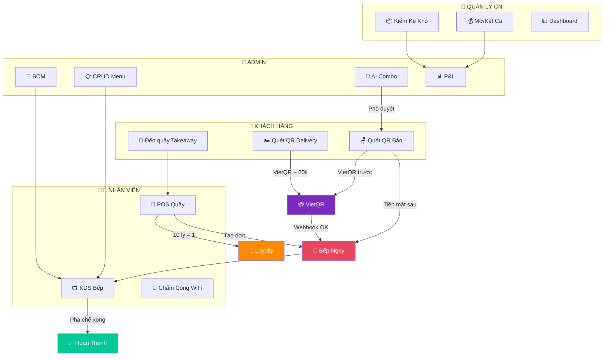

# 📋 TỔNG QUAN HỆ THỐNG SMART F&B OS — TÀI LIỆU DÀNH CHO ĐỐI TÁC
## Luồng Chạy Chi Tiết Toàn Bộ 4 Nhóm Người Dùng

> [!NOTE]
> **Dự án:** Smart F&B OS — Nền tảng quản lý & vận hành quán cà phê thông minh  
> **Phiên bản:** v2.5.0-Production-Ready | **Đối tượng:** Chủ quán, Đối tác, Hội đồng nghiệm thu  
> **Đặc điểm nổi bật:** 100% chạy trên trình duyệt — KHÔNG CẦN CÀI APP — KHÔNG CẦN MÁY POS  

---

## 📚 MỤC LỤC

| # | Nội Dung |
|---|---------|
| **I** | [Tổng Quan Hệ Thống & 4 Nhóm Người Dùng](#i-tổng-quan-hệ-thống--4-nhóm-người-dùng) |
| **II** | [KHÁCH HÀNG — 3 Cách Đặt Món](#ii-khách-hàng--3-cách-đặt-món) |
| **III** | [NHÂN VIÊN — Vận Hành Quầy & Bếp](#iii-nhân-viên--vận-hành-quầy--bếp) |
| **IV** | [QUẢN LÝ CHI NHÁNH — Giám Sát & Tài Chính](#iv-quản-lý-chi-nhánh--giám-sát--tài-chính) |
| **V** | [CHỦ CHUỖI / ADMIN — Toàn Quyền Hệ Thống](#v-chủ-chuỗi--admin--toàn-quyền-hệ-thống) |
| **VI** | [Bảng Tóm Tắt So Sánh 3 Loại Đơn](#vi-bảng-tóm-tắt-so-sánh-3-loại-đơn) |
| **VII** | [Sơ Đồ Tổng Hợp Toàn Bộ Hệ Thống](#vii-sơ-đồ-tổng-hợp-toàn-bộ-hệ-thống) |

---

# I. Tổng Quan Hệ Thống & 4 Nhóm Người Dùng

```
┌──────────────────────────────────────────────────────────────────────────────────┐
│                         SMART F&B OS — 4 NHÓM NGƯỜI DÙNG                        │
├──────────────────────┬──────────────────────────┬────────────────────────────────┤
│  👤 KHÁCH HÀNG        │  Điện thoại (Safari/     │  Quét QR đặt món tại bàn,     │
│  (Customer)           │  Chrome PWA)             │  QR đặt giao nhà, mua mang về │
├──────────────────────┼──────────────────────────┼────────────────────────────────┤
│  👨‍💼 NHÂN VIÊN         │  Tablet/PC Quầy thu ngân │  Nhận đơn KDS, pha chế, POS   │
│  (Staff / Barista)   │  Smart TV Bếp (Web)      │  Takeaway, CRM 10 ly, chấm công│
├──────────────────────┼──────────────────────────┼────────────────────────────────┤
│  🏪 QUẢN LÝ CN        │  Laptop/Tablet (Web)     │  Mở/kết ca két tiền, kho BOM, │
│  (Branch Manager)    │                          │  phân ca, WiFi, review, KPI    │
├──────────────────────┼──────────────────────────┼────────────────────────────────┤
│  👑 CHỦ CHUỖI         │  Desktop/Laptop (Web)    │  CRUD menu, BOM, giá vùng,    │
│  (Chain Admin)       │                          │  AI combo, P&L, phân quyền     │
└──────────────────────┴──────────────────────────┴────────────────────────────────┘
```

---

# II. KHÁCH HÀNG — 3 Cách Đặt Món

## Tổng Quan Nhanh

```
┌─────────────────────────────────────────────────────────────────────────────────┐
│                         3 CÁCH ĐẶT MÓN SMART F&B OS                           │
├──────────────────────┬──────────────────────┬───────────────────────────────────┤
│  🪑 DINE-IN           │  🏍️ DELIVERY          │  🥤 TAKEAWAY                      │
│  Đặt món tại bàn      │  Đặt giao tận nơi    │  Mua mang về tại quầy             │
│                      │                      │                                   │
│  Khách TỰ quét QR    │  Khách TỰ quét QR    │  NHÂN VIÊN thao tác               │
│  tại bàn             │  từ poster/standee   │  cho khách tại quầy               │
│                      │                      │                                   │
│  Thanh toán:         │  Thanh toán:         │  Thanh toán:                      │
│  ✅ VietQR (trước)    │  ✅ VietQR (trước)    │  ✅ Tiền mặt (sau khi nhận)        │
│  ✅ Tiền mặt (sau)    │  ❌ Không nhận mặt    │  ✅ Chuyển khoản (sau khi nhận)    │
│                      │                      │  ✅ VietQR (sau khi nhận)          │
│  Phí ship: Không     │  Phí ship: 20.000đ   │  Phí ship: Không                  │
│  Loyalty: Không      │  Loyalty: Không      │  Loyalty: 10 ly = Tặng 1 ly ☕     │
└──────────────────────┴──────────────────────┴───────────────────────────────────┘
```

---

## Luồng 1: Đặt Món Tại Bàn (DINE-IN)

### 1.1. Bước chung cho cả 2 nhánh thanh toán

```
    Khách ngồi vào bàn
          │
          ▼
  ┌───────────────┐
  │ 📱 Quét QR     │  ← Mã QR dán cố định trên bàn
  │    tại bàn     │     (hoặc nhập mã bàn 4 số)
  └───────┬───────┘
          │
          ▼
  ┌───────────────┐
  │ 📲 Mở PWA Web │  ← Mở ngay trên trình duyệt
  │   tự động     │     Safari / Chrome
  │   (0 cài đặt) │     Không cần tải app
  └───────┬───────┘
          │
          ▼
  ┌───────────────┐
  │ 📞 Nhập SĐT   │  ← TÙY CHỌN (không bắt buộc)
  │  (tùy chọn)   │     Nếu nhập → xem loyalty, lịch sử
  │               │     Nếu bỏ qua → đặt như khách vãng lai
  └───────┬───────┘
          │
          ▼
  ┌───────────────┐
  │ 📋 Duyệt Menu │  ← Xem ảnh, giá, mô tả
  │  chọn món     │     Tìm kiếm, lọc theo danh mục
  └───────┬───────┘
          │
          ▼
  ┌───────────────┐
  │ 🎛️ Tùy biến   │  ← Chọn Size (S/M/L)
  │    từng món   │     Mức đường (0% → 100%)
  │               │     Mức đá, Topping, Ghi chú
  └───────┬───────┘
          │
          ▼
  ┌───────────────┐
  │ 🛒 Xem giỏ    │  ← Kiểm tra lại đơn hàng
  │    hàng       │     Tăng/giảm số lượng
  │               │     Áp dụng Voucher giảm giá
  └───────┬───────┘
          │
          ▼
  ┌─────────────────────────────────────┐
  │    💳 CHỌN PHƯƠNG THỨC THANH TOÁN   │
  │                                     │
  │   ┌──────────┐    ┌──────────────┐  │
  │   │  VietQR  │    │  Tiền mặt   │  │
  │   │ (Nhánh A)│    │  (Nhánh B)  │  │
  │   └────┬─────┘    └──────┬──────┘  │
  │        │                 │          │
  └────────┼─────────────────┼──────────┘
           │                 │
           ▼                 ▼
      [Xem 1.2]         [Xem 1.3]
```

### 1.2. Nhánh A — Thanh Toán VietQR (Trả TRƯỚC)

```
  Khách chọn "VietQR"
          │
          ▼
  ┌───────────────┐
  │ 📱 Hệ thống   │  ← Sinh mã QR thanh toán
  │  hiển thị mã  │     Số tài khoản + Số tiền chính xác
  │  VietQR       │     Đếm ngược 10 phút
  └───────┬───────┘
          │
          ▼
  ┌───────────────┐
  │ 🏦 Khách mở   │  ← Mở App ngân hàng bất kỳ
  │  App ngân hàng│     Quét mã → Chuyển tiền
  │  quét + chuyển│
  └───────┬───────┘
          │
          ▼
  ┌───────────────┐
  │ ✅ Hệ thống   │  ← PayOS Webhook xác nhận
  │  xác nhận     │     Tự động, không cần NV
  │  "ĐÃ THANH   │
  │   TOÁN"       │
  └───────┬───────┘
          │
          ▼
  ┌───────────────┐
  │ 🍳 BẾP NHẬN   │  ← Đơn hiện lên KDS bếp
  │    ĐƠN        │     qua SignalR (thời gian thực)
  │  (bắt đầu     │     Barista bắt đầu pha chế
  │   pha chế)    │
  └───────┬───────┘
          │
          ▼
  ┌───────────────┐
  │ 📲 Khách theo │  ← Xem trên PWA:
  │  dõi tiến độ  │     "Đã nhận" → "Đang pha"
  │  trực tiếp    │     → "Sẵn sàng" → "Đã phục vụ"
  └───────┬───────┘
          │
          ▼
  ┌───────────────┐
  │ ✅ Màn hình   │  ← PWA tự cập nhật trạng thái
  │  hiện "MÓN    │     "Sẵn sàng" trên màn hình
  │  ĐÃ SẴN      │     Nhân viên bưng ra bàn
  │  SÀNG"        │
  └───────┬───────┘
          │
          ▼
  ┌───────────────┐
  │ ☕ THƯỞNG     │  ← Khách nhận đồ uống
  │    THỨC!      │     Không cần trả thêm gì
  │               │     (đã thanh toán trước)
  └───────────────┘

  📊 Trạng thái đơn:
  Pending Payment → Paid → Confirmed → Preparing → Ready → Served ✅
```

### 1.3. Nhánh B — Thanh Toán Tiền Mặt (Trả SAU)

```
  Khách chọn "Tiền mặt"
          │
          ▼
  ┌───────────────┐
  │ ✅ Đơn VÀO    │  ← Đơn vào bếp NGAY LẬP TỨC
  │  BẾP NGAY     │     Không cần thanh toán trước
  │  (không chờ)  │     Barista pha chế liền
  └───────┬───────┘
          │
          ▼
  ┌───────────────┐
  │ 📲 Khách theo │  ← Theo dõi trên PWA
  │  dõi tiến độ  │     tương tự Nhánh A
  └───────┬───────┘
          │
          ▼
  ┌───────────────┐
  │ ✅ MÓN SẴN    │  ← PWA hiện trạng thái
  │    SÀNG       │     "Sẵn sàng"
  └───────┬───────┘
          │
          ▼
  ┌──────────────────────────────────────────┐
  │ 🧾 NV BƯNG MÓN RA BÀN                   │
  │    KÈM HÓA ĐƠN có in mã QR VietQR      │
  │                                          │
  │    ┌─────────────────────────────┐       │
  │    │  HÓA ĐƠN #102              │       │
  │    │  ────────────────           │       │
  │    │  Trà sữa Oolong L    55.000│       │
  │    │  Cà phê sữa đá M     39.000│       │
  │    │  ────────────────           │       │
  │    │  TỔNG:               94.000│       │
  │    │                             │       │
  │    │     ┌─────────┐             │       │
  │    │     │ QR Code │  ← Quét để  │       │
  │    │     │ VietQR  │    chuyển   │       │
  │    │     │         │    khoản    │       │
  │    │     └─────────┘             │       │
  │    └─────────────────────────────┘       │
  └──────────────────────────────────────────┘
          │
          ▼
  ┌─────────────────────────────────────┐
  │   KHÁCH CHỌN 1 TRONG 2 CÁCH TRẢ:   │
  │                                     │
  │   ┌──────────────┐  ┌────────────┐  │
  │   │ 💵 Trả tiền  │  │ 📱 Quét QR │  │
  │   │    mặt cho   │  │  trên hóa  │  │
  │   │    nhân viên │  │  đơn để CK │  │
  │   └──────┬───────┘  └─────┬──────┘  │
  │          │                │          │
  └──────────┼────────────────┼──────────┘
             │                │
             ▼                ▼
  ┌───────────────┐  ┌───────────────┐
  │ 👨‍💼 NV bấm    │  │ 🤖 Hệ thống  │
  │  "Xác nhận   │  │  tự động xác  │
  │   đã thu     │  │  nhận qua     │
  │   tiền mặt"  │  │  PayOS        │
  └───────┬───────┘  └───────┬───────┘
          │                  │
          └────────┬─────────┘
                   ▼
          ┌───────────────┐
          │ ✅ ĐƠN HOÀN   │
          │    THÀNH      │
          │  Bàn được     │
          │  giải phóng   │
          └───────────────┘

  📊 Trạng thái đơn:
  Confirmed → Preparing → Ready → Served → Pending Payment → Paid ✅
```

---

## Luồng 2: Đặt Giao Tận Nơi (DELIVERY)

```
  ┌───────────────┐
  │ 📱 Khách quét │  ← QR trên poster, standee, fanpage
  │  QR Delivery  │     hoặc truy cập link trực tiếp
  │  (QR riêng)   │
  └───────┬───────┘
          │
          ▼
  ┌───────────────┐
  │ 📲 Mở PWA     │  ← Tự động vào chế độ Delivery
  │  chế độ       │
  │  Delivery     │
  └───────┬───────┘
          │
          ▼
  ┌───────────────────────────────────────┐
  │ 📝 NHẬP THÔNG TIN GIAO HÀNG          │
  │ (TẤT CẢ BẮT BUỘC)                    │
  │                                       │
  │  📞 Số điện thoại: 09x xxx xxxx       │
  │  👤 Tên người nhận: Nguyễn Văn A      │
  │  📍 Địa chỉ giao: 123 Nguyễn Huệ ... │
  │  📋 Ghi chú giao: Gọi khi đến nơi    │
  └───────────────┬───────────────────────┘
                  │
                  ▼
  ┌───────────────┐
  │ 📋 Chọn món   │  ← Duyệt menu, tùy biến
  │  + Tùy biến   │     Giống dine-in
  └───────┬───────┘
          │
          ▼
  ┌───────────────────────────────┐
  │ 🛒 XEM GIỎ HÀNG + PHÍ SHIP   │
  │                               │
  │  Trà sữa Oolong L    55.000  │
  │  Cà phê sữa đá M     39.000  │
  │  ──────────────────────       │
  │  Tạm tính:            94.000  │
  │  ➕ Phí giao hàng:    20.000  │  ← Cố định 20.000đ
  │  ══════════════════════       │
  │  💰 TỔNG:            114.000  │
  └───────────────┬───────────────┘
                  │
                  ▼
  ┌───────────────┐
  │ 💳 THANH TOÁN │  ← CHỈ VIETQR
  │  VietQR       │     Không nhận tiền mặt
  │  (bắt buộc)   │     Không nhận COD
  └───────┬───────┘
          │
          ▼
  ┌───────────────┐
  │ 🏦 Quét mã    │  ← Mở App ngân hàng
  │  chuyển tiền  │     Chuyển đúng số tiền
  │  (10 phút)    │     Đếm ngược 10 phút
  └───────┬───────┘
          │
          ▼
  ┌───────────────┐
  │ ✅ Xác nhận   │  ← Tự động qua PayOS
  │  thanh toán   │
  └───────┬───────┘
          │
          ▼
  ┌───────────────┐
  │ 🍳 Bếp nhận   │  ← Đơn hiện trên KDS
  │  đơn + pha chế│     Ghi rõ "DELIVERY"
  └───────┬───────┘
          │
          ▼
  ┌───────────────┐
  │ 📲 Khách theo │  ← Theo dõi trên PWA
  │  dõi trạng    │     Nhận → Pha chế → Sẵn sàng
  │  thái giao    │     → Đang giao → Hoàn thành
  └───────┬───────┘
          │
          ▼
  ┌───────────────┐
  │ 🏍️ GIAO HÀNG  │  ← Nhân viên/shipper giao
  │  TẬN NƠI      │     đến địa chỉ đã nhập
  └───────┬───────┘
          │
          ▼
  ┌───────────────┐
  │ ☕ NHẬN HÀNG  │  ← Khách nhận đồ uống
  │    TẬN NƠI!   │     Đã thanh toán trước
  └───────────────┘

  📊 Trạng thái đơn:
  Pending Payment → Paid → Confirmed → Preparing → Ready → Delivering → Completed ✅
```

---

## Luồng 3: Mua Mang Về Tại Quầy (TAKEAWAY)

> **Lưu ý quan trọng:** Khách mang về **KHÔNG quét QR**. Toàn bộ thao tác do **NHÂN VIÊN** thực hiện trên giao diện Web POS Quầy.

```
  ┌───────────────┐
  │ 🧑 Khách đến  │  ← Khách đến quầy thu ngân
  │    quầy       │     nói "Cho tôi mua mang về"
  └───────┬───────┘
          │
          ▼
  ┌───────────────────────────────────────┐
  │ 👨‍💼 NHÂN VIÊN THAO TÁC TRÊN WEB POS   │
  │                                       │
  │  📞 Hỏi SĐT khách: "Anh/chị cho     │
  │     em xin số điện thoại ạ"           │
  │                                       │
  │  ┌─────────────────────────────────┐  │
  │  │ Nhập SĐT: 0901 234 567         │  │
  │  │ [🔍 Tìm kiếm]                  │  │
  │  └─────────────────────────────────┘  │
  └───────────────┬───────────────────────┘
                  │
                  ▼
          ┌───────┴───────┐
          │               │
     Khách MỚI       Khách CŨ
          │               │
          ▼               ▼
  ┌───────────────┐  ┌──────────────────────┐
  │ 📝 NV nhập:   │  │ 📊 Hệ thống hiển thị:│
  │  - Tên khách  │  │  - Tên: Nguyễn Văn A │
  │  - SĐT        │  │  - Hạng: Thành viên  │
  │  → Tạo hồ sơ │  │  - Số ly: 9/10 ly ☕  │
  │    CRM mới    │  │  → "SẮP ĐƯỢC TẶNG    │
  └───────┬───────┘  │     1 LY MIỄN PHÍ!"  │
          │          └──────────┬───────────┘
          │                    │
          └────────┬───────────┘
                   │
                   ▼
  ┌───────────────────────────────────────┐
  │ 🎁 CHƯƠNG TRÌNH LOYALTY              │
  │ "TÍCH 10 LY = TẶNG 1 LY MIỄN PHÍ"   │
  │                                       │
  │  ☕☕☕☕☕☕☕☕☕☕ → 🎉 LY THỨ 11 FREE!     │
  │  1  2  3  4  5  6  7  8  9  10   11  │
  │                                       │
  │  ⚠️  CHỈ ÁP DỤNG CHO ĐƠN TAKEAWAY    │
  │     (Không áp dụng Dine-in & Delivery)│
  │                                       │
  │  Nếu khách đủ 10 ly → NV bấm         │
  │  "Đổi 1 ly miễn phí" trên hệ thống   │
  └───────────────┬───────────────────────┘
                  │
                  ▼
  ┌───────────────┐
  │ 📋 NV chọn    │  ← NV thao tác chọn món
  │  món cho khách│     theo yêu cầu khách nói
  │  trên Web POS │     Size, đường, đá, topping
  └───────┬───────┘
          │
          ▼
  ┌───────────────┐
  │ 🍳 Bếp nhận   │  ← Đơn vào KDS ngay
  │  đơn pha chế  │     (không cần thanh toán trước)
  └───────┬───────┘
          │
          ▼
  ┌───────────────┐
  │ ☕ Khách nhận  │  ← Barista pha xong
  │    đồ uống    │     Đóng gói mang đi
  └───────┬───────┘
          │
          ▼
  ┌───────────────────────────────────────┐
  │ 💳 THANH TOÁN SAU KHI NHẬN           │
  │                                       │
  │  NV chọn phương thức:                 │
  │  ┌───────────┐┌───────────┐┌────────┐│
  │  │ 💵 Tiền   ││ 🏦 Chuyển ││ 📱 QR  ││
  │  │    mặt    ││   khoản   ││ VietQR ││
  │  └─────┬─────┘└─────┬─────┘└───┬────┘│
  │        │            │          │      │
  └────────┼────────────┼──────────┼──────┘
           │            │          │
           └────────────┼──────────┘
                        │
                        ▼
  ┌───────────────┐
  │ ✅ NV xác nhận│  ← NV bấm xác nhận
  │  thanh toán   │     Hệ thống ghi nhận
  │  hoàn tất     │     Cộng 1 ly vào loyalty
  └───────────────┘

  📊 Trạng thái đơn:
  Confirmed → Preparing → Ready → Picked Up → Paid ✅
```

---

## Tính Năng Thêm Cho Khách Hàng

### Tư Vấn Đồ Uống Bằng AI Chatbot

```
  ┌───────────────┐
  │ 🤖 Khách bấm  │  ← Nút Chat AI trên PWA
  │  "Tư vấn AI"  │     (góc dưới phải màn hình)
  └───────┬───────┘
          │
          ▼
  ┌───────────────────────────────────────┐
  │ 💬 TRÒ CHUYỆN VỚI TRỢ LÝ AI         │
  │                                       │
  │  Khách: "Trời nóng quá, gợi ý đồ     │
  │          uống thanh mát ít ngọt?"     │
  │                                       │
  │  AI: "Dạ, em gợi ý cho anh/chị:      │
  │       1. Trà Oolong Nhài — 35.000đ   │
  │       2. Nước Ép Cam Tươi — 40.000đ   │
  │       3. Trà Sen Vàng — 38.000đ       │
  │                                       │
  │       [➕ Thêm vào giỏ] cho từng món  │
  └───────────────────────────────────────┘

  • AI chỉ gợi ý MÓN CÒN HÀNG tại chi nhánh
  • Hỗ trợ tiếng Việt tự nhiên
  • Gợi ý theo: tâm trạng, thời tiết, khẩu vị
  • Công nghệ: Google Gemini 1.5 Flash
```

### Đánh Giá & Phản Hồi Sau Khi Dùng

```
  ┌───────────────┐
  │ ⭐ Sau khi đơn│  ← PWA hiện màn hình đánh giá
  │  hoàn thành   │     (trong vòng 48 giờ)
  └───────┬───────┘
          │
          ▼
  ┌───────────────────────────────────────┐
  │ 📝 ĐÁNH GIÁ TRẢI NGHIỆM              │
  │                                       │
  │  Chất lượng dịch vụ:  ⭐⭐⭐⭐⭐         │
  │                                       │
  │  Trà sữa Oolong:     ⭐⭐⭐⭐☆          │
  │  "Ngon nhưng hơi ngọt"               │
  │                                       │
  │  Cà phê sữa đá:      ⭐⭐⭐⭐⭐          │
  │  "Đúng gu, đậm vị"                   │
  │                                       │
  │  📸 Đính kèm ảnh: [Tối đa 3 ảnh]    │
  │                                       │
  │  [Gửi đánh giá]                       │
  └───────────────────────────────────────┘

  ⚠️ Đánh giá ≤ 2 sao → Quản lý chi nhánh nhận
     CẢNH BÁO KHẨN để xử lý ngay!
```

---

# III. NHÂN VIÊN — Vận Hành Quầy & Bếp

> **Giao diện:** 100% Web Responsive — KHÔNG CẦN APP DI ĐỘNG  
> **Thiết bị:** Smart TV / Tablet Bếp (KDS) + PC / Tablet Quầy Thu Ngân (POS)

---

## 3.1. Chấm Công Khóa WiFi

```
  ┌───────────────┐
  │ 👨‍💼 NV đến quán│  ← Nhân viên đến chi nhánh
  │               │     bắt đầu ca làm việc
  └───────┬───────┘
          │
          ▼
  ┌───────────────┐
  │ 📶 Kết nối    │  ← BẮT BUỘC kết nối WiFi quán
  │  WiFi quán    │     Không dùng 4G/5G
  │  (bắt buộc)   │
  └───────┬───────┘
          │
          ▼
  ┌───────────────┐
  │ 📱 Mở Web     │  ← Vào trang Chấm công
  │  Staff →      │     trên trình duyệt
  │  Phần Chấm    │
  │  Công         │
  └───────┬───────┘
          │
          ▼
  ┌───────────────┐
  │ 🔢 Nhập Mã    │  ← VD: "NV008"
  │  số nhân viên │     Mỗi NV có mã riêng
  └───────┬───────┘
          │
          ▼
  ┌───────────────────────────────────────┐
  │ 🔍 HỆ THỐNG KIỂM TRA TỰ ĐỘNG        │
  │                                       │
  │  ✅ Đúng WiFi quán? (BSSID/IP)        │
  │     → So sánh với WiFi đã cấu hình   │
  │                                       │
  │  ✅ Đúng Mã NV?                       │
  │     → Kiểm tra NV có tồn tại         │
  │                                       │
  │  ✅ Đúng ca làm việc?                  │
  │     → NV có được phân ca hôm nay      │
  └───────────────┬───────────────────────┘
                  │
          ┌───────┴───────┐
          │               │
     TẤT CẢ ĐÚ̉NG      SAI WIFI / SAI MÃ
          │               │
          ▼               ▼
  ┌───────────────┐  ┌───────────────┐
  │ ✅ "Chấm công │  │ ❌ "Từ chối   │
  │  thành công!" │  │  chấm công!" │
  │               │  │               │
  │  Ghi nhận:    │  │  Lý do:       │
  │  - Giờ vào ca │  │  "Bạn không   │
  │  - Mã NV      │  │   kết nối     │
  │  - Chi nhánh  │  │   WiFi quán"  │
  └───────────────┘  └───────────────┘

  ⚠️ Router WiFi bị hỏng → Quản lý bấm
     xác nhận chấm công thủ công có giải trình
```

---

## 3.2. Đăng Nhập Ca Làm Việc

```
  ┌───────────────┐
  │ 🔐 NV truy cập│  ← Mở Web Staff / KDS
  │  cổng đăng    │     trên Tablet / PC / Smart TV
  │  nhập         │
  └───────┬───────┘
          │
          ▼
  ┌───────────────────────────────────────┐
  │ 📋 NHẬP THÔNG TIN ĐĂNG NHẬP          │
  │                                       │
  │  Mã NV:     [NV008            ]       │
  │  Mật khẩu:  [••••••           ]       │
  │  Chi nhánh:  [CN Quận 1   ▼   ]       │
  │                                       │
  │         [🔐 Đăng nhập ca]              │
  └───────────────┬───────────────────────┘
                  │
                  ▼
  ┌───────────────┐
  │ ✅ Hệ thống   │  ← Kiểm tra mã NV + mật khẩu
  │  xác thực     │     Kiểm tra có ca hôm nay
  │  → Phân quyền │     Cấp quyền Barista / Thu ngân
  └───────┬───────┘
          │
          ▼
  ┌─────────────────────────────────────┐
  │   VÀO GIAO DIỆN LÀM VIỆC            │
  │                                     │
  │  ┌───────────┐  ┌──────────────┐    │
  │  │ 📺 KDS     │  │ 🛒 POS Quầy │    │
  │  │ Bếp/Bar   │  │  Takeaway   │    │
  │  └───────────┘  └──────────────┘    │
  │                                     │
  │  ┌───────────┐  ┌──────────────┐    │
  │  │ 🗺️ Sơ đồ  │  │ 🛎️ Chuông   │    │
  │  │   bàn     │  │  gọi NV     │    │
  │  └───────────┘  └──────────────┘    │
  └─────────────────────────────────────┘

  ⚠️ Nhập sai 3 lần → Khóa tài khoản 5 phút
     + Thông báo Quản lý chi nhánh
```

---

## 3.3. Màn Hình KDS Bếp — Nhận Đơn & Pha Chế

```
  ┌──────────────────────────────────────────────────────────────────┐
  │  📺 MÀN HÌNH KDS BẾP — Real-time qua SignalR                    │
  │                                                                  │
  │  ┌──────────────┐  ┌──────────────┐  ┌──────────────┐           │
  │  │ 🟢 ĐƠN MỚI   │  │ 🟡 CHỜ > 5P  │  │ 🔴 QUÁ 10P  │           │
  │  │ #103         │  │ #101         │  │ #098         │           │
  │  │ DINE-IN      │  │ TAKEAWAY     │  │ DELIVERY     │           │
  │  │ Bàn 04       │  │ Quầy #02     │  │ Giao nhà     │           │
  │  │              │  │              │  │              │           │
  │  │ Trà Oolong L │  │ CF Sữa Đá M │  │ Trà Đào L   │           │
  │  │  50% Đường   │  │  0% Đường    │  │  100% Đường  │           │
  │  │  +Trân châu  │  │              │  │  +Cheese     │           │
  │  │              │  │              │  │              │           │
  │  │ [Bắt đầu]   │  │ [Hoàn thành] │  │ ⏱️ 12:35     │           │
  │  └──────────────┘  └──────────────┘  └──────────────┘           │
  │                                                                  │
  │  💡 Bấm vào tên món → Xem công thức pha chế BOM                 │
  │  🔄 Bấm nhầm "Hoàn thành" → Nút Undo trong 10 giây             │
  └──────────────────────────────────────────────────────────────────┘
```

```
  ĐƠN MỚI HIỆN LÊN KDS KHI NÀO?
          │
          ├── Dine-in VietQR:   SAU KHI khách thanh toán xong
          ├── Dine-in Tiền mặt: NGAY KHI khách bấm đặt
          ├── Takeaway:         NGAY KHI NV tạo đơn trên POS
          └── Delivery:         SAU KHI khách thanh toán xong
```

```
  LUỒNG PHA CHẾ TRÊN KDS:
  
  ┌───────────────┐
  │ 🟢 Đơn mới    │  ← Đơn vừa hiện lên
  │    hiện lên   │     Âm thanh "Ting ting"
  └───────┬───────┘
          │
          ▼
  ┌───────────────┐
  │ 👆 Barista bấm│  ← Chạm nút trên màn hình
  │  "Bắt đầu    │     Đơn chuyển sang "Đang pha"
  │   làm"       │
  └───────┬───────┘
          │
          ▼
  ┌───────────────────────────────────────┐
  │ 🧪 XEM CÔNG THỨC BOM (bấm vào món)   │
  │                                       │
  │  Trà Oolong Size L:                   │
  │  ├── 150ml cốt trà Oolong             │
  │  ├── 30g bột sữa                      │
  │  ├── 20ml nước đường (50%)            │
  │  ├── 1 vá trân châu trắng            │
  │  ├── Đá viên 2/3 ly                   │
  │  └── Ly 700ml + nắp + ống hút        │
  │                                       │
  │  📋 Ghi chú khách: "Ít ngọt hơn nha" │
  └───────────────────────────────────────┘
          │
          ▼
  ┌───────────────┐
  │ ✅ Bấm "Hoàn  │  ← Đơn chuyển "Sẵn sàng"
  │  thành"       │     Hệ thống TỰ ĐỘNG:
  │               │     • Trừ kho NVL theo BOM
  │               │     • Thông báo PWA cho khách
  │               │     • Chuyển đơn sang tab "Xong"
  └───────────────┘

  ⚠️ Bấm nhầm → Nút "Hoàn tác" (Undo) trong 10 giây
```

---

## 3.4. Web POS Quầy — Tạo Đơn Takeaway

```
  ┌───────────────┐
  │ 🧑 Khách đến  │  ← "Cho tôi mua mang về"
  │    quầy       │
  └───────┬───────┘
          │
          ▼
  ┌───────────────────────────────────────┐
  │ 📞 TRA CỨU CRM QUA SĐT               │
  │                                       │
  │  NV nhập SĐT: [0901 234 567]  [🔍]   │
  │                                       │
  │  ┌─ Khách MỚI ──────────────────────┐ │
  │  │ → NV nhập Tên → Tạo hồ sơ CRM   │ │
  │  └──────────────────────────────────┘ │
  │                                       │
  │  ┌─ Khách CŨ ───────────────────────┐ │
  │  │ Tên: Nguyễn Văn A                │ │
  │  │ Hạng: Thành viên Bạc             │ │
  │  │ Số ly tích lũy: 9 / 10 ly ☕      │ │
  │  │ → "SẮP ĐƯỢC TẶNG 1 LY FREE!"    │ │
  │  │                                   │ │
  │  │ Nếu đủ 10 ly:                    │ │
  │  │ [🎁 Đổi 1 ly miễn phí]          │ │
  │  └──────────────────────────────────┘ │
  └───────────────┬───────────────────────┘
                  │
                  ▼
  ┌───────────────────────────────────────┐
  │ 📋 NV CHỌN MÓN CHO KHÁCH             │
  │                                       │
  │  [Cà phê] [Trà sữa] [Trà] [Bánh]    │
  │                                       │
  │  ┌────────┐ ┌────────┐ ┌────────┐    │
  │  │ CF Sữa │ │ CF Đen │ │ Bạc Xỉu│    │
  │  │  Đá    │ │  Đá    │ │        │    │
  │  │ 39.000 │ │ 35.000 │ │ 42.000 │    │
  │  └────────┘ └────────┘ └────────┘    │
  │                                       │
  │  Size: [S] [M ✓] [L]                  │
  │  Đường: [0%] [30%] [50% ✓] [100%]    │
  │  Đá: [Không] [Ít ✓] [Bình thường]    │
  │  Topping: [☐ Trân châu] [☑ Cheese]    │
  └───────────────┬───────────────────────┘
                  │
                  ▼
  ┌───────────────┐
  │ 🍳 TẠO ĐƠN   │  ← Đơn vào KDS ngay
  │  → Bếp nhận  │     (không cần thanh toán trước)
  │  ngay         │     Số thứ tự lấy đồ: #02
  └───────┬───────┘
          │
          ▼
  ┌───────────────┐
  │ ☕ Barista pha │  ← Pha chế theo BOM
  │  xong → đóng │     Đóng gói mang đi
  │  gói          │
  └───────┬───────┘
          │
          ▼
  ┌───────────────────────────────────────┐
  │ 💳 THU TIỀN                            │
  │                                       │
  │  Tổng: 55.000đ                        │
  │                                       │
  │  NV chọn phương thức:                 │
  │                                       │
  │  ┌───────────┐                        │
  │  │ 💵 Tiền   │  NV nhập tiền khách    │
  │  │    mặt    │  đưa: [100.000]        │
  │  │           │  Thừa trả: 45.000đ     │
  │  └───────────┘                        │
  │                                       │
  │  ┌───────────┐                        │
  │  │ 🏦 Chuyển │  Khách đã CK xong     │
  │  │   khoản   │  NV bấm xác nhận      │
  │  └───────────┘                        │
  │                                       │
  │  ┌───────────┐                        │
  │  │ 📱 VietQR │  Hiện mã QR PayOS      │
  │  │           │  Khách quét → Tự xác   │
  │  │           │  nhận qua Webhook      │
  │  └───────────┘                        │
  └───────────────┬───────────────────────┘
                  │
                  ▼
  ┌───────────────┐
  │ ✅ Hoàn tất   │  ← Ghi nhận thanh toán
  │  → Cộng 1 ly │     Cộng 1 ly loyalty
  │  loyalty      │     In hóa đơn POS
  └───────────────┘
```

---

## 3.5. Xác Nhận Thanh Toán Dine-in Tiền Mặt

```
  ┌───────────────┐
  │ 🧾 Khách yêu  │  ← Khách bấm "Yêu cầu
  │  cầu thanh    │     thanh toán" trên PWA
  │  toán từ PWA  │
  └───────┬───────┘
          │
          ▼
  ┌───────────────┐
  │ 🔔 Web Staff  │  ← SignalR thông báo:
  │  nhận thông   │     "Bàn 04 yêu cầu
  │  báo          │      thanh toán"
  └───────┬───────┘
          │
          ▼
  ┌───────────────┐
  │ 🖨️ In hóa đơn│  ← Máy in nhiệt 80mm
  │  có mã QR     │     In: Tên món, giá, tổng
  │  VietQR       │     + Mã QR thanh toán
  └───────┬───────┘
          │
          ▼
  ┌───────────────┐
  │ 🚶 NV mang    │  ← Bưng hóa đơn ra bàn
  │  bill ra bàn  │     cho khách xem
  └───────┬───────┘
          │
          ▼
  ┌─────────────────────────────────────┐
  │  KHÁCH TRẢ TIỀN:                    │
  │                                     │
  │  💵 Tiền mặt → NV nhận tiền         │
  │  📱 Quét QR trên bill → Tự xác nhận│
  └───────────────┬─────────────────────┘
                  │
                  ▼
  ┌───────────────┐
  │ 👨‍💼 NV bấm    │  ← Trên Web Staff:
  │  "Xác nhận   │     Chọn Bàn → Xác nhận
  │   đã thu     │     đã thu tiền
  │   tiền"      │
  └───────┬───────┘
          │
          ▼
  ┌───────────────┐
  │ ✅ Đơn hoàn   │  ← Bàn giải phóng
  │  thành → Bàn │     → Trạng thái "Trống"
  │  sẵn sàng    │     Tiền cộng vào két ca
  └───────────────┘
```

---

## 3.6. Sơ Đồ Bàn & Chuông Gọi Phục Vụ

```
  ┌──────────────────────────────────────────────────────────────┐
  │  🗺️ SƠ ĐỒ BÀN — Real-time                                  │
  │                                                              │
  │  KHU VỰC TRONG NHÀ                                          │
  │  ┌────┐  ┌────┐  ┌────┐  ┌────┐                             │
  │  │ ⬜ │  │ 🟦 │  │ 🟨 │  │ 🟥 │                             │
  │  │ B01│  │ B02│  │ B03│  │ B04│                             │
  │  │Trống│  │Có  │  │Gọi│  │Bill│                             │
  │  │    │  │khách│  │ NV │  │    │                             │
  │  └────┘  └────┘  └────┘  └────┘                             │
  │                                                              │
  │  ⬜ Trống    🟦 Có khách    🟨 Gọi NV    🟥 Yêu cầu bill    │
  └──────────────────────────────────────────────────────────────┘
```

```
  KHÁCH BẤM GỌI NV TỪ BÀN:
  
  ┌───────────────┐
  │ 🛎️ Khách bấm  │  ← Trên PWA tại bàn
  │  "Gọi NV"    │     Chọn lý do:
  │               │     • Cần nước lọc
  │               │     • Cần muỗng/ống hút
  │               │     • Dọn bàn
  │               │     • Hỗ trợ khác
  └───────┬───────┘
          │
          ▼
  ┌───────────────┐
  │ 🔔 Web Staff  │  ← Toàn bộ NV đang trực
  │  nhận thông   │     nhận thông báo
  │  báo          │     Bàn nhấp nháy 🟨
  │  + âm thanh   │     Hiện lý do gọi
  └───────┬───────┘
          │
          ▼
  ┌───────────────┐
  │ 👆 NV bấm     │  ← Báo đồng nghiệp biết
  │  "Tiếp nhận" │     "Tôi đang xử lý"
  └───────┬───────┘
          │
          ▼
  ┌───────────────┐
  │ 🚶 NV đến bàn │  ← Hỗ trợ khách
  │  hỗ trợ      │
  └───────┬───────┘
          │
          ▼
  ┌───────────────┐
  │ ✅ Bấm "Đã   │  ← Ghi nhận KPI
  │  phục vụ     │     Thời gian phản hồi
  │  xong"       │     từ lúc gọi → xong
  └───────────────┘

  ⚠️ NV không phản hồi sau 3 phút
     → Cảnh báo cam trên Dashboard Quản lý
```

---

## 3.7. Báo Cáo Cuối Ca

```
  ┌───────────────┐
  │ 📊 NV mở      │  ← Cuối ca làm việc
  │  "Báo cáo ca" │
  └───────┬───────┘
          │
          ▼
  ┌───────────────────────────────────────┐
  │ 📋 TỔNG KẾT CA LÀM VIỆC              │
  │                                       │
  │  👤 NV: Nguyễn Văn A (NV008)          │
  │  🕐 Ca: 06:30 - 14:30                │
  │                                       │
  │  ┌─────────────────────────────────┐  │
  │  │ Tổng đơn:            42 đơn    │  │
  │  │ Tổng ly:             68 ly     │  │
  │  │ ──────────────────────         │  │
  │  │ DT Tiền mặt:     1.850.000đ   │  │
  │  │ DT VietQR:        2.340.000đ   │  │
  │  │ ──────────────────────         │  │
  │  │ TỔNG CA:          4.190.000đ   │  │
  │  │ ──────────────────────         │  │
  │  │ Voucher áp dụng:     5 mã     │  │
  │  │ Ly Free (10 tặng 1): 2 ly     │  │
  │  └─────────────────────────────────┘  │
  │                                       │
  │  [🖨️ In phiếu tổng kết]               │
  └───────────────────────────────────────┘

  → NV in phiếu kẹp vào phong bì tiền mặt
    bàn giao cho Quản lý đối soát Z-Report
```

---

# IV. QUẢN LÝ CHI NHÁNH — Giám Sát & Tài Chính

> **Giao diện:** Web Portal trên Laptop/Tablet  
> **Phạm vi:** Chỉ quản lý dữ liệu CHI NHÁNH mình

---

## 4.1. Mở Ca Két Tiền (Đầu Ngày)

```
  ┌───────────────┐
  │ ☀️ Quản lý    │  ← Đến quán đầu ngày
  │  đến quán     │
  └───────┬───────┘
          │
          ▼
  ┌───────────────┐
  │ 💰 Mở két     │  ← Mở ngăn kéo thu ngân
  │  tiền ra đếm  │     Đếm tiền lẻ thối
  └───────┬───────┘
          │
          ▼
  ┌───────────────────────────────────────┐
  │ 📋 KHAI BÁO SỐ DƯ ĐẦU CA             │
  │                                       │
  │  Mệnh giá 500k:    [2] tờ = 1.000.000│
  │  Mệnh giá 200k:    [3] tờ =   600.000│
  │  Mệnh giá 100k:    [2] tờ =   200.000│
  │  Mệnh giá  50k:    [4] tờ =   200.000│
  │  ────────────────────────────         │
  │  TỔNG ĐẦU CA:            2.000.000đ  │
  │                                       │
  │         [💰 MỞ CA]                     │
  └───────────────┬───────────────────────┘
                  │
                  ▼
  ┌───────────────┐
  │ ✅ Ca đã mở   │  ← Mã ca: SHIFT-20260417-01
  │  NV có thể    │     NV bắt đầu thu tiền
  │  bắt đầu bán │
  └───────────────┘

  ⚠️ Ca cũ chưa kết → Không thể mở ca mới
  ⚠️ Tiền thực tế khác bàn giao ca trước
     → Bắt buộc nhập lý do chênh lệch
```

---

## 4.2. Giám Sát Trong Ca

```
  ┌──────────────────────────────────────────────────────────────┐
  │  📊 DASHBOARD KPI REAL-TIME                                  │
  │                                                              │
  │  ┌──────────┐  ┌──────────┐  ┌──────────┐  ┌──────────┐    │
  │  │ 💰       │  │ 📦       │  │ ☕       │  │ ⏱️       │    │
  │  │ DT hôm   │  │ Tổng đơn │  │ Tổng ly  │  │ TB pha   │    │
  │  │ nay      │  │          │  │ bán ra   │  │ chế/ly   │    │
  │  │ 8.5 triệu│  │ 127 đơn │  │ 203 ly   │  │ 3.2 phút │    │
  │  └──────────┘  └──────────┘  └──────────┘  └──────────┘    │
  │                                                              │
  │  📈 Biểu đồ doanh thu theo giờ                               │
  │  ┌─────────────────────────────────────────────┐             │
  │  │     ▓                                       │             │
  │  │   ▓ ▓ ▓                         ▓           │             │
  │  │ ▓ ▓ ▓ ▓ ▓                     ▓ ▓ ▓         │             │
  │  │ ▓ ▓ ▓ ▓ ▓ ▓ ▓   ▓ ▓ ▓ ▓ ▓ ▓ ▓ ▓ ▓ ▓       │             │
  │  │ 7h 8h 9h10 11 12 13 14 15 16 17 18 19      │             │
  │  └─────────────────────────────────────────────┘             │
  │                                                              │
  │  🏆 Top 5 món bán chạy:                                      │
  │  1. Cà phê sữa đá (45 ly)                                   │
  │  2. Trà sữa Oolong (38 ly)                                  │
  │  3. Trà Đào Cam Sả (29 ly)                                  │
  │  4. Bạc xỉu (24 ly)                                         │
  │  5. Sinh tố Bơ (18 ly)                                      │
  └──────────────────────────────────────────────────────────────┘

  Dữ liệu tự động làm mới mỗi 30 giây qua SignalR
```

```
  CÁC VIỆC QUẢN LÝ LÀM TRONG CA:

  ┌───────────────┐
  │ ⚠️ Nhận Alert  │  ← Khách đánh giá ≤ 2 sao
  │  Review ≤ 2*  │     → Chuông đỏ báo khẩn
  │               │     → Xem chi tiết: Tên, SĐT,
  │               │       Mã đơn, Món bị chê
  │               │     → Liên hệ khách trong 30 phút
  └───────────────┘

  ┌───────────────┐
  │ 📸 Duyệt ảnh  │  ← Khách tải ảnh kèm review
  │  Feedback     │     → Approve: hiển thị công khai
  │               │     → Reject: ảnh không phù hợp
  │               │     → Viết phản hồi từ thương hiệu
  └───────────────┘

  ┌───────────────┐
  │ 🔴 Toggle 86  │  ← Quầy bar hết nguyên liệu
  │  (Hết hàng)   │     → Bấm tắt món tức thì
  │               │     → PWA hiện "Tạm hết" ngay
  │               │     → Bấm bật lại khi có NVL
  └───────────────┘

  ┌───────────────┐
  │ 📶 Theo dõi   │  ← Xem NV đi đúng giờ / muộn
  │  chấm công    │     Phê duyệt giải trình
  │               │     Xuất bảng công Excel
  └───────────────┘

  ┌───────────────┐
  │ 📅 Lập lịch   │  ← Phân ca tuần cho NV
  │  phân ca      │     Mỗi ca cần ≥ 1 Barista
  │               │     + ≥ 1 Thu ngân
  └───────────────┘
```

---

## 4.3. Kết Ca & Đối Soát Z-Report (Cuối Ngày)

```
  ┌───────────────┐
  │ 🌙 Cuối ca    │  ← Quản lý + Thu ngân
  │  hết giờ      │     cùng đối soát
  └───────┬───────┘
          │
          ▼
  ┌───────────────┐
  │ 💰 Đếm tiền   │  ← Mở két, đếm toàn bộ
  │  mặt trong két│     tiền mặt thực tế
  └───────┬───────┘
          │
          ▼
  ┌───────────────────────────────────────┐
  │ 📋 NHẬP SỐ TIỀN THỰC ĐẾM             │
  │                                       │
  │  Tiền mặt thực tế:    [4.850.000]    │
  │  Tiền nộp két sắt:    [3.000.000]    │
  │  Ghi chú:              [            ] │
  │                                       │
  │         [📋 KẾT CA]                    │
  └───────────────┬───────────────────────┘
                  │
                  ▼
  ┌───────────────────────────────────────┐
  │ 📊 HỆ THỐNG TỰ ĐỘNG TÍNH             │
  │                                       │
  │  Tiền đầu ca:            2.000.000   │
  │  + Tiền mặt thu trong ca: 2.890.000   │
  │  - Tiền chi tạm ứng:         40.000   │
  │  ────────────────────────────         │
  │  Tiền LÝ THUYẾT:         4.850.000   │
  │  Tiền THỰC ĐẾM:          4.850.000   │
  │  ────────────────────────────         │
  │  CHÊNH LỆCH:                     0đ  │  ← ✅ Khớp
  │                                       │
  │  VietQR trong ca:         5.340.000   │
  │  TỔNG DOANH THU CA:     8.190.000đ   │
  └───────────────┬───────────────────────┘
                  │
                  ▼
  ┌───────────────┐
  │ 📄 Z-REPORT   │  ← Sinh biên bản PDF
  │  (PDF)        │     BẤT BIẾN — không sửa được
  │               │     Gửi tự động lên Admin
  └───────────────┘

  ⚠️ Chênh lệch > 100.000đ → Cờ đỏ cảnh báo
     QL + Thu ngân ký xác nhận giải trình
```

---

## 4.4. Kiểm Kê Kho Nguyên Vật Liệu

```
  ┌───────────────┐
  │ 📦 Quản lý mở│  ← Định kỳ cuối ngày/tuần
  │  phần Kiểm kê │
  └───────┬───────┘
          │
          ▼
  ┌───────────────────────────────────────┐
  │ 📋 NHẬP SỐ LƯỢNG THỰC TẾ ĐẾM ĐƯỢC    │
  │                                       │
  │  Nguyên liệu    Lý thuyết  Thực tế   │
  │  ─────────────   ─────────  ────────  │
  │  Cà phê hạt     5.200g     5.050g    │
  │  Sữa tươi       12.000ml   11.500ml  │
  │  Sữa đặc        3.500ml    3.400ml   │
  │  Đường cát       4.000g     3.850g    │
  │  Trân châu       2.000g     1.950g    │
  │  Ly 500ml        320 cái    315 cái   │
  └───────────────┬───────────────────────┘
                  │
                  ▼
  ┌───────────────────────────────────────┐
  │ 📊 HỆ THỐNG SO SÁNH & TÍNH HAO HỤT   │
  │                                       │
  │  Nguyên liệu    Chênh lệch  Hao hụt  │
  │  ─────────────   ──────────  ───────  │
  │  Cà phê hạt     -150g       2.9%  ✅ │
  │  Sữa tươi       -500ml      4.2%  ⚠️ │
  │  Sữa đặc        -100ml      2.9%  ✅ │
  │  Đường cát       -150g       3.8%  ⚠️ │
  │  Trân châu       -50g        2.5%  ✅ │
  │  Ly 500ml        -5 cái      1.6%  ✅ │
  └───────────────┬───────────────────────┘
                  │
                  ▼
  ┌───────────────┐
  │ ⚠️ Hao hụt    │  ← Sữa tươi 4.2% > 3%
  │  > 3% → Cảnh │     → Gửi cảnh báo
  │  báo Admin    │     đến Chủ chuỗi
  └───────────────┘

  📝 NVL sắp hết → Lập phiếu nhập kho từ Kho tổng
     (gửi trước 17:00 hàng ngày)
```

---

## 4.5. Cấu Hình WiFi Chấm Công

```
  ┌───────────────────────────────────────┐
  │ 📶 CẤU HÌNH WIFI CHẤM CÔNG            │
  │                                       │
  │  WiFi 1 (Router chính):              │
  │  SSID:     [SmartCoffee_CN1      ]    │
  │  BSSID:    [AA:BB:CC:DD:EE:FF    ]    │
  │  IP GW:    [192.168.1.1          ]    │
  │                                       │
  │  WiFi 2 (Router phụ tầng 2):         │
  │  SSID:     [SmartCoffee_CN1_F2   ]    │
  │  BSSID:    [11:22:33:44:55:66    ]    │
  │  IP GW:    [192.168.1.2          ]    │
  │                                       │
  │  [💾 Lưu cấu hình]                    │
  └───────────────────────────────────────┘

  → Khi NV chấm công, hệ thống so sánh
    BSSID/IP thiết bị NV với danh sách này
  → Đổi Router mới → Cập nhật BSSID ngay
```

---

# V. CHỦ CHUỖI / ADMIN — Toàn Quyền Hệ Thống

> **Giao diện:** Admin Executive Portal trên Desktop  
> **Phạm vi:** TOÀN BỘ hệ thống, TẤT CẢ chi nhánh

---

## 5.1. Quản Lý Menu — Tạo Mới Món

```
  ┌───────────────┐
  │ 👑 Admin mở   │  ← Vào Admin Portal
  │  Quản lý Menu │     → Sản phẩm → Tạo mới
  └───────┬───────┘
          │
          ▼
  ┌───────────────────────────────────────┐
  │ ➕ TẠO MÓN MỚI                        │
  │                                       │
  │  Mã SKU:     [CF-OOL-01         ]     │
  │  Tên món:    [Trà Oolong Nướng   ]     │
  │  Danh mục:   [Trà sữa        ▼  ]     │
  │  Mô tả:     [Trà oolong nướng     │
  │               thơm béo ngậy...    ]    │
  │                                       │
  │  Giá chuẩn chuỗi:  [45.000đ     ]     │
  │                                       │
  │  Size khả dụng:                        │
  │  ☑ Size S  Phụ thu:  [0đ]             │
  │  ☑ Size M  Phụ thu:  [+5.000đ]        │
  │  ☑ Size L  Phụ thu:  [+10.000đ]       │
  │                                       │
  │  [📸 Upload ảnh]                       │
  │         ↓                              │
  │  Tự động nén → WebP < 150KB            │
  │  Cắt tỷ lệ 1:1 (thumbnail)            │
  │  + 16:9 (banner)                       │
  │                                       │
  │  [➕ TẠO MÓN]                          │
  └───────────────┬───────────────────────┘
                  │
                  ▼
  ┌───────────────┐
  │ ✅ Món đã tạo │  ← Đồng bộ tức thì
  │  → Hiện trên │     lên Menu PWA
  │  Menu toàn   │     toàn bộ chi nhánh
  │  chuỗi       │
  └───────────────┘
```

---

## 5.2. Sửa / Xóa / Thay Thế Món

```
  ✏️ SỬA MÓN:
  ┌───────────────┐
  │ Chọn món cần  │  ← Đổi tên, giá, mô tả
  │  sửa → Cập   │     Thêm/bớt topping
  │  nhật thông   │     Sửa mức đường/đá
  │  tin          │     → Hiệu lực toàn chuỗi ngay
  └───────────────┘

  🗑️ XÓA MỀM MÓN:
  ┌───────────────┐
  │ Chọn món →    │  ← Ẩn khỏi menu
  │  "Vô hiệu    │     NHƯNG giữ lịch sử đơn cũ
  │   hóa"       │     (không xóa vật lý)
  │               │
  │  Lý do:       │     Nếu món nằm trong Combo AI
  │  [Ngừng KD]   │     → Combo đó cũng bị tắt
  └───────────────┘

  🔄 THAY THẾ MÓN:
  ┌───────────────┐
  │ Chọn món cũ  │  ← VD: "Trà Sữa v1"
  │  → Chọn món  │       → "Trà Oolong v2"
  │  mới thay thế│
  │               │     Tự động chuyển:
  │               │     • Liên kết topping
  │               │     • Gợi ý cross-sell
  │               │     • Voucher kế thừa
  │               │     Món cũ tự Deactivated
  └───────────────┘
```

---

## 5.3. Định Nghĩa BOM (Công Thức Pha Chế)

```
  ┌───────────────┐
  │ 👑 Admin mở   │  ← Chọn món → Tab BOM
  │  "Công thức   │
  │   pha chế"    │
  └───────┬───────┘
          │
          ▼
  ┌───────────────────────────────────────┐
  │ 🧪 ĐỊNH NGHĨA BOM CHUẨN               │
  │                                       │
  │  Món: Trà Sữa Oolong — Size L        │
  │                                       │
  │  Nguyên liệu        Lượng    Đơn vị  │
  │  ─────────────       ─────   ──────   │
  │  Cốt trà Oolong     150      ml      │
  │  Bột sữa              30      gram    │
  │  Nước đường (50%)     20      ml      │
  │  Trân châu trắng      1      vá      │
  │  Đá viên             2/3      ly      │
  │  Ly 700ml              1      cái     │
  │  Nắp ly                1      cái     │
  │  Ống hút               1      cái     │
  │  ──────────────────────────────       │
  │  Chi phí NVL (COGS):    9.200đ/ly    │
  │  Giá bán:              55.000đ/ly    │
  │  Lợi nhuận gộp:            83.3%     │
  │                                       │
  │  [💾 Lưu công thức]                    │
  └───────────────────────────────────────┘

  → KDS hiện công thức này cho Barista xem
  → Hệ thống trừ kho tự động theo BOM khi pha xong
  → Báo cáo P&L tính COGS chính xác từ BOM
```

---

## 5.4. Giá Theo Vùng

```
  ┌───────────────────────────────────────┐
  │ 💲 THIẾT LẬP GIÁ THEO VÙNG            │
  │                                       │
  │  ┌─ Vùng 1: Trung Tâm ──────────────┐│
  │  │ CN Quận 1, CN Sân Bay             ││
  │  │ Giá: +15% so với chuẩn            ││
  │  │ CF Sữa Đá: 39.000 → 44.850đ      ││
  │  └───────────────────────────────────┘│
  │                                       │
  │  ┌─ Vùng 2: Ngoại Thành ────────────┐│
  │  │ CN Quận 9, CN Thủ Đức             ││
  │  │ Giá: Chuẩn cơ sở                  ││
  │  │ CF Sữa Đá: 39.000đ               ││
  │  └───────────────────────────────────┘│
  │                                       │
  │  → Khách quét QR tại CN nào            │
  │    → Tự nhận giá của vùng đó           │
  └───────────────────────────────────────┘
```

---

## 5.5. AI Combo Apriori — Khai Phá & Phê Duyệt

```
  ┌───────────────┐
  │ 👑 Admin bấm  │  ← Vào AI Analytics
  │  "Khai phá    │     → Combo Discovery
  │   Combo AI"   │
  └───────┬───────┘
          │
          ▼
  ┌───────────────────────────────────────┐
  │ ⚙️ CẤU HÌNH THAM SỐ                   │
  │                                       │
  │  Độ hỗ trợ tối thiểu:  [2%    ]      │
  │  Độ tin cậy tối thiểu:  [60%   ]      │
  │  Độ nâng tối thiểu:     [1.2   ]      │
  │  Khoảng thời gian:      [90 ngày ▼]   │
  │                                       │
  │  [🧠 BẮT ĐẦU KHAI PHÁ]               │
  └───────────────┬───────────────────────┘
                  │
                  ▼
  ┌───────────────┐
  │ 🔄 Hệ thống  │  ← Phân tích lịch sử đơn
  │  đang xử lý  │     hàng đã thanh toán
  │  (chạy nền)  │     Thuật toán Apriori
  └───────┬───────┘
          │
          ▼
  ┌───────────────────────────────────────┐
  │ 📊 KẾT QUẢ KHAI PHÁ                   │
  │                                       │
  │  #  Vế trái          Vế phải     Lift │
  │  ─  ──────────       ────────   ────  │
  │  1  Trà Đào Cam Sả → Bánh Mì PC  2.45│
  │  2  CF Sữa Đá      → Croissant   1.89│
  │  3  Trà Oolong     → Flan Caramel 1.72│
  │  4  Bạc Xỉu        → Bánh Tráng  1.65│
  │  5  Sinh tố Bơ      → Panna Cotta 1.51│
  │                                       │
  │  [👁️ Xem chi tiết]  [✅ Chọn phê duyệt]│
  └───────────────┬───────────────────────┘
                  │
                  ▼
  ┌───────────────────────────────────────┐
  │ ✏️ ADMIN TÙY CHỈNH COMBO              │
  │                                       │
  │  Tên Combo:    [Combo Tỉnh Táo Chiều] │
  │  Giá lẻ:      Trà Đào 45k + Bánh 25k │
  │  Giá Combo:    [59.000đ] (giảm 15%)   │
  │  Ảnh:          [📸 Upload]             │
  │  Hiệu lực:    [01/05 → 30/06/2026]    │
  │                                       │
  │  [✅ PHÊ DUYỆT & PHÁT HÀNH]           │
  └───────────────┬───────────────────────┘
                  │
                  ▼
  ┌───────────────┐
  │ 🎉 Combo hiện │  ← Tự động xuất hiện
  │  trên Menu    │     trên PWA toàn chuỗi
  │  PWA toàn     │     Mục "Combo Bán Chạy"
  │  chuỗi        │
  └───────────────┘

  ⚠️ AI ĐỀ XUẤT — ADMIN QUYẾT ĐỊNH
     Hệ thống KHÔNG tự phát hành combo
```

---

## 5.6. Quản Lý Chi Nhánh & Nhân Sự

```
  🏢 QUẢN LÝ CHI NHÁNH:
  ┌───────────────┐
  │ Thêm CN mới  │  ← Tên, Địa chỉ, SĐT,
  │  / Sửa CN    │     Giờ mở/đóng, GPS
  │               │     Tài khoản PayOS riêng
  │               │     Kích hoạt / Tạm dừng CN
  └───────────────┘

  👥 QUẢN LÝ NHÂN SỰ & PHÂN QUYỀN:
  ┌───────────────────────────────────────┐
  │ TẠO TÀI KHOẢN NHÂN VIÊN               │
  │                                       │
  │  Mã NV:      [NV015             ]     │
  │  Họ tên:     [Trần Thị Bích     ]     │
  │  SĐT:        [0901 xxx xxx      ]     │
  │  Chi nhánh:   [CN Quận 1      ▼  ]     │
  │                                       │
  │  Vai trò:                              │
  │  ○ Barista Staff     (Pha chế)        │
  │  ○ Cashier Staff     (Thu ngân)       │
  │  ○ Service Staff     (Phục vụ)        │
  │  ○ Branch Manager    (Quản lý CN)     │
  │  ○ Chain Admin       (Quản trị viên)  │
  │                                       │
  │  [➕ Tạo tài khoản]                    │
  └───────────────────────────────────────┘

  → Vô hiệu hóa NV nghỉ việc → Token bị thu hồi ngay
  → Chỉ Admin mới gán được quyền Manager / Admin
```

---

## 5.7. Báo Cáo P&L & Voucher

```
  📊 BÁO CÁO P&L HỢP NHẤT TOÀN CHUỖI:
  ┌───────────────────────────────────────┐
  │ 💰 P&L THÁNG 04/2026                  │
  │                                       │
  │  Doanh thu gộp:        125.400.000đ  │
  │  - Giảm trừ (Voucher):  -4.200.000đ  │
  │  ────────────────────────────         │
  │  Doanh thu thuần:      121.200.000đ  │
  │  - COGS (BOM NVL):     -28.500.000đ  │
  │  ────────────────────────────         │
  │  LỢI NHUẬN GỘP:        92.700.000đ  │
  │  Tỷ suất:                    76.5%   │
  │                                       │
  │  So sánh chi nhánh:                    │
  │  CN Q1:  52.3tr  │  CN Q9:  38.1tr   │
  │  CN TD:  30.8tr  │                    │
  │                                       │
  │  [📥 Xuất Excel]  [📄 Xuất PDF]        │
  └───────────────────────────────────────┘

  → COGS tính chính xác từ BOM thực tế
  → Chỉ Admin mới xem được (bảo mật tối đa)


  🎫 CHIẾN DỊCH VOUCHER:
  ┌───────────────────────────────────────┐
  │ ➕ TẠO MÃ GIẢM GIÁ                    │
  │                                       │
  │  Mã:          [CHAOHOPHAY        ]    │
  │  Loại:        [Giảm %         ▼  ]    │
  │  Giá trị:     [15%               ]    │
  │  Giảm tối đa: [30.000đ          ]    │
  │  Đơn tối thiểu: [100.000đ       ]    │
  │  Tổng lượt:   [1.000 lượt       ]    │
  │  Max/khách:   [2 lượt           ]    │
  │  Hiệu lực:   [01/05 → 31/05     ]    │
  │  Chi nhánh:   [☑ Tất cả          ]    │
  │                                       │
  │  [🎫 Phát hành Voucher]                │
  └───────────────────────────────────────┘

  → Hết lượt / hết hạn → Tự động khóa
  → Gian lận → Nút "Khóa khẩn cấp" tức thì


  🔒 NHẬT KÝ KIỂM TOÁN:
  ┌───────────────────────────────────────┐
  │  Ai sửa gì? Lúc nào? Dữ liệu cũ/mới│
  │                                       │
  │  NV008 sửa giá CF Sữa Đá             │
  │  39.000 → 42.000  |  14:32:15.234    │
  │  IP: 192.168.1.105                    │
  │                                       │
  │  ⚠️ Dữ liệu Audit Log KHÔNG THỂ XÓA  │
  │     (Append-only / Write Once)        │
  └───────────────────────────────────────┘
```

---

# VI. Bảng Tóm Tắt So Sánh 3 Loại Đơn

| Tiêu chí | 🪑 Dine-in (Tại bàn) | 🏍️ Delivery (Giao nhà) | 🥤 Takeaway (Mang về) |
|---|---|---|---|
| **Ai thao tác?** | Khách tự quét QR | Khách tự quét QR | **Nhân viên** tại quầy |
| **Cần QR?** | ✅ QR dán trên bàn | ✅ QR riêng Delivery | ❌ Không cần |
| **Nhập SĐT?** | Tùy chọn | Bắt buộc | NV hỏi SĐT khách |
| **Nhập địa chỉ?** | Không | **Bắt buộc** | Không |
| **Phí ship** | Miễn phí | **20.000đ** cố định | Miễn phí |
| **Thanh toán** | VietQR (trước) **hoặc** Tiền mặt (sau) | **CHỈ VietQR** trước | Mặt / CK / VietQR (sau) |
| **Khi nào bếp nhận?** | VietQR: sau trả tiền • Mặt: ngay | Sau khi trả tiền | Ngay lập tức |
| **Hóa đơn kèm QR?** | Có (nếu chọn tiền mặt) | Không (đã trả trước) | Không |
| **Loyalty 10 ly?** | ❌ | ❌ | ✅ **Chỉ Takeaway** |
| **Theo dõi real-time?** | ✅ PWA | ✅ PWA | Chờ tại quầy |
| **AI Chatbot?** | ✅ | ✅ | ❌ (NV tư vấn) |
| **Đánh giá?** | ✅ 1-5 sao + ảnh | ✅ 1-5 sao + ảnh | ✅ 1-5 sao + ảnh |

---

# VII. Sơ Đồ Tổng Hợp Toàn Bộ Hệ Thống



---

## 📌 Ghi Nhớ Quan Trọng

| # | Quy tắc | Chi tiết |
|---|---------|----------|
| 1 | 📱 Không cài App | 100% chạy trên trình duyệt (PWA cho khách, Web cho NV/QL/Admin) |
| 2 | 🪑 Dine-in 2 nhánh | VietQR (trả trước → bếp nhận) HOẶC Tiền mặt (bếp nhận ngay → bill kèm QR) |
| 3 | 🏍️ Delivery | QR riêng + SĐT + Địa chỉ + Ship 20k + CHỈ VietQR |
| 4 | 🥤 Takeaway | NV thao tác, khách không quét QR, thanh toán sau, loyalty 10 ly = 1 |
| 5 | 📶 Chấm công WiFi | Phải kết nối WiFi quán + nhập mã NV — không GPS, không QR động |
| 6 | 👑 Admin Full CRUD | Toàn quyền tạo/sửa/xóa/thay thế món, upload ảnh, BOM, combo AI |
| 7 | 🧠 AI Chatbot | Google Gemini 1.5 Flash — tư vấn tiếng Việt, gợi ý theo khẩu vị/thời tiết |
| 8 | 📊 P&L Real-time | Báo cáo lãi/lỗ hợp nhất toàn chuỗi, COGS tính từ BOM thực tế |

---

> *Smart F&B Operating System — Capstone Project 2026*  
> *Nhóm 4 thành viên | .NET 8 + Next.js 14 + PostgreSQL 16 + Redis + SignalR + Google Gemini*
