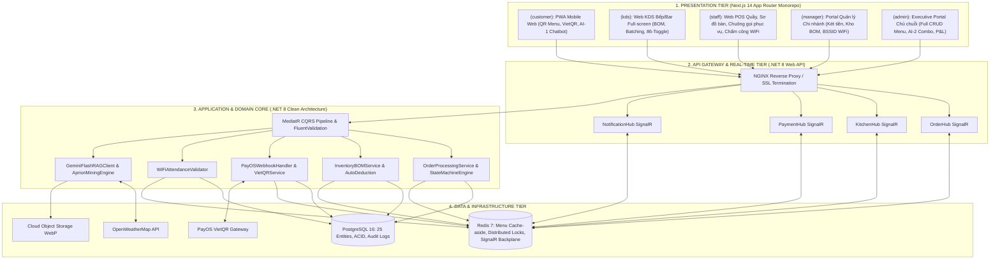

# ☕ SMART F&B OPERATING SYSTEM
## Nền Tảng Quản Lý & Vận Hành Quán Cà Phê Thông Minh — Thay Thế Hoàn Toàn Hệ Thống POS Truyền Thống

> [!NOTE]
> **Tên dự án:** Smart F&B OS — AI-Powered QR Order & Management Platform  
> **Slogan:** *"Không cần máy POS cồng kềnh, không cần thu ngân gõ đơn — Khách scan QR tự gọi món & thanh toán linh hoạt; Nhân viên vận hành mượt mà 100% trên Web."*  
> **Phiên bản:** v2.5.0-Production-Ready (Bản đặc tả kỹ thuật chính thức — Đồ án Capstone 16 tuần / 4 thành viên)  
> **Nguồn sự thật tối thượng (Source of Truth):** `Smart_FB_OS_Revised_4members.docx` (và biên bản chốt nghiệp vụ `ORIGINAL_REQUEST.md`)  
> **Tech Stack Chuẩn hóa:** Backend .NET 8 Clean Architecture (MediatR CQRS, EF Core 8) | Frontend Next.js 14 App Router Monorepo (TypeScript, Tailwind CSS, Shadcn UI) | PostgreSQL 16 | Redis 7 | SignalR WebSockets | Google Gemini 1.5 Flash SDK | PayOS VietQR Gateway | Docker Compose  

---

# 📚 MỤC LỤC TOÀN DIỆN

| Phần | Tiêu Đề Nội Dung |
|---|---|
| **PHẦN 0** | [8 Bất Cập Thực Tế Của Quán Cà Phê Hiện Nay & Giải Pháp Tương Ứng](#-phần-0-8-bất-cập-thực-tế-của-quán-cà-phê-hiện-nay) |
| **PHẦN I** | [Tổng Quan Dự Án, Bối Cảnh & Mục Tiêu Kỹ Thuật](#-phần-i-tổng-quan-dự-án-bối-cảnh--mục-tiêu-kỹ-thuật) |
| **PHẦN II** | [Hướng Giải Quyết — 5 Trụ Cột Nghiệp Vụ Đột Phá Cốt Lõi](#-phần-ii-hướng-giải-quyết--5-trụ-cột-nghiệp-vụ-đột-phá-cốt-lõi) |
| **PHẦN III** | [Hệ Thống 3 Loại Mã QR & 3 Loại Đơn Hàng Chuẩn Hóa](#-phần-iii-hệ-thống-3-loại-mã-qr--3-loại-đơn-hàng-chuẩn-hóa) |
| **PHẦN IV** | [Phân Rã & Định Hình Các Module Trí Tuệ Nhân Tạo (AI Modules)](#-phần-iv-phân-rã--định-hình-các-module-trí-tuệ-nhân-tạo-ai-modules) |
| **PHẦN V** | [Giá Trị Kinh Tế, Bài Toán Hiệu Quả & Phân Tích ROI Doanh Nghiệp](#-phần-v-giá-trị-kinh-tế-bài-toán-hiệu-quả--phân-tích-roi) |
| **PHẦN VI** | [Điểm Độc Đáo Khác Biệt & Bảng So Sánh Đối Thủ Thị Trường](#-phần-vi-điểm-độc-đáo-khác-biệt--bảng-so-sánh-đối-thủ) |
| **PHẦN VII** | [Kiến Trúc Kỹ Thuật, Công Nghệ & Luồng Dữ Liệu Thời Gian Thực](#-phần-vii-kiến-trúc-kỹ-thuật-công-nghệ--luồng-dữ-liệu) |
| **PHẦN VIII** | [Danh Mục 62 Tính Năng Cốt Lõi Phân Theo 4 Nhóm Actor](#-phần-viii-danh-mục-62-tính-năng-cốt-lõi-phân-theo-4-nhóm-actor) |
| **PHẦN IX** | [Yêu Cầu Phi Chức Năng (NFRs) & Tiêu Chuẩn Vận Hành Tin Cậy](#-phần-ix-yêu-cầu-phi-chức-năng-nfrs--tiêu-chuẩn-vận-hành) |
| **PHẦN X** | [Định Hướng Mở Rộng & Kiến Trúc Tương Lai (Scale Up / Future Work)](#-phần-x-định-hướng-mở-rộng--kiến-trúc-tương-lai-scale-up--future-work) |

---

# 📝 PHẦN 0: 8 BẤT CẬP THỰC TẾ CỦA QUÁN CÀ PHÊ HIỆN NAY

Ngành F&B (đặc biệt là mô hình chuỗi quán cà phê và trà sữa tại Việt Nam) đang đối mặt với 8 điểm nghẽn nghiêm trọng làm suy giảm trải nghiệm khách hàng, thất thoát dòng tiền và tăng vọt chi phí vận hành:

```
┌──────────────────────────────────────────────────────────────────────────────────────────────────┐
│                             8 ĐIỂM NGHẼN CỐT LÕI CỦA QUÁN CÀ PHÊ HIỆN NAY                        │
├────────────────────────────────┬────────────────────────────────┬────────────────────────────────┤
│ 1. POS LỖI THỜI & NGHẼN QUẦY   │ 2. CHẤM CÔNG GIAN LẬN          │ 3. THẤT THOÁT NGUYÊN LIỆU      │
│ Khách xếp hàng lâu, sai đơn,   │ Gian lận 5-10% quỹ lương,      │ Thất thoát 5-15% kho, kiểm kê  │
│ chi phí máy POS 8-25 triệu.    │ máy vân tay/sổ sách lỗi thời.  │ sổ sách thủ công mất thời gian.│
├────────────────────────────────┼────────────────────────────────┼────────────────────────────────┤
│ 4. TÀI CHÍNH RỜI RẠC & MÙ MỜ   │ 5. CHẤT LƯỢNG LỆCH & THIẾU FB  │ 6. KHÔNG CÓ DATA KHÁCH HÀNG    │
│ Tiền mặt/chuyển khoản phân tán,│ Barista pha sai công thức,     │ 80% khách vãng lai không lưu   │
│ không tính được P&L từng ngày. │ thiếu kênh phản hồi trực tiếp. │ SĐT, mất khách không hay biết. │
├────────────────────────────────┴────────────────────────────────┼────────────────────────────────┤
│ 7. BÁO CÁO CUỐI NGÀY THỦ CÔNG (EOD REPORT)                     │ 8. THIẾU DATA RA QUYẾT ĐỊNH    │
│ Quản lý mất 30-60p mỗi tối cộng sổ, gửi Zalo dễ sai lệch số.    │ Thêm/bỏ món theo cảm tính,     │
│                                                                │ tạo combo không dựa trên data. │
└────────────────────────────────────────────────────────────────┴────────────────────────────────┘
```

---

## 0.1 🔴 Bất Cập 1: HỆ THỐNG POS LỖI THỜI, ĐẮT ĐỎ & NGHẼN QUẦY GIỜ CAO ĐIỂM
- **Hiện trạng:** Khách hàng phải xếp hàng dài chờ đợi tại quầy thu ngân trong giờ cao điểm (8-9h sáng, 14-16h chiều, tối cuối tuần). Thu ngân phải gõ tay từng món vào máy POS chuyên dụng (mất trung bình 45 - 60 giây/đơn). Việc truyền đạt khẩu vị phức tạp ("ít ngọt 30%", "nhiều đá", "không kem cheese", "thêm trân chú trắng") qua giao tiếp bằng lời thường xuyên bị nhầm lẫn, dẫn đến barista pha sai món, lãng phí nguyên liệu và tạo trải nghiệm ức chế cho khách hàng.
- **Chi phí thiết bị nặng nề:** Một bộ máy POS phần cứng chuyên dụng có giá từ **8.000.000 – 25.000.000 VNĐ/bộ**, cộng thêm phí thuê bao phần mềm định kỳ **300.000 – 1.500.000 VNĐ/tháng/chi nhánh**, máy in nhiệt, đầu đọc thẻ, màn hình phụ. Khi mở rộng chuỗi 5 - 10 cửa hàng, chi phí đầu tư thiết bị (CAPEX) trở thành rào cản lớn.
- **Giải pháp Smart F&B OS:** Loại bỏ hoàn toàn sự phụ thuộc vào máy POS chuyên dụng (**Tiết kiệm 60% chi phí đầu tư phần cứng ban đầu, tăng 40% tốc độ phục vụ**). Khách hàng ngồi tại bàn tự quét **Table QR**, mở Web PWA tức thì không cần cài App, tự do chọn món tùy biến sâu và lựa chọn 1 trong 2 phương thức thanh toán thuận tiện (VietQR trả trước hoặc Tiền mặt trả sau). Đơn hàng tự động đồng bộ thời gian thực xuống màn hình Web KDS của quầy bar qua SignalR.

## 0.2 📋 Bất Cập 2: CHẤM CÔNG GIAN LẬN & QUẢN LÝ NHÂN SỰ CẢM TÍNH
- **Hiện trạng:** Sử dụng máy chấm công vân tay độc lập (dễ hỏng mắt đọc do dầu mỡ, ẩm ướt ở quầy pha chế) hoặc sổ ký tên thủ công. Nhân viên thường xuyên chấm công hộ, đi muộn về sớm gây thất thoát 5% - 10% quỹ lương. Cuối tháng, Quản lý chi nhánh mất 2 - 3 ngày tổng hợp dữ liệu công thô vào bảng tính Excel, dễ xảy ra sai lệch và khiếu nại.
- **Giải pháp Smart F&B OS:** **Chấm công Khóa Mạng WiFi (WiFi-Locked Attendance)** — Nhân viên truy cập phân hệ Chấm công trên Web Staff, hệ thống tự động kiểm tra kép: (a) Địa chỉ BSSID của Access Point WiFi quán và dải IP Subnet hợp lệ của chi nhánh, (b) Mã số nhân viên hợp lệ theo ca trực. Loại bỏ 100% gian lận chấm công từ xa mà không tốn thêm 1 đồng mua sắm phần cứng máy chấm công.

## 0.3 📦 Bất Cập 3: KIỂM KÊ NGUYÊN LIỆU THỦ CÔNG & THẤT THOÁT KHO
- **Hiện trạng:** Tỷ lệ thất thoát nguyên liệu (cà phê hạt, sữa tươi, sữa đặc, syrup, bao bì ly/nắp) dao động từ **5% - 15%** tổng chi phí nhập hàng do barista đong đếm theo cảm tính hoặc thất thoát không giải trình được. Kiểm kê kho định kỳ thực hiện bằng sổ ghi chép, không đối chiếu được với lượng xuất bán lý thuyết.
- **Giải pháp Smart F&B OS:** Tự động trừ tồn kho theo công thức định mức pha chế chuẩn (**Bill of Materials - BOM**) đến từng ml/gam ngay khi món hoàn tất trên Web KDS; quản lý phiếu xuất kho quầy bar và quy trình kiểm kê định kỳ với tính năng tự động tính toán tỷ lệ chênh lệch hao hụt so với định mức thực tế.

## 0.4 💰 Bất Cập 4: QUẢN LÝ TÀI CHÍNH RỜI RẠC & MÙ MỜ LỢI NHUẬN THỰC TẾ
- **Hiện trạng:** Dòng tiền bị phân mảnh giữa tiền mặt trong két và tiền chuyển khoản rải rác trên nhiều tài khoản ngân hàng cá nhân của chủ/quản lý. Cuối ngày đối soát thủ công không khớp, chủ chuỗi không nắm được bức tranh Lợi nhuận & Lỗ (P&L) thực tế từng ngày theo từng chi nhánh.
- **Giải pháp Smart F&B OS:** Tích hợp cổng thanh toán VietQR động (PayOS) tự động khớp giao dịch chính xác 100% theo mã đơn hàng; quy trình mở két - kết ca đếm tiền mặt chặt chẽ với biên bản bàn giao Z-Report; Dashboard báo cáo P&L tự động hợp nhất đa chi nhánh thời gian thực (Doanh thu thuần, Chi phí nguyên vật liệu COGS theo BOM, Lãi gộp).

## 0.5 🍵 Bất Cập 5: CHẤT LƯỢNG PHA CHẾ LỆCH VỊ & THIẾU KÊNH PHẢN HỒI
- **Hiện trạng:** Chất lượng đồ uống phụ thuộc vào tay nghề và trí nhớ của từng nhân viên, gây tình trạng "mỗi ca một vị" hoặc lệch vị giữa các chi nhánh. Khi khách hàng không hài lòng về chất lượng đồ uống hoặc thái độ phục vụ, 90% khách âm thầm rời bỏ quán mà không để lại phản hồi, khiến chủ quán không biết nguyên nhân để cải thiện.
- **Giải pháp Smart F&B OS:** Màn hình Web KDS hiển thị chi tiết công thức BOM định lượng (ml sữa, gam đường, shot espresso) cho từng kích cỡ món; Hệ thống QR Feedback trực tiếp trên PWA cho phép khách chấm điểm 1-5 sao, đính kèm 1-3 hình ảnh thực tế và tự động kích hoạt cảnh báo khẩn cấp (Alert đỏ) tới Quản lý chi nhánh khi đánh giá <= 2 sao để xử lý khiếu nại tại bàn trong vòng 3 phút.

## 0.6 👤 Bất Cập 6: 80% KHÁCH HÀNG VÃNG LAI KHÔNG LƯU ĐƯỢC DATA & LOYALTY PHỨC TẠP
- **Hiện trạng:** 80% khách hàng đến quán rồi ra về mà quán không thu thập được số điện thoại hay lịch sử sở thích. Các chương trình thẻ thành viên vật lý hoặc tích điểm quy đổi tiền phức tạp khiến khách hàng e ngại cung cấp thông tin, tỷ lệ quay lại sử dụng thẻ < 10%.
- **Giải pháp Smart F&B OS:** Nhận diện khách hàng tức thì chỉ bằng Số điện thoại (CRM Lookup) trên PWA không cần đăng ký mật khẩu; Áp dụng chính sách **Loyalty Đột Phá: Tích 10 Ly = Tặng 1 Ly Miễn Phí (Áp dụng DUY NHẤT cho Đơn Mua Mang Về - Takeaway)** tạo động lực quay lại cực lớn cho tệp khách văn phòng mua mang đi hàng ngày.

## 0.7 📋 Bất Cập 7: BÁO CÁO CUỐI NGÀY (EOD REPORT) THỦ CÔNG TỐN THỜI GIAN
- **Hiện trạng:** Quản lý cửa hàng mất 30 - 60 phút mỗi tối để cộng dồn hóa đơn giấy, đếm tiền mặt, chụp ảnh gửi số liệu qua Zalo cho chủ chuỗi, tiềm ẩn sai sót số liệu từ 2% - 5% và rủi ro thất thoát doanh thu.
- **Giải pháp Smart F&B OS:** Hệ thống tự động tổng hợp số liệu doanh thu theo từng kênh bán hàng (`DineIn`, `TakeAway`, `Delivery`), phân tích cơ cấu thanh toán (Tiền mặt, VietQR), tự động chốt sổ ca (Z-Report) và đồng bộ tức thời lên Dashboard quản trị trung tâm của Chủ chuỗi.

## 0.8 🧠 Bất Cập 8: THIẾU DỮ LIỆU THỰC TẾ ĐỂ RA QUYẾT ĐỊNH KINH DOANH
- **Hiện trạng:** Việc thêm món mới, loại bỏ món ế ẩm hay tạo combo giảm giá hoàn toàn dựa trên cảm tính chủ quan của chủ quán hoặc sao chép đối thủ, dẫn đến tồn đọng nguyên liệu và chiến dịch khuyến mãi không đạt hiệu quả.
- **Giải pháp Smart F&B OS:** Tích hợp **AI-2 Combo Discovery Engine** ứng dụng thuật toán khai phá luật kết hợp Apriori/FP-Growth phân tích ma trận giỏ hàng lịch sử, tự động phát hiện các cặp món thường xuyên mua kèm và đề xuất combo tối ưu kèm cơ chế phê duyệt Human-in-the-loop cho Chủ chuỗi.

---

# 📝 PHẦN I: TỔNG QUAN DỰ ÁN, BỐI CẢNH & MỤC TIÊU KỸ THUẬT

### 1.1 Thông tin Dự án
- **Tên dự án:** Smart F&B OS — AI-Powered QR Order & Management Platform.
- **Mục tiêu sứ mệnh:** Xây dựng một nền tảng Web-First hợp nhất, vận hành toàn diện chuỗi quán cà phê và trà sữa, loại bỏ 100% chi phí phần cứng máy POS chuyên dụng, tối ưu hóa quy trình bán hàng đa kênh, tự động hóa kiểm soát dòng tiền và kho vận, đồng thời tích hợp Trí tuệ Nhân tạo (AI) gia tăng giá trị đơn hàng trung bình (AOV).
- **Quy mô thực thi:** Đồ án Capstone 16 tuần (08 Sprints) dành cho nhóm 4 kỹ sư phần mềm (2 Backend Developers + 2 Frontend Developers).

### 1.2 Bối cảnh & Đối tượng Áp dụng
Hệ thống được thiết kế tối ưu cho các mô hình kinh doanh đồ uống hiện đại:
1. **Quán cà phê / Trà sữa độc lập quy mô vừa và lớn:** Mặt bằng từ 20 – 50 bàn, công suất 300 – 1.200 đơn hàng/ngày.
2. **Chuỗi F&B nhiều chi nhánh (Multi-Branch Chains):** Quản lý tập trung từ 3 – 10+ chi nhánh với bảng giá linh hoạt theo vùng, thực đơn mùa và báo cáo tài chính P&L hợp nhất.
3. **Phục vụ toàn diện 3 kênh bán hàng cốt lõi:** Đặt món tại bàn (`DineIn`), Mua mang về tại quầy (`TakeAway`), và Đặt giao tận nơi (`Delivery`).

---

# 📝 PHẦN II: HƯỚNG GIẢI QUYẾT — 5 TRỤ CỘT NGHIỆP VỤ ĐỘT PHÁ CỐT LÕI

Hệ thống Smart F&B OS được xây dựng vững chắc trên **5 trụ cột nghiệp vụ đột phá** đã được đóng băng và thống nhất tuyệt đối:

```
┌──────────────────────────────────────────────────────────────────────────────────────────────────┐
│                               5 TRỤ CỘT NGHIỆP VỤ ĐỘT PHÁ CỐT LÕI                                │
├──────────────────────────────────────────────────────────────────────────────────────────────────┤
│ 1. DINE-IN 2 NHÁNH THANH TOÁN: Nhánh A VietQR Trả Trước (Bếp nhận khi Paid)                     │
│                                Nhánh B Tiền Mặt Trả Sau (Bếp nhận ngay Confirmed, mang món + QR) │
│ 2. QR DELIVERY GIAO TẬN NƠI:   QR riêng → Nhập SĐT + Địa chỉ → Phí ship 20k → 100% VietQR Trước. │
│ 3. TAKEAWAY STAFF WEB POS:     NV thao tác quầy (Không QR) → Tra CRM → Tích 10 ly → Trả sau.     │
│ 4. CHẤM CÔNG KHÓA MẠNG WIFI:   Xác thực WiFi quán (SSID/BSSID/IP) + Mã NV → Bỏ hoàn toàn GPS/QR  │
│ 5. HỢP NHẤT 100% NỀN TẢNG WEB: Xóa 100% Staff Mobile App → Chạy mượt mà trên Web Responsive/KDS. │
└──────────────────────────────────────────────────────────────────────────────────────────────────┘
```

---

## 2.1 TRỤ CỘT 1: ĐẶT MÓN TẠI BÀN (DINE-IN) — 2 PHƯƠNG THỨC THANH TOÁN LINH HOẠT

Khách hàng quét mã **Table QR** tại bàn, duyệt menu, tùy biến món (Size, Đường, Đá, Topping, Ghi chú) và tiến hành đặt hàng với quyền lựa chọn 1 trong 2 phương thức thanh toán:

```
                                      ┌──► [PHƯƠNG THỨC A: VIETQR TRẢ TRƯỚC] ──► [Sinh mã VietQR] ──► [Thanh toán Paid] ──► [BẾP KDS MỚI NHẬN ĐƠN]
                                      │
[Khách quét Table QR] ➔ [Chọn món] ───┤
                                      │
                                      └──► [PHƯƠNG THỨC B: TIỀN MẶT TRẢ SAU] ──► [ĐƠN VÀO BẾP NGAY] ──► [NV bưng món + Bill có QR] ──► [Thu tiền / Khách quét QR]
```

### 1. Phương Thức A — VietQR (Thanh toán trước - Pre-Payment):
- **Quy trình:** Khách chọn VietQR ➔ Hệ thống sinh mã VietQR động kèm số tiền và mã đơn hàng (`ORDER_{id}`) ➔ Khách quét chuyển khoản qua ứng dụng Mobile Banking ➔ Cổng PayOS gửi Webhook xác nhận giao dịch thành công ➔ Trạng thái chuyển sang `Paid` ➔ **BẾP KDS MỚI NHẬN ĐƠN QUA SIGNALR** ➔ Barista pha chế (`Preparing`) ➔ Món hoàn thành (`Ready`) ➔ Nhân viên phục vụ ra bàn (`Served`/`Completed`).
- **Order Status Flow:** `PendingPayment (0)` ➔ `Paid (1)` ➔ `Confirmed (2)` ➔ `Preparing (3)` ➔ `Ready (4)` ➔ `Served (5)`.
- **Ưu điểm vượt trội:** Triệt tiêu hoàn toàn rủi ro bùng đơn, giảm thiểu 100% thao tác in bill và thu tiền của nhân viên trong giờ cao điểm.

### 2. Phương Thức B — Tiền Mặt (Thanh toán sau - Post-Payment):
- **Quy trình:** Khách chọn Tiền mặt ➔ **ĐƠN HÀNG VÀO BẾP KDS NGAY LẬP TỨC** với trạng thái `Confirmed` (không bắt buộc thanh toán trước) ➔ Barista pha chế (`Preparing`) ➔ Barista bấm `Ready` trên KDS, kích hoạt lệnh in Hóa đơn tính tiền (Bill) ra máy in nhiệt tại quầy. Trên hóa đơn có in sẵn danh sách món và **Mã VietQR động chứa chính xác số tiền cần thu** ➔ Nhân viên bưng đồ uống ra bàn **KÈM THEO HÓA ĐƠN CÓ IN MÃ VIETQR** ➔ Khách hàng có 2 lựa chọn thanh toán:
  - *Lựa chọn 1:* Trả Tiền mặt trực tiếp cho nhân viên ➔ Nhân viên nhận tiền và bấm "Xác nhận đã thu tiền" trên Web Staff Portal.
  - *Lựa chọn 2:* Khách dùng Mobile Banking quét mã VietQR in trên tờ hóa đơn ➔ Hệ thống nhận Webhook thanh toán và tự động cập nhật trạng thái sang `Paid`.
- **Order Status Flow:** `Confirmed (2)` ➔ `Preparing (3)` ➔ `Ready (4)` ➔ `Served (5)` ➔ `PendingPayment (0)` ➔ `Paid (1)`.
- **Ưu điểm vượt trội:** Phục vụ chu đáo nhóm khách hàng lớn tuổi, khách đi theo nhóm đông người muốn kiểm tra đồ uống trước khi trả tiền, hoặc khách hàng chưa sẵn sàng chuyển khoản trực tuyến ngay lúc gọi món.

---

## 2.2 TRỤ CỘT 2: ĐẶT HÀNG GIAO TẬN NƠI (QR DELIVERY)

- **Điểm tiếp cận độc lập:** Khách hàng quét mã **QR Delivery** riêng biệt (in trên poster, banner quảng cáo, standee trước quán, fanpage mạng xã hội) hoặc truy cập đường link đặt hàng trực tuyến từ xa.
- **Dữ liệu bắt buộc:** Khách hàng bắt buộc phải nhập đầy đủ:
  1. Tên người nhận (`recipient_name`).
  2. Số điện thoại nhận hàng (`recipient_phone` — kiểm tra regex chuẩn 10 chữ số Việt Nam).
  3. Địa chỉ giao hàng chi tiết (`delivery_address` — số nhà, ngõ/ngách, tên đường, phường/xã).
- **Phí giao hàng cố định:** Hệ thống luôn tự động cộng **Phí ship cố định 20.000 VNĐ** (`delivery_fee = 20000`) vào tổng giá trị của mọi đơn hàng giao tận nơi.
- **Phương thức thanh toán bắt buộc:** **100% VietQR trả trước qua cổng PayOS**. Khóa hoàn toàn tùy chọn thanh toán tiền mặt khi nhận hàng (No COD) nhằm bảo vệ quán tuyệt đối trước rủi ro "boom hàng" khi đang vận chuyển.
- **Cấu trúc Dữ liệu:** Thêm các trường `delivery_address` (VARCHAR 500), `delivery_fee` (DECIMAL 18,2), và `order_type = Delivery (3)` vào thực thể `Orders`.
- **Order Status Flow:** `PendingPayment (0)` ➔ `Paid (1)` ➔ `Confirmed (2)` ➔ `Preparing (3)` ➔ `Ready (4)` ➔ `Delivering (6)` ➔ `Completed (5)`.

---

## 2.3 TRỤ CỘT 3: BÁN HÀNG MANG ĐI TẠI QUẦY (TAKEAWAY STAFF WEB POS)

- **Giao diện thao tác chuyên dụng:** Loại bỏ hoàn toàn mã QR Takeaway cho khách; Nhân viên thu ngân thao tác trực tiếp trên **Giao diện Web POS Quầy** (`(staff)/pos`) trên máy tính bảng hoặc laptop cảm ứng.
- **Tra cứu CRM & Khởi tạo hồ sơ khách hàng tức thì:**
  - Thu ngân hỏi và nhập Số điện thoại của khách hàng vào thanh tìm kiếm CRM.
  - *Khách hàng mới:* Thu ngân nhập nhanh Tên khách hàng ➔ Hệ thống tự động tạo bản ghi CRM mới với `CupBalance = 0`.
  - *Khách hàng cũ:* Hệ thống hiển thị Tên, Lịch sử mua hàng gần nhất và số ly đã tích lũy (`CupBalance`).
- **Chính sách Loyalty 10 ly tặng 1 ly miễn phí:**
  - **ĐIỀU KIỆN ÁP DỤNG DUY NHẤT:** Chương trình tích lũy 10 ly = tặng 1 ly miễn phí **CHỈ ÁP DỤNG CHO ĐƠN HÀNG TAKEAWAY (MUA MANG VỀ TẠI QUẦY)**. Đơn hàng tại bàn (`DineIn`) và đơn giao hàng (`Delivery`) hoàn toàn KHÔNG tích lũy và KHÔNG đổi ly miễn phí.
  - Cứ mỗi 10 ly đồ uống tiêu chuẩn tích lũy ➔ Khách hàng được tặng 1 ly đồ uống miễn phí (ly thứ 11 miễn phí, trừ 100% giá trị của 1 ly tiêu chuẩn trong đơn hàng hiện tại).
- **Thanh toán sau khi nhận món (Post-Payment):** Khách hàng nhận túi đồ uống mang về và thanh toán linh hoạt bằng:
  - **Tiền mặt:** Thu ngân nhập số tiền khách đưa ➔ Hệ thống tự động tính tiền thối (tiền thừa) và kích hoạt mở két tiền.
  - **VietQR tại quầy:** Thu ngân xuất mã VietQR trên màn hình phụ hoặc tablet để khách quét chuyển khoản.

---

## 2.4 TRỤ CỘT 4: CHẤM CÔNG KHÓA MẠNG WIFI (WIFI-LOCKED ATTENDANCE)

- **Loại bỏ công nghệ cũ:** Xóa bỏ hoàn toàn cơ chế định vị vệ tinh GPS (sai số lớn từ 20 - 50m khi nhân viên đứng trong nhà/tầng hầm) và mã QR động thay đổi mỗi 30 giây (gây phiền toái cho nhân viên).
- **Cơ chế xác thực kép 2 lớp (Dual Network & Identity Verification):**
  1. *Lớp mạng (Network Layer):* Kiểm tra địa chỉ BSSID (MAC Address của Access Point phát WiFi quán) hoặc dải IP Subnet của thiết bị gửi yêu cầu có nằm trong danh sách được cấp phép tại bảng `branch_wifi_configs` của chi nhánh hay không.
  2. *Lớp định danh (Identity Layer):* Kiểm tra Mã số nhân viên (`EmployeeCode`), ca làm việc đã được phân công và mã PIN cá nhân.
- **Quy trình vận hành:** Nhân viên kết nối vào mạng WiFi của quán ➔ Mở phân hệ Chấm công trên Web Staff (`(staff)/attendance`) ➔ Nhập Mã NV và bấm "Vào ca / Ra ca" ➔ Hệ thống kiểm tra: Đúng WiFi quán + Đúng Mã NV ➔ Ghi nhận chấm công thành công. Nếu nhân viên bật 4G hoặc kết nối WiFi quán cà phê bên cạnh ➔ Hệ thống từ chối chấm công ngay lập tức kèm cảnh báo sai lệch mạng.
- **Phân quyền Quản lý:** Quản lý chi nhánh được toàn quyền khai báo và cập nhật danh sách BSSID và IP Subnet cho chi nhánh của mình trên Manager Portal.

---

## 2.5 TRỤ CỘT 5: HỢP NHẤT TOÀN BỘ VẬN HÀNH TRÊN NỀN TẢNG WEB RESPONSIVE

- **Loại bỏ hoàn toàn Staff Mobile App:** Không phát triển, không duy trì ứng dụng di động riêng (Flutter/React Native) cho nhân viên phục vụ. Triệt tiêu hoàn toàn chi phí phát hành App lên Apple App Store / Google Play Store và chi phí bảo trì đa nền tảng.
- **Hợp nhất trên Next.js 14 App Router Monorepo:** Mọi tác nhân trong hệ thống đều truy cập qua trình duyệt Web hiện đại với giao diện được tối ưu hóa chuẩn xác theo từng thiết bị:
  1. `(customer)` — PWA Mobile Web dành cho Khách hàng (Quét QR Bàn, QR Delivery, Chat AI-1, Đánh giá món).
  2. `(kds)` — Giao diện Web KDS Full-screen dành cho Barista/Bếp (Màn hình Smart TV, iPad, Tablet chống nước quầy pha chế).
  3. `(staff)` — Giao diện Web POS Quầy dành cho Thu ngân, Quản lý Sơ đồ bàn, Tiếp nhận chuông gọi phục vụ và Chấm công WiFi.
  4. `(manager)` — Cổng Web Quản lý Chi nhánh (Mở/kết ca két tiền, Quản lý kho BOM, Phân ca, Cấu hình WiFi, Alert Review).
  5. `(admin)` — Cổng Web Điều hành Chuỗi Trung tâm dành cho Chủ chuỗi (Full CRUD Menu/BOM/Combo/Giá/Ảnh, Dashboard P&L hợp nhất).

---

# 📝 PHẦN III: HỆ THỐNG 3 LOẠI MÃ QR & 3 LOẠI ĐƠN HÀNG CHUẨN HÓA

Để đảm bảo luồng dữ liệu chính xác và trải nghiệm người dùng liền mạch, hệ thống phân định rõ ràng **3 loại mã QR** và **3 loại đơn hàng**:

### 3.1 Bảng Ma Trận 3 Loại Mã QR

| Loại Mã QR | Tên Tiếng Anh | Vị Trí Triển Khai | Định Dạng URL & Dữ Liệu Chứa | Mục Đích Sử Dụng | Phương Thức Thanh Toán Hỗ Trợ |
|---|---|---|---|---|---|
| **1. QR Bàn** | `Table QR` | Dán cố định trên từng mặt bàn phục vụ | `https://order.smartfb.vn/table/{table_id}?branch={branch_id}&sig={hmac_signature}` | Mở Menu gọi món tại bàn cho khách Dine-in | • Nhánh A: VietQR trả trước<br>• Nhánh B: Tiền mặt trả sau |
| **2. QR Delivery** | `Delivery QR` | In trên poster, standee, tờ rơi, fanpage, mạng xã hội | `https://order.smartfb.vn/delivery?branch={branch_id}` | Mở giao diện đặt hàng giao tận nơi tại nhà | **100% VietQR trả trước** (Cố định phí ship 20.000 VNĐ) |
| **3. QR Chấm Công** | `Attendance QR` | Hiển thị trên màn hình Web nội bộ quán | `https://staff.smartfb.vn/attendance/check-in?branch={branch_id}` | Điểm truy cập chấm công cho nhân viên | Không áp dụng (Xác thực WiFi BSSID/IP + Mã NV) |

### 3.2 Bảng Ma Trận 3 Loại Đơn Hàng (`OrderType` Enum)

| Loại Đơn Hàng | Giá Trị Enum | Kênh Tạo Đơn | Đối Tượng Thao Tác | Thông Tin Bắt Buộc | Quy Tắc Thanh Toán | Chính Sách Loyalty Áp Dụng |
|---|:---:|---|---|---|---|---|
| **DineIn** (Tại bàn) | `1` | Khách quét Table QR trên PWA | Khách hàng tự gọi món | Số bàn (`table_id`), Chi nhánh (`branch_id`) | • VietQR trả trước (Bếp nhận khi Paid)<br>• Tiền mặt trả sau (Bếp nhận ngay Confirmed) | Không áp dụng tích/đổi 10 ly |
| **TakeAway** (Mang về) | `2` | Web POS Quầy (`(staff)/pos`) | Nhân viên thu ngân thao tác | SĐT khách hàng (`customer_phone`) | Thanh toán SAU khi nhận món (Tiền mặt / VietQR quầy) | **TÍCH 10 LY TẶNG 1 LY MIỄN PHÍ** |
| **Delivery** (Giao tận nơi) | `3` | Khách quét Delivery QR trên PWA | Khách hàng tự gọi món | SĐT, Tên, **Địa chỉ giao hàng** (`delivery_address`), Phí ship 20k | **100% VietQR trả trước** (Khóa hoàn toàn COD) | Không áp dụng tích/đổi 10 ly |

---

# 📝 PHẦN IV: PHÂN RÃ & ĐỊNH HÌNH CÁC MODULE TRÍ TUỆ NHÂN TẠO (AI MODULES)

Nhằm đảm bảo tính khả thi cao nhất cho đồ án Capstone 16 tuần, các module AI được phân rã thành **2 Module Triển khai Chính thức (Active MVP)** và **3 Module Định hướng Tương lai (Scale Up / Future Work)**:

```
┌──────────────────────────────────────────────────────────────────────────────────────────────────┐
│                             PHÂN RÃ 5 MODULE TRÍ TUỆ NHÂN TẠO (AI)                               │
├─────────────────────────────────────────────────────────────────┬────────────────────────────────┤
│           ✅ PHẠM VI TRIỂN KHAI CHÍNH THỨC (ACTIVE MVP)          │   🔮 MỞ RỘNG TƯƠNG LAI (SCALE) │
├─────────────────────────────────────────────────────────────────┼────────────────────────────────┤
│ 1. AI-1: Chatbot Tư Vấn Khẩu Vị RAG (Recommendation Chatbot)    │ 3. AI-3: NLQ Business Analytics│
│    • Google Gemini 1.5 Flash + Hybrid Recommendation Engine.    │ 4. AI-4: Customer Churn (RFM)  │
│    • Đánh giá khoa học: Precision@K, Recall@K, NDCG, Latency.   │ 5. AI-5: Menu Demand Forecast  │
│ 2. AI-2: Khai Phá & Đề Xuất Combo Món Tự Động (Apriori/FP-Growth│                                │
│    • Market Basket Analysis (Support, Confidence, Lift > 1.2).  │                                │
│    • Human-in-the-loop: Chủ chuỗi phê duyệt trước khi áp dụng.  │                                │
└─────────────────────────────────────────────────────────────────┴────────────────────────────────┘
```

---

## 4.1 Hai Module AI Triển Khai Chính Thức (Active MVP)

### 1. AI-1: Recommendation Chatbot (RAG + Google Gemini 1.5 Flash SDK)
- **Ý nghĩa nghiên cứu:** Đề tài nghiên cứu khoa học trọng tâm của đồ án Capstone, giải quyết bài toán tư vấn cá nhân hóa theo ngữ cảnh thời gian thực cho ngành F&B.
- **Kiến trúc luồng xử lý (RAG Pipeline):**
  1. Khách hàng nhập câu hỏi tự nhiên trên PWA (ví dụ: *"Trời chiều nay mưa lạnh, mình muốn uống món gì ngọt béo ấm áp, không dùng trà xanh và dị ứng đậu phộng"*).
  2. Backend .NET 8 xây dựng Context động (Context Builder) tích hợp:
     - Dữ liệu thời tiết hiện tại của chi nhánh (OpenWeatherMap API: Nhiệt độ, độ ẩm, thời tiết mưa/nắng).
     - Dữ liệu định lượng, calo và thành phần dị ứng từ bảng `Products` và `ProductBOMs`.
     - Lịch sử tiêu dùng gần nhất của khách hàng từ bảng `Customers` (CRM Profile).
  3. Gửi prompt có cấu trúc nghiêm ngặt tới Google Gemini 1.5 Flash API với System Instructions định dạng JSON.
  4. Trả về câu trả lời tự nhiên kèm danh sách 2 – 3 sản phẩm phù hợp nhất và nút **"Thêm vào giỏ hàng ngay"** với 1 chạm.
- **Tiêu chuẩn đánh giá định lượng:**
  - Độ chính xác: Precision@K, Recall@K (K=3, K=5).
  - Chất lượng xếp hạng: NDCG@K (Normalized Discounted Cumulative Gain).
  - Độ bao phủ danh mục: Catalog Coverage >= 75%.
  - Tốc độ phản hồi: Response Latency <= 1.5 giây. So sánh trực tiếp với Popularity Baseline và Random Baseline.

### 2. AI-2: Combo Discovery Engine (Market Basket Analysis - Apriori / FP-Growth)
- **Mục tiêu kinh doanh:** Khai phá giỏ hàng lịch sử để tìm ra các nhóm sản phẩm thường xuyên được mua kèm nhau (ví dụ: *Cà phê muối + Bánh Croissant bơ tỏi*), giúp gia tăng giá trị trung bình trên mỗi đơn hàng (AOV).
- **Thuật toán & Chỉ số thống kê:**
  - Chạy ngầm định kỳ (Background Job) phân tích toàn bộ hóa đơn bán hàng chi nhánh.
  - $\text{Support}(X \rightarrow Y) = \frac{\text{Số đơn chứa cả } X \text{ và } Y}{\text{Tổng số đơn hàng}} \ge \text{Min\_Support (0.02)}$.
  - $\text{Confidence}(X \rightarrow Y) = \frac{\text{Support}(X \cup Y)}{\text{Support}(X)} \ge \text{Min\_Confidence (0.4)}$.
  - $\text{Lift}(X \rightarrow Y) = \frac{\text{Confidence}(X \rightarrow Y)}{\text{Support}(Y)} > 1.2$ (Chứng minh mối tương quan thuận mạnh mẽ giữa hai món).
- **Cơ chế Human-in-the-loop (Chủ chuỗi kiểm soát):** Hệ thống sinh danh sách các cặp món tiềm năng kèm giá vốn BOM và biên lợi nhuận dự kiến. Chủ chuỗi xem xét trên Admin Dashboard, điều chỉnh mức giảm giá combo (%) và bấm **"Phê duyệt phát hành"** để combo chính thức xuất hiện trên Menu PWA.

---

## 4.2 Ba Module AI Định Hướng Tương Lai (Scale Up / Future Work)
*(Được thiết kế sẵn các Interface Extension Points trong kiến trúc Domain/Application, không triển khai code trong 16 tuần)*:
1. **AI-3: Natural Language Business Analytics (Text-to-SQL — `ITextToSqlEngine`):** Cho phép Chủ chuỗi gõ câu hỏi tự nhiên tiếng Việt để hệ thống tự động sinh câu lệnh SQL và vẽ biểu đồ doanh thu P&L tức thời.
2. **AI-4: Customer Churn Prediction (RFM XGBoost — `IChurnPredictor`):** Mô hình học máy phân loại khách hàng dựa trên tần suất ghé quán và giá trị đơn hàng (Recency, Frequency, Monetary) để phát hiện sớm khách hàng có nguy cơ rời bỏ.
3. **AI-5: Dynamic Menu Intelligence & Demand Forecasting (`IDemandForecaster`):** Dự báo nhu cầu nguyên vật liệu và đề xuất điều chỉnh giá bán theo ngày trong tuần và sự kiện thời tiết.

---

# 📝 PHẦN V: GIÁ TRỊ KINH TẾ, BÀI TOÁN HIỆU QUẢ & PHÂN TÍCH ROI

Bảng tính toán hiệu quả kinh tế cho 1 quán cà phê tiêu chuẩn (mặt bằng 30 bàn, doanh thu trung bình 250.000.000 VNĐ/tháng, 400 đơn/ngày):

```
┌──────────────────────────────────────────────────────────────────────────────────────────────────┐
│                           BẢNG TÍNH TOÁN HIỆU QUẢ KINH TẾ & ROI (1 CHI NHÁNH)                    │
├───────────────────────────────────┬─────────────────────────────────┬────────────────────────────┤
│ Hạng Mục Tối Ưu                   │ Giải Pháp Truyền Thống          │ Smart F&B OS               │
├───────────────────────────────────┼─────────────────────────────────┼────────────────────────────┤
│ Chi phí phần cứng máy POS đầu tư  │ 12.000.000 - 25.000.000 VNĐ     │ 0 VNĐ (Dùng Tablet/TV sẵn) │
│ Chi phí nhân sự thu ngân quầy     │ 14.000.000 VNĐ/tháng (2 NV)     │ 7.000.000 VNĐ/tháng (1 NV) │
│ Thất thoát đơn hàng & bùng đơn    │ 1.500.000 - 3.000.000 VNĐ/tháng │ 0 VNĐ (VietQR & Bill QR)   │
│ Thất thoát nguyên liệu pha chế    │ 3.000.000 - 6.000.000 VNĐ/tháng │ Giảm 80% (Trừ BOM KDS)     │
│ Doanh thu tăng thêm từ AI Combo   │ 0 VNĐ                           │ + 10% - 15% tổng AOV       │
├───────────────────────────────────┴─────────────────────────────────┴────────────────────────────┤
│ 💰 TỔNG TIẾT KIỆM & TĂNG THU: 15.000.000 - 22.000.000 VNĐ/tháng (~180 - 260 triệu VNĐ/năm/quán) │
│ 🚀 TỶ SUẤT HOÀN VỐN (ROI): Thu hồi 100% chi phí triển khai chỉ sau 1 – 2 tháng đầu vận hành.     │
└──────────────────────────────────────────────────────────────────────────────────────────────────┘
```

---

# 📝 PHẦN VI: ĐIỂM ĐỘC ĐÁO KHÁC BIỆT & BẢNG SO SÁNH ĐỐI THỦ

| Tiêu Chí So Sánh Kỹ Thuật & Vận Hành | iPOS.vn | KiotViet | CukCuk | **Smart F&B OS (Đề Xuất)** |
|---|:---:|:---:|:---:|:---:|
| **Mô hình kiến trúc cốt lõi** | POS phần cứng tại quầy | POS bán lẻ tổng hợp | POS nhà hàng truyền thống | **QR Self-Order Web-First & AI-Powered** |
| **Yêu cầu máy POS chuyên dụng** | Bắt buộc (8 – 25 triệu/máy) | Bắt buộc (6 – 15 triệu/máy) | Bắt buộc (8 – 20 triệu/máy) | **0 VNĐ (Tiết kiệm 60% CAPEX phần cứng)** |
| **Dine-in: VietQR Trả trước & Tiền mặt Trả sau** | ❌ Chỉ thu tiền sau tại quầy | ❌ Chỉ thu tiền sau | ❌ Chỉ thu tiền sau | **✅ Hỗ trợ song song 2 nhánh hoàn chỉnh** |
| **QR Delivery tích hợp phí ship 20k** | ❌ Phụ thuộc App ngoài (Grab/Shopee)| ❌ Phụ thuộc App ngoài | ❌ Phụ thuộc App ngoài | **✅ QR Delivery riêng + 100% VietQR** |
| **Takeaway POS & Loyalty 10 Ly Tặng 1** | 🟡 Tích điểm point phức tạp | 🟡 Tích điểm tiền thưởng | 🟡 Tích điểm tiền thưởng | **✅ Web POS Quầy + Tích 10 ly = 1 ly Free** |
| **Chấm công Khóa Mạng WiFi (BSSID/IP)** | ❌ Dùng máy vân tay rời | ❌ Dùng máy vân tay rời | ❌ Dùng máy vân tay rời | **✅ WiFi-locked Chống gian lận 100%** |
| **Ứng dụng Nhân viên phục vụ** | Bắt buộc cài App di động | Bắt buộc cài App di động | Bắt buộc cài App di động | **✅ 100% Web Responsive (Xóa Staff App)** |
| **AI Tư vấn món theo khẩu vị RAG (AI-1)** | ❌ Không có | ❌ Không có | ❌ Không có | **✅ Gemini 1.5 Flash + Context RAG** |
| **AI Khai phá Combo tự động (AI-2)** | ❌ Không có | ❌ Không có | ❌ Không có | **✅ Thuật toán Apriori/FP-Growth** |
| **Phí phần mềm duy trì hàng tháng** | 300K – 1.5M/tháng/quán | 250K – 800K/tháng/quán | 300K – 900K/tháng/quán | **Tự chủ mã nguồn mở / Không phí định kỳ** |

---

# 📝 PHẦN VII: KIẾN TRÚC KỸ THUẬT, CÔNG NGHỆ & LUỒNG DỮ LIỆU

### 7.1 Mô Hình Kiến Trúc 4 Tầng Tổng Thể (Clean Architecture)



### 7.2 Danh Mục 25 Thực Thể Cơ Sở Dữ Liệu Chuẩn Hóa (PostgreSQL 16)

1. `Branches` — Chi nhánh trong chuỗi kinh doanh F&B (Mã, Tên, Địa chỉ, Số điện thoại, Trạng thái hoạt động).
2. `BranchWifiConfigs` — Cấu hình bảo mật chấm công chi nhánh (Danh sách BSSID Access Point, Dải IP Subnet được cấp phép).
3. `Users` — Tài khoản người dùng nội bộ (Admin, Manager, Staff / Barista).
4. `Roles` — Danh mục vai trò và quyền hạn trong hệ thống RBAC.
5. `UserRoles` — Bảng liên kết gán vai trò người dùng đa quyền.
6. `AuditLogs` — Nhật ký kiểm toán bất biến ghi vết các thao tác nhạy cảm của hệ thống.
7. `Categories` — Danh mục phân loại sản phẩm và thứ tự hiển thị trên menu.
8. `Products` — Danh mục món ăn, đồ uống (Tên, Mô tả, Giá cơ bản, Ảnh WebP, Trạng thái bán, Best-seller).
9. `ProductSizes` — Danh mục kích cỡ (Size S/M/L) và mức chênh lệch giá theo từng món.
10. `ProductBranchPrices` — Bảng ghi đè giá bán riêng và trạng thái khóa món (86-Toggle) theo từng chi nhánh.
11. `Modifiers` — Danh mục nhóm tùy chọn bổ trợ (Đường, Đá, Topping trân châu, thạch, pudding).
12. `ProductModifiers` — Bảng liên kết cấu hình nhóm modifier cho phép áp dụng trên từng sản phẩm.
13. `Ingredients` — Danh mục nguyên vật liệu pha chế (Tên, Đơn vị tính: ml, gram, cái, Tồn kho, Ngưỡng tối thiểu, Đơn giá).
14. `RecipesBOM` — Công thức định lượng tiêu hao nguyên liệu chuẩn (BOM) theo từng kích cỡ món.
15. `Tables` — Danh mục bàn phục vụ tại quán kèm mã QR động dán bàn và trạng thái phục vụ.
16. `Orders` — Đơn hàng tổng thể đa kênh (Dine-In Trả trước/Trả sau, Delivery, Takeaway POS, Phí ship, Tổng tiền).
17. `OrderItems` — Chi tiết từng món trong đơn hàng (Kích cỡ, Số lượng, Đơn giá, Ghi chú pha chế, Trạng thái KDS).
18. `OrderItemModifiers` — Chi tiết các tùy chọn modifier/topping đính kèm cho từng món trong đơn.
19. `Payments` — Lịch sử giao dịch thanh toán (VietQR PayOS Webhook, Tiền mặt, Mã giao dịch, Trạng thái).
20. `Customers` — Hồ sơ khách hàng CRM theo SĐT, hạng thành viên, số ly tích lũy Takeaway (`CupBalance`).
21. `LoyaltyCupTransactions` — Lịch sử giao dịch tích lũy và đổi ly miễn phí (Chương trình Loyalty 10 ly tặng 1 cho Takeaway).
22. `Vouchers` — Mã voucher giảm giá (% hoặc số tiền cố định, Điều kiện tối thiểu, Hạn dùng, Ngân sách).
23. `CustomerReviews` — Đánh giá trải nghiệm 1-5 sao, nhận xét, đính kèm ảnh thực tế và tùy chọn ẩn danh.
24. `Shifts` — Phiên ca làm việc thu ngân, đối soát tiền két đầu ca và kết ca (Biên bản Z-Report).
25. `Attendances` — Nhật ký chấm công vào/ra ca đã xác thực mạng WiFi chi nhánh (Chống gian lận).

---

# 📝 PHẦN VIII: DANH MỤC 62 TÍNH NĂNG CỐT LÕI PHÂN THEO 4 NHÓM ACTOR

Hệ thống phục vụ **4 nhóm Actor** với tổng cộng **62 tính năng cốt lõi (Core MVP Features)**:

```
┌──────────────────────────────────────────────────────────────────────────────────────────────────┐
│                             MA TRẬN PHÂN BỔ 62 TÍNH NĂNG THEO 4 ACTORS                           │
├───────────────────────┬──────────────────────────────────────────┬───────────────────────────────┤
│ Actor                 │ Giao Diện Sử Dụng                        │ Số Lượng Tính Năng            │
├───────────────────────┼──────────────────────────────────────────┼───────────────────────────────┤
│ 👤 Customer           │ Mobile Browser PWA (`(customer)`)        │ 20 Tính năng (`C-01` ~ `C-20`)|
│ 🧋 Staff / Barista    │ Web KDS & Staff Web POS (`(kds)/(staff)`)| 13 Tính năng (`S-01` ~ `S-13`)|
│ 🏪 Branch Manager     │ Manager Web Portal (`(manager)`)         │ 12 Tính năng (`M-01` ~ `M-12`)|
│ 👑 Chain Admin/Owner  │ Admin Executive Portal (`(admin)`)       │ 17 Tính năng (`A-01` ~ `A-17`)|
├───────────────────────┴──────────────────────────────────────────┴───────────────────────────────┤
│ 📊 TỔNG CỘNG: 62 Tính năng Core (Kèm 2 Active AI Modules: AI-1 Chatbot & AI-2 Combo)             │
└──────────────────────────────────────────────────────────────────────────────────────────────────┘
```

---

## 8.1 Actor 1: Khách Hàng (Customer — PWA Mobile Web: 20 Tính Năng `C-01` ~ `C-20`)

| Mã | Tên Tính Năng | Mô Tả Nghiệp Vụ Chi Tiết |
|:---:|---|---|
| `C-01` | **Quét QR Bàn Tự Động** | Quét Table QR dán tại bàn, tự động nhận diện `branch_id`, `table_id` và xác thực chữ ký mã hóa URL `signature`. |
| `C-02` | **Duyệt Menu Đa Dạng** | Xem danh mục món ăn/đồ uống, hình ảnh WebP tối ưu, mô tả, nhãn Best-Seller và giá bán riêng của chi nhánh. |
| `C-03` | **Tùy Biến Món Sâu** | Tùy chọn Size (S/M/L), Mức đường (0%, 30%, 50%, 70%, 100%), Mức đá (0%, 50%, 100%) và danh sách Toppings phong phú. |
| `C-04` | **Ghi Chú Đơn Hàng** | Nhập ghi chú tự do cho Barista pha chế (tối đa 200 ký tự, hỗ trợ lọc từ ngữ không phù hợp). |
| `C-05` | **Quản Lý Giỏ Hàng** | Xem giỏ hàng, tăng/giảm số lượng từng món, xóa món, tính tổng giá trị đơn hàng tức thời. |
| `C-06` | **Dine-In Nhánh A: VietQR Trả Trước** | Chọn VietQR ➔ Sinh mã VietQR động ➔ Khách chuyển khoản ➔ PayOS Webhook xác nhận Paid ➔ Bếp KDS mới nhận đơn. |
| `C-07` | **Dine-In Nhánh B: Tiền Mặt Trả Sau** | Chọn Tiền mặt ➔ Đơn vào bếp ngay (`Confirmed`) ➔ NV bưng món kèm Bill có VietQR ➔ Trả tiền mặt hoặc quét VietQR trên bill. |
| `C-08` | **Đặt Hàng QR Delivery** | Quét QR Delivery ➔ Nhập SĐT + Địa chỉ giao hàng bắt buộc ➔ Cố định phí ship 20.000 VNĐ ➔ 100% VietQR trả trước. |
| `C-09` | **Theo Dõi Tiến Độ Đơn Hàng SignalR** | Theo dõi trạng thái đơn hàng thời gian thực trên PWA (`PendingPayment` ➔ `Paid` ➔ `Confirmed` ➔ `Preparing` ➔ `Ready` ➔ `Served`). |
| `C-10` | **Đếm Ngược Thời Gian Pha Chế** | Đồng hồ đếm ngược ước tính thời gian chờ dựa trên số lượng ly đang xếp hàng trong Web KDS của quầy bar. |
| `C-11` | **Nhận Diện Khách Hàng CRM** | Nhập Số điện thoại để hệ thống nhận diện hồ sơ thành viên, lịch sử gọi món và số ly tích lũy Takeaway hiện có. |
| `C-12` | **AI-1: Chatbot Tư Vấn RAG Gemini** | Chat bằng ngôn ngữ tự nhiên, AI tư vấn món ăn cá nhân hóa dựa trên thời tiết, calo, dị ứng và lịch sử tiêu dùng CRM. |
| `C-13` | **Xem Danh Sách Best-Seller & Món Mới** | Xem danh mục các món bán chạy nhất trong 7 ngày gần nhất và các món mới phát hành theo mùa. |
| `C-14` | **Gọi Phục Vụ Tại Bàn** | Bấm chuông phát tín hiệu hỗ trợ tới Web Staff/KDS kèm lý do cụ thể (Lấy thêm nước, Dọn bàn, Khăn giấy, Khác). |
| `C-15` | **Đánh Giá Trải Nghiệm 1 - 5 Sao** | Chấm điểm sao và viết nhận xét chi tiết cho từng món ăn và dịch vụ của quán sau khi hoàn tất đơn hàng. |
| `C-16` | **Tải Ảnh Đánh Giá Thực Tế** | Tải 1 – 3 hình ảnh chụp thực tế món ăn từ điện thoại (JPEG/PNG/WebP, dung lượng <= 5MB/ảnh) đính kèm bài đánh giá. |
| `C-17` | **Tùy Chọn Đánh Giá Ẩn Danh** | Tùy chọn ẩn danh tính khi gửi nhận xét để bảo vệ quyền riêng tư cá nhân của khách hàng. |
| `C-18` | **Đặt Lại Nhanh Món Yêu Thích** | Xem lịch sử đơn hàng cũ và bấm 1 chạm để thêm lại toàn bộ món và tùy biến cũ vào giỏ hàng (Quick Reorder). |
| `C-19` | **Xem Hóa Đơn Điện Tử VAT** | Xem bản số hóa của hóa đơn bán hàng có mã tra cứu điện tử và chi tiết tiền thuế. |
| `C-20` | **Nhận Thông Báo Món Sẵn Sàng** | PWA tự cập nhật trạng thái "Sẵn sàng" trên màn hình khi Barista bấm `Ready` trên KDS. |

---

## 8.2 Actor 2: Nhân Viên Vận Hành Quầy / Barista (Staff: 13 Tính Năng `S-01` ~ `S-13`)

| Mã | Tên Tính Năng | Mô Tả Nghiệp Vụ Chi Tiết |
|:---:|---|---|
| `S-01` | **Màn Hình KDS Nhận Đơn Real-Time** | Nhận đơn hàng mới tức thời qua SignalR WebSocket (Đơn Dine-in VietQR đã Paid, Đơn Tiền mặt Confirmed, Đơn Delivery Paid, Đơn Takeaway Confirmed). |
| `S-02` | **Hiển Thị Chi Tiết & Công Thức BOM** | Hiển thị size, mức đường, đá, topping, ghi chú và định lượng nguyên liệu chuẩn (ml sữa, gam đường, shot espresso) theo BOM. |
| `S-03` | **Cập Nhật Trạng Thái Pha Chế** | Barista chuyển trạng thái đơn hàng 1 chạm (`Preparing` ➔ `Ready` ➔ `Served`/`Completed`), tự động đồng bộ tới PWA khách. |
| `S-04` | **Phân Loại & Gom Đơn (Batching)** | Chế độ gom các món cùng loại của nhiều đơn hàng đang chờ (ví dụ: "5 Cà phê muối cần làm ngay") để pha chế đồng loạt tối ưu thời gian. |
| `S-05` | **Khóa Hết Món Tức Thì (86-Toggle)** | Barista bật/tắt trạng thái hết hàng của món ngay tại quầy bar khi cạn nguyên liệu, đồng bộ tức thời khóa món trên QR Menu. |
| `S-06` | **In Hóa Đơn & Tem Dán Ly ESC/POS** | Tự động gửi lệnh in tem dán ly chứa thông tin tùy biến và in hóa đơn tạm tính/bàn giao qua máy in nhiệt LAN/USB. |
| `S-07` | **Web POS Quầy Takeaway** | Giao diện cảm ứng cho thu ngân tạo đơn mang về trực tiếp cho khách đến quầy (không dùng mã QR). |
| `S-08` | **Tra Cứu CRM & Tích 10 Ly Quầy** | Nhập SĐT khách tại quầy, hiển thị số ly tích lũy (`CupBalance` x/10), áp dụng tặng ly thứ 11 miễn phí (CHỈ áp dụng cho Takeaway). |
| `S-09` | **Thu Tiền Sau Cho Đơn Takeaway** | Thu tiền mặt (tự động tính tiền thối) hoặc xuất VietQR quầy thanh toán sau khi khách nhận món mang về. |
| `S-10` | **Quản Lý Sơ Đồ Bàn Trực Quan** | Xem sơ đồ mặt bằng chi nhánh thời gian thực (Bàn trống - Xanh, Đang có khách - Vàng, Cần dọn dẹp - Đỏ) trên Web Staff. |
| `S-11` | **Tiếp Nhận Chuông Báo Gọi Phục Vụ** | Nhận pop-up và âm thanh chuông khi khách bấm gọi từ bàn; bấm "Đã xử lý" để tắt chuông và giải phóng cảnh báo. |
| `S-12` | **Chấm Công Khóa Mạng WiFi** | Chấm công vào/ra ca trên Web Staff khi đang kết nối đúng mạng WiFi chi nhánh (xác thực BSSID/IP) + Nhập Mã NV. |
| `S-13` | **Xác Nhận Thu Tiền Dine-In Nhánh B** | Nhân viên mang đồ uống ra bàn kèm hóa đơn có in VietQR, thu tiền mặt hoặc xác nhận khách đã quét mã QR trên bill. |

---

## 8.3 Actor 3: Quản Lý Chi Nhánh (Branch Manager: 12 Tính Năng `M-01` ~ `M-12`)

| Mã | Tên Tính Năng | Mô Tả Nghiệp Vụ Chi Tiết |
|:---:|---|---|
| `M-01` | **Mở Ca Làm Việc Đầu Ngày** | Khởi tạo phiên ca bán hàng mới, đếm và nhập số tiền mặt lẻ ban đầu bàn giao trong két tiền quầy thu ngân. |
| `M-02` | **Kết Ca & Đối Soát Két Tiền Mặt** | Kiểm đếm tiền mặt thực tế theo mệnh giá cuối ca, hệ thống tính toán chênh lệch thừa/thiếu tự động, ký duyệt biên bản Z-Report. |
| `M-03` | **Lập Lịch Phân Ca & Duyệt Đổi Ca** | Xếp lịch trực tuần cho nhân viên (Barista, Thu ngân) theo vị trí và phê duyệt các yêu cầu xin đổi ca làm việc. |
| `M-04` | **Giám Sát Bảng Chấm Công WiFi** | Xem nhật ký chấm công vào/ra thời gian thực, quản lý đi trễ, về sớm, duyệt giải trình công bù của nhân viên chi nhánh. |
| `M-05` | **Lập Phiếu Xuất Kho Quầy Bar** | Xuất nguyên vật liệu từ kho lưu trữ ra quầy pha chế, hệ thống tự động trừ kho tổng và tăng kho khả dụng tại quầy bar. |
| `M-06` | **Nhập Kho Từ Nhà Cung Cấp** | Nhập nguyên liệu mua từ NCC, kiểm đếm số lượng thực nhận vs đơn mua hàng, chụp ảnh hóa đơn đính kèm lên hệ thống. |
| `M-07` | **Kiểm Kê Kho & Xử Lý Hao Hụt** | Kiểm kê định kỳ tồn kho thực tế, đối chiếu số dư phần mềm BOM, lập biên bản ghi nhận tỷ lệ hao hụt nguyên liệu. |
| `M-08` | **Cấu Hình Sơ Đồ Bàn & Giá Chi Nhánh** | Bật/tắt bàn phục vụ, sắp xếp vị trí bàn trên sơ đồ mặt bằng, điều chỉnh giá bán đặc thù được Admin phân quyền cho chi nhánh. |
| `M-09` | **Cấu Hình Mạng WiFi Chấm Công** | Khai báo danh sách BSSID Access Point và dải IP Subnet được phép chấm công tại quán trong phần cài đặt chi nhánh. |
| `M-10` | **Dashboard Báo Cáo Vận Hành Ngày** | Theo dõi doanh thu theo giờ, số lượng đơn theo từng kênh (`DineIn`, `TakeAway`, `Delivery`), giá trị đơn trung bình AOV. |
| `M-11` | **Tiếp Nhận Alert Review Khẩn Cấp (<= 2 Sao)** | Nhận thông báo đẩy tức thời khi có đánh giá <= 2 sao kèm số bàn/SĐT để trực tiếp gặp khách xử lý khiếu nại trong 3 phút. |
| `M-12` | **Kiểm Duyệt Hình Ảnh Đánh Giá Khách** | Xem và phê duyệt hình ảnh chụp thực tế do khách tải lên trước khi cho phép xuất bản công khai trên trang menu PWA. |

---

## 8.4 Actor 4: Chủ Chuỗi / Quản Trị Viên (Chain Admin / Owner: 17 Tính Năng `A-01` ~ `A-17`)

| Mã | Tên Tính Năng | Mô Tả Nghiệp Vụ Chi Tiết |
|:---:|---|---|
| `A-01` | **Quản Trị Chi Nhánh & Phân Quyền RBAC** | Tạo mới chi nhánh, thông tin liên hệ, sơ đồ kho và cấp tài khoản Quản lý chi nhánh theo ma trận phân quyền RBAC. |
| `A-02` | **Admin Full CRUD: Món Ăn & BOM Chuẩn** | Toàn quyền Tạo mới, Sửa, Xóa mềm (Soft Delete), **Thay thế món (Replace Product)** trên menu và định nghĩa công thức BOM chi tiết. |
| `A-03` | **Quản Lý Danh Mục & Thứ Tự Menu** | Tạo/sửa/xóa danh mục món, kéo thả sắp xếp thứ tự hiển thị của các nhóm sản phẩm trên giao diện PWA khách hàng. |
| `A-04` | **Quản Lý Menu Mùa & Lên Lịch Tự Động** | Tạo thực đơn theo mùa vụ (Tết, Giáng Sinh, Mùa Hè), cài đặt ngày giờ tự động xuất hiện/ẩn trên hệ thống toàn chuỗi. |
| `A-05` | **Quản Lý Nhóm Giá & Bảng Giá Chi Nhánh** | Thiết lập chính sách giá bán khác nhau theo từng khu vực địa lý (ví dụ: Bảng giá Sân Bay vs Bảng giá Trung Tâm). |
| `A-06` | **AI-2: Quản Trị & Duyệt Combo Apriori** | Xem gợi ý combo do thuật toán Apriori/FP-Growth khai phá từ giỏ hàng, điều chỉnh mức chiết khấu giá và duyệt phát hành lên menu. |
| `A-07` | **Quản Lý Chiến Dịch Khuyến Mãi & Voucher** | Tạo mã voucher giảm giá (%, số tiền cố định, freeship), giới hạn lượt dùng, ngân sách chiến dịch và thời hạn áp dụng. |
| `A-08` | **Cấu Hình Chính Sách Loyalty Toàn Chuỗi** | Cấu hình quy tắc tích lũy 10 ly = tặng 1 ly miễn phí (Takeaway only) và các chính sách tri ân khách hàng thân thiết. |
| `A-09` | **Dashboard Báo Cáo P&L Hợp Nhất Đa Chi Nhánh** | Báo cáo Lợi Nhuận & Lỗ (P&L) hợp nhất toàn chuỗi thời gian thực (Doanh thu thuần, COGS chi phí nguyên liệu theo BOM, Lãi gộp). |
| `A-10` | **Báo Cáo Phân Tích So Sánh Đa Chi Nhánh** | Biểu đồ radar và bảng xếp hạng so sánh doanh thu, số đơn, AOV và tốc độ tăng trưởng giữa các chi nhánh trong chuỗi. |
| `A-11` | **Phân Tích Biên Lợi Nhuận (Menu Engineering)** | Ma trận phân loại món ăn thành 4 nhóm (Stars, Plowhorses, Puzzles, Dogs) dựa trên tỷ suất lợi nhuận đóng góp và sản lượng bán. |
| `A-12` | **Quản Trị Danh Bạ Khách Hàng CRM Toàn Chuỗi** | Quản lý tập khách hàng toàn chuỗi, xem lịch sử mua hàng, phân khúc tiêu dùng (VIP, Khách mới, Khách có nguy cơ rời bỏ). |
| `A-13` | **Quản Lý Nhân Sự & Tổng Hợp Bảng Lương** | Quản lý hồ sơ nhân viên, hợp đồng, mức lương giờ và tự động tổng hợp bảng lương hàng tháng từ dữ liệu chấm công WiFi. |
| `A-14` | **Quản Lý Danh Mục Nhà Cung Cấp & Công Nợ** | Quản lý danh bạ NCC, bảng giá nguyên liệu nhập và theo dõi lịch sử công nợ mua hàng của toàn bộ các chi nhánh. |
| `A-15` | **Sinh Mã QR Bàn & QR Delivery Hàng Loạt** | Tạo và xuất file in ấn vector (PDF chất lượng cao) mã Table QR cho từng bàn và mã QR Delivery có gắn chữ ký số bảo mật. |
| `A-16` | **Nhật Ký Kiểm Toán Bất Biến (Audit Trail)** | Lưu vết bất biến toàn bộ các thao tác nhạy cảm (thay đổi giá, hủy đơn, điều chỉnh chấm công, xuất kho) ghi rõ User, IP, Thời gian. |
| `A-17` | **Xuất Báo Cáo Kế Toán Đa Định Dạng** | Xuất toàn bộ dữ liệu tài chính, tồn kho, bán hàng và nhân sự ra các định dạng chuẩn hóa Excel, CSV, PDF phục vụ kế toán và thuế. |

---

# 📝 PHẦN IX: YÊU CẦU PHI CHỨC NĂNG (NFRs) & TIÊU CHUẨN VẬN HÀNH

1. **Hiệu năng Thời gian thực (Real-time Latency & Responsiveness):**
   - Tốc độ phát và nhận sự kiện đơn hàng giữa PWA, Web POS và Web KDS qua SignalR Hubs **< 500ms**.
   - Tốc độ tải trang ban đầu (First Contentful Paint) của QR Menu PWA **< 1.2s** trên kết nối 4G/WiFi thông thường.
2. **Khả năng Mở rộng & Tải cao (Scalability & High Concurrency):**
   - Hỗ trợ đồng thời từ 1 đến 10+ chi nhánh với hơn **1.000 kết nối WebSocket song song** mà không suy giảm hiệu năng nhờ Redis Backplane và Connection Pooling.
3. **Bảo mật & Phân quyền Chặt chẽ (Security & RBAC):**
   - Xác thực người dùng bằng JSON Web Token (JWT) ngắn hạn (Access Token 15 phút, Refresh Token xoay vòng 7 ngày lưu trữ an toàn trong HttpOnly Cookie).
   - Mã hóa mật khẩu bằng thuật toán BCrypt với Work Factor = 12.
   - Chống tấn công SQL Injection 100% thông qua EF Core Parameterized Queries; Kiểm soát dữ liệu đầu vào nghiêm ngặt bằng FluentValidation.
   - Cô lập dữ liệu chi nhánh theo mô hình Multi-Tenant Logical Separation (`BranchId` bắt buộc trong mọi truy vấn nghiệp vụ).
4. **Bảo vệ Quyền Riêng Tư (Data Privacy):**
   - Tuyệt đối không để lộ Số điện thoại khách hàng ra giao diện công cộng; Hỗ trợ ẩn danh khi đánh giá review; Chỉ tài khoản quản lý được cấp quyền mới được tra cứu hồ sơ CRM.
5. **Tính Toàn Vẹn Dữ Liệu & Giao Dịch ACID (Data Integrity):**
   - Đảm bảo tính toàn vẹn giao dịch ACID tuyệt đối khi trừ tồn kho nguyên liệu theo BOM, ghi nhận đóng/mở két tiền ca và cộng dồn số ly tích lũy.
   - Quản lý vòng đời trạng thái đơn hàng bằng State Machine xác định, từ chối mọi thao tác chuyển trạng thái không hợp lệ.
6. **Độ Tin Cậy & Khả Năng Suy Giảm Dịch Vụ An Toàn (Graceful Degradation):**
   - Khi API AI Gemini hoặc cổng thanh toán ngoài gặp sự cố mạng, hệ thống tự động kích hoạt cơ chế Fallback (gợi ý danh sách món Best-Seller thống kê) mà không gây gián đoạn luồng đặt món cốt lõi.

---

# 📝 PHẦN X: ĐỊNH HƯỚNG MỞ RỘNG & KIẾN TRÚC TƯƠNG LAI (SCALE UP / FUTURE WORK)

Các tính năng nâng cao dưới đây đã được thiết kế sẵn các điểm nối kiến trúc (Extension Points) trong mã nguồn và sẽ được kích hoạt trong các phiên bản mở rộng thương mại sau giai đoạn Capstone MVP:

1. **Phân Hệ Trí Tuệ Nhân Tạo Mở Rộng:**
   - **AI-3 (NLQ Business Analytics — `ITextToSqlEngine`):** Hệ thống hỏi đáp số liệu kinh doanh thông minh cho Chủ chuỗi bằng ngôn ngữ tự nhiên tiếng Việt (Text-to-SQL).
   - **AI-4 (Customer Churn Prediction — `IChurnPredictor`):** Mô hình học máy phân loại XGBoost dự báo nguy cơ rời bỏ của khách quen dựa trên biến động tần suất ghé quán RFM.
   - **AI-5 (Menu Intelligence & Dynamic Demand Forecasting — `IDemandForecaster`):** Dự báo nhu cầu nguyên vật liệu và đề xuất gợi ý điều chỉnh giá động theo cung - cầu thời gian thực.
2. **Tích Hợp Đối Tác Vận Chuyển Thứ Ba (Third-party Delivery Dispatch API):**
   - Tự động đẩy đơn hàng giao tận nơi (`Delivery`) và điều phối tài xế AhaMove / GrabExpress / Lalamove qua Webhook API, kèm theo dõi vị trí GPS của tài xế thời gian thực trên bản đồ số.
3. **Chấm Công Sinh Trắc Học Nhận Diện Khuôn Mặt (Biometric FaceID Attendance):**
   - Tích hợp nhận diện khuôn mặt qua Camera quầy Web POS hỗ trợ chống gian lận sinh trắc học nâng cao.
4. **Đồng Bộ Dữ Liệu Ngoại Tuyến Ngang Hàng (Offline P2P Mesh Sync):**
   - Cơ chế lưu trữ đệm IndexedDB tại trình duyệt và đồng bộ dữ liệu cục bộ giữa máy Web POS và Web KDS khi toàn bộ chi nhánh gặp sự cố mất kết nối Internet.
5. **Cổng Tự Phục Vụ Dành Cho Nhà Cung Cấp (Supplier Self-Service Portal):**
   - Cho phép các đối tác cung cấp nguyên liệu tự truy cập để theo dõi đơn đặt hàng, cập nhật bảng giá và đối chiếu công nợ trực tuyến.

---
*Tài liệu đặc tả kỹ thuật toàn diện Smart F&B Operating System được đóng băng và phát hành chính thức làm căn cứ triển khai cho toàn bộ hệ thống.*
