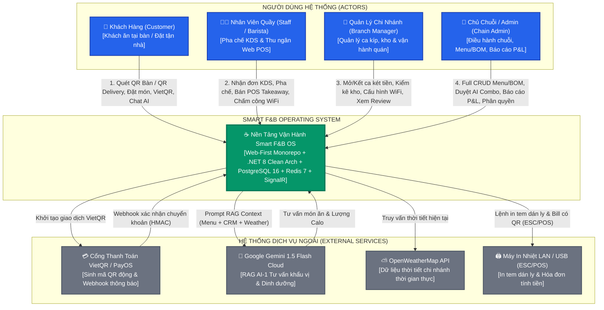
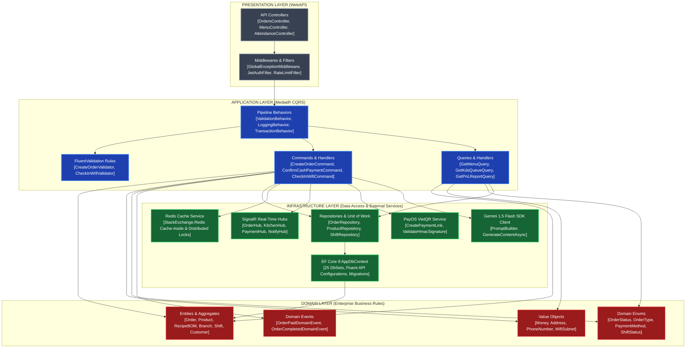
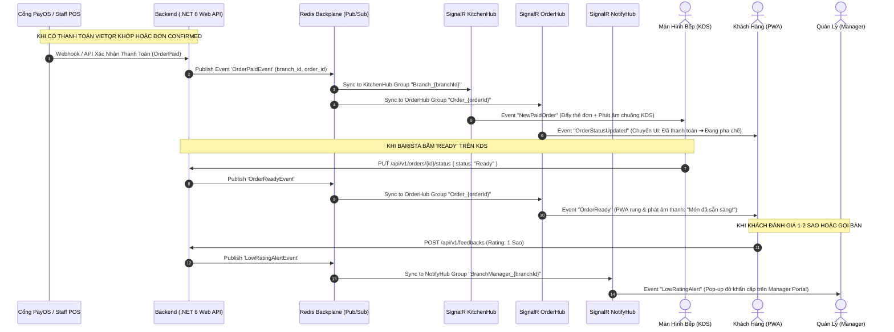
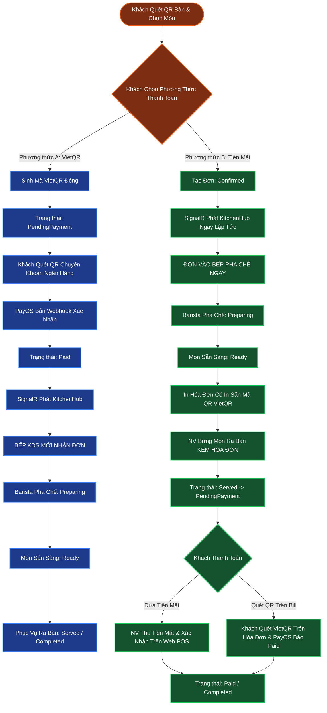
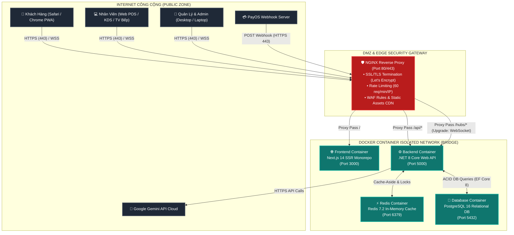

# 🏛️ TỔNG QUAN KIẾN TRÚC HỆ THỐNG (SYSTEM ARCHITECTURE SPECIFICATION)

## Smart F&B Operating System — AI-Powered QR Order & Management Platform

> [!NOTE]
> **Tài liệu:** Bản Đặc Tả Thiết Kế Kiến Trúc Kỹ Thuật Tổng Thể (System Architecture Specification)  
> **Mã tài liệu:** `SPEC-ARCH-V2.5.0` | **Phiên bản:** v2.5.0-Enterprise-Production-Ready  
> **Nguồn sự thật tối thượng:** `Smart_FB_OS_Revised_4members.docx` & `ORIGINAL_REQUEST.md` (2026-08-22)  
> **Quy mô thực thi:** Đồ án Capstone 16 tuần (08 Sprints) — Đội ngũ 4 Kỹ sư Phần mềm (2 Backend + 2 Frontend)  
> **Tech Stack Chuẩn Hóa:** Backend .NET 8 Clean Architecture (C#) \| Frontend Next.js 14 App Router Monorepo (TypeScript) \| Database PostgreSQL 16 (25 Entities 3NF) \| Caching & Locking Redis 7 \| Real-Time SignalR WebSockets \| Google Gemini 1.5 Flash SDK \| Apriori/FP-Growth \| PayOS VietQR Webhook  
>
> **Nguyên Tắc Thiết Kế Bất Biến:**
> 1. **Web-First Monorepo:** 100% các cổng vận hành (Customer PWA, Staff POS & KDS, Manager Portal, Admin Portal) hoạt động trên nền tảng Web Responsive hiện đại.
> 2. **Loại Bỏ Hoàn Toàn Staff Mobile App:** Không phát triển ứng dụng di động native/hybrid riêng cho nhân viên.
> 3. **Loại Bỏ Hoàn Toàn Tính Năng Không Thuộc Scope:** Loại bỏ triệt để tính năng chia sẻ món ăn mạng xã hội và Push notification khuyến mãi khỏi toàn bộ kiến trúc.
> 4. **Zero Placeholders:** 100% nội dung, sơ đồ Mermaid, luồng dữ liệu và tham số kỹ thuật được đặc tả chi tiết và hoàn chỉnh.

---

# 📚 MỤC LỤC KIẾN TRÚC

|       Phần       | Tiêu Đề Phân Mục Kỹ Thuật                                                                                                        | Trọng Tâm Kiến Trúc                                            |
| :----------------: | --------------------------------------------------------------------------------------------------------------------------------------- | ------------------------------------------------------------------ |
| **PHẦN 1** | [Nguyên Tắc Thiết Kế & Phong Cách Kiến Trúc Hệ Thống](#phần-1-nguyên-tắc-thiết-kế--phong-cách-kiến-trúc-hệ-thống) | Clean Architecture, CQRS, Web-First, Event-Driven, Invariants      |
| **PHẦN 2** | [Mô Hình C4 & Sơ Đồ Kiến Trúc Tổng Thể](#phần-2-mô-hình-c4--sơ-đồ-kiến-trúc-tổng-thể)                             | C4 Context & Container Diagrams (Mermaid 100% Valid)               |
| **PHẦN 3** | [Thiết Kế Tầng Giao Diện Người Dùng (Presentation Tier)](#phần-3-thiết-kế-tầng-giao-diện-người-dùng-presentation-tier)    | Next.js 14 App Router Monorepo, 5 Route Groups, TanStack Query     |
| **PHẦN 4** | [Thiết Kế Tầng Backend Lõi (.NET 8 Clean Architecture)](#phần-4-thiết-kế-tầng-backend-lõi-net-8-clean-architecture)             | Domain, Application (MediatR CQRS), Infrastructure, WebAPI         |
| **PHẦN 5** | [Hạ Tầng Giao Tiếp Thời Gian Thực (SignalR WebSockets)](#phần-5-hạ-tầng-giao-tiếp-thời-gian-thực-signalr-websockets)          | 4 Hubs: OrderHub, KitchenHub, PaymentHub, NotificationHub          |
| **PHẦN 6** | [Kiến Trúc Dữ Liệu & Lưu Trữ (PostgreSQL 16 & Redis 7)](#phần-6-kiến-trúc-dữ-liệu--lưu-trữ-postgresql-16--redis-7)  | ERD 25 Thực thể 3NF, Caching Cache-Aside, Distributed Locks      |
| **PHẦN 7** | [Kiến Trúc Dữ Liệu & Luồng Nghiệp Vụ Đặc Thù](#phần-7-kiến-trúc-dữ-liệu--luồng-nghiệp-vụ-đặc-thù)               | 3 Loại QR, Dine-In 2 Nhánh, QR Delivery, Takeaway POS, WiFi-Lock |
| **PHẦN 8** | [Kiến Trúc Module Trí Tuệ Nhân Tạo (AI Pipelines)](#phần-8-kiến-trúc-module-trí-tuệ-nhân-tạo-ai-pipelines)                  | AI-1 RAG Gemini 1.5 Flash & AI-2 Apriori Combo Mining Engine       |
| **PHẦN 9** | [Tô-Pô Triển Khai, An Ninh Mạng & Hạ Tầng](#phần-9-tô-pô-triển-khai-an-ninh-mạng--hạ-tầng)                              | Docker Compose, NGINX SSL Termination, Rate Limiter, DMZ           |
| **PHẦN 10** | [Yêu Cầu Phi Chức Năng (Non-Functional Requirements)](#phần-10-yêu-cầu-phi-chức-năng-non-functional-requirements)               | SLAs Hiệu Năng, Bảo Mật, Chịu Lỗi, Khả Năng Mở Rộng      |
| **PHẦN 11** | [Ranh Giới Phạm Vi & Điểm Nối Tương Lai (Scale Up)](#phần-11-ranh-giới-phạm-vi--điểm-nối-tương-lai-scale-up)          | 16-Week MVP vs Future Work Matrix, Core Extension Points           |

---

# 🏛️ PHẦN 1: NGUYÊN TẮC THIẾT KẾ & PHONG CÁCH KIẾN TRÚC HỆ THỐNG

Kiến trúc phần mềm của **Smart F&B OS** được thiết kế nhằm giải quyết bài toán vận hành chuỗi F&B hiện đại: tối ưu chi phí đầu tư ban đầu, loại bỏ hoàn toàn sự phụ thuộc vào phần cứng máy POS chuyên dụng đắt đỏ, và tự động hóa quy trình nghiệp vụ từ đặt món tại bàn, bán mang về, giao tận nhà đến quản lý ca kíp và kho quỹ.

```
┌──────────────────────────────────────────────────────────────────────────────────────────────────┐
│                           6 NGUYÊN TẮC THIẾT KẾ CỐT LÕI (CORE PRINCIPLES)                        │
├───────────────────────────────────┬──────────────────────────────────────────────────────────────┤
│ 1. Web-First Monorepo             │ Hợp nhất 100% ứng dụng (PWA Khách, KDS Bếp, POS Quầy, Portal │
│    & Zero Hardware Dependency     │ Quản lý/Admin) vào một dự án Next.js 14, không cần cài App.  │
├───────────────────────────────────┼──────────────────────────────────────────────────────────────┤
│ 2. Clean Architecture & DDD       │ Cô lập mã nguồn nghiệp vụ cốt lõi (Domain/Application) khỏi  │
│                                   │ Frameworks, Database và External APIs. Tuân thủ Invariants.  │
├───────────────────────────────────┼──────────────────────────────────────────────────────────────┤
│ 3. CQRS & MediatR Pipeline        │ Tách biệt luồng Ghi (Command - ACID Transaction) và luồng Đọc│
│                                   │ (Query - Cache Projections). Pipeline Behavior kiểm soát lỗi.│
├───────────────────────────────────┼──────────────────────────────────────────────────────────────┤
│ 4. Event-Driven Real-Time         │ Giao tiếp 2 chiều tức thời qua SignalR WebSockets (< 500ms). │
│                                   │ Đồng bộ trạng thái đơn hàng, chuông gọi bàn và khóa món 86.  │
├───────────────────────────────────┼──────────────────────────────────────────────────────────────┤
│ 5. Dual-Payment & Multi-Channel   │ Hỗ trợ linh hoạt 3 kênh bán (DineIn, TakeAway, Delivery) và  │
│                                   │ 2 nhánh thanh toán tại bàn (VietQR trả trước vs Tiền mặt sau)│
├───────────────────────────────────┼──────────────────────────────────────────────────────────────┤
│ 6. Dual-Factor WiFi Verification  │ Chấm công an toàn chống gian lận qua BSSID/IP Subnet WiFi    │
│                                   │ chi nhánh kết hợp Mã số nhân viên, xóa 100% GPS và QR 30s.   │
└───────────────────────────────────┴──────────────────────────────────────────────────────────────┘
```

### 1.1. Triết Lý Web-First Monorepo & Zero Hardware Dependency

- **Loại bỏ 100% Staff Mobile App:** Không phát triển ứng dụng di động riêng cho nhân viên trên App Store hay Google Play. Mọi tác vụ của nhân viên phục vụ, thu ngân, barista được gom vào các Route Groups Next.js 14 Responsive (`(kds)`, `(staff)`), tương thích hoàn hảo trên Smart TV màn hình cảm ứng, iPad, máy tính bảng Android, laptop và smartphone sẵn có.
- **Khách hàng không cần cài đặt:** Trải nghiệm đặt món PWA trực tiếp trên trình duyệt di động (Safari, Chrome) khi quét mã QR, giảm rào cản tiếp cận xuống 0 giây.

### 1.2. Clean Architecture & Domain-Driven Design (DDD)

- Kiến trúc 4 tầng hình củ hành (Onion): **Domain Layer** (Trung tâm) ➔ **Application Layer** (CQRS Use Cases) ➔ **Infrastructure Layer** (Data Access & External Services) ➔ **WebAPI / Presentation Layer** (Controllers & UI).
- Phụ thuộc chỉ đi theo một chiều hướng vào trong (Dependency Inversion Principle).
- Bảo vệ bất biến nghiệp vụ (Domain Invariants): Không đơn hàng nào được đưa vào hàng đợi KDS nếu chưa hợp lệ về trạng thái thanh toán theo quy tắc từng nhánh.

### 1.3. CQRS Pattern & MediatR Pipeline Behaviors

- Tách bạch rõ ràng giữa xử lý thay đổi trạng thái (`IRequest<Result<TResponse>>` cho Commands) và truy vấn dữ liệu (`IRequest<Result<TDto>>` cho Queries).
- Áp dụng các cross-cutting concerns thông qua `IPipelineBehavior`:
  1. `ValidationBehavior`: Tự động kích hoạt các Validator của FluentValidation trước khi vào Handler.
  2. `LoggingBehavior`: Ghi log có cấu trúc (Serilog) cho mọi request/response.
  3. `PerformanceBehavior`: Cảnh báo khi thời gian thực thi lệnh vượt quá 500ms.
  4. `TransactionBehavior`: Quản lý phạm vi giao dịch Unit of Work cho các Command cập nhật nhiều bảng.

---

# 📊 PHẦN 2: MÔ HÌNH C4 & SƠ ĐỒ KIẾN TRÚC TỔNG THỂ

## 2.1. C4 Context Diagram (System Context)

Sơ đồ ngữ cảnh C4 thể hiện sự tương tác giữa 4 nhóm tác nhân người dùng, hệ thống Smart F&B OS và các hệ thống dịch vụ bên ngoài:



---

## 2.2. C4 Container Diagram (Container Architecture)

Sơ đồ C4 Container bóc tách toàn bộ các thành phần phần mềm, công nghệ giao tiếp và luồng dữ liệu nội bộ trong hệ thống:

```mermaid
flowchart TB
    subgraph "CLIENT WEB TIERS (Next.js 14 App Router Monorepo)"
        FE_CUST["📱 Customer PWA App<br>[Route: (customer)]<br>PWA QR Menu, Delivery, AI Chat"]
        FE_KDS["📺 Barista KDS Web App<br>[Route: (kds)]<br>Màn hình Bếp Fullscreen, 86-Toggle"]
        FE_POS["💻 Staff Web POS App<br>[Route: (staff)]<br>Takeaway POS, CRM 10 Ly, WiFi Att"]
        FE_MGR["📊 Manager Web Portal<br>[Route: (manager)]<br>Mở/Kết ca két, Kiểm kho, Alert review"]
        FE_ADM["🏢 Admin Executive Portal<br>[Route: (admin)]<br>Menu/BOM CRUD, AI Combo, P&L Report"]
    end

    subgraph "API GATEWAY & REVERSE PROXY"
        NGINX["🛡️ NGINX Reverse Proxy & WAF<br>[SSL Termination, Rate Limiting, Static CDN]"]
    end

    subgraph "BACKEND CORE CONTAINER (.NET 8 Web API)"
        API_CTRL["🌐 Web API Controllers / Endpoints<br>[Auth JWT, RateLimiter, Filters]"]
        MED_BUS["🔀 MediatR Command/Query Bus<br>[CQRS Pipeline & FluentValidation]"]
      
        subgraph "Core Business Handlers"
            H_ORDER["📦 Order & Payment Handlers<br>[DineIn, TakeAway, Delivery Engines]"]
            H_KDS["🍳 KDS & Inventory Handlers<br>[BOM Auto-Deduction & 86-Sync]"]
            H_CRM["🎁 CRM & Loyalty Handlers<br>[Takeaway 10-Cup Rule, Vouchers]"]
            H_WIFI["📶 WiFi Attendance Handlers<br>[BSSID/IP Subnet Dual Check]"]
            H_AI["🧠 AI & Analytics Services<br>[Gemini RAG & Apriori Combo Engine]"]
        end

        SIG_HUBS["⚡ SignalR Real-Time Hubs<br>[OrderHub, KitchenHub, PaymentHub, NotifyHub]"]
    end

    subgraph "DATA PERSISTENCE & CACHING LAYER"
        PG_DB[("🐘 PostgreSQL 16 Database<br>[25 Relational Tables in 3NF, ACID, EF Core 8]")]
        REDIS_CACHE[("⚡ Redis 7 In-Memory<br>[Menu Cache-Aside, Distributed Lock, SignalR Backplane]")]
    end

    subgraph "EXTERNAL INTEGRATION GATEWAYS"
        EXT_PAY["💳 PayOS VietQR Service"]
        EXT_AI["🤖 Google Gemini 1.5 Flash SDK"]
        EXT_ESC["🖨️ ESC/POS Thermal Print Engine"]
    end

    %% Client to NGINX
    FE_CUST & FE_KDS & FE_POS & FE_MGR & FE_ADM -->|"HTTPS / WSS (Port 443)"| NGINX

    %% NGINX to Backend
    NGINX -->|"HTTP REST API Requests"| API_CTRL
    NGINX -->|"WebSocket Upgrades (/hubs/*)"| SIG_HUBS

    %% Inside Backend
    API_CTRL --> MED_BUS
    MED_BUS --> H_ORDER & H_KDS & H_CRM & H_WIFI & H_AI

    H_ORDER & H_KDS & H_CRM & H_WIFI -->|"State Updates & Events"| SIG_HUBS

    %% Backend to Data Layer
    H_ORDER & H_KDS & H_CRM & H_WIFI & H_AI -->|"EF Core 8 Transactions (Port 5432)"| PG_DB
    H_ORDER & H_KDS & H_CRM & H_AI <-->|"Cache-Aside & Locks (Port 6379)"| REDIS_CACHE
    SIG_HUBS <-->|"SignalR Message Bus Backplane"| REDIS_CACHE

    %% Backend to External
    H_ORDER -->|"Webhook Verification & Link Generation"| EXT_PAY
    H_AI -->|"RAG Prompts & Structured Outputs"| EXT_AI
    H_KDS & H_ORDER -->|"RAW Byte TCP/IP Socket"| EXT_ESC

    classDef feStyle fill:#1e3a8a,stroke:#3b82f6,stroke-width:2px,color:#ffffff;
    classDef beStyle fill:#14532d,stroke:#22c55e,stroke-width:2px,color:#ffffff;
    classDef dbStyle fill:#701a75,stroke:#d946ef,stroke-width:2px,color:#ffffff;
    classDef gwStyle fill:#374151,stroke:#9ca3af,stroke-width:2px,color:#ffffff;

    class FE_CUST,FE_KDS,FE_POS,FE_MGR,FE_ADM feStyle;
    class API_CTRL,MED_BUS,H_ORDER,H_KDS,H_CRM,H_WIFI,H_AI,SIG_HUBS beStyle;
    class PG_DB,REDIS_CACHE dbStyle;
    class NGINX,EXT_PAY,EXT_AI,EXT_ESC gwStyle;
```



---

## 2.3. Bảng Phân Tích Trách Nhiệm Các Container & Giao Thức Giao Tiếp

| Tên Container / Khối           | Công Nghệ & Phiên Bản                                                  | Giao Thức Giao Tiếp               | Trách Nhiệm & Vai Trò Kỹ Thuật                                                                                                           |
| -------------------------------- | -------------------------------------------------------------------------- | ----------------------------------- | --------------------------------------------------------------------------------------------------------------------------------------------- |
| **Frontend Monorepo**      | Next.js 14.2 (App Router), React 18, TypeScript 5, Tailwind CSS, Shadcn UI | HTTPS / WSS qua NGINX               | Render giao diện người dùng cho cả 4 vai trò, quản lý state giỏ hàng, kết nối SignalR Hubs thời gian thực.                      |
| **API Gateway / Proxy**    | NGINX 1.25 Alpine Linux                                                    | HTTPS (Port 443), WSS               | Tiếp nhận traffic từ Internet, chấm dứt SSL/TLS, giới hạn tần suất (Rate Limiting 60 req/min/IP), định tuyến API và WebSocket.   |
| **Backend API Core**       | .NET 8 Web API, C# 12, MediatR 12, FluentValidation 11                     | HTTP REST, WebSockets, TCP Socket   | Xử lý toàn bộ logic nghiệp vụ, xác thực JWT RBAC, thực thi CQRS Commands/Queries, kết nối DB và điều phối các Hub.            |
| **Relational Database**    | PostgreSQL 16.2 Enterprise                                                 | TCP Port 5432 (Npgsql / EF Core 8)  | Lưu trữ vĩnh viễn 25 thực thể dữ liệu trong mô hình 3NF, bảo đảm tính toàn vẹn quan hệ và giao dịch ACID.                  |
| **In-Memory Cache & Lock** | Redis 7.2 Alpine                                                           | TCP Port 6379 (StackExchange.Redis) | Lưu cache thực đơn chi nhánh (TTL 24h), quản lý phân tán Distributed Lock (`lock:table:*`), Backplane cho SignalR multi-instances. |
| **Real-Time SignalR**      | ASP.NET Core SignalR 8.0                                                   | WebSocket / Long-Polling fallback   | Đẩy dữ liệu tức thì xuống KDS, cập nhật trạng thái đơn hàng trên PWA, phát âm thanh chuông báo phục vụ.                  |

---

# 🖥️ PHẦN 3: THIẾT KẾ TẦNG GIAO DIỆN NGƯỜI DÙNG (PRESENTATION TIER)

Tầng giao diện người dùng được tổ chức theo kiến trúc **Next.js 14 App Router Monorepo** với 5 Route Groups phân định ranh giới chức năng rõ ràng:

```
frontend/
├── src/
│   ├── app/
│   │   ├── (customer)/               # [ACTOR 1: KHÁCH HÀNG] Mobile-First PWA Web
│   │   │   ├── menu/                 # Duyệt menu theo bàn, chọn Size/Đường/Đá/Topping
│   │   │   ├── cart/                 # Giỏ hàng, Áp dụng Voucher, Chọn thanh toán VietQR / Tiền mặt
│   │   │   ├── delivery/             # Form đặt hàng giao tận nơi (SĐT + Địa chỉ + Phí ship 20k)
│   │   │   ├── tracking/[orderId]/   # Theo dõi tiến độ đơn hàng thời gian thực qua SignalR
│   │   │   ├── ai-consultant/        # Chatbot RAG Gemini 1.5 Flash tư vấn khẩu vị & calo
│   │   │   └── review/[orderId]/     # Đánh giá 1-5 sao, bình luận & tải ảnh chụp thực tế
│   │   │
│   │   ├── (kds)/                    # [ACTOR 2: BARISTA / BẾP] Màn Hình Bếp KDS Fullscreen
│   │   │   ├── queue/                # Hàng đợi đơn hàng thời gian thực (Gom món, xem định mức BOM)
│   │   │   └── 86-toggle/            # Bật/tắt trạng thái hết hàng tức thì của món tại quầy bar
│   │   │
│   │   ├── (staff)/                  # [ACTOR 2: NHÂN VIÊN QUẦY] Web Responsive POS & Chấm Công
│   │   │   ├── pos/                  # Web POS Quầy: Bán mang về, tra cứu CRM 10 ly, thu tiền sau
│   │   │   ├── tables/               # Sơ đồ mặt bằng bàn trực quan, tiếp nhận chuông gọi phục vụ
│   │   │   └── attendance/           # Chấm công khóa mạng WiFi chi nhánh (Xác thực IP/BSSID + Mã NV)
│   │   │
│   │   ├── (manager)/                # [ACTOR 3: QUẢN LÝ CHI NHÁNH] Manager Web Portal
│   │   │   ├── shifts/               # Mở ca đầu ngày, kết ca kiểm đếm két tiền mặt & ký Z-Report
│   │   │   ├── inventory/            # Lập phiếu xuất kho quầy bar, nhập kho NCC, kiểm kê hao hụt
│   │   │   ├── schedule/             # Phân ca làm việc tuần, duyệt yêu cầu đổi ca trực
│   │   │   ├── wifi-config/          # Khai báo danh sách BSSID Access Point & IP Subnet chấm công
│   │   │   └── reviews/              # Tiếp nhận Alert review <= 2 sao khẩn cấp & kiểm duyệt ảnh
│   │   │
│   │   └── (admin)/                  # [ACTOR 4: CHỦ CHUỖI / ADMIN] Admin Executive Portal
│   │       ├── menu-management/      # Full CRUD Món ăn, Danh mục, Định lượng BOM, Menu mùa
│   │       ├── dynamic-pricing/      # Thiết lập bảng giá theo nhóm chi nhánh (Sân bay, Phố)
│   │       ├── ai-combo-mining/      # Phê duyệt các gợi ý Combo khai phá bởi thuật toán Apriori
│   │       ├── reports-pnl/          # Dashboard P&L hợp nhất toàn chuỗi (Doanh thu, COGS, Lãi gộp)
│   │       ├── crm-loyalty/          # Quản trị danh bạ khách hàng & Cấu hình chính sách 10 ly
│   │       ├── branches-rbac/        # Quản lý chi nhánh, tài khoản & phân quyền RBAC
│   │       └── audit-logs/           # Nhật ký kiểm toán bất biến các thao tác nhạy cảm
│   │
│   ├── components/                   # Shadcn UI, Data Grid, Chart Components, Dialogs
│   ├── hooks/                        # useSignalR, useCart, useAuth, useWifiDetector, useKdsQueue
│   └── lib/                          # Axios API Client, SignalR Connection Factory, Utils
```

---

# ⚙️ PHẦN 4: THIẾT KẾ TẦNG BACKEND LÕI (.NET 8 CLEAN ARCHITECTURE)

## 4.1. Sơ Đồ Chi Tiết 4 Lớp Clean Architecture



---

# ⚡ PHẦN 5: HẠ TẦNG GIAO TIẾP THỜI GIAN THỰC (SIGNALR WEBSOCKETS)

## 5.1. Sơ Đồ Kiến Trúc Luồng Sự Kiện Real-Time



## 5.2. Đặc Tả Chi Tiết 4 SignalR Hubs

| Tên Hub                      | Route Endpoint          | Nhóm Kết Nối (Connection Groups)          | Sự Kiện Phát Sóng (Events Emitted)                       | Payload Dữ Liệu                                                 |
| ----------------------------- | ----------------------- | -------------------------------------------- | ------------------------------------------------------------ | ----------------------------------------------------------------- |
| **`OrderHub`**        | `/hubs/orders`        | `Order_{orderId}Customer_{phone}`          | `OrderStatusUpdatedOrderReady``EstimatedTimeAdjusted`    | `{ orderId, status, estimatedMinutes, updatedAt }`              |
| **`KitchenHub`**      | `/hubs/kitchen`       | `Branch_{branchId}Kds_{stationId}`         | `NewPaidOrderOrderConfirmedCash``Item86Toggled`          | `{ orderId, orderType, tableNumber, items[], note, bom[] }`     |
| **`PaymentHub`**      | `/hubs/payments`      | `Payment_{orderId}`                        | `PaymentSucceededPaymentFailed``PaymentExpired`          | `{ orderId, transactionCode, amount, paidAt, method }`          |
| **`NotificationHub`** | `/hubs/notifications` | `BranchManager_{branchId}Staff_{branchId}` | `ServiceRequestedLowRatingAlert``InventoryShortageAlert` | `{ branchId, tableNumber, reason, ratingStars, comment, time }` |

---

# 🗄️ PHẦN 6: KIẾN TRÚC DỮ LIỆU & LƯU TRỮ (POSTGRESQL 16 & REDIS 7)

## 6.1. Sơ Đồ Thực Thể Quan Hệ ERD (25 Entities Chuẩn Hóa 3NF)

```mermaid
erDiagram
    BRANCHES ||--o{ BRANCH_WIFI_CONFIGS : "configures"
    BRANCHES ||--o{ USERS : "employs"
    BRANCHES ||--o{ TABLES : "contains"
    BRANCHES ||--o{ ORDERS : "fulfills"
    BRANCHES ||--o{ SHIFTS : "manages"
    BRANCHES ||--o{ PRODUCT_BRANCH_PRICES : "overrides_price"
    BRANCHES ||--o{ ATTENDANCES : "records"

    USERS ||--o{ USER_ROLES : "assigned"
    ROLES ||--o{ USER_ROLES : "defines"
    USERS ||--o{ AUDIT_LOGS : "generates"
    USERS ||--o{ SHIFTS : "operates_cashier"
    USERS ||--o{ ATTENDANCES : "checks_in"

    CATEGORIES ||--o{ PRODUCTS : "categorizes"
    PRODUCTS ||--o{ PRODUCT_SIZES : "has_sizes"
    PRODUCTS ||--o{ PRODUCT_BRANCH_PRICES : "has_branch_prices"
    PRODUCTS ||--o{ PRODUCT_MODIFIERS : "allows_modifiers"
    MODIFIERS ||--o{ PRODUCT_MODIFIERS : "linked_to"
  
    PRODUCTS ||--o{ RECIPES_BOM : "composed_of"
    PRODUCT_SIZES ||--o{ RECIPES_BOM : "sizes_bom"
    INGREDIENTS ||--o{ RECIPES_BOM : "uses_ingredient"

    TABLES ||--o{ ORDERS : "places_dinein"
    CUSTOMERS ||--o{ ORDERS : "orders"
    CUSTOMERS ||--o{ LOYALTY_CUP_TRANSACTIONS : "accumulates_takeaway"
    CUSTOMERS ||--o{ CUSTOMER_REVIEWS : "writes"

    ORDERS ||--o{ ORDER_ITEMS : "contains_items"
    ORDERS ||--o{ PAYMENTS : "paid_via"
    ORDERS ||--o{ CUSTOMER_REVIEWS : "evaluated_by"
    ORDERS ||--o{ LOYALTY_CUP_TRANSACTIONS : "generates_cups"

    ORDER_ITEMS ||--o{ ORDER_ITEM_MODIFIERS : "customized_with"
    MODIFIERS ||--o{ ORDER_ITEM_MODIFIERS : "selected_modifier"
    PRODUCT_SIZES ||--o{ ORDER_ITEMS : "applies_size"
    PRODUCTS ||--o{ ORDER_ITEMS : "references_product"

    BRANCHES {
        uuid branch_id PK
        string code UK
        string name
        string address
        string phone
        boolean is_active
        datetime created_at
    }

    BRANCH_WIFI_CONFIGS {
        uuid wifi_config_id PK
        uuid branch_id FK
        string ssid_name
        string bssid_list
        string allowed_ip_subnets
        boolean is_active
        datetime updated_at
    }

    USERS {
        uuid user_id PK
        uuid branch_id FK
        string username UK
        string password_hash
        string full_name
        string email
        string phone
        string status
        datetime created_at
    }

    ROLES {
        uuid role_id PK
        string role_name UK
        string description
    }

    USER_ROLES {
        uuid user_id PK,FK
        uuid role_id PK,FK
        datetime assigned_at
    }

    AUDIT_LOGS {
        uuid audit_id PK
        uuid user_id FK
        string action
        string entity_name
        string entity_id
        text old_values
        text new_values
        string ip_address
        datetime timestamp
    }

    CATEGORIES {
        uuid category_id PK
        string name
        string description
        int display_order
        string image_url
        boolean is_active
    }

    PRODUCTS {
        uuid product_id PK
        uuid category_id FK
        string name
        string description
        decimal base_price
        string image_url
        boolean is_available
        boolean is_best_seller
        datetime created_at
    }

    PRODUCT_SIZES {
        uuid size_id PK
        uuid product_id FK
        string size_name
        decimal price_adjustment
        int display_order
    }

    PRODUCT_BRANCH_PRICES {
        uuid branch_price_id PK
        uuid product_id FK
        uuid branch_id FK
        decimal price_override
        boolean is_available_86
        datetime updated_at
    }

    MODIFIERS {
        uuid modifier_id PK
        string name
        string type
        decimal extra_price
        boolean is_available
    }

    PRODUCT_MODIFIERS {
        uuid product_id PK,FK
        uuid modifier_id PK,FK
        boolean is_default
        int max_quantity
    }

    INGREDIENTS {
        uuid ingredient_id PK
        string name
        string unit
        decimal current_stock
        decimal min_stock_threshold
        decimal unit_cost
    }

    RECIPES_BOM {
        uuid recipe_id PK
        uuid product_id FK
        uuid size_id FK
        uuid ingredient_id FK
        decimal standard_quantity
        decimal wastage_percentage
    }

    TABLES {
        uuid table_id PK
        uuid branch_id FK
        string table_number
        int capacity
        string qr_code_url
        string status
    }

    ORDERS {
        uuid order_id PK
        uuid branch_id FK
        uuid table_id FK
        uuid customer_id FK
        string order_code UK
        string order_type
        string status
        decimal sub_total
        decimal discount_amount
        decimal delivery_fee
        decimal total_amount
        string delivery_address
        string recipient_name
        string recipient_phone
        string delivery_notes
        datetime created_at
        datetime paid_at
    }

    ORDER_ITEMS {
        uuid order_item_id PK
        uuid order_id FK
        uuid product_id FK
        uuid size_id FK
        int quantity
        decimal unit_price
        string note
        string item_status
    }

    ORDER_ITEM_MODIFIERS {
        uuid order_item_modifier_id PK
        uuid order_item_id FK
        uuid modifier_id FK
        int quantity
        decimal extra_price
    }

    PAYMENTS {
        uuid payment_id PK
        uuid order_id FK
        string payment_method
        decimal amount
        string transaction_code UK
        string status
        string payos_payment_link_id
        datetime paid_at
    }

    CUSTOMERS {
        uuid customer_id PK
        string phone_number UK
        string full_name
        string membership_tier
        int cup_balance
        datetime created_at
        datetime last_visited_at
    }

    LOYALTY_CUP_TRANSACTIONS {
        uuid transaction_id PK
        uuid customer_id FK
        uuid order_id FK
        int cups_earned
        int cups_redeemed
        string transaction_type
        datetime created_at
    }

    VOUCHERS {
        uuid voucher_id PK
        string code UK
        string discount_type
        decimal discount_value
        decimal min_order_value
        decimal max_discount_amount
        datetime start_date
        datetime end_date
        int usage_limit
        int used_count
        boolean is_active
    }

    CUSTOMER_REVIEWS {
        uuid review_id PK
        uuid order_id FK
        uuid product_id FK
        uuid customer_id FK
        int rating_stars
        string comment
        string photo_urls
        boolean is_anonymous
        boolean is_approved
        datetime created_at
    }

    SHIFTS {
        uuid shift_id PK
        uuid branch_id FK
        uuid cashier_id FK
        datetime opening_time
        datetime closing_time
        decimal initial_cash
        decimal actual_cash_counted
        decimal system_cash_calculated
        decimal cash_difference
        text shift_notes
        string status
    }

    ATTENDANCES {
        uuid attendance_id PK
        uuid branch_id FK
        uuid user_id FK
        string employee_code
        datetime check_in_time
        datetime check_out_time
        string verified_ip
        string verified_bssid
        string status
        datetime created_at
    }
```



## 6.2. Chiến Lược Caching & Locking Với Redis 7

```
┌──────────────────────────────────────────────────────────────────────────────────────────────────┐
│                                 CHIẾN LƯỢC REDIS 7 (CACHE & LOCK)                                │
├────────────────────────┬───────────────────┬─────────────┬───────────────────────────────────────┤
│ Loại Dữ Liệu / Khóa    │ Cấu Trúc Khóa Key │ Thời Gian   │ Chiến Lược Cập Nhật / Giải Phóng      │
│                        │                   │ TTL         │                                       │
├────────────────────────┼───────────────────┼─────────────┼───────────────────────────────────────┤
│ Menu Chi Nhánh         │ `menu:branch:{id}`│ 24 Giờ      │ Cache-Aside: Tự động Invalidate khi   │
│                        │                   │             │ Admin đổi giá hoặc Barista 86-Toggle. │
├────────────────────────┼───────────────────┼─────────────┼───────────────────────────────────────┤
│ Hồ Sơ Khách Hàng CRM   │ `crm:cust:{phone}`│ 1 Giờ       │ Nạp khi tra cứu SĐT; Invalidate khi   │
│                        │                   │             │ tích ly mới hoặc hoàn tất đơn hàng.   │
├────────────────────────┼───────────────────┼─────────────┼───────────────────────────────────────┤
│ Distributed Lock Bàn   │ `lock:tbl:{id}`   │ 15 Giây     │ RedLock: Chặn tạo trùng phiên bàn khi │
│                        │                   │ (Auto-exp)  │ 2 khách cùng quét QR đồng thời.       │
├────────────────────────┼───────────────────┼─────────────┼───────────────────────────────────────┤
│ Distributed Lock KDS   │ `lock:order:{id}` │ 10 Giây     │ Chặn 2 Barista cùng bấm 'Preparing'   │
│                        │                   │             │ hoặc đổi trạng thái đơn đồng thời.    │
├────────────────────────┼───────────────────┼─────────────┼───────────────────────────────────────┤
│ SignalR Backplane      │ `signalr:hub:*`   │ Persistent  │ Redis Pub/Sub đồng bộ tin nhắn giữa   │
│                        │                   │             │ các instances Web API khi scale out.  │
└────────────────────────┴───────────────────┴─────────────┴───────────────────────────────────────┘
```

---

# 💼 PHẦN 7: KIẾN TRÚC DỮ LIỆU & LUỒNG NGHIỆP VỤ ĐẶC THÙ

## 7.1. Kiến Trúc 3 Loại Mã QR (QR Architecture)

```
┌──────────────────────────────────────────────────────────────────────────────────────────────────┐
│                                 KIẾN TRÚC 3 LOẠI MÃ QR HỆ THỐNG                                   │
├──────────────────────┬────────────────────────────────┬──────────────────────────────────────────┤
│ Loại Mã QR           │ Cấu Trúc URL & Tham Số Chữ Ký  │ Cơ Chế Xác Thực & Luồng Xử Lý            │
├──────────────────────┼────────────────────────────────┼──────────────────────────────────────────┤
│ 1. Table QR          │ `https://app.domain/menu`      │ • Giải mã URL Param & Check chữ ký HMAC. │
│    (Đặt Món Tại Bàn) │ `?b={branch_id}&t={table_id}`  │ • Mở đúng menu chi nhánh & gán table_id. │
│                      │ `&sig={hmac_sha256}`           │ • Chọn 1 trong 2 nhánh thanh toán.       │
├──────────────────────┼────────────────────────────────┼──────────────────────────────────────────┤
│ 2. Delivery QR       │ `https://app.domain/delivery`  │ • Mở form đặt hàng giao tận nơi.         │
│    (Đặt Tận Nhà)     │ `?b={branch_id}&src=poster`    │ • Bắt buộc SĐT + Địa chỉ (`address`).    │
│                      │                                │ • Tự động cộng cố định phí ship 20.000đ. │
│                      │                                │ • Bắt buộc 100% VietQR (Không COD).      │
├──────────────────────┼────────────────────────────────┼──────────────────────────────────────────┤
│ 3. Attendance QR     │ `https://staff.domain/checkin` │ • Kiểm tra Client IP/BSSID WiFi quán.    │
│    (Chấm Công WiFi)  │ `?b={branch_id}&k=attendance`  │ • Nhân viên nhập Mã số nhân viên.        │
│                      │                                │ • Khớp WiFi + Mã NV ➔ Check-in hợp lệ.   │
└──────────────────────┴────────────────────────────────┴──────────────────────────────────────────┘
```

---

## 7.2. Kiến Trúc 2 Nhánh Thanh Toán Dine-In (Dual-Payment Engine)

Hệ thống hỗ trợ 2 State Machines độc lập cho khách ăn uống tại bàn:



---

## 7.3. Kiến Trúc Takeaway Web POS & Chương Trình Tích 10 Ly

- **Giao diện Web POS Quầy:** Thu ngân thao tác tại route `(staff)/pos`.
- **Tra cứu CRM qua SĐT:** Nhập số điện thoại khách hàng ➔ Hiển thị tên, số ly hiện có `CupBalance` (x/10).
- **Quy tắc Loyalty 10 ly = tặng 1 ly miễn phí:** **CHỈ ÁP DỤNG DUY NHẤT CHO ĐƠN TAKEAWAY**. Đơn Dine-In và Delivery hoàn toàn không tích ly và không đổi ly miễn phí.
- **Thanh toán sau (Post-payment):** Thu tiền mặt (hệ thống tự tính tiền thừa) hoặc xuất mã VietQR tại quầy sau khi khách nhận đồ uống.

---

## 7.4. Kiến Trúc Chấm Công Khóa Mạng WiFi (WiFi-Locked Engine)

- **Nguyên lý:** Chặn đứng 100% hành vi chấm công hộ từ xa bằng 4G/5G hoặc WiFi nhà mà không cần dựa vào GPS (sai số lớn trong nhà) hay mã QR 30 giây.
- **Dual Check Verification:**
  1. `Network Check`: So khớp địa chỉ IP Gateway / Subnet của Client hoặc BSSID Access Point với bảng cấu hình `branch_wifi_configs`.
  2. `Identity Check`: Kiểm tra Mã số nhân viên `EmployeeCode` và ca làm việc hợp lệ trong ngày.

---

# 🧠 PHẦN 8: KIẾN TRÚC MODULE TRÍ TUỆ NHÂN TẠO (AI PIPELINES)

```
┌──────────────────────────────────────────────────────────────────────────────────────────────────┐
│                             2 ACTIVE AI MODULES TRIỂN KHAI TRONG 16 TUẦN                         │
├──────────────────────────────────────────────────────────────────────────────────────────────────┤
│ 1. AI-1: CHATBOT TƯ VẤN KHẨU VỊ RAG (Recommendation Chatbot Pipeline)                            │
│   [Tin Nhắn Khách Hàng] ──► [Context Builder: Dữ liệu Menu + OpenWeather + Lịch Sử CRM]          │
│                                    │                                                             │
│                                    ▼                                                             │
│   [Structured Prompt] ──► [Google Gemini 1.5 Flash SDK] ──► [JSON Output: Gợi Ý 2-3 Món + Calo] │
│                                    │                                                             │
│                                    ▼                                                             │
│   [PWA UI: Thẻ Món Trực Quan + Nút 'Thêm Vào Giỏ'] (Đo lường: Precision@K, NDCG@K, Latency <1.5s)│
├──────────────────────────────────────────────────────────────────────────────────────────────────┤
│ 2. AI-2: KHAI PHÁ COMBO MÓN TỰ ĐỘNG (Market Basket Analysis Pipeline)                            │
│   [Lịch Sử Đơn Hàng DB] ──► [Background Apriori/FP-Growth: Support >= 0.02, Lift > 1.2]          │
│                                    │                                                             │
│                                    ▼                                                             │
│   [Danh Sách Gợi Ý Combo] ──► [Admin Portal: Chủ Chuỗi Xem Xét & Duyệt Mức Giảm Giá]             │
│                                    │                                                             │
│                                    ▼                                                             │
│   [Phát Hành Combo Lên Menu PWA] ──► [Kích Thích Tăng Giá Trị Giỏ Hàng AOV Chuỗi]               │
└──────────────────────────────────────────────────────────────────────────────────────────────────┘
```

---

# 🌐 PHẦN 9: TÔ-PÔ TRIỂN KHAI, AN NINH MẠNG & HẠ TẦNG

## 9.1. Sơ Đồ Tô-Pô Triển Khai & An Ninh Mạng (Deployment Topology)



---

# 🛡️ PHẦN 10: YÊU CẦU PHI CHỨC NĂNG (NON-FUNCTIONAL REQUIREMENTS - NFRs)

```
┌──────────────────────────────────────────────────────────────────────────────────────────────────┐
│                       TIÊU CHUẨN ĐẶC TẢ PHI CHỨC NĂNG (NON-FUNCTIONAL SLAs)                      │
├───────────────────┬──────────────────────────────────────────────────────────────────────────────┤
│ 1. Hiệu Năng      │ • API P95 Response Time < 200ms đối với các tác vụ Đọc/Ghi thông thường.    │
│    (Performance)  │ • SignalR WebSocket Event Latency < 500ms từ Webhook tới Màn hình Bếp KDS.   │
│                   │ • AI Chatbot RAG Response Latency < 1.5 giây cho toàn bộ câu trả lời.        │
│                   │ • Khả năng chịu tải đồng thời: Tối thiểu 500 CCU / Chi nhánh.                │
├───────────────────┼──────────────────────────────────────────────────────────────────────────────┤
│ 2. Bảo Mật        │ • Xác thực JWT (RS256) kèm cơ chế Refresh Token và Claims-Based RBAC.        │
│    (Security)     │ • Chống gian lận Webhook: Xác thực chữ ký số HMAC-SHA256 từ PayOS.          │
│                   │ • Chống tấn công OWASP Top 10: SQL Injection (EF Core Parameterized), XSS.  │
│                   │ • Khóa mạng WiFi: So khớp BSSID/Subnet cứng rắn ngăn chặn check-in từ xa.   │
├───────────────────┼──────────────────────────────────────────────────────────────────────────────┤
│ 3. Độ Sẵn Sàng    │ • Cam kết Uptime hệ thống >= 99.9% trong giờ hoạt động của quán (06:00-23:00)│
│    (Reliability)  │ • Graceful Fallback: Nếu AI Gemini gặp sự cố, tự động hiển thị Top BestSeller│
│                   │ • SignalR Reconnect: Tự động thử lại kết nối theo hàm mũ (Exponential Backoff)│
├───────────────────┼──────────────────────────────────────────────────────────────────────────────┤
│ 4. Khả Năng       │ • Kiến trúc Stateless Web API cho phép Scale Out thêm container dễ dàng.     │
│    Mở Rộng        │ • Redis Pub/Sub Backplane đảm bảo broadcast đồng bộ trên nhiều API servers.  │
│    (Scalability)  │ • Sẵn sàng phân tách Read/Write Database Replicas khi quy mô chuỗi > 50 quán. │
└───────────────────┴──────────────────────────────────────────────────────────────────────────────┘
```

---

# 🔮 PHẦN 11: RANH GIỚI PHẠM VI & ĐIỂM NỐI TƯƠNG LAI (SCALE UP)

## 11.1. Ma Trận Phân Định Ranh Giới (16-Week MVP vs Future Work)

| Phân Hệ / Tính Năng                            |     16-Tuần 4-Thành Viên MVP (Active)     |  Scale Up / Future Work  | Ghi Chú Kỹ Thuật                   |
| -------------------------------------------------- | :-------------------------------------------: | :-----------------------: | ------------------------------------- |
| **Đặt món tại bàn (Dine-In)**           | ✅ 2 Nhánh (VietQR trước / Tiền mặt sau) |            —            | Nghiệp vụ cốt lõi tại quán.     |
| **Đặt hàng giao tận nơi (QR Delivery)** |  ✅ SĐT + Địa chỉ, Phí 20k, VietQR 100%  |            —            | Bán hàng online không COD.         |
| **Bán mang về tại quầy (Takeaway)**      |    ✅ Web POS, Tích 10 ly, Thu tiền sau    |            —            | Nghiệp vụ thu ngân quầy.          |
| **Chấm công nhân viên**                  |    ✅ Khóa Mạng WiFi (BSSID/IP + Mã NV)    | 🔮 Sinh trắc học FaceID | WiFi-locked chống gian lận.         |
| **Nền tảng ứng dụng nhân viên**        |      ✅ 100% Web Responsive (KDS & POS)      | ❌ XÓA Staff Mobile App | Bỏ hoàn toàn App native.           |
| **AI-1: Chatbot Tư Vấn Khẩu Vị**         |  ✅ RAG Gemini 1.5 Flash + Đo lường NDCG  |            —            | Nghiên cứu khoa học chính.        |
| **AI-2: Khai Phá Combo Món**               |   ✅ Apriori/FP-Growth + Chủ chuỗi duyệt   |            —            | Tăng giá trị đơn hàng AOV.      |
| **AI-3: Hỏi Đáp Số Liệu Kinh Doanh**    |                      —                      | 🔮 Text-to-SQL Analytics | Extension`ITextToSqlEngine`.        |
| **AI-4: Dự Báo Rời Bỏ (Churn)**          |                      —                      |  🔮 RFM Machine Learning  | Extension`IChurnPredictor`.         |
| **AI-5: Dự Báo Nhu Cầu Món**             |                      —                      |   🔮 Demand Forecasting   | Extension`IDemandForecaster`.       |
| **Điều phối Ship bên thứ ba**           |                      —                      | 🔮 AhaMove / GrabExpress | Extension`IDeliveryPartner`.        |
| **Đồng bộ Offline Mesh**                  |                      —                      |   🔮 IndexedDB P2P Sync   | Hoạt động qua Internet ổn định. |

## 11.2. Các Điểm Nối Mở Rộng Kiến Trúc (Core Extension Points)

Hệ thống định nghĩa sẵn các C# Interfaces trừu tượng trong Core Domain/Application để dễ dàng cắm ghép các module mở rộng trong tương lai:

1. `ITextToSqlEngine`: Giao tiếp mô hình AI chuyển đổi câu hỏi tự nhiên tiếng Việt thành câu lệnh truy vấn PostgreSQL an toàn.
2. `IChurnPredictor`: Giao diện nạp dữ liệu tiêu dùng CRM và phân loại nguy cơ mất khách hàng theo mô hình XGBoost.
3. `IDemandForecaster`: Giao diện dự báo số lượng ly bán ra theo ngày để tự động tạo đơn đặt hàng nguyên liệu NCC.
4. `IDeliveryDispatchPartner`: Giao diện kết nối API các đơn vị vận chuyển công nghệ (AhaMove, GrabExpress, BeDelivery).

---

*Tài liệu kiến trúc hệ thống tổng thể được biên soạn hoàn chỉnh 100%, tuân thủ nghiêm ngặt mọi nguyên tắc kỹ thuật và nghiệp vụ của Smart F&B Operating System.*
