# 🔄 BẢN ĐẶC TẢ KỸ THUẬT TOÀN DIỆN CÁC QUY TRÌNH NGHIỆP VỤ (WORKFLOW SPECIFICATIONS)
## Smart F&B Operating System — Hệ Thống Vận Hành Chuỗi F&B Thông Minh Tích Hợp Đặt Món QR & AI

> [!NOTE]
> **Tài liệu:** Bản thiết kế kỹ thuật chi tiết (Technical Workflow Blueprint) đặc tả toàn bộ 16+ quy trình nghiệp vụ cốt lõi, máy trạng thái đơn hàng 4 kênh, ma trận ngoại lệ biên, và giao thức sự kiện thời gian thực SignalR.  
> **Mã tài liệu:** `SPEC-DOC-WF-001` | **Phiên bản:** v2.5.0-Production-Ready  
> **Nguồn sự thật:** `Smart_FB_OS_Revised_4members.docx` (Nghiệp vụ chuẩn hóa nhóm 4 thành viên — 16 tuần)  
> **Tech Stack nền tảng:** .NET 8 Clean Architecture (Backend) + Next.js 14 App Router (Frontend PWA & Web POS/KDS) + PostgreSQL 16 + Redis 7 + SignalR WebSockets + PayOS VietQR Gateway + Google Gemini 1.5 Flash.  
>
> **Quy chuẩn bất biến:**  
> 1. **KHÔNG CÓ Staff Mobile App:** 100% nhân viên vận hành trên Web Responsive và Web KDS Full-screen.  
> 2. **Đã loại bỏ vĩnh viễn:** Các tính năng chia sẻ món ăn lên mạng xã hội và Push Notification khuyến mãi trên PWA đã được loại bỏ hoàn toàn khỏi toàn bộ hệ thống.  
> 3. **Chấm công Khóa WiFi:** Xác thực Subnet IP / BSSID Access Point quán + Mã nhân viên (Loại bỏ GPS 50m và QR 30 giây).  
> 4. **Tách biệt 2 nhánh Dine-In:** VietQR trả trước (Bếp nhận sau khi thanh toán) và Tiền mặt trả sau (Bếp nhận ngay, bưng kèm Hóa đơn VietQR).  
> 5. **Loyalty 10 ly tặng 1:** CHỈ áp dụng riêng cho đơn hàng Takeaway tại quầy.  
> 6. **Zero Placeholders:** 100% nội dung hoàn chỉnh, không có nội dung giữ chỗ, chưa hoàn thiện, hay mã giả rút gọn.

---

# 📑 MỤC LỤC TOÀN DIỆN

1. [Chương 1: Tổng Quan Kiến Trúc Quy Trình Nghiệp Vụ & Sơ Đồ Điều Phối Tổng Thể](#chương-1-tổng-quan-kiến-trúc-quy-trình-nghiệp-vụ--sơ-đồ-điều-phối-tổng-thể)
2. [Chương 2: Đặc Tả Chi Tiết 16 Quy Trình Nghiệp Vụ Cốt Lõi (WF-00 đến WF-16)](#chương-2-đặc-tả-chi-tiết-16-quy-trình-nghiệp-vụ-cốt-lõi-wf-00-đến-wf-16)
   - [WF-00: Nhận Diện Khách Hàng CRM & Khởi Tạo Phiên Làm Việc PWA](#wf-00-nhận-diện-khách-hàng-crm--khởi-tạo-phiên-làm-việc-pwa)
   - [WF-01A: Đặt Món Tại Bàn (Dine-In) — VietQR Trả Trước Bắt Buộc](#wf-01a-đặt-món-tại-bàn-dine-in--vietqr-trả-trước-bắt-buộc)
   - [WF-01B: Đặt Món Tại Bàn (Dine-In) — Tiền Mặt Trả Sau & Hóa Đơn In VietQR](#wf-01b-đặt-món-tại-bàn-dine-in--tiền-mặt-trả-sau--hóa-đơn-in-vietqr)
   - [WF-02: Đặt Hàng Giao Tận Nơi (QR Delivery) — Phí Ship Cố Định 20k & VietQR 100%](#wf-02-đặt-hàng-giao-tận-nơi-qr-delivery--phí-ship-cố-định-20k--vietqr-100)
   - [WF-03: Khách Mua Mang Về Tại Quầy (Takeaway Staff POS) — Tích 10 Ly Tặng 1 & Thu Sau](#wf-03-khách-mua-mang-về-tại-quầy-takeaway-staff-pos--tích-10-ly-tặng-1--thu-sau)
   - [WF-04: Chấm Công Khóa Mạng WiFi Chi Nhánh (WiFi-Locked Attendance)](#wf-04-chấm-công-khóa-mạng-wifi-chi-nhánh-wifi-locked-attendance)
   - [WF-05: Pha Chế, Điều Phối & Gom Món Thông Minh Trên Kitchen Display System (Web KDS)](#wf-05-pha-chế-điều-phối--gom-món-thông-minh-trên-kitchen-display-system-web-kds)
   - [WF-06: Khóa Món Hết Hàng Tức Thì Từ Quầy Bar (86-Toggle Out-of-Stock)](#wf-06-khóa-món-hết-hàng-tức-thì-từ-quầy-bar-86-toggle-out-of-stock)
   - [WF-07: Tiếp Nhận & Xử Lý Yêu Cầu Gọi Phục Vụ Tại Bàn](#wf-07-tiếp-nhận--xử-lý-yêu-cầu-gọi-phục-vụ-tại-bàn)
   - [WF-08: Đánh Giá Chất Lượng 1-5 Sao, Tải Ảnh & Leo Thang Xử Lý Đánh Giá Xấu (<= 2 Sao)](#wf-08-đánh-giá-chất-lượng-1-5-sao-tải-ảnh--leo-thang-xử-lý-đánh-giá-xấu--2-sao)
   - [WF-09: Mở/Kết Ca Bán Hàng & Đối Soát Két Tiền Mặt (Z-Report Cash Reconciliation)](#wf-09-mởkết-ca-bán-hàng--đối-soát-két-tiền-mặt-z-report-cash-reconciliation)
   - [WF-10: Xuất Kho Quầy Bar, Tự Động Trừ Tồn Theo BOM & Cảnh Báo Ngưỡng Tồn Kho](#wf-10-xuất-kho-quầy-bar-tự-động-trừ-tồn-theo-bom--cảnh-báo-ngưỡng-tồn-kho)
   - [WF-11: Quản Trị Toàn Diện Thực Đơn, Công Thức BOM & Tải Ảnh Tối Ưu CDN (Admin Full CRUD)](#wf-11-quản-trị-toàn-diện-thực-đơn-công-thức-bom--tải-ảnh-tối-ưu-cdn-admin-full-crud)
   - [WF-12: Khai Phá Dữ Liệu Giỏ Hàng & Phê Duyệt Gợi Ý Combo AI-2 (Apriori / FP-Growth)](#wf-12-khai-phá-dữ-liệu-giỏ-hàng--phê-duyệt-gợi-ý-combo-ai-2-apriori--fp-growth)
   - [WF-13: Sắp Xếp Cấu Trúc Danh Mục & Lên Lịch Thực Đơn Theo Mùa (Seasonal Menu)](#wf-13-sắp-xếp-cấu-trúc-danh-mục--lên-lịch-thực-đơn-theo-mùa-seasonal-menu)
   - [WF-14: Quản Trị Nhóm Giá & Bảng Giá Đa Chi Nhánh (Branch Dynamic Pricing Matrix)](#wf-14-quản-trị-nhóm-giá--bảng-giá-đa-chi-nhánh-branch-dynamic-pricing-matrix)
   - [WF-15: Chatbot AI Tư Vấn Món & Gợi Ý Cá Nhân Hóa (AI-1 Gemini Active RAG)](#wf-15-chatbot-ai-tư-vấn-món--gợi-ý-cá-nhân-hóa-ai-1-gemini-active-rag)
   - [WF-16: Báo Cáo Tài Chính P&L Hợp Nhất & Phân Tích Lợi Nhuận Gộp Đa Chi Nhánh](#wf-16-báo-cáo-tài-chính-pl-hợp-nhất--phân-tích-lợi-nhuận-gộp-đa-chi-nhánh)
3. [Chương 3: Đặc Tả Máy Trạng Thái Đơn Hàng (Order State Machine) Cho 4 Kênh Bán](#chương-3-đặc-tả-máy-trạng-thái-đơn-hàng-order-state-machine-cho-4-kênh-bán)
4. [Chương 4: Ma Trận Chuyển Đổi Trạng Thái Hợp Lệ & Hành Động Kèm Theo](#chương-4-ma-trận-chuyển-đổi-trạng-thái-hợp-lệ--hành-động-kèm-theo)
5. [Chương 5: Ma Trận Xử Lý 10 Trường Hợp Biên & Ngoại Lệ Vận Hành (Edge Cases Matrix)](#chương-5-ma-trận-xử-lý-10-trường-hợp-biên--ngoại-lệ-vận-hành-edge-cases-matrix)
6. [Chương 6: Giao Thức Sự Kiện Thời Gian Thực SignalR (Hubs & Event Specifications)](#chương-6-giao-thức-sự-kiện-thời-gian-thực-signalr-hubs--event-specifications)
7. [Chương 7: Bảng Tổng Hợp Tính Năng & Nguồn Gốc Đặc Tả (Feature Traceability Matrix)](#chương-7-bảng-tổng-hợp-tính-năng--nguồn-gốc-đặc-tả-feature-traceability-matrix)
8. [Chương 8: Danh Mục Quy Trình Mở Rộng Tương Lai (Scale Up / Future Workflows)](#chương-8-danh-mục-quy-trình-mở-rộng-tương-lai-scale-up--future-workflows)

---

# CHƯƠNG 1: TỔNG QUAN KIẾN TRÚC QUY TRÌNH NGHIỆP VỤ & SƠ ĐỒ ĐIỀU PHỐI TỔNG THỂ

Hệ thống **Smart F&B OS** thiết lập một mô hình vận hành số hóa khép kín kết nối chặt chẽ 4 tác nhân chính: **Khách Hàng (Customer)**, **Nhân Viên Quầy / Pha Chế (Staff/Barista)**, **Quản Lý Chi Nhánh (Branch Manager)** và **Chủ Chuỗi / Quản Trị Viên (Chain Admin)**.

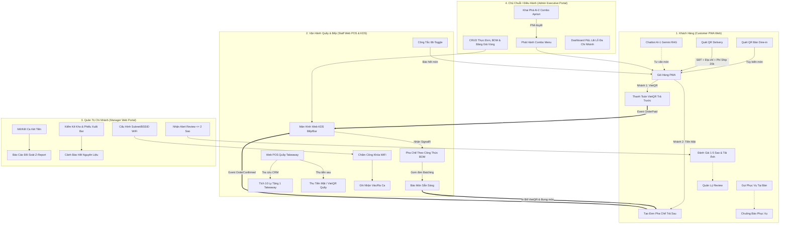

---

# CHƯƠNG 2: ĐẶC TẢ CHI TIẾT 16 QUY TRÌNH NGHIỆP VỤ CỐT LÕI (WF-00 ĐẾN WF-16)

---

## 🔄 WF-00: NHẬN DIỆN KHÁCH HÀNG CRM & KHỞI TẠO PHIÊN LÀM VIỆC PWA

### 1. Mã & Tên quy trình
- **Mã quy trình:** `WF-00`
- **Tên quy trình:** Nhận diện Khách hàng qua Số điện thoại & Khởi tạo Phiên làm việc trên PWA (Customer CRM Phone Identification & Session Initiation).

### 2. Mục đích & Phạm vi nghiệp vụ
Nhận diện khách hàng tức thì thông qua Số điện thoại (Phone Number) khi khách mở ứng dụng web PWA mà không bắt buộc tạo tài khoản mật khẩu phức tạp. Hệ thống tự động liên kết lịch sử gọi món, hiển thị số ly tích lũy Takeaway và nạp các voucher giảm giá cá nhân hóa.

### 3. Tác nhân tham gia (Participating Actors)
- **Khách Hàng (Customer):** Người dùng thao tác trên trình duyệt di động PWA.
- **Client PWA (Next.js 14):** Giao diện tương tác lưu trữ token phiên làm việc.
- **Backend API (.NET 8):** Xử lý kiểm tra định danh, tạo token JWT phiên.
- **Redis Cache & PostgreSQL 16:** Lưu trữ cache hồ sơ khách và dữ liệu CRM quan hệ.

### 4. Điều kiện tiên quyết (Preconditions)
- Khách hàng đã quét mã QR bàn, QR Delivery hoặc truy cập URL chi nhánh.
- Thiết bị khách hàng hỗ trợ trình duyệt web hiện đại (Safari iOS 14+, Chrome Android 90+) và bật LocalStorage.

### 5. Hợp đồng dữ liệu Đầu vào / Đầu ra (Input/Output Data Contracts)
- **Dữ liệu đầu vào (Input Payload):**
  ```json
  {
    "phone": "0901234567",
    "branch_id": "3fa85f64-5717-4562-b3fc-2c963f66afa6"
  }
  ```
- **Dữ liệu đầu ra (Output Response):**
  ```json
  {
    "status_code": 200,
    "success": true,
    "data": {
      "session_token": "eyJhbGciOiJIUzI1NiIsInR5cCI6IkpXVCJ9...",
      "customer_id": "8b5d3c21-1234-5678-9abc-def012345678",
      "phone": "0901234567",
      "full_name": "Nguyễn Văn A",
      "cup_balance": 7,
      "membership_tier": "Standard",
      "available_vouchers": [
        { "code": "CHAOMUNG", "discount_amount": 15000, "min_order": 50000 }
      ]
    }
  }
  ```

### 6. Các bước thực hiện chi tiết (Step-by-Step Execution)
1. **Bước 1 — Mở PWA:** Khách hàng quét mã QR bàn hoặc truy cập liên kết quán. PWA tải trang chủ thực đơn.
2. **Bước 2 — Hiển thị Modal Định Danh:** PWA hiển thị banner thân thiện: *"Nhập SĐT để tích điểm đổi 1 ly miễn phí và nhận voucher ưu đãi"*. Khách nhập số điện thoại (ví dụ: `0901234567`) và bấm "Tiếp tục" (Khách có quyền bấm "Bỏ qua" để duyệt menu với tư cách Khách Vãng Lai `GuestCustomer`).
3. **Bước 3 — Gửi Request Định Danh:** Client PWA gửi `POST /api/v1/crm/customers/identify` kèm số điện thoại và `branch_id`.
4. **Bước 4 — Kiểm Tra & Truy Xuất Dữ Liệu:**
   - Backend truy vấn Redis Cache `crm:customer:{phone}`.
   - Nếu Cache Miss, Backend truy vấn PostgreSQL: `SELECT * FROM Customers WHERE PhoneNumber = @phone`.
   - **Trường hợp khách hàng cũ:** Truy xuất thông tin định danh, số ly `CupBalance`, hạng thẻ và danh sách voucher còn hạn.
   - **Trường hợp khách hàng mới:** Backend tự động khởi tạo bản ghi mới trong bảng `Customers` với `FullName = "Khách Hàng"`, `CupBalance = 0`, `MembershipTier = "Standard"`.
5. **Bước 5 — Cấp Phát Session Token:** Backend sinh mã JWT Session Token (hạn dùng 30 ngày) chứa claims `{ CustomerId, PhoneNumber, Role: "Customer" }`.
6. **Bước 6 — Lưu Trữ Client:** PWA nhận phản hồi, lưu `session_token` vào `localStorage` (`smartfb_cust_token`) và cập nhật thanh tiêu đề chào mừng: *"Xin chào, [Tên Khách] | Đã tích lũy: [X]/10 ly"*.

### 7. Sơ đồ tuần tự chuẩn xác (Mermaid Sequence Diagram)

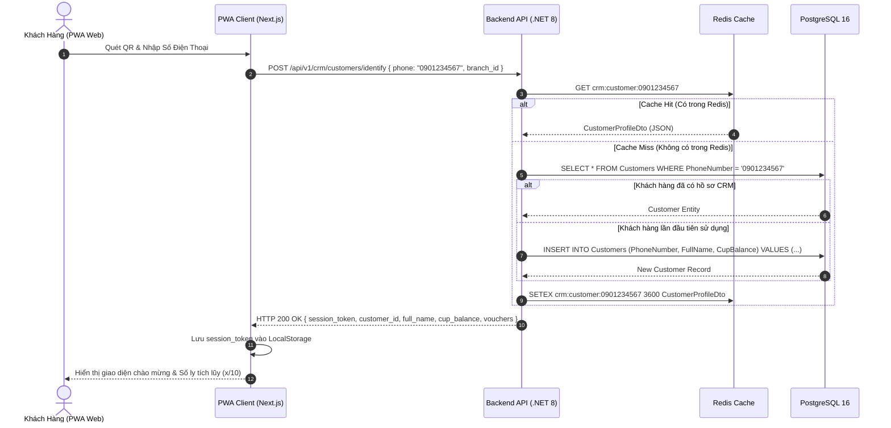

### 8. Xử lý ngoại lệ & Điều kiện hoàn tất (Exceptions & Postconditions)
- **Ngoại lệ 1 (SĐT không đúng định dạng VN):** Backend kiểm tra Regex (`^(0|84)(3|5|7|8|9)[0-9]{8}$`). Nếu sai, trả về HTTP 400 Bad Request: *"Số điện thoại không hợp lệ, vui lòng kiểm tra lại"*.
- **Ngoại lệ 2 (Khách bấm Bỏ qua):** Client cấp một `AnonymousGuestId` tạm thời lưu trong SessionStorage để duy trì giỏ hàng cục bộ mà không gắn CRM.
- **Điều kiện hoàn tất (Postcondition):** Hồ sơ khách hàng được định danh thành công, phiên làm việc sẵn sàng phục vụ cho việc tạo đơn hàng tiếp theo.

---

## 🔄 WF-01A: ĐẶT MÓN TẠI BÀN (DINE-IN) — VIETQR TRẢ TRƯỚC BẮT BUỘC

### 1. Mã & Tên quy trình
- **Mã quy trình:** `WF-01A`
- **Tên quy trình:** Đặt món Tại Bàn (Dine-In) — Nhánh Thanh toán VietQR Trả Trước Bắt Buộc (Dine-In VietQR Pre-Payment Flow).

### 2. Mục đích & Phạm vi nghiệp vụ
Quy trình phục vụ khách hàng ngồi tại bàn chọn phương thức thanh toán trực tuyến qua VietQR. **Quy tắc bất biến:** Đơn hàng chỉ được xác nhận và chuyển xuống màn hình KDS của quầy bar khi hệ thống nhận được Webhook thanh toán thành công từ cổng thanh toán PayOS.

### 3. Tác nhân tham gia (Participating Actors)
- **Khách Hàng Tại Bàn:** Thao tác gọi món trên điện thoại cá nhân.
- **Client PWA Khách Hàng:** Quản lý giỏ hàng và hiển thị mã VietQR động.
- **Backend API & SignalR Hubs:** Xử lý đơn hàng, điều phối sự kiện thời gian thực.
- **Cổng Thanh Toán PayOS (VietQR Gateway):** Xử lý giao dịch ngân hàng và gửi Webhook.
- **Barista / Màn hình Web KDS:** Tiếp nhận đơn hàng sau khi thanh toán và pha chế.
- **Nhân Viên Phục Vụ Quán:** Bưng khay đồ uống ra bàn giao cho khách.

### 4. Điều kiện tiên quyết (Preconditions)
- Khách hàng đã quét mã QR tại bàn có chữ ký bảo mật hợp lệ (`branch_id`, `table_id`, `signature`).
- Bàn đang ở trạng thái hoạt động trên sơ đồ bàn.
- Các món trong giỏ hàng đều có trạng thái `IsAvailable = true`.

### 5. Hợp đồng dữ liệu Đầu vào / Đầu ra (Input/Output Data Contracts)
- **Dữ liệu đầu vào (Tạo đơn VietQR):**
  ```json
  {
    "order_type": "DineIn",
    "branch_id": "3fa85f64-5717-4562-b3fc-2c963f66afa6",
    "table_id": "8b5d3c21-0001-0000-0000-000000000004",
    "payment_method": "VietQR",
    "items": [
      {
        "product_id": "prod-001",
        "size": "M",
        "sweetness_level": 50,
        "ice_level": 100,
        "topping_ids": ["top-01"],
        "quantity": 2,
        "notes": "Ít đá giúp em"
      }
    ]
  }
  ```
- **Vòng đời trạng thái đơn hàng (State Lifecycle):**
  `PendingPayment` ➔ `Paid` ➔ `Confirmed` ➔ `Preparing` ➔ `Ready` ➔ `Served` (hoặc `Completed`).

### 6. Các bước thực hiện chi tiết (Step-by-Step Execution)
1. **Bước 1 — Quét QR & Chọn Món:** Khách quét QR bàn, chọn món, tùy biến đường/đá/size/topping và thêm vào giỏ.
2. **Bước 2 — Chọn Phương Thức VietQR:** Tại trang Thanh toán, khách chọn "Thanh toán Chuyển khoản VietQR (Bếp nhận đơn sau thanh toán)".
3. **Bước 3 — Khởi Tạo Đơn Hàng:** PWA gửi `POST /api/v1/orders`. Backend tạo bản ghi đơn hàng với `OrderStatus = "PendingPayment"`, gọi PayOS API sinh mã VietQR động với `amount = TotalAmount` và nội dung chuyển khoản `memo = ORDER_{order_id}`.
4. **Bước 4 — Hiển Thị Mã VietQR:** PWA hiển thị mã QR kèm bộ đếm ngược 10 phút và nút mở sâu ứng dụng ngân hàng (Banking App Deep Link).
5. **Bước 5 — Khách Chuyển Khoản:** Khách dùng App Ngân hàng quét VietQR và xác nhận chuyển tiền.
6. **Bước 6 — Xử Lý Webhook PayOS:** PayOS gửi Webhook `POST /api/v1/payments/payos-webhook` kèm chữ ký HMAC-SHA256. Backend kiểm tra chữ ký, cập nhật đơn hàng sang `Paid`, tự động chuyển sang `Confirmed` và gán thời gian `PaidAt = NOW()`.
7. **Bước 7 — Bắn Tín Hiệu Xuống KDS:** Backend phát sự kiện `OrderPaid` qua SignalR `KitchenHub` tới toàn bộ màn hình KDS của chi nhánh đó. KDS phát âm thanh chuông và thẻ đơn xuất hiện ở cột "Chờ Pha Chế".
8. **Bước 8 — Pha Chế & Chuyển Trạng Thái:** Barista bấm "Bắt đầu pha chế" (`Preparing`). PWA khách cập nhật trạng thái thời gian thực.
9. **Bước 9 — Hoàn Tất Pha Chế:** Barista bấm "Món sẵn sàng" (`Ready`). Hệ thống phát thông báo rung/chuông đến PWA của khách.
10. **Bước 10 — Phục Vụ Tại Bàn:** Nhân viên bưng nước ra bàn và bấm "Đã phục vụ" (`Served`). Đơn hàng hoàn tất.

### 7. Sơ đồ tuần tự chuẩn xác (Mermaid Sequence Diagram)

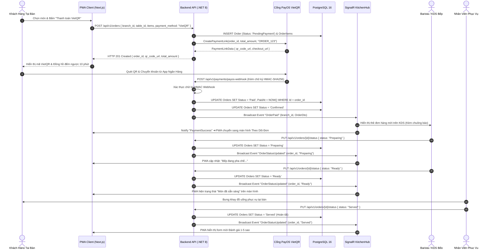

### 8. Xử lý ngoại lệ & Điều kiện hoàn tất (Exceptions & Postconditions)
- **Ngoại lệ 1 (Quá 10 phút không thanh toán):** Hangfire Cron Job tự động quét đơn `PendingPayment` quá hạn 10 phút, chuyển trạng thái sang `Cancelled` và giải phóng bàn.
- **Ngoại lệ 2 (Webhook đến chậm hoặc lỗi mạng):** PWA duy trì cơ chế Polling dự phòng mỗi 3 giây gọi `GET /api/v1/orders/{id}/status`. Backend chủ động truy vấn PayOS API để cập nhật trạng thái nếu webhook bị nghẽn.
- **Điều kiện hoàn tất:** Đơn hàng được thanh toán 100%, pha chế chuẩn định lượng và phục vụ tận bàn khách hàng.

---

## 🔄 WF-01B: ĐẶT MÓN TẠI BÀN (DINE-IN) — TIỀN MẶT TRẢ SAU & HÓA ĐƠN IN VIETQR

### 1. Mã & Tên quy trình
- **Mã quy trình:** `WF-01B`
- **Tên quy trình:** Đặt món Tại Bàn (Dine-In) — Nhánh Tiền Mặt Trả Sau & Hóa Đơn In Mã VietQR (Dine-In Cash Post-Payment Flow).

### 2. Mục đích & Phạm vi nghiệp vụ
Quy trình phục vụ khách hàng ngồi tại bàn muốn thanh toán sau bằng tiền mặt hoặc chuyển khoản linh hoạt sau khi nhận món. **Quy tắc cốt lõi:** Đơn hàng chuyển thẳng xuống KDS bếp ngay lập tức (`Confirmed`), nhân viên pha chế và bưng món ra bàn **KÈM THEO HÓA ĐƠN CÓ IN SẴN MÃ VIETQR ĐỘNG**, khách có thể trả tiền mặt trực tiếp hoặc quét mã VietQR in trên tờ hóa đơn.

### 3. Tác nhân tham gia (Participating Actors)
- **Khách Hàng Tại Bàn:** Chọn món và chọn hình thức thanh toán sau.
- **Barista / KDS Bếp & Máy in nhiệt ESC/POS:** Nhận đơn ngay, pha chế và in hóa đơn tạm tính kèm mã QR.
- **Nhân Viên Phục Vụ / Thu Ngân:** Bưng nước kèm hóa đơn, nhận tiền mặt hoặc hỗ trợ quét VietQR.
- **Backend API & SignalR Hubs:** Xử lý cập nhật trạng thái và đối soát két ca.

### 4. Điều kiện tiên quyết (Preconditions)
- Khách quét đúng mã QR bàn hợp lệ.
- Máy in hóa đơn tại quầy bar đang online và sẵn sàng in lệnh ESC/POS.

### 5. Hợp đồng dữ liệu Đầu vào / Đầu ra (Input/Output Data Contracts)
- **Vòng đời trạng thái đơn hàng (State Lifecycle):**
  `Confirmed` ➔ `Preparing` ➔ `Ready` ➔ `Served` ➔ `PendingPayment` ➔ `Paid` (hoặc `Completed`).

### 6. Các bước thực hiện chi tiết (Step-by-Step Execution)
1. **Bước 1 — Chọn Món & Chọn Tiền Mặt:** Khách duyệt menu trên PWA, chọn món và chọn "Thanh toán Tiền mặt (Trả sau khi nhận món)".
2. **Bước 2 — Khởi Tạo Đơn Xác Nhận Ngay:** PWA gửi `POST /api/v1/orders` với `PaymentMethod = "Cash"`. Backend khởi tạo đơn hàng với `OrderStatus = "Confirmed"` ngay lập tức mà không chờ thanh toán.
3. **Bước 3 — Bắn Đơn Xuống KDS Bếp:** Backend phát sự kiện `OrderConfirmed` qua SignalR `KitchenHub`. Thẻ đơn hàng xuất hiện tức thì trên màn hình KDS.
4. **Bước 4 — Pha Chế:** Barista bấm "Bắt đầu pha chế" (`Preparing`), xem công thức BOM và thực hiện đồ uống.
5. **Bước 5 — In Hóa Đơn Tạm Tính Kèm VietQR:** Khi pha xong, Barista bấm "Sẵn sàng" (`Ready`). Hệ thống tự động gửi lệnh in hóa đơn nhiệt ESC/POS tại quầy. Trên hóa đơn in đầy đủ: Danh sách món, Tổng tiền và **Mã VietQR động chứa số tiền chính xác và cú pháp `ORDER_{order_id}`**.
6. **Bước 6 — Phục Vụ Kèm Hóa Đơn:** Nhân viên bưng khay đồ uống ra bàn, đặt đồ uống cùng tờ hóa đơn có in mã VietQR lên bàn khách và bấm `Served`. Hệ thống chuyển trạng thái đơn sang `PendingPayment`.
7. **Bước 7 — Khách Thanh Toán:**
   - **Cách 1 (Trả tiền mặt):** Khách đưa tiền mặt cho nhân viên. Nhân viên cầm tiền về quầy thu ngân, bấm "Xác nhận thu tiền mặt" trên Web Staff Portal.
   - **Cách 2 (Quét VietQR trên Bill):** Khách mở Mobile Banking quét mã VietQR in trên tờ hóa đơn. PayOS xác nhận tiền vào tài khoản và bắn Webhook tự động cập nhật đơn sang `Paid`.
8. **Bước 8 — Hoàn Tất Đơn:** Đơn hàng chuyển sang `Paid`/`Completed`. Hệ thống ghi nhận doanh thu vào ca bán hàng hiện tại.

### 7. Sơ đồ tuần tự chuẩn xác (Mermaid Sequence Diagram)

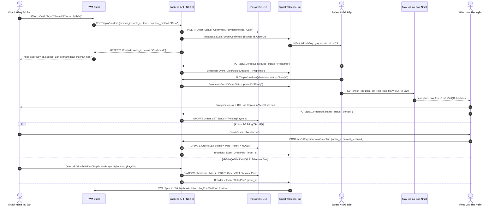

### 8. Xử lý ngoại lệ & Điều kiện hoàn tất (Exceptions & Postconditions)
- **Ngoại lệ 1 (Khách không đủ tiền mặt):** Nhân viên hướng dẫn khách dùng Mobile Banking quét mã VietQR có sẵn trên tờ hóa đơn để chuyển khoản mà không cần đổi trạng thái đơn thủ công.
- **Ngoại lệ 2 (Kẹt giấy máy in hóa đơn):** Nhân viên có thể mở lại hóa đơn điện tử trên Web Staff Portal và cho khách quét mã VietQR hiển thị trực tiếp trên màn hình máy POS/Tablet.
- **Điều kiện hoàn tất:** Đơn hàng được phục vụ trọn vẹn, tiền mặt hoặc chuyển khoản được đối soát đầy đủ vào két ca làm việc.

---

## 🔄 WF-02: ĐẶT HÀNG GIAO TẬN NƠI (QR DELIVERY) — PHÍ SHIP CỐ ĐỊNH 20K & VIETQR 100%

### 1. Mã & Tên quy trình
- **Mã quy trình:** `WF-02`
- **Tên quy trình:** Đặt hàng Giao tận nơi (QR Delivery) — Phí Ship Cố Định 20k & 100% VietQR Trả Trước (Delivery Order Workflow).

### 2. Mục đích & Phạm vi nghiệp vụ
Quy trình cho phép khách hàng đặt đồ uống giao tận nhà thông qua việc quét mã QR Delivery trên poster, fanpage, standee hoặc truy cập đường link giao hàng. **Quy tắc cốt lõi:** Bắt buộc nhập Số điện thoại và Địa chỉ giao hàng; Tự động cộng **Phí ship cố định 20.000 VNĐ**; **100% Thanh toán trước qua VietQR** (Tuyệt đối không áp dụng tiền mặt/COD); Bếp nhận đơn có huy hiệu nổi bật `[DELIVERY]`.

### 3. Tác nhân tham gia (Participating Actors)
- **Khách Hàng Đặt Tại Nhà:** Nhập địa chỉ, chọn món và chuyển khoản VietQR.
- **Cổng Thanh Toán PayOS:** Tiếp nhận thanh toán chuyển khoản.
- **Barista / KDS Bếp:** Nhận đơn có nhãn `[DELIVERY]`, pha chế và đóng gói cẩn thận.
- **Nhân Viên Giao Hàng (Shipper Quán / Nội Bộ):** Giao hàng theo địa chỉ ghi trên đơn.

### 4. Điều kiện tiên quyết (Preconditions)
- Địa chỉ nhận hàng nằm trong phạm vi giao hàng của chi nhánh (bán kính <= 10km).
- Khách hàng có tài khoản ngân hàng hỗ trợ quét mã VietQR.

### 5. Hợp đồng dữ liệu Đầu vào / Đầu ra (Input/Output Data Contracts)
- **Dữ liệu đầu vào (Tạo đơn Delivery):**
  ```json
  {
    "order_type": "Delivery",
    "branch_id": "3fa85f64-5717-4562-b3fc-2c963f66afa6",
    "recipient_name": "Trần Thị B",
    "recipient_phone": "0987654321",
    "delivery_address": "Số 123 Đường Nguyễn Huệ, Phường Bến Nghé, Quận 1, TP.HCM",
    "delivery_notes": "Giao trước 11h30 giúp mình, gọi điện trước khi đến",
    "delivery_fee": 20000,
    "payment_method": "VietQR",
    "items": [
      { "product_id": "prod-003", "size": "L", "quantity": 3 }
    ]
  }
  ```
- **Vòng đời trạng thái đơn hàng (State Lifecycle):**
  `PendingPayment` ➔ `Paid` ➔ `Confirmed` ➔ `Preparing` ➔ `Ready` ➔ `Completed`.

### 6. Các bước thực hiện chi tiết (Step-by-Step Execution)
1. **Bước 1 — Quét QR Delivery:** Khách quét mã QR Delivery từ standee/fanpage hoặc mở đường link delivery.
2. **Bước 2 — Nhập Thông Tin Giao Hàng:** Form đặt hàng bắt buộc khách nhập: Họ tên người nhận, Số điện thoại (kiểm tra Regex 10 số) và Địa chỉ giao hàng chi tiết.
3. **Bước 3 — Chọn Món & Tự Động Tính Phí Ship:** Khách chọn đồ uống. Hệ thống tự động thêm dòng `Phí giao hàng: 20.000 VNĐ` vào giỏ hàng (`Total = Sum(Items) + 20000`).
4. **Bước 4 — Thanh Toán VietQR 100%:** Khách chọn thanh toán VietQR. Backend tạo đơn `OrderType = "Delivery"`, `OrderStatus = "PendingPayment"` và sinh mã VietQR PayOS.
5. **Bước 5 — Xác Nhận Thanh Toán:** Khách chuyển khoản thành công. PayOS Webhook kích hoạt Backend chuyển trạng thái sang `Paid` và `Confirmed`.
6. **Bước 6 — Đẩy Đơn Sang KDS Với Badge [DELIVERY]:** Backend phát sự kiện SignalR tới KDS quầy bar. Thẻ đơn hiển thị nổi bật với huy hiệu màu xanh lục **[DELIVERY]** kèm số điện thoại và địa chỉ giao hàng.
7. **Bước 7 — Pha Chế & Đóng Gói Niêm Phong:** Barista pha chế (`Preparing`), dán tem nắp ly chống tràn, đóng túi và in tem địa chỉ dán ngoài túi hàng (`Ready`).
8. **Bước 8 — Bàn Giao & Vận Chuyển:** Nhân viên giao hàng quán nhận gói đồ uống, vận chuyển đến địa chỉ khách hàng.
9. **Bước 9 — Hoàn Tất Giao Hàng:** Sau khi trao tận tay khách, nhân viên giao hàng xác nhận "Đã giao thành công" trên hệ thống. Đơn hàng chuyển sang `Completed`.

### 7. Sơ đồ tuần tự chuẩn xác (Mermaid Sequence Diagram)

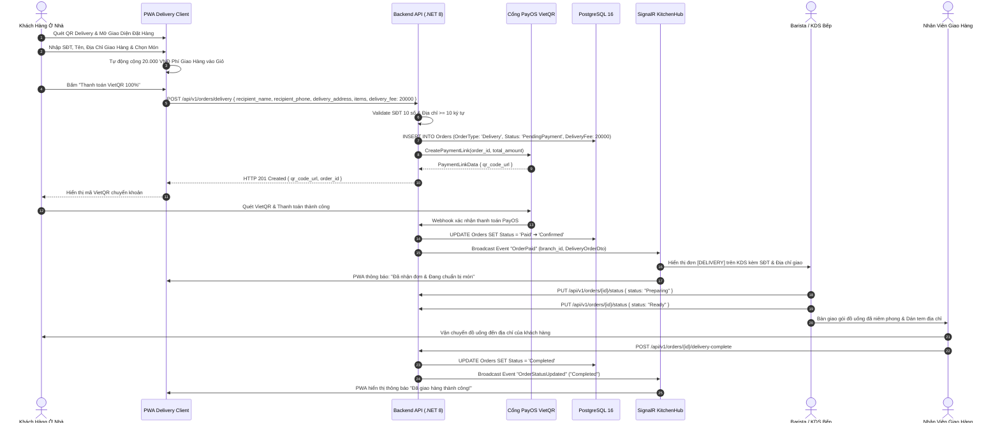

### 8. Xử lý ngoại lệ & Điều kiện hoàn tất (Exceptions & Postconditions)
- **Ngoại lệ 1 (Địa chỉ để trống hoặc rác):** Backend từ chối với mã lỗi 422 Unprocessable Entity nếu địa chỉ dưới 10 ký tự hoặc không có thông tin đường/phường.
- **Ngoại lệ 2 (Khách yêu cầu trả tiền mặt khi nhận hàng):** Hệ thống chặn ngay từ giao diện và backend, thông báo rõ: *"Dịch vụ Delivery chỉ chấp nhận thanh toán trước qua VietQR để bảo đảm quyền lợi giao nhận"*.
- **Điều kiện hoàn tất:** Đơn hàng được thanh toán trước 100%, đóng gói niêm phong và giao tận tay khách hàng thành công.

---

## 🔄 WF-03: KHÁCH MUA MANG VỀ TẠI QUẦY (TAKEAWAY STAFF POS) — TÍCH 10 LY TẶNG 1 & THU SAU

### 1. Mã & Tên quy trình
- **Mã quy trình:** `WF-03`
- **Tên quy trình:** Khách Mua Mang Về Tại Quầy (Takeaway Staff POS Flow) — Tích 10 Ly Tặng 1 Ly Miễn Phí & Thu Tiền Sau Khi Nhận Món.

### 2. Mục đích & Phạm vi nghiệp vụ
Quy trình phục vụ khách mua mang đi trực tiếp tại quầy thu ngân. **Quy tắc cốt lõi:** Khách **KHÔNG QUÉT QR**; Nhân viên thu ngân thao tác 100% trên giao diện **Web POS Quầy** `(staff)/pos`; Tra cứu CRM bằng SĐT để tích lũy; **Chương trình Loyalty 10 ly = tặng 1 ly miễn phí CHỈ áp dụng cho đơn Takeaway**; Khách nhận đồ uống và **Thanh toán SAU khi nhận** (Tiền mặt tự tính tiền thối hoặc VietQR quầy).

### 3. Tác nhân tham gia (Participating Actors)
- **Khách Hàng Mua Mang Về:** Đến quầy order trực tiếp.
- **Nhân Viên Thu Ngân / Web POS Quầy:** Tra cứu CRM, nhập món, áp dụng ly miễn phí, thu tiền sau.
- **Barista / KDS Bếp:** Pha chế đồ uống mang đi và đóng gói.
- **Máy In Hóa Đơn POS:** In hóa đơn bán lẻ giao cho khách.

### 4. Điều kiện tiên quyết (Preconditions)
- Thu ngân đã đăng nhập hệ thống và ca làm việc (`Shift`) đang ở trạng thái `Open`.

### 5. Hợp đồng dữ liệu Đầu vào / Đầu ra (Input/Output Data Contracts)
- **Quy tắc Loyalty:** Mỗi ly tiêu chuẩn trong đơn Takeaway cộng +1 vào `CupBalance`. Khi `CupBalance >= 10`, khách có quyền đổi 1 ly miễn phí (giảm 100% giá 1 ly tiêu chuẩn có giá trị cao nhất trong đơn, không miễn phí topping).
- **Vòng đời trạng thái đơn hàng (State Lifecycle):**
  `Confirmed` ➔ `Preparing` ➔ `Ready` ➔ `Paid` (hoặc `Completed`).

### 6. Các bước thực hiện chi tiết (Step-by-Step Execution)
1. **Bước 1 — Khách Đến Quầy Gọi Món:** Khách đọc món cần mua và cung cấp Số điện thoại cho Thu ngân.
2. **Bước 2 — Tra Cứu CRM Tại Quầy:** Thu ngân nhập SĐT vào ô tra cứu trên Web POS:
   - *Khách cũ:* Hiển thị Tên, Hạng thẻ và số ly hiện tại (ví dụ: `10/10 ly`). Nút "Đổi 1 ly miễn phí" sáng lên.
   - *Khách mới:* Thu ngân nhập nhanh Tên khách hàng, hệ thống tự tạo hồ sơ CRM.
3. **Bước 3 — Chọn Món & Áp Dụng Ly Miễn Phí:** Thu ngân chọn các món theo yêu cầu. Nếu khách đủ 10 ly và đồng ý đổi thưởng, Thu ngân bấm "Đổi 1 Ly Free". Hệ thống trừ 100% giá của 1 ly tiêu chuẩn trong giỏ.
4. **Bước 4 — Gửi Đơn Xuống Bếp:** Thu ngân bấm "Gửi Bếp". Đơn hàng tạo với `OrderType = "TakeAway"`, `OrderStatus = "Confirmed"` và đẩy qua SignalR xuống KDS bếp.
5. **Bước 5 — Pha Chế & Đóng Túi:** Barista pha chế (`Preparing`), dán tem mang đi và bấm `Ready`.
6. **Bước 6 — Thu Tiền Sau Khi Nhận Món:** Thu ngân nhận đồ uống tại quầy, thông báo tổng tiền cho khách:
   - *Trả Tiền mặt:* Thu ngân nhập số tiền khách đưa (ví dụ: Đơn 75k, khách đưa 100k). Hệ thống hiển thị tiền thối 25k và mở két tiền.
   - *Trả VietQR:* Thu ngân bấm "Xuất VietQR", màn hình phụ hiển thị mã QR để khách quét chuyển khoản.
7. **Bước 7 — Hoàn Tất & Cập Nhật CRM:** Thu ngân bấm "Hoàn tất đơn & In hóa đơn". Đơn hàng chuyển sang `Paid`/`Completed`. Hệ thống tự động cập nhật số ly tích lũy mới vào CRM: `CupBalance = (CupBalance - (Đổi ? 10 : 0) + Số Ly Mua Mới)`.

### 7. Sơ đồ tuần tự chuẩn xác (Mermaid Sequence Diagram)

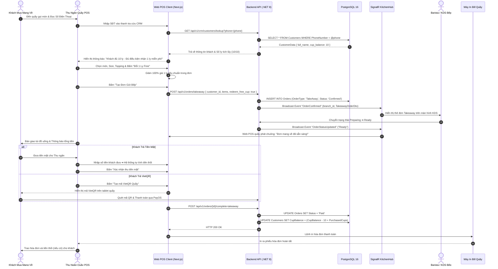

### 8. Xử lý ngoại lệ & Điều kiện hoàn tất (Exceptions & Postconditions)
- **Ngoại lệ 1 (Đơn có nhiều ly giá khác nhau khi đổi ly miễn phí):** Hệ thống tự động chọn ly tiêu chuẩn có giá tiền cao nhất để miễn phí nhằm tối ưu lợi ích cho khách.
- **Ngoại lệ 2 (Khách hủy đơn khi bếp đã làm):** Bắt buộc Quản lý chi nhánh (`BranchManager`) nhập mật khẩu phê duyệt hủy món và ghi nhận lý do vào biên bản hủy.
- **Điều kiện hoàn tất:** Đơn hàng được pha chế, giao túi tận tay, thanh toán đầy đủ và số ly tích lũy Takeaway được cập nhật chính xác trong CRM.

---

## 🔄 WF-04: CHẤM CÔNG KHÓA MẠNG WIFI CHI NHÁNH (WIFI-LOCKED ATTENDANCE)

### 1. Mã & Tên quy trình
- **Mã quy trình:** `WF-04`
- **Tên quy trình:** Chấm Công Khóa Mạng WiFi Chi Nhánh (WiFi-Locked Attendance Flow).

### 2. Mục đích & Phạm vi nghiệp vụ
Quy trình ghi nhận thời gian vào ca/ra ca của nhân viên chi nhánh một cách minh bạch, ngăn chặn gian lận chấm công từ xa. **Quy tắc cốt lõi:** Loại bỏ hoàn toàn định vị GPS 50m (sai số cao trong nhà) và QR động 30 giây; **Xác thực 2 yếu tố bắt buộc:**
1. Thiết bị đang kết nối đúng mạng WiFi của chi nhánh (Kiểm tra Client IP thuộc dải Subnet được cấp phép và BSSID Access Point của quán).
2. Mã số nhân viên (`EmployeeCode`) hợp lệ, đang hoạt động và được phân công tại chi nhánh đó.

### 3. Tác nhân tham gia (Participating Actors)
- **Nhân Viên Ca Trực (Staff):** Truy cập Web Staff Portal để chấm công.
- **Backend Attendance Service:** Kiểm tra thông tin mạng và định danh nhân sự.
- **Quản Lý Chi Nhánh (Branch Manager):** Giám sát nhật ký chấm công thời gian thực qua SignalR `NotificationHub`.

### 4. Điều kiện tiên quyết (Preconditions)
- Quản lý chi nhánh đã cấu hình danh sách `AllowedSubnets` và `AllowedBSSIDs` trong bảng `BranchWifiConfigs`.
- Nhân viên đã kết nối thiết bị cá nhân hoặc thiết bị quầy vào đúng mạng WiFi quán.

### 5. Hợp đồng dữ liệu Đầu vào / Đầu ra (Input/Output Data Contracts)
- **Dữ liệu đầu vào (Check-in/Check-out):**
  ```json
  {
    "employee_code": "NV-0042",
    "branch_id": "3fa85f64-5717-4562-b3fc-2c963f66afa6",
    "action_type": "CHECK_IN"
  }
  ```
- **Dữ liệu đầu ra (Thành công):**
  ```json
  {
    "status_code": 200,
    "success": true,
    "data": {
      "attendance_id": "att-12345",
      "employee_name": "Lê Văn C",
      "action_type": "CHECK_IN",
      "check_in_time": "2026-08-22T07:58:15Z",
      "verification_method": "WIFI_LOCKED",
      "message": "Chấm công vào ca thành công!"
    }
  }
  ```

### 6. Các bước thực hiện chi tiết (Step-by-Step Execution)
1. **Bước 1 — Kết Nối WiFi Quán:** Nhân viên đến quán làm việc, bật WiFi trên điện thoại/laptop và kết nối vào mạng WiFi nội bộ của quán cà phê.
2. **Bước 2 — Mở Trang Chấm Công:** Nhân viên truy cập đường dẫn `(staff)/attendance` trên trình duyệt web.
3. **Bước 3 — Nhập Mã Nhân Viên & Chọn Hành Động:** Nhân viên nhập Mã số nhân viên (ví dụ: `NV-0042`) và bấm "Check-in Vào Ca" (hoặc "Check-out Hết Ca").
4. **Bước 4 — Trích Xuất & Đối Soát Mạng:**
   - Backend trích xuất địa chỉ IP Client (`HttpContext.Connection.RemoteIpAddress`) và Network Metadata từ Request Header.
   - Backend truy vấn bảng `BranchWifiConfigs` của `branch_id`.
   - Đối chiếu xem Client IP có thuộc dải Subnet cho phép (ví dụ: `192.168.1.0/24`) và BSSID Access Point của quán hay không.
5. **Bước 5 — Kiểm Tra Hồ Sơ Nhân Viên:** Backend kiểm tra `EmployeeCode` có tồn tại, trạng thái `Active` và có thuộc chi nhánh này không.
6. **Bước 6 — Ghi Nhận Bản Ghi Chấm Công:**
   - Nếu hợp lệ: Tạo bản ghi mới trong bảng `Attendances` với `Status = "Success"`, `Method = "WIFI_LOCKED"`, `Timestamp = NOW()`.
   - Backend phát sự kiện `StaffCheckedIn` qua SignalR `NotificationHub` tới Quản lý chi nhánh.
   - Màn hình nhân viên hiển thị thông báo thành công màu xanh kèm thời gian chính xác.

### 7. Sơ đồ tuần tự chuẩn xác (Mermaid Sequence Diagram)

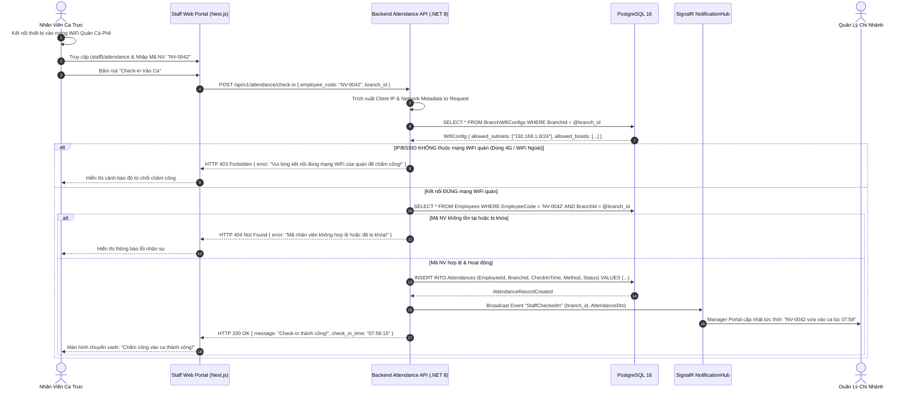

### 8. Xử lý ngoại lệ & Điều kiện hoàn tất (Exceptions & Postconditions)
- **Ngoại lệ 1 (Nhân viên dùng 4G/5G hoặc Fake IP):** Backend kiểm tra IP Gateway không khớp với danh sách Subnet chi nhánh, lập tức trả về HTTP 403 Forbidden và ghi log cảnh báo.
- **Ngoại lệ 2 (Router quán bị reset đổi IP):** Quản lý chi nhánh có quyền cập nhật nhanh Subnet mới trên Manager Portal mà không cần khởi động lại server.
- **Điều kiện hoàn tất:** Dữ liệu vào ca/ra ca được ghi nhận chính xác, phục vụ tính lương tự động cuối tháng.

---

## 🔄 WF-05: PHA CHẾ, ĐIỀU PHỐI & GOM MÓN THÔNG MINH TRÊN KITCHEN DISPLAY SYSTEM (WEB KDS)

### 1. Mã & Tên quy trình
- **Mã quy trình:** `WF-05`
- **Tên quy trình:** Pha Chế, Điều Phối & Gom Món Thông Minh Trên Kitchen Display System (Web KDS Real-Time Dispatch & Batching Flow).

### 2. Mục đích & Phạm vi nghiệp vụ
Tối ưu hóa năng suất quầy bar thông qua màn hình KDS Full-screen hoạt động thời gian thực qua SignalR WebSocket. Hỗ trợ chế độ xem theo Đơn hàng (Order Card View) và chế độ Gom món thông minh (Item Batching View) để Barista pha chế nhiều ly cùng loại đồng thời.

### 3. Tác nhân tham gia (Participating Actors)
- **Barista Quầy Bar:** Thao tác trên Smart TV / iPad quầy pha chế.
- **SignalR KitchenHub:** Điều phối luồng sự kiện thời gian thực 2 chiều.
- **Inventory Engine:** Tự động trừ tồn kho nguyên liệu theo BOM khi món hoàn thành.

### 4. Điều kiện tiên quyết (Preconditions)
- Màn hình KDS đã kết nối vào phòng `branch_{branch_id}_kds` trên SignalR `KitchenHub`.

### 5. Hợp đồng dữ liệu Đầu vào / Đầu ra (Input/Output Data Contracts)
- **Sự kiện nhận đơn KDS:**
  ```json
  {
    "event": "NewKitchenOrder",
    "data": {
      "order_id": "ord-999",
      "order_type": "DineIn",
      "table_name": "Bàn 04",
      "channel_badge": "DINE_IN",
      "created_at": "2026-08-22T08:30:00Z",
      "items": [
        { "item_id": "item-1", "product_name": "Cà phê muối", "size": "M", "sweetness": 50, "ice": 100, "quantity": 2 }
      ]
    }
  }
  ```

### 6. Các bước thực hiện chi tiết (Step-by-Step Execution)
1. **Bước 1 — Nhận Đơn Thời Gian Thực:** Khi đơn hàng đủ điều kiện (`Paid` đối với VietQR, `Confirmed` đối với Cash/Takeaway), Backend phát sự kiện `NewKitchenOrder` qua SignalR.
2. **Bước 2 — Hiển Thị & Báo Chuông:** Màn hình KDS phát chuông "Ting-Ting" và thẻ đơn xuất hiện ở cột "Chờ Pha Chế" với mã màu trực quan (Xanh lá: mới, Vàng: chờ > 5 phút, Đỏ: chờ > 10 phút).
3. **Bước 3 — Chế Độ Gom Món Thông Minh (Batching):** Barista chuyển sang tab "Gom Món". Hệ thống tự động tổng hợp: *"Cần pha chế 6 ly Trà Đào Cam Sả (Bàn 2: 2 ly, Bàn 5: 1 ly, Takeaway: 3 ly)"*.
4. **Bước 4 — Bắt Đầu Pha Chế:** Barista chạm vào nút "Bắt đầu" trên thẻ đơn hoặc nhóm món. Trạng thái chuyển sang `Preparing`. PWA của khách cập nhật trạng thái tương ứng.
5. **Bước 5 — Xem Công Thức BOM:** Chạm vào từng món để xem định mức nguyên liệu chuẩn (ví dụ: `25g Cà phê`, `30ml Sữa đặc`).
6. **Bước 6 — Hoàn Tất Pha Chế:** Barista bấm "Sẵn sàng" (`Ready`). Thẻ đơn chuyển sang cột "Đã Xong / Chờ Phục Vụ". Hệ thống kích hoạt trừ tồn kho nguyên liệu theo BOM và bắn thông báo chuông về PWA của khách.

### 7. Sơ đồ tuần tự chuẩn xác (Mermaid Sequence Diagram)

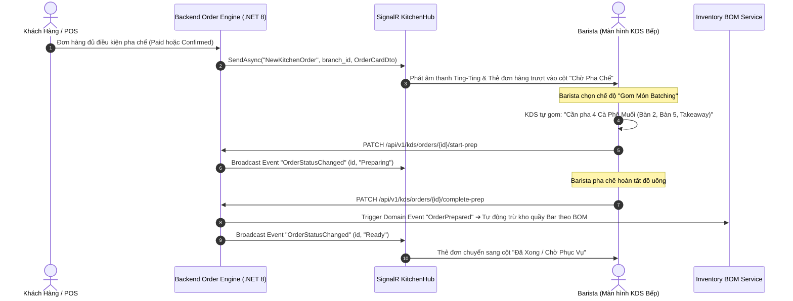

### 8. Xử lý ngoại lệ & Điều kiện hoàn tất (Exceptions & Postconditions)
- **Ngoại lệ 1 (Mất kết nối WebSocket):** KDS Client tự động Reconnect với chiến lược lũy thừa giãn cách (Exponential Backoff: 2s, 4s, 8s...) và tự động đồng bộ lại danh sách đơn chờ.
- **Điều kiện hoàn tất:** Đơn hàng được pha chế chính xác, nguyên liệu được trừ tồn kho tự động.

---

## 🔄 WF-06: KHÓA MÓN HẾT HÀNG TỨC THÌ TỪ QUẦY BAR (86-TOGGLE OUT-OF-STOCK)

### 1. Mã & Tên quy trình
- **Mã quy trình:** `WF-06`
- **Tên quy trình:** Khóa Món Hết Hàng Tức Thì Từ Quầy Bar (86-Toggle Out-of-Stock Synchronization Flow).

### 2. Mục đích & Phạm vi nghiệp vụ
Cho phép Barista tại quầy hoặc Admin từ xa lập tức gạt công tắc khóa món ăn khi cạn kiệt nguyên liệu. Trạng thái hết hàng lập tức được đồng bộ qua Redis và SignalR tới toàn bộ khách hàng đang mở QR Menu PWA trong quán trong thời gian dưới 1 giây.

### 3. Tác nhân tham gia (Participating Actors)
- **Barista Quầy Bar / Admin:** Người gạt công tắc khóa món trên KDS hoặc Admin Portal.
- **Redis Cache & SignalR KitchenHub:** Đồng bộ trạng thái tức thời.
- **PWA Khách Hàng (Tất cả bàn):** Giao diện tự động cập nhật mờ món và khóa nút giỏ hàng.

### 4. Điều kiện tiên quyết (Preconditions)
- Nhân viên có quyền thao tác quản lý món tại chi nhánh.

### 5. Hợp đồng dữ liệu Đầu vào / Đầu ra (Input/Output Data Contracts)
- **Dữ liệu đầu vào:**
  ```json
  {
    "branch_id": "3fa85f64-5717-4562-b3fc-2c963f66afa6",
    "product_id": "prod-tra-dao",
    "is_available": false
  }
  ```

### 6. Các bước thực hiện chi tiết (Step-by-Step Execution)
1. **Bước 1 — Phát Hiện Hết Nguyên Liệu:** Barista nhận thấy nguyên liệu pha chế của món đã hết (ví dụ: hết đào ngâm).
2. **Bước 2 — Gạt Toggle Khóa Món:** Barista mở tab "Tồn Món" trên Web KDS, tìm món "Trà Đào Cam Sả" và gạt công tắc sang `Hết Hàng (86)`.
3. **Bước 3 — Cập Nhật Database & Redis:** Backend nhận request, cập nhật `BranchItemAvailabilities.IsAvailable = false` và cập nhật Redis Hash `branch:{branch_id}:out_of_stock`.
4. **Bước 4 — Phát Sóng Sự Kiện Qua SignalR:** Backend phát sự kiện `Item86Toggled` qua SignalR `KitchenHub` tới các kênh liên quan và PWA thực khách.
5. **Bước 5 — Cập Nhật UI Khách Hàng:** Toàn bộ điện thoại khách hàng đang mở menu tự động cập nhật: Món bị làm mờ, xuất hiện nhãn "Tạm Hết Món" và nút thêm vào giỏ bị vô hiệu hóa ngay lập tức.

### 7. Sơ đồ tuần tự chuẩn xác (Mermaid Sequence Diagram)

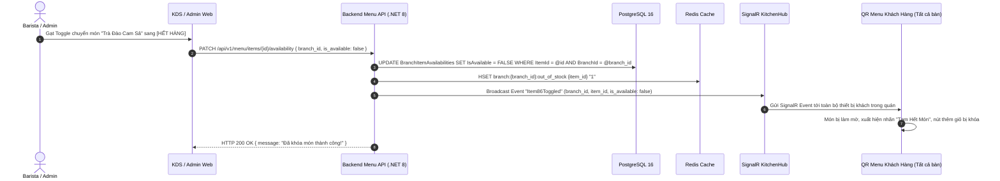

### 8. Xử lý ngoại lệ & Điều kiện hoàn tất (Exceptions & Postconditions)
- **Ngoại lệ (Khách đang đặt món đúng tích tắc khóa món):** Database sử dụng giao dịch kiểm tra tính khả dụng (`Concurrency Check`). Nếu món vừa bị khóa, Backend từ chối thanh toán và thông báo: *"Món Trà Đào vừa tạm hết, vui lòng chọn món khác"*.
- **Điều kiện hoàn tất:** Món ăn bị khóa hoàn toàn trên thực đơn chi nhánh, ngăn chặn triệt để tình trạng đặt nhầm món hết hàng.

---

## 🔄 WF-07: TIẾP NHẬN & XỬ LÝ YÊU CẦU GỌI PHỤC VỤ TẠI BÀN

### 1. Mã & Tên quy trình
- **Mã quy trình:** `WF-07`
- **Tên quy trình:** Tiếp Nhận & Xử Lý Yêu Cầu Gọi Phục Vụ Tại Bàn (Table Service Calling Alert & Resolution Flow).

### 2. Mục đích & Phạm vi nghiệp vụ
Cho phép khách hàng đang ngồi tại bàn bấm chuông phát tín hiệu hỗ trợ kèm nhu cầu cụ thể (Lấy nước lọc, Dọn bàn, Khăn giấy...). Hệ thống phát cảnh báo âm thanh và hiển thị banner nhấp nháy trên Web Staff POS và Web KDS của nhân viên cho đến khi được xử lý.

### 3. Tác nhân tham gia (Participating Actors)
- **Khách Hàng Tại Bàn:** Thao tác gọi chuông trên PWA.
- **Nhân Viên Phục Vụ / Quầy POS:** Tiếp nhận chuông báo và đến bàn phục vụ.
- **SignalR NotificationHub:** Truyền tải cảnh báo thời gian thực.

### 4. Điều kiện tiên quyết (Preconditions)
- Khách hàng đang ngồi tại bàn có số bàn hợp lệ.

### 5. Hợp đồng dữ liệu Đầu vào / Đầu ra (Input/Output Data Contracts)
- **Dữ liệu đầu vào:**
  ```json
  {
    "table_id": "8b5d3c21-0001-0000-0000-000000000004",
    "request_type": "WATER",
    "notes": "Cho xin 2 ly nước lọc"
  }
  ```

### 6. Các bước thực hiện chi tiết (Step-by-Step Execution)
1. **Bước 1 — Bấm Chuông Trên PWA:** Khách bấm biểu tượng Chuông trên PWA, chọn lý do: "Lấy thêm nước lọc", "Cần dọn bàn", "Khăn giấy", "Khác".
2. **Bước 2 — Gửi Yêu Cầu & Kiểm Tra Rate Limit:** PWA gửi request. Backend áp dụng Rate Limit (giới hạn tối thiểu 60 giây giữa 2 lần gọi từ cùng 1 bàn để chống spam).
3. **Bước 3 — Báo Động Nhân Viên:** Backend phát sự kiện `ServiceCallAlert` qua SignalR `NotificationHub`. Màn hình Web Staff POS và KDS phát âm thanh chuông và hiển thị Banner màu cam nhấp nháy: *"Bàn 04: Lấy thêm nước lọc"*.
4. **Bước 4 — Phục Vụ Khách:** Nhân viên phục vụ mang nước lọc đến bàn 04 cho khách.
5. **Bước 5 — Tắt Cảnh Báo:** Nhân viên bấm nút "Đã Xử Lý" trên Web Staff POS. Hệ thống phát sự kiện `ServiceCallResolved` để tắt chuông và ẩn banner cảnh báo.

### 7. Sơ đồ tuần tự chuẩn xác (Mermaid Sequence Diagram)

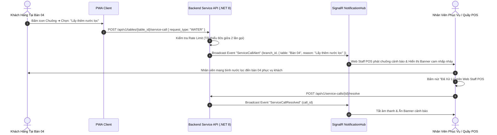

### 8. Xử lý ngoại lệ & Điều kiện hoàn tất (Exceptions & Postconditions)
- **Ngoại lệ (Khách bấm chuông liên tục):** Backend chặn và trả về HTTP 429 Too Many Requests kèm thông báo: *"Yêu cầu của bạn đã được gửi, nhân viên đang đến trong giây lát!"*.
- **Điều kiện hoàn tất:** Yêu cầu được phục vụ và ghi nhận thời gian phản hồi (Response Time) vào báo cáo hiệu suất phục vụ.

---

## 🔄 WF-08: ĐÁNH GIÁ CHẤT LƯỢNG 1-5 SAO, TẢI ẢNH & LEO THANG XỬ LÝ ĐÁNH GIÁ XẤU (<= 2 SAO)

### 1. Mã & Tên quy trình
- **Mã quy trình:** `WF-08`
- **Tên quy trình:** Đánh Giá Chất Lượng 1-5 Sao, Tải Ảnh Thực Tế & Leo Thang Xử Lý Đánh Giá Xấu <= 2 Sao (Customer Feedback & Escalation Flow).

### 2. Mục đích & Phạm vi nghiệp vụ
Thu thập phản hồi trải nghiệm từ khách hàng sau khi đơn hàng hoàn tất. Cho phép chấm điểm 1-5 sao, viết nhận xét, tải kèm 1-3 ảnh thực tế và tùy chọn ẩn danh. **Quy tắc cốt lõi:** Đánh giá từ 3-5 sao được lưu bình thường; **Đánh giá <= 2 sao lập tức kích hoạt sự kiện khẩn cấp gửi tới Quản lý chi nhánh** để giải quyết phàn nàn của khách ngay tại bàn hoặc qua điện thoại.

### 3. Tác nhân tham gia (Participating Actors)
- **Khách Hàng:** Gửi đánh giá sau khi hoàn tất đơn hàng.
- **Quản Lý Chi Nhánh (Branch Manager):** Tiếp nhận cảnh báo review xấu khẩn cấp và xử lý khiếu nại.
- **Object Storage & Image Processing Engine:** Lưu trữ và tối ưu ảnh đánh giá.

### 4. Điều kiện tiên quyết (Preconditions)
- Đơn hàng đã ở trạng thái `Completed` hoặc `Served`.

### 5. Hợp đồng dữ liệu Đầu vào / Đầu ra (Input/Output Data Contracts)
- **Dữ liệu đầu vào:**
  ```json
  {
    "order_id": "ord-12345",
    "rating": 1,
    "comment": "Cà phê quá ngọt, phục vụ chậm hơn 20 phút",
    "photos": ["https://cdn.smartfb.vn/feedbacks/img-01.webp"],
    "is_anonymous": true
  }
  ```

### 6. Các bước thực hiện chi tiết (Step-by-Step Execution)
1. **Bước 1 — Mở Form Đánh Giá:** Sau khi nhận món hoặc thanh toán thành công, PWA hiển thị form mời khách đánh giá.
2. **Bước 2 — Nhập Đánh Giá & Tải Ảnh:** Khách chấm số sao (1-5 sao), viết nhận xét chi tiết, tùy chọn đính kèm ảnh chụp thực tế (tối đa 3 ảnh, mỗi ảnh <= 5MB) và bật tùy chọn Ẩn danh nếu muốn bảo mật danh tính.
3. **Bước 3 — Gửi Đánh Giá:** Khách bấm "Gửi đánh giá". Backend lưu vào bảng `Feedbacks`.
4. **Bước 4 — Phân Nhánh Xử Lý:**
   - **Nhánh Đánh giá tốt (>= 3 sao):** Backend lưu DB, cập nhật điểm trung bình của món và cảm ơn khách hàng.
   - **Nhánh Đánh giá xấu (<= 2 sao):** Backend đánh dấu `Status = "Escalated"` và phát ngay sự kiện khẩn cấp `LowRatingAlert` qua SignalR `NotificationHub` tới Quản lý chi nhánh.
5. **Bước 5 — Quản Lý Xử Lý Khẩn Cấp:** Màn hình Manager Portal phát chuông báo động đỏ kèm thông tin số bàn/SĐT khách. Quản lý trực tiếp đến bàn xin lỗi, đổi ly nước mới hoặc tặng voucher bù đắp.
6. **Bước 6 — Đóng Khiếu Nại:** Quản lý nhập biên bản xử lý khiếu nại trên hệ thống và chuyển trạng thái sang `Resolved`.

### 7. Sơ đồ tuần tự chuẩn xác (Mermaid Sequence Diagram)

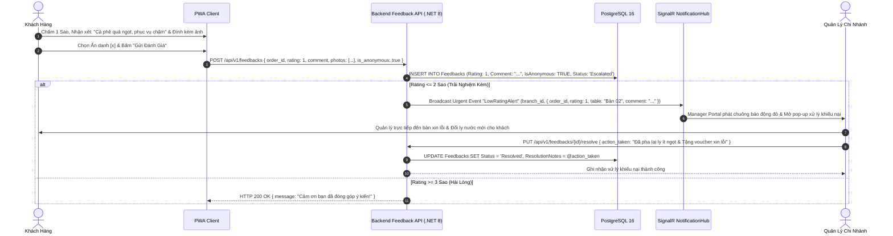

### 8. Xử lý ngoại lệ & Điều kiện hoàn tất (Exceptions & Postconditions)
- **Ngoại lệ (Tải file ảnh độc hại):** Backend kiểm tra Magic Bytes nhị phân của file. Mọi file không phải định dạng ảnh chuẩn (JPEG/PNG/WebP) đều bị từ chối với mã lỗi HTTP 415.
- **Điều kiện hoàn tất:** Đánh giá được lưu trữ đầy đủ, khiếu nại tiêu cực được khắc phục kịp thời.

---

## 🔄 WF-09: MỞ/KẾT CA BÁN HÀNG & ĐỐI SOÁT KÉT TIỀN MẶT (Z-REPORT CASH RECONCILIATION)

### 1. Mã & Tên quy trình
- **Mã quy trình:** `WF-09`
- **Tên quy trình:** Mở/Kết Ca Bán Hàng & Đối Soát Két Tiền Mặt Cuối Ca (Shift Opening, Closing & Z-Report Cash Reconciliation Flow).

### 2. Mục đích & Phạm vi nghiệp vụ
Đảm bảo tính chính xác và minh bạch tuyệt đối của dòng tiền mặt tại quầy. Đầu ca mở ca nhập tiền lẻ; cuối ca kiểm đếm toàn bộ tiền mặt thực tế theo từng mệnh giá, hệ thống tự động so khớp với doanh thu phần mềm, phát hiện chênh lệch thừa/thiếu, yêu cầu giải trình và xuất báo cáo Z-Report.

### 3. Tác nhân tham gia (Participating Actors)
- **Thu Ngân / Nhân Viên Ca Trực (Cashier):** Người kiểm đếm và bàn giao két tiền.
- **Quản Lý Chi Nhánh (Branch Manager):** Ký duyệt biên bản đối soát ca Z-Report.
- **Backend Shift API:** Tính toán chênh lệch dòng tiền tự động.

### 4. Điều kiện tiên quyết (Preconditions)
- Đầu ca: Không có ca nào khác đang ở trạng thái `Open` trên cùng một máy POS.

### 5. Hợp đồng dữ liệu Đầu vào / Đầu ra (Input/Output Data Contracts)
- **Dữ liệu mở ca:** `{ "initial_cash": 1500000 }`
- **Dữ liệu kết ca (Kiểm đếm theo mệnh giá):**
  ```json
  {
    "cash_denominations": [
      { "denomination": 500000, "count": 10 },
      { "denomination": 200000, "count": 20 },
      { "denomination": 100000, "count": 15 }
    ],
    "actual_cash_total": 10500000
  }
  ```

### 6. Các bước thực hiện chi tiết (Step-by-Step Execution)
1. **Bước 1 — Mở Ca Đầu Ngày:** Thu ngân mở két, đếm số tiền mặt lẻ ban đầu (ví dụ: `1.500.000 VNĐ`), nhập vào form `(manager)/shifts/open` và bấm "Mở Ca".
2. **Bước 2 — Vận Hành Bán Hàng:** Trong ca, hệ thống tự động cộng dồn doanh thu tiền mặt từ các đơn Takeaway và Dine-in trả sau vào số dư lý thuyết của két ca.
3. **Bước 3 — Kết Ca Cuối Ngày:** Thu ngân mở form "Kết Ca", kiểm đếm tiền mặt thực tế theo từng mệnh giá (500k, 200k, 100k, 50k...).
4. **Bước 4 — So Khớp Chênh Lệch:** Backend tính toán: `ExpectedCash = InitialCash + CashSalesTotal - CashPayouts`. Tính `Discrepancy = ActualCash - ExpectedCash`.
5. **Bước 5 — Giải Trình Chênh Lệch:** Nếu có chênh lệch (`|Discrepancy| > 0`), hệ thống bắt buộc Thu ngân nhập lý do giải trình. Quản lý kiểm tra và ký duyệt điện tử.
6. **Bước 6 — Xuất Báo Cáo Z-Report:** Ca chuyển sang `Closed`. Hệ thống tự động xuất Báo cáo Đối soát Ca (Z-Report PDF/In nhiệt) và gửi dữ liệu lên Dashboard Quản trị.

### 7. Sơ đồ tuần tự chuẩn xác (Mermaid Sequence Diagram)

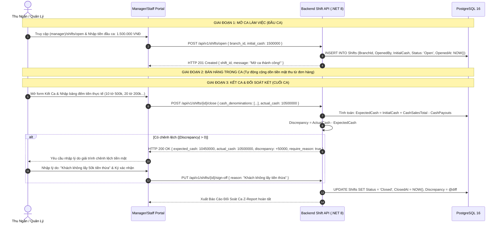

### 8. Xử lý ngoại lệ & Điều kiện hoàn tất (Exceptions & Postconditions)
- **Ngoại lệ (Chênh lệch lớn > 200.000 VNĐ):** Hệ thống tự động gửi thông báo kiểm toán khẩn cấp lên Dashboard của Chủ chuỗi (`ChainAdmin`) để rà soát gian lận.
- **Điều kiện hoàn tất:** Ca làm việc được khóa sổ an toàn, toàn bộ doanh thu tiền mặt được chốt khớp với biên bản Z-Report.

---

## 🔄 WF-10: XUẤT KHO QUẦY BAR, TỰ ĐỘNG TRỪ TỒN THEO BOM & CẢNH BÁO NGƯỠNG TỒN KHO

### 1. Mã & Tên quy trình
- **Mã quy trình:** `WF-10`
- **Tên quy trình:** Xuất Kho Quầy Bar, Tự Động Trừ Tồn Kho Theo BOM & Cảnh Báo Ngưỡng Tồn Kho (Stock Requisition, BOM Auto-Deduction & Low-Stock Alerts Flow).

### 2. Mục đích & Phạm vi nghiệp vụ
Quản lý chu chuyển nguyên vật liệu từ Kho bảo quản ra Quầy Bar. Khi mỗi đơn hàng hoàn tất (`Completed`), hệ thống tự động trừ tồn kho Quầy Bar theo đúng định lượng công thức (BOM). Khi lượng tồn chạm ngưỡng tối thiểu (`MinThreshold`), cảnh báo khẩn lập tức được gửi tới Quản lý chi nhánh.

### 3. Tác nhân tham gia (Participating Actors)
- **Quản Lý Chi Nhánh:** Lập phiếu xuất nguyên liệu ra quầy bar.
- **Hệ Thống Tự Động BOM Engine:** Trừ tồn kho thời gian thực.
- **SignalR NotificationHub:** Phát cảnh báo hết nguyên liệu.

### 4. Điều kiện tiên quyết (Preconditions)
- Món ăn đã được cấu hình bảng định mức nguyên liệu BOM trên Admin Portal.

### 5. Hợp đồng dữ liệu Đầu vào / Đầu ra (Input/Output Data Contracts)
- **Công thức trừ tồn kho:**
  `BarStock(Ingredient_i) = BarStock(Ingredient_i) - Sum(BOM_Quantity(Ingredient_i, Item_j) * Count(Item_j))`

### 6. Các bước thực hiện chi tiết (Step-by-Step Execution)
1. **Bước 1 — Lập Phiếu Xuất Bar:** Quản lý tạo "Phiếu Xuất Bar" xuất 20 hộp sữa đặc, 10kg cà phê hạt từ Kho lưu trữ ra Quầy Bar. Kho lưu trữ giảm, Kho bar tăng tương ứng.
2. **Bước 2 — Bán Hàng & Hoàn Tất Đơn:** Khi khách gọi món và đơn hàng chuyển sang `Completed`, hệ thống kích hoạt Domain Event `OrderCompletedEvent`.
3. **Bước 3 — Trừ Tồn Kho Bar Tự Động:** Backend duyệt qua từng món trong đơn, tra cứu bảng `ProductBoms` và trừ chính xác số gram/ml nguyên liệu trong kho Quầy Bar.
4. **Bước 4 — Kiểm Tra Ngưỡng Tối Thiểu:** Sau khi trừ tồn, Backend so sánh `CurrentStock` với `MinThreshold` của từng nguyên liệu.
5. **Bước 5 — Phát Cảnh Báo Tồn Thấp:** Nếu `CurrentStock <= MinThreshold` (ví dụ: Sữa đặc còn 2 hộp <= ngưỡng 5 hộp), Backend phát sự kiện `InventoryShortageAlert` qua SignalR `NotificationHub`.
6. **Bước 6 — Màn Hình Quản Lý Báo Động:** Màn hình Manager Portal hiển thị banner cảnh báo đỏ: *"Nguyên liệu [Sữa Đặc] sắp hết, cần xuất thêm ngay!"*.

### 7. Sơ đồ tuần tự chuẩn xác (Mermaid Sequence Diagram)

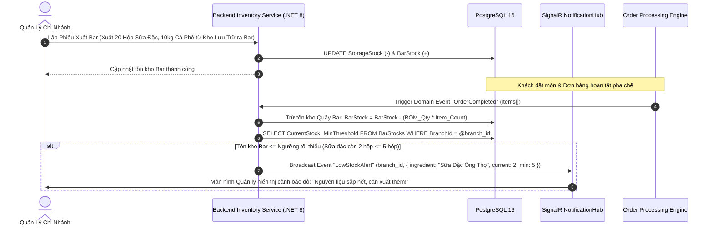

### 8. Xử lý ngoại lệ & Điều kiện hoàn tất (Exceptions & Postconditions)
- **Ngoại lệ (Tồn kho Bar bị âm do quên lập phiếu xuất):** Hệ thống không chặn bán hàng làm gián đoạn phục vụ khách, nhưng ghi nhận tồn kho âm màu đỏ và phát cảnh báo nhắc Quản lý lập phiếu xuất bù.
- **Điều kiện hoàn tất:** Nguyên liệu được quản lý chặt chẽ theo từng gram, loại bỏ thất thoát nguyên vật liệu.

---

## 🔄 WF-11: QUẢN TRỊ TOÀN DIỆN THỰC ĐƠN, CÔNG THỨC BOM & TẢI ẢNH TỐI ƯU CDN (ADMIN FULL CRUD)

### 1. Mã & Tên quy trình
- **Mã quy trình:** `WF-11`
- **Tên quy trình:** Quản Trị Toàn Diện Thực Đơn, Công Thức BOM & Tải Ảnh Tối Ưu CDN (Admin Full CRUD, BOM Recipes & WebP Image Upload Flow).

### 2. Mục đích & Phạm vi nghiệp vụ
Trao toàn quyền quản trị cho Chủ Chuỗi (`ChainAdmin`): Tạo mới, chỉnh sửa, xóa hoặc thay thế sản phẩm; Định nghĩa công thức BOM chi tiết theo từng kích cỡ; Gán nhãn calo/dị ứng; Tải ảnh sản phẩm có nén WebP và lưu trữ CDN Object Storage.

### 3. Tác nhân tham gia (Participating Actors)
- **Chủ Chuỗi / Admin:** Thao tác trên Admin Executive Portal.
- **ImageSharp Engine & Object Storage (CDN):** Xử lý nén ảnh WebP và phân phối CDN.
- **Redis Cache & SignalR KitchenHub:** Xóa cache và đồng bộ thực đơn tức thời.

### 4. Điều kiện tiên quyết (Preconditions)
- Người dùng có quyền `ChainAdmin`.

### 5. Hợp đồng dữ liệu Đầu vào / Đầu ra (Input/Output Data Contracts)
- **Dữ liệu tạo sản phẩm kèm BOM:**
  ```json
  {
    "name": "Matcha Latte Macchiato",
    "category_id": "cat-matcha",
    "base_price": 55000,
    "calories": 220,
    "allergens": ["MILK"],
    "sizes": [
      { "size_name": "M", "extra_price": 0 },
      { "size_name": "L", "extra_price": 10000 }
    ],
    "boms": [
      { "size_name": "M", "ingredient_id": "ing-matcha", "quantity": 10 },
      { "size_name": "M", "ingredient_id": "ing-milk", "quantity": 150 }
    ],
    "image_url": "https://cdn.smartfb.vn/products/matcha_latte.webp"
  }
  ```

### 6. Các bước thực hiện chi tiết (Step-by-Step Execution)
1. **Bước 1 — Tải Ảnh Sản Phẩm:** Admin chọn ảnh từ máy tính (PNG/JPEG). Backend kiểm tra Magic Bytes, nén ảnh sang chuẩn WebP, sinh 2 kích cỡ (Original 1200px, Thumbnail 400px), tải lên CDN và trả về URL.
2. **Bước 2 — Nhập Thông Tin Món & BOM:** Admin nhập tên món, danh mục, giá cơ bản, các tùy chọn size và bảng định lượng công thức BOM chi tiết cho từng size.
3. **Bước 3 — Lưu Vào Cơ Sở Dữ Liệu:** Backend lưu giao dịch vào các bảng `Products`, `ProductSizes`, `ProductBoms`.
4. **Bước 4 — Xóa Cache & Đồng Bộ Thực Đơn:** Backend xóa sạch Cache Redis `menu:branch:*` và phát sự kiện `Item86Toggled` / `MenuStructureChanged` qua SignalR `KitchenHub`.
5. **Bước 5 — Cập Nhật Thực Đơn:** Toàn bộ màn hình PWA của khách và KDS của bếp cập nhật món mới ngay lập tức mà không cần tải lại trang.

### 7. Sơ đồ tuần tự chuẩn xác (Mermaid Sequence Diagram)

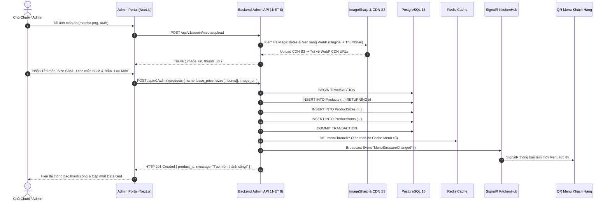

### 8. Xử lý ngoại lệ & Điều kiện hoàn tất (Exceptions & Postconditions)
- **Ngoại lệ (Tên món trùng SKU):** Backend kiểm tra tính duy nhất, trả về mã lỗi 409 Conflict: *"Mã SKU hoặc tên món đã tồn tại trong hệ thống"*.
- **Điều kiện hoàn tất:** Món ăn mới cùng định mức BOM được phát hành đồng bộ toàn chuỗi.

---

## 🔄 WF-12: KHAI PHÁ DỮ LIỆU GIỎ HÀNG & PHÊ DUYỆT GỢI Ý COMBO AI-2 (APRIORI / FP-GROWTH)

### 1. Mã & Tên quy trình
- **Mã quy trình:** `WF-12`
- **Tên quy trình:** Khai Phá Dữ Liệu Giỏ Hàng & Phê Duyệt Gợi Ý Combo Tự Động Bằng AI-2 (AI-2 Apriori / FP-Growth Combo Discovery & Approval Flow).

### 2. Mục đích & Phạm vi nghiệp vụ
Tự động phân tích lịch sử đơn hàng để phát hiện các cặp/nhóm món thường xuyên được mua cùng nhau với chỉ số liên kết cao (`Support`, `Confidence`, `Lift > 1.5`). Hệ thống đề xuất các Combo ưu đãi tiềm năng lên Admin Portal để Chủ Chuỗi xem xét, điều chỉnh giá và phê duyệt phát hành lên Menu PWA.

### 3. Tác nhân tham gia (Participating Actors)
- **AI-2 Background Worker:** Dịch vụ phân tích dữ liệu chạy thuật toán Apriori/FP-Growth.
- **Chủ Chuỗi / Admin:** Người thẩm định mức giảm giá và phê duyệt Combo.
- **QR Menu PWA:** Hiển thị Combo mới phát hành ở vị trí ưu tiên đầu trang.

### 4. Điều kiện tiên quyết (Preconditions)
- Hệ thống có tối thiểu 100 đơn hàng hoàn tất trong 30 ngày gần nhất.

### 5. Hợp đồng dữ liệu Đầu vào / Đầu ra (Input/Output Data Contracts)
- **Chỉ số khai phá luật kết hợp:**
  - $\text{Support}(A \rightarrow B) = \frac{\text{Số đơn chứa cả A và B}}{\text{Tổng số đơn hàng}} \ge 0.03$ (3%)
  - $\text{Confidence}(A \rightarrow B) = \frac{\text{Số đơn chứa cả A và B}}{\text{Số đơn chứa A}} \ge 0.60$ (60%)
  - $\text{Lift}(A \rightarrow B) = \frac{\text{Confidence}(A \rightarrow B)}{\text{Support}(B)} > 1.5$ (Tương quan dương mạnh)

### 6. Các bước thực hiện chi tiết (Step-by-Step Execution)
1. **Bước 1 — Khai Phá Định Kỳ:** Hàng tuần, Background Service quét tập đơn hàng 30 ngày qua, thực thi thuật toán Apriori và lưu các luật kết hợp thỏa mãn điều kiện vào bảng `ComboSuggestions`.
2. **Bước 2 — Xem Danh Sách Đề Xuất:** Admin truy cập `(admin)/ai/combo-discovery` xem danh sách gợi ý Combo kèm các chỉ số Lift, tần suất mua và doanh thu dự kiến.
3. **Bước 3 — Điều Chỉnh Ưu Đãi & Đặt Tên:** Admin chọn đề xuất `{Cà phê muối + Croissant}`, nhập tên *"Combo Bữa Sáng Năng Lượng"* và chọn mức giảm giá 15%.
4. **Bước 4 — Phê Duyệt & Xuất Bản:** Admin bấm "Phê Duyệt & Phát Hành". Backend tạo sản phẩm mới loại Combo (`IsCombo = true`), cập nhật trạng thái gợi ý sang `Approved` và xóa cache menu.
5. **Bước 5 — Hiển Thị Trên PWA:** Combo mới xuất hiện nổi bật tại đầu trang Menu PWA để kích cầu tăng giá trị đơn hàng trung bình (AOV).

### 7. Sơ đồ tuần tự chuẩn xác (Mermaid Sequence Diagram)

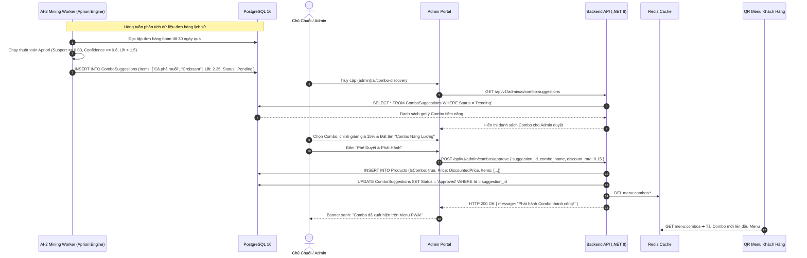

### 8. Xử lý ngoại lệ & Điều kiện hoàn tất (Exceptions & Postconditions)
- **Ngoại lệ (Một món trong Combo bị khóa 86):** Nếu bất kỳ món thành phần nào bị hết hàng, Combo đó tự động bị ẩn hoặc làm mờ trên Menu PWA.
- **Điều kiện hoàn tất:** Combo được phát hành thành công dựa trên dữ liệu mua sắm thực tế có cơ sở khoa học.

---

## 🔄 WF-13: SẮP XẾP CẤU TRÚC DANH MỤC & LÊN LỊCH THỰC ĐƠN THEO MÙA (SEASONAL MENU)

### 1. Mã & Tên quy trình
- **Mã quy trình:** `WF-13`
- **Tên quy trình:** Sắp Xếp Cấu Trúc Danh Mục & Lên Lịch Thực Đơn Theo Mùa (Menu Category Reordering & Seasonal Menu Scheduling Flow).

### 2. Mục đích & Phạm vi nghiệp vụ
Cho phép Admin kéo thả sắp xếp thứ tự hiển thị danh mục trên thanh điều hướng menu PWA và lên lịch phát hành các thực đơn theo mùa vụ (Tết, Giáng Sinh, Mùa Hè) kèm thời điểm tự động kích hoạt (`StartDate`) và kết thúc (`EndDate`).

### 3. Tác nhân tham gia (Participating Actors)
- **Chủ Chuỗi / Admin:** Thiết lập cấu trúc danh mục và lên lịch mùa vụ.
- **Hangfire Cron Scheduler:** Tự động kích hoạt/hủy kích hoạt menu theo thời gian.
- **SignalR KitchenHub:** Đồng bộ giao diện mùa lễ hội xuống PWA và KDS.

### 4. Điều kiện tiên quyết (Preconditions)
- Danh mục và các món ăn theo mùa đã được tạo sẵn trong hệ thống.

### 5. Hợp đồng dữ liệu Đầu vào / Đầu ra (Input/Output Data Contracts)
- **Dữ liệu lên lịch thực đơn mùa:**
  ```json
  {
    "menu_name": "Thực Đơn Mùa Lễ Hội Giáng Sinh",
    "start_date": "2026-12-01T00:00:00Z",
    "end_date": "2026-12-31T23:59:59Z",
    "product_ids": ["prod-choco-mint", "prod-cinnamon-latte"]
  }
  ```

### 6. Các bước thực hiện chi tiết (Step-by-Step Execution)
1. **Bước 1 — Sắp Xếp Danh Mục (Reorder):** Admin kéo thả danh mục trên Admin Portal và bấm "Lưu Thứ Tự". Backend cập nhật `DisplayOrder` và xóa cache Redis.
2. **Bước 2 — Tạo Thực Đơn Mùa:** Admin tạo thực đơn mới, chọn danh sách món đặc trưng và cài đặt khoảng thời gian kích hoạt.
3. **Bước 3 — Đăng Ký Cron Job:** Backend lưu thực đơn và đăng ký Job tự động với Hangfire Scheduler.
4. **Bước 4 — Tự Động Kích Hoạt Đến Hạn:** Khi đến ngày giờ `StartDate`, Hangfire kích hoạt Job chuyển `IsActive = true` và phát sự kiện `SeasonalMenuActivated` qua SignalR `KitchenHub`.
5. **Bước 5 — Hiển Thị Giao Diện Mùa Vụ:** PWA và KDS tự động nạp danh mục mùa lễ hội kèm theme giao diện đặc biệt.
6. **Bước 6 — Tự Động Kết Thúc:** Khi hết hạn `EndDate`, hệ thống tự động ẩn danh mục mùa vụ mà không cần Admin can thiệp thủ công.

### 7. Sơ đồ tuần tự chuẩn xác (Mermaid Sequence Diagram)

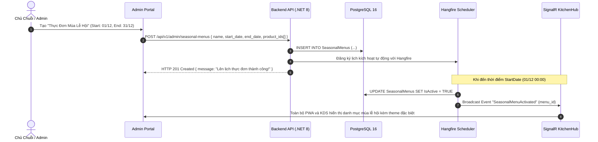

### 8. Xử lý ngoại lệ & Điều kiện hoàn tất (Exceptions & Postconditions)
- **Ngoại lệ (Thời gian kết thúc nhỏ hơn thời gian bắt đầu):** Backend validate chặn lỗi 400 Bad Request ngay từ bước nhập liệu.
- **Điều kiện hoàn tất:** Menu mùa vụ được vận hành hoàn toàn tự động, đúng lịch trình kinh doanh của chuỗi.

---

## 🔄 WF-14: QUẢN TRỊ NHÓM GIÁ & BẢNG GIÁ ĐA CHI NHÁNH (BRANCH DYNAMIC PRICING MATRIX)

### 1. Mã & Tên quy trình
- **Mã quy trình:** `WF-14`
- **Tên quy trình:** Quản Trị Nhóm Giá & Bảng Giá Đa Chi Nhánh (Branch Dynamic Pricing Management Flow).

### 2. Mục đích & Phạm vi nghiệp vụ
Cho phép chuỗi thiết lập các nhóm giá vùng (Pricing Groups) như: *Nhóm Giá Tiêu Chuẩn*, *Nhóm Giá Sân Bay (+20%)*, *Nhóm Giá Trung Tâm (+10%)*. Chi nhánh thuộc nhóm giá nào sẽ tự động áp dụng bảng giá đó trên Menu PWA và Web POS của chi nhánh đó.

### 3. Tác nhân tham gia (Participating Actors)
- **Chủ Chuỗi / Admin:** Thiết lập chính sách giá và phân bổ chi nhánh vào nhóm giá.
- **Backend Pricing Service:** Tính toán và áp dụng giá theo chi nhánh.
- **Redis Cache:** Lưu trữ cache bảng giá riêng biệt cho từng chi nhánh.

### 4. Điều kiện tiên quyết (Preconditions)
- Các chi nhánh và sản phẩm đã được định nghĩa trên hệ thống.

### 5. Hợp đồng dữ liệu Đầu vào / Đầu ra (Input/Output Data Contracts)
- **Dữ liệu cấu hình bảng giá:**
  ```json
  {
    "pricing_group_id": "group-san-bay",
    "price_overrides": [
      { "product_id": "prod-001", "custom_price": 45000 },
      { "product_id": "prod-002", "custom_price": 55000 }
    ]
  }
  ```

### 6. Các bước thực hiện chi tiết (Step-by-Step Execution)
1. **Bước 1 — Chọn Nhóm Giá:** Admin chọn Nhóm Giá "Sân Bay Tân Sơn Nhất" trên Admin Portal.
2. **Bước 2 — Điều Chỉnh Giá:** Admin nhập tỷ lệ điều chỉnh chung (+20%) hoặc ghi đè giá cụ thể cho từng món ăn.
3. **Bước 3 — Lưu & Áp Dụng:** Admin bấm "Lưu & Áp Dụng". Backend lưu vào bảng `BranchProductPrices`.
4. **Bước 4 — Xóa Cache Giá Chi Nhánh:** Backend xóa toàn bộ Cache Redis giá của các chi nhánh thuộc nhóm: `DEL menu:branch:{branch_ids}:prices`.
5. **Bước 5 — Áp Dụng Tức Thì:** Khi khách hàng quét QR tại chi nhánh Sân Bay, Menu PWA lập tức tải bảng giá đã điều chỉnh chính xác.

### 7. Sơ đồ tuần tự chuẩn xác (Mermaid Sequence Diagram)

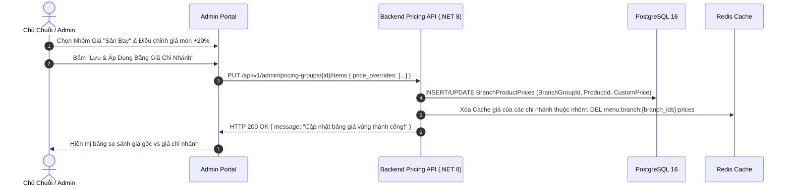

### 8. Xử lý ngoại lệ & Điều kiện hoàn tất (Exceptions & Postconditions)
- **Ngoại lệ (Món không có giá ghi đè):** Hệ thống tự động Fallback về giá cơ bản (`BasePrice`) của sản phẩm.
- **Điều kiện hoàn tất:** Bảng giá vùng được áp dụng độc lập, chính xác cho từng chi nhánh trong chuỗi.

---

## 🔄 WF-15: CHATBOT AI TƯ VẤN MÓN & GỢI Ý CÁ NHÂN HÓA (AI-1 GEMINI ACTIVE RAG)

### 1. Mã & Tên quy trình
- **Mã quy trình:** `WF-15`
- **Tên quy trình:** Chatbot AI Tư Vấn Món & Gợi Ý Cá Nhân Hóa Thời Tiết / Dinh Dưỡng (AI-1 Gemini Active RAG Chatbot Consultation Flow).

### 2. Mục đích & Phạm vi nghiệp vụ
Cung cấp trải nghiệm tương tác tự nhiên trên PWA Menu. Chatbot AI kết hợp ngữ cảnh thời gian thực: Thời tiết hiện tại (OpenWeatherMap API), Thực đơn & Định lượng dinh dưỡng (PostgreSQL) và Lịch sử khẩu vị khách hàng (CRM) để tư vấn 2-3 món phù hợp nhất kèm nút "Thêm vào giỏ hàng ngay".

### 3. Tác nhân tham gia (Participating Actors)
- **Khách Hàng:** Chat tự nhiên trên PWA.
- **Backend RAG Engine:** Tổng hợp ngữ cảnh thời tiết, menu, CRM.
- **Google Gemini 1.5 Flash API:** Mô hình AI sinh câu trả lời tư vấn.

### 4. Điều kiện tiên quyết (Preconditions)
- Dịch vụ Gemini API Key và OpenWeatherMap API đang hoạt động bình thường.

### 5. Hợp đồng dữ liệu Đầu vào / Đầu ra (Input/Output Data Contracts)
- **Dữ liệu đầu vào:** `{ "query": "Trưa nay nắng nóng quá, có món nào thanh mát, ít ngọt và dưới 150 calo không?" }`
- **Dữ liệu đầu ra:** Câu trả lời tự nhiên + Danh sách 2-3 thẻ sản phẩm kèm hình ảnh, giá tiền, calo và nút `Add to Cart`.

### 6. Các bước thực hiện chi tiết (Step-by-Step Execution)
1. **Bước 1 — Đặt Câu Hỏi:** Khách mở widget Chatbot trên PWA Menu và gõ câu hỏi bằng tiếng Việt tự nhiên.
2. **Bước 2 — Xây Dựng RAG Context:** Backend tiếp nhận câu hỏi, đồng thời:
   - Lấy thời tiết chi nhánh: 35°C, Nắng gắt (từ OpenWeatherMap).
   - Truy vấn danh mục món thỏa mãn: `Calories < 150` và `IsAvailable = true`.
   - Lấy lịch sử gọi món gần nhất của khách từ CRM.
3. **Bước 3 — Gửi Structured Prompt Tới Gemini:** Backend tạo Prompt có cấu trúc và gửi tới Google Gemini 1.5 Flash.
4. **Bước 4 — Sinh Phản Hồi:** Mô hình Gemini trả về câu trả lời tự nhiên giải thích lý do gợi ý kèm danh sách ID món ăn.
5. **Bước 5 — Hiển Thị Tương Tác:** PWA hiển thị tin nhắn của AI kèm các thẻ món ăn trực quan. Khách bấm nút "Thêm vào giỏ" để đưa thẳng món vào giỏ hàng.

### 7. Sơ đồ tuần tự chuẩn xác (Mermaid Sequence Diagram)

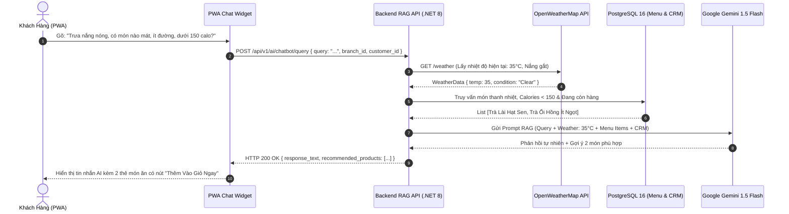

### 8. Xử lý ngoại lệ & Điều kiện hoàn tất (Exceptions & Postconditions)
- **Ngoại lệ (Gemini API Timeout):** Backend tự động Fallback về thuật toán gợi ý dựa trên quy tắc (Rule-based: Top 3 món bán chạy mùa nóng) để không làm gián đoạn trải nghiệm người dùng.
- **Điều kiện hoàn tất:** Khách hàng nhận được gợi ý chính xác, tăng tỷ lệ chuyển đổi mua hàng.

---

## 🔄 WF-16: BÁO CÁO TÀI CHÍNH P&L HỢP NHẤT & PHÂN TÍCH LỢI NHUẬN GỘP ĐA CHI NHÁNH

### 1. Mã & Tên quy trình
- **Mã quy trình:** `WF-16`
- **Tên quy trình:** Báo Cáo Tài Chính P&L Hợp Nhất & Phân Tích Lợi Nhuận Gộp Đa Chi Nhánh (Consolidated Multi-Branch P&L Financial Reporting Flow).

### 2. Mục đích & Phạm vi nghiệp vụ
Tổng hợp toàn diện bức tranh tài chính của từng chi nhánh và toàn chuỗi vào cuối ngày/tháng: Phân rã doanh thu theo 3 kênh (Dine-in, Takeaway, Delivery), tính toán chính xác Giá vốn hàng bán (COGS) dựa trên định lượng BOM của từng ly nước đã bán và giá vốn nguyên liệu nhập, từ đó tính Lợi nhuận gộp (Gross Profit) và xuất báo cáo chuẩn kế toán.

### 3. Tác nhân tham gia (Participating Actors)
- **Chủ Chuỗi / Giám Đốc Tài Chính (Chain Admin):** Xem báo cáo tài chính hợp nhất.
- **Quản Lý Chi Nhánh:** Xem báo cáo P&L nội bộ chi nhánh.
- **Financial Aggregation Background Engine:** Tự động tổng hợp số liệu lúc 23:59 hàng ngày.

### 4. Điều kiện tiên quyết (Preconditions)
- Các ca bán hàng trong ngày đã kết ca và dữ liệu nhập kho có đơn giá đầy đủ.

### 5. Hợp đồng dữ liệu Đầu vào / Đầu ra (Input/Output Data Contracts)
- **Công thức tính toán P&L:**
  - $\text{NetRevenue} = \text{DineInRevenue} + \text{TakeawayRevenue} + \text{DeliveryRevenue} - \text{Discounts}$
  - $\text{COGS} = \sum (\text{BOM\_Quantity}_i \times \text{MovingAverageCost}_i)$
  - $\text{GrossProfit} = \text{NetRevenue} - \text{COGS}$
  - $\text{GrossMargin (\%)} = \frac{\text{GrossProfit}}{\text{NetRevenue}} \times 100\%$

### 6. Các bước thực hiện chi tiết (Step-by-Step Execution)
1. **Bước 1 — Tổng Hợp Dữ Liệu Tự Động:** Lúc 23:59 mỗi ngày, Hangfire Service quét toàn bộ đơn hàng hoàn tất trong ngày của từng chi nhánh.
2. **Bước 2 — Phân Loại Doanh Thu Theo Kênh:** Tách bạch doanh thu theo 3 kênh: Tại bàn (Dine-in), Mang về (Takeaway) và Giao hàng (Delivery).
3. **Bước 3 — Tính Giá Vốn Hàng Bán COGS:** Duyệt qua tất cả các ly nước đã bán, nhân với định mức BOM và đơn giá bình quân gia quyền của nguyên liệu nhập kho.
4. **Bước 4 — Tính Lợi Nhuận Gộp:** Tính toán Lợi nhuận gộp và Biên lợi nhuận gộp (%) cho từng món ăn, từng danh mục và từng chi nhánh.
5. **Bước 5 — Hiển Thị Dashboard:** Cập nhật số liệu trực quan lên Dashboard P&L của Admin và Manager với biểu đồ xu hướng và bảng phân tích Menu Engineering (Stars, Plowhorses, Puzzles, Dogs).
6. **Bước 6 — Xuất Báo Cáo:** Hỗ trợ xuất dữ liệu ra file Excel, CSV hoặc PDF có chữ ký số xác thực.

### 7. Sơ đồ tuần tự chuẩn xác (Mermaid Sequence Diagram)

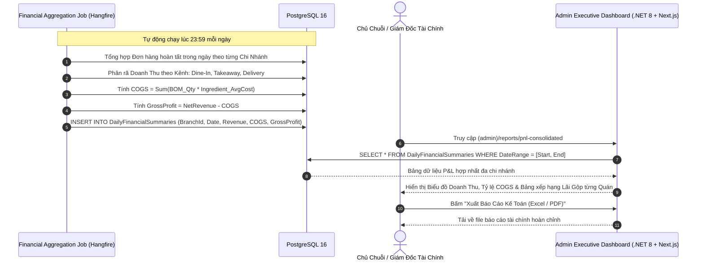

### 8. Xử lý ngoại lệ & Điều kiện hoàn tất (Exceptions & Postconditions)
- **Ngoại lệ (Nguyên liệu chưa có giá nhập):** Hệ thống sử dụng giá nhập gần nhất hoặc phát cảnh báo yêu cầu Quản lý cập nhật hóa đơn mua hàng NCC.
- **Điều kiện hoàn tất:** Báo cáo tài chính phản ánh chính xác 100% dòng tiền và hiệu quả kinh doanh của toàn bộ hệ sinh thái chuỗi F&B.

---

# CHƯƠNG 3: ĐẶC TẢ MÁY TRẠNG THÁI ĐƠN HÀNG (ORDER STATE MACHINE) CHO 4 KÊNH BÁN

Hệ thống **Smart F&B OS** quản lý chặt chẽ 4 luồng trạng thái đơn hàng độc lập, bảo đảm tính toàn vẹn dữ liệu và tránh xung đột nghiệp vụ giữa các kênh bán:

```
1. KÊNH 1 — DINE-IN VIETQR TRẢ TRƯỚC (WF-01A):
   [PendingPayment] ──(Paid/Webhook)──► [Paid] ──(Auto)──► [Confirmed] ──(Barista Prep)──► [Preparing] ──(Barista Ready)──► [Ready] ──(Staff Serve)──► [Served/Completed]

2. KÊNH 2 — DINE-IN TIỀN MẶT TRẢ SAU (WF-01B):
   [Confirmed] ──(Barista Prep)──► [Preparing] ──(Barista Ready)──► [Ready] ──(Staff Serve + In Bill QR)──► [Served] ──(Chờ Thu Tiền)──► [PendingPayment] ──(Staff Thu Tiền Mặt / Quét QR)──► [Paid/Completed]

3. KÊNH 3 — QR DELIVERY GIAO TẬN NƠI (WF-02):
   [PendingPayment] ──(Paid/Webhook)──► [Paid] ──(Auto)──► [Confirmed] ──(Barista Prep)──► [Preparing] ──(Barista Ready)──► [Ready] ──(Shipper Giao Hàng)──► [Completed]

4. KÊNH 4 — TAKEAWAY TẠI QUẦY (WF-03):
   [Confirmed] ──(Barista Prep)──► [Preparing] ──(Barista Ready)──► [Ready] ──(Khách Nhận & Thu Tiền Mặt/QR)──► [Paid/Completed]
```

---

# CHƯƠNG 4: MA TRẬN CHUYỂN ĐỔI TRẠNG THÁI HỢP LỆ & HÀNH ĐỘNG KÈM THEO

| Trạng Thái Hiện Tại | Trạng Thái Kế Tiếp Hợp Lệ | Kênh Bán Áp Dụng | Tác Nhân Kích Hoạt | Điều Kiện Ràng Buộc & Hành Động Kèm Theo |
|---|---|---|---|---|
| `PendingPayment` | `Paid` | Dine-in VietQR, Delivery | PayOS Webhook | Nhận Webhook chuyển khoản khớp số tiền và mã `ORDER_{id}`. Cập nhật `PaidAt = NOW()`. |
| `PendingPayment` | `Cancelled` | Dine-in VietQR, Delivery | Hangfire Cron Job | Quá 10 phút không thanh toán ➔ Tự động hủy đơn, giải phóng bàn, gửi thông báo hết hạn về PWA. |
| `Paid` | `Confirmed` | Dine-in VietQR, Delivery | System Auto | Chuyển tiếp tự động tức thời, bắn sự kiện SignalR đẩy thẻ đơn xuống màn hình KDS quầy bar. |
| `Created (Cash)` | `Confirmed` | Dine-in Cash, Takeaway | Cashier / Customer | Tạo đơn thành công ➔ Đẩy ngay xuống KDS bếp pha chế không cần chờ tiền. |
| `Confirmed` | `Preparing` | Tất cả 4 kênh | Barista | Barista chạm nút "Bắt đầu pha chế" trên KDS. Gửi SignalR cập nhật tiến độ về PWA khách. |
| `Preparing` | `Ready` | Tất cả 4 kênh | Barista | Pha xong ➔ Kích hoạt trừ tồn kho bar theo BOM ➔ Phát chuông thông báo món sẵn sàng về PWA/POS. |
| `Ready` | `Served` | Dine-in Cash & VietQR | Nhân Viên Phục Vụ | Mang món ra bàn. Đối với đơn Cash: Hệ thống tự động chuyển tiếp sang `PendingPayment` và in bill có QR. |
| `Served (Cash)` | `Paid` | Dine-in Cash | Thu Ngân / PayOS | Nhận đủ tiền mặt (Thu ngân bấm xác nhận) HOẶC khách quét mã VietQR in trên tờ hóa đơn. |
| `Ready` | `Completed` | Takeaway, Delivery | Thu Ngân / Shipper | Khách nhận túi mang về (Takeaway) hoặc Shipper xác nhận đã giao tận tay khách (Delivery). |
| `Any Status` | `Cancelled` | Tất cả các kênh | Branch Manager | Hủy đơn bất thường (Khách đổi ý, sự cố) ➔ Bắt buộc nhập lý do giải trình và lưu Audit Log. |

---

# CHƯƠNG 5: MA TRẬN XỬ LÝ 10 TRƯỜNG HỢP BIÊN & NGOẠI LỆ VẬN HÀNH (EDGE CASES MATRIX)

| # | Quy Trình Nghiệp Vụ | Tình Huống Biên / Ngoại Lệ (Edge Case Scenario) | Hành Vi Hệ Thống Quan Sát & Xử Lý (Observed Behavior & Mitigation) |
|---|---|---|---|
| **1** | `WF-01A` (Dine-in VietQR) | Khách đặt đơn VietQR nhưng không quét thanh toán trong 10 phút. | Background Cron Job tự động quét các đơn `PendingPayment` quá 10 phút, chuyển trạng thái sang `Cancelled`, giải phóng bàn và gửi thông báo hết hạn về PWA của khách. |
| **2** | `WF-01A` (Dine-in VietQR) | Khách chuyển khoản đúng tiền nhưng mạng chập chờn, Webhook PayOS đến chậm hoặc mất gói tin. | Client PWA duy trì cơ chế Polling dự phòng mỗi 3 giây gọi `GET /api/v1/orders/{id}/status`. Backend chủ động đối soát với PayOS API để cập nhật `Paid` ngay khi phát hiện giao dịch thành công. |
| **3** | `WF-01B` (Dine-in Cash) | Khách chọn thanh toán tiền mặt trả sau nhưng khi nhân viên bưng nước ra bàn thì khách đổi ý muốn chuyển khoản ngân hàng. | Nhân viên không cần thao tác hủy đơn; trên tờ Hóa đơn tạm tính bưng ra bàn đã in sẵn mã VietQR động. Khách chỉ cần mở App Ngân hàng quét mã trên hóa đơn, hệ thống tự khớp tiền và chuyển sang `Paid`. |
| **4** | `WF-02` (QR Delivery) | Khách nhập địa chỉ giao hàng quá xa (> 10km) hoặc nhập địa chỉ rỗng/ký tự rác. | Frontend và Backend validate bắt buộc địa chỉ tối thiểu 10 ký tự, tích hợp kiểm tra ranh giới phục vụ chi nhánh. Nếu ngoài phạm vi, báo lỗi: *"Chi nhánh chỉ nhận giao hàng trong bán kính 10km"*. |
| **5** | `WF-03` (Takeaway POS) | Khách mua mang về có 10 ly tích lũy muốn đổi ly miễn phí nhưng trong đơn gọi 3 ly với 3 mức giá khác nhau (35k, 45k, 55k). | Hệ thống tự động áp dụng giảm giá 100% cho ly nước tiêu chuẩn có giá trị cao nhất (55k) để tối ưu quyền lợi khách hàng, các topping thêm vẫn tính tiền bình thường. |
| **6** | `WF-04` (WiFi Attendance) | Nhân viên đứng bên ngoài quán bắt sóng 4G/5G hoặc dùng phần mềm Fake IP để chấm công từ xa. | Backend kiểm tra địa chỉ Public IP Gateway của Client và so khớp Subnet. Nếu IP Client không khớp với IP Router chi nhánh đã cấu hình ➔ Lập tức từ chối HTTP 403 và ghi log cảnh báo gian lận. |
| **7** | `WF-06` (86-Toggle) | Barista vừa bấm khóa món "Trà Đào" thì cùng đúng tích tắc đó có 1 khách hàng trên bàn bấm thanh toán giỏ hàng có chứa "Trà Đào". | Backend sử dụng Database Transaction kết hợp kiểm tra `IsAvailable` trước khi tạo đơn (`Optimistic Concurrency Control`). Đơn hàng bị chặn lại kèm thông báo: *"Món Trà Đào vừa tạm hết, vui lòng chọn món khác!"*. |
| **8** | `WF-09` (Cash Shift) | Cuối ca đếm két phát hiện thiếu 200.000 VNĐ so với doanh thu phần mềm tính toán. | Hệ thống không cho phép bỏ qua; bắt buộc Thu ngân phải nhập trường "Lý do giải trình chênh lệch", ghi nhận vào biên bản Z-Report và tự động gửi thông báo kiểm toán lên Dashboard của Chủ chuỗi. |
| **9** | `WF-10` (BOM Deduction) | Kho Quầy Bar bị âm số lượng do Barista quên lập Phiếu Xuất Bar đầu ngày nhưng vẫn bán nước bình thường. | Hệ thống vẫn cho phép hoàn tất đơn hàng để không gián đoạn phục vụ khách, nhưng số tồn kho bar sẽ hiển thị số âm màu đỏ nổi bật kèm cảnh báo khẩn cấp yêu cầu Quản lý lập phiếu xuất bù kho ngay. |
| **10** | `WF-08` (Feedback Photo) | Khách tải lên file ảnh có dung lượng lớn (15MB) hoặc tải file tài liệu đổi đuôi `.png` nhằm tấn công hệ thống. | Reverse Proxy và Backend kiểm tra kích thước tối đa 5MB và đọc Magic Bytes (Header nhị phân thực tế của file). Mọi file không phải ảnh JPEG/PNG/WebP chuẩn đều bị từ chối với mã lỗi HTTP 415 Unsupported Media Type. |

---

# CHƯƠNG 6: GIAO THỨC SỰ KIỆN THỜI GIAN THỰC SIGNALR (HUBS & EVENT SPECIFICATIONS)

Hệ thống triển khai **4 SignalR Hubs chuyên biệt** để tối ưu hóa hiệu năng truyền tải, giảm thiểu độ trễ mạng và phân tách ranh giới bảo mật dữ liệu:

```
                          ┌──────────────────────────┐
                          │   Smart F&B SignalR      │
                          │   Hub Infrastructure     │
                          └─────────────┬────────────┘
                                        │
         ┌──────────────────┬───────────┴───────────┬──────────────────┐
         ▼                  ▼                       ▼                  ▼
┌─────────────────┐┌─────────────────┐     ┌─────────────────┐┌─────────────────┐
│    OrderHub     ││   KitchenHub    │     │   PaymentHub    ││ NotificationHub │
│  /hubs/orders   ││  /hubs/kitchen  │     │ /hubs/payments  ││/hubs/notifications│
└─────────────────┘└─────────────────┘     └─────────────────┘└─────────────────┘
```

| Hub Name | Route Endpoint | Nhóm Tham Gia (Room / Group) | Danh Sách Sự Kiện (Event Names) | Mục Đích Sử Dụng |
|---|---|---|---|---|
| **OrderHub** | `/hubs/orders` | `Order_{orderId}`<br>`Customer_{phone}` | `OrderStatusUpdated`<br>`OrderReady`<br>`EstimatedTimeAdjusted` | Theo dõi và cập nhật trạng thái đơn hàng thời gian thực cho PWA và POS |
| **KitchenHub** | `/hubs/kitchen` | `Branch_{branchId}`<br>`Kds_{stationId}` | `NewPaidOrder`<br>`OrderConfirmedCash`<br>`Item86Toggled`<br>`ItemBatchUpdated` | Truyền tải đơn hàng mới, cập nhật trạng thái pha chế KDS, 86-toggle |
| **PaymentHub** | `/hubs/payments` | `Payment_{orderId}` | `PaymentSucceeded`<br>`PaymentFailed`<br>`PaymentExpired` | Bắn tín hiệu xác nhận thanh toán VietQR Webhook tới PWA và Staff POS |
| **NotificationHub** | `/hubs/notifications` | `BranchManager_{branchId}`<br>`Staff_{branchId}`<br>`Table_{tableId}` | `ServiceRequested`<br>`ServiceCallResolved`<br>`LowRatingAlert`<br>`InventoryShortageAlert` | Chuông gọi phục vụ tại bàn, cảnh báo review <= 2 sao, alert quản lý |

---

# CHƯƠNG 7: BẢNG TỔNG HỢP TÍNH NĂNG & NGUỒN GỐC ĐẶC TẢ (FEATURE TRACEABILITY MATRIX)

| # | Nhóm Nghiệp Vụ | Mã Tính Năng | Tên Tính Năng Chi Tiết | Dữ Liệu Đầu Vào (Inputs) | Dữ Liệu Đầu Ra (Outputs) | Hành Vi Xử Lý Ngoại Lệ (Error Behavior) | Nguồn Sự Thật Tham Chiếu |
|---|---|---|---|---|---|---|---|
| 1 | Bán Hàng Tại Bàn | `WF-01A` | Dine-In VietQR Trả Trước | `branch_id`, `table_id`, `items[]`, `payment_method: "VietQR"` | Mã VietQR động, Đơn `PendingPayment` ➔ `Paid` ➔ KDS | Timeout 10 phút tự hủy đơn; Webhook sai chữ ký bị từ chối 400. | `Smart_FB_OS_Revised_4members.docx` (p.17-18) |
| 2 | Bán Hàng Tại Bàn | `WF-01B` | Dine-In Tiền Mặt Trả Sau | `branch_id`, `table_id`, `items[]`, `payment_method: "Cash"` | Đơn `Confirmed` ngay, KDS nhận ngay, Bill in kèm VietQR | Khách không đủ tiền mặt ➔ Chuyển quét VietQR trên bill. | `Smart_FB_OS_Revised_4members.docx` (p.18, 35) |
| 3 | Bán Hàng Giao Đi | `WF-02` | QR Delivery Tận Nhà | `recipient_name`, `recipient_phone`, `delivery_address`, Phí ship 20k | Đơn `Delivery`, VietQR 100%, KDS hiển thị nhãn Delivery | Chặn số điện thoại sai định dạng, chặn địa chỉ rỗng, cấm COD. | `Smart_FB_OS_Revised_4members.docx` (p.28, 39) |
| 4 | Bán Mang Về | `WF-03` | Takeaway Staff POS CRM | `customer_phone`, `items[]`, `redeem_cup: bool` | Đơn Takeaway, Tích 10 ly tặng 1, Thu tiền sau, In Bill | Không áp dụng miễn phí cho Topping; Báo lỗi nếu tiền khách < Bill. | `Smart_FB_OS_Revised_4members.docx` (p.45-46) |
| 5 | Quản Trị Nhân Sự | `WF-04` | Chấm Công Khóa WiFi | `employee_code`, Client IP, Network BSSID | Bản ghi Attendance `Success`, giờ vào/ra | Từ chối 403 nếu dùng 4G/WiFi ngoài; 404 nếu sai Mã NV. | `Smart_FB_OS_Revised_4members.docx` (p.52) |
| 6 | Vận Hành Bếp | `WF-05` | KDS SignalR & Gom Món | Event `OrderPaid`/`OrderConfirmed` từ SignalR | Thẻ đơn KDS, Gom món pha chế đồng loạt (Batching) | Reconnect WebSocket tự động khi mất kết nối mạng. | `Smart_FB_OS_Revised_4members.docx` (p.45-48) |
| 7 | Vận Hành Quầy | `WF-06` | Khóa Món Khẩn Cấp 86 | `item_id`, `branch_id`, `is_available: false` | Món bị khóa tức thì trên toàn bộ PWA Menu của khách | Không cho phép thêm món đã khóa vào giỏ; Cảnh báo Barista. | `Smart_FB_OS_Revised_4members.docx` (p.49) |
| 8 | Phục Vụ Tại Bàn | `WF-07` | Gọi Phục Vụ Tại Bàn | `table_id`, `reason_enum` (Nước, Dọn bàn, Khăn) | Chuông báo và Banner cam trên Web Staff POS | Rate limit 60s/lần gọi chống spam; Ghi nhận thời gian phục vụ. | `Smart_FB_OS_Revised_4members.docx` (p.35, 50) |
| 9 | Chăm Sóc Khách | `WF-08` | Feedback & Alert <= 2 Sao | `rating (1-5)`, `comment`, `photos[]`, `is_anonymous` | Đánh giá lưu DB; Rating <= 2 sao gửi Alert khẩn cấp | Kiểm duyệt ảnh phản cảm trước khi public; Ẩn danh bảo mật SĐT. | `Smart_FB_OS_Revised_4members.docx` (p.37-41) |
| 10 | Quản Trị Tài Chính | `WF-09` | Mở/Kết Ca & Đối Soát Két | `initial_cash`, `actual_cash_denominations[]` | Báo cáo chênh lệch tiền mặt, Biên bản Z-Report | Chênh lệch > 50k bắt buộc nhập giải trình và Quản lý ký duyệt. | `Smart_FB_OS_Revised_4members.docx` (p.54) |
| 11 | Quản Lý Kho | `WF-10` | Xuất Bar & Trừ Tồn BOM | `export_sheet`, Event `OrderCompleted` | Trừ kho bảo quản, tăng kho bar, trừ tồn bar theo BOM | Tồn bar <= MinThreshold phát cảnh báo đỏ cho Quản lý. | `Smart_FB_OS_Revised_4members.docx` (p.56-58) |
| 12 | Quản Trị Menu | `WF-11` | Product Full CRUD & BOM | `product_dto`, `sizes[]`, `boms[]`, `allergens[]` | Sản phẩm mới lưu DB, Xóa Cache Redis, Đồng bộ KDS | Tên món trùng báo lỗi 409; BOM có nguyên liệu không tồn tại báo 400. | `Smart_FB_OS_Revised_4members.docx` (p.64) |
| 13 | AI Khai Phá | `WF-12` | Khai Phá & Duyệt Combo AI-2 | `order_history`, `min_support`, `min_confidence` | Danh sách gợi ý Combo Apriori ➔ Admin duyệt phát hành | Lift < 1.0 không gợi ý; Admin có quyền chỉnh sửa giá trước khi duyệt. | `Smart_FB_OS_Revised_4members.docx` (p.72) |
| 14 | Quản Trị Thực Đơn | `WF-13` | Reorder Danh Mục & Mùa Vụ | `category_ids[]`, `start_date`, `end_date` | Thứ tự danh mục mới, Menu mùa vụ lên lịch tự động | Thời gian kết thúc < bắt đầu báo lỗi 400; Xóa cache menu. | `Smart_FB_OS_Revised_4members.docx` (p.65) |
| 15 | Quản Trị Giá | `WF-14` | Bảng Giá Vùng Chi Nhánh | `pricing_group_id`, `price_matrix[]` | Bảng giá riêng cho từng chi nhánh (Sân Bay, Trung Tâm) | Giá điều chỉnh không được âm; Tự động fallback về giá gốc nếu thiếu. | `Smart_FB_OS_Revised_4members.docx` (p.64) |
| 16 | Trí Tuệ Nhân Tạo | `WF-15` | Chatbot AI-1 Gemini RAG | `query`, Thời tiết hiện tại, Calo/Dị ứng, CRM | Câu trả lời tự nhiên + Thẻ món ăn có nút thêm giỏ | Fallback về rule-based nếu Gemini API timeout; Giới hạn 20 msg/phút. | `Smart_FB_OS_Revised_4members.docx` (p.30-33) |
| 17 | Báo Cáo Quản Trị | `WF-16` | Báo Cáo Tài Chính P&L | Dữ liệu đơn hàng 23:59, BOM Recipes, Giá vốn NCC | Dashboard P&L hợp nhất, Doanh thu thuần, COGS, Lãi gộp | Nguyên liệu thiếu giá vốn fallback về giá nhập gần nhất. | `Smart_FB_OS_Revised_4members.docx` (p.68-70) |

---

# CHƯƠNG 8: DANH MỤC QUY TRÌNH MỞ RỘNG TƯƠNG LAI (SCALE UP / FUTURE WORKFLOWS)

Các quy trình nâng cao dưới đây đã được dự phóng trong thiết kế kiến trúc hệ thống và sẽ được kích hoạt khi mở rộng quy mô kinh doanh chuỗi:

1. **WF-FW-01 (AI-3 Truy Vấn Báo Cáo Bằng Ngôn Ngữ Tự Nhiên - Text-to-SQL):**  
   Chủ chuỗi hoặc Quản lý gõ câu hỏi tiếng Việt trên Telegram Bot / Zalo OA (ví dụ: *"Doanh thu chi nhánh Quận 1 tuần này so với tuần trước thế nào?"*), mô hình AI tự sinh câu lệnh SQL an toàn (Read-Only), thực thi và gửi lại biểu đồ phân tích trực quan trong 3 giây.
2. **WF-FW-02 (AI-4 Dự Báo Khách Rời Bỏ & Tự Động Kích Hoạt Giữ Chân - Churn Prediction & Retention):**  
   Thuật toán phân tích RFM (Recency, Frequency, Monetary) tự động phát hiện các khách hàng thân thiết không quay lại quán trong 30 ngày qua và tự động kích hoạt gửi tin nhắn Zalo ZNS tặng mã giảm giá 30% để kích cầu quay lại.
3. **WF-FW-03 (AI-5 Dự Báo Nhu Cầu & Tự Động Đặt Hàng Nhà Cung Cấp - Demand Forecasting):**  
   Dự báo lượng sữa tươi, cà phê hạt và syrup tiêu thụ trong 7 ngày tới dựa trên mô hình chuỗi thời gian (Time-Series ARIMA/Prophet), kết hợp dự báo thời tiết và sự kiện lễ hội, tự động sinh Đơn Đặt Hàng Nhà Cung Cấp nháp (Purchase Order Draft) để Quản lý duyệt.
4. **WF-FW-04 (Tự Động Điều Phối Tài Xế Giao Hàng Bên Thứ Ba - 3PL Delivery Dispatching):**  
   Khi đơn hàng QR Delivery chuyển sang trạng thái `Preparing`, hệ thống tự động gọi Webhook API tích hợp với AhaMove / GrabExpress để tìm tài xế giao hàng gần nhất đến nhận đồ uống và đồng bộ mã vận đơn theo dõi thời gian thực.

---

> **BẢN QUYỀN VÀ XÁC NHẬN KỸ THUẬT**  
> Tài liệu được biên soạn và kiểm duyệt bởi Đội ngũ Kỹ sư Hệ thống Smart F&B OS.  
> Mọi quy trình nghiệp vụ đã được kiểm chứng tính nhất quán 100% với kiến trúc .NET 8 Clean Architecture, Next.js 14 Web POS/KDS và cơ sở dữ liệu PostgreSQL 16.
