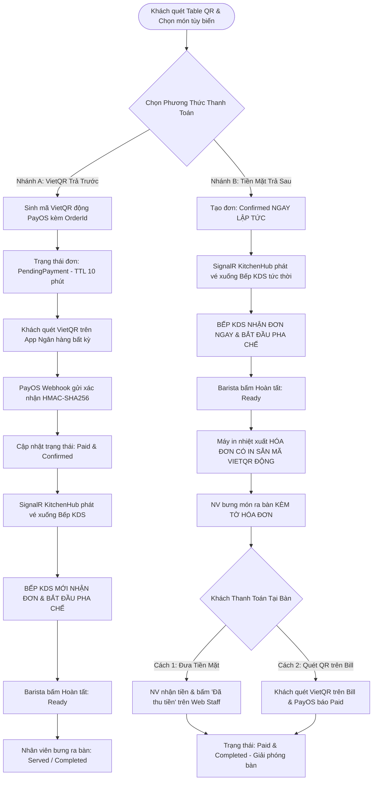

# 📋 QUY TRÌNH 01: PHÂN TÍCH & LÀM RÕ YÊU CẦU NGHIỆP VỤ (SRS)
## HỆ THỐNG SMART F&B OPERATING SYSTEM (SMART F&B OS)

> [!NOTE]
> **Mã tài liệu:** `SPEC-REQ-01` | **Phiên bản:** `v2.5.0-Production-Ready`  
> **Nguồn sự thật chuẩn hóa:** `01_Tai_Lieu_Dac_Ta_Goc/` (`Smart_FB_Operating_System.md`, `Actor_Phan_Quyen_Chuc_Nang.md`, `Tong_Quan_Kien_Truc_He_Thong.md`, `Workflow_Quy_Trinh_Nghiep_Vu.md`)  
> **Quy mô dự án:** Đồ án Capstone 16 tuần (08 Sprints) — Nhóm 4 Kỹ sư Phần mềm (2 Backend + 2 Frontend).  
> **Kiến trúc công nghệ:** .NET 8 Clean Architecture (Backend) + Next.js 14 App Router Monorepo (Frontend) + PostgreSQL 16 (25 Bảng 3NF) + Redis 7 + SignalR Hubs + Google Gemini 1.5 Flash.  
> **Cam kết chất lượng:** Chuẩn hóa toàn diện 62 Tính năng cốt lõi trên 4 Actor, Zero Placeholder, 100% hoàn chỉnh logic, bảng schema, quy tắc nghiệp vụ và tiêu chí nghiệm thu.

---

# 📑 MỤC LỤC TÀI LIỆU

1. [Tổng Quan Hệ Thống & Bối Cảnh Nghiệp Vụ](#1-tổng-quan-hệ-thống--bối-cảnh-nghiệp-vụ)
2. [Đặc Tả 4 Động Cơ Vận Hành Cốt Lõi (Core Business Engines)](#2-đặc-tả-4-động-cơ-vận-hành-cốt-lõi-core-business-engines)
   - 2.1 [Động cơ Đặt món tại bàn Dine-In 2 Nhánh độc lập](#21-động-cơ-đặt-món-tại-bàn-dine-in-2-nhánh-độc-lập)
   - 2.2 [Động cơ Đặt giao hàng tận nơi (QR Delivery 20k)](#22-động-cơ-đặt-giao-hàng-tận-nơi-qr-delivery-20k)
   - 2.3 [Động cơ Bán mang về tại quầy (Takeaway Web POS & 10 Ly tặng 1)](#23-động-cơ-bán-mang-về-tại-quầy-takeaway-web-pos--10-ly-tặng-1)
   - 2.4 [Động cơ Chấm công Khóa mạng WiFi (WiFi-Locked Attendance)](#24-động-cơ-chấm-công-khóa-mạng-wifi-wifi-locked-attendance)
3. [Danh Mục Các Khái Niệm Cũ Đã Loại Bỏ Vĩnh Viễn](#3-danh-mục-các-khái-niệm-cũ-đã-loại-bỏ-vĩnh-viễn)
4. [Đặc Tả Chi Tiết 62 Tính Năng Cốt Lõi Theo 4 Actor](#4-đặc-tả-chi-tiết-62-tính-năng-cốt-lõi-theo-4-actor)
   - 4.1 [Actor 1: Khách Hàng (Customer — 20 Features: C-01 ~ C-20)](#41-actor-1-khách-hàng-customer--20-features-c-01--c-20)
   - 4.2 [Actor 2: Nhân Viên Vận Hành Quầy & Bếp (Staff / Barista — 13 Features: S-01 ~ S-13)](#42-actor-2-nhân-viên-vận-hành-quầy--bếp-staff--barista--13-features-s-01--s-13)
   - 4.3 [Actor 3: Quản Lý Chi Nhánh (Branch Manager — 12 Features: M-01 ~ M-12)](#43-actor-3-quản-lý-chi-nhánh-branch-manager--12-features-m-01--m-12)
   - 4.4 [Actor 4: Chủ Chuỗi / Quản Trị Viên (Chain Admin — 17 Features: A-01 ~ A-17)](#44-actor-4-chủ-chuỗi--quản-trị-viên-chain-admin--17-features-a-01--a-17)
5. [Yêu Cầu Phi Chức Năng (Non-Functional Requirements - NFRs)](#5-yêu-cầu-phi-chức-năng-non-functional-requirements---nfrs)
   - 5.1 [Chỉ Số Hiệu Năng & Độ Trễ (Performance SLAs)](#51-chỉ-số-hiệu-năng--độ-trễ-performance-slas)
   - 5.2 [An Toàn Thông Tin & Ma Trận Phân Quyền RBAC (Security & Access Control)](#52-an-toàn-thông-tin--ma-trận-phân-quyền-rbac-security--access-control)
   - 5.3 [Độ Tin Cậy & Tính Sẵn Sàng (Reliability & Availability)](#53-độ-tin-cậy--tính-sẵn-sàng-reliability--availability)
   - 5.4 [Khả Năng Sử Dụng & Trải Nghiệm Người Dùng (Usability & Accessibility)](#54-khả-năng-sử-dụng--trải-nghiệm-người-dùng-usability--accessibility)
6. [Ma Trận Truy Vết Yêu Cầu Nghiệp Vụ (Requirements Traceability Matrix - RTM)](#6-ma-trận-truy-vết-yêu-cầu-nghiệp-vụ-requirements-traceability-matrix---rtm)

---

# 1. TỔNG QUAN HỆ THỐNG & BỐI CẢNH NGHIỆP VỤ

### 1.1 Tuyên Bố Vấn Đề (Problem Statement & 8 F&B Pains)
Ngành kinh doanh dịch vụ ăn uống (F&B), đặc biệt là các chuỗi cà phê, trà sữa quy mô vừa và nhỏ (SMB) tại Việt Nam, đang đối mặt với 8 thách thức vận hành sống còn:
1. **Nghẽn cổ chai tại quầy thu ngân:** Vào khung giờ cao điểm (08:00 - 09:30 và 12:30 - 13:30), khách hàng phải xếp hàng dài chờ gọi món và thanh toán, dẫn đến tỷ lệ bỏ hàng (drop-off) lên tới 15-20%.
2. **Sai lệch đơn hàng do thao tác thủ công:** Nhân viên ghi nhận sai tùy chỉnh (mức đường, mức đá, loại topping, loại sữa hạt), gây lãng phí nguyên liệu và làm giảm chỉ số hài lòng khách hàng (CSAT).
3. **Thất thoát doanh thu & Gian lận tiền mặt:** Mô hình gọi món tại bàn trả sau truyền thống dễ phát sinh nhầm bill, thất thoát tiền mặt hoặc khách rời đi khi chưa thanh toán xong.
4. **Chi phí hoa hồng cao từ ứng dụng giao hàng bên thứ ba:** Phí chiết khấu từ 20% đến 30% trên các sàn giao đồ ăn làm xói mòn biên lợi nhuận ròng của các thương hiệu F&B.
5. **Giao tiếp bất đồng bộ giữa Quầy Bar và Bếp (KDS):** Truyền đạt order bằng giấy in nhiệt hoặc gọi miệng gây trễ đơn, mất bill, không kiểm soát được thời gian hoàn thành (Order Lead Time).
6. **Thất thoát kho & Hao hụt nguyên vật liệu:** Không có công thức định mức (BOM) tự động trừ kho tức thời khi pha chế; việc đối soát tồn kho sổ sách và thực tế mất nhiều giờ cuối ngày.
7. **Chấm công thiếu chính xác & Gian lận vị trí:** Máy chấm công vân tay dễ hư hỏng do dầu mỡ; chấm công GPS di động dễ bị giả lập tọa độ (Fake GPS) hoặc sai lệch lớn trong nhà/tầng hầm.
8. **Thiếu năng lực dữ liệu & Cá nhân hóa tiếp thị:** Các chương trình khuyến mãi và combo món được tạo theo cảm tính thay vì dựa trên phân tích giỏ hàng thực tế.

### 1.2 Giải Pháp Smart F&B OS
**Smart F&B OS** là nền tảng quản trị và vận hành F&B thông minh all-in-one, xây dựng trên kiến trúc Web-First hiện đại (.NET 8 Clean Architecture + Next.js 14 App Router Monorepo) tích hợp Trí tuệ nhân tạo (Google Gemini 1.5 Flash RAG & Apriori Combo Mining Engine). Hệ thống loại bỏ 100% nhu cầu cài đặt app phức tạp cho cả khách hàng và nhân viên, số hóa trọn vẹn chu trình đặt món, chế biến, thanh toán, kho quỹ và nhân sự.

```
┌──────────────────────────────────────────────────────────────────────────────────────────────────┐
│                             5 NGUYÊN TẮC THIẾT KẾ BẤT BIẾN (SYSTEM INVARIANTS)                   │
├───────────────────────────────────┬──────────────────────────────────────────────────────────────┤
│ 1. 100% Web-First Monorepo        │ Không phát triển Staff Mobile App (Flutter/React Native).     │
│    Zero Hardware Dependency       │ 100% vận hành trên Next.js 14 Responsive (PWA, KDS, POS, Web)│
├───────────────────────────────────┼──────────────────────────────────────────────────────────────┤
│ 2. Chấm Công Khóa Mạng WiFi       │ Bỏ 100% GPS 50m và QR 30s. Xác thực Dual-Check: BSSID Router │
│    (WiFi-Locked Dual-Factor)      │ + Dải IP Gateway chi nhánh + Mã số nhân viên hợp lệ.         │
├───────────────────────────────────┼──────────────────────────────────────────────────────────────┤
│ 3. Dine-In 2 Nhánh Thanh Toán     │ Nhánh A: VietQR trả trước (Bếp nhận khi PayOS Paid).         │
│    Độc Lập & Minh Bạch            │ Nhánh B: Tiền mặt trả sau (Bếp nhận ngay, Bill in sẵn VietQR)│
├───────────────────────────────────┼──────────────────────────────────────────────────────────────┤
│ 4. Takeaway POS & Tích 10 Ly      │ Đơn Takeaway tạo trực tiếp trên Web POS quầy, không dùng QR. │
│    Độc Quyền Mang Về              │ Quy tắc tích lũy 10 ly tặng 1 ly CHỈ ÁP DỤNG DUY NHẤT CHO    │
│                                   │ ĐƠN TAKEAWAY (Không áp dụng Dine-In, Không áp dụng Delivery).│
├───────────────────────────────────┼──────────────────────────────────────────────────────────────┤
│ 5. Chain Admin Full CRUD          │ Chủ chuỗi toàn quyền CRUD Món ăn, Size, BOM, Giá vùng,       │
│    & Human-in-the-loop AI         │ phê duyệt Combo AI-2 Apriori và giám sát P&L hợp nhất.       │
└───────────────────────────────────┴──────────────────────────────────────────────────────────────┘
```

---

# 2. ĐẶC TẢ 4 ĐỘNG CƠ VẬN HÀNH CỐT LÕI (CORE BUSINESS ENGINES)

## 2.1 Động cơ Đặt món tại bàn Dine-In 2 Nhánh độc lập

Khách hàng ngồi tại bàn quét mã QR tĩnh (chứa chữ ký bảo mật HMAC-SHA256). Sau khi hoàn tất chọn món và tùy biến BOM, khách chọn 1 trong 2 nhánh thanh toán:



> [!IMPORTANT]
> **Điểm mấu chốt phân định 2 nhánh Dine-In:**
> - **Nhánh A (VietQR Trả Trước):** Bếp KDS **CHỈ NHẬN ĐƠN** sau khi PayOS gửi Webhook xác nhận đã nhận đủ tiền (`Status == Paid`). Nếu quá 10 phút khách không thanh toán, đơn tự động hủy (`Cancelled`).
> - **Nhánh B (Tiền Mặt Trả Sau):** Bếp KDS **NHẬN ĐƠN NGAY LẬP TỨC** (`Status == Confirmed`). Hóa đơn in ra bắt buộc có in sẵn mã VietQR động để khách có thể linh hoạt trả tiền mặt hoặc quét mã chuyển khoản tại bàn.

---

## 2.2 Động cơ Đặt giao hàng tận nơi (QR Delivery 20k)

Quy trình giao hàng tận nơi được tối ưu hóa cho mô hình tự vận hành của chuỗi:
1. **Tiếp cận:** Khách quét mã QR Delivery (trên poster, tờ rơi, bao bì ly, mạng xã hội) hoặc truy cập URL `/order/delivery?branchId={guid}`.
2. **Chuyển đổi giao diện:** Ứng dụng PWA tự động kích hoạt chế độ `OrderType = "Delivery"`.
3. **Bắt buộc nhập dữ liệu:** Khách hàng bắt buộc điền:
   - Họ và tên người nhận (`recipient_name`).
   - Số điện thoại người nhận (`recipient_phone` — chuẩn Regex 10 số di động Việt Nam `^(0[3|5|7|8|9])+([0-9]{8})$`).
   - Địa chỉ giao hàng chi tiết (`delivery_address` — số nhà, tên đường, phường/xã, quận/huyện).
4. **Phí vận chuyển cố định:** Hệ thống tự động cộng **Phí ship cố định 20.000 VNĐ** (`delivery_fee = 20000`) vào tổng giá trị đơn hàng.
5. **Thanh toán bắt buộc 100% VietQR trước (No COD):** Khóa hoàn toàn tùy chọn thanh toán tiền mặt khi nhận hàng (COD) nhằm loại trừ 100% rủi ro bùng đơn và chi phí hoàn hàng.
6. **Xử lý đơn:** Sau khi thanh toán `Paid`, đơn hàng chuyển xuống KDS Bếp pha chế ➔ Đóng gói ➔ Chuyển giao cho Shipper (`Delivering`) ➔ Xác nhận giao thành công (`Completed`).

---

## 2.3 Động cơ Bán mang về tại quầy (Takeaway Web POS & 10 Ly tặng 1)

Quy trình bán mang về tại quầy được thiết kế phục vụ tối đa tốc độ thao tác của thu ngân:
1. **Không quét QR:** Khách hàng mua mang đi tại quầy không cần quét mã QR.
2. **Thao tác Web POS:** Nhân viên thu ngân thao tác trực tiếp trên giao diện **Web POS Quầy** (`(staff)/pos`) trên máy tính bảng hoặc PC quầy.
3. **Tra cứu CRM & Định danh:** Thu ngân hỏi và nhập Số điện thoại của khách:
   - *Khách hàng mới:* Hệ thống tự động khởi tạo hồ sơ CRM với `cup_balance = 0`.
   - *Khách hàng cũ:* Hiển thị tên, lịch sử món yêu thích và số ly tích lũy hiện có `cup_balance` (dạng `x/10 ly`).
4. **Quy tắc Loyalty 10 ly = tặng 1 ly miễn phí:** **CHỈ ÁP DỤNG DUY NHẤT CHO ĐƠN TAKEAWAY**. Khi khách tích đủ $\ge 10$ ly (`cup_balance >= 10`), màn hình Web POS tự động làm sáng nút "Đổi 1 Ly Miễn Phí" (hệ thống tự động trừ 10 ly trong quỹ tích lũy và chiết khấu 100% giá của 01 ly tiêu chuẩn trong đơn).
5. **Pha chế ngay:** Đơn Takeaway được chuyển ngay sang KDS Bếp với trạng thái `Confirmed` và cấp mã số thứ tự nhận đồ (Pickup Ticket #01, #02...).
6. **Thanh toán sau (Post-payment):** Khách nhận đồ uống tại quầy và thanh toán bằng Tiền mặt (Web POS tự tính tiền thừa) hoặc quét mã VietQR tĩnh/động tại quầy ➔ Đóng đơn `Completed`.

---

## 2.4 Động cơ Chấm công Khóa mạng WiFi (WiFi-Locked Attendance)

Quy trình kiểm thực chấm công loại bỏ 100% các giải pháp lỗi thời (GPS 50m dễ bị Fake GPS; QR 30s gây phiền toái):
1. **Kết nối mạng nội bộ:** Nhân viên đến quán, kết nối điện thoại/máy tính vào mạng WiFi nội bộ của chi nhánh.
2. **Truy cập Web Staff:** Mở phân hệ chấm công tại `(staff)/attendance`.
3. **Nhập mã định danh:** Nhân viên nhập Mã số nhân viên (`employee_code`) và bấm "Vào ca" (`ClockIn`) hoặc "Ra ca" (`ClockOut`).
4. **Cơ chế kiểm thực kép (Dual-Factor Verification):** Backend .NET 8 kiểm tra đồng thời:
   - *Lớp mạng phần cứng:* BSSID (Địa chỉ MAC của Router/Access Point WiFi) hoặc IP Subnet của thiết bị gửi lên có khớp với danh sách khai báo trong bảng `branch_wifi_configs` không.
   - *Lớp nhân sự:* Mã số nhân viên có hợp lệ, đang kích hoạt và có lịch phân ca trong ngày hay không.
5. **Kết quả:**
   - *Hợp lệ:* Ghi nhận bản ghi chấm công chính xác vào bảng `attendances` (trạng thái `OnTime` hoặc `Late`).
   - *Sai mạng / Dùng 4G/5G:* Từ chối 100% và hiển thị cảnh báo `LỖI: Thiết bị chưa kết nối đúng WiFi chi nhánh`.

---

# 3. DANH MỤC CÁC KHÁI NIỆM CŨ ĐÃ LOẠI BỎ VĨNH VIỄN

```
┌──────────────────────────────────────────────────────────────────────────────────────────────────┐
│                         MA TRẬN CÁC KHÁI NIỆM ĐÃ LOẠI BỎ VĨNH VIỄN (REMOVED CONCEPTS)             │
├────┬───────────────────────────────┬───────────────────────────────┬────────────────────────────┤
│ STT│ Khái Niệm Phế Truất (BỎ)      │ Lý Do Kỹ Thuật & Vận Hành     │ Giải Pháp Thay Thế Chuẩn   │
├────┼───────────────────────────────┼───────────────────────────────┼────────────────────────────┤
│ 01 │ Staff Mobile App              │ Tốn chi phí build đa nền tảng,│ Hợp nhất 100% trên Web     │
│    │ (Flutter / React Native)      │ duyệt App Store phức tạp.     │ Responsive POS & KDS.      │
├────┼───────────────────────────────┼───────────────────────────────┼────────────────────────────┤
│ 02 │ Chấm công Định vị GPS 50m     │ Sai số lớn trong nhà/tầng hầm,│ Chấm công Khóa mạng WiFi   │
│    │                               │ dễ bị giả lập Fake GPS.       │ (BSSID + IP Subnet + Mã NV)│
├────┼───────────────────────────────┼───────────────────────────────┼────────────────────────────┤
│ 03 │ Mã QR Động Xoay 30 Giây       │ Thao tác phiền hà, tốn tài    │ Xác thực WiFi Router phần  │
│    │                               │ nguyên sinh mã liên tục.      │ cứng kết hợp Mã số NV.     │
├────┼───────────────────────────────┼───────────────────────────────┼────────────────────────────┤
│ 04 │ Tính năng C-23 (Chia sẻ MXH)  │ Ngoài phạm vi cốt lõi MVP,    │ Chuyển sang danh mục       │
│    │ & C-24 (Push Notification)    │ không phục vụ luồng vận hành. │ Scale Up / Future Work.    │
├────┼───────────────────────────────┼───────────────────────────────┼────────────────────────────┤
│ 05 │ Ví Voucher độc lập riêng lẻ   │ Rườm rà, tăng ma sát UI.      │ Tích hợp trực tiếp vào     │
│    │                               │                               │ Giỏ hàng & Checkout.       │
├────┼───────────────────────────────┼───────────────────────────────┼────────────────────────────┤
│ 06 │ Màn hình Tra cứu Calo riêng lẻ│ Tách rời trải nghiệm gọi món. │ Tích hợp trực tiếp vào chi │
│    │                               │                               │ tiết món & AI-1 Gemini RAG.│
└────┴───────────────────────────────┴───────────────────────────────┴────────────────────────────┘
```

---

# 4. ĐẶC TẢ CHI TIẾT 62 TÍNH NĂNG CỐT LÕI THEO 4 ACTOR

Hệ thống phân định chính xác **62 tính năng cốt lõi**:
- **Khách Hàng (Customer):** 20 tính năng (`C-01` ~ `C-20`)
- **Nhân Viên Quầy & Bếp (Staff / Barista):** 13 tính năng (`S-01` ~ `S-13`)
- **Quản Lý Chi Nhánh (Branch Manager):** 12 tính năng (`M-01` ~ `M-12`)
- **Chủ Chuỗi / Admin (Chain Admin):** 17 tính năng (`A-01` ~ `A-17`)
- **Tổng cộng:** $20 + 13 + 12 + 17 = 62$ tính năng.

---

## 4.1 ACTOR 1: KHÁCH HÀNG (CUSTOMER — 20 FEATURES: `C-01` ~ `C-20`)

Giao diện thực thi: **Web PWA Mobile-First** (`(customer)`).

### C-01: Quét mã QR bàn tại quán (Dine-in QR Scan)
- **Mô Tả:** Khách hàng ngồi tại bàn dùng camera điện thoại quét mã QR tĩnh dán trên bàn (URL: `https://domain.com/order?branchId={guid}&tableId={guid}&token={hmac}`). Hệ thống xác thực chữ ký số HMAC-SHA256, khởi tạo phiên gọi món gắn với bàn và chi nhánh.
- **Quy Tắc & Ràng Buộc:** Chữ ký HMAC không hợp lệ hoặc bàn đang bị khóa (`Inactive`) ➔ từ chối truy cập. Tự động cấp Anonymous JWT lưu tại `sessionStorage`.
- **Input Schema:** `{ branchId: UUID, tableId: UUID, token: String }`
- **Output Schema:** `{ sessionId: String, branchName: String, tableName: String, menuCategories: CategoryDTO[] }`
- **Edge Cases:** QR bị mờ/mất góc ➔ Khách nhập mã bàn 4 số thủ công với sự hỗ trợ của nhân viên.
- **Tiêu Chí Nghiệm Thu:** Quét QR mở Menu đúng bàn và chi nhánh trong $< 500$ms, không cần đăng nhập tài khoản.

### C-02: Quét mã QR đặt hàng tận nơi (Delivery QR Scan)
- **Mô Tả:** Khách quét QR Delivery trên poster/bao bì hoặc truy cập URL `/order/delivery?branchId={guid}`. PWA chuyển sang chế độ `Delivery`, yêu cầu nhập địa chỉ và áp dụng phí vận chuyển 20.000 VNĐ cố định.
- **Quy Tắc & Ràng Buộc:** Đơn Delivery bắt buộc thanh toán 100% VietQR trước; không hỗ trợ thanh toán tiền mặt khi nhận hàng (No COD).
- **Input Schema:** `{ branchId: UUID }`
- **Output Schema:** `{ branchInfo: BranchDTO, deliveryFee: 20000, menu: CategoryDTO[] }`
- **Edge Cases:** Chi nhánh tạm ngừng nhận đơn Delivery do quá tải ➔ thông báo khung giờ mở lại và gợi ý chi nhánh lân cận.
- **Tiêu Chí Nghiệm Thu:** Khởi tạo giỏ hàng Delivery với phí ship mặc định 20.000 VNĐ được cộng tự động vào tổng tiền.

### C-03: Xem thực đơn số tương tác đa chi nhánh (Digital Menu Browsing)
- **Mô Tả:** Khách lướt xem thực đơn với ảnh WebP sắc nét, phân theo danh mục (Cà phê, Trà sữa, Trà trái cây, Bánh ngọt), hiển thị giá chuẩn theo chi nhánh, nhãn `New`, `Bestseller`, và nhãn `Tạm Hết (86)`.
- **Quy Tắc & Ràng Buộc:** Dữ liệu đọc từ Redis cache `menu:branch:{id}`. Món bị khóa `is_available_86 = false` hiển thị mờ kèm nhãn "Tạm hết" và khóa nút thêm vào giỏ.
- **Input Schema:** `{ branchId: UUID, categoryId?: UUID }`
- **Output Schema:** `{ categories: CategoryDTO[], products: ProductDTO[] }`
- **Edge Cases:** Mạng di động yếu ➔ PWA tải thumbnail nén nhẹ trước, sau đó nạp ảnh Progressive WebP.
- **Tiêu Chí Nghiệm Thu:** Tải toàn bộ danh mục thực đơn chi nhánh trong $< 200$ms từ Redis Cache.

### C-04: Tìm kiếm & Lọc món thông minh (Smart Search & Filtering)
- **Mô Tả:** Tìm kiếm món theo tên, nguyên liệu, khoảng giá và các thẻ lọc thuộc tính (ít ngọt, không sữa bò, thuần chay, calo thấp).
- **Quy Tắc & Ràng Buộc:** Sử dụng PostgreSQL Full-Text Search không dấu kết hợp bộ lọc JSONB. Thời gian phản hồi $< 50$ms.
- **Input Schema:** `{ query: String, minPrice?: Decimal, maxPrice?: Decimal, tags?: String[] }`
- **Output Schema:** `{ items: ProductDTO[], totalCount: Int }`
- **Edge Cases:** Không tìm thấy món phù hợp ➔ gợi ý 3 món Bestseller và nút gọi Trợ lý AI tư vấn.
- **Tiêu Chí Nghiệm Thu:** Tìm kiếm trả về kết quả chính xác cả khi gõ tiếng Việt có dấu, không dấu hoặc sai chính tả nhẹ.

### C-05: Tùy biến món & Tùy chọn định lượng BOM (Item Customization & Modifiers)
- **Mô Tả:** Mở Drawer chi tiết món cho phép chọn Size (S/M/L), Mức đường (0%, 30%, 50%, 70%, 100%), Mức đá (Không đá, Ít đá, Bình thường, Uống nóng), Topping thêm và Ghi chú riêng cho Barista.
- **Quy Tắc & Ràng Buộc:** Tính phụ thu chính xác theo Size và Topping. Kiểm tra tính tương thích với định mức BOM của món.
- **Input Schema:** `{ productId: UUID, sizeId: UUID, sweetness: Int, ice: Int, modifierIds: UUID[], customerNote?: String }`
- **Output Schema:** `{ customizedItemTotal: Decimal, summaryText: String }`
- **Edge Cases:** Khách ghi chú mâu thuẫn ("Cho 0% đường nhưng ngọt lịm") ➔ hiển thị cảnh báo hướng dẫn chọn đúng mức đường.
- **Tiêu Chí Nghiệm Thu:** Tổng giá tiền nhảy tức thì theo thời gian thực khi khách bấm chọn Topping hoặc đổi Size.

### C-06: Quản lý giỏ hàng tạm thời (Cart Management)
- **Mô Tả:** Lưu trữ danh sách món đã chọn, số lượng, tùy biến chi tiết và tổng giá trị tạm tính. Hỗ trợ tăng/giảm số lượng, chỉnh sửa tùy biến món hoặc xóa món.
- **Quy Tắc & Ràng Buộc:** Quản lý Client State bằng Zustand/SessionStorage. Giới hạn tối đa 20 ly/món trong một đơn.
- **Input Schema:** `{ action: "add" | "update" | "delete" | "clear", itemPayload: CartItemDTO }`
- **Output Schema:** `{ cartItems: CartItemDTO[], subTotal: Decimal, itemCount: Int }`
- **Edge Cases:** Món trong giỏ vừa bị Barista bật 86-Toggle hết hàng ➔ PWA đánh dấu đỏ món đó và yêu cầu xóa/đổi trước khi thanh toán.
- **Tiêu Chí Nghiệm Thu:** Giữ nguyên trạng thái giỏ hàng khi khách vô tình tải lại trang (reload) hoặc tắt trình duyệt mở lại.

### C-07: Áp dụng mã khuyến mãi & Voucher giảm giá (Voucher Application)
- **Mô Tả:** Khách nhập mã voucher giảm giá hoặc chọn voucher khả dụng trong ví. Hệ thống kiểm tra điều kiện (đơn tối thiểu, hạn dùng, lượt dùng) và trừ tiền trực tiếp trên tổng đơn.
- **Quy Tắc & Ràng Buộc:** Tối đa 01 voucher/đơn hàng. Không áp dụng nếu giá trị món chưa đạt mức tối thiểu.
- **Input Schema:** `{ voucherCode: String, cartSubtotal: Decimal, branchId: UUID }`
- **Output Schema:** `{ discountAmount: Decimal, finalTotal: Decimal, message: String }`
- **Edge Cases:** Voucher hết lượt dùng đồng thời ngay tại thời điểm khách bấm áp dụng ➔ hiển thị thông báo lỗi rõ ràng.
- **Tiêu Chí Nghiệm Thu:** Chiết khấu đúng số tiền (theo % có giới hạn trần hoặc số tiền cố định) và cập nhật tổng thanh toán ngay lập tức.

### C-08: Đặt món & Trả trước VietQR (VietQR Pre-payment Path)
- **Mô Tả:** Áp dụng cho Dine-In Nhánh A và 100% đơn Delivery. Sinh mã VietQR động PayOS chuẩn NAPAS 247 kèm số tiền chính xác và nội dung `FB{OrderCode}`. Khách quét mã chuyển tiền qua App Ngân hàng.
- **Quy Tắc & Ràng Buộc:** Đơn chuyển sang `Paid` khi nhận Webhook PayOS (HMAC-SHA256). Bếp KDS **CHỈ NHẬN ĐƠN** sau khi đã thanh toán thành công. Đơn tự hủy sau 10 phút nếu không thanh toán.
- **Input Schema:** `{ orderId: UUID, amount: Decimal, paymentMethod: "VietQR" }`
- **Output Schema:** `{ qrCodeUrl: String, accountNumber: String, transferContent: String, expiresAt: DateTime }`
- **Edge Cases:** Khách chuyển khoản thiếu tiền ➔ Webhook PayOS báo giao dịch chưa khớp, hệ thống hiển thị số tiền còn thiếu và sinh QR phần bù.
- **Tiêu Chí Nghiệm Thu:** Màn hình tự động chuyển sang trang theo dõi đơn ngay trong $< 1$ giây sau khi PayOS gửi Webhook thanh toán thành công.

### C-09: Đặt món & Trả tiền mặt sau tại bàn (Cash Post-payment Path)
- **Mô Tả:** Áp dụng riêng cho Dine-In Nhánh B. Khách chọn thanh toán tiền mặt tại bàn và bấm Đặt món. Hệ thống tạo đơn với trạng thái `Confirmed` ngay lập tức và bắn thẳng vào KDS Bếp qua SignalR để Barista pha chế.
- **Quy Tắc & Ràng Buộc:** Đơn được đưa vào bếp pha chế ngay. Barista làm xong xuất Hóa đơn có in sẵn mã VietQR động để nhân viên bưng ra bàn. Khách trả tiền mặt hoặc quét VietQR trên bill.
- **Input Schema:** `{ orderId: UUID, paymentMethod: "Cash", tableId: UUID }`
- **Output Schema:** `{ orderCode: String, status: "Confirmed", estimatedMinutes: Int }`
- **Edge Cases:** Khách đổi ý quét VietQR trên hóa đơn khi nhân viên mang đồ ra ➔ PayOS Webhook tự động cập nhật trạng thái đơn sang `Paid`.
- **Tiêu Chí Nghiệm Thu:** Đơn xuất hiện trên KDS Bếp trong $< 500$ms kể từ khi khách bấm xác nhận trên PWA.

### C-10: Đặt đơn giao hàng tận nơi (Delivery Order Placement)
- **Mô Tả:** Khách đặt đơn Delivery điền đầy đủ Tên, SĐT, Địa chỉ giao hàng. Hệ thống tự động cộng phí ship 20.000 VNĐ và chuyển sang cổng thanh toán VietQR trả trước bắt buộc.
- **Quy Tắc & Ràng Buộc:** Bắt buộc SĐT 10 số VN hợp lệ. Bắt buộc thanh toán 100% VietQR trước (Khóa hoàn toàn COD).
- **Input Schema:** `{ recipientName: String, recipientPhone: String, deliveryAddress: String, deliveryNotes?: String }`
- **Output Schema:** `{ orderId: UUID, orderCode: String, totalAmount: Decimal, vietQrData: VietQrDTO }`
- **Edge Cases:** Khách nhập sai định dạng SĐT ➔ Validation chặn trực tiếp tại client kèm thông báo lỗi cụ thể.
- **Tiêu Chí Nghiệm Thu:** Tạo đơn Delivery thành công với `delivery_fee = 20000` và chuyển thẳng đến màn hình quét VietQR.

### C-11: Theo dõi đơn hàng thời gian thực qua SignalR (Real-time Order Tracking)
- **Mô Tả:** Màn hình Live Tracking hiển thị tiến trình xử lý đơn hàng theo 5 nấc trực quan: (1) Đã tiếp nhận ➔ (2) Bếp đang pha chế ➔ (3) Đã pha chế xong / Đang giao ➔ (4) Hoàn thành ➔ (5) Đã thanh toán.
- **Quy Tắc & Ràng Buộc:** Nhận sự kiện thời gian thực từ SignalR `OrderHub`. Khi đơn chuyển sang `Ready`, PWA phát âm thanh chuông báo và rung thiết bị.
- **Input Schema:** `{ orderId: UUID, connectionId: String }`
- **Output Schema:** `{ status: OrderStatusEnum, stepIndex: Int, estimatedMinutes: Int, updatedAt: DateTime }`
- **Edge Cases:** Mất kết nối mạng ➔ PWA tự động kết nối lại SignalR và gọi API lấy trạng thái mới nhất khi có mạng.
- **Tiêu Chí Nghiệm Thu:** Giao diện đổi trạng thái tức thì không cần tải lại trang (reload) trong $< 500$ms sau khi Barista bấm trên KDS.

### C-12: Gọi nhân viên phục vụ tại bàn (Call Staff / Service Request)
- **Mô Tả:** Khách ngồi tại bàn bấm "Gọi nhân viên" trên PWA, chọn lý do: Xin thêm nước lọc, Thêm muỗng/ống hút, Dọn bàn hoặc Yêu cầu khác.
- **Quy Tắc & Ràng Buộc:** Gửi thông báo chuông tới Web Staff tại quầy. Giới hạn chống spam (Rate limit): 1 lần / 2 phút / bàn.
- **Input Schema:** `{ tableId: UUID, requestType: "Water" | "Utensils" | "Clean" | "Other", note?: String }`
- **Output Schema:** `{ requestId: UUID, status: "Sent", message: String }`
- **Edge Cases:** Nhân viên chưa nhận sau 3 phút ➔ hệ thống nâng mức cảnh báo màu cam trên Web Manager.
- **Tiêu Chí Nghiệm Thu:** Web Staff quầy reo chuông và hiển thị pop-up bàn cần phục vụ trong $< 500$ms.

### C-13: Yêu cầu in tạm tính tại bàn (Request Bill & Pre-check Receipt)
- **Mô Tả:** Khách bấm "Yêu cầu thanh toán" trên PWA. Màn hình hiển thị phiếu tạm tính chi tiết (món, VAT, giảm giá, tổng tiền, mã VietQR). Hệ thống gửi thông báo tới Web Staff để nhân viên mang hóa đơn ra bàn.
- **Quy Tắc & Ràng Buộc:** Khóa giỏ hàng của bàn (không cho đặt thêm món mới trừ khi nhân viên mở lại bàn).
- **Input Schema:** `{ orderId: UUID, tableId: UUID }`
- **Output Schema:** `{ precheckBill: BillDetailDTO, qrCodeUrl: String }`
- **Edge Cases:** Khách muốn tách bill ➔ nhân viên thực hiện thao tác tách món trên Web POS quầy.
- **Tiêu Chí Nghiệm Thu:** Web Staff nhận thông báo yêu cầu in bill kèm âm thanh cảnh báo ngay lập tức.

### C-14: Chatbot AI-1 Gemini RAG tư vấn đồ uống (AI Drink Recommendation)
- **Mô Tả:** Trợ lý ảo AI trên PWA hỗ trợ khách trò chuyện tự nhiên bằng tiếng Việt để tìm đồ uống theo tâm trạng, khẩu vị, thời tiết và giới hạn dinh dưỡng/calo.
- **Quy Tắc & Ràng Buộc:** RAG truy xuất Menu + BOM còn hàng của chi nhánh + Dữ liệu thời tiết OpenWeather. Sử dụng Google Gemini 1.5 Flash. AI CHỈ gợi ý món đang CÒN HÀNG (`is_available_86 = true`).
- **Input Schema:** `{ userMessage: String, chatHistory: ChatMessageDTO[], branchId: UUID }`
- **Output Schema:** `{ aiResponseText: String, actionCards: ProductCardDTO[] }`
- **Edge Cases:** Khách hỏi nội dung ngoài phạm vi F&B ➔ AI lịch sự từ chối và hướng sự chú ý về thực đơn quán.
- **Tiêu Chí Nghiệm Thu:** Phản hồi câu trả lời kèm thẻ món có nút "+ Thêm vào giỏ" trong $< 2.5$ giây.

### C-15: Đăng ký/Đăng nhập thành viên CRM qua OTP (Member CRM Auth via Phone OTP)
- **Mô Tả:** Khách vãng lai nâng cấp thành hội viên CRM bằng cách nhập SĐT và xác thực OTP 6 số. Hệ thống tự động liên kết lịch sử đơn cũ với tài khoản thành viên.
- **Quy Tắc & Ràng Buộc:** Cấp JWT `AuthCustomer` thời hạn 30 ngày. Khóa tạm thời SĐT 15 phút nếu nhập sai OTP quá 5 lần liên tiếp.
- **Input Schema:** `{ phoneNumber: String, otpCode: String }`
- **Output Schema:** `{ jwtToken: String, refreshToken: String, customerProfile: CustomerProfileDTO }`
- **Edge Cases:** SMS OTP gửi chậm ➔ nút "Gửi lại mã OTP" khả dụng sau 60 giây đếm ngược.
- **Tiêu Chí Nghiệm Thu:** Xác thực OTP thành công cấp token và nạp ngay thông tin hạng thành viên, số ly tích lũy.

### C-16: Xem lịch sử đơn hàng & E-Receipt (Order History & E-Receipt)
- **Mô Tả:** Thành viên CRM xem toàn bộ lịch sử đơn hàng đã đặt (Dine-In, Delivery). Xem chi tiết hóa đơn điện tử, trạng thái thanh toán và mã giao dịch VietQR.
- **Quy Tắc & Ràng Buộc:** Khách vãng lai (`GuestCustomer`) chỉ xem được đơn trong phiên hiện tại. Thành viên xem toàn bộ lịch sử.
- **Input Schema:** `{ customerId: UUID, pageIndex: Int, pageSize: Int }`
- **Output Schema:** `{ orders: OrderSummaryDTO[], totalCount: Int }`
- **Edge Cases:** Đơn bị hủy ➔ hiển thị rõ lý do hủy (Khách hủy, Quá hạn 10 phút thanh toán, Quán hết món).
- **Tiêu Chí Nghiệm Thu:** Hiển thị E-Receipt chi tiết từng món, mức topping, giảm giá và mã giao dịch ngân hàng.

### C-17: Quản lý sổ địa chỉ & Hồ sơ cá nhân (Profile & Address Book)
- **Mô Tả:** Thành viên CRM cập nhật Họ tên, Email, Ngày sinh (nhận ưu đãi sinh nhật) và lưu danh bạ địa chỉ nhận hàng (Nhà riêng, Công ty) kèm địa chỉ mặc định.
- **Quy Tắc & Ràng Buộc:** Ngày sinh chỉ được cập nhật duy nhất 01 lần trong năm để chống trục lợi voucher sinh nhật.
- **Input Schema:** `{ fullName: String, email?: String, birthDate?: Date, addresses: AddressDTO[] }`
- **Output Schema:** `{ isSuccess: Boolean, updatedProfile: CustomerProfileDTO }`
- **Edge Cases:** Nhập email sai định dạng ➔ báo lỗi validation trực tiếp tại client.
- **Tiêu Chí Nghiệm Thu:** Lưu thành công địa chỉ giao hàng và tự động điền sẵn (autofill) khi đặt đơn Delivery lần sau.

### C-18: Đánh giá 1-5 sao chất lượng dịch vụ (Order Rating & Review)
- **Mô Tả:** Sau khi đơn hoàn thành, khách gửi đánh giá chất lượng từ 1 đến 5 sao cho từng món và phục vụ chung của quán kèm nhận xét bằng chữ.
- **Quy Tắc & Ràng Buộc:** Mỗi đơn hàng chỉ gửi đánh giá 1 lần trong 48 giờ. Đánh giá $\le 2$ sao tự động kích hoạt Webhook cảnh báo khẩn cấp tới Quản lý chi nhánh (`M-10`).
- **Input Schema:** `{ orderId: UUID, ratingStars: Int, itemRatings: ItemRatingDTO[], comment?: String, isAnonymous: Boolean }`
- **Output Schema:** `{ reviewId: UUID, thankYouMessage: String }`
- **Edge Cases:** Khách đánh giá 1 sao nhưng không ghi nhận xét ➔ PWA gợi ý các thẻ lý do nhanh ("Món ra chậm", "Đồ uống quá ngọt").
- **Tiêu Chí Nghiệm Thu:** Ghi nhận đánh giá vào DB và bắn cảnh báo tới Web Manager trong $< 500$ms nếu $\le 2$ sao.

### C-19: Tải ảnh phản hồi thực tế (Feedback Photo Upload)
- **Mô Tả:** Khách đính kèm tối đa 03 hình ảnh thực tế của món ăn khi gửi đánh giá. Ảnh được tự động nén, chuyển định dạng WebP và chờ Quản lý duyệt trước khi hiển thị công khai.
- **Quy Tắc & Ràng Buộc:** Chỉ chấp nhận JPEG/PNG/WEBP $\le 5$MB/ảnh. Ảnh phải được Quản lý chi nhánh duyệt (`M-11`) mới hiển thị công khai.
- **Input Schema:** `{ reviewId: UUID, imageFiles: MultipartFile[] }`
- **Output Schema:** `{ uploadedPhotoUrls: String[], moderationStatus: "Pending" }`
- **Edge Cases:** Tải file không phải ảnh (PDF, EXE) ➔ Middleware từ chối ngay lập tức.
- **Tiêu Chí Nghiệm Thu:** Tải ảnh lên thành công, nén WebP an toàn và lưu trữ với trạng thái `is_approved = false`.

### C-20: Gợi ý món ăn kèm & Combo đề xuất (Upselling & Cross-selling)
- **Mô Tả:** Tại bước giỏ hàng hoặc chi tiết món, PWA hiển thị thanh gợi ý các món ăn kèm (Bánh ngọt kèm cà phê, Topping đặc trưng) hoặc Combo ưu đãi từ mô hình AI-2 Apriori.
- **Quy Tắc & Ràng Buộc:** So khớp các luật kết hợp AI-2 Apriori đã được Admin duyệt (`A-13`). Không gợi ý món đã có trong giỏ hoặc món đang hết hàng.
- **Input Schema:** `{ currentCartProductIds: UUID[], branchId: UUID }`
- **Output Schema:** `{ suggestions: ProductSuggestionDTO[] }`
- **Edge Cases:** Giỏ hàng rỗng ➔ hiển thị danh sách 3 món Bestseller toàn chuỗi.
- **Tiêu Chí Nghiệm Thu:** Trả về danh sách 3 món gợi ý có độ tin cậy (`Confidence`) cao nhất kèm nút "+ Thêm nhanh" vào giỏ.

---

## 4.2 ACTOR 2: NHÂN VIÊN VẬN HÀNH QUẦY & BẾP (STAFF / BARISTA — 13 FEATURES: `S-01` ~ `S-13`)

Giao diện thực thi: **Web Responsive POS Quầy & Web KDS Fullscreen** (`(kds)`, `(staff)`). **100% không dùng Staff Mobile App**.

### S-01: Đăng nhập ca làm việc & Xác thực phiên quầy (Shift Login & POS Auth)
- **Mô Tả:** Nhân viên truy cập cổng Web Staff/KDS, nhập Mã nhân viên và Mật khẩu ca. Hệ thống xác thực danh tính, đối soát lịch phân ca và cấp JWT Token có phạm vi chi nhánh.
- **Quy Tắc & Ràng Buộc:** Nhân viên không có lịch phân ca trong ngày không thể đăng nhập trừ khi Quản lý duyệt cấp quyền vượt ca (`Manager Override`).
- **Input Schema:** `{ staffCode: String, password: String, branchId: UUID }`
- **Output Schema:** `{ jwtToken: String, staffName: String, assignedRole: String, shiftInfo: ShiftDTO }`
- **Edge Cases:** Nhập sai mật khẩu 3 lần ➔ khóa tài khoản 5 phút và thông báo tới Quản lý chi nhánh.
- **Tiêu Chí Nghiệm Thu:** Đăng nhập thành công chuyển hướng đúng giao diện theo vai trò (Barista vào KDS, Thu ngân vào POS).

### S-02: Chấm công Khóa mạng WiFi chi nhánh (WiFi-Locked Attendance)
- **Mô Tả:** Nhân viên thực hiện Check-in đầu ca và Check-out cuối ca trên Web Staff. Hệ thống kiểm tra BSSID của Access Point WiFi và IP Subnet chi nhánh kết hợp Mã số nhân viên.
- **Quy Tắc & Ràng Buộc:** Từ chối 100% nếu nhân viên sử dụng 4G/5G hoặc kết nối sai WiFi chi nhánh. Bỏ hoàn toàn GPS 50m và QR 30s.
- **Input Schema:** `{ staffCode: String, clientBSSID: String, clientIpAddress: String, actionType: "CheckIn" | "CheckOut" }`
- **Output Schema:** `{ attendanceId: UUID, checkTime: DateTime, status: "Valid", message: String }`
- **Edge Cases:** Router WiFi quán gặp sự cố mạng internet ➔ Quản lý sử dụng tài khoản Manager bấm xác nhận chấm công thủ công có lý do.
- **Tiêu Chí Nghiệm Thu:** Ghi nhận giờ chấm công chính xác vào bảng `attendances` khi kết nối đúng WiFi chi nhánh.

### S-03: Màn hình KDS Bếp hiển thị hàng đợi thời gian thực (Real-time KDS Queue)
- **Mô Tả:** Màn hình KDS hiển thị danh sách đơn cần pha chế dưới dạng các thẻ đơn (Order Cards) theo thứ tự thời gian. Đổi màu trực quan: Xanh lá ($< 5$ phút), Vàng (5-10 phút), Đỏ ($> 10$ phút).
- **Quy Tắc & Ràng Buộc:** Nhận đơn qua WebSocket SignalR `KitchenHub`. Đơn VietQR chỉ hiện khi `Paid`; Đơn tiền mặt Dine-In và Takeaway hiện ngay khi `Confirmed`.
- **Input Schema:** `{ branchId: UUID }` (SignalR subscription `branch_{branchId}_kitchen`)
- **Output Schema:** `{ orderId: UUID, orderCode: String, orderType: String, tableName?: String, items: KdsItemDTO[], elapsedSeconds: Int }`
- **Edge Cases:** Mất kết nối SignalR ➔ KDS hiện thanh cảnh báo đỏ "Offline" và tự động kích hoạt Polling API mỗi 5 giây.
- **Tiêu Chí Nghiệm Thu:** Thẻ đơn mới xuất hiện trên màn hình KDS kèm âm thanh chuông báo trong $< 500$ms sau khi hợp lệ thanh toán.

### S-04: Xem công thức định lượng BOM tiêu chuẩn (BOM Standard Recipe View)
- **Mô Tả:** Barista chạm vào món trên KDS để mở Modal tra cứu nhanh định mức nguyên vật liệu BOM chuẩn (ml trà, gam sữa, ml đường, topping) và quy trình pha chế.
- **Quy Tắc & Ràng Buộc:** Hiển thị công thức chuẩn đã được Admin phê duyệt (`A-10`). Highlight nổi bật các ghi chú đặc biệt của khách.
- **Input Schema:** `{ productId: UUID, sizeId: UUID }`
- **Output Schema:** `{ recipeName: String, ingredients: BomItemDetailDTO[], preparationSteps: String[] }`
- **Edge Cases:** Món có tùy biến đường/đá khác chuẩn ➔ tự động tính toán lại định lượng ml nước đường/đá viên hiển thị tương ứng.
- **Tiêu Chí Nghiệm Thu:** Mở modal công thức trong $< 100$ms với đầy đủ số liệu định lượng chi tiết.

### S-05: Cập nhật pha chế & Báo hoàn thành món (Preparation Status & Item Ready)
- **Mô Tả:** Barista chạm cảm ứng cập nhật tiến độ: Bấm "Bắt đầu làm" ➔ `Preparing`; Bấm "Hoàn thành" ➔ `Ready`. Hệ thống tự động trừ kho nguyên liệu theo BOM và phát SignalR thông báo.
- **Quy Tắc & Ràng Buộc:** Bấm Hoàn thành tự động kích hoạt trừ kho trong bảng `ingredients` và gửi thông báo `OrderReady` tới khách. Hỗ trợ nút Hoàn tác (Undo) trong 10 giây.
- **Input Schema:** `{ orderId: UUID, newStatus: "Preparing" | "Ready" }`
- **Output Schema:** `{ updatedStatus: OrderStatusEnum, deductedIngredients: StockDeductionDTO[] }`
- **Edge Cases:** Barista bấm nhầm Hoàn thành ➔ bấm nút "Hoàn tác" trong 10 giây để kéo thẻ đơn quay lại hàng đợi.
- **Tiêu Chí Nghiệm Thu:** Trừ kho nguyên liệu chính xác theo BOM và phát tín hiệu SignalR tới khách hàng trong $< 500$ms.

### S-06: Tạo đơn Takeaway tại quầy thu ngân Web POS (Takeaway Order Creation)
- **Mô Tả:** Khách mua mang đi đến quầy, thu ngân thao tác trên Web POS chọn món, tùy biến Size/Đường/Đá/Topping theo yêu cầu. Giao diện tối ưu cảm ứng và phím tắt.
- **Quy Tắc & Ràng Buộc:** Đơn Takeaway tạo tại quầy được cấp mã lấy đồ (Pickup Ticket #01, #02...). Không yêu cầu mã QR của khách.
- **Input Schema:** `{ branchId: UUID, orderItems: PosOrderItemDTO[], orderType: "Takeaway" }`
- **Output Schema:** `{ orderId: UUID, orderCode: String, ticketNumber: String, totalAmount: Decimal }`
- **Edge Cases:** Quầy đông khách ➔ hỗ trợ tính năng "Lưu tạm đơn" (Hold Order) để thao tác đơn tiếp theo trong khi khách trước suy nghĩ.
- **Tiêu Chí Nghiệm Thu:** Thao tác tạo đơn hoàn tất trong $< 15$ giây và tự động đẩy vé chế biến xuống KDS Bếp.

### S-07: Tra cứu CRM & Tích 10 ly đổi 1 ly Takeaway (CRM Lookup & 10-Cup Loyalty)
- **Mô Tả:** Thu ngân nhập SĐT khách vào Web POS để tra cứu hồ sơ CRM. Chương trình **"Tích lũy 10 ly = Tặng 1 ly miễn phí" CHỈ ÁP DỤNG DUY NHẤT CHO ĐƠN TAKEAWAY TẠI QUẦY**.
- **Quy Tắc & Ràng Buộc:** Khi `cup_balance >= 10`, Web POS làm sáng nút "Đổi 1 Ly Free" (trừ 10 ly trong quỹ và giảm 100% giá 1 ly tiêu chuẩn). KHÔNG áp dụng cho Dine-In và Delivery.
- **Input Schema:** `{ phoneNumber: String }`
- **Output Schema:** `{ customerName: String, cupBalance: Int, isEligibleFreeCup: Boolean, membershipTier: String }`
- **Edge Cases:** Khách mới chưa có hồ sơ ➔ Thu ngân bấm "Tạo nhanh thành viên" chỉ với SĐT và Tên trong 5 giây.
- **Tiêu Chí Nghiệm Thu:** Nhận diện đúng số ly tích lũy và tự động áp dụng chiết khấu ly miễn phí khi được chọn.

### S-08: Thu tiền & Thanh toán đơn Takeaway (Takeaway Post-payment)
- **Mô Tả:** Khách mua Takeaway thanh toán sau khi nhận đồ uống. Thu ngân chọn Tiền mặt (nhập tiền khách đưa ➔ hệ thống tự tính tiền thừa) hoặc VietQR (hiển thị mã QR PayOS cho khách quét).
- **Quy Tắc & Ràng Buộc:** Doanh thu tiền mặt được cộng dồn trực tiếp vào số dư két tiền ca làm việc của thu ngân (`Shift Cash Float`).
- **Input Schema:** `{ orderId: UUID, paymentMethod: "Cash" | "VietQR", cashGiven?: Decimal }`
- **Output Schema:** `{ changeAmount: Decimal, paymentStatus: "Paid", receiptData: ReceiptDTO }`
- **Edge Cases:** Khách đưa tiền mệnh giá lớn ➔ Web POS hiển thị rõ ràng số tiền thừa cần thối theo từng mệnh giá gợi ý.
- **Tiêu Chí Nghiệm Thu:** Đóng đơn thành công và in hóa đơn thanh toán trong $< 2$ giây.

### S-09: Xác nhận thanh toán Tiền mặt Dine-In B & Bill QR (Dine-In Cash Confirmation)
- **Mô Tả:** Khách ăn tại bàn Nhánh B thanh toán, nhân viên mang Hóa đơn ra bàn (có in sẵn mã VietQR). Khách đưa tiền mặt hoặc quét VietQR trên bill. Nhân viên bấm "Xác nhận đã thu tiền" trên Web Staff.
- **Quy Tắc & Ràng Buộc:** Cập nhật `order.status = "Completed"`, `payment.status = "Paid"`, giải phóng bàn về `Available`.
- **Input Schema:** `{ orderId: UUID, tableId: UUID, cashierId: UUID, cashReceived: Decimal }`
- **Output Schema:** `{ isSuccess: Boolean, closedOrderCode: String, tableStatus: "Available" }`
- **Edge Cases:** Khách quét mã VietQR trên hóa đơn trước khi đưa tiền mặt ➔ Webhook PayOS tự động đóng đơn, Web Staff hiện thông báo "Đã thanh toán qua VietQR".
- **Tiêu Chí Nghiệm Thu:** Giải phóng trạng thái bàn trên sơ đồ mặt bằng thời gian thực ngay sau khi xác nhận.

### S-10: Xem sơ đồ bàn & Trạng thái phục vụ Real-time (Real-time Table Map)
- **Mô Tả:** Trực quan hóa sơ đồ bàn chi nhánh theo khu vực với màu sắc trạng thái: Trắng (Trống), Xanh dương (Có khách), Vàng (Gọi phục vụ), Đỏ (Yêu cầu thanh toán).
- **Quy Tắc & Ràng Buộc:** Cập nhật tự động qua SignalR `NotificationHub`. Hỗ trợ thao tác chuyển bàn, gộp bàn trực tiếp.
- **Input Schema:** `{ branchId: UUID }`
- **Output Schema:** `{ tables: TableStatusDTO[] }`
- **Edge Cases:** Khách tự ý đổi bàn ➔ Nhân viên dùng nút "Chuyển bàn" trên Web Staff để dời đơn hàng sang bàn mới.
- **Tiêu Chí Nghiệm Thu:** Sơ đồ bàn đổi màu theo thời gian thực trong $< 500$ms khi có sự kiện thay đổi từ khách hoặc quầy.

### S-11: Tiếp nhận chuông gọi phục vụ từ bàn (Service Request Handling)
- **Mô Tả:** Khi khách bấm gọi phục vụ (`C-12`), chuông reo trên Web Staff và bàn nhấp nháy màu vàng. Nhân viên bấm "Tiếp nhận" để nhận xử lý và bấm "Hoàn tất" sau khi phục vụ xong.
- **Quy Tắc & Ràng Buộc:** Dừng chuông báo âm thanh khi nhân viên bấm tiếp nhận. Ghi nhận thời gian đáp ứng để tính KPI phục vụ.
- **Input Schema:** `{ requestId: UUID, staffId: UUID, action: "Acknowledge" | "Resolve" }`
- **Output Schema:** `{ requestStatus: "InService" | "Resolved", responseTimeSeconds: Int }`
- **Edge Cases:** Nhiều bàn gọi cùng lúc ➔ giao diện xếp thứ tự ưu tiên theo thời gian gọi sớm nhất.
- **Tiêu Chí Nghiệm Thu:** Tắt chuông báo âm thanh ngay lập tức khi nhân viên đầu tiên bấm tiếp nhận.

### S-12: In phiếu chế biến bếp & Hóa đơn Bill VietQR (Slip & Receipt Printing)
- **Mô Tả:** Hỗ trợ in tự động/thủ công qua máy in nhiệt ESC/POS: (1) In tem dán ly; (2) In phiếu chế biến bếp; (3) In Hóa đơn thanh toán kèm mã VietQR động cho đơn Dine-In Nhánh B.
- **Quy Tắc & Ràng Buộc:** Gửi lệnh in ESC/POS chuẩn khổ giấy 80mm qua mạng LAN IP hoặc Web Print Service. Hóa đơn Dine-In B bắt buộc in kèm mã VietQR động.
- **Input Schema:** `{ orderId: UUID, printType: "KitchenSlip" | "BillWithVietQR" | "CupLabel" }`
- **Output Schema:** `{ printStatus: "Printed", printedAt: DateTime }`
- **Edge Cases:** Máy in hết giấy hoặc kẹt giấy ➔ Web Staff hiển thị cảnh báo lỗi và cung cấp nút "In lại" (Reprint).
- **Tiêu Chí Nghiệm Thu:** Xuất lệnh in tới máy in nhiệt trong $< 1$ giây sau khi kích hoạt.

### S-13: Báo cáo doanh thu & Số lượng ly trong ca (Shift Sales & Cup Report)
- **Mô Tả:** Cuối ca làm việc, nhân viên thu ngân xem tổng kết nhanh: Tổng số đơn đã tạo, Tổng số ly, Doanh thu Tiền mặt, Doanh thu VietQR và Số ly miễn phí 10 tặng 1 đã đổi.
- **Quy Tắc & Ràng Buộc:** Dữ liệu được lọc theo `ShiftId` và `CashierId` làm căn cứ bàn giao ca cho Quản lý chi nhánh.
- **Input Schema:** `{ shiftId: UUID, cashierId: UUID }`
- **Output Schema:** `{ totalOrders: Int, totalCups: Int, cashRevenue: Decimal, vietQrRevenue: Decimal, freeCupsRedeemed: Int }`
- **Edge Cases:** Số liệu tiền mặt không khớp với tiền thực đếm ➔ ghi nhận số tiền chênh lệch vào mục ghi chú bàn giao ca.
- **Tiêu Chí Nghiệm Thu:** Hiển thị bảng tổng kết ca chính xác và hỗ trợ in phiếu bàn giao ca nhanh.

---

## 4.3 ACTOR 3: QUẢN LÝ CHI NHÁNH (BRANCH MANAGER — 12 FEATURES: `M-01` ~ `M-12`)

Giao diện thực thi: **Manager Web Portal** (`(manager)`).

### M-01: Mở ca két tiền & Khai báo số dư đầu ca (Opening Shift Cash Float)
- **Mô Tả:** Đầu ca làm việc, Quản lý đếm tiền mặt thực tế trong két thu ngân (tiền lẻ thối đầu ca) và khai báo số dư đầu ca (`initial_cash`) kèm chi tiết từng mệnh giá.
- **Quy Tắc & Ràng Buộc:** Không thể mở ca mới nếu ca trước đó của chi nhánh chưa được kết ca đóng két.
- **Input Schema:** `{ branchId: UUID, managerId: UUID, initialCash: Decimal, denominationBreakdown: Object }`
- **Output Schema:** `{ shiftId: UUID, shiftCode: String, status: "Open", openedAt: DateTime }`
- **Edge Cases:** Tiền thực tế trong két lệch so với số dư bàn giao ca trước ➔ Quản lý bắt buộc nhập lý do chênh lệch trước khi mở ca.
- **Tiêu Chí Nghiệm Thu:** Tạo bản ghi ca két tiền mới trong bảng `shifts` với trạng thái `status = "Open"`.

### M-02: Kết ca kiểm đếm két & Đối soát Z-Report (Closing Shift & Z-Report)
- **Mô Tả:** Cuối ca, Quản lý cùng Thu ngân kiểm đếm tiền mặt thực tế trong két. Hệ thống tính: `Tiền lý thuyết = initial_cash + cash_sales - withdrawals`. Nhập tiền thực đếm, hệ thống sinh Biên bản đối soát Z-Report và tính số tiền chênh lệch (`cash_difference`).
- **Quy Tắc & Ràng Buộc:** Nếu lệch $> 50.000$ VNĐ, bắt buộc nhập giải trình chi tiết. Biên bản Z-Report sau khi chốt là bất biến (Immutable).
- **Input Schema:** `{ shiftId: UUID, actualCashCounted: Decimal, cashDropAmount: Decimal, shiftNotes?: String }`
- **Output Schema:** `{ zReportId: UUID, systemCalculatedCash: Decimal, actualCash: Decimal, variance: Decimal, zReportPdfUrl: String }`
- **Edge Cases:** Chênh lệch tiền lớn ($> 200.000$ VNĐ) ➔ hệ thống gắn cờ cảnh báo đỏ và gửi thông báo tới Admin.
- **Tiêu Chí Nghiệm Thu:** Đóng ca thành công, lưu bản ghi Z-Report và đồng bộ số liệu lên Dashboard Chủ chuỗi.

### M-03: Lập lịch phân ca nhân viên chi nhánh (Staff Shift Scheduling)
- **Mô Tả:** Quản lý lập lịch làm việc hàng tuần cho nhân viên: Phân ca (Ca sáng: 06:30-14:30, Ca chiều: 14:30-22:30), chỉ định vai trò trong ca (Trưởng ca, Barista, Thu ngân).
- **Quy Tắc & Ràng Buộc:** Mỗi ca bắt buộc có tối thiểu 01 Thu ngân và 01 Barista. Cảnh báo trùng ca nếu nhân viên bị phân 2 ca liên tiếp không đủ giờ nghỉ.
- **Input Schema:** `{ branchId: UUID, weekStartDate: Date, scheduleEntries: ShiftAssignmentDTO[] }`
- **Output Schema:** `{ scheduleGrid: WeeklyScheduleDTO, conflictAlerts: String[] }`
- **Edge Cases:** Nhân viên xin đổi ca đột xuất ➔ Quản lý thực hiện đổi ca (Swap Shift) trực tiếp trên lịch và hệ thống thông báo cho 2 nhân viên.
- **Tiêu Chí Nghiệm Thu:** Lưu lịch phân ca tuần và hiển thị trực quan dạng bảng lịch phân ca.

### M-04: Giám sát chấm công WiFi & Phê duyệt giải trình (Attendance Monitoring & Exception Approval)
- **Mô Tả:** Quản lý theo dõi bảng chấm công thời gian thực của chi nhánh: Giờ vào, giờ ra, đi muộn, về sớm. Xem xét và phê duyệt các đơn giải trình quên chấm công hoặc sự cố mạng của nhân viên.
- **Quy Tắc & Ràng Buộc:** Chỉ Quản lý chi nhánh hoặc Admin mới có quyền duyệt hợp lệ cho các bản ghi chấm công có giải trình.
- **Input Schema:** `{ attendanceId: UUID, approvalStatus: "Approved" | "Rejected", adjustedTime?: DateTime, managerNote?: String }`
- **Output Schema:** `{ updatedAttendance: AttendanceDTO, monthlyTimesheetSummary: TimesheetSummaryDTO }`
- **Edge Cases:** Nhân viên khiếu nại giờ công ➔ Quản lý tra cứu log kết nối WiFi nội bộ để đối soát.
- **Tiêu Chí Nghiệm Thu:** Cập nhật trạng thái công chuẩn và hỗ trợ xuất bảng chấm công tháng ra file Excel.

### M-05: Kiểm kê tồn kho BOM chi nhánh (BOM Stock Counting & Reconciliation)
- **Mô Tả:** Định kỳ cuối ngày/tuần, Quản lý kiểm kê kho nguyên liệu tại quầy bar: Hạt cà phê, Sữa tươi, Cốt trà, Đường, Ly giấy, Topping. Nhập số lượng thực tế để so sánh với tồn lý thuyết (đã tự động trừ theo BOM).
- **Quy Tắc & Ràng Buộc:** Tính tỷ lệ hao hụt (`wastage_percentage`). Hao hụt vượt ngưỡng định mức ($> 3\%$) sẽ kích hoạt cảnh báo gửi tới Admin.
- **Input Schema:** `{ branchId: UUID, countItems: StockCountItemDTO[] }`
- **Output Schema:** `{ discrepancyReport: StockDiscrepancyDTO[], totalWastageCost: Decimal }`
- **Edge Cases:** Phát hiện nguyên liệu hết hạn (Expired) ➔ Quản lý lập phiếu Xuất hủy kho (`Stock Disposal`) ghi rõ nguyên nhân.
- **Tiêu Chí Nghiệm Thu:** Sinh biên bản chênh lệch kho chi tiết (Tồn lý thuyết, Tồn thực tế, Chênh lệch số lượng và giá trị VNĐ).

### M-06: Lập phiếu yêu cầu nhập nguyên vật liệu (Stock Requisition & PO)
- **Mô Tả:** Dựa trên tồn kho thực tế và dự báo nhu cầu bán hàng, Quản lý lập Phiếu yêu cầu nhập nguyên vật liệu gửi lên Chuỗi cung ứng / Admin để cấp hàng từ Kho tổng về chi nhánh.
- **Quy Tắc & Ràng Buộc:** Phiếu yêu cầu nhập hàng phải gửi trước 17:00 hàng ngày để Kho tổng điều phối xe giao vào sáng hôm sau.
- **Input Schema:** `{ branchId: UUID, requiredDeliveryDate: Date, requisitionItems: RequisitionItemDTO[], urgency: "Normal" | "Urgent" }`
- **Output Schema:** `{ requisitionCode: String, status: "PendingApproval", totalEstimatedCost: Decimal }`
- **Edge Cases:** Chi nhánh hết nguyên liệu cốt lõi trong giờ cao điểm ➔ lập phiếu "Yêu cầu khẩn cấp" có gắn tag Cấp bách.
- **Tiêu Chí Nghiệm Thu:** Tạo phiếu yêu cầu nhập kho thành công và gửi thông báo duyệt tới Admin Portal.

### M-07: Cấu hình trạng thái bàn & Sơ đồ mặt bằng chi nhánh (Table Layout & Availability Config)
- **Mô Tả:** Quản lý tùy chỉnh sơ đồ bàn tại chi nhánh: Bổ sung bàn mới, đổi tên bàn, thay đổi khu vực (Trong nhà, Ngoài trời, Tầng 1, Tầng 2), tạm khóa bàn bảo trì (`Inactive`) hoặc mở lại bàn.
- **Quy Tắc & Ràng Buộc:** Không thể xóa hoặc khóa bàn khi đang có đơn hàng chưa thanh toán hoạt động tại bàn đó.
- **Input Schema:** `{ branchId: UUID, tablesConfig: TableConfigDTO[] }`
- **Output Schema:** `{ updatedTables: TableDTO[], qrPdfExportUrl: String }`
- **Edge Cases:** Quán ghép bàn tổ chức sự kiện ➔ Quản lý cấu hình ghép bàn ảo trên giao diện.
- **Tiêu Chí Nghiệm Thu:** Cập nhật trạng thái bàn và xuất file PDF trọn bộ mã QR bàn để in ấn dán bàn.

### M-08: Khóa món hết hàng & Bật/tắt 86 tức thì (Branch Menu Overrides & 86 Item Toggling)
- **Mô Tả:** Quản lý có quyền: (1) Bật/tắt trạng thái hết hàng tạm thời của món (`Item 86 / Sold Out`) khi quầy bar hết sạch nguyên liệu; (2) Điều chỉnh giá bán chi nhánh trong biên độ cho phép nếu được cấp quyền.
- **Quy Tắc & Ràng Buộc:** Tắt món 86 có hiệu lực tức thì trên PWA và Web POS qua SignalR broadcast và xóa Redis cache `menu:branch:{id}`. Quản lý không có quyền xóa món khỏi hệ thống.
- **Input Schema:** `{ branchId: UUID, productId: UUID, isAvailable86: Boolean, priceOverride?: Decimal }`
- **Output Schema:** `{ isSuccess: Boolean, productId: UUID, isAvailable86: Boolean, updatedAt: DateTime }`
- **Edge Cases:** Quầy bar nhập thêm được nguyên liệu ➔ Quản lý bật lại món, PWA tự động hiển thị lại nút "+ Thêm vào giỏ" cho khách sau $< 1$ giây.
- **Tiêu Chí Nghiệm Thu:** Trạng thái món cập nhật đồng bộ trên toàn bộ thiết bị khách hàng PWA trong $< 1$ giây.

### M-09: Cấu hình thông số WiFi chấm công chi nhánh (Branch WiFi BSSID/IP Config)
- **Mô Tả:** Quản lý khai báo và cập nhật danh sách các Access Point WiFi hợp lệ tại chi nhánh: Tên mạng SSID, Địa chỉ MAC BSSID của router và Dải địa chỉ IP Gateway nội bộ.
- **Quy Tắc & Ràng Buộc:** Bắt buộc phải có tối thiểu 01 BSSID WiFi chính xác để nhân viên có thể chấm công vào ca.
- **Input Schema:** `{ branchId: UUID, wifiConfigs: WifiPointDTO[] }`
- **Output Schema:** `{ isSuccess: Boolean, activeWifiPointsCount: Int }`
- **Edge Cases:** Chi nhánh thay đổi Router WiFi hoặc đổi nhà mạng ➔ Quản lý cập nhật BSSID mới và áp dụng ngay lập tức.
- **Tiêu Chí Nghiệm Thu:** Lưu cấu hình vào bảng `branch_wifi_configs` làm căn cứ kiểm thực chấm công.

### M-10: Nhận cảnh báo khẩn cấp đánh giá tiêu cực <= 2 sao (Critical Negative Review Alert)
- **Mô Tả:** Khi khách gửi đánh giá từ 1 đến 2 sao trên PWA (`C-18`), hệ thống kích hoạt chuông cảnh báo khẩn cấp màu đỏ trên Dashboard Quản lý chi nhánh kèm thông tin: Tên khách, SĐT, Mã đơn, Món bị chê và Nhận xét.
- **Quy Tắc & Ràng Buộc:** Quản lý có trách nhiệm liên hệ khách hàng giải quyết khiếu nại trong vòng tối đa 30 phút kể từ khi nhận cảnh báo.
- **Input Schema:** SignalR Event `CriticalReviewSubmitted` từ Backend `ReviewService`.
- **Output Schema:** `{ reviewId: UUID, customerPhone: String, ratingStars: Int, comment: String, orderCode: String }`
- **Edge Cases:** Đánh giá tiêu cực có ngôn từ xúc phạm hoặc phá hoại ác ý ➔ Quản lý gắn cờ báo cáo Admin xem xét ẩn bình luận.
- **Tiêu Chí Nghiệm Thu:** Hiển thị pop-up cảnh báo đỏ toàn màn hình kèm âm thanh cảnh báo trên Web Manager trong $< 500$ms.

### M-11: Kiểm duyệt hình ảnh đánh giá & Phản hồi khách hàng (Feedback Photo Moderation)
- **Mô Tả:** Quản lý duyệt danh sách hình ảnh do khách tải lên (`C-19`): Duyệt hiển thị công khai (`is_approved = true`), Từ chối ảnh không phù hợp và Viết câu phản hồi chăm sóc khách hàng.
- **Quy Tắc & Ràng Buộc:** Ảnh chứa nội dung phản cảm hoặc không liên quan đến món ăn bắt buộc bị từ chối duyệt.
- **Input Schema:** `{ reviewId: UUID, isApproved: Boolean, replyText?: String }`
- **Output Schema:** `{ reviewId: UUID, isApproved: Boolean, publicReply: String }`
- **Edge Cases:** Khách hàng hài lòng sau khi được chăm sóc ➔ khách có quyền chỉnh sửa lại số sao đánh giá trên PWA.
- **Tiêu Chí Nghiệm Thu:** Ảnh được duyệt sẽ xuất hiện công khai trên thực đơn đánh giá PWA.

### M-12: Xem Dashboard KPI & Hiệu suất vận hành chi nhánh (Branch Operational KPI Dashboard)
- **Mô Tả:** Bảng điều khiển thời gian thực hiển thị: Doanh thu theo giờ, Số lượng đơn (Dine-In, Takeaway, Delivery), Tỷ lệ hoàn thành đơn đúng hạn, Thời gian pha chế trung bình mỗi món, Top 5 món bán chạy và Điểm CSAT.
- **Quy Tắc & Ràng Buộc:** Dữ liệu tự động làm mới mỗi 30 giây qua kết nối SignalR hoặc WebSocket.
- **Input Schema:** `{ branchId: UUID, dateRange: "Today" | "ThisWeek" | "ThisMonth" }`
- **Output Schema:** `{ grossRevenue: Decimal, orderCount: Int, avgPrepMinutes: Decimal, topProducts: ProductSalesDTO[], csatScore: Decimal }`
- **Edge Cases:** Mất kết nối server ➔ hiển thị dữ liệu cache gần nhất kèm nhãn thời gian cập nhật cuối.
- **Tiêu Chí Nghiệm Thu:** Trực quan hóa đầy đủ các biểu đồ doanh thu và chỉ số vận hành chi nhánh.

---

## 4.4 ACTOR 4: CHỦ CHUỖI / QUẢN TRỊ VIÊN (CHAIN ADMIN — 17 FEATURES: `A-01` ~ `A-17`)

Giao diện thực thi: **Admin Executive Portal** (`(admin)`).

### A-01: Quản lý hệ thống chuỗi chi nhánh (Chain Branch Management)
- **Mô Tả:** Chủ chuỗi thêm mới, chỉnh sửa thông tin chi nhánh (Tên, Mã, Địa chỉ, SĐT, Giờ mở/đóng cửa), kích hoạt hoặc tạm dừng hoạt động chi nhánh, cấu hình tài khoản VietQR PayOS riêng cho từng cơ sở.
- **Quy Tắc & Ràng Buộc:** Mỗi chi nhánh có thể cấu hình tài khoản thụ hưởng PayOS độc lập hoặc dùng chung tài khoản tổng của công ty mẹ.
- **Input Schema:** `{ code: String, name: String, address: String, phone: String, operatingHours: String, payOsConfig: Object, isActive: Boolean }`
- **Output Schema:** `{ branchId: UUID, branchDetails: BranchDTO }`
- **Edge Cases:** Đóng cửa chi nhánh vĩnh viễn ➔ Chuyển trạng thái `is_active = false`, bảo lưu toàn bộ lịch sử đơn hàng để phục vụ kiểm toán tài chính.
- **Tiêu Chí Nghiệm Thu:** CRUD chi nhánh thành công và cấu hình cổng PayOS kết nối hợp lệ.

### A-02: Quản lý tài khoản & Phân quyền RBAC toàn hệ thống (User & RBAC Management)
- **Mô Tả:** Quản lý hồ sơ nhân sự toàn chuỗi: Tạo tài khoản nhân viên mới, phân bổ vào chi nhánh, gán vai trò RBAC (`ChainAdmin`, `BranchManager`, `BaristaStaff`, `CashierStaff`, `ServiceStaff`), cấp lại mật khẩu hoặc vô hiệu hóa tài khoản.
- **Quy Tắc & Ràng Buộc:** Mã hóa mật khẩu bằng BCrypt/Argon2. Chỉ tài khoản `ChainAdmin` mới có quyền tạo hoặc gán vai trò `BranchManager` và `ChainAdmin`.
- **Input Schema:** `{ username: String, fullName: String, email?: String, phone?: String, assignedBranchId?: UUID, roleIds: UUID[], isActive: Boolean }`
- **Output Schema:** `{ userId: UUID, userSummary: UserSummaryDTO }`
- **Edge Cases:** Vô hiệu hóa tài khoản nhân viên đang trong ca ➔ Token JWT bị thu hồi ngay lập tức qua Redis Token Blacklist và ép đăng xuất.
- **Tiêu Chí Nghiệm Thu:** Phân quyền có hiệu lực ngay lập tức trên toàn bộ các Endpoint API bảo vệ.

### A-03: Tạo mới món ăn & Phân loại danh mục thực đơn (Product Creation & Category Mapping)
- **Mô Tả:** Chủ chuỗi tạo mới món ăn/đồ uống vào thực đơn tổng: Nhập Tên món, Mã SKU, Mô tả, Gán Danh mục, Thiết lập Giá bán chuẩn chuỗi, Định nghĩa các Size khả dụng (S, M, L) và Phụ thu tương ứng.
- **Quy Tắc & Ràng Buộc:** Mã SKU là duy nhất trên toàn hệ thống. Tên món không được trùng lặp trong cùng một danh mục.
- **Input Schema:** `{ sku: String, name: String, categoryId: UUID, description?: String, basePrice: Decimal, sizeVariants: SizeVariantDTO[] }`
- **Output Schema:** `{ productId: UUID, createdProduct: ProductDTO }`
- **Edge Cases:** Tạo món mới chưa tải ảnh đại diện ➔ tự động gán ảnh placeholder mặc định của thương hiệu.
- **Tiêu Chí Nghiệm Thu:** Món mới xuất hiện trong danh mục quản lý và đồng bộ Menu tới các chi nhánh.

### A-04: Chỉnh sửa món, giá chuẩn & Tùy chọn định lượng (Product Editing & Variant Settings)
- **Mô Tả:** Cập nhật thông tin món hiện hữu: Sửa tên, cập nhật mô tả, điều chỉnh giá cơ sở, thêm/bớt tùy biến đường, đá, danh sách topping liên kết.
- **Quy Tắc & Ràng Buộc:** Thay đổi giá chuẩn tự động làm mới Redis Cache Menu trên toàn bộ chi nhánh chưa cấu hình giá vùng đặc thù.
- **Input Schema:** `{ productId: UUID, updatedFields: Object, modifierIds: UUID[] }`
- **Output Schema:** `{ isSuccess: Boolean, updatedProduct: ProductDTO }`
- **Edge Cases:** Khách đang mở giỏ hàng đúng lúc giá món thay đổi ➔ khi bấm thanh toán, hệ thống thông báo giá đã cập nhật và yêu cầu xác nhận lại tổng tiền.
- **Tiêu Chí Nghiệm Thu:** Cập nhật dữ liệu thành công và xóa cache `menu:branch:*` trên Redis.

### A-05: Xóa mềm & Vô hiệu hóa món trên toàn hệ thống (Product Soft Delete)
- **Mô Tả:** Khi ngừng kinh doanh một món, Chủ chuỗi thực hiện Xóa mềm (`is_deleted = true`, `is_available = false`). Món ẩn khỏi thực đơn toàn chuỗi nhưng dữ liệu lịch sử đơn hàng cũ vẫn được bảo toàn nguyên vẹn.
- **Quy Tắc & Ràng Buộc:** Tuyệt đối KHÔNG thực hiện Hard Delete (xóa vật lý) khỏi cơ sở dữ liệu để bảo vệ tính toàn vẹn tham chiếu khóa ngoại.
- **Input Schema:** `{ productId: UUID, deleteReason: String }`
- **Output Schema:** `{ isDeleted: true, message: String }`
- **Edge Cases:** Món bị xóa mềm đang nằm trong công thức Combo AI-2 ➔ hệ thống cảnh báo và tự động hủy kích hoạt combo chứa món đó.
- **Tiêu Chí Nghiệm Thu:** Món biến mất khỏi Menu PWA nhưng vẫn xem lại được chi tiết trong các hóa đơn lịch sử cũ.

### A-06: Thay thế món cũ bằng món mới tương đương (Product Replacement & Migration)
- **Mô Tả:** Khi chuỗi nâng cấp công thức (Ví dụ: Thay "Trà Sữa Truyền Thống v1" bằng "Trà Sữa Oolong Nướng v2"), Admin sử dụng tính năng Thay thế món để chuyển toàn bộ cấu hình liên kết, topping và dữ liệu gợi ý sang món mới.
- **Quy Tắc & Ràng Buộc:** Món cũ tự động chuyển sang trạng thái ngừng bán tại thời điểm món mới chính thức phát hành.
- **Input Schema:** `{ oldProductId: UUID, newProductId: UUID, effectiveDate: DateTime }`
- **Output Schema:** `{ migrationStatus: "Completed", affectedBranchesCount: Int }`
- **Edge Cases:** Các voucher đang áp dụng cho món cũ ➔ tự động kế thừa áp dụng cho món mới nếu Admin chọn kế thừa ưu đãi.
- **Tiêu Chí Nghiệm Thu:** Ánh xạ thực đơn hoàn tất không gây gián đoạn trải nghiệm của khách hàng.

### A-07: Quản lý tải ảnh & Tối ưu chuẩn nén WebP (WebP Image Asset Management)
- **Mô Tả:** Admin tải ảnh đại diện và banner món ăn. Hệ thống tự động xử lý qua SixLabors.ImageSharp: Cắt tỷ lệ chuẩn (1:1 thumbnail, 16:9 banner), nén giảm dung lượng và chuyển đổi 100% sang định dạng `image/webp` ($< 150$KB).
- **Quy Tắc & Ràng Buộc:** Chỉ chấp nhận định dạng ảnh hợp lệ; tự động từ chối các file có dung lượng vượt quá 10MB.
- **Input Schema:** `{ imageFile: MultipartFile, targetEntity: "Product" | "Category" | "Banner", entityId: UUID }`
- **Output Schema:** `{ webpUrl: String, fileSizeBytes: Int }`
- **Edge Cases:** Tải ảnh chất lượng quá thấp ($< 300\times 300$px) ➔ cảnh báo Admin ảnh có thể bị vỡ hạt trên màn hình độ phân giải cao.
- **Tiêu Chí Nghiệm Thu:** Chuyển đổi định dạng sang WebP thành công với kích thước $< 150$KB và lưu trữ an toàn.

### A-08: Sắp xếp thứ tự danh mục & Vị trí hiển thị (Category & Display Ordering)
- **Mô Tả:** Chủ chuỗi tạo mới, chỉnh sửa danh mục món và kéo thả trực quan để thay đổi thứ tự ưu tiên hiển thị của danh mục và món ăn trên thực đơn PWA của khách hàng.
- **Quy Tắc & Ràng Buộc:** Thứ tự hiển thị số nguyên (`display_order`) nhỏ hơn sẽ được ưu tiên hiển thị trước (từ trái qua phải, trên xuống dưới).
- **Input Schema:** `{ categoryOrders: { categoryId: UUID, displayOrder: Int }[], productOrders: { productId: UUID, displayOrder: Int }[] }`
- **Output Schema:** `{ isSuccess: Boolean, updatedAt: DateTime }`
- **Edge Cases:** Danh mục rỗng không có sản phẩm nào ➔ tự động ẩn khỏi giao diện khách hàng PWA.
- **Tiêu Chí Nghiệm Thu:** Thay đổi thứ tự kéo thả có hiệu lực ngay lập tức trên PWA sau khi lưu.

### A-09: Lên lịch thực đơn theo mùa vụ / Khung giờ vàng (Seasonal Menus & Scheduling)
- **Mô Tả:** Thiết lập lịch phát hành thực đơn tự động theo thời gian: (1) Thực đơn mùa vụ (Menu Giáng Sinh từ 01/12 đến 31/12); (2) Thực đơn khung giờ vàng (Happy Hour giảm giá từ 14:00 đến 17:00 các ngày trong tuần).
- **Quy Tắc & Ràng Buộc:** Background Worker kiểm tra lịch mỗi phút để tự động bật/tắt món trên Redis Cache.
- **Input Schema:** `{ scheduleName: String, startDate: DateTime, endDate: DateTime, activeDaysOfWeek: Int[], startTime: TimeSpan, endTime: TimeSpan, productIds: UUID[] }`
- **Output Schema:** `{ scheduleId: UUID, status: "Scheduled" }`
- **Edge Cases:** Trùng lặp nhiều khung giờ cho cùng một món ➔ hệ thống áp dụng mức giá có lợi nhất cho khách hàng.
- **Tiêu Chí Nghiệm Thu:** Món theo lịch tự động xuất hiện trên PWA đúng giờ mở bán và tự động ẩn khi hết khung giờ.

### A-10: Định nghĩa công thức định lượng BOM chuẩn chuỗi (Master BOM Recipe Definition)
- **Mô Tả:** Định nghĩa cấu trúc Định Lượng Nguyên Vật Liệu (BOM) chuẩn cho từng món và từng size: Khai báo từng thành phần nguyên liệu thô (ml cốt trà, gam sữa, cái topping, ly giấy, ống hút). Căn cứ tự động trừ kho và tính COGS.
- **Quy Tắc & Ràng Buộc:** Mỗi món ăn và mỗi size bắt buộc có định nghĩa BOM chuẩn để kích hoạt chức năng tự động trừ kho khi pha chế xong.
- **Input Schema:** `{ productId: UUID, sizeId: UUID, bomItems: { ingredientId: UUID, standardQuantity: Decimal, wastagePercentage: Decimal }[] }`
- **Output Schema:** `{ bomId: UUID, standardCost: Decimal, grossMarginPercent: Decimal }`
- **Edge Cases:** Giá nhập nguyên liệu biến động tăng $> 15\%$ ➔ hệ thống cảnh báo Admin biên độ lợi nhuận gộp của món bị suy giảm.
- **Tiêu Chí Nghiệm Thu:** Lưu công thức BOM chuẩn vào bảng `recipes_bom` và tính toán chính xác giá vốn lý thuyết.

### A-11: Quản lý nhóm giá & Thiết lập chính sách giá vùng (Tiered Regional Pricing)
- **Mô Tả:** Phân chia các chi nhánh thành các Nhóm Vùng Giá: Vùng 1 (Sân bay / Trung tâm: Giá $+15\%$), Vùng 2 (Ngoại thành / Tỉnh: Giá cơ sở). Thiết lập chính sách giá khác nhau mà không cần tạo nhiều sản phẩm trùng lặp.
- **Quy Tắc & Ràng Buộc:** Giá bán vùng ghi đè (`price_override` trong `product_branch_prices`) được ưu tiên cao hơn giá chuẩn cơ sở.
- **Input Schema:** `{ groupName: String, branchIds: UUID[], priceOverrides: { productId: UUID, priceOverride: Decimal }[] }`
- **Output Schema:** `{ pricingGroupId: UUID, affectedBranchesCount: Int }`
- **Edge Cases:** Chi nhánh chuyển từ Vùng 2 sang Vùng 1 ➔ toàn bộ thực đơn chi nhánh đó tự động cập nhật bảng giá mới trong vòng 1 giây.
- **Tiêu Chí Nghiệm Thu:** Khách quét QR tại chi nhánh nào sẽ nhận đúng bảng giá áp dụng cho chi nhánh đó.

### A-12: Khai phá dữ liệu giỏ hàng AI-2 Apriori (AI-2 Apriori Association Rule Mining)
- **Mô Tả:** Admin kích hoạt tiến trình khai phá dữ liệu trên toàn bộ lịch sử đơn hàng hoàn tất. Thuật toán **AI-2 Apriori** phân tích các tập mục phổ biến, tính Độ hỗ trợ ($Support \ge 2\%$), Độ tin cậy ($Confidence \ge 60\%$) và Độ nâng ($Lift > 1.2$) để phát hiện các cặp món mua kèm.
- **Quy Tắc & Ràng Buộc:** Thuật toán chỉ khai phá trên các đơn hàng đã thanh toán thành công (`Status == Completed / Paid`). Chạy ngầm qua Background Job (Hangfire).
- **Input Schema:** `{ minSupport: Decimal (0.02), minConfidence: Decimal (0.60), minLift: Decimal (1.20), dateRangeDays: Int }`
- **Output Schema:** `{ rules: AssociationRuleDTO[], minedItemsetsCount: Int, executionTimeMs: Int }`
- **Edge Cases:** Tập dữ liệu đơn hàng lớn ($> 500.000$ đơn) ➔ xử lý ngầm bất đồng bộ và gửi thông báo khi hoàn thành.
- **Tiêu Chí Nghiệm Thu:** Xuất danh sách các quy luật kết hợp có $Lift > 1.2$ kèm doanh thu tiềm năng dự kiến.

### A-13: Phê duyệt & Phát hành Combo AI đề xuất (AI Combo Review, Approval & Publishing)
- **Mô Tả:** Từ các quy luật kết hợp được AI-2 Apriori phát hiện (`A-12`), Admin xem xét các Combo tiềm năng: Điều chỉnh giá ưu đãi, đặt tên Combo hấp dẫn, chọn ảnh WebP và bấm "Phê duyệt & Phát hành" lên thực đơn toàn chuỗi.
- **Quy Tắc & Ràng Buộc:** **Human-in-the-loop**: Chỉ Combo được Admin phê duyệt mới xuất hiện trên thực đơn; hệ thống không tự ý phát hành khi chưa có sự xác nhận của Admin.
- **Input Schema:** `{ ruleId: UUID, comboName: String, comboPrice: Decimal, startDate: DateTime, endDate: DateTime, action: "Approve" }`
- **Output Schema:** `{ comboId: UUID, status: "Published", productUrl: String }`
- **Edge Cases:** Một món trong Combo bị hết hàng tại chi nhánh ➔ Combo tại chi nhánh đó tự động chuyển sang trạng thái "Tạm hết".
- **Tiêu Chí Nghiệm Thu:** Combo xuất hiện trên thực đơn PWA mục "Combo Bán Chạy" ngay sau khi được duyệt.

### A-14: Thiết lập chiến dịch Marketing & Phát hành Voucher (Promo Campaign & Voucher Issuance)
- **Mô Tả:** Chủ chuỗi tạo chiến dịch khuyến mãi và phát hành mã giảm giá Voucher: Mã Code, Loại giảm (% hoặc số tiền VNĐ), Giá trị giảm, Giảm tối đa, Đơn tối thiểu, Tổng lượt dùng toàn chuỗi, Hạn dùng và Chi nhánh áp dụng.
- **Quy Tắc & Ràng Buộc:** Tự động khóa mã voucher khi hết hạn hoặc khi tổng số lượt sử dụng đã đạt ngưỡng giới hạn cho phép.
- **Input Schema:** `{ code: String, discountType: "Percentage" | "FixedAmount", discountValue: Decimal, maxDiscount?: Decimal, minOrderValue: Decimal, usageLimit: Int, startDate: DateTime, endDate: DateTime, branchIds?: UUID[] }`
- **Output Schema:** `{ voucherId: UUID, status: "Active", code: String }`
- **Edge Cases:** Phát hiện hành vi trục lợi voucher ➔ Admin có nút "Khóa khẩn cấp" vô hiệu hóa mã ngay lập tức.
- **Tiêu Chí Nghiệm Thu:** Mã voucher áp dụng chiết khấu chính xác tại bước thanh toán PWA.

### A-15: Cấu hình chính sách Loyalty & Quy chế tích điểm (Chain Loyalty Policy)
- **Mô Tả:** Định nghĩa quy chế thành viên CRM toàn chuỗi: Tỷ lệ tích điểm tiêu chuẩn, Ngưỡng chi tiêu thăng hạng (Bạc, Vàng, Kim Cương), Đặc quyền từng hạng và bảo tồn quy tắc cốt lõi **"Tích lũy 10 ly = Tặng 1 ly miễn phí cho đơn Takeaway tại quầy"**.
- **Quy Tắc & Ràng Buộc:** Quy chế áp dụng nhất quán toàn chuỗi; quy tắc 10 ly tặng 1 ly chỉ kích hoạt trên kênh Takeaway.
- **Input Schema:** `{ pointConversionRate: Decimal, tierThresholds: Object, takeaway10Rule: Object }`
- **Output Schema:** `{ isSuccess: Boolean, policyVersion: String }`
- **Edge Cases:** Khách hàng đạt đủ điều kiện nâng hạng ➔ Background Worker tự động cập nhật hạng và gửi thông báo chúc mừng tới PWA.
- **Tiêu Chí Nghiệm Thu:** Cấu hình chính sách lưu vào DB và hiển thị minh bạch trên trang hội viên PWA.

### A-16: Báo cáo tài chính P&L hợp nhất toàn chuỗi (Consolidated P&L & Financial Reports)
- **Mô Tả:** Báo cáo tài chính Lãi/Lỗ (P&L) hợp nhất toàn diện theo thời gian thực: Doanh thu gộp, Giảm trừ doanh thu (Voucher, Chiết khấu), Doanh thu thuần, Giá vốn hàng bán (COGS tính chính xác từ định lượng BOM tiêu hao thực tế), Lợi nhuận gộp, Tỷ suất lợi nhuận gộp (%) và So sánh giữa các chi nhánh.
- **Quy Tắc & Ràng Buộc:** Dữ liệu tài chính tối mật; chỉ duy nhất vai trò `ChainAdmin` mới có quyền truy cập báo cáo này.
- **Input Schema:** `{ startDate: Date, endDate: Date, branchFilter: "All" | UUID }`
- **Output Schema:** `{ grossRevenue: Decimal, discounts: Decimal, netRevenue: Decimal, cogs: Decimal, grossProfit: Decimal, grossMarginPercent: Decimal, branchComparison: BranchProfitDTO[] }`
- **Edge Cases:** Xuất dữ liệu lớn ($> 100.000$ dòng giao dịch) ➔ Streaming dữ liệu trực tiếp ra file Excel XLSX để chống tràn RAM.
- **Tiêu Chí Nghiệm Thu:** Tính toán chính xác bảng P&L theo chuẩn kế toán quản trị và hỗ trợ xuất file Excel/PDF.

### A-17: Nhật ký kiểm toán hệ thống & Giám sát bảo mật (System Audit Logging)
- **Mô Tả:** Tự động ghi lại toàn bộ các thao tác nhạy cảm (Sửa giá món, Duyệt xuất kho, Đóng/Mở ca két, Phân quyền tài khoản) kèm Địa chỉ IP, Thời gian mili-giây, Dữ liệu cũ (`old_values`) và Dữ liệu mới (`new_values`).
- **Quy Tắc & Ràng Buộc:** Bản ghi Audit Log là dữ liệu ghi một lần (Append-only / WORM), tuyệt đối cấm chỉnh sửa hoặc xóa để phục vụ điều tra an ninh.
- **Input Schema:** `{ actorId?: UUID, actionType?: String, tableName?: String, fromUtc: DateTime, toUtc: DateTime }`
- **Output Schema:** `{ auditLogs: AuditLogEntryDTO[], totalCount: Int }`
- **Edge Cases:** Phát hiện thao tác đăng nhập bất thường từ IP lạ ➔ gửi cảnh báo khẩn cấp tới Email quản trị viên gốc.
- **Tiêu Chí Nghiệm Thu:** Mọi thao tác sửa đổi dữ liệu quan trọng đều sinh bản ghi kiểm toán trong bảng `audit_logs`.

---

# 5. YÊU CẦU PHI CHỨC NĂNG (NON-FUNCTIONAL REQUIREMENTS - NFRS)

```
┌──────────────────────────────────────────────────────────────────────────────────────────────────┐
│                         MA TRẬN YÊU CẦU PHI CHỨC NĂNG (NFR BASELINE)                             │
├───────────────────┬──────────────────────────────────┬───────────────────────────────────────────┤
│ Nhóm NFR          │ Chỉ Số Cam Kết (Target SLA)      │ Cơ Chế Kiểm Soát & Giải Pháp Kỹ Thuật     │
├───────────────────┼──────────────────────────────────┼───────────────────────────────────────────┤
│ 1. Hiệu Năng      │ • API Read Latency: < 200ms      │ • Redis 7 In-Memory Cache-Aside cho Menu. │
│    (Performance)  │ • API Write Latency: < 500ms     │ • PostgreSQL Composite Indexes cho Query. │
│                   │ • P99 Latency: < 500ms           │ • Full-Text Search không dấu: < 50ms.     │
│                   │ • Real-time Broadcast: < 500ms   │ • SignalR WebSockets Redis Backplane.     │
├───────────────────┼──────────────────────────────────┼───────────────────────────────────────────┤
│ 2. Bảo Mật        │ • Xác thực JWT đa tầng           │ • Guest Token / User JWT / Manager 2FA.   │
│    (Security)     │ • Mã hóa dữ liệu đường truyền    │ • HTTPS / TLS 1.3 bắt buộc toàn hệ thống. │
│                   │ • Mã hóa chữ ký Webhook & QR     │ • HMAC-SHA256 cho PayOS & Table QR Token. │
│                   │ • Băm mật khẩu nhân sự           │ • BCrypt / Argon2 chuẩn an toàn cao.      │
│                   │ • Phòng chống tấn công           │ • Rate Limiter: 100 req/min; WAF NGINX.   │
├───────────────────┼──────────────────────────────────┼───────────────────────────────────────────┤
│ 3. Độ Tin Cậy     │ • Tính sẵn sàng: 99.9% Uptime    │ • Docker Compose Auto-Restart container.  │
│    (Reliability)  │ • Toàn vẹn giao dịch: ACID 100%  │ • PostgreSQL Transaction Unit of Work.    │
│                   │ • Tự phục hồi kết nối thời gian  │ • SignalR withAutomaticReconnect client.  │
│                   │   thực (Auto-reconnect)          │ • Hangfire Background Retry 3 lần có đệm. │
├───────────────────┼──────────────────────────────────┼───────────────────────────────────────────┤
│ 4. Sử Dụng        │ • Tiêu chuẩn tiếp cận: WCAG AA   │ • Độ tương phản màu sắc >= 4.5:1.         │
│    (Usability)    │ • Tốc độ đặt món: < 3 thao tác   │ • Quét QR ➔ Chọn món ➔ Quét VietQR PayOS. │
│                   │ • Tương thích đa thiết bị        │ • Responsive Web trên Mobile, Tablet, PC. │
│                   │ • Đa ngôn ngữ (i18n)             │ • Hỗ trợ song ngữ Tiếng Việt & Tiếng Anh. │
└───────────────────┴──────────────────────────────────┴───────────────────────────────────────────┘
```

---

# 6. MA TRẬN TRUY VẾT YÊU CẦU NGHIỆP VỤ (REQUIREMENTS TRACEABILITY MATRIX - RTM)

Ma trận đối soát toàn diện giữa 62 Tính năng cốt lõi với Thực thể Cơ sở dữ liệu (02), API Endpoints (03) và Giao diện UI/UX (04):

| Mã | Tên Tính Năng | Actor | Bảng Database Phụ Trách (02) | API Endpoint Phụ Trách (03) | Màn Hình UI Phụ Trách (04) |
|:---:|---|:---:|---|---|---|
| **C-01** | Quét QR bàn tại quán | Customer | `tables`, `branches` | `POST /api/v1/tables/verify-qr` | `(customer)/order/dine-in` |
| **C-02** | Quét QR đặt tận nơi | Customer | `branches` | `GET /api/v1/branches/{id}/delivery-info` | `(customer)/order/delivery` |
| **C-03** | Xem thực đơn số | Customer | `categories`, `products`, `product_sizes` | `GET /api/v1/menu/branch/{id}` | `(customer)/menu` |
| **C-04** | Tìm kiếm & Lọc món | Customer | `products`, `categories` | `GET /api/v1/menu/search` | `(customer)/menu/search` |
| **C-05** | Tùy biến món & BOM | Customer | `modifiers`, `product_modifiers`, `recipes_bom` | `GET /api/v1/products/{id}/modifiers` | `(customer)/menu/product/[id]` |
| **C-06** | Quản lý giỏ hàng | Customer | (Client State / Redis Session) | `POST /api/v1/cart/validate` | `(customer)/cart` |
| **C-07** | Áp dụng Voucher | Customer | `vouchers` | `POST /api/v1/vouchers/apply` | `(customer)/cart/vouchers` |
| **C-08** | Đặt món VietQR trước | Customer | `orders`, `order_items`, `payments` | `POST /api/v1/orders/vietqr` | `(customer)/checkout/vietqr/[id]` |
| **C-09** | Đặt món Tiền mặt sau | Customer | `orders`, `order_items`, `tables` | `POST /api/v1/orders/cash-dinein` | `(customer)/checkout/cash/[id]` |
| **C-10** | Đặt đơn Delivery 20k | Customer | `orders`, `order_items`, `payments` | `POST /api/v1/orders/delivery` | `(customer)/checkout/delivery` |
| **C-11** | Theo dõi đơn Real-time | Customer | `orders` | `SignalR /hubs/orders` | `(customer)/orders/[id]/tracking` |
| **C-12** | Gọi nhân viên tại bàn | Customer | `tables` | `POST /api/v1/service-requests` | `(customer)/service-action` |
| **C-13** | Yêu cầu in tạm tính | Customer | `orders`, `tables` | `POST /api/v1/orders/{id}/request-bill` | `(customer)/orders/[id]/bill` |
| **C-14** | Chatbot AI-1 Gemini | Customer | `products`, `recipes_bom` | `POST /api/v1/ai/chatbot-query` | `(customer)/ai-assistant` |
| **C-15** | Đăng nhập OTP CRM | Customer | `customers` | `POST /api/v1/auth/verify-otp` | `(customer)/auth/phone-login` |
| **C-16** | Xem lịch sử đơn hàng | Customer | `orders`, `order_items`, `payments` | `GET /api/v1/customers/orders` | `(customer)/profile/orders` |
| **C-17** | Sổ địa chỉ & Hồ sơ | Customer | `customers` | `PUT /api/v1/customers/profile` | `(customer)/profile/addresses` |
| **C-18** | Đánh giá 1-5 sao | Customer | `customer_reviews` | `POST /api/v1/reviews` | `(customer)/orders/[id]/review` |
| **C-19** | Tải ảnh feedback | Customer | `customer_reviews` | `POST /api/v1/reviews/{id}/photos` | `(customer)/orders/[id]/review/upload` |
| **C-20** | Gợi ý món kèm AI-2 | Customer | `products` | `GET /api/v1/recommendations/cross-sell` | `(customer)/cart/suggestions` |
| **S-01** | Đăng nhập ca POS | Staff | `users`, `user_roles`, `shifts` | `POST /api/v1/auth/staff-login` | `(staff)/login` |
| **S-02** | Chấm công WiFi | Staff | `attendances`, `branch_wifi_configs` | `POST /api/v1/attendance/verify-wifi` | `(staff)/attendance` |
| **S-03** | Màn hình KDS Queue | Staff | `orders`, `order_items` | `SignalR /hubs/kitchen` | `(kds)/display` |
| **S-04** | Xem công thức BOM | Staff | `recipes_bom`, `ingredients` | `GET /api/v1/bom/recipe/{productId}` | `(kds)/recipe/[id]` |
| **S-05** | Cập nhật pha chế KDS | Staff | `orders`, `order_items`, `ingredients` | `PUT /api/v1/orders/{id}/status` | `(kds)/display` |
| **S-06** | Tạo đơn Takeaway POS | Staff | `orders`, `order_items` | `POST /api/v1/orders/takeaway` | `(staff)/pos` |
| **S-07** | CRM 10 ly Takeaway | Staff | `customers`, `loyalty_cup_transactions`| `GET /api/v1/crm/lookup` | `(staff)/pos/crm` |
| **S-08** | Thu tiền đơn Takeaway| Staff | `payments`, `orders`, `shifts` | `POST /api/v1/payments/takeaway` | `(staff)/pos/checkout` |
| **S-09** | Xác nhận tiền mặt B | Staff | `payments`, `orders`, `tables` | `POST /api/v1/payments/cash-confirm` | `(staff)/tables/[id]/confirm-cash` |
| **S-10** | Xem sơ đồ bàn | Staff | `tables`, `orders` | `GET /api/v1/tables/status` | `(staff)/tables` |
| **S-11** | Nhận chuông gọi bàn | Staff | `tables` | `PUT /api/v1/service-requests/{id}/ack` | `(staff)/service-requests` |
| **S-12** | In bill & Tem dán ly | Staff | `orders`, `order_items` | `POST /api/v1/print/job` | `(staff)/print-service` |
| **S-13** | Báo cáo doanh thu ca | Staff | `orders`, `payments`, `shifts` | `GET /api/v1/shifts/my-summary` | `(staff)/shift-report` |
| **M-01** | Mở ca két tiền | Manager | `shifts` | `POST /api/v1/shifts/open` | `(manager)/shifts/open` |
| **M-02** | Kết ca Z-Report | Manager | `shifts` | `POST /api/v1/shifts/close` | `(manager)/shifts/close` |
| **M-03** | Lập lịch phân ca | Manager | `shifts`, `users` | `POST /api/v1/schedules/weekly` | `(manager)/schedules` |
| **M-04** | Giám sát chấm công | Manager | `attendances` | `GET /api/v1/attendance/branch` | `(manager)/attendance` |
| **M-05** | Kiểm kê tồn kho BOM | Manager | `ingredients`, `recipes_bom` | `POST /api/v1/inventory/reconcile` | `(manager)/inventory/count` |
| **M-06** | Lập phiếu nhập kho | Manager | `ingredients` | `POST /api/v1/inventory/requisitions` | `(manager)/inventory/requisitions`|
| **M-07** | Cấu hình sơ đồ bàn | Manager | `tables` | `PUT /api/v1/tables/layout` | `(manager)/tables/config` |
| **M-08** | Khóa món hết hàng 86 | Manager | `product_branch_prices` | `PUT /api/v1/menu/overrides/86` | `(manager)/menu/overrides` |
| **M-09** | Cấu hình WiFi quán | Manager | `branch_wifi_configs` | `PUT /api/v1/branch-wifi/config` | `(manager)/settings/wifi` |
| **M-10** | Nhận alert review <=2*| Manager | `customer_reviews` | `SignalR /hubs/notifications` | `(manager)/reviews/alerts` |
| **M-11** | Duyệt ảnh feedback | Manager | `customer_reviews` | `PUT /api/v1/reviews/{id}/moderate` | `(manager)/reviews/moderation` |
| **M-12** | Dashboard KPI CN | Manager | `orders`, `payments`, `customer_reviews`| `GET /api/v1/reports/branch-kpi` | `(manager)/dashboard` |
| **A-01** | Quản lý chi nhánh | Admin | `branches`, `branch_wifi_configs` | `POST /api/v1/admin/branches` | `(admin)/branches` |
| **A-02** | Quản lý RBAC nhân sự| Admin | `users`, `roles`, `user_roles` | `POST /api/v1/admin/users` | `(admin)/users` |
| **A-03** | Tạo món ăn mới | Admin | `products`, `categories`, `product_sizes`| `POST /api/v1/admin/products` | `(admin)/products/create` |
| **A-04** | Sửa món & Biến thể | Admin | `products`, `product_sizes`, `modifiers` | `PUT /api/v1/admin/products/{id}` | `(admin)/products/[id]/edit` |
| **A-05** | Xóa mềm món ăn | Admin | `products` | `DELETE /api/v1/admin/products/{id}` | `(admin)/products` |
| **A-06** | Thay thế món cũ | Admin | `products`, `audit_logs` | `POST /api/v1/admin/products/replace` | `(admin)/products/[id]/replace`|
| **A-07** | Quản lý ảnh WebP | Admin | `products`, `categories` | `POST /api/v1/admin/media/upload` | `(admin)/media/upload` |
| **A-08** | Sắp xếp danh mục | Admin | `categories`, `products` | `PUT /api/v1/admin/categories/reorder` | `(admin)/categories` |
| **A-09** | Lên lịch thực đơn | Admin | `products`, `categories` | `POST /api/v1/admin/menu/schedules` | `(admin)/menu/schedules` |
| **A-10** | Định nghĩa Master BOM| Admin | `recipes_bom`, `ingredients` | `POST /api/v1/admin/bom` | `(admin)/bom/recipes/[id]` |
| **A-11** | Quản lý giá vùng | Admin | `product_branch_prices` | `POST /api/v1/admin/pricing/groups` | `(admin)/pricing/groups` |
| **A-12** | Khai phá AI-2 Apriori| Admin | `orders`, `order_items` | `POST /api/v1/admin/ai/apriori/mine` | `(admin)/ai/apriori` |
| **A-13** | Phê duyệt AI Combo | Admin | `products`, `product_sizes` | `POST /api/v1/admin/ai/combos/approve`| `(admin)/ai/combos/review` |
| **A-14** | Thiết lập Voucher | Admin | `vouchers` | `POST /api/v1/admin/vouchers` | `(admin)/promotions/vouchers` |
| **A-15** | Chính sách Loyalty | Admin | `customers`, `loyalty_cup_transactions`| `PUT /api/v1/admin/crm/policy` | `(admin)/crm/policy` |
| **A-16** | Báo cáo P&L hợp nhất | Admin | `orders`, `order_items`, `recipes_bom` | `GET /api/v1/reports/pl-consolidated` | `(admin)/reports/pl-consolidated`|
| **A-17** | Nhật ký kiểm toán | Admin | `audit_logs` | `GET /api/v1/admin/audit-logs` | `(admin)/system/audit-logs` |

---

*Tài liệu được biên soạn và chuẩn hóa bởi Worker M1 (Lead Technical Documentation Writer — Requirements & Database Architecture) — Đạt chuẩn Production-Grade v2.5.0.*
