# 🗄️ QUY TRÌNH 02: THIẾT KẾ DATABASE & CẤU TRÚC DỮ LIỆU CHUẨN HOÁ
## HỆ THỐNG SMART F&B OPERATING SYSTEM (SMART F&B OS)

> [!NOTE]
> **Mã tài liệu:** `SPEC-DB-02` | **Phiên bản:** `v2.5.0-Production-Ready`  
> **Hệ quản trị cơ sở dữ liệu:** PostgreSQL 16 Enterprise Relational Database Engine  
> **ORM & Mapping Framework:** Entity Framework Core 8 (.NET 8 Clean Architecture)  
> **Nguồn sự thật chuẩn hóa:** `01_Tai_Lieu_Dac_Ta_Goc/` (`Tong_Quan_Kien_Truc_He_Thong.md`, `Actor_Phan_Quyen_Chuc_Nang.md`, `Smart_FB_Operating_System.md`)  
> **Cam kết chất lượng:** Chuẩn hóa tuyệt đối 25 Thực thể 3NF, 100% mã nguồn DDL SQL hoàn chỉnh, đầy đủ Khóa chính UUID, Khóa ngoại, Ràng buộc CHECK, Chỉ mục tối ưu (B-Tree/Composite/GIN) và EF Core 8 Fluent API Configurations.

---

# 📑 MỤC LỤC TÀI LIỆU

1. [Tổng Quan Kiến Trúc Dữ Liệu & Quy Chuẩn Thiết Kế](#1-tổng-quan-kiến-trúc-dữ-liệu--quy-chuẩn-thiết-kế)
2. [Sơ Đồ Thực Thể Quan Hệ ERD (25 Thực Thể Chuẩn 3NF)](#2-sơ-đồ-thực-thể-quan-hệ-erd-25-thực-thể-chuẩn-3nf)
3. [Danh Mục Ma Trận 25 Bảng Dữ Liệu Chi Tiết](#3-danh-mục-ma-trận-25-bảng-dữ-liệu-chi-tiết)
4. [Mã Nguồn DDL SQL Hoàn Chỉnh 100% (PostgreSQL 16 Script)](#4-mã-nguồn-ddl-sql-hoàn-chỉnh-100-postgresql-16-script)
   - 4.1 [Khởi tạo Extensions & Enum Types](#41-khởi-tạo-extensions--enum-types)
   - 4.2 [DDL Nhóm 1: Hệ Thống & Chi Nhánh (Branches, WiFi, Tables)](#42-ddl-nhóm-1-hệ-thống--chi-nhánh)
   - 4.3 [DDL Nhóm 2: Người Dùng & Phân Quyền RBAC (Users, Roles, Audit)](#43-ddl-nhóm-2-người-dùng--phân-quyền-rbac)
   - 4.4 [DDL Nhóm 3: Thực Đơn, Sản Phẩm & Định Lượng BOM (Menu, BOM, Ingredients)](#44-ddl-nhóm-3-thực-đơn-sản-phẩm--định-lượng-bom)
   - 4.5 [DDL Nhóm 4: Đơn Hàng & Thanh Toán (Orders, Items, Payments)](#45-ddl-nhóm-4-đơn-hàng--thanh-toán)
   - 4.6 [DDL Nhóm 5: CRM Khách Hàng, Loyalty & Đánh Giá (Customers, Loyalty, Vouchers, Reviews)](#46-ddl-nhóm-5-crm-khách-hàng-loyalty--đánh-giá)
   - 4.7 [DDL Nhóm 6: Vận Hành Ca Két & Chấm Công (Shifts, Attendances)](#47-ddl-nhóm-6-vận-hành-ca-két--chấm-công)
5. [Chiến Lược Đánh Chỉ Mục Hiệu Năng Cao (Indexing Strategy)](#5-chiến-lược-đánh-chỉ-mục-hiệu-năng-cao-indexing-strategy)
6. [Hàm Tự Động Hóa & Database Triggers](#6-hàm-tự-động-hóa--database-triggers)
7. [Đặc Tả C# Entity Framework Core 8 Fluent API Configurations](#7-đặc-tả-c-entity-framework-core-8-fluent-api-configurations)

---

# 1. TỔNG QUAN KIẾN TRÚC DỮ LIỆU & QUY CHUẨN THIẾT KẾ

### 1.1 Nguyên Tắc Thiết Kế Cốt Lõi
Hệ thống **Smart F&B OS** thiết lập cơ sở dữ liệu trên nền tảng PostgreSQL 16 tuân thủ nghiêm ngặt 6 nguyên tắc kiến trúc:

```
┌──────────────────────────────────────────────────────────────────────────────────────────────────┐
│                         6 QUY TẮC THIẾT KẾ CƠ SỞ DỮ LIỆU BẤT BIẾN                                │
├───────────────────────────────────┬──────────────────────────────────────────────────────────────┤
│ 1. Chuẩn hóa 3NF Tuyệt Đối        │ Triệt tiêu 100% dị thường thêm/xóa/sửa (Anomalies) và dư     │
│    (Third Normal Form)            │ thừa dữ liệu. Tách bạch rõ thực thể cơ sở và bảng liên kết.  │
├───────────────────────────────────┼──────────────────────────────────────────────────────────────┤
│ 2. Khóa chính UUID v4 Toàn Cục    │ 100% bảng sử dụng `UUID` sinh bằng `gen_random_uuid()` làm PK│
│    (Global Unique Identifiers)    │ chống lộ số lượng bản ghi, hỗ trợ multi-tenant & scale-out.  │
├───────────────────────────────────┼──────────────────────────────────────────────────────────────┤
│ 3. Tiền tệ & Định lượng Chính xác │ Tiền VNĐ: `DECIMAL(12,0)` kèm `CHECK (col >= 0)`.            │
│    (Strict Decimal Precision)     │ Định lượng BOM: `DECIMAL(10,3)` (chính xác đến 1g / 1ml).    │
├───────────────────────────────────┼──────────────────────────────────────────────────────────────┤
│ 4. Chuẩn hóa Thời gian UTC        │ 100% cột thời gian dùng `TIMESTAMP WITH TIME ZONE` (UTC)     │
│    (Timezone Uniformity)          │ đảm bảo nhất quán tuyệt đối giữa server, mobile và browser.  │
├───────────────────────────────────┼──────────────────────────────────────────────────────────────┤
│ 5. Audit Trail & Xóa Mềm          │ Các thực thể danh mục có `created_at`, `updated_at` và       │
│    (Soft Delete & Auditing)       │ `is_deleted = false` để bảo toàn lịch sử đơn hàng tài chính. │
├───────────────────────────────────┼──────────────────────────────────────────────────────────────┤
│ 6. Phân Vùng Dữ Liệu Chi Nhánh    │ Mọi truy vấn nghiệp vụ đều được neo theo `branch_id` để bảo  │
│    (Multi-Branch Data Isolation)  │ đảm tính cô lập dữ liệu giữa các cơ sở trong cùng chuỗi.     │
└───────────────────────────────────┴──────────────────────────────────────────────────────────────┘
```

---

# 2. SƠ ĐỒ THỰC THỂ QUAN HỆ ERD (25 THỰC THỂ CHUẨN 3NF)

Sơ đồ ERD chuẩn hóa 25 thực thể dữ liệu trong hệ thống Smart F&B OS:

```mermaid
erDiagram
    BRANCHES ||--o{ BRANCH_WIFI_CONFIGS : "configures"
    BRANCHES ||--o{ USERS : "employs"
    BRANCHES ||--o{ TABLES : "contains"
    BRANCHES ||--o{ ORDERS : "fulfills"
    BRANCHES ||--o{ SHIFTS : "manages"
    BRANCHES ||--o{ PRODUCT_BRANCH_PRICES : "overrides_price"
    BRANCHES ||--o{ ATTENDANCES : "records"

    USERS ||--o{ USER_ROLES : "assigned"
    ROLES ||--o{ USER_ROLES : "defines"
    USERS ||--o{ AUDIT_LOGS : "generates"
    USERS ||--o{ SHIFTS : "operates_cashier"
    USERS ||--o{ ATTENDANCES : "checks_in"

    CATEGORIES ||--o{ PRODUCTS : "categorizes"
    PRODUCTS ||--o{ PRODUCT_SIZES : "has_sizes"
    PRODUCTS ||--o{ PRODUCT_BRANCH_PRICES : "has_branch_prices"
    PRODUCTS ||--o{ PRODUCT_MODIFIERS : "allows_modifiers"
    MODIFIERS ||--o{ PRODUCT_MODIFIERS : "linked_to"
  
    PRODUCTS ||--o{ RECIPES_BOM : "composed_of"
    PRODUCT_SIZES ||--o{ RECIPES_BOM : "sizes_bom"
    INGREDIENTS ||--o{ RECIPES_BOM : "uses_ingredient"

    TABLES ||--o{ ORDERS : "places_dinein"
    CUSTOMERS ||--o{ ORDERS : "orders"
    CUSTOMERS ||--o{ LOYALTY_CUP_TRANSACTIONS : "accumulates_takeaway"
    CUSTOMERS ||--o{ CUSTOMER_REVIEWS : "writes"

    ORDERS ||--o{ ORDER_ITEMS : "contains_items"
    ORDERS ||--o{ PAYMENTS : "paid_via"
    ORDERS ||--o{ CUSTOMER_REVIEWS : "evaluated_by"
    ORDERS ||--o{ LOYALTY_CUP_TRANSACTIONS : "generates_cups"

    ORDER_ITEMS ||--o{ ORDER_ITEM_MODIFIERS : "customized_with"
    MODIFIERS ||--o{ ORDER_ITEM_MODIFIERS : "selected_modifier"
    PRODUCT_SIZES ||--o{ ORDER_ITEMS : "applies_size"
    PRODUCTS ||--o{ ORDER_ITEMS : "references_product"

    BRANCHES {
        uuid branch_id PK
        string code UK
        string name
        string address
        string phone
        boolean is_active
        datetime created_at
    }

    BRANCH_WIFI_CONFIGS {
        uuid wifi_config_id PK
        uuid branch_id FK
        string ssid_name
        string bssid_list
        string allowed_ip_subnets
        boolean is_active
        datetime updated_at
    }

    USERS {
        uuid user_id PK
        uuid branch_id FK
        string username UK
        string password_hash
        string full_name
        string email
        string phone
        string status
        datetime created_at
    }

    ROLES {
        uuid role_id PK
        string role_name UK
        string description
    }

    USER_ROLES {
        uuid user_id PK,FK
        uuid role_id PK,FK
        datetime assigned_at
    }

    AUDIT_LOGS {
        uuid audit_id PK
        uuid user_id FK
        string action
        string entity_name
        string entity_id
        jsonb old_values
        jsonb new_values
        string ip_address
        datetime timestamp
    }

    CATEGORIES {
        uuid category_id PK
        string name
        string description
        int display_order
        string image_url
        boolean is_active
    }

    PRODUCTS {
        uuid product_id PK
        uuid category_id FK
        string sku UK
        string name
        string description
        decimal base_price
        string image_url
        boolean is_available
        boolean is_best_seller
        int calories_approx
        string allergen_info
        datetime created_at
    }

    PRODUCT_SIZES {
        uuid size_id PK
        uuid product_id FK
        string size_name
        decimal price_adjustment
        int display_order
    }

    PRODUCT_BRANCH_PRICES {
        uuid branch_price_id PK
        uuid product_id FK
        uuid branch_id FK
        decimal price_override
        boolean is_available_86
        datetime updated_at
    }

    MODIFIERS {
        uuid modifier_id PK
        string name
        string type
        decimal extra_price
        boolean is_available
    }

    PRODUCT_MODIFIERS {
        uuid product_id PK,FK
        uuid modifier_id PK,FK
        boolean is_default
        int max_quantity
    }

    INGREDIENTS {
        uuid ingredient_id PK
        string code UK
        string name
        string unit
        decimal current_stock
        decimal min_stock_threshold
        decimal unit_cost
    }

    RECIPES_BOM {
        uuid recipe_id PK
        uuid product_id FK
        uuid size_id FK
        uuid ingredient_id FK
        decimal standard_quantity
        decimal wastage_percentage
    }

    TABLES {
        uuid table_id PK
        uuid branch_id FK
        string table_number
        int capacity
        string qr_code_url
        string status
    }

    ORDERS {
        uuid order_id PK
        uuid branch_id FK
        uuid table_id FK
        uuid customer_id FK
        string order_code UK
        string order_type
        string status
        decimal sub_total
        decimal discount_amount
        decimal delivery_fee
        decimal total_amount
        string delivery_address
        string recipient_name
        string recipient_phone
        string delivery_notes
        datetime expires_at
        datetime created_at
        datetime paid_at
    }

    ORDER_ITEMS {
        uuid order_item_id PK
        uuid order_id FK
        uuid product_id FK
        uuid size_id FK
        int quantity
        decimal unit_price
        decimal subtotal_price
        string note
        string item_status
    }

    ORDER_ITEM_MODIFIERS {
        uuid item_mod_id PK
        uuid order_item_id FK
        uuid modifier_id FK
        int quantity
        decimal extra_price
    }

    PAYMENTS {
        uuid payment_id PK
        uuid order_id FK
        string payment_method
        decimal amount
        string transaction_code UK
        string status
        string payos_payment_link_id
        datetime paid_at
    }

    CUSTOMERS {
        uuid customer_id PK
        string phone_number UK
        string full_name
        string email
        date birth_date
        string membership_tier
        int cup_balance
        int total_points
        datetime created_at
    }

    LOYALTY_CUP_TRANSACTIONS {
        uuid trans_id PK
        uuid customer_id FK
        uuid order_id FK
        int cups_earned
        int cups_redeemed
        string transaction_type
        datetime created_at
    }

    VOUCHERS {
        uuid voucher_id PK
        string code UK
        string discount_type
        decimal discount_value
        decimal min_order_value
        decimal max_discount_amount
        datetime start_date
        datetime end_date
        int usage_limit
        int used_count
        boolean is_active
    }

    CUSTOMER_REVIEWS {
        uuid review_id PK
        uuid order_id FK
        uuid product_id FK
        uuid customer_id FK
        int rating_stars
        string comment
        jsonb photo_urls
        boolean is_anonymous
        boolean is_approved
        boolean is_urgent_alert
        datetime created_at
    }

    SHIFTS {
        uuid shift_id PK
        uuid branch_id FK
        uuid cashier_id FK
        datetime opening_time
        datetime closing_time
        decimal initial_cash
        decimal actual_cash_counted
        decimal system_cash_calculated
        decimal cash_difference
        text shift_notes
        string status
    }

    ATTENDANCES {
        uuid attendance_id PK
        uuid branch_id FK
        uuid user_id FK
        string employee_code
        datetime check_in_time
        datetime check_out_time
        string verified_ip
        string verified_bssid
        string status
        datetime created_at
    }
```



---

# 3. DANH MỤC MA TRẬN 25 BẢNG DỮ LIỆU CHI TIẾT

```
┌──────────────────────────────────────────────────────────────────────────────────────────────────┐
│                         MA TRẬN 25 THỰC THỂ DỮ LIỆU CHUẨN 3NF (POSTGRESQL 16)                    │
├────┬─────────────────────────────┬──────────────────────────────────────────────────────────────┤
│ STT│ Tên Bảng (Entity Name)      │ Trách Nhiệm Dữ Liệu & Ràng Buộc Khóa (PK/FK/UK)              │
├────┼─────────────────────────────┼──────────────────────────────────────────────────────────────┤
│ 01 │ branches                    │ Chi nhánh chuỗi (PK: branch_id, UK: code)                    │
│ 02 │ branch_wifi_configs         │ Cấu hình BSSID & IP Subnet chấm công (PK: wifi_config_id, FK)│
│ 03 │ users                       │ Người dùng quản trị & nhân viên (PK: user_id, UK: username)  │
│ 04 │ roles                       │ Vai trò định danh hệ thống (PK: role_id, UK: role_name)      │
│ 05 │ user_roles                  │ Phân bổ vai trò người dùng (PK,FK: user_id, role_id)         │
│ 06 │ audit_logs                  │ Nhật ký kiểm toán bất biến (PK: audit_id, FK: user_id)       │
│ 07 │ categories                  │ Danh mục thực đơn (PK: category_id, display_order)           │
│ 08 │ products                    │ Sản phẩm / Món ăn cơ sở (PK: product_id, FK: category_id)    │
│ 09 │ product_sizes               │ Biến thể kích cỡ món (PK: size_id, FK: product_id)           │
│ 10 │ product_branch_prices       │ Bảng giá vùng & 86-Toggle (PK: branch_price_id, FKs, UK)     │
│ 11 │ modifiers                   │ Tùy chọn đường/đá/topping (PK: modifier_id)                  │
│ 12 │ product_modifiers           │ Liên kết món & tùy chọn (PK,FK: product_id, modifier_id)     │
│ 13 │ ingredients                 │ Danh mục nguyên vật liệu thô (PK: ingredient_id, UK: code)   │
│ 14 │ recipes_bom                 │ Công thức định mức BOM chuẩn (PK: recipe_id, FKs: Prod/Ingr) │
│ 15 │ tables                      │ Danh mục bàn phục vụ tại quán (PK: table_id, FK: branch_id)  │
│ 16 │ orders                      │ Đơn hàng tổng hợp 3 kênh (PK: order_id, FKs: Branch/Tbl/Cust)│
│ 17 │ order_items                 │ Chi tiết món trong đơn (PK: order_item_id, FK: order_id)     │
│ 18 │ order_item_modifiers        │ Tùy chọn đi kèm món trong đơn (PK: item_mod_id, FKs)         │
│ 19 │ payments                    │ Giao dịch thanh toán VietQR/Cash (PK: payment_id, FK: order) │
│ 20 │ customers                   │ Hồ sơ khách hàng CRM (PK: customer_id, UK: phone_number)     │
│ 21 │ loyalty_cup_transactions    │ Nhật ký tích/đổi 10 ly Takeaway (PK: trans_id, FKs)          │
│ 22 │ vouchers                    │ Mã khuyến mãi giảm giá (PK: voucher_id, UK: code)            │
│ 23 │ customer_reviews            │ Đánh giá 1-5 sao & URL ảnh (PK: review_id, FKs, <=2* alert)  │
│ 24 │ shifts                      │ Ca làm việc két tiền & Z-Report (PK: shift_id, FKs, Variance)│
│ 25 │ attendances                 │ Nhật ký chấm công khóa WiFi (PK: attendance_id, FKs, BSSID)  │
└────┴─────────────────────────────┴──────────────────────────────────────────────────────────────┘
```

---

# 4. MÃ NGUỒN DDL SQL HOÀN CHỈNH 100% (POSTGRESQL 16 SCRIPT)

```sql
-- ============================================================================
-- SMART F&B OPERATING SYSTEM - PRODUCTION DATABASE DDL SCRIPT
-- Database Engine: PostgreSQL 16+
-- Schema: public | Character Encoding: UTF-8
-- Generation Standard: 3NF Normalized, UUID PKs, Full Integrity Constraints
-- ============================================================================

-- BẬT CÁC EXTENSIONS BẮT BUỘC
CREATE EXTENSION IF NOT EXISTS "uuid-ossp";
CREATE EXTENSION IF NOT EXISTS "pgcrypto";

-- ============================================================================
-- 4.1 KHỞI TẠO CÁC KIỂU DỮ LIỆU ENUM
-- ============================================================================

CREATE TYPE order_type_enum AS ENUM (
    'DineIn', 
    'TakeAway', 
    'Delivery'
);

CREATE TYPE order_status_enum AS ENUM (
    'PendingPayment', 
    'Paid', 
    'Confirmed', 
    'Preparing', 
    'Ready', 
    'Completed', 
    'Cancelled'
);

CREATE TYPE payment_method_enum AS ENUM (
    'VietQR', 
    'Cash'
);

CREATE TYPE payment_status_enum AS ENUM (
    'Pending', 
    'Paid', 
    'Failed', 
    'Refunded'
);

CREATE TYPE attendance_status_enum AS ENUM (
    'OnTime', 
    'Late', 
    'Overtime', 
    'Excused'
);

CREATE TYPE table_status_enum AS ENUM (
    'Available', 
    'Occupied', 
    'AwaitingFood', 
    'Cleaning', 
    'Inactive'
);

CREATE TYPE shift_status_enum AS ENUM (
    'Open', 
    'Closed', 
    'Audited'
);

CREATE TYPE modifier_type_enum AS ENUM (
    'Sweetness', 
    'Ice', 
    'Topping', 
    'MilkOption'
);

CREATE TYPE voucher_discount_type_enum AS ENUM (
    'Percentage', 
    'FixedAmount'
);

CREATE TYPE loyalty_transaction_type_enum AS ENUM (
    'TakeawayAccumulate', 
    'TakeawayRedeem10Free', 
    'ManualAdjustment'
);

-- ============================================================================
-- 4.2 NHÓM 1: HỆ THỐNG & CHI NHÁNH (CORE & BRANCHES)
-- ============================================================================

-- BẢNG 01: branches (Danh mục chi nhánh toàn chuỗi)
CREATE TABLE branches (
    branch_id UUID PRIMARY KEY DEFAULT gen_random_uuid(),
    code VARCHAR(50) NOT NULL UNIQUE,
    name VARCHAR(150) NOT NULL,
    address VARCHAR(300) NOT NULL,
    phone VARCHAR(20) NOT NULL,
    operating_hours VARCHAR(100) NOT NULL DEFAULT '07:00 - 22:30',
    is_active BOOLEAN NOT NULL DEFAULT TRUE,
    created_at TIMESTAMPTZ NOT NULL DEFAULT CURRENT_TIMESTAMP,
    updated_at TIMESTAMPTZ NOT NULL DEFAULT CURRENT_TIMESTAMP,
    is_deleted BOOLEAN NOT NULL DEFAULT FALSE
);

COMMENT ON TABLE branches IS 'Quản lý danh mục các chi nhánh F&B trong toàn chuỗi';
COMMENT ON COLUMN branches.code IS 'Mã định danh duy nhất chi nhánh (ví dụ: CN-Q1, CN-BTH)';

-- BẢNG 02: branch_wifi_configs (Cấu hình BSSID & IP Subnet chấm công)
CREATE TABLE branch_wifi_configs (
    wifi_config_id UUID PRIMARY KEY DEFAULT gen_random_uuid(),
    branch_id UUID NOT NULL REFERENCES branches(branch_id) ON DELETE CASCADE,
    ssid_name VARCHAR(100) NOT NULL,
    bssid_list TEXT NOT NULL,
    allowed_ip_subnets TEXT NOT NULL,
    is_active BOOLEAN NOT NULL DEFAULT TRUE,
    created_at TIMESTAMPTZ NOT NULL DEFAULT CURRENT_TIMESTAMP,
    updated_at TIMESTAMPTZ NOT NULL DEFAULT CURRENT_TIMESTAMP
);

COMMENT ON TABLE branch_wifi_configs IS 'Khai báo thông số phần cứng Router WiFi chi nhánh dùng chấm công Dual-Factor';
COMMENT ON COLUMN branch_wifi_configs.bssid_list IS 'Danh sách MAC Address Access Point WiFi ngăn cách bởi dấu phẩy';
COMMENT ON COLUMN branch_wifi_configs.allowed_ip_subnets IS 'Dải địa chỉ IP Gateway nội bộ (ví dụ: 192.168.1.0/24)';

-- BẢNG 15: tables (Sơ đồ bàn phục vụ tại quán)
CREATE TABLE tables (
    table_id UUID PRIMARY KEY DEFAULT gen_random_uuid(),
    branch_id UUID NOT NULL REFERENCES branches(branch_id) ON DELETE CASCADE,
    table_number VARCHAR(50) NOT NULL,
    capacity INT NOT NULL DEFAULT 4 CHECK (capacity > 0),
    qr_code_url VARCHAR(500),
    status table_status_enum NOT NULL DEFAULT 'Available',
    created_at TIMESTAMPTZ NOT NULL DEFAULT CURRENT_TIMESTAMP,
    updated_at TIMESTAMPTZ NOT NULL DEFAULT CURRENT_TIMESTAMP,
    CONSTRAINT uq_branch_table_number UNIQUE (branch_id, table_number)
);

COMMENT ON TABLE tables IS 'Quản lý danh mục bàn ăn tại từng chi nhánh và mã QR gắn bàn';

-- ============================================================================
-- 4.3 NHÓM 2: NGƯỜI DÙNG & PHÂN QUYỀN RBAC (USERS & RBAC)
-- ============================================================================

-- BẢNG 03: users (Tài khoản nhân sự và quản trị viên)
CREATE TABLE users (
    user_id UUID PRIMARY KEY DEFAULT gen_random_uuid(),
    branch_id UUID REFERENCES branches(branch_id) ON DELETE SET NULL,
    username VARCHAR(100) NOT NULL UNIQUE,
    password_hash VARCHAR(255) NOT NULL,
    full_name VARCHAR(150) NOT NULL,
    email VARCHAR(150),
    phone VARCHAR(20),
    status VARCHAR(50) NOT NULL DEFAULT 'Active' CHECK (status IN ('Active', 'Inactive', 'Suspended')),
    created_at TIMESTAMPTZ NOT NULL DEFAULT CURRENT_TIMESTAMP,
    updated_at TIMESTAMPTZ NOT NULL DEFAULT CURRENT_TIMESTAMP,
    is_deleted BOOLEAN NOT NULL DEFAULT FALSE
);

COMMENT ON TABLE users IS 'Danh mục tài khoản nhân viên, quản lý chi nhánh và chủ chuỗi';

-- BẢNG 04: roles (Danh mục vai trò định danh hệ thống)
CREATE TABLE roles (
    role_id UUID PRIMARY KEY DEFAULT gen_random_uuid(),
    role_name VARCHAR(50) NOT NULL UNIQUE,
    description VARCHAR(255),
    created_at TIMESTAMPTZ NOT NULL DEFAULT CURRENT_TIMESTAMP
);

COMMENT ON TABLE roles IS 'Định nghĩa 5 vai trò hệ thống: ChainAdmin, BranchManager, BaristaStaff, CashierStaff, ServiceStaff';

-- BẢNG 05: user_roles (Bảng liên kết phân quyền người dùng - vai trò)
CREATE TABLE user_roles (
    user_id UUID NOT NULL REFERENCES users(user_id) ON DELETE CASCADE,
    role_id UUID NOT NULL REFERENCES roles(role_id) ON DELETE CASCADE,
    assigned_at TIMESTAMPTZ NOT NULL DEFAULT CURRENT_TIMESTAMP,
    PRIMARY KEY (user_id, role_id)
);

COMMENT ON TABLE user_roles IS 'Phân bổ vai trò RBAC cho từng tài khoản người dùng';

-- BẢNG 06: audit_logs (Nhật ký kiểm toán hệ thống bất biến - Append-Only)
CREATE TABLE audit_logs (
    audit_id UUID PRIMARY KEY DEFAULT gen_random_uuid(),
    user_id UUID REFERENCES users(user_id) ON DELETE SET NULL,
    action VARCHAR(100) NOT NULL,
    entity_name VARCHAR(100) NOT NULL,
    entity_id VARCHAR(100) NOT NULL,
    old_values JSONB,
    new_values JSONB,
    ip_address VARCHAR(50),
    timestamp TIMESTAMPTZ NOT NULL DEFAULT CURRENT_TIMESTAMP
);

COMMENT ON TABLE audit_logs IS 'Lưu vết kiểm toán bất biến phục vụ an ninh và đối soát thay đổi dữ liệu nhạy cảm';

-- ============================================================================
-- 4.4 NHÓM 3: THỰC ĐƠN, SẢN PHẨM & ĐỊNH LƯỢNG BOM (MENU & BOM)
-- ============================================================================

-- BẢNG 07: categories (Danh mục món ăn/đồ uống)
CREATE TABLE categories (
    category_id UUID PRIMARY KEY DEFAULT gen_random_uuid(),
    name VARCHAR(100) NOT NULL,
    description TEXT,
    display_order INT NOT NULL DEFAULT 0,
    image_url VARCHAR(500),
    is_active BOOLEAN NOT NULL DEFAULT TRUE,
    created_at TIMESTAMPTZ NOT NULL DEFAULT CURRENT_TIMESTAMP,
    updated_at TIMESTAMPTZ NOT NULL DEFAULT CURRENT_TIMESTAMP,
    is_deleted BOOLEAN NOT NULL DEFAULT FALSE
);

COMMENT ON TABLE categories IS 'Danh mục phân loại thực đơn (Cà phê, Trà sữa, Bánh ngọt, Đồ ăn kèm)';

-- BẢNG 08: products (Sản phẩm / Món ăn cơ sở)
CREATE TABLE products (
    product_id UUID PRIMARY KEY DEFAULT gen_random_uuid(),
    category_id UUID NOT NULL REFERENCES categories(category_id) ON DELETE RESTRICT,
    sku VARCHAR(50) NOT NULL UNIQUE,
    name VARCHAR(150) NOT NULL,
    description TEXT,
    base_price DECIMAL(12,0) NOT NULL CHECK (base_price >= 0),
    image_url VARCHAR(500),
    is_available BOOLEAN NOT NULL DEFAULT TRUE,
    is_best_seller BOOLEAN NOT NULL DEFAULT FALSE,
    calories_approx INT DEFAULT 0 CHECK (calories_approx >= 0),
    allergen_info TEXT,
    created_at TIMESTAMPTZ NOT NULL DEFAULT CURRENT_TIMESTAMP,
    updated_at TIMESTAMPTZ NOT NULL DEFAULT CURRENT_TIMESTAMP,
    is_deleted BOOLEAN NOT NULL DEFAULT FALSE
);

COMMENT ON TABLE products IS 'Sản phẩm cơ sở trong danh mục toàn chuỗi (Master Product Catalog)';

-- BẢNG 09: product_sizes (Biến thể kích cỡ của món ăn)
CREATE TABLE product_sizes (
    size_id UUID PRIMARY KEY DEFAULT gen_random_uuid(),
    product_id UUID NOT NULL REFERENCES products(product_id) ON DELETE CASCADE,
    size_name VARCHAR(50) NOT NULL,
    price_adjustment DECIMAL(12,0) NOT NULL DEFAULT 0 CHECK (price_adjustment >= 0),
    display_order INT NOT NULL DEFAULT 0,
    created_at TIMESTAMPTZ NOT NULL DEFAULT CURRENT_TIMESTAMP,
    CONSTRAINT uq_product_size_name UNIQUE (product_id, size_name)
);

COMMENT ON TABLE product_sizes IS 'Các tùy chọn kích cỡ (Size S, Size M, Size L) và phụ thu tương ứng';

-- BẢNG 10: product_branch_prices (Bảng giá vùng & Khóa món 86 theo chi nhánh)
CREATE TABLE product_branch_prices (
    branch_price_id UUID PRIMARY KEY DEFAULT gen_random_uuid(),
    product_id UUID NOT NULL REFERENCES products(product_id) ON DELETE CASCADE,
    branch_id UUID NOT NULL REFERENCES branches(branch_id) ON DELETE CASCADE,
    price_override DECIMAL(12,0) NOT NULL CHECK (price_override >= 0),
    is_available_86 BOOLEAN NOT NULL DEFAULT TRUE,
    updated_at TIMESTAMPTZ NOT NULL DEFAULT CURRENT_TIMESTAMP,
    CONSTRAINT uq_branch_product_override UNIQUE (branch_id, product_id)
);

COMMENT ON TABLE product_branch_prices IS 'Thiết lập giá bán đặc thù theo vùng địa lý và bật/tắt trạng thái hết hàng 86-Toggle';

-- BẢNG 11: modifiers (Tùy chọn bổ sung: Đường, Đá, Topping, Sữa)
CREATE TABLE modifiers (
    modifier_id UUID PRIMARY KEY DEFAULT gen_random_uuid(),
    name VARCHAR(100) NOT NULL,
    type modifier_type_enum NOT NULL,
    extra_price DECIMAL(12,0) NOT NULL DEFAULT 0 CHECK (extra_price >= 0),
    is_available BOOLEAN NOT NULL DEFAULT TRUE,
    created_at TIMESTAMPTZ NOT NULL DEFAULT CURRENT_TIMESTAMP
);

COMMENT ON TABLE modifiers IS 'Danh mục các tùy chọn đường, đá, topping và sữa hạt thêm';

-- BẢNG 12: product_modifiers (Bảng liên kết Món ăn - Tùy chọn Modifiers)
CREATE TABLE product_modifiers (
    product_id UUID NOT NULL REFERENCES products(product_id) ON DELETE CASCADE,
    modifier_id UUID NOT NULL REFERENCES modifiers(modifier_id) ON DELETE CASCADE,
    is_default BOOLEAN NOT NULL DEFAULT FALSE,
    max_quantity INT NOT NULL DEFAULT 1 CHECK (max_quantity >= 1),
    PRIMARY KEY (product_id, modifier_id)
);

COMMENT ON TABLE product_modifiers IS 'Quy định các loại topping/tùy biến được phép áp dụng cho từng món ăn';

-- BẢNG 13: ingredients (Danh mục nguyên vật liệu thô)
CREATE TABLE ingredients (
    ingredient_id UUID PRIMARY KEY DEFAULT gen_random_uuid(),
    code VARCHAR(50) NOT NULL UNIQUE,
    name VARCHAR(150) NOT NULL,
    unit VARCHAR(20) NOT NULL CHECK (unit IN ('ml', 'g', 'piece', 'can', 'pack')),
    current_stock DECIMAL(10,3) NOT NULL DEFAULT 0 CHECK (current_stock >= 0),
    min_stock_threshold DECIMAL(10,3) NOT NULL DEFAULT 0 CHECK (min_stock_threshold >= 0),
    unit_cost DECIMAL(12,0) NOT NULL DEFAULT 0 CHECK (unit_cost >= 0),
    created_at TIMESTAMPTZ NOT NULL DEFAULT CURRENT_TIMESTAMP,
    updated_at TIMESTAMPTZ NOT NULL DEFAULT CURRENT_TIMESTAMP,
    is_deleted BOOLEAN NOT NULL DEFAULT FALSE
);

COMMENT ON TABLE ingredients IS 'Nguyên vật liệu thô (Cốt trà, Hạt cà phê, Sữa đặc, Bột béo, Ly giấy, Ống hút)';

-- BẢNG 14: recipes_bom (Công thức định mức nguyên vật liệu tiêu chuẩn)
CREATE TABLE recipes_bom (
    recipe_id UUID PRIMARY KEY DEFAULT gen_random_uuid(),
    product_id UUID NOT NULL REFERENCES products(product_id) ON DELETE CASCADE,
    size_id UUID NOT NULL REFERENCES product_sizes(size_id) ON DELETE CASCADE,
    ingredient_id UUID NOT NULL REFERENCES ingredients(ingredient_id) ON DELETE RESTRICT,
    standard_quantity DECIMAL(10,3) NOT NULL CHECK (standard_quantity > 0),
    wastage_percentage DECIMAL(5,2) NOT NULL DEFAULT 0 CHECK (wastage_percentage >= 0),
    created_at TIMESTAMPTZ NOT NULL DEFAULT CURRENT_TIMESTAMP,
    updated_at TIMESTAMPTZ NOT NULL DEFAULT CURRENT_TIMESTAMP,
    CONSTRAINT uq_product_size_ingredient UNIQUE (product_id, size_id, ingredient_id)
);

COMMENT ON TABLE recipes_bom IS 'Định mức Bill of Materials (BOM) chuẩn làm căn cứ tự động trừ kho và tính COGS';

-- ============================================================================
-- 4.5 NHÓM 4: ĐƠN HÀNG & THANH TOÁN (ORDERS & PAYMENTS)
-- ============================================================================

-- BẢNG 20: customers (Hồ sơ khách hàng CRM)
CREATE TABLE customers (
    customer_id UUID PRIMARY KEY DEFAULT gen_random_uuid(),
    phone_number VARCHAR(20) NOT NULL UNIQUE,
    full_name VARCHAR(150),
    email VARCHAR(150),
    birth_date DATE,
    membership_tier VARCHAR(50) NOT NULL DEFAULT 'Standard' CHECK (membership_tier IN ('Standard', 'Silver', 'Gold', 'Diamond')),
    cup_balance INT NOT NULL DEFAULT 0 CHECK (cup_balance >= 0),
    total_points INT NOT NULL DEFAULT 0 CHECK (total_points >= 0),
    created_at TIMESTAMPTZ NOT NULL DEFAULT CURRENT_TIMESTAMP,
    last_visited_at TIMESTAMPTZ NOT NULL DEFAULT CURRENT_TIMESTAMP,
    is_deleted BOOLEAN NOT NULL DEFAULT FALSE
);

COMMENT ON TABLE customers IS 'Hồ sơ thành viên CRM, quỹ ly tích lũy Takeaway và điểm thưởng';

-- BẢNG 16: orders (Đơn hàng tổng hợp 3 kênh: DineIn, TakeAway, Delivery)
CREATE TABLE orders (
    order_id UUID PRIMARY KEY DEFAULT gen_random_uuid(),
    branch_id UUID NOT NULL REFERENCES branches(branch_id) ON DELETE RESTRICT,
    table_id UUID REFERENCES tables(table_id) ON DELETE SET NULL,
    customer_id UUID REFERENCES customers(customer_id) ON DELETE SET NULL,
    order_code VARCHAR(50) NOT NULL UNIQUE,
    order_type order_type_enum NOT NULL,
    status order_status_enum NOT NULL DEFAULT 'PendingPayment',
    sub_total DECIMAL(12,0) NOT NULL CHECK (sub_total >= 0),
    discount_amount DECIMAL(12,0) NOT NULL DEFAULT 0 CHECK (discount_amount >= 0),
    delivery_fee DECIMAL(12,0) NOT NULL DEFAULT 0 CHECK (delivery_fee >= 0),
    total_amount DECIMAL(12,0) NOT NULL CHECK (total_amount >= 0),
    delivery_address VARCHAR(500),
    recipient_name VARCHAR(150),
    recipient_phone VARCHAR(20),
    delivery_notes TEXT,
    expires_at TIMESTAMPTZ,
    created_at TIMESTAMPTZ NOT NULL DEFAULT CURRENT_TIMESTAMP,
    paid_at TIMESTAMPTZ,
    completed_at TIMESTAMPTZ
);

COMMENT ON TABLE orders IS 'Đơn hàng tổng hợp đa kênh hỗ trợ Dine-In 2 nhánh, Delivery phí 20k và Takeaway POS';
COMMENT ON COLUMN orders.delivery_fee IS 'Phí ship cố định 20.000 VNĐ cho Delivery, 0 VNĐ cho Dine-In và Takeaway';
COMMENT ON COLUMN orders.expires_at IS 'Thời điểm hết hạn thanh toán (TTL 10 phút cho đơn VietQR)';

-- BẢNG 17: order_items (Chi tiết món ăn trong đơn hàng)
CREATE TABLE order_items (
    order_item_id UUID PRIMARY KEY DEFAULT gen_random_uuid(),
    order_id UUID NOT NULL REFERENCES orders(order_id) ON DELETE CASCADE,
    product_id UUID NOT NULL REFERENCES products(product_id) ON DELETE RESTRICT,
    size_id UUID NOT NULL REFERENCES product_sizes(size_id) ON DELETE RESTRICT,
    quantity INT NOT NULL DEFAULT 1 CHECK (quantity > 0),
    unit_price DECIMAL(12,0) NOT NULL CHECK (unit_price >= 0),
    subtotal_price DECIMAL(12,0) NOT NULL CHECK (subtotal_price >= 0),
    note VARCHAR(255),
    item_status VARCHAR(50) NOT NULL DEFAULT 'Pending' CHECK (item_status IN ('Pending', 'Preparing', 'Ready', 'Served', 'Cancelled')),
    created_at TIMESTAMPTZ NOT NULL DEFAULT CURRENT_TIMESTAMP
);

COMMENT ON TABLE order_items IS 'Chi tiết các món ăn, kích cỡ và số lượng trong từng đơn hàng';

-- BẢNG 18: order_item_modifiers (Tùy chọn topping đi kèm món trong đơn)
CREATE TABLE order_item_modifiers (
    item_mod_id UUID PRIMARY KEY DEFAULT gen_random_uuid(),
    order_item_id UUID NOT NULL REFERENCES order_items(order_item_id) ON DELETE CASCADE,
    modifier_id UUID NOT NULL REFERENCES modifiers(modifier_id) ON DELETE RESTRICT,
    quantity INT NOT NULL DEFAULT 1 CHECK (quantity > 0),
    extra_price DECIMAL(12,0) NOT NULL DEFAULT 0 CHECK (extra_price >= 0),
    created_at TIMESTAMPTZ NOT NULL DEFAULT CURRENT_TIMESTAMP
);

COMMENT ON TABLE order_item_modifiers IS 'Chi tiết các tùy biến đường, đá, topping được chọn cho từng món';

-- BẢNG 19: payments (Giao dịch thanh toán đơn hàng)
CREATE TABLE payments (
    payment_id UUID PRIMARY KEY DEFAULT gen_random_uuid(),
    order_id UUID NOT NULL REFERENCES orders(order_id) ON DELETE RESTRICT,
    payment_method payment_method_enum NOT NULL,
    amount DECIMAL(12,0) NOT NULL CHECK (amount >= 0),
    transaction_code VARCHAR(100) UNIQUE,
    status payment_status_enum NOT NULL DEFAULT 'Pending',
    payos_payment_link_id VARCHAR(100),
    paid_at TIMESTAMPTZ,
    created_at TIMESTAMPTZ NOT NULL DEFAULT CURRENT_TIMESTAMP
);

COMMENT ON TABLE payments IS 'Nhật ký giao dịch thanh toán chuyển khoản VietQR PayOS hoặc Tiền mặt';

-- ============================================================================
-- 4.6 NHÓM 5: CRM KHÁCH HÀNG, LOYALTY & ĐÁNH GIÁ (CRM & REVIEWS)
-- ============================================================================

-- BẢNG 21: loyalty_cup_transactions (Nhật ký tích/đổi 10 ly Takeaway)
CREATE TABLE loyalty_cup_transactions (
    trans_id UUID PRIMARY KEY DEFAULT gen_random_uuid(),
    customer_id UUID NOT NULL REFERENCES customers(customer_id) ON DELETE CASCADE,
    order_id UUID REFERENCES orders(order_id) ON DELETE SET NULL,
    cups_earned INT NOT NULL DEFAULT 0 CHECK (cups_earned >= 0),
    cups_redeemed INT NOT NULL DEFAULT 0 CHECK (cups_redeemed >= 0),
    transaction_type loyalty_transaction_type_enum NOT NULL,
    notes VARCHAR(255),
    created_at TIMESTAMPTZ NOT NULL DEFAULT CURRENT_TIMESTAMP
);

COMMENT ON TABLE loyalty_cup_transactions IS 'Lưu vết lịch sử tích lũy 10 ly tặng 1 ly cho kênh Takeaway';

-- BẢNG 22: vouchers (Mã giảm giá và khuyến mãi)
CREATE TABLE vouchers (
    voucher_id UUID PRIMARY KEY DEFAULT gen_random_uuid(),
    code VARCHAR(50) NOT NULL UNIQUE,
    discount_type voucher_discount_type_enum NOT NULL,
    discount_value DECIMAL(12,2) NOT NULL CHECK (discount_value > 0),
    min_order_value DECIMAL(12,0) NOT NULL DEFAULT 0 CHECK (min_order_value >= 0),
    max_discount_amount DECIMAL(12,0) CHECK (max_discount_amount >= 0),
    start_date TIMESTAMPTZ NOT NULL,
    end_date TIMESTAMPTZ NOT NULL,
    usage_limit INT NOT NULL DEFAULT 1000 CHECK (usage_limit >= 0),
    used_count INT NOT NULL DEFAULT 0 CHECK (used_count >= 0),
    is_active BOOLEAN NOT NULL DEFAULT TRUE,
    created_at TIMESTAMPTZ NOT NULL DEFAULT CURRENT_TIMESTAMP,
    updated_at TIMESTAMPTZ NOT NULL DEFAULT CURRENT_TIMESTAMP,
    is_deleted BOOLEAN NOT NULL DEFAULT FALSE,
    CONSTRAINT ck_voucher_dates CHECK (end_date > start_date)
);

COMMENT ON TABLE vouchers IS 'Mã ưu đãi giảm giá toàn chuỗi hoặc theo chiến dịch marketing';

-- BẢNG 23: customer_reviews (Đánh giá 1-5 sao và ảnh phản hồi)
CREATE TABLE customer_reviews (
    review_id UUID PRIMARY KEY DEFAULT gen_random_uuid(),
    order_id UUID NOT NULL REFERENCES orders(order_id) ON DELETE RESTRICT,
    product_id UUID REFERENCES products(product_id) ON DELETE SET NULL,
    customer_id UUID REFERENCES customers(customer_id) ON DELETE SET NULL,
    rating_stars INT NOT NULL CHECK (rating_stars BETWEEN 1 AND 5),
    comment TEXT,
    photo_urls JSONB,
    is_anonymous BOOLEAN NOT NULL DEFAULT FALSE,
    is_approved BOOLEAN NOT NULL DEFAULT FALSE,
    is_urgent_alert BOOLEAN NOT NULL DEFAULT FALSE,
    created_at TIMESTAMPTZ NOT NULL DEFAULT CURRENT_TIMESTAMP
);

COMMENT ON TABLE customer_reviews IS 'Đánh giá chất lượng món ăn và phục vụ (tự động bật is_urgent_alert nếu <= 2 sao)';

-- ============================================================================
-- 4.7 NHÓM 6: VẬN HÀNH CA KÉT & CHẤM CÔNG (OPERATIONS & HRM)
-- ============================================================================

-- BẢNG 24: shifts (Ca làm việc két tiền và đối soát Z-Report)
CREATE TABLE shifts (
    shift_id UUID PRIMARY KEY DEFAULT gen_random_uuid(),
    branch_id UUID NOT NULL REFERENCES branches(branch_id) ON DELETE RESTRICT,
    cashier_id UUID NOT NULL REFERENCES users(user_id) ON DELETE RESTRICT,
    opening_time TIMESTAMPTZ NOT NULL DEFAULT CURRENT_TIMESTAMP,
    closing_time TIMESTAMPTZ,
    initial_cash DECIMAL(12,0) NOT NULL CHECK (initial_cash >= 0),
    actual_cash_counted DECIMAL(12,0) CHECK (actual_cash_counted >= 0),
    system_cash_calculated DECIMAL(12,0) DEFAULT 0,
    cash_difference DECIMAL(12,0) DEFAULT 0,
    shift_notes TEXT,
    status shift_status_enum NOT NULL DEFAULT 'Open',
    created_at TIMESTAMPTZ NOT NULL DEFAULT CURRENT_TIMESTAMP
);

COMMENT ON TABLE shifts IS 'Quản lý ca két tiền mặt thu ngân và đối soát biên bản Z-Report cuối ca';

-- BẢNG 25: attendances (Nhật ký chấm công khóa mạng WiFi chi nhánh)
CREATE TABLE attendances (
    attendance_id UUID PRIMARY KEY DEFAULT gen_random_uuid(),
    branch_id UUID NOT NULL REFERENCES branches(branch_id) ON DELETE RESTRICT,
    user_id UUID NOT NULL REFERENCES users(user_id) ON DELETE CASCADE,
    employee_code VARCHAR(50) NOT NULL,
    check_in_time TIMESTAMPTZ NOT NULL DEFAULT CURRENT_TIMESTAMP,
    check_out_time TIMESTAMPTZ,
    verified_ip VARCHAR(50) NOT NULL,
    verified_bssid VARCHAR(50) NOT NULL,
    status attendance_status_enum NOT NULL DEFAULT 'OnTime',
    created_at TIMESTAMPTZ NOT NULL DEFAULT CURRENT_TIMESTAMP
);

COMMENT ON TABLE attendances IS 'Nhật ký chấm công vào ca/ra ca xác thực kép qua BSSID/IP Subnet WiFi chi nhánh';
```

---

# 5. CHIẾN LƯỢC ĐÁNH CHỈ MỤC HIỆU NĂNG CAO (INDEXING STRATEGY)

Để đảm bảo đạt chuẩn SLA thời gian phản hồi API $< 200$ms và tải thực đơn $< 50$ms, hệ thống thiết lập bộ chỉ mục tối ưu trên PostgreSQL 16:

```sql
-- ============================================================================
-- 5.1 COMPOSITE INDEXES CHO TRUY VẤN THỰC ĐƠN & BẢNG GIÁ VÙNG (REDIS SYNC)
-- ============================================================================
CREATE INDEX idx_products_category_active 
ON products (category_id, is_available) 
WHERE is_deleted = FALSE;

CREATE INDEX idx_branch_prices_lookup 
ON product_branch_prices (branch_id, product_id, is_available_86);

CREATE INDEX idx_product_sizes_prod_order 
ON product_sizes (product_id, display_order);

-- ============================================================================
-- 5.2 COMPOSITE INDEXES CHO HÀNG ĐỢI BẾP KDS & XỬ LÝ ĐƠN HÀNG REAL-TIME
-- ============================================================================
CREATE INDEX idx_orders_branch_status_created 
ON orders (branch_id, status, created_at);

CREATE INDEX idx_orders_customer_history 
ON orders (customer_id, created_at DESC);

CREATE INDEX idx_order_items_order_status 
ON order_items (order_id, item_status);

CREATE INDEX idx_payments_order_status 
ON payments (order_id, status);

CREATE INDEX idx_payments_transaction_code 
ON payments (transaction_code) 
WHERE transaction_code IS NOT NULL;

-- ============================================================================
-- 5.3 COMPOSITE INDEXES CHO CRM PHONE LOOKUP & LOYALTY TAKEAWAY
-- ============================================================================
CREATE INDEX idx_customers_phone 
ON customers (phone_number);

CREATE INDEX idx_loyalty_cust_created 
ON loyalty_cup_transactions (customer_id, created_at DESC);

-- ============================================================================
-- 5.4 COMPOSITE INDEXES CHO CHẤM CÔNG WIFI & CA KÉT THU NGÂN
-- ============================================================================
CREATE INDEX idx_attendances_branch_user_date 
ON attendances (branch_id, user_id, check_in_time DESC);

CREATE INDEX idx_shifts_branch_status 
ON shifts (branch_id, status, opening_time DESC);

CREATE INDEX idx_wifi_configs_branch_active 
ON branch_wifi_configs (branch_id) 
WHERE is_active = TRUE;

-- ============================================================================
-- 5.5 GIN INDEXES CHO AUDIT LOGS, SEARCH & REVIEWS
-- ============================================================================
-- GIN Index cho tìm kiếm Full-Text Search không dấu trên tên sản phẩm
CREATE INDEX idx_products_fts_name 
ON products USING GIN (to_tsvector('simple', name));

-- GIN Index cho truy vấn thay đổi giá trị trong nhật ký kiểm toán Audit Logs
CREATE INDEX idx_audit_logs_jsonb 
ON audit_logs USING GIN (new_values);

-- GIN Index cho mảng ảnh đánh giá
CREATE INDEX idx_reviews_photos_jsonb 
ON customer_reviews USING GIN (photo_urls);

-- Index lọc các đánh giá tiêu cực khẩn cấp <= 2 sao
CREATE INDEX idx_reviews_urgent_alerts 
ON customer_reviews (branch_id, rating_stars, created_at DESC) 
WHERE is_urgent_alert = TRUE;
```

---

# 6. HÀM TỰ ĐỘNG HÓA & DATABASE TRIGGERS

```sql
-- ============================================================================
-- 6.1 FUNCTION & TRIGGER TỰ ĐỘNG CẬP NHẬT UPDATED_AT
-- ============================================================================

CREATE OR REPLACE FUNCTION trigger_set_updated_at()
RETURNS TRIGGER AS $$
BEGIN
    NEW.updated_at = CURRENT_TIMESTAMP;
    RETURN NEW;
END;
$$ LANGUAGE plpgsql;

-- Gắn trigger cập nhật updated_at cho các bảng danh mục
CREATE TRIGGER trg_branches_updated_at
BEFORE UPDATE ON branches
FOR EACH ROW EXECUTE FUNCTION trigger_set_updated_at();

CREATE TRIGGER trg_categories_updated_at
BEFORE UPDATE ON categories
FOR EACH ROW EXECUTE FUNCTION trigger_set_updated_at();

CREATE TRIGGER trg_products_updated_at
BEFORE UPDATE ON products
FOR EACH ROW EXECUTE FUNCTION trigger_set_updated_at();

CREATE TRIGGER trg_ingredients_updated_at
BEFORE UPDATE ON ingredients
FOR EACH ROW EXECUTE FUNCTION trigger_set_updated_at();

CREATE TRIGGER trg_recipes_bom_updated_at
BEFORE UPDATE ON recipes_bom
FOR EACH ROW EXECUTE FUNCTION trigger_set_updated_at();

CREATE TRIGGER trg_vouchers_updated_at
BEFORE UPDATE ON vouchers
FOR EACH ROW EXECUTE FUNCTION trigger_set_updated_at();

CREATE TRIGGER trg_tables_updated_at
BEFORE UPDATE ON tables
FOR EACH ROW EXECUTE FUNCTION trigger_set_updated_at();

-- ============================================================================
-- 6.2 TRIGGER TỰ ĐỘNG BẬT CỜ CẢNH BÁO KHẨN CẤP KHI ĐÁNH GIÁ <= 2 SAO
-- ============================================================================

CREATE OR REPLACE FUNCTION trigger_set_urgent_review_alert()
RETURNS TRIGGER AS $$
BEGIN
    IF NEW.rating_stars <= 2 THEN
        NEW.is_urgent_alert = TRUE;
    ELSE
        NEW.is_urgent_alert = FALSE;
    END IF;
    RETURN NEW;
END;
$$ LANGUAGE plpgsql;

CREATE TRIGGER trg_customer_reviews_urgent_alert
BEFORE INSERT OR UPDATE ON customer_reviews
FOR EACH ROW EXECUTE FUNCTION trigger_set_urgent_review_alert();
```

---

# 7. ĐẶC TẢ C# ENTITY FRAMEWORK CORE 8 FLUENT API CONFIGURATIONS

Dưới đây là các lớp cấu hình Fluent API đại diện chuẩn mực (.NET 8 Clean Architecture) cho các thực thể cốt lõi trong DbContext:

### 7.1 OrderConfiguration.cs
```csharp
using Microsoft.EntityFrameworkCore;
using Microsoft.EntityFrameworkCore.Metadata.Builders;
using SmartFB.Domain.Entities;
using SmartFB.Domain.Enums;

namespace SmartFB.Infrastructure.Persistence.Configurations
{
    public class OrderConfiguration : IEntityTypeConfiguration<Order>
    {
        public void Configure(EntityTypeBuilder<Order> builder)
        {
            builder.ToTable("orders");

            builder.HasKey(o => o.OrderId);
            builder.Property(o => o.OrderId)
                .HasColumnName("order_id")
                .HasDefaultValueSql("gen_random_uuid()");

            builder.Property(o => o.OrderCode)
                .HasColumnName("order_code")
                .HasMaxLength(50)
                .IsRequired();
            builder.HasIndex(o => o.OrderCode).IsUnique();

            builder.Property(o => o.OrderType)
                .HasColumnName("order_type")
                .HasConversion<string>()
                .IsRequired();

            builder.Property(o => o.Status)
                .HasColumnName("status")
                .HasConversion<string>()
                .IsRequired();

            builder.Property(o => o.SubTotal)
                .HasColumnName("sub_total")
                .HasPrecision(12, 0)
                .IsRequired();

            builder.Property(o => o.DiscountAmount)
                .HasColumnName("discount_amount")
                .HasPrecision(12, 0)
                .HasDefaultValue(0);

            builder.Property(o => o.DeliveryFee)
                .HasColumnName("delivery_fee")
                .HasPrecision(12, 0)
                .HasDefaultValue(0);

            builder.Property(o => o.TotalAmount)
                .HasColumnName("total_amount")
                .HasPrecision(12, 0)
                .IsRequired();

            builder.Property(o => o.DeliveryAddress)
                .HasColumnName("delivery_address")
                .HasMaxLength(500);

            builder.Property(o => o.RecipientName)
                .HasColumnName("recipient_name")
                .HasMaxLength(150);

            builder.Property(o => o.RecipientPhone)
                .HasColumnName("recipient_phone")
                .HasMaxLength(20);

            builder.Property(o => o.ExpiresAt)
                .HasColumnName("expires_at");

            builder.Property(o => o.CreatedAt)
                .HasColumnName("created_at")
                .HasDefaultValueSql("CURRENT_TIMESTAMP");

            builder.HasOne(o => o.Branch)
                .WithMany(b => b.Orders)
                .HasForeignKey(o => o.BranchId)
                .OnDelete(DeleteBehavior.Restrict);

            builder.HasOne(o => o.Table)
                .WithMany(t => t.Orders)
                .HasForeignKey(o => o.TableId)
                .OnDelete(DeleteBehavior.SetNull);

            builder.HasOne(o => o.Customer)
                .WithMany(c => c.Orders)
                .HasForeignKey(o => o.CustomerId)
                .OnDelete(DeleteBehavior.SetNull);
        }
    }
}
```

### 7.2 RecipeBomConfiguration.cs
```csharp
using Microsoft.EntityFrameworkCore;
using Microsoft.EntityFrameworkCore.Metadata.Builders;
using SmartFB.Domain.Entities;

namespace SmartFB.Infrastructure.Persistence.Configurations
{
    public class RecipeBomConfiguration : IEntityTypeConfiguration<RecipeBom>
    {
        public void Configure(EntityTypeBuilder<RecipeBom> builder)
        {
            builder.ToTable("recipes_bom");

            builder.HasKey(r => r.RecipeId);
            builder.Property(r => r.RecipeId)
                .HasColumnName("recipe_id")
                .HasDefaultValueSql("gen_random_uuid()");

            builder.Property(r => r.StandardQuantity)
                .HasColumnName("standard_quantity")
                .HasPrecision(10, 3)
                .IsRequired();

            builder.Property(r => r.WastagePercentage)
                .HasColumnName("wastage_percentage")
                .HasPrecision(5, 2)
                .HasDefaultValue(0);

            builder.HasIndex(r => new { r.ProductId, r.SizeId, r.IngredientId })
                .IsUnique()
                .HasDatabaseName("uq_product_size_ingredient");

            builder.HasOne(r => r.Product)
                .WithMany(p => p.RecipeBoms)
                .HasForeignKey(r => r.ProductId)
                .OnDelete(DeleteBehavior.Cascade);

            builder.HasOne(r => r.ProductSize)
                .WithMany(s => s.RecipeBoms)
                .HasForeignKey(r => r.SizeId)
                .OnDelete(DeleteBehavior.Cascade);

            builder.HasOne(r => r.Ingredient)
                .WithMany(i => i.RecipeBoms)
                .HasForeignKey(r => r.IngredientId)
                .OnDelete(DeleteBehavior.Restrict);
        }
    }
}
```

### 7.3 AttendanceConfiguration.cs
```csharp
using Microsoft.EntityFrameworkCore;
using Microsoft.EntityFrameworkCore.Metadata.Builders;
using SmartFB.Domain.Entities;
using SmartFB.Domain.Enums;

namespace SmartFB.Infrastructure.Persistence.Configurations
{
    public class AttendanceConfiguration : IEntityTypeConfiguration<Attendance>
    {
        public void Configure(EntityTypeBuilder<Attendance> builder)
        {
            builder.ToTable("attendances");

            builder.HasKey(a => a.AttendanceId);
            builder.Property(a => a.AttendanceId)
                .HasColumnName("attendance_id")
                .HasDefaultValueSql("gen_random_uuid()");

            builder.Property(a => a.EmployeeCode)
                .HasColumnName("employee_code")
                .HasMaxLength(50)
                .IsRequired();

            builder.Property(a => a.VerifiedIp)
                .HasColumnName("verified_ip")
                .HasMaxLength(50)
                .IsRequired();

            builder.Property(a => a.VerifiedBssid)
                .HasColumnName("verified_bssid")
                .HasMaxLength(50)
                .IsRequired();

            builder.Property(a => a.Status)
                .HasColumnName("status")
                .HasConversion<string>()
                .IsRequired();

            builder.Property(a => a.CheckInTime)
                .HasColumnName("check_in_time")
                .HasDefaultValueSql("CURRENT_TIMESTAMP");

            builder.HasOne(a => a.Branch)
                .WithMany(b => b.Attendances)
                .HasForeignKey(a => a.BranchId)
                .OnDelete(DeleteBehavior.Restrict);

            builder.HasOne(a => a.User)
                .WithMany(u => u.Attendances)
                .HasForeignKey(a => a.UserId)
                .OnDelete(DeleteBehavior.Cascade);
        }
    }
}
```

### 7.4 ShiftConfiguration.cs
```csharp
using Microsoft.EntityFrameworkCore;
using Microsoft.EntityFrameworkCore.Metadata.Builders;
using SmartFB.Domain.Entities;
using SmartFB.Domain.Enums;

namespace SmartFB.Infrastructure.Persistence.Configurations
{
    public class ShiftConfiguration : IEntityTypeConfiguration<Shift>
    {
        public void Configure(EntityTypeBuilder<Shift> builder)
        {
            builder.ToTable("shifts");

            builder.HasKey(s => s.ShiftId);
            builder.Property(s => s.ShiftId)
                .HasColumnName("shift_id")
                .HasDefaultValueSql("gen_random_uuid()");

            builder.Property(s => s.InitialCash)
                .HasColumnName("initial_cash")
                .HasPrecision(12, 0)
                .IsRequired();

            builder.Property(s => s.ActualCashCounted)
                .HasColumnName("actual_cash_counted")
                .HasPrecision(12, 0);

            builder.Property(s => s.SystemCashCalculated)
                .HasColumnName("system_cash_calculated")
                .HasPrecision(12, 0)
                .HasDefaultValue(0);

            builder.Property(s => s.CashDifference)
                .HasColumnName("cash_difference")
                .HasPrecision(12, 0)
                .HasDefaultValue(0);

            builder.Property(s => s.Status)
                .HasColumnName("status")
                .HasConversion<string>()
                .IsRequired();

            builder.Property(s => s.OpeningTime)
                .HasColumnName("opening_time")
                .HasDefaultValueSql("CURRENT_TIMESTAMP");

            builder.HasOne(s => s.Branch)
                .WithMany(b => b.Shifts)
                .HasForeignKey(s => s.BranchId)
                .OnDelete(DeleteBehavior.Restrict);

            builder.HasOne(s => s.Cashier)
                .WithMany()
                .HasForeignKey(s => s.CashierId)
                .OnDelete(DeleteBehavior.Restrict);
        }
    }
}
```

---

*Tài liệu được biên soạn và chuẩn hóa bởi Worker M1 (Lead Technical Documentation Writer — Requirements & Database Architecture) — Đạt chuẩn Production-Grade v2.5.0.*
