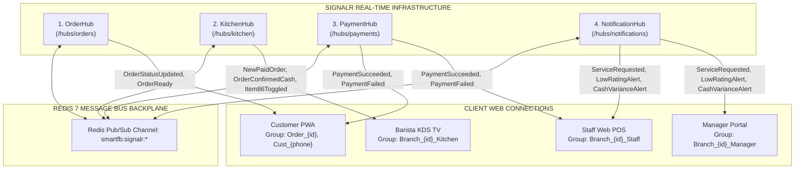
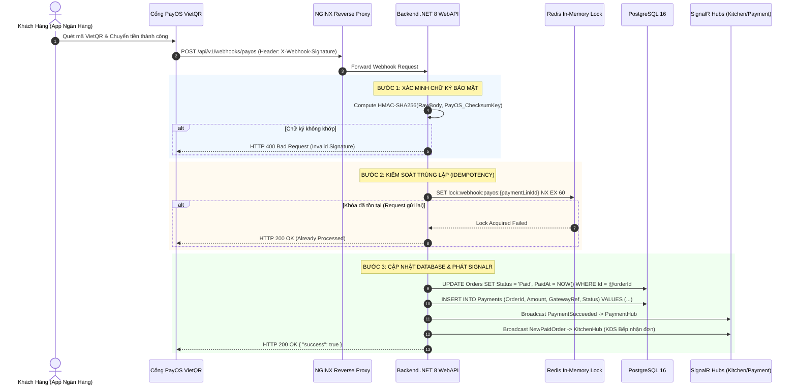

# 🌐 QUY TRÌNH 03: THIẾT KẾ HỢP ĐỒNG GIAO TIẾP API (OPENAPI 3.1 & SIGNALR CONTRACTS)
## HỆ THỐNG SMART F&B OPERATING SYSTEM (SMART F&B OS)

> [!NOTE]
> **Mã tài liệu:** `SPEC-API-03` | **Phiên bản:** `v2.5.0-Production-Ready`  
> **Chuẩn đặc tả:** OpenAPI 3.1 (RESTful JSON) & ASP.NET Core SignalR WebSocket Hubs (Redis Backplane)  
> **Kiến trúc:** .NET 8 Web API Clean Architecture & MediatR CQRS Pattern  
> **Nguồn sự thật chuẩn hóa:** `01_Tai_Lieu_Dac_Ta_Goc/` (`Smart_FB_Operating_System.md`, `Actor_Phan_Quyen_Chuc_Nang.md`, `Workflow_Quy_Trinh_Nghiep_Vu.md`, `Tong_Quan_Kien_Truc_He_Thong.md`)  
> **Cam kết chất lượng:** Đóng băng 100% hợp đồng giao tiếp giữa 5 Route Groups Next.js 14 và Backend Server .NET 8. Bao phủ toàn diện 62 Tính năng cốt lõi qua 10 Nhóm RESTful API, 4 SignalR Hubs chuyên biệt, Cơ chế bảo mật Webhook PayOS HMAC-SHA256 & Khóa phân tán Redis Idempotency. Zero Placeholder, 100% C# DTOs, FluentValidation và mã lỗi RFC 7807 ProblemDetails.

---

# 📑 MỤC LỤC TÀI LIỆU

1. [Quy Chuẩn Giao Thức RESTful API & Response Envelope](#1-quy-chuẩn-giao-thức-restful-api--response-envelope)
   - 1.1 [Cấu Trúc Envelope Phản Hồi Chuẩn (`ApiResponse<T>` & `PagedResponse<T>`)](#11-cấu-trúc-envelope-phản-hồi-chuẩn-apiresponset--pagedresponset)
   - 1.2 [Chuẩn Báo Lỗi RFC 7807 ProblemDetails](#12-chuẩn-báo-lỗi-rfc-7807-problemdetails)
   - 1.3 [Quy Ước Mã Trạng Thái HTTP & Headers Bắt Buộc](#13-quy-ước-mã-trạng-thái-http--headers-bắt-buộc)
2. [Đặc Tả Chi Tiết 10 Nhóm RESTful API (.NET 8 Clean Architecture & CQRS)](#2-đặc-tả-chi-tiết-10-nhóm-restful-api-net-8-clean-architecture--cqrs)
   - 2.1 [Nhóm 1: Xác Thực & Quản Lý Người Dùng / RBAC (`/api/v1/auth`, `/api/v1/users`, `/api/v1/roles`)](#21-nhóm-1-xác-thực--quản-lý-người-dùng--rbac-apiv1auth-apiv1users-apiv1roles)
   - 2.2 [Nhóm 2: Quản Lý Chi Nhánh, Sơ Đồ Bàn & Cấu Hình WiFi (`/api/v1/branches`, `/api/v1/tables`, `/api/v1/branch-wifi-configs`)](#22-nhóm-2-quản-lý-chi-nhánh-sơ-đồ-bàn--cấu-hình-wifi-apiv1branches-apiv1tables-apiv1branch-wifi-configs)
   - 2.3 [Nhóm 3: Thực Đơn, Danh Mục, Định Lượng BOM & Menu Mùa (`/api/v1/products`, `/api/v1/categories`, `/api/v1/recipes`, `/api/v1/seasonal-menus`)](#23-nhóm-3-thực-đơn-danh-mục-định-lượng-bom--menu-mùa-apiv1products-apiv1categories-apiv1recipes-apiv1seasonal-menus)
   - 2.4 [Nhóm 4: Xử Lý Đơn Hàng Đa Kênh (`/api/v1/orders` — Dine-In 2 Nhánh, Delivery 20k, Takeaway POS)](#24-nhóm-4-xử-lý-đơn-hàng-đa-kênh-apiv1orders--dine-in-2-nhánh-delivery-20k-takeaway-pos)
   - 2.5 [Nhóm 5: Thanh Toán, Cổng VietQR & PayOS Webhook (`/api/v1/payments`, `/api/v1/webhooks/payos`)](#25-nhóm-5-thanh-toán-cổng-vietqr--payos-webhook-apiv1payments-apiv1webhookspayos)
   - 2.6 [Nhóm 6: CRM Khách Hàng, Chính Sách Loyalty 10 Ly & Voucher (`/api/v1/crm`, `/api/v1/vouchers`)](#26-nhóm-6-crm-khách-hàng-chính-sách-loyalty-10-ly--voucher-apiv1crm-apiv1vouchers)
   - 2.7 [Nhóm 7: Màn Hình Chế Biến KDS Bếp & Barista (`/api/v1/kds`)](#27-nhóm-7-màn-hình-chế-biến-kds-bếp--barista-apiv1kds)
   - 2.8 [Nhóm 8: Vận Hành Quầy, Gọi Phục Vụ & Chấm Công WiFi (`/api/v1/staff`, `/api/v1/attendances`)](#28-nhóm-8-vận-hành-quầy-gọi-phục-vụ--chấm-công-wifi-apiv1staff-apiv1attendances)
   - 2.9 [Nhóm 9: Quản Lý Ca Két Tiền, Kho BOM & Kiểm Duyệt Review (`/api/v1/shifts`, `/api/v1/inventory`, `/api/v1/reviews`)](#29-nhóm-9-quản-lý-ca-két-tiền-kho-bom--kiểm-duyệt-review-apiv1shifts-apiv1inventory-apiv1reviews)
   - 2.10 [Nhóm 10: Chủ Chuỗi, Module AI & Báo Cáo P&L Hợp Nhất (`/api/v1/admin`, `/api/v1/ai`, `/api/v1/reports`)](#210-nhóm-10-chủ-chuỗi-module-ai--báo-cáo-pl-hợp-nhất-apiv1admin-apiv1ai-apiv1reports)
3. [Hạ Tầng Giao Tiếp Thời Gian Thực SignalR (4 Hubs Chuyên Biệt & Redis Backplane)](#3-hạ-tầng-giao-tiếp-thời-gian-thực-signalr-4-hubs-chuyên-biệt--redis-backplane)
   - 3.1 [Kiến Trúc Tổng Thể & Redis Message Bus Backplane](#31-kiến-trúc-tổng-thể--redis-message-bus-backplane)
   - 3.2 [Đặc Tả Hub 1: `OrderHub` (`/hubs/orders`)](#32-đặc-tả-hub-1-orderhub-hubsorders)
   - 3.3 [Đặc Tả Hub 2: `KitchenHub` (`/hubs/kitchen`)](#33-đặc-tả-hub-2-kitchenhub-hubskitchen)
   - 3.4 [Đặc Tả Hub 3: `PaymentHub` (`/hubs/payments`)](#34-đặc-tả-hub-3-paymenthub-hubspayments)
   - 3.5 [Đặc Tả Hub 4: `NotificationHub` (`/hubs/notifications`)](#35-đặc-tả-hub-4-notificationhub-hubsnotifications)
4. [Kiến Trúc Webhook PayOS VietQR: Bảo Mật HMAC-SHA256 & Khóa Phân Tán Idempotency](#4-kiến-trúc-webhook-payos-vietqr-bảo-mật-hmac-sha256--khóa-phân-tán-idempotency)
   - 4.1 [Sơ Đồ Tuần Tự Xử Lý Webhook (Mermaid Sequence)](#41-sơ-đồ-tuần-tự-xử-lý-webhook-mermaid-sequence)
   - 4.2 [Thuật Toán Xác Minh Chữ Ký HMAC-SHA256 & Mã Nguồn C#](#42-thuật-toán-xác-minh-chữ-ký-hmac-sha256--mã-nguồn-c)
   - 4.3 [Xử Lý Khóa Phân Tán Redis Idempotency & Polling Fallback](#43-xử-lý-khóa-phân-tán-redis-idempotency--polling-fallback)
5. [Ma Trận Ánh Xạ 62 Tính Năng Cốt Lõi Vào 10 Nhóm API (Traceability Matrix)](#5-ma-trận-ánh-xạ-62-tính-năng-cốt-lõi-vào-10-nhóm-api-traceability-matrix)

---

# 1. QUY CHUẨN GIAO THỨC RESTFUL API & RESPONSE ENVELOPE

### 1.1 Cấu Trúc Envelope Phản Hồi Chuẩn (`ApiResponse<T>` & `PagedResponse<T>`)

Mọi phản hồi từ hệ thống Backend .NET 8 đều được đóng gói trong Envelope đồng nhất để bảo đảm trải nghiệm phân tích cú pháp dữ liệu nhất quán trên Frontend:

#### Phản hồi đơn bản ghi (`ApiResponse<T>`):
```csharp
namespace SmartFB.Application.Common.Models;

public class ApiResponse<T>
{
    public bool Success { get; set; } = true;
    public int StatusCode { get; set; } = 200;
    public string Message { get; set; } = "Yêu cầu đã được xử lý thành công.";
    public T? Data { get; set; }
    public DateTime TimestampUtc { get; set; } = DateTime.UtcNow;

    public static ApiResponse<T> Ok(T data, string message = "Thành công") =>
        new() { Success = true, StatusCode = 200, Message = message, Data = data };

    public static ApiResponse<T> Created(T data, string message = "Tạo mới thành công") =>
        new() { Success = true, StatusCode = 201, Message = message, Data = data };
}
```

```json
{
  "success": true,
  "statusCode": 200,
  "message": "Lấy thông tin đơn hàng thành công.",
  "data": {
    "orderId": "b1192842-1f44-48f8-8a4b-871239ab0001",
    "orderNumber": "ORD-20260823-0042",
    "totalAmount": 96000,
    "status": "Confirmed"
  },
  "timestampUtc": "2026-08-23T14:30:00.125Z"
}
```

#### Phản hồi danh sách phân trang (`PagedResponse<T>`):
```csharp
namespace SmartFB.Application.Common.Models;

public class PagedResponse<T> : ApiResponse<IReadOnlyList<T>>
{
    public int PageIndex { get; set; }
    public int PageSize { get; set; }
    public int TotalCount { get; set; }
    public int TotalPages => (int)Math.Ceiling(TotalCount / (double)PageSize);
    public bool HasPreviousPage => PageIndex > 1;
    public bool HasNextPage => PageIndex < TotalPages;

    public PagedResponse(IReadOnlyList<T> items, int count, int pageIndex, int pageSize)
    {
        Success = true;
        StatusCode = 200;
        Message = "Truy vấn danh sách phân trang thành công.";
        Data = items;
        TotalCount = count;
        PageIndex = pageIndex;
        PageSize = pageSize;
        TimestampUtc = DateTime.UtcNow;
    }
}
```

---

### 1.2 Chuẩn Báo Lỗi RFC 7807 ProblemDetails

Khi xảy ra lỗi xác thực hoặc lỗi nghiệp vụ, API trả về cấu trúc chuẩn RFC 7807:

```json
{
  "type": "https://api.smartfb.vn/errors/validation-failed",
  "title": "Dữ liệu đầu vào không hợp lệ",
  "status": 400,
  "detail": "Có 2 trường dữ liệu không vượt qua quy tắc kiểm tra tính hợp lệ.",
  "instance": "/api/v1/orders/delivery",
  "errors": {
    "recipientPhone": [
      "Số điện thoại người nhận bắt buộc và phải có định dạng 10 chữ số bắt đầu bằng 03, 05, 07, 08, 09."
    ],
    "deliveryAddress": [
      "Địa chỉ giao hàng không được để trống và phải có độ dài tối thiểu 10 ký tự."
    ]
  },
  "timestampUtc": "2026-08-23T14:30:00.125Z"
}
```

---

### 1.3 Quy Ước Mã Trạng Thái HTTP & Headers Bắt Buộc

| Mã HTTP | Tên Tiêu Chuẩn | Ngữ Cảnh Sử Dụng Cụ Thể Trong Smart F&B OS |
|---|---|---|
| **200 OK** | OK | Trả về dữ liệu cho các truy vấn `GET`, cập nhật `PUT`/`PATCH`, hoặc thao tác hủy hợp lệ. |
| **201 Created** | Created | Tạo mới thành công Đơn hàng (`POST /orders/*`), Thực đơn, Tài khoản nhân viên, Phiếu kho. |
| **204 No Content** | No Content | Xóa mềm thành công món ăn hoặc cấu hình mà không cần trả về body dữ liệu. |
| **400 Bad Request** | Bad Request | Sai cấu trúc JSON, sai mạng WiFi khi chấm công, không đạt chuẩn DTO validation. |
| **401 Unauthorized** | Unauthorized | Thiếu header `Authorization`, Token JWT hết hạn hoặc chữ ký token bị giả mạo. |
| **403 Forbidden** | Forbidden | Người dùng không đủ quyền RBAC truy cập (ví dụ: Staff gọi API Admin hoặc Manager chi nhánh khác). |
| **404 Not Found** | Not Found | Không tìm thấy Chi nhánh, Bàn, Đơn hàng, Món ăn hoặc Tài khoản với UUID cung cấp. |
| **409 Conflict** | Conflict | Xung đột tài nguyên: Đơn hàng đã được thanh toán trước đó, mã nhân viên đã tồn tại, bàn đã có khách. |
| **422 Unprocessable** | Unprocessable Entity | Vi phạm quy tắc nghiệp vụ: Món đã bị khóa 86-out, quỹ 10 ly không đủ để đổi ly free, voucher hết hạn. |
| **429 Too Many Requests**| Rate Limit Exceeded | Khách bấm chuông gọi phục vụ bàn vượt quá giới hạn 1 lần / 60 giây hoặc spam API. |
| **500 Internal Error** | Server Error | Lỗi server chưa được xử lý, mất kết nối cơ sở dữ liệu PostgreSQL hoặc Redis. |

#### Danh Sách Request Headers Bắt Buộc:
* `Authorization: Bearer <JWT_ACCESS_TOKEN>` (Bắt buộc với toàn bộ API yêu cầu xác thực).
* `X-Branch-Id: <UUID>` (Bắt buộc đối với các API định tuyến dữ liệu theo chi nhánh cụ thể).
* `X-Correlation-Id: <UUID>` (Mã định danh luồng vết request để phân tích log vi dịch vụ).
* `Idempotency-Key: <UUID>` (Bắt buộc với các API thanh toán và Webhook chống trùng lặp giao dịch).

---

# 2. ĐẶC TẢ CHI TIẾT 10 NHÓM RESTFUL API (.NET 8 CLEAN ARCHITECTURE & CQRS)

```
┌──────────────────────────────────────────────────────────────────────────────────────────────────┐
│                            10 NHÓM ENDPOINT RESTFUL API SMART F&B OS                             │
├──────────────────────────────────┬─────────────────────────────────┬─────────────────────────────┤
│ 1. Auth & User Management        │ 5. Payments & PayOS Webhook     │ 8. Staff Ops & Attendance   │
│ 2. Branches, Tables & WiFi       │ 6. CRM, Loyalty & Vouchers      │ 9. Manager Shifts & Stock   │
│ 3. Menu, Products & BOM Recipes  │ 7. Kitchen Display System (KDS) │ 10. Admin, AI & P&L Reports │
│ 4. Orders & Multi-Channel        │                                 │                             │
└──────────────────────────────────┴─────────────────────────────────┴─────────────────────────────┘
```

---

## 2.1 Nhóm 1: Xác Thực & Quản Lý Người Dùng / RBAC (`/api/v1/auth`, `/api/v1/users`, `/api/v1/roles`)

> **Phạm vi tính năng bao phủ:** `S-01`, `S-13`, `M-01`, `A-01`, `A-16`.

```
                  ┌─────────────────────────────────────────┐
                  │          /api/v1/auth & /users          │
                  └────────────────────┬────────────────────┘
                                       │
         ┌─────────────────────────────┼─────────────────────────────┐
         ▼                             ▼                             ▼
POST /auth/login             POST /auth/refresh-token       POST /users & PUT /users/{id}
(JWT Access 15m + Refresh 7d) (Cấp lại Access Token mới)    (CRUD Nhân viên & Phân quyền)
```

### 1. `POST /api/v1/auth/login` — Đăng Nhập Hệ Thống
* **Mô tả:** Xác thực nhân viên bằng Mã nhân viên / Email và Mật khẩu. Trả về Access Token JWT (thời hạn 15 phút) và Refresh Token (thời hạn 7 ngày lưu trữ trong DB & HttpOnly Cookie).
* **Command CQRS:** `LoginUserCommand`
* **Quyền hạn:** `Public`
* **C# DTOs & Validation:**
```csharp
public record LoginUserCommand(string Username, string Password) : IRequest<ApiResponse<AuthResultDto>>;

public class LoginUserCommandValidator : AbstractValidator<LoginUserCommand>
{
    public LoginUserCommandValidator()
    {
        RuleFor(x => x.Username).NotEmpty().WithMessage("Tên đăng nhập hoặc mã nhân viên không được để trống.");
        RuleFor(x => x.Password).NotEmpty().MinimumLength(6).WithMessage("Mật khẩu phải từ 6 ký tự trở lên.");
    }
}

public record AuthResultDto(
    string AccessToken,
    string RefreshToken,
    int ExpiresIn,
    UserProfileDto User
);

public record UserProfileDto(
    Guid Id,
    string EmployeeCode,
    string FullName,
    string Role,
    Guid? BranchId,
    string? BranchName
);
```
* **Request Body (JSON):**
```json
{
  "username": "NV-Q1-001",
  "password": "Password@123"
}
```
* **Response 200 OK:**
```json
{
  "success": true,
  "statusCode": 200,
  "message": "Đăng nhập thành công.",
  "data": {
    "accessToken": "eyJhbGciOiJIUzI1NiIsInR5cCI6IkpXVCJ9.eyJzdWIiOiJ1MTF...zI1Ni",
    "refreshToken": "7c9e6679-7425-40de-944b-e07fc1f90ae7",
    "expiresIn": 900,
    "user": {
      "id": "u1192842-1f44-48f8-8a4b-871239ab0001",
      "employeeCode": "NV-Q1-001",
      "fullName": "Trần Thị Mai",
      "role": "CashierStaff",
      "branchId": "b1192842-1f44-48f8-8a4b-871239ab0001",
      "branchName": "Chi Nhánh Quận 1"
    }
  },
  "timestampUtc": "2026-08-23T14:30:00.125Z"
}
```

### 2. `POST /api/v1/auth/refresh-token` — Cấp Lại Token Mới
* **Mô tả:** Sử dụng Refresh Token còn hiệu lực để cấp phát cặp JWT Access Token mới mà không bắt người dùng đăng nhập lại.
* **Command CQRS:** `RefreshTokenCommand(string RefreshToken)`
* **Quyền hạn:** `Public`
* **Response 200 OK:** Trả về `AuthResultDto` mới kèm thời hạn 900s.

### 3. `POST /api/v1/auth/logout` — Đăng Xuất Hệ Thống
* **Mô tả:** Hủy bỏ Refresh Token trong cơ sở dữ liệu và thu hồi phiên đăng nhập hiện tại.
* **Command CQRS:** `LogoutUserCommand(Guid UserId)`
* **Quyền hạn:** `Authenticated User`
* **Response 200 OK:** `{ "success": true, "statusCode": 200, "message": "Đăng xuất thành công." }`

### 4. `GET /api/v1/users` — Danh Sách Nhân Viên
* **Query CQRS:** `GetUsersQuery(Guid? BranchId, string? Role, int PageIndex = 1, int PageSize = 20)`
* **Quyền hạn:** `BranchManager`, `ChainAdmin`
* **Response 200 OK:** `PagedResponse<UserProfileDto>`

### 5. `POST /api/v1/users` — Tạo Mới Tài Khoản Nhân Viên
* **Command CQRS:** `CreateUserCommand(string EmployeeCode, string FullName, string Email, string Phone, string Password, string Role, Guid BranchId)`
* **Quyền hạn:** `BranchManager`, `ChainAdmin`
* **Response 201 Created:** Trả về `UserProfileDto` của tài khoản vừa tạo.

### 6. `PUT /api/v1/users/{id}` — Cập Nhật Thông Tin Nhân Viên
* **Command CQRS:** `UpdateUserCommand(Guid Id, string FullName, string Phone, string Role, Guid BranchId, bool IsActive)`
* **Quyền hạn:** `BranchManager`, `ChainAdmin`
* **Response 200 OK:** Trả về `UserProfileDto` đã cập nhật.

---

## 2.2 Nhóm 2: Quản Lý Chi Nhánh, Sơ Đồ Bàn & Cấu Hình WiFi (`/api/v1/branches`, `/api/v1/tables`, `/api/v1/branch-wifi-configs`)

> **Phạm vi tính năng bao phủ:** `S-02`, `S-10`, `M-08`, `M-09`, `A-02`, `A-03`.

### 1. `GET /api/v1/branches` — Lấy Danh Sách Chi Nhánh Đang Hoạt Động
* **Query CQRS:** `GetBranchesQuery(bool IncludeInactive = false)`
* **Quyền hạn:** `Public` (Khách xem để chọn điểm nhận hàng/đến quán) / `Authenticated`
* **Response 200 OK:**
```json
{
  "success": true,
  "statusCode": 200,
  "message": "Lấy danh sách chi nhánh thành công.",
  "data": [
    {
      "id": "b1192842-1f44-48f8-8a4b-871239ab0001",
      "code": "CN-Q1",
      "name": "Smart Coffee - Chi Nhánh Quận 1",
      "address": "120 Hai Bà Trưng, Phường Bến Nghé, Quận 1, TP.HCM",
      "phone": "02838221199",
      "openingHours": "07:00 - 22:30",
      "isActive": true,
      "tableCount": 24
    }
  ],
  "timestampUtc": "2026-08-23T14:30:00.125Z"
}
```

### 2. `POST /api/v1/branches` — Tạo Mới Chi Nhánh Chuỗi
* **Command CQRS:** `CreateBranchCommand(string Code, string Name, string Address, string Phone, string OpeningHours)`
* **Quyền hạn:** `ChainAdmin`
* **Response 201 Created:** Trả về chi tiết chi nhánh vừa khởi tạo.

### 3. `GET /api/v1/branches/{branchId}/tables` — Sơ Đồ Bàn & Trạng Thái Thời Gian Thực
* **Query CQRS:** `GetBranchTablesQuery(Guid BranchId)`
* **Quyền hạn:** `Public` (Khách xem thông tin bàn của mình) / `Staff`, `BranchManager`, `ChainAdmin` (Xem toàn bộ mặt bằng)
* **Response 200 OK:**
```json
{
  "success": true,
  "statusCode": 200,
  "message": "Lấy sơ đồ bàn thành công.",
  "data": [
    {
      "id": "t1192842-1f44-48f8-8a4b-871239ab0005",
      "tableNumber": "05",
      "zone": "Tầng 1 - Phòng Máy Lạnh",
      "capacity": 4,
      "status": "Occupied",
      "currentOrderId": "o1192842-1f44-48f8-8a4b-871239ab0042",
      "hasServiceCall": false,
      "qrCodeUrl": "https://smartfb.vn/table/t1192842-1f44-48f8-8a4b-871239ab0005?sig=e3b0c442"
    }
  ],
  "timestampUtc": "2026-08-23T14:30:00.125Z"
}
```

### 4. `POST /api/v1/branches/{branchId}/tables` — Thêm Mới Bàn & Sinh Mã QR Dán Bàn
* **Command CQRS:** `CreateTableCommand(Guid BranchId, string TableNumber, string Zone, int Capacity)`
* **Quyền hạn:** `BranchManager`, `ChainAdmin`
* **Response 201 Created:** Trả về thông tin bàn kèm chuỗi QR URL bảo mật có chữ ký số.

### 5. `GET /api/v1/branches/{branchId}/wifi-configs` — Lấy Cấu Hình Mạng WiFi Chi Nhánh
* **Query CQRS:** `GetBranchWifiConfigsQuery(Guid BranchId)`
* **Quyền hạn:** `BranchManager`, `ChainAdmin`
* **Response 200 OK:** Trả về danh sách Access Point BSSID và IP Subnet của chi nhánh.

### 6. `PUT /api/v1/branches/{branchId}/wifi-configs` — Cập Nhật Cấu Hình BSSID & IP Subnet
* **Command CQRS:** `UpdateBranchWifiConfigsCommand(Guid BranchId, List<WifiConfigItemDto> WifiConfigs)`
* **Quyền hạn:** `BranchManager`, `ChainAdmin`
* **Request Body (JSON):**
```json
{
  "wifiConfigs": [
    {
      "ssid": "SmartCoffee_Quan1_Staff",
      "bssid": "00:14:22:01:23:45",
      "ipGateway": "192.168.1.1",
      "subnetMask": "255.255.255.0",
      "isActive": true
    },
    {
      "ssid": "SmartCoffee_Quan1_F2",
      "bssid": "00:14:22:01:23:46",
      "ipGateway": "192.168.1.2",
      "subnetMask": "255.255.255.0",
      "isActive": true
    }
  ]
}
```
* **Response 200 OK:** `{ "success": true, "statusCode": 200, "message": "Cập nhật cấu hình WiFi chấm công thành công." }`

---

## 2.3 Nhóm 3: Thực Đơn, Danh Mục, Định Lượng BOM & Menu Mùa (`/api/v1/products`, `/api/v1/categories`, `/api/v1/recipes`, `/api/v1/seasonal-menus`)

> **Phạm vi tính năng bao phủ:** `C-01`, `C-02`, `C-03`, `C-04`, `M-05`, `A-04`, `A-05`, `A-06`, `A-07`, `A-08`, `A-09`.

### 1. `GET /api/v1/products/menu` — Lấy Thực Đơn Chi Nhánh Đầy Đủ
* **Mô tả:** Lấy toàn bộ danh mục và món ăn đang mở bán tại chi nhánh cụ thể (Đã bao gồm bảng giá vùng chi nhánh, trạng thái khóa hết món 86-Toggle, và Seasonal Menu đang hiệu lực).
* **Query CQRS:** `GetBranchMenuQuery(Guid BranchId, Guid? CategoryId, string? Search)`
* **Quyền hạn:** `Public` (Khách xem trên PWA hoặc Web POS)
* **Response 200 OK:**
```json
{
  "success": true,
  "statusCode": 200,
  "message": "Tải thực đơn chi nhánh thành công.",
  "data": {
    "categories": [
      {
        "id": "c1192842-1f44-48f8-8a4b-871239ab0001",
        "name": "Cà Phê Truyền Thống",
        "displayOrder": 1,
        "products": [
          {
            "id": "p1192842-1f44-48f8-8a4b-871239ab0010",
            "name": "Bạc Xỉu 3 Tầng Đặc Biệt",
            "description": "Hương vị cà phê phin đậm đà kết hợp sữa tươi thanh trùng và lớp bọt sữa béo ngậy.",
            "basePrice": 39000,
            "imageUrl": "https://cdn.smartfb.vn/products/bac-xiu-3-tang.webp",
            "isAvailable": true,
            "isBestSeller": true,
            "calories": 140,
            "sizes": [
              { "sizeCode": "S", "priceAdjustment": -4000 },
              { "sizeCode": "M", "priceAdjustment": 0 },
              { "sizeCode": "L", "priceAdjustment": 8000 }
            ],
            "modifierGroups": [
              {
                "groupName": "Topping Thêm",
                "isMultiple": true,
                "modifiers": [
                  { "id": "m01", "name": "Trân châu hoàng kim", "price": 8000 },
                  { "id": "m02", "name": "Kem Cheese béo mặn", "price": 10000 }
                ]
              }
            ]
          }
        ]
      }
    ]
  },
  "timestampUtc": "2026-08-23T14:30:00.125Z"
}
```

### 2. `POST /api/v1/products` — Tạo Mới Món Ăn & Định Nghĩa BOM
* **Command CQRS:** `CreateProductCommand`
* **Quyền hạn:** `ChainAdmin`
* **Request Body (JSON):**
```json
{
  "categoryId": "c1192842-1f44-48f8-8a4b-871239ab0001",
  "name": "Cà Phê Muối Cố Đô",
  "description": "Cà phê phin nguyên chất kết hợp lớp kem sữa muối mặn mà độc đáo.",
  "basePrice": 35000,
  "imageUrl": "https://cdn.smartfb.vn/products/cafe-muoi.webp",
  "calories": 165,
  "sizeOptions": [
    { "sizeCode": "M", "priceAdjustment": 0 },
    { "sizeCode": "L", "priceAdjustment": 7000 }
  ],
  "bomRecipes": [
    {
      "sizeCode": "M",
      "ingredients": [
        { "ingredientId": "ing-coffee-bean-01", "quantity": 25.0, "unit": "g" },
        { "ingredientId": "ing-condensed-milk-01", "quantity": 30.0, "unit": "ml" },
        { "ingredientId": "ing-salt-cream-01", "quantity": 40.0, "unit": "ml" }
      ]
    }
  ]
}
```
* **Response 201 Created:** Trả về chi tiết món ăn vừa tạo.

### 3. `POST /api/v1/products/{oldProductId}/replace` — Thay Thế Món Mới (Replace Product)
* **Mô tả:** Chuyển toàn bộ liên kết danh mục, dữ liệu lịch sử và mã khuyến mãi từ món cũ sang món mới mà không làm đứt gãy báo cáo tài chính.
* **Command CQRS:** `ReplaceProductCommand(Guid OldProductId, Guid NewProductId, string Reason)`
* **Quyền hạn:** `ChainAdmin`
* **Response 200 OK:** `{ "success": true, "statusCode": 200, "message": "Thay thế món ăn thành công." }`

### 4. `GET /api/v1/products/{productId}/recipe` — Tra Cứu Công Thức Định Lượng Pha Chế BOM
* **Query CQRS:** `GetProductRecipeQuery(Guid ProductId, string SizeCode)`
* **Quyền hạn:** `BaristaStaff`, `BranchManager`, `ChainAdmin`
* **Response 200 OK:** Trả về danh sách định lượng nguyên vật liệu (gam/ml) phục vụ pha chế và trừ kho tự động.

### 5. `PUT /api/v1/categories/reorder` — Kéo Thả Sắp Xếp Thứ Tự Danh Mục
* **Command CQRS:** `ReorderCategoriesCommand(List<CategoryOrderItemDto> OrderedCategories)`
* **Quyền hạn:** `ChainAdmin`
* **Response 200 OK:** `{ "success": true, "statusCode": 200, "message": "Cập nhật thứ tự danh mục thành công." }`

### 6. `POST /api/v1/seasonal-menus` — Lên Lịch Thực Đơn Theo Mùa
* **Command CQRS:** `CreateSeasonalMenuCommand(string Title, DateTime ActiveFrom, DateTime ActiveTo, List<Guid> ProductIds)`
* **Quyền hạn:** `ChainAdmin`
* **Response 201 Created:** Trả về lịch phát hành thực đơn mùa vụ.

---

## 2.4 Nhóm 4: Xử Lý Đơn Hàng Đa Kênh (`/api/v1/orders` — Dine-In 2 Nhánh, Delivery 20k, Takeaway POS)

> **Phạm vi tính năng bao phủ:** `C-05`, `C-06`, `C-07`, `C-08`, `C-09`, `C-10`, `C-11`, `C-12`, `C-13`, `C-14`, `S-03`, `S-04`, `S-05`, `S-06`, `M-02`.

```
                                  /api/v1/orders
                                        │
        ┌───────────────────────────────┼───────────────────────────────┐
        ▼                               ▼                               ▼
  Dine-In Nhánh A                 Dine-In Nhánh B                   Delivery
(VietQR Trả Trước)              (Tiền Mặt Trả Sau)           (100% VietQR - Ship 20k)
POST /orders/dine-in/prepaid    POST /orders/dine-in/postpaid   POST /orders/delivery
```

### 1. `POST /api/v1/orders/dine-in/prepaid` — Dine-In Nhánh A (VietQR Trả Trước)
* **Mô tả:** Khách tại bàn chọn thanh toán VietQR. Hệ thống tạo đơn hàng với trạng thái `PendingPayment` và sinh mã VietQR động đếm ngược 10 phút. Bếp KDS chỉ nhận đơn khi PayOS Webhook xác nhận đã thanh toán (`Paid`).
* **Command CQRS:** `CreateDineInPrepaidOrderCommand`
* **Quyền hạn:** `Public`
* **C# DTO & Validator:**
```csharp
public record CreateDineInPrepaidOrderCommand(
    Guid BranchId,
    Guid TableId,
    string? CustomerPhone,
    string? CustomerNote,
    string? VoucherCode,
    List<OrderItemRequestDto> Items
) : IRequest<ApiResponse<PrepaidOrderResultDto>>;

public class CreateDineInPrepaidOrderValidator : AbstractValidator<CreateDineInPrepaidOrderCommand>
{
    public CreateDineInPrepaidOrderValidator()
    {
        RuleFor(x => x.BranchId).NotEmpty().WithMessage("Chi nhánh không được để trống.");
        RuleFor(x => x.TableId).NotEmpty().WithMessage("Bàn phục vụ không được để trống.");
        RuleFor(x => x.Items).NotEmpty().WithMessage("Đơn hàng phải có ít nhất 1 món ăn/đồ uống.");
        RuleForEach(x => x.Items).SetValidator(new OrderItemRequestValidator());
    }
}
```
* **Request Body (JSON):**
```json
{
  "branchId": "b1192842-1f44-48f8-8a4b-871239ab0001",
  "tableId": "t1192842-1f44-48f8-8a4b-871239ab0005",
  "customerPhone": "0912345678",
  "customerNote": "Mang đồ uống ít đá",
  "voucherCode": "CHAOMUNG",
  "items": [
    {
      "productId": "p1192842-1f44-48f8-8a4b-871239ab0010",
      "size": "L",
      "quantity": 2,
      "sugarLevel": "50%",
      "iceLevel": "50%",
      "itemNote": "Ít ngọt",
      "modifierIds": ["m01"]
    }
  ]
}
```
* **Response 201 Created:**
```json
{
  "success": true,
  "statusCode": 201,
  "message": "Tạo đơn hàng trả trước thành công. Vui lòng quét mã VietQR.",
  "data": {
    "orderId": "o1192842-1f44-48f8-8a4b-871239ab0042",
    "orderNumber": "ORD-20260823-0042",
    "subtotalAmount": 114000,
    "discountAmount": 10000,
    "deliveryFee": 0,
    "finalAmount": 104000,
    "status": "PendingPayment",
    "vietQr": {
      "qrCodeUrl": "https://img.vietqr.io/image/ICB-0001882199201-compact2.png?amount=104000&addInfo=ORD0042",
      "accountNumber": "0001882199201",
      "accountName": "SMART COFFEE QUAN 1",
      "bankCode": "ICB",
      "transferContent": "ORD0042",
      "expiresAtUtc": "2026-08-23T14:40:00Z"
    }
  },
  "timestampUtc": "2026-08-23T14:30:00.125Z"
}
```

### 2. `POST /api/v1/orders/dine-in/postpaid` — Dine-In Nhánh B (Tiền Mặt Trả Sau)
* **Mô tả:** Khách tại bàn chọn thanh toán tiền mặt sau khi thưởng thức. Hệ thống tạo đơn hàng với trạng thái `Confirmed`, **BẮN NGAY XUỐNG BẾP KDS QUA SIGNALR**. Khi Barista làm xong bấm `Ready`, quầy thu ngân in Hóa đơn kèm mã VietQR động để nhân viên bưng ra bàn thu tiền.
* **Command CQRS:** `CreateDineInPostpaidOrderCommand`
* **Quyền hạn:** `Public`
* **Response 201 Created:**
```json
{
  "success": true,
  "statusCode": 201,
  "message": "Đơn hàng đã được chuyển xuống bếp pha chế.",
  "data": {
    "orderId": "o1192842-1f44-48f8-8a4b-871239ab0043",
    "orderNumber": "ORD-20260823-0043",
    "finalAmount": 82000,
    "status": "Confirmed",
    "estimatedMinutes": 7,
    "message": "Bếp đã tiếp nhận đơn và đang pha chế. Nhân viên sẽ mang đồ uống kèm hóa đơn ra bàn."
  },
  "timestampUtc": "2026-08-23T14:30:00.125Z"
}
```

### 3. `POST /api/v1/orders/delivery` — QR Delivery (Giao Hàng Tận Nơi)
* **Mô tả:** Khách quét QR Delivery, bắt buộc nhập SĐT, Tên, Địa chỉ chi tiết. Hệ thống **tự động cộng Phí ship cố định 20.000 VNĐ** (`delivery_fee = 20000`). Bắt buộc **100% VietQR trả trước** (Khóa hoàn toàn COD).
* **Command CQRS:** `CreateDeliveryOrderCommand`
* **Quyền hạn:** `Public`
* **Request Body (JSON):**
```json
{
  "branchId": "b1192842-1f44-48f8-8a4b-871239ab0001",
  "recipientName": "Nguyễn Hoàng Nam",
  "recipientPhone": "0987654321",
  "deliveryAddress": "Tầng 12, Tòa nhà Bitexco, 2 Hải Triều, Q.1, TP.HCM",
  "customerNote": "Giao sảnh lễ tân trước 11:30",
  "items": [
    {
      "productId": "p1192842-1f44-48f8-8a4b-871239ab0010",
      "size": "M",
      "quantity": 2,
      "sugarLevel": "70%",
      "iceLevel": "100%"
    }
  ]
}
```
* **Response 201 Created:**
```json
{
  "success": true,
  "statusCode": 201,
  "message": "Tạo đơn giao hàng thành công. Vui lòng thanh toán VietQR.",
  "data": {
    "orderId": "o1192842-1f44-48f8-8a4b-871239ab0044",
    "orderNumber": "DEL-20260823-0015",
    "subtotalAmount": 78000,
    "deliveryFee": 20000,
    "finalAmount": 98000,
    "status": "PendingPayment",
    "vietQr": {
      "qrCodeUrl": "https://img.vietqr.io/image/ICB-0001882199201-compact2.png?amount=98000&addInfo=DEL0015",
      "accountNumber": "0001882199201",
      "transferContent": "DEL0015",
      "expiresAtUtc": "2026-08-23T14:40:00Z"
    }
  },
  "timestampUtc": "2026-08-23T14:30:00.125Z"
}
```

### 4. `POST /api/v1/orders/takeaway` — Takeaway POS (Mang Về Tại Quầy)
* **Mô tả:** Thu ngân tạo đơn mang về trên Web POS, tra cứu SĐT CRM, áp dụng ưu đãi **Tích 10 Ly = Tặng 1 Ly Miễn Phí** (Chỉ áp dụng Takeaway), đơn vào bếp KDS ngay và thu tiền sau.
* **Command CQRS:** `CreateTakeawayOrderCommand`
* **Quyền hạn:** `CashierStaff`, `BranchManager`
* **Request Body (JSON):**
```json
{
  "branchId": "b1192842-1f44-48f8-8a4b-871239ab0001",
  "customerPhone": "0909123456",
  "customerName": "Lê Văn Hùng",
  "redeemFreeCup": true,
  "freeProductId": "p1192842-1f44-48f8-8a4b-871239ab0010",
  "paymentMethod": "Cash",
  "cashGiven": 100000,
  "items": [
    {
      "productId": "p1192842-1f44-48f8-8a4b-871239ab0010",
      "size": "M",
      "quantity": 2,
      "sugarLevel": "100%",
      "iceLevel": "100%"
    }
  ]
}
```
* **Response 201 Created:**
```json
{
  "success": true,
  "statusCode": 201,
  "message": "Tạo đơn mang về thành công. Đã áp dụng đổi 1 ly miễn phí.",
  "data": {
    "orderId": "o1192842-1f44-48f8-8a4b-871239ab0045",
    "orderNumber": "TK-20260823-0089",
    "subtotalAmount": 78000,
    "loyaltyDiscount": 39000,
    "finalAmount": 39000,
    "cashGiven": 100000,
    "cashChange": 61000,
    "status": "Confirmed",
    "remainingLoyaltyCups": 0
  },
  "timestampUtc": "2026-08-23T14:30:00.125Z"
}
```

### 5. `GET /api/v1/orders/{id}/tracking` — Theo Dõi Đơn Hàng Real-Time
* **Query CQRS:** `GetOrderTrackingQuery(Guid Id)`
* **Quyền hạn:** `Public` (Khách xem tiến độ qua PWA)
* **Response 200 OK:** Trả về trạng thái hiện tại (`Confirmed`, `Preparing`, `Ready`, `Completed`), thứ tự trong hàng chờ và thời gian hoàn thành dự kiến.

---

## 2.5 Nhóm 5: Thanh Toán, Cổng VietQR & PayOS Webhook (`/api/v1/payments`, `/api/v1/webhooks/payos`)

> **Phạm vi tính năng bao phủ:** `C-10`, `C-11`, `S-04`, `S-07`, `M-03`, `A-14`.

### 1. `POST /api/v1/payments/vietqr/generate` — Sinh Mã VietQR Động
* **Command CQRS:** `GenerateVietQRCommand(Guid OrderId)`
* **Quyền hạn:** `Public` / `Authenticated`
* **Response 200 OK:** Trả về chuỗi QR NAPAS 247 và link ảnh QR nạp sẵn số tiền và nội dung chuyển khoản.

### 2. `POST /api/v1/webhooks/payos` — Webhook Xử Lý Thanh Toán PayOS
* **Mô tả:** Nhận thông báo biến động số dư chuyển khoản từ cổng PayOS. Kiểm tra chữ ký bảo mật `X-Webhook-Signature` HMAC-SHA256, áp dụng Khóa phân tán Redis `lock:webhook:payos:{paymentLinkId}` chống trùng lặp (Idempotency), cập nhật đơn sang `Paid` và bắn sự kiện SignalR tới Bếp KDS và Khách hàng.
* **Quyền hạn:** `Public (Được bảo vệ bởi HMAC-SHA256)`
* **Request Payload (PayOS Standard Webhook):**
```json
{
  "code": "00",
  "desc": "success",
  "data": {
    "orderCode": 10042,
    "amount": 104000,
    "description": "ORD0042",
    "accountNumber": "0001882199201",
    "reference": "FT262359918239",
    "transactionDateTime": "2026-08-23T14:32:15Z",
    "currency": "VND",
    "paymentLinkId": "pay-9918239-0042"
  },
  "signature": "e3b0c44298fc1c149afbf4c8996fb92427ae41e4649b934ca495991b7852b855"
}
```
* **Response 200 OK:** `{ "success": true, "message": "Webhook processed successfully." }`
* **Response 400 Bad Request:** `{ "type": "https://api.smartfb.vn/errors/invalid-signature", "title": "Chữ ký HMAC không hợp lệ", "status": 400 }`

### 3. `POST /api/v1/payments/cash/confirm` — Quầy Xác Nhận Thu Tiền Mặt
* **Command CQRS:** `ConfirmCashPaymentCommand(Guid OrderId, decimal ReceivedAmount)`
* **Quyền hạn:** `CashierStaff`, `BranchManager`
* **Response 200 OK:** Cập nhật đơn sang `Paid` và `Completed`, cộng doanh thu vào ca két tiền hiện hành.

### 4. `GET /api/v1/payments/{orderId}/status` — Polling Trạng Thái Thanh Toán
* **Query CQRS:** `GetPaymentStatusQuery(Guid OrderId)`
* **Quyền hạn:** `Public` (Dự phòng cho trường hợp mạng gián đoạn WebSocket)
* **Response 200 OK:** `{ "orderId": "uuid", "isPaid": true, "status": "Paid", "paidAt": "2026-08-23T14:32:15Z" }`

---

## 2.6 Nhóm 6: CRM Khách Hàng, Chính Sách Loyalty 10 Ly & Voucher (`/api/v1/crm`, `/api/v1/vouchers`)

> **Phạm vi tính năng bao phủ:** `C-14`, `C-15`, `C-16`, `S-03`, `A-10`, `A-11`.

### 1. `POST /api/v1/crm/customers/identify` — Nhận Diện Khách Hàng PWA (Loginless)
* **Command CQRS:** `IdentifyCustomerCommand(string Phone, Guid BranchId)`
* **Quyền hạn:** `Public`
* **Request Body (JSON):** `{ "phone": "0912345678", "branchId": "b1192842-1f44-48f8-8a4b-871239ab0001" }`
* **Response 200 OK:**
```json
{
  "success": true,
  "statusCode": 200,
  "message": "Nhận diện khách hàng thành công.",
  "data": {
    "customerId": "cust-0912345678",
    "phone": "0912345678",
    "fullName": "Nguyễn Văn An",
    "accumulatedCups": 7,
    "cupsTarget": 10,
    "availableVouchers": [
      {
        "code": "CHAOMUNG",
        "title": "Giảm 10k đơn đầu tiên",
        "discountAmount": 10000,
        "minOrderAmount": 50000,
        "expiresAt": "2026-09-30T23:59:59Z"
      }
    ]
  },
  "timestampUtc": "2026-08-23T14:30:00.125Z"
}
```

### 2. `GET /api/v1/crm/customers/lookup` — Thu Ngân Tra Cứu SĐT Tại Quầy POS
* **Query CQRS:** `LookupCustomerQuery(string Phone)`
* **Quyền hạn:** `CashierStaff`, `BranchManager`, `ChainAdmin`
* **Response 200 OK:** Trả về thông tin khách hàng, số ly tích lũy hiện có (ví dụ: `10/10 ly`), trạng thái đủ điều kiện đổi ly miễn phí.

### 3. `POST /api/v1/crm/loyalty/redeem-cup` — Đổi 1 Ly Miễn Phí Từ Quỹ 10 Ly
* **Command CQRS:** `RedeemLoyaltyCupCommand(Guid CustomerId, Guid OrderId, Guid FreeProductId)`
* **Quyền hạn:** `CashierStaff`, `BranchManager`
* **Quy tắc nghiệp vụ:** Chỉ áp dụng cho đơn Takeaway tại quầy. Trừ 10 ly trong quỹ tích lũy của khách và miễn phí 100% giá trị món đổi.

### 4. `POST /api/v1/vouchers/validate` — Kiểm Tra Tính Hợp Lệ Của Voucher
* **Command CQRS:** `ValidateVoucherCommand(string VoucherCode, decimal OrderAmount, Guid BranchId)`
* **Quyền hạn:** `Public` / `Customer`
* **Response 200 OK:** Trả về số tiền được giảm và trạng thái hợp lệ.

### 5. `POST /api/v1/admin/vouchers` — Admin Tạo Chiến Dịch Mã Khuyến Mãi
* **Command CQRS:** `CreateVoucherCommand(string Code, string DiscountType, decimal DiscountValue, decimal MinOrderAmount, decimal? MaxDiscountAmount, DateTime StartDate, DateTime EndDate, int UsageLimit)`
* **Quyền hạn:** `ChainAdmin`
* **Response 201 Created:** Trả về thông tin voucher vừa khởi tạo.

---

## 2.7 Nhóm 7: Màn Hình Chế Biến KDS Bếp & Barista (`/api/v1/kds`)

> **Phạm vi tính năng bao phủ:** `S-08`, `S-09`, `S-11`, `S-12`, `M-04`.

### 1. `GET /api/v1/kds/tickets` — Lấy Danh Sách Vé Chờ Pha Chế
* **Query CQRS:** `GetKdsTicketsQuery(Guid BranchId, string? StationType)`
* **Quyền hạn:** `BaristaStaff`, `BranchManager`
* **Response 200 OK:**
```json
{
  "success": true,
  "statusCode": 200,
  "message": "Lấy danh sách vé đơn hàng KDS thành công.",
  "data": [
    {
      "orderId": "o1192842-1f44-48f8-8a4b-871239ab0042",
      "orderNumber": "ORD-0042",
      "orderType": "DineIn",
      "tableName": "Bàn 05",
      "orderTimeUtc": "2026-08-23T14:32:00Z",
      "elapsedSeconds": 135,
      "urgencyState": "Normal",
      "items": [
        {
          "orderItemId": "oi-001",
          "productName": "Bạc Xỉu 3 Tầng Đặc Biệt",
          "size": "L",
          "quantity": 2,
          "sugarLevel": "50%",
          "iceLevel": "50%",
          "modifiers": ["Trân châu hoàng kim"],
          "note": "Ít ngọt"
        }
      ]
    }
  ],
  "timestampUtc": "2026-08-23T14:30:00.125Z"
}
```

### 2. `PATCH /api/v1/kds/orders/{orderId}/status` — Cập Nhật Trạng Thái Đơn Pha Chế
* **Command CQRS:** `UpdateKdsOrderStatusCommand(Guid OrderId, string NewStatus)`
* **Quyền hạn:** `BaristaStaff`, `BranchManager`
* **Quy tắc nghiệp vụ:** Khi trạng thái chuyển sang `Ready`, hệ thống **tự động kích hoạt trừ tồn kho Bar theo công thức BOM**. Đồng thời phát tín hiệu âm thanh và SignalR thông báo cho nhân viên phục vụ / khách hàng.

### 3. `POST /api/v1/kds/batch-start` — Kích Hoạt Gom Món Pha Chế Đồng Loạt (Batching)
* **Command CQRS:** `StartKdsBatchCommand(List<Guid> OrderItemIds)`
* **Quyền hạn:** `BaristaStaff`, `BranchManager`
* **Response 200 OK:** Trả về `batchId` và danh sách các món được nhóm để pha chế 1 lần.

### 4. `PATCH /api/v1/kds/batch/{batchId}/complete` — Hoàn Tất Mẻ Pha Chế Gom Món
* **Command CQRS:** `CompleteKdsBatchCommand(Guid BatchId)`
* **Quyền hạn:** `BaristaStaff`, `BranchManager`
* **Response 200 OK:** Đồng loạt chuyển trạng thái của toàn bộ `OrderItem` trong batch sang `Ready`.

### 5. `PATCH /api/v1/kds/products/{productId}/86-toggle` — Khóa Hết Món Tức Thì (86-Toggle)
* **Command CQRS:** `ToggleProductAvailabilityCommand(Guid BranchId, Guid ProductId, bool IsAvailable)`
* **Quyền hạn:** `BaristaStaff`, `BranchManager`
* **Response 200 OK:** `{ "productId": "uuid", "isAvailable": false, "message": "Đã khóa món Cà Phê Muối trên toàn bộ menu PWA và POS của chi nhánh." }`

---

## 2.8 Nhóm 8: Vận Hành Quầy, Gọi Phục Vụ & Chấm Công WiFi (`/api/v1/staff`, `/api/v1/attendances`)

> **Phạm vi tính năng bao phủ:** `C-17`, `S-02`, `S-10`, `S-13`, `M-07`.

### 1. `POST /api/v1/attendances/wifi-checkin` — Chấm Công Vào Ca (Clock-In) Khóa Mạng WiFi
* **Mô tả:** Xác thực kép địa chỉ BSSID của Access Point Router và dải IP Subnet nội bộ chi nhánh kết hợp Mã số nhân viên / PIN. Chống 100% gian lận Fake GPS hay chấm công ngoài quán.
* **Command CQRS:** `WifiClockInCommand`
* **Quyền hạn:** `Authenticated Staff`
* **C# DTO & Validator:**
```csharp
public record WifiClockInCommand(
    Guid BranchId,
    string EmployeeCode,
    string ClientBssid,
    string ClientIp
) : IRequest<ApiResponse<AttendanceRecordDto>>;

public class WifiClockInValidator : AbstractValidator<WifiClockInCommand>
{
    public WifiClockInValidator()
    {
        RuleFor(x => x.BranchId).NotEmpty().WithMessage("Chi nhánh không được để trống.");
        RuleFor(x => x.EmployeeCode).NotEmpty().WithMessage("Mã nhân viên không được để trống.");
        RuleFor(x => x.ClientBssid).NotEmpty().Matches("^([0-9A-Fa-f]{2}[:-]){5}([0-9A-Fa-f]{2})$")
            .WithMessage("Định dạng địa chỉ MAC BSSID không hợp lệ.");
        RuleFor(x => x.ClientIp).NotEmpty().WithMessage("Địa chỉ IP client không được để trống.");
    }
}
```
* **Request Body (JSON):**
```json
{
  "branchId": "b1192842-1f44-48f8-8a4b-871239ab0001",
  "employeeCode": "NV-Q1-008",
  "clientBssid": "00:14:22:01:23:45",
  "clientIp": "192.168.1.45"
}
```
* **Response 200 OK (Thành công):**
```json
{
  "success": true,
  "statusCode": 200,
  "message": "Chấm công vào ca thành công.",
  "data": {
    "attendanceId": "att-20260823-001",
    "employeeCode": "NV-Q1-008",
    "fullName": "Lê Văn Hùng",
    "clockInTime": "2026-08-23T06:58:30Z",
    "matchedSsid": "SmartCoffee_Quan1_Staff",
    "status": "OnTime"
  },
  "timestampUtc": "2026-08-23T14:30:00.125Z"
}
```
* **Response 400 Bad Request (Sai mạng WiFi):**
```json
{
  "type": "https://api.smartfb.vn/errors/wifi-network-mismatch",
  "title": "Mạng WiFi không hợp lệ",
  "status": 400,
  "detail": "Bạn đang dùng 4G hoặc mạng ngoài quán. Vui lòng kết nối WiFi 'SmartCoffee_Quan1_Staff' để chấm công.",
  "instance": "/api/v1/attendances/wifi-checkin",
  "timestampUtc": "2026-08-23T14:30:00.125Z"
}
```

### 2. `POST /api/v1/attendances/wifi-checkout` — Chấm Công Ra Ca (Clock-Out) Khóa Mạng WiFi
* **Command CQRS:** `WifiClockOutCommand(Guid BranchId, string EmployeeCode, string ClientBssid, string ClientIp)`
* **Quyền hạn:** `Authenticated Staff`
* **Response 200 OK:** Ghi nhận giờ ra ca và tổng số giờ làm việc thực tế.

### 3. `POST /api/v1/staff/service-calls` — Khách Bấm Chuông Gọi Phục Vụ
* **Command CQRS:** `CallStaffCommand(Guid TableId, string Reason)`
* **Quyền hạn:** `Public` (Khách tại bàn, giới hạn 1 lần / 60s)
* **Request Body (JSON):** `{ "tableId": "t1192842-1f44-48f8-8a4b-871239ab0005", "reason": "WaterRefill" }`
* **Response 200 OK:** `{ "success": true, "message": "Đã gửi yêu cầu gọi phục vụ tới nhân viên quầy." }`

### 4. `PATCH /api/v1/staff/service-calls/{id}/resolve` — Nhân Viên Tiếp Nhận & Hoàn Tất Gọi Phục Vụ
* **Command CQRS:** `ResolveServiceCallCommand(Guid ServiceCallId)`
* **Quyền hạn:** `Staff`, `BranchManager`
* **Response 200 OK:** Đánh dấu hoàn tất và tắt chuông cảnh báo trên màn hình POS.

---

## 2.9 Nhóm 9: Quản Lý Ca Két Tiền, Kho BOM & Kiểm Duyệt Review (`/api/v1/shifts`, `/api/v1/inventory`, `/api/v1/reviews`)

> **Phạm vi tính năng bao phủ:** `C-18`, `C-19`, `C-20`, `M-03`, `M-06`, `M-10`, `M-11`, `M-12`.

### 1. `POST /api/v1/shifts/open` — Quản Lý Mở Ca Két Tiền
* **Command CQRS:** `OpenCashShiftCommand(Guid BranchId, decimal InitialCash, Dictionary<string, int> CashDenominations)`
* **Quyền hạn:** `BranchManager`
* **Request Body (JSON):**
```json
{
  "branchId": "b1192842-1f44-48f8-8a4b-871239ab0001",
  "initialCash": 1000000,
  "cashDenominations": {
    "500000": 0, "200000": 2, "100000": 3, "50000": 4, "20000": 4, "10000": 2
  }
}
```
* **Response 201 Created:** Trả về `shiftId` của ca làm việc mới.

### 2. `POST /api/v1/shifts/close` — Kết Ca Két Tiền & Đối Soát Z-Report
* **Mô tả:** Nhập số tiền thực đếm theo từng mệnh giá, hệ thống tự động đối chiếu với tiền lý thuyết từ các đơn tiền mặt trong ca. Nếu độ lệch `|varianceAmount| > 50000`, bắt buộc phải có `varianceNotes` giải trình.
* **Command CQRS:** `CloseCashShiftCommand`
* **Quyền hạn:** `BranchManager`
* **Request Body (JSON):**
```json
{
  "shiftId": "shf-20260823-001",
  "actualCashDenominations": {
    "500000": 2, "200000": 3, "100000": 5, "50000": 10, "20000": 8, "10000": 5
  },
  "totalActualCash": 2850000,
  "varianceNotes": "Thối nhầm 50.000đ cho khách mua mang về đơn #TK-0012"
}
```
* **Response 200 OK (Z-Report Result):**
```json
{
  "success": true,
  "statusCode": 200,
  "message": "Đã kết ca két tiền và lập biên bản Z-Report.",
  "data": {
    "shiftId": "shf-20260823-001",
    "openingCash": 1000000,
    "cashSales": 1900000,
    "systemExpectedCash": 2900000,
    "totalActualCash": 2850000,
    "varianceAmount": -50000,
    "varianceStatus": "WarningShortage",
    "varianceNotes": "Thối nhầm 50.000đ cho khách mua mang về đơn #TK-0012",
    "closedAtUtc": "2026-08-23T15:00:00Z"
  },
  "timestampUtc": "2026-08-23T14:30:00.125Z"
}
```

### 3. `POST /api/v1/inventory/export-bar` — Lập Phiếu Xuất Kho Tổng Ra Quầy Bar
* **Command CQRS:** `CreateBarExportRequisitionCommand(Guid BranchId, List<InventoryItemRequisitionDto> Items)`
* **Quyền hạn:** `BranchManager`
* **Response 201 Created:** Trả về phiếu xuất kho quầy bar.

### 4. `POST /api/v1/inventory/import-supplier` — Nhập Kho Nguyên Liệu Mua Từ NCC
* **Command CQRS:** `CreateSupplierStockImportCommand(Guid BranchId, string SupplierName, decimal TotalCost, string InvoiceImageUrl, List<StockImportItemDto> Items)`
* **Quyền hạn:** `BranchManager`
* **Response 201 Created:** Ghi nhận phiếu nhập kho và cập nhật giá vốn FIFO.

### 5. `POST /api/v1/inventory/audit-variance` — Kiểm Kê Tồn Kho & Tính Hao Hụt BOM
* **Command CQRS:** `AuditInventoryVarianceCommand(Guid BranchId, List<StockAuditItemDto> AuditItems)`
* **Quyền hạn:** `BranchManager`
* **Response 200 OK:** Trả về biên bản chênh lệch giữa tồn lý thuyết (trừ theo BOM) và số lượng thực tế đếm được.

### 6. `POST /api/v1/reviews` — Khách Hàng Gửi Đánh Giá 1-5 Sao & Tải Ảnh
* **Command CQRS:** `CreateReviewCommand(Guid OrderId, int Rating, string? Comment, List<string>? PhotoUrls, bool IsAnonymous)`
* **Quyền hạn:** `Public` / `Customer`
* **Quy tắc nghiệp vụ:** Nếu `Rating <= 2`, hệ thống tự động bắn cảnh báo khẩn cấp lên màn hình Quản lý chi nhánh qua SignalR `NotificationHub`.

### 7. `PATCH /api/v1/reviews/{reviewId}/moderate-photo` — Kiểm Duyệt Ảnh Đánh Giá Của Khách
* **Command CQRS:** `ModerateReviewPhotoCommand(Guid ReviewId, Guid PhotoId, bool IsApproved)`
* **Quyền hạn:** `BranchManager`
* **Response 200 OK:** Phê duyệt hoặc ẩn ảnh thực tế của khách hàng.

---

## 2.10 Nhóm 10: Chủ Chuỗi, Module AI & Báo Cáo P&L Hợp Nhất (`/api/v1/admin`, `/api/v1/ai`, `/api/v1/reports`)

> **Phạm vi tính năng bao phủ:** `C-03`, `A-07`, `A-08`, `A-12`, `A-13`, `A-14`, `A-15`, `A-16`, `A-17`.

### 1. `POST /api/v1/ai/chatbot/recommend` — AI-1 Chatbot RAG (Google Gemini 1.5 Flash)
* **Mô tả:** Tư vấn đồ uống cá nhân hóa thời gian thực dựa trên ngữ cảnh thời tiết, mức calo, dị ứng và sở thích CRM.
* **Query CQRS:** `GetGeminiRecommendationQuery(Guid BranchId, string UserQuery, string? CustomerPhone)`
* **Quyền hạn:** `Public` / `Customer`
* **Request Body (JSON):**
```json
{
  "branchId": "b1192842-1f44-48f8-8a4b-871239ab0001",
  "userQuery": "Trời chiều nay mưa lạnh, mình muốn uống món gì ngọt béo ấm áp không dùng trà xanh?",
  "customerPhone": "0912345678"
}
```
* **Response 200 OK:**
```json
{
  "success": true,
  "statusCode": 200,
  "message": "AI đã phản hồi gợi ý món.",
  "data": {
    "responseText": "Chào bạn! Thời tiết bên ngoài se lạnh 22°C, Smart Coffee gợi ý bạn thưởng thức **Trà Oolong Nướng Kem Cheese Nóng** hoặc **Cacao Nóng Marshmallow**. Cả hai món đều thơm ngậy và làm ấm cơ thể rất tốt!",
    "recommendedProducts": [
      {
        "productId": "p1192842-1f44-48f8-8a4b-871239ab0055",
        "name": "Trà Oolong Nướng Kem Cheese Nóng",
        "price": 45000,
        "imageUrl": "https://cdn.smartfb.vn/products/oolong-cheese.webp",
        "calories": 180
      }
    ]
  },
  "timestampUtc": "2026-08-23T14:30:00.125Z"
}
```

### 2. `POST /api/v1/ai/combos/mine` — AI-2 Khai Phá Giỏ Hàng (Apriori Engine)
* **Mô tả:** Khai phá dữ liệu lịch sử đơn hàng tìm các cặp món thường được mua cùng nhau với các chỉ số Support, Confidence, Lift.
* **Command CQRS:** `MineMarketBasketCombosCommand(Guid? BranchId, double MinSupport = 0.02, double MinConfidence = 0.40)`
* **Quyền hạn:** `ChainAdmin`
* **Response 200 OK:**
```json
{
  "success": true,
  "statusCode": 200,
  "message": "Khai phá dữ liệu giỏ hàng thành công.",
  "data": [
    {
      "comboCandidateId": "combo-ai-01",
      "items": [
        { "productId": "p11", "name": "Cà Phê Muối Cố Đô", "price": 35000, "bomCost": 9800 },
        { "productId": "p99", "name": "Bánh Croissant Trứng Muối", "price": 40000, "bomCost": 12200 }
      ],
      "support": 0.048,
      "confidence": 0.625,
      "lift": 2.15,
      "suggestedDiscountPercent": 15,
      "suggestedPrice": 63750,
      "estimatedProfitMargin": 0.655
    }
  ],
  "timestampUtc": "2026-08-23T14:30:00.125Z"
}
```

### 3. `POST /api/v1/ai/combos/approve` — Phê Duyệt Phát Hành Combo Lên Thực Đơn PWA
* **Command CQRS:** `ApproveAiComboCommand(string ComboCandidateId, string ComboName, decimal FinalPrice, DateTime ActiveFrom, DateTime ActiveTo)`
* **Quyền hạn:** `ChainAdmin` (Cơ chế Human-in-the-loop)
* **Response 200 OK:** Tạo thực thể Combo chính thức và hiển thị ngay trên Menu PWA.

### 4. `GET /api/v1/reports/pl-consolidated` — Báo Cáo P&L Hợp Nhất Toàn Chuỗi
* **Query CQRS:** `GetConsolidatedPLReportQuery(DateTime FromDate, DateTime ToDate, List<Guid>? BranchIds)`
* **Quyền hạn:** `ChainAdmin`
* **Response 200 OK:**
```json
{
  "success": true,
  "statusCode": 200,
  "message": "Truy vấn báo cáo tài chính P&L hợp nhất thành công.",
  "data": {
    "totalGrossRevenue": 485000000,
    "totalDiscounts": 18500000,
    "totalNetRevenue": 466500000,
    "totalCogsBomCost": 139950000,
    "grossProfit": 326550000,
    "grossProfitMargin": 0.700,
    "branches": [
      {
        "branchId": "b1192842-1f44-48f8-8a4b-871239ab0001",
        "branchName": "Smart Coffee Quận 1",
        "orderCount": 5420,
        "netRevenue": 265000000,
        "cogsCost": 78200000,
        "grossProfit": 186800000,
        "margin": 0.705
      }
    ]
  },
  "timestampUtc": "2026-08-23T14:30:00.125Z"
}
```

### 5. `GET /api/v1/reports/menu-engineering` — Ma Trận Phân Loại Món Ăn BCG
* **Query CQRS:** `GetMenuEngineeringMatrixQuery(Guid? BranchId, DateTime FromDate, DateTime ToDate)`
* **Quyền hạn:** `ChainAdmin`
* **Response 200 OK:** Phân loại món ăn thành 4 nhóm: Stars (Ngôi sao), Plowhorses (Bò sữa), Puzzles (Câu đố), Dogs (Chó mực).

### 6. `GET /api/v1/admin/audit-logs` — Nhật Ký Kiểm Toán Bất Biến
* **Query CQRS:** `GetAuditLogsQuery(Guid? UserId, string? Action, DateTime? FromDate, DateTime? ToDate, int PageIndex = 1, int PageSize = 50)`
* **Quyền hạn:** `ChainAdmin`
* **Response 200 OK:** `PagedResponse<AuditLogEntryDto>`

### 7. `GET /api/v1/admin/reports/export` — Xuất Báo Cáo Ra File Excel (.xlsx) / CSV
* **Query CQRS:** `ExportReportFileQuery(string ReportType, string Format, DateTime FromDate, DateTime ToDate)`
* **Quyền hạn:** `ChainAdmin`
* **Response 200 OK:** Trả về binary stream file Excel `.xlsx` tải trực tiếp về trình duyệt.

---

# 3. HẠ TẦNG GIAO TIẾP THỜI GIAN THỰC SIGNALR (4 HUBS CHUYÊN BIỆT & REDIS BACKPLANE)

### 3.1 Kiến Trúc Tổng Thể & Redis Message Bus Backplane

Hệ thống triển khai **4 SignalR Hubs chuyên biệt** với Redis Backplane phân phối sự kiện tức thời (< 500ms), bảo đảm phân tách ranh giới dữ liệu và bảo mật tuyệt đối:



#### Cấu Hình C# .NET 8 `Program.cs`:
```csharp
// Đăng ký SignalR với Redis Backplane
builder.Services.AddSignalR(options =>
{
    options.EnableDetailedErrors = builder.Environment.IsDevelopment();
    options.KeepAliveInterval = TimeSpan.FromSeconds(15);
    options.ClientTimeoutInterval = TimeSpan.FromSeconds(30);
})
.AddStackExchangeRedis(builder.Configuration.GetConnectionString("Redis")!, options =>
{
    options.Configuration.ChannelPrefix = "SmartFB_SignalR";
});

// Định tuyến Endpoints
app.MapHub<OrderHub>("/hubs/orders");
app.MapHub<KitchenHub>("/hubs/kitchen");
app.MapHub<PaymentHub>("/hubs/payments");
app.MapHub<NotificationHub>("/hubs/notifications");
```

---

### 3.2 Đặc Tả Hub 1: `OrderHub` (`/hubs/orders`)

* **Mục đích:** Đồng bộ trạng thái đơn hàng thời gian thực cho PWA Khách hàng và Web POS.
* **Client Groups:** `Order_{orderId}`, `Customer_{customerPhone}`
* **C# Interface & Hub Implementation:**
```csharp
public interface IOrderClient
{
    Task OrderStatusUpdated(OrderStatusUpdatedEvent payload);
    Task OrderReady(OrderReadyEvent payload);
    Task EstimatedTimeAdjusted(EstimatedTimeAdjustedEvent payload);
}

public class OrderHub : Hub<IOrderClient>
{
    public async Task JoinOrderGroup(string orderId)
    {
        await Groups.AddToGroupAsync(Context.ConnectionId, $"Order_{orderId}");
    }

    public async Task LeaveOrderGroup(string orderId)
    {
        await Groups.RemoveFromGroupAsync(Context.ConnectionId, $"Order_{orderId}");
    }
}

public record OrderStatusUpdatedEvent(
    Guid OrderId,
    string OrderNumber,
    string Status,
    int EstimatedMinutes,
    int QueuePosition,
    DateTime UpdatedAtUtc
);
```

---

### 3.3 Đặc Tả Hub 2: `KitchenHub` (`/hubs/kitchen`)

* **Mục đích:** Truyền tải vé đơn hàng mới xuống màn hình KDS Bếp/Bar; đồng bộ bật/tắt khóa món 86-out.
* **Client Groups:** `Branch_{branchId}_Kitchen`, `Station_{stationId}`
* **C# Interface & Events:**
```csharp
public interface IKitchenClient
{
    Task NewPaidOrder(KdsTicketDto ticket);
    Task OrderConfirmedCash(KdsTicketDto ticket);
    Task Item86Toggled(Item86ToggledEvent payload);
    Task ItemBatchUpdated(ItemBatchUpdatedEvent payload);
}

public class KitchenHub : Hub<IKitchenClient>
{
    [Authorize(Roles = "BaristaStaff,BranchManager,ChainAdmin")]
    public async Task JoinKitchenGroup(string branchId)
    {
        await Groups.AddToGroupAsync(Context.ConnectionId, $"Branch_{branchId}_Kitchen");
    }
}

public record Item86ToggledEvent(
    Guid BranchId,
    Guid ProductId,
    string ProductName,
    bool IsAvailable,
    DateTime ToggledAtUtc
);
```

---

### 3.4 Đặc Tả Hub 3: `PaymentHub` (`/hubs/payments`)

* **Mục đích:** Bắn tín hiệu xác nhận thanh toán VietQR tức thời (< 500ms) từ PayOS Webhook tới PWA Khách và POS Quầy.
* **Client Groups:** `Payment_{orderId}`
* **C# Interface & Events:**
```csharp
public interface IPaymentClient
{
    Task PaymentSucceeded(PaymentSucceededEvent payload);
    Task PaymentFailed(PaymentFailedEvent payload);
    Task PaymentExpired(PaymentExpiredEvent payload);
}

public class PaymentHub : Hub<IPaymentClient>
{
    public async Task JoinPaymentGroup(string orderId)
    {
        await Groups.AddToGroupAsync(Context.ConnectionId, $"Payment_{orderId}");
    }
}

public record PaymentSucceededEvent(
    Guid OrderId,
    string OrderNumber,
    decimal Amount,
    string GatewayReference,
    DateTime PaidAtUtc
);
```

---

### 3.5 Đặc Tả Hub 4: `NotificationHub` (`/hubs/notifications`)

* **Mục đích:** Phát chuông gọi phục vụ bàn, cảnh báo đánh giá `<= 2 sao` khẩn cấp, cảnh báo lệch két tiền và cạn kho.
* **Client Groups:** `Branch_{branchId}_Staff`, `Branch_{branchId}_Manager`, `Chain_Admin`
* **C# Interface & Events:**
```csharp
public interface INotificationClient
{
    Task ServiceRequested(ServiceRequestedEvent payload);
    Task ServiceCallResolved(ServiceCallResolvedEvent payload);
    Task LowRatingAlert(LowRatingAlertEvent payload);
    Task CashVarianceAlert(CashVarianceAlertEvent payload);
    Task InventoryShortageAlert(InventoryShortageAlertEvent payload);
}

public class NotificationHub : Hub<INotificationClient>
{
    [Authorize]
    public async Task JoinBranchNotifications(string branchId)
    {
        var role = Context.User?.FindFirst(ClaimTypes.Role)?.Value;
        if (role == "BranchManager")
            await Groups.AddToGroupAsync(Context.ConnectionId, $"Branch_{branchId}_Manager");
        else
            await Groups.AddToGroupAsync(Context.ConnectionId, $"Branch_{branchId}_Staff");
    }
}

public record LowRatingAlertEvent(
    Guid BranchId,
    Guid OrderId,
    string TableNumber,
    int Rating,
    string? Comment,
    DateTime CreatedAtUtc
);
```

---

# 4. KIẾN TRÚC WEBHOOK PAYOS VIETQR: BẢO MẬT HMAC-SHA256 & KHÓA PHÂN TÁN IDEMPOTENCY

### 4.1 Sơ Đồ Tuần Tự Xử Lý Webhook (Mermaid Sequence)



---

### 4.2 Thuật Toán Xác Minh Chữ Ký HMAC-SHA256 & Mã Nguồn C#

```csharp
namespace SmartFB.Infrastructure.Services;

public class PayOSWebhookValidator
{
    private readonly string _checksumKey;

    public PayOSWebhookValidator(IConfiguration configuration)
    {
        _checksumKey = configuration["PayOS:ChecksumKey"] 
            ?? throw new InvalidOperationException("PayOS ChecksumKey chưa được cấu hình.");
    }

    public bool VerifySignature(string rawBody, string receivedSignature)
    {
        using var hmac = new HMACSHA256(Encoding.UTF8.GetBytes(_checksumKey));
        var computedHash = hmac.ComputeHash(Encoding.UTF8.GetBytes(rawBody));
        var computedSignature = Convert.ToHexString(computedHash).ToLowerInvariant();
        return CryptographicOperations.FixedTimeEquals(
            Encoding.UTF8.GetBytes(computedSignature),
            Encoding.UTF8.GetBytes(receivedSignature.ToLowerInvariant())
        );
    }
}
```

---

### 4.3 Xử Lý Khóa Phân Tán Redis Idempotency & Polling Fallback

#### Mã Nguồn C# Xử Lý Webhook Controller:
```csharp
[ApiController]
[Route("api/v1/webhooks")]
public class PayOSWebhookController : ControllerBase
{
    private readonly IConnectionMultiplexer _redis;
    private readonly PayOSWebhookValidator _validator;
    private readonly IMediator _mediator;

    public PayOSWebhookController(
        IConnectionMultiplexer redis, 
        PayOSWebhookValidator validator,
        IMediator mediator)
    {
        _redis = redis;
        _validator = validator;
        _mediator = mediator;
    }

    [HttpPost("payos")]
    public async Task<IActionResult> HandlePayOSWebhook([FromBody] PayOSWebhookPayload payload)
    {
        // 1. Kiểm tra chữ ký HMAC
        var rawBody = await new StreamReader(Request.Body).ReadToEndAsync();
        if (!_validator.VerifySignature(rawBody, payload.Signature))
        {
            return BadRequest(new ProblemDetails
            {
                Title = "Chữ ký Webhook không hợp lệ",
                Status = StatusCodes.Status400BadRequest
            });
        }

        // 2. Chống trùng lặp bằng Redis Distributed Lock (TTL: 60s)
        var db = _redis.GetDatabase();
        var lockKey = $"lock:webhook:payos:{payload.Data.PaymentLinkId}";
        var isLocked = await db.StringSetAsync(lockKey, "processing", TimeSpan.FromSeconds(60), When.NotExists);

        if (!isLocked)
        {
            // Webhook trùng lặp đã hoặc đang xử lý -> Trả về 200 OK để PayOS dừng retry
            return Ok(new { message = "Giao dịch đã được xử lý trước đó." });
        }

        try
        {
            // 3. Thực thi Command cập nhật trạng thái đơn hàng & Bắn SignalR
            var command = new ProcessPayOSWebhookCommand(payload.Data);
            await _mediator.Send(command);
            return Ok(new { success = true });
        }
        finally
        {
            // Giải phóng khóa sau khi hoàn tất
            await db.KeyDeleteAsync(lockKey);
        }
    }
}
```

---

# 5. MA TRẬN ÁNH XẠ 62 TÍNH NĂNG CỐT LÕI VÀO 10 NHÓM API (TRACEABILITY MATRIX)

| Mã Tính Năng | Tên Tính Năng Cốt Lõi | Nhóm API Phụ Trách | Endpoint RESTful / SignalR Hub | HTTP Method |
|:---:|---|:---:|---|:---:|
| **C-01** | Quét QR Bàn Mở Menu PWA | Nhóm 3 | `/api/v1/products/menu` | `GET` |
| **C-02** | Xem Chi Tiết Món Ăn & Ảnh WebP | Nhóm 3 | `/api/v1/products/{id}` | `GET` |
| **C-03** | AI-1 Gemini Gợi Ý Món Ăn | Nhóm 10 | `/api/v1/ai/chatbot/recommend` | `POST` |
| **C-04** | Tùy Biến BOM Món (Size/Đường/Đá) | Nhóm 3 | `/api/v1/products/menu` | `GET` |
| **C-05** | Giỏ Hàng & Tạm Tính Tiền Món | Nhóm 4 | Client PWA State (Zustand) | N/A |
| **C-06** | Chọn Phương Thức Thanh Toán Dine-In | Nhóm 4 | `/api/v1/orders/dine-in/*` | `POST` |
| **C-07** | Nhánh A: VietQR Trả Trước | Nhóm 4 | `/api/v1/orders/dine-in/prepaid` | `POST` |
| **C-08** | Nhánh B: Tiền Mặt Trả Sau | Nhóm 4 | `/api/v1/orders/dine-in/postpaid` | `POST` |
| **C-09** | Quét QR Delivery Nhập Thông Tin | Nhóm 4 | `/api/v1/orders/delivery` | `POST` |
| **C-10** | Tự Động Cộng Phí Ship 20k | Nhóm 4 | `/api/v1/orders/delivery` | `POST` |
| **C-11** | Thanh Toán 100% VietQR Delivery | Nhóm 5 | `/api/v1/payments/vietqr/generate` | `POST` |
| **C-12** | Đếm Ngược 10 Phút Mã VietQR | Nhóm 5 | `/api/v1/payments/vietqr/generate` | `POST` |
| **C-13** | Theo Dõi Trạng Thái Đơn Live | Nhóm 4 & SignalR | `/api/v1/orders/{id}/tracking` & `OrderHub` | `GET` |
| **C-14** | Nhận Diện Khách PWA Qua SĐT | Nhóm 6 | `/api/v1/crm/customers/identify` | `POST` |
| **C-15** | Xem Tiến Độ Tích Lũy 10 Ly | Nhóm 6 | `/api/v1/crm/customers/identify` | `POST` |
| **C-16** | Áp Dụng Mã Voucher Hợp Lệ | Nhóm 6 | `/api/v1/vouchers/validate` | `POST` |
| **C-17** | Bấm Chuông Gọi Phục Vụ Bàn | Nhóm 8 & SignalR | `/api/v1/staff/service-calls` & `NotificationHub` | `POST` |
| **C-18** | Đánh Giá Món & Trải Nghiệm 1-5 Sao | Nhóm 9 | `/api/v1/reviews` | `POST` |
| **C-19** | Tải 1-3 Ảnh Đánh Giá Thực Tế | Nhóm 9 | `/api/v1/reviews` | `POST` |
| **C-20** | Xem Lịch Sử Đơn Hàng Cũ & Reorder | Nhóm 4 | `/api/v1/orders/history` | `GET` |
| **S-01** | Đăng Nhập Web POS Nhân Viên | Nhóm 1 | `/api/v1/auth/login` | `POST` |
| **S-02** | Chấm Công Khóa Mạng WiFi (Dual-Check) | Nhóm 8 | `/api/v1/attendances/wifi-checkin` | `POST` |
| **S-03** | Web POS Tạo Đơn Takeaway & Tra CRM | Nhóm 4 & 6 | `/api/v1/orders/takeaway` | `POST` |
| **S-04** | Đổi Ly Miễn Phí Từ Quỹ 10 Ly | Nhóm 6 | `/api/v1/crm/loyalty/redeem-cup` | `POST` |
| **S-05** | Nhận Tiền Mặt Đơn Nhánh B & Takeaway | Nhóm 5 | `/api/v1/payments/cash/confirm` | `POST` |
| **S-06** | In Hóa Đơn Tích Hợp VietQR Động | Nhóm 5 | `/api/v1/payments/vietqr/generate` | `POST` |
| **S-07** | Xem Sơ Đồ Mặt Bằng Bàn Live | Nhóm 2 | `/api/v1/branches/{id}/tables` | `GET` |
| **S-08** | Tiếp Nhận Vé Đơn Hàng Mới KDS | Nhóm 7 & SignalR | `KitchenHub` (`NewPaidOrder`) | WebSocket |
| **S-09** | KDS Chuyển Trạng Thái Chế Biến | Nhóm 7 & SignalR | `/api/v1/kds/orders/{id}/status` | `PATCH` |
| **S-10** | Tiếp Nhận Chuông Gọi Phục Vụ | Nhóm 8 & SignalR | `NotificationHub` (`ServiceRequested`) | WebSocket |
| **S-11** | Tra Cứu Công Thức Định Lượng BOM | Nhóm 3 | `/api/v1/products/{id}/recipe` | `GET` |
| **S-12** | Khóa Hết Món Nhanh 86-Toggle | Nhóm 7 & SignalR | `/api/v1/kds/products/{id}/86-toggle` | `PATCH` |
| **S-13** | Tổng Kết Ca Làm Việc Bàn Giao | Nhóm 8 | `/api/v1/staff/shifts/my-summary` | `GET` |
| **M-01** | Đăng Nhập Manager Portal | Nhóm 1 | `/api/v1/auth/login` | `POST` |
| **M-02** | Dashboard KPI Chi Nhánh Theo Giờ | Nhóm 9 | `/api/v1/manager/dashboard/kpi` | `GET` |
| **M-03** | Mở/Đóng Ca Két Tiền Z-Report Mệnh Giá | Nhóm 9 | `/api/v1/shifts/close` | `POST` |
| **M-04** | Giám Sát SLA Pha Chế KDS Chi Nhánh | Nhóm 7 | `/api/v1/kds/sla-metrics` | `GET` |
| **M-05** | Quản Lý Tồn Kho Quầy Bar & Kho Lưu Trữ | Nhóm 9 | `/api/v1/inventory/stock-levels` | `GET` |
| **M-06** | Lập Phiếu Xuất Kho Tổng Ra Bar | Nhóm 9 | `/api/v1/inventory/export-bar` | `POST` |
| **M-07** | Nhập Kho Mua Từ Nhà Cung Cấp Kèm Ảnh | Nhóm 9 | `/api/v1/inventory/import-supplier` | `POST` |
| **M-08** | Kiểm Kê Tồn Kho & Hao Hụt BOM | Nhóm 9 | `/api/v1/inventory/audit-variance` | `POST` |
| **M-09** | Khai Báo Router BSSID & IP Subnet | Nhóm 2 | `/api/v1/branches/{id}/wifi-configs` | `PUT` |
| **M-10** | Quản Lý Phân Ca Nhân Viên Chi Nhánh | Nhóm 1 | `/api/v1/users` | `GET` / `PUT` |
| **M-11** | Nhận Cảnh Báo Khẩn Đánh Giá <= 2 Sao | Nhóm 9 & SignalR | `NotificationHub` (`LowRatingAlert`) | WebSocket |
| **M-12** | Kiểm Duyệt Ảnh Đánh Giá Của Khách | Nhóm 9 | `/api/v1/reviews/{id}/moderate-photo` | `PATCH` |
| **A-01** | Đăng Nhập Enterprise Admin Portal | Nhóm 1 | `/api/v1/auth/login` | `POST` |
| **A-02** | Dashboard P&L Hợp Nhất Toàn Chuỗi | Nhóm 10 | `/api/v1/reports/pl-consolidated` | `GET` |
| **A-03** | Quản Lý Danh Mục Chi Nhánh Toàn Chuỗi | Nhóm 2 | `/api/v1/branches` | `POST` / `PUT` |
| **A-04** | Full CRUD Món Ăn, Kích Cỡ & Định Lượng | Nhóm 3 | `/api/v1/products` | `POST` / `PUT` / `DELETE` |
| **A-05** | Thay Thế Món Ăn Mới (Replace Product) | Nhóm 3 | `/api/v1/products/{id}/replace` | `POST` |
| **A-06** | Kéo Thả Sắp Xếp Thứ Tự Danh Mục | Nhóm 3 | `/api/v1/categories/reorder` | `PUT` |
| **A-07** | Lên Lịch Thực Đơn Theo Mùa Vụ | Nhóm 3 | `/api/v1/seasonal-menus` | `POST` |
| **A-08** | Quản Lý Bảng Giá Theo Vùng Chi Nhánh | Nhóm 3 | `/api/v1/pricing/regional` | `PUT` |
| **A-09** | AI-2 Khai Phá Giỏ Hàng Apriori | Nhóm 10 | `/api/v1/ai/combos/mine` | `POST` |
| **A-10** | Phê Duyệt Phát Hành Combo Lên PWA | Nhóm 10 | `/api/v1/ai/combos/approve` | `POST` |
| **A-11** | Quản Lý Chiến Dịch Mã Khuyến Mãi | Nhóm 6 | `/api/v1/admin/vouchers` | `POST` |
| **A-12** | Quản Trị Danh Bạ Khách Hàng CRM | Nhóm 6 | `/api/v1/admin/crm/customers` | `GET` |
| **A-13** | Ma Trận Phân Loại Món BCG | Nhóm 10 | `/api/v1/reports/menu-engineering` | `GET` |
| **A-14** | Cấu Hình Cổng Thanh Toán PayOS | Nhóm 5 | `/api/v1/admin/payment-configs` | `PUT` |
| **A-15** | Phân Quyền Vai Trò RBAC | Nhóm 1 | `/api/v1/roles` | `GET` / `PUT` |
| **A-16** | Nhật Ký Kiểm Toán Bất Biến (Audit Trail) | Nhóm 10 | `/api/v1/admin/audit-logs` | `GET` |
| **A-17** | Xuất Báo Cáo Ra Excel (.xlsx) / CSV | Nhóm 10 | `/api/v1/admin/reports/export` | `GET` |

---

*Tài liệu đặc tả hợp đồng API và SignalR Hubs đã được chuẩn hóa toàn diện — Sẵn sàng cho giai đoạn phát triển Backend .NET 8 và Frontend Next.js 14.*
