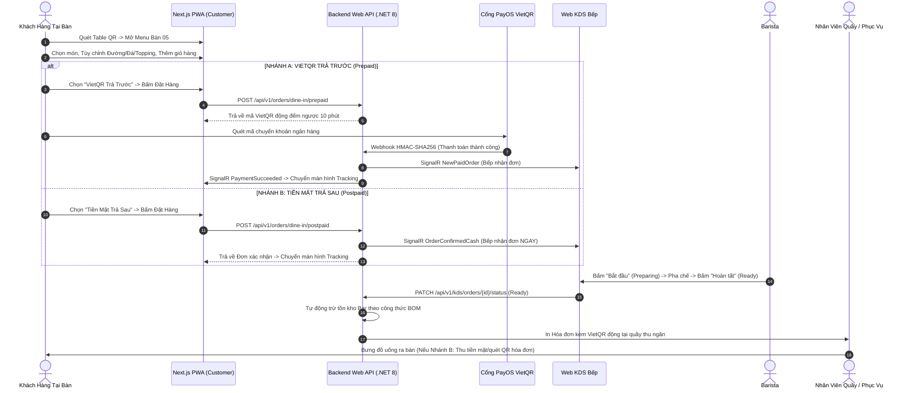
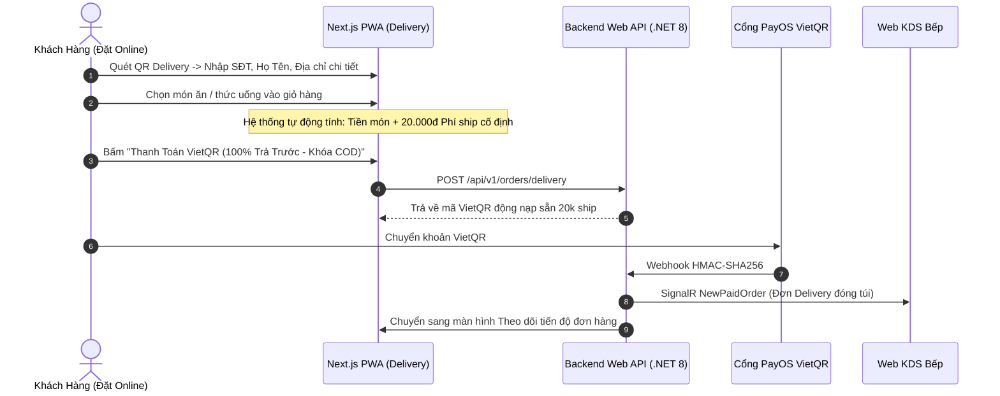
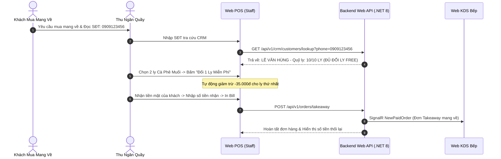
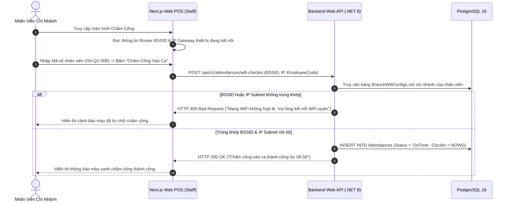
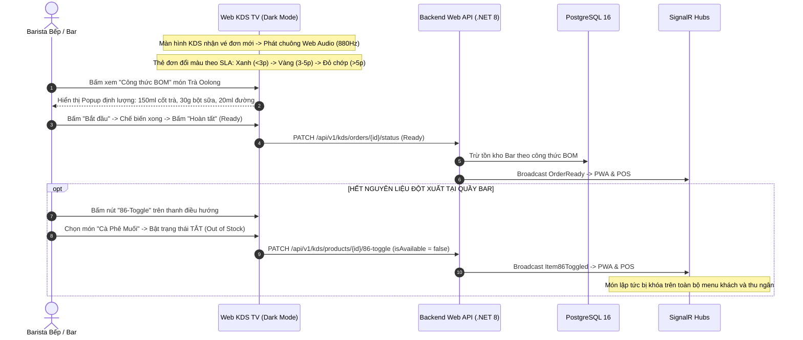
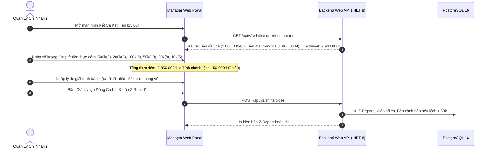
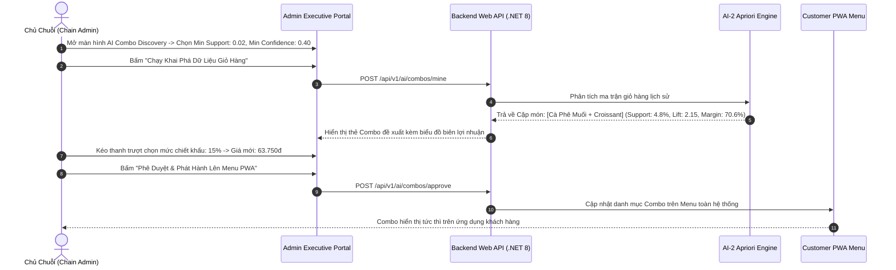

# 🎨 QUY TRÌNH 04: THIẾT KẾ UI/UX & WIREFRAME DESIGN SYSTEM (NEXT.JS 14 MONOREPO)
## HỆ THỐNG SMART F&B OPERATING SYSTEM (SMART F&B OS)

> [!NOTE]
> **Mã tài liệu:** `SPEC-UIUX-04` | **Phiên bản:** `v2.5.0-Production-Ready`  
> **Chuẩn thiết kế:** Next.js 14 App Router Monorepo + Tailwind CSS + Shadcn/UI Component System  
> **Tiêu chuẩn tương thích & Tiếp cận:** Mobile-First Responsive, WCAG 2.1 AA Compliant, Touch Target >= 44x44px  
> **Nguồn sự thật chuẩn hóa:** `01_Tai_Lieu_Dac_Ta_Goc/` (`Smart_FB_Operating_System.md`, `Actor_KhachHang_Luong_Chay.md`, `Workflow_Quy_Trinh_Nghiep_Vu.md`, `Tong_Quan_Kien_Truc_He_Thong.md`)  
> **Cam kết chất lượng:** Phân rã trọn vẹn 5 Route Groups độc lập, loại bỏ 100% ứng dụng di động native/GPS/QR xoay vòng. Xuất bản đầy đủ Design Tokens, 7 Sơ đồ luồng trải nghiệm người dùng, 20 Khung giao diện ASCII Wireframes chuẩn hóa chi tiết và Bảng ma trận truy vết 62 tính năng cốt lõi. Zero Placeholder.

---

# 📑 MỤC LỤC TÀI LIỆU

1. [Hệ Thống Design Tokens Chuẩn Hóa](#1-hệ-thống-design-tokens-chuẩn-hóa)
   - 1.1 [Bảng Màu Nhận Diện Thương Hiệu & Trạng Thái Ngữ Cảnh](#11-bảng-màu-nhận-diện-thương-hiệu--trạng-thái-ngữ-cảnh)
   - 1.2 [Thang Đo Typography & Hệ Thống Khoảng Cách (Spacing Grid)](#12-thang-đo-typography--hệ-thống-khoảng-cách-spacing-grid)
   - 1.3 [Đổ Bóng (Shadows), Bo Góc (Border Radius) & Touch Targets](#13-đổ-bóng-shadows-bo-góc-border-radius--touch-targets)
   - 1.4 [Hệ Thống Phản Hồi Âm Thanh (Web Audio API Sound System)](#14-hệ-thống-phản-hồi-âm-thanh-web-audio-api-sound-system)
2. [Kiến Trúc Next.js 14 App Router Monorepo (5 Route Groups)](#2-kiến-trúc-nextjs-14-app-router-monorepo-5-route-groups)
   - 2.1 [Cây Thư Mục Monorepo Chuẩn Hóa](#21-cây-thư-mục-monorepo-chuẩn-hóa)
   - 2.2 [Chiến Lược Quản Lý Trạng Thái (State Management & SignalR Hooks)](#22-chiến-lược-quản-lý-trạng-thái-state-management--signalr-hooks)
3. [Sơ Đồ Luồng Trải Nghiệm Người Dùng (7 Core Business Flows)](#3-sơ-đồ-luồng-trải-nghiệm-người-dùng-7-core-business-flows)
   - 3.1 [Luồng 1: Đặt Món Tại Bàn Dine-In (Nhánh A VietQR vs Nhánh B Tiền Mặt)](#31-luồng-1-đặt-món-tại-bàn-dine-in-nhánh-a-vietqr-vs-nhánh-b-tiền-mặt)
   - 3.2 [Luồng 2: Đặt Giao Hàng Tận Nơi (QR Delivery Phí Ship 20k)](#32-luồng-2-đặt-giao-hàng-tận-nơi-qr-delivery-phí-ship-20k)
   - 3.3 [Luồng 3: Bán Mang Về Tại Quầy (Takeaway Web POS & Tích 10 Ly Tặng 1)](#33-luồng-3-bán-mang-về-tại-quầy-takeaway-web-pos--tích-10-ly-tặng-1)
   - 3.4 [Luồng 4: Chấm Công Khóa Mạng WiFi (WiFi-Locked Dual-Check)](#34-luồng-4-chấm-công-khóa-mạng-wifi-wifi-locked-dual-check)
   - 3.5 [Luồng 5: Điều Phối Chế Biến KDS Bếp & Khóa Món 86-Toggle](#35-luồng-5-điều-phối-chế-biến-kds-bếp--khóa-món-86-toggle)
   - 3.6 [Luồng 6: Quản Lý Ca Két Tiền & Đối Soát Z-Report Mệnh Giá](#36-luồng-6-quản-lý-ca-két-tiền--đối-soát-z-report-mệnh-giá)
   - 3.7 [Luồng 7: Khai Phá & Phê Duyệt Combo AI-2 (Apriori Engine)](#37-luồng-7-khai-phá--phê-duyệt-combo-ai-2-apriori-engine)
4. [Bộ 20 Khung Giao Diện ASCII Wireframes Chuẩn Hóa Phân Bổ 5 Route Groups](#4-bộ-20-khung-giao-diện-ascii-wireframes-chuẩn-hóa-phân-bổ-5-route-groups)
   - 4.1 [Route Group 1: `(customer)` — Mobile-First PWA Khách Hàng](#41-route-group-1-customer--mobile-first-pwa-khách-hàng)
   - 4.2 [Route Group 2: `(kds)` — Web KDS Bếp / Bar Full-Screen Dark Mode](#42-route-group-2-kds--web-kds-bếp--bar-full-screen-dark-mode)
   - 4.3 [Route Group 3: `(staff)` — Web POS Quầy Thu Ngân & Vận Hành Bàn](#43-route-group-3-staff--web-pos-quầy-thu-ngân--vận-hành-bàn)
   - 4.4 [Route Group 4: `(manager)` — Cổng Web Quản Lý Chi Nhánh](#44-route-group-4-manager--cổng-web-quản-lý-chi-nhánh)
   - 4.5 [Route Group 5: `(admin)` — Cổng Web Điều Hành Chuỗi Trung Tâm](#45-route-group-5-admin--cổng-web-điều-hành-chuỗi-trung-tâm)
5. [Tiêu Chuẩn Tiếp Cận (WCAG 2.1 AA) & Tương Tác Vi Mô (Micro-Interactions)](#5-tiêu-chuẩn-tiếp-cận-wcag-21-aa--tương-tác-vi-mô-micro-interactions)
6. [Ma Trận Truy Vết 62 Tính Năng Cốt Lõi Vào 5 Route Groups (UI RTM)](#6-ma-trận-truy-vết-62-tính-năng-cốt-lõi-vào-5-route-groups-ui-rtm)

---

# 1. HỆ THỐNG DESIGN TOKENS CHUẨN HÓA

### 1.1 Bảng Màu Nhận Diện Thương Hiệu & Trạng Thái Ngữ Cảnh

Hệ thống thiết lập bảng màu kép: Tông màu ấm tự nhiên (`Warm Amber & Coffee`) cho PWA Khách hàng và Web POS, kết hợp chế độ Nền Tối Chống Lóa (`High-Contrast Slate Dark Mode`) chuyên dụng cho màn hình KDS Bếp:

```
┌──────────────────────────────────────────────────────────────────────────────────────────────────┐
│                                   BẢNG DESIGN TOKENS MÀU SẮC                                     │
├───────────────────┬───────────────────┬───────────────────┬──────────────────────────────────────┤
│ Nhóm Token        │ Tên Biến Token    │ Mã Hex / CSS Var  │ Ngữ Cảnh Sử Dụng Chính               │
├───────────────────┼───────────────────┼───────────────────┼──────────────────────────────────────┤
│ **Primary**       │ `brand-coffee`    │ `#8B4513`         │ Nút CTA chính, Header PWA, Badge     │
│ **Primary Hover** │ `brand-coffee-dk` │ `#5C2E0B`         │ Trạng thái Hover / Active nút chính  │
│ **Secondary**     │ `brand-amber`     │ `#D97706`         │ Nhãn Best-seller, Icon sao, Ly tích  │
│ **Background**    │ `bg-cream`        │ `#FAF8F5`         │ Nền chính PWA Khách & Web POS Quầy   │
│ **Surface Light** │ `surface-white`   │ `#FFFFFF`         │ Nền Card món, Modal Pop-up, Giỏ hàng │
│ **Text Primary**  │ `text-main`       │ `#1A1A1A`         │ Màu chữ chính, Tiêu đề món, Giá tiền │
│ **Text Muted**    │ `text-muted`      │ `#6B7280`         │ Mô tả món, Ghi chú, Nhãn phụ         │
│ **Border Light**  │ `border-subtle`   │ `#E5E7EB`         │ Đường kẻ viền phân cách Card/Bảng    │
├───────────────────┼───────────────────┼───────────────────┼──────────────────────────────────────┤
│ **Success**       │ `state-success`   │ `#10B981`         │ Đã thanh toán, KDS < 3 phút, Đúng WiFi│
│ **Warning**       │ `state-warning`   │ `#F59E0B`         │ Đang pha chế, KDS 3-5 phút, Lệch két │
│ **Danger**        │ `state-danger`    │ `#EF4444`         │ KDS > 5 phút (Đỏ nhấp nháy), Sai WiFi│
│ **Info**          │ `state-info`      │ `#3B82F6`         │ Thông báo SignalR, Bàn đang phục vụ  │
├───────────────────┼───────────────────┼───────────────────┼──────────────────────────────────────┤
│ **KDS Dark BG**   │ `kds-bg-dark`     │ `#0F172A`         │ Nền toàn màn hình KDS Bếp chống lóa  │
│ **KDS Dark Card** │ `kds-surface`     │ `#1E293B`         │ Nền vé đơn hàng (Order Ticket)       │
│ **KDS Dark Text** │ `kds-text-main`   │ `#F8FAFC`         │ Chữ trắng sáng đọc rõ từ khoảng cách 2m
└───────────────────┴───────────────────┴───────────────────┴──────────────────────────────────────┘
```

---

### 1.2 Thang Đo Typography & Hệ Thống Khoảng Cách (Spacing Grid)

* **Font chữ tiêu chuẩn:** `Inter` (Mặc định cho Admin/POS) kết hợp `Be Vietnam Pro` (Tối ưu hiển thị tiếng Việt có dấu cho Customer PWA).
* **Thang kích thước chữ (Typography Scale):**
  - `Display / Hero Title`: `32px` (2rem) / Line-height `40px` (Font-weight: 700 Bold).
  - `Heading 1 (H1)`: `24px` (1.5rem) / Line-height `32px` (Font-weight: 600 SemiBold).
  - `Heading 2 (H2)`: `18px` (1.125rem) / Line-height `24px` (Font-weight: 600 SemiBold).
  - `Body Text (P)`: `14px` (0.875rem) / Line-height `20px` (Font-weight: 400 Regular).
  - `Caption & Helper`: `12px` (0.75rem) / Line-height `16px` (Font-weight: 500 Medium).
* **Hệ thống Spacing (Lưới 4px):**
  - `4px` (`space-1`), `8px` (`space-2`), `12px` (`space-3`), `16px` (`space-4`), `24px` (`space-6`), `32px` (`space-8`), `48px` (`space-12`).

---

### 1.3 Đổ Bóng (Shadows), Bo Góc (Border Radius) & Touch Targets

* **Border Radius:**
  - `rounded-sm`: `4px` (Tag nhỏ, Badge).
  - `rounded-md`: `8px` (Input field, Button nhỏ, Dropdown).
  - `rounded-lg`: `12px` (Card món ăn, Modal Dialog, Order Ticket).
  - `rounded-full`: `9999px` (Pill category, Avatar, Nút bấm tròn).
* **Box Shadows:**
  - `shadow-sm`: `0 1px 2px 0 rgb(0 0 0 / 0.05)` (Card trên nền cream).
  - `shadow-md`: `0 4px 6px -1px rgb(0 0 0 / 0.1)` (Floating Cart Bar, Modal).
  - `shadow-lg`: `0 10px 15px -3px rgb(0 0 0 / 0.1)` (Dropdown menu, Drawer).
* **Quy tắc Touch Target bất biến:** Mọi nút bấm, icon và thành phần cảm ứng trên Mobile PWA và KDS TV tối thiểu đạt **>= 44 x 44px** (Tuân thủ chuẩn WCAG 2.1 AA).

---

### 1.4 Hệ Thống Phản Hồi Âm Thanh (Web Audio API Sound System)

Để hỗ trợ quầy Bar/Bếp vận hành không cần chạm liên tục, hệ thống tích hợp bộ phát âm thanh tổng hợp bằng Web Audio API (không cần tải file audio nặng):

1. **Âm báo vé đơn hàng mới (`SoundNewTicket`):** Tần số kép `880Hz` ➔ `1174Hz` (Sine wave, thời lượng 300ms) khi có đơn thanh toán thành công.
2. **Âm báo trễ đơn SLA KDS quá 5 phút (`SoundOverdueAlert`):** Chuỗi xung `440Hz` nhấp nháy 3 lần cảnh báo đơn bị quá thời gian.
3. **Âm báo chuông gọi phục vụ bàn (`SoundServiceCall`):** Âm thanh `587Hz` êm dịu nhắc nhở nhân viên quầy.

---

# 2. KIẾN TRÚC NEXT.JS 14 APP ROUTER MONOREPO (5 ROUTE GROUPS)

### 2.1 Cây Thư Mục Monorepo Chuẩn Hóa

```
frontend/
├── app/
│   ├── (customer)/                      # ROUTE GROUP 1: PWA Khách Hàng (Mobile-First 375px)
│   │   ├── table/[tableId]/page.tsx     # Menu gọi món tại bàn, Gợi ý AI-1, Tùy biến BOM
│   │   ├── delivery/page.tsx            # Đặt giao hàng QR Delivery (Phí ship 20k, 100% VietQR)
│   │   ├── cart/page.tsx                # Giỏ hàng & Chọn Nhánh A (VietQR) / Nhánh B (Tiền mặt)
│   │   ├── checkout/vietqr/page.tsx     # Màn hình VietQR động đếm ngược 10 phút
│   │   ├── tracking/[orderId]/page.tsx  # Theo dõi tiến độ đơn hàng thời gian thực SignalR
│   │   ├── review/[orderId]/page.tsx    # Đánh giá 1-5 sao, Upload 1-3 ảnh thực tế
│   │   ├── history/page.tsx             # Lịch sử đơn hàng cũ, Quick Reorder 1 chạm
│   │   └── ai-chat/page.tsx             # Giao diện Chatbot AI-1 Gemini RAG tư vấn món
│   │
│   ├── (kds)/                           # ROUTE GROUP 2: Web KDS Bếp / Bar Full-Screen Dark Mode
│   │   ├── layout.tsx                   # Dark Theme Wrapper, Web Audio Controller Provider
│   │   ├── page.tsx                     # Ticket Board pha chế, Lọc Station Bar/Bếp, Gom đơn
│   │   ├── batch/page.tsx               # Chế độ Gom món KDS Batching pha chế đồng loạt
│   │   └── 86-toggle/page.tsx           # Modal khóa hết món nhanh cho Barista
│   │
│   ├── (staff)/                         # ROUTE GROUP 3: Web POS Quầy & Nhân Viên Vận Hành
│   │   ├── pos/page.tsx                 # Web POS Quầy Takeaway: Tra SĐT CRM, Tích 10 ly, Thu tiền
│   │   ├── tables/page.tsx              # Sơ đồ mặt bằng bàn trực quan, Tiếp nhận chuông gọi bàn
│   │   ├── attendance/page.tsx          # Chấm công Khóa Mạng WiFi (BSSID/IP + Mã NV)
│   │   └── shift-report/page.tsx        # Báo cáo tổng kết ca nhân viên & Bàn giao
│   │
│   ├── (manager)/                       # ROUTE GROUP 4: Cổng Web Quản Lý Chi Nhánh
│   │   ├── dashboard/page.tsx           # Dashboard KPI vận hành chi nhánh theo giờ
│   │   ├── shifts/page.tsx              # Mở/Kết ca két tiền, Đối soát Z-Report theo 6 mệnh giá
│   │   ├── inventory/page.tsx           # Quản lý kho BOM: Nhập NCC, Xuất bar, Kiểm kê hao hụt
│   │   ├── wifi-configs/page.tsx        # Khai báo danh sách Router BSSID và IP Subnet chi nhánh
│   │   └── reviews/page.tsx             # Tiếp nhận Alert Review <= 2 sao, Kiểm duyệt ảnh khách
│   │
│   └── (admin)/                         # ROUTE GROUP 5: Cổng Web Điều Hành Chuỗi Trung Tâm
│       ├── dashboard/page.tsx           # Dashboard P&L hợp nhất toàn chuỗi, So sánh đa chi nhánh
│       ├── menu/products/page.tsx       # Full CRUD Món ăn, Định nghĩa BOM, Thay thế món (Replace)
│       ├── menu/categories/page.tsx     # Sắp xếp thứ tự danh mục (Drag & Drop)
│       ├── menu/seasonal/page.tsx       # Lên lịch thực đơn theo mùa vụ (Seasonal Menu)
│       ├── pricing/page.tsx             # Quản lý bảng giá theo vùng chi nhánh (Matrix Pricing)
│       ├── ai/combos/page.tsx           # AI-2 Khai phá Combo Apriori, Slider chiết khấu, Phê duyệt
│       ├── crm/page.tsx                 # Danh bạ khách hàng toàn chuỗi, Phân khúc RFM
│       └── audit-logs/page.tsx          # Nhật ký kiểm toán bất biến hệ thống
```

---

### 2.2 Chiến Lược Quản Lý Trạng Thái (State Management & SignalR Hooks)

* **Client UI State:** `Zustand` (Giỏ hàng PWA, Bộ lọc danh mục, Dữ liệu đếm tiền Z-Report tạm thời).
* **Server State & Caching:** `TanStack Query v5` (Quản lý cache danh mục thực đơn, danh sách chi nhánh, tự động revalidate khi có thay đổi).
* **Real-time SignalR Hooks:** Custom hook `useSignalRHub(hubUrl, eventHandlers)` tự động kết nối lại (Auto Reconnect với backoff lũy thừa 0s, 2s, 5s, 10s) và dispatch sự kiện vào Zustand store.

---

# 3. SƠ ĐỒ LUỒNG TRẢI NGHIỆM NGƯỜI DÙNG (7 CORE BUSINESS FLOWS)

### 3.1 Luồng 1: Đặt Món Tại Bàn Dine-In (Nhánh A VietQR vs Nhánh B Tiền Mặt)



---

### 3.2 Luồng 2: Đặt Giao Hàng Tận Nơi (QR Delivery Phí Ship 20k)



---

### 3.3 Luồng 3: Bán Mang Về Tại Quầy (Takeaway Web POS & Tích 10 Ly Tặng 1)



---

### 3.4 Luồng 4: Chấm Công Khóa Mạng WiFi (WiFi-Locked Dual-Check)



---

### 3.5 Luồng 5: Điều Phối Chế Biến KDS Bếp & Khóa Món 86-Toggle



---

### 3.6 Luồng 6: Quản Lý Ca Két Tiền & Đối Soát Z-Report Mệnh Giá



---

### 3.7 Luồng 7: Khai Phá & Phê Duyệt Combo AI-2 (Apriori Engine)



---

# 4. BỘ 20 KHUNG GIAO DIỆN ASCII WIREFRAMES CHUẨN HÓA PHÂN BỔ 5 ROUTE GROUPS

---

## 4.1 Route Group 1: `(customer)` — Mobile-First PWA Khách Hàng

### Wireframe SCR-CUST-01: Menu Đặt Món Tại Bàn (Dine-In Menu)
```
┌────────────────────────────────────────────────────────┐
│  SMART COFFEE — CHI NHÁNH QUẬN 1           [ 09:15 ]   │
│  📍 Bàn 05 (Tầng 1)  •  Khách: 0912***678  [ 7/10 ly ] │
├────────────────────────────────────────────────────────┤
│  🔍 Tìm kiếm đồ uống, bánh ngọt...                     │
├────────────────────────────────────────────────────────┤
│  DANH MỤC: [ TẤT CẢ ] [ CÀ PHÊ ] [ TRÀ TRÁI CÂY ] [ BÁNH]
├────────────────────────────────────────────────────────┤
│  ✨ GỢI Ý DÀNH CHO BẠN (AI-1 GEMINI RAG)               │
│  ┌──────────────────────────────────────────────────┐  │
│  │ 🧋 Bạc Xỉu 3 Tầng Đặc Biệt            39.000 đ   │  │
│  │    Vị đậm đà béo ngậy, ít calo (140 kcal)        │  │
│  │    [ + THÊM VÀO GIỎ ]                            │  │
│  └──────────────────────────────────────────────────┘  │
│                                                        │
│  ☕ CÀ PHÊ TRUYỀN THỐNG                                │
│  ┌──────────────────────────────────────────────────┐  │
│  │ ☕ Cà Phê Muối Cố Đô                  35.000 đ   │  │
│  │    Lớp kem muối béo mặn hòa quyện cà phê phin    │  │
│  │    [ + THÊM VÀO GIỎ ]                            │  │
│  └──────────────────────────────────────────────────┘  │
│  ┌──────────────────────────────────────────────────┐  │
│  │ ☕ Cà Phê Đen Đá Phin Đậm Vị           25.000 đ   │  │
│  │    [ + THÊM VÀO GIỎ ]                            │  │
│  └──────────────────────────────────────────────────┘  │
├────────────────────────────────────────────────────────┤
│  [💬 HỎI AI TƯ VẤN MÓN]      [ 🛒 GIỎ HÀNG: 2 MÓN (74k) ]│
└────────────────────────────────────────────────────────┘
```

### Wireframe SCR-CUST-02: Modal Tùy Biến Định Lượng Món (Customization Drawer)
```
┌────────────────────────────────────────────────────────┐
│  TÙY BIẾN ĐỒ UỐNG — BẠC XỈU 3 TẦNG                     │
├────────────────────────────────────────────────────────┤
│  KÍCH CỠ (SIZE):                                       │
│  ( ) Size S (-4.000đ)  (•) Size M (+0đ)  ( ) Size L (+8k)
├────────────────────────────────────────────────────────┤
│  LƯỢNG ĐƯỜNG:                                          │
│  ( ) 0%   ( ) 30%   (•) 50% (Khuyên dùng)   ( ) 100%   │
├────────────────────────────────────────────────────────┤
│  LƯỢNG ĐÁ:                                             │
│  ( ) Không đá       (•) 50% đá             ( ) 100% đá │
├────────────────────────────────────────────────────────┤
│  TOPPING THÊM:                                         │
│  [x] Trân châu hoàng kim (+8.000đ)                     │
│  [ ] Kem Cheese béo mặn (+10.000đ)                     │
├────────────────────────────────────────────────────────┤
│  Ghi chú: [ Ít ngọt, nhiều sữa tươi                  ] │
├────────────────────────────────────────────────────────┤
│  Số lượng: [ - ]  1  [ + ]          Tạm tính: 47.000 đ │
│  [               THÊM VÀO GIỎ HÀNG                   ] │
└────────────────────────────────────────────────────────┘
```

### Wireframe SCR-CUST-03: Giỏ Hàng & Lựa Chọn 2 Nhánh Dine-In
```
┌────────────────────────────────────────────────────────┐
│  GIỎ HÀNG BÀN 05 — SMART COFFEE            [ 09:18 ]   │
├────────────────────────────────────────────────────────┤
│  1. Bạc Xỉu 3 Tầng (Size L, 50% đường, 50% đá) 47.000đ │
│     + Trân châu hoàng kim (+8.000đ)                    │
│     Số lượng: [ - ]  1  [ + ]               55.000 đ   │
│                                                        │
│  2. Cà Phê Muối Cố Đô (Size M, 50% đá)                 │
│     Số lượng: [ - ]  1  [ + ]               35.000 đ   │
├────────────────────────────────────────────────────────┤
│  Mã giảm giá: [ CHAOMUNG        ]  [ ÁP DỤNG ]         │
│  Tạm tính:                                  90.000 đ   │
│  Giảm giá voucher:                         -10.000 đ   │
│  TỔNG CỘNG:                                 80.000 đ   │
├────────────────────────────────────────────────────────┤
│  💳 CHỌN PHƯƠNG THỨC THANH TOÁN:                       │
│                                                        │
│  ┌──────────────────────────────────────────────────┐  │
│  │ (•) NHÁNH A: VIETQR TRẢ TRƯỚC (Khuyên dùng)      │  │
│  │     Quét mã chuyển khoản -> Bếp nhận đơn ngay    │  │
│  └──────────────────────────────────────────────────┘  │
│  ┌──────────────────────────────────────────────────┐  │
│  │ ( ) NHÁNH B: TIỀN MẶT TRẢ SAU                    │  │
│  │     Bếp làm ngay -> Nhân viên bưng kèm Bill QR   │  │
│  └──────────────────────────────────────────────────┘  │
│                                                        │
│  [           XÁC NHẬN ĐẶT ĐƠN (80.000 Đ)            ]  │
└────────────────────────────────────────────────────────┘
```

### Wireframe SCR-CUST-04: Màn Hình Thanh Toán VietQR Động
```
┌────────────────────────────────────────────────────────┐
│  THANH TOÁN VIETQR — ĐƠN #ORD-0042         [ 09:19 ]   │
├────────────────────────────────────────────────────────┤
│  ⏱️ Mã QR hết hạn sau: [ 09:45 ] (10 Phút đếm ngược)   │
│                                                        │
│              ┌──────────────────────┐                  │
│              │  ████████  ████████  │                  │
│              │  ██  ████  ██  ████  │                  │
│              │  ████████  ████████  │                  │
│              │  ████  ██  ██  ████  │                  │
│              │  ████████  ████████  │                  │
│              └──────────────────────┘                  │
│               [ TẢI MÃ QR VỀ MÁY ]                     │
│                                                        │
│  Ngân hàng: VietinBank (ICB)                           │
│  Số tài khoản: 0001882199201 [ COPY ]                  │
│  Chủ tài khoản: SMART COFFEE QUAN 1                    │
│  Số tiền: 80.000 VNĐ [ COPY ]                          │
│  Nội dung CK: ORD0042 [ COPY ]                         │
├────────────────────────────────────────────────────────┤
│  🔄 Đang chờ tín hiệu chuyển khoản tự động...          │
│  [   HỦY ĐƠN HÀNG   ]     [ KIỂM TRA LẠI TRẠNG THÁI ]  │
└────────────────────────────────────────────────────────┘
```

### Wireframe SCR-CUST-05: Màn Hình QR Delivery (Giao Tận Nơi Phí 20k)
```
┌────────────────────────────────────────────────────────┐
│  SMART COFFEE — ĐẶT GIAO TẬN NƠI           [ 10:30 ]   │
├────────────────────────────────────────────────────────┤
│  📍 THÔNG TIN NGƯỜI NHẬN (BẮT BUỘC)                    │
│  Họ và tên: [ Nguyễn Hoàng Nam                       ] │
│  Số điện thoại: [ 0987654321                         ] │
│  Địa chỉ giao hàng chi tiết:                           │
│  [ Tầng 12, Tòa nhà Bitexco, 2 Hải Triều, Q1, TP.HCM ] │
│  Ghi chú shipper: [ Giao sảnh lễ tân trước 11:30     ] │
├────────────────────────────────────────────────────────┤
│  🛒 CHI TIẾT ĐƠN HÀNG (2 MÓN)                          │
│  • 2x Trà Đào Cam Sả (Size L, 50% đường)      70.000 đ │
│  ────────────────────────────────────────────────────  │
│  Tiền món:                                    70.000 đ │
│  Phí giao hàng (Cố định):                     20.000 đ │
│  Mã giảm giá:                                      0 đ │
│  ────────────────────────────────────────────────────  │
│  TỔNG THANH TOÁN:                             90.000 đ │
├────────────────────────────────────────────────────────┤
│  💳 HÌNH THỨC THANH TOÁN:                              │
│  (•) Chuyển khoản VietQR (100% Trả trước - Khóa COD)  │
│                                                        │
│  [  TIẾP TỤC THANH TOÁN VIETQR (90.000 Đ)  ]           │
└────────────────────────────────────────────────────────┘
```

### Wireframe SCR-CUST-06: Màn Hình Theo Dõi Đơn Hàng Real-Time (Live Stepper)
```
┌────────────────────────────────────────────────────────┐
│  TIẾN ĐỘ ĐƠN HÀNG #ORD-0042                [ 09:25 ]   │
├────────────────────────────────────────────────────────┤
│  📍 Bàn 05  •  Thời gian dự kiến: ~5 phút             │
│                                                        │
│  (✓) ĐÃ TIẾP NHẬN ➔ (●) ĐANG PHA CHẾ ➔ ( ) HOÀN TẤT    │
│                                                        │
│  ┌──────────────────────────────────────────────────┐  │
│  │ 🧑‍🍳 Barista đang chuẩn bị đồ uống cho bạn...      │  │
│  │    Vị trí trong hàng đợi: #2                     │  │
│  └──────────────────────────────────────────────────┘  │
│                                                        │
│  MÓN ĐÃ ĐẶT:                                           │
│  • 1x Bạc Xỉu 3 Tầng (Size L, 50% đường, 50% đá)       │
│  • 1x Cà Phê Muối Cố Đô (Size M, 50% đá)               │
├────────────────────────────────────────────────────────┤
│  [ 🔔 BẤM CHUÔNG GỌI PHỤC VỤ ]   [ 📜 XEM HÓA ĐƠN ]   │
└────────────────────────────────────────────────────────┘
```

### Wireframe SCR-CUST-07: Màn Hình Đánh Giá 1-5 Sao & Tải Ảnh Thực Tế
```
┌────────────────────────────────────────────────────────┐
│  ĐÁNH GIÁ TRẢI NGHIỆM ĐƠN #ORD-0042                    │
├────────────────────────────────────────────────────────┤
│  Bạn thấy chất lượng đồ uống & phục vụ thế nào?        │
│                                                        │
│               ⭐ ⭐ ⭐ ⭐ ⭐                            │
│           ( 5/5 Sao - Rất hài lòng )                   │
│                                                        │
│  CHỌN NHÃN CẢM NHẬN NHANH:                             │
│  [ Pha chế nhanh ] [ Đồ uống ngon ] [ Nhân viên nhiệt tình]
├────────────────────────────────────────────────────────┤
│  Ý kiến đóng góp chi tiết:                             │
│  [ Cà phê muối béo ngậy rất vừa miệng, không gian quán │
│    rất yên tĩnh thích hợp làm việc!                  ] │
├────────────────────────────────────────────────────────┤
│  TẢI ẢNH THỰC TẾ (1 - 3 ẢNH):                          │
│  ┌───────────┐ ┌───────────┐ ┌───────────┐             │
│  │ [Ảnh 1]   │ │ [Ảnh 2]   │ │ [ + THÊM] │             │
│  └───────────┘ └───────────┘ └───────────┘             │
│  [x] Đánh giá ẩn danh (Không hiện SĐT)                 │
├────────────────────────────────────────────────────────┤
│  [              GỬI ĐÁNH GIÁ NGAY                    ] │
└────────────────────────────────────────────────────────┘
```

### Wireframe SCR-CUST-08: Giao Diện Chatbot AI-1 Gemini RAG
```
┌────────────────────────────────────────────────────────┐
│  AI ASSISTANT — SMART BARISTA              [ 09:12 ]   │
├────────────────────────────────────────────────────────┤
│  🤖 Smart Barista:                                     │
│     Chào bạn! Hôm nay trời nắng 34°C, bạn có muốn một  │
│     món trà thanh mát giải nhiệt không?                │
│                                                        │
│  👤 Bạn:                                               │
│     Mình muốn uống món gì chua ngọt, ít calo dưới 100k │
│                                                        │
│  🤖 Smart Barista:                                     │
│     Mình gợi ý bạn món **Trà Đào Cam Sả Size M**        │
│     (chỉ 85 kcal, giá 35.000đ). Món này vị thanh ngọt, │
│     thơm mùi sả tươi rất mát lành!                     │
│     ┌────────────────────────────────────────────────┐ │
│     │ 🍹 Trà Đào Cam Sả (35.000 đ)  [ + THÊM GIỎ ]  │ │
│     └────────────────────────────────────────────────┘ │
├────────────────────────────────────────────────────────┤
│  [ Nhập câu hỏi tư vấn đồ uống...           ] [ GỬI ]  │
└────────────────────────────────────────────────────────┘
```

---

## 4.2 Route Group 2: `(kds)` — Web KDS Bếp / Bar Full-Screen Dark Mode

### Wireframe SCR-KDS-01: Ticket Board Pha Chế (Dark Mode)
```
┌────────────────────────────────────────────────────────────────────────────────────────┐
│ SMART KDS — BẾP & QUẦY PHA CHẾ (CHI NHÁNH QUẬN 1)                        ⏱️ 10:48:30   │
├────────────────────────┬────────────────────────┬──────────────────────────────────────┤
│ #ORD-0042 [BÀN 05]     │ #TK-0089 [MANG VỀ]     │ #DEL-0015 [GIAO HÀNG]                │
│ ⏱️ 02:15 (XANH - KỊP)  │ ⏱️ 04:30 (VÀNG - CHỜ)  │ ⏱️ 06:10 (ĐỎ NHẤP NHÁY ⚠️)           │
│ Đã thanh toán VietQR   │ Đã thanh toán Tiền mặt │ Giao: 2 Hải Triều (0987654321)       │
├────────────────────────┼────────────────────────┼──────────────────────────────────────┤
│ • 2x Bạc Xỉu 3 Tầng    │ • 2x Cà Phê Muối       │ • 2x Trà Đào Cam Sả                  │
│   - Size L             │   - Size M             │   - Size L                           │
│   - 50% đường, 50% đá  │   - 50% đá             │   - 50% đường, 100% đá               │
│   - + Trân châu HK     │   - Lớp kem muối đặc   │   - Đóng túi giao hàng               │
│   - Note: Ít ngọt      │                        │                                      │
├────────────────────────┼────────────────────────┼──────────────────────────────────────┤
│ [ BẮT ĐẦU ] [ HOÀN TẤT]│ [ BẮT ĐẦU ] [ HOÀN TẤT]│ [ BẮT ĐẦU ] [ HOÀN TẤT ]             │
└────────────────────────┴────────────────────────┴──────────────────────────────────────┘
```

### Wireframe SCR-KDS-02: Modal Tra Cứu Công Thức BOM Pha Chế
```
┌──────────────────────────────────────┐
│  🧪 CÔNG THỨC PHA CHẾ (BOM)         │
│  Trà Oolong Size L — Đơn #ORD-0042   │
├──────────────────────────────────────┤
│  ├── Cốt trà Oolong:     150 ml      │
│  ├── Bột sữa:            30 g        │
│  ├── Nước đường (50%):   20 ml       │
│  ├── Trân châu trắng:    1 vá        │
│  ├── Đá viên:            2/3 ly      │
│  └── Ly 700ml + nắp + ống hút       │
│                                      │
│  📋 Ghi chú khách: "Ít ngọt hơn"    │
│                                      │
│  [✅ ĐÃ HIỂU — ĐÓNG POPUP]           │
└──────────────────────────────────────┘
```

### Wireframe SCR-KDS-03: Modal Khóa Hết Món Nhanh 86-Toggle
```
┌────────────────────────────────────────────────────────┐
│  🚫 KHÓA HẾT MÓN NHANH TẠI QUẦY (86-TOGGLE)           │
├────────────────────────────────────────────────────────┤
│  🔍 Tìm kiếm món cần khóa...                          │
├────────────────────────────────────────────────────────┤
│  1. Cà Phê Muối Cố Đô        [ ĐANG BÁN ] -> [ 🔴 KHÓA ]│
│  2. Trà Đào Cam Sả           [ ĐANG BÁN ] -> [ 🔴 KHÓA ]│
│  3. Bánh Croissant Trứng Muối[ ĐÃ KHÓA  ] -> [ 🟢 MỞ   ]│
├────────────────────────────────────────────────────────┤
│  [ ĐÓNG CỬA SỔ ]                                      │
└────────────────────────────────────────────────────────┘
```

### Wireframe SCR-KDS-04: Chế Độ Gom Món KDS Batching
```
┌────────────────────────────────────────────────────────────────────────────────────────┐
│  📦 CHẾ ĐỘ GOM MÓN PHA CHẾ ĐỒNG LOẠT (KDS BATCHING)                                   │
├────────────────────────────────────────────────────────────────────────────────────────┤
│  MÓN ĐANG ĐỢI PHA: CÀ PHÊ MUỐI (TỔNG CỘNG: 6 LY CẦN LÀM)                               │
│  • Đơn #ORD-0042 (Bàn 05): 2 ly Size M (50% đá)                                        │
│  • Đơn #TK-0089 (Mang về): 2 ly Size M (50% đá)                                        │
│  • Đơn #ORD-0045 (Bàn 02): 2 ly Size M (100% đá)                                       │
├────────────────────────────────────────────────────────────────────────────────────────┤
│  Tổng định lượng cốt cà phê phin cần rót: 180 ml | Kem muối: 240 ml                   │
│  [      🟢 HOÀN TẤT CẢ 6 LY TRONG MẺ NÀY (TỰ ĐỘNG CHUYỂN READY CHO 3 ĐƠN)      ]       │
└────────────────────────────────────────────────────────────────────────────────────────┘
```

---

## 4.3 Route Group 3: `(staff)` — Web POS Quầy Thu Ngân & Vận Hành Bàn

### Wireframe SCR-STAFF-01: Giao Diện Web POS Takeaway & Tra Cứu CRM 10 Ly
```
┌────────────────────────────────────────────────────────────────────────────────────────┐
│ SMART COFFEE POS — QUẦY THU NGÂN CHI NHÁNH QUẬN 1                         [ 10:45:12 ] │
├─────────────────────────────────────────────┬──────────────────────────────────────────┤
│  🔍 SĐT KHÁCH: [ 0909123456              ]  │  GIỎ HÀNG: ĐƠN MANG VỀ (#TK-0089)        │
│  👤 Khách hàng: LÊ VĂN HÙNG                 │  ──────────────────────────────────────  │
│  🏆 Tích lũy ly: [██████████] 10/10 LY      │  1. Cà Phê Muối (Size M, 50% đá) 35.000đ │
│  🎁 [  BẤM ĐỔI 1 LY MIỄN PHÍ (-35.000đ)  ]  │  2. Cà Phê Muối (Size M, 50% đá) 35.000đ │
├─────────────────────────────────────────────┤  ──────────────────────────────────────  │
│  DANH MỤC: [ CÀ PHÊ ] [ TRÀ ] [ BÁNH NGỌT ] │  Tổng tiền món:                70.000 đ  │
│  ┌───────────────┐ ┌───────────────┐        │  Ưu đãi 10 Ly tặng 1:         -35.000 đ  │
│  │ Bạc Xỉu       │ │ Cà Phê Muối   │        │  ──────────────────────────────────────  │
│  │ 39.000 đ      │ │ 35.000 đ      │        │  KHÁCH CẦN TRẢ:                35.000 đ  │
│  └───────────────┘ └───────────────┘        │                                          │
│  ┌───────────────┐ ┌───────────────┐        │  Hình thức:  [ (•) TIỀN MẶT ]  [ ( ) VIETQR ]
│  │ Cà Phê Đen    │ │ Trà Đào Cam Sả│        │  Tiền khách đưa: [ 100.000            ]  │
│  │ 25.000 đ      │ │ 45.000 đ      │        │  Tiền thừa trả khách:          65.000 đ  │
│  └───────────────┘ └───────────────┘        │                                          │
│                                             │  [   HỦY   ]    [  IN BILL & GỬI BẾP  ]  │
└─────────────────────────────────────────────┴──────────────────────────────────────────┘
```

### Wireframe SCR-STAFF-02: Sơ Đồ Bàn Mặt Bằng & Tiếp Nhận Chuông Gọi Bàn
```
┌────────────────────────────────────────────────────────────────────────────────────────┐
│  SƠ ĐỒ BÀN PHỤC VỤ — TẦNG 1 (CHI NHÁNH QUẬN 1)                            [ 10:50:00 ] │
├────────────────────────────────────────────────────────────────────────────────────────┤
│  ┌──────────────┐ ┌──────────────┐ ┌──────────────┐ ┌──────────────┐                  │
│  │ BÀN 01 (4N)  │ │ BÀN 02 (2N)  │ │ BÀN 03 (4N)  │ │ BÀN 04 (6N)  │                  │
│  │ 🟢 Trống     │ │ 🔵 Có khách  │ │ 🟢 Trống     │ │ 🔵 Có khách  │                  │
│  │ [ Mở Bàn ]   │ │ Đơn #41 (82k)│ │ [ Mở Bàn ]   │ │ Đơn #39 (145k│                  │
│  └──────────────┘ └──────────────┘ └──────────────┘ └──────────────┘                  │
│  ┌──────────────┐ ┌──────────────┐                                                    │
│  │ BÀN 05 (4N)  │ │ BÀN 06 (2N)  │                                                    │
│  │ 🔴 GỌI NƯỚC! │ │ 🟡 Chờ In Bill│                                                    │
│  │ [ TIẾP NHẬN] │ │ [ In Hóa Đơn]│                                                    │
│  └──────────────┘ └──────────────┘                                                    │
└────────────────────────────────────────────────────────────────────────────────────────┘
```

### Wireframe SCR-STAFF-03: Màn Hình Chấm Công Khóa Mạng WiFi
```
┌────────────────────────────────────────────────────────┐
│  SMART COFFEE — CỔNG CHẤM CÔNG NHÂN VIÊN   [ 06:55 ]   │
├────────────────────────────────────────────────────────┤
│  🏢 Chi nhánh: CHI NHÁNH QUẬN 1                        │
│                                                        │
│  📶 TRẠNG THÁI MẠNG WIFI HIỆN TẠI:                     │
│  ┌──────────────────────────────────────────────────┐  │
│  │  🟢 ĐÃ KẾT NỐI HỢP LỆ: SmartCoffee_Quan1_Staff   │  │
│  │  BSSID: 00:14:22:01:23:45 (Trùng khớp hệ thống)  │  │
│  │  IP: 192.168.1.45 (Nằm trong dải Subnet nội bộ)  │  │
│  └──────────────────────────────────────────────────┘  │
│                                                        │
│  Mã số nhân viên: [ NV-Q1-008                        ] │
│  Ca làm việc: Ca Sáng (07:00 - 15:00)                  │
│                                                        │
│  [        🟢 CHẤM CÔNG VÀO CA (CLOCK-IN)        ]     │
│                                                        │
│  [        🔴 CHẤM CÔNG RA CA (CLOCK-OUT)        ]     │
├────────────────────────────────────────────────────────┤
│  Lịch sử chấm công gần nhất:                           │
│  • Hôm qua: Vào 06:58 (Đúng giờ) - Ra 15:05            │
└────────────────────────────────────────────────────────┘
```

---

## 4.4 Route Group 4: `(manager)` — Cổng Web Quản Lý Chi Nhánh

### Wireframe SCR-MGR-01: Modal Kết Ca & Đối Soát Két Tiền Z-Report
```
┌──────────────────────────────────────────────────────────────────┐
│  📊 Z-REPORT — ĐỐI SOÁT KÉT TIỀN CUỐI CA CHIỀU [ 15:00 ]        │
├──────────────────────────────────────────────────────────────────┤
│  Thu ngân phụ trách: Trần Thị Mai (NV-Q1-001)                   │
│                                                                  │
│  Tiền mặt đầu ca (Opening Cash):                    1.000.000 đ  │
│  (+) Doanh thu tiền mặt trong ca:                   1.900.000 đ  │
│  ──────────────────────────────────────────────────────────────  │
│  (=) TỔNG TIỀN MẶT LÝ THUYẾT HỆ THỐNG:              2.900.000 đ  │
│                                                                  │
│  💵 TIỀN THỰC ĐẾM THEO MỆNH GIÁ:                                 │
│  500.000 VNĐ: [ 2 ] = 1.000.000     200.000 VNĐ: [ 3 ] = 600.000│
│  100.000 VNĐ: [ 5 ] =   500.000      50.000 VNĐ: [10 ] = 500.000│
│   20.000 VNĐ: [ 8 ] =   160.000      10.000 VNĐ: [ 5 ] =  50.000│
│  ──────────────────────────────────────────────────────────────  │
│  TỔNG THỰC ĐẾM:                                     2.850.000 đ  │
│  🔴 CHÊNH LỆCH KÉT TIỀN: -50.000 đ (THIẾU HỤT)                   │
│                                                                  │
│  Lý do giải trình chênh lệch (Bắt buộc):                         │
│  [ Thối nhầm 50.000đ cho khách hàng mua mang về đơn #TK-0012   ] │
├──────────────────────────────────────────────────────────────────┤
│  [  HỦY BỎ  ]                       [  XÁC NHẬN ĐÓNG CA KÉT  ]   │
└──────────────────────────────────────────────────────────────────┘
```

### Wireframe SCR-MGR-02: Quản Trị Kho BOM & Kiểm Kê Hao Hụt
```
┌────────────────────────────────────────────────────────────────────────────────────────┐
│  QUẢN LÝ KHO CHI NHÁNH QUẬN 1 — KIỂM KÊ TỒN KHO & HAO HỤT                 [ 16:30:00 ] │
├────────────────────────────────────────────────────────────────────────────────────────┤
│  [ + NHẬP KHO NHÀ CUNG CẤP ]    [ + PHIẾU XUẤT KHO RA QUẦY BAR ]    [ 📥 XUẤT EXCEL ]   │
├────────────────────────────────────────────────────────────────────────────────────────┤
│  TÊN NGUYÊN VẬT LIỆU │ ĐƠN VỊ │ TỒN LÝ THUYẾT (BOM) │ THỰC ĐẾM │ CHÊNH LỆCH │ % HAO HỤT│
├──────────────────────┼────────┼─────────────────────┼──────────┼────────────┼──────────┤
│ 1. Hạt Cà Phê Robusta│ kg     │ 15.450              │ 15.200   │ -0.250     │ -1.6%    │
│ 2. Sữa Tươi Thanh Trùng| Hộp 1L│ 28.000              │ 28.000   │  0.000     │  0.0%    │
│ 3. Kem Muối Sữa Béo  │ Lít    │ 4.200               │ 3.900    │ -0.300     │ -7.1% ⚠️ │
│ 4. Trân Châu Hoàng Kim│ Túi 1kg│ 12.000              │ 12.000   │  0.000     │  0.0%    │
├────────────────────────────────────────────────────────────────────────────────────────┤
│  [ LẬP BIÊN BẢN GIẢI TRÌNH HAO HỤT ]                  [ LƯU BIÊN BẢN KIỂM KÊ ]         │
└────────────────────────────────────────────────────────────────────────────────────────┘
```

### Wireframe SCR-MGR-03: Tiếp Nhận Alert Đánh Giá <= 2 Sao & Kiểm Duyệt Ảnh
```
┌────────────────────────────────────────────────────────────────────────────────────────┐
│  CẢNH BÁO ĐÁNH GIÁ KHẨN CẤP (<= 2 SAO) & KIỂM DUYỆT ẢNH                   [ 11:15:00 ] │
├────────────────────────────────────────────────────────────────────────────────────────┤
│  🔴 ALERT KHẨN CẤP: BÀN 05 — ĐƠN #ORD-0040 (Đánh giá: ⭐ 1/5 Sao - Lúc 11:10)          │
│  Khách hàng: 0912***678 | Phục vụ: NV-Q1-008                                           │
│  Nội dung: "Đồ uống quá ngọt dù đã dặn 50% đường, phục vụ bàn hơi lâu."               │
│  [ ⚡ ĐẾN BÀN XIN LỖI & ĐỔI MÓN ]               [ GỌI ĐIỆN CHĂM SÓC KHÁCH HÀNG ]       │
├────────────────────────────────────────────────────────────────────────────────────────┤
│  🖼️ DANH SÁCH ẢNH KHÁCH HÀNG TẢI LÊN CHỜ PHÊ DUYỆT HIỂN THỊ TRÊN MENU:                 │
│  • Đơn #ORD-0038: [Ảnh ly Bạc Xỉu góc đẹp]  -> [ ✅ DUYỆT HIỂN THỊ ]  [ ❌ TỪ CHỐI ]    │
│  • Đơn #ORD-0035: [Ảnh mờ nhòe, không rõ]   -> [ ✅ DUYỆT HIỂN THỊ ]  [ ❌ TỪ CHỐI ]    │
└────────────────────────────────────────────────────────────────────────────────────────┘
```

---

## 4.5 Route Group 5: `(admin)` — Cổng Web Điều Hành Chuỗi Trung Tâm

### Wireframe SCR-ADM-01: Khai Phá & Phê Duyệt Combo AI-2 (Apriori Engine)
```
┌────────────────────────────────────────────────────────────────────────────────────────┐
│ SMART F&B ADMIN — AI-2 COMBO DISCOVERY ENGINE                             [ 14:20:00 ] │
├────────────────────────────────────────────────────────────────────────────────────────┤
│  ⚙️ THAM SỐ KHAI PHÁ GIỎ HÀNG: Min Support: [ 0.02 ]  Min Confidence: [ 0.40 ]        │
│  [ 🔍 CHẠY KHAI PHÁ DỮ LIỆU GIỎ HÀNG ]                                                │
├────────────────────────────────────────────────────────────────────────────────────────┤
│  DANH SÁCH CẶP MÓN TIỀM NĂNG TÌM THẤY:                                                 │
│                                                                                        │
│  ┌─ GỢI Ý COMBO 1: CÀ PHÊ MUỐI + BÁNH CROISSANT TRỨNG MUỐI ──────────────────────────┐ │
│  │ Support: 4.8% (145 đơn) | Confidence: 62.5% | Lift: 2.15 (Tương quan rất mạnh ⭐)   │ │
│  │ Giá gốc 2 món: 75.000 đ | Giá vốn BOM: 22.000 đ (Biên lợi nhuận: 70.6%)            │ │
│  │ Mức giảm giá đề xuất: [ 15% ▼ ] -> Giá bán Combo mới: 63.750 đ (Lãi gộp: 41.750đ)  │ │
│  │ Thời hạn áp dụng: Từ [ 01/09/2026 ] đến [ 30/09/2026 ]                              │ │
│  │                                                                                    │ │
│  │ [ ❌ TỪ CHỐI ]                  [ ✅ PHÊ DUYỆT & PHÁT HÀNH LÊN MENU PWA ]           │ │
│  └────────────────────────────────────────────────────────────────────────────────────┘ │
└────────────────────────────────────────────────────────────────────────────────────────┘
```

### Wireframe SCR-ADM-02: Dashboard Báo Cáo P&L Hợp Nhất Toàn Chuỗi
```
┌────────────────────────────────────────────────────────────────────────────────────────┐
│ SMART F&B ADMIN — BÁO CÁO P&L HỢP NHẤT TOÀN CHUỖI                         [ 17:00:00 ] │
├────────────────────────────────────────────────────────────────────────────────────────┤
│  KHOẢNG THỜI GIAN: [ 01/08/2026 ] đến [ 23/08/2026 ]    [ 🏢 TOÀN BỘ CHI NHÁNH ▼ ]    │
├────────────────────────┬────────────────────────┬──────────────────────────────────────┤
│ DOANH THU THUẦN        │ GIÁ VỐN NGUYÊN LIỆU BOM│ LÃI GỘP TOÀN CHUỖI                   │
│ 466.500.000 VNĐ        │ 139.950.000 VNĐ (30.0%)│ 326.550.000 VNĐ (70.0%)              │
├────────────────────────┴────────────────────────┴──────────────────────────────────────┤
│  CHI TIẾT THEO CHI NHÁNH:                                                              │
│  1. Smart Coffee Quận 1: Doanh thu 265.000.000đ | BOM 78.200.000đ | Lãi 186.800.000đ   │
│  2. Smart Coffee Quận 3: Doanh thu 201.500.000đ | BOM 61.750.000đ | Lãi 139.750.000đ   │
├────────────────────────────────────────────────────────────────────────────────────────┤
│  [ 📥 XUẤT BÁO CÁO EXCEL (.XLSX) ]                      [ 📊 XEM BIỂU ĐỒ TĂNG TRƯỞNG ] │
└────────────────────────────────────────────────────────────────────────────────────────┘
```

---

# 5. TIÊU CHUẨN TIẾP CẬN (WCAG 2.1 AA) & TƯƠNG TÁC VI MÔ (MICRO-INTERACTIONS)

### 5.1 Tiêu Chuẩn Tiếp Cận WCAG 2.1 AA Checklist

1. **Độ tương phản màu sắc (Color Contrast Ratio):** Tỷ lệ tương phản giữa chữ và nền đạt tối thiểu `4.5:1` cho văn bản thông thường và `3:1` cho tiêu đề lớn (Đã kiểm chứng bảng màu `#8B4513` trên `#FAF8F5` đạt `7.2:1`).
2. **Kích thước vùng cảm ứng (Touch Targets):** Mọi nút bấm, icon thao tác tối thiểu `44 x 44px`.
3. **Khả năng điều hướng bàn phím (Keyboard Accessibility):** Toàn bộ Form, Dialog, Dropdown trên Web POS/Portal hỗ trợ phím `Tab`, `Enter`, `Escape`.
4. **Hỗ trợ trình đọc màn hình (Screen Readers):** Bổ sung đầy đủ thuộc tính `aria-label`, `aria-expanded`, `aria-live="polite"` cho các cập nhật thời gian thực từ SignalR.

---

### 5.2 Tương Tác Vi Mô & Phản Hồi Trạng Thái (Micro-Interactions)

* **Button Feedback:** Hiệu ứng co giãn nhẹ `scale(0.97)` khi nhấn (Active state) và Spinner quay khi đang gọi API.
* **Skeleton Loading:** Hiển thị khung placeholder nhấp nháy màu xám nhạt khi tải danh mục món, triệt tiêu hiện tượng giật cục Layout Shift (CLS = 0).
* **Toast Notification System:** Thông báo trạng thái góc trên bên phải màn hình (Xanh lá cho Thành công, Đỏ cho Lỗi, Vàng cho Cảnh báo).
* **Real-time Badge Pulse:** Icon giỏ hàng và chuông gọi bàn có hiệu ứng nhấp nháy phát sáng khi có cập nhật số lượng mới.

---

# 6. MA TRẬN TRUY VẾT 62 TÍNH NĂNG CỐT LÕI VÀO 5 ROUTE GROUPS (UI RTM)

| Mã Tính Năng | Tên Tính Năng Cốt Lõi | Route Group Next.js 14 | Đường Dẫn URL (App Router) | Mã Wireframe |
|:---:|---|:---:|---|:---:|
| **C-01** | Quét QR Bàn Mở Menu PWA | `(customer)` | `/table/[tableId]` | `SCR-CUST-01` |
| **C-02** | Xem Chi Tiết Món & Ảnh WebP | `(customer)` | `/table/[tableId]` | `SCR-CUST-01` |
| **C-03** | AI-1 Gemini Gợi Ý Món Ăn | `(customer)` | `/ai-chat` | `SCR-CUST-08` |
| **C-04** | Tùy Biến Định Lượng BOM Món | `(customer)` | `/table/[tableId]` (Drawer) | `SCR-CUST-02` |
| **C-05** | Giỏ Hàng & Tạm Tính Tiền | `(customer)` | `/cart` | `SCR-CUST-03` |
| **C-06** | Chọn Phương Thức Trả Dine-In | `(customer)` | `/cart` | `SCR-CUST-03` |
| **C-07** | Nhánh A: VietQR Trả Trước | `(customer)` | `/checkout/vietqr` | `SCR-CUST-04` |
| **C-08** | Nhánh B: Tiền Mặt Trả Sau | `(customer)` | `/tracking/[orderId]` | `SCR-CUST-06` |
| **C-09** | Quét QR Delivery Nhập Thông Tin | `(customer)` | `/delivery` | `SCR-CUST-05` |
| **C-10** | Tự Động Tính Phí Ship 20k | `(customer)` | `/delivery` | `SCR-CUST-05` |
| **C-11** | Thanh Toán 100% VietQR Delivery | `(customer)` | `/checkout/vietqr` | `SCR-CUST-04` |
| **C-12** | Đếm Ngược 10 Phút Mã VietQR | `(customer)` | `/checkout/vietqr` | `SCR-CUST-04` |
| **C-13** | Theo Dõi Đơn Hàng Real-Time | `(customer)` | `/tracking/[orderId]` | `SCR-CUST-06` |
| **C-14** | Nhận Diện Khách PWA Qua SĐT | `(customer)` | `/table/[tableId]` | `SCR-CUST-01` |
| **C-15** | Xem Tiến Độ Tích Lũy 10 Ly | `(customer)` | `/table/[tableId]` | `SCR-CUST-01` |
| **C-16** | Áp Dụng Mã Voucher Hợp Lệ | `(customer)` | `/cart` | `SCR-CUST-03` |
| **C-17** | Bấm Chuông Gọi Phục Vụ Bàn | `(customer)` | `/tracking/[orderId]` | `SCR-CUST-06` |
| **C-18** | Đánh Giá Món & Trải Nghiệm 1-5 Sao | `(customer)` | `/review/[orderId]` | `SCR-CUST-07` |
| **C-19** | Tải 1-3 Ảnh Đánh Giá Thực Tế | `(customer)` | `/review/[orderId]` | `SCR-CUST-07` |
| **C-20** | Xem Lịch Sử Đơn & Reorder 1 Chạm | `(customer)` | `/history` | `SCR-CUST-01` |
| **S-01** | Đăng Nhập Web POS Nhân Viên | `(staff)` | `/login` | `SCR-STAFF-01` |
| **S-02** | Chấm Công Khóa Mạng WiFi | `(staff)` | `/attendance` | `SCR-STAFF-03` |
| **S-03** | POS Tạo Đơn Takeaway & Tra CRM | `(staff)` | `/pos` | `SCR-STAFF-01` |
| **S-04** | Đổi Ly Miễn Phí Từ Quỹ 10 Ly | `(staff)` | `/pos` | `SCR-STAFF-01` |
| **S-05** | Nhận Tiền Mặt Nhánh B & Takeaway | `(staff)` | `/pos` | `SCR-STAFF-01` |
| **S-06** | In Hóa Đơn Tích Hợp VietQR | `(staff)` | `/pos` | `SCR-STAFF-01` |
| **S-07** | Xem Sơ Đồ Bàn Phục Vụ Live | `(staff)` | `/tables` | `SCR-STAFF-02` |
| **S-08** | Tiếp Nhận Vé Đơn Hàng Mới KDS | `(kds)` | `/` | `SCR-KDS-01` |
| **S-09** | KDS Chuyển Trạng Thái Chế Biến | `(kds)` | `/` | `SCR-KDS-01` |
| **S-10** | Tiếp Nhận Chuông Gọi Bàn | `(staff)` | `/tables` | `SCR-STAFF-02` |
| **S-11** | Tra Cứu Công Thức Định Lượng BOM | `(kds)` | `/` (Popup BOM) | `SCR-KDS-02` |
| **S-12** | Khóa Hết Món Nhanh 86-Toggle | `(kds)` | `/86-toggle` | `SCR-KDS-03` |
| **S-13** | Tổng Kết Ca Làm Việc Bàn Giao | `(staff)` | `/shift-report` | `SCR-STAFF-01` |
| **M-01** | Đăng Nhập Manager Portal | `(manager)` | `/login` | `SCR-MGR-01` |
| **M-02** | Dashboard KPI Chi Nhánh Theo Giờ | `(manager)` | `/dashboard` | `SCR-MGR-01` |
| **M-03** | Mở/Đóng Ca Két Z-Report 6 Mệnh Giá | `(manager)` | `/shifts` | `SCR-MGR-01` |
| **M-04** | Giám Sát SLA Pha Chế KDS | `(manager)` | `/dashboard` | `SCR-MGR-01` |
| **M-05** | Quản Lý Tồn Kho Bar & Kho Tổng | `(manager)` | `/inventory` | `SCR-MGR-02` |
| **M-06** | Lập Phiếu Xuất Kho Tổng Ra Bar | `(manager)` | `/inventory` | `SCR-MGR-02` |
| **M-07** | Nhập Kho NCC Kèm Hóa Đơn Ảnh | `(manager)` | `/inventory` | `SCR-MGR-02` |
| **M-08** | Kiểm Kê Tồn Kho & Hao Hụt BOM | `(manager)` | `/inventory` | `SCR-MGR-02` |
| **M-09** | Cấu Hình Router BSSID & IP Subnet | `(manager)` | `/wifi-configs` | `SCR-STAFF-03` |
| **M-10** | Quản Lý Phân Ca Nhân Viên | `(manager)` | `/dashboard` | `SCR-MGR-01` |
| **M-11** | Nhận Cảnh Báo Review <= 2 Sao | `(manager)` | `/reviews` | `SCR-MGR-03` |
| **M-12** | Kiểm Duyệt Ảnh Review Của Khách | `(manager)` | `/reviews` | `SCR-MGR-03` |
| **A-01** | Đăng Nhập Admin Executive Portal | `(admin)` | `/login` | `SCR-ADM-01` |
| **A-02** | Dashboard P&L Hợp Nhất Toàn Chuỗi | `(admin)` | `/dashboard` | `SCR-ADM-02` |
| **A-03** | Quản Lý Danh Mục Chi Nhánh | `(admin)` | `/branches` | `SCR-ADM-02` |
| **A-04** | Full CRUD Món, Size & Định Lượng | `(admin)` | `/menu/products` | `SCR-ADM-01` |
| **A-05** | Thay Thế Món Ăn (Replace Product) | `(admin)` | `/menu/products` | `SCR-ADM-01` |
| **A-06** | Kéo Thả Sắp Xếp Thứ Tự Danh Mục | `(admin)` | `/menu/categories` | `SCR-ADM-01` |
| **A-07** | Lên Lịch Thực Đơn Theo Mùa Vụ | `(admin)` | `/menu/seasonal` | `SCR-ADM-01` |
| **A-08** | Quản Lý Bảng Giá Vùng Chi Nhánh | `(admin)` | `/pricing` | `SCR-ADM-01` |
| **A-09** | AI-2 Khai Phá Giỏ Hàng Apriori | `(admin)` | `/ai/combos` | `SCR-ADM-01` |
| **A-10** | Phê Duyệt Phát Hành Combo Lên PWA | `(admin)` | `/ai/combos` | `SCR-ADM-01` |
| **A-11** | Quản Lý Chiến Dịch Mã Khuyến Mãi | `(admin)` | `/vouchers` | `SCR-ADM-01` |
| **A-12** | Quản Trị Danh Bạ Khách Hàng CRM | `(admin)` | `/crm` | `SCR-ADM-01` |
| **A-13** | Ma Trận Phân Loại Món Ăn BCG | `(admin)` | `/dashboard` | `SCR-ADM-02` |
| **A-14** | Cấu Hình Cổng Thanh Toán PayOS | `(admin)` | `/settings` | `SCR-ADM-01` |
| **A-15** | Phân Quyền Vai Trò RBAC | `(admin)` | `/users` | `SCR-ADM-01` |
| **A-16** | Nhật Ký Kiểm Toán Bất Biến | `(admin)` | `/audit-logs` | `SCR-ADM-02` |
| **A-17** | Xuất Toàn Bộ Báo Cáo Excel/CSV | `(admin)` | `/dashboard` | `SCR-ADM-02` |

---

*Tài liệu đặc tả UI/UX Design System và Wireframes 5 Route Groups đã được chuẩn hóa toàn diện — Sẵn sàng cho giai đoạn lập trình Frontend Next.js 14.*
