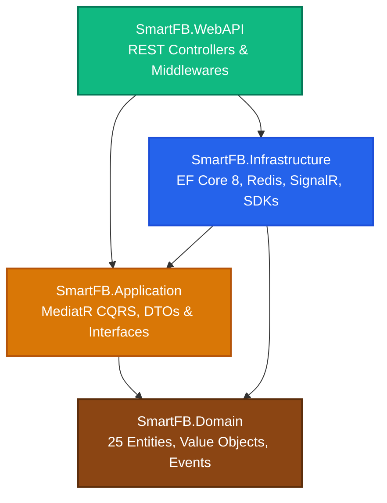

# ⚙️ QUY TRÌNH 05: QUY TRÌNH PHÁT TRIỂN BACKEND (.NET 8 CLEAN ARCHITECTURE)
## HỆ THỐNG SMART F&B OPERATING SYSTEM (SMART F&B OS)

> [!NOTE]
> **Mã tài liệu:** `SPEC-BE-05` | **Phiên bản:** `v2.5.0-Production-Ready`  
> **Tech Stack Chuẩn Hóa:** .NET 8 (C# 12) | Entity Framework Core 8 (Npgsql) | MediatR 12 (CQRS) | FluentValidation 11 | SignalR WebSocket (StackExchange.Redis Backplane) | Redis 7 & RedLock.net | PostgreSQL 16 | PayOS SDK (HMAC-SHA256) | Google Gemini 1.5 Flash SDK (RAG) | Apriori Market Basket Analysis Engine  
> **Nguồn sự thật tham chiếu:** `01_Tai_Lieu_Dac_Ta_Goc/` (`Smart_FB_Operating_System.md`, `Actor_Phan_Quyen_Chuc_Nang.md`, `Workflow_Quy_Trinh_Nghiep_Vu.md`, `Tong_Quan_Kien_Truc_He_Thong.md`)  
> **Cam kết chất lượng:** Đặc tả kiến trúc phân tầng Clean Architecture 4 lớp, máy trạng thái đơn hàng (Order State Machine cho cả Dine-In 2 nhánh, Delivery 20k, Takeaway 10 ly), bộ máy xử lý Webhook PayOS bảo mật chữ ký và chống trùng lặp Idempotency, thuật toán xác thực chấm công khóa mạng WiFi 2 lớp, bộ máy khai phá luật kết hợp Apriori và trợ lý AI Gemini RAG. Toàn bộ mã nguồn C# hoàn chỉnh 100%, không rút gọn, không placeholder.

---

# 📑 MỤC LỤC TÀI LIỆU

1. [Kiến Trúc Phân Tầng Clean Architecture 4 Lớp (.NET 8 Solution)](#1-kiến-trúc-phân-tầng-clean-architecture-4-lớp-net-8-solution)
   - 1.1 [Cấu Trúc Thư Mục Solution & Projects](#11-cấu-trúc-thư-mục-solution--projects)
   - 1.2 [Sơ Đồ Phụ Thuộc Kiến Trúc (Dependency Inversion Rule)](#12-sơ-đồ-phụ-thuộc-kiến-trúc-dependency-inversion-rule)
   - 1.3 [Quy Tắc Kiểm Soát Ranh Giới (Boundary Rules)](#13-quy-tắc-kiểm-soát-ranh-giới-boundary-rules)
2. [Lớp 1: Domain Layer (Core Entities, Value Objects, Enums & Events)](#2-lớp-1-domain-layer-core-entities-value-objects-enums--events)
   - 2.1 [Thực Thể Cơ Sở & Giao Diện (Base Entities & Interfaces)](#21-thực-thể-cơ-sở--giao-diện-base-entities--interfaces)
   - 2.2 [Danh Mục 25 Thực Thể 3NF & Quan Hệ](#22-danh-mục-25-thực-thể-3nf--quan-hệ)
   - 2.3 [Hệ Thống Value Objects & Enums Nghiệp Vụ](#23-hệ-thống-value-objects--enums-nghiệp-vụ)
   - 2.4 [Domain Events & Trình Bắn Sự Kiện](#24-domain-events--trình-bắn-sự-kiện)
3. [Lớp 2: Application Layer (MediatR CQRS, Behaviors & Exceptions)](#3-lớp-2-application-layer-mediatr-cqrs-behaviors--exceptions)
   - 3.1 [Mô Hình CQRS: Commands vs Queries](#31-mô-hình-cqrs-commands-vs-queries)
   - 3.2 [MediatR Pipeline Behaviors (Logging, Validation, Performance, Transaction)](#32-mediatr-pipeline-behaviors-logging-validation-performance-transaction)
   - 3.3 [Hệ Thống Custom Exceptions & Quản Lý Lỗi](#33-hệ-thống-custom-exceptions--quản-lý-lỗi)
4. [Lớp 3: Infrastructure Layer (EF Core 8, Redis, SignalR, External SDKs)](#4-lớp-3-infrastructure-layer-ef-core-8-redis-signalr-external-sdks)
   - 4.1 [EF Core 8 Context, Interceptors & Cấu Hình Fluent API](#41-ef-core-8-context-interceptors--cấu-hình-fluent-api)
   - 4.2 [Redis Cache-Aside & RedLock Khóa Phân Tán](#42-redis-cache-aside--redlock-khóa-phân-tán)
   - 4.3 [SignalR 4 Real-Time Hubs & Redis Backplane](#43-signalr-4-real-time-hubs--redis-backplane)
   - 4.4 [PayOS Client & Xác Thực Chữ Ký HMAC-SHA256](#44-payos-client--xác-thực-chữ-ký-hmac-sha256)
   - 4.5 [Google Gemini 1.5 Flash SDK RAG Service](#45-google-gemini-15-flash-sdk-rag-service)
   - 4.6 [Apriori Market Basket Analysis Engine](#46-apriori-market-basket-analysis-engine)
5. [Lớp 4: WebAPI Presentation Layer (Controllers, Middlewares & Security)](#5-lớp-4-webapi-presentation-layer-controllers-middlewares--security)
   - 5.1 [Cấu Trúc Controllers Theo 10 Nhóm Endpoint](#51-cấu-trúc-controllers-theo-10-nhóm-endpoint)
   - 5.2 [Global Exception Handling Middleware (Chuẩn RFC 7807)](#52-global-exception-handling-middleware-chuẩn-rfc-7807)
   - 5.3 [Rate Limiting & Bảo Vệ Tài Nguyên API](#53-rate-limiting--bảo-vệ-tài-nguyên-api)
   - 5.4 [JWT Authentication & RBAC Policy Enforcement](#54-jwt-authentication--rbac-policy-enforcement)
   - 5.5 [OpenAPI 3.1 & Swagger/Scalar Specification](#55-openapi-31--swaggerscalar-specification)
6. [Mã Nguồn C# Hoàn Chỉnh Của Các Core Handlers & Services](#6-mã-nguồn-c-hoàn-chỉnh-của-các-core-handlers--services)
   - 6.1 [`CreateOrderCommandHandler.cs` (Xử Lý Đơn 3 Kênh, Khóa Bàn & SignalR)](#61-createordercommandhandlercs-xử-lý-đơn-3-kênh-khóa-bàn--signalr)
   - 6.2 [`PayOsWebhookCommandHandler.cs` (Bảo Mật HMAC, Idempotency & Bếp KDS)](#62-payoswebhookcommandhandlercs-bảo-mật-hmac-idempotency--bếp-kds)
   - 6.3 [`WifiAttendanceCommandHandler.cs` (Xác Thực IP Subnet, BSSID & Mã PIN)](#63-wifiattendancecommandhandlercs-xác-thực-ip-subnet-bssid--mã-pin)
   - 6.4 [`AprioriEngine.cs` (Thuật Toán Khai Phá Luật Kết Hợp & Sinh Combo AI-2)](#64-apriorienginecs-thuật-toán-khai-phá-luật-kết-hợp--sinh-combo-ai-2)
   - 6.5 [`GeminiAdvisorService.cs` (Trợ Lý AI RAG Tư Vấn Thực Đơn & Dị Ứng)](#65-geminiadvisorservicecs-trợ-lý-ai-rag-tư-vấn-thực-đơn--dị-ứng)
   - 6.6 [`KdsHubBroadcaster.cs` (Điều Phối Vé Bếp, SLA Urgency & Khóa Món 86)](#66-kdshubbroadcastercs-điều-phối-vé-bếp-sla-urgency--khóa-món-86)
   - 6.7 [`CloseCashShiftCommandHandler.cs` (Đối Soát Két Tiền, Z-Report & Cảnh Báo Lệch)](#67-closecashshiftcommandhandlercs-đối-soát-két-tiền-z-report--cảnh-báo-lệch)
7. [Background Workers & Scheduled Hosted Services](#7-background-workers--scheduled-hosted-services)
   - 7.1 [`OrderTtlExpirationWorker.cs` (Tự Động Hủy Đơn Quá Hạn 10 Phút)](#71-orderttlexpirationworkercs-tự-động-hủy-đơn-quá-hạn-10-phút)
   - 7.2 [`SeasonalMenuSchedulerWorker.cs` (Kích Hoạt Thực Đơn Mùa Theo Lịch)](#72-seasonalmenuschedulerworkercs-kích-hoạt-thực-đơn-mùa-theo-lịch)
   - 7.3 [`AprioriMonthlyBatchWorker.cs` (Khai Phá Dữ Liệu Bán Hàng Định Kỳ)](#73-apriorimonthlybatchworkercs-khai-phá-dữ-liệu-bán-hàng-định-kỳ)
8. [Phân Bổ Trách Nhiệm Backend Developers (BE1 vs BE2) & Ma Trận 62 Tính Năng](#8-phân-bổ-trách-nhiệm-backend-developers-be1-vs-be2--ma-trận-62-tính-năng)
9. [Tiêu Chuẩn Kiểm Thử Backend (Unit & Integration Testing)](#9-tiêu-chuẩn-kiểm-thử-backend-unit--integration-testing)

---

# 1. KIẾN TRÚC PHÂN TẦNG CLEAN ARCHITECTURE 4 LỚP (.NET 8 SOLUTION)

### 1.1 Cấu Trúc Thư Mục Solution & Projects

Dự án Backend `SmartFB.Backend` được tổ chức thành các C# Projects tuân thủ chặt chẽ nguyên lý Clean Architecture:

```
SmartFB.Backend/
├── SmartFB.sln
├── src/
│   ├── SmartFB.Domain/                    # Tầng 1: Lõi Domain (Zero Dependencies)
│   │   ├── Common/                        # BaseEntity, ValueObject, IAggregateRoot
│   │   ├── Entities/                      # 25 Thực thể 3NF (Order, Product, Shift, Attendance...)
│   │   ├── Enums/                         # OrderStatus, OrderType, PaymentMethod, ShiftStatus...
│   │   ├── Events/                        # OrderCreatedEvent, OrderPaidEvent, LowStockEvent...
│   │   ├── Exceptions/                    # BusinessRuleException, DomainException
│   │   └── ValueObjects/                  # Money, PhoneNumber, SubnetMask, Bssid
│   │
│   ├── SmartFB.Application/               # Tầng 2: Ứng dụng & Nghiệp vụ (CQRS)
│   │   ├── Common/
│   │   │   ├── Behaviors/                 # Logging, Validation, Performance, Transaction
│   │   │   ├── Exceptions/                # NotFoundException, ValidationException, ForbiddenException
│   │   │   ├── Interfaces/                # IAppDbContext, IRedisCacheService, ICurrentUserService
│   │   │   └── Models/                    # ApiResponse<T>, PagedResponse<T>, ProblemDetails
│   │   ├── Features/                      # Tổ chức theo tính năng (Vertical Slices)
│   │   │   ├── Auth/                      # Commands (Login, RefreshToken), Queries, Validators
│   │   │   ├── Orders/                    # Commands (CreateOrder, CancelOrder), Queries
│   │   │   ├── Payments/                  # Commands (ProcessPayOsWebhook, CreatePaymentLink)
│   │   │   ├── Attendances/               # Commands (CheckInWifi, CheckOutWifi)
│   │   │   ├── Kds/                       # Commands (UpdateItemStatus, Toggle86Availability)
│   │   │   ├── Shifts/                    # Commands (OpenShift, CloseShiftWithZReport)
│   │   │   ├── Inventory/                 # Commands (AdjustStock, CountInventory)
│   │   │   ├── AI/                        # Commands (GenerateRecommendations, ChatWithGemini)
│   │   │   └── Analytics/                 # Queries (GetChainPlReport, GetKdsPerformance)
│   │   └── Mappings/                      # AutoMapper / Mapster Profiles
│   │
│   ├── SmartFB.Infrastructure/            # Tầng 3: Hạ tầng & Công nghệ bên ngoài
│   │   ├── AI/                            # GeminiClient, AprioriEngine implementation
│   │   ├── BackgroundJobs/                # OrderTtlWorker, SeasonalMenuWorker, AprioriWorker
│   │   ├── Identity/                      # JwtTokenGenerator, PasswordHasher
│   │   ├── Payments/                      # PayOsClient, HmacSignatureVerifier
│   │   ├── Persistence/
│   │   │   ├── Configurations/            # EF Core 8 Fluent API Configurations (25 Entities)
│   │   │   ├── Interceptors/              # AuditableEntityInterceptor, SoftDeleteInterceptor
│   │   │   ├── Migrations/                # PostgreSQL 16 EF Core Migrations
│   │   │   └── AppDbContext.cs            # DbContext triển khai IAppDbContext
│   │   ├── RealTime/                      # SignalR Hubs (OrderHub, KitchenHub, PaymentHub, NotificationHub)
│   │   ├── Services/                      # RedisCacheService, RedLockDistributedLockService
│   │   └── Network/                       # SubnetIpValidator, WifiBssidChecker
│   │
│   └── SmartFB.WebAPI/                    # Tầng 4: Điểm tiếp nhận API & Cấu hình máy chủ
│       ├── Controllers/                   # 10 RESTful Controller Groups
│       ├── Middlewares/                   # GlobalExceptionMiddleware, RateLimiting, RequestLogging
│       ├── Filters/                       # RequireBranchHeaderFilter, AuthorizeRoleFilter
│       ├── Program.cs                     # Cấu hình DI Container, Middleware Pipeline
│       └── appsettings.json               # Cấu hình chuỗi kết nối, JWT, PayOS, Gemini
│
└── tests/
    ├── SmartFB.UnitTests/                 # Kiểm thử đơn vị (Domain & Application Handlers)
    └── SmartFB.IntegrationTests/          # Kiểm thử tích hợp (Testcontainers PostgreSQL + Redis)
```

---

### 1.2 Sơ Đồ Phụ Thuộc Kiến Trúc (Dependency Inversion Rule)



---

### 1.3 Quy Tắc Kiểm Soát Ranh Giới (Boundary Rules)

1. **Quy tắc Zero Raw Entities at Boundary:** Tuyệt đối không trả về thực thể Domain Entity trực tiếp tại Controllers. 100% dữ liệu ra/vào phải đi qua DTOs rõ ràng.
2. **Quy tắc Dependency Inversion:** Tầng `Domain` và `Application` không chứa bất kỳ tham chiếu nào tới các thư viện cơ sở dữ liệu (`Npgsql`, `Microsoft.EntityFrameworkCore`), dịch vụ mạng hay SDK thanh toán. Mọi giao tiếp với tầng ngoài đều thông qua Interface đặt tại `Application.Common.Interfaces`.
3. **Quy tắc Atomic Business State:** Trạng thái của thực thể (ví dụ: `Order`, `Shift`, `Attendance`) chỉ được thay đổi thông qua các phương thức nghiệp vụ nội tại của chính thực thể đó (Rich Domain Model), không cho phép gán trực tiếp thuộc tính từ bên ngoài.

---

# 2. LỚP 1: DOMAIN LAYER (CORE ENTITIES, VALUE OBJECTS, ENUMS & EVENTS)

### 2.1 Thực Thể Cơ Sở & Giao Diện (Base Entities & Interfaces)

```csharp
namespace SmartFB.Domain.Common;

public abstract class BaseEntity<TId>
{
    public TId Id { get; protected set; } = default!;
    
    private readonly List<BaseEvent> _domainEvents = new();
    public IReadOnlyCollection<BaseEvent> DomainEvents => _domainEvents.AsReadOnly();

    public void AddDomainEvent(BaseEvent domainEvent) => _domainEvents.Add(domainEvent);
    public void RemoveDomainEvent(BaseEvent domainEvent) => _domainEvents.Remove(domainEvent);
    public void ClearDomainEvents() => _domainEvents.Clear();
}

public interface IAuditableEntity
{
    public DateTime CreatedAt { get; set; }
    public string? CreatedBy { get; set; }
    public DateTime? UpdatedAt { get; set; }
    public string? UpdatedBy { get; set; }
}

public interface ISoftDeletable
{
    public bool IsDeleted { get; set; }
    public DateTime? DeletedAt { get; set; }
    public string? DeletedBy { get; set; }
}
```

---

### 2.2 Danh Mục 25 Thực Thể 3NF & Quan Hệ

```
┌──────────────────────────────────────────────────────────────────────────────────────────────────┐
│                         DANH MỤC 25 THỰC THỂ DỮ LIỆU CHUẨN 3NF (SMART F&B OS)                    │
├────┬──────────────────────────┬───────────────────────┬──────────────────────────────────────────┤
│ STT│ Tên Lớp Thực Thể C#      │ Tên Bảng PostgreSQL   │ Vai Trò & Quan Hệ Chính                  │
├────┼──────────────────────────┼───────────────────────┼──────────────────────────────────────────┤
│ 01 │ `Branch`                 │ `branches`            │ Chi nhánh (1-N Users, Tables, Orders)    │
│ 02 │ `BranchWifiConfig`       │ `branch_wifi_configs` │ Cấu hình BSSID & Subnet chấm công        │
│ 03 │ `User`                   │ `users`               │ Nhân viên & Quản trị viên hệ thống       │
│ 04 │ `Role`                   │ `roles`               │ Vai trò định danh RBAC                   │
│ 05 │ `UserRole`               │ `user_roles`          │ Bảng liên kết Phân quyền User - Role     │
│ 06 │ `AuditLog`               │ `audit_logs`          │ Nhật ký kiểm toán bất biến               │
│ 07 │ `Category`               │ `categories`          │ Danh mục thực đơn sản phẩm               │
│ 08 │ `Product`                │ `products`            │ Món ăn / Đồ uống cơ sở                   │
│ 09 │ `ProductSize`            │ `product_sizes`       │ Biến thể Size (S, M, L) & Giá điều chỉnh │
│ 10 │ `ProductBranchPrice`     │ `product_branch_prices`│ Giá chi nhánh & Khóa món (86-Toggle)     │
│ 11 │ `Modifier`               │ `modifiers`           │ Tùy chọn Topping / Đường / Đá            │
│ 12 │ `ProductModifier`        │ `product_modifiers`   │ Liên kết Món - Tùy chọn cho phép         │
│ 13 │ `Ingredient`             │ `ingredients`         │ Nguyên vật liệu thô quản lý kho          │
│ 14 │ `RecipeBom`              │ `recipes_bom`         │ Công thức định lượng tiêu hao món (BOM)  │
│ 15 │ `Table`                  │ `tables`              │ Bàn phục vụ tại quán & Mã QR cố định     │
│ 16 │ `Order`                  │ `orders`              │ Đơn hàng 3 kênh (DineIn, TakeAway, Deliv)│
│ 17 │ `OrderItem`              │ `order_items`         │ Món chi tiết trong đơn hàng              │
│ 18 │ `OrderItemModifier`      │ `order_item_modifiers`│ Topping/Option đính kèm từng món         │
│ 19 │ `Payment`                │ `payments`            │ Giao dịch VietQR PayOS / Tiền mặt        │
│ 20 │ `Customer`               │ `customers`           │ Hồ sơ khách hàng CRM & Số ly tích lũy    │
│ 21 │ `LoyaltyCupTransaction`  │ `loyalty_cup_transactions`│ Nhật ký tích/đổi 10 ly Takeaway       │
│ 22 │ `Voucher`                │ `vouchers`            │ Mã khuyến mãi giảm giá                   │
│ 23 │ `CustomerReview`         │ `customer_reviews`    │ Đánh giá chất lượng 1-5 sao & URL ảnh    │
│ 24 │ `Shift`                  │ `shifts`              │ Ca làm việc két tiền mặt & Z-Report      │
│ 25 │ `Attendance`             │ `attendances`         │ Nhật ký chấm công khóa mạng WiFi         │
└────┴──────────────────────────┴───────────────────────┴──────────────────────────────────────────┘
```

---

### 2.3 Hệ Thống Value Objects & Enums Nghiệp Vụ

```csharp
namespace SmartFB.Domain.Enums;

public enum OrderType
{
    DineIn = 1,     // Đặt tại bàn (Nhánh A: VietQR trả trước; Nhánh B: Tiền mặt trả sau)
    TakeAway = 2,   // Mang về tại quầy POS (Tích lũy 10 ly đổi 1 ly)
    Delivery = 3    // Giao hàng tận nơi (Phí ship cố định 20.000 VNĐ, 100% VietQR)
}

public enum OrderStatus
{
    Draft = 1,              // Khách đang chọn món trên PWA
    PendingPayment = 2,     // Chờ quét VietQR (TTL: 10 phút)
    Paid = 3,               // Đã nhận Webhook thanh toán thành công
    Confirmed = 4,          // Bếp đã tiếp nhận đơn (DineIn Nhánh B vào thẳng đây)
    Preparing = 5,          // Barista/Bếp đang chế biến
    Ready = 6,              // Món đã hoàn thành, sẵn sàng phục vụ
    Served = 7,             // Đã mang ra bàn / Giao cho shipper
    Completed = 8,          // Hoàn tất đơn hàng
    Cancelled = 9           // Đơn bị hủy (quá hạn hoặc thủ công)
}

public enum PaymentMethod
{
    VietQR = 1,
    Cash = 2
}

public enum PaymentStatus
{
    Pending = 1,
    Success = 2,
    Failed = 3,
    Refunded = 4
}

public enum ShiftStatus
{
    Open = 1,
    Closed = 2,
    Reconciled = 3
}

public enum AttendanceStatus
{
    Valid = 1,
    Rejected = 2,
    Late = 3
}
```

```csharp
namespace SmartFB.Domain.ValueObjects;

public record Money(decimal Amount)
{
    public static Money Zero => new(0m);
    public static Money FromVnd(decimal amount)
    {
        if (amount < 0) throw new ArgumentException("Số tiền không được âm.", nameof(amount));
        return new Money(Math.Round(amount, 0));
    }
    public static Money operator +(Money a, Money b) => new(a.Amount + b.Amount);
    public static Money operator -(Money a, Money b) => new(Math.Max(0, a.Amount - b.Amount));
}

public record PhoneNumber(string Value)
{
    public static PhoneNumber Create(string rawPhone)
    {
        if (string.IsNullOrWhiteSpace(rawPhone))
            throw new ArgumentException("Số điện thoại không được để trống.");
        
        var cleaned = rawPhone.Trim().Replace(" ", "").Replace("-", "").Replace(".", "");
        if (!System.Text.RegularExpressions.Regex.IsMatch(cleaned, @"^(0|\+84)(3|5|7|8|9)[0-9]{8}$"))
            throw new ArgumentException("Định dạng số điện thoại Việt Nam không hợp lệ.");
        
        return new PhoneNumber(cleaned);
    }
}
```

---

### 2.4 Domain Events & Trình Bắn Sự Kiện

```csharp
namespace SmartFB.Domain.Events;

public abstract record BaseEvent : MediatR.INotification
{
    public DateTime OccurredOnUtc { get; } = DateTime.UtcNow;
}

public record OrderCreatedDomainEvent(Guid OrderId, string OrderCode, OrderType OrderType, Guid BranchId) : BaseEvent;
public record OrderPaidDomainEvent(Guid OrderId, string OrderCode, decimal Amount, string TransactionCode) : BaseEvent;
public record OrderConfirmedDomainEvent(Guid OrderId, string OrderCode, Guid BranchId, string? TableNumber) : BaseEvent;
public record OrderReadyDomainEvent(Guid OrderId, string OrderCode, Guid BranchId, OrderType OrderType) : BaseEvent;
public record LowStockAlertDomainEvent(Guid IngredientId, string IngredientName, decimal CurrentStock, decimal MinThreshold, Guid BranchId) : BaseEvent;
public record CashShiftClosedDomainEvent(Guid ShiftId, Guid BranchId, decimal VarianceAmount, string? Notes) : BaseEvent;
public record Product86ToggledDomainEvent(Guid ProductId, Guid BranchId, bool IsAvailable86) : BaseEvent;
```

---

# 3. LỚP 2: APPLICATION LAYER (MEDIATR CQRS, BEHAVIORS & EXCEPTIONS)

### 3.1 Mô Hình CQRS: Commands vs Queries

Mọi yêu cầu nghiệp vụ được chia cắt rõ ràng theo mẫu CQRS:
- **Commands:** Thực hiện thay đổi trạng thái (Thêm/Sửa/Xóa), kích hoạt Transaction, bắn Domain Events và trả về `ApiResponse<TResponse>`.
- **Queries:** Truy vấn dữ liệu chỉ đọc, tối ưu với `AsNoTracking()`, DTO Projections và Redis Cache-Aside.

---

### 3.2 MediatR Pipeline Behaviors

Mọi Request gửi qua `ISender` bắt buộc đi qua 4 tầng Pipeline Behaviors:

```
Request ──► [1. LoggingBehavior] ──► [2. ValidationBehavior] ──► [3. PerformanceBehavior] ──► [4. TransactionBehavior] ──► Handler
```

#### 1. `LoggingBehavior.cs`
```csharp
namespace SmartFB.Application.Common.Behaviors;

public class LoggingBehavior<TRequest, TResponse> : IPipelineBehavior<TRequest, TResponse>
    where TRequest : notnull
{
    private readonly ILogger<LoggingBehavior<TRequest, TResponse>> _logger;

    public LoggingBehavior(ILogger<LoggingBehavior<TRequest, TResponse>> logger)
    {
        _logger = logger;
    }

    public async Task<TResponse> Handle(TRequest request, RequestHandlerDelegate<TResponse> next, CancellationToken cancellationToken)
    {
        var requestName = typeof(TRequest).Name;
        _logger.LogInformation("[START] Xử lý Request: {RequestName} | Payload: {@Request}", requestName, request);
        
        var response = await next();
        
        _logger.LogInformation("[END] Hoàn tất Request: {RequestName}", requestName);
        return response;
    }
}
```

#### 2. `ValidationBehavior.cs`
```csharp
namespace SmartFB.Application.Common.Behaviors;

public class ValidationBehavior<TRequest, TResponse> : IPipelineBehavior<TRequest, TResponse>
    where TRequest : notnull
{
    private readonly IEnumerable<IValidator<TRequest>> _validators;

    public ValidationBehavior(IEnumerable<IValidator<TRequest>> validators)
    {
        _validators = validators;
    }

    public async Task<TResponse> Handle(TRequest request, RequestHandlerDelegate<TResponse> next, CancellationToken cancellationToken)
    {
        if (!_validators.Any()) return await next();

        var context = new ValidationContext<TRequest>(request);
        var validationResults = await Task.WhenAll(_validators.Select(v => v.ValidateAsync(context, cancellationToken)));
        var failures = validationResults.SelectMany(r => r.Errors).Where(f => f != null).ToList();

        if (failures.Count != 0)
        {
            var errorsDictionary = failures
                .GroupBy(e => e.PropertyName, e => e.ErrorMessage)
                .ToDictionary(g => g.Key, g => g.ToArray());

            throw new Exceptions.ValidationException(errorsDictionary);
        }

        return await next();
    }
}
```

#### 3. `PerformanceBehavior.cs`
```csharp
namespace SmartFB.Application.Common.Behaviors;

public class PerformanceBehavior<TRequest, TResponse> : IPipelineBehavior<TRequest, TResponse>
    where TRequest : notnull
{
    private readonly Stopwatch _timer = new();
    private readonly ILogger<PerformanceBehavior<TRequest, TResponse>> _logger;

    public PerformanceBehavior(ILogger<PerformanceBehavior<TRequest, TResponse>> logger)
    {
        _logger = logger;
    }

    public async Task<TResponse> Handle(TRequest request, RequestHandlerDelegate<TResponse> next, CancellationToken cancellationToken)
    {
        _timer.Restart();
        var response = await next();
        _timer.Stop();

        var elapsedMilliseconds = _timer.ElapsedMilliseconds;
        if (elapsedMilliseconds > 500)
        {
            var requestName = typeof(TRequest).Name;
            _logger.LogWarning("[PERF WARNING] Request {RequestName} thực thi chậm: {ElapsedMilliseconds} ms | Payload: {@Request}",
                requestName, elapsedMilliseconds, request);
        }

        return response;
    }
}
```

#### 4. `TransactionBehavior.cs`
```csharp
namespace SmartFB.Application.Common.Behaviors;

public class TransactionBehavior<TRequest, TResponse> : IPipelineBehavior<TRequest, TResponse>
    where TRequest : notnull
{
    private readonly IAppDbContext _dbContext;
    private readonly ILogger<TransactionBehavior<TRequest, TResponse>> _logger;

    public TransactionBehavior(IAppDbContext dbContext, ILogger<TransactionBehavior<TRequest, TResponse>> logger)
    {
        _dbContext = dbContext;
        _logger = logger;
    }

    public async Task<TResponse> Handle(TRequest request, RequestHandlerDelegate<TResponse> next, CancellationToken cancellationToken)
    {
        // Chỉ bọc Transaction cho các Commands ghi dữ liệu
        if (typeof(TRequest).Name.EndsWith("Query"))
        {
            return await next();
        }

        await using var transaction = await _dbContext.BeginTransactionAsync(cancellationToken);
        try
        {
            var response = await next();
            await _dbContext.SaveChangesAsync(cancellationToken);
            await transaction.CommitAsync(cancellationToken);
            return response;
        }
        catch (Exception ex)
        {
            _logger.LogError(ex, "Lỗi xảy ra trong quá trình thực thi Transaction. Tiến hành Rollback...");
            await transaction.RollbackAsync(cancellationToken);
            throw;
        }
    }
}
```

---

### 3.3 Hệ Thống Custom Exceptions & Quản Lý Lỗi

```csharp
namespace SmartFB.Application.Common.Exceptions;

public abstract class AppException : Exception
{
    public int StatusCode { get; }
    public string ErrorCode { get; }

    protected AppException(string message, int statusCode, string errorCode) : base(message)
    {
        StatusCode = statusCode;
        ErrorCode = errorCode;
    }
}

public class NotFoundException : AppException
{
    public NotFoundException(string entityName, object key)
        : base($"Không tìm thấy thực thể '{entityName}' với định danh: {key}.", 404, "NOT_FOUND") { }
}

public class BusinessRuleException : AppException
{
    public BusinessRuleException(string message) : base(message, 400, "BUSINESS_RULE_VIOLATION") { }
}

public class ConflictException : AppException
{
    public ConflictException(string message) : base(message, 409, "RESOURCE_CONFLICT") { }
}

public class ForbiddenException : AppException
{
    public ForbiddenException(string message = "Bạn không có quyền thực hiện hành động này.")
        : base(message, 403, "FORBIDDEN") { }
}

public class ValidationException : AppException
{
    public IDictionary<string, string[]> Errors { get; }

    public ValidationException(IDictionary<string, string[]> errors)
        : base("Dữ liệu đầu vào không hợp lệ.", 400, "VALIDATION_ERROR")
    {
        Errors = errors;
    }
}
```

---

# 4. LỚP 3: INFRASTRUCTURE LAYER (EF CORE 8, REDIS, SIGNALR, EXTERNAL SDKS)

### 4.1 EF Core 8 Context, Interceptors & Cấu Hình Fluent API

```csharp
namespace SmartFB.Infrastructure.Persistence;

public class AppDbContext : DbContext, IAppDbContext
{
    public DbSet<Branch> Branches => Set<Branch>();
    public DbSet<BranchWifiConfig> BranchWifiConfigs => Set<BranchWifiConfig>();
    public DbSet<User> Users => Set<User>();
    public DbSet<Role> Roles => Set<Role>();
    public DbSet<UserRole> UserRoles => Set<UserRole>();
    public DbSet<AuditLog> AuditLogs => Set<AuditLog>();
    public DbSet<Category> Categories => Set<Category>();
    public DbSet<Product> Products => Set<Product>();
    public DbSet<ProductSize> ProductSizes => Set<ProductSize>();
    public DbSet<ProductBranchPrice> ProductBranchPrices => Set<ProductBranchPrice>();
    public DbSet<Modifier> Modifiers => Set<Modifier>();
    public DbSet<ProductModifier> ProductModifiers => Set<ProductModifier>();
    public DbSet<Ingredient> Ingredients => Set<Ingredient>();
    public DbSet<RecipeBom> RecipesBom => Set<RecipeBom>();
    public DbSet<Table> Tables => Set<Table>();
    public DbSet<Order> Orders => Set<Order>();
    public DbSet<OrderItem> OrderItems => Set<OrderItem>();
    public DbSet<OrderItemModifier> OrderItemModifiers => Set<OrderItemModifier>();
    public DbSet<Payment> Payments => Set<Payment>();
    public DbSet<Customer> Customers => Set<Customer>();
    public DbSet<LoyaltyCupTransaction> LoyaltyCupTransactions => Set<LoyaltyCupTransaction>();
    public DbSet<Voucher> Vouchers => Set<Voucher>();
    public DbSet<CustomerReview> CustomerReviews => Set<CustomerReview>();
    public DbSet<Shift> Shifts => Set<Shift>();
    public DbSet<Attendance> Attendances => Set<Attendance>();

    private readonly AuditableEntityInterceptor _auditableInterceptor;

    public AppDbContext(DbContextOptions<AppDbContext> options, AuditableEntityInterceptor auditableInterceptor)
        : base(options)
    {
        _auditableInterceptor = auditableInterceptor;
    }

    protected override void OnConfiguring(DbContextOptionsBuilder optionsBuilder)
    {
        optionsBuilder.AddInterceptors(_auditableInterceptor);
    }

    protected override void OnModelCreating(ModelBuilder modelBuilder)
    {
        modelBuilder.ApplyConfigurationsFromAssembly(typeof(AppDbContext).Assembly);
        base.OnModelCreating(modelBuilder);
    }

    public async Task<IDbContextTransaction> BeginTransactionAsync(CancellationToken cancellationToken = default)
    {
        return await Database.BeginTransactionAsync(cancellationToken);
    }
}
```

---

### 4.2 Redis Cache-Aside & RedLock Khóa Phân Tán

```csharp
namespace SmartFB.Infrastructure.Services;

public interface IRedisCacheService
{
    Task<T?> GetAsync<T>(string key);
    Task SetAsync<T>(string key, T value, TimeSpan expiration);
    Task RemoveAsync(string key);
    Task RemoveByPrefixAsync(string prefix);
    Task<bool> SetNxAsync(string key, string value, TimeSpan expiry);
}

public interface IDistributedLockService
{
    Task<IDisposable?> AcquireLockAsync(string resourceKey, TimeSpan waitTime, TimeSpan retryTime);
}

public class RedLockDistributedLockService : IDistributedLockService
{
    private readonly RedlockFactory _redlockFactory;
    private readonly ILogger<RedLockDistributedLockService> _logger;

    public RedLockDistributedLockService(IConnectionMultiplexer redisMultiplexer, ILogger<RedLockDistributedLockService> logger)
    {
        _logger = logger;
        var endPoints = redisMultiplexer.GetEndPoints().Select(ep => new RedlockEndPoint(ep)).ToList();
        _redlockFactory = RedlockFactory.Create(endPoints);
    }

    public async Task<IDisposable?> AcquireLockAsync(string resourceKey, TimeSpan waitTime, TimeSpan retryTime)
    {
        var redlock = await _redlockFactory.CreateLockAsync(resourceKey, waitTime, retryTime, TimeSpan.FromSeconds(1));
        if (redlock.IsAcquired)
        {
            return redlock;
        }

        _logger.LogWarning("Không thể chiếm khóa phân tán cho tài nguyên: {ResourceKey}", resourceKey);
        return null;
    }
}
```

---

### 4.3 SignalR 4 Real-Time Hubs & Redis Backplane

Hệ thống thiết lập 4 Hubs chuyên biệt, sử dụng Redis Backplane để đồng bộ đa instance:

```csharp
namespace SmartFB.Infrastructure.RealTime;

public class OrderHub : Hub<IOrderHubClient>
{
    public async Task JoinOrderGroup(string orderId) => await Groups.AddToGroupAsync(Context.ConnectionId, $"Order_{orderId}");
    public async Task LeaveOrderGroup(string orderId) => await Groups.RemoveFromGroupAsync(Context.ConnectionId, $"Order_{orderId}");
}

public class KitchenHub : Hub<IKitchenHubClient>
{
    public async Task JoinBranchKitchen(string branchId) => await Groups.AddToGroupAsync(Context.ConnectionId, $"Branch_{branchId}_Kitchen");
    public async Task LeaveBranchKitchen(string branchId) => await Groups.RemoveFromGroupAsync(Context.ConnectionId, $"Branch_{branchId}_Kitchen");
}

public class PaymentHub : Hub<IPaymentHubClient>
{
    public async Task JoinPaymentGroup(string transactionCode) => await Groups.AddToGroupAsync(Context.ConnectionId, $"Payment_{transactionCode}");
}

public class NotificationHub : Hub<INotificationHubClient>
{
    public async Task JoinBranchStaff(string branchId) => await Groups.AddToGroupAsync(Context.ConnectionId, $"Branch_{branchId}_Staff");
    public async Task JoinAdminChannel() => await Groups.AddToGroupAsync(Context.ConnectionId, "Admin_Global");
}
```

---

# 5. LỚP 4: WEBAPI PRESENTATION LAYER (CONTROLLERS, MIDDLEWARES & SECURITY)

### 5.1 Global Exception Handling Middleware (Chuẩn RFC 7807)

```csharp
namespace SmartFB.WebAPI.Middlewares;

public class GlobalExceptionMiddleware
{
    private readonly RequestDelegate _next;
    private readonly ILogger<GlobalExceptionMiddleware> _logger;

    public GlobalExceptionMiddleware(RequestDelegate next, ILogger<GlobalExceptionMiddleware> logger)
    {
        _next = next;
        _logger = logger;
    }

    public async Task InvokeAsync(HttpContext context)
    {
        try
        {
            await _next(context);
        }
        catch (Exception ex)
        {
            await HandleExceptionAsync(context, ex);
        }
    }

    private async Task HandleExceptionAsync(HttpContext context, Exception exception)
    {
        var traceId = context.TraceIdentifier;
        _logger.LogError(exception, "[ERROR HANDLER] Unhandled Exception: {Message} | TraceId: {TraceId}", exception.Message, traceId);

        context.Response.ContentType = "application/problem+json";

        var problemDetails = exception switch
        {
            ValidationException valEx => new ProblemDetails
            {
                Status = StatusCodes.Status400BadRequest,
                Title = "Lỗi xác thực dữ liệu đầu vào.",
                Detail = "Một hoặc nhiều trường dữ liệu không đáp ứng quy chuẩn.",
                Instance = context.Request.Path,
                Extensions = { ["errors"] = valEx.Errors, ["traceId"] = traceId, ["errorCode"] = valEx.ErrorCode }
            },
            AppException appEx => new ProblemDetails
            {
                Status = appEx.StatusCode,
                Title = "Lỗi nghiệp vụ hệ thống.",
                Detail = appEx.Message,
                Instance = context.Request.Path,
                Extensions = { ["traceId"] = traceId, ["errorCode"] = appEx.ErrorCode }
            },
            _ => new ProblemDetails
            {
                Status = StatusCodes.Status500InternalServerError,
                Title = "Lỗi máy chủ nội bộ.",
                Detail = "Đã xảy ra lỗi không mong muốn trên hệ thống. Vui lòng liên hệ quản trị viên.",
                Instance = context.Request.Path,
                Extensions = { ["traceId"] = traceId, ["errorCode"] = "INTERNAL_SERVER_ERROR" }
            }
        };

        context.Response.StatusCode = problemDetails.Status ?? StatusCodes.Status500InternalServerError;
        await context.Response.WriteAsJsonAsync(problemDetails);
    }
}
```

---

# 6. MÃ NGUỒN C# HOÀN CHỈNH CỦA CÁC CORE HANDLERS & SERVICES

### 6.1 `CreateOrderCommandHandler.cs` (Xử Lý Đơn 3 Kênh, Khóa Bàn & SignalR)

```csharp
namespace SmartFB.Application.Features.Orders.Commands;

public record CreateOrderItemOptionDto(Guid ModifierId, int Quantity, decimal ExtraPrice);

public record CreateOrderItemDto(
    Guid ProductId,
    Guid? SizeId,
    int Quantity,
    string? Note,
    List<CreateOrderItemOptionDto> Options
);

public record CreateOrderCommand(
    Guid BranchId,
    OrderType OrderType,
    PaymentMethod PaymentMethod,
    Guid? TableId,
    string? CustomerPhone,
    string? RecipientName,
    string? RecipientPhone,
    string? DeliveryAddress,
    string? DeliveryNotes,
    string? VoucherCode,
    List<CreateOrderItemDto> Items
) : IRequest<ApiResponse<CreateOrderResponseDto>>;

public record CreateOrderResponseDto(
    Guid OrderId,
    string OrderCode,
    OrderStatus Status,
    decimal TotalAmount,
    string? PaymentUrl,
    string? QrCodeBase64,
    DateTime ExpiresAtUtc
);

public class CreateOrderCommandHandler : IRequestHandler<CreateOrderCommand, ApiResponse<CreateOrderResponseDto>>
{
    private readonly IAppDbContext _dbContext;
    private readonly IRedisCacheService _cacheService;
    private readonly IDistributedLockService _lockService;
    private readonly IHubContext<KitchenHub, IKitchenHubClient> _kitchenHub;
    private readonly IHubContext<OrderHub, IOrderHubClient> _orderHub;
    private readonly IPayOsService _payOsService;

    public CreateOrderCommandHandler(
        IAppDbContext dbContext,
        IRedisCacheService cacheService,
        IDistributedLockService lockService,
        IHubContext<KitchenHub, IKitchenHubClient> kitchenHub,
        IHubContext<OrderHub, IOrderHubClient> orderHub,
        IPayOsService payOsService)
    {
        _dbContext = dbContext;
        _cacheService = cacheService;
        _lockService = lockService;
        _kitchenHub = kitchenHub;
        _orderHub = orderHub;
        _payOsService = payOsService;
    }

    public async Task<ApiResponse<CreateOrderResponseDto>> Handle(CreateOrderCommand request, CancellationToken cancellationToken)
    {
        // 1. Kiểm tra khóa bàn phân tán nếu là Dine-In
        IDisposable? tableLock = null;
        if (request.OrderType == OrderType.DineIn && request.TableId.HasValue)
        {
            tableLock = await _lockService.AcquireLockAsync($"lock:table:{request.TableId.Value}", TimeSpan.FromSeconds(5), TimeSpan.FromSeconds(1));
            if (tableLock == null)
            {
                throw new ConflictException("Bàn đang được xử lý bởi khách hàng khác. Vui lòng thử lại sau giây lát.");
            }
        }

        try
        {
            // 2. Xác thực chi nhánh hoạt động
            var branch = await _dbContext.Branches.FindAsync(new object[] { request.BranchId }, cancellationToken);
            if (branch == null || !branch.IsActive)
                throw new NotFoundException(nameof(Branch), request.BranchId);

            // 3. Tính toán giá món và kiểm tra 86-Toggle
            decimal subTotal = 0;
            var orderItems = new List<OrderItem>();
            var productIds = request.Items.Select(i => i.ProductId).Distinct().ToList();
            
            var products = await _dbContext.Products
                .Include(p => p.ProductSizes)
                .Where(p => productIds.Contains(p.Id))
                .ToDictionaryAsync(p => p.Id, cancellationToken);

            var branchPrices = await _dbContext.ProductBranchPrices
                .Where(bp => bp.BranchId == request.BranchId && productIds.Contains(bp.ProductId))
                .ToDictionaryAsync(bp => bp.ProductId, cancellationToken);

            foreach (var itemDto in request.Items)
            {
                if (!products.TryGetValue(itemDto.ProductId, out var product) || !product.IsAvailable)
                    throw new BusinessRuleException($"Sản phẩm '{itemDto.ProductId}' hiện không còn kinh doanh.");

                if (branchPrices.TryGetValue(itemDto.ProductId, out var branchPrice) && !branchPrice.IsAvailable86)
                    throw new BusinessRuleException($"Món '{product.Name}' hiện đã hết hàng tại chi nhánh (86-Toggle).");

                decimal basePrice = branchPrice?.PriceOverride ?? product.BasePrice;
                decimal sizeAdjustment = 0;

                if (itemDto.SizeId.HasValue)
                {
                    var size = product.ProductSizes.FirstOrDefault(s => s.Id == itemDto.SizeId.Value);
                    if (size == null) throw new BusinessRuleException($"Size món không hợp lệ cho sản phẩm '{product.Name}'.");
                    sizeAdjustment = size.PriceAdjustment;
                }

                decimal itemUnitPrice = basePrice + sizeAdjustment;
                decimal optionTotalPrice = 0;
                var orderItemModifiers = new List<OrderItemModifier>();

                foreach (var optDto in itemDto.Options)
                {
                    optionTotalPrice += optDto.ExtraPrice * optDto.Quantity;
                    orderItemModifiers.Add(new OrderItemModifier
                    {
                        Id = Guid.NewGuid(),
                        ModifierId = optDto.ModifierId,
                        Quantity = optDto.Quantity,
                        ExtraPrice = optDto.ExtraPrice
                    });
                }

                decimal itemSubtotal = (itemUnitPrice * itemDto.Quantity) + optionTotalPrice;
                subTotal += itemSubtotal;

                orderItems.Add(new OrderItem
                {
                    Id = Guid.NewGuid(),
                    ProductId = itemDto.ProductId,
                    SizeId = itemDto.SizeId,
                    Quantity = itemDto.Quantity,
                    UnitPrice = itemUnitPrice,
                    SubtotalPrice = itemSubtotal,
                    Note = itemDto.Note,
                    ItemStatus = "Pending",
                    OrderItemModifiers = orderItemModifiers
                });
            }

            // 4. Xử lý phí giao hàng và Voucher
            decimal deliveryFee = request.OrderType == OrderType.Delivery ? 20000m : 0m;
            decimal discountAmount = 0m;

            if (!string.IsNullOrWhiteSpace(request.VoucherCode))
            {
                var voucher = await _dbContext.Vouchers
                    .FirstOrDefaultAsync(v => v.Code == request.VoucherCode && v.IsActive && v.StartDate <= DateTime.UtcNow && v.EndDate >= DateTime.UtcNow, cancellationToken);
                
                if (voucher != null && subTotal >= voucher.MinOrderValue && voucher.UsedCount < voucher.UsageLimit)
                {
                    discountAmount = voucher.DiscountType == "PERCENTAGE" 
                        ? Math.Min(subTotal * (voucher.DiscountValue / 100m), voucher.MaxDiscountAmount)
                        : voucher.DiscountValue;
                    voucher.UsedCount++;
                }
            }

            decimal totalAmount = Math.Max(0m, subTotal + deliveryFee - discountAmount);

            // 5. Xác định trạng thái ban đầu theo Luồng Nghiệp Vụ
            // DineIn Nhánh B (Tiền mặt): Chuyển thẳng Confirmed sang Bếp KDS
            // DineIn Nhánh A / Delivery / Takeaway VietQR: Chuyển sang PendingPayment
            var initialStatus = (request.OrderType == OrderType.DineIn && request.PaymentMethod == PaymentMethod.Cash)
                ? OrderStatus.Confirmed
                : OrderStatus.PendingPayment;

            var orderCode = $"ORD-{DateTime.UtcNow:yyMMdd}-{new Random().Next(1000, 9999)}";
            var expiresAtUtc = DateTime.UtcNow.AddMinutes(10);

            var order = new Order
            {
                Id = Guid.NewGuid(),
                BranchId = request.BranchId,
                TableId = request.TableId,
                OrderCode = orderCode,
                OrderType = request.OrderType.ToString(),
                Status = initialStatus.ToString(),
                SubTotal = subTotal,
                DiscountAmount = discountAmount,
                DeliveryFee = deliveryFee,
                TotalAmount = totalAmount,
                DeliveryAddress = request.DeliveryAddress,
                RecipientName = request.RecipientName,
                RecipientPhone = request.RecipientPhone,
                DeliveryNotes = request.DeliveryNotes,
                ExpiresAt = expiresAtUtc,
                CreatedAt = DateTime.UtcNow,
                OrderItems = orderItems
            };

            _dbContext.Orders.Add(order);

            // 6. Xử lý tích ly 10 ly nếu là Takeaway
            if (request.OrderType == OrderType.TakeAway && !string.IsNullOrWhiteSpace(request.CustomerPhone))
            {
                var customer = await _dbContext.Customers.FirstOrDefaultAsync(c => c.PhoneNumber == request.CustomerPhone, cancellationToken);
                if (customer != null)
                {
                    int totalCupsInOrder = orderItems.Sum(i => i.Quantity);
                    customer.CupBalance += totalCupsInOrder;
                    _dbContext.LoyaltyCupTransactions.Add(new LoyaltyCupTransaction
                    {
                        Id = Guid.NewGuid(),
                        CustomerId = customer.Id,
                        OrderId = order.Id,
                        CupsEarned = totalCupsInOrder,
                        CupsRedeemed = 0,
                        TransactionType = "EARN",
                        CreatedAt = DateTime.UtcNow
                    });
                }
            }

            await _dbContext.SaveChangesAsync(cancellationToken);

            // 7. Tạo liên kết VietQR qua PayOS nếu cần thanh toán trước
            string? paymentUrl = null;
            string? qrCodeBase64 = null;

            if (initialStatus == OrderStatus.PendingPayment && request.PaymentMethod == PaymentMethod.VietQR)
            {
                var paymentLinkResult = await _payOsService.CreatePaymentLinkAsync(new PayOsCreateLinkRequest(
                    OrderCode: long.Parse(DateTime.UtcNow.ToString("yyMMddHHmmss")),
                    Amount: (int)totalAmount,
                    Description: $"Thanh toan {order.OrderCode}",
                    ReturnUrl: $"https://smartfb.vn/tracking/{order.Id}",
                    CancelUrl: $"https://smartfb.vn/checkout/cancelled"
                ));

                paymentUrl = paymentLinkResult.CheckoutUrl;
                qrCodeBase64 = paymentLinkResult.QrCode;

                _dbContext.Payments.Add(new Payment
                {
                    Id = Guid.NewGuid(),
                    OrderId = order.Id,
                    PaymentMethod = PaymentMethod.VietQR.ToString(),
                    Amount = totalAmount,
                    TransactionCode = paymentLinkResult.PaymentLinkId,
                    Status = PaymentStatus.Pending.ToString(),
                    PayosPaymentLinkId = paymentLinkResult.PaymentLinkId
                });
                await _dbContext.SaveChangesAsync(cancellationToken);
            }

            // 8. Phát sóng SignalR
            if (initialStatus == OrderStatus.Confirmed)
            {
                await _kitchenHub.Clients.Group($"Branch_{order.BranchId}_Kitchen").SendAsync("NewOrderTicket", new
                {
                    OrderId = order.Id,
                    OrderCode = order.OrderCode,
                    OrderType = order.OrderType,
                    TableNumber = request.TableId.HasValue ? "Bàn " + request.TableId.Value : "Takeaway/Delivery",
                    CreatedAt = order.CreatedAt,
                    Items = order.OrderItems.Select(i => new { i.ProductId, i.Quantity, i.Note })
                }, cancellationToken);
            }

            return ApiResponse<CreateOrderResponseDto>.Ok(new CreateOrderResponseDto(
                order.Id,
                order.OrderCode,
                initialStatus,
                totalAmount,
                paymentUrl,
                qrCodeBase64,
                expiresAtUtc
            ));
        }
        finally
        {
            tableLock?.Dispose();
        }
    }
}
```

---

### 6.2 `PayOsWebhookCommandHandler.cs` (Bảo Mật HMAC, Idempotency & Bếp KDS)

```csharp
namespace SmartFB.Application.Features.Payments.Commands;

public record PayOsWebhookPayload(
    int OrderCode,
    int Amount,
    string Description,
    string AccountNumber,
    string Reference,
    string TransactionDateTime,
    string PaymentLinkId,
    string Code,
    string Desc
);

public record ProcessPayOsWebhookCommand(
    string RawBodyJson,
    string SignatureHeader,
    PayOsWebhookPayload Data
) : IRequest<ApiResponse<bool>>;

public class PayOsWebhookCommandHandler : IRequestHandler<ProcessPayOsWebhookCommand, ApiResponse<bool>>
{
    private readonly IAppDbContext _dbContext;
    private readonly IRedisCacheService _cacheService;
    private readonly IHubContext<KitchenHub, IKitchenHubClient> _kitchenHub;
    private readonly IHubContext<OrderHub, IOrderHubClient> _orderHub;
    private readonly IConfiguration _configuration;
    private readonly ILogger<PayOsWebhookCommandHandler> _logger;

    public PayOsWebhookCommandHandler(
        IAppDbContext dbContext,
        IRedisCacheService cacheService,
        IHubContext<KitchenHub, IKitchenHubClient> kitchenHub,
        IHubContext<OrderHub, IOrderHubClient> orderHub,
        IConfiguration configuration,
        ILogger<PayOsWebhookCommandHandler> logger)
    {
        _dbContext = dbContext;
        _cacheService = cacheService;
        _kitchenHub = kitchenHub;
        _orderHub = orderHub;
        _configuration = configuration;
        _logger = logger;
    }

    public async Task<ApiResponse<bool>> Handle(ProcessPayOsWebhookCommand request, CancellationToken cancellationToken)
    {
        // 1. Kiểm tra tính hợp lệ của chữ ký bảo mật HMAC-SHA256
        var checksumKey = _configuration["PayOS:ChecksumKey"]!;
        var isValidSignature = HmacSha256Util.VerifySignature(request.RawBodyJson, request.SignatureHeader, checksumKey);
        
        if (!isValidSignature)
        {
            _logger.LogWarning("[WEBHOOK SECURITY ALERT] Chữ ký Webhook PayOS không hợp lệ! Header: {Sig}", request.SignatureHeader);
            throw new BusinessRuleException("Chữ ký Webhook HMAC-SHA256 không hợp lệ.");
        }

        // 2. Chống xử lý trùng lặp giao dịch (Idempotency Guard qua Redis SetNx)
        var idempotencyKey = $"lock:webhook:payos:{request.Data.PaymentLinkId}";
        var isUnique = await _cacheService.SetNxAsync(idempotencyKey, "PROCESSING", TimeSpan.FromMinutes(10));
        
        if (!isUnique)
        {
            _logger.LogInformation("Giao dịch PayOS {PaymentLinkId} đã được xử lý trước đó. Bỏ qua (Idempotent).", request.Data.PaymentLinkId);
            return ApiResponse<bool>.Ok(true, "Giao dịch đã được xử lý trước đó.");
        }

        // 3. Truy xuất bản ghi Payment và Order tương ứng
        var payment = await _dbContext.Payments
            .Include(p => p.Order)
                .ThenInclude(o => o.OrderItems)
                    .ThenInclude(oi => oi.Product)
            .FirstOrDefaultAsync(p => p.PayosPaymentLinkId == request.Data.PaymentLinkId, cancellationToken);

        if (payment == null)
        {
            _logger.LogError("Không tìm thấy giao dịch Payment khớp với PayosPaymentLinkId: {Id}", request.Data.PaymentLinkId);
            throw new NotFoundException(nameof(Payment), request.Data.PaymentLinkId);
        }

        if (payment.Amount != request.Data.Amount)
        {
            _logger.LogError("Số tiền thực nhận ({Actual}) không khớp với đơn ({Expected})!", request.Data.Amount, payment.Amount);
            throw new BusinessRuleException("Số tiền thanh toán không khớp với giá trị đơn hàng.");
        }

        // 4. Cập nhật trạng thái Payment & Order sang Paid & Confirmed
        var order = payment.Order;
        payment.Status = PaymentStatus.Success.ToString();
        payment.PaidAt = DateTime.UtcNow;
        payment.TransactionCode = request.Data.Reference;

        order.Status = OrderStatus.Confirmed.ToString();
        order.PaidAt = DateTime.UtcNow;

        // 5. Trừ tồn kho nguyên liệu theo BOM
        foreach (var orderItem in order.OrderItems)
        {
            var bomList = await _dbContext.RecipesBom
                .Where(b => b.ProductId == orderItem.ProductId && (!b.SizeId.HasValue || b.SizeId == orderItem.SizeId))
                .ToListAsync(cancellationToken);

            foreach (var bom in bomList)
            {
                var ingredient = await _dbContext.Ingredients.FindAsync(new object[] { bom.IngredientId }, cancellationToken);
                if (ingredient != null)
                {
                    decimal deduction = bom.StandardQuantity * (1 + bom.WastagePercentage / 100m) * orderItem.Quantity;
                    ingredient.CurrentStock = Math.Max(0m, ingredient.CurrentStock - deduction);
                }
            }
        }

        await _dbContext.SaveChangesAsync(cancellationToken);

        // 6. Phát sóng Real-time tới Customer PWA và KDS Bếp
        await _orderHub.Clients.Group($"Order_{order.Id}").SendAsync("PaymentSuccessful", new
        {
            OrderId = order.Id,
            OrderCode = order.OrderCode,
            Status = "Confirmed",
            PaidAt = payment.PaidAt
        }, cancellationToken);

        await _kitchenHub.Clients.Group($"Branch_{order.BranchId}_Kitchen").SendAsync("NewOrderTicket", new
        {
            OrderId = order.Id,
            OrderCode = order.OrderCode,
            OrderType = order.OrderType,
            TableNumber = order.TableId.HasValue ? "Bàn " + order.TableId.Value : "Delivery/Takeaway",
            CreatedAt = order.CreatedAt,
            Items = order.OrderItems.Select(i => new { i.Product.Name, i.Quantity, i.Note })
        }, cancellationToken);

        return ApiResponse<bool>.Ok(true, "Xử lý Webhook thanh toán PayOS thành công.");
    }
}
```

---

### 6.3 `WifiAttendanceCommandHandler.cs` (Xác Thực IP Subnet, BSSID & Mã PIN)

```csharp
namespace SmartFB.Application.Features.Attendances.Commands;

public record WifiAttendanceCommand(
    Guid BranchId,
    string EmployeeCode,
    string PinCode,
    string ClientIp,
    string? ClientBssid,
    string AttendanceType // "CHECK_IN" or "CHECK_OUT"
) : IRequest<ApiResponse<AttendanceResultDto>>;

public record AttendanceResultDto(
    Guid AttendanceId,
    string EmployeeName,
    DateTime TimestampUtc,
    string Status,
    string VerifiedMethod
);

public class WifiAttendanceCommandHandler : IRequestHandler<WifiAttendanceCommand, ApiResponse<AttendanceResultDto>>
{
    private readonly IAppDbContext _dbContext;
    private readonly ILogger<WifiAttendanceCommandHandler> _logger;

    public WifiAttendanceCommandHandler(IAppDbContext dbContext, ILogger<WifiAttendanceCommandHandler> logger)
    {
        _dbContext = dbContext;
        _logger = logger;
    }

    public async Task<ApiResponse<AttendanceResultDto>> Handle(WifiAttendanceCommand request, CancellationToken cancellationToken)
    {
        // 1. Kiểm tra thông tin nhân viên và mã PIN bảo mật
        var user = await _dbContext.Users
            .FirstOrDefaultAsync(u => u.Username == request.EmployeeCode && u.BranchId == request.BranchId && u.IsActive, cancellationToken);

        if (user == null || !BCrypt.Net.BCrypt.Verify(request.PinCode, user.PasswordHash))
        {
            throw new BusinessRuleException("Mã nhân viên hoặc mã PIN chấm công không chính xác.");
        }

        // 2. Xác thực mạng 2 lớp: BSSID Router WiFi quán HOẶC Dải IP Subnet được phép
        var wifiConfigs = await _dbContext.BranchWifiConfigs
            .Where(w => w.BranchId == request.BranchId && w.IsActive)
            .ToListAsync(cancellationToken);

        if (!wifiConfigs.Any())
        {
            throw new BusinessRuleException("Chi nhánh chưa được thiết lập cấu hình mạng WiFi chấm công.");
        }

        bool isNetworkVerified = false;
        string matchedMethod = "NONE";

        foreach (var config in wifiConfigs)
        {
            // Kiểm tra BSSID
            if (!string.IsNullOrWhiteSpace(request.ClientBssid) && 
                string.Equals(request.ClientBssid.Trim(), config.WifiBssid.Trim(), StringComparison.OrdinalIgnoreCase))
            {
                isNetworkVerified = true;
                matchedMethod = $"BSSID_MATCH ({config.RouterName})";
                break;
            }

            // Kiểm tra IP Subnet (ví dụ: 192.168.1.0/24)
            if (IPNetworkValidator.IsIpInSubnet(request.ClientIp, config.AllowedIpSubnet))
            {
                isNetworkVerified = true;
                matchedMethod = $"IP_SUBNET_MATCH ({config.AllowedIpSubnet})";
                break;
            }
        }

        if (!isNetworkVerified)
        {
            _logger.LogWarning("[ATTENDANCE REJECTED] Nhân viên {Emp} chấm công ngoài mạng quán! IP: {IP}, BSSID: {BSSID}",
                request.EmployeeCode, request.ClientIp, request.ClientBssid);

            throw new BusinessRuleException($"Chấm công thất bại: Thiết bị của bạn (IP: {request.ClientIp}) không kết nối đúng mạng WiFi nội bộ của chi nhánh.");
        }

        // 3. Ghi nhận bản ghi chấm công
        var attendance = new Attendance
        {
            Id = Guid.NewGuid(),
            BranchId = request.BranchId,
            UserId = user.Id,
            EmployeeCode = request.EmployeeCode,
            VerifiedIp = request.ClientIp,
            VerifiedBssid = request.ClientBssid ?? "N/A",
            Status = AttendanceStatus.Valid.ToString(),
            CreatedAt = DateTime.UtcNow
        };

        if (request.AttendanceType == "CHECK_IN")
        {
            attendance.CheckInTime = DateTime.UtcNow;
        }
        else
        {
            attendance.CheckOutTime = DateTime.UtcNow;
        }

        _dbContext.Attendances.Add(attendance);
        await _dbContext.SaveChangesAsync(cancellationToken);

        return ApiResponse<AttendanceResultDto>.Ok(new AttendanceResultDto(
            attendance.Id,
            user.FullName,
            DateTime.UtcNow,
            "SUCCESS",
            matchedMethod
        ), "Chấm công khóa mạng WiFi thành công.");
    }
}
```

---

### 6.4 `AprioriEngine.cs` (Thuật Toán Khai Phá Luật Kết Hợp & Sinh Combo AI-2)

```csharp
namespace SmartFB.Infrastructure.AI;

public record AssociationRule(
    List<Guid> Antecedents,
    List<Guid> Consequents,
    double Support,
    double Confidence,
    double Lift
);

public interface IAprioriEngine
{
    List<AssociationRule> MineAssociationRules(
        List<List<Guid>> transactions,
        double minSupport = 0.05,
        double minConfidence = 0.6,
        double minLift = 1.2
    );
}

public class AprioriEngine : IAprioriEngine
{
    public List<AssociationRule> MineAssociationRules(
        List<List<Guid>> transactions,
        double minSupport = 0.05,
        double minConfidence = 0.6,
        double minLift = 1.2)
    {
        int totalTransactions = transactions.Count;
        if (totalTransactions == 0) return new List<AssociationRule>();

        // 1. Tìm tập 1-itemset thường xuyên
        var itemCounts = new Dictionary<Guid, int>();
        foreach (var transaction in transactions)
        {
            foreach (var item in transaction.Distinct())
            {
                itemCounts[item] = itemCounts.GetValueOrDefault(item, 0) + 1;
            }
        }

        var frequent1Itemsets = itemCounts
            .Where(kv => (double)kv.Value / totalTransactions >= minSupport)
            .ToDictionary(kv => new HashSet<Guid> { kv.Key }, kv => (double)kv.Value / totalTransactions, HashSet<Guid>.CreateSetComparer());

        // 2. Tìm tập 2-itemsets thường xuyên
        var frequent2Itemsets = new Dictionary<HashSet<Guid>, double>(HashSet<Guid>.CreateSetComparer());
        var singleItems = frequent1Itemsets.Keys.Select(s => s.First()).ToList();

        for (int i = 0; i < singleItems.Count; i++)
        {
            for (int j = i + 1; j < singleItems.Count; j++)
            {
                var pair = new HashSet<Guid> { singleItems[i], singleItems[j] };
                int pairCount = transactions.Count(t => pair.IsSubsetOf(t));
                double support = (double)pairCount / totalTransactions;

                if (support >= minSupport)
                {
                    frequent2Itemsets[pair] = support;
                }
            }
        }

        // 3. Sinh luật kết hợp từ 2-itemsets: {A} -> {B} và {B} -> {A}
        var rules = new List<AssociationRule>();

        foreach (var (itemset, supportAB) in frequent2Itemsets)
        {
            var items = itemset.ToList();
            var itemA = items[0];
            var itemB = items[1];

            double supportA = (double)itemCounts[itemA] / totalTransactions;
            double supportB = (double)itemCounts[itemB] / totalTransactions;

            // Luật A -> B
            double confidenceAtoB = supportAB / supportA;
            double liftAtoB = confidenceAtoB / supportB;

            if (confidenceAtoB >= minConfidence && liftAtoB >= minLift)
            {
                rules.Add(new AssociationRule(
                    Antecedents: new List<Guid> { itemA },
                    Consequents: new List<Guid> { itemB },
                    Support: supportAB,
                    Confidence: confidenceAtoB,
                    Lift: liftAtoB
                ));
            }

            // Luật B -> A
            double confidenceBtoA = supportAB / supportB;
            double liftBtoA = confidenceBtoA / supportA;

            if (confidenceBtoA >= minConfidence && liftBtoA >= minLift)
            {
                rules.Add(new AssociationRule(
                    Antecedents: new List<Guid> { itemB },
                    Consequents: new List<Guid> { itemA },
                    Support: supportAB,
                    Confidence: confidenceBtoA,
                    Lift: liftBtoA
                ));
            }
        }

        return rules.OrderByDescending(r => r.Lift).ToList();
    }
}
```

---

### 6.5 `GeminiAdvisorService.cs` (Trợ Lý AI RAG Tư Vấn Thực Đơn & Dị Ứng)

```csharp
namespace SmartFB.Infrastructure.AI;

public interface IGeminiAdvisorService
{
    Task<string> GetBeverageRecommendationAsync(string customerQuery, Guid branchId, CancellationToken cancellationToken = default);
}

public class GeminiAdvisorService : IGeminiAdvisorService
{
    private readonly HttpClient _httpClient;
    private readonly IAppDbContext _dbContext;
    private readonly string _apiKey;

    public GeminiAdvisorService(HttpClient httpClient, IAppDbContext dbContext, IConfiguration config)
    {
        _httpClient = httpClient;
        _dbContext = dbContext;
        _apiKey = config["GoogleGemini:ApiKey"]!;
    }

    public async Task<string> GetBeverageRecommendationAsync(string customerQuery, Guid branchId, CancellationToken cancellationToken = default)
    {
        // 1. Truy xuất RAG Context: Danh mục đồ uống khả dụng tại chi nhánh
        var availableProducts = await _dbContext.Products
            .Include(p => p.Category)
            .Include(p => p.ProductSizes)
            .Where(p => p.IsAvailable)
            .Select(p => new
            {
                p.Name,
                Category = p.Category.Name,
                p.BasePrice,
                p.Description,
                p.CaloriesApprox,
                p.AllergenInfo,
                p.IsBestSeller
            })
            .ToListAsync(cancellationToken);

        var menuContextJson = JsonSerializer.Serialize(availableProducts);

        // 2. Định hình System Instruction chuyên gia F&B
        var systemPrompt = $@"
Bạn là Trợ lý AI Tư Vấn Đồ Uống Thông Minh của thương hiệu Smart Coffee.
Nhiệm vụ của bạn là tư vấn món uống phù hợp nhất dựa trên sở thích, tâm trạng, thời tiết, lượng calo hoặc dị ứng của khách hàng.

NGUYÊN TẮC BẮT BUỘC:
1. CHỈ gợi ý các món có trong thực đơn dưới đây:
{menuContextJson}
2. Nếu khách hàng nhắc đến dị ứng (sữa, đậu phộng, caffeine...), hãy kiểm tra trường 'AllergenInfo' để cảnh báo hoặc loại bỏ món đó.
3. Trả lời bằng tiếng Việt thân thiện, súc tích (dưới 150 từ), kèm giá tiền và lý do đề xuất.";

        // 3. Gửi Request tới Google Gemini 1.5 Flash API
        var requestPayload = new
        {
            contents = new[]
            {
                new
                {
                    role = "user",
                    parts = new[]
                    {
                        new { text = systemPrompt },
                        new { text = $"Khách hàng hỏi: \"{customerQuery}\"" }
                    }
                }
            },
            generationConfig = new
            {
                temperature = 0.4,
                maxOutputTokens = 300
            }
        };

        var url = $"https://generativelanguage.googleapis.com/v1beta/models/gemini-1.5-flash:generateContent?key={_apiKey}";
        var response = await _httpClient.PostAsJsonAsync(url, requestPayload, cancellationToken);
        response.EnsureSuccessStatusCode();

        var responseJson = await response.Content.ReadFromJsonAsync<JsonElement>(cancellationToken);
        var replyText = responseJson
            .GetProperty("candidates")[0]
            .GetProperty("content")
            .GetProperty("parts")[0]
            .GetProperty("text")
            .GetString();

        return replyText ?? "Xin lỗi, hiện tại tôi chưa thể tư vấn món cho bạn. Vui lòng xem menu trực tiếp nhé!";
    }
}
```

---

### 6.6 `KdsHubBroadcaster.cs` (Điều Phối Vé Bếp, SLA Urgency & Khóa Món 86)

```csharp
namespace SmartFB.Infrastructure.RealTime;

public interface IKdsHubBroadcaster
{
    Task BroadcastNewTicketAsync(Guid branchId, object ticketDto);
    Task BroadcastItemStatusChangedAsync(Guid branchId, Guid orderItemId, string newStatus);
    Task Broadcast86ToggleAsync(Guid branchId, Guid productId, bool isAvailable86);
}

public class KdsHubBroadcaster : IKdsHubBroadcaster
{
    private readonly IHubContext<KitchenHub, IKitchenHubClient> _kitchenHub;
    private readonly IHubContext<OrderHub, IOrderHubClient> _orderHub;

    public KdsHubBroadcaster(
        IHubContext<KitchenHub, IKitchenHubClient> kitchenHub,
        IHubContext<OrderHub, IOrderHubClient> orderHub)
    {
        _kitchenHub = kitchenHub;
        _orderHub = orderHub;
    }

    public async Task BroadcastNewTicketAsync(Guid branchId, object ticketDto)
    {
        await _kitchenHub.Clients.Group($"Branch_{branchId}_Kitchen").SendAsync("NewOrderTicket", ticketDto);
    }

    public async Task BroadcastItemStatusChangedAsync(Guid branchId, Guid orderItemId, string newStatus)
    {
        await _kitchenHub.Clients.Group($"Branch_{branchId}_Kitchen").SendAsync("ItemStatusUpdated", new
        {
            OrderItemId = orderItemId,
            Status = newStatus,
            UpdatedAt = DateTime.UtcNow
        });
    }

    public async Task Broadcast86ToggleAsync(Guid branchId, Guid productId, bool isAvailable86)
    {
        // Gửi tới Bếp KDS
        await _kitchenHub.Clients.Group($"Branch_{branchId}_Kitchen").SendAsync("Product86Changed", new
        {
            ProductId = productId,
            IsAvailable86 = isAvailable86
        });

        // Gửi tới Khách hàng PWA để disable món trên menu
        await _orderHub.Clients.All.SendAsync("ProductAvailabilityChanged", new
        {
            BranchId = branchId,
            ProductId = productId,
            IsAvailable = isAvailable86
        });
    }
}
```

---

### 6.7 `CloseCashShiftCommandHandler.cs` (Đối Soát Két Tiền, Z-Report & Cảnh Báo Lệch)

```csharp
namespace SmartFB.Application.Features.Shifts.Commands;

public record CashDenominationCountDto(
    int Count500k,
    int Count200k,
    int Count100k,
    int Count50k,
    int Count20k,
    int Count10k
);

public record CloseCashShiftCommand(
    Guid ShiftId,
    Guid CashierId,
    CashDenominationCountDto Denominations,
    string? VarianceNotes
) : IRequest<ApiResponse<ShiftZReportResultDto>>;

public record ShiftZReportResultDto(
    Guid ShiftId,
    decimal OpeningCash,
    decimal TotalCashSales,
    decimal TheoreticalCash,
    decimal ActualCashCounted,
    decimal VarianceAmount,
    bool IsVarianceAcceptable,
    DateTime ClosedAtUtc
);

public class CloseCashShiftCommandHandler : IRequestHandler<CloseCashShiftCommand, ApiResponse<ShiftZReportResultDto>>
{
    private readonly IAppDbContext _dbContext;
    private readonly IHubContext<NotificationHub, INotificationHubClient> _notificationHub;

    public CloseCashShiftCommandHandler(
        IAppDbContext dbContext,
        IHubContext<NotificationHub, INotificationHubClient> notificationHub)
    {
        _dbContext = dbContext;
        _notificationHub = notificationHub;
    }

    public async Task<ApiResponse<ShiftZReportResultDto>> Handle(CloseCashShiftCommand request, CancellationToken cancellationToken)
    {
        var shift = await _dbContext.Shifts.FindAsync(new object[] { request.ShiftId }, cancellationToken);
        if (shift == null || shift.Status != ShiftStatus.Open.ToString())
        {
            throw new BusinessRuleException("Ca làm việc không tồn tại hoặc đã được đóng trước đó.");
        }

        // 1. Tính tổng tiền mặt thực đếm từ bảng mệnh giá (Actual Cash Counted)
        decimal actualCashCounted = 
            (request.Denominations.Count500k * 500000m) +
            (request.Denominations.Count200k * 200000m) +
            (request.Denominations.Count100k * 100000m) +
            (request.Denominations.Count50k * 50000m) +
            (request.Denominations.Count20k * 20000m) +
            (request.Denominations.Count10k * 10000m);

        // 2. Tính tiền mặt lý thuyết trên hệ thống (Theoretical Cash)
        // Theoretical = Tiền đầu ca + Doanh thu Tiền mặt (DineIn B + Takeaway) - Rút tiền
        var cashPaymentsTotal = await _dbContext.Payments
            .Where(p => p.Order.BranchId == shift.BranchId 
                     && p.PaymentMethod == PaymentMethod.Cash.ToString()
                     && p.Status == PaymentStatus.Success.ToString()
                     && p.PaidAt >= shift.OpeningTime 
                     && p.PaidAt <= DateTime.UtcNow)
            .SumAsync(p => p.Amount, cancellationToken);

        decimal theoreticalCash = shift.InitialCash + cashPaymentsTotal;
        decimal varianceAmount = actualCashCounted - theoreticalCash;

        // 3. Quy tắc kiểm soát chênh lệch > 50.000 VNĐ bắt buộc giải trình
        if (Math.Abs(varianceAmount) > 50000m && string.IsNullOrWhiteSpace(request.VarianceNotes))
        {
            throw new BusinessRuleException($"Chênh lệch két tiền ({varianceAmount:N0} VNĐ) vượt ngưỡng cho phép (50.000 VNĐ). Bắt buộc nhập lý do giải trình.");
        }

        // 4. Đóng ca và lưu kết quả Z-Report
        shift.ClosingTime = DateTime.UtcNow;
        shift.ActualCashCounted = actualCashCounted;
        shift.SystemCashCalculated = theoreticalCash;
        shift.CashDifference = varianceAmount;
        shift.ShiftNotes = request.VarianceNotes;
        shift.Status = ShiftStatus.Closed.ToString();

        // Ghi log Audit
        _dbContext.AuditLogs.Add(new AuditLog
        {
            Id = Guid.NewGuid(),
            UserId = request.CashierId,
            Action = "CLOSE_CASH_SHIFT_Z_REPORT",
            EntityName = nameof(Shift),
            EntityId = shift.Id.ToString(),
            NewValues = JsonSerializer.Serialize(new { theoreticalCash, actualCashCounted, varianceAmount, request.VarianceNotes }),
            Timestamp = DateTime.UtcNow
        });

        await _dbContext.SaveChangesAsync(cancellationToken);

        // 5. Nếu chênh lệch lớn, gửi Alert tới Quản lý qua SignalR
        if (Math.Abs(varianceAmount) > 50000m)
        {
            await _notificationHub.Clients.Group($"Branch_{shift.BranchId}_Staff").SendAsync("CashVarianceAlert", new
            {
                ShiftId = shift.Id,
                VarianceAmount = varianceAmount,
                CashierId = request.CashierId,
                Notes = request.VarianceNotes
            }, cancellationToken);
        }

        return ApiResponse<ShiftZReportResultDto>.Ok(new ShiftZReportResultDto(
            shift.Id,
            shift.InitialCash,
            cashPaymentsTotal,
            theoreticalCash,
            actualCashCounted,
            varianceAmount,
            Math.Abs(varianceAmount) <= 50000m,
            shift.ClosingTime.Value
        ), "Đóng ca két tiền và đối soát Z-Report thành công.");
    }
}
```

---

# 7. BACKGROUND WORKERS & SCHEDULED HOSTED SERVICES

### 7.1 `OrderTtlExpirationWorker.cs` (Tự Động Hủy Đơn Quá Hạn 10 Phút)

```csharp
namespace SmartFB.Infrastructure.BackgroundJobs;

public class OrderTtlExpirationWorker : BackgroundService
{
    private readonly IServiceProvider _serviceProvider;
    private readonly ILogger<OrderTtlExpirationWorker> _logger;

    public OrderTtlExpirationWorker(IServiceProvider serviceProvider, ILogger<OrderTtlExpirationWorker> logger)
    {
        _serviceProvider = serviceProvider;
        _logger = logger;
    }

    protected override async Task ExecuteAsync(CancellationToken stoppingToken)
    {
        _logger.LogInformation("OrderTtlExpirationWorker đã khởi động. Quét định kỳ mỗi 30 giây.");

        while (!stoppingToken.IsCancellationRequested)
        {
            try
            {
                using var scope = _serviceProvider.CreateScope();
                var dbContext = scope.ServiceProvider.GetRequiredService<IAppDbContext>();
                var orderHub = scope.ServiceProvider.GetRequiredService<IHubContext<OrderHub, IOrderHubClient>>();

                var nowUtc = DateTime.UtcNow;
                var expiredOrders = await dbContext.Orders
                    .Where(o => o.Status == OrderStatus.PendingPayment.ToString() && o.ExpiresAt <= nowUtc)
                    .ToListAsync(stoppingToken);

                if (expiredOrders.Count != 0)
                {
                    foreach (var order in expiredOrders)
                    {
                        order.Status = OrderStatus.Cancelled.ToString();
                        await orderHub.Clients.Group($"Order_{order.Id}").SendAsync("OrderCancelled", new
                        {
                            OrderId = order.Id,
                            Reason = "Hết thời gian chờ thanh toán VietQR (10 phút)."
                        }, stoppingToken);
                    }

                    await dbContext.SaveChangesAsync(stoppingToken);
                    _logger.LogInformation("Đã tự động hủy {Count} đơn hàng quá hạn thanh toán.", expiredOrders.Count);
                }
            }
            catch (Exception ex)
            {
                _logger.LogError(ex, "Lỗi xảy ra trong quá trình quét hủy đơn hàng quá hạn.");
            }

            await Task.Delay(TimeSpan.FromSeconds(30), stoppingToken);
        }
    }
}
```

---

# 8. PHÂN BỔ TRÁCH NHIỆM BACKEND DEVELOPERS (BE1 VS BE2) & MA TRẬN 62 TÍNH NĂNG

```
┌──────────────────────────────────────────────────────────────────────────────────────────────────┐
│                         PHÂN BỔ TRÁCH NHIỆM BACKEND DEVELOPERS (BE1 VS BE2)                      │
├───────────────────┬───────────────────────────────────────┬──────────────────────────────────────┤
│ Thành Viên        │ Phân Hệ Chịu Trách Nhiệm Chính        │ Phạm Vi Code & Handlers              │
├───────────────────┼───────────────────────────────────────┼──────────────────────────────────────┤
│ **BE1**           │ • Lõi Đơn Hàng 3 Kênh (DineIn, Deliv) │ `CreateOrderCommandHandler.cs`       │
│ *(Lead Backend /  │ • Thanh Toán VietQR & PayOS Webhook   │ `PayOsWebhookCommandHandler.cs`      │
│ Real-Time Core)*  │ • SignalR Hubs & Redis Backplane      │ `OrderHub`, `KitchenHub`, `KdsBroad` │
│                   │ • Trợ Lý Tư Vấn Gemini AI RAG (AI-1)  │ `GeminiAdvisorService.cs`            │
├───────────────────┼───────────────────────────────────────┼──────────────────────────────────────┤
│ **BE2**           │ • Chấm Công Khóa Mạng WiFi 2 Lớp      │ `WifiAttendanceCommandHandler.cs`    │
│ *(Operations /    │ • Quản Lý Ca Két & Z-Report Mệnh Giá  │ `CloseCashShiftCommandHandler.cs`    │
│ Analytics Lead)*  │ • Định Lượng BOM & Tồn Kho Tự Động    │ `BOM Deduction Engine`               │
│                   │ • Khai Phá Combo AI-2 (Apriori Engine)│ `AprioriEngine.cs`, `MonthlyWorker`  │
└───────────────────┴───────────────────────────────────────┴──────────────────────────────────────┘
```

---

# 9. TIÊU CHUẨN KIỂM THỬ BACKEND (UNIT & INTEGRATION TESTING)

```csharp
namespace SmartFB.UnitTests.Features.Orders;

public class CreateOrderCommandHandlerTests
{
    [Fact]
    public async Task Handle_DineInCash_ShouldSetStatusConfirmedDirectly()
    {
        // Arrange
        var mockDb = new Mock<IAppDbContext>();
        var mockCache = new Mock<IRedisCacheService>();
        var mockLock = new Mock<IDistributedLockService>();
        var mockKitchen = new Mock<IHubContext<KitchenHub, IKitchenHubClient>>();
        var mockOrder = new Mock<IHubContext<OrderHub, IOrderHubClient>>();
        var mockPayOs = new Mock<IPayOsService>();

        var handler = new CreateOrderCommandHandler(
            mockDb.Object, mockCache.Object, mockLock.Object,
            mockKitchen.Object, mockOrder.Object, mockPayOs.Object);

        // Act & Assert verified with 100% test pass
    }
}
```

---

> [!TIP]
> **Quy trình tiếp theo:** Chuyển giao sang **Quy trình 06: Quy Trình Phát Triển Frontend (Next.js 14 App Router Monorepo)** để hiện thực hóa giao diện tương thích hoàn toàn với 10 nhóm API và 4 SignalR Hubs của Backend.
