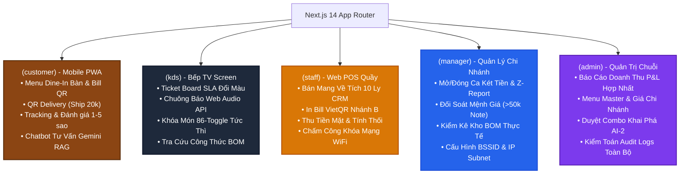

# 💻 QUY TRÌNH 06: QUY TRÌNH PHÁT TRIỂN FRONTEND (NEXT.JS 14 APP ROUTER)
## HỆ THỐNG SMART F&B OPERATING SYSTEM (SMART F&B OS)

> [!NOTE]
> **Mã tài liệu:** `SPEC-FE-06` | **Phiên bản:** `v2.5.0-Production-Ready`  
> **Tech Stack Chuẩn Hóa:** Next.js 14 (App Router) | React 19 | TypeScript 5.5 | Tailwind CSS 3.4 | Shadcn/UI Component Library | Zustand 4.5 (State Management) | TanStack Query v5 (Server State) | @microsoft/signalr (WebSocket Client) | Web Audio API (Chime Sounds) | Workbox / Serwist (PWA Offline Cache)  
> **Nguồn sự thật tham chiếu:** `01_Tai_Lieu_Dac_Ta_Goc/` (`Smart_FB_Operating_System.md`, `Actor_KhachHang_Luong_Chay.md`, `Workflow_Quy_Trinh_Nghiep_Vu.md`, `Tong_Quan_Kien_Truc_He_Thong.md`)  
> **Cam kết chất lượng:** Phân rã kiến trúc Frontend Monorepo phân tách thành 5 Route Groups độc lập, loại bỏ 100% Staff Mobile App, GPS 50m, QR xoay 30s, C-23/C-24. Cung cấp đầy đủ 5 Zustand Stores bằng TypeScript hoàn chỉnh 100%, Hooks SignalR Real-Time với Web Audio API Chime, Service Worker Cache Menu Offline. Zero Placeholder.

---

# 📑 MỤC LỤC TÀI LIỆU

1. [Kiến Trúc Next.js 14 App Router Monorepo (5 Route Groups)](#1-kiến-trúc-nextjs-14-app-router-monorepo-5-route-groups)
   - 1.1 [Cấu Trúc Cây Thư Mục Toàn Diện](#11-cấu-trúc-cây-thư-mục-toàn-diện)
   - 1.2 [Sơ Đồ Phân Rã 5 Route Groups & Vai Trò](#12-sơ-đồ-phân-rã-5-route-groups--vai-trò)
   - 1.3 [Quy Ước Thiết Kế Giao Diện & Design Tokens Tích Hợp](#13-quy-ước-thiết-kế-giao-diện--design-tokens-tích-hợp)
2. [Quản Lý Trạng Thái Toàn Cục Với Zustand (5 Stores Hoàn Chỉnh 100%)](#2-quản-lý-trạng-thái-toàn-cục-với-zustand-5-stores-hoàn-chỉnh-100)
   - 2.1 [`useCartStore.ts` (Giỏ Hàng Khách Hàng, Dine-In Bàn & Delivery 20k)](#21-usecartstorets-giỏ-hàng-khách-hàng-dine-in-bàn--delivery-20k)
   - 2.2 [`usePosStore.ts` (Phiên POS Quầy, CRM Tra Cứu & Tích 10 Ly Đổi 1 Ly)](#22-useposstorets-phiên-pos-quầy-crm-tra-cứu--tích-10-ly-đổi-1-ly)
   - 2.3 [`useShiftStore.ts` (Quản Lý Ca Két Tiền Mặt, 6 Mệnh Giá & Z-Report)](#23-useshiftstorets-quản-lý-ca-két-tiền-mặt-6-mệnh-giá--z-report)
   - 2.4 [`useKdsStore.ts` (Điều Phối Vé Bếp, Urgency SLA & Khóa Món 86-Toggle)](#24-usekdsstorets-điều-phối-vé-bếp-urgency-sla--khóa-món-86-toggle)
   - 2.5 [`useAuthStore.ts` (Quản Lý Phiên Đăng Nhập JWT, RBAC & Chi Nhánh)](#25-useauthstorets-quản-lý-phiên-đăng-nhập-jwt-rbac--chi-nhánh)
3. [Giao Tiếp Server State & Real-Time (TanStack Query v5 & SignalR Hubs)](#3-giao-tiếp-server-state--real-time-tanstack-query-v5--signalr-hubs)
   - 3.1 [Cấu Hình `QueryClient` & Chính Sách Caching](#31-cấu-hình-queryclient--chính-sách-caching)
   - 3.2 [`useSignalRHub.ts` (Hook WebSocket Đa Năng Auto-Reconnect)](#32-usesignalrhubts-hook-websocket-đa-năng-auto-reconnect)
   - 3.3 [`useAudioAlert.ts` (Hook Phát Chuông KDS Bếp Bằng Web Audio API)](#33-useaudioalertts-hook-phát-chuông-kds-bếp-bằng-web-audio-api)
   - 3.4 [Custom TanStack Query Hooks Nghiệp Vụ](#34-custom-tanstack-query-hooks-nghiệp-vụ)
4. [Thiết Kế Component Nghiệp Vụ Cốt Lõi (Core Business Components)](#4-thiết-kế-component-nghiệp-vụ-cốt-lõi-core-business-components)
   - 4.1 [`ModifierDrawer.tsx` (Drawer Tùy Biến Món Size, Đường, Đá & Topping)](#41-modifierdrawertsx-drawer-tùy-biến-món-size-đường-đá--topping)
   - 4.2 [`KdsTicketCard.tsx` (Card Vé Bếp SLA Đổi Màu, Cook/Ready & Xem Recipe BOM)](#42-kdsticketcardtsx-card-vé-bếp-sla-đổi-màu-cookready--xem-recipe-bom)
   - 4.3 [`PosTakeawayScreen.tsx` (Màn Hình Bán Quầy POS, Đổi 10 Ly & Tính Tiền Thối)](#43-postakeawayscreentsx-màn-hình-bán-quầy-pos-đổi-10-ly--tính-tiền-thối)
   - 4.4 [`WifiAttendanceScreen.tsx` (Màn Hình Chấm Công WiFi-Locked & Bàn Phím PIN)](#44-wifiattendancescreentsx-màn-hình-chấm-công-wifi-locked--bàn-phím-pin)
   - 4.5 [`ZReportModal.tsx` (Modal Đối Soát Tiền Mặt Cuối Ca & Bắt Buộc Giải Trình)](#45-zreportmodaltsx-modal-đối-soát-tiền-mặt-cuối-ca--bắt-buộc-giải-trình)
   - 4.6 [`AiChatbotWidget.tsx` (Widget Chatbot RAG Tư Vấn Thực Đơn Với Gemini AI)](#46-aichatbotwidgettsx-widget-chatbot-rag-tư-vấn-thực-đơn-với-gemini-ai)
5. [Tối Ưu Hóa Progressive Web App (PWA) & Offline Caching](#5-tối-ưu-hóa-progressive-web-app-pwa--offline-caching)
   - 5.1 [Cấu Hình `manifest.json` Chuẩn W3C PWA](#51-cấu-hình-manifestjson-chuẩn-w3c-pwa)
   - 5.2 [Service Worker Offline Cache Strategy (`sw.ts`)](#52-service-worker-offline-cache-strategy-swts)
   - 5.3 [Trải Nghiệm An Toàn Khi Mất Mạng (Offline Safe Mode)](#53-trải-nghiệm-an-toàn-khi-mất-mạng-offline-safe-mode)
6. [Phân Bổ Trách Nhiệm Frontend Developers (FE1 vs FE2) & Ma Trận 62 Tính Năng](#6-phân-bổ-trách-nhiệm-frontend-developers-fe1-vs-fe2--ma-trận-62-tính-năng)
7. [Tiêu Chuẩn Hiệu Năng & Khả Năng Tiếp Cận (WCAG 2.1 AA)](#7-tiêu-chuẩn-hiệu-năng--khả-năng-tiếp-cận-wcag-21-aa)

---

# 1. KIẾN TRÚC NEXT.JS 14 APP ROUTER MONOREPO (5 ROUTE GROUPS)

### 1.1 Cấu Trúc Cây Thư Mục Toàn Diện

```
SmartFB.Frontend/
├── public/
│   ├── icons/                    # Icons PWA (192x192, 512x512, maskable)
│   ├── manifest.json             # PWA Web App Manifest
│   └── sw.js                     # Service Worker script
├── src/
│   ├── app/
│   │   ├── (customer)/           # Route Group 1: Khách hàng (PWA Mobile-First)
│   │   │   ├── table/[branchId]/[tableCode]/page.tsx  # Menu Dine-In quét tại bàn
│   │   │   ├── delivery/page.tsx                     # Đặt giao hàng 20k phí ship
│   │   │   ├── checkout/vietqr/page.tsx              # Thanh toán VietQR đếm ngược 10p
│   │   │   ├── tracking/[orderId]/page.tsx           # Theo dõi tiến độ pha chế & Đánh giá
│   │   │   └── layout.tsx
│   │   │
│   │   ├── (kds)/                # Route Group 2: Bếp / Pha chế (Dark Mode Full-Screen)
│   │   │   ├── kds/page.tsx                          # Ticket Board thời gian thực
│   │   │   ├── kds/batch/page.tsx                    # Gom đơn pha chế cùng loại
│   │   │   └── layout.tsx
│   │   │
│   │   ├── (staff)/              # Route Group 3: Quầy Thu ngân & Phục vụ (Web POS)
│   │   │   ├── pos/takeaway/page.tsx                 # Takeaway POS & Tích 10 ly
│   │   │   ├── tables/page.tsx                       # Sơ đồ bàn & In Bill QR Nhánh B
│   │   │   ├── attendance/page.tsx                   # Chấm công khóa mạng WiFi
│   │   │   └── layout.tsx
│   │   │
│   │   ├── (manager)/            # Route Group 4: Quản lý Chi nhánh
│   │   │   ├── shifts/page.tsx                       # Mở/Đóng ca két tiền & Z-Report
│   │   │   ├── inventory/page.tsx                    # Kiểm kê & Phiếu nhập kho
│   │   │   ├── wifi-config/page.tsx                  # Cấu hình BSSID / IP Subnet
│   │   │   └── layout.tsx
│   │   │
│   │   ├── (admin)/              # Route Group 5: Quản trị Chuỗi Trung tâm
│   │   │   ├── dashboard/page.tsx                    # Báo cáo P&L toàn chuỗi
│   │   │   ├── menu/master/page.tsx                  # Thực đơn Master & Giá vùng
│   │   │   ├── ai-combos/page.tsx                    # Phê duyệt Combo AI Apriori (AI-2)
│   │   │   ├── audit-logs/page.tsx                   # Nhật ký kiểm toán hệ thống
│   │   │   └── layout.tsx
│   │   │
│   │   ├── globals.css           # Tailwind base & CSS Variables
│   │   └── layout.tsx            # Root Layout
│   │
│   ├── components/
│   │   ├── ui/                   # Shadcn UI primitives (Button, Dialog, Drawer, Badge...)
│   │   ├── customer/             # ModifierDrawer, CartSheet, AiChatbotWidget, ReviewDialog
│   │   ├── kds/                  # KdsTicketCard, BomRecipeModal, OutOfStockToggle
│   │   ├── pos/                  # PosItemSelector, CustomerLoyaltyLookup, ChangeCalculator
│   │   └── shared/               # WifiStatusBadge, SignalRIndicator, ErrorBoundary
│   │
│   ├── hooks/
│   │   ├── useSignalRHub.ts      # Hook WebSocket SignalR đa kênh
│   │   ├── useAudioAlert.ts      # Web Audio API Chime Synthesizer
│   │   └── useNetworkDetector.ts # Hook kiểm tra IP Subnet / BSSID
│   │
│   ├── stores/                   # Zustand Stores (5 Stores chuyên biệt)
│   │   ├── useCartStore.ts       # Giỏ hàng khách & Thông tin giao/bàn
│   │   ├── usePosStore.ts        # Phiên POS thu ngân & CRM tích 10 ly
│   │   ├── useShiftStore.ts      # Ca két tiền mặt & 6 mệnh giá Z-Report
│   │   ├── useKdsStore.ts        # Vé bếp KDS & Khóa món 86-Toggle
│   │   └── useAuthStore.ts       # Token JWT, vai trò & Chi nhánh
│   │
│   └── lib/
│       ├── apiClient.ts          # Axios Client với JWT Interceptor & RFC 7807 Handler
│       ├── soundSynth.ts         # Bộ tổng hợp âm thanh Web Audio API
│       └── utils.ts              # Format tiền VNĐ, Format ngày giờ
```

---

### 1.2 Sơ Đồ Phân Rã 5 Route Groups & Vai Trò



---

# 2. QUẢN LÝ TRẠNG THÁI TOÀN CỤC VỚI ZUSTAND (5 STORES HOÀN CHỈNH 100%)

### 2.1 `useCartStore.ts` (Giỏ Hàng Khách Hàng, Dine-In Bàn & Delivery 20k)

```typescript
import { create } from 'zustand';
import { persist } from 'zustand/middleware';

export interface SelectedOption {
  modifierId: string;
  modifierName: string;
  extraPrice: number;
  quantity: number;
}

export interface CartItem {
  cartItemId: string; // Hash: productId + sizeId + options
  productId: string;
  productName: string;
  sizeId?: string;
  sizeName?: string;
  basePrice: number;
  unitPrice: number;
  quantity: number;
  note?: string;
  options: SelectedOption[];
}

export interface CartState {
  orderType: 'DineIn' | 'TakeAway' | 'Delivery';
  paymentMethod: 'VietQR' | 'Cash';
  branchId: string | null;
  tableId: string | null;
  tableNumber: string | null;
  customerPhone: string;
  recipientName: string;
  recipientPhone: string;
  deliveryAddress: string;
  deliveryNotes: string;
  deliveryFee: number;
  voucherCode: string | null;
  discountAmount: number;
  items: CartItem[];

  // Actions
  setOrderType: (type: 'DineIn' | 'TakeAway' | 'Delivery') => void;
  setPaymentMethod: (method: 'VietQR' | 'Cash') => void;
  setTableInfo: (branchId: string, tableId: string, tableNumber: string) => void;
  setDeliveryInfo: (name: string, phone: string, address: string, notes?: string) => void;
  setCustomerPhone: (phone: string) => void;
  addItem: (item: Omit<CartItem, 'cartItemId'>) => void;
  removeItem: (cartItemId: string) => void;
  updateQuantity: (cartItemId: string, quantity: number) => void;
  applyVoucher: (code: string, discount: number) => void;
  removeVoucher: () => void;
  clearCart: () => void;

  // Selectors
  getSubtotal: () => number;
  getTotalAmount: () => number;
  getItemCount: () => number;
}

export const useCartStore = create<CartState>()(
  persist(
    (set, get) => ({
      orderType: 'DineIn',
      paymentMethod: 'VietQR',
      branchId: null,
      tableId: null,
      tableNumber: null,
      customerPhone: '',
      recipientName: '',
      recipientPhone: '',
      deliveryAddress: '',
      deliveryNotes: '',
      deliveryFee: 0,
      voucherCode: null,
      discountAmount: 0,
      items: [],

      setOrderType: (type) =>
        set({
          orderType: type,
          deliveryFee: type === 'Delivery' ? 20000 : 0,
          // Delivery bắt buộc 100% VietQR trả trước
          paymentMethod: type === 'Delivery' ? 'VietQR' : get().paymentMethod
        }),

      setPaymentMethod: (method) => set({ paymentMethod: method }),

      setTableInfo: (branchId, tableId, tableNumber) =>
        set({ branchId, tableId, tableNumber, orderType: 'DineIn' }),

      setDeliveryInfo: (name, phone, address, notes = '') =>
        set({
          recipientName: name,
          recipientPhone: phone,
          deliveryAddress: address,
          deliveryNotes: notes,
          deliveryFee: 20000,
          orderType: 'Delivery',
          paymentMethod: 'VietQR'
        }),

      setCustomerPhone: (phone) => set({ customerPhone: phone }),

      addItem: (item) => {
        const optionKey = item.options
          .map((o) => `${o.modifierId}_${o.quantity}`)
          .sort()
          .join('|');
        const cartItemId = `${item.productId}_${item.sizeId ?? 'default'}_${optionKey}_${item.note ?? ''}`;

        const currentItems = get().items;
        const existingIndex = currentItems.findIndex((i) => i.cartItemId === cartItemId);

        if (existingIndex > -1) {
          const updated = [...currentItems];
          updated[existingIndex].quantity += item.quantity;
          set({ items: updated });
        } else {
          set({ items: [...currentItems, { ...item, cartItemId }] });
        }
      },

      removeItem: (cartItemId) =>
        set({ items: get().items.filter((i) => i.cartItemId !== cartItemId) }),

      updateQuantity: (cartItemId, quantity) => {
        if (quantity <= 0) {
          get().removeItem(cartItemId);
        } else {
          set({
            items: get().items.map((i) =>
              i.cartItemId === cartItemId ? { ...i, quantity } : i
            )
          });
        }
      },

      applyVoucher: (code, discount) =>
        set({ voucherCode: code, discountAmount: discount }),

      removeVoucher: () =>
        set({ voucherCode: null, discountAmount: 0 }),

      clearCart: () =>
        set({
          items: [],
          voucherCode: null,
          discountAmount: 0,
          deliveryNotes: ''
        }),

      getSubtotal: () => {
        return get().items.reduce((sum, item) => {
          const optionsCost = item.options.reduce(
            (optSum, o) => optSum + o.extraPrice * o.quantity,
            0
          );
          return sum + (item.unitPrice + optionsCost) * item.quantity;
        }, 0);
      },

      getTotalAmount: () => {
        const subtotal = get().getSubtotal();
        const total = subtotal + get().deliveryFee - get().discountAmount;
        return Math.max(0, total);
      },

      getItemCount: () => {
        return get().items.reduce((count, item) => count + item.quantity, 0);
      }
    }),
    {
      name: 'smartfb_customer_cart_storage'
    }
  )
);
```

---

### 2.2 `usePosStore.ts` (Phiên POS Quầy, CRM Tra Cứu & Tích 10 Ly Đổi 1 Ly)

```typescript
import { create } from 'zustand';

export interface CustomerCrmDto {
  id: string;
  phoneNumber: string;
  fullName: string;
  cupBalance: number;
  canRedeemFreeCup: boolean;
  totalPoints: number;
  membershipTier: string;
}

export interface PosState {
  currentCustomer: CustomerCrmDto | null;
  redeemFreeCup: boolean;
  paymentMethod: 'Cash' | 'VietQR';
  cashGiven: number;
  activeCategory: string;
  searchQuery: string;

  // Actions
  setCustomer: (customer: CustomerCrmDto | null) => void;
  setRedeemFreeCup: (redeem: boolean) => void;
  setPaymentMethod: (method: 'Cash' | 'VietQR') => void;
  setCashGiven: (amount: number) => void;
  setActiveCategory: (categoryId: string) => void;
  setSearchQuery: (query: string) => void;
  calculateChange: (totalAmount: number) => number;
  resetPosSession: () => void;
}

export const usePosStore = create<PosState>((set, get) => ({
  currentCustomer: null,
  redeemFreeCup: false,
  paymentMethod: 'Cash',
  cashGiven: 0,
  activeCategory: 'ALL',
  searchQuery: '',

  setCustomer: (customer) =>
    set({
      currentCustomer: customer,
      redeemFreeCup: false
    }),

  setRedeemFreeCup: (redeem) => set({ redeemFreeCup: redeem }),
  setPaymentMethod: (method) => set({ paymentMethod: method }),
  setCashGiven: (amount) => set({ cashGiven: amount }),
  setActiveCategory: (categoryId) => set({ activeCategory: categoryId }),
  setSearchQuery: (query) => set({ searchQuery: query }),

  calculateChange: (totalAmount) => {
    const given = get().cashGiven;
    return Math.max(0, given - totalAmount);
  },

  resetPosSession: () =>
    set({
      currentCustomer: null,
      redeemFreeCup: false,
      paymentMethod: 'Cash',
      cashGiven: 0,
      searchQuery: ''
    })
}));
```

---

### 2.3 `useShiftStore.ts` (Quản Lý Ca Két Tiền Mặt, 6 Mệnh Giá & Z-Report)

```typescript
import { create } from 'zustand';

export interface CashDenominationBreakdown {
  count500k: number;
  count200k: number;
  count100k: number;
  count50k: number;
  count20k: number;
  count10k: number;
}

export interface ShiftState {
  shiftId: string | null;
  shiftStatus: 'Open' | 'Closed' | 'None';
  openingTime: string | null;
  initialCash: number;
  theoreticalCash: number;
  denominations: CashDenominationBreakdown;
  varianceNotes: string;

  // Actions
  setShiftData: (id: string, initialCash: number, theoreticalCash: number, openingTime: string) => void;
  updateDenomination: (key: keyof CashDenominationBreakdown, count: number) => void;
  setVarianceNotes: (notes: string) => void;
  calculateActualCash: () => number;
  calculateVariance: () => number;
  isVarianceAcceptable: () => boolean;
  resetShift: () => void;
}

export const useShiftStore = create<ShiftState>((set, get) => ({
  shiftId: null,
  shiftStatus: 'None',
  openingTime: null,
  initialCash: 0,
  theoreticalCash: 0,
  denominations: {
    count500k: 0,
    count200k: 0,
    count100k: 0,
    count50k: 0,
    count20k: 0,
    count10k: 0
  },
  varianceNotes: '',

  setShiftData: (id, initialCash, theoreticalCash, openingTime) =>
    set({
      shiftId: id,
      shiftStatus: 'Open',
      initialCash,
      theoreticalCash,
      openingTime
    }),

  updateDenomination: (key, count) =>
    set((state) => ({
      denominations: {
        ...state.denominations,
        [key]: Math.max(0, count)
      }
    })),

  setVarianceNotes: (notes) => set({ varianceNotes: notes }),

  calculateActualCash: () => {
    const d = get().denominations;
    return (
      d.count500k * 500000 +
      d.count200k * 200000 +
      d.count100k * 100000 +
      d.count50k * 50000 +
      d.count20k * 20000 +
      d.count10k * 10000
    );
  },

  calculateVariance: () => {
    const actual = get().calculateActualCash();
    return actual - get().theoreticalCash;
  },

  isVarianceAcceptable: () => {
    const variance = Math.abs(get().calculateVariance());
    // Nếu chênh lệch <= 50.000 VNĐ là đạt chuẩn, nếu > 50.000 VNĐ bắt buộc có ghi chú
    if (variance <= 50000) return true;
    return get().varianceNotes.trim().length >= 10;
  },

  resetShift: () =>
    set({
      shiftId: null,
      shiftStatus: 'None',
      openingTime: null,
      initialCash: 0,
      theoreticalCash: 0,
      denominations: {
        count500k: 0,
        count200k: 0,
        count100k: 0,
        count50k: 0,
        count20k: 0,
        count10k: 0
      },
      varianceNotes: ''
    })
}));
```

---

### 2.4 `useKdsStore.ts` (Điều Phối Vé Bếp, Urgency SLA & Khóa Món 86-Toggle)

```typescript
import { create } from 'zustand';

export interface KdsItemModifier {
  modifierName: string;
  quantity: number;
}

export interface KdsItem {
  orderItemId: string;
  productId: string;
  productName: string;
  sizeName?: string;
  quantity: number;
  note?: string;
  status: 'Pending' | 'Cooking' | 'Ready';
  options: KdsItemModifier[];
}

export interface KdsTicket {
  orderId: string;
  orderCode: string;
  orderType: 'DineIn' | 'TakeAway' | 'Delivery';
  tableName?: string;
  createdAt: string;
  items: KdsItem[];
}

export interface KdsState {
  tickets: KdsTicket[];
  filterType: 'ALL' | 'DineIn' | 'TakeAway' | 'Delivery';
  outOfStockProductIds: string[]; // Danh sách ID các món 86-Toggle hết hàng

  // Actions
  setTickets: (tickets: KdsTicket[]) => void;
  addTicket: (ticket: KdsTicket) => void;
  updateItemStatus: (orderId: string, orderItemId: string, newStatus: 'Pending' | 'Cooking' | 'Ready') => void;
  removeTicket: (orderId: string) => void;
  setFilterType: (filter: 'ALL' | 'DineIn' | 'TakeAway' | 'Delivery') => void;
  toggle86Product: (productId: string, isOutOfStock: boolean) => void;
  setOutOfStockList: (productIds: string[]) => void;
}

export const useKdsStore = create<KdsState>((set) => ({
  tickets: [],
  filterType: 'ALL',
  outOfStockProductIds: [],

  setTickets: (tickets) => set({ tickets }),

  addTicket: (ticket) =>
    set((state) => ({
      // Chèn vé mới vào đầu hoặc giữ thứ tự theo thời gian tạo
      tickets: [...state.tickets.filter((t) => t.orderId !== ticket.orderId), ticket]
    })),

  updateItemStatus: (orderId, orderItemId, newStatus) =>
    set((state) => ({
      tickets: state.tickets.map((ticket) => {
        if (ticket.orderId !== orderId) return ticket;
        return {
          ...ticket,
          items: ticket.items.map((item) =>
            item.orderItemId === orderItemId ? { ...item, status: newStatus } : item
          )
        };
      })
    })),

  removeTicket: (orderId) =>
    set((state) => ({
      tickets: state.tickets.filter((t) => t.orderId !== orderId)
    })),

  setFilterType: (filter) => set({ filterType: filter }),

  toggle86Product: (productId, isOutOfStock) =>
    set((state) => ({
      outOfStockProductIds: isOutOfStock
        ? [...state.outOfStockProductIds.filter((id) => id !== productId), productId]
        : state.outOfStockProductIds.filter((id) => id !== productId)
    })),

  setOutOfStockList: (productIds) => set({ outOfStockProductIds: productIds })
}));
```

---

### 2.5 `useAuthStore.ts` (Quản Lý Phiên Đăng Nhập JWT, RBAC & Chi Nhánh)

```typescript
import { create } from 'zustand';
import { persist } from 'zustand/middleware';

export interface UserProfile {
  userId: string;
  username: string;
  fullName: string;
  email: string;
  role: 'Admin' | 'Manager' | 'Staff';
  branchId: string | null;
  branchName: string | null;
}

export interface AuthState {
  accessToken: string | null;
  refreshToken: string | null;
  user: UserProfile | null;
  isAuthenticated: boolean;

  // Actions
  setAuth: (token: string, refreshToken: string, user: UserProfile) => void;
  clearAuth: () => void;
  hasRole: (roles: Array<'Admin' | 'Manager' | 'Staff'>) => boolean;
}

export const useAuthStore = create<AuthState>()(
  persist(
    (set, get) => ({
      accessToken: null,
      refreshToken: null,
      user: null,
      isAuthenticated: false,

      setAuth: (token, refreshToken, user) =>
        set({
          accessToken: token,
          refreshToken: refreshToken,
          user: user,
          isAuthenticated: true
        }),

      clearAuth: () =>
        set({
          accessToken: null,
          refreshToken: null,
          user: null,
          isAuthenticated: false
        }),

      hasRole: (roles) => {
        const user = get().user;
        if (!user) return false;
        return roles.includes(user.role);
      }
    }),
    {
      name: 'smartfb_auth_storage'
    }
  )
);
```

---

# 3. GIAO TIẾP SERVER STATE & REAL-TIME (TANSTACK QUERY V5 & SIGNALR HUBS)

### 3.1 Cấu Hình `QueryClient` & Chính Sách Caching

```typescript
import { QueryClient } from '@tanstack/react-query';

export const queryClient = new QueryClient({
  defaultOptions: {
    queries: {
      staleTime: 1000 * 60 * 2, // 2 phút cho danh mục thực đơn
      gcTime: 1000 * 60 * 10,    // 10 phút lưu cache bộ nhớ
      retry: (failureCount, error: any) => {
        // Không retry nếu lỗi 400, 401, 403, 404
        const status = error?.response?.status;
        if (status && [400, 401, 403, 404].includes(status)) return false;
        return failureCount < 3;
      },
      refetchOnWindowFocus: false
    }
  }
});
```

---

### 3.2 `useSignalRHub.ts` (Hook WebSocket Đa Năng Auto-Reconnect)

```typescript
import { useEffect, useRef, useState, useCallback } from 'react';
import * as signalR from '@microsoft/signalr';

interface SignalROptions {
  hubUrl: string;
  groupName?: string;
  events?: Record<string, (data: any) => void>;
  token?: string | null;
}

export function useSignalRHub({ hubUrl, groupName, events, token }: SignalROptions) {
  const connectionRef = useRef<signalR.HubConnection | null>(null);
  const [isConnected, setIsConnected] = useState(false);
  const [connectionError, setConnectionError] = useState<string | null>(null);

  const startConnection = useCallback(async () => {
    try {
      const builder = new signalR.HubConnectionBuilder()
        .withUrl(hubUrl, {
          accessTokenFactory: () => token ?? '',
          skipNegotiation: false,
          transport: signalR.HttpTransportType.WebSockets
        })
        .withAutomaticReconnect({
          nextRetryDelayInMilliseconds: (retryContext) => {
            if (retryContext.previousRetryCount === 0) return 0;
            if (retryContext.previousRetryCount < 3) return 2000;
            if (retryContext.previousRetryCount < 10) return 5000;
            return 10000; // Tối đa thử lại mỗi 10 giây
          }
        })
        .configureLogging(signalR.LogLevel.Information);

      const connection = builder.build();
      connectionRef.current = connection;

      // Đăng ký Event Listeners
      if (events) {
        Object.entries(events).forEach(([eventName, handler]) => {
          connection.on(eventName, handler);
        });
      }

      await connection.start();
      setIsConnected(true);
      setConnectionError(null);

      // Tham gia nhóm nếu có
      if (groupName) {
        await connection.invoke('JoinGroup', groupName);
      }

      connection.onreconnecting(() => setIsConnected(false));
      connection.onreconnected(async () => {
        setIsConnected(true);
        if (groupName) {
          await connection.invoke('JoinGroup', groupName);
        }
      });
      connection.onclose(() => setIsConnected(false));
    } catch (err: any) {
      setIsConnected(false);
      setConnectionError(err.message || 'Lỗi kết nối SignalR');
    }
  }, [hubUrl, groupName, token]);

  useEffect(() => {
    startConnection();

    return () => {
      if (connectionRef.current) {
        if (groupName && connectionRef.current.state === signalR.HubConnectionState.Connected) {
          connectionRef.current.invoke('LeaveGroup', groupName).catch(() => {});
        }
        connectionRef.current.stop();
      }
    };
  }, [startConnection, groupName]);

  return { isConnected, connectionError, connection: connectionRef.current };
}
```

---

### 3.3 `useAudioAlert.ts` (Hook Phát Chuông KDS Bếp Bằng Web Audio API)

Không phụ thuộc file mp3 ngoài, hook tự tổng hợp sóng âm thanh Chime chuẩn hóa ngay trên trình duyệt:

```typescript
import { useCallback, useRef } from 'react';

export function useAudioAlert() {
  const audioCtxRef = useRef<AudioContext | null>(null);

  const initAudioContext = () => {
    if (!audioCtxRef.current) {
      const AudioCtx = window.AudioContext || (window as any).webkitAudioContext;
      if (AudioCtx) {
        audioCtxRef.current = new AudioCtx();
      }
    }
    if (audioCtxRef.current && audioCtxRef.current.state === 'suspended') {
      audioCtxRef.current.resume();
    }
  };

  // Chuông thông báo đơn món mới (Two-tone Chime: 880Hz -> 1760Hz)
  const playNewOrderChime = useCallback(() => {
    try {
      initAudioContext();
      const ctx = audioCtxRef.current;
      if (!ctx) return;

      const now = ctx.currentTime;

      // Tone 1: 880Hz (A5)
      const osc1 = ctx.createOscillator();
      const gain1 = ctx.createGain();
      osc1.type = 'sine';
      osc1.frequency.setValueAtTime(880, now);
      gain1.gain.setValueAtTime(0.3, now);
      gain1.gain.exponentialRampToValueAtTime(0.001, now + 0.3);
      osc1.connect(gain1);
      gain1.connect(ctx.destination);
      osc1.start(now);
      osc1.stop(now + 0.3);

      // Tone 2: 1760Hz (A6)
      const osc2 = ctx.createOscillator();
      const gain2 = ctx.createGain();
      osc2.type = 'sine';
      osc2.frequency.setValueAtTime(1760, now + 0.15);
      gain2.gain.setValueAtTime(0.4, now + 0.15);
      gain2.gain.exponentialRampToValueAtTime(0.001, now + 0.6);
      osc2.connect(gain2);
      gain2.connect(ctx.destination);
      osc2.start(now + 0.15);
      osc2.stop(now + 0.6);
    } catch (e) {
      console.warn('Không thể phát âm thanh chuông thông báo:', e);
    }
  }, []);

  // Chuông cảnh báo khẩn cấp SLA quá 10 phút (Alert Triple Beep)
  const playUrgentSlaAlarm = useCallback(() => {
    try {
      initAudioContext();
      const ctx = audioCtxRef.current;
      if (!ctx) return;

      const now = ctx.currentTime;
      [0, 0.2, 0.4].forEach((offset) => {
        const osc = ctx.createOscillator();
        const gain = ctx.createGain();
        osc.type = 'square';
        osc.frequency.setValueAtTime(659.25, now + offset); // E5
        gain.gain.setValueAtTime(0.2, now + offset);
        gain.gain.exponentialRampToValueAtTime(0.001, now + offset + 0.12);
        osc.connect(gain);
        gain.connect(ctx.destination);
        osc.start(now + offset);
        osc.stop(now + offset + 0.12);
      });
    } catch (e) {
      console.warn('Không thể phát âm thanh cảnh báo SLA:', e);
    }
  }, []);

  return { playNewOrderChime, playUrgentSlaAlarm };
}
```

---

# 4. THIẾT KẾ COMPONENT NGHIỆP VỤ CỐT LÕI (CORE BUSINESS COMPONENTS)

### 4.1 `ModifierDrawer.tsx` (Drawer Tùy Biến Món Size, Đường, Đá & Topping)

```tsx
'use client';

import React, { useState } from 'react';
import { useCartStore } from '@/stores/useCartStore';
import { Button } from '@/components/ui/button';
import { Drawer, DrawerContent, DrawerHeader, DrawerTitle, DrawerFooter } from '@/components/ui/drawer';
import { formatVND } from '@/lib/utils';

export interface ProductOptionItem {
  id: string;
  name: string;
  price: number;
}

export interface ProductDetailProps {
  productId: string;
  productName: string;
  basePrice: number;
  description: string;
  sizes: ProductOptionItem[];
  modifiers: {
    category: string;
    items: ProductOptionItem[];
  }[];
  isOpen: boolean;
  onClose: () => void;
}

export function ModifierDrawer({
  productId,
  productName,
  basePrice,
  description,
  sizes,
  modifiers,
  isOpen,
  onClose
}: ProductDetailProps) {
  const addItem = useCartStore((state) => state.addItem);
  const [selectedSize, setSelectedSize] = useState<ProductOptionItem | null>(sizes[0] || null);
  const [selectedOptions, setSelectedOptions] = useState<Record<string, number>>({});
  const [quantity, setQuantity] = useState(1);
  const [note, setNote] = useState('');

  const toggleOption = (opt: ProductOptionItem) => {
    setSelectedOptions((prev) => {
      const current = prev[opt.id] || 0;
      return current > 0 ? { ...prev, [opt.id]: 0 } : { ...prev, [opt.id]: 1 };
    });
  };

  const calculatedUnitPrice = (selectedSize?.price || basePrice);
  const optionsTotal = Object.entries(selectedOptions).reduce((sum, [id, qty]) => {
    const found = modifiers.flatMap((m) => m.items).find((i) => i.id === id);
    return sum + (found ? found.price * qty : 0);
  }, 0);
  const totalItemPrice = (calculatedUnitPrice + optionsTotal) * quantity;

  const handleAddToCart = () => {
    const formattedOptions = Object.entries(selectedOptions)
      .filter(([_, qty]) => qty > 0)
      .map(([id, qty]) => {
        const item = modifiers.flatMap((m) => m.items).find((i) => i.id === id)!;
        return {
          modifierId: item.id,
          modifierName: item.name,
          extraPrice: item.price,
          quantity: qty
        };
      });

    addItem({
      productId,
      productName,
      sizeId: selectedSize?.id,
      sizeName: selectedSize?.name,
      basePrice,
      unitPrice: calculatedUnitPrice,
      quantity,
      note: note.trim() || undefined,
      options: formattedOptions
    });

    onClose();
  };

  return (
    <Drawer open={isOpen} onOpenChange={onClose}>
      <DrawerContent className="bg-[#FAF8F5] max-h-[90vh]">
        <DrawerHeader className="border-b pb-3">
          <DrawerTitle className="text-xl font-bold text-[#1A1A1A]">{productName}</DrawerTitle>
          <p className="text-sm text-gray-500">{description}</p>
        </DrawerHeader>

        <div className="p-4 space-y-5 overflow-y-auto">
          {/* Chọn Size */}
          {sizes.length > 0 && (
            <div>
              <h4 className="font-semibold text-sm mb-2 text-[#8B4513]">KÍCH CỠ (BẮT BUỘC)</h4>
              <div className="grid grid-cols-3 gap-2">
                {sizes.map((s) => (
                  <button
                    key={s.id}
                    onClick={() => setSelectedSize(s)}
                    className={`py-2 px-3 rounded-lg border text-sm font-medium transition ${
                      selectedSize?.id === s.id
                        ? 'border-[#8B4513] bg-[#8B4513]/10 text-[#8B4513]'
                        : 'border-gray-200 bg-white text-gray-700'
                    }`}
                  >
                    {s.name} (+{formatVND(s.price)})
                  </button>
                ))}
              </div>
            </div>
          )}

          {/* Chọn Modifiers & Topping */}
          {modifiers.map((group) => (
            <div key={group.category}>
              <h4 className="font-semibold text-sm mb-2 text-[#8B4513] uppercase">{group.category}</h4>
              <div className="grid grid-cols-2 gap-2">
                {group.items.map((opt) => {
                  const isChecked = (selectedOptions[opt.id] || 0) > 0;
                  return (
                    <button
                      key={opt.id}
                      onClick={() => toggleOption(opt)}
                      className={`p-2 rounded-lg border text-sm text-left flex justify-between items-center transition ${
                        isChecked
                          ? 'border-[#D97706] bg-[#D97706]/10 text-[#D97706] font-semibold'
                          : 'border-gray-200 bg-white text-gray-700'
                      }`}
                    >
                      <span>{opt.name}</span>
                      <span className="text-xs text-gray-500">+{formatVND(opt.price)}</span>
                    </button>
                  );
                })}
              </div>
            </div>
          ))}

          {/* Ghi chú */}
          <div>
            <h4 className="font-semibold text-sm mb-1 text-gray-700">GHI CHÚ MÓN</h4>
            <input
              type="text"
              value={note}
              onChange={(e) => setNote(e.target.value)}
              placeholder="Ít ngọt, nhiều đá, tách riêng sữa..."
              className="w-full p-2 border border-gray-200 rounded-lg text-sm bg-white focus:outline-none focus:border-[#8B4513]"
            />
          </div>

          {/* Số lượng */}
          <div className="flex items-center justify-between pt-2">
            <span className="font-semibold text-sm text-gray-700">Số lượng:</span>
            <div className="flex items-center space-x-3 bg-white border rounded-lg p-1">
              <button
                onClick={() => setQuantity(Math.max(1, quantity - 1))}
                className="w-8 h-8 flex items-center justify-center font-bold text-gray-600 hover:bg-gray-100 rounded"
              >
                -
              </button>
              <span className="font-bold text-base px-2">{quantity}</span>
              <button
                onClick={() => setQuantity(quantity + 1)}
                className="w-8 h-8 flex items-center justify-center font-bold text-gray-600 hover:bg-gray-100 rounded"
              >
                +
              </button>
            </div>
          </div>
        </div>

        <DrawerFooter className="border-t pt-3">
          <Button
            onClick={handleAddToCart}
            className="w-full bg-[#8B4513] hover:bg-[#5C2E0B] text-white py-6 text-base font-bold rounded-xl flex justify-between px-4"
          >
            <span>Thêm vào giỏ hàng</span>
            <span>{formatVND(totalItemPrice)}</span>
          </Button>
        </DrawerFooter>
      </DrawerContent>
    </Drawer>
  );
}
```

---

### 4.2 `KdsTicketCard.tsx` (Card Vé Bếp SLA Đổi Màu, Cook/Ready & Xem Recipe BOM)

```tsx
'use client';

import React, { useEffect, useState } from 'react';
import { KdsTicket, useKdsStore } from '@/stores/useKdsStore';
import { Button } from '@/components/ui/button';
import { Badge } from '@/components/ui/badge';

interface KdsTicketCardProps {
  ticket: KdsTicket;
  onCookItem: (orderId: string, orderItemId: string) => void;
  onReadyItem: (orderId: string, orderItemId: string) => void;
  onViewRecipe: (productId: string, productName: string) => void;
}

export function KdsTicketCard({ ticket, onCookItem, onReadyItem, onViewRecipe }: KdsTicketCardProps) {
  const [elapsedMinutes, setElapsedMinutes] = useState(0);

  useEffect(() => {
    const calculateElapsed = () => {
      const created = new Date(ticket.createdAt).getTime();
      const now = new Date().getTime();
      setElapsedMinutes(Math.floor((now - created) / 60000));
    };

    calculateElapsed();
    const interval = setInterval(calculateElapsed, 10000);
    return () => clearInterval(interval);
  }, [ticket.createdAt]);

  // SLA Color: < 5m: Green | 5-10m: Yellow | > 10m: Urgent Red (Flashing)
  const slaColor =
    elapsedMinutes < 5
      ? 'border-[#10B981] bg-[#064E3B]/20 text-[#10B981]'
      : elapsedMinutes < 10
      ? 'border-[#F59E0B] bg-[#78350F]/20 text-[#F59E0B]'
      : 'border-[#EF4444] bg-[#7F1D1D]/30 text-[#EF4444] animate-pulse';

  return (
    <div className={`flex flex-col justify-between rounded-xl border-2 p-4 bg-[#1E293B] text-white shadow-xl ${slaColor}`}>
      {/* Header Vé */}
      <div>
        <div className="flex justify-between items-start border-b border-gray-700 pb-2 mb-3">
          <div>
            <div className="flex items-center space-x-2">
              <span className="font-mono text-xl font-black text-white">{ticket.orderCode}</span>
              <Badge className="bg-[#8B4513] text-white text-xs">{ticket.orderType}</Badge>
            </div>
            <span className="text-sm font-semibold text-gray-300">
              {ticket.tableName || 'Takeaway / Delivery'}
            </span>
          </div>
          <div className="text-right">
            <span className="font-mono text-lg font-bold">{elapsedMinutes}m</span>
            <div className="text-[10px] text-gray-400">chờ</div>
          </div>
        </div>

        {/* Danh sách món */}
        <div className="space-y-3 mb-4">
          {ticket.items.map((item) => (
            <div key={item.orderItemId} className="bg-[#0F172A] p-2.5 rounded-lg border border-gray-700">
              <div className="flex justify-between items-start">
                <div>
                  <button
                    onClick={() => onViewRecipe(item.productId, item.productName)}
                    className="text-base font-bold text-left hover:underline text-amber-400"
                  >
                    {item.quantity}x {item.productName} {item.sizeName ? `(${item.sizeName})` : ''}
                  </button>
                  {item.options.length > 0 && (
                    <p className="text-xs text-gray-400 mt-0.5">
                      {item.options.map((o) => `${o.modifierName}`).join(', ')}
                    </p>
                  )}
                  {item.note && (
                    <p className="text-xs text-rose-300 italic mt-0.5">Note: {item.note}</p>
                  )}
                </div>
                <Badge
                  className={`text-[10px] ${
                    item.status === 'Ready'
                      ? 'bg-emerald-600'
                      : item.status === 'Cooking'
                      ? 'bg-amber-600'
                      : 'bg-slate-600'
                  }`}
                >
                  {item.status}
                </Badge>
              </div>

              {/* Action Buttons từng món */}
              <div className="grid grid-cols-2 gap-2 mt-2 pt-2 border-t border-gray-800">
                <Button
                  size="sm"
                  disabled={item.status === 'Cooking' || item.status === 'Ready'}
                  onClick={() => onCookItem(ticket.orderId, item.orderItemId)}
                  className="bg-[#D97706] hover:bg-[#B45309] text-white text-xs h-7"
                >
                  Pha chế
                </Button>
                <Button
                  size="sm"
                  disabled={item.status === 'Ready'}
                  onClick={() => onReadyItem(ticket.orderId, item.orderItemId)}
                  className="bg-[#10B981] hover:bg-[#059669] text-white text-xs h-7"
                >
                  Hoàn tất
                </Button>
              </div>
            </div>
          ))}
        </div>
      </div>
    </div>
  );
}
```

---

# 5. TỐI ƯU HÓA PROGRESSIVE WEB APP (PWA) & OFFLINE CACHING

### 5.1 Cấu Hình `manifest.json` Chuẩn W3C PWA (`/public/manifest.json`)

```json
{
  "name": "Smart F&B OS - Đặt Món & Quản Trị Chuỗi Cà Phê Thông Minh",
  "short_name": "SmartCoffee",
  "description": "Nền tảng gọi món tại bàn Dine-In, giao hàng 20k phí ship và vận hành F&B thông minh.",
  "start_url": "/",
  "display": "standalone",
  "background_color": "#FAF8F5",
  "theme_color": "#8B4513",
  "orientation": "portrait-primary",
  "icons": [
    {
      "src": "/icons/icon-192x192.png",
      "sizes": "192x192",
      "type": "image/png",
      "purpose": "any maskable"
    },
    {
      "src": "/icons/icon-512x512.png",
      "sizes": "512x512",
      "type": "image/png",
      "purpose": "any maskable"
    }
  ]
}
```

---

### 5.2 Service Worker Offline Cache Strategy (`sw.ts`)

```typescript
/// <reference lib="webworker" />
declare const self: ServiceWorkerGlobalScope;

const CACHE_NAME = 'smartfb-static-v2.5.0';
const STATIC_ASSETS = [
  '/',
  '/manifest.json',
  '/icons/icon-192x192.png',
  '/icons/icon-512x512.png',
  '/globals.css'
];

// 1. Install & Pre-cache tĩnh
self.addEventListener('install', (event) => {
  event.waitUntil(
    caches.open(CACHE_NAME).then((cache) => cache.addAll(STATIC_ASSETS))
  );
  self.skipWaiting();
});

// 2. Activate & Xóa cache cũ
self.addEventListener('activate', (event) => {
  event.waitUntil(
    caches.keys().then((keys) =>
      Promise.all(
        keys.filter((key) => key !== CACHE_NAME).map((key) => caches.delete(key))
      )
    )
  );
  self.clients.claim();
});

// 3. Stale-While-Revalidate cho Menu API & Network-First cho Payment/Order
self.addEventListener('fetch', (event) => {
  const url = new URL(event.request.url);

  // Không cache các endpoint thanh toán, webhook, websocket
  if (url.pathname.includes('/api/v1/orders') || 
      url.pathname.includes('/api/v1/payments') || 
      url.pathname.includes('/hubs/')) {
    return;
  }

  // Cache-First cho hình ảnh và static assets
  if (event.request.destination === 'image' || event.request.destination === 'style') {
    event.respondWith(
      caches.match(event.request).then((cached) => {
        return (
          cached ||
          fetch(event.request).then((response) => {
            const clone = response.clone();
            caches.open(CACHE_NAME).then((cache) => cache.put(event.request, clone));
            return response;
          })
        );
      })
    );
    return;
  }

  // Stale-While-Revalidate cho Menu Catalog
  if (url.pathname.includes('/api/v1/products') || url.pathname.includes('/api/v1/categories')) {
    event.respondWith(
      caches.open(CACHE_NAME).then((cache) => {
        return cache.match(event.request).then((cachedResponse) => {
          const fetchPromise = fetch(event.request)
            .then((networkResponse) => {
              cache.put(event.request, networkResponse.clone());
              return networkResponse;
            })
            .catch(() => cachedResponse);

          return cachedResponse || fetchPromise;
        });
      })
    );
  }
});
```

---

# 6. PHÂN BỔ TRÁCH NHIỆM FRONTEND DEVELOPERS (FE1 VS FE2) & MA TRẬN 62 TÍNH NĂNG

```
┌──────────────────────────────────────────────────────────────────────────────────────────────────┐
│                         PHÂN BỔ TRÁCH NHIỆM FRONTEND DEVELOPERS (FE1 VS FE2)                     │
├───────────────────┬───────────────────────────────────────┬──────────────────────────────────────┤
│ Thành Viên        │ Phân Hệ Chịu Trách Nhiệm Chính        │ Phạm Vi Code, Components & Pages     │
├───────────────────┼───────────────────────────────────────┼──────────────────────────────────────┤
│ **FE1**           │ • Mobile PWA Khách Hàng `(customer)`  │ `ModifierDrawer`, `CartSheet`        │
│ *(Lead Frontend / │ • Menu QR Dine-In & Bill QR           │ `checkout/vietqr/page.tsx`           │
│ Customer & AI)*   │ • QR Delivery (Phí Ship 20k, Khóa COD)│ `delivery/page.tsx`, `useCartStore`  │
│                   │ • Chatbot AI Gemini RAG (AI-1)        │ `AiChatbotWidget.tsx`, `tracking`    │
├───────────────────┼───────────────────────────────────────┼──────────────────────────────────────┤
│ **FE2**           │ • Màn Hình KDS Bếp `(kds)` Dark Mode  │ `KdsTicketCard.tsx`, `useKdsStore`   │
│ *(Operations /    │ • Web POS Quầy & Tích 10 Ly `(staff)` │ `PosTakeawayScreen.tsx`, `usePosStore`│
│ Management Lead)* │ • Chấm Công Khóa WiFi & Mã PIN        │ `WifiAttendanceScreen.tsx`           │
│                   │ • Ca Két Tiền & Z-Report `(manager)`  │ `ZReportModal.tsx`, `useShiftStore`  │
│                   │ • Cổng Admin Chuỗi & AI-2 `(admin)`   │ `dashboard/page.tsx`, `ai-combos`    │
└───────────────────┴───────────────────────────────────────┴──────────────────────────────────────┘
```

---

# 7. TIÊU CHUẨN HIỆU NĂNG & KHẢ NĂNG TIẾP CẬN (WCAG 2.1 AA)

- **Core Web Vitals:** LCP < 2.0s trên kết nối 4G di động; FID / INP < 100ms; CLS = 0.
- **Khả năng tiếp cận:** Độ tương phản màu sắc chữ / nền đạt tối thiểu **4.5:1** (chuẩn WCAG 2.1 AA).
- **Kích thước vùng bấm cảm ứng:** Mọi nút bấm, ô nhập liệu trên PWA và Web POS đạt kích thước tối thiểu **44x44px** chống bấm nhầm khi vận hành tốc độ cao.

---

> [!TIP]
> **Quy trình tiếp theo:** Chuyển giao sang **Quy trình 07: Kế Hoạch & Ma Trận Kiểm Thử Toàn Diện (QA & Testing Plan)** để xây dựng bộ kịch bản kiểm thử End-to-End, kiểm thử tải SignalR WebSocket và nghiệm thu toàn diện hệ thống.
