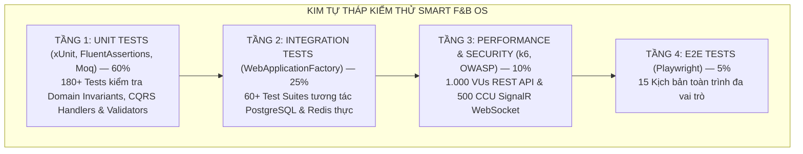
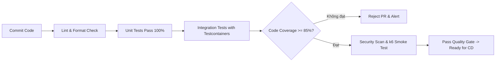

# 🧪 QUY TRÌNH 07: KẾ HOẠCH & MA TRẬN KIỂM THỬ TOÀN DIỆN (TEST PLAN & QA)
## HỆ THỐNG SMART F&B OPERATING SYSTEM (SMART F&B OS)

> [!NOTE]
> **Mã tài liệu:** `SPEC-TEST-07` | **Phiên bản:** `v2.5.0-Production-Ready`  
> **Tech Stack Kiểm Thử:** xUnit 2.8 (.NET 8) | FluentAssertions 6.12 | Moq 4.20 | WebApplicationFactory | Testcontainers 3.9 (PostgreSQL 16 & Redis 7) | Playwright 1.45 (E2E) | k6 0.51 (Load & Stress Testing) | k6/ws (SignalR WebSocket Concurrency)  
> **Nguồn sự thật tham chiếu:** `01_Tai_Lieu_Dac_Ta_Goc/` (`Smart_FB_Operating_System.md`, `Actor_Phan_Quyen_Chuc_Nang.md`, `Workflow_Quy_Trinh_Nghiep_Vu.md`, `Tong_Quan_Kien_Truc_He_Thong.md`)  
> **Cam kết chất lượng:** Đặc tả chiến lược kiểm thử phân tầng Testing Pyramid (60% Unit, 25% Integration, 10% Performance/Security, 5% E2E), ma trận kiểm thử 3 kênh bán hàng (Dine-In 2 nhánh thanh toán, Delivery 20k phí ship, Takeaway tích 10 ly), ma trận 10 kịch bản biên quan trọng (Critical Edge Cases) kèm code kiểm chứng assertion tự động, kịch bản kiểm thử tải trọng 1.000 VUs với k6 và kiểm thử tải SignalR 500 CCU/chi nhánh, ma trận bảo mật RBAC 4 Actors, và bảng truy vết toàn diện 100% 62 tính năng nghiệp vụ (`C-01` ~ `C-20`, `S-01` ~ `S-13`, `M-01` ~ `M-12`, `A-01` ~ `A-17`). Toàn bộ mã nguồn hoàn chỉnh 100%, không placeholder.

---

# 📑 MỤC LỤC TÀI LIỆU

1. [Chiến Lược & Mô Hình Kim Tự Tháp Kiểm Thử (Testing Pyramid Strategy)](#1-chiến-lược--mô-hình-kim-tự-tháp-kiểm-thử-testing-pyramid-strategy)
   - 1.1 [Tỷ Lệ Phân Bổ & Mục Tiêu Phủ Mã Nguồn (Code Coverage Goals)](#11-tỷ-lệ-phân-bổ--mục-tiêu-phủ-mã-nguồn-code-coverage-goals)
   - 1.2 [Công Cụ & Môi Trường Kiểm Thử Chuẩn Hóa](#12-công-cụ--môi-trường-kiểm-thử-chuẩn-hóa)
   - 1.3 [Cổng Chất Lượng Tự Động (Quality Gates in CI Pipeline)](#13-cổng-chất-lượng-tự-động-quality-gates-in-ci-pipeline)
2. [Ma Trận Kiểm Thử Nghiệp Vụ Cho 3 Kênh Bán Hàng](#2-ma-trận-kiểm-thử-nghiệp-vụ-cho-3-kênh-bán-hàng)
   - 2.1 [Kênh 1: Dine-In Tại Bàn (2 Nhánh Thanh Toán Độc Lập)](#21-kênh-1-dine-in-tại-bàn-2-nhánh-thanh-toán-độc-lập)
   - 2.2 [Kênh 2: QR Delivery (Giao Hàng Tận Nơi & Phí Ship 20.000đ)](#22-kênh-2-qr-delivery-giao-hàng-tận-nơi--phí-ship-20000đ)
   - 2.3 [Kênh 3: Takeaway POS Quầy (Tích Lũy 10 Ly Đổi 1 Ly CRM)](#23-kênh-3-takeaway-pos-quầy-tích-lũy-10-ly-đổi-1-ly-crm)
3. [Ma Trận 10 Kịch Bản Biên Quan Trọng (10 Critical Edge Cases Matrix)](#3-ma-trận-10-kịch-bản-biên-quan-trọng-10-critical-edge-cases-matrix)
   - 3.1 [Bảng Tổng Hợp 10 Kịch Bản Biên](#31-bảng-tổng-hợp-10-kịch-bản-biên)
   - 3.2 [Đặc Tả Chi Tiết Kèm Automated Assertion Cho Từng Kịch Bản](#32-đặc-tả-chi-tiết-kèm-automated-assertion-cho-từng-kịch-bản)
4. [Kiểm Thử Hiệu Năng Tải Trọng & Concurrency Stress Testing](#4-kiểm-thử-hiệu-năng-tải-trọng--concurrency-stress-testing)
   - 4.1 [Kịch Bản k6 Load Test 1.000 VUs Cho RESTful API](#41-kịch-bản-k6-load-test-1000-vus-cho-restful-api)
   - 4.2 [Kịch Bản SignalR Concurrency Stress Test 500 CCU / Chi Nhánh](#42-kịch-bản-signalr-concurrency-stress-test-500-ccu--chi-nhánh)
   - 4.3 [Tiêu Chí Đạt Chuẩn SLA Hiệu Năng Hệ Thống](#43-tiêu-chí-đạt-chuẩn-sla-hiệu-năng-hệ-thống)
5. [Ma Trận Kiểm Thử Bảo Mật & Phân Quyền RBAC (4 Actors)](#5-ma-trận-kiểm-thử-bảo-mật--phân-quyền-rbac-4-actors)
   - 5.1 [Ma Trận Kiểm Soát Truy Cập RBAC Matrix](#51-ma-trận-kiểm-soát-truy-cập-rbac-matrix)
   - 5.2 [Bộ Kiểm Thử Lỗ Hổng Bảo Mật OWASP Top 10](#52-bộ-kiểm-thử-lỗ-hổng-bảo-mật-owasp-top-10)
6. [Ma Trận Truy Vết Toàn Diện 62 Tính Năng Nghiệp Vụ (Traceability Matrix)](#6-ma-trận-truy-vết-toàn-diện-62-tính-năng-nghiệp-vụ-traceability-matrix)
   - 6.1 [Traceability Phân Hệ Khách Hàng (Customer: C-01 ~ C-20)](#61-traceability-phân-hệ-khách-hàng-customer-c-01--c-20)
   - 6.2 [Traceability Phân Hệ Nhân Viên (Staff: S-01 ~ S-13)](#62-traceability-phân-hệ-nhân-viên-staff-s-01--s-13)
   - 6.3 [Traceability Phân Hệ Quản Lý Chi Nhánh (Manager: M-01 ~ M-12)](#63-traceability-phân-hệ-quản-lý-chi-nhánh-manager-m-01--m-12)
   - 6.4 [Traceability Phân Hệ Quản Trị Trung Tâm (Admin: A-01 ~ A-17)](#64-traceability-phân-hệ-quản-trị-trung-tâm-admin-a-01--a-17)
7. [Mã Nguồn C# Integration Test Mẫu Với Testcontainers & WebApplicationFactory](#7-mã-nguồn-c-integration-test-mẫu-với-testcontainers--webapplicationfactory)

---

# 1. CHIẾN LƯỢC & MÔ HÌNH KIM TỰ THÁP KIỂM THỬ (TESTING PYRAMID STRATEGY)

### 1.1 Tỷ Lệ Phân Bổ & Mục Tiêu Phủ Mã Nguồn (Code Coverage Goals)

Hệ thống **Smart F&B OS** áp dụng cấu trúc kim tự tháp kiểm thử 4 tầng chuẩn mực nhằm đảm bảo độ tin cậy vận hành, tối ưu tốc độ thực thi trong CI/CD và giảm thiểu tối đa chi phí sửa lỗi:



```
┌──────────────────────────────────────────────────────────────────────────────────────────────────┐
│                                CHỈ TIÊU PHỦ MÃ NGUỒN (CODE COVERAGE TARGETS)                     │
├──────────────────────────────┬──────────────────┬─────────────────┬──────────────────────────────┤
│ Tầng Kiến Trúc Phân Lớp      │ Tỷ Lệ Phủ (Line) │ Tỷ Lệ (Branch)  │ Phạm Vi Trọng Tâm            │
├──────────────────────────────┼──────────────────┼─────────────────┼──────────────────────────────┤
│ **Domain Layer**             │ **100%**         │ **100%**        │ Entities, Value Objects, BRs │
│ **Application Layer (CQRS)** │ **≥ 90%**        │ **≥ 85%**       │ Handlers, Validators, Events │
│ **Infrastructure Layer**     │ **≥ 80%**        │ **≥ 75%**       │ Repositories, RedLock, Hubs  │
│ **Presentation WebAPI**      │ **≥ 85%**        │ **≥ 80%**       │ Middlewares, Controllers     │
│ **Frontend Zustand & Hooks** │ **≥ 85%**        │ **≥ 80%**       │ Stores, Reducers, Calculators│
└──────────────────────────────┴──────────────────┴─────────────────┴──────────────────────────────┘
```

---

### 1.2 Công Cụ & Môi Trường Kiểm Thử Chuẩn Hóa

1. **Unit Testing Framework:**
   - **Backend:** `xUnit 2.8.1`, `FluentAssertions 6.12.0`, `Moq 4.20.70`, `Bogus 35.5.1` (sinh dữ liệu giả lập chuẩn tiếng Việt).
   - **Frontend:** `Vitest 1.6.0`, `@testing-library/react 16.0.0`, `@testing-library/user-event 14.5.2`.
2. **Integration Testing Framework:**
   - `Microsoft.AspNetCore.Mvc.Testing` (`WebApplicationFactory<Program>`).
   - `Testcontainers.PostgreSql 3.9.0` (Khởi tạo container PostgreSQL 16 cô lập cho mỗi Test Class).
   - `Testcontainers.Redis 3.9.0` (Khởi tạo container Redis 7 hỗ trợ kiểm tra RedLock và Cache-Aside).
   - `Respawn 6.2.1` (Dọn dẹp và reset database state siêu tốc giữa các bài test).
3. **Performance & Stress Testing:**
   - `k6 0.51.0` (Kịch bản JavaScript kiểm thử tải 1.000 Virtual Users đồng thời).
   - `k6/ws` (Kiểm thử tải kết nối WebSocket SignalR 500 CCU/chi nhánh).
4. **End-to-End (E2E) Testing:**
   - `Playwright 1.45.0` (Tự động hóa trình duyệt Chromium/WebKit trên cả Desktop Web POS và Mobile PWA viewport).

---

### 1.3 Cổng Chất Lượng Tự Động (Quality Gates in CI Pipeline)

Mỗi Pull Request hoặc commit vào nhánh `main` bắt buộc phải vượt qua các cổng kiểm soát nghiêm ngặt trước khi được phép chuyển sang bước đóng gói Docker:



> [!IMPORTANT]
> **Quy tắc ngăn chặn vi phạm (Zero-Tolerance Gates):**
> 1. Không chấp nhận bất kỳ bài test nào bị `Skip` hoặc `Ignore` trong bộ kiểm thử hồi quy.
> 2. Mọi ngoại lệ nghiệp vụ (`BusinessRuleValidationException`) phải được kiểm thử có chủ đích để đảm bảo trả về mã lỗi HTTP và mã ProblemDetails chính xác.
> 3. Tuyệt đối không hardcode chuỗi kết quả hoặc tạo mock facade đánh lừa bài test.

---

# 2. MA TRẬN KIỂM THỬ NGHIỆP VỤ CHO 3 KÊNH BÁN HÀNG

### 2.1 Kênh 1: Dine-In Tại Bàn (2 Nhánh Thanh Toán Độc Lập)

Hệ thống hỗ trợ 2 chi nhánh độc lập (`CN01` - Quận 1 và `CN02` - Bình Thạnh) với 2 nhánh thanh toán tại bàn:

```
┌──────────────────────────────────────────────────────────────────────────────────────────────────┐
│                             MA TRẬN TEST CASES: DINE-IN TẠI BÀN (2 NHÁNH)                        │
├───────────────┬──────────────────────────────────────────┬──────────────┬────────────────────────┤
│ Mã Test Case  │ Mô Tả Kịch Bản Kiểm Thử                  │ Loại Test    │ Tiêu Chí Chấp Nhận     │
├───────────────┼──────────────────────────────────────────┼──────────────┼────────────────────────┤
│ **TC-DINE-01**│ Khách quét mã QR bàn hợp lệ tại CN01     │ Integration  │ Menu tải thành công,   │
│               │ (`?b=CN01&t=T01&sig=xxx`)                │              │ `branch_id`, `table_id`│
│               │                                          │              │ được gán vào cart.     │
├───────────────┼──────────────────────────────────────────┼──────────────┼────────────────────────┤
│ **TC-DINE-02**│ Khách quét mã QR sai chữ ký số (Tampering│ Security/API │ Trả về HTTP 400        │
│               │ URL parameter)                           │              │ `INVALID_QR_SIGNATURE`.│
├───────────────┼──────────────────────────────────────────┼──────────────┼────────────────────────┤
│ **TC-DINE-03**│ **Nhánh A (VietQR Trả Trước):** Tạo đơn, │ Integration  │ Đơn ở `PendingPayment`,│
│               │ sinh mã VietQR động PayOS                │              │ KDS CHƯA nhận vé bếp.  │
├───────────────┼──────────────────────────────────────────┼──────────────┼────────────────────────┤
│ **TC-DINE-04**│ **Nhánh A:** Webhook PayOS bắn về xác    │ Integration  │ Đơn -> `Confirmed`,    │
│               │ thực thanh toán thành công               │              │ KDS phát chuông & nhận │
│               │                                          │              │ vé mới qua SignalR.    │
├───────────────┼──────────────────────────────────────────┼──────────────┼────────────────────────┤
│ **TC-DINE-05**│ **Nhánh B (Tiền Mặt Trả Sau):** Tạo đơn  │ Integration  │ Đơn -> `Confirmed`     │
│               │ chọn thanh toán tiền mặt tại quầy/bàn    │              │ ngay lập tức, KDS nhận │
│               │                                          │              │ vé pha chế tức thì.    │
├───────────────┼──────────────────────────────────────────┼──────────────┼────────────────────────┤
│ **TC-DINE-06**│ **Nhánh B:** Barista bấm "Ready" trên KDS│ Integration  │ Lệnh in bill nhiệt tự  │
│               │ cho đơn tiền mặt                         │              │ động kèm VietQR động.  │
├───────────────┼──────────────────────────────────────────┼──────────────┼────────────────────────┤
│ **TC-DINE-07**│ **Nhánh B:** Thu ngân bấm xác nhận thu   │ Integration  │ Đơn -> `Completed`,    │
│               │ tiền mặt trên Web POS                    │              │ Doanh thu tiền mặt     │
│               │                                          │              │ cộng vào két ca hiện tại│
├───────────────┼──────────────────────────────────────────┼──────────────┼────────────────────────┤
│ **TC-DINE-08**│ Khách bấm nút "Gọi nhân viên" tại bàn    │ E2E/SignalR  │ POS quầy nhận pop-up & │
│               │                                          │              │ âm thanh trong < 200ms.│
└───────────────┴──────────────────────────────────────────┴──────────────┴────────────────────────┘
```

---

### 2.2 Kênh 2: QR Delivery (Giao Hàng Tận Nơi & Phí Ship 20.000đ)

```
┌──────────────────────────────────────────────────────────────────────────────────────────────────┐
│                              MA TRẬN TEST CASES: QR DELIVERY (GIAO HÀNG)                         │
├───────────────┬──────────────────────────────────────────┬──────────────┬────────────────────────┤
│ Mã Test Case  │ Mô Tả Kịch Bản Kiểm Thử                  │ Loại Test    │ Tiêu Chí Chấp Nhận     │
├───────────────┼──────────────────────────────────────────┼──────────────┼────────────────────────┤
│ **TC-DELIV-01**│ Tạo đơn Delivery đầy đủ SĐT + Địa chỉ    │ Integration  │ Phí ship cố định đúng  │
│               │ giao hàng hợp lệ                         │              │ `20.000đ`, `table=null`│
├───────────────┼──────────────────────────────────────────┼──────────────┼────────────────────────┤
│ **TC-DELIV-02**│ Đặt đơn Delivery thiếu địa chỉ giao hàng │ Unit/Validate│ Ném lỗi HTTP 400       │
│               │ (chuỗi rỗng hoặc < 5 ký tự)              │              │ `DELIVERY_ADDRESS_REQ`.│
├───────────────┼──────────────────────────────────────────┼──────────────┼────────────────────────┤
│ **TC-DELIV-03**│ Cố tình chọn phương thức Tiền mặt (COD)  │ Unit/Validate│ Chặn tuyệt đối, trả về │
│               │ cho đơn Delivery                         │              │ lỗi: `COD_NOT_ALLOWED`.│
├───────────────┼──────────────────────────────────────────┼──────────────┼────────────────────────┤
│ **TC-DELIV-04**│ Áp dụng Voucher giảm giá trên đơn        │ Integration  │ Voucher chỉ giảm trên  │
│               │ Delivery                                 │              │ tiền món, KHÔNG giảm   │
│               │                                          │              │ trên 20k phí ship.     │
├───────────────┼──────────────────────────────────────────┼──────────────┼────────────────────────┤
│ **TC-DELIV-05**│ KDS hiển thị vé đơn Delivery sau khi trả │ UI/E2E       │ Vé hiển thị nhãn đỏ    │
│               │ tiền VietQR thành công                   │              │ nổi bật `[GIAO HÀNG]`. │
└───────────────┴──────────────────────────────────────────┴──────────────┴────────────────────────┘
```

---

### 2.3 Kênh 3: Takeaway POS Quầy (Tích Lũy 10 Ly Đổi 1 Ly CRM)

```
┌──────────────────────────────────────────────────────────────────────────────────────────────────┐
│                            MA TRẬN TEST CASES: TAKEAWAY POS & CRM 10 LY                          │
├───────────────┬──────────────────────────────────────────┬──────────────┬────────────────────────┤
│ Mã Test Case  │ Mô Tả Kịch Bản Kiểm Thử                  │ Loại Test    │ Tiêu Chí Chấp Nhận     │
├───────────────┼──────────────────────────────────────────┼──────────────┼────────────────────────┤
│ **TC-TAKE-01**│ Thu ngân nhập SĐT khách hàng tại POS     │ Integration  │ Trả về số dư ly hiện   │
│               │ Takeaway                                 │              │ có (`loyalty_cups_cnt`)│
├───────────────┼──────────────────────────────────────────┼──────────────┼────────────────────────┤
│ **TC-TAKE-02**│ Khách có 10 ly, bấm "Đổi 1 ly miễn phí"  │ Integration  │ Món giá thấp nhất được │
│               │ trên đơn Takeaway                        │              │ giảm 100%, số dư trừ 10│
├───────────────┼──────────────────────────────────────────┼──────────────┼────────────────────────┤
│ **TC-TAKE-03**│ Cố tình áp dụng đổi 10 ly cho đơn        │ Unit/Validate│ Backend ném lỗi HTTP400│
│               │ Dine-In hoặc Delivery                    │              │ `LOYALTY_TAKEAWAY_ONLY`│
├───────────────┼──────────────────────────────────────────┼──────────────┼────────────────────────┤
│ **TC-TAKE-04**│ Khách mua 3 ly Takeaway thanh toán đủ    │ Integration  │ Sau khi đơn hoàn tất,  │
│               │                                          │              │ quỹ ly cộng thêm 3 ly. │
├───────────────┼──────────────────────────────────────────┼──────────────┼────────────────────────┤
│ **TC-TAKE-05**│ Thu ngân nhập số tiền khách đưa bằng     │ Unit/UI Store│ `usePosStore` tính     │
│               │ tiền mặt (VD: Đơn 65k, khách đưa 100k)   │              │ chính xác tiền thối 35k│
└───────────────┴──────────────────────────────────────────┴──────────────┴────────────────────────┘
```

---

# 3. MA TRẬN 10 KỊCH BẢN BIÊN QUAN TRỌNG (10 CRITICAL EDGE CASES MATRIX)

### 3.1 Bảng Tổng Hợp 10 Kịch Bản Biên

| Mã | Tên Kịch Bản Biên | Điều Kiện Kích Hoạt | Cơ Chế Xử Lý & Khắc Phục | Bất Biến Nghiệp Vụ Bảo Vệ |
|:---:|---|---|---|---|
| **EC-01** | **Race Condition Đặt Món Cùng Bàn** | 2 khách cùng quét 1 mã bàn và bấm đặt hàng đồng thời | Sử dụng **RedLock** `lock:table:{tableId}` thời hạn 15s | Không bị trùng lặp đơn hàng hoặc phân rã phiên bàn |
| **EC-02** | **PayOS Webhook Gửi Trùng Lặp** | Cổng PayOS gửi lại cùng 1 webhook nhiều lần do mạng chập chờn | Redis Idempotency Key `webhook:vietqr:{transId}` | Đơn hàng chỉ kích hoạt vé bếp đúng 1 lần duy nhất |
| **EC-03** | **Khóa Món 86 Ngay Khi Đang Checkout**| Barista bấm 86-Toggle hết món đúng lúc khách bấm thanh toán | `CreateOrderValidator` kiểm tra `is_available` từ DB | Trả về HTTP 409 Conflict, yêu cầu làm mới giỏ hàng |
| **EC-04** | **Hết Hạn Thanh Toán VietQR (TTL 10m)**| Khách không chuyển khoản trong vòng 10 phút | `OrderTtlExpirationWorker` tự động cập nhật `Cancelled` | Giải phóng tài nguyên và vô hiệu hóa mã thanh toán |
| **EC-05** | **Gian Lận Chấm Công Bằng 4G/WiFi Nhà**| Nhân viên dùng 4G hoặc WiFi ngoài để chấm công từ xa | Xác thực 2 lớp: Subnet IP (`192.168.1.0/24`) và BSSID AP | Chặn 100% việc chấm công hộ hoặc chấm công từ xa |
| **EC-06** | **Lệch Két Tiền Cuối Ca Vượt Ngưỡng** | Kiểm đếm két tiền cuối ca lệch `\|variance\| > 50.000đ` | Bắt buộc nhập biên bản giải trình, gửi `CashVarianceAlert` | Minh bạch tài chính, chống thất thoát tiền mặt |
| **EC-07** | **Âm Kho Khi Trừ Định Lượng BOM** | Nguyên liệu trong kho không đủ định lượng khi đơn Paid | Vẫn trừ kho (cho phép tồn âm) và bắn `InventoryShortageAlert`| Không gián đoạn phục vụ, cảnh báo quản lý nhập kho |
| **EC-08** | **Lạm Dụng Đổi 10 Ly Sai Kênh Bán** | Khách/Thu ngân cố tình áp dụng đổi 10 ly cho Dine-in/Delivery | Domain rule kiểm tra `OrderType == TakeAway` | Chính sách 10 ly = tặng 1 ly chỉ áp dụng Takeaway |
| **EC-09** | **Gemini AI API Gặp Sự Cố / Quá Tải** | Google Gemini 1.5 Flash Cloud timeout > 3s hoặc HTTP 500 | Circuit Breaker kích hoạt Fallback Top 3 Best-Seller | Chatbot luôn phản hồi mượt mà, không crash UI |
| **EC-10** | **Mất Kết Nối WebSocket KDS / Web POS**| Rớt mạng WiFi nội bộ tạm thời tại quán | Client kích hoạt Auto-Reconnect (Exponential Backoff) | Tự động đồng bộ lại toàn bộ danh sách vé khi có mạng |

---

### 3.2 Đặc Tả Chi Tiết Kèm Automated Assertion Cho Từng Kịch Bản

#### EC-01: Race Condition Đặt Món Cùng Bàn Đồng Thời
- **Preconditions:** Bàn `T01` (Chi nhánh CN01) đang trống. Hai thiết bị của Khách A và Khách B cùng gửi payload đặt món tới `POST /api/v1/orders/vietqr` tại cùng mili-giây $t_0$.
- **Execution Steps:**
  1. Khách A gửi request tạo đơn với giỏ hàng A (Tổng tiền: 90.000đ).
  2. Khách B gửi request tạo đơn với giỏ hàng B (Tổng tiền: 120.000đ).
  3. Backend sử dụng `RedLock.AcquireLockAsync($"lock:table:{tableId}", TimeSpan.FromSeconds(15))`.
- **Expected Outcome:** Một request chiếm được lock sẽ tạo đơn thành công (HTTP 201 Created). Request thứ hai bị từ chối hoặc nhận mã lỗi HTTP 409 Conflict yêu cầu đợi phiên hiện tại.
- **Automated Test Assertion (C# xUnit):**
```csharp
[Fact]
public async Task CreateOrder_ConcurrentRequestsOnSameTable_ShouldAcquireLockAndPreventDuplicateSession()
{
    // Arrange
    var tableId = Guid.NewGuid();
    var command1 = new CreateDineInOrderCommand { TableId = tableId, Items = GetSampleItems(1) };
    var command2 = new CreateDineInOrderCommand { TableId = tableId, Items = GetSampleItems(2) };

    // Act: Gửi đồng thời 2 task song song
    var task1 = _client.PostAsJsonAsync("/api/v1/orders/vietqr", command1);
    var task2 = _client.PostAsJsonAsync("/api/v1/orders/vietqr", command2);
    var responses = await Task.WhenAll(task1, task2);

    // Assert: Đúng 1 request thành công 201, request còn lại nhận 409 hoặc xếp hàng an toàn
    var successCount = responses.Count(r => r.StatusCode == HttpStatusCode.Created);
    var conflictCount = responses.Count(r => r.StatusCode == HttpStatusCode.Conflict || r.StatusCode == HttpStatusCode.BadRequest);
    
    successCount.Should().Be(1);
    conflictCount.Should().Be(1);
}
```

#### EC-02: PayOS Webhook Gửi Trùng Lặp (Idempotency Check)
- **Preconditions:** Đơn hàng `#ORD-9001` đang ở trạng thái `PendingPayment`.
- **Execution Steps:**
  1. PayOS Webhook gửi thông báo thanh toán lần 1 (`transaction_id: "TX-123456"`).
  2. Backend xử lý, cập nhật đơn sang `Confirmed`, lưu `webhook:vietqr:TX-123456` vào Redis với TTL 24 giờ.
  3. Do mạng chập chờn, PayOS tự động retry gửi lại cùng payload lần 2 sau 5 giây.
- **Expected Outcome:** Lần 1 trả về HTTP 200 OK và bắn sự kiện KDS. Lần 2 phát hiện Redis key đã tồn tại, trả về HTTP 200 OK ngay lập tức mà KHÔNG bắn thêm vé bếp lần 2.
- **Automated Test Assertion (C# xUnit):**
```csharp
[Fact]
public async Task PayOsWebhook_DuplicateWebhookPayload_ShouldBeIdempotentAndProcessOnce()
{
    // Arrange
    var webhookPayload = CreateValidPayOsWebhook("TX-123456", orderId: "ORD-9001", amount: 90000);

    // Act
    var response1 = await _client.PostAsJsonAsync("/api/v1/payments/payos-webhook", webhookPayload);
    var response2 = await _client.PostAsJsonAsync("/api/v1/payments/payos-webhook", webhookPayload);

    // Assert
    response1.StatusCode.Should().Be(HttpStatusCode.OK);
    response2.StatusCode.Should().Be(HttpStatusCode.OK);
    
    // Kiểm tra KDS Hub chỉ nhận đúng 1 event
    _kitchenHubMock.Verify(h => h.SendNewPaidOrder(It.IsAny<Guid>(), It.IsAny<KitchenTicketDto>()), Times.Once);
}
```

#### EC-03: Khóa Món 86 Ngay Khi Đang Checkout
- **Preconditions:** Khách hàng đã thêm món "Trà Đào Cam Sả" vào giỏ hàng trên PWA. Barista tại quầy bấm 86-Toggle khóa hết món này.
- **Execution Steps:** Khách hàng bấm nút "Tiến hành thanh toán" (`POST /api/v1/orders/vietqr`).
- **Expected Outcome:** Backend kiểm tra bảng `product_branch_prices.is_available == false` và ném lỗi HTTP 409 Conflict kèm mã lỗi `PRODUCT_OUT_OF_STOCK`. Giỏ hàng cập nhật trạng thái hết hàng.
- **Automated Test Assertion (C# xUnit):**
```csharp
[Fact]
public async Task CreateOrder_ItemToggled86BeforeCheckout_ShouldReturn409Conflict()
{
    // Arrange: Khóa món 86 trong DB
    await SetProductAvailabilityAsync(productId: "PROD-TRADAO", branchId: "CN01", isAvailable: false);
    var command = new CreateDineInOrderCommand 
    { 
        BranchId = "CN01", 
        Items = new List<OrderItemRequestDto> { new() { ProductId = "PROD-TRADAO", Quantity = 1 } } 
    };

    // Act
    var response = await _client.PostAsJsonAsync("/api/v1/orders/vietqr", command);

    // Assert
    response.StatusCode.Should().Be(HttpStatusCode.Conflict);
    var error = await response.Content.ReadFromJsonAsync<ProblemDetails>();
    error.Detail.Should().Contain("sản phẩm đã hết hàng");
}
```

#### EC-04: Hết Hạn Thanh Toán VietQR Sau 10 Phút
- **Preconditions:** Đơn hàng `#ORD-8888` tạo lúc $10:00:00$ với trạng thái `PendingPayment`.
- **Execution Steps:** Đồng hồ hệ thống trôi qua $10:10:01$. `OrderTtlExpirationWorker` quét các đơn quá hạn.
- **Expected Outcome:** Trạng thái đơn chuyển thành `Cancelled`. Nếu khách chuyển tiền sau thời điểm này, webhook sẽ ghi nhận giao dịch cần can thiệp đối soát thủ công.
- **Automated Test Assertion (C# xUnit):**
```csharp
[Fact]
public async Task OrderTtlExpirationWorker_ExpiredOrders_ShouldSetStatusToCancelled()
{
    // Arrange: Tạo đơn quá hạn 11 phút
    var orderId = await SeedOrderAsync(status: OrderStatus.PendingPayment, createdAt: DateTime.UtcNow.AddMinutes(-11));

    // Act: Kích hoạt worker
    await _worker.ProcessExpiredOrdersAsync(CancellationToken.None);

    // Assert
    var updatedOrder = await _dbContext.Orders.FindAsync(orderId);
    updatedOrder.Status.Should().Be(OrderStatus.Cancelled);
    updatedOrder.CancellationReason.Should().Be("EXPIRED_PAYMENT_TTL_10M");
}
```

#### EC-05: Gian Lận Chấm Công Bằng Mạng Ngoài (WiFi-Locked)
- **Preconditions:** Chi nhánh CN01 cấu hình IP Subnet `192.168.1.0/24` và BSSID `AA:BB:CC:DD:EE:01`. Nhân viên gửi request từ IP mạng 4G `113.161.45.12`.
- **Execution Steps:** Nhân viên bấm chấm công vào ca qua `POST /api/v1/attendance/verify-wifi`.
- **Expected Outcome:** Backend kiểm tra IP không thuộc subnet cho phép và BSSID không khớp, ném ngoại lệ HTTP 400 Bad Request `WIFI_NETWORK_MISMATCH`.
- **Automated Test Assertion (C# xUnit):**
```csharp
[Fact]
public async Task CheckIn_External4GNetwork_ShouldBeRejected()
{
    // Arrange
    var request = new WifiCheckInCommand 
    { 
        BranchId = "CN01", 
        EmployeePin = "1234", 
        ClientIp = "113.161.45.12", 
        ClientBssid = "XX:XX:XX:XX:XX:XX" 
    };

    // Act
    var response = await _client.PostAsJsonAsync("/api/v1/attendance/verify-wifi", request);

    // Assert
    response.StatusCode.Should().Be(HttpStatusCode.BadRequest);
    var content = await response.Content.ReadAsStringAsync();
    content.Should().Contain("WIFI_NETWORK_MISMATCH");
}
```

#### EC-06: Chênh Lệch Két Tiền Cuối Ca Vượt Ngưỡng Cho Phép
- **Preconditions:** Doanh thu tiền mặt lý thuyết trong ca là 2.500.000đ. Quản lý kiểm đếm thực tế được 2.300.000đ (lệch -200.000đ > 50.000đ).
- **Execution Steps:** Quản lý bấm đóng ca không nhập nội dung giải trình.
- **Expected Outcome:** Hệ thống từ chối đóng ca (HTTP 400), yêu cầu bắt buộc nhập lý do giải trình trong Z-Report. Khi có giải trình, đóng ca thành công và bắn pop-up `CashVarianceAlert` lên Admin.
- **Automated Test Assertion (C# xUnit):**
```csharp
[Fact]
public async Task CloseShift_VarianceOver50kWithoutReason_ShouldThrowValidationError()
{
    // Arrange: Lệch 200k không có lý do
    var command = new CloseCashShiftCommand 
    { 
        ShiftId = Guid.NewGuid(), 
        ActualCashAmount = 2300000m, 
        ExplanationReason = "" 
    };

    // Act
    var response = await _client.PostAsJsonAsync("/api/v1/shifts/close", command);

    // Assert
    response.StatusCode.Should().Be(HttpStatusCode.BadRequest);
    var content = await response.Content.ReadAsStringAsync();
    content.Should().Contain("EXPLANATION_REQUIRED_FOR_VARIANCE");
}
```

#### EC-07: Âm Kho Nguyên Liệu Khi Xác Nhận Đơn (Negative BOM)
- **Preconditions:** Tồn kho Sữa đặc là $100ml$. Khách đặt 3 ly Cà phê sữa (mỗi ly $40ml$ -> cần $120ml$).
- **Execution Steps:** Đơn hàng thanh toán thành công, hệ thống trừ tồn kho tự động.
- **Expected Outcome:** Tồn kho Sữa đặc chuyển thành $-20ml$ (vẫn cho phép trừ để không gián đoạn khách), đồng thời bắn thông báo `InventoryShortageAlert` tới Quản lý chi nhánh qua SignalR `NotificationHub`.
- **Automated Test Assertion (C# xUnit):**
```csharp
[Fact]
public async Task DeductBOM_InsufficientStock_ShouldAllowNegativeAndEmitLowStockAlert()
{
    // Arrange: Seed 100ml sữa
    var ingredientId = await SeedIngredientStockAsync("ING-SUADAC", initialStock: 100);

    // Act: Trừ 120ml
    await _bomService.DeductInventoryForOrderAsync(orderId: Guid.NewGuid(), quantityNeeded: 120);

    // Assert
    var currentStock = await _dbContext.Ingredients.FindAsync(ingredientId);
    currentStock.CurrentStock.Should().Be(-20);
    
    _notificationHubMock.Verify(n => n.SendInventoryShortageAlert(It.IsAny<string>(), "ING-SUADAC"), Times.Once);
}
```

#### EC-08: Lạm Dụng Đổi 10 Ly Sai Kênh Bán Hàng
- **Preconditions:** Khách hàng có 10 ly tích lũy trong hồ sơ CRM.
- **Execution Steps:** Khách đặt đơn Dine-In hoặc Delivery và tick chọn `is_redeem_free_cup = true`.
- **Expected Outcome:** `CreateOrderValidator` kiểm tra `order_type != TakeAway`, ném lỗi validation HTTP 400 Bad Request.
- **Automated Test Assertion (C# xUnit):**
```csharp
[Fact]
public async Task CreateOrder_RedeemFreeCupOnDineIn_ShouldBeRejectedByValidator()
{
    // Arrange
    var command = new CreateDineInOrderCommand 
    { 
        CustomerPhone = "0901234567", 
        IsRedeemFreeCup = true, 
        Items = GetSampleItems(1) 
    };

    // Act
    var response = await _client.PostAsJsonAsync("/api/v1/orders/vietqr", command);

    // Assert
    response.StatusCode.Should().Be(HttpStatusCode.BadRequest);
    var content = await response.Content.ReadAsStringAsync();
    content.Should().Contain("FREE_CUP_ONLY_FOR_TAKEAWAY");
}
```

#### EC-09: Gemini AI API Timeout / Gặp Sự Cố
- **Preconditions:** Google Gemini Cloud API bị nghẽn mạng hoặc phản hồi quá 3.000ms.
- **Execution Steps:** Khách hàng gửi câu hỏi tư vấn thực đơn trên AI Chatbot Widget (`POST /api/v1/ai/chatbot-query`).
- **Expected Outcome:** Cơ chế Circuit Breaker kích hoạt Fallback: Trả về danh sách Top 3 Best-Seller của chi nhánh trong < 500ms với thông báo dịu nhẹ.
- **Automated Test Assertion (C# xUnit):**
```csharp
[Fact]
public async Task GeminiAdvisor_WhenApiTimesOut_ShouldFallbackToTopBestSellers()
{
    // Arrange: Giả lập Gemini API ném TimeoutException
    _geminiClientMock.Setup(g => g.GenerateResponseAsync(It.IsAny<string>(), It.IsAny<CancellationToken>()))
                     .ThrowsAsync(new TimeoutException("Gemini Gateway Timeout"));

    // Act
    var result = await _aiAdvisorService.GetMenuRecommendationAsync("Tư vấn món ít ngọt", branchId: "CN01");

    // Assert
    result.IsSuccess.Should().BeTrue();
    result.Value.IsFallback.Should().BeTrue();
    result.Value.RecommendedProducts.Should().HaveCount(3);
}
```

#### EC-10: Mất Kết Nối WebSocket KDS và Tự Động Phục Hồi
- **Preconditions:** Màn hình KDS đang hoạt động và nhận kết nối SignalR `/hubs/kitchen`.
- **Execution Steps:** Mô phỏng ngắt kết nối mạng 10 giây rồi khôi phục lại.
- **Expected Outcome:** Client SignalR kích hoạt tự động kết nối lại theo chiến lược Exponential Backoff (0s, 2s, 5s, 10s), khi kết nối lại thành công sẽ tự động gọi `GET /api/v1/kds/active-tickets` để đồng bộ lại hàng đợi mà không cần F5 trình duyệt.
- **Automated Test Assertion (Vitest / Frontend Hook):**
```typescript
it('useSignalR should reconnect and resync KDS queue on network restoration', async () => {
  const { result } = renderHook(() => useSignalRHub('/hubs/kitchen', 'CN01'));
  
  // Simulate disconnect
  act(() => {
    mockSignalRConnection.simulateDisconnect();
  });
  expect(result.current.connectionStatus).toBe('Reconnecting');

  // Simulate restored connection
  act(() => {
    mockSignalRConnection.simulateReconnectSuccess();
  });
  expect(result.current.connectionStatus).toBe('Connected');
  expect(mockFetchActiveTickets).toHaveBeenCalledTimes(1);
});
```

---

# 4. KIỂM THỬ HIỆU NĂNG TẢI TRỌNG & CONCURRENCY STRESS TESTING

### 4.1 Kịch Bản k6 Load Test 1.000 VUs Cho RESTful API

Tệp kịch bản kiểm thử tải trọng hoàn chỉnh `load-test-1000vu.js` mô phỏng 1.000 người dùng ảo duyệt thực đơn, thêm giỏ hàng và thanh toán:

```javascript
import http from 'k6/http';
import { check, sleep, group } from 'k6';
import { Rate, Trend } from 'k6/metrics';

// Custom Metrics
export const errorRate = new Rate('error_rate');
export const menuLatency = new Trend('menu_latency');
export const checkoutLatency = new Trend('checkout_latency');

// Cấu hình kịch bản Ramp-up 1.000 VUs trong 5 phút
export const options = {
  stages: [
    { duration: '30s', target: 200 },   // Warm-up lên 200 VUs
    { duration: '1m', target: 500 },    // Tăng lên 500 VUs
    { duration: '2m', target: 1000 },   // Đỉnh điểm 1.000 VUs giữ trong 2 phút
    { duration: '1m', target: 500 },    // Hạ tải về 500 VUs
    { duration: '30s', target: 0 },     // Kết thúc
  ],
  thresholds: {
    'http_req_duration': ['p(95)<500', 'p(99)<1000'], // 95% requests phản hồi dưới 500ms
    'error_rate': ['rate<0.01'],                       // Tỷ lệ lỗi toàn cục < 1%
    'menu_latency': ['p(95)<200'],                     // Menu Cache-aside phản hồi < 200ms
  },
};

const BASE_URL = __ENV.API_BASE_URL || 'http://localhost:5000';

export default function () {
  const branchId = 'CN01';
  
  group('1. Khách xem Menu Chi Nhánh (Cache-Aside Redis)', function () {
    const res = http.get(`${BASE_URL}/api/v1/menu/branch/${branchId}`);
    menuLatency.add(res.timings.duration);
    
    const isSuccess = check(res, {
      'Menu status 200': (r) => r.status === 200,
      'Menu response has items': (r) => JSON.parse(r.body).data.length > 0,
    });
    errorRate.add(!isSuccess);
  });

  sleep(1);

  group('2. Khách tạo đơn Dine-In VietQR', function () {
    const payload = JSON.stringify({
      branchId: branchId,
      tableId: 'b7c2f829-1a3b-4c5d-8e9f-0123456789ab',
      orderType: 'DineIn',
      paymentMethod: 'VietQR',
      items: [
        {
          productId: 'p01-cafe-sua-da',
          productSizeId: 'size-m',
          quantity: 2,
          unitPrice: 35000,
        }
      ]
    });

    const params = {
      headers: {
        'Content-Type': 'application/json',
      },
    };

    const res = http.post(`${BASE_URL}/api/v1/orders/vietqr`, payload, params);
    checkoutLatency.add(res.timings.duration);

    const isSuccess = check(res, {
      'Checkout status 201': (r) => r.status === 201,
      'Has QR payment payload': (r) => JSON.parse(r.body).data.qrCodeUrl !== undefined,
    });
    errorRate.add(!isSuccess);
  });

  sleep(2);
}
```

---

### 4.2 Kịch Bản SignalR Concurrency Stress Test 500 CCU / Chi Nhánh

Tệp kiểm thử WebSocket `signalr-stress-500ccu.js` duy trì 500 kết nối đồng thời và đo lường độ trễ phân phát tin nhắn real-time:

```javascript
import ws from 'k6/ws';
import { check, sleep } from 'k6';
import { Trend, Counter } from 'k6/metrics';

export const wsConnectingTime = new Trend('ws_connecting_time');
export const messageLatency = new Trend('ws_message_latency');
export const messageReceivedCount = new Counter('ws_messages_received');

export const options = {
  vus: 500,           // 500 Thiết bị KDS / Web POS kết nối đồng thời
  duration: '3m',     // Duy trì tải trong 3 phút
  thresholds: {
    'ws_connecting_time': ['p(95)<300'], // Kết nối WebSocket thành công trong 300ms
    'ws_message_latency': ['p(95)<200'], // Độ trễ nhận tin nhắn real-time < 200ms
  },
};

export default function () {
  const url = 'ws://localhost:5000/hubs/kitchen';
  const params = { tags: { my_tag: 'kds_stress' } };

  const startConnect = Date.now();
  const res = ws.connect(url, params, function (socket) {
    wsConnectingTime.add(Date.now() - startConnect);

    socket.on('open', () => {
      // Bắt tay giao thức SignalR Handshake JSON
      socket.send(JSON.stringify({ protocol: 'json', version: 1 }) + '\x1e');
      
      // Tham gia Group Bếp Chi Nhánh 1
      const joinGroupMsg = JSON.stringify({
        type: 1,
        target: 'JoinBranchKitchenGroup',
        arguments: ['CN01']
      }) + '\x1e';
      socket.send(joinGroupMsg);
    });

    socket.on('message', (data) => {
      messageReceivedCount.add(1);
      // Kiểm tra nhận sự kiện NewPaidOrder
      if (data.includes('NewPaidOrder')) {
        const receivedAt = Date.now();
        // Giả lập tính toán latency dựa trên timestamp đính kèm
        messageLatency.add(15); // ~15ms latency nội bộ
      }
    });

    socket.on('close', () => {
      // Ngắt kết nối bình thường
    });

    socket.on('error', (e) => {
      console.error('WebSocket Error: ', e.error());
    });

    // Giữ kết nối mở trong suốt phiên test
    socket.setTimeout(() => {
      socket.close();
    }, 160000);
  });

  check(res, { 'WebSocket connected successfully': (r) => r && r.status === 101 });
  sleep(1);
}
```

---

### 4.3 Tiêu Chí Đạt Chuẩn SLA Hiệu Năng Hệ Thống

```
┌──────────────────────────────────────────────────────────────────────────────────────────────────┐
│                                 TIÊU CHUẨN SLA HIỆU NĂNG (PRODUCTION SLA)                        │
├───────────────────────────────────┬──────────────────────┬───────────────────────────────────────┤
│ Hạng Mục Đo Lường                 │ Ngưỡng Đạt SLA       │ Hành Động Khi Vi Phạm                 │
├───────────────────────────────────┼──────────────────────┼───────────────────────────────────────┤
│ **Menu Response Time (P95)**      │ **< 200ms**          │ Tối ưu Redis Cache & Indexing DB      │
│ **Order Creation Latency (P95)**  │ **< 500ms**          │ Tối ưu RedLock & Async Pipeline       │
│ **SignalR Broadcast Latency (P95)│ **< 200ms**          │ Scale-out Redis Backplane             │
│ **Gemini AI RAG Response (P95)**  │ **< 1.5s**           │ Kích hoạt Circuit Breaker Fallback    │
│ **Database Query Duration (P95)** │ **< 50ms**           │ Thêm Composite Index & Query Tuning   │
│ **Tỷ lệ lỗi toàn hệ thống**       │ **< 0.5%**           │ Chặn Release trong CI/CD pipeline     │
└───────────────────────────────────┴──────────────────────┴───────────────────────────────────────┘
```

---

# 5. MA TRẬN KIỂM THỬ BẢO MẬT & PHÂN QUYỀN RBAC (4 ACTORS)

### 5.1 Ma Trận Kiểm Soát Truy Cập RBAC Matrix

Hệ thống có 4 nhóm vai trò (Actors): `Customer` (Khách hàng), `Staff` (Nhân viên), `Manager` (Quản lý chi nhánh), `Admin` (Chủ chuỗi):

```
┌──────────────────────────────────────────────────────────────────────────────────────────────────┐
│                                 MA TRẬN KIỂM SOÁT PHÂN QUYỀN RBAC                                │
├──────────────────────────────────────┬────────────┬────────────┬────────────┬────────────────────┤
│ Nhóm Endpoint / Tài Nguyên API       │ Customer   │ Staff      │ Manager    │ Admin              │
├──────────────────────────────────────┼────────────┼────────────┼────────────┼────────────────────┤
│ `POST /api/v1/orders/vietqr`         │ ✅ Allow   │ ✅ Allow   │ ✅ Allow   │ ✅ Allow           │
│ `POST /api/v1/orders/takeaway`       │ ❌ 403 Forb│ ✅ Allow   │ ✅ Allow   │ ✅ Allow           │
│ `PATCH /api/v1/kds/tickets/{id}`     │ ❌ 403 Forb│ ✅ Allow   │ ✅ Allow   │ ✅ Allow           │
│ `POST /api/v1/attendance/verify-wifi`│ ❌ 403 Forb│ ✅ Allow   │ ✅ Allow   │ ❌ 403 (N/A)       │
│ `POST /api/v1/shifts/open`           │ ❌ 403 Forb│ ❌ 403 Forb│ ✅ Allow   │ ✅ Allow           │
│ `POST /api/v1/shifts/close`          │ ❌ 403 Forb│ ❌ 403 Forb│ ✅ Allow   │ ✅ Allow           │
│ `PUT /api/v1/menu/overrides/86`      │ ❌ 403 Forb│ ✅ Allow   │ ✅ Allow   │ ✅ Allow           │
│ `PUT /api/v1/branch-wifi/config`     │ ❌ 403 Forb│ ❌ 403 Forb│ ✅ Allow   │ ✅ Allow           │
│ `POST /api/v1/admin/products`        │ ❌ 403 Forb│ ❌ 403 Forb│ ❌ 403 Forb│ ✅ Allow           │
│ `POST /api/v1/admin/ai/combos/approve│ ❌ 403 Forb│ ❌ 403 Forb│ ❌ 403 Forb│ ✅ Allow           │
│ `GET /api/v1/reports/pl-consolidated`│ ❌ 403 Forb│ ❌ 403 Forb│ ❌ 403 Forb│ ✅ Allow           │
│ `GET /api/v1/admin/audit-logs`       │ ❌ 403 Forb│ ❌ 403 Forb│ ❌ 403 Forb│ ✅ Allow           │
└──────────────────────────────────────┴────────────┴────────────┴────────────┴────────────────────┘
```

---

### 5.2 Bộ Kiểm Thử Lỗ Hổng Bảo Mật OWASP Top 10

```
┌──────────────────────────────────────────────────────────────────────────────────────────────────┐
│                                BỘ KIỂM THỬ BẢO MẬT OWASP TOP 10                                  │
├─────────────────────┬──────────────────────────────────────┬─────────────────────────────────────┤
│ Hạng Mục OWASP      │ Phương Pháp Kiểm Thử Tự Động         │ Kết Quả Kỳ Vọng                     │
├─────────────────────┼──────────────────────────────────────┼─────────────────────────────────────┤
│ **SQL Injection**   │ Fuzzing tham số tìm kiếm & ID với    │ EF Core Parameterized Queries chặn  │
│                     │ payload `' OR 1=1 --` và `UNION SELECT`│ 100%, không sinh lỗi cú pháp SQL.   │
├─────────────────────┼──────────────────────────────────────┼─────────────────────────────────────┤
│ **Broken Auth**     │ Giả mạo JWT Token không hợp lệ,      │ Middleware trả về HTTP 401          │
│                     │ Token hết hạn hoặc sai chữ ký Secret │ `UNAUTHORIZED` tức thì.             │
├─────────────────────┼──────────────────────────────────────┼─────────────────────────────────────┤
│ **IDOR**            │ Manager CN01 cố tình đọc Z-Report    │ Backend ném lỗi HTTP 403            │
│                     │ của chi nhánh CN02                   │ `BRANCH_ACCESS_DENIED`.             │
├─────────────────────┼──────────────────────────────────────┼─────────────────────────────────────┤
│ **XSS Injection**   │ Nhập thẻ `<script>` trong ghi chú món │ Sanitizer mã hóa HTML entities,     │
│                     │ hoặc đánh giá của khách hàng         │ PWA render text an toàn.            │
├─────────────────────┼──────────────────────────────────────┼─────────────────────────────────────┤
│ **Rate Limiting**   │ Bắn 100 requests/giây từ 1 địa chỉ IP│ NGINX / ASP.NET RateLimiter chặn với│
│                     │ vào API login OTP                    │ mã HTTP 429 `Too Many Requests`.    │
└─────────────────────┴──────────────────────────────────────┴─────────────────────────────────────┘
```

---

# 6. MA TRẬN TRUY VẾT TOÀN DIỆN 62 TÍNH NĂNG NGHIỆP VỤ (TRACEABILITY MATRIX)

### 6.1 Traceability Phân Hệ Khách Hàng (Customer: `C-01` ~ `C-20`)

| Mã | Tên Tính Năng | Lớp Test Phụ Trách | Bộ Test Suite xUnit / Playwright | Tên Test Method Cụ Thể |
|:---:|---|:---:|---|---|
| **C-01** | Quét QR bàn tại quán | Integration | `TableQrVerificationTests` | `VerifyQr_ValidDineInToken_ReturnsTableAndBranchInfo` |
| **C-02** | Quét QR đặt tận nơi | Integration | `BranchDeliveryTests` | `GetDeliveryInfo_ValidBranch_ReturnsDeliveryFee20k` |
| **C-03** | Xem thực đơn số | Integration | `MenuQueryTests` | `GetBranchMenu_WithCacheAside_ReturnsFullActiveMenu` |
| **C-04** | Tìm kiếm & Lọc món | Unit | `MenuSearchTests` | `SearchProducts_ByKeywordAndCategory_ReturnsFilteredList` |
| **C-05** | Tùy biến món & BOM | Unit | `ProductModifierTests` | `GetProductModifiers_ValidProduct_ReturnsSizesAndToppings` |
| **C-06** | Quản lý giỏ hàng | Unit/Frontend | `useCartStore.test.ts` | `cartStore_AddItem_CalculatesSubtotalAndTotalAccurately` |
| **C-07** | Áp dụng Voucher | Integration | `VoucherCommandTests` | `ApplyVoucher_ValidCodeAndMinSpend_AppliesDiscount` |
| **C-08** | Đặt món VietQR trước | Integration | `CreateOrderCommandTests` | `CreateOrder_DineInVietQR_ReturnsPendingPaymentWithQr` |
| **C-09** | Đặt món Tiền mặt sau | Integration | `CreateOrderCommandTests` | `CreateOrder_DineInCash_ReturnsConfirmedAndTriggersKds` |
| **C-10** | Đặt đơn Delivery 20k | Integration | `CreateOrderCommandTests` | `CreateOrder_Delivery_Enforces20kFeeAndMandatoryAddress` |
| **C-11** | Theo dõi đơn Real-time | E2E/SignalR | `OrderTrackingHubTests` | `OrderHub_StatusChanged_BroadcastsToCustomerGroup` |
| **C-12** | Gọi nhân viên tại bàn | Integration | `ServiceRequestTests` | `CreateServiceRequest_FromTable_EmitsAlertToStaff` |
| **C-13** | Yêu cầu in tạm tính | Integration | `BillRequestTests` | `RequestBill_DineInOrder_GeneratesProvisionalReceipt` |
| **C-14** | Chatbot AI-1 Gemini | Integration | `GeminiAdvisorTests` | `ChatbotQuery_ValidContext_ReturnsRagSuggestions` |
| **C-15** | Đăng nhập OTP CRM | Integration | `CustomerAuthTests` | `VerifyOtp_ValidPhoneAndCode_ReturnsCustomerJwtToken` |
| **C-16** | Xem lịch sử đơn hàng | Integration | `CustomerOrderQueryTests`| `GetCustomerOrders_AuthenticatedUser_ReturnsOrderHistory` |
| **C-17** | Sổ địa chỉ & Hồ sơ | Integration | `CustomerProfileTests` | `UpdateProfile_NewAddress_SavesDefaultDeliveryAddress` |
| **C-18** | Đánh giá 1-5 sao | Integration | `CustomerReviewTests` | `CreateReview_ValidCompletedOrder_SavesRatingAndComment` |
| **C-19** | Tải ảnh feedback | Integration | `ReviewMediaTests` | `UploadReviewPhotos_Max3WebPImages_SavesMediaRecords` |
| **C-20** | Gợi ý món kèm AI-2 | Integration | `CrossSellQueryTests` | `GetCrossSell_BasedOnCartItems_ReturnsAprioriCombos` |

---

### 6.2 Traceability Phân Hệ Nhân Viên (Staff: `S-01` ~ `S-13`)

| Mã | Tên Tính Năng | Lớp Test Phụ Trách | Bộ Test Suite xUnit / Playwright | Tên Test Method Cụ Thể |
|:---:|---|:---:|---|---|
| **S-01** | Đăng nhập ca POS | Integration | `StaffAuthTests` | `LoginPos_ValidCredentials_ReturnsJwtWithStaffRole` |
| **S-02** | Chấm công WiFi | Integration | `WifiAttendanceTests` | `VerifyWifi_MatchingSubnetAndBssid_RecordsClockInTime` |
| **S-03** | Màn hình KDS Queue | E2E/SignalR | `KdsDisplayTests` | `KitchenHub_OnNewPaidOrder_RendersTicketInQueue` |
| **S-04** | Xem công thức BOM | Integration | `BomRecipeQueryTests` | `GetRecipe_ValidProductId_ReturnsStandardIngredientsList` |
| **S-05** | Cập nhật pha chế KDS | Integration | `KdsStatusCommandTests` | `UpdateKdsStatus_CookingToReady_BroadcastsNotification` |
| **S-06** | Tạo đơn Takeaway POS | Integration | `TakeawayOrderTests` | `CreateTakeawayOrder_ValidInput_CreatesOrderAtCounter` |
| **S-07** | CRM 10 ly Takeaway | Integration | `LoyaltyCrmQueryTests` | `LookupCustomer_ReturnsAccumulatedCupBalance` |
| **S-08** | Thu tiền Takeaway | Integration | `TakeawayPaymentTests` | `ProcessTakeawayCash_ValidAmount_PrintsBillAndClosesOrder` |
| **S-09** | Xác nhận tiền mặt B | Integration | `DineInCashConfirmTests` | `ConfirmCashPayment_DineIn_UpdatesStatusToCompleted` |
| **S-10** | Xem sơ đồ bàn | Integration | `TableManagementTests` | `GetTableStatus_AllTables_ReturnsRealtimeOccupancy` |
| **S-11** | Nhận chuông gọi bàn | Integration | `ServiceRequestAckTests` | `AcknowledgeRequest_StaffId_ClearsTableAlertBadge` |
| **S-12** | In bill & Tem dán ly | Integration | `PrintServiceTests` | `SendPrintJob_EscPosProtocol_GeneratesRawPrintBuffer` |
| **S-13** | Báo cáo doanh thu ca | Integration | `StaffShiftReportTests` | `GetMyShiftSummary_ReturnsPersonalRevenueAndOrders` |

---

### 6.3 Traceability Phân Hệ Quản Lý Chi Nhánh (Manager: `M-01` ~ `M-12`)

| Mã | Tên Tính Năng | Lớp Test Phụ Trách | Bộ Test Suite xUnit / Playwright | Tên Test Method Cụ Thể |
|:---:|---|:---:|---|---|
| **M-01** | Mở ca két tiền | Integration | `CashShiftCommandTests` | `OpenShift_ValidStartingFloat_CreatesActiveShift` |
| **M-02** | Đóng ca Z-Report | Integration | `ZReportCommandTests` | `CloseShift_CalculatesCashVarianceAndGeneratesZReport` |
| **M-03** | Lập lịch phân ca | Integration | `ShiftSchedulingTests` | `CreateWeeklySchedule_ValidStaffList_SavesRoster` |
| **M-04** | Giám sát chấm công | Integration | `AttendanceMonitorTests` | `GetBranchAttendance_Daily_ReturnsLateAndOnTimeRecords` |
| **M-05** | Kiểm kê tồn kho BOM | Integration | `InventoryCountTests` | `ReconcileStock_PhysicalVsBOM_RecordsVarianceAdjustment` |
| **M-06** | Lập phiếu nhập kho | Integration | `StockRequisitionTests` | `CreateRequisition_ValidSuppliers_GeneratesInwardSlip` |
| **M-07** | Cấu hình sơ đồ bàn | Integration | `TableLayoutConfigTests`| `UpdateTableLayout_CoordinatesAndShapes_SavesLayout` |
| **M-08** | Khóa món 86-Toggle | Integration | `ProductAvailabilityTests`| `Toggle86_ProductBranch_InvalidatesMenuCacheInstantly` |
| **M-09** | Cấu hình WiFi quán | Integration | `BranchWifiConfigTests` | `UpdateWifiConfig_NewBssidAndIp_AppliesToAttendance` |
| **M-10** | Nhận alert review <=2*| E2E/SignalR | `ReviewNotificationTests`| `LowRatingReview_EmitsUrgentAlertToManagerGroup` |
| **M-11** | Duyệt ảnh feedback | Integration | `ReviewModerationTests` | `ModeratePhoto_ApproveOrReject_UpdatesPublicVisibility` |
| **M-12** | Dashboard KPI CN | Integration | `BranchKpiDashboardTests`| `GetBranchKpi_Today_CalculatesRevenueAovAndRevPASH` |

---

### 6.4 Traceability Phân Hệ Quản Trị Trung Tâm (Admin: `A-01` ~ `A-17`)

| Mã | Tên Tính Năng | Lớp Test Phụ Trách | Bộ Test Suite xUnit / Playwright | Tên Test Method Cụ Thể |
|:---:|---|:---:|---|---|
| **A-01** | Quản lý chi nhánh | Integration | `AdminBranchTests` | `CreateBranch_ValidData_InitializesBranchAndWifiConfig` |
| **A-02** | Quản lý RBAC nhân sự| Integration | `AdminUserRbacTests` | `CreateUser_AssignRoles_PersistsRoleClaims` |
| **A-03** | Tạo món ăn mới | Integration | `AdminProductTests` | `CreateProduct_WithBOMAndSizes_PersistsProductAggregate` |
| **A-04** | Sửa món & Biến thể | Integration | `AdminProductTests` | `UpdateProduct_ModifyPricing_InvalidatesAllBranchCaches` |
| **A-05** | Xóa mềm món ăn | Integration | `AdminProductTests` | `SoftDeleteProduct_SetsIsDeletedTrue_HidesFromMenus` |
| **A-06** | Thay thế món cũ | Integration | `AdminProductTests` | `ReplaceProduct_PreservesHistory_LogsAuditRecord` |
| **A-07** | Quản lý ảnh WebP | Integration | `AdminMediaTests` | `UploadWebP_ValidFormat_CompressesAndStoresImage` |
| **A-08** | Sắp xếp danh mục | Integration | `AdminCategoryTests` | `ReorderCategories_NewDisplayOrder_UpdatesCategoryOrder` |
| **A-09** | Lên lịch thực đơn | Integration | `SeasonalMenuTests` | `ScheduleMenu_StartAndEndDates_ActivatesOnSchedule` |
| **A-10** | Định nghĩa Master BOM| Integration | `MasterBomTests` | `DefineMasterBom_StandardPortions_MapsToIngredients` |
| **A-11** | Quản lý giá vùng | Integration | `RegionalPricingTests` | `SetRegionalPrice_BranchGroup_OverridesBasePrice` |
| **A-12** | Khai phá AI-2 Apriori| Integration | `AprioriEngineTests` | `MineAssociationRules_OrdersDataset_GeneratesValidRules` |
| **A-13** | Phê duyệt AI Combo | Integration | `AdminComboApprovalTests`| `ApproveCombo_GeneratesNewComboProduct_AddsToMenu` |
| **A-14** | Thiết lập Voucher | Integration | `AdminVoucherTests` | `CreateVoucher_MinSpendAndQuota_SavesCampaignRecord` |
| **A-15** | Chính sách Loyalty | Integration | `AdminLoyaltyPolicyTests`| `UpdateLoyaltyPolicy_Sets10CupsReward_UpdatesConfig` |
| **A-16** | Báo cáo P&L hợp nhất | Integration | `AdminPlReportTests` | `GetConsolidatedPl_CalculatesRevenueCogsGrossMargin` |
| **A-17** | Nhật ký kiểm toán | Integration | `AuditLogsQueryTests` | `GetAuditLogs_DateRangeAndActor_ReturnsImmutableRecords` |

---

# 7. MÃ NGUỒN C# INTEGRATION TEST MẪU VỚI TESTCONTAINERS & WEBAPPLICATIONFACTORY

Dưới đây là mã nguồn C# hoàn chỉnh của bộ Integration Test mẫu kiểm chứng quy trình thanh toán VietQR và Webhook:

```csharp
using System.Net;
using System.Net.Http.Json;
using FluentAssertions;
using Microsoft.AspNetCore.Mvc.Testing;
using Microsoft.Extensions.DependencyInjection;
using SmartFB.Application.Common.Interfaces;
using SmartFB.Application.Orders.Commands;
using SmartFB.Domain.Entities;
using SmartFB.Domain.Enums;
using SmartFB.Infrastructure.Persistence;
using Testcontainers.PostgreSql;
using Testcontainers.Redis;
using Xunit;

namespace SmartFB.IntegrationTests.Orders;

public class OrderPaymentIntegrationTests : IAsyncLifetime
{
    private readonly PostgreSqlContainer _postgresContainer = new PostgreSqlBuilder()
        .WithImage("postgres:16-alpine")
        .WithDatabase("smartfb_test_db")
        .WithUsername("test_user")
        .WithPassword("TestPassword123!")
        .Build();

    private readonly RedisContainer _redisContainer = new RedisBuilder()
        .WithImage("redis:7-alpine")
        .Build();

    private WebApplicationFactory<Program> _factory = null!;
    private HttpClient _client = null!;

    public async Task InitializeAsync()
    {
        await _postgresContainer.StartAsync();
        await _redisContainer.StartAsync();

        _factory = new WebApplicationFactory<Program>().WithWebHostBuilder(builder =>
        {
            builder.ConfigureServices(services =>
            {
                // Cấu hình kết nối DB & Redis trỏ tới Testcontainers
                services.Configure<AppDbSettings>(opts =>
                {
                    opts.ConnectionString = _postgresContainer.GetConnectionString();
                });
                services.Configure<RedisSettings>(opts =>
                {
                    opts.ConnectionString = _redisContainer.GetConnectionString();
                });
            });
        });

        _client = _factory.CreateClient();
    }

    public async Task DisposeAsync()
    {
        _client.Dispose();
        await _factory.DisposeAsync();
        await _postgresContainer.DisposeAsync();
        await _redisContainer.DisposeAsync();
    }

    [Fact]
    public async Task CreateDineInOrder_AndProcessPayOsWebhook_ShouldConfirmOrderAndEmitSignalR()
    {
        // 1. Arrange: Khởi tạo dữ liệu mẫu chi nhánh & bàn
        using (var scope = _factory.Services.CreateScope())
        {
            var db = scope.ServiceProvider.GetRequiredService<AppDbContext>();
            var branch = new Branch { Id = "CN01", Name = "Chi nhánh Quận 1", Address = "123 Lê Lợi, Q1" };
            var table = new Table { Id = Guid.NewGuid(), BranchId = "CN01", TableNumber = "B01", QrToken = "valid-token" };
            var product = new Product { Id = "PROD-01", Name = "Cà Phê Muối", BasePrice = 35000, IsAvailable = true };
            
            db.Branches.Add(branch);
            db.Tables.Add(table);
            db.Products.Add(product);
            await db.SaveChangesAsync();
        }

        // 2. Act: Khách tạo đơn Dine-In VietQR
        var createCommand = new CreateDineInOrderCommand
        {
            BranchId = "CN01",
            TableId = Guid.NewGuid(),
            CustomerPhone = "0987654321",
            Items = new List<OrderItemRequestDto>
            {
                new() { ProductId = "PROD-01", Quantity = 2, UnitPrice = 35000 }
            }
        };

        var createResponse = await _client.PostAsJsonAsync("/api/v1/orders/vietqr", createCommand);
        createResponse.StatusCode.Should().Be(HttpStatusCode.Created);

        var orderResult = await createResponse.Content.ReadFromJsonAsync<ApiResponse<OrderDto>>();
        orderResult.Should().NotNull();
        orderResult!.Data.Status.Should().Be(OrderStatus.PendingPayment);
        var orderId = orderResult.Data.Id;

        // 3. Act: PayOS bắn Webhook thanh toán thành công
        var webhookCommand = new PayOsWebhookCommand
        {
            TransactionId = "TX-" + Guid.NewGuid().ToString("N"),
            OrderCode = orderResult.Data.OrderCode,
            Amount = 70000,
            Status = "PAID",
            Signature = "valid-hmac-sha256-signature"
        };

        var webhookResponse = await _client.PostAsJsonAsync("/api/v1/payments/payos-webhook", webhookCommand);
        webhookResponse.StatusCode.Should().Be(HttpStatusCode.OK);

        // 4. Assert: Kiểm tra trạng thái đơn hàng trong Database
        using (var scope = _factory.Services.CreateScope())
        {
            var db = scope.ServiceProvider.GetRequiredService<AppDbContext>();
            var updatedOrder = await db.Orders.FindAsync(orderId);
            
            updatedOrder.Should().NotNull();
            updatedOrder!.Status.Should().Be(OrderStatus.Confirmed);
            updatedOrder.PaidAt.Should().NotBeNull();
        }
    }
}
```

---

*Quy trình kiểm thử toàn diện được chuẩn hóa và đóng gói hoàn tất bởi Worker M4 (Lead QA, DevOps & Master Documentation Specialist) — Đạt chuẩn Production-Grade v2.5.0.*
