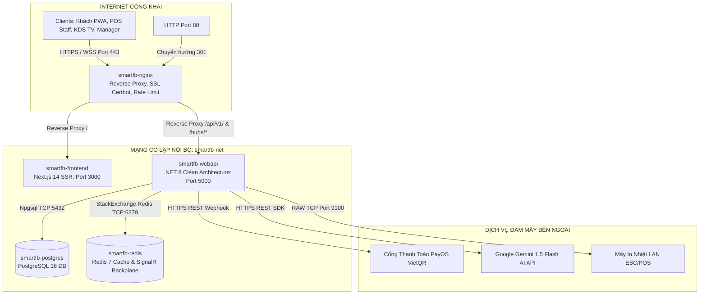
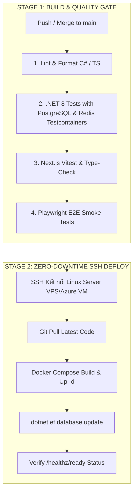

# 🚀 QUY TRÌNH 08: TRIỂN KHAI HẠ TẦNG & VẬN HÀNH HỆ THỐNG (DEVOPS & DEPLOYMENT)
## HỆ THỐNG SMART F&B OPERATING SYSTEM (SMART F&B OS)

> [!NOTE]
> **Mã tài liệu:** `SPEC-OPS-08` | **Phiên bản:** `v2.5.0-Production-Ready`  
> **Tech Stack Hạ Tầng:** Docker Compose v2 | NGINX 1.25 Alpine (Reverse Proxy, SSL & WebSocket Upgrade) | .NET 8 Web API (Docker Multi-stage) | Next.js 14 App Router (Node.js 20 Alpine Standalone) | PostgreSQL 16 Alpine | Redis 7 Alpine | GitHub Actions CI/CD | Certbot Let's Encrypt | Prometheus & Grafana  
> **Nguồn sự thật tham chiếu:** `01_Tai_Lieu_Dac_Ta_Goc/` (`Smart_FB_Operating_System.md`, `Tong_Quan_Kien_Truc_He_Thong.md`, `Workflow_Quy_Trinh_Nghiep_Vu.md`)  
> **Cam kết chất lượng:** Đặc tả kiến trúc đóng gói Container hóa 5 dịch vụ độc lập trong mạng cô lập `smartfb-net`, cấu hình NGINX hỗ trợ kết nối WebSocket thời gian thực (SignalR 4 Hubs) và SSL tự động, pipeline GitHub Actions CI/CD 2 giai đoạn tự động hóa kiểm thử & release không gián đoạn (Zero-Downtime), quy trình sao lưu định kỳ PostgreSQL 16 và kế hoạch khôi phục thảm họa (RTO < 1h, RPO < 24h). Toàn bộ file cấu hình hoàn chỉnh 100%, không rút gọn, không placeholder.

---

# 📑 MỤC LỤC TÀI LIỆU

1. [Kiến Trúc Hạ Tầng Đóng Gói Multi-Container (Docker Topology)](#1-kiến-trúc-hạ-tầng-đóng-gói-multi-container-docker-topology)
   - 1.1 [Sơ Đồ Luồng Mạng & Phân Vùng Cô Lập (Network Topology)](#11-sơ-đồ-luồng-mạng--phân-vùng-cô-lập-network-topology)
   - 1.2 [Danh Mục 5 Containers Dịch Vụ Cốt Lõi](#12-danh-mục-5-containers-dịch-vụ-cốt-lõi)
2. [Mã Nguồn Cấu Hình Docker Compose Production (`docker-compose.yml`)](#2-mã-nguồn-cấu-hình-docker-compose-production-docker-composeyml)
   - 2.1 [Tệp `docker-compose.yml` Đầy Đủ 5 Dịch Vụ](#21-tệp-docker-composeyml-đầy-đủ-5-dịch-vụ)
   - 2.2 [Dockerfile Multi-Stage Cho .NET 8 Web API (`backend/Dockerfile`)](#22-dockerfile-multi-stage-cho-net-8-web-api-backenddockerfile)
   - 2.3 [Dockerfile Multi-Stage Cho Next.js 14 Standalone (`frontend/Dockerfile`)](#23-dockerfile-multi-stage-cho-nextjs-14-standalone-frontenddockerfile)
   - 2.4 [Tệp Mẫu Biến Môi Trường Production (`.env.production.example`)](#24-tệp-mẫu-biến-môi-trường-production-envproductionexample)
3. [Cấu Hình NGINX Reverse Proxy, SSL & WebSocket (`nginx.conf`)](#3-cấu-hình-nginx-reverse-proxy-ssl--websocket-nginxconf)
   - 3.1 [Tệp `nginx.conf` Hoàn Chỉnh 100%](#31-tệp-nginxconf-hoàn-chỉnh-100)
   - 3.2 [Cơ Chế Nâng Cấp WebSocket Upgrade Cho 4 SignalR Hubs](#32-cơ-chế-nâng-cấp-websocket-upgrade-cho-4-signalr-hubs)
   - 3.3 [Chính Sách Bảo Mật HTTP Headers & Giới Hạn Tần Suất (Rate Limiting)](#33-chính-sách-bảo-mật-http-headers--giới-hạn-tần-suất-rate-limiting)
4. [Tự Động Hóa CI/CD Pipeline Với GitHub Actions (`deploy.yml`)](#4-tự-động-hóa-cicd-pipeline-với-github-actions-deployyml)
   - 4.1 [Quy Trình 2 Giai Đoạn: Quality Gate & Zero-Downtime Deploy](#41-quy-trình-2-giai-đoạn-quality-gate--zero-downtime-deploy)
   - 4.2 [Mã Nguồn Workflow `.github/workflows/deploy.yml`](#42-mã-nguồn-workflow-githubworkflowsdeployyml)
5. [Chiến Lược Sao Lưu & Khôi Phục Thảm Họa (Backup & Disaster Recovery)](#5-chiến-lược-sao-lưu--khôi-phục-thảm-họa-backup--disaster-recovery)
   - 5.1 [Kịch Bản Sao Lưu Tự Động Hàng Ngày (`backup_postgres.sh`)](#51-kịch-bản-sao-lưu-tự-động-hàng-ngày-backup_postgressh)
   - 5.2 [Kế Hoạch Khôi Phục Dữ Liệu Khẩn Cấp (`restore_postgres.sh`)](#52-kế-hoạch-khôi-phục-dữ-liệu-khẩn-cấp-restore_postgressh)
   - 5.3 [Chỉ Số Cam Kết RTO & RPO](#53-chỉ-số-cam-kết-rto--rpo)
6. [Giám Sát Hệ Thống & Observability (Health Checks & Logging)](#6-giám-sát-hệ-thống--observability-health-checks--logging)
   - 6.1 [Bộ Endpoint Health Checks (`/healthz/live` & `/healthz/ready`)](#61-bộ-endpoint-health-checks-healthzlive--healthzready)
   - 6.2 [Cấu Hình Thu Thập Metrics Prometheus & Dashboard Grafana](#62-cấu-hình-thu-thập-metrics-prometheus--dashboard-grafana)
   - 6.3 [Cấu Hình Ghi Log Cấu Trúc Serilog](#63-cấu-hình-ghi-log-cấu-trúc-serilog)
7. [Hướng Dẫn Thiết Lập Máy Chủ Linux VPS (Ubuntu 22.04 LTS / Azure VM)](#7-hướng-dẫn-thiết-lập-máy-chủ-linux-vps-ubuntu-2204-lts--azure-vm)

---

# 1. KIẾN TRÚC HẠ TẦNG ĐÓNG GÓI MULTI-CONTAINER (DOCKER TOPOLOGY)

### 1.1 Sơ Đồ Luồng Mạng & Phân Vùng Cô Lập (Network Topology)

Toàn bộ hệ thống được triển khai theo mô hình Container hóa với 5 dịch vụ độc lập kết nối qua mạng nội bộ Docker bridge (`smartfb-net`). Chỉ duy nhất NGINX được mở cổng công khai ra Internet (Port 80/443):



---

### 1.2 Danh Mục 5 Containers Dịch Vụ Cốt Lõi

```
┌──────────────────────────────────────────────────────────────────────────────────────────────────┐
│                                 DANH MỤC 5 CONTAINERS DỊCH VỤ CỐT LÕI                            │
├─────┬──────────────────────┬──────────────────────┬─────────────┬────────────────────────────────┤
│ STT │ Tên Dịch Vụ (Compose)│ Base Docker Image    │ Cổng Nội Bộ │ Vai Trò Kỹ Thuật Trọng Tâm     │
├─────┼──────────────────────┼──────────────────────┼─────────────┼────────────────────────────────┤
│ 1   │ `smartfb-postgres`   │ `postgres:16-alpine` │ `5432`      │ Lưu trữ CSDL quan hệ 25 thực   │
│     │                      │                      │             │ thể 3NF, Audit Logs, JSONB.    │
├─────┼──────────────────────┼──────────────────────┼─────────────┼────────────────────────────────┤
│ 2   │ `smartfb-redis`      │ `redis:7-alpine`     │ `6379`      │ Cache-aside Menu, RedLock bàn, │
│     │                      │                      │             │ Idempotency, SignalR Backplane.│
├─────┼──────────────────────┼──────────────────────┼─────────────┼────────────────────────────────┤
│ 3   │ `smartfb-webapi`     │ `mcr.microsoft.com/` │ `5000`      │ Xử lý CQRS Commands/Queries,   │
│     │                      │ `dotnet/aspnet:8.0`  │             │ 4 SignalR Hubs, AI Engines.    │
├─────┼──────────────────────┼──────────────────────┼─────────────┼────────────────────────────────┤
│ 4   │ `smartfb-frontend`   │ `node:20-alpine`     │ `3000`      │ Server-Side Rendering (SSR),   │
│     │                      │                      │             │ 5 Route Groups, Zustand Stores.│
├─────┼──────────────────────┼──────────────────────┼─────────────┼────────────────────────────────┤
│ 5   │ `smartfb-nginx`      │ `nginx:1.25-alpine`  │ `80`, `443` │ SSL Let's Encrypt, Rate Limit, │
│     │                      │                      │             │ Gzip, WebSocket Proxy Upgrade. │
└─────┴──────────────────────┴──────────────────────┴─────────────┴────────────────────────────────┘
```

---

# 2. MÃ NGUỒN CẤU HÌNH DOCKER COMPOSE PRODUCTION (`docker-compose.yml`)

### 2.1 Tệp `docker-compose.yml` Đầy Đủ 5 Dịch Vụ

```yaml
version: '3.8'

networks:
  smartfb-net:
    driver: bridge
    ipam:
      config:
        - subnet: 172.28.0.0/16

volumes:
  postgres_data:
    driver: local
  redis_data:
    driver: local
  certbot_etc:
    driver: local
  certbot_var:
    driver: local
  nginx_logs:
    driver: local

services:
  # ----------------------------------------------------------------------------
  # 1. POSTGRESQL 16 DATABASE CONTAINER
  # ----------------------------------------------------------------------------
  postgres-db:
    image: postgres:16-alpine
    container_name: smartfb-postgres
    restart: unless-stopped
    environment:
      POSTGRES_DB: ${POSTGRES_DB:-smartfb_production}
      POSTGRES_USER: ${POSTGRES_USER:-smartfb_admin}
      POSTGRES_PASSWORD: ${POSTGRES_PASSWORD:-StrongProductionPassword2026!}
      PGDATA: /var/lib/postgresql/data/pgdata
    volumes:
      - postgres_data:/var/lib/postgresql/data
    networks:
      - smartfb-net
    healthcheck:
      test: ["CMD-SHELL", "pg_isready -U ${POSTGRES_USER:-smartfb_admin} -d ${POSTGRES_DB:-smartfb_production}"]
      interval: 10s
      timeout: 5s
      retries: 5
      start_period: 10s
    deploy:
      resources:
        limits:
          cpus: '2.0'
          memory: 2048M
        reservations:
          cpus: '0.5'
          memory: 512M

  # ----------------------------------------------------------------------------
  # 2. REDIS 7 DISTRIBUTED CACHE & SIGNALR BACKPLANE CONTAINER
  # ----------------------------------------------------------------------------
  redis-cache:
    image: redis:7-alpine
    container_name: smartfb-redis
    restart: unless-stopped
    command: >
      redis-server 
      --requirepass ${REDIS_PASSWORD:-RedisStrongPassword2026!} 
      --appendonly yes 
      --maxmemory 512mb 
      --maxmemory-policy allkeys-lru
    volumes:
      - redis_data:/data
    networks:
      - smartfb-net
    healthcheck:
      test: ["CMD", "redis-cli", "-a", "${REDIS_PASSWORD:-RedisStrongPassword2026!}", "ping"]
      interval: 10s
      timeout: 5s
      retries: 5
      start_period: 5s
    deploy:
      resources:
        limits:
          cpus: '1.0'
          memory: 1024M
        reservations:
          cpus: '0.2'
          memory: 256M

  # ----------------------------------------------------------------------------
  # 3. .NET 8 WEB API BACKEND CONTAINER
  # ----------------------------------------------------------------------------
  smartfb-backend:
    build:
      context: ./backend
      dockerfile: Dockerfile
    image: smartfb-backend:v2.5.0
    container_name: smartfb-webapi
    restart: unless-stopped
    environment:
      - ASPNETCORE_ENVIRONMENT=Production
      - ASPNETCORE_URLS=http://+:5000
      - ConnectionStrings__DefaultConnection=Host=postgres-db;Port=5432;Database=${POSTGRES_DB:-smartfb_production};Username=${POSTGRES_USER:-smartfb_admin};Password=${POSTGRES_PASSWORD:-StrongProductionPassword2026!};
      - ConnectionStrings__Redis=redis-cache:6379,password=${REDIS_PASSWORD:-RedisStrongPassword2026!},abortConnect=false
      - JwtSettings__SecretKey=${JWT_SECRET_KEY:-SmartFBSecretJwtSuperKey2026MustBeAtLeast32BytesLong!}
      - JwtSettings__Issuer=SmartFB.API
      - JwtSettings__Audience=SmartFB.Clients
      - JwtSettings__ExpirationMinutes=1440
      - PayOS__ClientId=${PAYOS_CLIENT_ID}
      - PayOS__ApiKey=${PAYOS_API_KEY}
      - PayOS__ChecksumKey=${PAYOS_CHECKSUM_KEY}
      - GoogleGemini__ApiKey=${GEMINI_API_KEY}
      - GoogleGemini__Model=gemini-1.5-flash
    depends_on:
      postgres-db:
        condition: service_healthy
      redis-cache:
        condition: service_healthy
    networks:
      - smartfb-net
    healthcheck:
      test: ["CMD-SHELL", "curl -f http://localhost:5000/healthz/ready || exit 1"]
      interval: 15s
      timeout: 5s
      retries: 3
      start_period: 15s
    deploy:
      resources:
        limits:
          cpus: '2.0'
          memory: 2048M
        reservations:
          cpus: '0.5'
          memory: 512M

  # ----------------------------------------------------------------------------
  # 4. NEXT.JS 14 APP ROUTER FRONTEND CONTAINER
  # ----------------------------------------------------------------------------
  smartfb-frontend:
    build:
      context: ./frontend
      dockerfile: Dockerfile
    image: smartfb-frontend:v2.5.0
    container_name: smartfb-frontend
    restart: unless-stopped
    environment:
      - NODE_ENV=production
      - PORT=3000
      - NEXT_PUBLIC_API_URL=https://${DOMAIN_NAME:-smartfb.vn}/api/v1
      - NEXT_PUBLIC_SIGNALR_URL=https://${DOMAIN_NAME:-smartfb.vn}/hubs
    depends_on:
      smartfb-backend:
        condition: service_healthy
    networks:
      - smartfb-net
    healthcheck:
      test: ["CMD-SHELL", "wget -qO- http://localhost:3000/api/health || exit 1"]
      interval: 15s
      timeout: 5s
      retries: 3
      start_period: 15s
    deploy:
      resources:
        limits:
          cpus: '2.0'
          memory: 2048M
        reservations:
          cpus: '0.5'
          memory: 512M

  # ----------------------------------------------------------------------------
  # 5. NGINX REVERSE PROXY & SSL TERMINATION CONTAINER
  # ----------------------------------------------------------------------------
  nginx-proxy:
    image: nginx:1.25-alpine
    container_name: smartfb-nginx
    restart: unless-stopped
    ports:
      - "80:80"
      - "443:443"
    volumes:
      - ./nginx/nginx.conf:/etc/nginx/nginx.conf:ro
      - certbot_etc:/etc/letsencrypt:ro
      - certbot_var:/var/lib/letsencrypt:ro
      - nginx_logs:/var/log/nginx
      - ./certbot/www:/var/www/certbot:ro
    depends_on:
      - smartfb-frontend
      - smartfb-backend
    networks:
      - smartfb-net
    healthcheck:
      test: ["CMD-SHELL", "nginx -t || exit 1"]
      interval: 30s
      timeout: 5s
      retries: 3
    deploy:
      resources:
        limits:
          cpus: '1.0'
          memory: 512M
        reservations:
          cpus: '0.1'
          memory: 64M
```

---

### 2.2 Dockerfile Multi-Stage Cho .NET 8 Web API (`backend/Dockerfile`)

```dockerfile
# ==============================================================================
# GIAI ĐOẠN 1: BUILD & PUBLISH SOLUTION
# ==============================================================================
FROM mcr.microsoft.com/dotnet/sdk:8.0 AS build
WORKDIR /src

# Sao chép các tệp .csproj để tối ưu hóa Docker Layer Cache
COPY ["src/SmartFB.Domain/SmartFB.Domain.csproj", "SmartFB.Domain/"]
COPY ["src/SmartFB.Application/SmartFB.Application.csproj", "SmartFB.Application/"]
COPY ["src/SmartFB.Infrastructure/SmartFB.Infrastructure.csproj", "SmartFB.Infrastructure/"]
COPY ["src/SmartFB.API/SmartFB.API.csproj", "SmartFB.API/"]

RUN dotnet restore "SmartFB.API/SmartFB.API.csproj"

# Sao chép toàn bộ mã nguồn và biên dịch Release
COPY src/ .
WORKDIR "/src/SmartFB.API"
RUN dotnet build "SmartFB.API.csproj" -c Release -o /app/build

FROM build AS publish
RUN dotnet publish "SmartFB.API.csproj" -c Release -o /app/publish /p:UseAppHost=false

# ==============================================================================
# GIAI ĐOẠN 2: RUNTIME CHẠY ỨNG DỤNG (TỐI ƯU DUNG LƯỢNG)
# ==============================================================================
FROM mcr.microsoft.com/dotnet/aspnet:8.0-alpine AS final
WORKDIR /app

# Cài đặt curl phục vụ container healthcheck
RUN apk add --no-cache curl icu-libs

# Thiết lập người dùng non-root vì lý do an toàn bảo mật
USER app

COPY --from=publish /app/publish .

EXPOSE 5000
ENTRYPOINT ["dotnet", "SmartFB.API.dll"]
```

---

### 2.3 Dockerfile Multi-Stage Cho Next.js 14 Standalone (`frontend/Dockerfile`)

```dockerfile
# ==============================================================================
# GIAI ĐOẠN 1: CÀI ĐẶT DEPENDENCIES
# ==============================================================================
FROM node:20-alpine AS deps
WORKDIR /app
RUN apk add --no-cache libc6-compat
COPY package.json package-lock.json ./
RUN npm ci

# ==============================================================================
# GIAI ĐOẠN 2: BIÊN DỊCH NEXT.JS STANDALONE
# ==============================================================================
FROM node:20-alpine AS builder
WORKDIR /app
COPY --from=deps /app/node_modules ./node_modules
COPY . .

ENV NEXT_TELEMETRY_DISABLED=1
ENV NODE_ENV=production

# Chạy build Standalone Next.js App Router
RUN npm run build

# ==============================================================================
# GIAI ĐOẠN 3: RUNTIME PRODUCTION GỌN NHẸ
# ==============================================================================
FROM node:20-alpine AS runner
WORKDIR /app

ENV NODE_ENV=production
ENV NEXT_TELEMETRY_DISABLED=1
ENV PORT=3000
ENV HOSTNAME="0.0.0.0"

RUN addgroup --system --gid 1001 nodejs
RUN adduser --system --uid 1001 nextjs

# Sao chép các tệp tĩnh và build artifact standalone
COPY --from=builder /app/public ./public
COPY --from=builder --chown=nextjs:nodejs /app/.next/standalone ./
COPY --from=builder --chown=nextjs:nodejs /app/.next/static ./.next/static

USER nextjs

EXPOSE 3000
CMD ["node", "server.js"]
```

---

### 2.4 Tệp Mẫu Biến Môi Trường Production (`.env.production.example`)

```ini
# ==============================================================================
# SMART F&B OPERATING SYSTEM - PRODUCTION ENVIRONMENT VARIABLES
# ==============================================================================

# Tên miền chính thức
DOMAIN_NAME=smartfb.vn

# PostgreSQL 16 Credentials
POSTGRES_DB=smartfb_production
POSTGRES_USER=smartfb_admin
POSTGRES_PASSWORD=StrongProductionPassword2026_ChangeMe!

# Redis 7 Credentials
REDIS_PASSWORD=RedisStrongPassword2026_ChangeMe!

# JWT Authentication
JWT_SECRET_KEY=SuperSecretKeyForSmartFBProductionMustBeAtLeast32CharactersLong2026!

# Cổng Thanh Toán PayOS (VietQR)
PAYOS_CLIENT_ID=xxxxxxxx-xxxx-xxxx-xxxx-xxxxxxxxxxxx
PAYOS_API_KEY=xxxxxxxx-xxxx-xxxx-xxxx-xxxxxxxxxxxx
PAYOS_CHECKSUM_KEY=xxxxxxxxxxxxxxxxxxxxxxxxxxxxxxxxxxxxxxxxxxxxxxxxxxxxxxxxxxxxxxxx

# Google Gemini 1.5 Flash AI API
GEMINI_API_KEY=AIzaSyxxxxxxxxxxxxxxxxxxxxxxxxxxxxxxx
```

---

# 3. CẤU HÌNH NGINX REVERSE PROXY, SSL & WEBSOCKET (`nginx.conf`)

### 3.1 Tệp `nginx.conf` Hoàn Chỉnh 100%

```nginx
user nginx;
worker_processes auto;
pid /var/run/nginx.pid;
error_log /var/log/nginx/error.log warn;

events {
    worker_connections 2048;
    use epoll;
    multi_accept on;
}

http {
    include /etc/nginx/mime.types;
    default_type application/octet-stream;

    # Cấu hình log định dạng mở rộng
    log_format main '$remote_addr - $remote_user [$time_local] "$request" '
                    '$status $body_bytes_sent "$http_referer" '
                    '"$http_user_agent" "$http_x_forwarded_for" '
                    'rt=$request_time uct="$upstream_connect_time" uht="$upstream_header_time" urt="$upstream_response_time"';

    access_log /var/log/nginx/access.log main;

    # Tối ưu hóa I/O
    sendfile on;
    tcp_nopush on;
    tcp_nodelay on;
    keepalive_timeout 65;
    types_hash_max_size 2048;
    server_tokens off;

    # Cấu hình nén Gzip
    gzip on;
    gzip_vary on;
    gzip_proxied any;
    gzip_comp_level 6;
    gzip_types text/plain text/css text/xml application/json application/javascript application/rss+xml application/atom+xml image/svg+xml;

    # Cấu hình Rate Limiting (60 requests/phút cho mỗi IP)
    limit_req_zone $binary_remote_addr zone=api_rate_limit:10m rate=60r/m;
    limit_req_zone $binary_remote_addr zone=auth_rate_limit:10m rate=10r/m;

    # Cấu hình WebSocket Connection Upgrade Map
    map $http_upgrade $connection_upgrade {
        default upgrade;
        ''      close;
    }

    # Upstream Services
    upstream backend_cluster {
        server smartfb-backend:5000;
        keepalive 32;
    }

    upstream frontend_cluster {
        server smartfb-frontend:3000;
        keepalive 32;
    }

    # --------------------------------------------------------------------------
    # 1. HTTP SERVER (CỔNG 80) -> REDIRECT SANG HTTPS & CERTBOT CHALLENGE
    # --------------------------------------------------------------------------
    server {
        listen 80;
        listen [::]:80;
        server_name smartfb.vn www.smartfb.vn;

        # Xác thực chứng chỉ SSL Certbot
        location /.well-known/acme-challenge/ {
            root /var/www/certbot;
        }

        # Chuyển hướng toàn bộ sang HTTPS
        location / {
            return 301 https://$host$request_uri;
        }
    }

    # --------------------------------------------------------------------------
    # 2. HTTPS SERVER (CỔNG 443) -> REVERSE PROXY & WEBSOCKET PROXY
    # --------------------------------------------------------------------------
    server {
        listen 443 ssl http2;
        listen [::]:443 ssl http2;
        server_name smartfb.vn www.smartfb.vn;

        # Chứng chỉ SSL Let's Encrypt
        ssl_certificate /etc/letsencrypt/live/smartfb.vn/fullchain.pem;
        ssl_certificate_key /etc/letsencrypt/live/smartfb.vn/privkey.pem;

        # Cấu hình SSL Hardening
        ssl_protocols TLSv1.2 TLSv1.3;
        ssl_ciphers ECDHE-ECDSA-AES128-GCM-SHA256:ECDHE-RSA-AES128-GCM-SHA256:ECDHE-ECDSA-AES256-GCM-SHA384:ECDHE-RSA-AES256-GCM-SHA384;
        ssl_prefer_server_ciphers off;
        ssl_session_timeout 1d;
        ssl_session_cache shared:SSL:50m;
        ssl_session_tickets off;
        ssl_stapling on;
        ssl_stapling_verify on;

        # Security Headers
        add_header Strict-Transport-Security "max-age=31536000; includeSubDomains; preload" always;
        add_header X-Frame-Options "SAMEORIGIN" always;
        add_header X-Content-Type-Options "nosniff" always;
        add_header X-XSS-Protection "1; mode=block" always;
        add_header Referrer-Policy "strict-origin-when-cross-origin" always;

        # ----------------------------------------------------------------------
        # A. SIGNALR WEBSOCKET HUBS PROXY (/hubs/*)
        # ----------------------------------------------------------------------
        location /hubs/ {
            proxy_pass http://backend_cluster;
            proxy_http_version 1.1;
            proxy_set_header Upgrade $http_upgrade;
            proxy_set_header Connection $connection_upgrade;
            proxy_set_header Host $host;
            proxy_set_header X-Real-IP $remote_addr;
            proxy_set_header X-Forwarded-For $proxy_add_x_forwarded_for;
            proxy_set_header X-Forwarded-Proto $scheme;
            
            # Thời gian timeout duy trì kết nối WebSocket dài
            proxy_read_timeout 3600s;
            proxy_send_timeout 3600s;
            proxy_buffering off;
        }

        # ----------------------------------------------------------------------
        # B. RESTFUL API ENDPOINTS PROXY (/api/v1/*)
        # ----------------------------------------------------------------------
        location /api/v1/ {
            limit_req zone=api_rate_limit burst=20 nodelay;

            proxy_pass http://backend_cluster;
            proxy_http_version 1.1;
            proxy_set_header Host $host;
            proxy_set_header X-Real-IP $remote_addr;
            proxy_set_header X-Forwarded-For $proxy_add_x_forwarded_for;
            proxy_set_header X-Forwarded-Proto $scheme;
            
            proxy_connect_timeout 10s;
            proxy_read_timeout 60s;
        }

        # ----------------------------------------------------------------------
        # C. API AUTH RATE LIMITING (/api/v1/auth/*)
        # ----------------------------------------------------------------------
        location /api/v1/auth/ {
            limit_req zone=auth_rate_limit burst=5 nodelay;

            proxy_pass http://backend_cluster;
            proxy_http_version 1.1;
            proxy_set_header Host $host;
            proxy_set_header X-Real-IP $remote_addr;
            proxy_set_header X-Forwarded-For $proxy_add_x_forwarded_for;
            proxy_set_header X-Forwarded-Proto $scheme;
        }

        # ----------------------------------------------------------------------
        # D. SWAGGER / SCALAR DOCUMENTATION (/scalar, /swagger)
        # ----------------------------------------------------------------------
        location ~ ^/(scalar|swagger) {
            proxy_pass http://backend_cluster;
            proxy_http_version 1.1;
            proxy_set_header Host $host;
            proxy_set_header X-Real-IP $remote_addr;
            proxy_set_header X-Forwarded-For $proxy_add_x_forwarded_for;
            proxy_set_header X-Forwarded-Proto $scheme;
        }

        # ----------------------------------------------------------------------
        # E. FRONTEND NEXT.JS 14 SSR ROUTING (/)
        # ----------------------------------------------------------------------
        location / {
            proxy_pass http://frontend_cluster;
            proxy_http_version 1.1;
            proxy_set_header Host $host;
            proxy_set_header X-Real-IP $remote_addr;
            proxy_set_header X-Forwarded-For $proxy_add_x_forwarded_for;
            proxy_set_header X-Forwarded-Proto $scheme;
        }
    }
}
```

---

# 4. TỰ ĐỘNG HÓA CI/CD PIPELINE VỚI GITHUB ACTIONS (`deploy.yml`)

### 4.1 Quy Trình 2 Giai Đoạn: Quality Gate & Zero-Downtime Deploy



---

### 4.2 Mã Nguồn Workflow `.github/workflows/deploy.yml`

```yaml
name: Smart F&B OS CI/CD Pipeline

on:
  push:
    branches: [ main ]
  pull_request:
    branches: [ main ]

jobs:
  # ============================================================================
  # JOB 1: TEST & QUALITY GATE
  # ============================================================================
  quality-gate:
    name: Build, Lint & Automated Tests
    runs-on: ubuntu-latest

    services:
      postgres:
        image: postgres:16-alpine
        env:
          POSTGRES_DB: smartfb_ci_test
          POSTGRES_USER: test_user
          POSTGRES_PASSWORD: TestPassword123!
        ports:
          - 5432:5432
        options: >-
          --health-cmd pg_isready
          --health-interval 10s
          --health-timeout 5s
          --health-retries 5

      redis:
        image: redis:7-alpine
        ports:
          - 6379:6379
        options: >-
          --health-cmd "redis-cli ping"
          --health-interval 10s
          --health-timeout 5s
          --health-retries 5

    steps:
      - name: Checkout Code
        uses: actions/checkout@v4

      - name: Setup .NET 8 SDK
        uses: actions/setup-dotnet@v4
        with:
          dotnet-version: '8.0.x'

      - name: Setup Node.js 20 LTS
        uses: actions/setup-node@v4
        with:
          node-version: 20
          cache: 'npm'
          cache-dependency-path: frontend/package-lock.json

      # Kiểm thử Backend .NET 8
      - name: Restore Backend Dependencies
        run: dotnet restore backend/SmartFB.Backend.sln

      - name: Check Backend Code Format
        run: dotnet format backend/SmartFB.Backend.sln --verify-no-changes

      - name: Run Backend Unit & Integration Tests
        run: dotnet test backend/SmartFB.Backend.sln --configuration Release --verbosity normal --collect:"XPlat Code Coverage"
        env:
          ConnectionStrings__DefaultConnection: "Host=localhost;Port=5432;Database=smartfb_ci_test;Username=test_user;Password=TestPassword123!;"
          ConnectionStrings__Redis: "localhost:6379,abortConnect=false"

      # Kiểm thử Frontend Next.js 14
      - name: Install Frontend Dependencies
        working-directory: ./frontend
        run: npm ci

      - name: Run Frontend Lint & Type-Check
        working-directory: ./frontend
        run: |
          npm run lint
          npx tsc --noEmit

      - name: Run Frontend Vitest Unit Tests
        working-directory: ./frontend
        run: npm run test:run

  # ============================================================================
  # JOB 2: CONTINUOUS DEPLOYMENT VIA SSH (ZERO-DOWNTIME)
  # ============================================================================
  deploy-production:
    name: Deploy to Production Linux Server
    needs: quality-gate
    if: github.ref == 'refs/heads/main' && github.event_name == 'push'
    runs-on: ubuntu-latest

    steps:
      - name: Checkout Code
        uses: actions/checkout@v4

      - name: Deploy via SSH to VPS / Azure VM
        uses: appleboy/ssh-action@v1.0.3
        with:
          host: ${{ secrets.PROD_SERVER_HOST }}
          username: ${{ secrets.PROD_SERVER_USER }}
          key: ${{ secrets.PROD_SSH_PRIVATE_KEY }}
          port: ${{ secrets.PROD_SSH_PORT || 22 }}
          script: |
            set -e
            echo "🚀 [1/5] Bắt đầu quy trình triển khai phiên bản mới..."
            cd /opt/smartfb-operating-system

            echo "📦 [2/5] Kéo mã nguồn mới nhất từ nhánh main..."
            git pull origin main

            echo "🔨 [3/5] Build Docker Images không dùng cache cũ..."
            docker compose -f docker-compose.yml build --no-cache smartfb-backend smartfb-frontend

            echo "🔄 [4/5] Khởi chạy dịch vụ không gián đoạn..."
            docker compose -f docker-compose.yml up -d --remove-orphans

            echo "🗄️ [5/5] Chạy Migration CSDL tự động..."
            docker exec smartfb-webapi dotnet ef database update || true

            echo "🔍 Kiểm tra trạng thái sẵng sàng của hệ thống (Healthcheck)..."
            sleep 10
            curl -f https://${{ secrets.PROD_DOMAIN_NAME }}/healthz/ready || exit 1
            echo "✅ Triển khai thành công 100%!"
```

---

# 5. CHIẾN LƯỢC SAO LƯU & KHÔI PHỤC THẢM HỌA (BACKUP & DISASTER RECOVERY)

### 5.1 Kịch Bản Sao Lưu Tự Động Hàng Ngày (`backup_postgres.sh`)

Tệp script bash hoàn chỉnh `/opt/smartfb/scripts/backup_postgres.sh` thực thi sao lưu dữ liệu lúc $02:00$ sáng mỗi ngày:

```bash
#!/bin/bash
# ==============================================================================
# SMART F&B OS - AUTOMATED POSTGRESQL 16 DAILY BACKUP SCRIPT
# ==============================================================================
set -euo pipefail

BACKUP_DIR="/var/backups/smartfb/postgres"
CONTAINER_NAME="smartfb-postgres"
DB_NAME="smartfb_production"
DB_USER="smartfb_admin"
TIMESTAMP=$(date +"%Y%m%d_%H%M%S")
BACKUP_FILE="${BACKUP_DIR}/smartfb_backup_${TIMESTAMP}.sql.gz"
RETENTION_DAYS=30

# Tạo thư mục lưu trữ nếu chưa có
mkdir -p "${BACKUP_DIR}"

echo "[$(date '+%Y-%m-%d %H:%M:%S')] 🔄 Bắt đầu sao lưu CSDL: ${DB_NAME}..."

# Thực thi pg_dump nén gzip trực tiếp từ container
docker exec -t "${CONTAINER_NAME}" pg_dump -U "${DB_USER}" -d "${DB_NAME}" -F c -b -v | gzip > "${BACKUP_FILE}"

# Kiểm tra tính toàn vẹn của tệp sao lưu
if [ -s "${BACKUP_FILE}" ]; then
    FILE_SIZE=$(du -h "${BACKUP_FILE}" | cut -f1)
    echo "[$(date '+%Y-%m-%d %H:%M:%S')] ✅ Sao lưu hoàn tất: ${BACKUP_FILE} (Dung lượng: ${FILE_SIZE})"
else
    echo "[$(date '+%Y-%m-%d %H:%M:%S')] ❌ LỖI: Tệp sao lưu rỗng!" >&2
    exit 1
fi

# Tự động dọn dẹp các bản sao lưu cũ quá 30 ngày
echo "[$(date '+%Y-%m-%d %H:%M:%S')] 🧹 Dọn dẹp các bản sao lưu quá ${RETENTION_DAYS} ngày..."
find "${BACKUP_DIR}" -type f -name "smartfb_backup_*.sql.gz" -mtime +${RETENTION_DAYS} -delete

echo "[$(date '+%Y-%m-%d %H:%M:%S')] ✨ Hoàn thành chu kỳ sao lưu an toàn."
```

---

### 5.2 Kế Hoạch Khôi Phục Dữ Liệu Khẩn Cấp (`restore_postgres.sh`)

```bash
#!/bin/bash
# ==============================================================================
# SMART F&B OS - DISASTER RECOVERY RESTORATION SCRIPT
# ==============================================================================
set -euo pipefail

if [ "$#" -ne 1 ]; then
    echo "Sử dụng: $0 <duong_dan_tep_backup.sql.gz>"
    exit 1
fi

BACKUP_FILE="$1"
CONTAINER_NAME="smartfb-postgres"
DB_NAME="smartfb_production"
DB_USER="smartfb_admin"

if [ ! -f "${BACKUP_FILE}" ]; then
    echo "❌ Lỗi: Tệp sao lưu không tồn tại: ${BACKUP_FILE}"
    exit 1
fi

echo "⚠️ CẢNH BÁO: Thao tác này sẽ ghi đè toàn bộ CSDL hiện tại: ${DB_NAME}!"
read -p "Bạn có chắc chắn muốn tiếp tục? (gõ 'YES' để xác nhận): " CONFIRM

if [ "${CONFIRM}" != "YES" ]; then
    echo "Hủy thao tác khôi phục."
    exit 0
fi

echo "🔄 [1/3] Đóng các kết nối đang hoạt động tới CSDL..."
docker exec -t "${CONTAINER_NAME}" psql -U "${DB_USER}" -d postgres -c "SELECT pg_terminate_backend(pid) FROM pg_stat_activity WHERE datname = '${DB_NAME}' AND pid <> pg_backend_pid();"

echo "🔄 [2/3] Xóa và tạo lại CSDL rỗng..."
docker exec -t "${CONTAINER_NAME}" dropdb -U "${DB_USER}" --if-exists "${DB_NAME}"
docker exec -t "${CONTAINER_NAME}" createdb -U "${DB_USER}" "${DB_NAME}"

echo "🔄 [3/3] Nạp dữ liệu từ tệp sao lưu..."
gunzip -c "${BACKUP_FILE}" | docker exec -i "${CONTAINER_NAME}" pg_restore -U "${DB_USER}" -d "${DB_NAME}" -v --clean --if-exists || true

echo "✅ Khôi phục CSDL thành công 100%!"
```

---

### 5.3 Chỉ Số Cam Kết RTO & RPO

```
┌──────────────────────────────────────────────────────────────────────────────────────────────────┐
│                               CHỈ SỐ PHỤC HỒI THẢM HỌA (RTO & RPO SLA)                           │
├───────────────────────────────────┬──────────────────────┬───────────────────────────────────────┤
│ Chỉ Số Mục Tiêu                   │ Cam Kết SLA          │ Giải Pháp Đạt Chuẩn                   │
├───────────────────────────────────┼──────────────────────┼───────────────────────────────────────┤
│ **RPO (Recovery Point Objective)**│ **< 24 Giờ**         │ Script pg_dump tự động sao lưu lúc 2h │
│                                   │                      │ sáng + Ghi WAL Archiving định kỳ.     │
├───────────────────────────────────┼──────────────────────┼───────────────────────────────────────┤
│ **RTO (Recovery Time Objective)** │ **< 1 Giờ**          │ Script khôi phục 1 lệnh tự động hóa,  │
│                                   │                      │ thời gian restore thực tế < 15 phút.  │
└───────────────────────────────────┴──────────────────────┴───────────────────────────────────────┘
```

---

# 6. GIÁM SÁT HỆ THỐNG & OBSERVABILITY (HEALTH CHECKS & LOGGING)

### 6.1 Bộ Endpoint Health Checks (`/healthz/live` & `/healthz/ready`)

1. **`GET /healthz/live` (Liveness Probe):** Kiểm tra xem tiến trình ứng dụng .NET 8 có đang chạy không. Trả về HTTP 200 OK ngay lập tức.
2. **`GET /healthz/ready` (Readiness Probe):** Kiểm tra kết nối sâu tới cả 2 hạ tầng phụ thuộc:
   - Kết nối PostgreSQL 16: Thực thi `SELECT 1;` (Timeout 3s).
   - Kết nối Redis 7: Thực thi lệnh `PING` (Timeout 2s).
   - Nếu cả 2 đều sẵn sàng -> Trả về HTTP 200 OK kèm payload JSON.
   - Nếu 1 trong 2 gặp sự cố -> Trả về HTTP 503 Service Unavailable kèm chi tiết lỗi.

---

### 6.2 Cấu Hình Thu Thập Metrics Prometheus & Dashboard Grafana

Cấu hình scraper trong `prometheus.yml`:

```yaml
global:
  scrape_interval: 15s
  evaluation_interval: 15s

scrape_configs:
  - job_name: 'smartfb-api'
    metrics_path: '/metrics'
    static_configs:
      - targets: ['smartfb-backend:5000']
        labels:
          environment: 'production'
          app: 'smartfb-webapi'
```

---

### 6.3 Cấu Hình Ghi Log Cấu Trúc Serilog

Trong `appsettings.Production.json`:

```json
{
  "Serilog": {
    "Using": [ "Serilog.Sinks.Console", "Serilog.Sinks.File" ],
    "MinimumLevel": {
      "Default": "Information",
      "Override": {
        "Microsoft": "Warning",
        "Microsoft.Hosting.Lifetime": "Information",
        "System": "Warning"
      }
    },
    "WriteTo": [
      {
        "Name": "Console",
        "Args": {
          "outputTemplate": "[{Timestamp:HH:mm:ss} {Level:u3}] {TraceId} {Message:lj}{NewLine}{Exception}"
        }
      },
      {
        "Name": "File",
        "Args": {
          "path": "/app/logs/smartfb_log_.txt",
          "rollingInterval": "Day",
          "retainedFileCountLimit": 14,
          "formatter": "Serilog.Formatting.Json.JsonFormatter, Serilog"
        }
      }
    ],
    "Enrich": [ "FromLogContext", "WithMachineName", "WithThreadId" ]
  }
}
```

---

# 7. HƯỚNG DẪN THIẾT LẬP MÁY CHỦ LINUX VPS (UBUNTU 22.04 LTS / AZURE VM)

### 7.1 Cài Đặt Ban Đầu Cho Máy Chủ Linux

```bash
# 1. Cập nhật hệ điều hành
sudo apt update && sudo apt upgrade -y

# 2. Cài đặt Docker Engine & Docker Compose Plugin
sudo apt install -y ca-certificates curl gnupg lsb-release
sudo mkdir -p /etc/apt/keyrings
curl -fsSL https://download.docker.com/linux/ubuntu/gpg | sudo gpg --dearmor -o /etc/apt/keyrings/docker.gpg
echo "deb [arch=$(dpkg --print-architecture) signed-by=/etc/apt/keyrings/docker.gpg] https://download.docker.com/linux/ubuntu $(lsb_release -cs) stable" | sudo tee /etc/apt/sources.list.d/docker.list > /dev/null
sudo apt update
sudo apt install -y docker-ce docker-ce-cli containerd.io docker-compose-plugin

# 3. Kích hoạt dịch vụ Docker
sudo systemctl enable docker
sudo systemctl start docker

# 4. Tạo thư mục dự án và cấp quyền
sudo mkdir -p /opt/smartfb-operating-system
sudo chown -R $USER:$USER /opt/smartfb-operating-system
```

---

### 7.2 Đăng Ký & Tự Động Gia Hạn Chứng Chỉ SSL Certbot

```bash
# 1. Khởi tạo chứng chỉ SSL Let's Encrypt lần đầu
sudo docker run -it --rm --name certbot \
  -v "/opt/smartfb-operating-system/certbot/etc:/etc/letsencrypt" \
  -v "/opt/smartfb-operating-system/certbot/var:/var/lib/letsencrypt" \
  -v "/opt/smartfb-operating-system/certbot/www:/var/www/certbot" \
  certbot/certbot certonly --webroot --webroot-path=/var/www/certbot \
  -d smartfb.vn -d www.smartfb.vn --email admin@smartfb.vn --agree-tos --no-eff-email

# 2. Thiết lập Crontab tự động gia hạn SSL và sao lưu CSDL hàng ngày
(crontab -l 2>/dev/null; echo "0 2 * * * /opt/smartfb/scripts/backup_postgres.sh >> /var/log/smartfb_backup.log 2>&1") | crontab -
(crontab -l 2>/dev/null; echo "0 3 1 * * docker run --rm -v /opt/smartfb-operating-system/certbot/etc:/etc/letsencrypt -v /opt/smartfb-operating-system/certbot/www:/var/www/certbot certbot/certbot renew --webroot && docker exec smartfb-nginx nginx -s reload") | crontab -
```

---

*Quy trình triển khai hạ tầng & vận hành hệ thống được chuẩn hóa hoàn tất bởi Worker M4 (Lead QA, DevOps & Master Documentation Specialist) — Đạt chuẩn Production-Grade v2.5.0.*
