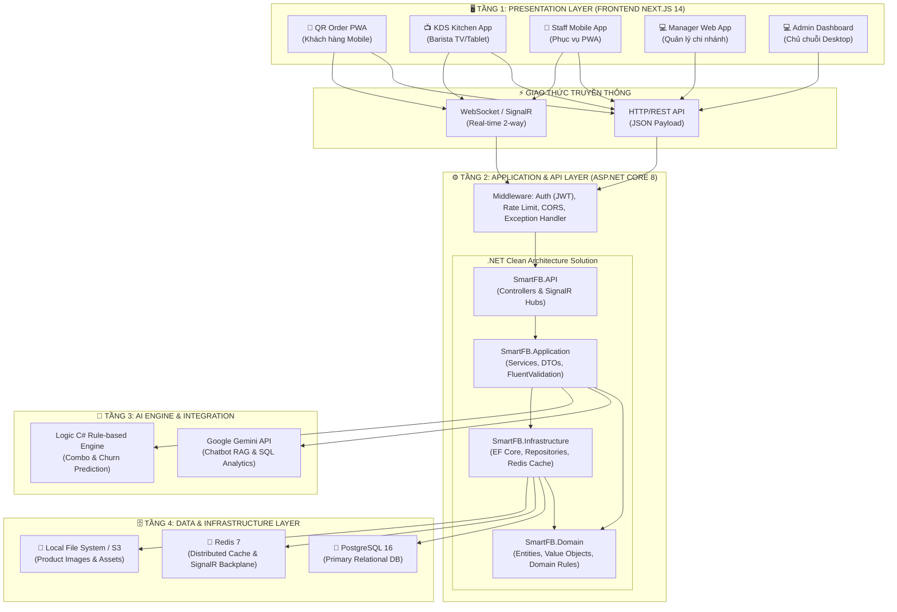
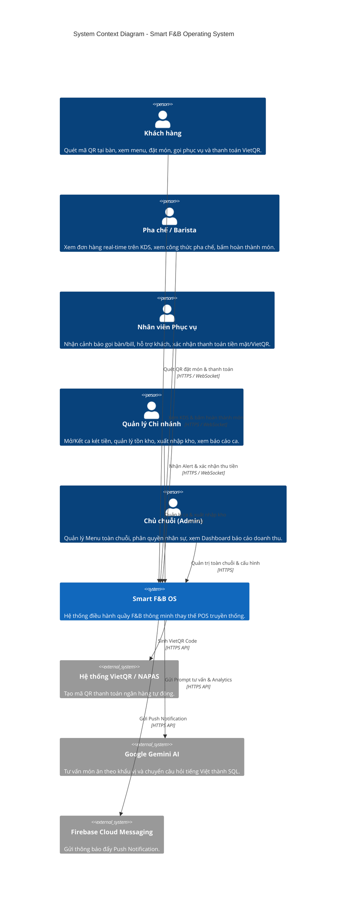
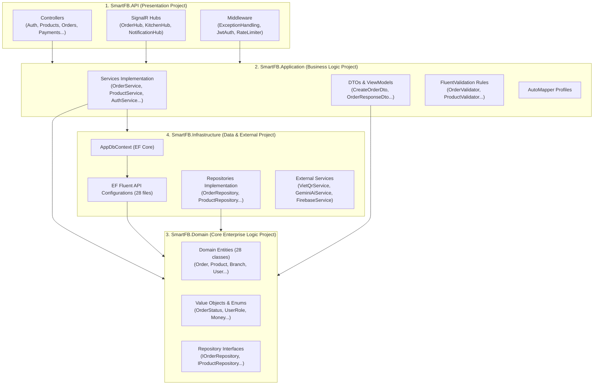

# 🏗️ SƠ ĐỒ KIẾN TRÚC HỆ THỐNG TỔNG QUAN (SYSTEM ARCHITECTURE)

> **Dự án:** Smart F&B Operating System  
> **Kiến trúc:** 4-Tier Clean Architecture Monolith + Real-time SignalR + AI Engine Integration

---

## 1. SƠ ĐỒ KIẾN TRÚC 4 TẦNG (HIGH-LEVEL ARCHITECTURE DIAGRAM)



---

## 2. SƠ ĐỒ C4 LEVEL 1: SYSTEM CONTEXT DIAGRAM



---

## 3. SƠ ĐỒ C4 LEVEL 2: CONTAINER DIAGRAM

```mermaid
C4Container
    title Container Diagram - Smart F&B Operating System

    Person(user, "Người dùng hệ thống", "Khách, Barista, Staff, Manager, Admin")

    ContainerBoundary(frontend_b, "Frontend Applications (Next.js 14)") {
        Container(customer_app, "Customer QR PWA", "Next.js 14 / React", "Giao diện PWA mobile-first cho khách hàng đặt món")
        Container(kds_app, "KDS Kitchen App", "Next.js 14 / React", "Màn hình TV/Tablet full-screen hiển thị đơn hàng Bếp")
        Container(admin_app, "Admin & Manager Dashboard", "Next.js 14 / React", "Giao diện Web Desktop/Responsive quản trị hệ thống")
    }

    ContainerBoundary(backend_b, "Backend System (.NET 8)") {
        Container(web_api, "ASP.NET Core Web API", "C# / .NET 8", "Cung cấp 45+ RESTful APIs xác thực, đơn hàng, kho, báo cáo")
        Container(signalr_hub, "SignalR Real-time Hubs", "C# / SignalR", "Quản lý kết nối WebSocket 2 chiều phát đơn hàng tức thì")
    }

    ContainerBoundary(ai_b, "AI Engine") {
        Container(ai_service, "Gemini Integration Service", "C# / Google AI SDK", "Xử lý RAG Chatbot gợi ý món & Text-to-SQL Analytics")
    }

    ContainerBoundary(data_b, "Data Layer (Docker Containers)") {
        ContainerDb(database, "PostgreSQL Database", "PostgreSQL 16", "Lưu trữ toàn bộ dữ liệu 28 bảng relational")
        ContainerDb(cache, "Redis Cache", "Redis 7", "Lưu Session, Distributed Cache & SignalR Backplane")
    }

    Rel(user, customer_app, "Sử dụng trình duyệt Mobile", "HTTPS")
    Rel(user, kds_app, "Sử dụng màn hình TV/Tablet", "HTTPS")
    Rel(user, admin_app, "Sử dụng Laptop/Desktop", "HTTPS")

    Rel(customer_app, web_api, "Gọi REST API", "HTTPS/JSON")
    Rel(customer_app, signalr_hub, "Lắng nghe tiến trình đơn", "WebSocket")

    Rel(kds_app, web_api, "Gọi REST API", "HTTPS/JSON")
    Rel(kds_app, signalr_hub, "Nhận đơn mới tức thì", "WebSocket")

    Rel(admin_app, web_api, "Gọi REST API", "HTTPS/JSON")

    Rel(web_api, ai_service, "Gửi Prompt & Context", "Internal Call")
    Rel(web_api, database, "Đọc/Ghi dữ liệu (EF Core)", "TCP/IP")
    Rel(web_api, cache, "Cache & Session Store", "TCP/IP")
    Rel(signalr_hub, cache, "Pub/Sub Backplane", "TCP/IP")
```

---

## 4. SƠ ĐỒ COMPONENT CLEAN ARCHITECTURE (.NET 8)


