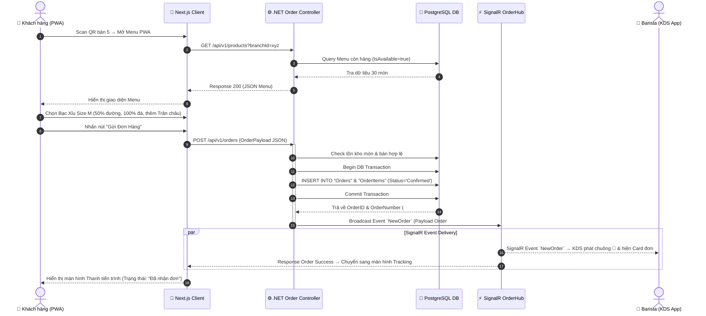
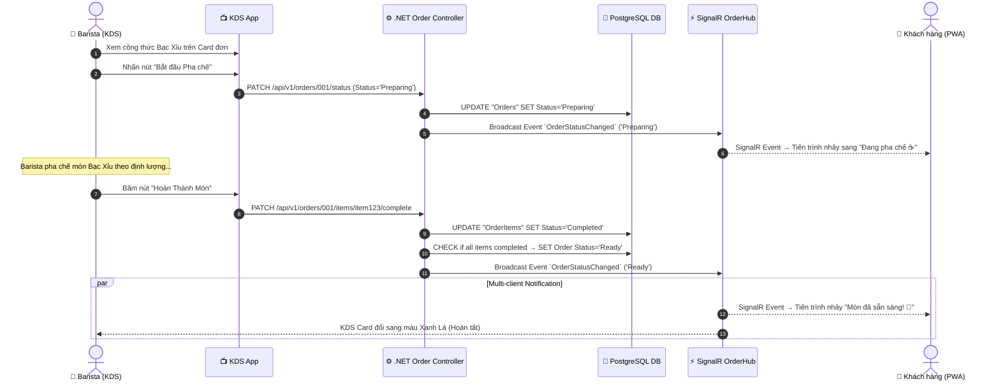
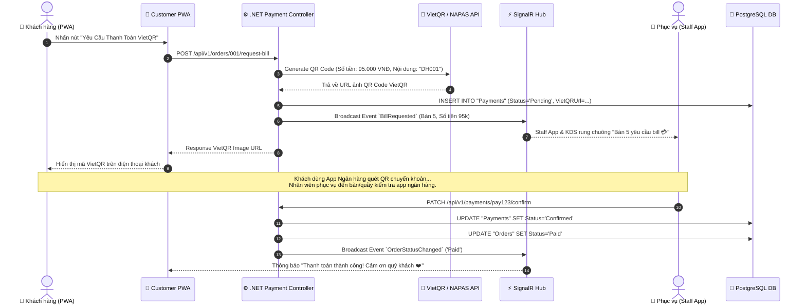
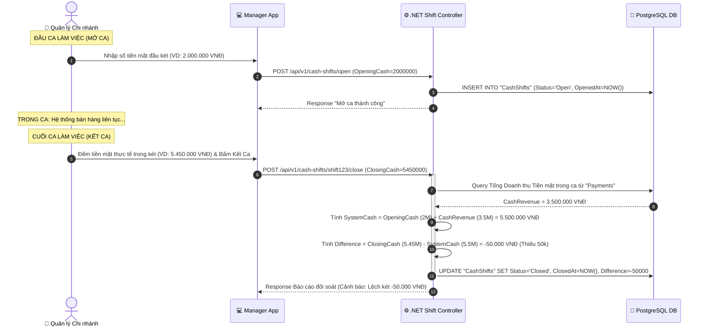
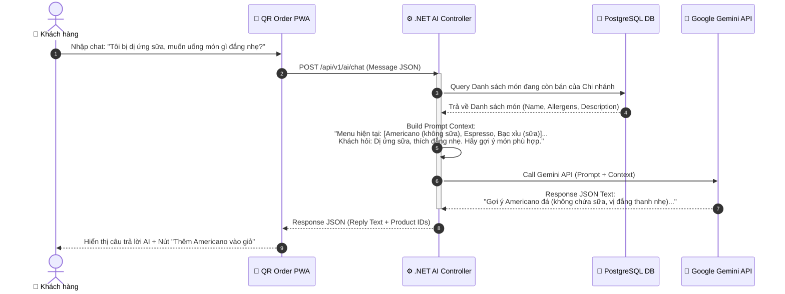

# 🔄 SƠ ĐỒ LUỒNG DỮ LIỆU & SEQUENCE DIAGRAMS

> **Dự án:** Smart F&B Operating System  
> **Mô tả:** Chi tiết các luồng tương tác giữa Khách hàng, Hệ thống, Bếp (KDS), Nhân viên và AI Engine qua Sequence Diagrams.

---

## 1. SEQUENCE DIAGRAM 1: KHÁCH ĐẶT MÓN QR & SIGNALR BROADCAST TỚI KDS BẾP (WF-01 & WF-02)

---

## 2. SEQUENCE DIAGRAM 2: BARISTA PHA CHẾ & HOÀN THÀNH MÓN (KDS ➔ KHÁCH)

---

## 3. SEQUENCE DIAGRAM 3: KHÁCH YÊU CẦU BILL & THÀNH TOÁN VIETQR (WF-01)

---

## 4. SEQUENCE DIAGRAM 4: MỞ CA / KẾT CA KÉT TIỀN & ĐỐI SOÁT (WF-08)

---

## 5. SEQUENCE DIAGRAM 5: AI CHATBOT GỢI Ý MÓN ĂN (GEMINI INTEGRATION)

