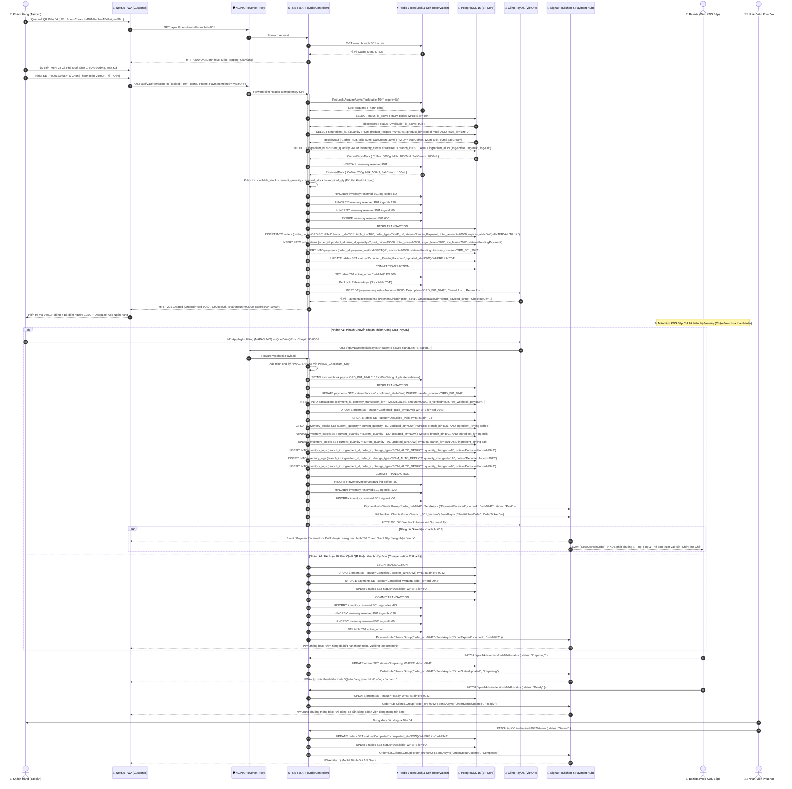
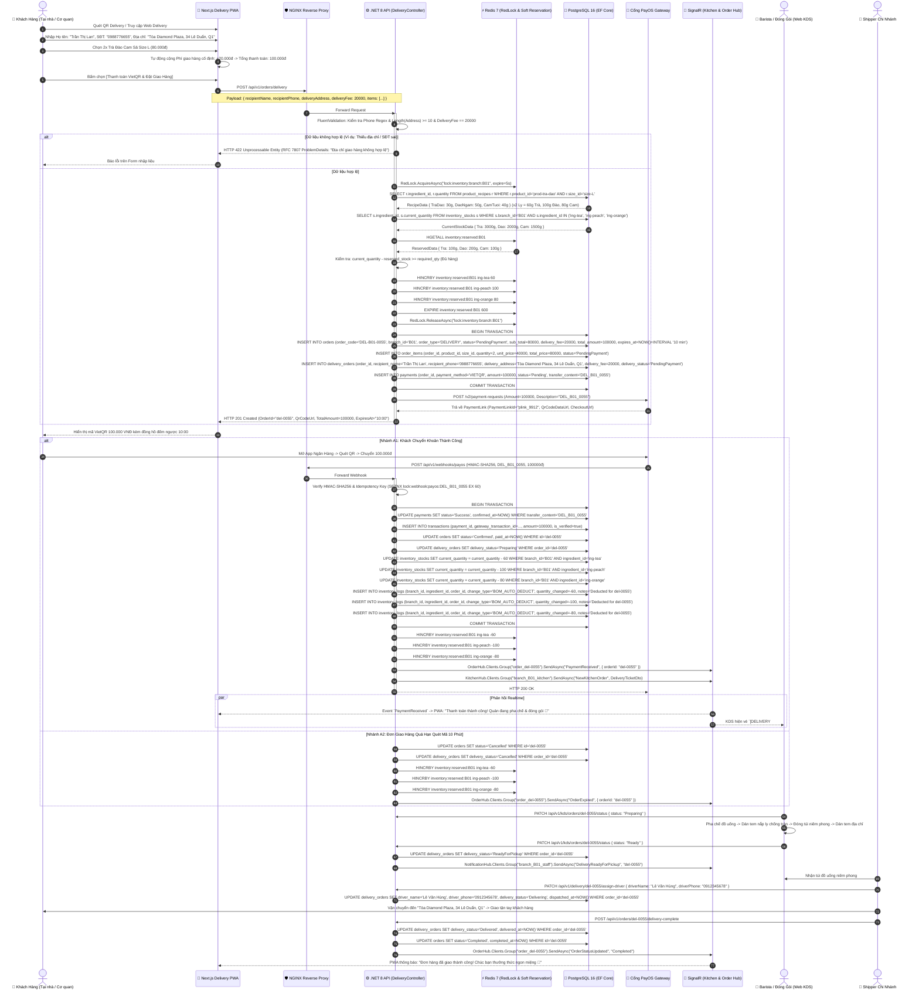
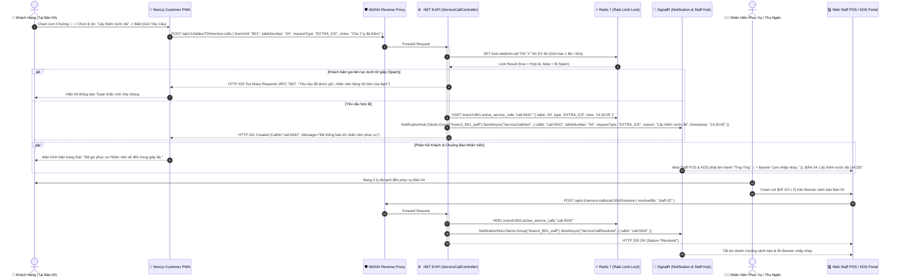

# 🔄 SƠ ĐỒ TUẦN TỰ TOÀN DIỆN (SEQUENCE DIAGRAMS SPECIFICATION)
## SMART F&B OPERATING SYSTEM — 10 CORE ARCHITECTURAL FLOWS

> [!NOTE]
> **Mã tài liệu:** `SPEC-SEQ-02` | **Phiên bản:** `v2.5.0-Production-Ready`  
> **Hệ thống:** Smart F&B Operating System (Smart F&B OS) — Nền tảng F&B Chuỗi Đa Chi Nhánh  
> **Kiến trúc nền tảng:** .NET 8 Web API Clean Architecture & CQRS + Next.js 14 App Router + PostgreSQL 16 Enterprise (31 Bảng Chuẩn 3NF) + Redis 7 (RedLock Khóa Phân Tán & Soft Inventory Reservation) + SignalR WebSockets (4 Hubs Chuyên Biệt) + PayOS VietQR Gateway + Google Gemini 1.5 Flash AI  
> **Tiêu chuẩn thiết kế:** 100% Cú pháp Mermaid `sequenceDiagram`, Zero Placeholders, đặc tả chi tiết giao thức RESTful (Payloads, Status Codes, RFC 7807), WebSockets Real-time Hubs, Khóa phân tán RedLock, HMAC-SHA256 Webhook Ingestion, cơ chế Soft Inventory Reservation (chống Overselling giờ cao điểm), và cơ chế Rollback/Idempotency.

---

# 📑 MỤC LỤC 10 SƠ ĐỒ TUẦN TỰ HỆ THỐNG

1. [Seq-01: Quy Trình Gọi Món Tại Bàn (Dine-In) — Nhánh A: Trả Trước Qua VietQR (Soft Inventory Reservation, PayOS Webhook & SignalR KDS Push)](#1-seq-01-quy-trình-gọi-món-tại-bàn-dine-in--nhánh-a-trả-trước-qua-vietqr)
2. [Seq-02: Quy Trình Gọi Món Tại Bàn (Dine-In) — Nhánh B: Trả Sau (Tiền Mặt / Quét QR In Trên Bill Tại Quầy POS)](#2-seq-02-quy-trình-gọi-món-tại-bàn-dine-in--nhánh-b-trả-sau-tiền-mặt--quét-qr-bill)
3. [Seq-03: Quy Trình Đặt Món Giao Hàng (QR Delivery) — Phí Ship 20.000 VNĐ, Soft Inventory Reservation & 100% VietQR Trả Trước](#3-seq-03-quy-trình-đặt-món-giao-hàng-qr-delivery--phí-ship-20k--100-vietqr)
4. [Seq-04: Quy Trình Bán Hàng Mang Đi (Takeaway Web POS) — Tích Điểm CRM 10 Ly Tặng 1 & In Hóa Đơn](#4-seq-04-quy-trình-bán-hàng-mang-đi-takeaway-web-pos--tích-điểm-10-ly)
5. [Seq-05: Quy Trình Chấm Công Nhân Viên Khóa WiFi — Xác Thực Kép BSSID Router & IP Subnet Chi Nhánh](#5-seq-05-quy-trình-chấm-công-nhân-viên-khóa-wifi--xác-thực-bssid--ip-subnet)
6. [Seq-06: Quy Trình Xử Lý Đơn Bếp (KDS), Khấu Trừ Định Lượng BOM Theo Gam/Ml & Công Tắc 86-Toggle Khóa Món](#6-seq-06-quy-trình-xử-lý-đơn-bếp-kds-khấu-trừ-bom--công-tắc-86-toggle)
7. [Seq-07: Quy Trình Gọi Phục Vụ Tại Bàn & Tiếp Nhận Chuông Báo Thời Gian Thực Qua SignalR](#7-seq-07-quy-trình-gọi-phục-vụ-tại-bàn--tiếp-nhận-chuông-báo-signalr)
8. [Seq-08: Quy Trình Đánh Giá 1-5 Sao, Phân Tích Cảm Xúc Gemini AI & Kích Hoạt Red Alert Quản Lý (Rating <= 2)](#8-seq-08-quy-trình-đánh-giá-1-5-sao-ai-sentiment--kích-hoạt-red-alert)
9. [Seq-09: Quy Trình Mở Ca, Kết Ca & Đối Soát Doanh Thu Z-Report (Bắt Buộc Giải Trình Chênh Lệch > 50k)](#9-seq-09-quy-trình-mở-ca-kết-ca--đối-soát-z-report-giải-trình-chênh-lệch)
10. [Seq-10: Quy Trình Quản Trị Viên (Admin Operations) — CRUD Menu/BOM, Menu Mùa Vụ & Phê Duyệt AI-2 Combo](#10-seq-10-quy-trình-quản-trị-admin--crud-menubom-menu-mùa--ai-2-combo-apriori)

---

## 🏛️ BẢNG TỔNG HỢP CÁC THÀNH PHẦN THAM GIA (SYSTEM PARTICIPANTS)

| Ký hiệu Participant | Loại hình | Trách nhiệm kiến trúc & Công nghệ |
|---|---|---|
| `👤 Khách Hàng / Nhân Sự` | **Actor** | Người dùng tương tác trực tiếp (Thực khách, Thu ngân, Barista, Quản lý, Chủ chuỗi). |
| `📱 Next.js Web App` | **Boundary (Client)** | Ứng dụng Frontend Next.js 14 App Router (Customer PWA, Web POS, Web KDS, Manager/Admin Portal). |
| `🛡️ NGINX Reverse Proxy` | **Ingress Gateway** | Điều phối tải, chấm dứt SSL/TLS Let's Encrypt, trích xuất Header `X-Forwarded-For`, Rate Limiting. |
| `⚙️ .NET 8 API Controller` | **Control (Backend)** | ASP.NET Core 8 Web API, MediatR CQRS Command/Query Handlers, FluentValidation, Domain Services. |
| `⚡ Redis 7 (RedLock/Cache)` | **Distributed Cache & Lock** | Khóa phân tán RedLock, Bộ đếm Tồn kho Tạm giữ (Soft Reservation TTL 600s), Cache Menu, Rate Limiting. |
| `🐘 PostgreSQL 16 DB` | **Database (Storage)** | Cơ sở dữ liệu quan hệ chuẩn hóa 31 thực thể 3NF, lưu trữ giao dịch ACID qua Entity Framework Core 8. |
| `📡 SignalR Realtime Hubs` | **Realtime Transport** | 4 Hubs WebSockets chuyên biệt (`OrderHub`, `KitchenHub`, `PaymentHub`, `NotificationHub`) với Redis Backplane. |
| `🏦 Cổng PayOS (VietQR)` | **External Gateway** | Cổng thanh toán quốc gia VietQR, sinh mã QR động và gửi Webhook giao dịch kèm chữ ký HMAC-SHA256. |
| `🤖 Google Gemini 1.5 Flash` | **External AI Engine** | Xử lý ngôn ngữ tự nhiên (RAG Chatbot), phân tích cảm xúc đánh giá (Sentiment Analysis), dự báo nhu cầu. |
| `🖨️ Máy In Hóa Đơn (ESC/POS)` | **Hardware Device** | Máy in nhiệt tại quầy/bar in hóa đơn tạm tính, mã VietQR, tem dán ly và biên bản kết ca Z-Report. |

---

# 1. SEQ-01: QUY TRÌNH GỌI MÓN TẠI BÀN (DINE-IN) — NHÁNH A: TRẢ TRƯỚC QUA VIETQR

### 📌 Mô tả Nghiệp vụ (Business Context)
Khách hàng ngồi tại bàn, quét mã QR vật lý gắn trên bàn để mở thực đơn số PWA. Khách tùy biến đồ uống (Size, Mức đường, Mức đá, Topping), nhập số điện thoại tích điểm CRM và lựa chọn **"Thanh toán Chuyển khoản VietQR (Trả trước)"**. 
- **Cơ chế Khóa Phân Tán & Giữ Tồn Kho Tạm Thời (Soft Inventory Reservation):**
  1. Khi nhận yêu cầu tạo đơn, Backend sử dụng RedLock khóa tài nguyên bàn (`lock:table:T04`) và kiểm tra tồn kho khả dụng (`available_stock = physical_stock - reserved_stock >= required_bom_qty`) dựa trên bảng `product_recipes` và `inventory_stocks`.
  2. Hệ thống tạm giữ số lượng nguyên liệu trong Redis (`HINCRBY inventory:reserved:{branch_id} {ingredient_id} {qty}` với TTL 600s) và đổi trạng thái bàn thành `Occupied_PendingPayment` trong DB/Redis để chặn tạo đơn trùng tại cùng 1 bàn.
  3. Đơn hàng khởi tạo ở trạng thái `PendingPayment` với thời hạn quét mã QR là 10 phút (`expires_at = NOW() + INTERVAL '10 min'`). Màn hình KDS quầy pha chế **TUYỆT ĐỐI CHƯA HIỂN THỊ** đơn hàng này.
- **Xử lý Webhook PayOS (HMAC-SHA256) & Khấu trừ Thực tế:**
  - Ngay khi PayOS gửi Webhook xác nhận thanh toán thành công (kèm chữ ký bảo mật HMAC-SHA256), hệ thống đổi trạng thái đơn sang `Confirmed` và `paid_at = NOW()`, khấu trừ trực tiếp tồn kho vật lý trong `inventory_stocks`, giải phóng `inventory:reserved` trong Redis, ghi nhật ký `inventory_logs`, và bắn sự kiện thời gian thực qua SignalR `KitchenHub` để KDS quầy bar phát chuông tiếp nhận pha chế.
- **Xử lý Quá hạn / Hủy đơn (Compensation Rollback):**
  - Nếu quá thời hạn 10 phút hoặc khách hủy đơn, worker tự động hủy đơn, giải phóng nguyên liệu tạm giữ trong Redis (`HINCRBY inventory:reserved -qty`) và mở khóa bàn về trạng thái `Available`.

---

# 2. SEQ-02: QUY TRÌNH GỌI MÓN TẠI BÀN (DINE-IN) — NHÁNH B: TRẢ SAU (TIỀN MẶT / QUÉT QR BILL)

### 📌 Mô tả Nghiệp vụ (Business Context)
Khách hàng tại bàn lựa chọn hình thức **"Thanh toán Tiền mặt (Trả sau khi nhận món)"**. 
- **Quy tắc cốt lõi:** Đơn hàng được xác nhận và chuyển thẳng xuống KDS Bếp ngay lập tức (`status='Confirmed'`) để quầy bar pha chế không có độ trễ. 
- Khi Barista hoàn thành pha chế (`status='Ready'`), hệ thống tự động gửi lệnh in **Hóa đơn tạm tính có in sẵn Mã VietQR Động** trên máy in nhiệt quầy bar.
- Nhân viên phục vụ mang đồ uống cùng Hóa đơn VietQR ra bàn. Khách hàng có 2 lựa chọn thanh toán linh hoạt: **(1) Trả tiền mặt cho nhân viên thu ngân**, hoặc **(2) Dùng Mobile Banking quét mã VietQR in trên hóa đơn**.

```mermaid
sequenceDiagram
    autonumber
    actor C as 👤 Khách Hàng (Tại bàn)
    participant PWA as 📱 Next.js PWA (Customer)
    participant NGINX as 🛡️ NGINX Reverse Proxy
    participant API as ⚙️ .NET 8 API (OrderController)
    participant DB as 🐘 PostgreSQL 16 (EF Core)
    participant HUB as 📡 SignalR (Kitchen & Order Hub)
    actor KDS as 🧋 Barista (Web KDS Bếp)
    participant PRN as 🖨️ Máy In Nhiệt Bar (ESC/POS)
    actor ST as 🧑‍💼 Phục Vụ / Thu Ngân
    participant POS as 💻 Web Staff POS Portal
    participant PAY as 🏦 Cổng PayOS Gateway

    %% Bước 1: Tạo Đơn Trả Sau
    C->>PWA: Chọn món & Bấm chọn [Thanh toán Tiền Mặt / Trả Sau Tại Bàn]
    PWA->>NGINX: POST /api/v1/orders/dine-in (TableId: "T04", Items: [...], PaymentMethod="CASH")
    NGINX->>API: Forward Request

    activate API
    API->>DB: BEGIN TRANSACTION
    API->>DB: INSERT INTO orders (order_code='ORD-B01-9943', branch_id='B01', table_id='T04', order_type='DINE_IN', status='Confirmed', payment_method='CASH', total_amount=70000)
    API->>DB: INSERT INTO order_items (order_id, product_id, size_id, quantity=2, unit_price=35000, total_price=70000, status='Confirmed')
    API->>DB: UPDATE tables SET status='Occupied_PendingPayment' WHERE id='T04'
    API->>DB: COMMIT TRANSACTION
    
    API->>HUB: KitchenHub.Clients.Group("branch_B01_kitchen").SendAsync("NewKitchenOrder", OrderTicketDto)
    API-->>PWA: HTTP 201 Created (OrderId="ord-9943", Status="Confirmed", TotalAmount=70000)
    deactivate API

    par Cập nhật Giao diện Đặt món & KDS
        PWA-->>C: Thông báo: "Đơn hàng đã gửi bếp! Quý khách sẽ thanh toán khi nhận đồ uống."
        HUB-->>KDS: KDS phát chuông 🔔 & Hiển thị thẻ đơn Bàn 04 ở cột "Chờ Pha Chế"
    end

    %% Bước 2: Pha chế & In Bill kèm VietQR
    KDS->>API: PATCH /api/v1/kds/orders/ord-9943/status { status: "Preparing" }
    API->>DB: UPDATE orders SET status='Preparing' WHERE id='ord-9943'
    
    KDS->>API: PATCH /api/v1/kds/orders/ord-9943/status { status: "Ready" }
    activate API
    API->>DB: UPDATE orders SET status='Ready' WHERE id='ord-9943'
    API->>PAY: GenerateVietQrPayload(Amount=70000, Description="ORD_B01_9943")
    PAY-->>API: Trả về Chuỗi VietQR Payload Base64
    API->>PRN: SendRawEscPosPrintJob (Chi tiết đơn + Tổng tiền 70k + Mã VietQR In Sẵn)
    deactivate API

    PRN-->>KDS: In ra Phiếu Hóa Đơn Tạm Tính có in sẵn mã VietQR
    KDS->>ST: Bàn giao khay đồ uống kèm tờ Hóa Đơn VietQR
    ST->>C: Bưng nước ra Bàn 04 + Đặt tờ Hóa Đơn lên bàn
    ST->>API: PATCH /api/v1/orders/ord-9943/status { status: "Served" }
    API->>DB: UPDATE orders SET status='Served' WHERE id='ord-9943'

    %% Bước 3: Khách hàng Thanh toán (2 Nhánh)
    alt Nhánh B1: Khách Trả Tiền Mặt Cho Phục Vụ
        C->>ST: Đưa 100.000đ tiền mặt
        ST->>POS: Mở đơn Bàn 04 -> Nhập Tiền Khách Đưa: 100.000đ -> Bấm [Xác nhận thu tiền mặt]
        POS->>API: POST /api/v1/payments/cash-confirm { orderId: "ord-9943", cashGiven: 100000 }
        activate API
        API->>DB: BEGIN TRANSACTION
        API->>DB: INSERT INTO payments (order_id, payment_method='CASH', amount=70000, status='Success', confirmed_at=NOW())
        API->>DB: UPDATE orders SET status='Completed', paid_at=NOW(), completed_at=NOW() WHERE id='ord-9943'
        API->>DB: UPDATE tables SET status='Available' WHERE id='T04'
        API->>DB: UPDATE work_shifts SET cash_sales_system = cash_sales_system + 70000 WHERE id=current_shift_id AND status='Open'
        API->>DB: COMMIT TRANSACTION
        
        API->>HUB: OrderHub.Clients.Group("order_ord-9943").SendAsync("OrderPaid", { orderId: "ord-9943" })
        API-->>POS: HTTP 200 OK (ChangeAmount=30000, Status="Paid")
        deactivate API
        POS-->>ST: Mở két tiền -> Hiển thị tiền thối: 30.000đ
        ST->>C: Thối lại 30.000đ tiền mặt cho khách
    else Nhánh B2: Khách Quét Mã VietQR Trên Hóa Đơn
        C->>C: Mở App Ngân Hàng -> Quét mã VietQR in trên tờ hóa đơn -> Chuyển 70.000đ
        PAY->>API: POST /api/v1/webhooks/payos (HMAC-SHA256, ORD_B01_9943, 70000đ)
        activate API
        API->>API: Xác thực chữ ký HMAC-SHA256 & Idempotency Key
        API->>DB: BEGIN TRANSACTION
        API->>DB: INSERT INTO payments (order_id, payment_method='VIETQR', amount=70000, status='Success', confirmed_at=NOW(), transfer_content='ORD_B01_9943')
        API->>DB: INSERT INTO transactions (payment_id, gateway_transaction_id=..., amount=70000, is_verified=true)
        API->>DB: UPDATE orders SET status='Completed', paid_at=NOW(), completed_at=NOW() WHERE id='ord-9943'
        API->>DB: UPDATE tables SET status='Available' WHERE id='T04'
        API->>DB: COMMIT TRANSACTION
        
        API->>HUB: OrderHub.Clients.Group("order_ord-9943").SendAsync("OrderPaid", { orderId: "ord-9943" })
        API->>HUB: NotificationHub.Clients.Group("branch_B01_staff").SendAsync("TablePaidNotification", "Bàn 04 đã chuyển khoản thành công!")
        API-->>PAY: HTTP 200 OK
        deactivate API
        HUB-->>POS: Web POS quầy tự động chuyển trạng thái Bàn 04 sang [ĐÃ THANH TOÁN XANH LÁ]
    end

    HUB-->>PWA: PWA chuyển sang trạng thái "Đã thanh toán thành công!" & Mở Form Review
```

---

# 3. SEQ-03: QUY TRÌNH ĐẶT MÓN GIAO HÀNG (QR DELIVERY) — PHÍ SHIP 20K & 100% VIETQR

### 📌 Mô tả Nghiệp vụ (Business Context)
Khách hàng quét mã QR Delivery từ standee/fanpage hoặc truy cập đường link giao hàng từ xa.
- **Quy tắc cốt lõi:** Form đặt hàng bắt buộc xác thực Họ tên, **Số điện thoại (10 chữ số chuẩn VN regex `^0[0-9]{9}$`)** và **Địa chỉ nhận hàng chi tiết** (tối thiểu 10 ký tự).
- Hệ thống tự động áp dụng **Phí giao hàng cố định 20.000 VNĐ** (`delivery_fee = 20000`) vào tổng đơn.
- **100% Bắt buộc thanh toán trước qua VietQR** (Khóa hoàn toàn hình thức COD/Tiền mặt).
- **Cơ chế Soft Inventory Reservation:** Kiểm tra tồn kho khả dụng và tạm giữ nguyên liệu trong Redis (`inventory:reserved:{branch_id}`) trong 10 phút. Nếu quá hạn không thanh toán, worker tự động hoàn trả số lượng tạm giữ.
- Bếp nhận vé có huy hiệu xanh lục nổi bật **`[DELIVERY]`** kèm thông tin địa chỉ & SĐT để pha chế, dán tem nắp chống tràn và đóng gói bàn giao cho Shipper nội bộ chi nhánh.

---

# 4. SEQ-04: QUY TRÌNH BÁN HÀNG MANG ĐI (TAKEAWAY WEB POS) — TÍCH ĐIỂM 10 LY

### 📌 Mô tả Nghiệp vụ (Business Context)
Khách hàng tới quầy mua đồ uống mang về.
- **Quy tắc cốt lõi:** Khách hàng **KHÔNG QUÉT QR**; Thu ngân thao tác 100% trên giao diện **Web POS Quầy** `(staff)/pos`.
- Thu ngân tra cứu CRM bằng Số điện thoại từ bảng `customers`. 
- **Chính sách Loyalty (10 ly tặng 1 ly):** CHỈ áp dụng riêng cho đơn Takeaway tại quầy. Khi khách tích lũy đủ 10 ly (`cup_balance >= 10`), hệ thống kích hoạt nút `[Đổi 1 Ly Free]`, tự động trừ 100% giá của 1 ly tiêu chuẩn trong giỏ hàng.
- Lưu lại lịch sử biến động điểm trong bảng `loyalty_cup_transactions` (`cups_changed = -10` khi đổi thưởng, `cups_changed = +N` khi tích mới).
- Khách nhận đồ uống và thanh toán sau bằng Tiền mặt (POS tính tiền thối) hoặc VietQR quầy.

```mermaid
sequenceDiagram
    autonumber
    actor C as 👤 Khách Hàng (Tại quầy)
    actor CS as 🧑‍💼 Thu Ngân (Cashier)
    participant POS as 💻 Web Staff POS Portal
    participant NGINX as 🛡️ NGINX Reverse Proxy
    participant API as ⚙️ .NET 8 API (PosOrder & CRM Controller)
    participant DB as 🐘 PostgreSQL 16 (customers & loyalty_cup_transactions)
    participant HUB as 📡 SignalR KitchenHub
    actor KDS as 🧋 Barista (Web KDS Bếp)
    participant PRN as 🖨️ Máy In Hóa Đơn POS

    %% Bước 1: Khách đọc SĐT & Tra cứu CRM
    C->>CS: "Cho mình 2 Cà phê Muối mang về, SĐT mình: 0909123456"
    CS->>POS: Nhập "0909123456" vào ô tìm kiếm CRM
    POS->>NGINX: GET /api/v1/crm/customers/lookup?phone=0909123456
    NGINX->>API: Forward Request

    activate API
    API->>DB: SELECT id, full_name, cup_balance, total_cups_earned FROM customers WHERE phone = '0909123456' AND is_deleted = false
    DB-->>API: CustomerRecord { id: "c-8821", full_name: "Nguyễn Hoàng Nam", cup_balance: 10, total_cups_earned: 24 }
    API-->>POS: HTTP 200 OK (CustomerId="c-8821", Name="Nguyễn Hoàng Nam", CupBalance=10, CanRedeem=true)
    deactivate API

    POS-->>CS: Hiển thị Huy hiệu Vàng: "🎁 KHÁCH ĐỦ 10 LY — ĐỦ ĐIỀU KIỆN ĐỔI 1 LY MIỄN PHÍ"
    CS->>C: "Anh Nam đang có 10 ly tích lũy, anh có muốn đổi 1 ly miễn phí hôm nay không ạ?"
    C->>CS: "Có, đổi giúp mình 1 ly nhé!"

    %% Bước 2: Chọn món & Áp dụng Đổi Thưởng
    CS->>POS: Chọn 2x Cà phê Muối (70.000đ) -> Bấm [Áp Dụng Đổi 1 Ly Free (-35.000đ)]
    POS->>POS: Tính lại Tổng thanh toán: 70.000đ - 35.000đ = 35.000 VNĐ
    CS->>POS: Bấm [Tạo Đơn & Gửi Bếp]

    POS->>NGINX: POST /api/v1/pos/orders/takeaway
    Note over POS,API: Payload: { customerId: "c-8821", items: [...], redeemFreeCup: true, totalAmount: 35000 }
    NGINX->>API: Forward Request

    activate API
    API->>DB: BEGIN TRANSACTION
    API->>DB: INSERT INTO orders (order_code='TK-B01-0089', branch_id='B01', customer_id='c-8821', order_type='TAKEAWAY', status='Confirmed', table_id=NULL, sub_total=70000, discount_amount=35000, total_amount=35000)
    API->>DB: INSERT INTO order_items (order_id, product_id, size_id, quantity=2, unit_price=35000, total_price=70000, status='Confirmed')
    API->>DB: COMMIT TRANSACTION

    API->>HUB: KitchenHub.Clients.Group("branch_B01_kitchen").SendAsync("NewKitchenOrder", TakeawayTicketDto)
    API-->>POS: HTTP 201 Created (OrderId="tk-0089", OrderCode="TK-B01-0089", TotalAmount=35000)
    deactivate API

    HUB-->>KDS: KDS phát chuông 🔔 & Xuất hiện vé `[MANG VỀ #TK-B01-0089]`
    KDS->>API: PATCH Status -> Preparing -> Ready (Pha chế & Đóng túi mang đi)
    HUB-->>POS: Web POS báo chuông: "Đơn mang về #TK-B01-0089 đã sẵn sàng!"

    %% Bước 3: Thu tiền & Cập nhật Loyalty CRM
    CS->>C: Bàn giao túi đồ uống: "Tổng tiền của anh là 35.000đ ạ."
    C->>CS: Đưa 100.000đ tiền mặt
    CS->>POS: Nhập Tiền Khách Đưa: 100.000đ -> POS tính Tiền Thối: 65.000đ -> Bấm [Hoàn Tất & In Bill]

    POS->>NGINX: POST /api/v1/pos/orders/tk-0089/finalize-payment
    Note over POS,API: Payload: { paymentMethod: "CASH", amountGiven: 100000, changeAmount: 65000 }
    NGINX->>API: Forward Request

    activate API
    API->>DB: BEGIN TRANSACTION
    API->>DB: UPDATE orders SET status='Completed', paid_at=NOW(), completed_at=NOW() WHERE id='tk-0089'
    API->>DB: INSERT INTO payments (order_id, payment_method='CASH', amount=35000, status='Success', confirmed_at=NOW())
    
    %% Cập nhật bảng customers và ghi sổ loyalty_cup_transactions
    API->>DB: UPDATE customers SET cup_balance = (10 - 10 + 2), total_free_cups_redeemed = total_free_cups_redeemed + 1, total_cups_earned = total_cups_earned + 2, total_spent = total_spent + 35000, last_visit_at=NOW() WHERE id='c-8821'
    API->>DB: INSERT INTO loyalty_cup_transactions (customer_id, order_id, transaction_type='REDEEM_FREE_CUP', cups_changed=-10, cup_balance_after=0, notes='Đổi 1 ly miễn phí đơn mang về')
    API->>DB: INSERT INTO loyalty_cup_transactions (customer_id, order_id, transaction_type='EARN_CUPS', cups_changed=+2, cup_balance_after=2, notes='Tích lũy 2 ly từ đơn mang về TK-0089')
    
    API->>DB: UPDATE work_shifts SET cash_sales_system = cash_sales_system + 35000 WHERE id=current_shift_id AND status='Open'
    API->>DB: COMMIT TRANSACTION

    API-->>POS: HTTP 200 OK (NewCupBalance=2, ChangeReturned=65000)
    deactivate API

    POS->>PRN: Lệnh in Bill ESC/POS (Hóa đơn bán lẻ + Thông tin tích lũy: 2/10 ly)
    PRN-->>CS: In ra tờ Hóa đơn thanh toán
    CS->>C: Gửi lại 65.000đ tiền thừa + Hóa đơn: "Cảm ơn anh Nam, anh đã tích lũy lại 2 ly mới ạ!"
```

---

# 5. SEQ-05: QUY TRÌNH CHẤM CÔNG NHÂN VIÊN KHÓA WIFI — XÁC THỰC BSSID & IP SUBNET

### 📌 Mô tả Nghiệp vụ (Business Context)
Nhân viên chi nhánh đến quán làm việc, truy cập cổng Chấm công Web `(staff)/attendance` trên thiết bị di động hoặc máy tính bảng.
- **Quy tắc bảo mật bất biến:** Loại bỏ 100% định vị GPS 50m (sai số lớn trong nhà) và mã QR 30 giây.
- **Cơ chế Xác thực kép (Double Verification Gate):**
  1. **Lớp mạng (Network Infrastructure):** Backend kiểm tra địa chỉ IP Client (`X-Forwarded-For`) phải nằm trong dải `allowed_ip_subnets` của chi nhánh (ví dụ: `192.168.1.0/24`) VÀ BSSID của Access Point WiFi chi nhánh (`bssid_list` từ bảng `branch_wifi_configs`).
  2. **Lớp nhân sự (Employee Identity):** Kiểm tra `users.employee_code` có tồn tại, đang ở trạng thái `is_active = true` và thuộc chi nhánh `users.branch_id`.
- Lưu kết quả vào bảng `staff_attendances` (`is_wifi_verified = true`, `status = 'OnTime'`).

```mermaid
sequenceDiagram
    autonumber
    actor ST as 👨‍🍳 Nhân Viên Ca Trực
    participant BROWSER as 📱 Trình Duyệt Web Staff ((staff)/attendance)
    participant NGINX as 🛡️ NGINX Reverse Proxy
    participant API as ⚙️ .NET 8 API (AttendanceController)
    participant DB as 🐘 PostgreSQL 16 (branch_wifi_configs, users, staff_attendances)
    participant HUB as 📡 SignalR NotificationHub
    actor MGR as 🏪 Quản Lý Chi Nhánh (Manager Portal)

    %% Bước 1: Kết nối WiFi & Nhập mã chấm công
    ST->>ST: Kết nối thiết bị vào WiFi nội bộ quán ("SmartFB_Q1_Staff")
    ST->>BROWSER: Truy cập https://smartfb.vn/staff/attendance
    ST->>BROWSER: Nhập Mã NV: "NV-Q1-008" & Chọn [VÀO CA (CHECK-IN)]
    
    BROWSER->>NGINX: POST /api/v1/attendance/check-in (BranchId: "B01", EmployeeCode: "NV-Q1-008", ClientBssid: "00:1A:2B:3C:4D:5E")
    NGINX->>API: Forward kèm Header: X-Forwarded-For: "192.168.1.142", X-Real-IP: "192.168.1.142"

    activate API
    %% Bước 2: Kiểm tra Lớp 1 - Mạng WiFi Chi Nhánh
    API->>DB: SELECT bssid_list, allowed_ip_subnets FROM branch_wifi_configs WHERE branch_id = 'B01' AND is_active = true
    DB-->>API: ConfigData { allowed_ip_subnets: "192.168.1.0/24", bssid_list: "00:1A:2B:3C:4D:5E,00:1A:2B:3C:4D:5F" }

    API->>API: Lớp 1: IPNetwork.Parse("192.168.1.0/24").Contains("192.168.1.142") == true && bssid_list.Contains("00:1A:2B:3C:4D:5E")

    alt Trường hợp 1: Không đúng WiFi quán (Dùng 4G/5G hoặc WiFi nhà)
        API-->>BROWSER: HTTP 403 Forbidden (RFC 7807: "WIFI_NETWORK_MISMATCH - Thiết bị chưa kết nối đúng WiFi chi nhánh")
        BROWSER-->>ST: 🔴 Cảnh báo đỏ: "Vui lòng kết nối WiFi SmartFB_Q1_Staff tại quán để chấm công!"
    else Trường hợp 2: Đúng mạng WiFi chi nhánh
        %% Bước 3: Kiểm tra Lớp 2 - Nhân sự & Ghi nhận
        API->>DB: SELECT u.id, u.full_name, u.branch_id, r.name as role_name FROM users u JOIN user_roles ur ON u.id = ur.user_id JOIN roles r ON ur.role_id = r.id WHERE u.employee_code = 'NV-Q1-008' AND u.branch_id = 'B01' AND u.is_active = true AND u.is_deleted = false
        
        alt Mã NV không hợp lệ hoặc bị khóa
            DB-->>API: Null
            API-->>BROWSER: HTTP 404 Not Found (RFC 7807: "Mã nhân viên không tồn tại hoặc đã bị khóa")
            BROWSER-->>ST: 🔴 Thông báo lỗi tài khoản nhân sự
        else Nhân sự hợp lệ
            DB-->>API: UserRecord { id: "u-9912", full_name: "Trần Văn Nam", role_name: "Barista" }
            
            API->>DB: INSERT INTO staff_attendances (user_id, branch_id, employee_code, check_in_time, verified_ip, verified_bssid, verified_ssid, is_wifi_verified, status, notes) VALUES ('u-9912', 'B01', 'NV-Q1-008', NOW(), '192.168.1.142', '00:1A:2B:3C:4D:5E', 'SmartFB_Q1_Staff', true, 'OnTime', 'Vào ca đúng giờ') RETURNING id
            DB-->>API: AttendanceRecordCreated (Id="att-9912", Time="06:55:10")
            
            API->>HUB: NotificationHub.Clients.Group("branch_B01_manager").SendAsync("StaffAttendanceLogged", { employeeName: "Trần Văn Nam", code: "NV-Q1-008", time: "06:55:10", status: "OnTime" })
            API-->>BROWSER: HTTP 200 OK (EmployeeName="Trần Văn Nam", CheckInTime="06:55:10", Status="OnTime")
        end
    end
    deactivate API

    par Thông báo Giao diện Nhân Viên & Quản Lý
        BROWSER-->>ST: 🟢 Màn hình chuyển xanh: "Chấm công vào ca thành công lúc 06:55:10. Chúc bạn ca làm việc vui vẻ!"
        HUB-->>MGR: Manager Portal cập nhật Dashboard nhân sự: "Trần Văn Nam (Barista) vừa vào ca lúc 06:55:10"
    end
```

---

# 6. SEQ-06: QUY TRÌNH XỬ LÝ ĐƠN BẾP (KDS), KHẤU TRỪ BOM & CÔNG TẮC 86-TOGGLE

### 📌 Mô tả Nghiệp vụ (Business Context)
1. **Xử lý KDS & Trừ Tồn BOM:** Barista nhận đơn qua SignalR WebSocket. Khi bấm `Ready` (Hoàn thành pha chế), hệ thống tự động kích hoạt **BOM Inventory Deduction Engine** tra cứu công thức từ `product_recipes` của từng món trong đơn, trừ chính xác số lượng nguyên liệu tồn kho trong `inventory_stocks` theo đơn vị gam/ml và ghi nhật ký vào `inventory_logs`. Nếu nguyên liệu tụt xuống dưới `min_stock_threshold` trong bảng `ingredients`, hệ thống phát cảnh báo `LowStockAlert` tới Quản lý.
2. **Khóa Món Khẩn Cấp (86-Toggle):** Khi Barista phát hiện hết nguyên liệu (ví dụ: Hết Đào ngâm), Barista gạt công tắc `86-Toggle` trên màn hình KDS. Hệ thống lập tức cập nhật PostgreSQL (`products.is_available = false`), đồng bộ Redis Cache (`branch:{branch_id}:out_of_stock`) và phát sự kiện SignalR tới toàn bộ khách hàng trong quán để làm mờ món và khóa nút đặt hàng trong thời gian dưới 1 giây.

```mermaid
sequenceDiagram
    autonumber
    actor KDS as 🧋 Barista (Web KDS)
    participant UI as 💻 Next.js KDS App
    participant NGINX as 🛡️ NGINX Reverse Proxy
    participant API as ⚙️ .NET 8 API (KDS & Inventory Controller)
    participant DB as 🐘 PostgreSQL 16 (product_recipes, inventory_stocks, inventory_logs, ingredients, products)
    participant RD as ⚡ Redis 7 Cache & Hash Store
    participant HUB as 📡 SignalR (Kitchen & Notification Hub)
    participant PWA as 📱 QR Menu Khách Hàng (Tất cả bàn)
    actor MGR as 🏪 Quản Lý Chi Nhánh

    %% PHẦN 1: PHA CHẾ & TỰ ĐỘNG TRỪ KHO THEO BOM (GAM / ML)
    Note over KDS,DB: PHẦN 1: PHA CHẾ HOÀN TẤT & KHẤU TRỪ ĐỊNH LƯỢNG BOM
    KDS->>UI: Chạm nút [Hoàn Tất Pha Chế] trên thẻ đơn #ORD-B01-9942 (2x Matcha Latte Size L)
    UI->>NGINX: PATCH /api/v1/kds/orders/ord-9942/complete-prep
    NGINX->>API: Forward Request

    activate API
    API->>DB: BEGIN TRANSACTION
    API->>DB: UPDATE orders SET status='Ready' WHERE id='ord-9942'
    
    API->>DB: SELECT r.ingredient_id, r.quantity, r.wastage_rate FROM product_recipes r WHERE r.product_id='prod-matcha' AND r.size_id='size-L'
    DB-->>API: Recipe Data: { Bột Matcha: 15g, Sữa Tươi: 180ml, Nước Đường: 20ml } (x2 Ly = 30g Matcha, 360ml Sữa)
    
    API->>DB: UPDATE inventory_stocks SET current_quantity = current_quantity - 30, updated_at=NOW() WHERE ingredient_id='ing-matcha' AND branch_id='B01'
    API->>DB: UPDATE inventory_stocks SET current_quantity = current_quantity - 360, updated_at=NOW() WHERE ingredient_id='ing-milk' AND branch_id='B01'
    API->>DB: INSERT INTO inventory_logs (branch_id, ingredient_id, order_id, change_type='BOM_AUTO_DEDUCT', quantity_changed=-30, notes='Auto deduct KDS Ready')
    API->>DB: INSERT INTO inventory_logs (branch_id, ingredient_id, order_id, change_type='BOM_AUTO_DEDUCT', quantity_changed=-360, notes='Auto deduct KDS Ready')
    
    API->>DB: SELECT i.name, s.current_quantity, i.min_stock_threshold FROM inventory_stocks s JOIN ingredients i ON s.ingredient_id = i.id WHERE s.branch_id='B01' AND s.current_quantity <= i.min_stock_threshold
    DB-->>API: AlertList: [{ name: "Sữa Tươi Thanh Trùng", current_quantity: 1200, min_stock_threshold: 2000 }]
    API->>DB: COMMIT TRANSACTION

    API->>HUB: KitchenHub.Clients.Group("branch_B01_kitchen").SendAsync("OrderStatusUpdated", "Ready")
    opt Phát hiện nguyên liệu dưới ngưỡng tối thiểu
        API->>HUB: NotificationHub.Clients.Group("branch_B01_manager").SendAsync("LowStockAlert", { ingredient: "Sữa Tươi Thanh Trùng", current: "1.2L", min: "2.0L" })
    end
    API-->>UI: HTTP 200 OK (Status="Ready", StockDeducted=true)
    deactivate API

    HUB-->>MGR: Manager Portal hiển thị cảnh báo đỏ nhấp nháy: "⚠️ Sữa Tươi Thanh Trùng sắp hết (Còn 1.2L)"

    %% PHẦN 2: CÔNG TẮC 86-TOGGLE KHÓA MÓN HẾT HÀNG TỨC THÌ
    Note over KDS,PWA: PHẦN 2: CÔNG TẮC KHẨN CẤP 86-TOGGLE (KHÓA MÓN HẾT HÀNG)
    KDS->>UI: Phát hiện hết Đào ngâm -> Mở tab [Tồn Món] -> Gạt Toggle món "Trà Đào Cam Sả" sang [HẾT HÀNG]
    UI->>NGINX: PATCH /api/v1/kds/menu-items/prod-tra-dao/availability { branchId: "B01", isAvailable: false, reason: "Hết Đào Ngâm" }
    NGINX->>API: Forward Request

    activate API
    API->>DB: UPDATE products SET is_available = false, updated_at = NOW() WHERE id='prod-tra-dao'
    API->>RD: HSET branch:B01:out_of_stock "prod-tra-dao" "1"
    API->>RD: DEL menu:branch:B01:active (Xóa cache thực đơn chi nhánh)
    
    API->>HUB: KitchenHub.Clients.Group("branch_B01_kitchen").SendAsync("Item86Toggled", { productId: "prod-tra-dao", isAvailable: false })
    API->>HUB: OrderHub.Clients.Group("branch_B01_customers").SendAsync("Item86Toggled", { productId: "prod-tra-dao", isAvailable: false })
    API-->>UI: HTTP 200 OK (Message: "Đã khóa món Trà Đào Cam Sả thành công")
    deactivate API

    par Đồng bộ tức thời dưới 1 giây
        UI-->>KDS: Nút chuyển sang trạng thái đỏ [86 - HẾT HÀNG]
        HUB-->>PWA: WebSocket Event `Item86Toggled` -> Toàn bộ điện thoại khách trong quán tự động làm mờ món "Trà Đào Cam Sả", hiện nhãn "Tạm Hết Món" và khóa nút [Thêm vào giỏ]
    end
```

---

# 7. SEQ-07: QUY TRÌNH GỌI PHỤC VỤ TẠI BÀN & TIẾP NHẬN CHUÔNG BÁO SIGNALR

### 📌 Mô tả Nghiệp vụ (Business Context)
Khách hàng đang ngồi tại bàn cần hỗ trợ (Xin thêm nước đá/nước lọc, Khăn giấy, Dọn bàn, Hỗ trợ thanh toán).
- Khách bấm biểu tượng Chuông 🔔 trên giao diện PWA.
- **Cơ chế chống Spam Rate-Limit:** Redis áp dụng giới hạn tối thiểu 60 giây giữa 2 lần gọi từ cùng 1 bàn (`lock:ratelimit:call:T04`).
- **Xử lý Realtime Transient State & Audit:** Backend phát sự kiện `ServiceCallAlert` qua SignalR `NotificationHub`. Màn hình Web Staff POS và KDS quầy bar phát âm thanh chuông cảnh báo và hiển thị Banner màu cam nhấp nháy cho đến khi nhân viên bấm "Đã Xử Lý".

---

# 8. SEQ-08: QUY TRÌNH ĐÁNH GIÁ 1-5 SAO, AI SENTIMENT & KÍCH HOẠT RED ALERT

### 📌 Mô tả Nghiệp vụ (Business Context)
Sau khi đơn hàng hoàn tất, PWA hiển thị form đánh giá trải nghiệm: Chấm điểm 1-5 sao (`rating_stars`), viết bình luận, đính kèm 1-3 ảnh thực tế (`photo_urls`) và tùy chọn ẩn danh (`is_anonymous`).
- **Tích hợp Google Gemini 1.5 Flash:** Phân tích cảm xúc (Sentiment Analysis) và phân loại vi phạm/khiếu nại tự động.
- **Cơ chế Leo thang Khẩn cấp (Red Alert Escalation):**
  - **Rating >= 3 sao:** Đánh giá tốt/trung bình, lưu vào `customer_feedbacks` với `is_urgent_alert = false`.
  - **Rating <= 2 sao (Trải nghiệm tệ):** Hệ thống lưu bản ghi với `is_urgent_alert = true` và lập tức kích hoạt sự kiện `UrgentRedAlert` qua SignalR gửi thẳng tới Manager Portal của Quản lý chi nhánh. Màn hình Quản lý phát còi báo động đỏ khẩn cấp để Quản lý trực tiếp đến bàn giải quyết khiếu nại trước khi khách rời quán. Sau khi xử lý, ghi nhận `resolution_notes` và `resolved_by`.

```mermaid
sequenceDiagram
    autonumber
    actor C as 👤 Khách Hàng (Tại bàn)
    participant PWA as 📱 Customer PWA (Feedback Modal)
    participant NGINX as 🛡️ NGINX Reverse Proxy
    participant API as ⚙️ .NET 8 API (FeedbackController)
    participant S3 as 🗄️ Object Storage CDN
    participant AI as 🤖 Google Gemini 1.5 Flash API
    participant DB as 🐘 PostgreSQL 16 (customer_feedbacks)
    participant HUB as 📡 SignalR NotificationHub
    actor MGR as 🏪 Quản Lý Chi Nhánh (Manager Web Portal)

    %% Bước 1: Khách gửi đánh giá 1 sao kèm ảnh
    C->>PWA: Đơn hàng hoàn tất -> PWA mở Modal Đánh Giá
    C->>PWA: Chấm 1 Sao ⭐, Nhập bình luận: "Cà phê quá ngọt và bị khét, phục vụ chậm hơn 20 phút!", Tải 1 ảnh ly nước, Bật [x] Ẩn danh
    
    PWA->>S3: Upload ảnh review -> Nhận CDN URL: "https://cdn.smartfb.vn/reviews/img_9912.webp"
    PWA->>NGINX: POST /api/v1/reviews
    Note over PWA,API: Payload: { orderId: "ord-9942", branchId: "B01", ratingStars: 1, comment: "...", photoUrls: ["https://..."], isAnonymous: true }
    NGINX->>API: Forward Request

    activate API
    %% Bước 2: AI Sentiment Analysis qua Gemini 1.5 Flash
    API->>AI: POST /v1beta/models/gemini-1.5-flash:generateContent (Prompt: Analyze Sentiment, Toxicity & Complaint Categories for: "Cà phê quá ngọt và bị khét...")
    activate AI
    AI-->>API: Trả về JSON: { sentiment: "Negative", severity: "High", categories: ["DrinkQuality", "ServiceSpeed"], summary: "Khách chê cà phê khét và phục vụ chậm" }
    deactivate AI

    %% Bước 3: Lưu DB & Phân nhánh Escalation
    API->>DB: INSERT INTO customer_feedbacks (order_id, branch_id, rating_stars, comment, photo_urls, is_anonymous, is_urgent_alert, created_at) VALUES ('ord-9942', 'B01', 1, 'Cà phê quá ngọt và bị khét...', '["https://..."]', true, true, NOW()) RETURNING id
    DB-->>API: FeedbackRecordId = "rev-001"
    
    alt Đánh giá xấu (Rating <= 2 Sao) — KÍCH HOẠT RED ALERT
        API->>HUB: NotificationHub.Clients.Group("branch_B01_manager").SendAsync("UrgentRedAlert", { feedbackId: "rev-001", orderId: "ord-9942", tableNumber: "04", ratingStars: 1, comment: "Cà phê khét & phục vụ chậm", aiSummary: "Chất lượng pha chế kém", timestamp: "14:35:10" })
        API-->>PWA: HTTP 201 Created (Message: "Ý kiến của bạn đã được ghi nhận. Quản lý sẽ hỗ trợ bạn ngay lập tức!")
        
        HUB-->>MGR: Manager Portal PHÁT CÒI BÁO ĐỘNG ĐỎ 🚨 & Mở Pop-up Khẩn Cấp: "RED ALERT: Đánh giá 1 sao tại Bàn 04!"
        
        %% Bước 4: Quản lý xử lý khiếu nại tại bàn
        MGR->>C: Quản lý trực tiếp tới Bàn 04 cúi chào, xin lỗi chân thành, đổi ngay ly cà phê mới ít ngọt & tặng Voucher giảm 50k
        C->>MGR: Khách hàng hài lòng với thái độ xử lý nhanh của Quản lý
        
        MGR->>API: PUT /api/v1/reviews/rev-001/resolve { resolutionNotes: "Đã pha lại ly mới chuẩn vị & Tặng voucher 50k xin lỗi, khách hài lòng", managerId: "mgr-01" }
        API->>DB: UPDATE customer_feedbacks SET is_urgent_alert=false, resolution_notes='Đã pha lại ly mới chuẩn vị & Tặng voucher 50k xin lỗi, khách hài lòng', resolved_by='mgr-01', resolved_at=NOW() WHERE id='rev-001'
        API-->>MGR: HTTP 200 OK (Ghi nhận biên bản xử lý khiếu nại thành công)
    else Đánh giá tốt (Rating >= 3 Sao)
        API->>DB: UPDATE customer_feedbacks SET is_urgent_alert=false WHERE id='rev-001'
        API-->>PWA: HTTP 201 Created (Message: "Cảm ơn bạn đã đánh giá! Chúc bạn một ngày tốt lành ❤️")
    end
    deactivate API
```

---

# 9. SEQ-09: QUY TRÌNH MỞ CA, KẾT CA & ĐỐI SOÁT Z-REPORT (GIẢI TRÌNH > 50K)

### 📌 Mô tả Nghiệp vụ (Business Context)
Quản trị chặt chẽ dòng tiền mặt tại quầy thu ngân và chống thất thoát:
1. **Đầu ca (Mở Ca):** Thu ngân khai báo số tiền mặt lẻ ban đầu (`initial_cash`, ví dụ: 1.500.000 VNĐ) lưu vào bảng `work_shifts`.
2. **Trong ca:** Hệ thống tự động ghi nhận doanh thu tiền mặt vào `cash_sales_system`.
3. **Cuối ca (Kết Ca & Đối Soát Z-Report):** Thu ngân kiểm đếm tiền mặt thực tế (`actual_cash_counted`). Hệ thống tự động tính số tiền lý thuyết: $	ext{SystemCash} = 	ext{initial\_cash} + 	ext{cash\_sales\_system} - 	ext{cash\_refunds}$ và tính chênh lệch $	ext{cash\_difference} = 	ext{actual\_cash\_counted} - 	ext{SystemCash}$.
- **Quy tắc giải trình bắt buộc:** Nếu $|	ext{cash\_difference}| > 50.000	ext{ VNĐ}$, hệ thống khóa nút kết ca, bắt buộc Thu ngân nhập `cashier_explanation` và Quản lý nhập mã PIN duyệt điện tử (`is_approved = true`), đồng thời lưu biên bản vào bảng `shift_handover_discrepancies` mới cho phép xuất báo cáo Z-Report.

```mermaid
sequenceDiagram
    autonumber
    actor CS as 🧑‍💼 Thu Ngân / Trưởng Ca
    participant POS as 💻 Web Staff/Manager Portal ((manager)/shifts)
    participant NGINX as 🛡️ NGINX Reverse Proxy
    participant API as ⚙️ .NET 8 API (ShiftController)
    participant DB as 🐘 PostgreSQL 16 (work_shifts, payments, shift_handover_discrepancies)
    participant PRN as 🖨️ Máy In Nhiệt Quầy POS
    actor MGR as 🏪 Quản Lý Chi Nhánh

    %% GIAI ĐOẠN 1: MỞ CA ĐẦU NGÀY
    Note over CS,DB: GIAI ĐOẠN 1: MỞ KÉT TIỀN ĐẦU CA
    CS->>POS: Truy cập (manager)/shifts/open -> Đếm tiền lẻ két: 1.500.000đ -> Bấm [Mở Ca]
    POS->>NGINX: POST /api/v1/shifts/open { branchId: "B01", cashierId: "u-cashier-01", shiftName: "Ca Sáng 06:00 - 14:00", initialCash: 1500000 }
    NGINX->>API: Forward Request
    
    activate API
    API->>DB: INSERT INTO work_shifts (branch_id, cashier_id, shift_name, initial_cash, status, opening_time) VALUES ('B01', 'u-cashier-01', 'Ca Sáng', 1500000, 'Open', NOW()) RETURNING id
    DB-->>API: ShiftId = "shift-8831"
    API-->>POS: HTTP 201 Created (ShiftId="shift-8831", Status="Open")
    deactivate API
    POS-->>CS: Màn hình POS chuyển sang trạng thái "Ca đang mở — Sẵn sàng bán hàng!"

    %% GIAI ĐOẠN 2: BÁN HÀNG TRONG CA
    Note over CS,DB: GIAI ĐOẠN 2: BÁN HÀNG TRONG CA (Hệ thống tự động cộng dồn doanh thu Cash vs VietQR)

    %% GIAI ĐOẠN 3: KẾT CA & ĐỐI SOÁT CUỐI NGÀY
    Note over CS,DB: GIAI ĐOẠN 3: KẾT CA & ĐỐI SOÁT Z-REPORT
    CS->>POS: Bấm [Kết Ca & Kiểm Đếm Két Tiền]
    CS->>POS: Nhập bảng kiểm đếm mệnh giá: 10x 500k, 20x 200k, 15x 100k, 10x 50k -> Thực tế: 11.000.000 VNĐ
    
    POS->>NGINX: POST /api/v1/shifts/shift-8831/close-preview { actualCashCounted: 11000000, denominations: [...] }
    NGINX->>API: Forward Request

    activate API
    API->>DB: SELECT initial_cash FROM work_shifts WHERE id='shift-8831'
    DB-->>API: InitialCash = 1500000
    
    API->>DB: SELECT COALESCE(SUM(amount), 0) FROM payments WHERE work_shift_id='shift-8831' AND payment_method='CASH' AND status='Success'
    DB-->>API: CashSales = 9430000
    
    API->>API: SystemCash = 1.500.000 + 9.430.000 - 0 = 10.930.000 VNĐ
    API->>API: CashDifference = 11.000.000 - 10.930.000 = +70.000 VNĐ (Thừa 70k > 50k threshold!)

    API-->>POS: HTTP 200 OK { expectedCash: 10930000, actualCashCounted: 11000000, cashDifference: 70000, requireExplanation: true }
    deactivate API

    %% Bước 4: Bắt buộc giải trình chênh lệch > 50k
    POS-->>CS: ⚠️ Cảnh báo: "Lệch két: +70.000 VNĐ (> 50k). Bắt buộc nhập giải trình & Quản lý ký duyệt PIN!"
    CS->>POS: Nhập lý do: "Khách mua mang về gửi lại 70k tiền bo vào két"
    MGR->>POS: Quản lý kiểm tra & Nhập Mã PIN bảo mật: "9988"
    
    POS->>NGINX: POST /api/v1/shifts/shift-8831/close-finalize
    Note over POS,API: Payload: { actualCashCounted: 11000000, cashierExplanation: "Khách gửi 70k tiền bo", managerPin: "9988" }
    NGINX->>API: Forward Request

    activate API
    API->>DB: BEGIN TRANSACTION
    API->>DB: UPDATE work_shifts SET status='Closed', closing_time=NOW(), cash_sales_system=9430000, actual_cash_counted=11000000, cash_difference=70000, shift_notes='Khách bo 70k' WHERE id='shift-8831'
    API->>DB: INSERT INTO shift_handover_discrepancies (work_shift_id, branch_id, cashier_id, manager_id, discrepancy_amount, discrepancy_type, cashier_explanation, manager_assessment, is_approved, resolved_at) VALUES ('shift-8831', 'B01', 'u-cashier-01', 'mgr-01', 70000, 'SURPLUS', 'Khách mua mang về gửi lại 70k tiền bo vào két', 'Đã đối chiếu hóa đơn hợp lệ', true, NOW())
    API->>DB: COMMIT TRANSACTION

    API-->>POS: HTTP 200 OK (Message: "Đóng ca & Xuất Z-Report thành công")
    deactivate API

    POS->>PRN: Lệnh in Báo Cáo Z-Report ESC/POS (Doanh thu Tiền mặt, VietQR, Chênh lệch, Chữ ký Thu ngân & Quản lý)
    PRN-->>CS: In ra phiếu Báo Cáo Kết Ca Z-Report hoàn tất
```

---

# 10. SEQ-10: QUY TRÌNH QUẢN TRỊ ADMIN — CRUD MENU/BOM, MENU MÙA & AI-2 COMBO

### 📌 Mô tả Nghiệp vụ (Business Context)
1. **CRUD Thực Đơn & BOM Kích Cỡ:** Chủ Chuỗi (`ChainAdmin`) tải ảnh sản phẩm (tự động nén WebP đa kích thước qua ImageSharp và lưu CDN S3), thiết lập công thức BOM chi tiết theo từng kích cỡ (Size M / L) vào các bảng `products`, `product_sizes`, `product_recipes` và phát hành thực đơn đồng bộ qua SignalR.
2. **Lên Lịch Thực Đơn Theo Mùa (Seasonal Menu):** Lên lịch thực đơn Tết / Giáng Sinh tự động kích hoạt vào ngày `start_date` và ẩn khi hết hạn `end_date` thông qua Hangfire Cron Scheduler.
3. **Khai Phá Giỏ Hàng AI-2 (Apriori Engine) & Dự Báo Doanh Thu (Gemini AI):** Thuật toán Apriori tự động phân tích lịch sử đơn hàng 30 ngày từ bảng `orders` và `order_items`, phát hiện các mẫu món mua kèm có chỉ số Lift cao ($	ext{Lift} > 1.5$). Admin xem xét, điều chỉnh mức chiết khấu combo và bấm "Phê Duyệt & Xuất Bản" lên Menu PWA.

```mermaid
sequenceDiagram
    autonumber
    actor ADM as 👑 Chủ Chuỗi / Chain Admin
    participant FE as 💻 Next.js Admin Portal ((admin)/menu, /ai)
    participant NGINX as 🛡️ NGINX Reverse Proxy
    participant API as ⚙️ .NET 8 API (AdminMenu & AI Controller)
    participant S3 as 🗄️ ImageSharp & CDN S3
    participant DB as 🐘 PostgreSQL 16 (products, product_sizes, product_recipes)
    participant RD as ⚡ Redis 7 Cache Store
    participant AI_MINING as 📊 AI-2 Mining Worker (Apriori Engine)
    participant AI_GEMINI as 🤖 Google Gemini 1.5 Flash (Forecasting)
    participant HUB as 📡 SignalR KitchenHub
    participant PWA as 📱 QR Menu Khách Hàng

    %% PHẦN 1: TẢI ẢNH, CRUD MÓN ĂN & CÔNG THỨC BOM
    Note over ADM,DB: PHẦN 1: QUẢN TRỊ THỰC ĐƠN & CÔNG THỨC BOM THEO SIZE
    ADM->>FE: Tải ảnh món "Matcha Latte" (matcha.png, 4MB)
    FE->>NGINX: POST /api/v1/admin/media/upload
    NGINX->>API: Forward File Multipart
    
    activate API
    API->>S3: Validate Magic Bytes -> ImageSharp nén sang WebP (1200px Original & 400px Thumbnail) -> Upload CDN S3
    S3-->>API: Trả về CDN URLs: { originalUrl: "https://cdn.../matcha.webp", thumbUrl: "https://cdn.../thumb.webp" }
    API-->>FE: HTTP 200 OK (CDN URLs)
    deactivate API

    ADM->>FE: Nhập Tên món, Giá cơ bản 55k, Cấu hình BOM Size M (10g Matcha, 150ml Sữa) & Size L (15g Matcha, 200ml Sữa)
    ADM->>FE: Bấm [Lưu & Phát Hành Món]
    FE->>NGINX: POST /api/v1/admin/products
    Note over FE,API: Payload: { name: "Matcha Latte", basePrice: 55000, sizes: [...], recipes: [...], imageUrl: "https://..." }
    NGINX->>API: Forward Request

    activate API
    API->>DB: BEGIN TRANSACTION
    API->>DB: INSERT INTO products (category_id, sku, name, base_price, image_url, is_available) VALUES ('cat-01', 'SKU-MATCHA', 'Matcha Latte', 55000, 'https://...', true) RETURNING id
    DB-->>API: ProductId = "prod-matcha"
    
    API->>DB: INSERT INTO product_sizes (product_id, size_name, price_adjustment, is_default) VALUES ('prod-matcha', 'M', 0, true), ('prod-matcha', 'L', 10000, false)
    API->>DB: INSERT INTO product_recipes (product_id, size_id, ingredient_id, quantity, wastage_rate) VALUES ('prod-matcha', 'size-M', 'ing-matcha', 10, 0.05), ('prod-matcha', 'size-L', 'ing-matcha', 15, 0.05)
    API->>DB: COMMIT TRANSACTION

    API->>RD: DEL menu:branch:* (Xóa toàn bộ Cache Menu cũ)
    API->>HUB: KitchenHub.Clients.All.SendAsync("MenuStructureChanged", { action: "CREATE", productId: "prod-matcha" })
    API-->>FE: HTTP 201 Created (Message: "Tạo món và định mức BOM thành công!")
    deactivate API
    HUB-->>PWA: PWA làm mới danh mục thực đơn tức thì

    %% PHẦN 2: LÊN LỊCH THỰC ĐƠN THEO MÙA (SEASONAL MENU)
    Note over ADM,DB: PHẦN 2: LÊN LỊCH THỰC ĐƠN MÙA VỤ (HANGFIRE SCHEDULER)
    ADM->>FE: Tạo "Thực Đơn Giáng Sinh" (Từ 01/12/2026 đến 31/12/2026) -> Chọn 3 món lễ hội -> Bấm [Lên Lịch]
    FE->>API: POST /api/v1/admin/seasonal-menus { name: "Thực Đơn Giáng Sinh", startDate: "2026-12-01", endDate: "2026-12-31", productIds: [...] }
    API->>DB: INSERT INTO categories (code, name, is_active) VALUES ('CAT-SEASON-XMAS', 'Thực Đơn Giáng Sinh', true)
    API-->>FE: HTTP 201 Created (Message: "Lên lịch thực đơn mùa vụ thành công!")

    %% PHẦN 3: KHAI PHÁ AI-2 APRIORI COMBO & GEMINI FORECASTING
    Note over AI_MINING,PWA: PHẦN 3: KHAI PHÁ APRIORI COMBO & GEMINI DỰ BÁO NHU CẦU
    AI_MINING->>DB: Quét tập 5.000 đơn hàng 30 ngày qua từ orders & order_items -> Chạy Apriori (Support >= 0.05, Confidence >= 0.70, Lift > 1.5)
    AI_MINING->>RD: HSET ai:combo_suggestions "sug-102" "{ rule: '{Matcha Latte} => {Croissant Bơ}', lift: 2.45, support: 0.08, status: 'Pending' }"
    
    ADM->>FE: Mở tab [AI Combo Suggestions] -> Xem đề xuất: "Matcha Latte + Bánh Croissant (Lift: 2.45)"
    ADM->>FE: Đặt tên "Combo Chiều Thư Thái", chỉnh Giảm giá 15% (Từ 90k còn 76.500đ) -> Bấm [Phê Duyệt & Xuất Bản]
    
    FE->>API: POST /api/v1/admin/ai/combos/approve { suggestionId: "sug-102", comboName: "Combo Chiều Thư Thái", discountRate: 0.15 }
    activate API
    API->>DB: INSERT INTO products (sku, name, base_price, is_available) VALUES ('SKU-COMBO-01', 'Combo Chiều Thư Thái', 76500, true)
    API->>RD: DEL menu:combos:*
    API-->>FE: HTTP 200 OK (Message: "Combo mới đã được phát hành lên đầu Menu PWA!")
    deactivate API

    FE-->>ADM: Banner Xanh: "Combo Chiều Thư Thái đã hiển thị ưu tiên trên trang chủ PWA!"
    PWA->>RD: GET menu:combos -> Tải Combo mới lên vị trí đầu trang thực đơn
```

---

# 11. BẢNG ĐỐI CHIẾU 10 SEQUENCE VỚI MA TRẬN 62 TÍNH NĂNG VÀ 16 WORKFLOWS

| Sơ đồ Tuần tự | Mã Nghiệp Vụ Cốt Lõi | Mã Tính Năng Phân Quyền (RBAC) | Giao thức Thời Gian Thực (SignalR Events) | Khóa Phân Tán / Transaction & Bảng 3NF Chuẩn |
|---|---|---|---|---|
| **Seq-01** | `WF-01A` (Dine-In VietQR Trước) | `C-01` ~ `C-06`, `C-10`, `S-03` | `PaymentReceived`, `NewKitchenOrder`, `OrderStatusUpdated`, `OrderExpired` | `RedLock.AcquireAsync("lock:table:{id}")`, Redis Soft Reservation `inventory:reserved:{id}` (TTL 600s), `orders`, `order_items`, `payments`, `transactions`, `inventory_stocks`, `inventory_logs`, `tables` |
| **Seq-02** | `WF-01B` (Dine-In Tiền Mặt Trả Sau) | `C-01` ~ `C-06`, `S-04`, `S-07` | `NewKitchenOrder`, `OrderStatusUpdated`, `OrderPaid`, `TablePaidNotification` | In nhiệt ESC/POS VietQR Bill, `orders`, `order_items`, `payments`, `work_shifts.cash_sales_system`, `tables` |
| **Seq-03** | `WF-02` (QR Delivery Ship 20k) | `C-07`, `C-08`, `S-03`, `S-05` | `PaymentReceived`, `NewKitchenOrder`, `DeliveryReadyForPickup`, `OrderStatusUpdated` | FluentValidation Phone/Address, Soft Reservation `inventory:reserved`, `orders`, `delivery_orders`, `payments`, `transactions`, `inventory_stocks`, `inventory_logs` |
| **Seq-04** | `WF-03` (Takeaway Web POS 10 Ly) | `S-01`, `S-02`, `S-04`, `C-13` | `NewKitchenOrder`, `OrderStatusUpdated` | Atomic Calculation CRM `(10 - 10 + N)`, `customers.cup_balance`, `loyalty_cup_transactions`, `orders`, `payments`, `work_shifts` |
| **Seq-05** | `WF-04` (Chấm Công Khóa WiFi) | `S-11`, `M-06`, `A-07` | `StaffAttendanceLogged` | Double Verification: `branch_wifi_configs.allowed_ip_subnets` + `bssid_list`, `users`, `roles`, `user_roles`, `staff_attendances` |
| **Seq-06** | `WF-05`, `WF-06`, `WF-10` | `S-03`, `S-06`, `M-02`, `M-03` | `NewKitchenOrder`, `Item86Toggled`, `LowStockAlert` | BOM Auto-deduction `product_recipes`, `inventory_stocks.current_quantity`, `inventory_logs`, Redis Hash 86-Out-of-stock, `products.is_available` |
| **Seq-07** | `WF-07` (Gọi Phục Vụ Tại Bàn) | `C-11`, `S-08` | `ServiceCallAlert`, `ServiceCallResolved` | Redis Rate Limit `SET lock:ratelimit:call:{id} EX 60`, Redis Transient State `branch:{id}:active_service_calls` |
| **Seq-08** | `WF-08` (Review & Red Alert <= 2) | `C-14`, `M-07`, `A-11` | `UrgentRedAlert` | Gemini 1.5 Flash Sentiment Analysis, S3 CDN Upload, `customer_feedbacks.rating_stars`, `is_urgent_alert`, `resolution_notes`, `resolved_by` |
| **Seq-09** | `WF-09` (Mở/Kết Ca & Z-Report) | `S-12`, `M-04`, `M-05`, `A-15` | `ShiftStatusChanged` | Z-Report Cash Reconciliation, Mandatory Explanation > 50k, `work_shifts`, `payments`, `shift_handover_discrepancies` |
| **Seq-10** | `WF-11`, `WF-12`, `WF-13`, `WF-15` | `A-01` ~ `A-06`, `A-13`, `A-14` | `MenuStructureChanged` | ImageSharp WebP Pipeline, Apriori Mining Engine, `products`, `product_sizes`, `product_recipes`, `categories`, `ingredients` |

---

# 12. HƯỚNG DẪN KIỂM CHỨNG & TÍCH HỢP HỆ THỐNG

> [!IMPORTANT]
> **Quy chuẩn tích hợp:**
> 1. **SignalR Reconnect Strategy:** Tất cả các Client (PWA, Web POS, Web KDS) bắt buộc cài đặt cơ chế tự động kết nối lại (`withAutomaticReconnect([0, 2000, 5000, 10000, 30000])`) khi mất kết nối mạng.
> 2. **Webhook Idempotency:** Mọi Webhook từ PayOS bắt buộc kiểm tra khóa phân tán `SETNX lock:webhook:payos:{paymentId} EX 60` trong Redis trước khi xử lý DB Transaction nhằm loại bỏ 100% rủi ro cộng trùng tiền khi Gateway retry.
> 3. **Cơ chế Soft Inventory Reservation:** Mọi đơn hàng thanh toán trả trước (VietQR) bắt buộc thực hiện kiểm tra tồn kho và giữ chỗ tạm thời (Soft Reserve) trong Redis với thời gian hết hạn (TTL 600s). Khi thanh toán thành công, hệ thống chuyển từ giữ chỗ sang trừ tồn kho vật lý vĩnh viễn trong `inventory_stocks` và ghi `inventory_logs`. Trường hợp quá hạn hoặc hủy đơn, hệ thống tự động hoàn trả số lượng đã giữ chỗ để đảm bảo không bị rò rỉ tồn kho hay bán vượt số lượng thực tế (Overselling).
> 4. **Audit Trail & Biên Bản Bất Biến:** Mọi thao tác hủy món, hoàn tiền, giải trình chênh lệch két tiền > 50.000 VNĐ bắt buộc ghi bản ghi vào bảng `shift_handover_discrepancies` và `inventory_logs` kèm ID người thực hiện và xác nhận điện tử của Quản lý.
