# 🗄️ SƠ ĐỒ DATABASE ERD CHI TIẾT & TỪ ĐIỂN DỮ LIỆU CHUẨN HOÁ 3NF
## SMART F&B OPERATING SYSTEM — POSTGRESQL 16 ENTERPRISE SCHEMA (v2.5.0)

> [!IMPORTANT]
> **Mã tài liệu:** `ARCH-DIAG-03` | **Phiên bản:** `v2.5.0-Production-Ready`  
> **Hệ quản trị CSDL:** PostgreSQL 16 Enterprise Relational Database Engine  
> **Framework ORM & Data Access:** Entity Framework Core 8 (.NET 8 Clean Architecture) & Dapper (High-Throughput Analytics)  
> **Chuẩn hóa thiết kế:** 100% Third Normal Form (3NF), Khóa chính UUID v4 toàn cục (`gen_random_uuid()`), Soft-delete pattern (`is_deleted`), UTC Timestamp with Timezone (`TIMESTAMPTZ`), Bất biến Audit Trail & Zero Hardcoded Placeholders.

---

# 📑 MỤC LỤC TOÀN DIỆN

1. [Chương 1: Sơ Đồ Thực Thể Quan Hệ Tổng Thể (Mermaid ERD Diagram v2.5.0)](#chương-1-sơ-đồ-thực-thể-quan-hệ-tổng-thể-mermaid-erd-diagram-v250)
2. [Chương 2: Ma Trận Phân Rã 8 Phân Hệ Nghiệp Vụ & Danh Mục 31 Thực Thể](#chương-2-ma-trận-phân-rã-8-phân-hệ-nghiệp-vụ--danh-mục-31-thực-thể)
3. [Chương 3: Từ Điển Dữ Liệu Chi Tiết (Comprehensive Data Dictionary — 31 Bảng)](#chương-3-từ-điển-dữ-liệu-chi-tiết-comprehensive-data-dictionary--31-bảng)
   - 3.1 [Phân hệ 1: Xác thực, Phân quyền RBAC & Quản trị Nhân sự (Core & RBAC)](#31-phân-hệ-1-xác-thực-phân-quyền-rbac--quản-trị-nhân-sự)
   - 3.2 [Phân hệ 2: Cơ sở Chi nhánh, Vùng Phủ & Sơ đồ Bàn QR (Branches & Tables)](#32-phân-hệ-2-cơ-sở-chi-nhánh-vùng-phủ--sơ-đồ-bàn-qr)
   - 3.3 [Phân hệ 3: Thực đơn, Biến thể Món & Tùy chọn Topping (Menu & Toppings)](#33-phân-hệ-3-thực-đơn-biến-thể-món--tùy-chọn-topping)
   - 3.4 [Phân hệ 4: Định mức Pha chế BOM, Tồn kho & Nhật ký Xuất nhập (BOM & Inventory)](#34-phân-hệ-4-định-mức-pha-chế-bom-tồn-kho--nhật-ký-xuất-nhập)
   - 3.5 [Phân hệ 5: Đơn hàng Đa kênh, Chi tiết Món & Thanh toán (Orders & Payments)](#35-phân-hệ-5-đơn-hàng-đa-kênh-chi-tiết-món--thanh-toán)
   - 3.6 [Phân hệ 6: Vận chuyển, Giao hàng Tận nơi & Định vị (Delivery Logistics)](#36-phân-hệ-6-vận-chuyển-giao-hàng-tận-nơi--định-vị)
   - 3.7 [Phân hệ 7: CRM Khách hàng, Tích 10 Ly Takeaway & Đánh giá (CRM & Loyalty)](#37-phân-hệ-7-crm-khách-hàng-tích-10-ly-takeaway--đánh-giá)
   - 3.8 [Phân hệ 8: Quản lý Ca Két, Chấm công Khóa WiFi & Biên bản Lệch quỹ (Shifts & HRM)](#38-phân-hệ-8-quản-lý-ca-két-chấm-công-khóa-wifi--biên-bản-lệch-quỹ)
4. [Chương 4: Đặc Tả Kiểu Dữ Liệu Liệt Kê (Enums) & Value Objects Chuẩn Hóa](#chương-4-đặc-tả-kiểu-dữ-liệu-liệt-kê-enums--value-objects-chuẩn-hóa)
5. [Chương 5: Chiến Lược Đánh Chỉ Mục & Tối Ưu Hiệu Năng Truy Vấn (Indexing Strategy)](#chương-5-chiến-lược-đánh-chỉ-mục--tối-ưu-hiệu-năng-truy-vấn-indexing-strategy)
6. [Chương 6: Ràng Buộc Toàn Vẹn Dữ Liệu & Quy Trình Trigger Nghiệp Vụ](#chương-6-ràng-buộc-toàn-vẹn-dữ-liệu--quy-trình-trigger-nghiệp-vụ)
7. [Chương 7: Mô Hình Phân Vùng Dữ Liệu & Bảo Mật Row-Level Security (Multi-Branch Isolation)](#chương-7-mô-hình-phân-vùng-dữ-liệu--bảo-mật-row-level-security)
8. [Chương 8: Kế Hoạch Thực Thi & Tiêu Chuẩn Nghiệm Thu Database](#chương-8-kế-hoạch-thực-thi--tiêu-chuẩn-nghiệm-thu-database)

---

# CHƯƠNG 1: SƠ ĐỒ THỰC THỂ QUAN HỆ TỔNG THỂ (MERMAID ERD DIAGRAM v2.5.0)

Sơ đồ ERD chuẩn hóa 31 thực thể dữ liệu phân chia trực quan theo 8 module nghiệp vụ cốt lõi:

```mermaid
erDiagram
    %% =========================================================================
    %% MODULE 1: AUTHENTICATION, RBAC & IDENTITY
    %% =========================================================================
    USERS ||--o{ USER_ROLES : "assigned_roles"
    ROLES ||--o{ USER_ROLES : "role_users"
    ROLES ||--o{ ROLE_PERMISSIONS : "has_permissions"
    PERMISSIONS ||--o{ ROLE_PERMISSIONS : "granted_to_roles"
    USERS ||--o{ REFRESH_TOKENS : "owns_tokens"
    BRANCHES ||--o{ USERS : "employs_staff"

    %% =========================================================================
    %% MODULE 2: BRANCHES, WIFI & TABLES
    %% =========================================================================
    BRANCHES ||--o{ BRANCH_WIFI_CONFIGS : "configured_with"
    BRANCHES ||--o{ TABLES : "operates_tables"
    TABLES ||--o| TABLE_QR_CODES : "identified_by_qr"
    BRANCHES ||--o{ TABLE_QR_CODES : "issues_qr_codes"

    %% =========================================================================
    %% MODULE 3: MENU, PRODUCTS, SIZES & TOPPINGS
    %% =========================================================================
    CATEGORIES ||--o{ PRODUCTS : "contains_products"
    PRODUCTS ||--o{ PRODUCT_SIZES : "has_size_variants"
    PRODUCTS ||--o{ PRODUCT_TOPPINGS : "allows_toppings"
    TOPPINGS ||--o{ PRODUCT_TOPPINGS : "applicable_to_products"

    %% =========================================================================
    %% MODULE 4: INGREDIENTS, BOM RECIPES & INVENTORY
    %% =========================================================================
    PRODUCTS ||--o{ PRODUCT_RECIPES : "defined_by_bom"
    PRODUCT_SIZES ||--o{ PRODUCT_RECIPES : "size_specific_bom"
    INGREDIENTS ||--o{ PRODUCT_RECIPES : "raw_ingredient"
    BRANCHES ||--o{ INVENTORY_STOCKS : "maintains_stocks"
    INGREDIENTS ||--o{ INVENTORY_STOCKS : "stock_ingredient"
    BRANCHES ||--o{ INVENTORY_LOGS : "logs_stock_movements"
    INGREDIENTS ||--o{ INVENTORY_LOGS : "ingredient_audit_trail"
    ORDERS ||--o{ INVENTORY_LOGS : "auto_deducted_by_order"
    USERS ||--o{ INVENTORY_LOGS : "manual_adjusted_by"

    %% =========================================================================
    %% MODULE 5: ORDERS, ORDER ITEMS & PAYMENTS
    %% =========================================================================
    BRANCHES ||--o{ ORDERS : "fulfills_orders"
    TABLES ||--o{ ORDERS : "serves_dinein_orders"
    CUSTOMERS ||--o{ ORDERS : "places_crm_orders"
    ORDERS ||--o{ ORDER_ITEMS : "contains_line_items"
    PRODUCTS ||--o{ ORDER_ITEMS : "item_master_product"
    PRODUCT_SIZES ||--o{ ORDER_ITEMS : "item_size_variant"
    ORDER_ITEMS ||--o{ ORDER_ITEM_TOPPINGS : "customized_with_toppings"
    TOPPINGS ||--o{ ORDER_ITEM_TOPPINGS : "chosen_topping"
    ORDERS ||--o{ PAYMENTS : "settled_via_payment"
    USERS ||--o{ PAYMENTS : "confirmed_by_cashier"
    PAYMENTS ||--o{ TRANSACTIONS : "logs_gateway_transactions"

    %% =========================================================================
    %% MODULE 6: DELIVERY LOGISTICS
    %% =========================================================================
    ORDERS ||--o| DELIVERY_ORDERS : "dispatches_delivery_order"

    %% =========================================================================
    %% MODULE 7: CRM, TAKEAWAY LOYALTY & FEEDBACKS
    %% =========================================================================
    CUSTOMERS ||--o{ LOYALTY_CUP_TRANSACTIONS : "tracks_cup_history"
    ORDERS ||--o{ LOYALTY_CUP_TRANSACTIONS : "generates_takeaway_cups"
    CUSTOMERS ||--o{ CUSTOMER_FEEDBACKS : "submits_feedbacks"
    ORDERS ||--o{ CUSTOMER_FEEDBACKS : "feedback_for_order"
    BRANCHES ||--o{ CUSTOMER_FEEDBACKS : "branch_feedback_received"
    PRODUCTS ||--o{ CUSTOMER_FEEDBACKS : "product_feedback"
    USERS ||--o{ CUSTOMER_FEEDBACKS : "urgent_alert_resolved_by"

    %% =========================================================================
    %% MODULE 8: WORK SHIFTS, ATTENDANCES & DISCREPANCIES
    %% =========================================================================
    BRANCHES ||--o{ WORK_SHIFTS : "shift_at_branch"
    USERS ||--o{ WORK_SHIFTS : "cashier_operates_shift"
    WORK_SHIFTS ||--o| SHIFT_HANDOVER_DISCREPANCIES : "reports_discrepancy"
    BRANCHES ||--o{ SHIFT_HANDOVER_DISCREPANCIES : "branch_discrepancies"
    USERS ||--o{ SHIFT_HANDOVER_DISCREPANCIES : "cashier_discrepancies"
    USERS ||--o{ SHIFT_HANDOVER_DISCREPANCIES : "manager_approvals"
    BRANCHES ||--o{ STAFF_ATTENDANCES : "branch_staff_attendances"
    USERS ||--o{ STAFF_ATTENDANCES : "user_staff_attendances"

    %% =========================================================================
    %% ENTITY ATTRIBUTE DEFINITIONS
    %% =========================================================================
    USERS {
        uuid id PK
        uuid branch_id FK "nullable"
        string username UK
        string password_hash
        string full_name
        string email UK
        string phone UK
        string avatar_url
        boolean is_active
        timestamp created_at
        timestamp updated_at
        boolean is_deleted
    }

    ROLES {
        uuid id PK
        string code UK
        string name UK
        string description
        timestamp created_at
    }

    USER_ROLES {
        uuid user_id PK,FK
        uuid role_id PK,FK
        timestamp assigned_at
    }

    PERMISSIONS {
        uuid id PK
        string code UK
        string name
        string module
        string description
        timestamp created_at
    }

    ROLE_PERMISSIONS {
        uuid role_id PK,FK
        uuid permission_id PK,FK
        timestamp granted_at
    }

    REFRESH_TOKENS {
        uuid id PK
        uuid user_id FK
        string token_hash UK
        string jwt_id
        boolean is_revoked
        timestamp expires_at
        timestamp created_at
        string created_by_ip
    }

    BRANCHES {
        uuid id PK
        string code UK
        string name
        string address
        string phone
        string opening_time
        string closing_time
        boolean is_active
        timestamp created_at
        timestamp updated_at
        boolean is_deleted
    }

    BRANCH_WIFI_CONFIGS {
        uuid id PK
        uuid branch_id FK
        string ssid_name
        text bssid_list
        text allowed_ip_subnets
        boolean is_active
        timestamp created_at
        timestamp updated_at
    }

    TABLES {
        uuid id PK
        uuid branch_id FK
        string table_number
        string zone
        int capacity
        string status
        boolean is_active
        timestamp created_at
        timestamp updated_at
    }

    TABLE_QR_CODES {
        uuid id PK
        uuid table_id FK,UK
        uuid branch_id FK
        string qr_code UK
        string qr_image_url
        string deep_link_url
        int scan_count
        boolean is_active
        timestamp generated_at
    }

    CATEGORIES {
        uuid id PK
        string code UK
        string name
        string icon_url
        int display_order
        boolean is_active
        timestamp created_at
        timestamp updated_at
        boolean is_deleted
    }

    PRODUCTS {
        uuid id PK
        uuid category_id FK
        string sku UK
        string name
        text description
        decimal base_price
        string image_url
        int calories_approx
        string allergen_info
        boolean is_available
        boolean is_best_seller
        int display_order
        timestamp created_at
        timestamp updated_at
        boolean is_deleted
    }

    PRODUCT_SIZES {
        uuid id PK
        uuid product_id FK
        string size_name
        decimal price_adjustment
        boolean is_default
        int display_order
        timestamp created_at
    }

    TOPPINGS {
        uuid id PK
        string code UK
        string name
        string type
        decimal price
        boolean is_available
        timestamp created_at
    }

    PRODUCT_TOPPINGS {
        uuid product_id PK,FK
        uuid topping_id PK,FK
        boolean is_default
        int max_quantity
        timestamp created_at
    }

    INGREDIENTS {
        uuid id PK
        string code UK
        string name
        string unit
        decimal unit_cost
        decimal min_stock_threshold
        boolean is_active
        timestamp created_at
        timestamp updated_at
        boolean is_deleted
    }

    PRODUCT_RECIPES {
        uuid id PK
        uuid product_id FK
        uuid size_id FK
        uuid ingredient_id FK
        decimal quantity
        decimal wastage_rate
        timestamp created_at
        timestamp updated_at
    }

    INVENTORY_STOCKS {
        uuid id PK
        uuid branch_id FK
        uuid ingredient_id FK
        decimal current_quantity
        timestamp last_checked_at
        timestamp updated_at
    }

    INVENTORY_LOGS {
        uuid id PK
        uuid branch_id FK
        uuid ingredient_id FK
        uuid order_id FK "nullable"
        uuid performed_by FK "nullable"
        string change_type
        decimal quantity_changed
        decimal quantity_before
        decimal quantity_after
        text notes
        timestamp created_at
    }

    ORDERS {
        uuid id PK
        string order_code UK
        uuid branch_id FK
        uuid table_id FK "nullable"
        uuid customer_id FK "nullable"
        string order_type
        string status
        string payment_method
        decimal sub_total
        decimal discount_amount
        decimal delivery_fee
        decimal total_amount
        text customer_note
        timestamp expires_at
        timestamp created_at
        timestamp paid_at
        timestamp completed_at
    }

    ORDER_ITEMS {
        uuid id PK
        uuid order_id FK
        uuid product_id FK
        uuid size_id FK
        int quantity
        decimal unit_price
        decimal total_price
        string sugar_level
        string ice_level
        string item_note
        string status
        timestamp created_at
    }

    ORDER_ITEM_TOPPINGS {
        uuid id PK
        uuid order_item_id FK
        uuid topping_id FK
        int quantity
        decimal price
        decimal total_price
    }

    PAYMENTS {
        uuid id PK
        uuid order_id FK
        string payment_method
        decimal amount
        string status
        string transfer_content UK
        text qr_code_url
        uuid confirmed_by FK "nullable"
        timestamp confirmed_at
        timestamp created_at
    }

    TRANSACTIONS {
        uuid id PK
        uuid payment_id FK
        string payos_order_code UK
        string payos_payment_link_id
        string gateway_transaction_id
        decimal amount
        string currency
        string gateway_response_code
        jsonb raw_webhook_payload
        boolean is_verified
        timestamp transaction_time
        timestamp created_at
    }

    DELIVERY_ORDERS {
        uuid id PK
        uuid order_id FK,UK
        string recipient_name
        string recipient_phone
        string delivery_address
        decimal delivery_latitude
        decimal delivery_longitude
        decimal distance_km
        decimal delivery_fee
        string driver_name
        string driver_phone
        string delivery_status
        text delivery_notes
        timestamp dispatched_at
        timestamp delivered_at
        timestamp created_at
    }

    CUSTOMERS {
        uuid id PK
        string phone UK
        string full_name
        string email
        date birth_date
        int cup_balance
        int total_cups_earned
        int total_free_cups_redeemed
        string membership_tier
        decimal total_spent
        timestamp last_visit_at
        timestamp created_at
        boolean is_deleted
    }

    LOYALTY_CUP_TRANSACTIONS {
        uuid id PK
        uuid customer_id FK
        uuid order_id FK "nullable"
        string transaction_type
        int cups_changed
        int cup_balance_after
        string notes
        timestamp created_at
    }

    CUSTOMER_FEEDBACKS {
        uuid id PK
        uuid order_id FK
        uuid customer_id FK "nullable"
        uuid branch_id FK
        uuid product_id FK "nullable"
        int rating_stars
        text comment
        jsonb photo_urls
        boolean is_anonymous
        boolean is_urgent_alert
        text resolution_notes
        uuid resolved_by FK "nullable"
        timestamp resolved_at
        timestamp created_at
    }

    WORK_SHIFTS {
        uuid id PK
        uuid branch_id FK
        uuid cashier_id FK
        string shift_name
        timestamp opening_time
        timestamp closing_time
        decimal initial_cash
        decimal cash_sales_system
        decimal cash_refunds
        decimal actual_cash_counted
        decimal cash_difference
        string status
        text shift_notes
        timestamp created_at
    }

    STAFF_ATTENDANCES {
        uuid id PK
        uuid user_id FK
        uuid branch_id FK
        string employee_code
        timestamp check_in_time
        timestamp check_out_time
        string verified_ip
        string verified_bssid
        string verified_ssid
        boolean is_wifi_verified
        string status
        string notes
        timestamp created_at
    }

    SHIFT_HANDOVER_DISCREPANCIES {
        uuid id PK
        uuid work_shift_id FK,UK
        uuid branch_id FK
        uuid cashier_id FK
        uuid manager_id FK "nullable"
        decimal discrepancy_amount
        string discrepancy_type
        text cashier_explanation
        text manager_assessment
        string action_plan
        boolean is_approved
        timestamp created_at
        timestamp resolved_at
    }
```



---

# CHƯƠNG 2: MA TRẬN PHÂN RÃ 8 PHÂN HỆ NGHIỆP VỤ & DANH MỤC 31 THỰC THỂ

```
┌──────────────────────────────────────────────────────────────────────────────────────────────────────────────────┐
│                             MA TRẬN 31 THỰC THỂ DỮ LIỆU CHUẨN 3NF (POSTGRESQL 16)                                │
├────┬─────────────────────────────┬───────────────────┬───────────────────────────────────────────────────────────┤
│ STT│ Tên Thực Thể (Table Name)   │ Phân Hệ Nghiệp Vụ │ Ràng Buộc Khóa & Trách Nhiệm Dữ Liệu                      │
├────┼─────────────────────────────┼───────────────────┼───────────────────────────────────────────────────────────┤
│ 01 │ users                       │ 1. Core & RBAC    │ PK: id, UK: username/email/phone, FK: branch_id           │
│ 02 │ roles                       │ 1. Core & RBAC    │ PK: id, UK: code/name (5 vai trò hệ thống)                │
│ 03 │ user_roles                  │ 1. Core & RBAC    │ PK,FK: (user_id, role_id)                                 │
│ 04 │ permissions                 │ 1. Core & RBAC    │ PK: id, UK: code (đặc tả quyền hạn chi tiết)              │
│ 05 │ role_permissions            │ 1. Core & RBAC    │ PK,FK: (role_id, permission_id)                           │
│ 06 │ refresh_tokens              │ 1. Core & RBAC    │ PK: id, FK: user_id, UK: token_hash, Security revocation   │
├────┼─────────────────────────────┼───────────────────┼───────────────────────────────────────────────────────────┤
│ 07 │ branches                    │ 2. Branches & Bàn │ PK: id, UK: code (Danh mục chi nhánh chuỗi)               │
│ 08 │ branch_wifi_configs         │ 2. Branches & Bàn │ PK: id, FK: branch_id (Cấu hình BSSID/IP chấm công)      │
│ 09 │ tables                      │ 2. Branches & Bàn │ PK: id, FK: branch_id, UK: (branch_id, table_number)      │
│ 10 │ table_qr_codes              │ 2. Branches & Bàn │ PK: id, FK,UK: table_id, FK: branch_id, UK: qr_code       │
├────┼─────────────────────────────┼───────────────────┼───────────────────────────────────────────────────────────┤
│ 11 │ categories                  │ 3. Menu & Topping │ PK: id, UK: code, Danh mục phân loại món                  │
│ 12 │ products                    │ 3. Menu & Topping │ PK: id, FK: category_id, UK: sku (Master Product)         │
│ 13 │ product_sizes               │ 3. Menu & Topping │ PK: id, FK: product_id, UK: (product_id, size_name)      │
│ 14 │ toppings                    │ 3. Menu & Topping │ PK: id, UK: code (Topping, Mức đường, Mức đá, Sữa)        │
│ 15 │ product_toppings            │ 3. Menu & Topping │ PK,FK: (product_id, topping_id)                           │
├────┼─────────────────────────────┼───────────────────┼───────────────────────────────────────────────────────────┤
│ 16 │ ingredients                 │ 4. BOM & Kho Hàng │ PK: id, UK: code (Nguyên vật liệu thô: hạt, sữa, syrup)   │
│ 17 │ product_recipes             │ 4. BOM & Kho Hàng │ PK: id, FKs: product/size/ingredient, Định mức BOM chuẩn  │
│ 18 │ inventory_stocks            │ 4. BOM & Kho Hàng │ PK: id, FKs: (branch_id, ingredient_id) UK, Tồn kho thực  │
│ 19 │ inventory_logs              │ 4. BOM & Kho Hàng │ PK: id, FKs: branch/ingr/order/user, Nhật ký trừ kho tự động│
├────┼─────────────────────────────┼───────────────────┼───────────────────────────────────────────────────────────┤
│ 20 │ orders                      │ 5. Đơn & Thanh toán│ PK: id, UK: order_code, FKs: branch/table/customer        │
│ 21 │ order_items                 │ 5. Đơn & Thanh toán│ PK: id, FKs: order/product/size, Chi tiết dòng món        │
│ 22 │ order_item_toppings         │ 5. Đơn & Thanh toán│ PK: id, FKs: (order_item_id, topping_id), Topping gắn món │
│ 23 │ payments                    │ 5. Đơn & Thanh toán│ PK: id, FK: order_id, UK: transfer_content, VietQR/Cash   │
│ 24 │ transactions                │ 5. Đơn & Thanh toán│ PK: id, FK: payment_id, UK: payos_order_code, Log Webhook │
├────┼─────────────────────────────┼───────────────────┼───────────────────────────────────────────────────────────┤
│ 25 │ delivery_orders             │ 6. Giao Hàng      │ PK: id, FK,UK: order_id (1-1 Đơn Delivery, Phí 20k, GPS)  │
├────┼─────────────────────────────┼───────────────────┼───────────────────────────────────────────────────────────┤
│ 26 │ customers                   │ 7. CRM & Loyalty  │ PK: id, UK: phone, Hồ sơ hội viên, Quỹ ly tích lũy        │
│ 27 │ loyalty_cup_transactions    │ 7. CRM & Loyalty  │ PK: id, FKs: customer/order, Lưu vết Tích 10 ly đổi 1 ly  │
│ 28 │ customer_feedbacks          │ 7. CRM & Loyalty  │ PK: id, FKs: order/cust/branch/prod, Đánh giá 1-5*, Ảnh   │
├────┼─────────────────────────────┼───────────────────┼───────────────────────────────────────────────────────────┤
│ 29 │ work_shifts                 │ 8. Ca Két & Chấm công│ PK: id, FKs: branch/cashier, Ca két tiền, Z-Report      │
│ 30 │ staff_attendances           │ 8. Ca Két & Chấm công│ PK: id, FKs: user/branch, Chấm công khóa mạng WiFi BSSID/IP│
│ 31 │ shift_handover_discrepancies│ 8. Ca Két & Chấm công│ PK: id, FK,UK: work_shift_id, FKs, Lệch két > 50.000 VNĐ  │
└────┴─────────────────────────────┴───────────────────┴───────────────────────────────────────────────────────────┘
```

---

# CHƯƠNG 3: TỪ ĐIỂN DỮ LIỆU CHI TIẾT (COMPREHENSIVE DATA DICTIONARY — 31 BẢNG)

## 3.1 Phân hệ 1: Xác thực, Phân quyền RBAC & Quản trị Nhân sự

### Bảng 01: `users` (Tài khoản người dùng & Nhân sự)
| Tên Cột (Column) | Kiểu Dữ Liệu | Nullable | Khóa / Ràng Buộc | Ý Nghĩa Nghiệp Vụ & Giá Trị Mặc Định |
|---|---|---|---|---|
| `id` | `UUID` | NOT NULL | **PK**, Default: `gen_random_uuid()` | Khóa chính định danh tài khoản duy nhất. |
| `branch_id` | `UUID` | NULL | **FK** `branches(id)` ON DELETE SET NULL | Chi nhánh trực thuộc (NULL đối với tài khoản cấp Tổng chuỗi `ChainAdmin`). |
| `username` | `VARCHAR(100)` | NOT NULL | **UK** | Tên đăng nhập hệ thống (viết liền không dấu). |
| `password_hash` | `VARCHAR(255)` | NOT NULL | None | Chuỗi băm mật khẩu bảo mật (Argon2id / BCrypt Work Factor 12). |
| `full_name` | `VARCHAR(150)` | NOT NULL | None | Họ và tên đầy đủ của nhân viên / quản lý. |
| `email` | `VARCHAR(150)` | NOT NULL | **UK** | Địa chỉ hòm thư điện tử dùng nhận báo cáo và khôi phục tài khoản. |
| `phone` | `VARCHAR(20)` | NOT NULL | **UK** | Số điện thoại liên lạc chính thức của nhân sự. |
| `avatar_url` | `VARCHAR(500)` | NULL | None | Đường dẫn ảnh đại diện nhân viên (lưu trữ trên S3 / Cloudinary). |
| `is_active` | `BOOLEAN` | NOT NULL | Default: `true` | Trạng thái hoạt động tài khoản (`true` = Được phép truy cập, `false` = Đã khóa). |
| `created_at` | `TIMESTAMPTZ` | NOT NULL | Default: `CURRENT_TIMESTAMP` | Thời điểm tạo tài khoản (theo chuẩn giờ UTC). |
| `updated_at` | `TIMESTAMPTZ` | NOT NULL | Default: `CURRENT_TIMESTAMP` | Thời điểm cập nhật hồ sơ tài khoản gần nhất. |
| `is_deleted` | `BOOLEAN` | NOT NULL | Default: `false` | Cờ xóa mềm bảo tồn toàn vẹn dữ liệu lịch sử. |

### Bảng 02: `roles` (Vai trò định danh hệ thống)
| Tên Cột (Column) | Kiểu Dữ Liệu | Nullable | Khóa / Ràng Buộc | Ý Nghĩa Nghiệp Vụ & Giá Trị Mặc Định |
|---|---|---|---|---|
| `id` | `UUID` | NOT NULL | **PK**, Default: `gen_random_uuid()` | Khóa chính định danh vai trò. |
| `code` | `VARCHAR(50)` | NOT NULL | **UK** | Mã định danh vai trò chuẩn (`ChainAdmin`, `BranchManager`, `BaristaStaff`, `CashierStaff`, `ServiceStaff`). |
| `name` | `VARCHAR(100)` | NOT NULL | **UK** | Tên hiển thị của vai trò (vd: *Chủ Chuỗi Quản Trị*, *Quản Lý Chi Nhánh*). |
| `description` | `VARCHAR(255)` | NULL | None | Mô tả phạm vi quyền hạn và trách nhiệm của vai trò. |
| `created_at` | `TIMESTAMPTZ` | NOT NULL | Default: `CURRENT_TIMESTAMP` | Thời điểm khởi tạo vai trò trong hệ thống. |

### Bảng 03: `user_roles` (Bảng liên kết Phân quyền Người dùng - Vai trò)
| Tên Cột (Column) | Kiểu Dữ Liệu | Nullable | Khóa / Ràng Buộc | Ý Nghĩa Nghiệp Vụ & Giá Trị Mặc Định |
|---|---|---|---|---|
| `user_id` | `UUID` | NOT NULL | **PK, FK** `users(id)` ON DELETE CASCADE | Khóa ngoại tham chiếu người dùng. |
| `role_id` | `UUID` | NOT NULL | **PK, FK** `roles(id)` ON DELETE CASCADE | Khóa ngoại tham chiếu vai trò được gán. |
| `assigned_at` | `TIMESTAMPTZ` | NOT NULL | Default: `CURRENT_TIMESTAMP` | Thời điểm gán vai trò cho người dùng. |

### Bảng 04: `permissions` (Danh mục Quyền hạn Chức năng Chi tiết)
| Tên Cột (Column) | Kiểu Dữ Liệu | Nullable | Khóa / Ràng Buộc | Ý Nghĩa Nghiệp Vụ & Giá Trị Mặc Định |
|---|---|---|---|---|
| `id` | `UUID` | NOT NULL | **PK**, Default: `gen_random_uuid()` | Khóa chính định danh quyền hạn. |
| `code` | `VARCHAR(100)` | NOT NULL | **UK** | Mã định danh quyền (vd: `order.create`, `kds.view`, `shift.close`, `menu.edit`, `report.view_pl`). |
| `name` | `VARCHAR(150)` | NOT NULL | None | Tên mô tả quyền hạn (vd: *Xem Màn hình Pha chế KDS*). |
| `module` | `VARCHAR(50)` | NOT NULL | None | Phân nhóm module chức năng (`Order`, `KDS`, `Menu`, `Inventory`, `HRM`, `Report`). |
| `description` | `VARCHAR(255)` | NULL | None | Diễn giải chi tiết hành vi được phép thực hiện. |
| `created_at` | `TIMESTAMPTZ` | NOT NULL | Default: `CURRENT_TIMESTAMP` | Thời điểm tạo quyền trong hệ thống. |

### Bảng 05: `role_permissions` (Bảng liên kết Vai trò - Quyền hạn)
| Tên Cột (Column) | Kiểu Dữ Liệu | Nullable | Khóa / Ràng Buộc | Ý Nghĩa Nghiệp Vụ & Giá Trị Mặc Định |
|---|---|---|---|---|
| `role_id` | `UUID` | NOT NULL | **PK, FK** `roles(id)` ON DELETE CASCADE | Khóa ngoại tham chiếu vai trò. |
| `permission_id` | `UUID` | NOT NULL | **PK, FK** `permissions(id)` ON DELETE CASCADE | Khóa ngoại tham chiếu quyền hạn được cấp. |
| `granted_at` | `TIMESTAMPTZ` | NOT NULL | Default: `CURRENT_TIMESTAMP` | Thời điểm phân quyền cho vai trò. |

### Bảng 06: `refresh_tokens` (Quản lý Phiên Đăng nhập & Thu hồi Token)
| Tên Cột (Column) | Kiểu Dữ Liệu | Nullable | Khóa / Ràng Buộc | Ý Nghĩa Nghiệp Vụ & Giá Trị Mặc Định |
|---|---|---|---|---|
| `id` | `UUID` | NOT NULL | **PK**, Default: `gen_random_uuid()` | Khóa chính định danh phiên làm việc. |
| `user_id` | `UUID` | NOT NULL | **FK** `users(id)` ON DELETE CASCADE | Khóa ngoại người dùng sở hữu token. |
| `token_hash` | `VARCHAR(255)` | NOT NULL | **UK** | Chuỗi băm SHA-256 của Refresh Token bảo mật. |
| `jwt_id` | `VARCHAR(100)` | NOT NULL | None | JTI (JWT ID) duy nhất của Access Token tương ứng. |
| `is_revoked` | `BOOLEAN` | NOT NULL | Default: `false` | Cờ thu hồi phiên (`true` khi người dùng bấm Đăng xuất hoặc bị vô hiệu hóa). |
| `expires_at` | `TIMESTAMPTZ` | NOT NULL | None | Thời hạn hết hiệu lực của Refresh Token (mặc định 7 ngày). |
| `created_at` | `TIMESTAMPTZ` | NOT NULL | Default: `CURRENT_TIMESTAMP` | Thời điểm cấp phát phiên đăng nhập. |
| `created_by_ip` | `VARCHAR(50)` | NOT NULL | None | Địa chỉ IP của thiết bị client khi đăng nhập. |

---

## 3.2 Phân hệ 2: Cơ sở Chi nhánh, Vùng Phủ & Sơ đồ Bàn QR

### Bảng 07: `branches` (Danh mục Chi nhánh Chuỗi)
| Tên Cột (Column) | Kiểu Dữ Liệu | Nullable | Khóa / Ràng Buộc | Ý Nghĩa Nghiệp Vụ & Giá Trị Mặc Định |
|---|---|---|---|---|
| `id` | `UUID` | NOT NULL | **PK**, Default: `gen_random_uuid()` | Khóa chính định danh chi nhánh. |
| `code` | `VARCHAR(50)` | NOT NULL | **UK** | Mã định danh duy nhất (vd: `CN-Q1`, `CN-BTH`, `CN-TD`). |
| `name` | `VARCHAR(150)` | NOT NULL | None | Tên thương mại của chi nhánh (vd: *Smart Coffee - Chi nhánh Quận 1*). |
| `address` | `VARCHAR(300)` | NOT NULL | None | Địa chỉ thực tế của quán phục vụ tính khoảng cách giao hàng. |
| `phone` | `VARCHAR(20)` | NOT NULL | None | Hotline liên hệ của chi nhánh. |
| `opening_time` | `VARCHAR(10)` | NOT NULL | Default: `'07:00'` | Khung giờ mở cửa phục vụ khách hàng. |
| `closing_time` | `VARCHAR(10)` | NOT NULL | Default: `'22:30'` | Khung giờ đóng cửa ngừng nhận đơn. |
| `is_active` | `BOOLEAN` | NOT NULL | Default: `true` | Trạng thái hoạt động (`true` = Đang mở bán, `false` = Tạm ngưng). |
| `created_at` | `TIMESTAMPTZ` | NOT NULL | Default: `CURRENT_TIMESTAMP` | Thời điểm thiết lập chi nhánh. |
| `updated_at` | `TIMESTAMPTZ` | NOT NULL | Default: `CURRENT_TIMESTAMP` | Thời điểm cập nhật thông tin chi nhánh. |
| `is_deleted` | `BOOLEAN` | NOT NULL | Default: `false` | Cờ xóa mềm chi nhánh. |

### Bảng 08: `branch_wifi_configs` (Cấu hình Chấm công Khóa WiFi)
| Tên Cột (Column) | Kiểu Dữ Liệu | Nullable | Khóa / Ràng Buộc | Ý Nghĩa Nghiệp Vụ & Giá Trị Mặc Định |
|---|---|---|---|---|
| `id` | `UUID` | NOT NULL | **PK**, Default: `gen_random_uuid()` | Khóa chính bản ghi cấu hình mạng. |
| `branch_id` | `UUID` | NOT NULL | **FK** `branches(id)` ON DELETE CASCADE | Chi nhánh áp dụng cấu hình phần cứng mạng. |
| `ssid_name` | `VARCHAR(100)` | NOT NULL | Default: `'SmartFB_Staff'` | Tên mạng WiFi nội bộ dành riêng cho nhân viên chấm công. |
| `bssid_list` | `TEXT` | NOT NULL | None | Danh sách địa chỉ MAC Access Point WiFi chi nhánh (ngăn cách bởi dấu phẩy). |
| `allowed_ip_subnets` | `TEXT` | NOT NULL | Default: `'192.168.1.0/24'` | Dải IP Subnet hợp lệ của Router Gateway quán cấp phát cho thiết bị. |
| `is_active` | `BOOLEAN` | NOT NULL | Default: `true` | Kích hoạt cơ chế xác thực WiFi Dual-Factor. |
| `created_at` | `TIMESTAMPTZ` | NOT NULL | Default: `CURRENT_TIMESTAMP` | Thời điểm khai báo phần cứng mạng. |
| `updated_at` | `TIMESTAMPTZ` | NOT NULL | Default: `CURRENT_TIMESTAMP` | Thời điểm cập nhật danh sách Router. |

### Bảng 09: `tables` (Sơ đồ Bàn Ăn Phục vụ Tại Chỗ)
| Tên Cột (Column) | Kiểu Dữ Liệu | Nullable | Khóa / Ràng Buộc | Ý Nghĩa Nghiệp Vụ & Giá Trị Mặc Định |
|---|---|---|---|---|
| `id` | `UUID` | NOT NULL | **PK**, Default: `gen_random_uuid()` | Khóa chính định danh bàn ăn. |
| `branch_id` | `UUID` | NOT NULL | **FK** `branches(id)` ON DELETE CASCADE | Chi nhánh sở hữu bàn ăn. |
| `table_number` | `VARCHAR(50)` | NOT NULL | **UK** kết hợp `(branch_id, table_number)` | Ký hiệu số bàn (vd: `B01`, `B02`, `VIP-01`). |
| `zone` | `VARCHAR(50)` | NOT NULL | Default: `'Tầng 1'` | Phân khu vị trí (*Tầng 1*, *Tầng 2*, *Sân Thượng*, *Ngoài Trời*). |
| `capacity` | `INT` | NOT NULL | Default: `4`, `CHECK(capacity > 0)` | Sức chứa tối đa số khách tại bàn. |
| `status` | `VARCHAR(50)` | NOT NULL | Default: `'Available'` | Trạng thái bàn (`Available`, `Occupied`, `AwaitingFood`, `Cleaning`, `Inactive`). |
| `is_active` | `BOOLEAN` | NOT NULL | Default: `true` | Trạng thái sử dụng phục vụ khách. |
| `created_at` | `TIMESTAMPTZ` | NOT NULL | Default: `CURRENT_TIMESTAMP` | Thời điểm khởi tạo bàn ăn. |
| `updated_at` | `TIMESTAMPTZ` | NOT NULL | Default: `CURRENT_TIMESTAMP` | Thời điểm cập nhật trạng thái bàn. |

### Bảng 10: `table_qr_codes` (Mã QR Định Danh Gắn Bàn)
| Tên Cột (Column) | Kiểu Dữ Liệu | Nullable | Khóa / Ràng Buộc | Ý Nghĩa Nghiệp Vụ & Giá Trị Mặc Định |
|---|---|---|---|---|
| `id` | `UUID` | NOT NULL | **PK**, Default: `gen_random_uuid()` | Khóa chính định danh mã QR. |
| `table_id` | `UUID` | NOT NULL | **FK, UK** `tables(id)` ON DELETE CASCADE | Khóa ngoại quan hệ 1-1 với bàn ăn. |
| `branch_id` | `UUID` | NOT NULL | **FK** `branches(id)` ON DELETE CASCADE | Chi nhánh phát hành mã QR. |
| `qr_code` | `VARCHAR(100)` | NOT NULL | **UK** | Chuỗi token bảo mật chống giả mạo URL quét bàn. |
| `qr_image_url` | `VARCHAR(500)` | NOT NULL | None | Đường dẫn tệp ảnh QR Code định dạng PNG/SVG sẵn sàng in ấn. |
| `deep_link_url` | `VARCHAR(500)` | NOT NULL | None | Đường dẫn PWA Web Order (vd: `https://order.smartfb.vn/table?token=xyz`). |
| `scan_count` | `INT` | NOT NULL | Default: `0`, `CHECK(scan_count >= 0)` | Thống kê tổng số lượt khách quét mã QR tại bàn. |
| `is_active` | `BOOLEAN` | NOT NULL | Default: `true` | Cho phép quét mở menu gọi món. |
| `generated_at` | `TIMESTAMPTZ` | NOT NULL | Default: `CURRENT_TIMESTAMP` | Thời điểm sinh mã QR. |

---

## 3.3 Phân hệ 3: Thực đơn, Biến thể Món & Tùy chọn Topping

### Bảng 11: `categories` (Danh mục Thực đơn)
| Tên Cột (Column) | Kiểu Dữ Liệu | Nullable | Khóa / Ràng Buộc | Ý Nghĩa Nghiệp Vụ & Giá Trị Mặc Định |
|---|---|---|---|---|
| `id` | `UUID` | NOT NULL | **PK**, Default: `gen_random_uuid()` | Khóa chính danh mục. |
| `code` | `VARCHAR(50)` | NOT NULL | **UK** | Mã danh mục chuẩn (vd: `CAT-CF`, `CAT-TEA`, `CAT-CAKE`). |
| `name` | `VARCHAR(100)` | NOT NULL | None | Tên danh mục hiển thị (vd: *Cà Phê Truyền Thống*, *Trà Trái Cây*). |
| `icon_url` | `VARCHAR(500)` | NULL | None | Biểu tượng icon đại diện danh mục trên giao diện PWA. |
| `display_order` | `INT` | NOT NULL | Default: `0` | Thứ tự ưu tiên sắp xếp hiển thị trên Menu. |
| `is_active` | `BOOLEAN` | NOT NULL | Default: `true` | Bật/tắt hiển thị danh mục trên toàn hệ thống. |
| `created_at` | `TIMESTAMPTZ` | NOT NULL | Default: `CURRENT_TIMESTAMP` | Thời điểm tạo danh mục. |
| `updated_at` | `TIMESTAMPTZ` | NOT NULL | Default: `CURRENT_TIMESTAMP` | Thời điểm cập nhật danh mục. |
| `is_deleted` | `BOOLEAN` | NOT NULL | Default: `false` | Xóa mềm danh mục. |

### Bảng 12: `products` (Sản phẩm Cơ sở Master Catalog)
| Tên Cột (Column) | Kiểu Dữ Liệu | Nullable | Khóa / Ràng Buộc | Ý Nghĩa Nghiệp Vụ & Giá Trị Mặc Định |
|---|---|---|---|---|
| `id` | `UUID` | NOT NULL | **PK**, Default: `gen_random_uuid()` | Khóa chính sản phẩm. |
| `category_id` | `UUID` | NOT NULL | **FK** `categories(id)` ON DELETE RESTRICT | Danh mục phân loại món ăn/đồ uống. |
| `sku` | `VARCHAR(50)` | NOT NULL | **UK** | Mã SKU duy nhất quản lý sản phẩm (vd: `PRD-CF-001`). |
| `name` | `VARCHAR(150)` | NOT NULL | None | Tên thương mại của món (vd: *Cà Phê Muối Hoàng Gia*). |
| `description` | `TEXT` | NULL | None | Mô tả hương vị, nguyên liệu đặc trưng và câu chuyện món ăn. |
| `base_price` | `DECIMAL(12,0)` | NOT NULL | `CHECK(base_price >= 0)` | Giá bán niêm yết cơ bản (chưa bao gồm size và topping thêm). |
| `image_url` | `VARCHAR(500)` | NULL | None | Ảnh minh họa chất lượng cao của đồ uống. |
| `calories_approx` | `INT` | NOT NULL | Default: `0`, `CHECK(calories_approx >= 0)` | Lượng calo ước tính hiển thị minh bạch cho khách hàng. |
| `allergen_info` | `VARCHAR(255)` | NULL | None | Thông tin cảnh báo dị ứng (*Sữa hạt, Đậu phộng, Gluten, Trứng*). |
| `is_available` | `BOOLEAN` | NOT NULL | Default: `true` | Bật/tắt kinh doanh món trên toàn chuỗi (Global Toggle). |
| `is_best_seller` | `BOOLEAN` | NOT NULL | Default: `false` | Nhãn món bán chạy nổi bật kích thích khách chọn món. |
| `display_order` | `INT` | NOT NULL | Default: `0` | Thứ tự ưu tiên hiển thị trong danh mục. |
| `created_at` | `TIMESTAMPTZ` | NOT NULL | Default: `CURRENT_TIMESTAMP` | Thời điểm tạo sản phẩm. |
| `updated_at` | `TIMESTAMPTZ` | NOT NULL | Default: `CURRENT_TIMESTAMP` | Thời điểm cập nhật sản phẩm. |
| `is_deleted` | `BOOLEAN` | NOT NULL | Default: `false` | Xóa mềm sản phẩm. |

### Bảng 13: `product_sizes` (Biến thể Kích cỡ Món)
| Tên Cột (Column) | Kiểu Dữ Liệu | Nullable | Khóa / Ràng Buộc | Ý Nghĩa Nghiệp Vụ & Giá Trị Mặc Định |
|---|---|---|---|---|
| `id` | `UUID` | NOT NULL | **PK**, Default: `gen_random_uuid()` | Khóa chính biến thể kích cỡ. |
| `product_id` | `UUID` | NOT NULL | **FK** `products(id)` ON DELETE CASCADE | Món ăn gốc sở hữu kích cỡ này. |
| `size_name` | `VARCHAR(50)` | NOT NULL | **UK** `(product_id, size_name)` | Tên kích cỡ chuẩn (*Size S*, *Size M*, *Size L*). |
| `price_adjustment` | `DECIMAL(12,0)` | NOT NULL | Default: `0`, `CHECK(price_adjustment >= 0)` | Giá cộng thêm so với `base_price` (+0đ, +6.000đ, +10.000đ). |
| `is_default` | `BOOLEAN` | NOT NULL | Default: `false` | Kích cỡ được chọn mặc định khi khách mở món. |
| `display_order` | `INT` | NOT NULL | Default: `0` | Thứ tự hiển thị lựa chọn kích cỡ. |
| `created_at` | `TIMESTAMPTZ` | NOT NULL | Default: `CURRENT_TIMESTAMP` | Thời điểm tạo kích cỡ. |

### Bảng 14: `toppings` (Danh mục Topping & Tùy biến Khẩu vị)
| Tên Cột (Column) | Kiểu Dữ Liệu | Nullable | Khóa / Ràng Buộc | Ý Nghĩa Nghiệp Vụ & Giá Trị Mặc Định |
|---|---|---|---|---|
| `id` | `UUID` | NOT NULL | **PK**, Default: `gen_random_uuid()` | Khóa chính topping. |
| `code` | `VARCHAR(50)` | NOT NULL | **UK** | Mã định danh tùy biến (vd: `TOP-TC-DEN`, `OPT-ICE-30`, `OPT-SUGAR-50`). |
| `name` | `VARCHAR(100)` | NOT NULL | None | Tên tùy chọn (vd: *Trân Châu Đường Đen*, *Ít Ngọt 50%*, *Kem Cheese*). |
| `type` | `VARCHAR(50)` | NOT NULL | None | Phân loại tùy biến (`Topping`, `Sweetness`, `Ice`, `MilkOption`). |
| `price` | `DECIMAL(12,0)` | NOT NULL | Default: `0`, `CHECK(price >= 0)` | Giá thu thêm của topping (0đ đối với mức đường/đá). |
| `is_available` | `BOOLEAN` | NOT NULL | Default: `true` | Trạng thái sẵn sàng phục vụ. |
| `created_at` | `TIMESTAMPTZ` | NOT NULL | Default: `CURRENT_TIMESTAMP` | Thời điểm tạo tùy chọn. |

### Bảng 15: `product_toppings` (Liên kết Món ăn - Tùy chọn Topping)
| Tên Cột (Column) | Kiểu Dữ Liệu | Nullable | Khóa / Ràng Buộc | Ý Nghĩa Nghiệp Vụ & Giá Trị Mặc Định |
|---|---|---|---|---|
| `product_id` | `UUID` | NOT NULL | **PK, FK** `products(id)` ON DELETE CASCADE | Khóa ngoại tham chiếu món ăn. |
| `topping_id` | `UUID` | NOT NULL | **PK, FK** `toppings(id)` ON DELETE CASCADE | Khóa ngoại tham chiếu topping được phép chọn kèm. |
| `is_default` | `BOOLEAN` | NOT NULL | Default: `false` | Tùy chọn được tick sẵn mặc định. |
| `max_quantity` | `INT` | NOT NULL | Default: `1`, `CHECK(max_quantity >= 1)` | Số lượng tối đa khách được phép thêm cho loại topping này. |
| `created_at` | `TIMESTAMPTZ` | NOT NULL | Default: `CURRENT_TIMESTAMP` | Thời điểm liên kết topping vào món. |

---

## 3.4 Phân hệ 4: Định mức Pha chế BOM, Tồn kho & Nhật ký Xuất nhập

### Bảng 16: `ingredients` (Danh mục Nguyên Vật Liệu Thô)
| Tên Cột (Column) | Kiểu Dữ Liệu | Nullable | Khóa / Ràng Buộc | Ý Nghĩa Nghiệp Vụ & Giá Trị Mặc Định |
|---|---|---|---|---|
| `id` | `UUID` | NOT NULL | **PK**, Default: `gen_random_uuid()` | Khóa chính nguyên vật liệu. |
| `code` | `VARCHAR(50)` | NOT NULL | **UK** | Mã định danh nguyên liệu (vd: `ING-CF-ROBUSTA`, `ING-SUA-DONG`). |
| `name` | `VARCHAR(150)` | NOT NULL | None | Tên nguyên liệu thô (vd: *Hạt Cà Phê Robusta Cầu Đất*, *Sữa Tươi Thanh Trùng*). |
| `unit` | `VARCHAR(20)` | NOT NULL | `CHECK(unit IN ('g','ml','piece','can','pack'))` | Đơn vị đo lường cơ sở phục vụ định lượng chính xác. |
| `unit_cost` | `DECIMAL(12,0)` | NOT NULL | Default: `0`, `CHECK(unit_cost >= 0)` | Giá vốn đơn vị trung bình (COGS calculation). |
| `min_stock_threshold`| `DECIMAL(10,3)` | NOT NULL | Default: `0`, `CHECK(min_stock_threshold >= 0)` | Ngưỡng báo động tồn kho tối thiểu gửi Alert cảnh báo nhập hàng. |
| `is_active` | `BOOLEAN` | NOT NULL | Default: `true` | Cho phép sử dụng trong công thức pha chế. |
| `created_at` | `TIMESTAMPTZ` | NOT NULL | Default: `CURRENT_TIMESTAMP` | Thời điểm khai báo nguyên liệu. |
| `updated_at` | `TIMESTAMPTZ` | NOT NULL | Default: `CURRENT_TIMESTAMP` | Thời điểm cập nhật giá vốn / thông tin. |
| `is_deleted` | `BOOLEAN` | NOT NULL | Default: `false` | Xóa mềm nguyên liệu. |

### Bảng 17: `product_recipes` (Công thức Định mức BOM Chuẩn — Bill of Materials)
| Tên Cột (Column) | Kiểu Dữ Liệu | Nullable | Khóa / Ràng Buộc | Ý Nghĩa Nghiệp Vụ & Giá Trị Mặc Định |
|---|---|---|---|---|
| `id` | `UUID` | NOT NULL | **PK**, Default: `gen_random_uuid()` | Khóa chính bản ghi công thức BOM. |
| `product_id` | `UUID` | NOT NULL | **FK** `products(id)` ON DELETE CASCADE | Món ăn áp dụng định mức. |
| `size_id` | `UUID` | NOT NULL | **FK** `product_sizes(id)` ON DELETE CASCADE | Kích cỡ áp dụng định mức tương ứng. |
| `ingredient_id` | `UUID` | NOT NULL | **FK** `ingredients(id)` ON DELETE RESTRICT | Nguyên liệu cần tiêu hao trong ly đồ uống. |
| `quantity` | `DECIMAL(10,3)` | NOT NULL | `CHECK(quantity > 0)` | Số lượng tiêu chuẩn cần dùng cho 1 ly (vd: 20.000g cà phê, 120.000ml sữa). |
| `wastage_rate` | `DECIMAL(5,2)` | NOT NULL | Default: `0`, `CHECK(wastage_rate >= 0)` | Tỷ lệ hao hụt dự kiến trong pha chế (%). |
| `created_at` | `TIMESTAMPTZ` | NOT NULL | Default: `CURRENT_TIMESTAMP` | Thời điểm thiết lập công thức. |
| `updated_at` | `TIMESTAMPTZ` | NOT NULL | Default: `CURRENT_TIMESTAMP` | Thời điểm cập nhật tỷ lệ định mức. |

### Bảng 18: `inventory_stocks` (Tồn Kho Thực Tế Từng Chi Nhánh)
| Tên Cột (Column) | Kiểu Dữ Liệu | Nullable | Khóa / Ràng Buộc | Ý Nghĩa Nghiệp Vụ & Giá Trị Mặc Định |
|---|---|---|---|---|
| `id` | `UUID` | NOT NULL | **PK**, Default: `gen_random_uuid()` | Khóa chính dòng tồn kho chi nhánh. |
| `branch_id` | `UUID` | NOT NULL | **FK** `branches(id)` ON DELETE RESTRICT | Chi nhánh lưu trữ kho hàng. |
| `ingredient_id` | `UUID` | NOT NULL | **FK** `ingredients(id)` ON DELETE RESTRICT | Nguyên liệu được theo dõi tồn kho. |
| `current_quantity`| `DECIMAL(10,3)` | NOT NULL | Default: `0`, `CHECK(current_quantity >= 0)` | Khối lượng/dung tích tồn kho thực tế hiện hành. |
| `last_checked_at` | `TIMESTAMPTZ` | NOT NULL | Default: `CURRENT_TIMESTAMP` | Thời điểm kiểm kê vật lý gần nhất. |
| `updated_at` | `TIMESTAMPTZ` | NOT NULL | Default: `CURRENT_TIMESTAMP` | Thời điểm biến động kho mới nhất. |

### Bảng 19: `inventory_logs` (Nhật ký Biến động & Trừ kho Tự động Bất biến)
| Tên Cột (Column) | Kiểu Dữ Liệu | Nullable | Khóa / Ràng Buộc | Ý Nghĩa Nghiệp Vụ & Giá Trị Mặc Định |
|---|---|---|---|---|
| `id` | `UUID` | NOT NULL | **PK**, Default: `gen_random_uuid()` | Khóa chính giao dịch kho. |
| `branch_id` | `UUID` | NOT NULL | **FK** `branches(id)` ON DELETE RESTRICT | Chi nhánh xảy ra biến động tồn kho. |
| `ingredient_id` | `UUID` | NOT NULL | **FK** `ingredients(id)` ON DELETE RESTRICT | Nguyên liệu bị tác động. |
| `order_id` | `UUID` | NULL | **FK** `orders(id)` ON DELETE SET NULL | Mã đơn hàng gây ra biến động (nếu là trừ kho pha chế tự động). |
| `performed_by` | `UUID` | NULL | **FK** `users(id)` ON DELETE SET NULL | Nhân sự thực hiện xuất/nhập/kiểm kho thủ công (NULL nếu tự động). |
| `change_type` | `VARCHAR(50)` | NOT NULL | None | Loại biến động (`OrderDeduction`, `PurchaseImport`, `WasteAdjustment`, `StocktakeAudit`). |
| `quantity_changed`| `DECIMAL(10,3)` | NOT NULL | None | Khối lượng thay đổi (dương khi nhập kho, âm khi bán/hao hụt). |
| `quantity_before` | `DECIMAL(10,3)` | NOT NULL | None | Tồn kho trước thời điểm biến động. |
| `quantity_after` | `DECIMAL(10,3)` | NOT NULL | None | Tồn kho sau thời điểm biến động (`before + changed`). |
| `notes` | `TEXT` | NULL | None | Ghi chú lý do điều chỉnh hoặc kiểm kê chênh lệch. |
| `created_at` | `TIMESTAMPTZ` | NOT NULL | Default: `CURRENT_TIMESTAMP` | Thời điểm ghi nhận giao dịch kiểm toán kho. |

---

## 3.5 Phân hệ 5: Đơn hàng Đa kênh, Chi tiết Món & Thanh toán

### Bảng 20: `orders` (Đơn hàng Tổng hợp 3 Kênh)
| Tên Cột (Column) | Kiểu Dữ Liệu | Nullable | Khóa / Ràng Buộc | Ý Nghĩa Nghiệp Vụ & Giá Trị Mặc Định |
|---|---|---|---|---|
| `id` | `UUID` | NOT NULL | **PK**, Default: `gen_random_uuid()` | Khóa chính đơn hàng toàn cục. |
| `order_code` | `VARCHAR(50)` | NOT NULL | **UK** | Mã đơn hàng thân thiện (vd: `ORD-20260823-0001`). |
| `branch_id` | `UUID` | NOT NULL | **FK** `branches(id)` ON DELETE RESTRICT | Chi nhánh tiếp nhận và thực thi đơn hàng. |
| `table_id` | `UUID` | NULL | **FK** `tables(id)` ON DELETE SET NULL | Bàn ăn ngồi tại chỗ (Bắt buộc với `DineIn`, NULL với `TakeAway`/`Delivery`). |
| `customer_id` | `UUID` | NULL | **FK** `customers(id)` ON DELETE SET NULL | Hồ sơ khách hàng (NULL nếu khách vãng lai không cung cấp SĐT). |
| `order_type` | `VARCHAR(30)` | NOT NULL | `CHECK(order_type IN ('DineIn','TakeAway','Delivery'))` | Kênh bán hàng phục vụ. |
| `status` | `VARCHAR(30)` | NOT NULL | Default: `'PendingPayment'` | Trạng thái vòng đời đơn (`PendingPayment`, `Paid`, `Confirmed`, `Preparing`, `Ready`, `Completed`, `Cancelled`). |
| `payment_method` | `VARCHAR(30)` | NOT NULL | `CHECK(payment_method IN ('VietQR','Cash'))` | Phương thức thanh toán lựa chọn. |
| `sub_total` | `DECIMAL(12,0)` | NOT NULL | `CHECK(sub_total >= 0)` | Tổng tiền món ăn và topping trước giảm giá. |
| `discount_amount` | `DECIMAL(12,0)` | NOT NULL | Default: `0`, `CHECK(discount_amount >= 0)` | Số tiền được giảm giá qua voucher hoặc ly miễn phí. |
| `delivery_fee` | `DECIMAL(12,0)` | NOT NULL | Default: `0`, `CHECK(delivery_fee >= 0)` | Phí vận chuyển (Cố định 20.000 VNĐ đối với `Delivery`, 0đ đối với kênh khác). |
| `total_amount` | `DECIMAL(12,0)` | NOT NULL | `CHECK(total_amount >= 0)` | Tổng số tiền thanh toán thực thu (`sub_total - discount + delivery_fee`). |
| `customer_note` | `TEXT` | NULL | None | Ghi chú dặn dò chung của khách gửi quầy pha chế. |
| `expires_at` | `TIMESTAMPTZ` | NOT NULL | None | Thời điểm hết hạn thanh toán (TTL 10 phút đối với đơn VietQR trả trước). |
| `created_at` | `TIMESTAMPTZ` | NOT NULL | Default: `CURRENT_TIMESTAMP` | Thời điểm khách gửi đơn vào hệ thống. |
| `paid_at` | `TIMESTAMPTZ` | NULL | None | Thời điểm đơn được thanh toán thành công. |
| `completed_at` | `TIMESTAMPTZ` | NULL | None | Thời điểm hoàn tất phục vụ hoặc giao hàng thành công. |

### Bảng 21: `order_items` (Chi tiết Từng Món Trong Đơn Hàng)
| Tên Cột (Column) | Kiểu Dữ Liệu | Nullable | Khóa / Ràng Buộc | Ý Nghĩa Nghiệp Vụ & Giá Trị Mặc Định |
|---|---|---|---|---|
| `id` | `UUID` | NOT NULL | **PK**, Default: `gen_random_uuid()` | Khóa chính chi tiết món. |
| `order_id` | `UUID` | NOT NULL | **FK** `orders(id)` ON DELETE CASCADE | Đơn hàng sở hữu món ăn này. |
| `product_id` | `UUID` | NOT NULL | **FK** `products(id)` ON DELETE RESTRICT | Sản phẩm cơ sở được đặt. |
| `size_id` | `UUID` | NOT NULL | **FK** `product_sizes(id)` ON DELETE RESTRICT | Kích cỡ món được lựa chọn. |
| `quantity` | `INT` | NOT NULL | Default: `1`, `CHECK(quantity > 0)` | Số lượng ly đặt cho tùy chọn này. |
| `unit_price` | `DECIMAL(12,0)` | NOT NULL | `CHECK(unit_price >= 0)` | Đơn giá món kèm phụ thu size tại thời điểm đặt. |
| `total_price` | `DECIMAL(12,0)` | NOT NULL | `CHECK(total_price >= 0)` | Thành tiền món (`unit_price * quantity`). |
| `sugar_level` | `VARCHAR(20)` | NOT NULL | Default: `'100%'` | Mức ngọt khẩu vị (`100%`, `70%`, `50%`, `30%`, `0%`). |
| `ice_level` | `VARCHAR(20)` | NOT NULL | Default: `'100%'` | Mức đá khẩu vị (`100%`, `70%`, `50%`, `30%`, `NoIce`, `Hot`). |
| `item_note` | `VARCHAR(255)` | NULL | None | Ghi chú riêng cho từng ly đồ uống. |
| `status` | `VARCHAR(30)` | NOT NULL | Default: `'Pending'` | Trạng thái hiển thị KDS Bếp (`Pending`, `Preparing`, `Ready`, `Served`, `Cancelled`). |
| `created_at` | `TIMESTAMPTZ` | NOT NULL | Default: `CURRENT_TIMESTAMP` | Thời điểm thêm món vào đơn. |

### Bảng 22: `order_item_toppings` (Topping Đi Kèm Dòng Món)
| Tên Cột (Column) | Kiểu Dữ Liệu | Nullable | Khóa / Ràng Buộc | Ý Nghĩa Nghiệp Vụ & Giá Trị Mặc Định |
|---|---|---|---|---|
| `id` | `UUID` | NOT NULL | **PK**, Default: `gen_random_uuid()` | Khóa chính chi tiết topping. |
| `order_item_id` | `UUID` | NOT NULL | **FK** `order_items(id)` ON DELETE CASCADE | Dòng món ăn được gắn topping. |
| `topping_id` | `UUID` | NOT NULL | **FK** `toppings(id)` ON DELETE RESTRICT | Topping được chọn thêm. |
| `quantity` | `INT` | NOT NULL | Default: `1`, `CHECK(quantity > 0)` | Số phần topping thêm vào ly. |
| `price` | `DECIMAL(12,0)` | NOT NULL | `CHECK(price >= 0)` | Đơn giá topping tại thời điểm đặt hàng. |
| `total_price` | `DECIMAL(12,0)` | NOT NULL | `CHECK(total_price >= 0)` | Tổng tiền topping (`price * quantity`). |

### Bảng 23: `payments` (Giao dịch Thanh toán Đơn hàng)
| Tên Cột (Column) | Kiểu Dữ Liệu | Nullable | Khóa / Ràng Buộc | Ý Nghĩa Nghiệp Vụ & Giá Trị Mặc Định |
|---|---|---|---|---|
| `id` | `UUID` | NOT NULL | **PK**, Default: `gen_random_uuid()` | Khóa chính giao dịch thanh toán. |
| `order_id` | `UUID` | NOT NULL | **FK** `orders(id)` ON DELETE RESTRICT | Đơn hàng được thanh toán. |
| `payment_method` | `VARCHAR(30)` | NOT NULL | `CHECK(payment_method IN ('VietQR','Cash'))` | Phương thức thanh toán thực tế. |
| `amount` | `DECIMAL(12,0)` | NOT NULL | `CHECK(amount >= 0)` | Số tiền giao dịch thanh toán. |
| `status` | `VARCHAR(30)` | NOT NULL | Default: `'Pending'` | Trạng thái thanh toán (`Pending`, `Paid`, `Failed`, `Refunded`). |
| `transfer_content`| `VARCHAR(100)` | NOT NULL | **UK** | Cú pháp nội dung chuyển khoản ngân hàng duy nhất đối soát PayOS. |
| `qr_code_url` | `TEXT` | NULL | None | Đường dẫn ảnh mã VietQR động sinh theo chuẩn NAPAS 247. |
| `confirmed_by` | `UUID` | NULL | **FK** `users(id)` ON DELETE SET NULL | Nhân viên thu ngân bấm xác nhận thu tiền mặt (nếu dùng Cash). |
| `confirmed_at` | `TIMESTAMPTZ` | NULL | None | Thời điểm xác nhận nhận đủ tiền. |
| `created_at` | `TIMESTAMPTZ` | NOT NULL | Default: `CURRENT_TIMESTAMP` | Thời điểm tạo yêu cầu thanh toán. |

### Bảng 24: `transactions` (Nhật ký Chi tiết Cổng Thanh toán PayOS & Ngân hàng)
| Tên Cột (Column) | Kiểu Dữ Liệu | Nullable | Khóa / Ràng Buộc | Ý Nghĩa Nghiệp Vụ & Giá Trị Mặc Định |
|---|---|---|---|---|
| `id` | `UUID` | NOT NULL | **PK**, Default: `gen_random_uuid()` | Khóa chính nhật ký gateway. |
| `payment_id` | `UUID` | NOT NULL | **FK** `payments(id)` ON DELETE CASCADE | Giao dịch thanh toán gốc của hệ thống. |
| `payos_order_code`| `VARCHAR(100)` | NOT NULL | **UK** | Mã đơn số nguyên lớn sinh cho PayOS Gateway. |
| `payos_payment_link_id`| `VARCHAR(150)` | NULL | None | ID liên kết thanh toán do PayOS trả về khi tạo link. |
| `gateway_transaction_id`| `VARCHAR(150)` | NULL | None | Mã tham chiếu giao dịch phía ngân hàng thụ hưởng (FT code). |
| `amount` | `DECIMAL(12,0)` | NOT NULL | `CHECK(amount >= 0)` | Số tiền thực nhận ghi nhận từ Webhook ngân hàng. |
| `currency` | `VARCHAR(10)` | NOT NULL | Default: `'VND'` | Đơn vị tiền tệ giao dịch. |
| `gateway_response_code`| `VARCHAR(50)` | NULL | None | Mã phản hồi trạng thái từ PayOS (`00` = Thành công). |
| `raw_webhook_payload` | `JSONB` | NULL | None | Toàn bộ dữ liệu JSON Webhook nhận từ PayOS lưu phục vụ đối soát. |
| `is_verified` | `BOOLEAN` | NOT NULL | Default: `false` | Trạng thái xác thực chữ ký số HMAC-SHA256 hợp lệ của PayOS. |
| `transaction_time`| `TIMESTAMPTZ` | NULL | None | Thời điểm ngân hàng trừ tiền khách và ghi có vào tài khoản quán. |
| `created_at` | `TIMESTAMPTZ` | NOT NULL | Default: `CURRENT_TIMESTAMP` | Thời điểm tiếp nhận Webhook. |

---

## 3.6 Phân hệ 6: Vận chuyển, Giao hàng Tận nơi & Định vị

### Bảng 25: `delivery_orders` (Chi tiết Giao hàng & Vận chuyển Đơn Delivery)
| Tên Cột (Column) | Kiểu Dữ Liệu | Nullable | Khóa / Ràng Buộc | Ý Nghĩa Nghiệp Vụ & Giá Trị Mặc Định |
|---|---|---|---|---|
| `id` | `UUID` | NOT NULL | **PK**, Default: `gen_random_uuid()` | Khóa chính vận đơn giao hàng. |
| `order_id` | `UUID` | NOT NULL | **FK, UK** `orders(id)` ON DELETE CASCADE | Đơn hàng áp dụng giao tận nơi (Quan hệ 1-1). |
| `recipient_name` | `VARCHAR(150)` | NOT NULL | None | Họ tên người nhận hàng. |
| `recipient_phone`| `VARCHAR(20)` | NOT NULL | None | Số điện thoại liên lạc nhận hàng của khách. |
| `delivery_address`| `VARCHAR(500)` | NOT NULL | None | Địa chỉ chi tiết (Số nhà, Tên đường, Phường/Xã, Quận/Huyện). |
| `delivery_latitude`| `DECIMAL(9,6)` | NULL | None | Tọa độ Vĩ độ điểm giao hàng phục vụ tính tuyến đường. |
| `delivery_longitude`| `DECIMAL(9,6)`| NULL | None | Tọa độ Kinh độ điểm giao hàng. |
| `distance_km` | `DECIMAL(6,2)` | NULL | Default: `0`, `CHECK(distance_km >= 0)` | Khoảng cách tính toán từ chi nhánh tới địa chỉ nhận. |
| `delivery_fee` | `DECIMAL(12,0)` | NOT NULL | Default: `20000`, `CHECK(delivery_fee = 20000)` | Phí giao hàng cố định 20.000 VNĐ theo chính sách chuỗi. |
| `driver_name` | `VARCHAR(100)` | NULL | None | Họ tên tài xế / Shipper phụ trách giao hàng. |
| `driver_phone` | `VARCHAR(20)` | NULL | None | Số điện thoại liên lạc của tài xế. |
| `delivery_status`| `VARCHAR(50)` | NOT NULL | Default: `'PendingAssignment'` | Trạng thái giao hàng (`PendingAssignment`, `OutForDelivery`, `Delivered`, `DeliveryFailed`). |
| `delivery_notes` | `TEXT` | NULL | None | Ghi chú vị trí giao (vd: *Gửi lễ tân tòa nhà, gọi trước khi đến*). |
| `dispatched_at` | `TIMESTAMPTZ` | NULL | None | Thời điểm shipper nhận món và bắt đầu đi giao. |
| `delivered_at` | `TIMESTAMPTZ` | NULL | None | Thời điểm khách nhận hàng thành công. |
| `created_at` | `TIMESTAMPTZ` | NOT NULL | Default: `CURRENT_TIMESTAMP` | Thời điểm tạo lệnh vận chuyển. |

---

## 3.7 Phân hệ 7: CRM Khách hàng, Tích 10 Ly Takeaway & Đánh giá

### Bảng 26: `customers` (Hồ sơ Khách hàng CRM)
| Tên Cột (Column) | Kiểu Dữ Liệu | Nullable | Khóa / Ràng Buộc | Ý Nghĩa Nghiệp Vụ & Giá Trị Mặc Định |
|---|---|---|---|---|
| `id` | `UUID` | NOT NULL | **PK**, Default: `gen_random_uuid()` | Khóa chính khách hàng. |
| `phone` | `VARCHAR(20)` | NOT NULL | **UK** | Số điện thoại định danh khách hàng tra cứu CRM không cần mật khẩu. |
| `full_name` | `VARCHAR(150)` | NULL | None | Họ và tên khách hàng (tùy chọn cập nhật). |
| `email` | `VARCHAR(150)` | NULL | None | Hòm thư nhận hóa đơn điện tử và ưu đãi sinh nhật. |
| `birth_date` | `DATE` | NULL | None | Ngày sinh phục vụ chiến dịch tặng voucher sinh nhật tự động. |
| `cup_balance` | `INT` | NOT NULL | Default: `0`, `CHECK(cup_balance >= 0 AND cup_balance <= 9)` | Quỹ ly Takeaway tích lũy hiện tại (0 đến 9 ly; đủ 10 ly đổi 1 ly free). |
| `total_cups_earned`| `INT` | NOT NULL | Default: `0`, `CHECK(total_cups_earned >= 0)` | Tổng số ly Takeaway đã tích lũy trong toàn bộ lịch sử. |
| `total_free_cups_redeemed`| `INT` | NOT NULL | Default: `0`, `CHECK(total_free_cups_redeemed >= 0)` | Tổng số ly đồ uống miễn phí đã đổi thành công. |
| `membership_tier`| `VARCHAR(50)` | NOT NULL | Default: `'Standard'` | Hạng thành viên CRM (`Standard`, `Silver`, `Gold`, `Diamond`). |
| `total_spent` | `DECIMAL(12,0)` | NOT NULL | Default: `0`, `CHECK(total_spent >= 0)` | Tổng chi tiêu tích lũy toàn hệ thống của khách hàng. |
| `last_visit_at` | `TIMESTAMPTZ` | NULL | None | Thời điểm ghé quán / mua đơn hàng gần nhất. |
| `created_at` | `TIMESTAMPTZ` | NOT NULL | Default: `CURRENT_TIMESTAMP` | Thời điểm lần đầu khách hàng mua đơn ghi nhận vào CRM. |
| `is_deleted` | `BOOLEAN` | NOT NULL | Default: `false` | Xóa mềm hồ sơ. |

### Bảng 27: `loyalty_cup_transactions` (Nhật ký Tích & Đổi 10 Ly Takeaway Bất Biến)
| Tên Cột (Column) | Kiểu Dữ Liệu | Nullable | Khóa / Ràng Buộc | Ý Nghĩa Nghiệp Vụ & Giá Trị Mặc Định |
|---|---|---|---|---|
| `id` | `UUID` | NOT NULL | **PK**, Default: `gen_random_uuid()` | Khóa chính giao dịch tích ly. |
| `customer_id` | `UUID` | NOT NULL | **FK** `customers(id)` ON DELETE CASCADE | Khách hàng thụ hưởng giao dịch. |
| `order_id` | `UUID` | NULL | **FK** `orders(id)` ON DELETE SET NULL | Đơn hàng phát sinh tích ly hoặc đổi ly miễn phí. |
| `transaction_type`| `VARCHAR(50)` | NOT NULL | `CHECK(transaction_type IN ('TakeawayAccumulate','TakeawayRedeem10Free','ManualAdjustment'))` | Loại giao dịch tích lũy. |
| `cups_changed` | `INT` | NOT NULL | None | Số lượng ly thay đổi (+N ly tích thêm khi mua Takeaway, -10 ly khi đổi thưởng). |
| `cup_balance_after`| `INT` | NOT NULL | `CHECK(cup_balance_after >= 0 AND cup_balance_after <= 9)` | Số dư quỹ ly sau khi biến động. |
| `notes` | `VARCHAR(255)` | NULL | None | Diễn giải chi tiết giao dịch (vd: *Tích 2 ly đơn ORD-001*, *Đổi 1 ly Cà phê muối miễn phí*). |
| `created_at` | `TIMESTAMPTZ` | NOT NULL | Default: `CURRENT_TIMESTAMP` | Thời điểm ghi nhận giao dịch. |

### Bảng 28: `customer_feedbacks` (Đánh Giá Sao, Hình Ảnh & Cảnh Báo Khẩn Cấp)
| Tên Cột (Column) | Kiểu Dữ Liệu | Nullable | Khóa / Ràng Buộc | Ý Nghĩa Nghiệp Vụ & Giá Trị Mặc Định |
|---|---|---|---|---|
| `id` | `UUID` | NOT NULL | **PK**, Default: `gen_random_uuid()` | Khóa chính đánh giá phản hồi. |
| `order_id` | `UUID` | NOT NULL | **FK** `orders(id)` ON DELETE CASCADE | Đơn hàng được khách đánh giá chất lượng. |
| `customer_id` | `UUID` | NULL | **FK** `customers(id)` ON DELETE SET NULL | Khách hàng để lại phản hồi (NULL nếu ẩn danh). |
| `branch_id` | `UUID` | NOT NULL | **FK** `branches(id)` ON DELETE RESTRICT | Chi nhánh phục vụ đơn hàng bị đánh giá. |
| `product_id` | `UUID` | NULL | **FK** `products(id)` ON DELETE SET NULL | Món ăn cụ thể bị đánh giá (tùy chọn). |
| `rating_stars` | `INT` | NOT NULL | `CHECK(rating_stars BETWEEN 1 AND 5)` | Số sao chấm điểm trải nghiệm (1 đến 5 sao). |
| `comment` | `TEXT` | NULL | None | Nhận xét chi tiết của khách hàng về món hoặc thái độ phục vụ. |
| `photo_urls` | `JSONB` | NULL | None | Danh sách 1 - 3 URL ảnh chụp thực tế đính kèm. |
| `is_anonymous` | `BOOLEAN` | NOT NULL | Default: `false` | Khách chọn chế độ gửi ẩn danh bảo mật thông tin. |
| `is_urgent_alert`| `BOOLEAN` | NOT NULL | Default: `false` | **Tự động kích hoạt `true` nếu `rating_stars <= 2` để đẩy chuông Alert đỏ tới Quản lý chi nhánh xử lý trong 3 phút**. |
| `resolution_notes`| `TEXT` | NULL | None | Biên bản giải trình và biện pháp khắc phục của Quản lý chi nhánh. |
| `resolved_by` | `UUID` | NULL | **FK** `users(id)` ON DELETE SET NULL | Quản lý chi nhánh trực tiếp xử lý khiếu nại. |
| `resolved_at` | `TIMESTAMPTZ` | NULL | None | Thời điểm hoàn tất giải quyết khiếu nại khách hàng. |
| `created_at` | `TIMESTAMPTZ` | NOT NULL | Default: `CURRENT_TIMESTAMP` | Thời điểm khách gửi đánh giá trên PWA. |

---

## 3.8 Phân hệ 8: Quản lý Ca Két, Chấm công Khóa WiFi & Biên bản Lệch quỹ

### Bảng 29: `work_shifts` (Ca Làm Việc Két Tiền & Đối Soát Z-Report)
| Tên Cột (Column) | Kiểu Dữ Liệu | Nullable | Khóa / Ràng Buộc | Ý Nghĩa Nghiệp Vụ & Giá Trị Mặc Định |
|---|---|---|---|---|
| `id` | `UUID` | NOT NULL | **PK**, Default: `gen_random_uuid()` | Khóa chính ca làm việc két tiền. |
| `branch_id` | `UUID` | NOT NULL | **FK** `branches(id)` ON DELETE RESTRICT | Chi nhánh vận hành ca trực. |
| `cashier_id` | `UUID` | NOT NULL | **FK** `users(id)` ON DELETE RESTRICT | Thu ngân chịu trách nhiệm giữ két tiền ca trực. |
| `shift_name` | `VARCHAR(50)` | NOT NULL | Default: `'Ca Sáng'` | Tên ca trực (*Ca Sáng: 07:00-15:00*, *Ca Tối: 15:00-23:00*). |
| `opening_time` | `TIMESTAMPTZ` | NOT NULL | Default: `CURRENT_TIMESTAMP` | Thời điểm thu ngân mở két bắt đầu ca bán. |
| `closing_time` | `TIMESTAMPTZ` | NULL | None | Thời điểm chốt ca đóng két in biên bản Z-Report. |
| `initial_cash` | `DECIMAL(12,0)` | NOT NULL | `CHECK(initial_cash >= 0)` | Số tiền mặt ban đầu trong két nhận bàn giao. |
| `cash_sales_system`| `DECIMAL(12,0)` | NOT NULL | Default: `0`, `CHECK(cash_sales_system >= 0)` | Doanh thu tiền mặt hệ thống tính toán tự động từ các đơn Cash. |
| `cash_refunds` | `DECIMAL(12,0)` | NOT NULL | Default: `0`, `CHECK(cash_refunds >= 0)` | Tiền mặt đã chi hoàn trả cho khách hàng hủy đơn. |
| `actual_cash_counted`| `DECIMAL(12,0)`| NULL | `CHECK(actual_cash_counted >= 0)` | Tổng tiền mặt thực tế thu ngân kiểm đếm cuối ca. |
| `cash_difference`| `DECIMAL(12,0)` | NOT NULL | Default: `0` | Chênh lệch tiền két (`actual_cash_counted - (initial_cash + cash_sales_system - cash_refunds)`). |
| `status` | `VARCHAR(30)` | NOT NULL | Default: `'Open'` | Trạng thái ca (`Open`, `Closed`, `Audited`). |
| `shift_notes` | `TEXT` | NULL | None | Ghi chú bàn giao tiền lẻ, tiền rách hoặc sự cố trong ca. |
| `created_at` | `TIMESTAMPTZ` | NOT NULL | Default: `CURRENT_TIMESTAMP` | Thời điểm tạo ca trực. |

### Bảng 30: `staff_attendances` (Nhật Ký Chấm Công Khóa Mạng WiFi)
| Tên Cột (Column) | Kiểu Dữ Liệu | Nullable | Khóa / Ràng Buộc | Ý Nghĩa Nghiệp Vụ & Giá Trị Mặc Định |
|---|---|---|---|---|
| `id` | `UUID` | NOT NULL | **PK**, Default: `gen_random_uuid()` | Khóa chính lượt chấm công. |
| `user_id` | `UUID` | NOT NULL | **FK** `users(id)` ON DELETE CASCADE | Nhân viên thực hiện chấm công vào/ra ca. |
| `branch_id` | `UUID` | NOT NULL | **FK** `branches(id)` ON DELETE RESTRICT | Chi nhánh nơi nhân viên đang làm việc. |
| `employee_code` | `VARCHAR(50)` | NOT NULL | None | Mã số nhân viên phục vụ tra cứu nhanh bảng lương. |
| `check_in_time` | `TIMESTAMPTZ` | NOT NULL | Default: `CURRENT_TIMESTAMP` | Thời điểm nhân viên bấm Vào Ca (Clock-In). |
| `check_out_time`| `TIMESTAMPTZ` | NULL | None | Thời điểm nhân viên bấm Ra Ca (Clock-Out). |
| `verified_ip` | `VARCHAR(50)` | NOT NULL | None | Địa chỉ IP Gateway của thiết bị khi bấm chấm công. |
| `verified_bssid`| `VARCHAR(50)` | NOT NULL | None | Địa chỉ MAC BSSID của Access Point WiFi chi nhánh kết nối. |
| `verified_ssid` | `VARCHAR(100)`| NOT NULL | Default: `'SmartFB_Staff'` | Tên SSID mạng WiFi nhân viên đã kết nối. |
| `is_wifi_verified`| `BOOLEAN` | NOT NULL | Default: `true` | Kết quả đối khớp WiFi phần cứng hợp lệ (`true` = Hợp lệ). |
| `status` | `VARCHAR(30)` | NOT NULL | Default: `'OnTime'` | Trạng thái chấm công (`OnTime`, `Late`, `Overtime`, `Excused`). |
| `notes` | `VARCHAR(255)` | NULL | None | Ghi chú đi muộn có phép hoặc đổi ca đột xuất. |
| `created_at` | `TIMESTAMPTZ` | NOT NULL | Default: `CURRENT_TIMESTAMP` | Thời điểm ghi nhận bản ghi chấm công. |

### Bảng 31: `shift_handover_discrepancies` (Biên Bản Giải Trình Lệch Quỹ Tiền Két > 50.000 VNĐ)
| Tên Cột (Column) | Kiểu Dữ Liệu | Nullable | Khóa / Ràng Buộc | Ý Nghĩa Nghiệp Vụ & Giá Trị Mặc Định |
|---|---|---|---|---|
| `id` | `UUID` | NOT NULL | **PK**, Default: `gen_random_uuid()` | Khóa chính biên bản giải trình chênh lệch. |
| `work_shift_id` | `UUID` | NOT NULL | **FK, UK** `work_shifts(id)` ON DELETE CASCADE | Ca làm việc phát sinh chênh lệch tiền két. |
| `branch_id` | `UUID` | NOT NULL | **FK** `branches(id)` ON DELETE RESTRICT | Chi nhánh xảy ra sự việc. |
| `cashier_id` | `UUID` | NOT NULL | **FK** `users(id)` ON DELETE RESTRICT | Thu ngân chịu trách nhiệm giải trình. |
| `manager_id` | `UUID` | NULL | **FK** `users(id)` ON DELETE SET NULL | Quản lý chi nhánh ký duyệt biên bản đối soát. |
| `discrepancy_amount`| `DECIMAL(12,0)`| NOT NULL | `CHECK(discrepancy_amount > 50000)` | **Giá trị tuyệt đối của số tiền chênh lệch (Bắt buộc > 50.000 VNĐ mới tạo biên bản)**. |
| `discrepancy_type`| `VARCHAR(30)` | NOT NULL | `CHECK(discrepancy_type IN ('Shortage','Surplus'))` | Phân loại chênh lệch (`Shortage` = Thiếu hụt tiền, `Surplus` = Thừa tiền). |
| `cashier_explanation`| `TEXT` | NOT NULL | None | Lời giải trình chi tiết nguyên nhân từ thu ngân (vd: *Thối nhầm tiền cho khách đơn ORD-012*). |
| `manager_assessment` | `TEXT` | NULL | None | Nhận xét, kết luận và kiểm tra lại camera từ Quản lý chi nhánh. |
| `action_plan` | `VARCHAR(50)` | NOT NULL | Default: `'PendingAudit'` | Phương án xử lý (`DeductSalary`, `BranchExpense`, `PendingAudit`, `Reconciled`). |
| `is_approved` | `BOOLEAN` | NOT NULL | Default: `false` | Quản lý / Chủ chuỗi đã phê duyệt biên bản xử lý. |
| `created_at` | `TIMESTAMPTZ` | NOT NULL | Default: `CURRENT_TIMESTAMP` | Thời điểm lập biên bản bàn giao lệch quỹ. |
| `resolved_at` | `TIMESTAMPTZ` | NULL | None | Thời điểm hoàn tất xử lý và khấu trừ/bù quỹ. |

---

# CHƯƠNG 4: ĐẶC TẢ KIỂU DỮ LIỆU LIỆT KÊ (ENUMS) & VALUE OBJECTS CHUẨN HÓA

Hệ thống định nghĩa 10 kiểu Enum chuẩn hóa đồng bộ giữa PostgreSQL DDL và C# Domain Models:

```csharp
namespace SmartFB.Domain.Enums;

/// <summary>3 Kênh bán hàng cốt lõi của Smart F&B OS</summary>
public enum OrderType
{
    DineIn = 0,     // Khách ngồi tại bàn (Quét Table QR + Chọn VietQR hoặc Tiền mặt)
    TakeAway = 1,   // Khách mua mang về (NV nhập Web POS + Tích 10 ly tặng 1)
    Delivery = 2    // Khách đặt giao tận nơi (QR Delivery + Địa chỉ + Phí ship 20k)
}

/// <summary>7 Trạng thái vòng đời của Đơn hàng</summary>
public enum OrderStatus
{
    PendingPayment = 0, // Chờ thanh toán VietQR (TTL 10 phút, chưa gửi xuống Bếp KDS)
    Paid = 1,           // Đã thanh toán thành công qua PayOS Webhook
    Confirmed = 2,      // Đã xác nhận đơn (Bếp KDS nhận đơn ngay đối với Tiền mặt hoặc sau khi Paid)
    Preparing = 3,      // Barista đang pha chế món
    Ready = 4,          // Pha chế xong, sẵn sàng mang ra bàn / giao shipper
    Completed = 5,      // Khách đã nhận đồ uống / Bàn hoàn tất phiên phục vụ
    Cancelled = 6       // Hủy đơn (do quá hạn TTL 10m hoặc hết nguyên liệu)
}

/// <summary>2 Phương thức thanh toán chuẩn hóa</summary>
public enum PaymentMethod
{
    VietQR = 0, // Thanh toán quét mã QR chuyển khoản tự động PayOS
    Cash = 1    // Tiền mặt thanh toán tại bàn hoặc quầy thu ngân
}

/// <summary>4 Trạng thái giao dịch thanh toán</summary>
public enum PaymentStatus
{
    Pending = 0,  // Đang chờ giao dịch
    Paid = 1,     // Thanh toán thành công
    Failed = 2,   // Giao dịch thất bại / Quá hạn
    Refunded = 3  // Đã hoàn tiền cho khách
}

/// <summary>5 Trạng thái hoạt động của bàn ăn</summary>
public enum TableStatus
{
    Available = 0,    // Bàn trống sẵn sàng đón khách
    Occupied = 1,     // Bàn đang có khách ngồi
    AwaitingFood = 2, // Đang chờ phục vụ đồ uống
    Cleaning = 3,     // Khách đã về, đang dọn dẹp bàn
    Inactive = 4      // Bàn tạm ngưng phục vụ
}

/// <summary>4 Phân loại tùy chọn Topping & Khẩu vị</summary>
public enum ModifierType
{
    Topping = 0,     // Topping thêm (Trân châu, Kem cheese, Thạch)
    Sweetness = 1,   // Mức ngọt (100%, 70%, 50%, 30%, 0%)
    Ice = 2,         // Mức đá (100%, 70%, 50%, 30%, Không đá, Nóng)
    MilkOption = 3   // Tùy chọn sữa (Sữa đặc, Sữa tươi thanh trùng, Sữa yến mạch)
}

/// <summary>3 Loại giao dịch quỹ ly Takeaway CRM</summary>
public enum LoyaltyTransactionType
{
    TakeawayAccumulate = 0,   // Tích lũy ly khi mua đơn mang về (+N ly)
    TakeawayRedeem10Free = 1, // Đổi 10 ly tích lũy lấy 1 ly miễn phí (-10 ly)
    ManualAdjustment = 2      // Quản lý điều chỉnh thủ công có biên bản
}

/// <summary>4 Trạng thái chấm công nhân sự</summary>
public enum AttendanceStatus
{
    OnTime = 0,   // Đúng giờ theo lịch ca
    Late = 1,     // Đi muộn (> 5 phút)
    Overtime = 2, // Làm thêm giờ tăng ca
    Excused = 3   // Vắng / Đi muộn có đơn xin phép duyệt trước
}

/// <summary>3 Trạng thái của Ca Két Tiền Thu Ngân</summary>
public enum ShiftStatus
{
    Open = 0,    // Ca đang mở nhận giao dịch
    Closed = 1,  // Ca đã đóng, đã in Z-Report
    Audited = 2  // Quản lý đã đối soát xong và khóa sổ
}

/// <summary>4 Phương án xử lý biên bản lệch quỹ tiền két</summary>
public enum DiscrepancyActionPlan
{
    DeductSalary = 0,   // Khấu trừ vào lương thu ngân chịu trách nhiệm
    BranchExpense = 1,  // Hạch toán vào chi phí thất thoát chi nhánh
    PendingAudit = 2,   // Đang chờ kiểm tra camera đối soát
    Reconciled = 3      // Đã giải trình và khớp số liệu
}
```

---

# CHƯƠNG 5: CHIẾN LƯỢC ĐÁNH CHỈ MỤC & TỐI ƯU HIỆU NĂNG TRUY VẤN (INDEXING STRATEGY)

Để đảm bảo đạt chuẩn SLA hệ thống: **Tải Menu PWA $< 50$ms, Phản hồi API KDS Realtime $< 100$ms, Đối soát Webhook PayOS $< 30$ms**, 20 chỉ mục tối ưu được thiết lập trên PostgreSQL 16:

```sql
-- ============================================================================
-- 5.1 COMPOSITE INDEXES CHO TRUY VẤN MENU, SẢN PHẨM & TỒN KHO
-- ============================================================================

-- 1. Tải danh mục món ăn đang kinh doanh theo thứ tự hiển thị
CREATE INDEX idx_products_category_display 
ON products (category_id, display_order) 
WHERE is_available = TRUE AND is_deleted = FALSE;

-- 2. Tra cứu biến thể kích cỡ theo sản phẩm
CREATE INDEX idx_product_sizes_product_order 
ON product_sizes (product_id, display_order);

-- 3. Tra cứu nhanh định mức BOM phục vụ tự động trừ kho khi KDS hoàn tất món
CREATE INDEX idx_recipes_product_size 
ON product_recipes (product_id, size_id);

-- 4. Kiểm tra tồn kho nguyên liệu tại chi nhánh
CREATE INDEX idx_inventory_branch_ingredient 
ON inventory_stocks (branch_id, ingredient_id);

-- ============================================================================
-- 5.2 COMPOSITE INDEXES CHO KDS BẾP REAL-TIME & TIẾP NHẬN ĐƠN HÀNG
-- ============================================================================

-- 5. Màn hình KDS Bếp lọc đơn hàng đang xử lý theo chi nhánh thời gian thực
CREATE INDEX idx_orders_branch_status_created 
ON orders (branch_id, status, created_at) 
INCLUDE (order_code, total_amount, order_type);

-- 6. Quét các đơn VietQR quá hạn TTL 10 phút (Background Cleanup Service)
CREATE INDEX idx_orders_pending_expires 
ON orders (status, expires_at) 
WHERE status = 'PendingPayment';

-- 7. Chi tiết các món đang chờ pha chế trong đơn hàng KDS
CREATE INDEX idx_order_items_order_status 
ON order_items (order_id, status);

-- 8. Lịch sử đơn hàng của khách hàng CRM
CREATE INDEX idx_orders_customer_history 
ON orders (customer_id, created_at DESC);

-- ============================================================================
-- 5.3 INDEXES CHO ĐỐI SOÁT THANH TOÁN PAYOS & GIAO DỊCH NGÂN HÀNG
-- ============================================================================

-- 9. Đối khớp tức thời nội dung chuyển khoản Webhook PayOS (Tốc độ O(1) B-Tree)
CREATE INDEX idx_payments_transfer_content 
ON payments (transfer_content);

-- 10. Tra cứu trạng thái thanh toán theo đơn hàng
CREATE INDEX idx_payments_order_status 
ON payments (order_id, status);

-- 11. Đối soát mã giao dịch PayOS
CREATE INDEX idx_transactions_payos_code 
ON transactions (payos_order_code);

-- ============================================================================
-- 5.4 INDEXES CHO CRM PHONE LOOKUP & LOYALTY 10 LY TAKEAWAY
-- ============================================================================

-- 12. Tra cứu khách hàng theo Số điện thoại tức thì trên Web POS (< 5ms)
CREATE INDEX idx_customers_phone_active 
ON customers (phone) 
WHERE is_deleted = FALSE;

-- 13. Lịch sử biến động tích ly / đổi ly của khách hàng
CREATE INDEX idx_loyalty_transactions_cust_date 
ON loyalty_cup_transactions (customer_id, created_at DESC);

-- ============================================================================
-- 5.5 INDEXES CHO CHẤM CÔNG WIFI, CA KÉT TIỀN & BIÊN BẢN LỆCH
-- ============================================================================

-- 14. Kiểm tra lịch sử chấm công nhân viên theo ngày & chi nhánh
CREATE INDEX idx_attendances_branch_user_checkin 
ON staff_attendances (branch_id, user_id, check_in_time DESC);

-- 15. Kiểm tra ca làm việc két tiền đang mở tại chi nhánh
CREATE INDEX idx_work_shifts_branch_status 
ON work_shifts (branch_id, status, opening_time DESC);

-- 16. Tra cứu các biên bản lệch két tiền chưa giải quyết
CREATE INDEX idx_discrepancies_branch_unapproved 
ON shift_handover_discrepancies (branch_id, is_approved) 
WHERE is_approved = FALSE;

-- ============================================================================
-- 5.6 GIN INDEXES & PARTIAL INDEXES CHO SEARCH & ALERT KHẨN CẤP
-- ============================================================================

-- 17. Full-Text Search không dấu tìm kiếm tên món ăn tiếng Việt
CREATE INDEX idx_products_fts_name 
ON products USING GIN (to_tsvector('simple', name));

-- 18. Lọc các đánh giá tiêu cực khẩn cấp <= 2 sao để kích hoạt Alert đỏ
CREATE INDEX idx_feedbacks_urgent_alerts 
ON customer_feedbacks (branch_id, rating_stars, created_at DESC) 
WHERE is_urgent_alert = TRUE;

-- 19. Truy vấn mảng ảnh phản hồi của khách hàng
CREATE INDEX idx_feedbacks_photos_jsonb 
ON customer_feedbacks USING GIN (photo_urls);

-- 20. Tra cứu payload Webhook PayOS gốc khi cần điều tra lỗi ngân hàng
CREATE INDEX idx_transactions_webhook_jsonb 
ON transactions USING GIN (raw_webhook_payload);
```

---

# CHƯƠNG 6: RÀNG BUỘC TOÀN VẸN DỮ LIỆU & QUY TRÌNH TRIGGER NGHIỆP VỤ

### 6.1 Trigger 1: Tự Động Trừ Tồn Kho Theo Định Mức BOM Khi KDS Hoàn Tất Món (`Ready`)

```sql
CREATE OR REPLACE FUNCTION trg_fn_auto_deduct_inventory_bom()
RETURNS TRIGGER AS $$
DECLARE
    v_item RECORD;
    v_bom RECORD;
    v_deduct_qty DECIMAL(10,3);
BEGIN
    -- Chỉ kích hoạt khi trạng thái đơn hàng chuyển sang 'Ready' hoặc 'Completed'
    IF (NEW.status IN ('Ready', 'Completed') AND OLD.status NOT IN ('Ready', 'Completed')) THEN
        FOR v_item IN 
            SELECT product_id, size_id, quantity 
            FROM order_items 
            WHERE order_id = NEW.id AND status != 'Cancelled'
        LOOP
            FOR v_bom IN 
                SELECT ingredient_id, quantity, wastage_rate 
                FROM product_recipes 
                WHERE product_id = v_item.product_id AND size_id = v_item.size_id
            LOOP
                -- Tính lượng tiêu hao thực tế bao gồm tỷ lệ hao hụt
                v_deduct_qty := (v_bom.quantity * (1 + v_bom.wastage_rate / 100.0)) * v_item.quantity;

                -- Trừ kho tại chi nhánh tiếp nhận đơn
                UPDATE inventory_stocks
                SET current_quantity = GREATEST(0, current_quantity - v_deduct_qty),
                    updated_at = CURRENT_TIMESTAMP
                WHERE branch_id = NEW.branch_id AND ingredient_id = v_bom.ingredient_id;

                -- Ghi vết nhật ký kiểm toán kho bất biến
                INSERT INTO inventory_logs (
                    id, branch_id, ingredient_id, order_id, change_type,
                    quantity_changed, quantity_before, quantity_after, notes, created_at
                )
                SELECT 
                    gen_random_uuid(), NEW.branch_id, v_bom.ingredient_id, NEW.id, 'OrderDeduction',
                    -v_deduct_qty, s.current_quantity + v_deduct_qty, s.current_quantity,
                    'Tự động trừ kho theo BOM khi KDS hoàn tất đơn ' || NEW.order_code, CURRENT_TIMESTAMP
                FROM inventory_stocks s
                WHERE s.branch_id = NEW.branch_id AND s.ingredient_id = v_bom.ingredient_id;
            END LOOP;
        END LOOP;
    END IF;
    RETURN NEW;
END;
$$ LANGUAGE plpgsql;

CREATE TRIGGER trg_orders_auto_deduct_bom
AFTER UPDATE OF status ON orders
FOR EACH ROW
EXECUTE FUNCTION trg_fn_auto_deduct_inventory_bom();
```

---

### 6.2 Trigger 2: Tự Động Kích Hoạt Alert Khẩn Cấp Khi Đánh Giá $\le$ 2 Sao

```sql
CREATE OR REPLACE FUNCTION trg_fn_check_urgent_customer_feedback()
RETURNS TRIGGER AS $$
BEGIN
    -- Nếu đánh giá 1 hoặc 2 sao -> Bật cờ cảnh báo khẩn cấp cho Quản lý chi nhánh
    IF NEW.rating_stars <= 2 THEN
        NEW.is_urgent_alert := TRUE;
    ELSE
        NEW.is_urgent_alert := FALSE;
    END IF;
    RETURN NEW;
END;
$$ LANGUAGE plpgsql;

CREATE TRIGGER trg_feedbacks_urgent_alert
BEFORE INSERT ON customer_feedbacks
FOR EACH ROW
EXECUTE FUNCTION trg_fn_check_urgent_customer_feedback();
```

---

### 6.3 Trigger 3: Tự Động Tích Ly Takeaway CRM Khi Đơn Hoàn Tất

```sql
CREATE OR REPLACE FUNCTION trg_fn_auto_accumulate_takeaway_cups()
RETURNS TRIGGER AS $$
DECLARE
    v_total_cups INT;
    v_old_balance INT;
    v_new_balance INT;
    v_free_cups_redeemed INT := 0;
BEGIN
    -- Chỉ áp dụng cho đơn TakeAway hoàn tất có thông tin khách hàng
    IF (NEW.order_type = 'TakeAway' AND NEW.status = 'Completed' AND OLD.status != 'Completed' AND NEW.customer_id IS NOT NULL) THEN
        -- Đếm tổng số ly đồ uống trong đơn hàng
        SELECT COALESCE(SUM(quantity), 0) INTO v_total_cups
        FROM order_items
        WHERE order_id = NEW.id AND status != 'Cancelled';

        IF v_total_cups > 0 THEN
            SELECT cup_balance INTO v_old_balance FROM customers WHERE id = NEW.customer_id;
            
            -- Tính số dư mới
            v_new_balance := (v_old_balance + v_total_cups) % 10;
            v_free_cups_redeemed := (v_old_balance + v_total_cups) / 10;

            -- Cập nhật hồ sơ khách hàng
            UPDATE customers
            SET cup_balance = v_new_balance,
                total_cups_earned = total_cups_earned + v_total_cups,
                total_free_cups_redeemed = total_free_cups_redeemed + v_free_cups_redeemed,
                total_spent = total_spent + NEW.total_amount,
                last_visit_at = CURRENT_TIMESTAMP
            WHERE id = NEW.customer_id;

            -- Ghi vết giao dịch tích ly
            INSERT INTO loyalty_cup_transactions (
                id, customer_id, order_id, transaction_type, cups_changed, cup_balance_after, notes, created_at
            ) VALUES (
                gen_random_uuid(), NEW.customer_id, NEW.id, 'TakeawayAccumulate', v_total_cups, v_new_balance,
                'Tích lũy ' || v_total_cups || ' ly Takeaway từ đơn ' || NEW.order_code, CURRENT_TIMESTAMP
            );
        END IF;
    END IF;
    RETURN NEW;
END;
$$ LANGUAGE plpgsql;

CREATE TRIGGER trg_orders_loyalty_takeaway
AFTER UPDATE OF status ON orders
FOR EACH ROW
EXECUTE FUNCTION trg_fn_auto_accumulate_takeaway_cups();
```

---

# CHƯƠNG 7: MÔ HÌNH PHÂN VÙNG DỮ LIỆU & BẢO MẬT ROW-LEVEL SECURITY (MULTI-BRANCH ISOLATION)

Để đảm bảo nhân viên chi nhánh chỉ xem và xử lý dữ liệu nội bộ thuộc chi nhánh mình trực thuộc, cơ chế PostgreSQL 16 Row-Level Security (RLS) được thiết lập:

```sql
-- BẬT ROW LEVEL SECURITY TRÊN CÁC BẢNG VẬN HÀNH
ALTER TABLE orders ENABLE ROW LEVEL SECURITY;
ALTER TABLE work_shifts ENABLE ROW LEVEL SECURITY;
ALTER TABLE staff_attendances ENABLE ROW LEVEL SECURITY;
ALTER TABLE inventory_stocks ENABLE ROW LEVEL SECURITY;
ALTER TABLE customer_feedbacks ENABLE ROW LEVEL SECURITY;

-- POLICY CHO ORDERS: Quản lý và nhân viên chỉ truy cập đơn hàng của chi nhánh mình
CREATE POLICY branch_orders_isolation_policy ON orders
FOR ALL TO application_role
USING (
    branch_id = NULLIF(current_setting('app.current_branch_id', true), '')::UUID
    OR current_setting('app.user_role', true) = 'ChainAdmin'
);

-- POLICY CHO INVENTORY_STOCKS: Cô lập kho theo chi nhánh
CREATE POLICY branch_inventory_isolation_policy ON inventory_stocks
FOR ALL TO application_role
USING (
    branch_id = NULLIF(current_setting('app.current_branch_id', true), '')::UUID
    OR current_setting('app.user_role', true) = 'ChainAdmin'
);

-- POLICY CHO WORK_SHIFTS: Cô lập ca két thu ngân
CREATE POLICY branch_shifts_isolation_policy ON work_shifts
FOR ALL TO application_role
USING (
    branch_id = NULLIF(current_setting('app.current_branch_id', true), '')::UUID
    OR current_setting('app.user_role', true) = 'ChainAdmin'
);
```

---

# CHƯƠNG 8: KẾ HOẠCH THỰC THI & TIÊU CHUẨN NGHIỆM THU DATABASE

```
┌──────────────────────────────────────────────────────────────────────────────────────────────────┐
│                      CHECKLIST TIÊU CHUẨN NGHIỆM THU CƠ SỞ DỮ LIỆU v2.5.0                        │
├─────────────────────────────────────────────────┬────────┬───────────────────────────────────────┤
│ Tiêu Chí Kiểm Tra (Verification Criteria)       │ Trọng Số│ Phương Pháp Đánh Giá                  │
├─────────────────────────────────────────────────┼────────┼───────────────────────────────────────┤
│ 1. 100% Chuẩn hóa 3NF (31/31 Bảng Dữ Liệu)      │ 25%    │ Rà soát triệt tiêu dị thường thêm/xóa │
│ 2. Khóa chính UUID v4 & Khóa ngoại toàn vẹn     │ 20%    │ Kiểm tra DDL Foreign Key Cascades     │
│ 3. 100% Ràng buộc CHECK (Tiền tệ, Size, Đơn vị) │ 15%    │ Kiểm thử nạp dữ liệu biên âm/lỗi      │
│ 4. 20 Chỉ mục Tối ưu (Composite / GIN / Partial)│ 15%    │ EXPLAIN ANALYZE thời gian < 50ms      │
│ 5. 3 Triggers Tự động (BOM, CRM, Alert khẩn cấp)│ 15%    │ Thực thi test case KDS & Feedback     │
│ 6. Khóa Chấm công WiFi & Biên bản Lệch két >50k │ 10%    │ Xác thực Dual-Factor & Discrepancies  │
├─────────────────────────────────────────────────┼────────┼───────────────────────────────────────┤
│ TỔNG ĐIỂM NGHIỆM THU CHẤT LƯỢNG                 │ 100%   │ ĐẠT CHUẨN PRODUCTION GRADE READY      │
└─────────────────────────────────────────────────┴────────┴───────────────────────────────────────┘
```
