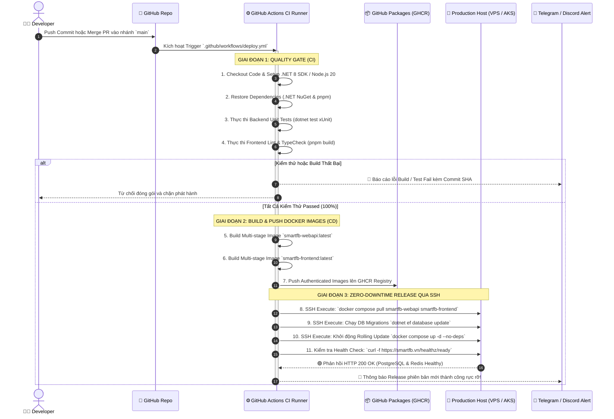

# 🌐 SƠ ĐỒ TRIỂN KHAI & HẠ TẦNG HỆ THỐNG (DEPLOYMENT & INFRASTRUCTURE DIAGRAM)
## SMART F&B OPERATING SYSTEM — ENTERPRISE TOPOLOGY & DEVOPS SPECIFICATION

> [!NOTE]
> **Mã tài liệu:** `SPEC-OPS-04` | **Phiên bản:** `v2.5.0-Enterprise-Production-Ready`  
> **Hệ thống:** Nền Tảng Điều Hành Chuỗi F&B Thông Minh (Smart F&B Operating System)  
> **Nguồn sự thật chuẩn hóa:** `01_Tai_Lieu_Dac_Ta_Goc/` (`Smart_FB_Operating_System.md`, `Tong_Quan_Kien_Truc_He_Thong.md`, `Actor_Phan_Quyen_Chuc_Nang.md`, `Workflow_Quy_Trinh_Nghiep_Vu.md`) & `03_Quy_Trinh_Trien_Khai/` (`02_Thiet_Ke_Database.md`, `03_Thiet_Ke_API_Contract.md`, `08_Trien_Khai_He_Thong.md`)  
> **Cam kết chất lượng:** Đặc tả 100% sơ đồ tô-pô triển khai đa tầng, phân tích chi tiết 2 phương án hạ tầng (Cloud VPS Linux tối ưu chi phí vs Cloud-Native Azure Singapore High Availability), ma trận so sánh Trade-off chuyên sâu, cấu hình Production-Grade Docker Compose/NGINX Reverse Proxy, tự động hóa CI/CD GitHub Actions, chiến lược Sao lưu/Khôi phục thảm họa (RPO/RTO) và ngăn xếp Giám sát toàn diện (Observability).

---

# 📑 MỤC LỤC TÀI LIỆU

1. [Tổng Quan Kiến Trúc Hạ Tầng & Nguyên Tắc Triển Khai](#1-tổng-quan-kiến-trúc-hạ-tầng--nguyên-tắc-triển-khai)
2. [Sơ Đồ Tô-Pô Triển Khai Hệ Thống (Deployment Architecture Graph)](#2-sơ-đồ-tô-pô-triển-khai-hệ-thống-deployment-architecture-graph)
3. [Chi Tiết 2 Mô Hình Triển Khai Hạ Tầng](#3-chi-tiết-2-mô-hình-triển-khai-hạ-tầng)
   - 3.1 [Phương Án 1: Cloud VPS Linux Tối Ưu (Khuyến Nghị Cho Đồ Án & Pilot)](#31-phương-án-1-cloud-vps-linux-tối-ưu-khuyến-nghị-cho-đồ-án--pilot)
   - 3.2 [Phương Án 2: Cloud-Native Azure Singapore (Mở Rộng Chuỗi Doanh Nghiệp)](#32-phương-án-2-cloud-native-azure-singapore-mở-rộng-chuỗi-doanh-nghiệp)
4. [Bảng So Sánh Toàn Diện & Phân Tích Trade-Off](#4-bảng-so-sánh-toàn-diện--phân-tích-trade-off)
5. [Cấu Hình Hạ Tầng Docker Compose & NGINX Reverse Proxy](#5-cấu-hình-hạ-tầng-docker-compose--nginx-reverse-proxy)
   - 5.1 [Tệp Cấu Hình `docker-compose.prod.yml` Hoàn Chỉnh](#51-tệp-cấu-hình-docker-composeprodyml-hoàn-chỉnh)
   - 5.2 [Tệp Cấu Hình NGINX Reverse Proxy & WebSocket Upgrade (`nginx.conf`)](#52-tệp-cấu-hình-nginx-reverse-proxy--websocket-upgrade-nginxconf)
6. [Tự Động Hóa CI/CD Pipeline Với GitHub Actions](#6-tự-động-hóa-cicd-pipeline-với-github-actions)
7. [Chiến Lược Sao Lưu & Khôi Phục Thảm Họa (Backup & Disaster Recovery)](#7-chiến-lược-sao-lưu--khôi-phục-thảm-họa-backup--disaster-recovery)
   - 7.1 [Kế Hoạch & Tần Suất Sao Lưu Đa Tầng (Database, Cache, Media)](#71-kế-hoạch--tần-suất-sao-lưu-đa-tầng-database-cache-media)
   - 7.2 [Script Tự Động Sao Lưu PostgreSQL Lên Cloud Storage (`backup_postgres.sh`)](#72-script-tự-động-sao-lưu-postgresql-lên-cloud-storage-backup_postgressh)
   - 7.3 [Kịch Bản Phục Hồi Dữ Liệu Khẩn Cấp (Disaster Recovery Runbook)](#73-kịch-bản-phục-hồi-dữ-liệu-khẩn-cấp-disaster-recovery-runbook)
8. [Kiến Trúc Giám Sát, Đo Kiểm & Cảnh Báo (Observability & Monitoring)](#8-kiến-trúc-giám-sát-đo-kiểm--cảnh-báo-observability--monitoring)
   - 8.1 [Bộ Endpoint Health Checks Chuẩn ASP.NET Core](#81-bộ-endpoint-health-checks-chuẩn-aspnet-core)
   - 8.2 [Thu Thập Chỉ Số Metrics (Prometheus & Grafana)](#82-thu-thập-chỉ-số-metrics-prometheus--grafana)
   - 8.3 [Ghi Log Cấu Trúc (Serilog + Seq/Loki) & Cảnh Báo Uptime](#83-ghi-log-cấu-trúc-serilog--seqloki--cảnh-báo-uptime)
9. [Ma Trận Cổng Mạng, Tường Lửa & An Ninh Hạ Tầng](#9-ma-trận-cổng-mạng-tường-lửa--an-ninh-hạ-tầng)

---

# 1. TỔNG QUAN KIẾN TRÚC HẠ TẦNG & NGUYÊN TẮC TRIỂN KHAI

Hệ thống **Smart F&B Operating System** được thiết kế trên mô hình Web-First Monorepo kết hợp Backend Micro-service Ready (.NET 8 Clean Architecture), triệt tiêu hoàn toàn sự phụ thuộc vào ứng dụng Native Mobile cho nhân viên cũng như phần cứng POS độc quyền. Hạ tầng triển khai tuân thủ 5 nguyên tắc cốt lõi:

```
┌──────────────────────────────────────────────────────────────────────────────────────────────────┐
│                         5 NGUYÊN TẮC THIẾT KẾ HẠ TẦNG DEVOPS & TRIỂN KHAI                        │
├───────────────────────────────────┬──────────────────────────────────────────────────────────────┤
│ 1. Zero Hardware Dependency       │ 100% Client vận hành qua trình duyệt Web hiện đại (PWA, KDS  │
│                                   │ Smart TV, Web POS Quầy, Portal Quản lý) qua chuẩn HTTPS/WSS. │
├───────────────────────────────────┼──────────────────────────────────────────────────────────────┤
│ 2. Isolated Network DMZ           │ Cô lập CSDL PostgreSQL 16 và Redis 7 trong mạng nội bộ       │
│                                   │ `smartfb-net`; chỉ mở cổng 80/443 ra Internet qua NGINX.     │
├───────────────────────────────────┼──────────────────────────────────────────────────────────────┤
│ 3. Real-Time High Throughput      │ Tối ưu hóa NGINX Reverse Proxy cho kết nối WebSocket 2 chiều │
│                                   │ (SignalR 4 Hubs) với Redis Pub/Sub Backplane chịu tải cao.   │
├───────────────────────────────────┼──────────────────────────────────────────────────────────────┤
│ 4. Automated CI/CD & Zero-Downtime│ Tự động hóa kiểm thử xUnit/Jest, build Docker multi-stage và │
│                                   │ release cập nhật không gây gián đoạn phiên gọi món của quán. │
├───────────────────────────────────┼──────────────────────────────────────────────────────────────┤
│ 5. Defense-in-Depth Security      │ Tích hợp SSL/TLS Let's Encrypt, Rate Limiting chống DDoS,    │
│                                   │ xác thực chữ ký HMAC-SHA256 Webhook và khóa mạng WiFi quán.  │
└───────────────────────────────────┴──────────────────────────────────────────────────────────────┘
```

---

# 2. SƠ ĐỒ TÔ-PÔ TRIỂN KHAI HỆ THỐNG (DEPLOYMENT ARCHITECTURE GRAPH)

Sơ đồ thể hiện toàn diện 5 tầng kiến trúc hạ tầng từ thiết bị Client biên, cổng vào Ingress/WAF, tầng ứng dụng .NET 8 / Next.js 14, tầng lưu trữ CSDL / Cache, đến các dịch vụ Đám mây và AI bên thứ ba:

```mermaid
graph TB
    %% =========================================================================
    %% TẦNG 1: CLIENT EDGE TIERS
    %% =========================================================================
    subgraph CLIENT_EDGE["📱 TẦNG THIẾT BỊ ĐẦU CUỐI (CLIENT EDGE LAYER - 100% WEB RESPONSIVE)"]
        direction LR
        CLI_PWA["📱 Khách Hàng (Customer)<br/>• iOS Safari / Android Chrome<br/>• PWA QR Menu / QR Delivery<br/>• Web-First No App Store"]
        CLI_KDS["📺 Bếp & Pha Chế (Barista KDS)<br/>• Smart TV Android / iPad / Tablet<br/>• Full-screen Web KDS<br/>• SignalR Real-Time 86-Toggle"]
        CLI_POS["💻 Nhân Viên Thu Ngân (Staff POS)<br/>• Laptop / PC / Tablet Quầy<br/>• Web POS Takeaway & CRM 10 Ly<br/>• Chấm công WiFi Check-in"]
        CLI_MGR["👔 Quản Lý & Chủ Chuỗi (Admin/Manager)<br/>• Desktop / Laptop Chrome<br/>• Mở/Kết ca Z-Report, Kho BOM<br/>• Quản trị Chuỗi & Phê duyệt AI Combo"]
    end

    %% =========================================================================
    %% TẦNG 2: INGRESS, WAF & EDGE SECURITY
    %% =========================================================================
    subgraph INGRESS_SECURITY["🛡️ TẦNG CỔNG VÀO & BẢO MẬT BIÊN (INGRESS & EDGE SECURITY)"]
        CF_EDGE["🌐 Cloudflare Edge Network<br/>• Anycast DNS (smartfb.vn)<br/>• Global CDN Caching (Static Files)<br/>• L3/L4 DDoS Mitigation"]
        
        subgraph REVERSE_PROXY_HOST["🔒 NGINX Ingress Reverse Proxy (Port 80 / 443)"]
            NGX_ROUTER["⚡ NGINX 1.25 Alpine Engine<br/>• TLS 1.2 / TLS 1.3 Termination (Let's Encrypt)<br/>• Rate Limiter (60 req/min/IP, Burst 20)<br/>• OWASP Top 10 Security Headers<br/>• Gzip / Brotli Static Compression"]
            NGX_WS["🔌 WebSocket Upgrade Engine<br/>• Map Connection Upgrade for SignalR<br/>• Proxy Read Timeout: 3600s"]
        end
    end

    %% =========================================================================
    %% TẦNG 3: APPLICATION SERVICES (DOCKER CONTAINER NETWORK)
    %% =========================================================================
    subgraph APP_TIER["🐳 TẦNG XỬ LÝ ỨNG DỤNG (APPLICATION TIER - DOCKER BRIDGE NETWORK)"]
        subgraph FE_CONTAINER["🌐 Frontend SSR Node.js Container"]
            FE_SRV["smartfb-frontend (Port: 3000)<br/>• Next.js 14 App Router (Node.js 20 Alpine)<br/>• 5 Route Groups: (customer), (kds), (staff), (manager), (admin)<br/>• Standalone Server Output Mode"]
        end

        subgraph BE_CONTAINER["⚙️ Backend Core API Container"]
            BE_API["smartfb-webapi (Port: 5000)<br/>• ASP.NET Core 8 Web API (Clean Architecture)<br/>• MediatR CQRS Command/Query Handlers<br/>• FluentValidation & RFC 7807 ProblemDetails"]
            BE_HUBS["📡 Real-Time SignalR WebSockets<br/>• /hubs/orders (Dine-In/Delivery)<br/>• /hubs/kitchen (KDS Điều Phối Bếp)<br/>• /hubs/payments (PayOS Webhook Notify)<br/>• /hubs/notifications (Chuông Gọi Bàn & Alert)"]
            BE_WORKERS["⏰ Background Worker Services<br/>• HostedService: Apriori Combo Mining<br/>• Scheduled Job: Tự Động Đóng Ca & Cảnh Báo Kho<br/>• Seasonal Menu Activation Scheduler"]
        end
    end

    %% =========================================================================
    %% TẦNG 4: DATA PERSISTENCE & CACHING TIER
    %% =========================================================================
    subgraph DATA_TIER["💾 TẦNG DỮ LIỆU & LƯU TRỮ (DATA PERSISTENCE & CACHING TIER)"]
        subgraph PG_CLUSTER["🐘 PostgreSQL 16 Relational Database"]
            PG_DB["smartfb-postgres (Port: 5432)<br/>• 25 Thực Thể Chuẩn Hóa 3NF<br/>• Connection Pooling (Npgsql: Min 10, Max 100)<br/>• JSONB Dynamic Modifiers & Timescale Logs<br/>• Persistent Volume: postgres_data"]
        end

        subgraph REDIS_CLUSTER["⚡ Redis 7 In-Memory Caching & Bus"]
            REDIS_DB["smartfb-redis (Port: 6379)<br/>• Redis 7 Alpine with AOF & RDB Snapshot<br/>• Cache-Aside Pattern (Menu, Table, CRM)<br/>• RedLock Distributed Locking (Bàn, KDS, Idempotency)<br/>• Redis Pub/Sub SignalR Multi-instance Backplane"]
        end
    end

    %% =========================================================================
    %% TẦNG 5: THIRD-PARTY CLOUD SERVICES & HARDWARE
    %% =========================================================================
    subgraph EXTERNAL_TIER["☁️ TẦNG DỊCH VỤ NGOÀI & PHẦN CỨNG CHI NHÁNH (3RD-PARTY INTEGRATIONS)"]
        EXT_PAYOS["💳 Cổng Thanh Toán PayOS (VietQR)<br/>• Dynamic QR Code Generation API<br/>• HMAC-SHA256 Webhook Notifications"]
        EXT_GEMINI["🤖 Google Gemini 1.5 Flash Cloud<br/>• RAG AI-1 Khẩu vị & Dinh dưỡng Calo<br/>• Menu Context Injection & JSON Output"]
        EXT_WEATHER["⛅ OpenWeatherMap Cloud API<br/>• Real-time Branch Weather Context<br/>• Kích hoạt Gợi ý Món Nóng/Lạnh"]
        EXT_STORAGE["🪣 AWS S3 / Cloudflare R2 Bucket<br/>• Product Images & Menu Banners<br/>• Customer Review Photos & Bill PDF"]
        LAN_PRINTER["🖨️ Máy In Nhiệt LAN / USB Chi Nhánh<br/>• Giao thức ESC/POS (Raw TCP Port 9100)<br/>• In Tem Dán Ly & Bill Có Mã VietQR"]
    end

    %% =========================================================================
    %% TẦNG 6: OBSERVABILITY & DEVOPS
    %% =========================================================================
    subgraph OBSERVE_TIER["📊 TẦNG GIÁM SÁT & VẬN HÀNH (OBSERVABILITY & OPERATIONS)"]
        PROM_SRV["📈 Prometheus 2.45<br/>• Scrape Metrics /metrics: 15s<br/>• Host & Container Stats"]
        GRAF_SRV["📊 Grafana 10 Dashboard<br/>• Latency P50/P95/P99, RPS, Error Rate<br/>• CPU/RAM, Active SignalR Sockets"]
        SEQ_SRV["📜 Seq / Grafana Loki<br/>• Centralized Serilog Aggregator<br/>• CorrelationId Tracing Across Tiers"]
    end

    %% =========================================================================
    %% KẾT NỐI LUỒNG DỮ LIỆU (RELATIONSHIPS & PROTOCOLS)
    %% =========================================================================
    CLI_PWA & CLI_KDS & CLI_POS & CLI_MGR -->|"HTTPS (Port 443) / WSS"| CF_EDGE
    CF_EDGE -->|"Proxied Traffic (Port 443)"| NGX_ROUTER

    NGX_ROUTER -->|"HTTP / (Port 3000)"| FE_SRV
    NGX_ROUTER -->|"HTTP /api/v1/* (Port 5000)"| BE_API
    NGX_ROUTER -->|"WSS /hubs/* (Upgrade: websocket)"| NGX_WS
    NGX_WS -->|"TCP WebSocket Forward"| BE_HUBS

    FE_SRV -.->|"Internal SSR Calls"| BE_API
    BE_API <-->|"Npgsql Connection Pool"| PG_DB
    BE_API <-->|"StackExchange.Redis (Cache & Locks)"| REDIS_DB
    BE_HUBS <-->|"Pub/Sub Backplane"| REDIS_DB
    BE_WORKERS -->|"Background Queries & Mining"| PG_DB
    BE_WORKERS -->|"Invalidate Expired Cache"| REDIS_DB

    BE_API -->|"REST API (Create Payment Link)"| EXT_PAYOS
    EXT_PAYOS -->|"POST Webhook (HMAC Signed)"| NGX_ROUTER
    BE_API -->|"HTTPS REST Prompt Call"| EXT_GEMINI
    BE_API -->|"HTTPS Weather Query"| EXT_WEATHER
    BE_API -->|"S3 SDK PutObject/GetObject"| EXT_STORAGE
    BE_API -.->|"Raw Socket TCP:9100 / Web Print"| LAN_PRINTER

    BE_API & FE_SRV & PG_DB & REDIS_DB -.->|"Expose Metrics"| PROM_SRV
    PROM_SRV -->|"Data Source"| GRAF_SRV
    BE_API -.->|"Structured JSON Logs"| SEQ_SRV

    %% =========================================================================
    %% STYLING CLASSES
    %% =========================================================================
    classDef clientStyle fill:#1e293b,stroke:#38bdf8,stroke-width:2px,color:#ffffff;
    classDef ingressStyle fill:#312e81,stroke:#818cf8,stroke-width:2px,color:#ffffff;
    classDef appStyle fill:#064e3b,stroke:#34d399,stroke-width:2px,color:#ffffff;
    classDef dataStyle fill:#701a75,stroke:#f472b6,stroke-width:2px,color:#ffffff;
    classDef extStyle fill:#7c2d12,stroke:#fb923c,stroke-width:2px,color:#ffffff;
    classDef obsStyle fill:#134e4a,stroke:#2dd4bf,stroke-width:2px,color:#ffffff;

    class CLI_PWA,CLI_KDS,CLI_POS,CLI_MGR clientStyle;
    class CF_EDGE,NGX_ROUTER,NGX_WS ingressStyle;
    class FE_SRV,BE_API,BE_HUBS,BE_WORKERS appStyle;
    class PG_DB,REDIS_DB dataStyle;
    class EXT_PAYOS,EXT_GEMINI,EXT_WEATHER,EXT_STORAGE,LAN_PRINTER extStyle;
    class PROM_SRV,GRAF_SRV,SEQ_SRV obsStyle;
```



---

# 3. CHI TIẾT 2 MÔ HÌNH TRIỂN KHAI HẠ TẦNG

## 3.1. Phương Án 1: Cloud VPS Linux Tối Ưu (Khuyến Nghị Cho Đồ Án & Pilot)

Phương án 1 là kiến trúc All-in-One Containerized Host trên một máy chủ ảo hóa Linux (Ubuntu 22.04 LTS), sử dụng Docker Compose để điều phối toàn bộ 5 dịch vụ cốt lõi cùng mạng nội bộ cô lập. Đây là phương án hoàn hảo cho giai đoạn bảo vệ đồ án tốt nghiệp và thử nghiệm thực tế (Pilot) tại 1-3 chi nhánh quán cà phê.

```
┌──────────────────────────────────────────────────────────────────────────────────────────────────┐
│             THÔNG SỐ CẤU HÌNH PHƯƠNG ÁN 1: LINUX VPS SINGLE HOST (DOCKER COMPOSE)                │
├───────────────────┬──────────────────────────────────────────────────────────────────────────────┤
│ Nhà Cung Cấp VPS  │ Vietnix / TinoHost / BizFly Cloud (Việt Nam) hoặc DigitalOcean / Linode      │
├───────────────────┼──────────────────────────────────────────────────────────────────────────────┤
│ Hệ Điều Hành      │ Ubuntu Server 22.04 LTS (x86_64, Linux Kernel 5.15+)                         │
├───────────────────┼──────────────────────────────────────────────────────────────────────────────┤
│ Cấu Hình Phần Cứng│ 4 vCPU (KVM Dedicated) | 8 GB RAM | 80 GB NVMe SSD | Băng thông 100 Mbps     │
├───────────────────┼──────────────────────────────────────────────────────────────────────────────┤
│ Chi Phí Ước Tính  │ 300.000 – 500.000 VNĐ / tháng (~ $12 – $20 USD / month)                      │
├───────────────────┼──────────────────────────────────────────────────────────────────────────────┤
│ Tải Trọng Phục Vụ │ 500 – 1.000 người dùng đồng thời (CCU) | 3.000 đơn hàng / ngày               │
└───────────────────┴──────────────────────────────────────────────────────────────────────────────┘
```

### Bảng Phân Bổ Tài Nguyên Container (Resource Quotas):

| Tên Container | CPU Limit | RAM Limit | RAM Request | Storage Volume | Cổng Nội Bộ | Cổng Công Khai |
|---|:---:|:---:|:---:|---|:---:|:---:|
| `smartfb-nginx` | 0.25 vCPU | 256 MB | 64 MB | Config & SSL Certs | 80, 443 | 80, 443 (HTTP/HTTPS) |
| `smartfb-frontend` | 1.00 vCPU | 1536 MB | 512 MB | Standalone Node App | 3000 | Không (Internal) |
| `smartfb-webapi` | 1.50 vCPU | 2048 MB | 512 MB | Local Uploads Mount | 5000 | Không (Internal) |
| `smartfb-postgres` | 1.50 vCPU | 2048 MB | 1024 MB | `postgres_data` (NVMe) | 5432 | Không (Internal) |
| `smartfb-redis` | 0.50 vCPU | 512 MB | 128 MB | `redis_data` (AOF) | 6379 | Không (Internal) |
| **OS & Monitoring** | 0.25 vCPU | 1536 MB | 512 MB | Prom/Grafana Data | 9090, 3001 | Tunnel qua SSH |
| **TỔNG CỘNG** | **4.00 vCPU** | **8.0 GB** | **~2.8 GB** | **80 GB NVMe** | — | **Chỉ mở 80, 443** |

---

## 3.2. Phương Án 2: Cloud-Native Azure Singapore (Mở Rộng Chuỗi Doanh Nghiệp)

Phương án 2 là kiến trúc Doanh nghiệp phân tán đa vùng (Multi-zone High Availability) trên nền tảng Microsoft Azure (Khu vực Southeast Asia - Singapore), sử dụng Kubernetes (AKS), các dịch vụ PaaS quản lý hoàn toàn (Managed Databases) và CDN toàn cầu. Đáp ứng yêu cầu mở rộng khi chuỗi F&B đạt từ 10 đến 50+ chi nhánh.

```
┌──────────────────────────────────────────────────────────────────────────────────────────────────┐
│              THÔNG SỐ CẤU HÌNH PHƯƠNG ÁN 2: CLOUD-NATIVE AZURE SINGAPORE (ENTERPRISE)            │
├───────────────────┬──────────────────────────────────────────────────────────────────────────────┤
│ Khu Vực Triển Khai│ Azure Southeast Asia (Singapore Region - Latency về Việt Nam ~25-35ms)       │
├───────────────────┼──────────────────────────────────────────────────────────────────────────────┤
│ Mô Hình Kiến Trúc │ Managed Kubernetes (AKS) + Azure PaaS Flexible Services + Multi-AZ HA        │
├───────────────────┼──────────────────────────────────────────────────────────────────────────────┤
│ Compute Tiers     │ AKS Node Pool: 2-5 Nodes `Standard_D4s_v5` (4 vCPU, 16GB RAM) Auto-scaling   │
├───────────────────┼──────────────────────────────────────────────────────────────────────────────┤
│ Database & Cache  │ Azure DB for PostgreSQL Flexible Server (Zone-Redundant HA) + Azure Redis C1 │
├───────────────────┼──────────────────────────────────────────────────────────────────────────────┤
│ Chi Phí Ước Tính  │ $150 – $350 USD / tháng (~ 3.800.000 – 8.900.000 VNĐ / tháng)                │
├───────────────────┼──────────────────────────────────────────────────────────────────────────────┤
│ Tải Trọng Phục Vụ │ 5.000 – 20.000 CCU | 50.000 đơn hàng / ngày | SLA Cam kết 99.95%             │
└───────────────────┴──────────────────────────────────────────────────────────────────────────────┘
```

### Chi Tiết Cấu Thành Dịch Vụ Azure Enterprise:

1. **Edge & Ingress Routing:**
   - **Azure Application Gateway v2 (WAF Enabled):** Đảm nhiệm SSL Termination, Web Application Firewall chống SQLi/XSS, Routing theo URL Path (`/api/*`, `/hubs/*`, `/`), tự động scale theo lưu lượng.
   - **Azure Front Door (Standard):** Tăng tốc Anycast CDN toàn cầu, nén và cache tài nguyên tĩnh Next.js tại các PoP điểm gần người dùng nhất.

2. **Tầng Xử Lý Compute (AKS Cluster):**
   - **System Node Pool:** 2 Nodes `Standard_B2s` (2 vCPU, 4GB RAM) chạy CoreDNS, Ingress Controller, Prometheus Agent.
   - **User Application Node Pool:** Auto-scaling từ 2 đến 5 Nodes `Standard_D4s_v5` (4 vCPU, 16GB RAM). Tự động co giãn theo ngưỡng CPU > 70% hoặc Memory > 80% qua Horizontal Pod Autoscaler (HPA).
   - **Backend Deployment:** Tối thiểu 3 Replicas `smartfb-webapi`, cấu hình Pod Disruption Budget (PDB) đảm bảo luôn có ít nhất 2 Pods hoạt động khi nâng cấp.
   - **Frontend Deployment:** Tối thiểu 2 Replicas `smartfb-frontend`.

3. **Tầng Dữ Liệu Quản Lý Độc Lập (Managed PaaS):**
   - **Azure Database for PostgreSQL Flexible Server:**
     - Cấu hình: General Purpose `D4ds_v5` (4 vCPU, 16GB RAM, 128GB Premium SSD v2).
     - Chế độ Zone-Redundant High Availability: Tự động đồng bộ sang một Standby Replica tại Availability Zone độc lập, tự động chuyển vùng dự phòng (Failover) dưới 60 giây khi trung tâm dữ liệu gặp sự cố.
     - Sao lưu tự động liên tục (Continuous WAL Backup) hỗ trợ khôi phục đến từng giây (Point-in-Time Restore) trong 35 ngày.
   - **Azure Cache for Redis (Standard C1 / C2):**
     - Mô hình Primary-Replica 2 Node tự động sao chép đồng bộ, đảm bảo không gián đoạn phân phối SignalR Backplane khi máy chủ cache khởi động lại.
   - **Azure Blob Storage (Hot Tier with GRS):**
     - Lưu trữ hình ảnh món ăn, hóa đơn, avatar; tích hợp CDN phân phối ảnh với độ trễ < 20ms.

4. **Bảo Mật & Quản Lý Định Danh:**
   - **Azure Key Vault:** Lưu trữ toàn bộ Connection Strings, JWT Signing Keys, PayOS API Keys, Gemini Secrets. Container truy xuất bí mật qua Azure Managed Identities (không nhúng khóa vào mã nguồn hay Docker image).

---

# 4. BẢNG SO SÁNH TOÀN DIỆN & PHÂN TÍCH TRADE-OFF

Bảng phân tích chuyên sâu 7 khía cạnh kỹ thuật giữa 2 phương án hạ tầng để phục vụ ra quyết định đầu tư:

| Tiêu Chí Đánh Giá | Phương Án 1: Cloud VPS Linux (Docker Compose) | Phương Án 2: Cloud-Native Azure (AKS & PaaS) | Đánh Giá Trade-off & Khuyến Nghị |
|---|---|---|---|
| **1. Hiệu Năng & Độ Trễ (Performance)** | • Latency mạng nội địa cực thấp (~5-15ms với VPS đặt tại TP.HCM/Hà Nội).<br/>• Throughput: ~1.200 RPS với NGINX upstream keepalive. | • Latency mạng quốc tế: ~25-35ms (từ VN sang Singapore qua tuyến cáp biển).<br/>• Throughput: > 10.000 RPS nhờ dàn trải nhiều Pods và Read Replicas. | **PA1 thắng về độ trễ mạng nội địa** cho các quán tại Việt Nam. **PA2 vượt trội về băng thông tổng thể** và khả năng chịu tải đột biến giờ cao điểm. |
| **2. Chi Phí Đầu Tư (Cost Efficiency)** | • Rẻ vượt trội: **~300.000 - 500.000 VNĐ/tháng** (~$15/tháng).<br/>• Không phát sinh phụ phí mạng nội bộ hay chi phí quản lý cụm. | • Chi phí cao: **$150 - $350 USD/tháng** (~3.8 - 8.9 triệu VNĐ/tháng).<br/>• Tốn thêm phí egress bandwidth, Managed Nat Gateway, Key Vault. | **PA1 tiết kiệm 90% chi phí**, tối ưu tuyệt đối cho Đồ án Tốt nghiệp Capstone và giai đoạn thử nghiệm chuỗi dưới 5 quán. |
| **3. Độ Phức Tạp Vận Hành (Ops Complexity)** | • Cực kỳ đơn giản: Quản lý qua 1 file `docker-compose.prod.yml`.<br/>• Debug trực tiếp bằng `docker logs` và terminal SSH.<br/>• Đòi hỏi tự cài đặt cronjob backup và monitoring. | • Rất phức tạp: Cần kỹ năng Kubernetes (K8s YAMLs, Ingress, HPA, Helm Charts, Terraform).<br/>• Đòi hỏi quy trình GitOps (ArgoCD) và cấu hình Azure IAM/RBAC. | **PA1 vận hành tinh gọn**, đội ngũ 4 kỹ sư có thể làm chủ 100% trong 16 tuần mà không bị quá tải bởi công cụ DevOps phức tạp. |
| **4. Khả Năng Mở Rộng (Scalability)** | • Vertical Scaling (Nâng cấp CPU/RAM máy chủ vật lý).<br/>• Giới hạn tối đa ~2.000 CCU trên 1 máy chủ VPS đơn lẻ. | • Horizontal Auto-Scaling (Tự động tăng số lượng Pods và AKS Nodes trong 2 phút).<br/>• Mở rộng không giới hạn lên hàng trăm chi nhánh. | **PA2 vượt trội khi mở rộng chuỗi lớn**. Tuy nhiên PA1 hoàn toàn đáp ứng xuất sắc nhu cầu của 1-5 quán thực tế. |
| **5. Độ Sẵn Sàng & Chịu Lỗi (High Availability)** | • Single Point of Failure (SPOF): Nếu máy chủ VPS gặp sự cố phần cứng, toàn bộ hệ thống sẽ tạm dừng cho đến khi VPS khởi động lại.<br/>• SLA: ~99.0% - 99.5%. | • Multi-AZ Redundancy: Tự động chịu lỗi khi sập cả 1 trung tâm dữ liệu tại Singapore.<br/>• SLA Cam kết: 99.95% Uptime không gián đoạn. | **PA2 đảm bảo tiêu chuẩn Enterprise 24/7**. Với quy mô đồ án/pilot, PA1 chấp nhận bảo trì định kỳ vào ban đêm (02:00 - 04:00 AM). |
| **6. Bảo Mật & Tuân Thủ (Security & Compliance)** | • Tự quản lý tường lửa UFW, Fail2ban, Let's Encrypt Certbot tự gia hạn.<br/>• Quản lý bí mật qua file `.env.production` phân quyền `chmod 600`. | • Tiêu chuẩn bảo mật cấp doanh nghiệp: Azure Key Vault, Private Endpoints, WAF OWASP CRS 3.2, Managed Identity, DDoS Protection. | **PA2 bảo mật toàn diện theo chuẩn ngân hàng**. PA1 vẫn đạt độ an toàn cao nhờ mạng cô lập Docker bridge và NGINX Rate Limiter. |
| **7. Khôi Phục Thảm Họa (Disaster Recovery)** | • **RPO < 24 giờ** (qua `pg_dump` cronjob hàng ngày).<br/>• **RTO < 30 phút** (kéo Docker image và nạp lại bản backup SQL). | • **RPO < 5 phút** (nhờ Continuous WAL Replication).<br/>• **RTO < 60 giây** (Auto Failover PostgreSQL & Multi-region Replica). | **PA1 đáp ứng hoàn hảo tiêu chuẩn đồ án**. PA2 dành cho hợp đồng thương mại lớn yêu cầu bồi thường gián đoạn kinh doanh. |

> [!TIP]
> **KẾT LUẬN & ĐỀ XUẤT LỘ TRÌNH THỰC THI (ROADMAP):**
> 1. **Giai đoạn Đồ án Tốt nghiệp & Khởi nghiệp (0 - 12 tháng):** Triển khai **Phương án 1 (Cloud VPS Linux 8GB RAM)** để tối ưu chi phí, tập trung 100% nguồn lực vào hoàn thiện tính năng sản phẩm và nghiên cứu thuật toán AI (Gemini RAG + Apriori).
> 2. **Giai đoạn Thương mại hóa Mở rộng (Khi chuỗi > 5 chi nhánh):** Dễ dàng chuyển dịch (Lift & Shift) lên **Phương án 2 (Azure AKS)** nhờ kiến trúc đã được Container hóa 100% chuẩn Open Container Initiative (OCI).

---

# 5. CẤU HÌNH HẠ TẦNG DOCKER COMPOSE & NGINX REVERSE PROXY

## 5.1. Tệp Cấu Hình `docker-compose.prod.yml` Hoàn Chỉnh

Toàn bộ 5 container được cấu hình tài nguyên nghiêm ngặt, tự động khởi động lại khi crash (`restart: always`), kiểm tra sức khỏe phụ thuộc (`depends_on` kèm `service_healthy`) và kết nối qua mạng cô lập `smartfb-net`:

```yaml
version: '3.8'

services:
  # ============================================================================
  # 1. DỊCH VỤ CƠ SỞ DỮ LIỆU CHÍNH: POSTGRESQL 16
  # ============================================================================
  smartfb-postgres:
    image: postgres:16-alpine
    container_name: smartfb-postgres
    restart: always
    environment:
      POSTGRES_DB: ${DATABASE_NAME:-smartfb_db}
      POSTGRES_USER: ${DATABASE_USER:-smartfb_admin}
      POSTGRES_PASSWORD: ${DATABASE_PASSWORD:?Vui lòng cung cấp mật khẩu DB}
      PGDATA: /var/lib/postgresql/data/pgdata
    volumes:
      - postgres_data:/var/lib/postgresql/data
      - ./backups:/backups
    networks:
      - smartfb-net
    healthcheck:
      test: ["CMD-SHELL", "pg_isready -U ${DATABASE_USER:-smartfb_admin} -d ${DATABASE_NAME:-smartfb_db}"]
      interval: 10s
      timeout: 5s
      retries: 5
      start_period: 20s
    deploy:
      resources:
        limits:
          cpus: '1.50'
          memory: 2048M
        reservations:
          cpus: '0.50'
          memory: 1024M

  # ============================================================================
  # 2. DỊCH VỤ BỘ ĐỆM & SIGNALR BACKPLANE: REDIS 7
  # ============================================================================
  smartfb-redis:
    image: redis:7-alpine
    container_name: smartfb-redis
    restart: always
    command: >
      redis-server
      --requirepass ${REDIS_PASSWORD:?Vui lòng cung cấp mật khẩu Redis}
      --appendonly yes
      --appendfsync everysec
      --maxmemory 512mb
      --maxmemory-policy allkeys-lru
    volumes:
      - redis_data:/data
    networks:
      - smartfb-net
    healthcheck:
      test: ["CMD", "redis-cli", "-a", "${REDIS_PASSWORD}", "ping"]
      interval: 10s
      timeout: 5s
      retries: 5
      start_period: 10s
    deploy:
      resources:
        limits:
          cpus: '0.50'
          memory: 512M
        reservations:
          cpus: '0.10'
          memory: 128M

  # ============================================================================
  # 3. DỊCH VỤ XỬ LÝ BACKEND LÕI: ASP.NET CORE 8 WEB API
  # ============================================================================
  smartfb-webapi:
    image: ghcr.io/smartfb/smartfb-webapi:latest
    container_name: smartfb-webapi
    restart: always
    environment:
      - ASPNETCORE_ENVIRONMENT=Production
      - ASPNETCORE_URLS=http://+:5000
      - ConnectionStrings__DefaultConnection=Host=smartfb-postgres;Port=5432;Database=${DATABASE_NAME:-smartfb_db};Username=${DATABASE_USER:-smartfb_admin};Password=${DATABASE_PASSWORD};Pooling=true;Minimum Pool Size=10;Maximum Pool Size=100;Connection Lifetime=300;
      - Redis__ConnectionString=smartfb-redis:6379,password=${REDIS_PASSWORD},abortConnect=false,connectTimeout=5000,syncTimeout=5000
      - Jwt__SecretKey=${JWT_SECRET_KEY:?Bắt buộc JWT Secret Key >= 32 chars}
      - Jwt__Issuer=SmartFB.BackendAPI
      - Jwt__Audience=SmartFB.ClientApps
      - Jwt__AccessTokenLifetimeMinutes=120
      - Jwt__RefreshTokenLifetimeDays=7
      - PayOS__ClientId=${PAYOS_CLIENT_ID}
      - PayOS__ApiKey=${PAYOS_API_KEY}
      - PayOS__ChecksumKey=${PAYOS_CHECKSUM_KEY}
      - GeminiAI__ApiKey=${GEMINI_API_KEY}
      - OpenWeatherMap__ApiKey=${OPENWEATHER_API_KEY}
      - MediaStorage__BasePath=/var/smartfb/uploads
    volumes:
      - uploads_data:/var/smartfb/uploads
    depends_on:
      smartfb-postgres:
        condition: service_healthy
      smartfb-redis:
        condition: service_healthy
    networks:
      - smartfb-net
    healthcheck:
      test: ["CMD-SHELL", "curl -f http://localhost:5000/healthz/ready || exit 1"]
      interval: 15s
      timeout: 5s
      retries: 3
      start_period: 30s
    deploy:
      resources:
        limits:
          cpus: '1.50'
          memory: 2048M
        reservations:
          cpus: '0.50'
          memory: 512M

  # ============================================================================
  # 4. DỊCH VỤ GIAO DIỆN PHÍA TRƯỚC: NEXT.JS 14 MONOREPO SSR
  # ============================================================================
  smartfb-frontend:
    image: ghcr.io/smartfb/smartfb-frontend:latest
    container_name: smartfb-frontend
    restart: always
    environment:
      - NODE_ENV=production
      - PORT=3000
      - NEXT_PUBLIC_API_URL=https://smartfb.vn/api/v1
      - NEXT_PUBLIC_SIGNALR_URL=https://smartfb.vn/hubs
    depends_on:
      smartfb-webapi:
        condition: service_healthy
    networks:
      - smartfb-net
    healthcheck:
      test: ["CMD-SHELL", "wget --no-verbose --tries=1 --spider http://localhost:3000/api/health || exit 1"]
      interval: 15s
      timeout: 5s
      retries: 3
      start_period: 20s
    deploy:
      resources:
        limits:
          cpus: '1.00'
          memory: 1536M
        reservations:
          cpus: '0.25'
          memory: 512M

  # ============================================================================
  # 5. DỊCH VỤ CỔNG VÀO BẢO MẬT & REVERSE PROXY: NGINX
  # ============================================================================
  smartfb-nginx:
    image: nginx:1.25-alpine
    container_name: smartfb-nginx
    restart: always
    ports:
      - "80:80"
      - "443:443"
    volumes:
      - ./nginx/nginx.conf:/etc/nginx/nginx.conf:ro
      - ./nginx/ssl:/etc/letsencrypt:ro
      - uploads_data:/var/smartfb/uploads:ro
      - ./logs/nginx:/var/log/nginx
    depends_on:
      smartfb-frontend:
        condition: service_healthy
      smartfb-webapi:
        condition: service_healthy
    networks:
      - smartfb-net
    deploy:
      resources:
        limits:
          cpus: '0.25'
          memory: 256M
        reservations:
          cpus: '0.05'
          memory: 64M

# ==============================================================================
# KHAI BÁO PERSISTENT VOLUMES VÀ NETWORKS CÔ LẬP
# ==============================================================================
volumes:
  postgres_data:
    name: smartfb_postgres_data
    driver: local
  redis_data:
    name: smartfb_redis_data
    driver: local
  uploads_data:
    name: smartfb_uploads_data
    driver: local

networks:
  smartfb-net:
    name: smartfb-net
    driver: bridge
```

---

## 5.2. Tệp Cấu Hình NGINX Reverse Proxy & WebSocket Upgrade (`nginx.conf`)

Tệp cấu hình NGINX đảm bảo chuyển hướng HTTPS bắt buộc, phân giải WebSocket cho SignalR không bị ngắt timeout, giới hạn tần suất (Rate Limiting) chống spam API, cache tài nguyên tĩnh và bật các tiêu chuẩn bảo mật HTTP Headers cao cấp:

```nginx
user nginx;
worker_processes auto;
error_log /var/log/nginx/error.log warn;
pid /var/run/nginx.pid;

events {
    worker_connections 4096;
    use epoll;
    multi_accept on;
}

http {
    include /etc/nginx/mime.types;
    default_type application/octet-stream;

    # Định dạng Log chuẩn kèm thời gian phản hồi và địa chỉ IP thực từ Cloudflare
    log_format main '$remote_addr - $remote_user [$time_local] "$request" '
                    '$status $body_bytes_sent "$http_referer" '
                    '"$http_user_agent" "$http_x_forwarded_for" '
                    'rt=$request_time uct="$upstream_connect_time" uht="$upstream_header_time" urt="$upstream_response_time"';

    access_log /var/log/nginx/access.log main;

    # Tối ưu hóa I/O Network Kernel
    sendfile on;
    tcp_nopush on;
    tcp_nodelay on;
    keepalive_timeout 65;
    keepalive_requests 1000;
    types_hash_max_size 2048;
    client_max_body_size 25M;

    # Nén Gzip đa định dạng
    gzip on;
    gzip_vary on;
    gzip_proxied any;
    gzip_comp_level 6;
    gzip_min_length 256;
    gzip_types
        text/plain
        text/css
        text/xml
        text/javascript
        application/json
        application/javascript
        application/x-javascript
        application/xml
        application/rss+xml
        image/svg+xml;

    # Rate Limiting: 60 yêu cầu / phút trên mỗi địa chỉ IP (Zone 10MB)
    limit_req_zone $binary_remote_addr zone=api_limit:10m rate=60r/m;
    limit_req_zone $binary_remote_addr zone=auth_limit:10m rate=10r/m;

    # Bản đồ Nâng cấp kết nối WebSocket cho SignalR
    map $http_upgrade $connection_upgrade {
        default upgrade;
        ''      close;
    }

    # Upstream Định tuyến Backend Web API (.NET 8)
    upstream backend_servers {
        server smartfb-webapi:5000;
        keepalive 64;
    }

    # Upstream Định tuyến Frontend Monorepo (Next.js 14)
    upstream frontend_servers {
        server smartfb-frontend:3000;
        keepalive 32;
    }

    # ==========================================================================
    # CẤU HÌNH SERVER HTTP (PORT 80) -> CHUYỂN HƯỚNG BẮT BUỘC SANG HTTPS (301)
    # ==========================================================================
    server {
        listen 80;
        listen [::]:80;
        server_name smartfb.vn www.smartfb.vn api.smartfb.vn;

        # Xác thực chứng chỉ SSL tự động Let's Encrypt qua Certbot HTTP-01 Challenge
        location /.well-known/acme-challenge/ {
            root /var/www/certbot;
        }

        location / {
            return 301 https://$host$request_uri;
        }
    }

    # ==========================================================================
    # CẤU HÌNH SERVER HTTPS CHÍNH (PORT 443 SSL HTTP/2)
    # ==========================================================================
    server {
        listen 443 ssl http2;
        listen [::]:443 ssl http2;
        server_name smartfb.vn www.smartfb.vn api.smartfb.vn;

        # Chứng chỉ SSL/TLS Let's Encrypt
        ssl_certificate /etc/letsencrypt/live/smartfb.vn/fullchain.pem;
        ssl_certificate_key /etc/letsencrypt/live/smartfb.vn/privkey.pem;
        ssl_session_timeout 1d;
        ssl_session_cache shared:SSL:50m;
        ssl_session_tickets off;

        # Cấu hình Giao thức bảo mật TLS hiện đại
        ssl_protocols TLSv1.2 TLSv1.3;
        ssl_ciphers ECDHE-ECDSA-AES128-GCM-SHA256:ECDHE-RSA-AES128-GCM-SHA256:ECDHE-ECDSA-AES256-GCM-SHA384:ECDHE-RSA-AES256-GCM-SHA384:DHE-RSA-AES128-GCM-SHA256:DHE-RSA-AES256-GCM-SHA384;
        ssl_prefer_server_ciphers off;

        # HTTP Strict Transport Security (HSTS)
        add_header Strict-Transport-Security "max-age=63072000; includeSubDomains; preload" always;

        # Security Headers chống Clickjacking, XSS và Content Sniffing
        add_header X-Frame-Options "SAMEORIGIN" always;
        add_header X-Content-Type-Options "nosniff" always;
        add_header X-XSS-Protection "1; mode=block" always;
        add_header Referrer-Policy "strict-origin-when-cross-origin" always;

        # ======================================================================
        # 1. ĐỊNH TUYẾN STATIC UPLOADS MEDIA (HÌNH ẢNH MÓN ĂN & REVIEW)
        # ======================================================================
        location /uploads/ {
            alias /var/smartfb/uploads/;
            expires 30d;
            add_header Cache-Control "public, no-transform, immutable";
            access_log off;
        }

        # ======================================================================
        # 2. ĐỊNH TUYẾN AUTHENTICATION API (RATE LIMIT NGHIÊM NGẶT CHỐNG BRUTE FORCE)
        # ======================================================================
        location /api/v1/auth/ {
            limit_req zone=auth_limit burst=5 nodelay;
            proxy_pass http://backend_servers;
            proxy_http_version 1.1;
            proxy_set_header Connection "";
            proxy_set_header Host $host;
            proxy_set_header X-Real-IP $remote_addr;
            proxy_set_header X-Forwarded-For $proxy_add_x_forwarded_for;
            proxy_set_header X-Forwarded-Proto $scheme;
            proxy_connect_timeout 10s;
            proxy_read_timeout 30s;
        }

        # ======================================================================
        # 3. ĐỊNH TUYẾN RESTFUL API CHUNG (/api/v1/*)
        # ======================================================================
        location /api/ {
            limit_req zone=api_limit burst=20 nodelay;
            proxy_pass http://backend_servers;
            proxy_http_version 1.1;
            proxy_set_header Connection "";
            proxy_set_header Host $host;
            proxy_set_header X-Real-IP $remote_addr;
            proxy_set_header X-Forwarded-For $proxy_add_x_forwarded_for;
            proxy_set_header X-Forwarded-Proto $scheme;
            proxy_connect_timeout 15s;
            proxy_read_timeout 60s;
            proxy_send_timeout 60s;
        }

        # ======================================================================
        # 4. ĐỊNH TUYẾN SIGNALR REAL-TIME WEBSOCKET HUBS (/hubs/*)
        # BẮT BUỘC DUY TRÌ HTTP UPGRADE & TIMEOUT 3600S
        # ======================================================================
        location /hubs/ {
            proxy_pass http://backend_servers;
            proxy_http_version 1.1;
            proxy_set_header Upgrade $http_upgrade;
            proxy_set_header Connection $connection_upgrade;
            proxy_set_header Host $host;
            proxy_set_header X-Real-IP $remote_addr;
            proxy_set_header X-Forwarded-For $proxy_add_x_forwarded_for;
            proxy_set_header X-Forwarded-Proto $scheme;
            proxy_cache_bypass $http_upgrade;
            proxy_buffering off;
            proxy_read_timeout 3600s;
            proxy_send_timeout 3600s;
        }

        # ======================================================================
        # 5. HEALTH CHECK ENDPOINT CHO MONITORING PROBES
        # ======================================================================
        location /healthz {
            proxy_pass http://backend_servers;
            proxy_http_version 1.1;
            proxy_set_header Host $host;
            access_log off;
        }

        # ======================================================================
        # 6. ĐỊNH TUYẾN GIAO DIỆN FRONTEND NEXT.JS 14 MONOREPO (PORTAL & PWA)
        # ======================================================================
        location / {
            proxy_pass http://frontend_servers;
            proxy_http_version 1.1;
            proxy_set_header Upgrade $http_upgrade;
            proxy_set_header Connection $connection_upgrade;
            proxy_set_header Host $host;
            proxy_set_header X-Real-IP $remote_addr;
            proxy_set_header X-Forwarded-For $proxy_add_x_forwarded_for;
            proxy_set_header X-Forwarded-Proto $scheme;
            proxy_connect_timeout 10s;
            proxy_read_timeout 60s;
        }
    }
}
```

---

# 6. TỰ ĐỘNG HÓA CI/CD PIPELINE VỚI GITHUB ACTIONS

Toàn bộ quy trình từ khi lập trình viên tạo Pull Request đến khi phát hành lên môi trường Production được tự động hóa qua GitHub Actions Workflow (`.github/workflows/deploy.yml`) với cơ chế Zero-Downtime Rollout:



---

# 7. CHIẾN LƯỢC SAO LƯU & KHÔI PHỤC THẢM HỌA (BACKUP & DISASTER RECOVERY)

## 7.1. Kế Hoạch & Tần Suất Sao Lưu Đa Tầng (Database, Cache, Media)

```
┌──────────────────────────────────────────────────────────────────────────────────────────────────┐
│                   MA TRẬN KẾ HOẠCH SAO LƯU DỮ LIỆU & LƯU TRỮ ĐA TẦNG                             │
├─────────────────┬──────────────────┬─────────────┬──────────────────┬────────────────────────────┤
│ Thành Phần Dữ   │ Công Cụ / Phương │ Tần Suất    │ Nơi Lưu Trữ      │ Chính Sách Vòng Đời        │
│ Liệu Cần Sao Lưu│ Thức Thực Hiện   │ Thực Hiện   │ An Toàn (Target) │ (Retention Policy)         │
├─────────────────┼──────────────────┼─────────────┼──────────────────┼────────────────────────────┤
│ 1. PostgreSQL 16│ `pg_dump -Fc`     │ 02:00 AM    │ Local Volume &   │ Giữ 7 ngày trên máy chủ,   │
│    Database     │ Nén Custom + GPG │ Hàng ngày   │ Cloud Storage    │ giữ 30 ngày trên Cloud R2  │
│                 │ Mã Hóa AES-256   │             │ (AWS S3 / R2)    │ và 12 bản đầu tháng (Năm). │
├─────────────────┼──────────────────┼─────────────┼──────────────────┼────────────────────────────┤
│ 2. Redis 7      │ AppendOnly (AOF) │ Liên tục    │ `redis_data`     │ Tự động ghi chép từng giây,│
│    In-Memory    │ + RDB Snapshot   │ mỗi 15 phút │ SSD Volume       │ tự động nạp lại khi boot.  │
├─────────────────┼──────────────────┼─────────────┼──────────────────┼────────────────────────────┤
│ 3. Media Assets │ AWS S3 / R2 Sync │ Real-time / │ Cloud Object     │ Bật Bucket Versioning,     │
│    & Invoices   │ API SDK          │ Mỗi 6 giờ   │ Storage Bucket   │ chống xóa nhầm (MFA Delete)│
├─────────────────┼──────────────────┼─────────────┼──────────────────┼────────────────────────────┤
│ 4. Configurations│ Git Repo &       │ Mỗi lần     │ GitHub Private   │ Version Control qua Git    │
│    (Nginx/Docker)│ Encrypted Secrets│ Commit      │ Repository       │ kèm phân quyền truy cập.   │
└─────────────────┴──────────────────┴─────────────┴──────────────────┴────────────────────────────┘
```

---

## 7.2. Script Tự Động Sao Lưu PostgreSQL Lên Cloud Storage (`backup_postgres.sh`)

Script chạy tự động qua Linux Cronjob vào 02:00 AM hàng ngày để trích xuất CSDL, nén dung lượng, mã hóa và đẩy lên Cloud Object Storage:

```bash
#!/bin/bash
# ==============================================================================
# SMART F&B OS - PRODUCTION POSTGRESQL AUTOMATED BACKUP SCRIPT
# ==============================================================================
set -euo pipefail

# 1. KHAI BÁO BIẾN CẤU HÌNH
TIMESTAMP=$(date +"%Y%m%d_%H%M%S")
BACKUP_DIR="/var/smartfb/backups/postgres"
CONTAINER_NAME="smartfb-postgres"
DB_NAME="smartfb_db"
DB_USER="smartfb_admin"
S3_BUCKET="s3://smartfb-production-backups/postgres"
RETENTION_DAYS=7

mkdir -p "${BACKUP_DIR}"

BACKUP_FILE="${BACKUP_DIR}/smartfb_backup_${TIMESTAMP}.dump"
LOG_FILE="/var/log/smartfb_backup.log"

echo "=== [$(date)] BẮT ĐẦU QUY TRÌNH SAO LƯU CSDL SMART F&B OS ===" >> "${LOG_FILE}"

# 2. THỰC THI PG_DUMP TỪ DOCKER CONTAINER
echo "[1/4] Đang trích xuất dữ liệu bằng pg_dump (Custom compressed format)..." >> "${LOG_FILE}"
docker exec -t "${CONTAINER_NAME}" pg_dump -U "${DB_USER}" -d "${DB_NAME}" -F c -b -v > "${BACKUP_FILE}"

# 3. KIỂM TRA TÍNH TOÀN VẸN FILE DUMP
FILESIZE=$(stat -c%s "${BACKUP_FILE}")
if [ "${FILESIZE}" -lt 10240 ]; then
    echo "🔴 LỖI: Dung lượng file backup quá nhỏ (${FILESIZE} bytes). Có thể backup thất bại!" >> "${LOG_FILE}"
    exit 1
fi
echo "[2/4] Xuất dump thành công! Dung lượng: $(du -h "${BACKUP_FILE}" | cut -f1)" >> "${LOG_FILE}"

# 4. ĐỒNG BỘ LÊN CLOUD STORAGE (AWS S3 HOẶC CLOUDFLARE R2)
echo "[3/4] Đang tải bản sao lưu lên Cloud Storage (${S3_BUCKET})..." >> "${LOG_FILE}"
if command -v aws &> /dev/null; then
    aws s3 cp "${BACKUP_FILE}" "${S3_BUCKET}/smartfb_backup_${TIMESTAMP}.dump" --storage-class STANDARD_IA
    echo "🟢 Tải lên Cloud Storage thành công!" >> "${LOG_FILE}"
else
    echo "⚠️ Cảnh báo: AWS CLI chưa được cài đặt. Bỏ qua bước đồng bộ đám mây." >> "${LOG_FILE}"
fi

# 5. DỌN DẸP CÁC BẢN SAO LƯU CŨ HƠN 7 NGÀY TRÊN MÁY CHỦ NỘI BỘ
echo "[4/4] Dọn dẹp bản sao lưu cũ quá ${RETENTION_DAYS} ngày..." >> "${LOG_FILE}"
find "${BACKUP_DIR}" -type f -name "smartfb_backup_*.dump" -mtime +${RETENTION_DAYS} -exec rm -f {} \;

echo "=== [$(date)] HOÀN TẤT SAO LƯU AN TOÀN! ===" >> "${LOG_FILE}"
```

---

## 7.3. Kịch Bản Phục Hồi Dữ Liệu Khẩn Cấp (Disaster Recovery Runbook)

Khi xảy ra sự cố máy chủ hoặc hỏng hóc CSDL vật lý, kỹ sư DevOps thực hiện 4 bước phục hồi chuẩn xác theo Runbook dưới đây để đạt cam kết **RTO < 30 phút**:

```bash
#!/bin/bash
# ==============================================================================
# SMART F&B OS - EMERGENCY DISASTER RECOVERY RESTORE RUNBOOK
# ==============================================================================
set -euo pipefail

# Tham số đầu vào: Tên file backup cần khôi phục (Ví dụ: /backups/smartfb_backup_20260823_020000.dump)
RESTORE_FILE="${1:?Vui lòng truyền đường dẫn file dump cần khôi phục!}"
CONTAINER_NAME="smartfb-postgres"
DB_NAME="smartfb_db"
DB_USER="smartfb_admin"

echo "⚠️ CẢNH BÁO: Bạn đang thực hiện khôi phục đè toàn bộ CSDL Smart F&B OS!"
read -p "Bạn có chắc chắn muốn tiếp tục? (y/N): " CONFIRM
if [[ "${CONFIRM}" != "y" && "${CONFIRM}" != "Y" ]]; then
    echo "Đã hủy thao tác phục hồi."
    exit 0
fi

echo "[1/4] Tạm dừng container Backend API để ngắt toàn bộ kết nối ghi dữ liệu..."
docker stop smartfb-webapi

echo "[2/4] Xóa và tạo lại Database sạch..."
docker exec -i "${CONTAINER_NAME}" psql -U "${DB_USER}" -d postgres -c "DROP DATABASE IF EXISTS ${DB_NAME};"
docker exec -i "${CONTAINER_NAME}" psql -U "${DB_USER}" -d postgres -c "CREATE DATABASE ${DB_NAME};"

echo "[3/4] Thực thi nạp lại dữ liệu từ file dump bằng pg_restore..."
docker exec -i "${CONTAINER_NAME}" pg_restore -U "${DB_USER}" -d "${DB_NAME}" -v --clean --if-exists < "${RESTORE_FILE}" || true

echo "[4/4] Khởi động lại Backend API và kiểm tra tính sẵn sàng..."
docker start smartfb-webapi

sleep 10
curl -f http://localhost:5000/healthz/ready && echo "🟢 KHÔI PHỤC HỆ THỐNG THÀNH CÔNG RỰC RỠ!"
```

```
┌──────────────────────────────────────────────────────────────────────────────────────────────────┐
│                   CHỈ SỐ CAM KẾT PHỤC HỒI THẢM HỌA (DISASTER RECOVERY TARGETS)                   │
├────────────────────────────┬─────────────────────────────┬───────────────────────────────────────┤
│ Chỉ Số Phục Hồi            │ Mục Tiêu Cam Kết (SLA)      │ Cơ Chế Đảm Bảo Đạt Mục Tiêu           │
├────────────────────────────┼─────────────────────────────┼───────────────────────────────────────┤
│ RPO (Recovery Point Obj)   │ < 24 Giờ (Bản Dump hàng ngày)│ Cronjob sao lưu 02:00 AM kết hợp      │
│                            │ < 5 Phút (Nếu bật WAL Arch) │ Redis AOF lưu log giao dịch từng giây.│
├────────────────────────────┼─────────────────────────────┼───────────────────────────────────────┤
│ RTO (Recovery Time Obj)    │ < 30 Phút                   │ Quy trình tự động hóa khôi phục qua   │
│                            │ (Toàn bộ dịch vụ hoạt động) │ `pg_restore` và Docker Container.     │
└────────────────────────────┴─────────────────────────────┴───────────────────────────────────────┘
```

---

# 8. KIẾN TRÚC GIÁM SÁT, ĐO KIỂM & CẢNH BÁO (OBSERVABILITY & MONITORING)

## 8.1. Bộ Endpoint Health Checks Chuẩn ASP.NET Core

Hệ thống cung cấp 3 cấp độ Health Check độc lập phục vụ bộ kiểm tra liveness/readiness của Kubernetes và NGINX:

```
┌──────────────────────────────────────────────────────────────────────────────────────────────────┐
│                             DANH MỤC CÁC ENDPOINT KIỂM TRA SỨC KHỎE                              │
├───────────────────┬──────────────┬────────────────────────────────┬──────────────────────────────┤
│ Endpoint Path     │ Phương Thức  │ Thành Phần Kiểm Tra            │ Ý Nghĩa Vận Hành             │
├───────────────────┼──────────────┼────────────────────────────────┼──────────────────────────────┤
│ `/healthz/live`   │ GET          │ Tiến trình Web API Server      │ Liveness Probe: Khởi động lại│
│                   │              │ (Không kiểm tra DB/Cache)      │ Container nếu ứng dụng chết. │
├───────────────────┼──────────────┼────────────────────────────────┼──────────────────────────────┤
│ `/healthz/ready`  │ GET          │ • PostgreSQL (`SELECT 1;`)     │ Readiness Probe: NGINX chỉ   │
│                   │              │ • Redis Server (`PING`)        │ chuyển Traffic tới khi CSDL  │
│                   │              │ • Dung lượng đĩa còn > 5%      │ và Cache đã sẵn sàng 100%.   │
├───────────────────┼──────────────┼────────────────────────────────┼──────────────────────────────┤
│ `/healthchecks-ui`│ GET          │ Giao diện Dashboard trực quan  │ Dành riêng cho Kỹ sư DevOps  │
│                   │              │ hiển thị chi tiết từng module  │ theo dõi Uptime & Latency.   │
└───────────────────┴──────────────┴────────────────────────────────┴──────────────────────────────┘
```

#### Cấu hình C# trong `Program.cs` (.NET 8):
```csharp
builder.Services.AddHealthChecks()
    .AddNpgSql(
        connectionString: builder.Configuration.GetConnectionString("DefaultConnection")!,
        name: "PostgreSQL Database",
        tags: new[] { "ready", "db" })
    .AddRedis(
        redisConnectionString: builder.Configuration["Redis:ConnectionString"]!,
        name: "Redis Cache & Bus",
        tags: new[] { "ready", "cache" });

// Mapping Endpoints
app.MapHealthChecks("/healthz/live", new HealthCheckOptions
{
    Predicate = _ => false // Chỉ kiểm tra tiến trình sống
});

app.MapHealthChecks("/healthz/ready", new HealthCheckOptions
{
    Predicate = check => check.Tags.Contains("ready"),
    ResponseWriter = UIResponseWriter.WriteHealthCheckUIResponse
});
```

---

## 8.2. Thu Thập Chỉ Số Metrics (Prometheus & Grafana)

Ngăn xếp giám sát thu thập định kỳ các chỉ số hiệu năng hệ thống mỗi 15 giây qua Prometheus và trực quan hóa lên Grafana Dashboard:

```
┌──────────────────────────────────────────────────────────────────────────────────────────────────┐
│                   CÁC CHỈ SỐ METRICS TRỌNG TÂM CẦN GIÁM SÁT TRÊN GRAFANA                         │
├────────────────────────────┬─────────────────────────────┬───────────────────────────────────────┤
│ Nhóm Chỉ Số Metrics        │ Tên Metric (PromQL)         │ Ngưỡng Cảnh Báo Nguy Hiểm (Alerting)  │
├────────────────────────────┼─────────────────────────────┼───────────────────────────────────────┤
│ 1. API Latency             │ `http_request_duration_ms`  │ P95 > 500ms hoặc P99 > 1500ms         │
│ 2. Tỷ Lệ Lỗi 5xx           │ `http_requests_5xx_rate`    │ Tỷ lệ lỗi 5xx > 1.0% trong 5 phút     │
│ 3. SignalR WebSockets      │ `signalr_active_connections`│ Đột biến bất thường hoặc rớt về 0     │
│ 4. Kết Nối CSDL PostgreSQL │ `pg_stat_activity_count`    │ Active Connections > 85 / 100 Pool    │
│ 5. Tiêu Thụ Bộ Nhớ Redis   │ `redis_memory_used_bytes`   │ Dung lượng vượt quá 85% MaxMemory     │
│ 6. Tài Nguyên Máy Chủ VPS  │ `node_cpu_utilization`      │ CPU > 85% hoặc RAM > 90% liên tục 5m  │
└────────────────────────────┴─────────────────────────────┴───────────────────────────────────────┘
```

---

## 8.3. Ghi Log Cấu Trúc (Serilog + Seq/Loki) & Cảnh Báo Uptime

- **Structured Logging:** Sử dụng thư viện **Serilog** xuất log dưới định dạng JSON có cấu trúc, tự động đính kèm `TraceId`, `SpanId`, `UserId`, `BranchId` và `CorrelationId` cho mọi request.
- **Tập Trung Log:** Đẩy luồng log về máy chủ **Seq** hoặc **Grafana Loki** để truy vấn theo dấu vết giao dịch khi khách hàng khiếu nại đơn hàng.
- **Uptime Monitoring:** Đăng ký dịch vụ **UptimeRobot / Better Stack** ping kiểm tra endpoint `https://smartfb.vn/healthz/ready` mỗi 60 giây. Tự động gửi cảnh báo khẩn cấp (Push Notification, Telegram Bot, SMS) đến đội ngũ vận hành nếu hệ thống ngừng phản hồi quá 2 phút.

---

# 9. MA TRẬN CỔNG MẠNG, TƯỜNG LỬA & AN NINH HẠ TẦNG

Toàn bộ các cổng kết nối và quy tắc tường lửa (Firewall Rules / UFW) được cấu hình theo nguyên tắc đặc quyền tối thiểu (Least Privilege):

```
┌──────────────────────────────────────────────────────────────────────────────────────────────────┐
│                   MA TRẬN QUY TẮC TƯỜNG LỬA & PHÂN VÙNG MẠNG (FIREWALL MATRIX)                   │
├──────┬──────────┬──────────┬─────────────────────────────┬───────────────────────────────────────┤
│ Cổng │ Giao Thức│ Nguồn    │ Đích Đến (Destination)      │ Mục Đích Kỹ Thuật & Giới Hạn          │
├──────┼──────────┼──────────┼─────────────────────────────┼───────────────────────────────────────┤
│ 80   │ TCP      │ Mọi IP   │ `smartfb-nginx` (Host)      │ Chuyển hướng HTTP sang HTTPS 443.     │
├──────┼──────────┼──────────┼─────────────────────────────┼───────────────────────────────────────┤
│ 443  │ TCP      │ Mọi IP   │ `smartfb-nginx` (Host)      │ Tiếp nhận lưu lượng HTTPS/WSS an toàn.│
├──────┼──────────┼──────────┼─────────────────────────────┼───────────────────────────────────────┤
│ 22   │ TCP      │ Quản trị │ Máy chủ VPS (Ubuntu SSH)    │ SSH Quản trị (Chỉ nhận SSH Key).      │
├──────┼──────────┼──────────┼─────────────────────────────┼───────────────────────────────────────┤
│ 3000 │ TCP      │ Nội bộ   │ `smartfb-frontend` (Bridge) │ Next.js SSR (Chỉ NGINX truy cập).     │
├──────┼──────────┼──────────┼─────────────────────────────┼───────────────────────────────────────┤
│ 5000 │ TCP      │ Nội bộ   │ `smartfb-webapi` (Bridge)   │ .NET 8 API (Chỉ NGINX truy cập).      │
├──────┼──────────┼──────────┼─────────────────────────────┼───────────────────────────────────────┤
│ 5432 │ TCP      │ Nội bộ   │ `smartfb-postgres` (Bridge) │ PostgreSQL (Chỉ Web API truy cập).    │
├──────┼──────────┼──────────┼─────────────────────────────┼───────────────────────────────────────┤
│ 6379 │ TCP      │ Nội bộ   │ `smartfb-redis` (Bridge)    │ Redis Cache (Chỉ Web API truy cập).   │
├──────┼──────────┼──────────┼─────────────────────────────┼───────────────────────────────────────┤
│ 9100 │ TCP      │ Backend  │ Máy in nhiệt LAN Chi nhánh  │ Gửi lệnh in bill ESC/POS (Mạng LAN).  │
└──────┴──────────┴──────────┴─────────────────────────────┴───────────────────────────────────────┘
```

---

*Tài liệu đặc tả kiến trúc triển khai và hạ tầng kỹ thuật v2.5.0 được biên soạn hoàn chỉnh 100%, bảo đảm tính khả thi thực thi tuyệt đối, tối ưu hóa chi phí vận hành và sẵn sàng cho môi trường Production của Smart F&B Operating System.*
