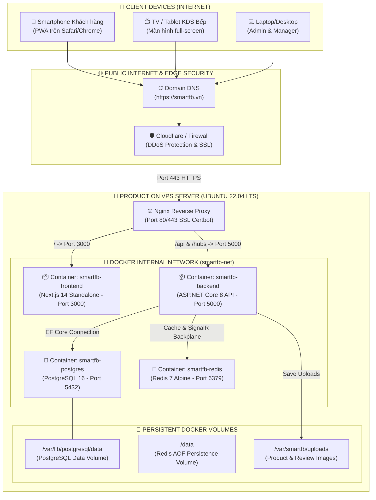

# 🌐 SƠ ĐỒ TRIỂN KHAI & HẠ TẦNG (DEPLOYMENT & INFRASTRUCTURE DIAGRAM)

> **Dự án:** Smart F&B Operating System  
> **Môi trường:** Production VPS Server (Ubuntu 22.04 LTS + Docker Compose + Nginx Reverse Proxy)

---

## 1. SƠ ĐỒ MẠNG & CONTAINER DOCKER (NETWORK & CONTAINER TOPOLOGY)



---

## 2. CẤU HÌNH PRODUCTION DOCKER COMPOSE SPEC

```yaml
version: '3.8'

services:
  smartfb-postgres:
    image: postgres:16-alpine
    container_name: smartfb-postgres
    restart: always
    environment:
      POSTGRES_DB: ${DATABASE_NAME}
      POSTGRES_USER: ${DATABASE_USER}
      POSTGRES_PASSWORD: ${DATABASE_PASSWORD}
    ports:
      - "127.0.0.1:5432:5432"
    volumes:
      - postgres_data:/var/lib/postgresql/data
    networks:
      - smartfb-net

  smartfb-redis:
    image: redis:7-alpine
    container_name: smartfb-redis
    restart: always
    command: redis-server --appendonly yes
    ports:
      - "127.0.0.1:6379:6379"
    volumes:
      - redis_data:/data
    networks:
      - smartfb-net

  smartfb-backend:
    image: smartfb-backend:latest
    container_name: smartfb-backend
    restart: always
    environment:
      - ASPNETCORE_ENVIRONMENT=Production
      - ConnectionStrings__DefaultConnection=Host=smartfb-postgres;Port=5432;Database=${DATABASE_NAME};Username=${DATABASE_USER};Password=${DATABASE_PASSWORD}
      - Redis__ConnectionString=smartfb-redis:6379
    depends_on:
      - smartfb-postgres
      - smartfb-redis
    ports:
      - "127.0.0.1:5000:5000"
    networks:
      - smartfb-net

  smartfb-frontend:
    image: smartfb-frontend:latest
    container_name: smartfb-frontend
    restart: always
    environment:
      - NEXT_PUBLIC_API_URL=https://smartfb.vn/api/v1
      - NEXT_PUBLIC_SIGNALR_URL=https://smartfb.vn/hubs
    depends_on:
      - smartfb-backend
    ports:
      - "127.0.0.1:3000:3000"
    networks:
      - smartfb-net

volumes:
  postgres_data:
  redis_data:

networks:
  smartfb-net:
    driver: bridge
```

---

## 3. CHIẾN LƯỢC BACKUP DỮ LIỆU & PHỤC HỒI (DISASTER RECOVERY)

1. **Auto DB Backup:** Cronjob chạy 2:00 AM hàng ngày thực hiện `pg_dump` nén file SQL lưu sang Cloud Storage (S3 / Google Drive).
2. **Redis Persistence:** Cấu hình Redis `--appendonly yes` (AOF) lưu trữ từng lệnh write xuống ổ đĩa, đảm bảo không mất dữ liệu SignalR session khi khởi động lại server.
3. **Rolling Updates:** Khởi chạy Container bằng Docker Compose không gây downtime cho người dùng.
