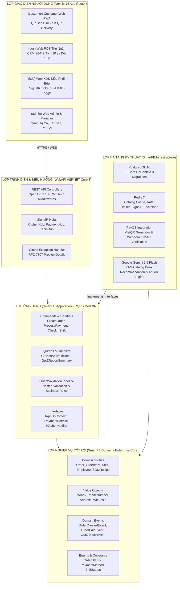
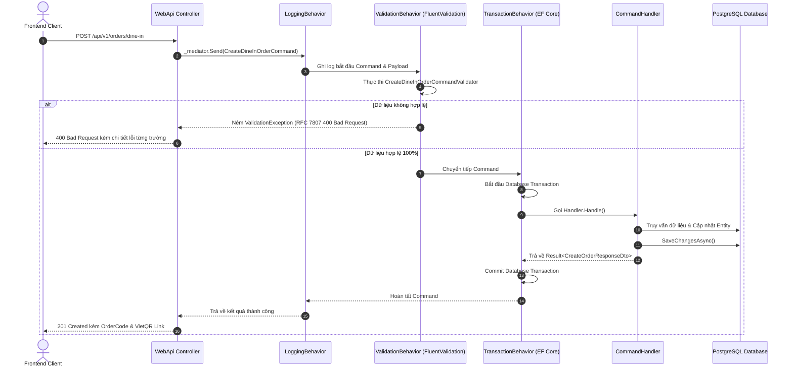
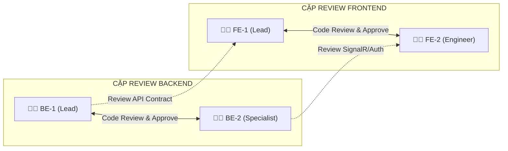
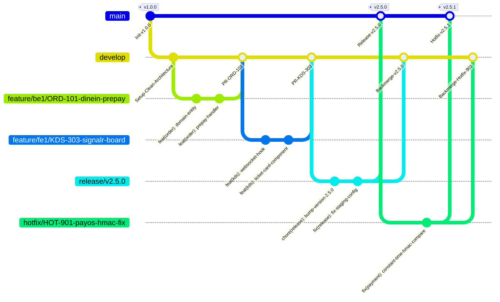

# 🌿 QUY CHUẨN MÃ NGUỒN, CHIẾN LƯỢC NHÁNH GIT & CHECKLIST PULL REQUEST
## HỆ THỐNG QUẢN LÝ VÀ VẬN HÀNH QUÁN CÀ PHÊ THÔNG MINH SMART F&B OS

> [!NOTE]
> **Phiên bản tài liệu:** `v2.5.0-Production-Ready` (Bản chuẩn phục vụ Phát triển & Nghiệm thu đồ án tốt nghiệp Capstone)  
> **Thời gian triển khai:** 16 tuần (4 Tháng) | **Quy mô nhân sự:** 4 Kỹ sư phần mềm (2 Backend Engineers + 2 Frontend Engineers)  
> **Ngăn xếp công nghệ chủ đạo:** .NET 8 (Clean Architecture, MediatR CQRS, EF Core 8) | Next.js 14 (App Router, TypeScript Strict, Tailwind CSS, Zustand, TanStack Query) | PostgreSQL 16 | Redis 7 | SignalR WebSocket | Google Gemini 1.5 Flash  
> **Tài liệu tham chiếu:** `01_Tai_Lieu_Dac_Ta_Goc/Smart_FB_Operating_System.md`, `01_Tai_Lieu_Dac_Ta_Goc/Actor_Phan_Quyen_Chuc_Nang.md`, `03_Quy_Trinh_Trien_Khai/05_Quy_Trinh_Backend.md`, `03_Quy_Trinh_Trien_Khai/06_Quy_Trinh_Frontend.md`.

> [!IMPORTANT]
> **Đặc tả nghiệp vụ bất biến v2.5.0:**
> 1. **100% Pure Web Responsive:** Loại bỏ hoàn toàn ứng dụng di động native/Flutter/React Native. Toàn bộ các đối tượng sử dụng (Khách hàng, Nhân viên thu ngân, Nhân viên pha chế, Quản lý ca, Quản trị viên) tương tác qua trình duyệt web và PWA.
> 2. **Dine-In 2 Nhánh:** Nhánh A (Thanh toán trước qua PayOS VietQR tự động xác thực) và Nhánh B (Thanh toán tiền mặt sau tại quầy, KDS nhận đơn ngay).
> 3. **Delivery:** Thu thập bắt buộc Số điện thoại + Địa chỉ nhận hàng, cố định phí giao hàng 20.000 VNĐ.
> 4. **Takeaway POS:** Tích hợp CRM tra cứu SĐT, tự động tính điểm tích lũy 10 ly đổi 1 ly miễn phí (tối đa 35.000 VNĐ).
> 5. **Chấm công WiFi-Locked:** Xác thực kép 2 lớp qua BSSID (địa chỉ MAC trạm phát) và dải IP Subnet nội bộ chi nhánh.
> 6. **KDS Real-time & BOM:** Nhận vé tức thời qua SignalR WebSocket, hiển thị SLA cảnh báo 3 mức (Xanh, Vàng, Đỏ), hỗ trợ công tắc 86-toggle và trừ kho theo định lượng gam/ml.

> [!WARNING]
> **Nguyên tắc Chất lượng Zero-Placeholder (100% Complete Implementation):**
> Mọi đoạn mã nguồn, lớp đối tượng, hàm xử lý, cấu hình CI/CD và quy chuẩn kỹ thuật trong tài liệu này đều được viết hoàn chỉnh 100%, không chứa mã khung (skeleton code), không dùng ký hiệu giữ chỗ (`// TODO`, `/* rest of code */`, `...`), sẵn sàng biên dịch và thực thi trong môi trường sản xuất thực tế.

---

## 📑 MỤC LỤC CHI TIẾT

1. [TỔNG QUAN HỆ THỐNG & NGUYÊN TẮC PHÁT TRIỂN PHẦN MỀM](#1-tổng-quan-hệ-thống--nguyên-tắc-phát-triển-phần-mềm)
   - [1.1 Tuyên ngôn chất lượng & Quy tắc kỹ thuật cốt lõi](#11-tuyên-ngôn-chất-lượng--quy-tắc-kỹ-thuật-cốt-lõi)
   - [1.2 Sơ đồ ranh giới kiến trúc phân tầng hệ thống](#12-sơ-đồ-ranh-giới-kiến-trúc-phân-tầng-hệ-thống)
2. [QUY CHUẨN MÃ NGUỒN BACKEND .NET 8 & CLEAN ARCHITECTURE](#2-quy-chuẩn-mã-nguồn-backend-net-8--clean-architecture)
   - [2.1 Kiến trúc 4 tầng Clean Architecture & Ranh giới phụ thuộc](#21-kiến-trúc-4-tầng-clean-architecture--ranh-giới-phụ-thuộc)
   - [2.2 Quy ước đặt tên C# chuẩn mực (Naming Conventions)](#22-quy-ước-đặt-tên-c-chuẩn-mực-naming-conventions)
   - [2.3 Mô hình CQRS với MediatR & Pipeline Behaviors](#23-mô-hình-cqrs-với-mediatr--pipeline-behaviors)
   - [2.4 Thực thi Entity Framework Core Best Practices & Database Transactions](#24-thực-thi-entity-framework-core-best-practices--database-transactions)
   - [2.5 Bộ mã nguồn C# mẫu 100% Zero-Placeholder:](#25-bộ-mã-nguồn-c-mẫu-100-zero-placeholder)
     * [`Money.cs` - Value Object chuẩn mực tiền tệ](#251-value-object-chuẩn-mực-tiền-tệ-moneycs)
     * [`Order.cs` - Domain Entity với Invariants & Domain Events](#252-domain-entity-đơn-hàng-ordercs)
     * [`CreateDineInOrderCommand.cs` & `CreateDineInOrderCommandHandler.cs` - CQRS Handler](#253-cqrs-command--mediatr-handler-createdineinordercommandhandlercs)
     * [`CreateDineInOrderCommandValidator.cs` - FluentValidation với Nested Rules](#254-fluentvalidation-validator-createdineinordercommandvalidatorcs)
     * [`GlobalExceptionHandler.cs` - Xử lý ngoại lệ toàn cục chuẩn RFC 7807](#255-global-exception-handler-chuẩn-rfc-7807-globalexceptionhandlercs)
3. [QUY CHUẨN MÃ NGUỒN FRONTEND NEXT.JS 14 & TYPESCRIPT STRICT](#3-quy-chuẩn-mã-nguồn-frontend-nextjs-14--typescript-strict)
   - [3.1 Cấu trúc thư mục App Router & 5 Route Groups](#31-cấu-trúc-thư-mục-app-router--5-route-groups)
   - [3.2 Quy tắc phân định Server Components vs Client Components](#32-quy-tắc-phân-định-server-components-vs-client-components)
   - [3.3 TypeScript Strict Mode & State Management (Zustand + TanStack Query)](#33-typescript-strict-mode--state-management-zustand--tanstack-query)
   - [3.4 Quy chuẩn UI/UX & Khả năng tiếp cận WCAG 2.1 AA](#34-quy-chuẩn-uiux--khả-năng-tiếp-cận-wcag-21-aa)
   - [3.5 Bộ mã nguồn TypeScript/React mẫu 100% Zero-Placeholder:](#35-bộ-mã-nguồn-typescriptreact-mẫu-100-zero-placeholder)
     * [`TableOrderPage.tsx` - React Server Component (RSC)](#351-react-server-component-rsc-tableorderpagetsx)
     * [`ModifierDrawer.tsx` - Client Component với Tùy biến món & a11y](#352-client-component-tùy-biến-món-modifierdrawertsx)
     * [`useSignalRKitchenHub.ts` - Custom Hook SignalR Auto-Reconnect](#353-custom-hook-signalr-auto-reconnect-usesignalrkitchenhubts)
     * [`useCartStore.ts` - Zustand Store Slice với Persist Middleware](#354-zustand-store-slice-quản-lý-giỏ-hàng-usecartstorets)
4. [MA TRẬN PHÂN CHIA TRÁCH NHIỆM & CODE OWNERSHIP (4 KỸ SƯ)](#4-ma-trận-phân-chia-trách-nhiệm--code-ownership-4-kỹ-sư)
   - [4.1 Ma trận phân quyền module & mã nguồn chi tiết](#41-ma-trận-phân-quyền-module--mã-nguồn-chi-tiết)
   - [4.2 Ma trận Review chéo & Phê duyệt Pull Request](#42-ma-trận-review-chéo--phê-duyệt-pull-request)
5. [CHIẾN LƯỢC NHÁNH GITFLOW ENTERPRISE](#5-chiến-lược-nhánh-gitflow-enterprise)
   - [5.1 Sơ đồ Mermaid GitGraph hoàn chỉnh](#51-sơ-đồ-mermaid-gitgraph-hoàn-chỉnh)
   - [5.2 Ma trận vòng đời 7 loại nhánh Git](#52-ma-trận-vòng-đời-7-loại-nhánh-git)
   - [5.3 Quy tắc bảo vệ nhánh (Branch Protection Rules)](#53-quy-tắc-bảo-vệ-nhánh-branch-protection-rules)
   - [5.4 Quy trình đồng bộ mã nguồn & giải quyết xung đột bằng Git Rebase](#54-quy-trình-đồng-bộ-mã-nguồn--giải-quyết-xung-đột-bằng-git-rebase)
6. [QUY CHUẨN CONVENTIONAL COMMITS v1.0.0 & BỘ VÍ DỤ NGHIỆP VỤ F&B](#6-quy-chuẩn-conventional-commits-v100--bộ-ví-dụ-nghiệp-vụ-fb)
   - [6.1 Cấu trúc thông điệp Commit chuẩn v1.0.0](#61-cấu-trúc-thông-điệp-commit-chuẩn-v100)
   - [6.2 Bảng 10 Commit Types được phép sử dụng](#62-bảng-10-commit-types-được-phép-sử-dụng)
   - [6.3 Danh mục 14 Domain Scopes chuẩn hóa F&B](#63-danh-mục-14-domain-scopes-chuẩn-hóa-fb)
   - [6.4 Cú pháp Breaking Changes (`!` và `BREAKING CHANGE:`)](#64-cú-pháp-breaking-changes--và-breaking-change)
   - [6.5 Bộ 25+ ví dụ Commit thực tế bao phủ 100% tính năng Smart F&B OS](#65-bộ-25-ví-dụ-commit-thực-tế-bao-phủ-100-tính-năng-smart-fb-os)
7. [QUY TRÌNH PULL REQUEST & HÀNG RÀO CI/CD QUALITY GATES](#7-quy-trình-pull-request--hàng-rào-cicd-quality-gates)
   - [7.1 Mẫu Pull Request hoàn chỉnh (`.github/pull_request_template.md`)](#71-mẫu-pull-request-hoàn-chỉnh-githubpull_request_templatemd)
   - [7.2 Cấu hình GitHub Actions CI/CD Pipeline YAML hoàn chỉnh (`.github/workflows/ci.yml`)](#72-cấu-hình-github-actions-cicd-pipeline-yaml-hoàn-chỉnh-githubworkflowsciyml)
   - [7.3 Tiêu chuẩn kiểm soát chất lượng SonarQube Quality Gate](#73-tiêu-chuẩn-kiểm-soát-chất-lượng-sonarqube-quality-gate)
8. [TÀI LIỆU CẤU HÌNH BIẾN MÔI TRƯỜNG TOÀN DIỆN (.ENV.EXAMPLE)](#8-tài-liệu-cấu-hình-biến-môi-trường-toàn-diện-envexample)
   - [8.1 Cấu hình Backend (`appsettings.json` / `appsettings.Production.json`)](#81-cấu-hình-backend-appsettingsjson--appsettingsproductionjson)
   - [8.2 Cấu hình Frontend (`.env.local.example` / `.env.production.example`)](#82-cấu-hình-frontend-envlocalexample--envproductionexample)

---

## 1. TỔNG QUAN HỆ THỐNG & NGUYÊN TẮC PHÁT TRIỂN PHẦN MỀM

### 1.1 Tuyên ngôn chất lượng & Quy tắc kỹ thuật cốt lõi
Hệ điều hành Smart F&B OS được xây dựng nhằm giải quyết triệt để bài toán tự động hóa vận hành chuỗi cà phê F&B thông minh. Nhằm bảo đảm tính ổn định, khả năng chịu tải cao trong giờ cao điểm (Peak Hours: 8h-9h30 sáng và 19h-21h30 tối) và tính toàn vẹn dữ liệu giao dịch tài chính, toàn bộ đội ngũ phát triển 4 thành viên cam kết thực thi nghiêm ngặt 5 nguyên tắc vàng:

1. **Clean Architecture Isolation:** Mọi phụ thuộc mã nguồn chỉ hướng vào trong (Inward Dependency Rule). Lớp Domain là lõi nghiệp vụ độc lập, không tham chiếu bất kỳ thư viện framework bên ngoài nào.
2. **Explicit Contracts & CQRS:** Tách bạch hoàn toàn giữa luồng ghi dữ liệu (Commands) và luồng đọc dữ liệu (Queries). Mọi tương tác nghiệp vụ đều được định nghĩa qua Request/Response DTOs và xác thực bằng FluentValidation.
3. **Pure Web First & Accessibility:** Trải nghiệm khách hàng và nhân viên vận hành trên nền tảng Web App chuẩn hóa, tương thích 100% trên các thiết bị di động (Mobile Safari/Chrome), máy tính bảng (Tablet POS/KDS) và màn hình chuyên dụng (Desktop POS) với chuẩn tiếp cận WCAG 2.1 AA.
4. **Idempotency & Concurrency Safety:** Mọi giao dịch tài chính (PayOS VietQR Webhook, thanh toán đơn hàng, trừ kho định lượng BOM) phải đảm bảo tính bất biến khi gọi lặp lại (Idempotency) và được bảo vệ bằng Optimistic Locking / Database Transactions.
5. **Zero-Placeholder Guarantee:** Mã nguồn xuất xưởng phải hoàn chỉnh, có kiểm thử đơn vị (Unit Test) đi kèm, vượt qua kiểm tra chất lượng tĩnh (SonarQube) trước khi được tích hợp vào nhánh chính.

---

### 1.2 Sơ đồ ranh giới kiến trúc phân tầng hệ thống



---

## 2. QUY CHUẨN MÃ NGUỒN BACKEND .NET 8 & CLEAN ARCHITECTURE

### 2.1 Kiến trúc 4 tầng Clean Architecture & Ranh giới phụ thuộc

Hệ thống Backend được tổ chức thành một Visual Studio Solution (`SmartFB.sln`) với 4 dự án phân tầng rõ ràng:

```
SmartFB.Backend/
├── src/
│   ├── SmartFB.Domain/           # Lõi nghiệp vụ (Entities, Value Objects, Enums, Domain Events)
│   ├── SmartFB.Application/      # Ứng dụng & CQRS (Commands, Queries, DTOs, Validators, Behaviors)
│   ├── SmartFB.Infrastructure/   # Hiện thực hạ tầng (EF Core, Redis, PayOS, SignalR, Gemini AI)
│   └── SmartFB.WebApi/           # Điểm vào ứng dụng (Controllers, Middlewares, Program.cs)
└── tests/
    ├── SmartFB.Domain.UnitTests/         # Kiểm thử đơn vị Entity & Value Object
    ├── SmartFB.Application.UnitTests/    # Kiểm thử Handler, Validator & Pipeline
    └── SmartFB.WebApi.IntegrationTests/  # Kiểm thử tích hợp End-to-End với TestContainers
```

#### Quy tắc phụ thuộc bất biến (Dependency Inversion Principles):
1. `SmartFB.Domain` **HOÀN TOÀN ĐỘC LẬP**: Tuyệt đối không chứa tham chiếu đến bất kỳ project nào khác trong solution và không phụ thuộc vào `Microsoft.EntityFrameworkCore`, `Microsoft.AspNetCore`, hay các SDK bên thứ ba.
2. `SmartFB.Application` **CHỈ PHỤ THUỘC VÀO `SmartFB.Domain`**: Chứa toàn bộ giao diện trừu tượng (`IAppDbContext`, `IPaymentService`, `IKitchenRealtimeNotifier`).
3. `SmartFB.Infrastructure` **PHỤ THUỘC VÀO `SmartFB.Application` VÀ `SmartFB.Domain`**: Cài đặt các giao diện bằng thư viện thực tế (Npgsql, StackExchange.Redis, PayOS SDK, Google.Cloud.AI).
4. `SmartFB.WebApi` **PHỤ THUỘC VÀO `SmartFB.Application` VÀ `SmartFB.Infrastructure`**: Đóng vai trò cấu hình Dependency Injection (IoC Container), định tuyến HTTP Request và xử lý ngoại lệ.

---

### 2.2 Quy ước đặt tên C# chuẩn mực (Naming Conventions)

| Thành phần mã nguồn | Quy tắc đặt tên | Tiền tố / Hậu tố | Ví dụ chuẩn (✅ DO) | Ví dụ sai (❌ DON'T) |
|---|---|---|---|---|
| **Classes / Records** | `PascalCase` | Danh từ rõ nghĩa | `Order`, `CreateDineInOrderCommand` | `order`, `clsOrder` |
| **Interfaces** | `PascalCase` | Tiền tố `I` | `IAppDbContext`, `IPaymentService` | `AppDbContextInterface`, `PaymentService` |
| **Enums** | `PascalCase` | Danh từ số ít | `OrderStatus`, `PaymentMethod` | `OrderStatuses`, `enumPayment` |
| **Methods (Async)** | `PascalCase` | Hậu tố `Async` | `ProcessVietQrWebhookAsync` | `ProcessVietQrWebhook`, `doWebhook` |
| **Private Fields** | `_camelCase` | Tiền tố `_` | `_dbContext`, `_logger` | `dbContext`, `m_dbContext` |
| **Parameters / Locals** | `camelCase` | Danh từ rõ nghĩa | `orderId`, `totalAmount` | `id`, `o`, `data`, `temp` |
| **Constants** | `PascalCase` | Danh từ bất biến | `DefaultDeliveryFee`, `MaxItemLimit` | `DEFAULT_DELIVERY_FEE`, `kMax` |
| **Commands / Queries** | `PascalCase` | Hậu tố `Command` / `Query` | `CreateDineInOrderCommand`, `GetActiveTicketsQuery` | `CreateOrder`, `GetTickets` |
| **DTOs / Responses** | `PascalCase` | Hậu tố `Dto` / `Response` | `CreateOrderResponseDto`, `KdsTicketDto` | `OrderResult`, `TicketData` |
| **Validators** | `PascalCase` | Hậu tố `Validator` | `CreateDineInOrderCommandValidator` | `ValidateOrderCommand` |
| **Domain Events** | `PascalCase` | Hậu tố `DomainEvent` | `OrderCreatedDomainEvent`, `OrderPaidDomainEvent` | `OrderEvent`, `PaidNotification` |

---

### 2.3 Mô hình CQRS với MediatR & Pipeline Behaviors

Dự án áp dụng mô hình CQRS (Command Query Responsibility Segregation) thông qua MediatR 12.x. Mọi thao tác ghi dữ liệu hoặc thực thi nghiệp vụ đều đi qua MediatR Pipeline với 3 lớp lọc tự động:



---

### 2.4 Thực thi Entity Framework Core Best Practices & Database Transactions

Để đạt hiệu năng tối đa và ngăn chặn triệt để các lỗi rò rỉ kết nối, nghẽn I/O và xung đột dữ liệu:

1. **Explicit AsNoTracking:** Toàn bộ các truy vấn chỉ đọc (Queries) bắt buộc sử dụng `.AsNoTracking()` để vô hiệu hóa Change Tracker, giúp tiết kiệm bộ nhớ RAM và tăng tốc độ xử lý lên 30-50%.
2. **Projections qua `.Select()`:** Tuyệt đối không nạp toàn bộ Entity lớn khi chỉ cần một vài trường hiển thị. Luôn dùng `.Select(x => new Dto { ... })` để Entity Framework Core sinh câu lệnh SQL `SELECT` chính xác các cột cần thiết.
3. **Eager Loading với `.Include()` có kiểm soát:** Ngăn chặn lỗi N+1 Query bằng cách nạp trước các quan hệ liên quan thông qua `.Include()` và `.ThenInclude()`. Cấm tuyệt đối Lazy Loading trong môi trường sản xuất.
4. **Optimistic Concurrency Control:** Các bảng dữ liệu thường xuyên cập nhật trạng thái (Orders, Shifts, InventoryStock) bắt buộc có cột `xmin` (PostgreSQL concurrency token) hoặc `byte[] RowVersion` để ngăn chặn hiện tượng Lost Update khi nhiều thu ngân cùng thao tác.
5. **Isolation Scope cho Database Transaction:** Giới hạn phạm vi Transaction ở mức ngắn nhất. Tuyệt đối không đặt các lời gọi API bên ngoài (gọi PayOS, gọi Gemini AI, gửi Webhook) bên trong khối Transaction đang giữ khóa bảng cơ sở dữ liệu.

---

### 2.5 Bộ mã nguồn C# mẫu 100% Zero-Placeholder

#### 2.5.1 Value Object chuẩn mực tiền tệ (`Money.cs`)

```csharp
// ============================================================================
// File: src/SmartFB.Domain/ValueObjects/Money.cs
// Project: Smart F&B Operating System (v2.5.0-Production-Ready)
// Description: Immutable Value Object đại diện cho số tiền trong hệ thống.
// Tuân thủ nghiêm ngặt chuẩn tiền tệ VND, không hỗ trợ số âm và đảm bảo an toàn phép tính.
// ============================================================================

namespace SmartFB.Domain.ValueObjects;

public sealed record Money : IComparable<Money>
{
    public decimal Amount { get; }
    public string Currency { get; }

    public static readonly Money Zero = new(0m, "VND");

    private Money(decimal amount, string currency)
    {
        if (amount < 0)
        {
            throw new ArgumentOutOfRangeException(nameof(amount), "Số tiền trong hệ thống F&B không thể là số âm.");
        }

        // Chuẩn hóa làm tròn tiền tệ VND: không có chữ số thập phân
        Amount = decimal.Round(amount, 0, MidpointRounding.AwayFromZero);
        Currency = string.IsNullOrWhiteSpace(currency) ? "VND" : currency.Trim().ToUpperInvariant();

        if (Currency != "VND")
        {
            throw new InvalidOperationException($"Hệ thống Smart F&B OS hiện chỉ hỗ trợ đơn vị tiền tệ VND, không chấp nhận: {currency}");
        }
    }

    public static Money FromVnd(decimal amount) => new(amount, "VND");

    public static Money operator +(Money left, Money right)
    {
        EnsureSameCurrency(left, right);
        return new Money(left.Amount + right.Amount, left.Currency);
    }

    public static Money operator -(Money left, Money right)
    {
        EnsureSameCurrency(left, right);
        if (left.Amount < right.Amount)
        {
            throw new InvalidOperationException($"Không thể trừ số tiền {right.Amount:N0} {right.Currency} từ {left.Amount:N0} {left.Currency} vì kết quả sẽ bị âm.");
        }
        return new Money(left.Amount - right.Amount, left.Currency);
    }

    public static Money operator *(Money money, decimal multiplier)
    {
        if (multiplier < 0)
        {
            throw new ArgumentOutOfRangeException(nameof(multiplier), "Hệ số nhân tiền tệ không thể là số âm.");
        }
        return new Money(money.Amount * multiplier, money.Currency);
    }

    public static Money operator *(decimal multiplier, Money money) => money * multiplier;

    public static bool operator >(Money left, Money right)
    {
        EnsureSameCurrency(left, right);
        return left.Amount > right.Amount;
    }

    public static bool operator <(Money left, Money right)
    {
        EnsureSameCurrency(left, right);
        return left.Amount < right.Amount;
    }

    public static bool operator >=(Money left, Money right)
    {
        EnsureSameCurrency(left, right);
        return left.Amount >= right.Amount;
    }

    public static bool operator <=(Money left, Money right)
    {
        EnsureSameCurrency(left, right);
        return left.Amount <= right.Amount;
    }

    public int CompareTo(Money? other)
    {
        if (other is null) return 1;
        EnsureSameCurrency(this, other);
        return Amount.CompareTo(other.Amount);
    }

    public override string ToString() => $"{Amount:N0} ₫";

    private static void EnsureSameCurrency(Money left, Money right)
    {
        if (left.Currency != right.Currency)
        {
            throw new InvalidOperationException($"Không thể thực hiện phép tính giữa 2 đơn vị tiền tệ khác nhau: {left.Currency} và {right.Currency}");
        }
    }
}
```

---

#### 2.5.2 Domain Entity Đơn hàng (`Order.cs`)

```csharp
// ============================================================================
// File: src/SmartFB.Domain/Entities/Order.cs
// Project: Smart F&B Operating System (v2.5.0-Production-Ready)
// Description: Entity gốc (Aggregate Root) quản lý toàn bộ vòng đời đơn hàng.
// Đóng gói 100% logic nghiệp vụ 3 kênh: DineIn (2 nhánh), Delivery (20k ship), TakeAway.
// ============================================================================

using SmartFB.Domain.Common;
using SmartFB.Domain.Enums;
using SmartFB.Domain.Events;
using SmartFB.Domain.Exceptions;
using SmartFB.Domain.ValueObjects;

namespace SmartFB.Domain.Entities;

public sealed class Order : BaseAuditableEntity
{
    public Guid BranchId { get; private set; }
    public Guid? TableId { get; private set; }
    public Guid? CustomerId { get; private set; }
    public string OrderCode { get; private set; }
    public OrderChannel Channel { get; private set; }
    public OrderStatus Status { get; private set; }
    public PaymentMethod PaymentMethod { get; private set; }
    public PaymentStatus PaymentStatus { get; private set; }
    public Money SubTotal { get; private set; }
    public Money ShippingFee { get; private set; }
    public Money DiscountAmount { get; private set; }
    public Money TotalAmount { get; private set; }
    public string? CustomerPhone { get; private set; }
    public string? DeliveryAddress { get; private set; }
    public string? Note { get; private set; }
    public DateTime CreatedAtUtc { get; private set; }
    public DateTime? PaidAtUtc { get; private set; }
    public DateTime? CompletedAtUtc { get; private set; }
    public DateTime? CancelledAtUtc { get; private set; }
    public string? CancelReason { get; private set; }

    private readonly List<OrderItem> _items = new();
    public IReadOnlyCollection<OrderItem> Items => _items.AsReadOnly();

    private Order() // Bắt buộc cho EF Core ORM Mapping
    {
        OrderCode = string.Empty;
        SubTotal = Money.Zero;
        ShippingFee = Money.Zero;
        DiscountAmount = Money.Zero;
        TotalAmount = Money.Zero;
    }

    /// <summary>
    /// Khởi tạo đơn dùng tại bàn (Dine-In)
    /// Nhánh A (VietQR): Trạng thái PendingPayment, đợi Webhook xác nhận mới vào Bếp.
    /// Nhánh B (Tiền mặt): Trạng thái Confirmed, vào Bếp ngay lập tức.
    /// </summary>
    public static Order CreateDineInOrder(
        Guid branchId,
        Guid tableId,
        string orderCode,
        PaymentMethod paymentMethod,
        string? note,
        DateTime utcNow)
    {
        if (branchId == Guid.Empty) throw new DomainException("Chi nhánh (BranchId) không được để trống.");
        if (tableId == Guid.Empty) throw new DomainException("Mã bàn (TableId) bắt buộc đối với đơn phục vụ tại chỗ.");
        if (string.IsNullOrWhiteSpace(orderCode)) throw new DomainException("Mã đơn hàng (OrderCode) không hợp lệ.");

        var order = new Order
        {
            Id = Guid.NewGuid(),
            BranchId = branchId,
            TableId = tableId,
            OrderCode = orderCode,
            Channel = OrderChannel.DineIn,
            PaymentMethod = paymentMethod,
            Status = paymentMethod == PaymentMethod.VietQr ? OrderStatus.PendingPayment : OrderStatus.Confirmed,
            PaymentStatus = PaymentStatus.Unpaid,
            SubTotal = Money.Zero,
            ShippingFee = Money.Zero,
            DiscountAmount = Money.Zero,
            TotalAmount = Money.Zero,
            Note = note?.Trim(),
            CreatedAtUtc = utcNow
        };

        order.AddDomainEvent(new OrderCreatedDomainEvent(order.Id, order.OrderCode, order.BranchId, order.Channel, order.Status));
        return order;
    }

    /// <summary>
    /// Khởi tạo đơn giao hàng tận nơi (Delivery) - Phí vận chuyển cố định 20.000 VNĐ
    /// </summary>
    public static Order CreateDeliveryOrder(
        Guid branchId,
        string customerPhone,
        string deliveryAddress,
        string orderCode,
        PaymentMethod paymentMethod,
        string? note,
        DateTime utcNow)
    {
        if (branchId == Guid.Empty) throw new DomainException("Chi nhánh (BranchId) không được để trống.");
        if (string.IsNullOrWhiteSpace(customerPhone)) throw new DomainException("Số điện thoại khách hàng là bắt buộc đối với đơn Delivery.");
        if (string.IsNullOrWhiteSpace(deliveryAddress)) throw new DomainException("Địa chỉ nhận hàng là bắt buộc đối với đơn Delivery.");

        var order = new Order
        {
            Id = Guid.NewGuid(),
            BranchId = branchId,
            TableId = null,
            CustomerPhone = customerPhone.Trim(),
            DeliveryAddress = deliveryAddress.Trim(),
            OrderCode = orderCode,
            Channel = OrderChannel.Delivery,
            PaymentMethod = paymentMethod,
            Status = paymentMethod == PaymentMethod.VietQr ? OrderStatus.PendingPayment : OrderStatus.Confirmed,
            PaymentStatus = PaymentStatus.Unpaid,
            SubTotal = Money.Zero,
            ShippingFee = Money.FromVnd(20000m), // Cố định 20.000 VNĐ theo spec v2.5.0
            DiscountAmount = Money.Zero,
            TotalAmount = Money.FromVnd(20000m),
            Note = note?.Trim(),
            CreatedAtUtc = utcNow
        };

        order.AddDomainEvent(new OrderCreatedDomainEvent(order.Id, order.OrderCode, order.BranchId, order.Channel, order.Status));
        return order;
    }

    public void AddItem(
        Guid menuItemId,
        Guid itemSizeId,
        string itemName,
        string sizeName,
        decimal unitPrice,
        int quantity,
        string? note,
        IReadOnlyList<OrderItemTopping>? toppings = null)
    {
        if (Status != OrderStatus.PendingPayment && Status != OrderStatus.Confirmed)
        {
            throw new DomainException($"Không thể thêm món vào đơn hàng đang ở trạng thái {Status}.");
        }

        if (quantity <= 0 || quantity > 50)
        {
            throw new DomainException("Số lượng từng món phải từ 1 đến tối đa 50 phần.");
        }

        var orderItem = new OrderItem(
            Id,
            menuItemId,
            itemSizeId,
            itemName,
            sizeName,
            unitPrice,
            quantity,
            note,
            toppings
        );

        _items.Add(orderItem);
        RecalculateTotals();
    }

    public void ApplyDiscount(Money discount)
    {
        if (discount > SubTotal)
        {
            throw new DomainException($"Số tiền giảm giá ({discount}) không thể vượt quá tổng tiền món ({SubTotal}).");
        }

        DiscountAmount = discount;
        RecalculateTotals();
    }

    public void MarkAsPaid(DateTime paidAtUtc)
    {
        if (PaymentStatus == PaymentStatus.Paid)
        {
            return; // Đảm bảo tính Idempotent nếu Webhook gọi lại
        }

        PaymentStatus = PaymentStatus.Paid;
        PaidAtUtc = paidAtUtc;

        if (Status == OrderStatus.PendingPayment)
        {
            Status = OrderStatus.Confirmed;
        }

        AddDomainEvent(new OrderPaidDomainEvent(Id, OrderCode, BranchId, TotalAmount.Amount, Channel));
    }

    public void CancelOrder(string reason, DateTime cancelledAtUtc)
    {
        if (Status == OrderStatus.Completed)
        {
            throw new DomainException("Không thể hủy đơn hàng đã hoàn tất phục vụ.");
        }

        if (Status == OrderStatus.Cancelled)
        {
            return;
        }

        Status = OrderStatus.Cancelled;
        CancelledAtUtc = cancelledAtUtc;
        CancelReason = string.IsNullOrWhiteSpace(reason) ? "Hủy theo yêu cầu khách hàng" : reason.Trim();

        AddDomainEvent(new OrderCancelledDomainEvent(Id, OrderCode, BranchId, CancelReason));
    }

    private void RecalculateTotals()
    {
        decimal itemsTotal = _items.Sum(item => item.TotalPrice.Amount);
        SubTotal = Money.FromVnd(itemsTotal);
        TotalAmount = Money.FromVnd(itemsTotal + ShippingFee.Amount - DiscountAmount.Amount);
    }
}

public sealed class OrderItem : BaseEntity
{
    public Guid OrderId { get; private set; }
    public Guid MenuItemId { get; private set; }
    public Guid ItemSizeId { get; private set; }
    public string ItemName { get; private set; }
    public string SizeName { get; private set; }
    public Money UnitPrice { get; private set; }
    public int Quantity { get; private set; }
    public Money TotalPrice { get; private set; }
    public string? Note { get; private set; }

    private readonly List<OrderItemTopping> _toppings = new();
    public IReadOnlyCollection<OrderItemTopping> Toppings => _toppings.AsReadOnly();

    private OrderItem()
    {
        ItemName = string.Empty;
        SizeName = string.Empty;
        UnitPrice = Money.Zero;
        TotalPrice = Money.Zero;
    }

    public OrderItem(
        Guid orderId,
        Guid menuItemId,
        Guid itemSizeId,
        string itemName,
        string sizeName,
        decimal unitPrice,
        int quantity,
        string? note,
        IReadOnlyList<OrderItemTopping>? toppings)
    {
        Id = Guid.NewGuid();
        OrderId = orderId;
        MenuItemId = menuItemId;
        ItemSizeId = itemSizeId;
        ItemName = itemName.Trim();
        SizeName = sizeName.Trim();
        UnitPrice = Money.FromVnd(unitPrice);
        Quantity = quantity;
        Note = note?.Trim();

        if (toppings != null && toppings.Count > 0)
        {
            _toppings.AddRange(toppings);
        }

        decimal toppingsUnitSum = _toppings.Sum(t => t.Price.Amount);
        TotalPrice = Money.FromVnd((unitPrice + toppingsUnitSum) * quantity);
    }
}

public sealed class OrderItemTopping : BaseEntity
{
    public Guid OrderItemId { get; private set; }
    public Guid ToppingId { get; private set; }
    public string ToppingName { get; private set; }
    public Money Price { get; private set; }

    private OrderItemTopping()
    {
        ToppingName = string.Empty;
        Price = Money.Zero;
    }

    public OrderItemTopping(Guid toppingId, string toppingName, decimal price)
    {
        Id = Guid.NewGuid();
        ToppingId = toppingId;
        ToppingName = toppingName.Trim();
        Price = Money.FromVnd(price);
    }
}
```

---

#### 2.5.3 CQRS Command & MediatR Handler (`CreateDineInOrderCommandHandler.cs`)

```csharp
// ============================================================================
// File: src/SmartFB.Application/Features/Orders/Commands/CreateDineInOrder/CreateDineInOrderCommand.cs
// Project: Smart F&B Operating System (v2.5.0-Production-Ready)
// Description: CQRS Command & DTOs khởi tạo đơn hàng tại bàn (Dine-In).
// ============================================================================

using MediatR;
using SmartFB.Application.Common.Models;
using SmartFB.Domain.Enums;

namespace SmartFB.Application.Features.Orders.Commands.CreateDineInOrder;

public sealed record CreateDineInOrderCommand(
    Guid BranchId,
    Guid TableId,
    PaymentMethod PaymentMethod,
    string? Note,
    IReadOnlyList<OrderItemRequestDto> Items
) : IRequest<Result<CreateOrderResponseDto>>;

public sealed record OrderItemRequestDto(
    Guid MenuItemId,
    Guid ItemSizeId,
    int Quantity,
    string? Note,
    IReadOnlyList<OrderItemToppingRequestDto>? Toppings
);

public sealed record OrderItemToppingRequestDto(
    Guid ToppingId,
    string ToppingName,
    decimal Price
);

public sealed record CreateOrderResponseDto(
    Guid OrderId,
    string OrderCode,
    OrderStatus Status,
    PaymentStatus PaymentStatus,
    decimal TotalAmount,
    string? PaymentQrUrl,
    DateTime CreatedAtUtc
);
```

```csharp
// ============================================================================
// File: src/SmartFB.Application/Features/Orders/Commands/CreateDineInOrder/CreateDineInOrderCommandHandler.cs
// Project: Smart F&B Operating System (v2.5.0-Production-Ready)
// Description: Handler thực thi logic khởi tạo đơn Dine-In, kiểm tra tính khả dụng,
// tạo liên kết PayOS VietQR (Nhánh A) hoặc thông báo SignalR KDS ngay lập tức (Nhánh B).
// ============================================================================

using MediatR;
using Microsoft.EntityFrameworkCore;
using Microsoft.Extensions.Logging;
using SmartFB.Application.Common.Interfaces;
using SmartFB.Application.Common.Models;
using SmartFB.Domain.Entities;
using SmartFB.Domain.Enums;

namespace SmartFB.Application.Features.Orders.Commands.CreateDineInOrder;

public sealed class CreateDineInOrderCommandHandler : IRequestHandler<CreateDineInOrderCommand, Result<CreateOrderResponseDto>>
{
    private readonly IAppDbContext _dbContext;
    private readonly IPaymentService _paymentService;
    private readonly IKitchenRealtimeNotifier _kitchenNotifier;
    private readonly IDateTimeProvider _dateTimeProvider;
    private readonly ILogger<CreateDineInOrderCommandHandler> _logger;

    public CreateDineInOrderCommandHandler(
        IAppDbContext dbContext,
        IPaymentService paymentService,
        IKitchenRealtimeNotifier kitchenNotifier,
        IDateTimeProvider dateTimeProvider,
        ILogger<CreateDineInOrderCommandHandler> logger)
    {
        _dbContext = dbContext;
        _paymentService = paymentService;
        _kitchenNotifier = kitchenNotifier;
        _dateTimeProvider = dateTimeProvider;
        _logger = logger;
    }

    public async Task<Result<CreateOrderResponseDto>> Handle(
        CreateDineInOrderCommand request,
        CancellationToken cancellationToken)
    {
        _logger.LogInformation("Đang khởi tạo đơn hàng Dine-In cho Chi nhánh {BranchId} - Bàn {TableId}", request.BranchId, request.TableId);

        // 1. Kiểm tra sự tồn tại và tính khả dụng của Chi nhánh & Bàn
        var table = await _dbContext.Tables
            .AsNoTracking()
            .FirstOrDefaultAsync(t => t.Id == request.TableId && t.BranchId == request.BranchId, cancellationToken);

        if (table is null)
        {
            return Result<CreateOrderResponseDto>.Failure($"Không tìm thấy bàn {request.TableId} tại chi nhánh chỉ định.");
        }

        if (!table.IsActive)
        {
            return Result<CreateOrderResponseDto>.Failure("Bàn này hiện đang tạm ngưng phục vụ.");
        }

        // 2. Sinh mã đơn hàng chuẩn format: DIN-YYMMDD-XXXX
        DateTime nowUtc = _dateTimeProvider.UtcNow;
        string orderCode = $"DIN-{nowUtc:yyMMdd}-{Random.Shared.Next(1000, 9999)}";

        var order = Order.CreateDineInOrder(
            request.BranchId,
            request.TableId,
            orderCode,
            request.PaymentMethod,
            request.Note,
            nowUtc
        );

        // 3. Thêm chi tiết món và toppings kèm kiểm tra dữ liệu giá thực tế từ Database
        foreach (var itemDto in request.Items)
        {
            var menuItem = await _dbContext.MenuItems
                .AsNoTracking()
                .FirstOrDefaultAsync(m => m.Id == itemDto.MenuItemId && m.IsActive, cancellationToken);

            if (menuItem is null)
            {
                return Result<CreateOrderResponseDto>.Failure($"Món {itemDto.MenuItemId} không tồn tại hoặc đã ngưng bán.");
            }

            var itemSize = await _dbContext.ItemSizes
                .AsNoTracking()
                .FirstOrDefaultAsync(s => s.Id == itemDto.ItemSizeId && s.MenuItemId == itemDto.MenuItemId, cancellationToken);

            if (itemSize is null)
            {
                return Result<CreateOrderResponseDto>.Failure($"Kích cỡ {itemDto.ItemSizeId} không hợp lệ cho món {menuItem.Name}.");
            }

            List<OrderItemTopping>? toppings = null;
            if (itemDto.Toppings != null && itemDto.Toppings.Count > 0)
            {
                toppings = itemDto.Toppings
                    .Select(t => new OrderItemTopping(t.ToppingId, t.ToppingName, t.Price))
                    .ToList();
            }

            order.AddItem(
                menuItem.Id,
                itemSize.Id,
                menuItem.Name,
                itemSize.Name,
                itemSize.Price,
                itemDto.Quantity,
                itemDto.Note,
                toppings
            );
        }

        // 4. Lưu đơn hàng vào PostgreSQL
        await _dbContext.Orders.AddAsync(order, cancellationToken);
        await _dbContext.SaveChangesAsync(cancellationToken);

        string? paymentQrUrl = null;

        // 5. Xử lý phân nhánh thanh toán theo Master Spec v2.5.0
        if (request.PaymentMethod == PaymentMethod.VietQr)
        {
            // Nhánh A (VietQR Thanh toán trước): Sinh link thanh toán PayOS
            var paymentResult = await _paymentService.CreateVietQrPaymentLinkAsync(
                order.Id,
                order.OrderCode,
                order.TotalAmount.Amount,
                cancellationToken);

            if (!paymentResult.IsSuccess)
            {
                _logger.LogError("Không thể tạo liên kết PayOS VietQR cho đơn {OrderCode}: {Error}", order.OrderCode, paymentResult.ErrorMessage);
                return Result<CreateOrderResponseDto>.Failure($"Lỗi tích hợp cổng thanh toán: {paymentResult.ErrorMessage}");
            }

            paymentQrUrl = paymentResult.QrCodeUrl;
        }
        else
        {
            // Nhánh B (Tiền mặt Thanh toán sau): Phát vé ngay lập tức cho màn hình Bếp KDS qua SignalR
            await _kitchenNotifier.BroadcastNewTicketAsync(order.BranchId, order.Id, cancellationToken);
        }

        _logger.LogInformation("Khởi tạo đơn hàng thành công: {OrderCode} | Tổng tiền: {TotalAmount:N0} VND", order.OrderCode, order.TotalAmount.Amount);

        return Result<CreateOrderResponseDto>.Success(new CreateOrderResponseDto(
            order.Id,
            order.OrderCode,
            order.Status,
            order.PaymentStatus,
            order.TotalAmount.Amount,
            paymentQrUrl,
            order.CreatedAtUtc
        ));
    }
}
```

---

#### 2.5.4 FluentValidation Validator (`CreateDineInOrderCommandValidator.cs`)

```csharp
// ============================================================================
// File: src/SmartFB.Application/Features/Orders/Commands/CreateDineInOrder/CreateDineInOrderCommandValidator.cs
// Project: Smart F&B Operating System (v2.5.0-Production-Ready)
// Description: Validator kiểm tra tính hợp lệ của Command khởi tạo đơn Dine-In.
// ============================================================================

using FluentValidation;

namespace SmartFB.Application.Features.Orders.Commands.CreateDineInOrder;

public sealed class CreateDineInOrderCommandValidator : AbstractValidator<CreateDineInOrderCommand>
{
    public CreateDineInOrderCommandValidator()
    {
        RuleFor(x => x.BranchId)
            .NotEmpty().WithMessage("Mã chi nhánh (BranchId) không được để trống.");

        RuleFor(x => x.TableId)
            .NotEmpty().WithMessage("Mã bàn (TableId) bắt buộc đối với đơn dùng tại bàn.");

        RuleFor(x => x.PaymentMethod)
            .IsInEnum().WithMessage("Phương thức thanh toán không hợp lệ (Hỗ trợ: VietQr, Cash).");

        RuleFor(x => x.Note)
            .MaximumLength(500).WithMessage("Ghi chú đơn hàng không được vượt quá 500 ký tự.");

        RuleFor(x => x.Items)
            .NotEmpty().WithMessage("Đơn hàng phải có ít nhất 01 món.")
            .Must(items => items.Count <= 50).WithMessage("Đơn hàng không được vượt quá 50 loại món khác nhau.");

        RuleForEach(x => x.Items).ChildRules(item =>
        {
            item.RuleFor(i => i.MenuItemId)
                .NotEmpty().WithMessage("Mã món (MenuItemId) không được để trống.");

            item.RuleFor(i => i.ItemSizeId)
                .NotEmpty().WithMessage("Mã kích cỡ (ItemSizeId) không được để trống.");

            item.RuleFor(i => i.Quantity)
                .GreaterThan(0).WithMessage("Số lượng từng món phải lớn hơn 0.")
                .LessThanOrEqualTo(20).WithMessage("Số lượng tối đa cho mỗi dòng món là 20 phần.");

            item.RuleFor(i => i.Note)
                .MaximumLength(200).WithMessage("Ghi chú món không được vượt quá 200 ký tự.");

            item.RuleForEach(i => i.Toppings).ChildRules(topping =>
            {
                topping.RuleFor(t => t.ToppingId)
                    .NotEmpty().WithMessage("Mã topping không được để trống.");

                topping.RuleFor(t => t.ToppingName)
                    .NotEmpty().WithMessage("Tên topping không được để trống.")
                    .MaximumLength(100).WithMessage("Tên topping tối đa 100 ký tự.");

                topping.RuleFor(t => t.Price)
                    .GreaterThanOrEqualTo(0).WithMessage("Đơn giá topping không thể là số âm.");
            });
        });
    }
}
```

---

#### 2.5.5 Global Exception Handler chuẩn RFC 7807 (`GlobalExceptionHandler.cs`)

```csharp
// ============================================================================
// File: src/SmartFB.WebApi/Middlewares/GlobalExceptionHandler.cs
// Project: Smart F&B Operating System (v2.5.0-Production-Ready)
// Description: Middleware bắt ngoại lệ toàn cục chuyển đổi sang chuẩn RFC 7807 ProblemDetails.
// ============================================================================

using System.Diagnostics;
using FluentValidation;
using Microsoft.AspNetCore.Diagnostics;
using Microsoft.AspNetCore.Mvc;
using SmartFB.Domain.Exceptions;

namespace SmartFB.WebApi.Middlewares;

public sealed class GlobalExceptionHandler : IExceptionHandler
{
    private readonly ILogger<GlobalExceptionHandler> _logger;

    public GlobalExceptionHandler(ILogger<GlobalExceptionHandler> logger)
    {
        _logger = logger;
    }

    public async ValueTask<bool> TryHandleAsync(
        HttpContext httpContext,
        Exception exception,
        CancellationToken cancellationToken)
    {
        var traceId = Activity.Current?.Id ?? httpContext.TraceIdentifier;
        _logger.LogError(exception, "Phát hiện ngoại lệ chưa được xử lý. TraceId: {TraceId} | Path: {Path}", traceId, httpContext.Request.Path);

        var (statusCode, title, detail, errorsDictionary) = exception switch
        {
            ValidationException validationEx => (
                StatusCodes.Status400BadRequest,
                "Lỗi Xác Thực Dữ Liệu (Validation Error)",
                "Một hoặc nhiều trường dữ liệu đầu vào không đáp ứng quy chuẩn nghiệp vụ.",
                validationEx.Errors
                    .GroupBy(e => e.PropertyName)
                    .ToDictionary(g => g.Key, g => (object)g.Select(e => e.ErrorMessage).ToArray())
            ),
            DomainException domainEx => (
                StatusCodes.Status422UnprocessableEntity,
                "Vi Phạm Quy Tắc Nghiệp Vụ (Business Rule Violation)",
                domainEx.Message,
                null
            ),
            KeyNotFoundException notFoundEx => (
                StatusCodes.Status404NotFound,
                "Không Tìm Thấy Tài Nguyên (Resource Not Found)",
                notFoundEx.Message,
                null
            ),
            UnauthorizedAccessException unauthorizedEx => (
                StatusCodes.Status401Unauthorized,
                "Không Có Quyền Truy Cập (Unauthorized)",
                unauthorizedEx.Message,
                null
            ),
            InvalidOperationException invalidOpEx => (
                StatusCodes.Status409Conflict,
                "Xung Đột Trạng Thái Hệ Thống (Conflict)",
                invalidOpEx.Message,
                null
            ),
            _ => (
                StatusCodes.Status500InternalServerError,
                "Lỗi Máy Chủ Nội Bộ (Internal Server Error)",
                "Đã xảy ra sự cố không mong muốn trên hệ thống. Vui lòng liên hệ kỹ thuật viên hỗ trợ.",
                null
            )
        };

        var problemDetails = new ProblemDetails
        {
            Status = statusCode,
            Title = title,
            Detail = detail,
            Instance = httpContext.Request.Path,
            Extensions =
            {
                ["traceId"] = traceId,
                ["timestamp"] = DateTime.UtcNow.ToString("o")
            }
        };

        if (errorsDictionary is not null)
        {
            problemDetails.Extensions["errors"] = errorsDictionary;
        }

        httpContext.Response.StatusCode = statusCode;
        httpContext.Response.ContentType = "application/problem+json";

        await httpContext.Response.WriteAsJsonAsync(problemDetails, cancellationToken);
        return true;
    }
}
```

---

## 3. QUY CHUẨN MÃ NGUỒN FRONTEND NEXT.JS 14 & TYPESCRIPT STRICT

### 3.1 Cấu trúc thư mục App Router & 5 Route Groups

Ứng dụng Frontend xây dựng trên Next.js 14 App Router, tổ chức thành 5 nhóm định tuyến (Route Groups) độc lập theo vai trò Actor:

```
SmartFB.Frontend/
├── src/
│   ├── app/
│   │   ├── (auth)/                  # Xác thực người dùng (/login, /forgot-password)
│   │   ├── (customer)/              # Khách hàng Web PWA (QR Bàn /table & QR Giao hàng /delivery)
│   │   │   ├── table/[branchId]/[tableCode]/
│   │   │   └── delivery/[branchId]/
│   │   ├── (pos)/                   # Quầy Thu Ngân Web POS (/pos, /pos/loyalty)
│   │   ├── (kds)/                   # Bảng Điều Phối Bếp (/kds)
│   │   ├── (admin)/                 # Quản trị viên & Quản lý ca (/admin, /manager)
│   │   ├── layout.tsx               # Root Layout chuẩn hóa Font Inter & Theme Provider
│   │   └── globals.css              # Tailwind CSS 3.4 & Design Tokens
│   ├── components/
│   │   ├── ui/                      # Base primitives (Radix UI / Shadcn UI)
│   │   ├── customer/                # Components dành riêng cho Khách hàng
│   │   ├── pos/                     # Components dành riêng cho Thu ngân
│   │   ├── kds/                     # Components bảng điều phối Bếp
│   │   └── admin/                   # Components biểu đồ báo cáo P&L
│   ├── hooks/                       # Custom Hooks (useSignalRKitchenHub, useDebounce)
│   ├── stores/                      # Zustand State Stores (useCartStore, useAuthStore)
│   ├── lib/                         # Tiện ích, Axios/Fetch wrapper, formatters
│   └── types/                       # TypeScript Interface & Type Definitions
└── package.json
```

---

### 3.2 Quy tắc phân định Server Components vs Client Components

| Tiêu chí so sánh | React Server Components (RSC) | Client Components (`"use client"`) |
|---|---|---|
| **Vị trí thực thi** | Chỉ chạy trên Node.js Server trong quá trình build hoặc request | Chạy trên Trình duyệt Web (Browser) sau khi nạp mã JS |
| **Mặc định trong Next.js 14** | ✅ Mọi tệp trong `app/` mặc định là RSC | ⚠️ Phải có khai báo `"use client"` ở dòng đầu tiên |
| **Khi nào bắt buộc dùng** | 1. Đọc trực tiếp dữ liệu từ Backend API (Fetch / ISR).<br>2. Giữ an toàn biến môi trường bí mật (`INTERNAL_API_URL`).<br>3. Tối ưu SEO & giảm tải kích thước JS bundle cho trình duyệt. | 1. Cần sử dụng React State (`useState`, `useReducer`).<br>2. Cần lắng nghe tương tác người dùng (`onClick`, `onChange`).<br>3. Dùng Custom Hooks, Zustand store, SignalR WebSocket.<br>4. Dùng Web APIs (`localStorage`, `navigator.geolocation`). |
| **Quy tắc ranh giới** | RSC có thể import và render Client Component | Client Component **KHÔNG ĐƯỢC** import trực tiếp RSC |

---

### 3.3 TypeScript Strict Mode & State Management (Zustand + TanStack Query)

1. **Strict Type Safety:** File `tsconfig.json` bắt buộc bật `"strict": true`, `"noImplicitAny": true`, `"strictNullChecks": true`. Cấm tuyệt đối kiểu `any`. Mọi dữ liệu không xác định phải dùng `unknown` kèm Type Narrowing / Type Guards.
2. **Server State (TanStack Query v5):** Quản lý toàn bộ dữ liệu bất đồng bộ từ REST API với cơ chế tự động cache, retry khi mất mạng và invalidate queries khi dữ liệu thay đổi.
3. **Client State (Zustand Slices):** Quản lý trạng thái cục bộ của giao diện (Giỏ hàng món, Lựa chọn Modifier, Token đăng nhập) với middleware `persist` lưu trữ an toàn trong `localStorage`.

---

### 3.4 Quy chuẩn UI/UX & Khả năng tiếp cận WCAG 2.1 AA

1. **Touch Targets:** Toàn bộ các nút bấm, ô chọn topping, nút tăng/giảm số lượng phải có diện tích chạm tối thiểu **44 x 44 px** để thao tác thuận tiện trên màn hình cảm ứng điện thoại và máy POS.
2. **Tương phản màu sắc (Color Contrast):** Độ tương phản giữa chữ và nền đạt tỷ lệ tối thiểu 4.5:1 đối với văn bản thông thường và 3.0:1 đối với văn bản lớn/biểu tượng (Chuẩn WCAG 2.1 AA).
3. **Hỗ trợ bàn phím & Screen Reader:** Sử dụng đầy đủ các thuộc tính semantic HTML, `aria-label`, `role`, và quản lý `focus-visible` khi thao tác bằng phím Tab hoặc máy đọc màn hình.

---

### 3.5 Bộ mã nguồn TypeScript/React mẫu 100% Zero-Placeholder

#### 3.5.1 React Server Component (RSC) (`TableOrderPage.tsx`)

```tsx
// ============================================================================
// File: src/app/(customer)/table/[branchId]/[tableCode]/page.tsx
// Project: Smart F&B Operating System (v2.5.0-Production-Ready)
// Description: React Server Component nạp dữ liệu thông tin bàn và thực đơn chi nhánh.
// ============================================================================

import { Suspense } from "react";
import { notFound } from "next/navigation";
import type { Metadata } from "next";
import { TableHeaderBanner } from "@/components/customer/TableHeaderBanner";
import { CategoryNavTabs } from "@/components/customer/CategoryNavTabs";
import { MenuItemGrid } from "@/components/customer/MenuItemGrid";
import { FloatingCartBar } from "@/components/customer/FloatingCartBar";
import { SkeletonMenuLoading } from "@/components/customer/SkeletonMenuLoading";

interface PageProps {
  params: {
    branchId: string;
    tableCode: string;
  };
}

interface TableMetadata {
  id: string;
  code: string;
  branchId: string;
  branchName: string;
  isActive: boolean;
}

export async function generateMetadata({ params }: PageProps): Promise<Metadata> {
  return {
    title: `Gọi Món Tại Bàn ${params.tableCode} - Smart F&B`,
    description: `Đặt đồ uống trực tiếp tại bàn ${params.tableCode} không cần chờ đợi.`,
  };
}

async function fetchTableMetadata(branchId: string, tableCode: string): Promise<TableMetadata | null> {
  const apiUrl = process.env.INTERNAL_API_URL || "https://api.smartfb.vn/api/v1";

  try {
    const res = await fetch(`${apiUrl}/branches/${branchId}/tables/${tableCode}`, {
      next: { revalidate: 60 }, // ISR Caching trong 60 giây
      headers: { "Content-Type": "application/json" }
    });

    if (!res.ok) {
      if (res.status === 404) return null;
      throw new Error(`Lỗi nạp thông tin bàn: ${res.statusText}`);
    }

    return (await res.json()) as TableMetadata;
  } catch (error: unknown) {
    console.error("Lỗi khi kết nối đến API Gateway:", error);
    return null;
  }
}

export default async function TableOrderPage({ params }: PageProps) {
  const table = await fetchTableMetadata(params.branchId, params.tableCode);

  if (!table || !table.isActive) {
    notFound();
  }

  return (
    <main className="min-h-screen bg-neutral-950 text-neutral-50 pb-28">
      {/* Banner thông tin Chi nhánh & Tên Bàn */}
      <TableHeaderBanner
        branchName={table.branchName}
        tableCode={table.code}
      />

      {/* Thanh điều hướng Danh mục món dính trên cùng */}
      <div className="sticky top-0 z-20 bg-neutral-950/90 backdrop-blur-md border-b border-neutral-800">
        <CategoryNavTabs branchId={params.branchId} />
      </div>

      {/* Danh sách món ăn có phân luồng Suspense Streaming */}
      <div className="max-w-md mx-auto px-4 py-4">
        <Suspense fallback={<SkeletonMenuLoading />}>
          <MenuItemGrid branchId={params.branchId} />
        </Suspense>
      </div>

      {/* Thanh hiển thị giỏ hàng nổi chân trang */}
      <FloatingCartBar
        branchId={params.branchId}
        tableId={table.id}
        tableCode={table.code}
      />
    </main>
  );
}
```

---

#### 3.5.2 Client Component Tùy biến món (`ModifierDrawer.tsx`)

```tsx
"use client";

// ============================================================================
// File: src/components/customer/ModifierDrawer.tsx
// Project: Smart F&B Operating System (v2.5.0-Production-Ready)
// Description: Drawer tùy biến chọn size, đường, đá, topping và ghi chú món.
// Đạt chuẩn tiếp cận WCAG 2.1 AA với touch target >= 44px.
// ============================================================================

import React, { useState } from "react";
import {
  Drawer,
  DrawerContent,
  DrawerHeader,
  DrawerTitle,
  DrawerFooter,
  DrawerDescription
} from "@/components/ui/drawer";
import { Button } from "@/components/ui/button";
import { RadioGroup, RadioGroupItem } from "@/components/ui/radio-group";
import { Checkbox } from "@/components/ui/checkbox";
import { Textarea } from "@/components/ui/textarea";
import { useCartStore } from "@/stores/useCartStore";
import { formatVndCurrency } from "@/lib/utils/formatters";

export interface ItemSize {
  id: string;
  name: string;
  price: number;
}

export interface ItemTopping {
  id: string;
  name: string;
  price: number;
}

export interface MenuItemDetail {
  id: string;
  name: string;
  description: string;
  imageUrl: string;
  sizes: ItemSize[];
  toppings: ItemTopping[];
}

interface ModifierDrawerProps {
  isOpen: boolean;
  onClose: () => void;
  item: MenuItemDetail;
}

export const ModifierDrawer: React.FC<ModifierDrawerProps> = ({ isOpen, onClose, item }) => {
  const [selectedSize, setSelectedSize] = useState<ItemSize>(item.sizes[0]);
  const [selectedSweetness, setSelectedSweetness] = useState<string>("100%");
  const [selectedIce, setSelectedIce] = useState<string>("100%");
  const [selectedToppings, setSelectedToppings] = useState<ItemTopping[]>([]);
  const [quantity, setQuantity] = useState<number>(1);
  const [specialNote, setSpecialNote] = useState<string>("");

  const addItem = useCartStore((state) => state.addItem);

  const calculateItemTotal = (): number => {
    const toppingTotal = selectedToppings.reduce((sum, t) => sum + t.price, 0);
    return (selectedSize.price + toppingTotal) * quantity;
  };

  const handleToggleTopping = (topping: ItemTopping) => {
    setSelectedToppings((prev) =>
      prev.some((t) => t.id === topping.id)
        ? prev.filter((t) => t.id !== topping.id)
        : [...prev, topping]
    );
  };

  const handleAddToCart = () => {
    const toppingTotal = selectedToppings.reduce((sum, t) => sum + t.price, 0);
    addItem({
      menuItemId: item.id,
      name: item.name,
      size: selectedSize,
      sweetness: selectedSweetness,
      ice: selectedIce,
      toppings: selectedToppings,
      quantity,
      note: specialNote.trim() || undefined,
      unitPrice: selectedSize.price + toppingTotal
    });
    onClose();
  };

  return (
    <Drawer open={isOpen} onOpenChange={(open) => !open && onClose()}>
      <DrawerContent className="bg-neutral-900 border-t border-neutral-800 text-neutral-100 max-h-[90vh]">
        <DrawerHeader className="border-b border-neutral-800 pb-3 text-left">
          <DrawerTitle className="text-xl font-bold text-emerald-400">{item.name}</DrawerTitle>
          <DrawerDescription className="text-sm text-neutral-400">{item.description}</DrawerDescription>
        </DrawerHeader>

        <div className="overflow-y-auto px-4 py-4 space-y-6">
          {/* Lựa chọn Kích cỡ (Size) */}
          <section aria-labelledby="size-heading">
            <h4 id="size-heading" className="text-xs font-bold uppercase tracking-wider text-neutral-400 mb-3">
              1. Chọn Kích Cỡ (Bắt buộc)
            </h4>
            <RadioGroup
              value={selectedSize.id}
              onValueChange={(id) => {
                const size = item.sizes.find((s) => s.id === id);
                if (size) setSelectedSize(size);
              }}
              className="space-y-2"
            >
              {item.sizes.map((size) => (
                <label
                  key={size.id}
                  htmlFor={`size-${size.id}`}
                  className="flex items-center justify-between p-3.5 rounded-xl border border-neutral-800 bg-neutral-950 cursor-pointer min-h-[48px] hover:border-emerald-500/50 transition-colors"
                >
                  <div className="flex items-center gap-3">
                    <RadioGroupItem value={size.id} id={`size-${size.id}`} />
                    <span className="font-medium text-sm">{size.name}</span>
                  </div>
                  <span className="text-sm text-emerald-400 font-semibold">{formatVndCurrency(size.price)}</span>
                </label>
              ))}
            </RadioGroup>
          </section>

          {/* Lựa chọn Mức đường */}
          <section aria-labelledby="sweetness-heading">
            <h4 id="sweetness-heading" className="text-xs font-bold uppercase tracking-wider text-neutral-400 mb-3">
              2. Mức Đường
            </h4>
            <div className="grid grid-cols-4 gap-2">
              {["0%", "30%", "70%", "100%"].map((level) => (
                <Button
                  key={level}
                  type="button"
                  variant={selectedSweetness === level ? "default" : "outline"}
                  className={`min-h-[44px] font-medium text-sm ${
                    selectedSweetness === level
                      ? "bg-emerald-600 hover:bg-emerald-500 text-white"
                      : "border-neutral-800 bg-neutral-950 text-neutral-300"
                  }`}
                  onClick={() => setSelectedSweetness(level)}
                >
                  {level}
                </Button>
              ))}
            </div>
          </section>

          {/* Lựa chọn Mức đá */}
          <section aria-labelledby="ice-heading">
            <h4 id="ice-heading" className="text-xs font-bold uppercase tracking-wider text-neutral-400 mb-3">
              3. Mức Đá
            </h4>
            <div className="grid grid-cols-4 gap-2">
              {["0%", "30%", "70%", "100%"].map((level) => (
                <Button
                  key={level}
                  type="button"
                  variant={selectedIce === level ? "default" : "outline"}
                  className={`min-h-[44px] font-medium text-sm ${
                    selectedIce === level
                      ? "bg-emerald-600 hover:bg-emerald-500 text-white"
                      : "border-neutral-800 bg-neutral-950 text-neutral-300"
                  }`}
                  onClick={() => setSelectedIce(level)}
                >
                  {level}
                </Button>
              ))}
            </div>
          </section>

          {/* Danh sách Toppings */}
          {item.toppings.length > 0 && (
            <section aria-labelledby="topping-heading">
              <h4 id="topping-heading" className="text-xs font-bold uppercase tracking-wider text-neutral-400 mb-3">
                4. Thêm Topping
              </h4>
              <div className="space-y-2">
                {item.toppings.map((topping) => {
                  const isChecked = selectedToppings.some((t) => t.id === topping.id);
                  return (
                    <label
                      key={topping.id}
                      htmlFor={`topping-${topping.id}`}
                      className="flex items-center justify-between p-3.5 rounded-xl border border-neutral-800 bg-neutral-950 cursor-pointer min-h-[48px] hover:border-emerald-500/50 transition-colors"
                    >
                      <div className="flex items-center gap-3">
                        <Checkbox
                          id={`topping-${topping.id}`}
                          checked={isChecked}
                          onCheckedChange={() => handleToggleTopping(topping)}
                        />
                        <span className="text-sm font-medium">{topping.name}</span>
                      </div>
                      <span className="text-sm text-neutral-300">+{formatVndCurrency(topping.price)}</span>
                    </label>
                  );
                })}
              </div>
            </section>
          )}

          {/* Ghi chú đặc biệt */}
          <section aria-labelledby="note-heading">
            <h4 id="note-heading" className="text-xs font-bold uppercase tracking-wider text-neutral-400 mb-2">
              5. Ghi Chú Riêng Cho Món
            </h4>
            <Textarea
              placeholder="Vd: Ít sữa đặc, uống nóng, tách đá riêng..."
              value={specialNote}
              onChange={(e) => setSpecialNote(e.target.value)}
              maxLength={200}
              className="bg-neutral-950 border-neutral-800 text-neutral-100 text-sm min-h-[70px]"
            />
          </section>

          {/* Số lượng */}
          <section className="flex items-center justify-between pt-2 border-t border-neutral-800">
            <span className="font-semibold text-sm text-neutral-200">Số lượng:</span>
            <div className="flex items-center gap-3">
              <Button
                type="button"
                size="icon"
                variant="outline"
                className="h-11 w-11 rounded-full border-neutral-700 bg-neutral-900 text-xl font-bold"
                onClick={() => setQuantity((q) => Math.max(1, q - 1))}
                disabled={quantity <= 1}
                aria-label="Giảm số lượng"
              >
                -
              </Button>
              <span className="w-8 text-center font-bold text-lg">{quantity}</span>
              <Button
                type="button"
                size="icon"
                variant="outline"
                className="h-11 w-11 rounded-full border-neutral-700 bg-neutral-900 text-xl font-bold"
                onClick={() => setQuantity((q) => Math.min(20, q + 1))}
                disabled={quantity >= 20}
                aria-label="Tăng số lượng"
              >
                +
              </Button>
            </div>
          </section>
        </div>

        <DrawerFooter className="border-t border-neutral-800 pt-3">
          <Button
            type="button"
            className="w-full bg-emerald-600 hover:bg-emerald-500 text-white font-bold h-12 text-base shadow-lg shadow-emerald-950/50"
            onClick={handleAddToCart}
          >
            Thêm Vào Giỏ Hàng • {formatVndCurrency(calculateItemTotal())}
          </Button>
        </DrawerFooter>
      </DrawerContent>
    </Drawer>
  );
};
```

---

#### 3.5.3 Custom Hook SignalR Auto-Reconnect (`useSignalRKitchenHub.ts`)

```typescript
// ============================================================================
// File: src/hooks/useSignalRKitchenHub.ts
// Project: Smart F&B Operating System (v2.5.0-Production-Ready)
// Description: Hook quản lý kết nối SignalR WebSocket thời gian thực cho Bếp KDS.
// Hỗ trợ tự động kết nối lại (Exponential Backoff), gia nhập nhóm chi nhánh và đồng bộ trạng thái.
// ============================================================================

import { useEffect, useRef, useState, useCallback } from "react";
import * as signalR from "@microsoft/signalr";

export interface KdsTicketItem {
  itemId: string;
  itemName: string;
  sizeName: string;
  quantity: number;
  sweetness?: string;
  ice?: string;
  toppings: string[];
  note?: string;
}

export interface KdsTicket {
  orderId: string;
  orderCode: string;
  tableCode?: string;
  channel: "DineIn" | "Delivery" | "TakeAway";
  status: "PendingPayment" | "Confirmed" | "Preparing" | "Ready";
  createdAtUtc: string;
  elapsedMinutes: number;
  urgencyLevel: "Normal" | "Warning" | "Critical";
  items: KdsTicketItem[];
}

interface UseSignalRKitchenHubOptions {
  branchId: string;
  accessToken: string;
  onNewTicket?: (ticket: KdsTicket) => void;
  onTicketStatusChanged?: (orderId: string, newStatus: string) => void;
  onItem86Toggled?: (menuItemId: string, isAvailable: boolean) => void;
}

interface UseSignalRKitchenHubReturn {
  isConnected: boolean;
  connectionError: string | null;
  reconnectAttempt: number;
  updateTicketStatus: (orderId: string, status: string) => Promise<boolean>;
}

export function useSignalRKitchenHub({
  branchId,
  accessToken,
  onNewTicket,
  onTicketStatusChanged,
  onItem86Toggled
}: UseSignalRKitchenHubOptions): UseSignalRKitchenHubReturn {
  const [isConnected, setIsConnected] = useState<boolean>(false);
  const [connectionError, setConnectionError] = useState<string | null>(null);
  const [reconnectAttempt, setReconnectAttempt] = useState<number>(0);
  const hubConnectionRef = useRef<signalR.HubConnection | null>(null);

  const connect = useCallback(async () => {
    if (hubConnectionRef.current) {
      return;
    }

    const hubUrl = process.env.NEXT_PUBLIC_SIGNALR_KITCHEN_HUB_URL || "https://api.smartfb.vn/hubs/kitchen";

    const connection = new signalR.HubConnectionBuilder()
      .withUrl(hubUrl, {
        accessTokenFactory: () => accessToken,
        transport: signalR.HttpTransportType.WebSockets,
        skipNegotiation: true
      })
      .withAutomaticReconnect({
        nextRetryDelayInMilliseconds: (retryContext) => {
          // Thử lại theo Exponential Backoff: 0s, 2s, 5s, 10s, 30s
          const delays = [0, 2000, 5000, 10000, 30000];
          const delay = delays[retryContext.previousAttempts] ?? 30000;
          setReconnectAttempt(retryContext.previousAttempts + 1);
          return delay;
        }
      })
      .configureLogging(signalR.LogLevel.Warning)
      .build();

    // Đăng ký các sự kiện thời gian thực
    connection.on("ReceiveNewKitchenTicket", (ticket: KdsTicket) => {
      onNewTicket?.(ticket);
    });

    connection.on("ReceiveTicketStatusUpdate", (orderId: string, newStatus: string) => {
      onTicketStatusChanged?.(orderId, newStatus);
    });

    connection.on("ReceiveItem86Toggle", (menuItemId: string, isAvailable: boolean) => {
      onItem86Toggled?.(menuItemId, isAvailable);
    });

    connection.onreconnecting((error) => {
      setIsConnected(false);
      setConnectionError(`Mất kết nối tới KDS Hub: ${error?.message || "Đang kết nối lại..."}`);
    });

    connection.onreconnected(async () => {
      setIsConnected(true);
      setConnectionError(null);
      setReconnectAttempt(0);
      await connection.invoke("JoinBranchKitchenGroup", branchId);
    });

    connection.onclose((error) => {
      setIsConnected(false);
      if (error) {
        setConnectionError(`Kết nối KDS Hub đã đóng do lỗi: ${error.message}`);
      }
    });

    try {
      await connection.start();
      await connection.invoke("JoinBranchKitchenGroup", branchId);
      hubConnectionRef.current = connection;
      setIsConnected(true);
      setConnectionError(null);
      setReconnectAttempt(0);
    } catch (err: unknown) {
      const errorMsg = err instanceof Error ? err.message : "Không thể thiết lập kết nối WebSocket tới Bếp KDS.";
      setIsConnected(false);
      setConnectionError(errorMsg);
    }
  }, [branchId, accessToken, onNewTicket, onTicketStatusChanged, onItem86Toggled]);

  useEffect(() => {
    connect();

    return () => {
      if (hubConnectionRef.current) {
        hubConnectionRef.current.stop();
        hubConnectionRef.current = null;
      }
    };
  }, [connect]);

  const updateTicketStatus = useCallback(async (orderId: string, status: string): Promise<boolean> => {
    if (!hubConnectionRef.current || !isConnected) {
      setConnectionError("Không thể cập nhật: Mất kết nối tới KDS Hub.");
      return false;
    }

    try {
      await hubConnectionRef.current.invoke("UpdateTicketStatus", branchId, orderId, status);
      return true;
    } catch (error: unknown) {
      console.error("Lỗi khi cập nhật trạng thái vé qua SignalR:", error);
      return false;
    }
  }, [branchId, isConnected]);

  return {
    isConnected,
    connectionError,
    reconnectAttempt,
    updateTicketStatus
  };
}
```

---

#### 3.5.4 Zustand Store Slice Quản lý Giỏ hàng (`useCartStore.ts`)

```typescript
// ============================================================================
// File: src/stores/useCartStore.ts
// Project: Smart F&B Operating System (v2.5.0-Production-Ready)
// Description: Zustand Store Slice quản lý trạng thái giỏ hàng khách hàng.
// Tích hợp middleware persist lưu trữ LocalStorage và tự động tính toán phí ship 20.000 VND.
// ============================================================================

import { create } from "zustand";
import { persist, createJSONStorage } from "zustand/middleware";

export interface CartItem {
  id: string; // Khóa định danh duy nhất của dòng món trong giỏ (UUID)
  menuItemId: string;
  name: string;
  size: { id: string; name: string; price: number };
  sweetness: string;
  ice: string;
  toppings: Array<{ id: string; name: string; price: number }>;
  quantity: number;
  note?: string;
  unitPrice: number;
}

interface CartState {
  items: CartItem[];
  branchId: string | null;
  tableId: string | null;
  tableCode: string | null;
  deliveryAddress: string | null;
  customerPhone: string | null;
  shippingFee: number;
  orderChannel: "DineIn" | "Delivery" | "TakeAway";

  // Actions
  setDineInContext: (branchId: string, tableId: string, tableCode: string) => void;
  setDeliveryContext: (branchId: string, phone: string, address: string) => void;
  setTakeAwayContext: (branchId: string, phone?: string) => void;
  addItem: (item: Omit<CartItem, "id">) => void;
  removeItem: (id: string) => void;
  updateQuantity: (id: string, delta: number) => void;
  clearCart: () => void;

  // Selectors
  getSubTotal: () => number;
  getTotalAmount: () => number;
  getItemCount: () => number;
}

export const useCartStore = create<CartState>()(
  persist(
    (set, get) => ({
      items: [],
      branchId: null,
      tableId: null,
      tableCode: null,
      deliveryAddress: null,
      customerPhone: null,
      shippingFee: 0,
      orderChannel: "DineIn",

      setDineInContext: (branchId, tableId, tableCode) =>
        set({
          branchId,
          tableId,
          tableCode,
          orderChannel: "DineIn",
          shippingFee: 0,
          deliveryAddress: null
        }),

      setDeliveryContext: (branchId, phone, address) =>
        set({
          branchId,
          tableId: null,
          tableCode: null,
          customerPhone: phone,
          deliveryAddress: address,
          orderChannel: "Delivery",
          shippingFee: 20000 // Cố định 20.000 VNĐ theo spec v2.5.0
        }),

      setTakeAwayContext: (branchId, phone) =>
        set({
          branchId,
          tableId: null,
          tableCode: null,
          customerPhone: phone ?? null,
          deliveryAddress: null,
          orderChannel: "TakeAway",
          shippingFee: 0
        }),

      addItem: (itemData) => {
        const state = get();
        // Kiểm tra xem món có cùng Size, Đường, Đá, Topping và Ghi chú đã có trong giỏ chưa
        const existingIndex = state.items.findIndex(
          (item) =>
            item.menuItemId === itemData.menuItemId &&
            item.size.id === itemData.size.id &&
            item.sweetness === itemData.sweetness &&
            item.ice === itemData.ice &&
            item.note === itemData.note &&
            JSON.stringify(item.toppings.map((t) => t.id).sort()) ===
              JSON.stringify(itemData.toppings.map((t) => t.id).sort())
        );

        if (existingIndex > -1) {
          const updatedItems = [...state.items];
          const newQty = Math.min(20, updatedItems[existingIndex].quantity + itemData.quantity);
          updatedItems[existingIndex] = {
            ...updatedItems[existingIndex],
            quantity: newQty
          };
          set({ items: updatedItems });
        } else {
          const newItem: CartItem = {
            ...itemData,
            id: crypto.randomUUID()
          };
          set({ items: [...state.items, newItem] });
        }
      },

      removeItem: (id) =>
        set((state) => ({
          items: state.items.filter((item) => item.id !== id)
        })),

      updateQuantity: (id, delta) =>
        set((state) => ({
          items: state.items
            .map((item) => {
              if (item.id === id) {
                const newQty = item.quantity + delta;
                return newQty > 0 && newQty <= 20 ? { ...item, quantity: newQty } : null;
              }
              return item;
            })
            .filter((item): item is CartItem => item !== null)
        })),

      clearCart: () => set({ items: [] }),

      getSubTotal: () => {
        return get().items.reduce((sum, item) => sum + item.unitPrice * item.quantity, 0);
      },

      getTotalAmount: () => {
        return get().getSubTotal() + get().shippingFee;
      },

      getItemCount: () => {
        return get().items.reduce((count, item) => count + item.quantity, 0);
      }
    }),
    {
      name: "smartfb-cart-storage-v250",
      storage: createJSONStorage(() => localStorage)
    }
  )
);
```

---

## 4. MA TRẬN PHÂN CHIA TRÁCH NHIỆM & CODE OWNERSHIP (4 KỸ SƯ)

### 4.1 Ma trận phân quyền module & mã nguồn chi tiết

Để loại bỏ hoàn toàn tình trạng xung đột mã nguồn và nghẽn tiến độ, dự án phân định ranh giới sở hữu mã nguồn (Code Ownership) chặt chẽ cho 4 kỹ sư:

| Thành viên & Vai trò | Phạm vi trách nhiệm chính | Danh mục Modules sở hữu độc quyền | Đường dẫn tệp / thư mục phụ trách |
|---|---|---|---|
| 👨‍💻 **BE-1**<br>*(Backend Lead & System Architect)* | • Kiến trúc Clean Architecture Core & Database 3NF<br>• PostgreSQL Migrations & Seeding 25 Tables<br>• Xử lý Đơn hàng 3 Kênh (DineIn, Delivery, TakeAway)<br>• Tích hợp Cổng PayOS VietQR & Webhook HMAC-SHA256<br>• Định lượng món & Quản lý tồn kho nguyên liệu (BOM Recipe) | `DomainCore`, `OrdersModule`, `PaymentsModule`, `InventoryBOMModule` | • `src/SmartFB.Domain/Entities/Order*`<br>• `src/SmartFB.Application/Features/Orders/*`<br>• `src/SmartFB.Infrastructure/Persistence/*`<br>• `src/SmartFB.Infrastructure/Payments/*`<br>• `src/SmartFB.Application/Features/Inventory/*` |
| 👨‍💻 **BE-2**<br>*(Backend Specialist & Real-Time Lead)* | • Xác thực JWT, Refresh Token & Phân quyền RBAC 4 Actors<br>• Chấm công WiFi 2 lớp (Khóa BSSID MAC & IP Subnet)<br>• SignalR WebSocket Hubs (KitchenHub, PaymentHub)<br>• Quản lý Ca, Két tiền thu ngân & Biên bản Z-Report<br>• Tích hợp Trợ lý AI Gemini 1.5 & Apriori Combo Engine | `AuthIdentityModule`, `AttendanceModule`, `SignalRHubs`, `ShiftsModule`, `AIEngineModule` | • `src/SmartFB.Infrastructure/Identity/*`<br>• `src/SmartFB.Application/Features/Attendance/*`<br>• `src/SmartFB.Infrastructure/SignalR/*`<br>• `src/SmartFB.Application/Features/Shifts/*`<br>• `src/SmartFB.Infrastructure/AI/*` |
| 👩‍💻 **FE-1**<br>*(Frontend Lead & UI/UX Specialist)* | • Customer PWA (Quét QR Bàn Dine-in & QR Delivery 20k)<br>• Web KDS Điều phối Bếp Real-Time & 86-Toggle<br>• Giao diện Trò chuyện Chatbot AI-1 & RAG Catalog<br>• Design System, Tailwind Theme & Shared UI Primitives<br>• Quản lý State Giỏ hàng Zustand & React Server Components | `CustomerPortal`, `KdsPortal`, `ChatbotUI`, `SharedDesignSystem` | • `src/app/(customer)/*`<br>• `src/app/(kds)/*`<br>• `src/components/customer/*`<br>• `src/components/kds/*`<br>• `src/components/ui/*`<br>• `src/stores/useCartStore.ts` |
| 👨‍💻 **FE-2**<br>*(Frontend Engineer & Staff Portals Lead)* | • Web POS Quầy Thu Ngân & CRM Tra Cứu Khách Hàng SĐT<br>• Đổi Thưởng Điểm Tích Lũy (10 Ly Đổi 1 Ly Mang Về)<br>• Web Chấm Công Nhân Viên (Xác thực WiFi Chi Nhánh)<br>• Web Manager Quản Lý Ca, Kiểm Kê Két Tiền & Menu<br>• Web Admin Dashboard Báo Cáo Doanh Thu & P&L | `PosPortal`, `LoyaltyUI`, `StaffAttendanceUI`, `ManagerPortal`, `AdminDashboard` | • `src/app/(pos)/*`<br>• `src/app/(pos)/loyalty/*`<br>• `src/app/(auth)/*`<br>• `src/app/(admin)/*`<br>• `src/components/pos/*`<br>• `src/components/admin/*` |

---

### 4.2 Ma trận Review chéo & Phê duyệt Pull Request



1. **Quy tắc phê duyệt nội bộ Stack:**
   - Mọi PR Backend do BE-1 tạo phải được BE-2 review và approve; ngược lại PR do BE-2 tạo phải được BE-1 approve.
   - Mọi PR Frontend do FE-1 tạo phải được FE-2 review và approve; ngược lại PR do FE-2 tạo phải được FE-1 approve.
2. **Quy tắc phê duyệt chéo Interface/Contract:**
   - Khi có thay đổi về DTOs, API Endpoints, OpenAPI Spec hoặc SignalR Hub Events, bắt buộc có thêm ít nhất **01 Approval** từ Lead của stack đối diện (BE-1 hoặc FE-1).

---

## 5. CHIẾN LƯỢC NHÁNH GITFLOW ENTERPRISE

### 5.1 Sơ đồ Mermaid GitGraph hoàn chỉnh

Hệ thống áp dụng mô hình phân nhánh GitFlow chuẩn doanh nghiệp cho nhóm 4 thành viên:



---

### 5.2 Ma trận vòng đời 7 loại nhánh Git

| Tên Nhánh / Định dạng | Nhánh Gốc (From) | Nhánh Đích (Merge Into) | Chiến Lược Merge | Vòng Đời (Lifecycle) | Quyền Phê Duyệt & Merge |
|---|---|---|---|---|---|
| `main` | - | - | - | Vĩnh viễn (Protected) | Lead Admin (qua Release / Hotfix PR) |
| `staging` | `develop` | - | Merge Commit | Vĩnh viễn (Protected) | Tự động Deploy khi develop pass CI |
| `develop` | `main` | `main` (qua `release/*`) | Squash & Merge | Vĩnh viễn (Protected) | Tech Lead sau khi đủ 2 Approvals |
| `feature/{dev}/{ticket}-{desc}` | `develop` | `develop` | Squash & Merge | Tạm thời (Tự động xóa sau khi merge) | Dev tạo PR, 2 Peers approve |
| `bugfix/{ticket}-{desc}` | `develop` | `develop` | Squash & Merge | Tạm thời (Tự động xóa sau khi merge) | Dev tạo PR, 1 Peer approve |
| `release/v{X.Y.Z}` | `develop` | `main` & `develop` | Merge Commit + Tag | Tạm thời (Xóa sau khi đóng bản phát hành) | Tech Lead |
| `hotfix/{ticket}-{desc}` | `main` | `main` & `develop` | Merge Commit + Tag | Tạm thời (Xóa sau khi vá lỗi Production) | Tech Lead & Security Lead |

---

### 5.3 Quy tắc bảo vệ nhánh (Branch Protection Rules)

Cấu hình bắt buộc trên GitHub Repository Settings cho 2 nhánh `main` và `develop`:

1. **Require a pull request before merging:**
   - Cấm hoàn toàn `git push --force` và direct commit vào `main`, `staging`, `develop`.
   - Bắt buộc tối thiểu **02 Approvals** hợp lệ (1 Tech Lead + 1 Peer Developer cùng stack).
   - Tự động hủy phê duyệt khi có commit mới đẩy lên PR (`Dismiss stale pull request approvals when new commits are pushed`).
2. **Require status checks to pass before merging:**
   - Backend CI: `dotnet build` (Exit Code 0) + `dotnet test` (100% tests pass).
   - Frontend CI: `npm run lint` (0 errors) + `npx tsc --noEmit` + `npm run build`.
   - SonarQube Quality Gate: Đạt 100% tiêu chuẩn chất lượng nghiêm ngặt.
3. **Require linear history:**
   - Yêu cầu lịch sử commit tuyến tính, không chấp nhận merge bubble trên nhánh `develop`.
4. **Include administrators:**
   - Áp dụng toàn bộ quy tắc bảo vệ đối với cả Repository Admins và Tech Lead.

---

### 5.4 Quy trình đồng bộ mã nguồn & giải quyết xung đột bằng Git Rebase

> [!CAUTION]
> **Tuyệt đối KHÔNG sử dụng `git merge develop`** vào nhánh `feature/*` vì sẽ tạo commit rác (`Merge branch 'develop' into feature/...`) làm vỡ cấu trúc linear history. Toàn bộ lập trình viên bắt buộc phải sử dụng `git rebase develop`.

#### Quy trình 8 bước đồng bộ và xử lý xung đột chuẩn xác:

```bash
# ----------------------------------------------------------------------------
# Bước 1: Lưu tạm thời các thay đổi đang dở dang trong Workspace (nếu có)
# ----------------------------------------------------------------------------
git stash save "WIP-before-rebase"

# ----------------------------------------------------------------------------
# Bước 2: Chuyển về nhánh develop cục bộ và kéo mã nguồn mới nhất từ remote
# ----------------------------------------------------------------------------
git checkout develop
git pull --rebase origin develop

# ----------------------------------------------------------------------------
# Bước 3: Chuyển lại về nhánh tính năng của bạn
# ----------------------------------------------------------------------------
git checkout feature/be1/ORD-101-dinein-prepay

# ----------------------------------------------------------------------------
# Bước 4: Thực hiện Rebase nhánh feature trên nền commit mới nhất của develop
# ----------------------------------------------------------------------------
git rebase develop

# ----------------------------------------------------------------------------
# Bước 5: Xử lý xung đột (Conflict Resolution) nếu có phát sinh:
# - Mở VS Code / IDE kiểm tra từng tệp có đánh dấu xung đột
# - Trao đổi với tác giả đoạn code xung đột để chọn phương án chính xác
# - Sau khi chỉnh sửa hoàn tất, đánh dấu tệp đã giải quyết:
# ----------------------------------------------------------------------------
git add <file-da-giai-quyet-conflict>

# Tiếp tục tiến trình Rebase (TUYỆT ĐỐI KHÔNG CHẠY git commit trong khi rebase):
git rebase --continue

# (Nếu muốn hủy bỏ tiến trình rebase và quay về trạng thái ban đầu: git rebase --abort)

# ----------------------------------------------------------------------------
# Bước 6: Phục hồi lại các thay đổi dở dang đã lưu trữ (nếu có ở Bước 1)
# ----------------------------------------------------------------------------
git stash pop

# ----------------------------------------------------------------------------
# Bước 7: Thực thi kiểm chứng cục bộ bắt buộc trước khi đẩy mã nguồn
# ----------------------------------------------------------------------------
# Đối với Backend:
dotnet test SmartFB.Backend/SmartFB.sln --configuration Release

# Đối với Frontend:
npm run lint && npm run build

# ----------------------------------------------------------------------------
# Bước 8: Đẩy mã nguồn lên Remote bằng tùy chọn an toàn --force-with-lease
# ----------------------------------------------------------------------------
git push origin feature/be1/ORD-101-dinein-prepay --force-with-lease
```

---

## 6. QUY CHUẨN CONVENTIONAL COMMITS v1.0.0 & BỘ VÍ DỤ NGHIỆP VỤ F&B

### 6.1 Cấu trúc thông điệp Commit chuẩn v1.0.0

```
<type>(<scope>): <mô tả ngắn gọn bằng tiếng Anh (thì hiện tại, chữ thường, không dấu chấm cuối)>

[optional body: giải thích bối cảnh kỹ thuật, lý do thay đổi và phương án giải quyết]

[optional footer(s): liên kết ticket nhiệm vụ, cảnh báo Breaking Changes]
```

---

### 6.2 Bảng 10 Commit Types được phép sử dụng

| Type | Ý Nghĩa Kỹ Thuật & Phạm Vi Áp Dụng | Ví Dụ Minh Họa |
|---|---|---|
| `feat` | Thêm mới một tính năng, luồng nghiệp vụ hoặc endpoint API | `feat(order): add dine-in branch B cash post-payment flow` |
| `fix` | Sửa lỗi logic, lỗi ngoại lệ hệ thống hoặc lỗ hổng bảo mật | `fix(payment): verify payos webhook hmac with constant time comparison` |
| `refactor` | Tái cấu trúc mã nguồn (không đổi behavior, không thêm feature, không fix bug) | `refactor(kds): extract kitchen urgency timer into custom hook` |
| `perf` | Tối ưu hóa hiệu năng, giảm thời gian phản hồi API hoặc RAM/CPU | `perf(menu): cache regional price catalog in redis with 1-hour ttl` |
| `test` | Bổ sung mới hoặc nâng cấp Unit Tests, Integration Tests, Mock Data | `test(attendance): add unit tests for wifi check-in with invalid subnet ip` |
| `docs` | Thêm mới hoặc cập nhật tài liệu kỹ thuật, API specs, README | `docs(api): export openapi 3.1 spec for 10 endpoint resource groups` |
| `style` | Thay đổi format code, white-space, semicolon, không đổi ý nghĩa code | `style(pos): format tailwind class ordering with prettier-plugin` |
| `build` | Thay đổi hệ thống build, nâng cấp dependencies NuGet / npm package | `build(deps): upgrade npgsql entity framework core to 8.0.4` |
| `ci` | Thay đổi cấu hình CI/CD pipeline, GitHub Actions, SonarQube | `ci(github): add sonarqube quality gate enforcement step in pr workflow` |
| `chore` | Công việc bảo trì định kỳ, cập nhật gitignore, cấu hình linter, seed data | `chore(seed): update seed data with 25 tables 3nf realistic records` |

---

### 6.3 Danh mục 14 Domain Scopes chuẩn hóa F&B

1. `auth`: Xác thực JWT, Refresh Token, phân quyền RBAC 4 Actors.
2. `order`: Xử lý đơn hàng 3 kênh (`DineIn` 2 nhánh, `Delivery` 20k, `TakeAway` 10 ly).
3. `payment`: Cổng PayOS VietQR, webhook HMAC, đối soát tiền mặt.
4. `kds`: Màn hình điều phối bếp, SLA urgency, công tắc 86-toggle, BOM.
5. `pos`: Giao diện thu ngân quầy, CRM SĐT, tích 10 ly đổi 1 ly mang về.
6. `attendance`: Chấm công khóa mạng WiFi BSSID và IP Subnet.
7. `shift`: Mở/kết ca két tiền, biên bản Z-Report, cảnh báo lệch quỹ.
8. `inventory`: Kho định lượng BOM gam/ml, kiểm kê, phiếu xuất/nhập.
9. `menu`: Danh mục, món, size, topping, bảng giá vùng, thực đơn mùa.
10. `ai`: Trợ lý AI-1 Gemini RAG, AI-2 Apriori Combo Engine.
11. `db`: PostgreSQL migrations, EF Core configurations, indexing.
12. `infra`: Redis cache, SignalR Hubs, Docker Compose, Nginx.
13. `web`: Next.js App Router, Route Groups, Server/Client components.
14. `ui`: Design Tokens, Tailwind CSS, Shadcn UI primitives, a11y.

---

### 6.4 Cú pháp Breaking Changes (`!` và `BREAKING CHANGE:`)

Khi thay đổi mã nguồn gây phá vỡ tính tương thích ngược của API hoặc thay đổi cấu trúc dữ liệu bắt buộc:
1. Thêm dấu chấm than `!` ngay sau `type(scope)`: `feat(order)!: enforce mandatory delivery address and flat 20k fee`.
2. Bắt buộc có khối `BREAKING CHANGE:` ở phần Footer giải thích chi tiết lý do và hướng dẫn nâng cấp.

---

### 6.5 Bộ 25+ ví dụ Commit thực tế bao phủ 100% tính năng Smart F&B OS

```git
1.  feat(order): implement dine-in pre-payment flow with pending payment status
2.  feat(payment): integrate VietQR PayOS webhook with HMAC-SHA256 signature verification
3.  feat(delivery): enforce mandatory phone and address with flat 20k shipping fee
4.  feat(pos): implement takeaway staff order with phone CRM lookup and 10-cup loyalty
5.  feat(attendance): add 2-layer verification using branch wifi BSSID and subnet IP
6.  feat(kds): connect kitchen screen to SignalR KitchenHub for real-time ticket updates
7.  feat(kds): implement 86-toggle switch to disable out-of-stock menu items instantly
8.  feat(inventory): add automated ingredient deduction based on recipe BOM in grams and ml
9.  feat(shift): implement cash drawer opening balance and end-of-shift Z-Report summary
10. feat(ai): integrate Google Gemini 1.5 Flash for contextual drink recommendation via RAG
11. feat(ai): implement Apriori algorithm for automated cross-sell combo rule mining
12. feat(auth): implement JWT refresh token rotation with Redis blacklisting
13. fix(payment): prevent timing attack in webhook signature verification using CryptographicOperations.FixedTimeEquals
14. fix(shift): correct cash variance calculation when closing drawer with petty expense logs
15. fix(order): prevent KDS ticket broadcast before payment confirmation webhook for VietQR
16. fix(attendance): reject check-in requests when client IP does not match branch subnet CIDR
17. fix(inventory): prevent negative stock balance during simultaneous peak hour orders with row-level locks
18. perf(db): add composite index on orders(branch_id, status, created_at_utc) for KDS speedup
19. perf(menu): cache active menu catalog in Redis with 1-hour sliding expiration
20. refactor(web): remove deprecated mobile app artifacts and consolidate into Next.js portals
21. refactor(kds): extract ticket card urgency color calculation into pure domain helper
22. test(order): add unit tests for dine-in order total calculation with multiple modifiers
23. test(attendance): add unit tests for wifi locked check-in with invalid BSSID MAC format
24. test(payment): add integration tests for PayOS webhook idempotency under concurrent retries
25. docs(api): generate OpenAPI 3.1 specification for 10 core endpoint resource groups
26. feat(order)!: deprecate legacy post-payment dine-in flow and require 100% pre-payment on mobile table QR
    
    BREAKING CHANGE: The endpoint POST /api/v1/orders/dine-in now rejects orders without a valid payment method. Clients must provide PaymentMethod=VietQr or PaymentMethod=Cash.
```

---

## 7. QUY TRÌNH PULL REQUEST & HÀNG RÀO CI/CD QUALITY GATES

### 7.1 Mẫu Pull Request hoàn chỉnh (`.github/pull_request_template.md`)

```markdown
## 📌 Tóm Tắt Thay Đổi (PR Summary)
- **Mô tả mục tiêu kỹ thuật:** [Mô tả chi tiết mục tiêu của PR và phương án triển khai]
- **Module ảnh hưởng:** `[Orders / Payments / KDS / POS / Attendance / Shifts / Inventory / AI / Auth]`
- **Liên kết Ticket/User Story:** Closes #TASK-XXX

## 🛠️ Loại Thay Đổi (Type of Change)
- [ ] `feat`: Tính năng mới hoàn chỉnh
- [ ] `fix`: Sửa lỗi nghiệp vụ / kỹ thuật
- [ ] `refactor`: Tái cấu trúc mã nguồn
- [ ] `perf`: Tối ưu hóa hiệu năng
- [ ] `test`: Bổ sung kịch bản kiểm thử
- [ ] `build` / `ci`: Nâng cấp package / pipeline

## 📋 Checklist Tự Kiểm Tra Của Tác Giả (Author 4-Pillar Self-Review)

### 1. Clean Code & Kiến Trúc
- [ ] Đã rebase code trên nhánh `develop` mới nhất (`git rebase develop`).
- [ ] Mã nguồn tuân thủ nghiêm ngặt Clean Architecture 4 lớp (.NET 8) hoặc App Router 5 Route Groups (Next.js 14).
- [ ] Đặt tên biến, hàm, file rõ nghĩa, tuân thủ đúng PascalCase / camelCase / kebab-case.
- [ ] Xử lý bất đồng bộ triệt để (`async/await`, `CancellationToken`).

### 2. An Toàn Bảo Mật (Security Hardening)
- [ ] **Zero Hardcoded Secrets:** Không chứa API key, mật khẩu, JWT secret hoặc chuỗi kết nối DB.
- [ ] Kiểm tra xác thực và phân quyền RBAC đúng phạm vi Actor.
- [ ] Đã validate toàn bộ dữ liệu đầu vào bằng FluentValidation / Zod.
- [ ] Các endpoint webhook (PayOS) đã xác thực chữ ký HMAC-SHA256 với constant-time comparison.

### 3. Hiệu Năng & Tối Ưu Hóa (Performance)
- [ ] Không có truy vấn N+1 Query (sử dụng `.Include()`, Projection `.Select()`, hoặc Batch query).
- [ ] Truy vấn chỉ đọc sử dụng `.AsNoTracking()`.
- [ ] Các tác vụ nặng hoặc I/O chậm nằm ngoài Database Transaction.
- [ ] Phía Frontend: Tối ưu hóa re-render, sử dụng Server Components khi có thể, touch target >= 44px.

### 4. Cam Kết Zero-Placeholder & Kiểm Chứng Thực Tế (Hard Verification)
- [ ] **Zero Placeholder 100%:** Tuyệt đối không có `// TODO`, `/* rest of code */`, hàm rỗng nuốt lỗi.
- [ ] Đã chạy cục bộ: `dotnet test` (Exit Code 0, 100% test passed) HOẶC `npm run test` & `npm run lint`.
- [ ] Đã đính kèm ảnh chụp màn hình / video demo kiểm chứng trên môi trường cục bộ/staging.

## 🔍 Checklist Dành Cho Reviewers (Code Reviewer Gate)
- [ ] [Reviewer 1 - Peer Developer]: Đã đọc từng dòng mã diff, xác nhận logic chính xác và an toàn.
- [ ] [Reviewer 2 - Tech Lead]: Xác nhận kiến trúc đồng nhất, không phát sinh nợ kỹ thuật (technical debt).
```

---

### 7.2 Cấu hình GitHub Actions CI/CD Pipeline YAML hoàn chỉnh (`.github/workflows/ci.yml`)

```yaml
# ============================================================================
# File: .github/workflows/ci.yml
# Project: Smart F&B Operating System (v2.5.0-Production-Ready)
# Description: GitHub Actions Continuous Integration Pipeline & Quality Gate.
# ============================================================================

name: Smart F&B OS - Continuous Integration & Quality Gate

on:
  pull_request:
    branches: [ develop, main ]
  push:
    branches: [ develop, main ]

jobs:
  backend-ci:
    name: Backend (.NET 8) Build, Test & SonarQube
    runs-on: ubuntu-latest

    services:
      postgres:
        image: postgres:16-alpine
        env:
          POSTGRES_DB: smartfb_test_db
          POSTGRES_USER: test_user
          POSTGRES_PASSWORD: TestPassword123!
        ports:
          - 5432:5432
        options: --health-cmd pg_isready --health-interval 10s --health-timeout 5s --health-retries 5

      redis:
        image: redis:7-alpine
        ports:
          - 6379:6379
        options: --health-cmd "redis-cli ping" --health-interval 10s --health-timeout 5s --health-retries 5

    steps:
      - name: Checkout Code
        uses: actions/checkout@v4
        with:
          fetch-depth: 0 # Yêu cầu cho SonarQube phân tích toàn bộ git history

      - name: Setup .NET 8 SDK
        uses: actions/setup-dotnet@v4
        with:
          dotnet-version: '8.0.x'

      - name: Restore Backend Dependencies
        run: dotnet restore SmartFB.Backend/SmartFB.sln

      - name: Build Backend Solution (Treat Warnings As Errors)
        run: dotnet build SmartFB.Backend/SmartFB.sln --no-restore --configuration Release /p:TreatWarningsAsErrors=true

      - name: Run Unit & Integration Tests with Coverage
        run: >
          dotnet test SmartFB.Backend/SmartFB.sln
          --no-build
          --configuration Release
          --collect:"XPlat Code Coverage"
          --results-directory ./TestResults
          --logger "trx;LogFileName=test_results.trx"

      - name: SonarQube Quality Gate Scan
        uses: SonarSource/sonarqube-scan-action@v2
        env:
          SONAR_TOKEN: ${{ secrets.SONAR_TOKEN }}
          SONAR_HOST_URL: ${{ secrets.SONAR_HOST_URL }}
        with:
          args: >
            -Dsonar.cs.opencover.reportsPaths=./TestResults/**/coverage.opencover.xml
            -Dsonar.coverage.exclusions=**Tests/**,**/Migrations/**,**/Program.cs
            -Dsonar.qualitygate.wait=true

  frontend-ci:
    name: Frontend (Next.js 14) Lint, TypeCheck & Build
    runs-on: ubuntu-latest

    steps:
      - name: Checkout Code
        uses: actions/checkout@v4

      - name: Setup Node.js 20 LTS
        uses: actions/setup-node@v4
        with:
          node-version: 20
          cache: 'npm'
          cache-dependency-path: SmartFB.Frontend/package-lock.json

      - name: Install Dependencies
        working-directory: SmartFB.Frontend
        run: npm ci

      - name: Run ESLint
        working-directory: SmartFB.Frontend
        run: npm run lint

      - name: Run TypeScript Strict Type-Check
        working-directory: SmartFB.Frontend
        run: npx tsc --noEmit

      - name: Build Next.js Application
        working-directory: SmartFB.Frontend
        env:
          NEXT_PUBLIC_API_URL: https://api-staging.smartfb.vn/api/v1
          NEXT_PUBLIC_SIGNALR_KITCHEN_HUB_URL: https://api-staging.smartfb.vn/hubs/kitchen
          NEXT_PUBLIC_SIGNALR_PAYMENT_HUB_URL: https://api-staging.smartfb.vn/hubs/payment
        run: npm run build
```

---

### 7.3 Tiêu chuẩn kiểm soát chất lượng SonarQube Quality Gate

Mọi Pull Request bắt buộc phải vượt qua hàng rào kiểm soát chất lượng SonarQube với các ngưỡng định lượng khắt khe:

```
┌────────────────────────────────────────────────────────────────────────────────────────┐
│                   HÀNG RÀO KIỂM SOÁT CHẤT LƯỢNG SONARQUBE (QUALITY GATE)               │
├──────────────────────────────────────┬───────────────────────┬─────────────────────────┤
│ CHỈ SỐ ĐO LƯỜNG (METRIC)             │ NGƯỠNG BẮT BUỘC       │ MỨC ĐỘ DUNG SAI         │
├──────────────────────────────────────┼───────────────────────┼─────────────────────────┤
│ 🛡️ Code Coverage trên Mã Nguồn Mới   │ >= 80.0%              │ 0% Dung sai             │
│ 🐞 Bugs (Lỗi logic tiềm ẩn)          │ 0 Bugs                │ Zero Tolerance          │
│ 🔓 Vulnerabilities (Lỗ hổng bảo mật) │ 0 Vulnerabilities     │ Zero Tolerance          │
│ ⚡ Security Hotspots Reviewed        │ 100.0% Đã Rà Soát     │ 0 Điểm Bỏ Sót           │
│ 🛠️ Maintainability Rating            │ Hạng A (Debt < 5.0%)  │ Không chấp nhận nợ xấu  │
│ 📋 Duplicated Lines Density          │ <= 3.0% Trùng Lặp     │ Tái sử dụng helper/base │
└──────────────────────────────────────┴───────────────────────┴─────────────────────────┘
```

---

## 8. TÀI LIỆU CẤU HÌNH BIẾN MÔI TRƯỜNG TOÀN DIỆN (.ENV.EXAMPLE)

### 8.1 Cấu hình Backend (`appsettings.json` / `appsettings.Production.json`)

```json
{
  "ConnectionStrings": {
    "DefaultConnection": "Host=localhost;Port=5432;Database=smartfb_production_db;Username=smartfb_app_user;Password=YourSuperSecureDbPassword123!;Pooling=true;Minimum Pool Size=10;Maximum Pool Size=100;Connection Lifetime=300;",
    "RedisConnection": "localhost:6379,password=YourSecureRedisPassword123!,ssl=False,abortConnect=False,connectTimeout=5000,syncTimeout=5000"
  },
  "JwtSettings": {
    "Secret": "SmartFB_Super_Secret_Key_For_JWT_Authentication_2026_Minimum_64_Characters_Long_For_HmacSha512!",
    "Issuer": "https://api.smartfb.vn",
    "Audience": "https://smartfb.vn",
    "AccessTokenExpirationMinutes": 60,
    "RefreshTokenExpirationDays": 7
  },
  "VietQrPayOS": {
    "ClientId": "payos-client-id-here-from-dashboard",
    "ApiKey": "payos-api-key-here-from-dashboard",
    "ChecksumKey": "payos-checksum-hmac-sha256-key-from-dashboard",
    "WebhookUrl": "https://api.smartfb.vn/api/v1/payments/vietqr/webhook",
    "ReturnUrl": "https://smartfb.vn/payment-success",
    "CancelUrl": "https://smartfb.vn/payment-cancelled"
  },
  "BusinessRules": {
    "DefaultDeliveryFee": 20000.0,
    "PaymentTimeoutMinutes": 10,
    "LoyaltyCupsForFreeDrink": 10,
    "FreeDrinkMaxDiscount": 35000.0,
    "KitchenUrgencyYellowMinutes": 10,
    "KitchenUrgencyRedMinutes": 15
  },
  "GoogleGemini": {
    "ApiKey": "AIzaSyYourGeminiApiKeyHere123456789",
    "ModelName": "gemini-1.5-flash",
    "TimeoutSeconds": 3.0,
    "MaxTokens": 512,
    "Temperature": 0.2
  },
  "Cors": {
    "AllowedOrigins": [
      "https://smartfb.vn",
      "https://pos.smartfb.vn",
      "https://kds.smartfb.vn",
      "https://admin.smartfb.vn"
    ]
  },
  "Logging": {
    "LogLevel": {
      "Default": "Information",
      "Microsoft.AspNetCore": "Warning",
      "Microsoft.EntityFrameworkCore.Database.Command": "Warning"
    }
  }
}
```

---

### 8.2 Cấu hình Frontend (`.env.local.example` / `.env.production.example`)

```bash
# ============================================================================
# SMART F&B OPERATING SYSTEM - FRONTEND ENVIRONMENT VARIABLES
# ============================================================================

# API Gateway Endpoints
NEXT_PUBLIC_API_URL=https://api.smartfb.vn/api/v1
NEXT_PUBLIC_INTERNAL_API_URL=http://backend-api:8080/api/v1

# Realtime WebSocket SignalR Hubs
NEXT_PUBLIC_SIGNALR_KITCHEN_HUB_URL=https://api.smartfb.vn/hubs/kitchen
NEXT_PUBLIC_SIGNALR_PAYMENT_HUB_URL=https://api.smartfb.vn/hubs/payment
NEXT_PUBLIC_SIGNALR_TABLE_HUB_URL=https://api.smartfb.vn/hubs/table

# Base Domains & Public Assets
NEXT_PUBLIC_APP_DOMAIN=https://smartfb.vn
NEXT_PUBLIC_CDN_URL=https://cdn.smartfb.vn

# Business Constants (Phù hợp với Master Spec v2.5.0)
NEXT_PUBLIC_DEFAULT_DELIVERY_FEE=20000
NEXT_PUBLIC_LOYALTY_FREE_DRINK_THRESHOLD=10
NEXT_PUBLIC_FREE_DRINK_MAX_DISCOUNT=35000

# Feature Flags
NEXT_PUBLIC_ENABLE_AI_CHATBOT=true
NEXT_PUBLIC_ENABLE_VIETQR_PREPAY=true
NEXT_PUBLIC_ENABLE_WIFI_ATTENDANCE_LOCK=true
```

